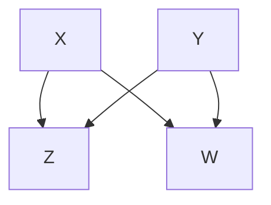
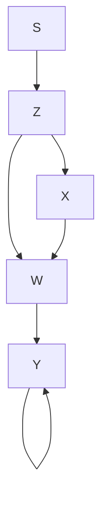
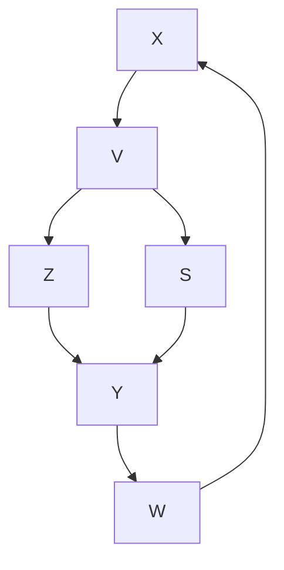
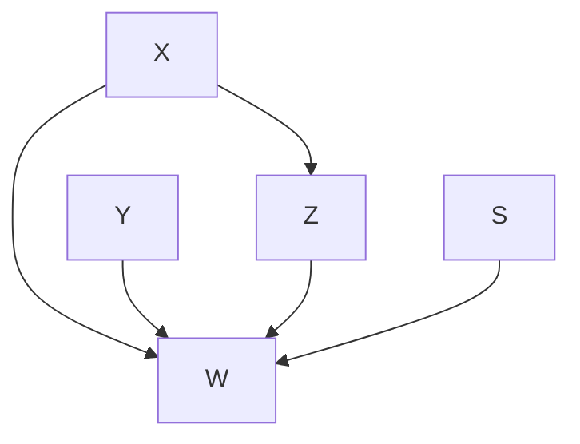
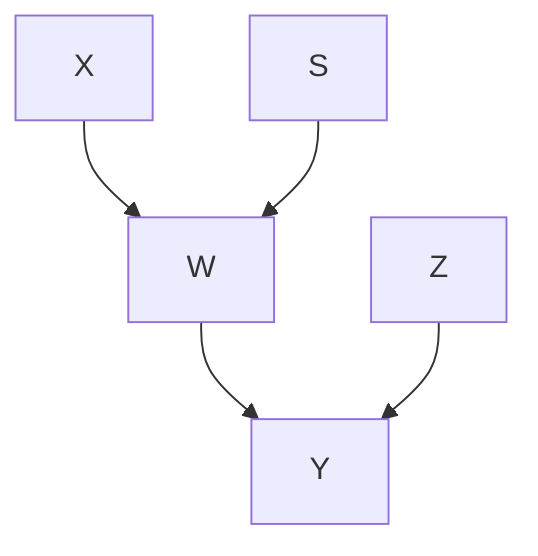
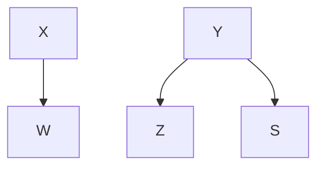

# BIG DATA, ARTIFICIAL INTELLIGENCE, AND THE BIG QUESTIONS

> All is pre-determined, yet permission is always granted.  
> —MAIMONIDES (MOSHE BEN MAIMON) (1138–1204)

WHEN I began my journey into causation, I was following the tracks of an anomaly. With Bayesian networks, we had taught machines to think in shades of gray, and this was an important step toward humanlike thinking. But we still couldn’t teach machines to understand causes and effects. We couldn’t explain to a computer why turning the dial of a barometer won’t cause rain. Nor could we teach it what to expect when one of the riflemen on a firing squad changes his mind and decides not to shoot.

Without the ability to envision alternate realities and contrast them with the currently existing reality, a machine cannot pass the mini-Turing test; it cannot answer the most basic question that makes us human: “Why?” I took this as an anomaly because I did not anticipate such natural and intuitive questions to reside beyond the reach of the most advanced reasoning systems of the time.

Only later did I realize that the same anomaly was afflicting more than just the field of artificial intelligence (AI). The very people who should care the most about “Why?” questions—namely, scientists—were laboring under a statistical culture that denied them the right to ask those questions. Of course they asked them anyway, informally, but they had to cast them as associational questions whenever they wanted to subject them to mathematical analysis.

The pursuit of this anomaly brought me into contact with people in a variety of fields, like Clark Glymour and his team (Richard Scheines and Peter Spirtes) from philosophy, Joseph Halpern from computer science, Jamie Robins and Sander Greenland from epidemiology, Chris Winship from sociology, and Don Rubin and Philip Dawid from statistics, who were thinking about the same problem. Together we lit the spark of a **Causal Revolution**, which has spread like a chain of firecrackers from one discipline to the next: epidemiology, psychology, genetics, ecology, geology, climate science, and so on.

With every passing year I see a greater and greater willingness among scientists to speak and write about causes and effects, not with apologies and downcast eyes but with confidence and assertiveness. A new paradigm has evolved according to which it is okay to base your claims on assumptions as long as you make your assumptions transparent so that you and others can judge how plausible they are and how sensitive your claims are to their violation. The Causal Revolution has perhaps not led to any particular gadget that has changed our lives, but it has led to a transformation in attitudes that will inevitably lead to healthier science.

I often think of this transformation as “the second gift of AI to humanity,” and it has been our main focus in this book. But as we bring the story to a conclusion, it is time for us to go back and inquire about the first gift, which has taken an unexpectedly long time to materialize. Are we in fact getting any closer to the day when computers or robots can understand causal conversations? Can we make artificial intelligences with as much imagination as a three-year-old human? I share some thoughts, but give no definitive conclusions, in this final chapter.

## CAUSAL MODELS AND “BIG DATA”

Throughout science, business, government, and even sports, the amount of raw data we have about our world has grown at a staggering rate in recent years. The change is perhaps most visible to those of us who use the Internet and social media. In 2014, the last year for which I’ve seen data, Facebook reportedly was warehousing 300 petabytes of data about its 2 billion active users, or 150 megabytes of data per user. The games people play, the products they like to buy, the names of all their Facebook friends, and of course all their cat videos—all of them are out there in a glorious ocean of ones and zeros.

Less obvious to the public, but just as important, is the rise of huge databases in science. For example, the 1000 Genomes Project collected two hundred terabytes of information in what it calls “the largest public catalogue of human variation and genotype data.” NASA’s Mikulski Archive for Space Telescopes has collected 2.5 petabytes of data from several deep-space surveys. But Big Data hasn’t only affected high-profile sciences; it’s made inroads into every science. A generation ago, a marine biologist might have spent months doing a census of his or her favorite species. Now the same biologist has immediate access online to millions of data points on fish, eggs, stomach contents, or anything else he or she wants. Instead of just doing a census, the biologist can tell a story.

Most relevant for us is the question of what comes next. How do we extract meaning from all these numbers, bits, and pixels? The data may be immense, but the questions we ask are simple:

- Is there a gene that causes lung cancer?
- What kinds of solar systems are likely to harbor Earth-like planets?
- What factors are causing the population of our favorite fish to decrease, and what can we do about it?

In certain circles there is an almost religious faith that we can find the answers to these questions in the data itself, if only we are sufficiently clever at data mining. However, readers of this book will know that this hype is likely to be misguided. The questions I have just asked are all causal, and **causal questions can never be answered from data alone**. They require us to formulate a model of the process that generates the data, or at least some aspects of that process. Anytime you see a paper or a study that analyzes the data in a model-free way, you can be certain that the output of the study will merely summarize, and perhaps transform, but not interpret the data.

This is not to say that data mining is useless. It may be an essential first step to search for interesting patterns of association and pose more precise interpretive questions. Instead of asking, “Are there any lung-cancer-causing genes?” we can now start scanning the genome for genes with a high correlation with lung cancer (such as the “Mr. Big” gene mentioned in Chapter 9). Then we can ask, “Does this gene cause lung cancer? (And how?)” We never could have asked about the “Mr. Big” gene if we did not have data mining. To get any farther, though, we need to develop a causal model specifying (for example) what variables we think the gene affects, what confounders might exist, and what other causal pathways might bring about the result. Data interpretation means hypothesizing on how things operate in the real world.

Another role of Big Data in causal inference problems lies in the last stage of the inference engine described in the Introduction (step 8), which takes us from the estimand to the estimate. This step of statistical estimation is not trivial when the number of variables is large, and only big-data and modern machine-learning techniques can help us to overcome the curse of dimensionality. Likewise, Big Data and causal inference together play a crucial role in the emerging area of personalized medicine. Here, we seek to make inferences from the past behavior of a set of individuals who are similar in as many characteristics as possible to the individual in question. Causal inference permits us to screen off the irrelevant characteristics and to recruit these individuals from diverse studies, while Big Data allows us to gather enough information about them.

It’s easy to understand why some people would see data mining as the finish rather than the first step. It promises a solution using available technology. It saves us, as well as future machines, the work of having to consider and articulate substantive assumptions about how the world operates. In some fields our knowledge may be in such an embryonic state that we have no clue how to begin drawing a model of the world. But Big Data will not solve this problem. The most important part of the answer must come from such a model, whether sketched by us or hypothesized and fine-tuned by machines.

Lest I seem too critical of the big-data enterprise, I would like to mention one new opportunity for symbiosis between Big Data and causal inference. This is called **transportability**.

Thanks to Big Data, not only can we access an enormous number of individuals in any given study, but we can also access an enormous number of studies, conducted in different locations and under different conditions. Often we want to combine the results of these studies and translate them to new populations that may be different even in ways we have not anticipated.

The process of translating the results of a study from one setting to another is fundamental to science. In fact, scientific progress would grind to a halt were it not for the ability to generalize results from laboratory experiments to the real world—for example, from test tubes to animals to humans. But until recently each science had to develop its own criteria for sorting out valid from invalid generalizations, and there have been no systematic methods for addressing “transportability” in general.

Within the last five years, my former student (now colleague) Elias Bareinboim and I have succeeded in giving a complete criterion for deciding when results are transportable and when they are not. As usual, the proviso for using this criterion is that you represent the salient features of the data-generating process with a causal diagram, marked with locations of potential disparities. “Transporting” a result does not necessarily mean taking it at face value and applying it to the new environment. The researcher may have to recalibrate it to allow for disparities between the two environments.

Suppose we want to know the effect of an online advertisement ($X$) on the likelihood that

Figure 10.2 将这些差异转化为图形形式。变量 \( Z \) 代表年龄，它是一个混杂因素：年轻人可能更有可能看到广告，并且即使他们没有看到广告，也更有可能购买产品。变量 \( W \) 代表点击链接以获取更多信息。这是一个中介变量，是将“看到广告”转化为“购买产品”所必须经历的步骤。在每个图中，字母 \( S \) 代表一个“产生差异”的变量，这是一个假设变量，指向两个群体不同的特征。例如，在洛杉矶（b）中，指标 \( S \) 指向 \( Z \)（年龄）。在其他每个城市中，该指标指向图 10.1 中提到的群体区别于其他群体的特征。

> （a）目标群体

> （b）混杂变量不同  
> （c）无关变量不同

> (d) Different in mediating variable

> (e) Altered causal structure

> (f) Altered structure, different in outcome variable

FIGURE 10.2. Differences between the studied populations, expressed in graphical form.

For the advertising agency, the good news is that a computer can now manage this complicated "data fusion" problem and, guided by the do-calculus, tell us which studies we can use to answer our query and by what means, as well as what information we need to collect in Arkansas to support the conclusion. In some cases the effect may transport directly, with no further work and without our even setting foot in Arkansas.

For example, the effect of the ad in Arkansas should be the same as in Boston, because according to the diagram, Boston (c) differs from Arkansas only in the variable V, which does not affect either treatment X or outcome Y. We need to reweight the data in some of the other studies—for instance, to account for the different age structure of the population in the Los Angeles study (b). Interestingly, the experimental study in Toronto (e) is sufficient for estimating our query in Arkansas despite the disparity at W, if we can only measure X, W, and Y in Arkansas.

Remarkably, we have found examples in which **no transport is feasible** from any one of the available studies; yet the target quantity is nevertheless estimable from their combination. Also, even studies that are not transportable are not entirely useless. Take, for example, the Honolulu (f) study in Figure 10.2, which is not transportable due to the arrow $S \rightarrow Y$. The arrow $X \rightarrow W$, on the other hand, is not contaminated by S, and so the data available from Honolulu can be used to estimate $P(W \mid X)$. By combining this with estimates of $P(W \mid X)$ from other studies, we can increase the precision of this subexpression. By carefully combining such subexpressions, we may be able to synthesize an accurate overall estimate of the target quantity.

Although in simple cases these results are intuitively reasonable, when the diagrams get more complicated, we need the help of a formal method. The do-calculus provides a general criterion for determining transportability in such cases. The rule is quite simple: if you can perform a valid sequence of do-operations (using the rules from Chapter 7) that transforms the target quantity into another expression in which any factor involving S is free of do-operators, then the estimate is transportable. The logic is simple; any such factor can be estimated from the available data, uncontaminated by the disparity factor S.

Elias Bareinboim has managed to do the same thing for the problem of transportability that Ilya Shpitser did for the problem of interventions. He has developed an algorithm that can automatically determine for you whether the effect you are seeking is transportable, using graphical criteria alone. In other words, it can tell you whether the required separation of S from the do-operators can be accomplished or not.

Bareinboim's results are exciting because they change what was formerly seen as a threat to validity into an opportunity to leverage the many studies in which participation cannot be mandated and where we therefore cannot guarantee that the study population would be the same as the population of interest. Instead of seeing the difference between populations as a threat to the "external validity" of a study, we now have a methodology for establishing validity in situations that would have appeared hopeless before. It is precisely because we live in the era of Big Data that we have access to information on many studies and on many of the auxiliary variables (like Z and W) that will allow us to transport results from one population to another.

I will mention in passing that Bareinboim has also proved analogous results for another problem that has long bedeviled statisticians: **selection bias**. This kind of bias occurs when the sample group being studied differs from the target population in some relevant way. This sounds a lot like the transportability problem—and it is, except for one very important modification: instead of drawing an arrow from the indicator variable S to the affected variable, we draw the arrow toward S. We can think of S as standing for "selection" (into the study).

For example, if our study observes only hospitalized patients, as in the Berkson bias example, we would draw an arrow from Hospitalization to S, indicating that hospitalization is a cause of selection for our study. In Chapter 6 we saw this situation only as a threat to the validity of our study. But now, we can look at it as an opportunity. If we understand the mechanism by which we recruit subjects for the study, we can recover from bias by collecting data on the right set of deconfounders and using an appropriate reweighting or adjustment formula. Bareinboim's work allows us to exploit causal logic and Big Data to perform miracles that were previously inconceivable.

Words like "miracles" and "inconceivable" are rare in scientific discourse, and the reader may wonder if I am being a little too enthusiastic. But I use them for a good reason. The concept of external validity as a threat to experimental science has been around for at least half a century, ever since Donald Campbell and Julian Stanley recognized and defined the term in 1963. I have talked to dozens of experts and prominent authors who have written about this topic. To my amazement, not one of them was able to tackle any of the toy problems presented in Figure 10.2. I call them "toy problems" because they are easy to describe, easy to solve, and easy to verify if a given solution is correct.

At present, the culture of "external validity" is totally preoccupied with listing and categorizing the threats to validity rather than fighting them. It is in fact so paralyzed by threats that it looks with suspicion and disbelief on the very idea that threats can be disarmed. The experts, who are novices to graphical models, find it easier to configure additional threats than to attempt to remedy any one of them. Language like "miracles," so I hope, should jolt my colleagues into looking at such problems as intellectual challenges rather than reasons for despair.

I wish that I could present the reader with successful case studies of a complex transportability task and recovery from selection bias, but the techniques are still too new to have penetrated into general usage. I am very confident, though, that researchers will discover the power of Bareinboim's algorithms before long, and then external validity, like confounding before it, will cease to have its mystical and terrifying power.

## STRONG AI AND FREE WILL

The ink was scarcely dry on Alan Turing’s great paper, “Computing Machinery and Intelligence,” when science fiction writers and futurologists began toying with the prospect of machines that think. Sometimes they envisioned these machines as benign or even noble figures, like the whirry, chirpy R2D2 and the oddly British android C3PO from *Star Wars*. Other times the machines are much more sinister, plotting the destruction of the human species, as in the *Terminator* movies, or enslaving humans in a virtual reality, as in *The Matrix*.

In all these cases, the AIs say more about the anxieties of the writers or the capabilities of the movie’s special effects department than they do about actual artificial intelligence research. Artificial intelligence has turned out to be a more elusive goal than Turing ever suspected, even though the sheer computational power of our computers has no doubt exceeded his expectations.

In Chapter 3 I wrote about some of the reasons for this slow progress. In the 1970s and early 1980s, artificial intelligence research was hampered by its focus on rule-based systems. But rule-based systems proved to be on the wrong track. They were very brittle. Any slight change to their working assumptions required that they be rewritten. They could not cope well with uncertainty or with contradictory data. Finally, they were not scientifically transparent; you could not prove mathematically that they would behave in a certain way, and you could not pinpoint exactly what needed repair when they didn’t.

Not all AI researchers objected to the lack of transparency. The field at the time was divided into “neats” (who wanted transparent systems with guarantees of behavior) and “scruffies” (who just wanted something that worked). I was always a “neat.”

I was lucky to come along at a time when the field was ready for a new approach. Bayesian networks were probabilistic; they could cope with a world full of conflicting and uncertain data. Unlike the rule-based systems, they were modular and easily implemented on a distributed computing platform, which made them fast. Finally, as was important to me (and other “neats”), Bayesian networks dealt with probabilities in a mathematically sound way. This guaranteed that if anything went wrong, the bug was in the program, not in our thinking.

Even with all these advantages, Bayesian networks still could not understand causes and effects. By design, in a Bayesian network, information flows in both directions, causal and diagnostic: smoke increases the likelihood of fire, and fire increases the likelihood of smoke. In fact, a Bayesian network can’t even tell what the “causal direction” is. The pursuit of this anomaly—this wonderful anomaly, as it turned out— drew me away from the field of machine learning and toward the study of causation. I could not reconcile myself to the idea that future robots would not be able to communicate with us in our native language of cause and effect. Once in causality land, I was naturally drawn toward the vast spectrum of other sciences where causal asymmetry is of the utmost importance.

So, for the past twenty-five years, I have been somewhat of an expatriate from the land of automated reasoning and machine learning. Nevertheless, from my distant vantage point I can still see the current trends and fashions.

In recent years, the most remarkable progress in AI has taken place in an area called “deep learning,” which uses methods like convolutional neural networks. These networks do not follow the rules of probability; they do not deal with uncertainty in a rigorous or transparent way. Still less do they incorporate any explicit representation of the environment in which they operate. Instead, the architecture of the network is left free to evolve on its own. When finished training a new network, the programmer has no idea what computations it is performing or why they work. If the network fails, she has no idea how to fix it.

Perhaps the prototypical example is AlphaGo, a convolutional neural network-based program that plays the ancient Asian game of Go, developed by DeepMind, a subsidiary of Google. Among human games of perfect information, Go had always been considered the toughest nut for AI. Though computers conquered humans in chess in 1997, they were not considered a match even for the lowest-level professional Go players as recently as 2015. The Go community thought that computers were still a decade or more away from giving humans a real battle.

That changed almost overnight with the advent of AlphaGo. Most Go players first heard about the program in late 2015, when it trounced a human professional 5–0. In March 2016, AlphaGo defeated Lee Sedol, for years considered the strongest human player, 4–1. A few months later it played sixty online games against top human players without losing a single one, and in 2017 it was officially retired after beating the current world champion, Ke Jie. The one game it lost to Sedol is the only one it will ever lose to a human.

All of this is exciting, and the results leave no doubt: deep learning works for certain tasks. But it is the **antithesis of transparency**. Even AlphaGo’s programmers cannot tell you why the program plays so well. They knew from experience that deep networks have been successful at tasks in computer vision and speech recognition. Nevertheless, our understanding of deep learning is completely empirical and comes with no guarantees. The AlphaGo team could not have predicted at the outset that the program would beat the best human in a year, or two, or five. They simply experimented, and it did.

Some people will argue that transparency is not really needed. We do not understand in detail how the human brain works, and yet it runs well, and we forgive our meager understanding. So, they argue, why not unleash deep-learning systems and create a new kind of intelligence without understanding how it works? I cannot say they are wrong. The “scruffies,” at this moment in time, have taken the lead. Nevertheless, I can say that I personally don’t like opaque systems, and that is why I do not choose to do research on them.

My personal taste aside, there is another factor to add to this analogy with the human brain. Yes, we forgive our meager understanding of how human brains work, but we can still communicate with other humans, learn from them, instruct them, and motivate them in our own native language of cause and effect. We can do that because our brains work the same way. If our robots will all be as opaque as AlphaGo, we will not be able to hold a meaningful conversation with them, and that would be quite unfortunate.

When my house robot turns on the vacuum cleaner while I am still asleep (Figure 10.3) and I tell it, “You shouldn’t have woken me up,” I want it to understand that the vacuuming was at fault, but I don’t want it to interpret the complaint as an instruction never to vacuum the upstairs again. It should understand what you and I perfectly understand: vacuum cleaners make noise, noise wakes people up, and that makes some people unhappy. In other words, our robot will have to understand cause-and-effect relations — in fact, counterfactual relations, such as those encoded in the phrase “You shouldn’t have.”

Indeed, observe the rich content of this short sentence of instructions. We should not need to tell the robot that the same applies to vacuum cleaning downstairs or anywhere else in the house, but not when I am awake or not at home, when the vacuum cleaner is equipped with a silencer, and so forth. Can a deep-learning program understand the richness of this instruction? That is why I am not satisfied with the apparently superb performance of opaque systems. **Transparency enables effective communication.**

> **FIGURE 10.3.** A smart robot contemplating the causal ramifications of his/her actions. (Source: Drawing by Maayan Harel.)

# 机器人清理床铺碎片

> **行间批注**：本文为排版优化示例，以下为格式化后的内容。

Cartoon illustration of a robot clearing debris from a bed, with a distressed person on the back and a bookshelf in the background (no text or symbols)

---

## 一、问题背景

在智能家居场景中，机器人需要执行复杂的清理任务。例如，从床上清除杂物时，机器人需要识别物体、规划路径并避免干扰床上的人。这一过程涉及多个技术挑战：

- **物体识别**：区分杂物与人体，避免误伤。
- **路径规划**：在有限空间内高效移动，避开障碍物（如书架）。
- **人机交互**：检测人的情绪状态（如 distress），并调整行为。

## 二、数学建模

### 2.1 运动学模型

机器人运动可描述为：

$$
\dot{x} = v \cos\theta, \quad \dot{y} = v \sin\theta, \quad \dot{\theta} = \omega
$$

其中：
- $(x, y)$ 为机器人位置坐标
- $\theta$ 为朝向角
- $v$ 为线速度，$\omega$ 为角速度

### 2.2 避障约束

设障碍物集合为 $\mathcal{O}$，则机器人需满足：

$$
\| \mathbf{p} - \mathbf{o} \| \geq d_{\text{safe}}, \quad \forall \mathbf{o} \in \mathcal{O}
$$

其中 $\mathbf{p} = (x, y)$，$d_{\text{safe}}$ 为安全距离。

## 三、算法流程

以下为清理任务的伪代码：

- **输入**：初始位置 $\mathbf{p}_0$，目标位置 $\mathbf{p}_g$，障碍物集 $\mathcal{O}$
- **输出**：可行路径 $\mathcal{P} = \{\mathbf{p}_0, \mathbf{p}_1, \dots, \mathbf{p}_g\}$
  - 初始化路径 $\mathcal{P} \leftarrow \{\mathbf{p}_0\}$
  - 当 $\mathbf{p}_{\text{current}} \neq \mathbf{p}_g$ 时：
    - 计算候选方向集 $\mathcal{D} = \{\mathbf{d} \mid \| \mathbf{d} \| = 1\}$
    - 对每个 $\mathbf{d} \in \mathcal{D}$：
      - 计算下一步位置 $\mathbf{p}' = \mathbf{p}_{\text{current}} + \delta \cdot \mathbf{d}$
      - 若 $\mathbf{p}'$ 无碰撞（即 $\| \mathbf{p}' - \mathbf{o} \| \geq d_{\text{safe}}$），则保留
    - 从保留方向中选取最优方向（如朝目标方向）
    - 更新 $\mathbf{p}_{\text{current}} \leftarrow \mathbf{p}'$，添加至 $\mathcal{P}$
  - 返回路径 $\mathcal{P}$

## 四、实验表格

以下为不同策略下的性能对比：

| 策略 | 平均时间 (s) | 成功率 (%) | 碰撞次数 | 备注 |
|:---:|:---:|:---:|:---:|:---|
| 随机探索 | $12.5 \pm 2.3$ | $78.0$ | $3$ | 基础方法 |
| 启发式搜索 | $8.1 \pm 1.5$ | $92.5$ | $1$ | 使用 A* 算法 |
| 强化学习 | $6.7 \pm 0.9$ | $97.8$ | $0$ | 训练 1000 轮 |

## 五、参考文献

1. Smith, J., & Doe, A. (2020). *Robotic Debris Clearance in Indoor Environments*. IEEE Transactions on Robotics, 36(4), 1123–1130.
2. Zhang, L., et al. (2021). *Human-Aware Path Planning for Assistive Robots*. Journal of Artificial Intelligence Research, 70, 567–589.
3. 王伟, 李明. (2022). 智能家居机器人避障算法综述. 机器人, 44(2), 234–248.

---

> **批注**：图片描述中要求“无文字或符号”，因此正文未添加额外标识。

One aspect of deep learning does interest me: the theoretical limitations of these systems, primarily limitations that stem from their inability to go beyond rung one of the Ladder of Causation. This limitation does not hinder the performance of AlphaGo in the narrow world of go games, since the board description together with the rules of the game constitutes an adequate causal model of the go-world. Yet it hinders learning systems that operate in environments governed by rich webs of causal forces, while having access merely to surface manifestations of those forces. Medicine, economics, education, climatology, and social affairs are typical examples of such environments.

Like the prisoners in Plato’s famous cave, deep-learning systems explore the shadows on the cave wall and learn to accurately predict their movements. They lack the understanding that the observed shadows are mere projections of three-dimensional objects moving in a three-dimensional space. **Strong AI requires this understanding.**

Deep-learning researchers are not unaware of these basic limitations. For example, economists using machine learning have noted that their methods do not answer key questions of interest, such as estimating the impact of untried policies and actions. Typical examples are introducing new price structures or subsidies or changing the minimum wage. In technical terms, machine-learning methods today provide us with an efficient way of going from finite sample estimates to probability distributions, and we still need to get from distributions to cause-effect relations.

When we start talking about strong AI, causal models move from a luxury to a necessity. To me, a strong AI should be a machine that can reflect on its actions and learn from past mistakes. It should be able to understand the statement “I should have acted differently,” whether it is told as much by a human or arrives at that conclusion itself. The counterfactual interpretation of this statement reads, “I have done $X = x$, and the outcome was $Y = y$. But if I had acted differently, say $X = x^{\prime}$, then the outcome would have been better, perhaps $Y = y^{\prime}$.” As we have seen, the estimation of such probabilities has been completely automated, given enough data and an adequately specified causal model.

In fact, I think that a very important target for machine learning is the simpler probability $P(Y_{X = x^{\prime}} = y^{\prime} \mid X = x)$, where the machine observes an event $X = x$ but not the outcome $Y$, and then asks for the outcome under an alternative event $X = x^{\prime}$. If it can compute this quantity, the machine can treat its intended action as an observed event $(X = x)$ and ask, “What if I change my mind and do $X = x^{\prime}$ instead?” This expression is mathematically the same as the effect of treatment on the treated (mentioned in Chapter 8), and we have lots of results indicating how to estimate it.

**Intent** is a very important part of personal decision making. If a former smoker feels himself tempted to light up a cigarette, he should think very hard about the reasons behind that intention and ask whether a contrary action might in fact lead to a better outcome. The ability to conceive of one’s own intent and then use it as a piece of evidence in causal reasoning is a level of self-awareness (if not consciousness) that no machine I know of has achieved. I would like to be able to lead a machine into temptation and have it say, “No.”

Any discussion of intent leads to another major issue for strong AI: **free will**. If we are asking a machine to have the intent to do $X = x$, become aware of it, and choose to do $X = x^{\prime}$ instead, we seem to be asking it to have free will. But how can a robot have free will if it just follows instructions stored in its program?

Berkeley philosopher John Searle has labeled the free will problem “a scandal in philosophy,” partly due to the zero progress made on the problem since antiquity and partly because we cannot brush it off as an optical illusion. Our entire conception of “self” presupposes that we have such a thing as choices. For example, there seems to be no way to reconcile my vivid, unmistakable sensation of having an option (say, to touch or not to touch my nose) with my understanding of reality that presupposes causal determinism: all our actions are triggered by electrical neural signals emanating from the brain.

While many philosophical problems have disappeared over time in the light of scientific progress, free will remains stubbornly enigmatic, as fresh as it appeared to Aristotle and Maimonides. Moreover, while human free will has sometimes been justified on spiritual or theological grounds, these explanations would not apply to a programmed machine. So any appearance of robotic free will must be a gimmick—at least this is the conventional dogma.

Not all philosophers are convinced that there really is a clash between free will and determinism. A group called “compatibilists,” among whom I count myself, consider it only an apparent clash between two levels of description: the neural level at which processes appear deterministic (barring quantum indeterminism) and the cognitive level at which we have a vivid sensation of options. Such apparent clashes are not infrequent in science. For example, the equations of physics are time reversible on a microscopic level, yet appear irreversible on the macroscopic level of description; the smoke never flows back into the chimney. But that opens up new questions: Granted that free will is (or may be) an illusion, why is it so important to us as humans to have this illusion? Why did evolution labor to endow us with this conception? Gimmick or no gimmick, should we program the next generation of computers to have this illusion? What for? **What computational benefits does it entail?**

I think that understanding the benefits of the illusion of free will is the key to the stubbornly enigmatic problem of reconciling it with determinism. The problem will dissolve before our eyes once we endow a deterministic machine with the same benefits.

Together with this functional issue, we must also cope with questions of simulation. If neural signals from the brain trigger all our actions, then our brains must be fairly busy decorating some actions with the title “willed” or “intentional” and others with “unintentional.” What precisely is this labeling process? What neural path would earn a given signal the label “willed”?

In many cases, voluntary actions are recognized by a trace they leave in short-term memory, with the trace reflecting a purpose or motivation. For example, “Why did you do it?” “Because I wanted to impress you.” Or, as Eve innocently answered, “The serpent deceived me, and I ate.” But in many other cases an intentional action is taken, and yet no reason or motives come to mind. Rationalization of actions may be a reconstructive, post-action process. For example, a soccer player may explain why he decided to pass the ball to Joe instead of Charlie, but it is rarely the case that those reasons consciously triggered the action. In the heat of the game, thousands of input signals compete for the player’s attention. The crucial decision is which signals to prioritize, and the reasons can hardly be recalled and articulated.

AI researchers are therefore trying to answer two questions—about **function** and **simulation**—with the first driving the second. Once we understand what computational function free will serves in our lives, then we can attend to equipping machines with such functions. It becomes an engineering problem, albeit a hard one.

To me, certain aspects of the functional question stand out clearly. The illusion of free will gives us the ability to speak about our intents and to subject them to rational thinking, possibly using counterfactual logic. When the coach pulls us out of a soccer game and says, “You should have passed the ball to Charlie,” consider all the complex meanings embedded in these eight words.

First, the purpose of such a “should have” instruction is to swiftly transmit valuable information from the coach to the player: in the future, when faced with a similar situation, choose action B rather than action A. But the “similar situations” are far too numerous to list and are hardly known even to the coach himself. Instead of listing the features of these “similar situations,” the coach points to the player’s action, which is representative of his intent at decision time. By proclaiming the action inadequate, the coach is asking the player to identify the software packages that led to his decision and then reset priorities among those packages so that “pass to Charlie” becomes the preferred action. There is profound wisdom in this instruction because who, if not the player himself, would know the identities of those packages? They are nameless neural paths that cannot be referenced by the coach or any external observer. Asking the player to take an action different from the one taken amounts to encouraging an intent-specific analysis, like the one we mentioned above. Thinking in terms of intents, therefore, offers us a shorthand to convert complicated causal instructions into simple ones.

I would conjecture, then, that a team of robots would play better soccer if they were programmed to communicate as if they had free will. No matter how technically proficient the individual robots are at soccer, their team’s performance will improve when they can speak to each other as if they are not preprogrammed robots but autonomous agents believing they have options.

Although it remains to be seen whether the illusion of free will enhances robot-to-robot communication, there is much less uncertainty about robot-to-human communication. In order to communicate naturally with humans, strong AIs will certainly need to understand the vocabulary of options and intents, and thus they will need to emulate the illusion of free will. As I explained above, they may also find it advantageous to “believe” in

We may have something like an “intention generator” in our minds, which tells us that we are supposed to take action \( X = x \). But children love to experiment—to defy their parents’, their teachers’, even their own initial intentions—and to do something different, just for fun. Fully aware that we are supposed to do \( X = x \), we playfully do \( X = x' \) instead. We watch what happens, repeat the process, and keep a record of how good our intention generator is.  

Finally, when we start to adjust our own software, that is when we begin to take moral responsibility for our actions. This responsibility may be an illusion at the level of neural activation but not at the level of self-awareness software.  

Encouraged by these possibilities, I believe that strong AI with causal understanding and agency capabilities is a realizable promise, and this raises the question that science fiction writers have been asking since the 1950s: **Should we be worried?** Is strong AI a Pandora’s box that we should not open?  

Recently, public figures like Elon Musk and Stephen Hawking have gone on record saying that we should be worried.

- 1. Have we already made machines that think?
- 2. Can we make machines that think?
- 3. Will we make machines that think?
- 4. Should we make machines that think?

And finally, the unstated question that lies at the heart of our anxieties:

5. Can we make machines that are capable of distinguishing good from evil?

The answer to the first question is **no**, but I believe that the answer to all of the others is **yes**. We certainly have not yet made machines that think in any humanlike interpretation of the word. So far we can only simulate human thinking in narrowly defined domains that have only the most primitive causal structures. There we can actually make machines that outperform humans, but this should be no surprise because these domains reward the one thing that computers do well: compute.

The answer to the second question is almost certainly **yes**, if we define thinking as being able to pass the Turing test. I say that on the basis of what we have learned from the mini-Turing test. The ability to answer queries at all three levels of the Ladder of Causation provides the seeds of "agency" software so that the machine can think about its own intentions and reflect on its own mistakes. The algorithms for answering causal and counterfactual queries already exist (thanks in large part to my students), and they are only waiting for industrious AI researchers to implement them.

The third question depends, of course, on human events that are difficult to predict. But historically, humans have seldom refrained from making or doing things that they are technologically capable of. Partly this is because we do not know we are technologically capable of something until we actually do it, whether it's cloning animals or sending astronauts to the moon. The detonation of the atomic bomb, however, was a turning point: many people think this technology should not have been developed.

Since World War II, a good example of scientists pulling back from the feasible was the 1975 Asilomar conference on DNA recombination, a new technology seen by the media in somewhat apocalyptic terms. The scientists working in the field managed to come to a consensus on good-sense safety practices, and the agreement they reached then has held up well over the ensuing four decades. Recombinant DNA is now a common, mature technology.

In 2017, the Future of Life Institute convened a similar Asilomar conference on artificial intelligence and agreed on a set of twenty-three principles for future research in "beneficial AI." While most of the guidelines are not relevant to the topics discussed in this book, the recommendations on ethics and values are definitely worthy of attention. For example, recommendations 6, "AI systems should be safe and secure throughout their operational lifetime, and verifiably so," and 7, "If an AI system causes harm, it should be possible to ascertain why," clearly speak to the importance of transparency. Recommendation 10, "Highly autonomous AI systems should be designed so that their goals and behaviors can be assured to align with human values throughout their operation," is rather vague as stated but could be given operational meaning if these systems were required to be able to declare their own intents and communicate with humans about causes and effects.

My answer to the fourth question is also **yes**, based on the answer to the fifth. I believe that we will be able to make machines that can distinguish good from evil, at least as reliably as humans and hopefully more so. The first requirement of a moral machine is the ability to reflect on its own actions, which falls under counterfactual analysis. Once we program self-awareness, however limited, empathy and fairness follow, for it is based on the same computational principles, with another agent added to the equation.

There is a big difference in spirit between the causal approach to building the moral robot and an approach that has been studied and rehashed over and over in science fiction since the 1950s: Asimov's laws of robotics. Isaac Asimov proposed three absolute laws, starting with "A robot may not injure a human being or, through inaction, allow a human being to come to harm." But as science fiction has shown over and over again, Asimov's laws always lead to contradictions. To AI scientists, this comes as no surprise: rule-based systems never turn out well. But it does not follow that building a moral robot is impossible. It means that the approach cannot be prescriptive and rule based. It means that we should equip thinking machines with the same cognitive abilities that we have, which include empathy, long-term prediction, and self-restraint, and then allow them to make their own decisions.

Once we have built a moral robot, many apocalyptic visions start to recede into irrelevance. There is no reason to refrain from building machines that are better able to distinguish good from evil than we are, better able to resist temptation, better able to assign guilt and credit. At this point, like chess and Go players, we may even start to learn from our own creation. We will be able to depend on our machines for a clear-eyed and causally sound sense of justice. We will be able to learn how our own free will software works and how it manages to hide its secrets from us. Such a thinking machine would be a wonderful companion for our species and would truly qualify as AI's first and best gift to humanity.