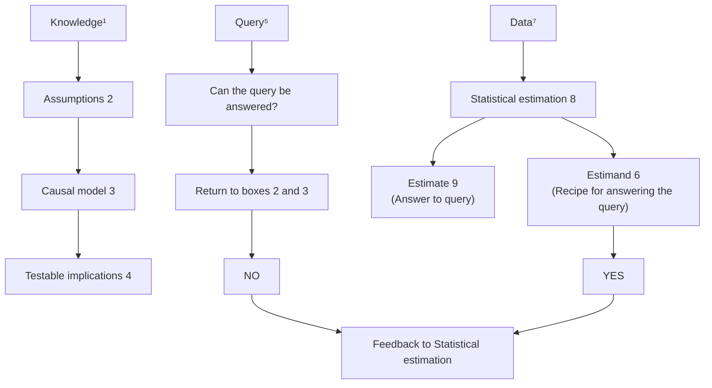

# 原因之书（THE BOOK OF WHY）

因果关系的全新科学（THE NEW SCIENCE OF CAUSE AND EFFECT）

## 版权信息（Copyright）

版权所有 © 2018 朱迪亚·珀尔（Judea Pearl）与达纳·麦肯齐（Dana Mackenzie）。Hachette Book Group 支持言论自由和版权的价值。版权的目的在于鼓励作家和艺术家创作出丰富我们文化的创意作品。未经许可扫描、上传和分发本书是对作者知识产权的盗窃。如果您希望使用本书中的材料（非用于评论目的），请联系 permissions@hbgusa.com。感谢您对作者权利的支持。

Basic Books  
Hachette Book Group  
1290 Avenue of the Americas, New York, NY 10104  
www.basicbooks.com

第一版：2018年5月

由 Basic Books 出版，该公司是 Perseus Books, LLC 的印记，后者是 Hachette Book Group, Inc. 的子公司。Basic Books 的名称和标志是 Hachette Book Group 的商标。

Hachette Speakers Bureau 为演讲活动提供广泛的作者资源。如需了解更多信息，请访问 www.hachettespeakersbureau.com 或致电 (866) 376-6591。

出版商对非其所有的网站（或其内容）不承担责任。

**美国国会图书馆出版编目数据（Library of Congress Cataloging-in-Publication Data）**

- 姓名：珀尔（Pearl, Judea），作者。| 麦肯齐（Mackenzie, Dana），作者。
- 标题：原因之书：因果关系的全新科学 / 朱迪亚·珀尔与达纳·麦肯齐。
- 描述：纽约：Basic Books，[2018] | 包含参考文献和索引。
- 标识符：LCCN 2017056458（印刷版）| LCCN 2018005510（电子书）| ISBN 9780465097616（电子书）| ISBN 9780465097609（精装版）| ISBN 046509760X（精装版）| ISBN 0465097618（电子书）
- 主题：LCSH：因果关系。| 推理。
- 分类：LCC Q175.32.C38（电子书）| LCC Q175.32.C38 P43 2018（印刷版）| DDC 501—dc23
- LC 记录可查阅 https://lccn.loc.gov/2017056458
- ISBN：978-0-465-09760-9（精装版）；978-0-465-09761-6（电子书）
- E3-20180417-JV-PC


## 前言（PREFACE）

大约二十年前，当我为我的书《因果关系》（*Causality*）（2000年）撰写前言时，我做了一个相当大胆的评论，朋友们建议我措辞缓和一些。

“因果关系经历了一次重大转变，”我写道，“从一个笼罩在神秘中的概念，变成了一个具有明确定义语义和严谨逻辑的数学对象。悖论和争议得到了解决，模糊的概念得到了阐明，那些长期被视为形而上学或难以处理的、依赖因果信息的实际问题，现在可以用初等数学来解决。简而言之，因果关系已经被数学化了。”

今天读这段话，我觉得自己当时有些目光短浅。我称之为“转变”的东西，结果是一场“革命”，它改变了许多科学领域的思维方式。现在许多人称之为“**因果革命（Causal Revolution）**”，它在研究圈中激起的兴奋正蔓延到教育和应用领域。我相信，与更广泛的受众分享它的时机已经成熟。

本书致力于完成一个三管齐下的使命：

- **第一**，用非数学的语言向您阐述因果革命的思想内涵，以及它如何影响我们的生活和我们未来；
- **第二**，与您分享科学家在面对关键的因果问题时所经历的一些英勇旅程，无论是成功的还是失败的；
- **最后**，将因果革命带回它在人工智能中的摇篮，我旨在向您描述如何构建能够用我们的母语——因果关系的语言——进行学习和交流的机器人。

这一新一代机器人应该向我们解释事情为什么会发生，它们为何以那样的方式做出反应，以及自然为何以这种方式而非那种方式运作。更雄心勃勃的是，它们还应该教导我们认识自己：我们的思维为何如此运作，以及理性地思考因果关系、功劳与悔恨、意图与责任意味着什么。

当我写方程式时，我对我的读者有非常清晰的概念。但为普通大众写作对我来说则是一次全新的冒险。奇怪的是，这种新体验却是我一生中最有收获的教育之旅之一。需要用你们的语言来塑造思想，揣摩你们的背景、你们的问题和你们的反应，这比我在写这本书之前所写的所有方程都更能加深我对因果关系的理解。

为此，我将永远感激你们。我希望你们和我一样，对看到结果感到兴奋。

> **朱迪亚·珀尔（Judea Pearl）**  
> 洛杉矶，2017年10月。

## 引言：思维驾驭数据（INTRODUCTION: MIND OVER DATA）

每一门繁荣的科学都依赖于其自身的符号而繁荣。  
——奥古斯都·德·摩根（Augustus De Morgan，1864年）

---

本书讲述了一门科学的故事，这门科学已经改变了我们区分事实与虚构的方式，却一直未引起大众的广泛关注。这门新科学的成果已经影响到我们生活的关键方面，并有潜力影响更多领域，从新药开发到经济政策控制，从教育和机器人技术到枪支管制和全球变暖。

值得注意的是，尽管这些问题领域具有多样性和明显的不通约性，这门新科学却将所有问题都纳入一个统一的框架之下，而这个框架在二十年前几乎不存在。

这门新科学没有花哨的名字：我和许多同事一样，简单地称之为 **“因果推断（causal inference）”** 。它也不是特别高科技。因果推断力求效仿的理想技术存在于我们自己的头脑中。大约几万年前，人类开始意识到某些事物会导致其他事物，并且干预前者可以改变后者。没有其他物种能够理解这一点，至少达不到我们的理解程度。正是从这一发现中，产生了有组织的社会，然后是城镇和城市，最终形成了我们今天所享受的基于科学和技术的文明。这一切都是因为我们问了一个简单的问题：**为什么？**

因果推断就是认真对待这个问题。它假定人脑是有史以来用于管理因果关系的最先进工具。我们的大脑存储了海量的因果知识，辅以数据，我们可以利用这些知识来回答我们这个时代一些最紧迫的问题。

更雄心勃勃的是，一旦我们真正理解了因果思维背后的逻辑，我们就可以在现代计算机上模拟它，并创造一个 **“人工科学家（artificial scientist）”** 。这个智能机器人将发现尚未可知的现象，为悬而未决的科学难题找到解释，设计新的实验，并不断从环境中提取更多的因果知识。

但在我们冒险推测这些未来主义的发展之前，重要的是要理解因果推断迄今为止所取得的成就。我们将探讨它如何改变了几乎所有数据驱动学科中科学家的思维方式，以及它如何即将改变我们的生活。

这门新科学处理的问题看似直截了当，例如：

# 统计推断（Statistical Inference）

- 某种治疗方法在预防疾病方面效果如何？
- 新税法是否导致我们的销售额上升，还是广告活动的作用？
- 肥胖导致的医疗成本是多少？
- 招聘记录能否证明雇主存在性别歧视政策？
- 我即将辞职，应该这样做吗？

## 1.1 统计推断的性质（The Nature of Statistical Inference）

**统计推断（Statistical Inference）**是指：**利用样本数据对总体分布或总体特征进行推断**。  
这是统计学研究的核心问题，也是科学发现、政策评估、商业决策中不可或缺的工具。

> **行间批注**：  
> 上述问题均涉及**因果推断（causal inference）**或**预测性推断（predictive inference）**，属于统计推断的典型应用场景。

统计推断通常分为两大类：

- **参数估计（Parameter Estimation）**：用样本统计量估计总体参数（如均值、方差）。
- **假设检验（Hypothesis Testing）**：对总体参数或分布形式提出假设，并基于样本数据做出接受或拒绝的判断。

### 1.1.1 统计推断的基本步骤（Basic Steps of Statistical Inference）

1. 明确研究问题与总体。
2. 设计抽样方案，收集样本数据。
3. 选择适当的统计模型与推断方法。
4. 计算统计量或检验统计量。
5. 基于概率分布做出推断结论（如置信区间、$p$ 值）。

> **行间批注**：  
> 步骤 4 和 5 通常需要借助数学工具，如**概率分布函数（probability distribution function）**、**大数定律（Law of Large Numbers）**、**中心极限定理（Central Limit Theorem）**等。

### 1.1.2 统计推断的数学基础（Mathematical Foundations of Statistical Inference）

统计推断依赖于概率论，尤其是以下核心定理：

- **大数定律（Law of Large Numbers）**：样本均值依概率收敛于总体均值。
- **中心极限定理（Central Limit Theorem）**：样本均值的分布近似正态分布。

设 $X_1, X_2, \dots, X_n$ 为独立同分布的随机变量，总体均值为 $\mu$，方差为 $\sigma^2$，则样本均值 $\bar{X}$ 满足：

$$
\bar{X} = \frac{1}{n} \sum_{i=1}^n X_i
$$

当 $n$ 足够大时：

$$
\frac{\bar{X} - \mu}{\sigma / \sqrt{n}} \xrightarrow{d} N(0, 1)
$$

> **行间批注**：  
> 中心极限定理保证了即使总体分布未知，样本均值的分布也近似正态，这是许多统计方法的基础。

## 1.2 参数估计（Parameter Estimation）

参数估计的目标是：**利用样本数据估计总体分布中的未知参数**。

### 1.2.1 点估计（Point Estimation）

点估计是给出参数的一个具体数值估计。常用方法包括：

- **矩估计（Method of Moments）**：用样本矩代替总体矩。
- **极大似然估计（Maximum Likelihood Estimation, MLE）**：选择使样本出现概率最大的参数值。

例如，对于正态分布 $N(\mu, \sigma^2)$，样本均值 $\bar{X}$ 是 $\mu$ 的**无偏估计（unbiased estimator）**：

$$
\hat{\mu} = \bar{X}
$$

样本方差 $S^2$ 是 $\sigma^2$ 的无偏估计：

$$
S^2 = \frac{1}{n-1} \sum_{i=1}^n (X_i - \bar{X})^2
$$

> **行间批注**：  
> 无偏性是指估计量的期望等于参数真值，即 $E(\hat{\theta}) = \theta$。

### 1.2.2 区间估计（Interval Estimation）

区间估计给出参数的一个可能范围，并附以**置信水平（confidence level）**。例如，总体均值 $\mu$ 的 $95\%$ 置信区间为：

$$
\left( \bar{X} - z_{\alpha/2} \frac{\sigma}{\sqrt{n}}, \quad \bar{X} + z_{\alpha/2} \frac{\sigma}{\sqrt{n}} \right)
$$

其中 $z_{\alpha/2}$ 是标准正态分布的 $\alpha/2$ 分位数。

> **行间批注**：  
> 置信区间的含义是：重复抽样 $100$ 次，大约有 $95$ 个区间包含参数真值。

## 1.3 假设检验（Hypothesis Testing）

假设检验用于判断关于总体的某种主张是否成立。基本步骤包括：

1. 提出**原假设（null hypothesis）** $H_0$ 和**备择假设（alternative hypothesis）** $H_1$。
2. 选择检验统计量。
3. 确定**显著性水平（significance level）** $\alpha$。
4. 计算检验统计量的值及 $p$ 值。
5. 做出拒绝或不拒绝 $H_0$ 的决策。

### 1.3.1 两类错误（Two Types of Errors）

- **第一类错误（Type I Error）**：拒绝真实的 $H_0$（概率为 $\alpha$）。
- **第二类错误（Type II Error）**：接受错误的 $H_0$（概率为 $\beta$）。

| 决策 \ 真实情况 | $H_0$ 为真 | $H_0$ 为假 |
|----------------|--------------|--------------|
| 拒绝 $H_0$   | 第一类错误   | 正确决策     |
| 不拒绝 $H_0$ | 正确决策     | 第二类错误   |

> **行间批注**：  
> 实际应用中，通常希望同时控制两类错误，但二者存在权衡关系。

### 1.3.2 常见的假设检验（Common Hypothesis Tests）

- **$z$ 检验（z-test）**：用于总体方差已知时的均值检验。
- **$t$ 检验（t-test）**：用于总体方差未知时的均值检验。
- **卡方检验（Chi-square test）**：用于分类变量的独立性检验或拟合优度检验。
- **$F$ 检验（F-test）**：用于方差分析或比较两个总体方差。

例如，单样本 $t$ 检验的统计量为：

$$
t = \frac{\bar{X} - \mu_0}{S / \sqrt{n}} \sim t(n-1)
$$

其中 $\mu_0$ 是原假设下的总体均值。

> **行间批注**：  
> $t$ 分布比正态分布更“厚尾”，适合小样本情形。

## 1.4 参考文献（References）

1. Casella, G., & Berger, R. L. (2002). *Statistical Inference* (2nd ed.). Duxbury Press.
2. Wasserman, L. (2004). *All of Statistics: A Concise Course in Statistical Inference*. Springer.
3. Efron, B., & Hastie, T. (2016). *Computer Age Statistical Inference*. Cambridge University Press.
4. 茆诗松， 程依明， & 濮晓龙. (2011). *概率论与数理统计教程*（第 2 版）. 高等教育出版社.

> **行间批注**：  
> 参考文献中，Casella 和 Berger 的《Statistical Inference》是经典教材，适合深入学习理论推导。

这些问题都有一个共同点：它们关注**因果关系（cause-and-effect relationships）**，这可以通过“预防（preventing）”、“导致（cause）”、“可归因于（attributable to）”、“政策（policy）”以及“我应该（should I）”等词语识别出来。这类词语在日常语言中很常见，我们的社会不断要求回答这类问题。然而，直到最近，科学才给了我们表达这些问题的手段，更不用说回答它们了。

迄今为止，**因果推断（causal inference）** 对人类最重要的贡献就是使这种科学忽视成为过去。这门新科学催生了一种简单的数学语言，用以表达我们已知的以及我们希望发现的因果关系。将这种信息以数学形式表达出来的能力，释放了大量强大而有原则的方法，用于将我们的知识与数据相结合，并回答像上述五个问题那样的因果问题。

我很幸运能够在过去的二十五年里成为这一科学发展的一部分。我在学生的工作间和研究实验室里目睹了它的进展，并在远离公众关注焦点的严肃科学会议上听到了它的突破性成果的回响。如今，当我们进入**强人工智能（strong artificial intelligence, strong AI）** 时代，许多人鼓吹**大数据（Big Data）** 和**深度学习（deep learning）** 的无限可能性时，我认为向读者介绍这门新科学正在采取的一些最冒险的路径、它如何影响数据科学、以及它在二十一世纪将以多种方式改变我们的生活，是适时且令人兴奋的。

当你听到我将这些成就描述为“新科学”时，你可能会持怀疑态度。你甚至可能会问：为什么这没有在很久以前就完成？比如说，当维吉尔首次宣称“能够理解事物原因是幸运的”（公元前29年）的时候？或者当现代统计学的创始人**弗朗西斯·高尔顿（Francis Galton）** 和**卡尔·皮尔逊（Karl Pearson）** 首次发现人口数据可以揭示科学问题的时候？他们在这一关头未能接纳因果关系，其背后有一个漫长的故事，本书的历史章节将会讲述。但我认为，最严重的障碍一直是：我们提出因果问题的词汇与我们交流科学理论的传统词汇之间存在根本性的鸿沟。

要理解这一鸿沟的深度，想象一下科学家在试图表达某些明显的因果关系时会面临的困难——例如，**气压计读数（barometer reading）** $B$ 追踪**大气压（atmospheric pressure）** $P$。我们可以很容易地用方程写下这种关系，例如 $B = kP$，其中 $k$ 是某个比例常数。代数的规则现在允许我们以各种形式重写这个方程，例如 $P = B / k$、$k = B / P$ 或 $B - kP = 0$。它们都表示同一件事——如果我们知道这三个量中的任意两个，第三个就确定了。在数学上，字母 $k$、$B$ 或 $P$ 中没有任何一个比其他的更特殊。那么，我们如何表达我们强烈的信念——是压力导致了气压计的变化，而不是相反？如果我们连这一点都无法表达，我们又怎能希望表达许多其他没有数学公式的因果信念，例如公鸡的啼叫不会导致太阳升起？

我的大学教授们做不到这一点，也从未抱怨过。我敢打赌，你的教授们也从未做到过。我们现在明白了原因：他们从未被展示过一种关于原因的数学语言；他们也从未被展示过它的好处。事实上，科学在这么多代人中忽视了发展这样一种语言，这是对科学的控诉。每个人都知道，拨动开关会导致灯打开或关闭，一个闷热潮湿的夏日午后会导致当地冰淇淋店的销售额上升。那么，为什么科学家们没有像对待光学、力学或几何学的基本定律那样，将这些明显的事实捕捉到公式中呢？为什么他们允许这些事实在赤裸裸的直觉中萎靡不振，被剥夺了使其他科学分支得以蓬勃发展和成熟的数学工具呢？

部分答案是，科学工具是为满足科学需求而开发的。正是因为我们在处理关于开关、冰淇淋和气压计的问题方面如此擅长，我们对处理这些问题的特殊数学机制的需求才不那么明显。但随着科学好奇心的增长，我们开始在复杂的法律、商业、医疗和决策制定情境中提出因果问题，我们发现自己缺乏成熟科学应该提供的工具和原则。

科学中这种迟来的觉醒并不罕见。例如，直到大约四百年前，人们对自己管理日常生活中不确定性的自然能力感到非常满意，从过马路到冒险打架。只有在赌徒发明了复杂的**机会游戏（games of chance）**，有时精心设计以诱骗我们做出错误选择之后，像**布莱兹·帕斯卡（Blaise Pascal）**（1654年）、**皮埃尔·德·费马（Pierre de Fermat）**（1654年）和**克里斯蒂安·惠更斯（Christiaan Huygens）**（1657年）这样的数学家才发现有必要发展我们今天所谓的**概率论（probability theory）**。同样，只有当保险组织要求精确估计**生命年金（life annuity）** 时，像**埃德蒙·哈雷（Edmond Halley）**（1693年）和**亚伯拉罕·棣莫弗（Abraham de Moivre）**（1725年）这样的数学家才开始查看**死亡率表（mortality tables）** 以计算**预期寿命（life expectancies）**。类似地，天文学家对天体运动精确预测的需求促使**雅各布·伯努利（Jacob Bernoulli）**、**皮埃尔-西蒙·拉普拉斯（Pierre-Simon Laplace）** 和**卡尔·弗里德里希·高斯（Carl Friedrich Gauss）** 发展了一种**误差理论（theory of errors）**，以帮助我们从噪声中提取信号。这些方法都是今天统计学的先驱。

具有讽刺意味的是，对**因果理论（theory of causation）** 的需求几乎与统计学同时出现。事实上，现代统计学正是从高尔顿和皮尔逊关于遗传提出的因果问题以及他们利用跨代数据回答这些问题的巧妙尝试中孵化出来的。不幸的是，他们在这方面失败了，他们没有停下来问为什么，而是宣布这些问题不在研究范围之内，转而发展了一个繁荣的、无因果的企业，称为统计学。

这是科学史上的一个关键时刻。为因果问题配备它们自己语言的机会几乎就要实现，但却被浪费了。在随后的几年里，这些问题被宣布为不科学并转入地下。尽管遗传学家**休厄尔·赖特（Sewall Wright）**（1889–1988）做出了英雄般的努力，因果词汇实际上被禁止了半个多世纪。当你禁止言论时，你就禁止了思考，并扼杀了原则、方法和工具。

读者不必是科学家也能见证这种禁止。在统计学101课程中，每个学生都学会吟唱：“**相关不等于因果（Correlation is not causation）**。” 理由很充分！公鸡的啼叫与日出高度相关；然而它并不导致日出。

不幸的是，统计学将这种常识性观察奉为圭臬。它告诉我们相关不等于因果，但它没有告诉我们什么是因果。你将在统计学教科书的索引中徒劳地寻找“原因”这一条目。学生不允许说 $X$ 是 $Y$ 的原因——只能说 $X$ 和 $Y$ 是“相关的”或“关联的”。

由于这种禁止，管理因果问题的数学工具被认为是不必要的，统计学完全专注于如何总结数据，而不是如何解释数据。一个闪亮的例外是**路径分析（path analysis）**，由遗传学家休厄尔·赖特在20世纪20年代发明，是本书中将讨论的方法的直接前身。然而，路径分析在统计学及其卫星社群中严重未被重视，并在其胚胎状态下萎靡了几十年。本应是因果推断第一步的东西，直到20世纪80年代仍然是唯一的一步。统计学的其余部分，包括许多向其寻求指导的学科，仍然停留在禁酒时代，错误地相信所有科学问题的答案都存在于数据中，可以通过巧妙的数据挖掘技巧来揭示。

这种以数据为中心的历史在很大程度上仍然困扰着我们今天。我们生活在一个认为大数据是我们所有问题解决方案的时代。我们大学里的“数据科学”课程正在激增，参与“数据经济”的公司中“数据科学家”的工作报酬丰厚。但我希望通过这本书说服你，数据是极其愚蠢的。数据可以告诉你，服用了某种药物的人比没有服用的人恢复得更快，但它们无法告诉你原因。也许那些服用了药物的人之所以这样做，是因为他们负担得起，而且即使没有药物，他们也会恢复得同样快。

在科学和商业中，我们一次又一次地看到仅靠数据是不够的情况。大多数大数据爱好者，虽然在一定程度上意识到这些局限性，但仍在继续追求以数据为中心的智能，仿佛我们仍然处于禁酒时代。

正如我之前提到的，在过去的三十年里，情况发生了巨大变化。如今，得益于精心构建的因果模型，当代科学家可以解决那些曾经被认为无法解决，甚至超出科学探究范围的问题。例如，仅在100年前，吸烟是否导致健康危害的问题还会被认为是不科学的。在任何有声望的统计期刊上，仅仅提及“原因”或“效应”这两个词就会引起一片反对声。

即使在二十年前，向统计学家提出诸如“是阿司匹林治好了我的头痛吗？”这样的问题，就像问他是否相信巫术一样。引用我一位尊敬的同事的话，这更像是“鸡尾酒会上的话题，而非科学探究”。但今天，流行病学家、社会科学家、计算机科学家，以及至少一些开明的经济学家和统计学家，都常规性地提出这类问题，并用数学精度回答它们。对我来说，这种变化是……

无论使用何种语言，模型都应该定性地描述生成数据的过程——换句话说，就是在环境中运作并塑造所生成数据的因果作用力。

与这种图示化的“知识语言”并行的，我们还有一种符号化的“查询语言”，用以表达我们想要答案的问题。例如，如果我们对药物（D）对寿命（L）的影响感兴趣，那么我们的查询可以符号化地写成：

$$
P(L \mid do(D))
$$

换句话说，如果让一个典型患者服用该药物，他存活 L 年的概率（P）是多少？这个问题描述了流行病学家所称的**干预（intervention）** 或**治疗（treatment）**，对应于我们在**临床试验（clinical trial）** 中测量的内容。在许多情况下，我们可能还想比较 $P(L \mid do(D))$ 与 $P(L \mid do(\text{not-}D))$；后者描述了被拒绝治疗的患者，也称为“对照”患者。**do-算子（do-operator）** 意味着我们处理的是干预而非被动观察；经典统计学中没有任何与这个算子类似的东西。

我们必须调用一个干预算子 $do(D)$ 来确保观察到的寿命 L 的变化是由药物本身引起的，而不是与其他倾向于缩短或延长寿命的因素相混淆。如果我们不进行干预，而是让患者自己决定是否服药，那么这些其他因素可能会影响他的决定，服药与不服药之间的寿命差异就不再仅仅由药物引起。例如，假设只有那些身患绝症的人服用了药物。这些人肯定与没有服药的人不同，两组之间的比较将反映他们疾病严重程度的差异，而不是药物的效果。相比之下，无论先决条件如何，强制患者服用或避免服用药物，将消除预先存在的差异，并提供有效的比较。

在数学上，我们将自愿服用药物的患者中观察到的寿命 L 的频率写为 $P(L \mid D)$，这是统计教科书中使用的标准**条件概率（conditional probability）**。这个表达式表示在观察到患者服用药物 D 的条件下，寿命 L 的概率。请注意，$P(L \mid D)$ 可能与 $P(L \mid do(D))$ 完全不同。这种**“看到（seeing）”与“做（doing）”之间的差异**是根本性的，并解释了为什么我们不认为气压计下降是即将来临的风暴的原因。看到气压计下降会增加风暴的概率，而强制其下降则不会影响这个概率。

这种看到与做之间的混淆导致了一连串的悖论，其中一些我们将在本书中探讨。一个没有 $P(L \mid do(D))$ 而仅由 $P(L \mid D)$ 支配的世界确实会是一个奇怪的世界。例如：

- 患者会避免去看医生，以降低患重病的概率。
- 城市会解雇消防员，以减少火灾的发生率。
- 医生会向男性和女性患者推荐一种药物，但不会向性别未公开的患者推荐。
- 等等。

很难相信，不到三十年前，科学确实在这样一个世界中运作：do-算子并不存在。

**因果革命（Causal Revolution）** 最辉煌的成就之一就是解释了如何在不实际实施干预的情况下预测干预的效果。如果我们没有首先定义 do-算子以便我们能够提出正确的问题，其次设计出一种通过非侵入性手段模拟它的方法，这永远不可能实现。

当感兴趣的科学问题涉及**回顾性思维（retrospective thinking）** 时，我们调用另一种因果推理特有的表达式，称为**反事实（counterfactual）**。例如，假设乔服用了药物 D，一个月后死亡；我们感兴趣的问题是药物是否可能导致了他的死亡。要回答这个问题，我们需要想象一个场景，其中乔正要服用药物但改变了主意。他还会活着吗？

同样，经典统计学只总结数据，因此它甚至没有提供提出这个问题的语言。因果推断提供了一种符号，更重要的是，提供了一个解决方案。与预测干预效果（如上所述）一样，在许多情况下，我们可以用一种算法来模拟人类的回顾性思维，该算法利用我们对观察到的世界的了解，并产生关于反事实世界的答案。这种“反事实的算法化（algorithmization of counterfactuals）”是因果革命揭示的另一颗瑰宝。

处理“如果……会怎样”问题的反事实推理，可能会让一些读者觉得不科学。确实，经验观察永远无法证实或反驳这类问题的答案。然而，我们的思维一直在对可能是什么或可能曾经是什么做出非常可靠和可重复的判断。例如，我们都理解，如果今天早上公鸡保持沉默，太阳照样会升起。这种共识源于这样一个事实：反事实不是奇思妙想的产物，而是反映了我们世界模型的非常结构。共享相同因果模型的两个人也将共享所有的反事实判断。

反事实是道德行为和科学思想的基石。反思自己过去的行为并设想替代情景的能力是自由意志和社会责任的基础。反事实的算法化邀请思维机器从这种能力中受益，并参与到这种（直到现在）独特的人类思考世界的方式中。

我在上一段中提到思维机器是有意的。我作为一名从事**人工智能（artificial intelligence, AI）** 领域的计算机科学家进入这个课题，这带来了我与因果推断领域大多数同事的两个不同出发点。

首先，在人工智能的世界里，除非你能把它教给一个机械机器人，否则你并没有真正理解一个主题。这就是为什么你会发现我反复强调符号、语言、词汇和语法。例如，我痴迷于我们是否能用给定的语言表达某个主张，以及一个主张是否可以从其他主张推导出来。仅仅通过遵循科学话语的语法，就能学到多少东西，这是令人惊叹的。我对语言的强调也源于一个深刻的信念：**语言塑造我们的思想（language shapes our thoughts）**。你无法回答你无法提出的问题，你无法提出你没有词汇来表达的问题。作为哲学和计算机科学的学生，我对因果推断的吸引力很大程度上是由看到一种孤儿的科学语言从诞生走向成熟的兴奋所触发的。

我在**机器学习（machine learning）** 方面的背景给了我研究因果关系的另一个动力。在20世纪80年代末，我意识到机器缺乏对因果关系的理解可能是赋予它们人类级别智能的最大障碍。在本书的最后一章，我将回到我的根源，我们一起探讨因果革命对人工智能的影响。我相信**强人工智能是一个可以实现的目标**，并且不必恐惧，因为因果关系是解决方案的一部分。一个因果推理模块将赋予机器反思自身错误、定位其软件弱点、作为道德实体运作以及就其自身选择和意图与人类自然交谈的能力。

好的，以下是根据您的要求，对原文进行专业翻译后的结果。

# 现实蓝图（A BLUEPRINT OF REALITY）

在我们的时代，读者无疑听说过诸如“知识”、“信息”、“智能”和“数据”等术语，有些人可能对它们之间的区别或它们如何相互作用感到困惑。现在，我提议再引入一个术语——“因果模型”——读者可能会合理地质疑，这是否只会增加混乱。**事实并非如此！** 实际上，它将把科学、知识和数据这些难以捉摸的概念锚定在一个具体而有意义的环境中，并使我们能够看到这三者如何协同工作，以回答困难的科学问题。

图 I.1 展示了一个“因果推理引擎”的蓝图，它可能为未来的人工智能处理因果推理。重要的是要认识到，这不仅是未来的蓝图，也是今天因果模型在科学应用中如何运作以及它们如何与数据交互的指南。

该推理引擎是一个接受三种不同输入——**假设**、**查询**和**数据**——并产生三种输出的机器。第一个输出是一个**是/否**的决定，判断在现有因果模型下，给定查询是否可以在理论上得到回答（假设数据完美且无限）。如果答案是“是”，推理引擎接下来会生成一个**估计量**。这是一个数学公式，可以看作是从任何假设数据中生成答案的配方（一旦数据可用）。最后，在推理引擎接收到数据输入后，它将使用该配方生成答案的实际**估计值**，以及该估计值中不确定性的统计估计。这种不确定性反映了数据集的有限大小以及可能的测量误差或缺失数据。


# 因果推断基础：从关联到干预（Foundations of Causal Inference: From Association to Intervention）

## 第一章：引言——从关联到因果（Chapter 1: Introduction - From Association to Causation）

### 1.1 为什么要学习因果推断？（Why Study Causal Inference?）

在数据科学和人工智能领域，我们经常面临这样的问题：

- 某个营销活动是否真的提升了销售额？
- 新药是否确实改善了患者的健康状况？
- 教育政策是否真正提高了学生的成绩？

传统的统计学方法主要关注**相关性**（association），而因果推断则试图回答**因果性**（causation）的问题。正如本书作者 Pearl 所言：

> 相关性不等于因果性。要理解因果关系，我们需要超越数据本身，引入因果假设和结构知识。

### 1.2 因果推断的三大层级（The Three Levels of Causal Inference）

Pearl 提出了**因果推断的三个层级**，也称为“因果关系之梯”：

1. **关联**（Association）：观察数据中的模式
   - 例如：看到下雨时，地面湿的概率增加
   - 对应操作：$P(y|x)$

2. **干预**（Intervention）：主动改变系统
   - 例如：人工降雨后，地面是否变湿
   - 对应操作：$P(y|do(x))$

3. **反事实**（Counterfactuals）：想象如果……会怎样
   - 例如：如果没有下雨，地面是否还会湿
   - 对应操作：$P(y_x | x', y')$

### 1.3 为什么传统方法不够？（Why Are Traditional Methods Insufficient?）

传统的机器学习方法在处理**分布外**（out-of-distribution）问题时常常失败。例如：

- 一个模型学会了预测“按下开关→灯亮”，但当电路被改变时，这个预测就会失效
- 因果模型则能理解“电流通过灯泡”这一机制，从而适应环境变化

### 1.4 本书的结构与目标（Structure and Goals of This Book）

本书旨在为读者提供：

1. **因果图模型**（Causal Graphical Models）：用有向无环图（DAG）表示因果关系
2. **do-演算**（do-calculus）：从观察数据中推断干预效果的数学工具
3. **反事实推理**（Counterfactual Reasoning）：回答“如果……会怎样”的问题
4. **实际应用**（Practical Applications）：在流行病学、社会科学、机器学习等领域的案例

> **核心思想**：因果推断不是要取代传统统计方法，而是在其基础上增加一个**因果结构层**，使我们能够从数据中提取更深层次的洞见。

---

## 第二章：因果图模型基础（Chapter 2: Fundamentals of Causal Graphical Models）

### 2.1 有向无环图（DAG）（Directed Acyclic Graphs, DAGs）

因果图模型使用**有向无环图**来表示变量之间的因果关系。例如：

```
X → Y → Z
```

表示 X 影响 Y，Y 影响 Z。

### 2.2 三种基本结构（Three Basic Structures）

在因果图中，有三种基本的连接方式：

1. **链式**（Chain）：`X → Y → Z`
   - X 和 Z 在 Y 条件下独立
   
2. **分叉**（Fork）：`X ← Y → Z`
   - X 和 Z 在 Y 条件下独立
   
3. **对撞**（Collider）：`X → Y ← Z`
   - X 和 Z 无条件独立，但在 Y 条件下可能相关

### 2.3 d-分离（d-separation）

**d-分离**（d-separation）是判断条件独立性的关键概念：

> 如果所有从 X 到 Z 的路径都被一组变量 S 阻断，则称 X 和 Z 在给定 S 下 d-分离。

阻断规则：
- 在链式或分叉结构中，如果中间节点在 S 中，则路径被阻断
- 在对撞结构中，如果对撞节点不在 S 中，且其子节点也不在 S 中，则路径被阻断

### 2.4 因果图的构建（Building Causal Graphs）

构建因果图需要：

1. **领域知识**（Domain Knowledge）：来自专家或理论文献
2. **数据驱动**（Data-driven）：使用结构学习算法
3. **混合方法**（Hybrid Methods）：结合两者

> **重要原则**：因果图不是从数据中“发现”的，而是基于假设构建的。不同的假设会导致不同的图，从而产生不同的结论。

---

## 第三章：do-演算与干预（Chapter 3: do-calculus and Intervention）

### 3.1 从观察到干预（From Observation to Intervention）

在观察性研究中，我们只能计算条件概率：

$$
P(Y|X=x)
$$

而干预实验的目标是计算：

$$
P(Y|do(X=x))
$$

其中 $do(X=x)$ 表示强制将 X 设为 x。

### 3.2 调整公式（The Adjustment Formula）

当存在混杂变量时，我们可以使用**调整公式**：

$$
P(Y|do(X=x)) = \sum_z P(Y|X=x, Z=z) P(Z=z)
$$

这要求 Z 满足**后门准则**（back-door criterion）。

### 3.3 后门准则（The Back-Door Criterion）

**后门准则**：如果一组变量 Z 满足：
1. Z 中没有 X 的后代
2. Z 阻断了所有从 X 到 Y 的后门路径

则调整公式成立。

### 3.4 前门准则（The Front-Door Criterion）

**前门准则**：当存在未观测的混杂变量时，可以使用中介变量 M：

$$
P(Y|do(X=x)) = \sum_m P(M=m|X=x) \sum_{x'} P(Y|X=x', M=m) P(X=x')
$$

### 3.5 do-演算的三条规则（The Three Rules of do-calculus）

do-演算提供了从观察数据推断干预效果的完整系统：

**规则 1**（插入/删除观察）：如果 X 和 Y 在给定 Z 和 W 下 d-分离，则：

$$
P(Y|do(X=x), Z, W) = P(Y|do(X=x), Z)
$$

**规则 2**（干预/观察交换）：如果 X 和 Y 在给定 Z 下 d-分离，且没有指向 X 的后门路径，则：

$$
P(Y|do(X=x), Z) = P(Y|X=x, Z)
$$

**规则 3**（插入/删除干预）：如果 X 和 Y 之间没有因果路径，则：

$$
P(Y|do(X=x), Z) = P(Y|Z)
$$

---

## 第四章：反事实推理（Chapter 4: Counterfactual Reasoning）

### 4.1 反事实的定义（Definition of Counterfactuals）

反事实问题通常形式为：

> 给定实际观测到的事实，如果 X 取值为 x'，Y 会是多少？

数学上表示为：

$$
P(Y_{X=x'} | X=x, Y=y)
$$

### 4.2 结构方程模型（Structural Equation Models, SEMs）

在结构方程模型（SEM）中，每个变量由以下方程决定：

$$
Y = f_Y(PA_Y, U_Y)
$$

其中：
- $PA_Y$ 是 Y 的父节点（直接原因）
- $U_Y$ 是外生变量（未观测的噪声）

### 4.3 反事实计算的三步法（The Three-Step Method for Counterfactual Computation）

1. **外推**（Abduction）：根据观测数据推断外生变量 U 的分布
2. **干预**（Action）：将 X 强制设为 x'
3. **预测**（Prediction）：使用新的 X 值和 U 的分布计算 Y

### 4.4 反事实的应用（Applications of Counterfactuals）

反事实推理在以下领域有重要应用：

1. **公平性**（Fairness）：评估决策是否存在歧视
2. **可解释性**（Explainability）：解释模型为何做出特定预测
3. **鲁棒性**（Robustness）：测试模型在极端情况下的表现

> **关键洞察**：反事实推理使我们能够回答“如果……会怎样”的问题，这是人类智能的核心能力之一。

---

## 第五章：因果发现（Chapter 5: Causal Discovery）

### 5.1 基于约束的方法（Constraint-based Methods）

**基于约束的方法**通过条件独立性测试来发现因果结构：

1. 使用统计测试检查变量间的条件独立性
2. 构建满足所有测试结果的图
3. 使用 PC 算法等经典方法

### 5.2 基于分数的方法（Score-based Methods）

**基于分数的方法**为每个可能的图分配一个分数：

1. 定义评分函数（如 BIC、AIC）
2. 搜索使分数最大化的图结构
3. 使用贪婪搜索或贝叶斯方法

### 5.3 基于函数的方法（Functional-based Methods）

**基于函数的方法**假设因果关系具有特定的函数形式：

1. 线性非高斯模型（Linear Non-Gaussian Acyclic Model, LiNGAM）
2. 加性噪声模型（Additive Noise Model, ANM）
3. 后非线性模型（Post-Nonlinear Model, PNL）

### 5.4 因果发现的挑战（Challenges in Causal Discovery）

1. **等价类**（Equivalence Classes）：多个图可能产生相同的条件独立性
2. **有限样本**（Finite Samples）：统计测试在小样本下不可靠
3. **隐藏变量**（Hidden Variables）：未观测的变量可能误导结果

---

## 第六章：因果推断的应用（Chapter 6: Applications of Causal Inference）

### 6.1 流行病学（Epidemiology）

在流行病学中，因果推断用于：
- 评估药物效果
- 确定疾病风险因素
- 设计公共卫生政策

### 6.2 社会科学（Social Sciences）

在社会科学中，因果推断帮助：
- 评估政策效果
- 理解社会机制
- 预测干预结果

### 6.3 机器学习（Machine Learning）

在机器学习中，因果推断用于：
- **领域适应**（Domain Adaptation）：处理分布偏移
- **可解释 AI**（Explainable AI）：提供因果解释
- **强化学习**（Reinforcement Learning）：学习因果策略

### 6.4 实际案例：营销效果评估（Practical Case: Evaluating Marketing Effectiveness）

假设我们要评估一个广告活动对销售额的影响：

1. **观察**



为了更深入地探究图表，我将方框标记为 1 到 9，并结合问题“药物 D 对寿命 L 有何影响？”进行注释。¹

> ¹ 原文脚注标记为 \( \dag \)，此处以数字序号 1 替代。

1.  **“知识”** 代表推理主体过去经验的痕迹，包括过去的观察、行动、教育以及文化习俗，这些都被认为与所关注的查询相关。围绕“知识”的虚线框表示它隐含在主体的思维中，并未在模型中明确阐述。

2.  科学研究总是需要**简化假设**，即研究者认为基于现有知识值得明确提出的陈述。尽管研究者的大部分知识仍隐含在其大脑中，但只有**假设**会公之于众，并被封装在模型中。事实上，这些假设可以从模型中解读出来，这导致一些逻辑学家得出结论：模型不过是一系列假设的列表。计算机科学家对此持异议，他们指出，假设的表示方式会深刻地影响人们正确指定假设、从中得出结论、甚至在确凿证据面前扩展或修改它们的能力。

3.  因果模型有多种选择：**因果图、结构方程、逻辑陈述**等。我强烈推荐在几乎所有应用中使用因果图，这主要是因为它们的透明性，以及它们能为我们希望提出的许多问题提供明确答案。为了构建图表，“因果关系”的定义很简单，虽然有点比喻性：如果变量 Y“听从”变量 X 并根据它所听到的来确定其值，那么变量 X 就是 Y 的一个原因。例如，如果我们怀疑患者的寿命 L 会“听从”是否服用了药物 D，那么我们就称 D 是 L 的一个原因，并在因果图中从 D 画一个箭头指向 L。自然地，关于 D 和 L 的查询答案很可能也取决于其他变量，这些变量及其因果关系也必须表示在图表中。（这里，我们将它们统称为 Z。）

4.  因果模型路径所规定的“听从”模式通常会导致数据中出现可观察的模式或依赖关系。这些模式被称为**“可检验的蕴含关系”**，因为它们可用于检验模型。例如，“没有路径连接 D 和 L”这样的陈述，可以转化为一个统计陈述：“D 和 L 是独立的”，这意味着发现 D 不会改变 L 的可能性。如果数据与这一蕴含关系相矛盾，那么我们就需要修改我们的模型。这种修改需要另一个引擎，它从方框 4 和 7 获取输入，并计算“拟合度”，即数据与模型假设的兼容程度。为简单起见，我未在图 I.1 中展示这第二个引擎。

5.  提交给推理引擎的**查询**是我们想要回答的科学问题。它们必须用因果词汇来表述。例如，$P(L \mid do(D))$ 是多少？因果革命的主要成就之一就是使这种语言在科学上透明且在数学上严谨。

6.  **“估计量”** 源自拉丁语，意为“将被估计的东西”。这是一个要从数据中估计的统计量，一旦估计出来，就可以合法地代表我们查询的答案。虽然它被写成一个概率公式——例如，$P(L \mid D, Z) \times P(Z)$——但它实际上是一份配方，指导如何根据我们拥有的数据类型来回答因果查询，前提是它已通过引擎认证。  
    认识到这一点非常重要：与统计学中的传统估计相反，某些查询在当前因果模型下可能无法回答，即使在收集了大量数据之后也是如此。例如，如果我们的模型显示 D 和 L 都依赖于第三个变量 Z（比如，疾病的阶段），并且我们无法测量 Z，那么查询 $P(L \mid do(D))$ 就无法回答。在这种情况下，收集数据是浪费时间。相反，我们需要回过头来完善模型，要么通过添加新的科学知识来估计 Z，要么做出简化假设（冒着犯错的风险）——例如，假设 Z 对 D 的影响可以忽略不计。

7.  **数据**是进入估计量配方的原料。必须认识到，数据在因果关系方面是极其“愚蠢”的。它们告诉我们诸如 $P(L \mid D)$ 或 $P(L \mid D, Z)$ 之类的量。而估计量的工作就是告诉我们如何将这些统计量“烘焙”成一个表达式，该表达式基于模型假设，在逻辑上等价于因果查询——例如，$P(L \mid do(D))$。  
    请注意，估计量的整个概念，实际上图 I 的整个上半部分，在传统的统计分析方法中是不存在的。在那里，估计量和查询是重合的。例如，如果我们对寿命为 L 的人群中服用药物 D 的比例感兴趣，我们只需将这个查询写为 $P(D \mid L)$。同样的量就是我们的估计量。这已经指定了需要从数据中估计哪些比例，并且不需要因果知识。因此，一些统计学家至今仍难以理解，为什么某些知识存在于统计学领域之外，以及为什么仅靠数据无法弥补科学知识的缺乏。

8.  **估计值**是从“烤箱”中出来的结果。然而，它只是近似的，因为数据还有一个现实世界的特征：它们始终只是来自理论上无限总体的有限样本。在我们的例子中，样本由我们选择研究的患者组成。即使我们随机选择他们，样本中测量的比例在总体中不具有代表性的可能性也始终存在。幸运的是，统计学这门学科，借助先进的机器学习技术，为我们提供了许多管理这种不确定性的方法——**最大似然估计、倾向性评分、置信区间、显著性检验**等等。

9.  最后，如果我们的模型是正确的，并且我们的数据是充分的，我们就得到了因果查询的答案，例如：“药物 D 使糖尿病患者的寿命 L 增加了 30%，误差范围为 ±20%。”太好了！这个答案也将增加我们的科学知识（方框 1），如果事情没有按照我们预期的方式发展，它可能还会建议对我们的因果模型进行一些改进（方框 3）。

这个流程图乍一看可能很复杂，你可能会怀疑它是否真的必要。确实，在日常生活中，我们能够在没有有意识地经历如此复杂过程的情况下做出因果判断，当然也没有诉诸概率和比例的数学。仅凭我们的**因果直觉**通常就足以处理我们在家庭日常甚至职业生活中遇到的那种不确定性。但是，如果我们想教一个“愚蠢”的机器人进行因果思考，或者我们正在推动科学知识的前沿，而那里没有直觉指导我们，那么像这样一个精心设计的结构化程序是必不可少的。

我特别想强调**数据**在上述过程中的作用。首先，请注意，我们是在**提出因果模型之后**、**陈述我们想要回答的科学查询之后**、以及**推导出估计量之后**，才收集数据的。这与上述传统的统计方法形成对比，后者甚至没有因果模型。

但我们当今的科学世界对关于原因和结果的合理推理提出了新的挑战。尽管科学界对因果模型必要性的认识有了飞速增长，但许多人工智能研究人员希望跳过构建或获取因果模型的艰难步骤，而**仅依赖数据**来完成所有认知任务。他们的希望——目前通常是一个沉默的希望——是，每当出现因果问题时，数据本身会引导我们找到正确答案。

我对这种趋势持**明确的怀疑态度**，因为我知道数据在因果关系方面是多么“愚蠢”。例如，关于行动或干预效果的信息在原始数据中根本不可用，除非是通过受控实验操作收集的。相比之下，如果我们拥有一个因果模型，我们通常可以从非干预的、无干预的数据中预测干预的结果。

当我们试图回答反事实查询时，因果模型的案例变得更加令人信服，例如“如果我们当初采取不同的行动，会发生什么？”我们将详细讨论反事实，因为它们对任何人工智能来说都是**最具挑战性的查询**。它们也是使我们成为人类的认知进步的核心，以及使科学成为可能的想象能力的核心。我们还将解释为什么任何关于原因如何传递其效果的查询——最典型的“为什么？”问题——实际上是一个伪装的反事实问题。因此，如果我们希望机器人能回答“为什么？”的问题，甚至理解它们的含义，我们必须为它们配备一个因果模型，并教它们如何回答反事实查询，如图 I.1 所示。

因果模型相对于数据挖掘和深度学习拥有的另一个优势是**适应性**。请注意，在图 I.1 中，估计量是仅基于因果模型计算的，在检查数据的细节之前。这使得因果推理引擎具有极强的适应性，因为计算出的估计量适用于与该定性模型兼容的任何数据，无论变量之间的数值关系如何。

要理解这种适应性为何重要，请将此引擎与一个学习主体进行比较——本例中是人类，但在其他情况下可能是深度学习算法，或者可能是使用深度学习算法的人类——她试图仅从数据中学习。通过观察许多服用药物 D 的患者的结果 L，她能够预测具有特征 Z 的患者存活 L 年的概率。现在她被调到镇子另一头的一家不同医院，那里的人群特征（饮食、卫生、工作习惯）不同。即使这些新特征仅仅修改了记录变量之间的数值关系，她仍然必须重新训练自己，并从头学习一个新的预测函数。这就是深度学习程序所能做的全部：将函数拟合到数据上。另一方面，如果她拥有一个药物如何运作的模型，并且其因果结构在新地点保持不变，那么她在训练中获得的估计量将仍然有效。它可以应用于新数据，以生成一个特定于新人群的预测函数。

许多科学问题通过“因果透镜”看起来会不同，我很喜欢摆弄这个透镜，在过去二十五年里，它得到了新见解和新工具的日益增强。我希望并相信本书的读者会分享我的喜悦。因此，我想以预览本书即将呈现的一些精彩内容来结束这篇引言。

第一章将观察、干预和反事实这三个步骤整合为**因果关系之梯（Ladder of Causation）**，这是本书的核心隐喻。

它还将向您介绍使用**因果图（causal diagrams）**——我们的主要建模工具——进行推理的基础知识，并为您铺平道路，使您成为一名熟练的因果推理者——事实上，您将远远领先于那些试图通过无视模型的透镜来解释数据、对因果关系之梯所阐明的区别视而不见的几代数据科学家。

第二章讲述了一个离奇的故事，关于统计学学科如何给自己造成了因果失明，并对所有依赖数据的科学产生了深远影响。它还讲述了本书的一位伟大英雄——遗传学家休厄尔·赖特（Sewall Wright）的故事，他在 1920 年代绘制了第一批因果图，并且在许多年里是为数不多的敢于认真对待因果关系的人之一。

第三章讲述了同样离奇的故事，关于我如何通过自己在人工智能领域的工作，特别是在**贝叶斯网络（Bayesian networks）**方面的工作，转而信奉因果关系。贝叶斯网络是第一个允许计算机在“灰色阴影”中思考的工具——并且在一段时间内，我相信它们掌握了开启人工智能的钥匙。在 1980 年代末期，我确信自己错了，而这一章讲述了我从先知到背弃者的旅程。尽管如此，贝叶斯网络仍然是人工智能非常重要的工具，并且仍然包含了因果图的大部分数学基础。除了对贝叶斯法则和贝叶斯推理方法进行温和且以因果为导向的介绍外，第三章还将通过贝叶斯网络在现实生活中的应用实例来愉悦读者。

第四章讲述了统计学对因果推断的主要贡献：**随机对照试验（randomized controlled trial, RCT）**。从因果角度来看，RCT 是一种人为工具，用于揭示 $P(L \mid do(D))$ 这一查询，这是自然界的一个属性。其主要目的是将感兴趣的变量（例如，$D$ 和 $L$）与原本会影响这两个变量的其他变量（$Z$）分离开来。解除由这些潜伏变量产生的扭曲或“混杂”是一个长达一个世纪的问题。本章引导读者了解一个令人惊讶的简单解决方案，用于解决一般的混杂问题，您将通过花十分钟在图中趣味性地追踪路径来掌握它。

第五章讲述了因果关系史上乃至整个科学史上的一个开创性时刻，当时统计学家们纠结于“吸烟是否导致肺癌”这一问题。由于无法使用他们最喜欢的工具——随机对照试验，他们难以就答案达成一致，甚至难以理解这个问题本身。吸烟辩论将因果关系的重要性推到了最清晰的焦点。由于科学家们缺乏回答因果问题的适当语言或方法论，数百万人的生命因此逝去或缩短。

第六章，我希望，在第五章的严肃话题之后，能为读者提供一个受欢迎的消遣。这是一个关于悖论的章节：蒙提霍尔悖论（Monty Hall paradox）、辛普森悖论（Simpson’s paradox）、伯克森悖论（Berkson’s paradox）等等。像这样的经典悖论可以作为脑筋急转弯来欣赏，但它们也有严肃的一面，尤其是在从因果角度审视时。事实上，几乎所有悖论都代表了与因果直觉的冲突，因此揭示了这种直觉的构造。它们是煤矿中的金丝雀，本应提醒科学家们：人类的直觉是建立在因果逻辑而非统计逻辑之上的。我相信读者会喜欢对自己喜爱的经典悖论进行的这种全新诠释。

第七章到第九章最终带领读者踏上激动人心的因果关系之梯攀登之旅。我们从第七章开始，探讨关于干预的问题，并解释我和我的学生如何经历了长达二十年的奋斗，才实现了对 *do* 类型问题的自动化回答。我们成功了，本章解释了“因果推断引擎”的内部机制，该引擎产生图 I.1 中的“是/否”答案和估计量。研究这个引擎将使读者能够识别因果图中的某些模式，这些模式能立即给出因果查询的答案。这些模式被称为**后门调整（back-door adjustment）**、**前门调整（front-door adjustment）** 和**工具变量（instrumental variables）**，它们是实践中因果推断的主力工具。

第八章通过讨论**反事实（counterfactuals）** 将您带到梯子的顶端。至少从 1748 年起，反事实就被视为因果关系的基本组成部分，当时苏格兰哲学家大卫·休谟（David Hume）提出了以下略显拗口的因果关系定义：“我们可以将一个原因定义为被另一个对象跟随的对象，并且所有与第一个相似的对象都被与第二个相似的对象跟随。或者，换句话说，如果第一个对象不曾存在，那么第二个对象也绝不会存在。”普林斯顿大学哲学家戴维·刘易斯（David Lewis，2001 年去世）指出，休谟实际上给出了两个定义，而非一个：第一个是规律性定义（即，原因之后通常跟随结果），第二个是反事实定义（“如果第一个对象不曾存在……”）。虽然哲学家和科学家们大多关注规律性定义，但刘易斯认为反事实定义更符合人类直觉：“我们认为原因是造成差异的东西，而它所造成的差异必定是与没有它时会发生的情况之间的差异。”

读者们会兴奋地发现，我们现在可以超越学术辩论，为任何反事实查询计算出实际值（或概率），无论其多么复杂。特别令人感兴趣的是关于观察到的事件的**必要原因（necessary causes）** 和**充分原因（sufficient causes）** 的问题。例如，被告的行为是原告受伤的必要原因的可能性有多大？人为气候变化是热浪的充分原因的可能性有多大？

最后，第九章讨论**中介（mediation）** 的主题。您可能想知道，当我们谈论在因果图中绘制箭头时，如果药物仅通过其对血压 $Z$（一个中介变量）的影响来影响寿命 $L$，我们是否应该从药物 $D$ 向寿命 $L$ 画一个箭头。换句话说，$D$ 对 $L$ 的影响是直接的还是间接的？如果两者兼有，我们如何评估它们的相对重要性？这类问题不仅具有重大的科学意义，而且具有实际影响；如果我们理解了药物作用的机制，我们或许能够开发出具有相同效果但更便宜或副作用更少的其他药物。读者将会高兴地发现，这种对中介机制的古老探索已被简化为一个代数练习，以及科学家们如何使用因果工具包中的新工具来解决这些问题。

第十章通过回到最初引导我走向因果关系的问题——自动化人类水平智能（有时称为“强人工智能”）的问题——来结束本书。我相信，因果推理对于机器能够使用我们自己的语言与我们交流有关政策、实验、解释、理论、后悔、责任、自由意志和义务等问题——并最终做出自己的道德决策——是必不可少的。

如果要用一句精辟的话来总结本书的信息，那就是：**你比你的数据更聪明**。数据不理解因果关系；人类理解。我希望新的因果推断科学能让我们更好地理解我们是如何做到这一点的，因为没有什么比模仿我们自己更好的理解我们自己的方法了。