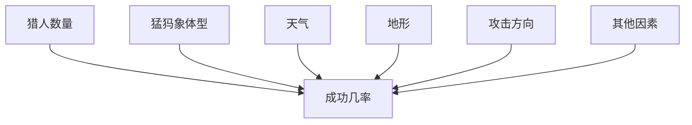
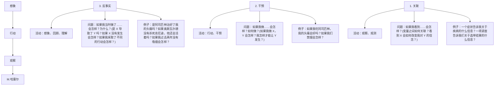
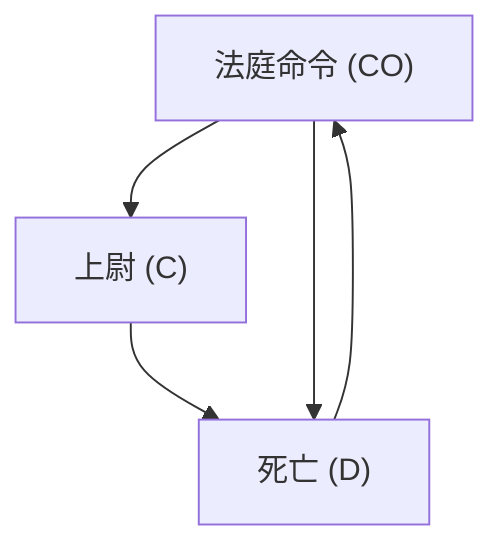
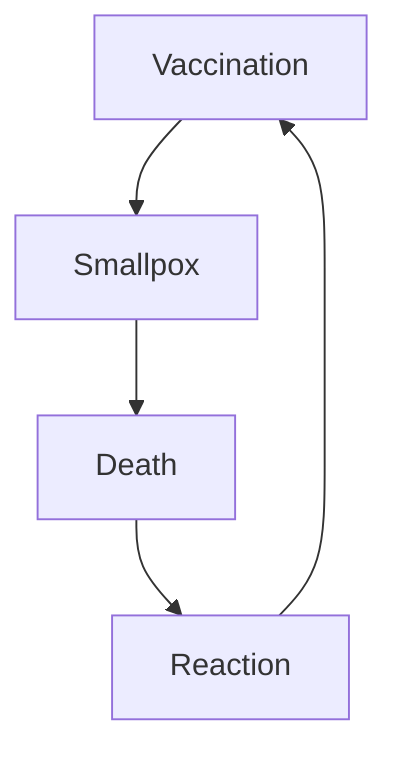

## 因果之梯（THE LADDER OF CAUSATION）

起初……我大概六七岁时，第一次读到伊甸园中亚当与夏娃的故事。我和同学们对上帝反复无常的禁令——禁止他们吃智慧树上的果子——并不感到惊讶。我们想，神灵自有其理由。更让我们着迷的是，他们一吃下智慧树的果子，亚当和夏娃就变得像我们一样，对自己的赤身裸体有了**意识**。

到了青少年时期，我们的兴趣逐渐转向故事中更具哲学意味的层面（以色列学生每年要读几次《创世纪》）。我们最关心的是这样一个观点：**人类知识的出现并非一个快乐的过程，而是一个痛苦的过程**，伴随着不顺从、内疚与惩罚。有人问道：值得放弃伊甸园无忧无虑的生活吗？随之而来的农业革命和科学革命，是否值得现代生活所伴随的经济困苦、战争和社会不公？

别误会：我们不是创造论者；连我们的老师骨子里都是达尔文主义者。然而我们知道，精心编排《创世纪》故事的作者，是在竭力回答他那个时代最紧迫的哲学问题。我们同样怀疑，这个故事带有 **智人（*Homo sapiens*）** 获得地球统治权这一实际过程的文化印记。那么，在这个迅速、超进化的过程中，步骤的顺序是怎样的？

在我早期担任工程学教授的职业生涯中，对这些问题的兴趣逐渐消退，但在 1990 年代，当我撰写《因果论》（*Causality*）一书时，突然又被重新点燃，因为我直面了**因果之梯（Ladder of Causation）**。

当我第一百次重读《创世纪》时，我注意到一个多年来一直被我忽略的细微差别。当上帝发现亚当藏在园中时，他问道：“你是否吃了我禁止你吃的树上的果子？”亚当回答：“你赐给我作伴的那女人，她把树上的果子给我，我就吃了。”上帝问夏娃：“你做了什么事呢？”她回答：“那蛇欺骗了我，我就吃了。”

众所周知，这种推卸责任的游戏对全能者并不奏效，他将两人都逐出了伊甸园。但这里有一个我以前忽略的关键点：**上帝问的是“什么”，而他们回答的是“为什么”。** 上帝询问事实，他们却用解释来回答。而且，两人都深信，说出原因会以某种方式为自己的行为涂上不同的色彩。他们是从哪里得到这个想法的？

对我来说，这些细微差别蕴含着三个深刻的含义。首先，在我们进化过程的非常早期，我们人类就意识到，世界不仅仅是由枯燥的事实（我们今天可能称之为数据）构成的；相反，这些事实是由一个错综复杂的因果关联网联结在一起的。其次，**构成我们知识主体的，是因果解释，而非枯燥的事实**，并且这应该成为机器智能的基石。最后，我们从数据处理者转变为解释创造者的过程并非渐进式的；这是一个飞跃，需要来自一种非凡果实的**外部推动**。这与我在因果之梯上的理论观察完美契合：**没有机器能够从原始数据中推导出解释。它需要一次推动。**

如果我们想从进化科学中寻找这些信息的确认，我们当然找不到智慧树，但我们仍然可以看到一个重大的、尚未得到解释的转变。我们现在知道，人类是从类人猿祖先经过 500 万到 600 万年的时间进化而来的，这种渐进的进化过程在地球生命史上并不罕见。但在大约过去的 5 万年里，发生了一些独特的事情，有人称之为**认知革命（Cognitive Revolution）**，另一些人（略带讽刺地）称之为**大跃进（Great Leap Forward）**。人类获得了以惊人速度改变自身环境和自身能力的能力。

例如，经过数百万年的进化，鹰和猫头鹰进化出了真正惊人的视力——然而它们从未发明出眼镜、显微镜、望远镜或夜视镜。而人类在几个世纪内就创造了这些奇迹。我将这种现象称为“超进化加速”。有些读者可能会反对我将苹果和橘子、进化和工程学相提并论，但这正是我的观点所在。进化赋予了**我们**改造生活的能力，这是它没有赋予鹰和猫头鹰的礼物，而问题同样在于：“为什么？”人类突然获得了何种鹰类所没有的**计算能力**？

许多理论被提出，但其中一个与因果关系的概念尤其相关。历史学家尤瓦尔·赫拉利（Yuval Harari）在其著作《人类简史》（*Sapiens*）中提出，我们祖先想象不存在事物的能力是一切的关键，因为这使他们能够更好地沟通。在此转变之前，他们只能信任直系家庭或部落中的人。之后，他们的信任扩展到由共同幻想（例如，对看不见但可想象的神灵、来世以及领袖神性的信仰）和期望联系在一起的更大社群。无论你是否同意赫拉利的理论，想象与因果关系之间的联系几乎是显而易见的。除非你能想象事物的后果，否则询问事物的原因是无用的。反过来，除非你能想象一个与事实相反的世界，在那个世界里夏娃没有把苹果递给你，否则你就不能说夏娃导致你吃了树上的果子。

回到我们智人祖先身上：他们新获得的因果想象力使他们能够通过一个我们称之为“规划（planning）”的巧妙过程，更有效地完成许多事情。想象一个部落准备猎杀猛犸象。他们成功需要什么条件？我必须承认，我猎杀猛犸象的技能已经生疏了，但作为思维机器的研究者，我学到了一点：一个思维实体（计算机、穴居人或教授）只有通过事先规划——决定招募多少猎人；根据风力条件，判断从哪个方向接近猛犸象；简而言之，通过想象和比较几种狩猎策略的后果——才能完成如此重大的任务。要做到这一点，思维实体必须拥有、咨询并操纵其现实的心理模型。


> **图 1.1.** 成功猎杀猛犸象的感知原因。



图 1.1 展示了我们如何绘制这样一个心理模型。图 1.1 中的每个点都代表成功的一个原因。请注意，原因有多种，且没有一个原因是确定性的。也就是说，我们不能确定拥有更多猎人就能保证成功，或者下雨就一定会导致失败，但这些因素确实会改变成功的概率。

心理模型是想象发生的舞台。它使我们能够通过对模型进行局部更改来试验不同的场景。在我们猎人心理模型的某个地方，有一个评估猎人数量影响的子程序。当他们考虑增加猎人时，他们不必从头评估所有其他因素。他们可以对模型进行局部更改，将“猎人 = 8”替换为“猎人 = 9”，然后重新评估成功的概率。这种**模块化（modularity）** 是因果模型的一个关键特征。

当然，我并不是说早期人类真的绘制了这样一个图示模型。但是，当我们试图在计算机上模拟人类思维，或者当我们试图解决不熟悉的科学问题时，绘制一个明确的点-箭头图是非常有用的。这些因果图就是引言中描述的“因果推断引擎（causal inference engine）”的计算核心。

## 因果关系的三个层级（THE THREE LEVELS OF CAUSATION）

到目前为止，我可能给人留下一种印象，即我们将关于世界的知识组织成因果关系的能力是单一的，并且是一蹴而就的。事实上，我对机器学习的研究告诉我，一个因果学习者必须掌握至少三个不同层次的认知能力：**观察（seeing）**、**行动（doing）** 和 **想象（imagining）**。

第一层，**观察**或**观测（observing）**，涉及检测我们环境中的规律性，许多动物以及认知革命前的早期人类都具备这一能力。第二层，**行动**，涉及预测对环境进行有意改变的效果，并选择其中一种改变以产生期望的结果。只有少数物种展示过这种技能的要素。工具的使用，只要是有意的，而不仅仅是偶然的或从祖先那里模仿来的，就可以被视为达到这第二层的标志。

然而，即使是工具使用者，也未必拥有关于其工具的“理论”，能够告诉他们工具为何有效，以及工具失效时该怎么办。要做到这一点，你需要达到一个允许**想象**的理解水平。正是这第三层，为我们后续的农业和科学革命做好了准备，并导致了我们这个物种对地球影响突然而剧烈的变化。

我无法证明这一点，但我可以用数学证明这三个层次有着根本性的不同，每一层都释放出下一层所不具备的能力。我用来展示这一点的框架可以追溯到人工智能（Artificial Intelligence, AI）研究的先驱艾伦·图灵（Alan Turing），他提出根据一个认知系统能够回答的**查询（queries）** 来对其进行分类。这种方法在讨论因果关系时尤其富有成效，因为它绕过了关于因果关系究竟是什么的冗长而无结果的讨论，转而关注具体且可回答的问题：“一个因果推理者能做什么？”或者更精确地说，一个拥有因果模型的有机体，能够计算出哪些是一个缺乏该模型的有机体所不能计算的？




**图 1.2.** 因果之梯，每一层级都附有代表性的有机体。大多数动物以及当今的学习机器都处于第一级，通过关联进行学习。工具使用者，如早期人类，如果他们通过规划而非仅仅模仿来行动，则处于第二级。我们也可以通过实验来了解干预的效果，这大概就是婴儿获取大部分因果知识的方式。处于最高层的反事实学习者，可以想象不存在的世界，并推断出观察到的现象的原因。

> （来源：Maayan Harel 绘图。）

图灵寻找的是二元分类——人类或非人类——而我们的分类有三个层级，对应于越来越强大的因果查询。使用这些标准，我们可以将三个层级的查询组合成一个**因果之梯（Ladder of Causation）**（图 1.2），这是一个我们将反复提及的隐喻。

让我们花些时间详细考虑梯子的每一级。在第一级，**关联（association）**，我们寻找观察中的规律性。这就是猫头鹰在观察老鼠如何移动并推断啮齿动物下一刻可能在哪里时所做的事情；这也是计算机围棋程序在研究包含数百万场围棋对局的数据库时所做的事情，以便找出哪些走法与更高的胜率相关联。我们说一个事件与另一个事件相关联，如果观察到其中一个事件会改变观察到另一个事件的可能性。

梯子的第一级要求基于被动观察进行预测。其特点是问题“如果我看到……会怎样？”。例如，想象一家百货公司的营销总监问道：“购买牙膏的顾客也购买牙线的可能性有多大？”这类问题是统计学的家常便饭，首先通过收集和分析数据来回答。在我们的例子中，可以通过首先获取包含所有顾客购物行为的数据，选择那些购买了牙膏的顾客，然后聚焦于后一组，计算其中也购买了牙线的比例来回答这个问题。这个比例，也称为“条件概率（conditional probability）”，衡量（对于大数据而言）“购买牙膏”与“购买牙线”之间的关联程度。符号上，我们可以将其写为 $P(\text{牙线} \mid \text{牙膏})$。“$P$”代表“概率（probability）”，竖线表示“在观察到……的条件下”。

统计学家已经发展出许多精细的方法来缩减大量数据并识别变量之间的关联。“相关性（Correlation）”或“回归（regression）”，本书中经常提到的一种典型的关联度量，涉及将一条线拟合到一组数据点上，并取该线的斜率。一些关联可能有明显的因果解释；另一些则可能没有。但仅凭统计学无法区分哪个是因，哪个是果，是牙膏还是牙线。从销售经理的角度来看，这也许并不重要。好的预测不一定需要好的解释。猫头鹰可以是一个好猎手，而无需理解为什么老鼠总是从 A 点跑到 B 点。

一些读者可能会惊讶地发现，我将当今的学习机器稳稳地置于因果之梯的第一级，与猫头鹰分享智慧。我们似乎几乎每天都听到关于机器学习系统——自动驾驶汽车、语音识别系统，尤其是近年来的深度学习算法（或深度神经网络）——的快速进步。它们怎么可能仍然只处于第一级呢？

深度学习的成功确实令人瞩目，并令我们许多人感到惊讶。然而，深度学习之所以成功，主要是因为它证明了某些我们认为困难的问题或任务实际上并不难。它并没有解决那些仍然阻止我们实现类人 AI 的真正困难的问题。结果，公众相信“强人工智能（strong AI）”，即像人类一样思考的机器，即将到来，甚至可能已经到来。实际上，这与事实相去甚远。我完全同意纽约大学神经科学家 **加里·马库斯（Gary Marcus）** 的观点，他最近在《纽约时报》上撰文指出，人工智能领域“充满了微小的发现”——这类事情能产生好的新闻稿——但机器仍然远远达不到人类认知的水平，令人失望。我在加州大学洛杉矶分校的计算机科学同事 **阿德南·达尔维什（Adnan Darwiche）** 撰写了一篇立场论文，题为“人类水平的智能还是动物般的能力？”，我认为这恰如其分地提出了问题。强人工智能的目标是制造具有类人智能的机器，能够与人类交谈并指导人类。相反，深度学习给了我们能力确实令人印象深刻但没有智能的机器。这种差异是深刻的，并且在于缺乏对现实的模型。

就像三十年前一样，机器学习程序（包括那些具有深度神经网络的程序）几乎完全在关联模式下运行。它们由一系列观察结果驱动，并试图拟合一个函数，其方式与统计学家试图将一条线拟合到一组点上的方式大致相同。深度神经网络为拟合函数的复杂性增加了更多层，但原始数据仍然驱动着拟合过程。随着更多数据被拟合，它们的准确性不断提高，但它们并未从“超进化加速”中受益。例如，如果无人驾驶汽车的程序员希望它对新的情况做出不同的反应，他们必须明确地添加这些新的反应。机器不会自己推断出，手里拿着一瓶威士忌的行人可能对喇叭声有不同的反应。这种缺乏灵活性和适应性的情况，在任何运行于因果之梯第一级的系统中都是不可避免的。

当我们开始改变世界时，我们就踏上了因果查询的下一级。这一级的典型问题是：“如果我们将牙膏价格翻倍，我们的牙线销售会怎样？”这已经需要一种新知识，这种知识是数据中不存在的，我们在因果之梯的第二级，**干预（intervention）** 中找到它。

干预的级别高于关联，因为它不仅涉及观察，还涉及**改变**现状。看到烟雾与制造烟雾，告诉我们关于火灾可能性的信息是完全不同的故事。我们无法用被动收集的数据来回答关于干预的问题，无论数据集有多大，神经网络有多深。许多科学家在得知他们在统计学中学到的方法都不足以阐明，更不用说回答一个像“如果我们把价格翻倍会怎样？”这样简单的问题时，都感到非常震惊。我知道这一点，因为我在许多场合帮助他们攀登到了梯子的下一级。

为什么我们不能仅通过观察来回答我们的牙线问题？为什么不直接进入我们庞大的历史购买数据库，看看以前牙膏价格翻倍时发生了什么？原因是，在过去的那些情况下，价格升高可能有不同的原因。例如，产品可能供应短缺，其他每家商店也不得不提高价格。但现在你正在考虑一个有意的干预，无论市场状况如何，都将设定一个新的价格。结果可能与顾客在其他地方找不到更好交易时大不相同。如果你有关于过去情况下市场状况的数据，也许你能做出更好的预测……但你需要什么数据？然后，你如何计算出来？这正是因果推断科学允许我们回答的问题。

预测干预结果的一个非常直接的方法是，在严格控制条件下进行实验。像 Facebook 这样的大数据公司深知这一点，并不断进行实验，看看如果屏幕上的项目排列不同，或者客户收到不同的提示（甚至是不同的价格），会发生什么。

更有趣且鲜为人知的是——即使在硅谷——有时即使没有实验，也能成功预测干预的效果。例如，销售经理可以开发一个包含市场状况的消费者行为模型。即使她没有关于每个因素的数据，她可能拥有足够的关键替代变量的数据来进行预测。一个足够强大和准确的因果模型可以使我们能够使用第一级（观察性）数据来回答第二级（干预性）查询。没有因果模型，我们就无法从第一级进入第二级。这就是为什么深度学习系统（只要它们只使用第一级数据并且没有因果模型）永远无法回答关于干预的问题，因为干预从定义上就打破了机器训练环境的规则。

正如这些例子所示，因果之梯第二级的定义性查询是“如果我们做……会怎样？”。如果我们改变环境会发生什么？我们可以将这种查询写成 $P(\text{牙线} \mid do(\text{牙膏}))$，它询问的是，在我们设定牙膏价格为某个价格的情况下，我们以某个价格销售牙线的概率。

因果第二级的另一个常见问题是“如何？”，它是“如果我们做……会怎样？”的近亲。例如，经理可能会告诉我们仓库里的牙膏太多了。“我们怎样才能卖掉它？”他问道。也就是说，我们应该为其设定什么价格？同样，这个问题涉及一个干预，我们希望在决定是否以及如何执行之前，先在头脑中执行它。

当然，这一陈述得到了大量实验性（第二级）证据的支持，这些证据来自数十个实验室、数百个春天、数千个不同的场合。然而，一旦被尊为“定律”，物理学家就将其解释为一个函数关系，它支配着这个特定的弹簧，在这一特定的时刻，在重量的假设值下。所有这些不同的世界，其中重量是 $x$ 磅，弹簧长度是 $L_{\mathrm{x}}$ 英寸，都被视为客观可知且同时活跃的，尽管其中只有一个实际存在。

回到牙膏的例子，一个顶层问题是：“一个购买了牙膏的顾客，如果我们当时把价格翻倍，他仍然会购买的概率是多少？”我们是在比较真实世界（我们知道顾客以当前价格购买了牙膏）和一个虚构世界（价格是现在的两倍）。

拥有一个能够回答反事实问题的因果模型，其回报是巨大的。找出错误发生的原因，使我们能够在未来采取正确的纠正措施。找出一种治疗对某些人有效而对其他人无效的原因，可能会导致一种疾病的新疗法。回答“如果事情不一样会怎样？”这个问题，使我们能够从历史和他人经验中学习，这似乎是其他物种都无法做到的。古希腊哲学家德谟克利特（Democritus，公元前 460–370 年）说过：“我宁愿发现一个原因，也不愿成为波斯国王。”这并不奇怪。

反事实在因果之梯顶端的地位，解释了为什么我如此强调它们是人类意识进化中的一个关键时刻。我完全同意尤瓦尔·赫拉利的观点，即描绘想象中的生物是一种新能力的体现，他称之为认知革命。他的典型例子是在德国西南部施塔德尔洞穴发现、现藏于乌尔姆博物馆的“狮子人”雕像（见图 1.3）。狮子人雕像大约有 4 万年的历史，是用猛犸象牙雕刻而成的嵌合体，半人半狮。


**图 1.3.** 施塔德尔洞穴的狮子人雕像。已知最早的想象生物（半人半狮）表现，它象征着一种新发展的认知能力，即推理反事实的能力。（来源：照片由 Yvonne Mühleis 拍摄，由巴登-符腾堡州文化遗产办公室/乌尔姆博物馆提供，德国乌尔姆。）

作为我们新获得的想象从未存在过的事物能力的体现，狮子人雕像是每一种哲学理论、科学发现和技术创新——从显微镜到飞机再到计算机——的先驱。每一个这样的创造，在物理世界中实现之前，都必须在某人的想象中成形。

这种认知能力的飞跃，其深远性和重要性不亚于使我们成为人类的任何解剖学变化。在狮子人雕像被创造出来后的 1 万年内，所有其他原始人类（除了地理上非常孤立的弗洛勒斯人）都已灭绝。人类继续以令人难以置信的速度改变着自然世界，利用我们的想象力来生存、适应并最终接管地球。我们从想象反事实中获得的好处，无论过去还是现在都是一样的：灵活性、反思和改进过去行为的能力，以及或许更为重要的，为我们过去和现在的行为承担责任的意愿。

如图 1.2 所示，因果之梯第三级的特征性查询是“如果我当时做了……会怎样？”和“为什么？”。两者都涉及将观察到的世界与一个反事实世界进行比较。仅靠实验无法回答这些问题。第一级处理被看到的世界，第二级处理一个可见的勇敢新世界，而第三级则处理一个无法被看到的世界（因为它与所见相矛盾）。为了弥合这一差距，我们需要一个底层因果过程的模型，有时被称为“理论”，甚至（在我们极其确信的情况下）被称为“自然法则”。简而言之，我们需要**理解**。

当然，这是任何科学分支的圣杯——发展一种理论，使我们能够预测在甚至尚未设想的情况下会发生什么。但它更进一步：拥有这样的定律允许我们有选择地违反它们，以创造出与我们世界相矛盾的世界。我们的下一节将展示这些行动中的违反。

## 迷你图灵测试（THE MINI-TURING TEST）

1950 年，艾伦·图灵（Alan Turing）提出了一个问题：计算机像人类一样思考意味着什么？他建议进行一项实际测试，他称之为“模仿游戏”（the imitation game），但此后每一位人工智能研究者都将其称为“图灵测试”（Turing test）。实际上，如果一个普通人通过打字机与计算机交流，却无法分辨自己是在与人类还是计算机对话，那么这台计算机就可以被称为会思考的机器。图灵非常确信这是可行的。“我相信，在大约五十年的时间里，将有可能对计算机进行编程，”他写道，“使它们在模仿游戏中表现得如此出色，以至于在提问五分钟后，普通审讯者做出正确判断的概率不超过 70%。”

图灵的预测稍有偏差。每年，**洛伯纳奖（Loebner Prize）** 竞赛都会评选出世界上最像人类的“聊天机器人”（chatbot），并设有金牌和 10 万美元奖金，奖励给任何能够成功欺骗所有四位评委，使其认为它是人类的程序。截至 2015 年，在二十五年的竞赛中，没有一个程序能够欺骗所有评委，甚至一半评委都没有。

图灵不仅提出了“模仿游戏”，还提出了一种通过该游戏的策略。“与其试图编写一个模拟成人思维的程序，为什么不尝试编写一个模拟儿童思维的程序呢？”他问道。如果你能做到这一点，那么你就可以像教育孩子一样教育它，然后眨眼间，二十年后（或者更短，考虑到计算机更快的速度），你就会拥有一个人工智能。“大概儿童的大脑就像从文具店买来的笔记本一样，”他写道。“机制很少，空白页很多。”他在这方面错了：儿童的大脑拥有丰富的机制和预存的模板。

尽管如此，我认为图灵确实抓住了某些要点。我们很可能只有在能够创造出类似儿童的智能之后，才能成功创造出类似人类的智能，而这种智能的一个关键组成部分是掌握**因果关系（causation）**。

机器如何获取因果知识？这仍然是一个重大挑战，无疑将涉及来自主动实验、被动观察以及（同样重要的）程序员的输入的复杂组合——这与儿童从进化、父母和同伴那里获得的输入大致相同，只是程序员替代了后者的角色。

然而，我们可以回答一个稍微不那么宏大的问题：机器（和人类）如何以一种能够使其快速访问必要信息、正确回答问题、并且像三岁小孩一样轻松做到这一点的形式来表示因果知识？事实上，这是我们在本书中要解决的主要问题。

我称之为**迷你图灵测试（mini-Turing test）**。其想法是：选取一个简单的故事，以某种方式将其编码到机器中，然后测试该机器是否能正确回答人类能够回答的因果问题。它之所以是“迷你”的，有两个原因。首先，它仅限于因果推理，排除了人类智能的其他方面，如视觉和自然语言。其次，我们允许参赛者以任何便捷的表示方式对故事进行编码，从而减轻机器从自身个人经验中获取故事的任务。通过这个迷你测试一直是我一生的工作——在过去的二十五年里是有意识地，在此之前则是潜意识地。

显然，当我们准备进行迷你图灵测试时，表示问题需要先于获取问题。没有表示，我们就不知道如何存储信息以备将来使用。即使我们能让我们的机器人随意操纵其环境，我们以这种方式学到的任何信息都会被遗忘，除非我们的机器人被赋予一个模板来编码这些操纵的结果。人工智能对认知研究的一个主要贡献是“表示优先，获取次之”的范式。通常，对良好表示的探索会引发对知识应如何获取（无论是从数据还是从程序员处获取）的洞见。

当我描述迷你图灵测试时，人们通常声称可以通过作弊轻易通过。例如，列出所有可能的问题，存储它们的正确答案，然后在被问到时从记忆中读出。有人认为，无法区分存储了愚蠢问答列表的机器和像你我一样回答问题的机器——即通过理解问题并使用心智因果模型产生答案。那么，如果作弊如此容易，迷你图灵测试又能证明什么呢？

哲学家约翰·塞尔（John Searle）在 1980 年提出了这种作弊的可能性，即所谓的“中文屋”（Chinese Room）论证，以挑战图灵关于伪装智能等同于拥有智能的主张。塞尔的挑战只有一个缺陷：作弊并不容易；事实上，这是不可能的。即使变量数量很少，可能的问题数量也会呈天文数字增长。假设我们有十个因果变量，每个变量只取两个值（0 或 1）。我们可能会提出大约 3000 万个可能的查询，例如“在给定我们观察到变量 X 等于 1，我们使变量 Y 等于 0，变量 Z 等于 1 的情况下，结果为 1 的概率是多少？”如果有更多变量，或者每个变量有超过两种状态，可能性的数量将增长到我们无法想象的程度。塞尔需要的列表条目数将超过宇宙中的原子数。所以，显然，一个愚蠢的问答列表永远无法模拟儿童的智能，更不用说成人的了。

人类的大脑必须对所需信息有某种紧凑的表示，以及一种有效的程序来正确解释每个问题并从存储的表示中提取正确答案。因此，要通过迷你图灵测试，我们需要为机器配备类似高效的表示和答案提取算法。

这种表示不仅存在，而且具有儿童般的简单性：**因果图（causal diagram）**。我们已经看到了一个例子，即猛犸象狩猎的图表。考虑到人们可以用点-箭头图轻松交流他们的知识，我相信我们的大脑确实使用了这样的表示。但更重要的是，对于我们的目的而言，这些模型通过了迷你图灵测试；目前还没有其他已知模型能够做到这一点。让我们看一些例子。


> 图 1.4 行刑队示例的因果图。A 和 B 代表士兵 A 和 B（的行动）。



假设一名囚犯即将被行刑队处决。要发生这种情况，必须发生一系列事件。首先，法庭下令执行死刑。命令下达给一名上尉，上尉向行刑队的士兵（A 和 B）发出开枪信号。我们假设他们服从命令且是神枪手，所以他们只在接到命令时才开枪，并且如果其中任何一人开枪，囚犯就会死亡。

图 1.4 展示了一个表示我刚才所述故事的图表。每个未知变量 $(CO, C, A, B, D)$ 都是一个真/假变量。例如，$D = \text{true}$ 表示囚犯死亡；$D = \text{false}$ 表示囚犯活着。$CO = \text{false}$ 表示没有发出法庭命令；$CO = \text{true}$ 表示发出了命令，依此类推。

使用此图，我们可以开始回答来自因果之梯不同梯级的因果问题。首先，我们可以回答关联性问题（即，一个事实告诉我们关于另一个事实的什么信息）。如果囚犯死了，这是否意味着法庭命令被下达了？我们（或计算机）可以检查图表，追溯每个箭头背后的规则，并使用标准逻辑，得出结论：没有上尉的命令，两名士兵不会开枪。同样，如果上尉没有收到命令，他也不会发出命令。因此，我们查询的答案是肯定的。或者，假设我们发现 A 开枪了。这告诉我们关于 B 的什么信息？通过追踪箭头，计算机得出结论：B 一定也开枪了。（如果上尉没有发出信号，A 不会开枪，所以 B 一定也开枪了。）即使 A 不导致 B（从 A 到 B 没有箭头），这也是成立的。

沿着因果之梯向上，我们可以提出关于干预的问题。如果士兵 A 决定主动开枪，而不等待上尉的命令，会发生什么？囚犯会死还是活？这个问题实际上已经带有矛盾的味道。我刚刚告诉你，A 只在接到命令时才开枪，而现在我们却在问如果他在没有命令的情况下开枪会发生什么。如果你只使用逻辑规则（像计算机通常所做的那样），这个问题是没有意义的。正如 20 世纪 60 年代科幻电视剧《迷失太空》（*Lost in Space*）中的机器人在这种情况下常说的那样：“无法计算。”

如果我们希望我们的计算机理解因果关系，我们必须教它如何打破规则。我们必须教它区分仅仅观察一个事件和使事件发生之间的区别。“每当你使一个事件发生时

图 1.5. 关于干预的推理。士兵 A 决定开枪；从 C 到 A 的箭头被删除，A 被赋值为真。

请注意，这个结论与我们直观的判断一致，即 A 未经授权的开枪将导致囚犯死亡，因为这种“手术”保留了从 A 到 D 的箭头。同时，我们的判断是 B（很可能）没有开枪；关于 A 的决定不应影响模型中不受 A 开枪影响的变量。

这一点值得重复。如果我们看到 A 开枪，那么我们得出结论：B 也开枪了。但是如果 A 决定开枪，或者我们让 A 开枪，那么结论正好相反。这就是“观察”与“行动”之间的区别。只有能够理解这种区别的计算机才能通过迷你图灵测试。

还要注意，仅仅收集大数据并不能帮助我们登上因果之梯并回答上述问题。假设你是一名记者，日复一日地收集行刑现场的记录。你的数据将由两类事件组成：要么所有五个变量都为真，要么它们都为假。在缺乏对谁听命于谁的理解的情况下，这种数据（或任何机器学习算法）根本无法让你预测说服射手 A 不开枪的结果。

最后，为了说明因果之梯的第三梯级，让我们提出一个反事实问题。假设囚犯躺在血泊中死了。由此我们可以（使用第一梯级）得出结论：A 开枪了，B 开枪了，上尉发出了信号，法庭下达了命令。但是，如果 A 决定不开枪呢？囚犯会活着吗？这个问题要求我们将现实世界与一个虚构且矛盾的世界（其中 A 没有开枪）进行比较。在虚构世界中，指向 A 的箭头被擦除，以解放 A，使其不必听从 C。相反，A 被设置为假，同时保持其过去的历史与现实世界相同。所以虚构世界看起来像图 1.6。


> 图 1.6. 反事实推理。我们观察到囚犯死亡，并询问如果士兵 A 决定不开火会发生什么。

```mermaid
graph TD
  A["法庭命令 (CO) = True"] --> B["上尉 (C) = True"]
  B --> C["B = True"]
  C --> D{死亡 (D) = ?}
  D --> E["A = False"]
  E --> A
```

为了通过迷你图灵测试，我们的计算机必须得出结论：在虚构世界中，囚犯也会死亡，因为 B 的子弹会杀死他。所以 **A 勇敢地改变主意并不能救他的命**。毫无疑问，这是行刑队存在的原因之一：它们保证法庭的命令得以执行，同时也减轻了单个射手的一些责任负担，因为他们可以（多少）问心无愧地说，他们的行为并未导致囚犯死亡，因为“他无论如何都会死。”

看起来我们费了很大劲去回答那些答案显而易见的玩具问题。我完全同意！**因果推理**对你来说很容易，因为你是人类，你曾经是个三岁的孩子，拥有一个出色的三岁大脑，它比任何动物或计算机都更理解因果关系。“小图灵问题”的全部意义在于让计算机也能进行因果推理。在这个过程中，我们或许能学到一些关于人类如何做到这一点的东西。正如所有三个例子所示，我们必须教会计算机如何**选择性地打破逻辑规则**。计算机不擅长打破规则，而这正是儿童擅长的技能。（穴居人也是如此！狮人像的创造，若不打破“什么头配什么身体”的规则，是不可能实现的。）

然而，我们不要对人类优越性过于自满。在很多情况下，人类可能更难得出正确的因果结论。例如，变量可能多得多，而且它们可能不是简单的二元（真/假）变量。我们可能不想预测一个囚犯是死是活，而是想预测如果提高最低工资，失业率会上升多少。这种**定量因果推理**通常超出了我们直觉的能力。此外，在行刑队例子中，我们排除了不确定性：也许队长在步枪手A决定开枪后的瞬间才下达命令，也许步枪手B的枪卡壳了，等等。为了处理不确定性，我们需要关于这些异常情况发生可能性的信息。

让我给你一个例子，其中概率至关重要。这与天花疫苗首次引入时在欧洲爆发的公开辩论相呼应。出乎意料的是，数据显示死于天花接种的人比死于天花本身的人还多。自然，有些人利用这一信息主张禁止接种疫苗，而实际上疫苗正通过根除天花来拯救生命。让我们看一些虚构的数据来说明这种效应并解决争议。

假设在100万儿童中，99%接种了疫苗，1%没有接种。如果一个孩子接种了疫苗，他或她有百分之一的几率产生反应，而反应有百分之一的几率是致命的。另一方面，他或她没有机会患上天花。同时，如果一个孩子没有接种疫苗，他或她显然有零几率对疫苗产生反应，但有三十分之一的几率患上天花。最后，假设天花的致死率是五分之一。

我想你会同意接种疫苗看起来是个好主意。产生反应的几率低于患上天花的几率，而且反应远没有疾病危险。但现在让我们看看数据。在100万儿童中，99万人接种了疫苗，9900人产生了反应，99人因此死亡。与此同时，1万人没有接种疫苗，200人患上天花，40人因此死亡。总结来说，死于疫苗接种的儿童（99人）多于死于疾病的儿童（40人）。

我能理解那些举着“疫苗杀人！”标语牌向卫生部门抗议的父母。数据似乎站在他们一边；疫苗导致的死亡确实比天花本身还多。但逻辑站在他们那边吗？我们应该禁止疫苗接种，还是考虑那些被预防的死亡？图1.7显示了这个例子的**因果图**。

开始时，疫苗接种率是99%。我们现在提出反事实问题：“如果我们把疫苗接种率设为零会怎样？”使用我上面给出的概率，我们可以得出结论：在100万儿童中，会有2万人患上天花，4000人死亡。将反事实世界与现实世界相比较，我们看到不接种疫苗将会导致3861名儿童丧生（4000与139之差）。**我们应该感谢反事实的语言帮助我们避免了这样的代价。**

> 图1.7. 疫苗接种例子的因果图。接种疫苗是有益还是有害？



对于因果关系的学者来说，主要教训是**因果模型**所包含的远不止是画箭头。在箭头背后，是概率。当我们从X画箭头到Y时，我们隐含地表示某个概率规则或函数指定了如果X改变，Y将如何变化。我们可能知道这个规则是什么；更可能的是，我们必须从数据中估计它。然而，**因果革命（Causal Revolution）**最引人入胜的特征之一是，在很多情况下，我们可以完全不指定这些数学细节。通常，图结构本身就能使我们估计各种因果和反事实关系：简单或复杂，确定或概率，线性或非线性。

从计算的角度来看，我们通过小图灵测试的方案也值得注意，因为我们在所有三个例子中使用了相同的程序：将故事转化为图，听取查询，执行对应于给定查询的手术（干预性或反事实性；如果查询是关联性的，则无需手术），并使用修改后的因果模型来计算答案。每次改变故事时，我们都不必用大量新查询来训练机器。只要我们能画出一个因果图，无论它涉及猛犸象、行刑队还是疫苗接种，这种方法都足够灵活。这正是我们对**因果推理引擎（causal inference engine）**的期望：这是我们作为人类所享有的那种灵活性。

当然，图本身并没有什么神奇之处。它之所以成功，是因为它携带了因果信息；也就是说，当我们构建图时，我们问的是：“谁可能直接导致囚犯死亡？”或“疫苗接种的直接影响是什么？”如果我们仅仅通过询问关联来构建图，它就不会赋予我们这些能力。例如，在图1.7中，如果我们反转箭头

# 论概率与因果关系

认识到因果关系不能简化为概率，无论对我个人还是对哲学家和科学家总体而言，都是来之不易的。理解“原因”的含义一直是哲学家们长期关注的核心，从18和19世纪的大卫·休谟（David Hume）和约翰·斯图尔特·密尔（John Stuart Mill），到20世纪中期的汉斯·赖欣巴哈（Hans Reichenbach）和帕特里克·萨普斯（Patrick Suppes），再到当今的南希·卡特赖特（Nancy Cartwright）、沃尔夫冈·斯波恩（Wolfgang Spohn）和克里斯托弗·希区柯克（Christopher Hitchcock）。

特别是，从赖欣巴哈和萨普斯开始，哲学家们试图用概率来定义因果关系，使用了“**概率提升（probability raising）**”的概念：如果X提升了Y的概率，那么X导致Y。这个概念根深蒂固地存在于直觉中。例如，我们说“鲁莽驾驶导致事故”或“你会因为懒惰而挂掉这门课”，我们很清楚，前因只是倾向于使后果更可能发生，而不是绝对确定。因此，人们会期望概率提升成为**因果之梯（Ladder of Causation）**第一级和第二级之间的桥梁。唉，这种直觉导致了数十年的失败尝试。

阻碍这些尝试成功的不是这个想法本身，而是它被形式化表达的方式。几乎无一例外，哲学家们用条件概率来表达“X提升了Y的概率”这一陈述，并写成 $P(Y \mid X) > P(Y)$。这种解释是错误的，正如你肯定注意到的，因为“提升”是一个因果概念，暗示着X对Y的因果影响。而表达式 $P(Y \mid X) > P(Y)$ 仅仅谈论观测，意思是：“如果我们看到X，那么Y的概率就会增加。”但这种增加可能由其他原因引起，包括Y是X的原因，或者某个其他变量（Z）是它们两者的原因。这就是关键所在！这让哲学家们回到了原点，试图消除那些“其他原因”。

由 $P(Y \mid X)$ 等表达式给出的概率处于因果之梯的第一级，并且永远无法（单独）回答第二级或第三级的查询。任何试图用看似更简单的第一级概念来“定义”因果关系的尝试都必然失败。这就是为什么我在本书中从未试图定义因果关系：定义需要还原，而还原需要下降到更低的层级。相反，我追求的是最终更具建设性的方案，即解释如何回答因果查询，以及回答这些查询需要哪些信息。如果这看起来奇怪，请考虑数学家对欧几里得几何采取了完全相同的方法。在任何几何书中，你都找不到“点”和“线”这两个术语的定义。然而，我们可以基于欧几里得公理（或者更好的，欧几里得公理的各种现代版本）回答关于它们的任何和所有查询。

但让我们更仔细地审视这个概率提升标准，看看它在哪里搁浅。共同原因或**混杂因子（confounder）**的问题对哲学家来说是最棘手的之一。如果我们按字面意思理解概率提升标准，我们必须得出结论：高冰淇淋销量导致犯罪，因为在冰淇淋销量更高的月份，犯罪概率更高。在这个特定案例中，我们可以解释这种现象，因为冰淇淋销量和犯罪在夏季都更高，此时天气更暖和。尽管如此，我们仍然要问，什么样的通用哲学标准能告诉我们天气（而非冰淇淋销量）才是原因。

哲学家们试图通过以他们所谓的“背景因素”（混杂因子的另一种说法）为条件来修复这个定义，产生了标准 $P(Y \mid X, K = k) > P(Y \mid K = k)$，其中K代表某些背景变量。事实上，如果我们将温度视为背景变量，这个标准对我们的冰淇淋例子是有效的。例如，如果我们只看温度为90度（$K=90$）的日子，我们会发现冰淇淋销量和犯罪之间没有残余关联。只有当我们把90度的日子与30度的日子进行比较时，才会产生概率提升的错觉。

尽管如此，没有哲学家能够对“哪些变量需要包含在背景集K中并以其为条件？”这个问题给出一个令人信服的通用答案。原因很明显：混杂本身也是一个因果概念，因此抗拒概率形式的表述。1983年，南希·卡特赖特打破了这一僵局，用因果成分丰富了背景上下文的描述。她提出，我们应该以任何对结果“因果相关”的因素为条件。通过借用因果之梯第二级的概念，她基本上放弃了仅基于概率定义原因的尝试。这是一种进步，但也为批评打开了大门，即我们正在用因果本身来定义因果。

关于K的适当内容的哲学争论持续了二十多年，并陷入了僵局。事实上，我们将在第4章看到一个正确的标准，我现在不会剧透。目前足以说明，如果没有因果图，这个标准实际上是不可能阐述的。

总之，**概率因果关系（probabilistic causality）**总是在混杂这块岩石上触礁。每当概率因果论的支持者试图用新的船体修补船只时，船就会撞上同一块岩石，再次漏水。一旦你用条件概率的语言错误地表述了“概率提升”，再多的概率修补也无法让你登上梯子的下一级。尽管听起来可能很奇怪，但概率提升的概念无法用概率来表达。

拯救概率提升思想的正确方法是使用 **do-算子（do-operator）**：我们可以说，如果 $P(Y \mid do(X)) > P(Y)$，那么X导致Y。由于干预是第二级的概念，这个定义可以捕捉概率提升的因果解释，并且可以通过因果图使其可操作。换句话说，如果我们手头有一个因果图和数据，并且一位研究者询问是否 $P(Y \mid do(X)) > P(Y)$，我们可以连贯地、算法化地回答他的问题，从而判断在概率提升的意义上X是否是Y的原因。

我通常非常关注哲学家们对诸如因果关系、归纳和科学推理逻辑等滑溜概念的看法。哲学家们的优势在于置身于科学辩论的喧嚣和处理数据的实际现实之外。他们比其他科学家受到统计学反因果偏见的影响更小。他们可以援引至少可以追溯到亚里士多德的关于因果关系的思想传统，并且可以谈论因果关系而无需脸红或将其隐藏在“关联”的标签背后。

然而，在他们将因果关系概念数学化（这本身是一个值得称赞的想法）的努力中，哲学家们过于仓促地致力于他们唯一知道的处理不确定性的语言——概率语言。在过去十几年左右，他们大多已经克服了这个错误，但不幸的是，类似的想法甚至在现在仍在计量经济学中被追求，冠以“格兰杰因果关系（Granger causality）”和“向量自相关（vector autocorrelation）”等名称。

现在我要坦白：我犯了同样的错误。我并不总是把因果关系放在第一位，概率放在第二位。恰恰相反！当我在20世纪80年代初开始从事人工智能工作时，我认为不确定性是人工智能中最缺失的东西。此外，我坚持认为不确定性必须用概率来表示。因此，正如我在第3章中解释的那样，我开发了一种在不确定性下推理的方法，称为**贝叶斯网络（Bayesian networks）**，它模拟了一个理想化的、去中心化的大脑如何将概率整合到其决策中。鉴于我们看到某些事实，贝叶斯网络可以快速计算出某些其他事实为真或为假的可能性。毫不奇怪，贝叶斯网络立即在人工智能社区中流行起来，即使在今天仍被认为是人工智能中不确定性推理的主导范式。

尽管我对贝叶斯网络持续的成功感到高兴，但它们未能弥合人工智能与人类智能之间的鸿沟。我相信你能找出缺失的成分：因果关系。诚然，因果的幽灵无处不在。箭头总是从原因指向结果，从业者经常注意到，当箭头方向反转时，诊断系统变得难以管理。但在大多数情况下，我们认为这是一种文化习惯，或是旧思维模式的产物，而不是智能行为的核心方面。

当时，我被概率的力量所陶醉，以至于我认为因果关系是一个从属概念，仅仅是一种便利或表达概率依赖性和区分相关变量与无关变量的心理速记。在我1988年的著作《智能系统中的概率推理》中，我写道：“因果关系是一种语言，人们可以用它有效地谈论相关性关系的某些结构。”今天这些话让我感到尴尬，因为“相关性”显然是第一级的概念。即使在书出版的时候，我心里就知道我错了。对我的计算机科学家同行来说，我的书成了不确定性推理的圣经，但我已经感觉自己像个异端。

贝叶斯网络存在于这样一个世界，其中所有问题都可以简化为概率，或者（用本章的术语来说）变量之间的关联度；它们无法上升到因果之梯的第二级或第三级。