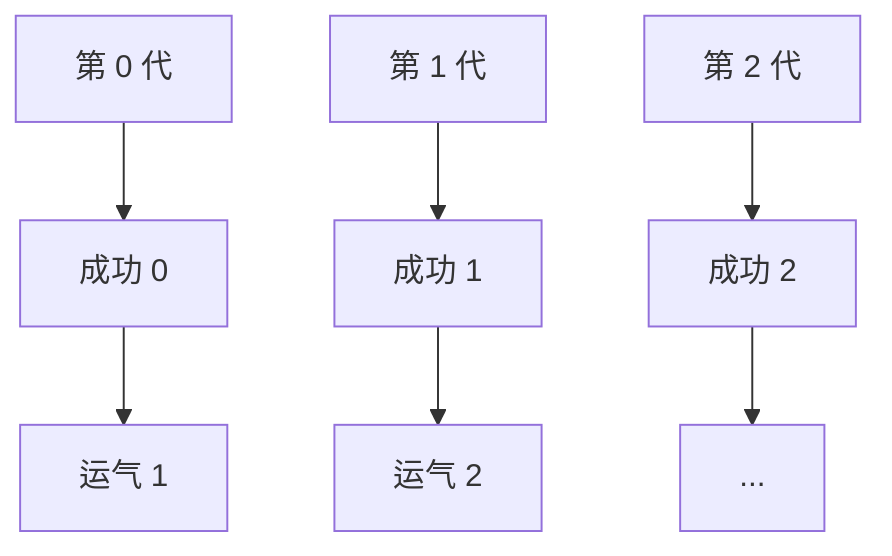
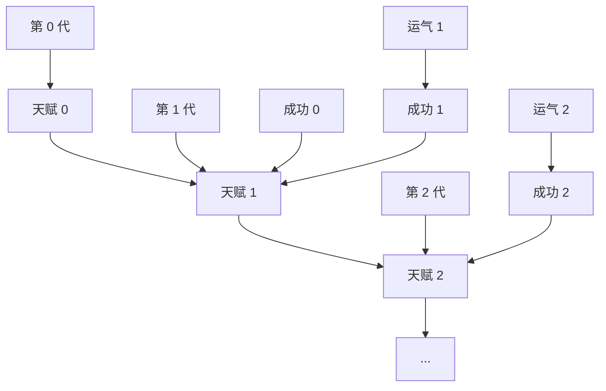

# 从海盗到豚鼠：因果推断的起源（FROM BUCCANEERS TO GUINEA PIGS: THE GENESIS OF CAUSAL INFERENCE）

> 然而它仍在转动。  
> ——传为伽利略·伽利莱（Galileo Galilei, 1564–1642）所言

近两个世纪以来，英国科学界最持久的传统之一，便是伦敦大不列颠皇家研究院（Royal Institution of Great Britain）的**周五晚间讲座（Friday Evening Discourse）**。十九世纪的许多发现都是首次在此向公众宣布：1839年迈克尔·法拉第（Michael Faraday）与摄影原理；1897年J. J. 汤姆孙（J. J. Thomson）与电子；1904年詹姆斯·杜瓦（James Dewar）与氢的液化。

**仪式感（Pageantry）**是这一场合的重要组成部分；这 literally 就是科学剧场，而观众——英国社会的精英——会盛装出席（男士穿燕尾服配黑领结）。到了约定时间，钟声响起，当晚的演讲者被引入礼堂。传统上，他会立即开始演讲，不做任何介绍或开场白。实验和现场演示是这场盛事的一部分。

1877年2月9日，当晚的演讲者是**弗朗西斯·高尔顿（Francis Galton）**，英国皇家学会会员（FRS），查尔斯·达尔文（Charles Darwin）的表兄，著名的非洲探险家，指纹识别（fingerprinting）的发明者，也是维多利亚时代绅士科学家的典范。高尔顿的演讲题目是“**遗传的典型定律（Typical Laws of Heredity）**”。他当晚的实验装置是一个奇特的小玩意儿，他称之为**五角形板（quincunx）**，现在常被称为“**高尔顿板（Galton board）**”。类似的游戏经常出现在电视游戏节目《价格猜猜看》（*The Price Is Right*）中，被称为 *Plinko*。高尔顿板由一个三角形排列的钉子或木桩阵列组成，小金属球可以通过顶部的开口投入其中。球体从一排弹跳到下一排，像弹球一样，最后落入底部一排槽位中的一个（见卷首图）。对于任何一个球，向左或向右的 zigzag 路径看起来完全随机。然而，如果你将大量球倒入高尔顿板，一种惊人的规律性就会显现：底部累积的球总会大致形成一个钟形曲线。最靠近中心的槽位会堆满球，而每个槽位中的球数逐渐减少，在五角形板的边缘处降为零。

这种模式有一个数学解释。任何一个球的路径就像一系列独立的抛硬币结果。每次球碰到一个钉子，它要么向左弹，要么向右弹，从远处看，它的选择似乎完全随机。结果的总和——比如向右超过向左的次数——决定了球最终落入哪个槽位。根据**皮埃尔-西蒙·拉普拉斯（Pierre-Simon Laplace）** 在1810年证明的**中心极限定理（central limit theorem）**，任何这样的随机过程——相当于大量抛硬币结果之和——都会导致相同的概率分布，称为**正态分布（normal distribution）**（或钟形曲线）。高尔顿板只是拉普拉斯定理的一个直观演示。

**中心极限定理（Central limit theorem）** 确实是十九世纪数学的一个奇迹。想想看：尽管任何一个球的路径是不可预测的，但1000个球的路径却极其可预测——这对《价格猜猜看》的制作人来说是一个方便的事实，他们可以准确估计参赛者在 Plinko 中长期来看会赢得多少钱。同样的定律使得保险公司尽管面临人类事务的不确定性，却仍能如此盈利。

皇家研究院衣着华丽的观众一定想知道，这一切与演讲承诺的主题——遗传定律——有什么关系。为了说明这种联系，高尔顿向他们展示了一些在法国收集的关于新兵身高的数据。这些数据也遵循正态分布：许多人具有大约平均身高，而极高或极矮的人数逐渐减少。事实上，无论你谈论的是1000名新兵还是高尔顿板中的1000个球：每个槽位（或身高类别）中的数字几乎是相同的。

因此，对高尔顿来说，五角形板是身高遗传（或者许多其他遗传特征）的一个模型。它是一个**因果模型（causal model）**。简而言之，高尔顿认为，球“继承”了它们在五角形板中的位置，就像人类继承他们的身高一样。

但是，如果我们暂时接受这个模型，它就会提出一个难题，这也是高尔顿当晚的主要主题。钟形曲线的宽度取决于放置在顶部和底部之间的钉子行数。假设我们将行数加倍。这将创建一个两代遗传的模型，前半部分行代表第一代，后半部分代表第二代。你必然会发现第二代比第一代有更多的变异，而在后续几代中，钟形曲线会变得越来越宽。

但这并不是实际人类身高的情况。事实上，人类身高分布的宽度随时间保持相对恒定。一个世纪前我们没有九英尺高的人，现在也没有。是什么解释了人口遗传禀赋的稳定性？自1869年他的著作《**遗传的天才（Hereditary Genius）**》出版以来，高尔顿大约花了八年时间思考这个谜团。

正如书名所示，高尔顿真正的兴趣不是狂欢节游戏或人类身高，而是**人类智力（human intelligence）**。作为一个拥有大量科学天才的大家族成员，高尔顿自然想证明天才具有家族遗传性。他在他的书中正是这样做的。他煞费苦心地编纂了过去四个世纪中605位“杰出”英国人的家谱。但他发现，这些杰出人物的儿子和父亲不那么杰出，祖父母和孙辈则更不杰出。

我们现在很容易发现高尔顿计划中的缺陷。毕竟，什么是杰出的定义？而且，杰出家族的人成功是否可能是因为他们的特权而非才华？尽管高尔顿意识到这些困难，但他仍以越来越快的速度和决心进行着这种徒劳的寻找遗传解释的探索。

尽管如此，高尔顿还是有所发现，一旦他开始研究像身高这样的特征——这比“杰出”更容易测量，且与遗传的联系更紧密——这一点就变得更加明显。高个男人的儿子往往高于平均水平——但不如他们的父亲高。矮个男人的儿子往往低于平均水平——但不如他们的父亲矮。高尔顿最初将这种现象称为“**返祖（reversion）**”，后来称为“**向平庸回归（regression toward mediocrity）**”。这可以在许多其他环境中观察到。如果学生就相同材料参加两种不同的标准化测试，第一次测试得分高的学生通常在第二次测试中得分高于平均水平，但不如第一次高。这种**均值回归（regression to the mean）** 现象在生活、教育和商业的各个方面无处不在。例如，在棒球中，**年度最佳新秀（Rookie of the Year）**（在第一赛季表现异常出色的球员）经常遭遇“**二年级低迷（sophomore slump）**”，表现不如之前。

高尔顿并不知道所有这些，他认为自己偶然发现的是遗传定律，而非统计定律。他相信均值回归必定有某种原因，并在他的皇家研究院讲座中阐述了他的观点。他向观众展示了一个**双层五角形板（two-layered quincunx）**（图2.1）。

球通过第一组钉子阵列后，再通过倾斜的滑槽，这些滑槽将它们移向板的中心。然后它们会通过第二组钉子。高尔顿得意地展示，滑槽恰好补偿了正态分布趋于扩散的倾向。这一次，钟形概率分布在代际之间保持了恒定的宽度。

> **图2.1.** 弗朗西斯·高尔顿用作人类身高遗传类比的高尔顿板。
> (a) 当许多球被投入这个弹球式装置时，它们的随机弹跳导致它们堆积成钟形曲线。
> (b) 高尔顿注意到，在通过高尔顿板的两轮A和B（相当于两代）中，钟形曲线变宽了。
> (c) 为了抵消这种倾向，他安装了滑槽，将“第二代”移向中心。

*[显示三个流体流动阶段的图表，标有A和B的部分，说明粒子分布和流动模式。]*

因此，高尔顿推测，均值回归是一个物理过程，是自然界确保身高（或智力）分布在代际间保持不变的方式。“返祖过程与一般偏差定律协同作用，”高尔顿告诉他的听众。他将其与**胡克定律（Hooke's law）** 相比较，后者是描述弹簧恢复其平衡长度趋势的物理定律。

请注意这个日期。1877年，高尔顿正在寻求因果解释，并认为均值回归是一个因果过程，就像物理定律一样。他错了，但他绝非孤例。直到今天，许多人仍在犯同样的错误。例如，棒球专家总是在寻找球员二年级低迷的因果解释。“他变得过于自信了，”他们抱怨，或者“其他球员已经看穿了他的弱点。”他们可能是对的，但二年级低迷并不需要因果解释。仅凭概率定律，它发生的可能性就更大。

现代统计解释非常简单。正如**丹尼尔·卡尼曼（Daniel Kahneman）** 在他的书《**思考，快与慢（Thinking, Fast and Slow）**》中所总结的那样：“成功 = 天赋 + 运气。巨大的成功 = 多一点天赋 + 很多运气。”赢得年度最佳新秀的球员可能比平均水平更有天赋，但他（很可能）也有很多运气。下个赛季，他不太可能那么幸运，他的击球率也会下降。

到1889年，高尔顿已经弄清了这一点，在这个过程中——既有些失望，又感到着迷——他迈出了将统计学与因果关系分离的第一步。他的推理很微妙，但值得努力去理解。这是新生学科统计学发出的第一声啼哭。

高尔顿开始收集各种“**人体测量学（anthropometric）**”统计数据：身高、前臂长度、头长、头宽等等。他注意到，例如，当他绘制身高与前臂长度的关系图时，同样的均值回归现象发生了。高个子男人的前臂通常比平均水平长——但不如他们的身高那样远高于平均水平。显然，身高不是前臂长度的原因，反之亦然。如果有关系，两者都是由遗传引起的。高尔顿开始使用一个新词来描述这种关系：身高和前臂长度是“**共相关的（co-related）**”。最终，他选择了更正常的英语单词“**相关的（correlated）**”。

后来他意识到一个更令人惊讶的事实：在代际比较中，时间顺序可以颠倒。也就是说，儿子的父亲也会向均值回归。一个比平均身高高的儿子的父亲，很可能比平均身高高，但比他的儿子矮（见图2.2）。一旦高尔顿意识到这一点，他不得不放弃任何关于回归的因果解释的想法，因为儿子的身高不可能导致父亲的身高。

这种认识起初可能听起来自相矛盾。“等等！”你会说。“你告诉我，高个子父亲通常有较矮的儿子，而高个子儿子通常有较矮的父亲。这两句话怎么可能同时成立？一个儿子怎么可能既比他的父亲高又比他矮？”

答案是，我们谈论的不是一个特定的父亲和一个特定的儿子，而是两个总体。我们从六英尺高的父亲群体开始。因为他们高于平均水平，他们的儿子会向均值回归；假设他们的儿子平均身高是五英尺十一英寸。

然而，拥有六英尺父亲的父子对群体，与拥有五英尺十一英寸儿子的父子对群体并不相同。第一组中的每个父亲按定义身高六英尺。但第二组会有少数身高超过六英尺的父亲和许多身高低于六英尺的父亲。他们的平均身高将低于五英尺十一英寸，再次显示出均值回归。

说明回归的另一种方法是使用称为**散点图（scatter plot）** 的图表（图2.2）。每个父子对用一个点表示，x坐标是父亲的身高，y坐标是儿子的身高。因此，一个父子身高均为五英尺九英寸（或69英寸）的点将位于 $(69, 69)$，恰在散点图的中心。一个身高六英尺（或72英寸）的父亲，其儿子身高五英尺十一英寸（或71英寸），将由一个位于 $(72, 71)$ 的点表示，在散点图的东北角。注意，散点图大致呈椭圆形——这一事实对高尔顿的分析至关重要，也是具有两个变量的钟形分布的特征。

如图2.2所示，父亲身高72英寸的父子对位于以72为中心的垂直切片中；儿子身高71英寸的父子对位于以71为中心的水平切片中。这是这两个不同总体的直观证据。如果我们只关注第一个总体，即父亲身高72英寸的配对，我们可以问：“儿子的平均身高是多少？”这等同于问那个垂直切片的中心在哪里，通过目测你可以看到中心大约是71。如果我们只关注第二个总体，即儿子身高71英寸的配对，我们可以问：“父亲的平均身高是多少？”这等同于问水平切片的中心，通过目测你可以看到其中心大约是70.3。

我们可以更进一步，考虑对每个垂直切片执行相同的操作。这相当于问：“对于身高为 $x$ 的父亲，对儿子的身高 ($y$) 的最佳预测是什么？”或者，我们可以取每个水平切片并询问其中心在哪里：对于身高为 $y$ 的儿子，对父亲身高的最佳“预测”（或回溯预测）是什么？

在思考这个问题时，高尔顿偶然发现了一个重要事实：预测总是落在一条直线上，他称之为**回归线（regression line）**，这条线比椭圆的长轴（或对称轴）更平缓（图2.3）。实际上有两条这样的线，取决于哪个变量被预测，哪个被用作证据。你可以根据父亲的身高预测儿子的身高，或者根据儿子的身高预测父亲的身高。这种情况是完全对称的。这再次表明，就均值回归而言，原因和结果之间没有区别。

**回归的斜率（slope of the regression）** 使你能够根据已知的一个变量的值来预测另一个变量的值。在高尔顿问题的背景下，斜率为 $0.5$ 意味着，父亲身高每增加一英寸，平均而言，儿子身高对应增加半英寸，反之亦然。斜率为 $1$ 表示完全相关，这意味着父亲每增加一英寸，都会确定性地传递给儿子，儿子也会高一英寸。斜率永远不能大于 $1$；如果大于 $1$，高个子父亲的儿子平均会更高，而矮个子父亲的儿子会更矮——这将迫使身高分布随时间变宽。几代之后，我们就会开始出现9英尺高的人和2英尺高的人，这在自然界中并未观察到。因此，只要身高分布在代际间保持不变，回归线的斜率就不能超过 $1$。

**回归定律（law of regression）** 同样适用于当我们关联两个不同量时，比如身高和智商。如果你在散点图中将一个量对另一个量作图，并适当重新缩放两个坐标轴，那么最佳拟合直线的斜率始终具有相同的性质。只有当其中一个量能够精确预测另一个量时，斜率才等于 $1$；当预测结果不比随机猜测更好时，斜率则为 $0$。（缩放后的）斜率是相同的，无论你将 $X$ 对 $Y$ 作图，还是将 $Y$ 对 $X$ 作图。换句话说，斜率完全独立于因果关系。一个变量可能导致另一个变量，或者它们都可能是第三个原因的结果；就预测而言，这并不重要。

高尔顿（Galton）关于**相关性（correlation）** 的思想首次提供了一种客观的度量，独立于人类的判断或解释，来衡量两个变量如何相互关联。这两个变量可以代表身高、智力或收入；它们可以存在因果关系、中性关系或反向因果关系。相关性将始终反映两个变量之间的交叉可预测程度。

历史的讽刺之处在于，高尔顿最初是在寻找因果关系，最终却发现了相关性——一种无视因果关系的关系。即便如此，他著作中仍留有因果思维的痕迹。“很容易看出，[两个器官大小之间的] 相关性必定是两个器官的变异部分源于共同原因的结果，”他在 1889 年写道。

在相关性的祭坛上，第一个牺牲品是高尔顿用来解释种群遗传禀赋稳定性的精巧机制。**奎宁克斯板（quincunx）** 模拟了身高变异的产生及其从一代到下一代的传递。但高尔顿不得不专门在奎宁克斯板中发明倾斜滑道，以控制种群中不断增长的多样性。由于未能找到令人满意的生物学机制来解释这种恢复力，高尔顿在八年后干脆放弃了努力，转而将注意力投向了相关性那诱人的歌声。

历史学家斯蒂芬·斯蒂格勒（Stephen Stigler）曾大量撰文论述高尔顿，他注意到了高尔顿目标和抱负的这种突然转变：

> “悄然缺失的是达尔文、滑道以及所有‘适者生存’……极具讽刺意味的是，最初试图将《物种起源》的框架数学化的努力，最终却以该伟大著作的精髓被当作不必要的东西而抛弃而告终！”

但对我们这些身处现代因果推断时代的人来说，最初的问题依然存在。尽管一代人赋予下一代的达尔文式变异存在，我们如何解释种群的稳定性呢？

从因果图的角度回顾高尔顿的机器，我首先注意到的是，这台机器**构造有误**。那种迫使高尔顿寻求反作用力的不断增长的离散性，从一开始就不应该存在。事实上，如果我们追踪一个球在奎宁克斯板中从一层落到下一层，我们会看到，下一层的位移继承了沿途所有钉子赋予它的变异总和。这与卡尼曼（Kahneman）的方程明显矛盾：

$$
\begin{aligned}
\text{成功} &= \text{天赋} + \text{运气} \\
\text{巨大成功} &= \text{多一点天赋} + \text{很多运气}
\end{aligned}
$$

根据这些方程，第二代的成功并不继承第一代的运气。运气，根据其定义，是一种短暂的现象；因此它对后代没有影响。但这种短暂的行为与高尔顿的机器是不相容的。

为了将这两种概念并排比较，让我们画出它们各自的因果图。在 **图 2.4(a)**（高尔顿的概念）中，成功代代相传，运气的变异无限累积。如果将“成功”等同于财富或声望，这也许是自然的。然而，对于像身高这样的身体特征的遗传，我们必须用 **图 2.4(b)** 中的模型来替代高尔顿的模型。在这里，只有遗传成分（此处表示为天赋）从一代传递到下一代。运气独立地影响每一代，这样，一代中的机会因素无法以任何方式直接或间接地影响后代。

> **图 2.4.** 两种遗传模型。(a) 高尔顿板模型，其中运气代代累积，导致成功的分布越来越宽。(b) 遗传模型，其中运气不累积，导致成功的分布恒定。

这两种模型都与身高的钟形分布相容。但第一种模型与身高（或成功）分布的稳定性不相容。另一方面，第二种模型表明，要解释成功从一代到下一代的稳定性，我们只需要解释种群遗传禀赋（天赋）的稳定性。这种稳定性，现在被称为**哈迪-温伯格平衡（Hardy-Weinberg equilibrium）**，在 G. H. 哈迪（G. H. Hardy）和威廉·温伯格（Wilhelm Weinberg）1908 年的工作中得到了令人满意的数学解释。是的，他们使用了另一种因果模型——孟德尔遗传理论。

事后看来，高尔顿不可能预见到孟德尔、哈迪和温伯格的工作。1877 年高尔顿发表演讲时，格雷戈尔·孟德尔（Gregor Mendel）1866 年的工作已被遗忘（直到 1900 年才被重新发现），而哈迪和温伯格证明所用的数学可能超出了他的能力。但有趣的是，他离找到正确的框架有多近，以及因果图如何使我们能够轻松地锁定他的错误假设：**运气从一代传递到下一代**。不幸的是，他被自己美丽但有缺陷的因果模型引入了歧途，随后，在发现了相关性的美之后，他开始相信因果关系不再需要了。

作为对高尔顿故事的最终个人评论，我承认犯下了历史写作的一大重罪，这也是我将在本书中犯下的众多罪行之一。在 20 世纪 60 年代，像我在上面所做的那样，从现代科学的角度来书写历史变得不合时宜。“辉格史（Whig history）”这个术语被用来嘲讽那种事后诸葛亮式的历史写作风格，这种风格关注成功的理论和实验，而对失败的理论和死胡同很少给予肯定。现代的历史写作风格变得更加民主，以同等的尊重对待化学家和炼金术士，并坚持在其所处时代的社会背景下理解所有理论。

然而，在解释因果关系为何被逐出统计学时，我自豪地接受了辉格史学家的衣钵。如果不戴上我们的因果透镜，并依据新的因果科学来重新讲述高尔顿和皮尔逊的故事，就根本无法理解统计学是如何变成一门无视模型的数据简化事业的。事实上，通过这样做，我纠正了主流历史学家引入的扭曲——他们由于缺乏因果词汇，对相关性的发明赞叹不已，却未能注意到它的牺牲品——因果关系的消亡。

### 皮尔逊（PEARSON）：狂热者的愤怒

剩下的任务落在了高尔顿的弟子**卡尔·皮尔逊（Karl Pearson）** 身上，即完成将因果关系从统计学中清除出去的工作。然而，即使是他，也未能完全成功。

阅读高尔顿的《自然遗传》（*Natural Inheritance*）是皮尔逊人生的决定性时刻之一：

> “我感觉自己像是德雷克时代的海盗——属于那种‘不完全算是海盗，但绝对有海盗倾向’的人，正如词典所言！”他在 1934 年写道。“我理解……高尔顿的意思是，存在一个比因果关系更广泛的范畴，即相关性，因果关系只是其极限，而这种相关性的新概念将心理学、人类学、医学和社会学在很大程度上带入了数学处理的领域。正是高尔顿首先使我摆脱了这样一种偏见，即严谨的数学只能在因果关系的范畴下应用于自然现象。”

在皮尔逊看来，高尔顿扩大了科学的词汇量。**因果关系被简化为仅仅是相关性的一种特例**（即相关系数为 1 或 -1 且 $x$ 与 $y$ 之间的关系是确定性的情况）。他在《科学语法》（*The Grammar of Science*，1892）中非常清晰地表达了他对因果关系的看法：

> “某种序列在过去已经发生并重复发生，这是一个经验问题，我们通过因果关系的概念来表达它……科学在任何情况下都不能证明序列中存在任何固有的必然性，也不能绝对确定地证明它一定会重复。”

总而言之，对于皮尔逊来说，因果关系仅仅是重复的问题，并且在确定性的意义上，永远无法被证明。至于非确定性世界中的因果关系，皮尔逊更加不屑一顾：

> “描述两个事物之间关系的最终科学陈述总是可以归结为……一个列联表。”

换句话说，**数据就是科学的全部**。到此为止。在这种观点下，第 1 章讨论的干预和反事实概念不存在，而因果之梯（Ladder of Causation）的最底层就是进行科学研究所需要的一切。

从高尔顿到皮尔逊的思维飞跃令人叹为观止，确实配得上“海盗”之称。高尔顿仅仅证明了，一种现象——均值回归——不需要因果解释。而现在，皮尔逊正将因果关系彻底从科学中移除。是什么让他做出了这样的飞跃？

历史学家泰德·波特（Ted Porter）在其传记《卡尔·皮尔逊》中描述了皮尔逊对因果关系的怀疑如何早于他阅读高尔顿的著作。皮尔逊一直在与物理学的哲学基础作斗争，并写道（例如）：“力作为运动的原因，与树神作为生长的原因，完全处于同等地位。”更广泛地说，皮尔逊属于一个名为**实证主义（positivism）** 的哲学流派，该流派认为宇宙是人类思想的产物，而科学仅仅是对这些思想的描述。因此，因果关系，被理解为发生在人脑之外的客观过程，不可能有任何科学意义。有意义的思维只能反映观察的模式，而这些模式可以通过相关性完全描述。在确定了相关性是比因果关系更通用的人类思维描述符之后，皮尔逊准备彻底抛弃因果关系。

波特生动地描绘了皮尔逊一生中自称为 *Schwärmer* 的形象，这个德语词翻译为“热心者”，但也可以更强烈地解释为**“狂热者（zealot）”**。1879 年从剑桥毕业后，皮尔逊在德国呆了一年，并深深爱上了那里的文化，以至于他迅速将自己的名字从 Carl 改成了 Karl。他早在社会主义流行之前就是一个社会主义者，并在 1881 年写信给卡尔·马克思，提出将《资本论》翻译成英文。皮尔逊，可以说是英国最早的女权主义者之一，在伦敦创办了“男女俱乐部”，用于讨论“女性问题”。他关注女性在社会中的从属地位，并主张她们应该因工作获得报酬。他对思想极其热情，同时对这种热情又非常理智。他花了将近半年的时间才说服他未来的妻子玛丽亚·夏普（Maria Sharpe）嫁给他，他们的信件表明，坦率地说，她非常害怕达不到他崇高的智力理想。

当皮尔逊找到高尔顿及其相关性时，他终于为自己的热情找到了焦点：一个他相信能够改变科学世界，并为生物学和心理学等领域带来数学严谨性的思想。他带着海盗般的使命感朝着完成这一使命前进。他的第一篇统计学论文发表于 1893 年，即高尔顿发现相关性四年后。到 1901 年，他创办了一本期刊《生物计量学》（*Biometrika*），该期刊至今仍是最有影响力的统计学期刊之一（并且，有些异端地，于 1995 年发表了我关于因果图的第一篇完整论文）。到 1903 年，皮尔逊从 Worshipful Company of Drapers 获得资助，在伦敦大学学院（University College London）创办了一个生物计量学实验室（Biometrics Lab）。1911 年，当高尔顿去世并留下一笔教授席位捐赠基金（规定皮尔逊为首任教授）时，该实验室正式成为一个系。在至少二十年的时间里，**皮尔逊的生物计量学实验室是世界统计学的中心**。

一旦皮尔逊掌握了权力，他的狂热就越来越明显地表现出来。正如波特在其传记中所写：

> “皮尔逊的统计运动具有分裂教派的特征。他要求他的同事忠诚和投入，并将异议者驱逐出生物计量学教会。”

他最早的助手之一，**乔治·乌德尼·尤尔（George Udny Yule）**，也是最早感受到皮尔逊愤怒的人之一。尤尔在 1936 年为皇家学会撰写的皮尔逊讣告，虽然措辞礼貌，但仍很好地传达了当时的刺痛感。

“他的热情的感染力，诚然，是无价的；但他的支配欲，甚至他那种急于帮助的渴望，也可能成为一种劣势。……这种支配欲，这种希望一切都按他意愿行事的欲望，也以其他方式表现出来，尤其是在编辑《生物统计学报》（*Biometrika*）方面——这无疑是有史以来个人风格最鲜明的期刊。……那些离开他并开始独立思考的人，往往会发现（在不止一个案例中痛苦地发生），一旦出现意见分歧，维持友好关系就变得困难，而一旦出现明确的批评，则变得不可能。”

即便如此，皮尔逊那座无因果科学的大厦也出现了裂痕，在创始人中甚至可能比在后来的追随者中更为明显。例如，皮尔逊本人出人意料地撰写了几篇关于 **“伪相关（spurious correlation）”** 的论文，如果不提及因果关系，这个概念根本无法理解。

皮尔逊注意到，找到一些纯粹荒谬的相关性相对容易。例如，在皮尔逊时代之后的一个有趣例子中，一个国家的人均巧克力消费量与其诺贝尔奖获得者人数之间存在强相关性。这种相关性看起来很荒谬，因为我们无法想象吃巧克力会导致获得诺贝尔奖的任何途径。一个更合理的解释是，富裕的西方国家有更多人吃巧克力，而诺贝尔奖获得者也有优先从这些国家中选出。但这是一种因果解释，对皮尔逊来说，这对于科学思维并非必要。对他来说，因果关系只是“现代科学深不可测奥秘中的一种迷恋”。相关性本应是科学理解的目标。这使得他在解释为什么一种相关性有意义而另一种是“伪相关”时，陷入了尴尬的境地。他解释说，真正的相关性表明变量之间存在一种 **“有机关系（organic relationship）”** ，而伪相关则不然。但什么是“有机关系”？这不就是因果关系的另一种说法吗？

皮尔逊和尤尔共同整理了几个伪相关的例子。一个典型案例现在被称为 **混杂（confounding）** ，巧克力与诺贝尔奖的故事就是一个例子。（财富和地理位置是混杂因子，即巧克力消费量和诺贝尔奖频率的共同原因。）另一种“无意义相关”经常出现在时间序列数据中。例如，尤尔发现，英国某年的死亡率与同年英国国教举办的婚礼百分比之间存在极高的相关性（0.95）。是上帝在惩罚热衷于婚礼的英国国教徒吗？不！只是两个独立的历史趋势恰好同时发生：该国的死亡率在下降，而英国国教会的成员数量也在减少。由于两者同时下降，它们之间存在正相关，但没有因果关系。

皮尔逊早在 1899 年就发现了可能最有趣的一种“伪相关”。当两个异质群体被合并为一个时，就会出现这种情况。皮尔逊像高尔顿一样，是一位狂热的人体数据收集者，他从巴黎地下墓穴获得了 806 个男性头骨和 340 个女性头骨的测量数据（图 2.5）。他计算了头骨长度和头骨宽度之间的相关性。当仅对男性或仅对女性进行计算时，相关性可以忽略不计——头骨长度和宽度之间没有显著关联。但是，当两组数据合并后，相关性达到了 0.197，这通常被认为是显著的。这是有道理的，因为较小的头骨长度现在表明该头骨可能属于女性，因此其宽度也会较小。

然而

> **图 2.5.** 卡尔·皮尔逊手持一个来自巴黎地下墓穴的头骨。（来源：达科塔·哈尔绘。）

一位身着正装的男子用圆规检查头骨的插图，旁边是一个笔记本的草图（无文字或符号）。

这个例子是一种更普遍现象——**辛普森悖论（Simpson’s paradox）**——的典型案例。第 6 章将讨论何时适合将数据划分为不同组，并解释为什么聚合数据会产生伪相关。但让我们看看皮尔逊写了什么：

> “对于那些坚持将所有相关性视为因果关系的人来说，通过人为混合两个密切相关的种族，就可以在两个完全不相关的特征 A 和 B 之间产生相关性，这一事实必定相当令人震惊。”

正如斯蒂芬·斯蒂格勒所评论的：“我不禁推测，他自己就是第一个感到震惊的人。” 本质上，皮尔逊是在责备自己倾向于因果思维。

通过因果关系的视角来看待同一个例子，我们只能说，**多么错失的良机啊！** 在一个理想的世界里，这样的例子可能会激励一位有才华的科学家思考他感到震惊的原因，并发展出一门科学来预测伪相关何时出现。至少，他应该解释何时聚合数据以及何时不聚合。但皮尔逊给追随者唯一的指导是，“人为的”混合（无论这意味着什么）是不好的。讽刺的是，利用我们的因果视角，我们现在知道，在某些情况下，聚合数据（而非分区数据）会给出正确的结果。因果推断的逻辑实际上可以告诉我们该相信哪一个。我真希望皮尔逊能在这里享受这一切！

皮尔逊的学生并非都亦步亦趋地追随他。**尤尔（Yule）**，由于其他原因与皮尔逊决裂，也因此在这一点上与他分道扬镳。起初，他属于强硬派阵营，认为相关性包含了我们想要了解科学的一切。然而，当他需要解释伦敦的贫困状况时，他在一定程度上改变了想法。

1899 年，他研究了“院外救济”（即发放到贫民家中的福利，而非济贫院）是否增加了贫困率的问题。数据显示，院外救济较多的地区贫困率较高，但尤尔意识到这种相关性可能是伪相关：这些地区可能也有更多的老年人，而老年人往往更贫困。然而，他随后证明，即使在老年人比例相同的地区之间进行比较，这种相关性仍然存在。这使他大胆断言，贫困率的上升是由院外救济导致的。但在越界做出这一断言之后，他又退缩了，在一个脚注中写道：

> “严格来说，‘由于’应读作‘与……相关’。”

这为他之后的几代科学家设定了模式。他们会想“由于”，而说“与……相关”。

随着皮尔逊及其追随者对因果关系持积极敌对态度，而像尤尔这样半心半意的异见者又害怕激怒他们的领袖，一位来自大洋彼岸的科学家登上舞台，对回避因果关系的文化发出了第一次直接挑战的舞台已经准备就绪。

### 西沃尔·赖特，豚鼠与路径图（SEWALL WRIGHT, GUINEA PIGS, AND PATH DIAGRAMS）

When Sewall Wright arrived at Harvard University in 1912, his academic background gave little indication of the lasting impact he would have on science. He had attended Lombard College, a small (now defunct) school in Illinois, graduating in a class of only seven students. One of his teachers was his own father, Phillip Wright, an academic jack-of-all-trades who even managed the college’s printing press. Sewall and his brother Quincy worked in the print shop, where they published the first poetry collection of the then-unknown Lombard student Carl Sandburg.

Sewall Wright’s relationship with his father remained very close after he graduated from college. When Sewall moved to Massachusetts, his father Phillip followed. Later, when Sewall worked in Washington, D.C., Phillip also relocated, first serving on the U.S. Tariff Commission and later working as an economist at the Brookings Institution. Although their academic interests differed, the father and son still found ways to collaborate, and Phillip became the first economist to use the path diagrams his son had invented.

Wright came to Harvard to study genetics, which at the time was one of the hottest topics in science, as Gregor Mendel’s theories of dominant and recessive genes had just been rediscovered. Wright’s advisor, William Castle, had identified eight different hereditary factors (what we now call genes) affecting coat color in rabbits. Castle assigned Wright to do the same study in guinea pigs. After receiving his Ph.D. in 1915, Wright obtained a position for which he was uniquely qualified: taking care of guinea pigs at the U.S. Department of Agriculture.

One wonders if the USDA knew what a talent it was getting when it hired Wright. Perhaps it only expected a diligent animal caretaker who could sort through twenty years of chaotic, poorly documented records. Wright did that and far more. Wright’s guinea pigs became the springboard for his entire career and for the entire theory of evolution, much as the finches of the Galapagos Islands had inspired Charles Darwin. Wright was one of the early advocates that evolution proceeds not gradually, as Darwin had assumed, but in relatively sudden bursts.

In 1925, Wright moved to the University of Chicago for a faculty position, perhaps more suited to a theorist of his broad interests. Even so, he remained very devoted to his guinea pigs. There is a frequently cited anecdote that once, while lecturing, he held a disobedient guinea pig under his arm and absentmindedly used it to erase the blackboard (see Figure 2.6). Although his biographers agree that the story is most likely apocryphal, such tales often reveal more than dry biographies.

What interests us most here is Wright’s early work at the USDA. The inheritance of coat color in guinea pigs stubbornly refused to follow Mendelian rules. It turned out to be nearly impossible to breed all-white or all-colored guinea pigs; even the most inbred families (after many generations of sibling mating) still showed significant variation in coat color, from almost all-white to almost all-colored. This contradicted the Mendelian prediction that specific traits should become “fixed” after many generations of inbreeding.

Wright began to suspect that genetics alone could not determine the amount of white, and hypothesized that “developmental factors” within the uterus caused some of the variation. In hindsight, we know he was correct. Different color genes are expressed in different parts of the body, and the color pattern depends not only on which genes the animal inherits, but also on where and in what combinations those genes are expressed or suppressed.

> **图 2.6.** 西沃尔·赖特是第一个开发出从数据中回答因果问题的数学方法（即路径图）的人。他对数学的热爱仅次于他对豚鼠的热情。（来源：达科塔·哈尔绘。）

一位男子指着带有数学公式和一只老鼠的黑板的卡通画，手中拿着铅笔，在一个有窗户和篮子的房间里。

正如经常发生的那样（至少对天才而言！），一个紧迫的研究问题导致了新的分析方法，这些方法远远超越了其在豚鼠遗传学中的起源。然而，对于西沃尔·赖特来说，估算发育因素可能看起来像一个大学水平的问题，他本可以在他父亲在隆巴德学院的数学课上解决。

当寻找某个未知量的大小时，你首先给该量分配一个符号，然后以数学方程的形式表达你对该量和其他量的了解，最后，如果你有足够的耐心和足够的方程，你就可以解出它们并找到你感兴趣的量。

在赖特的案例中，所需且未知的量（如图 2.7 所示）是 $d$，即“发育因素”对白色毛皮的影响。进入他方程的其他因果量包括 $h$，代表“遗传”因素，同样是未知的。最后——这里体现了赖特的巧妙之处——他表明，如果我们知道图 2.7 中的因果量，我们就可以通过一个简单的图形规则来预测数据中的相关性（图中未显示）。

这个规则建立了一座从深层、隐藏的因果关系世界通往表面相关性世界的桥梁。这是有史以来在因果关系和概率之间架起的第一座桥梁，是首次跨越因果关系阶梯上第二级和第一级之间的障碍。

在建造了这座桥梁之后，赖特可以反向穿越它，从数据中测量到的相关性（第一级）回到隐藏的因果量 $d$ 和 $h$（第二级）。他通过求解代数方程做到了这一点。这个想法对赖特来说可能很简单，但结果却是革命性的，因为它首次证明了“相关性并不意味着因果关系”这一口号应让位于“某些相关性确实意味着因果关系”。

```mermaid
graph TD
  A["H'"] -->|b| B["Sire"]
  A -->|c| C["H'"]
  A -->|d| D["Diam"]
  E["E"] -->|h| F["H'"]
  G["H'"] -->|a| H["H'"]
  G -->|b| I["G'"]
  G -->|c| J["G'"]
  K["E"] -->|h| L["H'"]
  M["Diam"] -->|l| N["H'"]
  O["O'"] -->|e| P["H'"]
  Q["D"] -->|d| R["H'"]
  S["D"] -->|d| T["H'"]
  U["D"] -->|d| V["H'"]
  W["D"] -->|d| X["H'"]
  Y["D"] -->|d| Z["H'"]
    style A fill:#f9f,stroke:#333
    style B fill:#ccf,stroke:#333
    style C fill:#ccf,stroke:#333
    style D fill:#ccf,stroke:#333
    style E fill:#ccf,stroke:#333
    style F fill:#ccf,stroke:#333
    style G fill:#ccf,stroke:#333
    style H fill:#ccf,stroke:#333
    style I fill:#ccf,stroke:#333
    style J fill:#ccf,stroke:#333
    style K fill:#ccf,stroke:#333
    style L fill:#ccf,stroke:#333
    style M fill:#ccf,stroke:#333
    style N fill:#ccf,stroke:#333
    style O fill:#ccf,stroke:#333
    style P fill:#ccf,stroke:#333
    style Q fill:#ccf,stroke:#333
    style R fill:#ccf,stroke:#333
    style S fill:#ccf,stroke:#333
    style T fill:#ccf,stroke:#333
    style U fill:#ccf,stroke:#333
    style V fill:#ccf,stroke:#333
```

![FIGURE 2.7. Sewall Wright’s first path diagram, illustrating the factors leading to coat color in guinea pigs. D = developmental factors (after conception, before birth), E = environmental factors (after birth), G = genetic factors from each individual parent, H = combined hereditary factors from both parents, $O , O ^ { \prime } =$ offspring. The objective of analysis was to estimate the strength of the effects of D, E, H (written as $d , e ,$ h in the diagram). (Source: Sewall Wright, Proceedings of the National Academy of Sciences [1920], 320–332.)](../images/bdd214486850058444be48bf89db6db8eb18eed6376f2991dcbf39b4a281596e.jpg)

好的，这是根据您的要求翻译并格式化后的中文译文。

---

最终，**赖特（Wright）** 证明，假设的**发育因素（developmental factors）**比遗传更重要。在一个随机繁殖的豚鼠群体中，**皮毛图案（coat pattern）** 的变异有 42% 归因于遗传，58% 归因于发育。相比之下，在一个高度近交的家族中，白色皮毛覆盖度的变异只有 3% 归因于遗传，92% 归因于发育。换句话说，二十代的近交几乎完全消除了遗传变异，但发育因素仍然存在。

尽管这个结果很有趣，但对我们这段历史而言，关键在于赖特论证其观点的方式。图 2.7 中的**路径图（path diagram）** 就像一张街道地图，告诉我们如何穿越连接第一级和第二级之间的这座桥梁。这是一幅图画中的科学革命——而且它还配有可爱的豚鼠！

请注意，路径图显示了可能影响幼年豚鼠色素沉着的所有可想象的因素。字母 **D**、**E** 和 **H** 分别指代**发育（developmental）**、**环境（environmental）** 和**遗传（hereditary）** 因素。每个亲本（父本和母本）和每个子代（后代 O 和 O′）都有自己的一组 D、E 和 H 因素。两个后代共享环境因素，但具有不同的发育历史。该图包含了当时新颖的**孟德尔遗传学（Mendelian genetics）** 见解：子代的遗传（H）由其父母的精子和卵细胞（G 和 $G^{\prime\prime}$）决定，而这些又通过一个当时尚未被理解的混合过程（因为 DNA 尚未被发现）由父母的遗传（$H^{\prime\prime}$ 和 H‴）决定。不过，当时已知的是，这个混合过程包含一个随机元素（图中标记为“Chance”）。

该图没有明确显示的一点是近交家族与正常家族之间的区别。在一个近交家族中，父本和母本的遗传之间存在很强的相关性，赖特用 $H^{\prime\prime}$ 和 $H^{\prime\prime}$ 之间的一个双向箭头表示了这一点。除此之外，图中的每个箭头都是单向的，从原因指向结果。例如，从 G 到 H 的箭头表明父本的精子细胞可能对后代的遗传有直接的因果效应。从 G 到 H′ 没有箭头，表明产生后代 O 的精子细胞对后代 O′ 的遗传没有因果效应。

当你以这种方式逐个箭头地分析这个图时，我想你会发现每一个箭头都完全合理。还要注意，每个箭头都附带着一个小写字母（a, b, c 等）。这些字母被称为**路径系数（path coefficients）**，代表了赖特想要求解的因果效应的强度。粗略地说，一个路径系数代表了由源变量解释的目标变量的变异量。例如，很明显每个子代的遗传构成应有 50% 来自每个亲本，因此 a 应该是 1/2。（出于技术原因，赖特更倾向于取平方根，因此 $a = 1 / \sqrt{2}$ 且 $a^{2} = 1/2$。）

这种用变量解释的变异量来理解路径系数的方式在当时是合理的。现代因果解释则不同：路径系数代表了对源变量进行假设性干预的结果。然而，干预的概念要等到 20 世纪 40 年代才出现，赖特在 1920 年撰写论文时不可能预见到这一点。幸运的是，在他当时分析的简单模型中，这两种解释得出了相同的结果。

我想强调的是，路径图不仅仅是一幅漂亮的图画；它是一个强大的计算工具，因为计算相关（从第二级到第一级的桥梁）的规则涉及追踪连接两个变量的路径，并将沿途遇到的系数相乘。另外，请注意，被省略的箭头实际上比存在的箭头传达了更重要的假设。一个被省略的箭头将因果效应限制为零，而一个存在的箭头则完全不知道效应的大小（除非我们先验地为路径系数赋予某个值）。

赖特的论文是一部*杰作*，值得被视为二十世纪生物学的里程碑式成果之一。当然，它也是因果关系史上的一个里程碑。图 2.7 是有史以来发表的第一幅**因果图（causal diagram）**，是二十世纪科学迈向**因果之梯（Ladder of Causation）** 第二级的第一步。而且不是试探性的一步，而是果断大胆的一步！第二年，赖特发表了一篇更通用的论文，题为“相关与因果”（Correlation and Causation），解释了路径分析在豚鼠繁殖以外的其他环境中如何运作。

我不知道这位三十岁的科学家期望得到什么样的反应，但他实际得到的反应肯定让他震惊。这个反应以 1921 年发表的**一篇反驳文章（a rebuttal）** 的形式出现，作者是**亨利·奈尔斯（Henry Niles）**，他是美国统计学家**雷蒙德·珀尔（Raymond Pearl）** 的学生，而珀尔本人又是统计学教父**卡尔·皮尔逊（Karl Pearson）** 的学生。

学术界充满了文雅的残忍，在我本平静的职业生涯中，我有幸不时经历过，但即便如此，我也很少见到像奈尔斯那样残忍的批评。他首先长篇引用他的偶像卡尔·皮尔逊和**弗朗西斯·高尔顿（Francis Galton）** 的话，证明“原因”一词的多余甚至无意义。他总结道：“将‘因果’与‘相关’对立起来是没有根据的，因为因果就是完美的相关。” 这句话直接呼应了皮尔逊在《科学语法》（*Grammar of Science*）中所写的。

奈尔斯进一步贬低赖特的整个方法论。他写道：“该方法的基本谬误在于假设可以*先验地*建立一个相对简单的图形系统，能够真实地表示几个变量彼此之间以及对一个共同结果的作用路线。” 最后，奈尔斯通过一些例子进行计算，但由于他没有费心去理解赖特的规则而搞砸了计算，得出了相反的结论。总之，他宣称：“因此我们得出结论，从哲学上讲，路径系数方法的基础是有缺陷的，而在实践上，在可以检验的地方应用它的结果证明它是完全不可靠的。”

从科学的角度来看，详细讨论奈尔斯的批评也许不值得花时间，但作为因果关系史的研究者，他的论文对我们非常重要。首先，它忠实地反映了他那一代人对因果关系的态度，以及他的导师卡尔·皮尔逊对他那个时代科学思想的完全掌控。其次，我们今天仍然能听到奈尔斯式的反对意见。

当然，科学家有时并不了解他们变量之间的全部关系网络。赖特认为，在这种情况下，我们可以以探索模式使用该图；我们可以假设某些因果关系，并计算出变量之间的预测相关性。如果这些与数据相矛盾，那么我们就有了证据表明我们假设的关系是错误的。这种使用路径图的方式，在 1953 年被**赫伯特·西蒙（Herbert Simon）** 重新发现，启发了社会科学领域的许多工作。

虽然我们不需要知道感兴趣变量之间的每一个因果关系，并且可能仅凭部分信息就能得出一些结论，但赖特非常清楚地指出了一点：**没有一些因果假设，你就无法得出因果结论。** 这呼应了我们在第一章中的结论：仅使用从因果之梯第一级收集的数据，你无法回答第二级上的问题。

有时人们问我：“这难道不会使因果推理变得循环吗？你难道不是在假设你想要证明的东西吗？” 答案是否定的。通过将非常温和、定性和显而易见的假设（例如，儿子的毛色不影响父母的毛色）与他二十年的豚鼠数据相结合，他得到了一个量化的、绝非显而易见的结论：毛色变异的 42% 归因于遗传。从显而易见中提取出非显而易见并非循环论证——这是一项科学胜利，理应受到如此赞誉。

赖特的贡献是独一无二的，因为导致结论（42% 的遗传力）的信息存在于两种截然不同、几乎互不相容的数学语言中：一边是图的语言，另一边是数据的语言。这种将定性的“箭头信息”与定量的“数据信息”结合起来的异端想法（两种外语！）是作为计算机科学家的我最初被吸引到这项事业的原因之一。

许多人仍然犯着奈尔斯的错误，认为因果分析的目标是证明 X 是 Y 的原因，或者从头开始找到 Y 的原因。这就是**因果发现（causal discovery）** 的问题，这是我最初投身图形建模时的雄心壮志，至今仍是一个活跃的研究领域。相比之下，赖特研究以及本书的重点，是用某种数学语言表示合理的因果知识，将其与经验数据相结合，并回答具有实际价值的因果查询。赖特从一开始就明白，因果发现要困难得多，甚至可能是不可能的。在他对奈尔斯的回应中，他写道：

> 作者 [即赖特本人] 从未做出过准备...

### 但它仍在运动（E PUR SI MUOVE）

如果我是一位专业的历史学家，我可能就此打住。但作为我承诺要成为的“辉格史学家”，我无法抑制自己对赖特在上节引文末尾所说话语的精确性所表达的纯粹钦佩。这些话语在他首次阐述以来的九十年里从未过时，并且基本上定义了现代因果分析的新范式。

我对赖特精确性的钦佩仅次于对他勇气和决心的钦佩。想象一下 1921 年的情景。一位自学成才的数学家独自面对统计机构的霸权。他们告诉他：“你的方法完全误解了科学意义上的因果关系本质。” 他反驳道：“并非如此！我的方法产生了一些重要的东西，超越了你们所能产生的任何东西。” 他们说：“我们的权威在二十年前已经研究过这些问题，并得出结论，你所做的是无稽之谈。你只是将相关与相关结合起来，得到了相关。等你长大了，你就会明白了。” 他继续说：“我不是在否定你们的权威，但事实就是事实。我的路径系数不是相关。它们是截然不同的东西：因果效应。”

想象一下，你还在上幼儿园，你的朋友们嘲笑你相信 $3 + 4 = 7$，而每个人都知道 $3 + 4 = 8$。然后想象你去向老师求助，却听她同样说 $3 + 4 = 8$。你难道不会回家问自己，是不是自己的思维方式有问题？即使是最坚强的人也会开始动摇自己的信念。我曾经就在那个幼儿园里，我明白那种感受。

但赖特没有退缩。这不仅仅是算术问题，算术问题总能有某种独立的验证。只有哲学家才敢对因果关系的本质发表意见。赖特从哪里获得这种内在的信念，让他相信自己走对了路，而幼儿园的其他人都大错特错？也许是他中西部的成长经历和他就读的那所小学校培养了他的自力更生，并告诉他最可靠的知识是你自己构建的。

我在学校读过的最早的科学书籍之一讲述了宗教裁判所如何强迫伽利略放弃他关于地球绕太阳公转的教导，以及他如何低声细语：“但它仍在运动” (*E pur si muove*)。我认为世界上没有一个读过这个传说的孩子不被伽利略捍卫自己信念的勇气所激励。然而，尽管我们钦佩他的立场，我不禁想到他至少还有他的天文观测可以依靠。赖特只有未经检验的结论——比如说，发育因素解释了 58% 而非 3% 的变异。除了他内心坚信路径系数能告诉你相关所不能告诉的东西之外，他没有任何东西可以依赖，但他仍然宣称：“但它仍在运动！”

同事们告诉我，当**贝叶斯网络（Bayesian networks）** 与人工智能权威机构斗争时（见第 3 章），我表现得固执、一心一意、不妥协。确实，我记得当时完全相信自己的方法，没有丝毫犹豫。但我有概率论作为后盾。赖特连一个定理可以依靠都没有。科学家们已经抛弃了因果关系，所以赖特无法依赖任何理论框架。他也不能像奈尔斯那样依赖权威，因为他没有可以引用的人；权威们早在三十年前就已经宣布了他们的判决。

但是，对赖特来说，一个安慰，也是他走在正确道路上的一 个迹象，一定是他明白自己能够回答那些无法用其他方式回答的问题。确定几个因素的相对重要性就是这样一个问题。另一个漂亮的例子可以在他 1921 年的论文“相关与因果”中找到，该论文探讨了如果一只豚鼠在子宫里多待一天，它的出生体重会受到多大影响。我想详细审视一下赖特的答案，以欣赏他方法的美妙之处，并满足那些想了解路径分析数学如何运作的读者。

请注意，我们无法直接回答赖特的问题，因为我们无法在子宫内称量豚鼠。但我们可以做的是，比较妊娠期（比如）六十六天和六十七天的豚鼠的出生体重。赖特指出，在子宫内多待一天的豚鼠出生时平均重 5.66 克。因此，人们可能会天真地认为，豚鼠胚胎在出生前每天生长 5.66 克。

“错了！”赖特说。较晚出生的幼崽较晚出生通常是有原因的：它们的同窝伙伴更少。这意味着它们在怀孕期间拥有更有利的生长环境。例如，一只只有两个兄弟姐妹的幼崽，在第六十六天时体重已经比一只拥有四个兄弟姐妹的幼崽重。因此，出生体重的差异有两个原因，我们想要将它们区分开来。这 5.66 克中有多少是由于在子宫内多待了一天，又有多少是由于需要竞争的兄弟姐妹更少？

赖特通过建立一个路径图（图 2.8）来回答这个问题。$X$ 代表幼崽的出生体重。$Q$ 和 $P$ 代表出生体重的两个已知原因：妊娠期长度 ($P$) 和子宫内生长速率 ($Q$)。$L$ 代表窝产仔数，它同时影响 $P$ 和 $Q$（更大的窝产仔数导致幼崽生长更慢，并且在子宫内的天数也更少）。非常重要的是要认识到，$X$、$P$ 和 $L$ 是可以测量的，对于每只豚鼠都是如此，但 $Q$ 不能。最后，$A$ 和 $C$ 是外生原因，我们没有任何相关数据（例如，独立于窝产仔数控制生长速率和妊娠时间的遗传和环境因素）。这些因素相互独立的重要假设通过它们之间没有任何箭头以及没有任何共同祖先来传达。

> **图 2.8.** 出生体重示例的因果（路径）图。

# 因果推断的早期探索：路径分析的起源与命运

**X** = 出生体重（birth weight）  
**Q** = 产前生长速率（prenatal growth rate）（未观测）  
**P** = 妊娠期（gestation period）  
**L** = 窝产仔数（size of litter）  
**A** = 生长速率的其他原因（other causes of growth rate）（未观测）  
**C** = 妊娠期的其他原因（other causes of gestation period）（未观测）

现在赖特面临的问题是：“妊娠期 **P** 对出生体重 **X** 的直接效应是多少？”数据（每天5.66克）并不能告诉你直接效应；它们给出的相关性受到了窝产仔数 **L** 的偏倚。要得到直接效应，我们需要消除这种偏倚。

在图2.8中，直接效应由路径系数 $p$ 表示，对应于路径 $P \to X$。窝产仔数造成的偏倚对应于路径 $P \to L \to Q \to X$。现在来看代数上的巧妙之处：偏倚量等于该路径上路径系数的乘积（即 $l$ 乘以 $l'$ 乘以 $q$）。因此，总相关性就是两条路径上路径系数之和：代数上表示为 $p + (l \times l' \times q) = 5.66$ 克/天。

如果我们知道路径系数 $l$、$l'$ 和 $q$，那么我们就可以计算出第二项并从5.66中减去它，从而得到所需的量 $p$。但我们不知道这些系数，因为 **Q**（例如）没有被测量。然而，这正是路径系数的巧妙之处真正闪耀的地方。赖特的方法告诉我们如何用路径系数来表达每个被测量的相关性。在对每一对测量变量 $(P, X)$、$(L, X)$ 和 $(L, P)$ 进行这样的操作后，我们得到三个方程，可以通过代数求解出未知的路径系数 $p$、$l'$ 和 $l \times q$。然后我们就完成了，因为所需的量 $p$ 已经得到。

今天，我们可以完全跳过数学，通过粗略地审视图表来计算 $p$。但在1920年，这是数学首次被用来连接因果关系和相关关系。而且它成功了！赖特计算出 $p$ 为 **每天3.34克**。换句话说，如果所有其他变量 $(A, L, C, Q)$ 都保持不变，而妊娠时间仅增加一天，那么出生体重的平均增加量将是每天3.34克。

请注意，这个结果在生物学上是有意义的。它告诉我们幼崽在出生前每天的生长速度。相比之下，每天5.66克这个数字没有生物学意义，因为它混淆了两个不同的过程，其中一个是非因果的，甚至是反因果的（或诊断性的），体现在 $P \to L$ 这一联系中。

> **从这个例子中得到的教训一**：因果分析使我们能够量化现实世界中的过程，而不仅仅是数据中的模式。幼崽以每天3.34克的速度生长，而不是每天5.66克。

> **教训二**，无论你是否理解了数学：在路径分析中，你通过整体审视图表来得出关于个体因果关系的结论。可能需要图表的整个结构来估计每个个体参数。

在一个科学按逻辑发展的世界里，赖特对奈尔斯的回应本应引发科学上的兴奋，随后其他科学家和统计学家会热情地采用他的方法。但事实并非如此。

> “从1920年到1960年科学史上一个谜团是，除了赖特本人和动物育种专业的学生外，路径分析几乎没有得到任何可观的应用，”赖特的一位遗传学家同事詹姆斯·克劳（James Crow）写道。“尽管赖特展示了该方法可以应用于许多不同的问题，但这些线索都没有被跟进。”

克劳不知道的是，这个谜团也延伸到了社会科学领域。1972年，经济学家亚瑟·戈德伯格（Arthur Goldberger）哀叹赖特的工作在那个时期被“可耻地忽视”，并以皈依者的热情指出：“[赖特的]方法……引发了社会学中因果建模的近期热潮。”

如果我们能回到过去问赖特的同时代人，“你们为什么不关注？”克劳提出了一个原因：路径分析“不适合‘现成的’程序。用户必须有一个假设，并且必须设计出多个因果序列的适当图表。”确实，克劳触及了一个关键点：路径分析需要科学思维，就像因果推断的每一次实践一样。而统计学，正如经常被实践的那样，不鼓励这种思维，反而鼓励“现成的”程序。科学家们总是更喜欢对数据进行常规计算，而不是那些挑战其科学知识的方法。

R. A. 费希尔（R. A. Fisher），高尔顿和皮尔逊之后那一代统计学中无可争议的大祭司，简洁地描述了这种差异。1925年，他写道：“统计学可以被视为……关于数据简化方法的研究。”注意“方法”、“简化”和“数据”这些词。赖特厌恶将统计学仅仅视为一系列方法的想法；费希尔则拥抱这种想法。因果分析显然不仅仅是关于数据的；在因果分析中，我们必须融入对产生数据的过程的某种理解，然后我们才能得到最初并不存在于数据中的东西。但费希尔有一点是对的：一旦你从统计学中移除因果关系，数据简化就是唯一剩下的东西。

尽管克劳没有提到，但赖特的传记作者威廉·普罗文（William Provine）指出了可能影响路径分析缺乏支持的另一个因素。从20世纪30年代中期开始，费希尔将赖特视为他的敌人。我之前引用过尤尔关于如果你不同意皮尔逊的观点关系就会变得紧张，如果你批评他关系就会变得不可能的说法。对于费希尔也可以这样说。后者与任何他不同意的人进行恶毒的争斗，包括皮尔逊、皮尔逊的儿子伊根（Egon）、耶日·内曼（Jerzy Neyman）（关于这两人将在第8章中更多提及），当然还有赖特。

费希尔与赖特之争的真正焦点不是路径分析，而是进化生物学。费希尔不同意赖特的理论（称为“遗传漂变”），即一个物种在经历种群瓶颈时可以快速进化。这场争论的细节超出了本书的范围，有兴趣的读者应查阅普罗文的著作。这里相关的是：从20世纪20年代到50年代，科学界在很大程度上将费希尔视为统计知识的权威。而且可以肯定的是，费希尔从未对任何人说过关于路径分析的一句好话。

到了20世纪60年代，情况开始发生变化。一群社会科学家，包括奥蒂斯·邓肯（Otis Duncan）、休伯特·布莱洛克（Hubert Blalock）和前面提到的经济学家亚瑟·戈德伯格，重新发现了路径分析，将其作为预测社会和教育政策效果的一种方法。历史的另一个讽刺是，赖特实际上曾在1947年被邀请向一个名为考尔斯委员会（Cowles Commission）的有影响力的计量经济学团体发表演讲，但他完全未能向他们传达路径图的意义。只有当经济学家自己得出类似想法时，才建立了一个短暂的联系。

路径分析在经济学和社会学中的命运遵循了不同的轨迹，每一种都导致了对赖特思想的背离。社会学家将路径分析重新命名为**结构方程模型（Structural Equation Modeling, SEM）**，拥抱了图表，并广泛使用它们，直到1970年，一个名为LISREL的计算机软件包（在某些情况下）自动化了路径系数的计算。赖特本可以预测接下来会发生什么：路径分析变成了一种机械方法，研究人员变成了软件用户，对底层发生的事情几乎没有兴趣。在20世纪80年代末，一个公开的挑战（由统计学家大卫·弗里德曼提出）要求解释SEM背后的假设，但未得到回应，一些领先的SEM专家甚至否认SEM与因果关系有任何关系。

在经济学中，路径分析的代数部分被称为**联立方程模型（Simultaneous Equation Models）**（没有缩写）。经济学家基本上从不使用路径图，并且至今仍不使用，而是依赖数值方程和矩阵代数。这样做的严重后果是，由于代数方程是无方向的（即 $x = y$ 与 $y = x$ 相同），经济学家没有符号手段来区分因果方程和回归方程，因此即使在求解方程之后，也无法回答与政策相关的问题。直到1995年，大多数经济学家仍避免明确赋予其方程以因果或反事实含义。即使是那些使用结构方程进行政策决策的人，也仍然对图表抱有不可救药的怀疑，而图表本可以为他们节省数页的计算。毫不奇怪，一些经济学家至今仍在声称“一切都在数据中”。

由于所有这些原因，路径图的潜力充其量只得到了部分实现，直到20世纪90年代。1983年，赖特本人再次被召回擂台为它们辩护，这次是在《美国人类遗传学杂志》（American Journal of Human Genetics）上。在他撰写这篇文章时，赖特已经九十多岁了。阅读他1983年写的关于他在1923年就写过的话题的论文，既令人惊叹又令人悲伤。在历史上多少次了

我们使用“无模型方法”可能会做得一样好，甚至更好。如果皮尔逊今天还活着，生活在大数据时代，他肯定会这样说：答案都在数据中。

当然，卡林的陈述违背了我们在第1章中学到的一切。要谈论因果关系，我们必须有一个关于现实世界的思维模型。“无模型方法”可能会把我们带到因果之梯的第一级，但不会更远。

值得称赞的是，赖特理解其中的巨大利害关系，并毫不含糊地指出：

> “在将无模型方法（3）作为首选替代方案……卡林等人所倡导的不仅仅是方法上的改变，而是放弃路径分析的目的以及对不同原因相对重要性的评估。没有模型就不可能有这样的分析。他们对任何有进行这种评估冲动的人的建议是：压抑它，去做别的事情。”

赖特明白，他捍卫的是科学方法和数据解释的本质。今天，我会给大数据、无模型的狂热爱好者同样的建议。当然，梳理出数据所能提供的所有信息是可以的，但让我们问问这能让我们走多远。

它永远无法让我们超越因果之梯的第一级，也永远无法回答甚至像“各种原因的相对重要性是什么？”这样简单的问题。**E pur si muove!（但它确实在动！）**

### 从客观性到主观性——贝叶斯联系

赖特反驳中的另一个主题可能暗示了统计学家抵制因果关系的另一个原因。他反复表示，他不希望路径分析变得“刻板”。根据赖特的说法，“路径分析的非刻板方法与旨在避免偏离完全客观性的刻板描述模式有着深刻的区别。”

他是什么意思？首先，他的意思是路径分析应基于用户对因果过程的个人理解，这反映在因果图中。它不能简化为机械的常规程序，比如统计手册中列出的那些。对赖特来说，绘制路径图不是一项统计练习；这是遗传学、经济学、心理学或科学家自己专业领域的练习。

其次，赖特将“无模型”方法的吸引力追溯到其客观性。这确实是统计学家自第一天起——或者自1834年3月15日伦敦统计学会成立以来——一直追求的圣杯。其创始章程规定，在所有情况下，数据优先于观点和解释。数据是客观的；观点是主观的。这种范式远早于皮尔逊。自伽利略以来，追求客观性——即完全从数据和实验进行推理的理念——一直是科学定义自身的一部分。

与相关性以及主流统计学的大多数其他工具不同，因果分析要求用户做出主观承诺。她必须绘制一个因果图，反映她关于因果过程拓扑结构的定性信念——或者更好的是，她专业领域内研究者的共识信念。她必须放弃几个世纪以来为客观而客观的教条。在涉及因果关系时，一丁点明智的主观性比任何数量的客观性更能告诉我们关于现实世界的信息。

在上面的段落中，我说统计学“大多数”工具都追求完全客观性。不过，这个规则有一个重要的例外。一个称为**贝叶斯统计学（Bayesian statistics）**的统计学分支在过去五十年左右获得了越来越多的 popularity。曾经几乎被视为禁忌，它现在已完全成为主流，你可以参加整个统计学会议而听不到任何关于“贝叶斯学派”和“频率学派”之间曾在20世纪60年代和70年代激烈进行的大辩论。

贝叶斯分析的原型是这样的：**先验信念 + 新证据 → 修正后的信念**。例如，假设你抛一枚硬币十次，发现其中九次是正面。你对硬币是公平的信念可能动摇了，但动摇了多少？一个正统的统计学家会说：“在没有任何额外证据的情况下，我相信这枚硬币被做了手脚，所以我赌下一个抛掷结果出现正面的赔率是九比一。”

另一方面，一个贝叶斯统计学家会说：“等等。我们还需要考虑我们关于这枚硬币的先验知识。”它来自社区杂货店还是可疑的赌徒？如果只是一枚普通的25美分硬币，我们大多数人不会让九次正面的巧合如此戏剧性地动摇我们的信念。另一方面，如果我们已经怀疑这枚硬币被加重了，我们会更愿意得出结论，认为九次正面提供了偏倚的严重证据。

贝叶斯统计学为我们提供了一种客观的方式，将观察到的证据与我们的先验知识（或主观信念）结合起来，以获得修正后的信念，从而对下一次抛掷结果做出修正后的预测。尽管如此，频率学派无法容忍的是，贝叶斯学派允许以主观概率形式出现的意见侵入统计学的纯净王国。主流统计学家只是勉强被说服，因为贝叶斯分析在多种应用中（如天气预报和追踪敌方潜艇）被证明是一种更优越的工具。此外，在许多情况下，可以证明随着数据量的增加，先验信念的影响会消失，最终留下一个单一的客观结论。

不幸的是，贝叶斯主观性在主流统计学中被接受，并没有帮助因果主观性（即指定路径图所需的那种主观性）被接受。为什么？答案在于一个巨大的语言障碍。为了阐述主观假设，贝叶斯统计学家仍然使用概率语言，即高尔顿和皮尔逊的母语。另一方面，进入因果推断的假设需要一种更丰富的语言（例如图表），这对贝叶斯学派和频率学派来说都是陌生的。贝叶斯学派和频率学派之间的和解表明，哲学障碍可以通过善意和共同语言来弥合。语言障碍则不那么容易克服。

此外，因果信息中的主观成分不一定随着时间的推移而减少，即使数据量增加。两个相信不同因果图的人可以分析相同的数据，并且可能永远无法得出相同的结论，无论数据有多“大”。对于科学客观性的倡导者来说，这是一个可怕的前景，这解释了为什么他们拒绝接受依赖主观因果信息的必然性。

从积极的一面来看，因果推断在一个至关重要的意义上是客观的：一旦两个人就他们的假设达成一致，它就提供了一种100%客观的方式来解释任何新证据（或数据）。它与贝叶斯推断共享这一特性。因此，精明的读者可能不会惊讶地发现，我通过一条迂回的途径得出了因果关系理论，这条途径始于贝叶斯概率，然后通过贝叶斯网络进行了巨大的绕道。我将在下一章讲述这个故事。

> **这是基础性的，我亲爱的福尔摩斯！**  
> $P(A|B)P(B) = P(B|A)P(A)$  
> *夏洛克·福尔摩斯遇到了他的现代对手——一个配备了贝叶斯网络的机器人。他们以不同的方式都在解决如何从观测中推断原因的问题。电脑屏幕上的公式是贝叶斯规则。（来源：Maayan Harel 绘图。）*