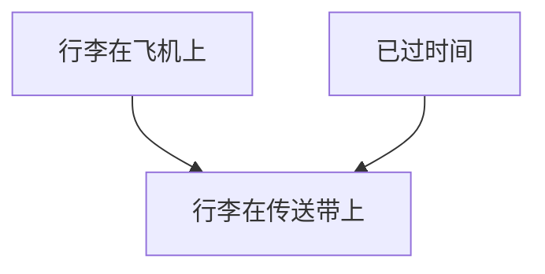
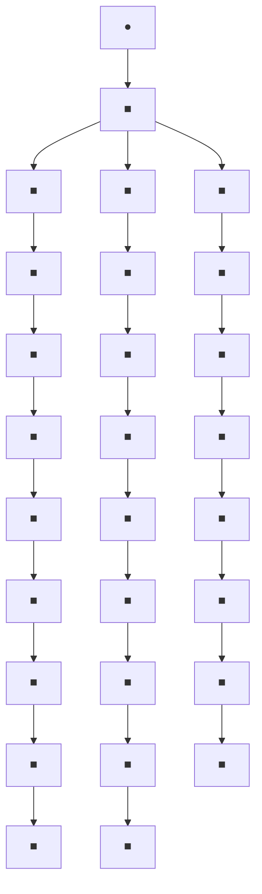
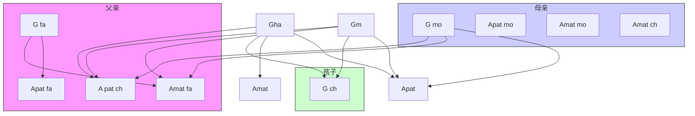
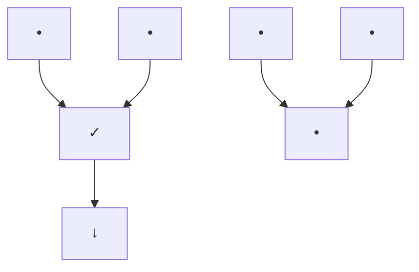
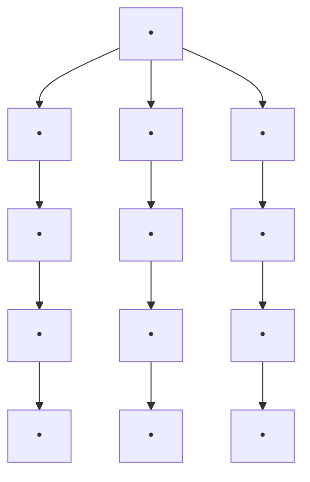

# 从证据到原因：贝叶斯牧师遇见福尔摩斯先生（FROM EVIDENCE TO CAUSES: REVEREND BAYES MEETS MR. HOLMES）

除非他们同意，否则两人会一同旅行吗？狮子若无猎物，会在森林中咆哮吗？
——阿摩司书 3:3

“这是基本常识，我亲爱的华生。”
这是夏洛克·福尔摩斯（Sherlock Holmes）说的话（至少电影里如此），就在他用一个著名的、毫不基本的推理让忠诚的助手眼花缭乱之前。但事实上，福尔摩斯所做的不仅仅是**演绎推理（deductive reasoning）**——即从假设到结论的推理。他的伟大技能在于**归纳推理（inductive reasoning）**，其方向相反：从证据到假设。

他的另一句名言暗示了他的工作方式：“当你排除了所有不可能的情况，剩下的，无论多么不可能，就一定是真相。”在归纳出几个假设后，福尔摩斯逐一排除它们，以便通过排除法演绎出正确的结论。虽然归纳和演绎相辅相成，但前者要神秘得多。这一事实让像福尔摩斯这样的侦探得以维持生计。

然而，近年来，人工智能领域的专家在自动化从证据到假设（以及从结果到原因）的推理过程方面取得了显著进展。我有幸参与了这一进展的最早期阶段，开发了其中一个基本工具——**贝叶斯网络（Bayesian networks）**。本章将解释什么是贝叶斯网络，介绍一些当前的应用，并讨论它们如何通过迂回的路径引导我研究因果关系的。

## 波拿巴，计算机侦探（BONAPARTE，计算机侦探）

2014年7月17日，马来西亚航空MH17航班从阿姆斯特丹史基浦机场起飞，目的地是吉隆坡。可惜，飞机未能抵达目的地。飞行三小时后，当飞机飞越乌克兰东部时，被一枚俄制地对空导弹击落。机上298人全部遇难，包括283名乘客和15名机组人员。

7月23日，第一批遗体抵达荷兰，当天被定为全国哀悼日。但对于海牙荷兰法医研究所（Netherlands Forensic Institute）的调查人员来说，7月23日是倒计时开始的日子。他们的任务是尽快识别遇难者的遗骸，并将其归还给亲人安葬。时间至关重要，因为每一天的不确定性都会给悲伤的家庭带来新的痛苦。

调查人员面临许多障碍：遗体严重烧伤，许多被存放在甲醛中（这会破坏DNA）；此外，由于乌克兰东部是战区，法医专家只能偶尔进入坠机现场；新发现的遗骸在接下来的十个月里陆续抵达。最后，调查人员没有遇难者之前的DNA记录，原因很简单——遇难者并非罪犯。他们只能依赖与家庭成员的部分匹配。

幸运的是，荷兰法医研究所的科学家们拥有一个强大的工具：一款名为 **Bonaparte** 的先进灾难遇难者识别程序。该软件由奈梅亨拉德堡德大学（Radboud University）的一个团队在2000年代中期开发，利用**贝叶斯网络（Bayesian networks）**整合来自遇难者多位家庭成员的DNA信息。

部分得益于 Bonaparte 的准确性和速度，荷兰法医研究所到2014年12月成功识别了298名遇难者中的294具遗骸。截至2016年，只有两名遇难者（均为荷兰公民）下落不明。

作为 Bonaparte 软件基础的机器学习工具——贝叶斯网络，以多种大多数人未曾察觉的方式影响着我们的生活。它们被用于语音识别软件、垃圾邮件过滤器、天气预报、潜在油井评估以及美国食品药品监督管理局（FDA）的医疗设备审批流程。如果你在微软Xbox上玩电子游戏，贝叶斯网络会为你的技能排名。如果你拥有一部手机，你的手机从成千上万个信号中挑选出你的通话所使用的编码，正是通过为贝叶斯网络设计的**置信传播算法（belief propagation algorithm）**解码的。你可能听说过另一家公司——谷歌（Google）的首席互联网推广官文特·瑟夫（Vint Cerf）这样说：“我们是贝叶斯方法的重度消费者。”

在本章中，我将讲述贝叶斯网络的故事，从它们18世纪的根源到20世纪80年代的发展，并给出一些当今使用的更多例子。它们与**因果图（causal diagrams）**的关系很简单：**因果图是一种贝叶斯网络，其中每条箭头都表示一个直接的因果关系（或至少是这种关系的可能性），方向与箭头一致**。并非所有贝叶斯网络都是因果的，在许多应用中这并不重要。然而，如果你曾想对你的贝叶斯网络提出第二层级或第三层级的问题，你必须极其谨慎地按照因果关系来绘制它。

## 贝叶斯牧师与逆概率问题（贝叶斯牧师与逆概率问题）

**托马斯·贝叶斯（Thomas Bayes）**——我在1985年以他的名字命名这些网络——从未梦想过他于18世纪50年代推导的一个公式有一天会被用于识别灾难遇难者。他关心的只是两个事件的概率：一个事件（假设）发生在另一个事件（证据）之前。尽管如此，因果关系是他非常关注的问题。事实上，因果追求是他分析“**逆概率（inverse probability）**”的驱动力。

**托马斯·贝叶斯牧师（Rev. Thomas Bayes，1702–1761）**是一位长老会牧师，看起来是个数学极客。作为英国国教会的反对者，他无法在牛津或剑桥学习，而是在苏格兰大学接受教育，在那里他很可能学到了不少数学知识。回到英格兰后，他继续钻研数学并组织数学讨论小组。

在他去世后发表的一篇文章中（见图3.1），贝叶斯解决了一个非常适合他的问题：让数学与神学对决。背景是：1748年，苏格兰哲学家**大卫·休谟（David Hume）**写了一篇题为《论奇迹》的文章，他在其中论证，目击者的证词永远无法证明奇迹发生过。休谟心中所想的奇迹当然是基督的复活，尽管他很聪明地没有明说。（二十年前，神学家托马斯·伍尔斯顿因写此类内容而以亵渎罪入狱。）休谟的主要观点是：本质上不可靠的证据无法推翻具有自然法则力量的命题，例如“死人不会复活”。

> **图3.1** 贝叶斯论文的标题页，发表于1763年（他去世后）。请注意，标题中使用了“机会”一词，当时是“概率”的同义词。

## PHILOSOPHICAL TRANSACTIONS,

GIVING SOME

**ACCOUNT**

**OF THE** Present Undertakings, Studies, and Labours, **OF THE**

## I NGENIOUS,

INMANYConfiderable Parts of the W OR L D.

V OL.LII. For the Year 1763.

LONDON:

Printed for L.DAvIs and C.REY MER·s, Printers to the RoY AL SocIETY, againft Gray's-InnGate, in Holbourn.

M.DCC.LXIV.

## [370]

quodque folum, certa nitri figna prabere, sed plura concurrere debere, ut de vero nitro producto dubium non relinquatur.

**LII. An Essay towards solving a Problem in the Doctrine of Chances.** By the late Rev. Mr. Bayes, F.R.S. communicated by Mr. Price, in a Letter to John Canton, A.M. F.R.S.

Dear Sir,

Read Dec. 23, 1763. I now send you an essay which I have found among the papers of our deceased friend Mr. Bayes, and which, in my opinion, has great merit, and well deserves to be preserved. Experimental philosophy, you will find, is nearly interested in the subject of it; and on this account there seems to be particular reason for thinking that a communication of it to the Royal Society cannot be improper.

He had, you know, the honour of being a member of that illustrious Society, and was much esteemed by many in it as a very able mathematician. In an introduction which he has writ to this Essay, he says, that his design at first in thinking on the subject of it was, to find out a method by which we might judge concerning the probability that an event has to happen, in given circumstances, upon supposition that we know nothing concerning it but that under the same circumstances——

对于贝叶斯来说，这一论断引发了一个自然的、可以说是福尔摩斯式的问题：**需要多少证据才能让我们相信，我们认为是不可发生的事情实际上已经发生了？** 当一个假设从不可能跨越到不可能，甚至到可能或几乎确定时，界限在哪里？

尽管这个问题是用概率的语言表述的，但其含义有意地具有神学色彩。**理查德·普莱斯（Richard Price）**，一位同僚牧师，在贝叶斯去世后从他的遗物中找到了这篇论文，并亲自撰写了一篇热情洋溢的引言将其送去发表，他明确指出了这一点：

> 我的意思是，要展示我们有什么理由相信，在事物的构成中存在着事件发生的固定法则，因此，世界的框架必定是某种智慧原因的力量和智慧的产物；从而确认从终极原因出发论证神存在的论点。很容易看出，这篇论文中解决的逆问题更直接地适用于这一目的；因为它以清晰和精确的方式向我们展示，在任何特定秩序或事件重复出现的情况下，有什么理由认为这种重复或秩序来源于自然中稳定的原因或规律，而非任何偶然的异常。

贝叶斯本人并没有在他的论文中讨论这些；普莱斯强调了这些神学含义，也许是为了让他朋友的论文产生更深远的影响。但事实证明，贝叶斯并不需要这种帮助。他的论文在250年后仍被铭记和争论，不是因为其神学，而是因为它表明**你可以从结果推导出原因的概率**。

如果我们知道原因，很容易估计结果的概率，这是一种**正向概率（forward probability）**。反过来——在贝叶斯时代被称为“逆概率”的问题——则更加困难。贝叶斯没有解释为什么更难；他将其视为不言而喻，证明了它是可行的，并向我们展示了如何做到。

为了理解这个问题的本质，让我们看看他在1763年去世后发表的论文中自己提出的例子。想象一下，我们在桌子上击打一颗台球，确保它多次弹跳，以至于我们不知道它会停在何处。**它停在距离桌子左端 $x$ 英尺以内的概率是多少？**

如果我们知道桌子的长度，并且桌面完全光滑平整，那么这是一个非常简单的问题（图 3.2，上方）。例如，在一张 12 英尺的斯诺克球桌上，球停在距离末端 1 英尺范围内的概率是 $1/12$。在一张 8 英尺的台球桌上，这个概率是 $1/8$。

> **图 3.2.** 托马斯·贝叶斯的台球桌示例。在第一个版本中，这是一个正向概率问题，我们知道桌子的长度，并希望计算球停在距离末端 $x$ 英尺范围内的概率。在第二个版本中，这是一个逆概率问题，我们观察到球停在距离末端 $x$ 英尺处，并希望估计桌子长度为 $L$ 的可能性。（来源：Maayan Harel 绘图。）

$$
L = ? 
$$

$$
x
$$

我们对物理学的直观理解告诉我们，一般来说，如果桌子的长度为 $L$ 英尺，则球停在距离末端 $x$ 英尺范围内的概率为 $x/L$。桌子长度（$L$）越长，概率越低，因为球有更多的可能位置作为其最终停靠点。另一方面，$x$ 越大，概率越高，因为它包含了更大的停靠位置集合。

现在考虑逆概率问题。我们观察到球的最终位置距离末端 $x = 1$ 英尺，但我们不知道长度 $L$（图 3.2，下方）。贝叶斯牧师问道，长度是，比如说，100 英尺的概率是多少？常识告诉我们，$L$ 是 50 英尺的可能性比是 100 英尺的可能性更大，因为更长的桌子使得解释球为何最终停在离末端如此近的位置变得更加困难。但可能性大多少呢？“直觉”或“常识”并没有给我们明确的指导。

为什么正向概率（给定 $L$ 时 $x$ 的概率）在心理上比给定 $x$ 时 $L$ 的概率更容易评估？在这个例子中，这种不对称性源于这样一个事实：$L$ 扮演着原因的角色，而 $x$ 是结果。如果我们观察到原因——例如，鲍比向窗户扔了一个球——我们大多数人都能预测结果（球很可能会打破窗户）。人类认知正是沿着这个方向运作的。但是，给定结果（窗户破了），我们需要更多的信息来推断原因（是哪个男孩扔的球打破了窗户，甚至首先需要确定窗户是被球打破的）。这需要福尔摩斯那样的头脑来追踪所有可能的原因。贝叶斯着手打破这种认知不对称性，并解释即使是普通人也能评估逆概率。

为了了解贝叶斯方法是如何运作的，让我们从一个关于茶馆顾客的简单例子开始，我们有记录他们偏好的数据。正如我们从第 1 章中了解到的，数据完全无视因果不对称性，因此应该为我们提供解决逆概率难题的方法。

假设进店顾客中有三分之二点茶，而点茶的顾客中有一半也点烤饼。那么，既点茶又点烤饼的顾客占顾客总数的比例是多少？这个问题没有技巧，我希望答案几乎是显而易见的。因为三分之二的一半是三分之一，所以三分之一的顾客既点茶又点烤饼。

为了进行数值说明，假设我们统计接下来进店的十二位顾客的点单情况。如表 3.1 所示，三分之二的顾客（1、5、6、7、8、9、10、12）点了茶，其中一半的人点了烤饼（1、5、8、12）。因此，既点茶又点烤饼的顾客比例确实是 $(1/2) \times (2/3) = 1/3$，正如我们在看到具体数据之前所预测的那样。

**表 3.1.** 茶与烤饼示例的虚构数据。

| 顾客 | 茶 | 烤饼 | 顾客 | 茶 | 烤饼 |
|----------|-----|--------|----------|-----|--------|
| 1        | 是 | 是    | 7        | 是 | 否     |
| 2        | 否  | 是    | 8        | 是 | 是    |
| 3        | 否  | 否     | 9        | 是 | 否     |
| 4        | 否  | 否     | 10       | 是 | 否     |
| 5        | 是 | 是    | 11       | 否  | 否     |
| 6        | 是 | 否     | 12       | 是 | 是    |

**贝叶斯法则（Bayes's rule）**的起点是注意到我们可以按相反顺序分析数据。也就是说，我们可以观察到十二分之五的顾客（1、2、5、8、12）点了烤饼，其中五分之四（1、5、8、12）点了茶。因此，既点茶又点烤饼的顾客比例是 $(4/5) \times (5/12) = 1/3$。当然，结果相同并非巧合；我们只是用两种不同的方式计算了同一个数量。顾客点单的时间顺序没有影响。

为了将其作为一般规则，我们可以用 $P(T)$ 表示顾客点茶的概率，用 $P(S)$ 表示他点烤饼的概率。如果我们已经知道一位顾客点了茶，那么 $P(S \mid T)$ 表示他点烤饼的概率。（请记住，竖线代表“给定”。）同样，$P(T \mid S)$ 表示在已知他点了烤饼的情况下，他点茶的概率。那么，我们做的第一个计算表明：

$$
P(S \text{ 且 } T) = P(S \mid T) P(T).
$$

第二个计算表明：

$$
P (S \text{ 且 } T) = P (T \mid S) P (S).
$$

现在，正如欧几里得在 2300 年前所说，两个分别等于第三个量的事物也彼此相等。这意味着必然有：

$$
P (S \mid T) P (T) = P (T \mid S) P (S). \tag{3.1}
$$

这个看似简单的方程后来被称为“**贝叶斯法则**”。如果我们仔细审视它的含义，就会发现它为逆概率问题提供了一个通用解决方案。它告诉我们，如果我们知道给定 $T$ 时 $S$ 的概率 $P(S \mid T)$，那么我们应该能够计算出给定 $S$ 时 $T$ 的概率 $P(T \mid S)$，当然前提是我们知道 $P(T)$ 和 $P(S)$。这也许是贝叶斯法则在统计学中最重要的作用：我们可以直接在一个方向上估计条件概率，在这个方向上我们的判断更可靠，然后利用数学推导出另一个方向上的条件概率，而在那个方向上我们的判断相当模糊。这个方程在**贝叶斯网络（Bayesian networks）**中也扮演着同样的角色；我们告诉计算机正向概率，计算机在需要时告诉我们逆概率。

为了了解贝叶斯法则在茶馆例子中是如何工作的，假设你懒得计算 $P(T \mid S)$，并且把你的包含数据的电子表格落在了家里。然而，你碰巧记得点茶的人中有一半也点烤饼，三分之二的顾客点茶，十二分之五的顾客点烤饼。出乎意料的是，你的老板问你：“但是，点烤饼的人中，点茶的比例是多少？” 没必要慌张，因为你可以从其他概率中推算出来。贝叶斯法则表明 $P(T \mid S) (5/12) = (1/2)(2/3)$，所以你的答案是 $P(T \mid S) = 4/5$，因为 $4/5$ 是唯一能使这个方程成立的 $P(T \mid S)$ 的值。

我们也可以将贝叶斯法则视为一种更新我们对特定假设信念的方法。理解这一点极其重要，因为人类对未来事件的信念很大程度上取决于这些事件或类似事件在过去发生的频率。事实上，当一位顾客走进餐厅时，基于我们过去与类似顾客打交道的经验，我们相信她可能想要茶。但如果她先点了烤饼，我们就变得更加确定。实际上，我们甚至可能会建议：“我猜你想要茶搭配吧？” 贝叶斯法则只是让我们能够为这个推理过程赋予数值。从表 3.1 中，我们看到顾客想要茶的**先验概率（prior probability）**（即当她进门时，在她点任何东西之前）是三分之二。但如果顾客点了烤饼，现在我们获得了关于她的额外信息。在已知她点了烤饼的情况下，她想要茶的**后验概率（updated probability）**是 $P(T \mid S) = 4/5$。

从数学上讲，贝叶斯法则的全部内容就是这些。它看起来几乎微不足道。它仅仅涉及**条件概率（conditional probability）**的概念，再加上一点古希腊逻辑。你可能会理所当然地问，如此简单的技巧如何能让贝叶斯成名，以及为什么人们围绕他的法则争论了 250 年。毕竟，数学事实本应平息争议，而不是制造争议。

在此我必须承认，在茶馆的例子中，通过从数据推导贝叶斯法则，我忽略了两个深刻的反对意见，一个是哲学上的，另一个是实践上的。哲学上的反对意见源于将概率解释为信念的程度，我们在茶馆例子中隐含地使用了这一点。谁曾说过信念会像数据中的比例那样起作用或应该起作用？

哲学辩论的核心在于，我们是否能够合法地将“给定我知道”这一表述转化为概率的语言。即使我们同意无条件概率 $P(S)$、$P(T)$ 和 $P(S \text{ 且 } T)$ 反映了我在这些命题上的信念程度，但谁又能说，我修正后的对 $T$ 的信念程度应该等于比率 $P(S \text{ 且 } T)/P(T)$，正如贝叶斯法则所规定的那样？ “给定我知道 $T$” 是否等同于“在 $T$ 发生的情况下”？概率的语言，用像 $P(S)$ 这样的符号来表达，其本意是捕捉机会游戏中的频率概念。但“给定我知道”这一表述是认识论层面的，应该由知识的逻辑来支配，而不是频率和比例的逻辑。

从哲学角度来看，托马斯·贝叶斯的成就就在于他首次提出了条件概率的正式定义，即比率 $P(S \mid T) = P(S \text{ 且 } T)/P(T)$。他的论文诚然是模糊的；他没有“条件概率”这个术语，而是使用了冗长的语言“在假设第一个[事件]发生的情况下第二个[事件]的概率”。认识到“给定”关系应该有自己的符号，这一认识直到 1880 年代才逐渐形成，并且直到 1931 年，哈罗德·杰弗里斯（Harold Jeffreys，更多以地球物理学家而非概率理论家闻名）才引入了现在标准的竖线符号 $P(S \mid T)$。

正如我们所看到的，贝叶斯法则在形式上是其条件概率定义的一个基本推论。但从认识论上讲，它远非基本。实际上，它充当了根据证据更新信念的规范性规则。换句话说，我们不应仅仅将贝叶斯法则视为对“条件概率”这个新概念的便捷定义，而应将其视为一个经验性主张，用以忠实地表达“给定我知道”这一英语表述。它断言，除其他事项外，一个人在发现 $T$ 后赋予 $S$ 的信念，绝不会低于该人在发现 $T$ 之前赋予 $S \text{ 且 } T$ 的信念程度。此外，它意味着证据 $T$ 越令人惊讶——即 $P(T)$ 越小——一个人就越应该对其原因 $S$ 确信无疑。难怪贝叶斯和他的朋友普莱斯（Price），作为圣公会牧师，将此视为对休谟的有力反驳。如果 $T$ 是一个奇迹（“基督从死里复活”），而 $S$ 是一个密切相关的假设（“基督是上帝之子”），那么如果我们确切知道 $T$ 是真实的，我们对 $S$ 的信念程度会非常显著地增加。奇迹越神奇，解释其发生的假设就越可信。这解释了为什么《新约》的作者们对他们的目击证据印象如此深刻。

现在让我讨论对贝叶斯法则的实践性反对意见——当我们离开神学领域进入科学领域时，这一点可能更为重要。如果我们试图将该法则应用于台球难题，为了找到 $P(L \mid x)$，我们需要一个从台球物理学中无法获得的数量：我们需要长度 $L$ 的先验概率，这与我们想要估计的 $P(L \mid x)$ 同样难以估计。而且，这个概率会因人而异，显著变化，取决于个人对不同长度桌子的先前经验。一个一生中从未见过斯诺克球桌的人会非常怀疑 $L$ 可能超过 10 英尺。另一方面，一个只见过斯诺克球桌、从未见过台球桌的人，会给 $L$ 小于 10 英尺赋予非常低的先验概率。这种变异性，也称为“**主观性（subjectivity）**”，有时被视为贝叶斯推断的一个缺陷。其他人则认为这是一个强大的优势；它允许我们用数学方式表达个人经验，并以原则性和透明的方式将其与数据结合起来。在普通直觉失效或情绪可能误导我们的情况下，贝叶斯法则指导着我们的推理。我们将在每个人都熟悉的情境中展示这种力量。

假设你接受了一项医学检查，看看是否患有某种疾病，结果呈阳性。你患病的可能性有多大？具体来说，假设疾病是乳腺癌，检查是乳房 X 光检查。在这个例子中，正向概率是给定你患病的情况下检查呈阳性的概率：$P(\text{检查} \mid \text{疾病})$。这就是医生所说的检查的“**敏感性（sensitivity）**”，或正确检测疾病的能力。通常，它对所有类型的患者都是相同的，因为它只取决于检测仪器发现与疾病相关的异常的技术能力。逆概率无疑是你更关心的：给定检查结果为阳性，我患病的概率是多少？这是 $P(\text{疾病} \mid \text{检查})$，它代表了信息在非因果方向上的流动，从检查结果到患病概率。这个概率不一定对所有类型的患者都相同；对于有家族病史的患者，我们肯定会比没有病史的患者对阳性结果更加警惕。

请注意，我们已经开始谈论因果和非因果方向。我们在茶馆例子中没有这样做，因为先点茶还是先点烤饼并不重要。重要的只是我们感觉哪个条件概率更容易评估。但因果背景澄清了为什么我们在评估“逆概率”时感觉不那么自在，而贝叶斯的论文明确指出，这正是

其中新的术语“**似然比（likelihood ratio）**”由 $P(T \mid D) / P(T)$ 给出。它衡量了在患病人群中阳性检查结果比在总人群中可能高出多少。因此，方程 3.2 告诉我们，无论先验概率是多少，新证据 $T$ 都会以一个固定的比率增加 $D$ 的概率。

让我们做一个例子来看看这个重要概念是如何运作的。对于一个典型的 40 岁女性来说，明年患乳腺癌的概率约为七百分之一，所以**我们**将以此作为我们的先验概率。

为了计算似然比，我们需要知道 $P(T \mid D)$ 和 $P(T)$。在医学背景下，$P(T \mid D)$ 是乳房 X 光检查的敏感性——即如果你患有癌症，检查结果呈阳性的概率。根据**乳腺癌监测联盟（Breast Cancer Surveillance Consortium, BCSC）**的数据，40 岁女性乳房 X 光检查的敏感性为 73%。

分母 $P(T)$ 则稍微棘手一些。阳性检查结果 $T$ 可能来自患病患者，也可能来自未患病患者。因此，$P(T)$ 应该是 $P(T \mid D)$（患病者中检查呈阳性的概率）和 $P(T \mid \sim D)$（未患病者中检查呈阳性的概率）的加权平均值。后者被称为**假阳性率（false positive rate）**。根据 BCSC 的数据，40 岁女性的假阳性率约为 12%。

为什么是加权平均值？因为健康女性（$\sim D$）的数量远多于患癌女性（$D$）。事实上，每 700 名女性中只有 1 人患癌，其余 699 人未患癌，因此随机选择一名女性检查呈阳性的概率，受 699 名未患癌女性的影响应该远大于受那 1 名患癌女性的影响。

在数学上，我们按如下方式计算加权平均值：

$$
P(T) = (1 / 700) \times (73\%) + (699 / 700) \times (12\%) \approx 12.1\%
$$

权重来源于每 700 名女性中只有 1 人有 73% 的概率检查呈阳性，而其他 699 人有 12% 的概率。正如你可能预料的那样，$P(T)$ 非常接近假阳性率。

既然我们知道了 $P(T)$，我们最终可以计算更新后的概率——该女性在检查结果呈阳性后患乳腺癌的几率。似然比是 $73\% / 12.1\% \approx 6$。正如我之前所说，这是我们将她的先验概率放大以计算她患癌更新概率的因子。由于她的先验概率是七百分之一，她的更新概率是 $6 \times 1 / 700 \approx 1 / 116$。换句话说，她患癌的几率仍然低于 1%。

这个结论令人震惊。我认为大多数乳房 X 光检查呈阳性的 40 岁女性在得知她们患乳腺癌的几率仍然低于 1% 时会感到震惊。图 3.3 可能使原因更容易理解：极少数的真阳性（即患有乳腺癌的女性）被大量的假阳性所淹没。我们对这个结果感到惊讶，源于对正向概率（已被充分研究和详尽记录）和逆概率（个人决策所需）之间常见的认知混淆。

我们的感知与现实之间的冲突部分解释了 2009 年美国预防服务工作组（US Preventive Services Task Force）建议 40 岁女性不应每年进行乳房 X 光检查时引起的强烈抗议。该工作组理解许多女性不理解的一点：在这个年龄，阳性检查结果更可能是假警报而非检测出癌症，许多女性因此遭受不必要的恐慌（并接受不必要的治疗）。

然而，如果我们的患者携带使她处于乳腺癌高风险的基因——例如，明年患病几率是二十分之一——那么情况将大不相同。那么，阳性检查结果会将概率提高到近三分之一。对于处于这种情况的女性来说，检查提供救命信息的可能性要高得多。这就是为什么该工作组继续建议高风险女性每年进行乳房 X 光检查。

这个例子表明，$P(\text{疾病} \mid \text{检查})$ 对每个人来说并不相同；它依赖于情境。如果你知道自己一开始就处于疾病的高风险中，贝叶斯法则允许你将这一信息纳入考量。或者，如果你知道自己有免疫力，你甚至不需要费心去检查！相比之下，$P(\text{检查} \mid \text{疾病})$ 并不依赖于你是否处于高风险。它对这种变化是“稳健的”，这在一定程度上解释了为什么医生会以正向概率来组织知识和进行交流。前者是疾病本身、其进展阶段或检测仪器敏感性的属性；因此，它们对疾病的原因（流行病、饮食、卫生、社会经济状况、家族病史）相对保持不变。而逆概率 $P(\text{疾病} \mid \text{检查})$ 对这些条件很敏感。

有历史眼光的读者肯定会好奇贝叶斯是如何处理 $P(L)$ 的主观性的，其中 $L$ 是台球桌的长度。答案分为两部分。首先，贝叶斯感兴趣的并不是桌子本身的长度，而是其未来的后果（即，下一个球最终停在桌子上某个指定位置的概率）。其次，贝叶斯假设 $L$ 是通过从一个更远的距离（比如 $L^*$）击打一个台球而机械地确定的。通过这种方式，他赋予了 $P(L)$ 客观性，并将问题转化为一个先验概率可以从数据中估计的问题，正如我们在茶馆和癌症检测例子中看到的那样。

在许多方面，贝叶斯法则是科学方法的精髓。教科书对科学方法的描述大致如下：

- 提出一个假设。
- 推导出该假设的一个可检验的推论。
- 进行实验并收集证据。
- 更新你对假设的信念。

通常教科书处理的是简单的是/否测试和更新；证据要么证实要么反驳假设。但生活和科学从来都不是那么简单！所有证据都带有一定的不确定性。贝叶斯法则告诉我们如何在现实世界中执行步骤 (4)。

# 从贝叶斯规则到贝叶斯网络（From Bayes's Rule to Bayesian Networks）

在20世纪80年代初期，人工智能领域陷入了一个死胡同。自从艾伦·图灵在1950年的论文《计算机器与智能》中首次提出这一挑战以来，人工智能的主要方法一直是所谓的**基于规则的系统（rule-based systems）**或**专家系统（expert systems）**，它们将人类知识组织为具体事实和一般事实的集合，并配以连接它们的推理规则。例如：苏格拉底是人（具体事实）。所有人都是凡人（一般事实）。从这个知识库中，我们（或智能机器）可以使用通用推理规则推导出苏格拉底是凡人这一事实：如果所有A都是B，且x是A，那么x是B。

这种方法在理论上是可行的，但严格死板的规则很少能捕捉到现实生活中的知识。也许我们没有意识到，我们一直在处理规则的例外情况和证据的不确定性。到1980年，专家系统在从不确定知识中进行正确推理方面显然遇到了困难。计算机无法复制人类专家的推理过程，因为专家们自己也无法用系统提供的语言来表达他们的思维过程。

因此，20世纪70年代末，人工智能界就如何处理不确定性问题展开了激烈的讨论。各种想法层出不穷。伯克利的**洛特菲·扎德（Lotfi Zadeh）**提出了**模糊逻辑（fuzzy logic）**，其中陈述既不是真也不是假，而是取一系列可能的真值。堪萨斯大学的**格伦·谢弗（Glen Shafer）**提出了**信度函数（belief functions）**，为每个事实分配两个概率，一个表示其"可能"的可能性，另一个表示其"可证明"的可能性。斯坦福大学的**爱德华·费根鲍姆（Edward Feigenbaum）**及其同事尝试了**确定性因子（certainty factors）**，将不确定性的数值度量插入到他们的确定性推理规则中。

不幸的是，尽管这些方法巧妙，但它们都有一个共同的缺陷：它们模拟的是专家，而不是世界，因此往往会产生意想不到的结果。例如，它们无法同时以诊断和预测模式运行，而这正是贝叶斯规则无可争议的专长。在确定性因子方法中，"如果起火，则有烟（确定性为 $c_1$）"这一规则无法与"如果有烟，则起火（确定性为 $c_2$）"连贯地结合，而不会引发信度的失控增长。

概率论在当时也被考虑过，但立即声名狼藉，因为对存储空间和处理时间的要求变得极为苛刻。我进入这个领域相当晚，是在1982年，提出了一个显而易见但激进的建议：不要从头重新发明一种新的不确定性理论，而是保留概率论作为常识的守护者，仅修复其计算上的缺陷。更具体地说，不再像以前那样用巨大的表格来表示概率，而是用**松散耦合变量（loosely coupled variables）**的网络来表示概率。如果我们只允许每个变量与少数几个相邻变量交互，那么我们就有可能克服导致其他概率论者失败的计算障碍。

这个想法并非来自梦境；它来自**大卫·鲁梅尔哈特（David Rumelhart）**的一篇文章，他是加州大学圣地亚哥分校的认知科学家，也是**神经网络（neural networks）**的先驱。他于1976年发表的关于儿童阅读的文章明确指出，阅读是一个复杂的过程，其中许多不同层次的神经元同时活跃（见图3.4）。一些神经元只是识别单个特征——圆形或线条。在它们之上，另一层神经元正在组合这些形状，并形成关于字母可能是什么的推测。在图3.4中，网络正在处理第二个单词的大量歧义。在字母层面，它可能是"FHP"，但在单词层面这没有多大意义。在单词层面，它可能是"FAR"或"CAR"或"FAT"。神经元将这些信息向上传递到句法层面，句法层面决定在单词"THE"之后，预期会有一个名词。最后，这些信息一直传递到语义层面，语义层面意识到前一个句子提到了大众汽车，所以这个短语很可能是"THE CAR"，指的是同一辆大众汽车。关键在于，所有神经元都在来回传递信息，从上到下，从下到上，以及从一侧到另一侧。这是一个高度并行的系统，与我们自认为大脑是一个单一的、集中控制的系统的认知截然不同。

阅读鲁梅尔哈特的论文，我深信任何人工智能都必须以我们对人类神经信息处理的了解为模型，并且不确定性下的机器推理必须用类似的**消息传递架构（message-passing architecture）**来构建。但消息是什么？这花了我好几个月的时间才弄清楚。我终于意识到，消息在一个方向上是**条件概率（conditional probabilities）**，在另一个方向上是**似然比（likelihood ratios）**。

> **图3.4.** 大卫·鲁梅尔哈特关于消息传递网络如何学习阅读短语"THE CAR"的草图。（来源：经加州大学圣地亚哥分校大脑与认知中心许可。）

```mermaid
graph TD
  A["语义层"] --> B["'Object'"]
  A --> C["'Lake'"]
  A --> D["'Volkswagen'"]
  A --> E["'NP'"]
  A --> F["'DET'"]
  A --> G["'the'"]
  A --> H["'Car'"]
  A --> I["'Noun'"]
  A --> J["'L''"]
  A --> K["'cat'"]
  A --> L["'at'"]
  A --> M["'ch'"]
  A --> N["'f'"]
  A --> O["'a'"]
  A --> P["'t'"]
  A --> Q["'L'"]
  A --> R["'r'"]
  A --> S["'e'"]
  A --> T["'h'"]
  A --> U["'t'"]
  A --> V["'V'"]
  A --> W["THE CAR"]
  X["句法层"] --> B
  X --> C
  X --> D
  X --> E
  X --> F
  X --> G
  X --> H
  X --> I
  X --> J
  X --> K
  X --> L
  X --> M
  X --> N
  X --> O
  X --> P
  X --> Q
  X --> R
  X --> S
  X --> T
  X --> U
  X --> V
  X --> W
  Y["词汇层"] --> Z["'Det'"]
  Y --> AA["'cat'"]
  Y --> AB["'at'"]
  Y --> AC["'cat'"]
  Y --> AD["'cat'"]
  Y --> AE["'cat'"]
  Y --> AF["'cat'"]
  Y --> AG["'cat'"]
  Y --> AH["'cat'"]
  Y --> AI["'cat'"]
  Y --> AJ["'cat'"]
  Y --> AK["'cat'"]
  Y --> AL["'cat'"]
  Y --> AM["'cat'"]
  Y --> AN["'cat'"]
  Y --> AO["'cat'"]
  Y --> AP["'cat'"]
  Y --> AQ["'cat'"]
  Y --> AR["'cat'"]
  Y --> AS["'cat'"]
  Y --> AT["'cat'"]
  Y --> AU["'cat'"]
  Y --> AV["'cat'"]
  Y --> AW["'cat'"]
  Y --> AX["'cat'"]
  Y --> AY["'Cat'"]
  Y --> AZ["'Cat'"]
  Y --> BA["'Cat'"]
  Y --> BB["'Cat'"]
  Y --> BC["'Cat'"]
  Y --> BD["'Cat'"]
  Y --> BE["'Cat'"]
  Y --> BF["'Cat'"]
  Y --> BG["'Cat'"]
  Y --> BH["'Cat'"]
  Y --> BI["'Cat'"]
```

更准确地说，我假设网络是分层的，箭头从高层神经元指向低层神经元，或从"父节点"指向"子节点"。每个节点会向其所有邻居（层次结构中上方和下方的节点）发送一条消息，说明其当前对其所跟踪变量的信度程度（例如，"我有三分之二的把握这个字母是R"）。接收者会根据消息的方向以两种不同的方式处理消息。如果消息从父节点传到子节点，子节点将使用条件概率更新其信度，就像我们在茶馆示例中看到的那样。如果消息从子节点传到父节点，父节点将通过将信度乘以似然比来更新其信度，就像在乳腺X光检查示例中那样。

对网络中的每个节点重复应用这两个规则被称为**信度传播（belief propagation）**。事后看来，这些规则没有任何武断或人为之处；它们严格遵循贝叶斯规则。真正的挑战是确保无论这些消息以何种顺序发送，最终都会稳定在一个舒适的平衡状态；而且，最终的平衡状态将代表正确的信度状态。

## 贝叶斯网络：原因对数据说了什么（Bayesian Networks: What Causes Say About Data）

虽然贝叶斯不知道，但他的**逆概率（inverse probability）**规则代表了最简单的贝叶斯网络。我们现在已经以几种形式看到了这个网络：茶与烤饼、疾病测试，或者更一般地，假设与证据。与我们在本书中将要处理的因果图不同，贝叶斯网络并不假设箭头具有任何因果含义。箭头仅表示我们知道"正向"概率，即 $P(\text{烤饼} \mid \text{茶})$ 或 $P(\text{测试} \mid \text{疾病})$。贝叶斯规则告诉我们如何逆转这个过程，具体方法是将先验概率乘以似然比。

无论箭头是非因果的还是因果的，信度传播在形式上的工作方式完全相同。尽管如此，你可能有一种直觉，觉得我们在后一种情况下做了比前一种情况更有意义的事情。这是因为我们的大脑配备了用于理解因果关系（如癌症和乳腺X光检查）的特殊机制。而对于仅仅是关联关系（如茶和烤饼）则并非如此。

在具有一个链接的两个节点网络之后，下一步自然是一个具有两个链接的三个节点网络，我称之为"**连接点（junction）**"。这些是所有贝叶斯网络（以及因果网络）的构建模块。有三种基本类型的连接点，借助它们我们可以表征网络中任何箭头模式。

1. **$A \rightarrow B \rightarrow C$**。这种连接点是"**链（chain）**"或**中介（mediation）**的最简单示例。在科学中，人们通常认为 $B$ 是将 $A$ 的影响传递给 $C$ 的机制或"中介"。一个熟悉的例子是：火 $\rightarrow$ 烟 $\rightarrow$ 警报。虽然我们称它们为"火灾报警器"，但它们实际上是烟雾报警器。火本身不会触发警报，所以从火到警报没有直接的箭头。火也不会通过任何其他变量（如热量）触发警报。它只能通过向空气中释放烟雾分子来起作用。如果我们禁用该链中的链接，例如用通风橱吸走所有烟雾分子，那么就不会有警报。

   这一观察引出了关于链的一个重要概念点：中介 $B$ 将关于 $A$ 的信息与 $C$ "**屏蔽（screens off）**"，反之亦然。（这一点最初由德裔美国科学哲学家**汉斯·赖兴巴赫（Hans Reichenbach）**指出。）

   例如，一旦我们知道烟的值，了解火的情况不会给我们任何理由来提高或降低我们对警报的信度。这种信度的稳定性是阶梯第一层的概念；因此，当数据可用时，它也应在数据中显现。假设我们有一个数据库，记录了所有有火、有烟或警报响起的实例。如果我们只看 $烟 = 1$ 的行，我们会预期每次警报 $= 1$，无论 $火 = 0$ 还是 $火 = 1$。即使效果不是确定性的，这种屏蔽模式仍然成立。例如，想象一个有缺陷的警报系统，有5%的时间无法正确响应。如果我们只看 $烟 = 1$ 的行，我们会发现警报 $= 1$ 的概率是相同的（95%），无论 $火 = 0$ 还是 $火 = 1$。

   只看表中 $烟 = 1$ 的行这一过程被称为**以变量为条件（conditioning on a variable）**。同样，我们说，在给定烟的值的情况下，火和警报是**条件独立的（conditionally independent）**。如果你正在编程让机器更新其信度，这一点很重要；条件独立赋予机器专注于相关信息而忽略其余信息的许可。我们在日常思维中都需要这种许可，否则我们将把所有时间花在追逐虚假信号上。但是，当每一新信息都改变相关与不相关的边界时，我们如何决定忽略哪些信息？对人类来说，这种理解是自然而然的。即使是三岁的幼儿也能理解屏蔽效应，尽管他们对此没有名称。他们的本能必定来自某种心理表征，可能类似于因果图。但机器没有这种本能，这就是我们为它们配备因果图的原因之一。

2. **$A \leftarrow B \rightarrow C$**。这种连接点称为"**叉（fork）**"，$B$ 通常被称为 $A$ 和 $C$ 的**共同原因（common cause）**或**混杂因子（confounder）**。混杂因子会使 $A$ 和 $C$ 在统计上相关，即使它们之间没有直接的因果联系。一个很好的例子（由**大卫·弗里德曼（David Freedman）**提出）是：鞋码 $\leftarrow$ 孩子年龄 $\rightarrow$ 阅读能力。穿较大鞋子的孩子往往阅读水平更高。但这种关系不是因果关系。给孩子穿更大的鞋子并不会让他阅读得更好！相反，这两个变量都由第三个变量——孩子的年龄——来解释。年龄较大的孩子穿更大的鞋子，并且他们的阅读能力也更先进。

   我们可以通过以孩子的年龄为条件来消除这种**虚假相关（spurious correlation）**，正如**卡尔·皮尔逊（Karl Pearson）**和**乔治·乌德尼·尤尔（George Udny Yule）**所称的那样。例如，如果我们只看七岁的孩子，我们预期鞋码和阅读能力之间没有关系。与链连接点的情况一样，在给定 $B$ 的条件下，$A$ 和 $C$ 是条件独立的。

   在我们继续讨论第三种连接点之前，我们需要补充一点说明。当我们孤立地看待这些连接点时，就会表现出我刚才提到的条件独立性。如果它们周围有额外的因果路径，这些路径也需要被考虑在内。贝叶斯网络的奇迹在于，我们现在孤立描述的这三种连接点足以解读出贝叶斯网络所隐含的所有独立性，无论网络多么复杂。

3. **$A \rightarrow B \leftarrow C$**。这是最迷人的连接点，称为"**碰撞子（collider）**"。**费利克斯·埃尔韦特（Felix Elwert）**和**克里斯·温希普（Chris Winship）**用好莱坞演员的三个特征说明了这种连接点：天赋 $\rightarrow$ 名气 $\leftarrow$ 美貌。这里我们断言，天赋和美貌都对演员的成功有贡献，但在一般人群中，美貌和天赋完全无关。

   我们现在将看到，当我们以中间变量为条件时，这种碰撞子模式的工作方式与链或叉完全相反。如果 $A$ 和 $C$ 最初是独立的，以 $B$ 为条件将使它们变得相关。例如，如果我们只看著名演员（换句话说，我们观察到变量 $名气 = 1$），我们将看到天赋和美貌之间存在负相关：发现一位名人没有吸引力会增加我们认为他或她有天赋的信度。

   这种负相关有时被称为**碰撞子偏差（collider bias）**或"**解释掉（explain-away）**"效应。为简单起见，假设你不需要同时拥有天赋和美貌才能成为名人；其中一个是够的。那么，如果名人A是一个特别好的演员，这就"解释掉"了他的成功，他不需要比普通人更美貌。另一方面，如果名人B是一个很差的演员，那么解释他成功的唯一方式就是他好看的外表。因此，在给定结果 $名气 = 1$ 的情况下，天赋和美貌呈反相关——尽管它们在总体中并不相关。即使在更现实的情况下，成功是美貌和天赋的复杂函数，解释掉效应仍然存在。诚然，这个例子有些杜撰，因为美貌和天赋很难客观衡量；尽管如此，碰撞子偏差是非常真实的，我们将在本书中看到许多例子。

这三种连接点——链、叉和碰撞子——就像通往**因果之梯（Ladder of Causation）**第一层和第二层之间大门的锁眼。如果我们透过它们窥视，我们可以看到产生我们观察到的数据的因果过程的秘密；每一种都代表一种不同的因果流模式，并在数据中留下条件依赖和条件独立的印记。在我的公开讲座中，我经常称它们为"上帝的礼物"，因为它们使我们能够测试因果模型、发现新模型、评估干预的效果等等。尽管如此，孤立地看，它们只能让我们窥见一斑。我们需要一把钥匙来完全打开大门，让我们踏上第二级阶梯。这把钥匙，我们将在第7章中了解，涉及所有三种连接点，被称为**d-分离（d-separation）**。这个概念告诉我们，对于模型中任何给定的路径模式，我们应该在数据中期望什么样的依赖模式。这种原因与概率之间的基本联系构成了贝叶斯网络对因果推断科学的主要贡献。

## 我的行李在哪里？从亚琛到桑给巴尔（Where Is My Bag? From Aachen to Zanzibar）

到目前为止，我只强调了贝叶斯网络的一个方面——即图及其箭头，这些箭头最好从原因指向效果。事实上，图就像贝叶斯网络的引擎。但像任何引擎一样，贝叶斯网络需要燃料来运行。这种燃料被称为**条件概率表（conditional probability table）**。

另一种说法是，图以定性的方式描述了变量之间的关系，但如果你想要定量的答案，你还需要定量的输入。在贝叶斯网络中，我们必须指定每个节点在其"父节点"给定的条件下的条件概率。（记住，节点的父节点是所有指向它的节点。）这些是前向概率，即 $P(\text{证据} \mid \text{假设})$。

在 $A$ 是根节点（没有箭头指向它）的情况下，我们只需要指定 $A$ 每个状态的先验概率。在我们的第二个网络——疾病测试中，疾病是一个根节点。因此，我们指定了一个人患有疾病的先验概率（在我们的示例中为 $1/700$）和她没有患病的先验概率（在我们的示例中为 $699/700$）。

将 $A$ 描绘为根节点，并不真正意味着 $A$ 没有先验原因。几乎没有任何变量有资格获得这样的地位。我们真正的意思是，$A$ 的任何先验原因都可以充分概括在 $A$ 为真的先验概率 $P(A)$ 中。例如，在疾病测试示例中，家族史可能是疾病的一个原因。但是，只要我们确信这个家族史不会影响变量测试（一旦我们知道疾病的状态），我们就不需要将其表示为图中的节点。然而，如果存在一个既影响疾病又直接影响测试的原因，那么该原因必须在图中明确表示。

在节点 $A$ 有父节点的情况下，$A$ 必须在决定自身状态之前"倾听"其父节点。在我们的乳腺X光检查示例中，测试的父节点是疾病。我们可以用一个 $2 \times 2$ 的表格来展示这个"倾听"过程（见表3.2）。例如，如果测试"听到" $D = 0$，那么 88% 的情况下它会取 $T = 0$，12% 的情况下它会取 $T = 1$。请注意，该表格的第二列包含了我们之前从乳腺癌监测联盟中看到的信息：假阳性率（右上角）为 12%，灵敏度（右下角）为 73%。其余两个条目被填充，以使每一行的总和为 100%。

**表3.2：一个简单的条件概率表。**

| 给定 $\downarrow$ 的概率 $\rightarrow$ | $T = 0$ | $T = 1$ |
|----------------------------------------|---------|---------|
| $D = 0$                               | 88      | 12      |
| $D = 1$                               | 27      | 73      |

随着我们转向更复杂的网络，条件概率表也会变得更加复杂。例如，如果一个节点有两个父节点，条件概率表必须考虑两个父节点的四种可能状态。让我们看一个具体的例子，由 BayesiaLab, Inc. 的 **Stefan Conrady** 和 **Lionel Jouffe** 提出。这是一个所有旅行者都熟悉的场景：我们可以称之为"我的行李在哪里？"

假设你刚刚在亚琛完成了一次紧张的转机后降落在桑给巴尔，正在等待你的行李箱出现在行李传送带上。其他乘客已经开始拿到他们的行李，但你一直在等待……等待……再等待。你的行李箱实际上没有赶上从亚琛到桑给巴尔的转机，这有多大的可能性？答案当然取决于你已经等待了多长时间。如果行李刚刚开始出现在传送带上，也许你应该耐心一点，再多等一会儿。如果你已经等了很长时间，那么情况就不妙了。我们可以通过建立一个因果图（图3.5）来量化这些焦虑。

**图3.5.** 机场/行李示例的因果图。

这个图反映了一个直观的想法：任何行李出现在传送带上都有两个原因。首先，它一开始必须在飞机上；否则，它肯定不会出现在传送带上。其次，行李出现在传送带上的可能性随着时间推移而增加……前提是它确实在飞机上。

要将因果图转化为贝叶斯网络，我们必须指定条件概率表。假设桑给巴尔机场的所有行李都在十分钟内卸载完毕。（桑给巴尔的效率非常高！）我们还假设您的行李成功转运的概率，$P(\text{行李在飞机上} = \text{真})$ 为 50%。（如果这冒犯了在亚琛机场工作的任何人，我深表歉意。我只是遵循 Conrady 和 Jouffe 的例子。就个人而言，我更倾向于假设一个更高的先验概率，比如 95%。）

这个贝叶斯网络真正核心的部分是“行李在行李转盘上”的条件概率表（见表 3.3）。这个表虽然很大，但应该很容易理解。前十一行表示，如果您的行李没有登上飞机（$\text{行李在飞机上} = \text{假}$），那么无论经过多长时间，它都不会出现在行李转盘上（$\text{行李转盘} = \text{假}$）。也就是说，$P(\text{行李转盘} = \text{假} \mid \text{行李在飞机上} = \text{假})$ 是 100%。这就是前十一行中 100 的含义。

另外十一行表示行李以稳定的速率从飞机上卸载。如果您的行李确实在飞机上，它在第一分钟被卸载的概率是 10%，在第二分钟被卸载的概率是 10%，依此类推。例如，5 分钟后，它有 50% 的概率已被卸载，因此我们在 $P(\text{行李转盘} = \text{真} \mid \text{行李在飞机上} = \text{真}, \text{时间} = 5)$ 中看到 50。十分钟后，所有行李都已卸载，所以 $P(\text{行李转盘} = \text{真} \mid \text{行李在飞机上} = \text{真}, \text{时间} = 10)$ 是 100%。因此，我们在表格的最后一项中看到 100。

与大多数贝叶斯网络一样，对这个贝叶斯网络最有趣的操作是解决逆概率问题：如果已经过去了 $x$ 分钟，而我还没有拿到我的行李，那么它在飞机上的概率是多少？贝叶斯法则自动完成了这个计算，并揭示了一个有趣的模式。一分钟后，它仍在飞机上的概率为 47%。（请记住，我们之前的假设是 50% 的概率。）五分钟后，概率下降到 33%。十分钟后，当然，它降为零。图 3.6 展示了概率随时间变化的曲线，人们可以称之为“放弃希望的曲线”。对我来说，有趣的是它是一条曲线：我认为大多数人会期望它是一条直线。它实际上向我们传递了一个相当乐观的信息：不要过早放弃希望！根据这条曲线，在分配时间的前半段，你应该只放弃三分之一的希望。

**表 3.3.** 一个更复杂的条件概率表。

| 概率 →, 给定 ↓ | 行李转盘 = 假 | 行李转盘 = 真 |
|:---|:---:|:---:|
| **行李在飞机上** | **经过时间** | |
| 假 | 0 | 100 | 0 |
| 假 | 1 | 100 | 0 |
| 假 | 2 | 100 | 0 |
| 假 | 3 | 100 | 0 |
| 假 | 4 | 100 | 0 |
| 假 | 5 | 100 | 0 |
| 假 | 6 | 100 | 0 |
| 假 | 7 | 100 | 0 |
| 假 | 8 | 100 | 0 |
| 假 | 9 | 100 | 0 |
| 假 | 10 | 100 | 0 |
| 真 | 0 | 100 | 0 |
| 真 | 1 | 90 | 10 |
| 真 | 2 | 80 | 20 |
| 真 | 3 | 70 | 30 |
| 真 | 4 | 60 | 40 |
| 真 | 5 | 50 | 50 |
| 真 | 6 | 40 | 60 |
| 真 | 7 | 30 | 70 |
| 真 | 8 | 20 | 80 |
| 真 | 9 | 10 | 90 |
| 真 | 10 | 0 | 100 |

除了一个人生教训，我们还学到，你不想手动进行这种计算。即使在这个只有三个节点的微小网络中，也有 $2 \times 11 = 22$ 个父节点状态，每个都对子节点状态的概率有贡献。然而，对于计算机来说，这种计算是基本的……在某种程度上。如果它们不以有组织的方式进行，即使是最快的超级计算机也可能被庞大的计算量所淹没。如果一个节点有十个父节点，每个父节点有两个状态，那么条件概率表将有超过 1,000 行。而如果十个父节点每个都有十个状态，那么该表将有 100 亿行！因此，通常需要筛选网络中的连接，以便只保留最重要的连接，使网络变得“稀疏”。贝叶斯网络发展中的一项技术进步涉及寻找利用网络结构稀疏性来实现合理计算时间的方法。

## 现实世界中的贝叶斯网络（BAYESIAN NETWORKS IN THE REAL WORLD）

贝叶斯网络现在是一项成熟的技术，您可以从多家公司购买现成的贝叶斯网络软件。贝叶斯网络也嵌入在许多“智能”设备中。为了让您了解它们在现实世界应用中的使用方式，让我们回到本章开头提到的 Bonaparte DNA 匹配软件。

荷兰法医研究所（Netherlands Forensic Institute, NFI）每天都在使用 Bonaparte，主要用于失踪人员案件、刑事调查和移民案件（申请人必须证明他们在荷兰有十五名家庭成员）。然而，贝叶斯网络在重大灾难后（例如马来西亚航空 17 号航班坠毁事件）才能发挥其最令人印象深刻的作用。

在飞机失事的受害者中，几乎没有人（如果有的话）可以通过将残骸中的 DNA 与中央数据库中的 DNA 进行比对来识别。次优的方法是要求家庭成员提供 DNA 拭子，并寻找与受害者 DNA 的部分匹配。传统的（非贝叶斯）方法可以做到这一点，并已在解决荷兰、美国和其他地方的许多悬案中发挥了重要作用。例如，一个称为“亲子指数”或“兄弟姐妹指数”的简单公式可以估计未识别 DNA 来自被测试者父亲或兄弟的可能性。

然而，这些指数固有地受到限制，因为它们只适用于一个特定的关系，并且只适用于近亲关系。Bonaparte 背后的想法是使得能够使用来自更远亲属或多个亲属的 DNA 信息。Bonaparte 通过将家系图（参见图 3.7）转换为贝叶斯网络来实现这一点。

在图 3.8 中，我们看到 Bonaparte 如何将家系图的一小部分转换为（因果）贝叶斯网络。核心问题在于，在 DNA 测试中检测到的个体的基因型包含来自父亲和母亲的贡献，但我们无法分辨哪部分来自哪一方。因此，这两个贡献（称为“等位基因”）必须在贝叶斯网络中作为隐藏的、不可测量的变量来处理。Bonaparte 的部分工作是从证据（例如，他有一个蓝眼睛基因和一个黑眼睛基因；他父亲那边的表亲有蓝眼睛，但他母亲那边的表亲有黑眼睛）推断原因（受害者的蓝眼睛基因来自他的父亲）的概率。这是一个逆概率问题——正是贝叶斯规则被发明出来的目的。

> **图 3.7**：马来西亚航空坠机事件中一个拥有多名遇难者的真实家系图。（来源：数据由 Willem Burgers 提供。）

网络节点：
G —— 基因型（在 DNA 测试中观察到）
A —— 等位基因，父系（不可观测）
A —— 等位基因，母系（不可观测）

> **图 3.8.** 从 DNA 测试到贝叶斯网络。在贝叶斯网络中，未着色的节点代表等位基因，着色的节点代表基因型。数据仅在着色节点上可用，因为基因型无法指示哪个等位基因来自父亲，哪个来自母亲。贝叶斯网络能够对未观测到的节点进行推断，并允许我们估计给定 DNA 样本来自该孩子的可能性。（来源：Maayan Harel 的信息图。）

一旦贝叶斯网络建立起来，最后一步就是输入受害者的 DNA，并计算它适合家系图中特定位置的可能性。这是通过使用贝叶斯规则进行**信念传播（belief propagation）**来完成的。网络从对网络中每个节点相关陈述的特定置信度开始，例如“这个人的眼睛颜色父系等位基因是蓝色”。当新的证据被输入网络（在网络中的任何位置）时，网络中每个节点（上下行方向）的置信度将以级联方式发生变化。

因此，例如，一旦我们发现一个给定的样本与家系图中的一个人可能匹配，我们就可以将该信息在网络中向上和向下传播。通过这种方式，Bonaparte 不仅从在世家庭成员的 DNA 中学习，还从它已经做出的识别中学习。

这个例子生动地说明了贝叶斯网络的许多优势。一旦网络建立起来，调查人员无需干预来告诉它如何评估新数据。更新可以非常快速地完成。（贝叶斯网络特别适合在分布式计算机上编程。）该网络是**集成式（integrative）**的，这意味着它作为一个整体对任何新信息做出反应。这就是为什么即使来自阿姨或远房堂兄妹的 DNA 也能帮助识别受害者。

贝叶斯网络几乎像一个有生命的有机组织，这并非偶然，因为当我努力使它们工作时，这正是我脑海中的画面。我希望贝叶斯网络像人类大脑的神经元一样运作；你触动一个神经元，整个网络就会通过将信息传播到系统中的每个其他神经元来做出反应。

贝叶斯网络的**透明性（transparency）**使其区别于大多数其他机器学习方法，后者往往会产生难以理解的“黑箱”。在贝叶斯网络中，您可以跟踪每一步，并理解每条证据如何以及为何改变网络的信念。

尽管 Bonaparte 非常优雅，但值得注意的是它（尚）未整合的一个特性：**人类直觉（human intuition）**。一旦完成分析，它会为 NFI 的专家提供每个 DNA 样本最可能识别的排名以及每个识别的似然比。然后，调查人员可以自由地将 DNA 证据与从坠机现场恢复的其他物理证据以及他们的直觉结合起来，做出最终决定。目前，没有任何识别是由计算机单独完成的。因果推断的一个目标是创建更平滑的人机界面，这可能允许调查人员的直觉参与到信念传播的“舞蹈”中。

这个使用 Bonaparte 进行 DNA 识别的例子只是贝叶斯网络在**基因组学（genomics）**中应用的一个缩影。然而，我想继续讨论第二个应用，它已在当今社会变得无处不在。事实上，您口袋里很可能现在就有一个贝叶斯网络。它被称为手机，每部手机都使用基于信念传播的纠错算法。

从头开始讲，当您对着手机说话时，它会将您美妙的声音转换成一串 0 和 1（称为**比特（bits）**），并使用无线电信号进行传输。不幸的是，没有无线电信号能够以完美的保真度被接收。当信号传输到基站，然后传输到您朋友的手机时，一些随机比特会从 0 翻转为 1，反之亦然。

为了纠正这些错误，我们可以添加冗余信息。一种超简单的纠错方案是简单地将每个信息比特重复三次：将 1 编码为“111”，将 0 编码为“000”。有效的字符串“111”和“000”被称为**码字（codewords）**。如果接收器听到一个无效字符串，例如“101”，它将搜索最可能解释它的有效码字。0 出错的概率比两个 1 都高，因此解码器会将此消息解释为“111”，从而得出结论，信息比特是 1。

唉，这种编码效率极低，因为它使我们的所有消息长度增加了三倍。然而，通信工程师们已经努力了七十年，以寻找越来越好的纠错码。

解码问题与我们讨论过的其他逆概率问题相同，因为我们再次希望从证据（接收到的消息是“Hxllo wovld!”）推断假设（发送的消息是“Hello world!”）的概率。这种情况似乎非常适合应用信念传播。

1993 年，一位名叫 Claude Berrou 的法国电信工程师震惊了编码界，他提出了一种接近最优性能的纠错码。（换句话说，所需的冗余信息量接近理论最小值。）他的想法被称为**“Turbo 码（turbo code）”**，最好通过使用贝叶斯网络来表示它。

图 3.9(a) 展示了传统编码的工作原理。您对着手机说话产生的信息比特显示在第一行。它们使用您喜欢的任何编码（称之为编码 A）被编码成码字（第二行），然后这些码字在接收时带有一些错误（第三行）。该图是一个贝叶斯网络，我们可以使用信念传播从接收到的比特推断信息比特是什么。然而，这并不会以任何方式改进编码 A。

Berrou 的绝妙想法是，对每条消息进行两次编码，一次直接编码，一次在打乱消息后编码。这导致创建了两个独立的码字，并接收了两个带噪声的消息（图 3.9b）。没有已知的公式可以直接解码这种双重消息。但 Berrou 经验性地表明，如果你在贝叶斯网络上反复应用信念传播公式，会发生两件令人惊奇的事情。在大多数情况下（我的意思是大约 99.999% 的时间），你会得到正确的信息比特。不仅如此，你还可以使用更短的码字。简而言之，编码 A 的两个副本比一个要好得多。

> (a)

> (b)

> **图 3.9.** (a) 普通编码过程的贝叶斯网络表示。信息比特被转换成码字；这些码字被传输并在目的地接收时带有噪声（错误）。(b) Turbo 码的贝叶斯网络表示。信息比特被打乱并编码两次。解码通过在此网络上的信念传播进行。底部的每个处理器使用来自另一个处理器的信息，在迭代过程中改进其对隐藏码字的猜测。

这个简要的历史除了有一点之外都是正确的：Berrou 并不知道他在处理贝叶斯网络！他只是自己发现了信念传播算法。直到五年后，剑桥大学的 David MacKay 才意识到，这与他在 20 世纪 80 年代末摆弄贝叶斯网络时喜欢使用的算法是同一个。这使得 Berrou 的算法有了一个熟悉的理论背景，并允许信息理论家加深对其性能的理解。

事实上，另一位工程师，麻省理工学院的 Robert Gallager，早在 1960 年就发现了一种使用信念传播（尽管当时不叫这个名字）的编码，时间如此久远，以至于 MacKay 将他的编码描述为“几乎是超前的”。无论如何，它远远超前于它的时代。Gallager 需要在芯片上有数千个处理器，来回传递关于某个特定信息比特是 1 还是 0 的置信度信息。在 1960 年，这是不可能的，他的编码几乎被遗忘，直到 1998 年被 MacKay 重新发现。今天，它存在于每一部手机中。

无论以何种标准衡量，Turbo 码都取得了惊人的成功。在 Turbo 革命之前，2G 手机使用“软解码”（即概率），但不使用信念传播。3G 手机使用了 Berrou 的 Turbo 码，而 4G 手机使用了 Gallager 的类 Turbo 码。从消费者的角度来看，这意味着您的手机耗电更少，电池续航时间更长，因为编码和解码是手机最耗能的过程。此外，更好的编码意味着您不必离基站那么近。

# 从贝叶斯网络到因果图（From Bayesian Networks to Causal Diagrams）

在花了一整章讨论贝叶斯网络之后，你可能会好奇它们与本书其余部分的关系，特别是与我们在第1章中遇到的那种**因果图（causal diagrams）**的关系。当然，我如此详细地讨论它们，部分原因在于它们是我进入因果性领域的个人路径。但更重要的是，从理论和实践两个角度来看，**贝叶斯网络（Bayesian networks）**掌握着使因果图能够与数据对接的关键。贝叶斯网络的所有概率性质（包括我们本章前面讨论的连接点）以及为其开发的**信念传播算法（belief propagation algorithms）**在因果图中仍然有效。事实上，它们是理解**因果推断（causal inference）**不可或缺的工具。

贝叶斯网络与因果图之间的主要区别在于它们的构建方式以及用途。贝叶斯网络本质上不过是一个庞大概率表的紧凑表示。箭头仅意味着子节点的概率通过某个公式（条件概率表）与父节点的值相关，并且这种关系是充分的。也就是说，知道子节点的更多祖先不会改变该公式。同样，任意两个节点之间缺失的箭头意味着，一旦我们知道它们父节点的值，它们就是独立的。我们在之前讨论链和连接中的屏蔽效应时，已经看到了这一陈述的简单版本。在链 $A \to B \to C$ 中，$A$ 和 $C$ 之间缺失的箭头意味着，一旦我们知道它们父节点的值，$A$ 和 $C$ 就是独立的。由于 $A$ 没有父节点，而 $C$ 唯一的父节点是 $B$，因此一旦我们知道 $B$ 的值，$A$ 和 $C$ 就是独立的，这与我们之前所说的相符。

然而，如果同样的图是作为因果图构建的，那么构建过程中的思考以及对最终图的解释都会发生变化。在构建阶段，我们需要检查每个变量，比如 $C$，并问自己它在选择其值之前“听取”了哪些其他变量。链式结构 $A \to B \to C$ 意味着 $B$ 只听取 $A$，$C$ 只听取 $B$，而 $A$ 不听取任何变量；也就是说，它是由不属于我们模型的外部力量决定的。

这种“听取”隐喻概括了因果网络所传达的全部知识；其余部分可以通过推导获得，有时需要借助数据。请注意，如果我们反转链中箭头的顺序，从而得到 $A \leftarrow B \rightarrow C$，该结构的因果解读将发生巨大变化，但独立性条件将保持不变。$A$ 和 $C$ 之间缺失的箭头仍然意味着，一旦我们知道 $B$ 的值，$A$ 和 $C$ 就是独立的，就像在原始链中一样。这有两个极其重要的含义：

- **第一**，它告诉我们，因果假设不能随意编造；它们要接受数据的检验，并且可能被证伪。例如，如果观察到的数据在给定 $B$ 的条件下并未显示 $A$ 和 $C$ 独立，那么我们可以安全地得出结论：链模型与数据不兼容，需要被丢弃（或修复）。
- **第二**，图的图形性质决定了哪些因果模型可以被数据区分，以及哪些模型无论数据多大都将永远无法区分。例如，仅凭数据我们无法区分分叉 $A \leftarrow B \rightarrow C$ 和链 $A \to B \to C$，因为这两个图暗示了相同的独立性条件。

另一种思考因果模型的便捷方式是借助**假设实验（hypothetical experiments）**。每个箭头可以被视为关于假设实验结果的陈述。从 $A$ 到 $C$ 的箭头意味着，如果我们只拨动 $A$，那么我们会预期看到 $C$ 的概率发生变化。从 $A$ 到 $C$ 缺失的箭头意味着，在同样的实验中，一旦我们保持 $C$ 的父节点（即上例中的 $B$）不变，我们就不会看到 $C$ 有任何变化。请注意，概率表达式“一旦我们知道 $B$ 的值”已经让位于因果表达式“一旦我们保持 $B$ 不变”，这意味着我们实际上在物理上阻止 $B$ 变化，并禁用了从 $A$ 到 $B$ 的箭头。

当然，构建因果网络时所投入的因果思维将在网络能够回答的问题类型上得到回报。贝叶斯网络只能告诉我们，在观察到另一个事件的情况下，某个事件发生的可能性有多大（**第一层级信息（rung-one information）**），而因果图可以回答**干预性（interventional）**和**反事实性（counterfactual）**问题。例如，因果分叉 $A \leftarrow B \rightarrow C$ 明确地告诉我们，拨动 $A$ 对 $C$ 没有影响，无论拨动多么剧烈。另一方面，贝叶斯网络无法处理“拨动”，无法区分“看到”和“做到”，也无法区分分叉和链。换句话说，链和分叉都会预测 $A$ 的观测变化与 $C$ 的变化相关联，但无法预测“拨动” $A$ 的效果。

现在我们来讨论贝叶斯网络对因果推断的第二个，或许是更重要的影响。图中图形结构与它所代表的数据之间被揭示的关系，现在使我们能够在不实际进行物理拨动的情况下模拟拨动。具体来说，应用巧妙的**条件作用操作序列（sequence of conditioning operations）**使我们能够预测行动或干预的效果，而无需实际进行实验。为了演示，再次考虑因果分叉 $A \leftarrow B \rightarrow C$，我们曾宣称 $A$ 和 $C$ 之间的相关性是虚假的。我们可以通过一个实验来验证这一点，在该实验中我们拨动 $A$，并发现 $A$ 和 $C$ 之间没有相关性。但我们可以做得更好。我们可以要求图模拟该实验，并告诉我们是否有任何条件作用操作可以再现实验中会出现的相关性。答案将是肯定的：“在给定 $B$ 的条件下测量的 $A$ 和 $C$ 之间的相关性，将等于实验中观察到的相关性。”这种相关性可以从数据中估计出来，在我们的例子中它将为零，忠实地证实了我们的直觉：拨动 $A$ 对 $C$ 没有影响。

如果贝叶斯网络的统计性质未在1980年至1988年间被揭示，那么这种通过巧妙观察来模拟干预的能力是不可能获得的。我们现在可以决定必须测量哪些变量集，以便从观察性研究中预测干预的效果。我们还可以回答“为什么？”的问题。例如，有人可能会问为什么拨动 $A$ 会使 $C$ 变化。这真的是 $A$ 的直接效应，还是中介变量 $B$ 的效应？如果两者都有，我们能否评估效应中有多少部分是由 $B$ 中介的？

要回答这类**中介问题（mediation questions）**，我们必须设想两个同时进行的干预：拨动 $A$ 并保持 $B$ 不变（注意：这与对 $B$ 进行条件作用不同）。如果我们能在物理上执行这种干预，我们就得到了问题的答案。但如果我们只能依靠观察性研究，我们就需要用一组巧妙的观察来模拟这两个动作。同样，图的图形结构会告诉我们这是否可能。

所有这些能力在1988年时仍属未来，那时我开始思考如何将因果关系与图结合起来。我只知道，那时所构想的贝叶斯网络无法回答我提出的问题。认识到你甚至无法仅凭数据区分 $A \to B \to C$ 和 $A \leftarrow B \rightarrow C$，这是一种令人痛苦的挫败感。

我知道你，读者，现在渴望学习因果图如何使我们能够进行像我刚才描述的那类计算。我们会在第7章到第9章中达到那一步。但我们还没有准备好，因为一旦我们开始谈论观察性研究与实验性研究，我们就离开了人工智能（AI）社区相对平静的水域，进入了统计学（statistics）更加波涛汹涌的水域——这些水域因其与因果性的不幸分离而变得动荡不安。回想起来，为在AI中争取贝叶斯网络的接受而斗争，与我为因果图必须进行的斗争相比，简直是野餐——不，是豪华游轮！——这场战斗仍在继续，还有少数几个抵抗的孤岛。

为了在这些新水域中航行，我们必须理解正统统计学家学会处理因果关系的方式，以及这些方法的局限性。我们上面提出的关于干预效应（包括直接效应和间接效应）的问题，并非主流统计学的一部分，主要是因为该领域的奠基者们从统计学中清除了因果关系的语言。但统计学家们仍然认为在一种情况下谈论原因和效果是允许的：**随机对照试验（Randomized Controlled Trial, RCT）**，其中处理 $A$ 被随机分配给某些个体而不给其他人，然后比较 $B$ 中观察到的变化。在这里，正统统计和因果推断都同意“$A$ 导致 $B$”这句话的含义。

在我们转向新的因果科学之前……