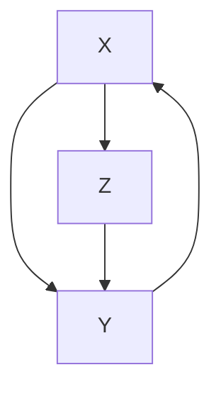
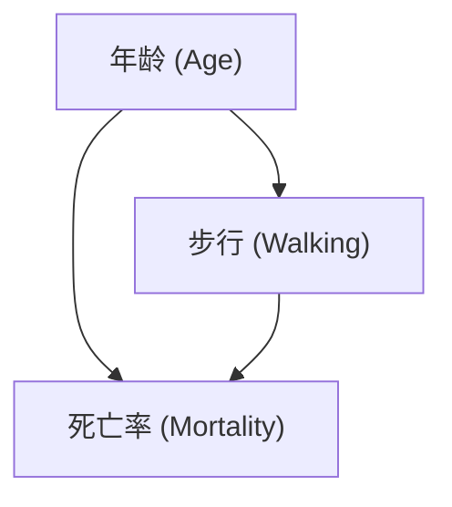
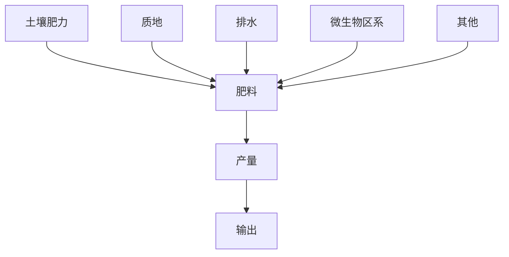
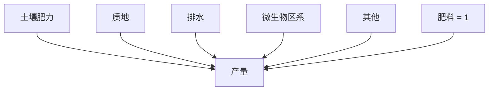
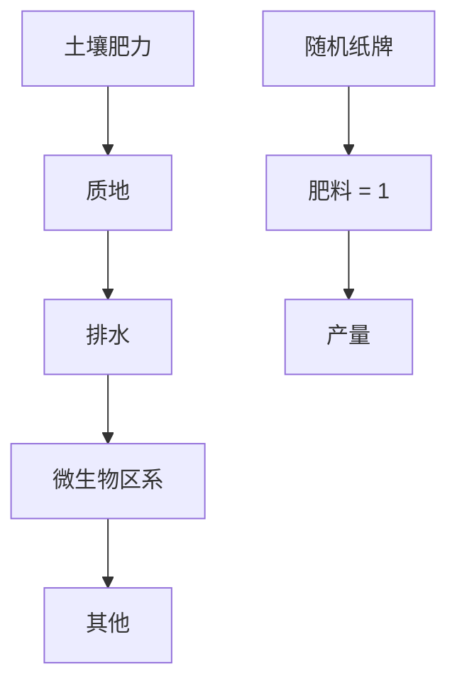
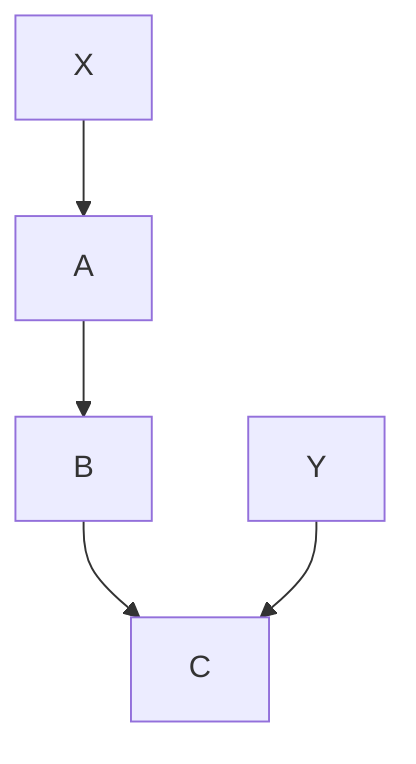
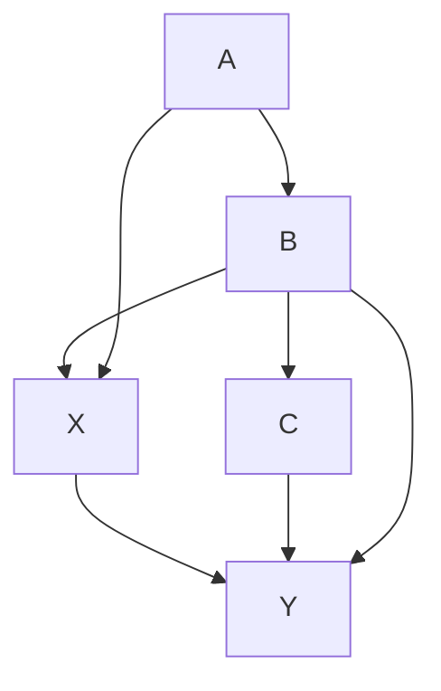
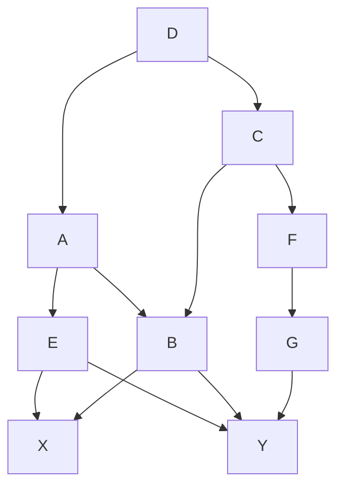

# 混杂与去混杂：或，如何斩除潜伏变量（Confounding and Deconfounding: Or, Slaying the Lurking Variable）

如果我们的因果效应概念与随机实验有任何关联，那么后者早在费希尔之前500年就该被发明了。

——作者（2016）

尼布甲尼撒王宫廷的主管亚施毗拿遇到了一个大问题。公元前597年，巴比伦王洗劫了犹大国，带回了数千名俘虏，其中许多人是耶路撒冷的贵族。按照巴比伦王国的惯例，尼布甲尼撒希望其中一些人能在他的宫廷中服务，于是他命令亚施毗拿寻找"没有残疾、相貌俊美、通达各样智慧、知识聪慧、明白学问的孩童"。这些幸运的孩子将接受巴比伦语言和文化教育，以便能够服务于这个从波斯湾延伸到地中海的帝国行政体系。作为教育的一部分，他们将享用御用的肉食和御酒。

问题就在这里。他最喜欢的一个孩子，名叫但以理，拒绝碰这些食物。出于宗教原因，他不能吃未按犹太律法准备的肉，他请求自己和朋友们只吃蔬菜。亚施毗拿本想满足这个孩子的愿望，但他担心国王会发现："一旦他看见你们的面容比你们同龄的其他孩子憔悴，我就保不住自己的脑袋了。"

但以理试图向亚施毗拿保证，素食不会削弱他们服侍国王的能力。作为一个"通达智慧、明白学问"的人，他提出了一个实验。他说，请试用我们十天。让我们四个人只吃蔬菜；让另一组孩子吃王的肉和酒。十天后，比较这两组人。但以理说："然后你看怎样，就怎样待你的仆人。"

即使你没有读过这个故事，大概也能猜到接下来发生了什么。但以理和他的三个同伴在素食中茁壮成长。国王对他们的智慧和学识印象深刻——更不用说他们健康的外表了——以至于他在宫廷中给了他们一个优待的位置，"发现他们比全国所有的术士和观兆者都强十倍"。后来但以理成了国王的梦的解析者，并在狮子坑中经历了一次难忘的遭遇后幸存下来。

信不信由你，圣经中但以理的故事以一种深刻的方式概括了当今实验科学的实践。亚施毗拿提出了一个关于因果关系的问题：素食会导致我的仆人消瘦吗？但以理提出了一种处理任何此类问题的方法：设立两组人，在所有相关方面完全相同。给一组人新的处理（饮食、药物等），而另一组人（称为对照组）要么接受旧的处理，要么不接受任何特殊处理。如果在适当的时间后，你在这两组本应相同的人之间看到了可测量的差异，那么新的处理一定是差异的原因。

今天我们称之为**对照实验（controlled experiment）**。这个原理很简单。

为了理解饮食的因果效应，我们希望比较但以理在一种饮食下的情况与如果他保持另一种饮食会发生的情况。但我们无法回到过去改写历史，所以我们退而求其次：我们比较一组接受处理的人和一组相似但未接受处理的人。很明显但至关重要的一点是，这些组必须具有可比性并且代表某个总体。如果这些条件得到满足，那么结果应该可以推广到整个总体。值得称赞的是，但以理似乎理解这一点。他不仅仅是为自己请求蔬菜：如果试验表明素食更好，那么所有以色列仆人将来都应该被允许这种饮食。至少，我是这样理解"然后你看怎样，就怎样待你的仆人"这句话的。

但以理也理解比较组别的重要性。在这方面，他已经比今天的许多人更老练了，这些人选择某种流行饮食（例如）仅仅是因为一个朋友采用了这种饮食并减轻了体重。如果你仅仅基于一个朋友的经验选择饮食，你实际上是在说你相信自己在所有相关细节上都与你的朋友相似：年龄、遗传、家庭环境、以前的饮食等等。这是一个很大的假设。

但以理实验的另一个关键点是它是**前瞻性（prospective）**的：这些组是提前选定的。相比之下，假设你在一个电视购物节目中看到二十个人都说他们通过某种饮食减轻了体重。这似乎是一个相当大的样本量，所以一些观众可能认为这是令人信服的证据。但这相当于基于那些已经有良好反应的人的经验来做决定。据你所知，每有一个减轻体重的人，就有十个像他或她一样的人尝试了这种饮食但没有成功。但当然，他们没有被选中出现在电视购物节目中。

但以理的实验在所有这些方面都惊人地现代。前瞻性对照试验仍然是可靠科学的标志。然而，但以理没有考虑到一件事：**混杂偏倚（confounding bias）**。假设但以理和他的朋友们一开始就比对照组更健康。在这种情况下，他们十天饮食后健壮的外表可能与饮食本身无关；它可能反映了他们的整体健康状况。也许如果他们吃了王的肉，他们会更加茁壮成长！

当一个变量既影响谁被选为处理组又影响实验结果时，就会发生混杂偏倚。有时混杂因素是已知的；其他时候它们只是被怀疑，作为"潜伏的第三变量"存在。在因果图中，混杂因素非常容易识别：在图4.1中，位于叉子中心的变量 $Z$ 是 $X$ 和 $Y$ 的混杂因素。（我们稍后会看到一个更通用的定义，但这个三角形是最可识别和最常见的情况。）

> **图4.1（FIGURE 4.1）.** 混杂的最基本版本：$Z$ 是 $X$ 和 $Y$ 之间拟议因果关系的混杂因素。

"混杂（confounding）"这个词在英语中最初的意思是"混合"，我们可以从图中理解为什么选择这个名称。真正的因果效应 $X \to Y$ 与由叉子 $X \leftarrow Z \to Y$ 引起的 $X$ 和 $Y$ 之间的虚假相关"混合"在一起。例如，如果我们在测试一种药物，并将其给予平均年龄比对照组患者更年轻的患者，那么年龄就成了一个混杂因素——一个潜伏的第三变量。如果我们没有任何关于年龄的数据，我们将无法将真实效应与虚假效应区分开来。

然而，反之亦然。如果我们确实有第三变量的测量值，那么很容易将真实效应和虚假效应去混杂。例如，如果混杂变量 $Z$ 是年龄，我们分别比较每个年龄组的处理组和对照组。然后我们可以取效应的平均值，根据目标人群中每个年龄组的百分比进行加权。这种补偿方法对所有统计学家来说都很熟悉；它被称为"调整 $Z$"或"控制 $Z$"。†

奇怪的是，统计学家既高估又低估了调整潜在混杂因素的重要性。他们高估了它，因为他们经常控制比需要多得多的变量，甚至控制那些不应该控制的变量。我最近看到政治博主埃兹拉·克莱因（Ezra Klein）的一段话，他非常清楚地表达了这种"过度控制"现象：

> "你在研究中随处可见。'我们控制了……'然后列表就开始了。越长越好。收入。年龄。种族。宗教。身高。发色。性取向。参加Crossfit。对父母的爱。可口可乐还是百事可乐。你能控制的东西越多，你的研究就越强——或者至少，你的研究看起来越强。控制给人一种具体性、精确性的感觉……但有时，你可能会控制太多。有时你最终控制了你试图测量的东西。"

克莱因提出了一个合理的担忧。统计学家对于应该控制什么变量和不应该控制什么变量一直非常困惑，所以默认的做法是控制一切可以测量的变量。当今绝大多数研究都遵循这种做法。这是一个方便、简单的程序，但它既浪费又充满错误。因果革命（Causal Revolution）的一个关键成就就是结束了这种困惑。

同时，统计学家大大低估了控制的意义，因为他们即使控制已经正确完成，也完全不愿意谈论因果关系。这也与本章的信息相悖：如果你已经确定了一组充分的去混杂因素（deconfounders），那么你就可以自信地从观察性数据中推断因果关系。

本章还将展示因果图使得重点从混杂因素转移到去混杂因素成为可能。前者引起问题；后者解决问题。这两组可能有重叠，但不一定。如果我们有关于一组充分的去混杂因素的数据，那么忽略一些甚至所有混杂因素都没有关系。

这种重点转移是因果革命使我们能够超越费希尔式实验，从非实验性研究中推断因果效应的主要方式。它使我们能够确定哪些变量应该被控制作为去混杂因素。这个问题一直困扰着理论统计学家和实践统计学家；几十年来它一直是该领域的阿喀琉斯之踵。这是因为它与数据或统计无关。**混杂是一个因果概念**——它属于因果阶梯（Ladder of Causation）的第二级。

从20世纪90年代开始的图形方法已经完全解决了混杂问题。特别是，我们很快就会遇到一种称为**后门准则（back-door criterion）**的方法，它明确地识别出因果图中哪些变量是去混杂因素。如果研究者能够收集到这些变量的数据，她就可以调整它们，从而即使不进行干预也能预测干预的结果。

事实上，因果革命甚至走得更远。在某些情况下，即使我们没有关于一组充分的去混杂因素的数据，我们也能控制混杂。在这些情况下，我们可以使用不同的调整公式——不是仅适用于后门准则的传统公式——仍然可以消除所有混杂。我们将把这些激动人心的发展留到第7章。

尽管混杂在科学的所有领域都有悠久的历史，但认识到这个问题需要因果而非统计的解决方法是最近才有的。即使在2001年，审稿人还驳斥了我的一篇论文，坚持认为"混杂牢固地建立在标准统计学中"。幸运的是，这类审稿人的数量在过去十年中急剧减少。现在几乎普遍达成共识，至少在流行病学家、哲学家和社会科学家中，认为（1）混杂需要并且有因果解决方案，以及（2）因果图提供了找到该解决方案的完整且系统的方法。关于混杂的困惑时代已经结束了！

## 对混杂的恐惧（The Chilling Fear of Confounding）

1998年，《新英格兰医学杂志》（*New England Journal of Medicine*）上的一项研究揭示了退休男性中定期步行与降低死亡率之间的关联。研究人员使用了檀香山心脏计划（Honolulu Heart Program）的数据，该计划自1965年以来一直追踪8000名日裔男性的健康状况。

由弗吉尼亚大学的生物统计学家罗伯特·阿博特（Robert Abbott）领导的研究人员想知道，运动更多的男性是否活得更长。他们从8000人的大群体中选择了707名男性作为样本，所有这些人的身体健康到足以步行。阿博特的团队发现，在12年的时间里，每天步行少于1英里的男性（我称之为"随意步行者"）的死亡率是每天步行超过2英里的男性（"高强度步行者"）的两倍。具体来说，43%的随意步行者已经死亡，而只有21.5%的高强度步行者死亡。

然而，由于实验者没有规定谁是随意步行者、谁是高强度步行者，我们必须考虑混杂偏倚的可能性。一个明显的混杂因素可能是年龄：年轻的男性可能更愿意进行剧烈运动，也更不容易死亡。所以我们会有像图4.2那样的因果图。

> 图4.2（FIGURE 4.2）. 步行示例的因果图。

"年龄"节点处的经典叉子模式告诉我们，年龄是步行和死亡率的混杂因素。我相信你能想到其他可能的混杂因素。也许随意步行者因某种原因在偷懒；也许他们不能走那么多。因此，身体状况可能是一个混杂因素。我们可以这样一直列举下去。如果轻度步行者是饮酒者怎么办？如果他们吃得更多怎么办？

好消息是，研究人员考虑了所有这些因素。这项研究已经考虑并调整了每一个合理的因素——年龄、身体状况、饮酒、饮食和其他几个因素。例如，确实高强度步行者往往稍微年轻一些。所以研究人员调整了年龄的死亡率，发现随意步行者和高强度步行者之间的差异仍然非常大。（随意步行者的年龄调整死亡率为41%，而高强度步行者为24%。）

即便如此，研究人员在他们的结论中还是非常谨慎。在文章的最后，他们写道："当然，对于身体状况良好的老年男性有意增加每日步行距离对寿命的影响，我们的研究无法解决。"用第一章的语言来说，他们拒绝就你如果运动（锻炼）后存活12年的概率说任何话。

公平地说，阿博特和他的团队可能有充分的理由保持谨慎。这是第一次研究，样本相对较小且同质。然而，这种谨慎反映了一种更普遍的态度，超越了同质性和样本量的问题。研究人员被教导相信，观察性研究（其中受试者选择自己的处理）永远不能阐明因果主张。我断言这种谨慎被过度夸大了。否则，如果不是为了消除关联中的虚假部分从而更好地看到因果部分，为什么要费心调整所有这些混杂因素呢？

与其像他们那样说"当然我们不能"，我们应该宣称，当然我们可以对有意干预说些什么。如果我们相信阿博特的团队识别了所有重要的混杂因素，我们也必须相信有意步行倾向于延长寿命（至少在日裔男性中）。

这一初步结论基于一个假设，即没有其他混杂因素能在所发现的关系中起主要作用，因此这是一条极具价值的信息。它确切地告诉潜在的步行者，若按字面意义接受这一论断，还存在何种不确定性。它告诉他，剩余的不确定性不会高于存在未被考虑的其他混杂因素的可能性。它对于未来研究也具有指导价值，这些研究应聚焦于那些其他因素（如果存在的话），而非在当前研究中已被中和的因素。简而言之，了解支撑某一结论的假设集，其价值不亚于试图通过**随机对照试验（Randomized Controlled Trial, RCT）**来规避这些假设——我们将会看到，RCT本身也有其复杂性。

## 巧妙地审问自然：为何RCT有效（The Skillful Interrogation of Nature: Why RCTs Work）

正如我之前提到的，科学家们放弃对因果关系的部分缄默，唯一的情况是当他们进行了随机对照试验。你可以在维基百科或无数其他地方读到：“RCT通常被认为是临床试验的金标准。”我们要感谢一个人，R. A. 费希尔（R. A. Fisher），因此阅读一位与他关系密切的人关于他动机的论述会非常有趣。这段文字很长，但值得全文引用：

> 科学实验的全部艺术与实践，就在于**巧妙地审问自然（skillful interrogation of Nature）**。观察为科学家提供了自然在某些方面的图景，这幅图景具有自愿陈述的所有缺陷。他希望通过提出旨在建立**因果关系（causal relationships）**的具体问题，来检验自己对这一陈述的解释。他以实验操作形式提出的问题必然是特定的，他必须依赖自然的一致性，从其在特定实例中的反应做出一般性推论，或预测在其他场合进行类似操作时预期的结果。他的目标是从他所获取的证据中，得出具有确定精度和普遍性的有效结论。
>
> 然而，自然的表现远非一致，她的回答显得摇摆不定、羞怯且模棱两可。她回应的是在田间实际提出的问题形式，而不一定是实验者头脑中的问题；她不会为他解读；她不提供无偿信息；而且她对精确性一丝不苟。因此，想要比较两种肥料处理的实验者，如果将他的田地分成相等的两半，每半各施一种肥料，种植作物，然后比较两半的产量，那便是徒劳。他提问的形式是：在第一种处理下，A区的产量与第二种处理下B区的产量之差是多少？他没有问在统一处理下A区是否与B区产量相同，而且他无法区分地块效应和处理效应，因为自然正如所要求的那样，不仅记录了肥料差异对地块产量的贡献，还记录了土壤肥力、质地、排水、朝向、微生物区系以及无数其他变量的差异。

这段话的作者是**琼·费希尔·博克斯（Joan Fisher Box）**，罗纳德·艾尔默·费希尔（Ronald Aylmer Fisher）的女儿，摘自她为其杰出父亲所写的传记。尽管她本人并非统计学家，但她显然深刻理解了统计学家面临的核心挑战。她毫不含糊地指出，他们提出的问题*“旨在建立因果关系”*。而阻碍他们的是**混杂（confounding）**，尽管她没有使用这个词。他们想知道一种肥料（或那个时代所称的“粪肥处理”）的效果——即一种肥料下的预期产量与另一种肥料下的产量比较。然而，自然告诉他们的却是肥料（请记住，这是“confounded”的原意）与多种其他原因混合后的效应。

我喜欢博克斯在上述段落中提供的意象：**自然就像一个精灵，它精确地回答我们提出的问题，而不一定是我们意图提出的问题。** 但我们必须相信，正如博克斯显然所相信的那样，我们想要提出的问题的答案确实存在于自然之中。我们的实验是揭示答案的笨拙手段，但它们绝不确定答案。如果我们严格遵循她的类比，那么 $do(X = x)$ 必须排在第一位，因为它是自然的属性，代表了我们寻求的答案：*在整个田地上使用第一种肥料的效果是什么？* 随机化排在第二位，因为它仅仅是引出该问题答案的人造手段。可以将其比作温度计上的刻度，它是引出温度的手段，但并非温度本身。

在洛桑实验站（Rothamsted Experimental Station）的早期，费希尔通常采用非常精细、系统的方法来区分肥料效应与其他变量的效应。他会将田地划分为子地块网格，并仔细规划，以便每种肥料都能与每种土壤类型和植物的组合进行试验（见图4.3）。他这样做是为了确保每个样本的可比性；实际上，他永远无法预料所有可能决定特定地块肥力的混杂因素。一个足够聪明的精灵可以击败任何结构化的田间布局。

大约在1923年或1924年，费希尔开始意识到，精灵无法击败的唯一实验设计是随机设计。想象一下，在一块肥力分布未知的田地上，将同一个实验重复一百次。每次你随机地将肥料分配给子地块。有时你可能非常不走运，将肥料1用在了所有最不肥沃的子地块上。其他时候你可能很幸运，将其施用在最肥沃的子地块上。但是，通过每次实验时生成新的随机分配，你可以保证绝大多数时候你既不走运也不倒霉。在这些情况下，肥料1将被施用于一组代表整个田地的子地块。这正是对照试验所需要的。由于在整系列实验中田地的肥力分布是固定的——精灵无法改变它——他（大多数时候）被诱骗回答了你想要提出的因果问题。

> 漫画插图：一名男子边吸烟边阅读一个植物网格，背景是村庄景象（无文字或符号）

**图4.3.** R. A. 费希尔与他众多创新之一：拉丁方实验设计，旨在确保每种植物类型的一个地块出现在每一行（肥料类型）和每一列（土壤类型）中。这种设计至今仍在实践中使用，但费希尔后来令人信服地论证，随机设计更为有效。（来源：Dakota Harr 绘图。）

从我们的角度来看，在随机试验成为金标准的时代，这一切可能看起来显而易见。但在当时，随机设计实验的想法令费希尔的统计界同事感到震惊。费希尔实际上是从一副牌中抽牌来为每个子地块分配肥料，这或许加剧了他们的沮丧。*科学受制于偶然的任性？*

但费希尔认识到，**对正确问题的不确定答案，远胜于对错误问题的高度确定答案。** 如果你向精灵提出了错误的问题，你永远无法找到你想知道的东西。如果你提出了正确的问题，偶尔得到错误的答案就远没那么严重。你仍然可以估计答案中的不确定性程度，因为不确定性来自随机化过程（这是已知的），而非土壤特性（这是未知的）。

因此，随机化实际上带来了**两个好处**：

- 首先，它消除了混杂偏倚（它向自然提出了正确的问题）。
- 其次，它使研究者能够量化其不确定性。

然而，根据历史学家斯蒂芬·斯蒂格勒（Stephen Stigler）的说法，第二个好处实际上是费希尔倡导随机化的主要原因。他是量化不确定性的世界大师，为此发展了许多新的数学方法。相比之下，他对去混杂的理解纯粹是直觉性的，因为他缺乏表达其所寻求目标的数学符号。

现在，九十年后，我们可以使用 **do-算子（do-operator）** 来填补费希尔想要但无法提出的问题。让我们从因果的角度看看随机化如何使我们能够向精灵提出正确的问题。

像往常一样，我们从绘制因果图开始。**模型1**，如图4.4所示，描述了正常情况下每块地块的产量是如何决定的，其中农民凭一时兴起或偏见决定哪种肥料最适合每块地块。他想向自然精灵提出的问题是*“在整个田地上统一施用肥料1（相对于肥料2）的产量是多少？”* 或者，用do-算子符号表示，即 $P(\text{yield} \vert do(\text{fertilizer} = 1))$ 是什么？

> **图4.4.** 模型1：一个控制不当的实验。

如果农民天真地进行实验，例如将肥料1施用于田地的高端，肥料2施用于低端，他可能引入了排水作为混杂因素。如果他第一年使用肥料1，第二年使用肥料2，他可能引入了天气作为混杂因素。无论哪种情况，他都会得到有偏的比较。

农民想要了解的世界由模型2描述，其中所有地块都接受相同的肥料（见图4.5）。如第1章所述，do-算子的作用是擦除所有指向肥料的箭头，并将该变量强制为一个特定值——例如，肥料 = 1。

> **图4.5.** 模型2：我们想要了解的世界。

最后，让我们看看应用随机化时世界是什么样的。现在，一些地块将接受 $do(\text{fertilizer} = 1)$，另一些接受 $do(\text{fertilizer} = 2)$，但哪个处理分配给哪个地块是随机选择的。这种模型创造的世界如图4.6中的模型3所示，显示了变量肥料通过一个随机装置——例如费希尔的纸牌——获得其分配。

请注意，所有指向肥料的箭头都已被擦除，这反映了农民在决定使用哪种肥料时只听从纸牌的假设。同样重要的是要注意，没有从纸牌指向产量的箭头，因为植物无法读取纸牌。（对于植物来说，这是一个相当安全的假设，但对于随机试验中的人类受试者来说，这是一个严重的问题。）因此，模型3描述了一个肥料与产量之间无混杂（即，不存在肥料和产量的共同原因）的世界。这意味着在图4.6描述的世界中，看到肥料 = 1 与执行 $do(\text{fertilizer} = 1)$ 之间没有区别。

> **图4.6.** 模型3：由随机对照试验模拟的世界。

这就引出了要点：**随机化是模拟模型2的一种方式**。它禁用所有旧的混杂因素，同时不引入任何新的混杂因素。这就是其力量的来源；其中并无神秘或玄妙之处。正如琼·费希尔·博克斯所说，它无非就是“巧妙地审问自然”。

然而，如果允许实验者凭自己的判断选择肥料，或者实验对象（在这种情况下是植物）“知道”它们抽到了哪张牌，那么实验模拟模型2的目标就会失败。这就是为什么针对人类受试者的临床试验会不遗余力地向患者和实验者双方隐瞒这些信息（这一过程称为**双盲（double blinding）**）。

我要补充第二点：**还有其他模拟模型2的方法**。一种方法是，如果你知道所有可能的混杂因素，就对其进行测量并加以调整。然而，随机化确实有一个巨大优势：它切断了指向随机化变量的所有传入链接，包括那些我们不知道或无法测量的链接（例如，图4.4至4.6中的“其他”因素）。

相比之下，在非随机化研究中，实验者必须依赖其对学科领域的知识。如果她确信她的因果模型考虑了足够多的去混杂因素，并且她收集了相关数据，那么她就可以无偏地估计肥料对产量的影响。但危险在于，她可能遗漏了一个混杂因素，因此她的估计可能有偏。

在所有条件相同的情况下，RCT仍然优于观察性研究，就像推荐走钢丝者使用安全网一样。但所有条件未必都相同。在某些情况下，干预可能在物理上不可行（例如，在肥胖对心脏病影响的研究中，我们不能随机分配患者肥胖或不肥胖）。或者干预可能不道德（在吸烟影响的研究中，我们不能要求随机选择的人吸烟十年）。或者我们可能在招募受试者进行不便的实验程序时遇到困难，最终得到的志愿者无法代表目标人群。

幸运的是，do-算子为我们提供了从非实验研究中确定因果效应的科学合理方法，这挑战了RCT的传统优越性。正如步行例子中所讨论的，观察性研究产生的这种因果估计可能被标记为“**暂定因果性（provisional causality）**”，即其因果性取决于我们因果图所展示的假设集。重要的是，我们不应将这些研究视为二等公民：它们具有在目标人群的自然栖息地而非实验室人工环境中进行的优势，并且它们在不受伦理或可行性问题污染的意义上可以是“纯粹的”。

现在我们已经理解了RCT的主要目标是消除混杂，让我们看看因果革命（Causal Revolution）赋予我们的其他方法。这个故事始于我两位长期同事在1986年发表的一篇论文，该论文开启了对混杂含义的重新评估。

## 混杂的新范式（The New Paradigm of Confounding）

“尽管混杂被广泛认为是流行病学研究的核心问题之一，但文献回顾将发现，关于混杂或混杂因素的定义几乎没有一致性。” 凭借这一句话，加州大学洛杉矶分校的桑德·格林兰（Sander Greenland）和哈佛大学的杰米·罗宾斯（Jamie Robins）指出了自费希尔以来混杂控制毫无进展的核心原因。缺乏对混杂的原则性理解，科学家们无法在对治疗进行物理控制不可行的观察性研究中做出任何有意义的表述。

**混杂（Confounding）** 在当时是如何定义的，又应该如何定义？借助我们现在对因果逻辑的理解，第二个问题的答案更为简单。我们观察到的量是给定处理条件下的结果的条件概率 $P(Y \mid X)$。我们想要向大自然提出的问题涉及 $X$ 和 $Y$ 之间的因果关系，这由**干预概率（interventional probability）** $P(Y \mid do(X))$ 来捕捉。因此，**混杂**应该简单地定义为导致这两者之间出现差异的任何事物：

$$
P(Y \mid X) \neq P(Y \mid do(X)).
$$

何必如此大惊小怪呢？

不幸的是，在 20 世纪 90 年代之前，事情并没有这么简单，因为 *do* 算子尚未被形式化。即使在今天，如果你在街上拦住一位统计学家，问他：“‘混杂’对你来说意味着什么？”你可能会得到你从科学家那里听到过的最令人费解和困惑的答案之一。最近一本由顶尖统计学家合著的书籍，足足用了两页纸试图解释它，而我还没有找到一位能理解该解释的读者。

造成这种困难的原因是，**混杂不是一个统计概念**。它代表了我们想要评估的东西（因果效应）与我们实际使用统计方法评估的东西之间的差异。如果你无法用数学语言表达你想要评估的东西，你就别指望能定义什么是差异。

从历史上看，“混杂”的概念是围绕两个相关的概念演变而来的：**不可比性（incomparability）** 和**一个潜伏的第三个变量（a lurking third variable）**。这两个概念都抵制形式化。当我们谈到可比性时，在丹尼尔实验的背景下，我们说处理组和对照组在所有相关方面都应该相同。但这引出了一个问题：我们需要区分相关属性和无关属性。我们如何知道在檀香山步行研究中年龄是相关的？我们如何知道参与者姓名的字母顺序是不相关的？你可能会说这是显而易见的常识，但几代科学家一直在努力将这种常识形式化，而机器在被要求正确行动时，不能依赖我们的常识。

同样的模糊性也困扰着第三个变量的定义。一个混杂因子应该是 $X$ 和 $Y$ 的共同原因，还是仅仅与它们相关？今天，我们可以通过参考因果图并检查哪些变量会导致 $P(X \mid Y)$ 和 $P(X \mid do(Y))$ 之间的差异来回答这些问题。由于缺乏因果图或 *do* 算子，五代的统计学家和健康科学家不得不与各种替代定义作斗争，而这些定义没有一个令人满意。考虑到你药柜里的药物可能是在“混杂因子”的模糊定义基础上开发出来的，你应该有些担忧。

让我们来看看混杂的一些替代定义。这些定义主要分为两类：**陈述性定义（declarative）** 和**程序性定义（procedural）**。一个典型（且错误）的陈述性定义是：“混杂因子是与 $X$ 和 $Y$ 都相关的任何变量。”另一方面，程序性定义则试图根据统计检验来刻画混杂因子。这对统计学家很有吸引力，他们喜欢任何可以直接在数据上执行而无需借助模型的检验。

这里有一个程序性定义，它有一个可怕的名字叫“不可折叠性（noncollapsibility）”。它来自挪威流行病学家斯文·赫恩伯格 1996 年的一篇论文：

> “形式上，可以比较粗相对风险（crude relative risk）和针对潜在混杂因子调整后的相对风险。差异表明存在混杂，在这种情况下，应使用调整后的风险估计。如果没有差异或差异可以忽略不计，则混杂不是问题，应首选粗估计值。”

换句话说，如果你怀疑一个混杂因子，尝试对其进行调整，也尝试不进行调整。如果有差异，它就是混杂因子，你应该相信调整后的值。如果没有差异，你就没事了。赫恩伯格绝不是第一个倡导这种方法的人；它误导了一个世纪的流行病学家、经济学家和社会科学家，并且在应用统计学的某些领域仍然占据主导地位。我之所以挑赫恩伯格的毛病，只是因为他对此异常直言不讳，并且他是在 1996 年（远在因果革命已经开始之后）写下这些的。

最流行的陈述性定义是经过一段时间演变而来的。阿尔弗雷多·莫拉比亚（《流行病学方法与概念史》的作者）称之为“混杂的经典流行病学定义”，它由三部分组成。$X$（处理）和 $Y$（结果）的混杂因子是一个变量 $Z$，它满足：

1. 在总体中与 **$X$ 相关**，并且
2. 在未暴露于处理 $X$ 的人群中与 **$Y$ 相关**。

近年来，这又补充了第三个条件：
3. $Z$ **不应**位于 $X$ 和 $Y$ 之间的因果路径上。

请注意，“经典”版本（1 和 2）中的所有术语都是统计性的。特别是，$Z$ 仅被假定与 $X$ 和 $Y$ *相关*——而非导致它们。爱德华·辛普森在 1951 年提出了相当令人费解的条件：“在未暴露者中，$Y$ 与 $Z$ 相关”。从因果角度来看，辛普森的想法似乎是剔除 $Z$ 与 $Y$ 的相关性中由 $X$ 对 $Y$ 的因果效应造成的部分；换句话说，他想说 $Z$ 对 $Y$ 有一个独立于其对 $X$ 影响之外的影响。他所能想到的表达这种剔除的唯一方法是通过关注对照组（$X = 0$）来以 $X$ 为条件。由于缺乏“效应”这个词，统计词汇没有给他其他表达方式。

如果这有点令人困惑，那也应该是如此！如果他能够简单地画一个因果图，比如图 4.1，然后说：“$Y$ 与 $Z$ 通过不经过 $X$ 的路径相关”，那该有多容易。但他没有这个工具，也不能谈论路径，这是一个被禁止的概念。

混杂因子的“经典流行病学定义”还有其他缺陷，如下面两个例子所示：

$$
\text{(i)} \quad X \rightarrow Z \rightarrow Y
$$

以及

$$
\begin{array}{c}
\text{(ii)} \quad X \to M \to Y \\
\downarrow \\
Z
\end{array}
$$

在示例（i）中，$Z$ 满足条件（1）和（2），但它并不是一个混杂因子。它被称为**中介变量（mediator）**：它是解释 $X$ 对 $Y$ 因果效应的变量。如果你试图寻找 $X$ 对 $Y$ 的因果效应，那么控制 $Z$ 将是一场灾难。如果你只观察那些 $Z = 0$ 的处理组和对照组个体，那么你完全阻断了 $X$ 的效应，因为 $X$ 正是通过改变 $Z$ 来发挥作用的。因此，你会得出 $X$ 对 $Y$ 没有影响的结论。这正是埃兹拉·克莱因（Ezra Klein）所说的：“有时候你最终控制了你试图测量的东西。”

在示例（ii）中，$Z$ 是中介变量 $M$ 的一个**代理变量（proxy）**。统计学家在无法测量实际因果变量时，经常控制代理变量；例如，政党归属可能被用作政治信仰的代理变量。由于 $Z$ 并非 $M$ 的完美度量，如果你控制 $Z$，$X$ 对 $Y$ 的部分影响可能会“泄露出去”。尽管如此，控制 $Z$ 仍然是一个错误。虽然偏差可能比控制 $M$ 小，但它依然存在。

基于这个原因，后来的统计学家，特别是大卫·考克斯（David Cox）在其教科书《实验设计》（1958）中警告说，只有在你有“强有力的先验理由”相信 $Z$ 不受 $X$ 影响时，才应该控制 $Z$。这种“强有力的先验理由”无非就是一个因果假设。他补充道：“这样的假设可能完全合理，但科学家应该始终意识到他们正在诉诸这些假设。”请记住，那是 1958 年，正值对因果关系的严格禁止时期。考克斯的意思是，在调整混杂因子时，你可以放心地喝上一大口因果私酿，但不要告诉牧师。这是一个大胆的建议！我总是忍不住为他的勇气喝彩。

到了 1980 年，辛普森和考克斯的条件被合并成我上面提到的混杂三部分检验。它就像一艘只有三个漏洞的独木舟一样不可靠。尽管它在第（3）部分半心半意地诉诸因果关系，但前两部分都可以被证明既非必要也不充分。

格陵兰（Greenland）和罗宾斯（Robins）在他们 1986 年的里程碑式论文中得出了这个结论。两人采用了一种全新的方法来处理混杂问题，他们称之为“**可交换性（exchangeability）**”。他们回到了最初的想法：对照组（$X = 0$）应该与处理组（$X = 1$）具有可比性。但他们加入了一个**反事实（counterfactual）** 的转折。（回忆一下第一章，反事实处于因果之梯的第三级，因此足以检测混杂。）可交换性要求研究者考虑处理组，想象如果该组成员没有接受处理会发生什么，然后判断其结果是否与那些（在现实中）未接受处理的人相同。只有这样，我们才能说研究中不存在混杂。

在 1986 年，向流行病学家听众谈论反事实需要一些勇气，因为他们仍然深受经典统计学的影响，经典统计学认为所有答案都在数据中——而不是在可能发生但永远无法观察到的事情中。然而，统计学界已经准备好倾听这种异端邪说，这要归功于另一位哈佛统计学家唐纳德·鲁宾（Donald Rubin）的开创性工作。在鲁宾 1974 年提出的“**潜在结果（potential outcomes）**”框架中，像“接受药物 $D'$ 的人 $X$ 的血压”和“未接受药物 $D'$ 的人 $X$ 的血压”这样的反事实变量，与像血压这样的传统变量一样合法——尽管这两个变量中有一个将永远无法被观察到。

罗宾斯和格陵兰试图用潜在结果来表达他们对混杂的概念。他们将人群分为四种类型的个体：**注定患病者（doomed）**、**致病者（causative）**、**预防者（preventive）** 和**免疫者（immune）**。这个语言具有启发性，所以让我们把处理 $X$ 看作流感疫苗，结果 $Y$ 看作患上流感。注定患病者是那些疫苗对他们不起作用的人；无论他们是否接种疫苗，他们都会得流感。致病组（可能不存在）包括那些疫苗实际上导致疾病的人。预防组由那些疫苗能预防疾病的人组成：如果他们不接种疫苗，他们会得流感；如果他们接种疫苗，他们就不会得流感。最后，免疫组由那些在任何情况下都不会得流感的人组成。表 4.1 总结了这些考虑。

理想情况下，每个人的额头上都会贴着一个标签，标明他属于哪个组。可交换性仅仅意味着每种标签的人所占的百分比（分别为 $d\%$、$c\%$、$p\%$ 和 $i\%$）在处理组和对照组中应该相同。这些比例相等保证了如果我们交换处理组和对照组，结果将完全相同。否则，处理组和对照组就不相似，我们对疫苗效果的估计就会受到混杂。请注意，这两组可能在许多方面不同。他们在年龄、性别、健康状况和各种其他特征上可能不同。只有 $d$、$c$、$p$ 和 $i$ 的相等性决定了它们是否可交换。因此，可交换性等同于两组四个比例之间的相等性，这大大降低了评估两组可能不同的无数因素的复杂性。

**表 4.1. 根据响应类型对个体进行分类。**

| 组别 | 组内百分比 | 接种疫苗后的结果 | 未接种疫苗后的结果 |
| :--- | :--- | :--- | :--- |
| 注定患病者 | $d$ | 流感 | 流感 |
| 致病者 | $c$ | 流感 | 无流感 |
| 预防者 | $p$ | 无流感 | 流感 |
| 免疫者 | $i$ | 无流感 | 无流感 |

使用这种关于混杂的常识性定义，格陵兰和罗宾斯表明，“统计”定义（无论是陈述性的还是程序性的）都给出了错误的答案。一个变量可以通过流行病学家的三部分检验，但如果进行调整，仍然会增加偏差。

格陵兰和罗宾斯的定义是一项伟大的成就，因为它使他们能够给出具体的例子，表明先前对混杂的定义是不充分的。然而，这个定义无法转化为实践。简而言之，额头上的那些标签并不存在。我们甚至不知道 $d$、$c$、$p$ 和 $i$ 这些比例的具体数值。事实上，这正是大自然的神灯精灵锁在她的魔法灯笼里，不向任何人展示的那种信息。由于缺乏这些信息，研究者只能凭直觉判断处理组和对照组是否可交换。

现在，我希望你的好奇心已经被充分激发了。因果图如何将混杂这个巨大的难题变成一个有趣的游戏？诀窍在于一个可操作的混杂检验，称为**后门准则（back-door criterion）**。这个准则将定义混杂、识别混杂因子以及调整混杂因子的过程变成了一个常规谜题，其难度不亚于解决一个迷宫。因此，它使这个棘手的古老问题得到了一个圆满的结论。

## DO 算子与后门准则（THE DO-OPERATOR AND THE BACK-DOOR CRITERION）

要理解后门准则，首先直观地感受信息如何在因果图中流动会有所帮助。我倾向于将这些连接想象成管道，它们将信息从起点 X 传递到终点 Y。请记住，信息的传递是双向的，既有因果方向，也有非因果方向，正如我们在第 3 章中看到的那样。

事实上，非因果路径正是混杂的根源。请记住，我将混杂定义为任何使 $P(Y \mid do(X))$ 与 $P(Y \mid X)$ 不同的东西。do-算子会擦除所有指向 X 的箭头，从而阻止任何关于 X 的信息沿非因果方向流动。随机化也有同样的效果。如果我们选择正确的变量进行调整，统计调整也能达到同样的效果。

在上一章中，我们研究了三个规则，它们告诉我们如何阻止信息流经任何一个单独的节点。我将在此重申以强调：

- (a) 在链式节点 $A \to B \to C$ 中，控制 B 会阻止信息从 A 传递到 C，反之亦然。
- (b) 同样，在分叉或混杂节点 $A \leftarrow B \to C$ 中，控制 B 会阻止信息从 A 传递到 C，反之亦然。
- (c) 最后，在对撞节点 $A \to B \leftarrow C$ 中，情况恰恰相反。变量 A 和 C 最初是独立的，因此关于 A 的信息不会告诉你任何关于 C 的信息。但如果你控制了 B，由于“解释效应”，信息就会开始流经这个“管道”。

我们还必须牢记另一个基本规则：
(d) 控制一个变量的后代（或代理变量）相当于“部分地”控制该变量本身。控制一个中介变量的后代，会部分地关闭管道；控制一个对撞节点的后代，会部分地打开管道。

现在，如果我们有更长的管道，包含更多节点，比如这样：

$$
A \leftarrow B \leftarrow C \rightarrow D \leftarrow E \rightarrow F \rightarrow G \leftarrow H \rightarrow I \rightarrow J
$$

答案非常简单：如果任何一个节点被阻断，那么 J 就无法通过这条路径“得知”A 的信息。因此，我们有很多选择来阻断 A 和 J 之间的通信：控制 B、控制 C、不要控制 D（因为它是一个对撞节点）、控制 E，等等。其中任何一个措施都足够了。这就是为什么通常的统计做法——控制所有我们能测量的变量——是如此误导人。事实上，如果我们什么都不控制，这条特定的路径反而是被阻断的！D 和 G 处的对撞节点在没有任何外部帮助的情况下就阻断了路径。而控制 D 和 G 则会打开这条路径，使 J 能够接听到 A 的信息。

最后，要消除两个变量 X 和 Y 之间的混杂，我们只需要阻断它们之间的每一条非因果路径，同时不阻断或干扰任何因果路径。更精确地说，**后门路径（back-door path）** 是指任何从 X 出发、起始箭头指向 X 并到达 Y 的路径。如果我们阻断了每一条后门路径（因为这些路径允许 X 和 Y 之间产生虚假相关），那么 X 和 Y 之间的混杂就被消除了。如果我们通过控制某个变量集 Z 来实现这一点，我们还需要确保 Z 中没有成员是 X 在因果路径上的后代；否则，我们可能会部分或完全地关闭那条路径。

这就是全部内容了！有了这些规则，消除混杂变得如此简单和有趣，你可以把它当作一个游戏来玩。我强烈建议你尝试几个例子，只是为了掌握要领，看看它有多容易。如果你仍然觉得困难，请放心，现在已经存在能够在纳秒级别解决所有此类问题的算法。在每个游戏中，目标都是指定一组变量来消除 X 和 Y 之间的混杂。换句话说，这些变量不应是 X 的后代，并且它们应该阻断所有后门路径。

好的，这是根据您的要求格式化优化后的 Markdown 内容。

---

> **游戏 4.**

这个例子引入了一种新的偏倚，称为“M-偏倚”（M-bias，因其图形形状得名）。同样，这里只有一条后门路径，并且它已经被 B 处的对撞节点阻断。因此，我们不需要控制任何变量。然而，所有 1986 年之前的统计学家以及当今的许多统计学家都会认为 B 是一个混杂因子。它与 X 相关联（通过 $X \leftarrow A \Rightarrow B$），并且通过一条不经过 $X$ 的路径（$B \leftarrow C \rightarrow Y$）与 Y 相关联。它不位于任何因果路径上，也不是因果路径上任何节点的后代，因为从 X 到 Y 根本不存在因果路径。因此，B 通过了传统的混杂三步检验。

M-偏倚指出了传统方法的问题所在。仅仅因为一个变量（如 B）与 X 和 Y 都相关就称其为混杂因子，这是不正确的。重申一遍，如果我们不对 B 进行控制，X 和 Y 就是无混杂的。**只有当你控制 B 时，它才成为一个混杂因子！**

当我在 1990 年代开始向统计学家展示这个图时，有些人对此一笑置之，并认为这种图在实践中极不可能出现。我不同意！例如，安全带的使用情况（B）对吸烟（X）或肺部疾病（Y）没有因果效应；它仅仅是一个人对待社会规范（A）以及安全与健康相关措施（C）态度的指标。这些态度中的一部分可能会影响患肺部疾病（Y）的易感性。在实践中，安全带的使用被发现与 X 和 Y 都相关；事实上，在 2006 年作为烟草诉讼一部分进行的一项研究中，安全带的使用被列为要控制的首批变量之一。如果你接受上述模型，那么仅控制 B 将是一个错误。

请注意，如果你同时控制 A 或 C，那么控制 B 是可以的。控制对撞节点 B 会打开“管道”，但控制 A 或 C 会再次将其关闭。不幸的是，在安全带的例子中，A 和 C 是与人们态度相关的变量，很可能无法观测。如果你无法观测到它，你就无法对其进行调整。

> **游戏 5.**

游戏 5 只是在游戏 4 的基础上增加了一点小曲折。现在需要关闭第二条后门路径 $X \leftarrow B \rightarrow C \rightarrow Y$。如果我们通过控制 B 来关闭这条路径，那么我们就会打开 M 形路径 $X \leftarrow A \rightarrow B \leftarrow C \rightarrow Y$。为了关闭那条路径，我们必须同时控制 A 或 C。然而，请注意，我们可以只控制 C 一个变量；这将关闭路径 $X \leftarrow B \rightarrow C \rightarrow Y$，并且不影响另一条路径。

游戏 1 到 3 来自 Clarice Weinberg 在 1993 年发表的一篇论文，她当时是美国国立卫生研究院（National Institutes of Health）的副主任，论文题为“Toward a Clearer Definition of Confounding”。这篇论文发表于 1986 年至 1995 年的过渡时期，当时 Greenland 和 Robins 的论文已经问世，但因果图仍未被广泛知晓。因此，Weinberg 进行了大量的数学运算，以验证所展示的每个案例中的可交换性。尽管她使用图形展示来传达所涉及的情景，但她并未使用图的逻辑来帮助区分混杂变量与去混杂变量。她是我所知道的唯一一个完成这一壮举的人。后来，在 2012 年，她合作发表了一个更新版本，该版本使用因果图分析了相同的例子，并验证了她 1993 年的所有结论都是正确的。

在 Weinberg 的两篇论文中，医学应用都是估计吸烟（X）对流产或“自然流产”（Y）的影响。在游戏 1 中，A 代表由吸烟引起的潜在异常；这不是一个可观测变量，因为我们不知道异常是什么。B 代表既往流产史。流行病学家非常、非常容易将既往流产史考虑在内，并在估计未来流产概率时对其进行调整。**但在这里这样做是错误的！** 这样做会部分地抑制吸烟发挥作用的机制，因此我们会低估吸烟的真实效应。

游戏 2 是一个更复杂的版本，其中有两个不同的吸烟变量：X 代表母亲现在（第二次怀孕开始时）是否吸烟，而 A 代表她在第一次怀孕期间是否吸烟。B 和 E 是由吸烟引起的潜在异常，是不可观测的，而 D 代表这些异常的其他生理原因。请注意，这个图允许母亲在两次怀孕之间改变吸烟行为，但其他生理原因不会改变。同样，许多流行病学家会调整既往流产史（C），但这是一个坏主意，除非你也调整第一次怀孕期间的吸烟行为（A）。

游戏 4 和 5 来自澳大利亚莫纳什大学（Monash University）的生物统计学家 Andrew Forbes 及其几位合作者在 2014 年发表的一篇论文。他对吸烟对成人哮喘的影响感兴趣。在游戏 4 中，X 代表个体的吸烟行为，Y 代表此人成年后是否患有哮喘。B 代表儿童哮喘，它是一个对撞节点，因为它受到 $A_i$（父母吸烟）和 $C$（潜在的且不可观测的哮喘易感性）两者的影响。在游戏 5 中，变量具有相同的含义，但 Forbes 为了更真实地反映现实，添加了两条箭头。（游戏 4 仅用于介绍 M-图。）

事实上，Forbes 论文中的完整模型还有几个变量，看起来像图 4.7 中的图示。请注意，游戏 5 嵌入在这个模型中，即变量 A、B、C、X 和 Y 具有完全相同的关系。因此，我们可以将我们的结论迁移过来，并断定我们必须控制 A 和 B，或者控制 $C$；但 C 是不可观测的，因此是不可控变量。此外，我们还有四个新的混杂变量：D = 父母哮喘，E = 慢性支气管炎，$F =$ 性别，以及 G = 社会经济地位。读者可能会乐于弄清楚我们必须控制 E、F 和 $G$，但没有必要控制 $D$。因此，一个充分的去混杂变量集是 A、B、E、F 和 G。

> **图 4.7. Andrew Forbes 的吸烟（X）与哮喘（Y）模型。**

最后，Forbes 发现，在原始数据中，吸烟与成人哮喘之间存在微小且统计上不显著的关联，而在调整混杂因素后，这种效应变得更小且更不显著。然而，这个零结果不应减损其论文作为“巧妙探究自然”的典范这一事实。

关于这些“游戏”的最后一点评论：当你开始将这些变量识别为吸烟、流产等时，它们显然不是游戏，而是严肃的事务。我之所以称它们为游戏，是因为能够迅速而有意义地解决它们的喜悦，类似于一个孩子发现他能解开以前困扰他的谜题时所感受到的快乐。

在科学生涯中，很少有比将一个困扰了前几代人的问题简化为一个简单的游戏或算法更令人满足的时刻了。我认为混杂问题的完整解决是因果革命（Causal Revolution）的主要亮点之一，因为它结束了一个可能在过去导致许多错误决策的混乱时代。这是一场静悄悄的革命，主要在研究实验室和科学会议中激烈进行。然而，正如后续章节将展示的那样，凭借这些新工具和新见解，科学界现在正在攻克更困难的理论和实践问题。

黑白插画，描绘了两人在一个舒适的房间内，房间里有书架和一张桌子，没有可见的文字或符号。

“Abe 和 Yak”（分别为左和右）在吸烟的危害性问题上持相反立场。正如那个时代的典型特征，两人都是吸烟者（尽管 Abe 用的是烟斗）。对于许多参与其中的科学家来说，吸烟与癌症的争论异常个人化。（来源：DakotaHarr 绘图。）

# 5

## 5.1 引言（Introduction）

本章将介绍**线性回归（Linear Regression）**模型，这是一种用于预测连续值输出的监督学习方法。线性回归假设输入特征与输出目标之间存在**线性关系**，即目标变量可以表示为输入特征的**加权和**再加上一个偏置项。

线性回归模型形式简单、可解释性强，是许多复杂模型的基础。本章将从概率视角出发，推导线性回归的**最大似然估计（Maximum Likelihood Estimation, MLE）**和**贝叶斯推断（Bayesian Inference）**，并介绍正则化方法如**岭回归（Ridge Regression）**和**套索回归（Lasso Regression）**。

## 5.2 线性回归模型（Linear Regression Model）

### 5.2.1 模型定义（Model Definition）

给定输入特征向量 $\mathbf{x} \in \mathbb{R}^d$，线性回归模型的输出为：

$$
y = \mathbf{w}^T \mathbf{x} + b
$$

其中 $\mathbf{w} \in \mathbb{R}^d$ 是权重向量，$b \in \mathbb{R}$ 是偏置项。

> **批注**：有时为了简化，将偏置项合并到权重向量中，即 $\mathbf{x} = [1, x_1, \dots, x_d]^T$，则模型可写为 $y = \mathbf{w}^T \mathbf{x}$。

### 5.2.2 损失函数（Loss Function）

通常使用**均方误差（Mean Squared Error, MSE）**作为损失函数。给定 $N$ 个训练样本 $\{(\mathbf{x}_i, y_i)\}_{i=1}^N$，损失函数定义为：

$$
\mathcal{L}(\mathbf{w}, b) = \frac{1}{N} \sum_{i=1}^N (y_i - \mathbf{w}^T \mathbf{x}_i - b)^2
$$

## 5.3 最大似然估计（Maximum Likelihood Estimation）

### 5.3.1 概率视角（Probabilistic Perspective）

假设目标变量 $y$ 服从高斯分布，即：

$$
y = \mathbf{w}^T \mathbf{x} + b + \epsilon, \quad \epsilon \sim \mathcal{N}(0, \sigma^2)
$$

则似然函数为：

$$
p(\mathbf{y} \mid \mathbf{X}, \mathbf{w}, b, \sigma^2) = \prod_{i=1}^N \mathcal{N}(y_i \mid \mathbf{w}^T \mathbf{x}_i + b, \sigma^2)
$$

### 5.3.2 对数似然最大化（Log-Likelihood Maximization）

对似然函数取对数，得到：

$$
\ln p(\mathbf{y} \mid \mathbf{X}, \mathbf{w}, b, \sigma^2) = -\frac{N}{2} \ln(2\pi) - \frac{N}{2} \ln \sigma^2 - \frac{1}{2\sigma^2} \sum_{i=1}^N (y_i - \mathbf{w}^T \mathbf{x}_i - b)^2
$$

最大化对数似然等价于最小化均方误差。

## 5.4 正规方程（Normal Equations）

### 5.4.1 闭式解（Closed-Form Solution）

令 $\mathbf{X} \in \mathbb{R}^{N \times (d+1)}$ 为设计矩阵，其中每一行包含一个样本的特征（含偏置项），$\mathbf{y} \in \mathbb{R}^N$ 为目标向量。则均方误差损失的闭式解为：

$$
\mathbf{w}^* = (\mathbf{X}^T \mathbf{X})^{-1} \mathbf{X}^T \mathbf{y}
$$

### 5.4.2 几何解释（Geometric Interpretation）

正规方程的解可以理解为将目标向量 $\mathbf{y}$ 投影到由 $\mathbf{X}$ 的列向量张成的空间上。投影向量 $\hat{\mathbf{y}} = \mathbf{X} \mathbf{w}^*$ 是 $\mathbf{y}$ 在该空间中的最佳逼近。

## 5.5 梯度下降法（Gradient Descent）

### 5.5.1 批量梯度下降（Batch Gradient Descent）

对于大规模数据集，直接计算正规方程可能计算量过大，此时使用梯度下降法。梯度计算公式为：

$$
\nabla_{\mathbf{w}} \mathcal{L} = \frac{2}{N} \mathbf{X}^T (\mathbf{X} \mathbf{w} - \mathbf{y})
$$

参数更新规则为：

$$
\mathbf{w}^{(t+1)} = \mathbf{w}^{(t)} - \eta \nabla_{\mathbf{w}} \mathcal{L}
$$

其中 $\eta$ 是学习率。

### 5.5.2 随机梯度下降（Stochastic Gradient Descent）

随机梯度下降（Stochastic Gradient Descent, SGD）每次仅使用一个样本更新参数，适合在线学习和大规模数据：

$$
\mathbf{w}^{(t+1)} = \mathbf{w}^{(t)} - \eta (\mathbf{x}_i^T \mathbf{w}^{(t)} - y_i) \mathbf{x}_i
$$

### 5.5.3 小批量梯度下降（Mini-Batch Gradient Descent）

小批量梯度下降在每次迭代中使用一小批样本计算梯度，是批量梯度下降和随机梯度下降的折中方案。

## 5.6 正则化线性回归（Regularized Linear Regression）

### 5.6.1 岭回归（Ridge Regression）

岭回归（Ridge Regression）在损失函数中加入 $L_2$ 正则项，防止过拟合：

$$
\mathcal{L}_{\text{ridge}} = \frac{1}{N} \sum_{i=1}^N (y_i - \mathbf{w}^T \mathbf{x}_i)^2 + \lambda \|\mathbf{w}\|_2^2
$$

其闭式解为：

$$
\mathbf{w}^* = (\mathbf{X}^T \mathbf{X} + \lambda \mathbf{I})^{-1} \mathbf{X}^T \mathbf{y}
$$

### 5.6.2 套索回归（Lasso Regression）

套索回归（Lasso Regression）使用 $L_1$ 正则项，能够产生稀疏解：

$$
\mathcal{L}_{\text{lasso}} = \frac{1}{N} \sum_{i=1}^N (y_i - \mathbf{w}^T \mathbf{x}_i)^2 + \lambda \|\mathbf{w}\|_1
$$

由于 $L_1$ 范数不可导，通常使用**坐标下降法（Coordinate Descent）**或**近端梯度法（Proximal Gradient Method）**求解。

## 5.7 贝叶斯线性回归（Bayesian Linear Regression）

### 5.7.1 先验分布（Prior Distribution）

在贝叶斯框架下，将权重 $\mathbf{w}$ 视为随机变量，并引入先验分布。常用的先验是高斯分布：

$$
p(\mathbf{w}) = \mathcal{N}(\mathbf{w} \mid \mathbf{0}, \alpha^{-1} \mathbf{I})
$$

其中 $\alpha$ 是精度参数。

### 5.7.2 后验分布（Posterior Distribution）

根据贝叶斯定理，后验分布为：

$$
p(\mathbf{w} \mid \mathbf{X}, \mathbf{y}) = \frac{p(\mathbf{y} \mid \mathbf{X}, \mathbf{w}) p(\mathbf{w})}{p(\mathbf{y} \mid \mathbf{X})}
$$

由于先验和似然均为高斯分布，后验也是高斯分布：

$$
p(\mathbf{w} \mid \mathbf{X}, \mathbf{y}) = \mathcal{N}(\mathbf{w} \mid \boldsymbol{\mu}_N, \boldsymbol{\Sigma}_N)
$$

其中：

$$
\boldsymbol{\Sigma}_N = (\alpha \mathbf{I} + \beta \mathbf{X}^T \mathbf{X})^{-1}, \quad \boldsymbol{\mu}_N = \beta \boldsymbol{\Sigma}_N \mathbf{X}^T \mathbf{y}
$$

$\beta = \sigma^{-2}$ 是噪声精度。

### 5.7.3 预测分布（Predictive Distribution）

对于新样本 $\mathbf{x}^*$，预测分布为：

$$
p(y^* \mid \mathbf{x}^*, \mathbf{X}, \mathbf{y}) = \mathcal{N}(y^* \mid \boldsymbol{\mu}_N^T \mathbf{x}^*, \sigma_N^2(\mathbf{x}^*))
$$

其中预测方差为：

$$
\sigma_N^2(\mathbf{x}^*) = \beta^{-1} + \mathbf{x}^{*T} \boldsymbol{\Sigma}_N \mathbf{x}^*
$$

## 5.8 模型评估（Model Evaluation）

### 5.8.1 评估指标（Evaluation Metrics）

常用的回归评估指标包括：

- **均方误差（Mean Squared Error, MSE）**：$\text{MSE} = \frac{1}{N} \sum_{i=1}^N (y_i - \hat{y}_i)^2$
- **均方根误差（Root Mean Squared Error, RMSE）**：$\text{RMSE} = \sqrt{\text{MSE}}$
- **平均绝对误差（Mean Absolute Error, MAE）**：$\text{MAE} = \frac{1}{N} \sum_{i=1}^N \vert y_i - \hat{y}_i \vert$
- **决定系数（Coefficient of Determination, $R^2$）**：$R^2 = 1 - \frac{\sum_{i=1}^N (y_i - \hat{y}_i)^2}{\sum_{i=1}^N (y_i - \bar{y})^2}$

### 5.8.2 交叉验证（Cross-Validation）

使用 **$k$ 折交叉验证（$k$-Fold Cross-Validation）**评估模型泛化性能，将数据集分成 $k$ 个子集，每次使用 $k-1$ 个子集训练，剩下的 1 个子集用于验证，重复 $k$ 次。