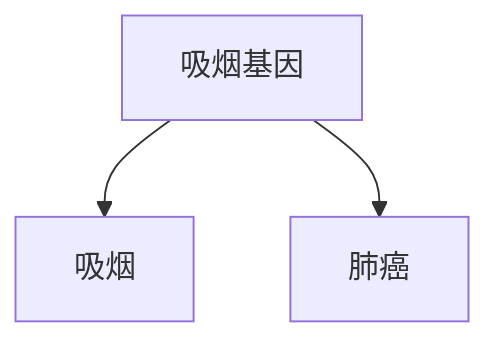
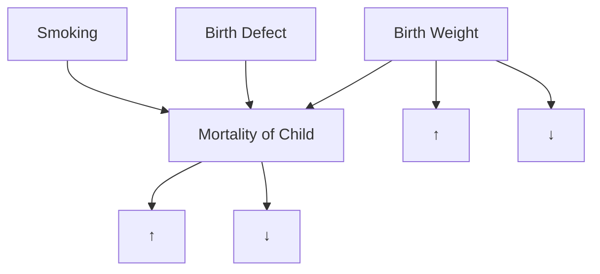

# 烟雾弥漫的辩论：拨云见日

> 最后，水手们彼此说：“来吧，我们抽签，看看这灾祸是因谁的缘故。”  
> ——《约拿书》1:7

在20世纪50年代末至60年代初，统计学家和医生们就本世纪最受关注的医学问题之一展开了激烈争论：**吸烟是否会导致肺癌？** 这场辩论过去半个世纪后，我们对答案已视为当然。但在当时，这个问题远未明朗。科学家们，甚至整个家庭，都因此产生分歧。

**雅各布·耶鲁沙尔米（Jacob Yerushalmy）**的家庭就是这样一个分裂的家庭。作为加州大学伯克利分校的生物统计学家，耶鲁沙尔米（1904–1973）是学术界最后一批支持烟草的顽固派之一。“耶鲁沙尔米直到临终之日都反对吸烟致癌的观点，”他的侄子**大卫·利连菲尔德（David Lilienfeld）**多年后写道。而另一方面，利连菲尔德之父**阿贝·利连菲尔德（Abe Lilienfeld）**是约翰霍普金斯大学的流行病学家，也是吸烟致癌理论最直言不讳的支持者之一。

小利连菲尔德回忆说，“雅克叔叔”（雅各布的昵称）和他的父亲常常坐在一起辩论吸烟的影响，而他们始终笼罩在“雅克的香烟和阿贝的烟斗喷出的烟雾之中”（见章节卷首图）。

要是阿贝和雅克当时能召唤出**因果革命（Causal Revolution）**来拨云见日就好了！正如本章所示，反对吸烟致癌假说的最重要科学论据之一，是可能存在一些未测量的因素，既导致对尼古丁的渴望，又引发肺癌。我们刚刚讨论了这种**混杂（confounding）**模式，并指出今天的**因果图（causal diagrams）**已经消除了混杂的威胁。但我们现在身处20世纪50年代和60年代，比**桑德·格林兰（Sander Greenland）**和**杰米·罗宾斯（Jamie Robins）**早二十年，比任何人听说**do算子（do-operator）**还要早三十年。因此，审视那个时代的科学家如何处理这个问题，并证明混杂论点不过是烟雾和镜子，是很有趣的。

毫无疑问，阿贝和雅克烟雾弥漫的辩论中，许多话题既非烟草也非癌症，而是那个看似无害的词——“导致”。这并非医生们第一次面对令人困惑的因果问题：医学史上一些最伟大的里程碑都与识别致病因素有关。18世纪中期，**詹姆斯·林德（James Lind）**发现柑橘类水果可以预防坏血病；19世纪中期，**约翰·斯诺（John Snow）**查明受粪便污染的水会导致霍乱。（后来的研究在每个案例中都确定了更具体的致病因素：坏血病是维生素C缺乏，霍乱是霍乱杆菌。）

这些出色的侦探工作有一个共同点：因果之间幸运的一一对应关系。霍乱杆菌是霍乱的唯一病因；或者用我们今天的话说，它既是**必要条件（necessary）**也是**充分条件（sufficient）**。如果你没有接触它，就不会得病。同样，维生素C缺乏是产生坏血病的必要条件，并且只要时间足够，它也是充分条件。

吸烟与癌症的辩论挑战了这种单一的因果概念。许多人终身吸烟却从未患肺癌。反之，有些人从不吸烟却患上了肺癌。有些人可能因遗传倾向而患病，另一些人则因接触致癌物，还有些人则两者兼有。

当然，统计学家们已经知道一种在更普遍意义上确立因果关系的极好方法：**随机对照试验（randomized controlled trial, RCT）**。但在吸烟问题上，这样的研究既不可行也不符合伦理。你怎么能随机分配一些人去吸烟几十年，可能损害他们的健康，仅仅为了看看他们三十年后是否会得肺癌？很难想象北韩以外会有人“自愿”参加这样的研究。

没有随机对照试验，就无法说服像耶鲁沙尔米和**R. A. 费希尔（R. A. Fisher）**这样的怀疑论者，他们坚信观察到的吸烟与肺癌之间的关联是虚假的。对他们来说，可能存在某个潜伏的第三因素导致了观察到的关联。例如，可能存在一个**吸烟基因**，既使人们渴望香烟，又同时使他们更容易患肺癌（可能是因为其他生活方式的选择）。他们提出的混杂因素充其量是难以置信的。然而，举证责任落在了反吸烟阵营身上，他们需要证明不存在混杂因素——即证明一个否定命题，而费希尔和耶鲁沙尔米深知这几乎是不可能的。

这场僵局的最终突破，是一个既**伟大胜利**又**错失重大机遇**的故事。对公共卫生而言，这是一场胜利，因为流行病学家最终得出了正确结论。1964年，美国**卫生局局长（Surgeon General）**的报告以毫不含糊的语言指出：“**吸烟与男性肺癌存在因果关系。**”这一直白的声明永远终结了吸烟“尚未被证明”致癌的争论。美国男性的吸烟率从次年开始下降，如今已不到1964年的一半。毫无疑问，数百万人的生命得以挽救，寿命得以延长。

另一方面，这场胜利并不完整。如果科学家们当时能够借助更有原则的因果理论，那么从大约1950年到1964年得出上述结论所需的时间本可以更短。而更重要的是，从本书的角度来看，20世纪60年代的科学家并没有真正建立起这样的理论。为了证明吸烟致癌的主张，卫生局局长的委员会依赖了一套非正式的指导方针，称为**希尔准则（Hill’s criteria）**，以伦敦大学统计学家**奥斯汀·布拉德福德·希尔（Austin Bradford Hill）**命名。这些准则中的每一条都有明显的例外，尽管它们作为一个整体具有令人信服的常识价值，甚至智慧。

从费希尔过度方法论的世界出发，希尔的准则将我们带到了相反的领域——一个没有方法论的世界，在那里因果关系是基于统计趋势的定性模式来判定的。因果革命在这两个极端之间架起了一座桥梁，用数学的严谨性增强了我们直观的因果感。但这项工作将留给下一代去完成。

## 烟草：一场人为的流行病

1902年，香烟仅占美国烟草市场的2%；痰盂而非烟灰缸是烟草消费最普遍的象征。但两股强大的力量共同改变了美国人的习惯：**自动化**和**广告**。机制香烟在可获得性和成本方面轻易击败了手工制作的雪茄和烟斗。与此同时，烟草业发明并完善了广告业的许多技巧（见图5.1）。在20世纪60年代看电视的人很容易记住许多朗朗上口的香烟广告歌，从“万宝路，好东西真不少”到“宝贝，你进步真大”。

到1952年，香烟在烟草市场中的份额从2%飙升至81%，而市场本身也急剧增长。一个国家习惯的这种巨变对公共卫生产生了意想不到的影响。早在20世纪初，就有人怀疑吸烟不健康，会“刺激”喉咙并引起咳嗽。大约在20世纪中期，证据开始变得不祥得多。

在香烟普及之前，肺癌非常罕见，一位医生可能整个职业生涯中只会遇到一次。但在1900年至1950年间，这种以前罕见的疾病发病率翻了四倍，到1960年，它将成为男性中最常见的癌症形式。这种致命疾病发病率的巨大变化亟待解释。

*黑白照片：一名男子在带有台灯和硬币的办公桌前使用老式电话（无可见文字或符号）*

## “我马上就到！”

……一天24小时，您的医生“随时待命”……守护健康……保护并延长生命……

> CAMEL  
> TURKISH & DOMESTIC  
> BLEND  
> CIGARETTES  
> R. J. Reynolds Tobacco Company, Winston-Salem, I

根据最近一项独立的全国性调查：

# 更多医生吸食骆驼牌香烟

而非任何其他品牌

> **图 5.1.** 极具操纵性的广告旨在让公众相信香烟对健康无害——包括这则1948年刊登在《美国医学会杂志》上、针对医生群体的广告。（来源：斯坦福烟草广告影响研究收藏。）

事后看来，很容易将矛头指向吸烟。如果我们在图表上绘制肺癌发病率和烟草消费率（见图5.2），这种联系是不可能忽略的。但时间序列数据作为因果关系的证据是薄弱的。1900年至1950年间，许多其他事物也发生了变化，同样可能是合理的罪魁祸首：道路铺设、吸入含铅汽油废气，以及普遍的大气污染。

英国流行病学家**理查德·多尔（Richard Doll）**在1991年说：“汽车……是一个新因素，如果当时我必须押注在任何事情上，我会押在汽车尾气上，或者可能是道路的柏油铺设上。”

> **图 5.2.** 美国人均香烟消费率（黑色）与男性肺癌死亡率（灰色）的图表显示出惊人的相似性：癌症曲线几乎是吸烟曲线的复制品，延迟了约三十年。然而，这一证据是间接的，并非因果关系的证明。此处标注了一些关键日期，包括1950年理查德·多尔和奥斯汀·布拉德福德·希尔论文的发表，这篇论文首次使许多医学专业人士注意到吸烟与肺癌之间的关联。（来源：Maayan Harel 绘制的图表，数据来自美国癌症协会、疾病控制中心和卫生局局长办公室。）

科学的任务是将假设搁置一旁，审视事实。1948年，多尔和奥斯汀·布拉德福德·希尔联手，试图了解这场癌症流行的原因。希尔曾是一项非常成功的随机对照试验的首席统计学家，该试验于同年早些时候发表，证明了**链霉素（streptomycin）**——最早的抗生素之一——对结核病有效。这项研究是医学史上的一个里程碑，不仅向医生们介绍了“神奇药物”，还巩固了随机对照试验的声誉，后者很快成为流行病学临床研究的标准。

当然，希尔知道在这种情况下进行随机对照试验是不可能的，但他已经了解到将治疗组与对照组进行比较的优势。因此，他提议将已确诊癌症的患者与一组健康志愿者（对照组）进行比较。每组受访者都被询问其过去的行为和病史。为了避免偏见，访谈者不知道谁患有癌症，谁是对照组。

研究结果令人震惊：在649名接受访谈的肺癌患者中，除两人外，其余全部是吸烟者。这是一个极端的统计不可能性，以至于多尔和希尔忍不住计算出了具体的概率：**150万比1**。此外，肺癌患者平均而言是**吸烟量更大**的吸烟者，但（在R. A. 费希尔后来抓住不放的一个不一致之处中）报告吸入烟雾的比例反而更小。

多尔和希尔进行的研究类型现在称为**病例对照研究（case-control study）**，因为它将“病例”（患有疾病的人）与对照进行比较。这显然比时间序列数据有所改进，因为研究人员可以控制年龄、性别和环境污染物暴露等混杂因素。然而，病例对照设计存在一些明显的缺点：

- 它是**回顾性（retrospective）**的；这意味着我们研究已知患有癌症的人，并回顾过去以发现原因。
- 概率逻辑也是反向的。数据告诉我们的是癌症患者是吸烟者的概率，而不是吸烟者会患癌症的概率。对于一个想知道自己是否应该吸烟的人来说，后者才是真正重要的概率。

此外，病例对照研究允许存在几种可能的偏倚来源：

- 其中之一称为**回忆偏倚（recall bias）**：尽管多尔和希尔确保访谈者不知道诊断结果，但患者当然知道自己是否患有癌症。这可能会影响他们的回忆。
- 另一个问题是**选择偏倚（selection bias）**。住院的癌症患者绝不是整个人群（甚至吸烟人群）的代表性样本。

简而言之，多尔和希尔的结果极具启发性，但不能被视为吸烟致癌的证明。两位研究人员起初谨慎地将这种相关性称为“关联”。在排除几个混杂因素后，他们大胆地提出了一个更强的断言：“**吸烟是肺癌产生的一个因素，而且是一个重要因素。**”

在接下来的几年里，在不同国家进行的十九项病例对照研究都得出了基本相同的结论。但正如R. A. 费希尔非常乐意指出的那样，将一项有偏倚的研究重复十九次并不能证明任何东西。它仍然是有偏倚的。费希尔在1957年写道，这些研究“仅仅是同类证据的重复，有必要检验这种证据是否足以得出任何科学结论。”

多尔和希尔意识到，如果病例对照研究中存在隐藏的偏倚，单纯的重复是无法克服的。因此，在1951年，他们开始了一项**前瞻性研究（prospective study）**，向60,000名英国医生发放了关于其吸烟习惯的问卷，并随时间推移对他们进行追踪随访。（美国癌症协会大约在同一时间启动了一项类似但规模更大的研究。）

即使在仅仅五年内，就出现了一些显著的差异。重度吸烟者的肺癌死亡率是非吸烟者的**二十四倍**。在美国癌症协会的研究中，结果更为严峻：吸烟者死于肺癌的频率是非吸烟者的**二十九倍**，而重度吸烟者则高达**九十倍**。另一方面，曾经吸烟但后来戒烟的人，其风险降低了约一半。

所有这些结果的一致性——吸烟越多，患癌风险越高；戒烟则风险降低——是因果关系的另一个有力证据。医生们称之为**“剂量-反应效应（dose-response effect）”**：如果物质A引起生物学效应B，那么通常（尽管并非总是）更大剂量的A会引起更强的反应B。

尽管如此，像费希尔和耶鲁沙尔米这样的怀疑论者仍不会被说服。前瞻性研究仍然未能将吸烟者与在其他方面完全相同的非吸烟者进行比较。事实上，这样的比较是否可行尚不清楚。吸烟者是自我选择的。他们可能在基因或“体质”上与不吸烟者有诸多不同——更具冒险精神，更可能大量饮酒。其中一些行为可能导致不良健康效应，而这些效应原本可能被归咎于吸烟。

这对怀疑论者来说是一个特别方便的理由，因为体质假说几乎无法检验。直到2000年人类基因组测序之后，才有可能寻找与肺癌相关的基因。（具有讽刺意味的是，费希尔被证明是正确的，尽管范围非常有限：这样的基因确实存在。）

然而，在1959年，**杰罗姆·康菲尔德（Jerome Cornfield）**与阿贝·利连菲尔德共同撰写了一篇论文，对费希尔的论点进行了逐点反驳，在许多医生看来，这解决了问题。康菲尔德在美国国立卫生研究院工作，是吸烟与癌症辩论中的一个不寻常的参与者。他既非统计学家也非生物学家出身，主修历史，并在美国农业部学习了统计学。尽管有些自学成才，但他最终成为了一位备受追捧的顾问和美国统计协会主席。他本人曾每天吸两包半香烟，但在看到肺癌数据后戒掉了这个习惯。（有趣的是，吸烟辩论对参与的科学家来说是多么个人化。费希尔从未放弃他的烟斗，耶鲁沙尔米也从未放弃他的香烟。）

康菲尔德直接瞄准了费希尔的体质假说，并且是在费希尔自己的地盘上：数学。他论证道，假设存在一个混杂因素，比如吸烟基因，完全解释了吸烟者的癌症风险。如果吸烟者患肺癌的风险是非吸烟者的九倍，那么要解释这种风险差异，混杂因素在吸烟者中的普遍程度必须至少是非吸烟者的九倍。

想想这意味着什么。如果11%的非吸烟者拥有“吸烟基因”，那么高达99%的吸烟者必须拥有它。如果恰好有12%的非吸烟者拥有癌症基因，那么从数学上讲，癌症基因就不可能完全解释吸烟与癌症之间的关联。对生物学家来说，这个被称为**康菲尔德不等式（Cornfield’s inequality）**的论点，将费希尔的体质假说贬得一文不值。很难想象一种基因变异能够与像一个人选择吸烟这样复杂且不可预测的行为如此紧密地联系在一起。

康菲尔德的 inequality 实际上是一种萌芽形式的因果论证：它为我们提供了一个标准，用以裁决**图5.1**（其中体质假说无法完全解释吸烟与肺癌之间的关联）和**图5.2**（其中吸烟基因将完全解释观察到的关联）。

> **图 5.1.**

> **图 5.2.**

如上所述，吸烟与肺癌之间的关联太强，无法用体质假说解释。事实上，康菲尔德的方法为一种非常强大的技术——称为**“敏感性分析（sensitivity analysis）”**——播下了种子，该技术今天补充了从引言中描述的推理引擎得出的结论。分析者不是通过假设模型中不存在某些因果关系来推断，而是挑战这些假设，并评估替代关系必须有多强才能解释观察到的数据。然后，定量结果将提交给合理性判断，这与在假设不存在这些因果关系时所援引的粗略判断并无不同。不用说，如果我们要将康菲尔德的方法扩展到包含三个以上变量的模型，我们需要算法和估计技术，而这些技术在图形工具出现之前是不可想象的。

20世纪50年代的流行病学家面临着这样的批评：他们的证据“仅仅是统计上的”。据称没有“实验室证据”。但即使是看看历史也表明，这种论点是站不住脚的。如果“实验室证据”的标准应用于坏血病，那么水手们可能会一直死到20世纪30年代，因为在发现维生素C之前，没有“实验室证据”表明柑橘类水果能预防坏血病。此外，在20世纪50年代，一些关于吸烟影响的实验室证据确实开始出现在医学期刊上。涂有香烟焦油的老鼠患上了癌症。香烟烟雾被证明含有**苯并芘（benzopyrenes）**，一种先前已知的致癌物。这些实验增加了吸烟致癌假说的生物学合理性。

到50年代末，如此多种不同证据的积累已经使该领域几乎所有专家都相信吸烟确实致癌。值得注意的是，甚至烟草公司的研究人员也被说服了——这一事实直到20世纪90年代才被深深隐藏，当时诉讼和举报人迫使烟草公司公布了成千上万份此前秘密的文件。例如，在1953年，R.J. Reynolds 公司的化学家**克劳德·蒂格（Claude Teague）**曾致信公司高层管理人员，称烟草是“诱发原发性肺癌的一个重要病因因素”，几乎逐字重复了希尔和多尔的结论。

在公开场合，香烟公司却唱着不同的调子。1954年1月，几家主要的烟草公司（包括Reynolds）在全国性报纸上刊登了一则广告，“致吸烟者的坦诚声明”，其中说：“我们相信我们生产的产品对健康无害。我们过去一直并将继续与那些负责维护公众健康的人密切合作。”在1954年3月的一次演讲中，菲利普·莫里斯公司副总裁**乔治·韦斯曼（George Weissman）**说：“如果我们有任何想法或知识，认为我们在以任何方式销售对消费者有害的产品，我们明天就会停止营业。”六十年后，我们仍在等待菲利普·莫里斯兑现这一承诺。

这引出了整个吸烟与癌症争议中最可悲的一章：烟草公司故意欺骗公众关于健康风险的努力。如果说大自然就像一个精灵，它诚实地回答问题，但只回答你问的那个问题，那么想象一下，科学家面对一个意图欺骗我们的对手是多么困难。香烟战争是科学第一次面对有组织的否认主义，没有人做好准备。烟草公司放大了他们能找到的任何一丝科学争议。他们成立了自己的**烟草工业研究委员会（Tobacco Industry Research Committee）**，这是一个幌子组织，向科学家提供资金以研究与癌症或烟草相关的问题——但不知何故从未触及核心问题。当他们能找到吸烟与癌症关联的合法怀疑论者——如R. A. 费希尔和雅各布·耶鲁沙尔米——时，烟草公司会向他们支付咨询费。

费希尔的案例尤其令人遗憾。当然，怀疑有其价值。统计学家就是靠做怀疑论者吃饭的；他们是科学的良心。但合理怀疑与不合理怀疑之间是有区别的。费希尔越过了那条线，而且不止一步。他总是无法承认自己的错误，并且肯定受到他终身吸烟斗习惯的影响，他无法承认证据的潮流已经转向对他不利。他的论点变得绝望。他抓住了多尔和希尔第一篇论文中的一个反直觉结果——即肺癌患者报告自己吸入烟雾的比例低于对照组的发现（该发现勉强达到统计显著性）——并且不肯放手。随后的研究都没有发现任何这种效应。尽管费希尔和其他人一样清楚，“统计上显著”的结果有时无法被复制，但他还是诉诸于嘲讽。他争辩说，他们的研究表明吸入香烟烟雾可能是有益的，并呼吁对这个“极其重要的点”进行进一步研究。也许关于费希尔在这场辩论中的角色，我们能说的唯一积极的事情是，烟草金钱几乎不可能以任何方式腐蚀了他。他自己的固执就足够了。

好的，请查收根据您的要求翻译的中文版本。

---

由于所有这些原因，吸烟与癌症之间的关联，在流行病学家内部早已尘埃落定之后，在公众心目中仍长期存在争议。即使是应该更了解科学的医生们，也并未完全信服：美国癌症协会（American Cancer Society）在1960年进行的一项民意调查显示，只有三分之一的美国医生同意吸烟是“肺癌的一个主要原因”这一说法，而43%的医生本人就是吸烟者。

虽然我们可以合理地指责费舍尔（Fisher）的顽固和烟草公司的蓄意欺骗，但我们也必须承认，当时的科学界正受困于一种意识形态的桎梏。费舍尔主张将**随机对照试验（Randomized Controlled Trials, RCTs）** 作为评估因果效应的有效方法，这本身是正确的。然而，他和他的追随者们未能认识到，我们可以从**观察性研究（observational studies）** 中学到很多东西。这正是**因果模型（causal model）** 的优势所在：它利用了实验者的科学知识。费舍尔的方法假设实验者对要检验的假设事先没有任何知识或意见。他们将无知强加于科学家，而否认者们则 eagerly 利用了这种状况。

由于科学家们对“原因（cause）”一词没有直接的定义，也没有办法在缺乏随机对照试验的情况下确定因果效应，因此，他们在关于吸烟是否致癌的辩论中准备不足。他们被迫在整个20世纪50年代的过程中摸索着走向一个定义，并在1964年得出了一个戏剧性的结论。

## 卫生局长的委员会与希尔标准（The Surgeon General’s Commission and Hill’s Criteria）

科恩菲尔德（Cornfield）和利林菲尔德（Lilienfeld）的论文为卫生当局就吸烟的影响发表权威声明铺平了道路。英国的皇家内科医师学会（Royal College of Physicians）率先行动，于1962年发布了一份报告，结论是吸烟是肺癌的一个致病因素。此后不久，美国卫生总署署长卢瑟·特里（Luther Terry）（很可能是受约翰·F·肯尼迪总统的敦促）宣布，他打算任命一个特别咨询委员会来研究此事（见图5.3）。

该委员会的组成经过精心平衡，包括五名吸烟者和五名非吸烟者，两名由烟草业推荐的人选，以及任何此前未就吸烟问题公开发表过支持或反对意见的人。因此，像利林菲尔德和科恩菲尔德这样的人没有资格入选。委员会的成员都是医学、化学或生物学领域的杰出专家。其中一位，哈佛大学的威廉·科克伦（William Cochran），是一名统计学家。事实上，科克伦的统计学资历是最顶尖的：他是卡尔·皮尔逊（Karl Pearson）学生的学生。

> **图5.3。** 1963年，一个卫生总署署长咨询委员会正在努力解决如何评估吸烟的因果效应的问题。图中描绘的是威廉·科克伦（委员会的统计学家）、卫生总署署长卢瑟·特里和化学家路易斯·菲泽（Louis Fieser）。（来源：Dakota Harr 绘图。）

- 人均吸烟量
- 肺癌
- 其他癌症

该委员会在其报告上花费了一年多的时间，其中一个主要问题是对“原因（cause）”一词的使用。委员会成员必须摒弃19世纪决定论的因果关系概念，也必须摒弃统计学。正如他们（很可能是科克伦）在报告中所写：

> “统计方法不能建立关联中因果关系的证明。关联的因果意义是一个判断问题，它超越了任何统计概率的陈述。要判断或评估属性或因素与疾病之间的关联，或对健康的影响的因果意义，必须利用一系列标准，其中没有一条是判断的充分基础。”

委员会列出了五个这样的标准：

- **一致性（Consistency）**：在不同人群中进行的许多研究显示出相似的结果。
- **关联强度（Strength of association）**：包括**剂量-反应效应（dose-response effect）**；吸烟越多，风险越高。
- **关联特异性（Specificity of the association）**：一个特定的因素应该产生一个特定的效应，而不是一长串的效应。
- **时间关系（Temporal relationship）**：效应应该发生在原因之后。
- **连贯性（Coherence）**：生物学上的合理性以及与实验室实验和时间序列等其他类型证据的一致性。

1965年，未在该委员会任职的奥斯汀·布拉德福德·希尔（Austin Bradford Hill）试图以一种可以应用于其他公共卫生问题的方式来总结这些论点，并在列表中添加了四个标准；因此，这九个标准的整个列表被称为“**希尔标准（Hill's criteria）**”。实际上，希尔称它们为“**观点（viewpoints）**”，而非要求，并强调在任何特定情况下都可能缺少其中任何一个。“我的九个观点中，没有一个能为因果假设提供无可辩驳的证据，也没有一个可以作为必要条件，”他写道。

事实上，无论是希尔列表还是咨询委员会较短的列表，都很容易找到反对其中每个标准的论据。一致性本身证明不了什么；如果三十项研究都忽略了同一个混杂因素，那么所有研究都可能轻易产生偏差。基于同样的原因，关联强度也很脆弱；正如前面所指出的，儿童鞋码与他们的阅读能力密切相关，但并无因果关系。特异性一直是一个特别有争议的标准。它在传染病背景下是有意义的，因为一种病原体通常导致一种疾病，但在环境暴露背景下则不那么有意义。吸烟会导致多种其他疾病的风险增加，例如肺气肿和心血管疾病。这是否真的削弱了它致癌的证据？如前所述，时间关系也有一些例外——例如，公鸡打鸣并不导致太阳升起，尽管它总是在太阳之前发生。最后，与既定理论或事实的连贯性当然是可取的，但科学史充满了被推翻的理论和错误的实验室发现。

作为一个学科如何使用多种证据来接受一个因果假设的描述，希尔的“观点”仍然有用，但它们没有附带实施的方法论。例如，生物学合理性和与实验的一致性被认为是好事。但是，我们究竟应该如何权衡这些类型的证据？我们如何将已有的知识纳入考量？显然，每个科学家都必须自己决定。但直觉决策可能是错误的，尤其是在存在政治压力或金钱考量，或者科学家本身对所研究的物质上瘾的情况下。

这些评论无意贬低委员会的工作。其成员在一个没有为他们提供讨论因果关系机制的环境中尽了最大努力。他们认识到非统计标准的必要性，这是向前迈出的一大步。委员会中吸烟者所做的艰难个人决定证明了他们结论的严肃性。曾是纸烟吸烟者的卢瑟·特里改用了烟斗。伦纳德·舒曼（Leonard Schuman）宣布戒烟。威廉·科克伦承认他可以通过戒烟来降低患癌风险，但他觉得“香烟带来的舒适感”足以补偿这种风险。最令人痛苦的是，每天吸四包烟的吸烟者路易斯·菲泽在报告发布后不到一年就被诊断出患有肺癌。他写信给委员会：

> “你可能还记得，尽管我完全被证据所说服，但在我们委员会审议期间，我仍然继续大量吸烟，并搬出了所有通常的借口。……我的案例在我看来比任何统计数据都更有说服力。”

切除了一叶肺后，他终于停止了吸烟。

从公共卫生的角度来看，咨询委员会的报告是一个里程碑。两年内，国会要求制造商在所有香烟包装上印上健康警示。1971年，香烟广告被禁止在广播电视上播放。美国成年人吸烟的比例从1965年历史最高点的45%下降到2010年的19.3%。反吸烟运动是历史上规模最大、最成功的公共卫生干预措施之一，尽管其进程缓慢且尚未完成。委员会的工作也为达成科学共识提供了宝贵的模板，并为未来卫生总署署长关于吸烟以及未来许多其他主题（包括在20世纪80年代成为主要问题的二手烟）的报告树立了榜样。

从因果关系的角度来看，这份报告充其量只能算是一个有限的成功。它清楚地确立了因果问题的严重性，以及仅靠数据无法回答这些问题。但作为未来发现的路线图，其指导方针是不确定且脆弱的。希尔标准最好作为一份历史文献来阅读，它总结了20世纪50年代出现的、最终说服了医学界的各类证据。但作为未来研究的指南，它们是不够的。对于除最宽泛的因果问题之外的所有问题，我们需要更精确的工具。回顾过去，科恩菲尔德不等式（Cornfield's inequality）播下了**敏感性分析（sensitivity analysis）** 的种子，是朝着这个方向迈出的一步。

## 新生儿吸烟（Smoking for Newborns）

即使在吸烟与癌症的争论平息之后，一个主要的悖论仍然存在。在20世纪60年代中期，雅各布·耶鲁沙米（Jacob Yerushalmy）指出，如果婴儿恰好出生时体重不足，母亲在怀孕期间吸烟似乎对其新生儿的健康有益。这个被称为**出生体重悖论（birth-weight paradox）** 的谜题，与正在形成的关于吸烟的医学共识相悖，直到2006年——也就是耶鲁沙米最初论文发表四十多年后——才得到令人满意的解释。

> **批注**：我绝对相信，花了这么长时间是因为从1960年到1990年，因果关系的语言尚不可用。

1959年，耶鲁沙米发起了一项长期公共卫生研究，收集了旧金山湾区超过15000名儿童的产前和产后数据。这些数据包括母亲的吸烟习惯，以及她们婴儿的出生体重和第一个月内的死亡率。

之前的多项研究已经表明，吸烟母亲的婴儿平均出生体重低于非吸烟者的婴儿，并且很自然地认为这将导致更低的存活率。事实上，一项针对**低出生体重（low-birth-weight）** 婴儿（定义为出生时体重低于5.5磅的婴儿）的全国性研究表明，他们的死亡率是正常出生体重婴儿的20倍以上。因此，流行病学家提出了一个因果链：

**吸烟 → 低出生体重 → 死亡率。**

耶鲁沙米在数据中发现的，甚至出乎他自己的意料。吸烟者的婴儿平均体重确实比非吸烟者的婴儿轻（轻7盎司）。然而，吸烟母亲所生的低出生体重婴儿的存活率却高于非吸烟母亲所生的低出生体重婴儿。就好像母亲的吸烟实际上具有保护作用。

> **批注**：如果费舍尔发现了类似的东西，他可能会大声宣称这是吸烟的好处之一。值得称赞的是，耶鲁沙米没有这样做。

他更加谨慎地写道：“这些矛盾的发现引发了疑问，并反对吸烟作为一种外源性因素干扰胎儿宫内发育的命题。”简而言之，不存在从吸烟到死亡率的因果路径。

现代流行病学家认为耶鲁沙米是错误的。大多数人认为吸烟确实会增加新生儿死亡率——例如，因为它干扰了通过胎盘的氧气输送。但我们如何使这个假设与数据一致呢？

统计学家和流行病学家坚持用概率术语分析这个悖论，并将其视为出生体重特有的异常现象。事实证明，这与出生体重关系不大，而与**对撞因子（colliders）** 密切相关。从这个角度来看，它并非悖论，而是具有启发意义。

事实上，一旦我们添加一点细节，耶鲁沙米的数据与模型**吸烟 → 低出生体重 → 死亡率**完全一致。吸烟可能有害，因为它导致低出生体重，但低出生体重的某些其他原因，例如严重或危及生命的遗传异常，则更为有害。对于一个特定的婴儿来说，低出生体重有两种可能的解释：可能是母亲吸烟，或者可能受到其他原因的影响。如果我们发现母亲是吸烟者，这解释了低体重的原因，从而降低了存在严重出生缺陷的可能性。但如果母亲不吸烟，我们就有更有力的证据表明低出生体重的原因是出生缺陷，那么婴儿的预后就会更差。

和之前一样，**因果图（causal diagram）** 使一切变得更清晰。当我们纳入新的假设时，因果图看起来像图5.4。我们可以看到，出生体重悖论是**对撞因子偏差（collider bias）** 的一个完美例子。对撞因子是**出生体重（Birth Weight）**。通过只观察低出生体重的婴儿，我们是在以该对撞因子为条件。这就在吸烟和死亡率之间打开了一条**后门路径（back-door path）**，即**吸烟 → 出生体重 ← 出生缺陷 → 死亡率**。这条路径是非因果的，因为其中一个箭头的方向是相反的。然而，它会在吸烟和死亡率之间引入一个虚假的相关性，并使我们对实际（直接）因果效应**吸烟 → 死亡率**的估计产生偏差。事实上，这种偏差大到使吸烟看起来竟然是有益的。

因果图的美妙之处在于，它们使偏差的来源显而易见。由于缺乏这样的图表，流行病学家们就这个悖论争论了40年。事实上，他们仍在讨论：2014年10月的《国际流行病学杂志》（*International Journal of Epidemiology*）刊登了关于这个主题的几篇文章。其中一篇由哈佛大学的泰勒·范德韦勒（Tyler VanderWeele）撰写，完美地解释了这一现象，并包含了一个与下图类似的图表。

> **图5.4。** 出生体重悖论的因果图。

当然，这个图可能过于简单，无法捕捉吸烟、出生体重和婴儿死亡率背后的全部故事。然而，对撞因子偏差的原理是稳健的。在这种情况下，偏差之所以被发现，是因为表面现象太难以置信，但试想一下，有多少对撞因子偏差案例因为偏差不与理论冲突而未被发现？

# 激情辩论：科学与文化（Passionate Debates: Science vs. Culture）

在我开始撰写本章之后，我有机会联系了艾伦·威尔科克斯（Allen Wilcox），他很可能就是那位与这个悖论关系最密切的流行病学家。他对图5.4中的图表提出了一个非常棘手的问题：我们如何知道低出生体重实际上是死亡率的一个直接原因？事实上，他认为医生们一直以来都误解了低出生体重。因为它与婴儿死亡率密切相关，医生们便将其解释为一个原因。实际上，这种关联可能完全归因于混杂因素（由图5.4中的“出生缺陷”表示，尽管威尔科克斯没有这么具体）。

关于威尔科克斯的论点，有两点值得指出。首先，即使我们删除出生体重 → 死亡率这条箭头，对撞因子仍然存在。因此，因果图仍然成功地解释了出生体重悖论。其次，威尔科克斯研究最多的因果变量不是吸烟，而是种族。而种族在我们的社会中仍然引发激烈的辩论。

事实上，与吸烟者的孩子一样，在黑人母亲的孩子中也观察到了同样的出生体重悖论。黑人女性比白人女性更常生下体重不足的婴儿，她们的婴儿死亡率也更高。然而，她们的低出生体重婴儿的存活率却高于白人女性的低出生体重婴儿。那么我们应该得出什么结论？我们可以告诉一位怀孕的吸烟者，戒烟会对她的宝宝有益。但我们不能告诉一位怀孕的黑人女性停止做黑人。

相反，我们应该解决导致黑人母亲的孩子死亡率更高的社会问题。这当然不是一个有争议的说法。但是我们应该解决哪些原因，以及我们应该如何衡量我们的进展？无论好坏，许多种族正义倡导者都假设出生体重是种族 → 出生体重 → 死亡率链条中的一个中间步骤。不仅如此，他们还把出生体重作为婴儿死亡率的**代理指标（proxy）**，认为前者的改善会自动导致后者的改善。很容易理解他们为什么这样做。测量平均出生体重比测量婴儿死亡率更容易获得。

现在想象一下，当像威尔科克斯这样的人出现并断言低出生体重本身并不是一种医学状况，与婴儿死亡率没有因果关系时，会发生什么。这打乱了整个计划。当威尔科克斯在20世纪70年代首次提出这个想法时，他被指责为种族主义，直到2001年他才敢发表。即便如此，他的文章还是附有两篇评论，其中一篇提到了种族问题：“在一个其主导元素通过论证其统治对象的基因劣等性来证明其地位的社会背景下，保持中立是很难的，”芝加哥库克县医院的理查德·大卫（Richard David）写道。“在追求‘纯科学’的过程中，一位善意的研究者可能被认为——并且可能确实——是在帮助和教唆他所憎恶的社会秩序。”

这种出于最崇高动机而提出的严厉指责，肯定不是科学家因阐明可能产生不利社会后果的真相而受到训斥的第一个例子。梵蒂冈对伽利略思想的反对，无疑是出于对当时社会秩序的真正担忧。查尔斯·达尔文的进化论和弗朗西斯·高尔顿的优生学也是如此。然而，由新科学发现引发的文化冲击，最终会通过适应这些发现的文化调整来解决——而不是通过隐瞒。这种调整的一个前提是，我们必须在情绪激化之前，将科学与文化区分开来。幸运的是，因果图的语言现在为我们提供了一种方法，使我们不仅能够在容易的时候，而且能够在困难的时候，冷静地对待因果关系。

> 你想换门吗？
>
> “蒙提霍尔悖论（Monty Hall paradox）”，一个经久不衰且令许多人恼怒的谜题，突显了当应该应用因果推理时，我们的大脑是如何被概率推理所愚弄的。（来源：Maayan Harel 绘图。）