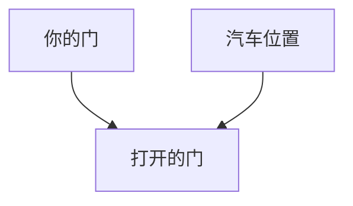
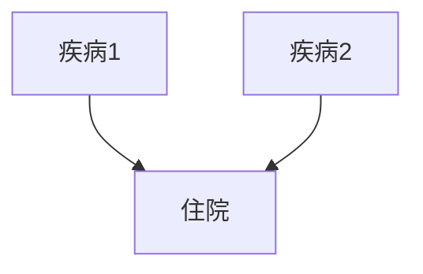
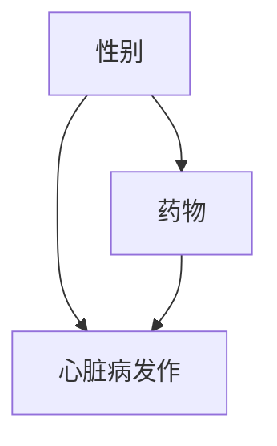
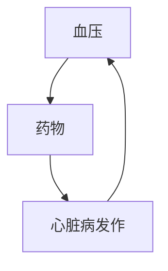
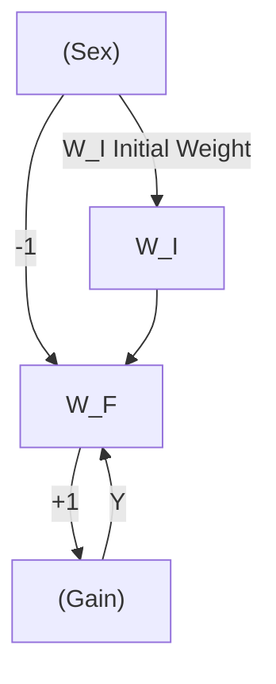
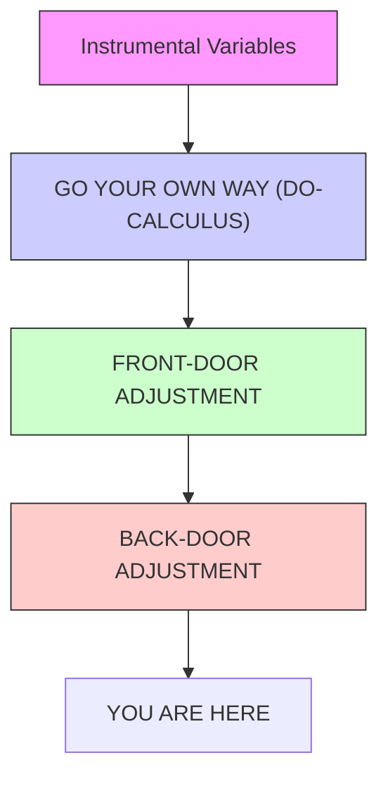

# 悖论大全！

直面悖论的人，就是直面现实的人。  
——弗里德里希·迪伦马特（Friedrich Dürrenmatt，1962）

**出生体重悖论（birth-weight paradox）**——我们在第5章结尾处讨论过的——代表了一类数量惊人的悖论，它们反映了**因果（causation）**与**关联（association）**之间的张力。这种张力之所以产生，是因为它们分别处于**因果之梯（Ladder of Causation）**的不同层级，而人类直觉在因果逻辑下运作、数据却遵循概率与比例的逻辑，这一事实加剧了这种张力。当我们误将一个领域的规则应用于另一个领域时，悖论便应运而生。

我们将用一章的篇幅来探讨概率论与统计学中一些最令人困惑、最著名的悖论，首先是因为它们很有趣。如果你以前没见过**蒙提霍尔问题（Monty Hall problem）**和**辛普森悖论（Simpson's paradox）**，我可以保证它们会让你的大脑好好锻炼一番。即使你认为自己对这些悖论了如指掌，我相信你也会乐于通过因果关系的视角来审视它们——这会让一切都变得大不相同。

然而，我们研究悖论不仅仅是因为它们有趣好玩。就像视觉错觉一样，它们也揭示了大脑的运作方式、大脑所走的捷径以及大脑发现矛盾的事物。**因果悖论（Causal paradoxes）**将那些与概率和统计逻辑相冲突的直观因果推理模式置于聚光灯下。考虑到统计学家们在这些悖论面前也曾苦苦挣扎——我们将会看到他们失手得相当严重——这是一个警示信号，表明在没有因果透镜的情况下看待世界可能会出问题。

## 令人困惑的蒙提霍尔问题

20世纪80年代末，一位名叫**玛丽莲·沃斯·萨凡特（Marilyn vos Savant）**的作家在《Parade》杂志上开设了一个定期专栏，该杂志是美国许多城市周日报纸的每周增刊。她的专栏"Ask Marilyn"延续至今，内容是她对读者提交的各种谜题、脑筋急转弯和科学问题的回答。该杂志称她为"世界上最聪明的女人"，这无疑激励了读者们提出一个能难倒她的问题。

在她回答过的所有问题中，没有一个比1990年9月专栏中出现的这个问题引发更大的争议：

> "假设你参加一个游戏节目，你有三个门可以选择。一扇门后面是一辆汽车，另外两扇门后面是山羊。你选了一扇门，比如1号门，然后知道门后情况的主持人打开了另一扇门，比如3号门，里面有一只山羊。他对你说：'你想选2号门吗？'换选门对你有利吗？"

对美国读者来说，这个问题显然基于一个名为《Let's Make a Deal》的热门电视游戏节目，该节目的主持人**蒙提·霍尔（Monty Hall）**正是用这种心理游戏与参赛者互动。在她的回答中，沃斯·萨凡特认为参赛者应该**换门**。不换门的话，他们获胜的概率只有三分之一；换门的话，他们获胜的概率会翻倍，达到三分之二。

即便是世界上最聪明的女人，也绝不可能预料到接下来发生的事情。在接下来的几个月里，她收到了超过10,000封读者来信，其中大多数不同意她的观点，而且许多来信者声称拥有数学或统计学博士学位。以下是学术界人士评论的一小部分：

> "你搞砸了，而且搞砸大了！"（斯科特·史密斯，博士）
> "我建议你在下次尝试回答这类问题之前，先找一本标准的概率论教科书看看。"（查尔斯·里德，博士）
> "你搞砸了！"（罗伯特·萨克斯，博士）
> "你完全错了"（雷·波波，博士）

总的来说，批评者们认为换不换门并不重要——游戏中只剩下两扇门，而你完全是随机选择了一扇门，所以无论如何，汽车在你所选门后的概率都应该是二分之一。

谁是对的？谁是错的？为什么这个问题会激起如此强烈的情绪？这三个问题都值得仔细审视。

让我们先看看沃斯·萨凡特是如何解决这个谜题的。她的解法实际上简单得令人震惊，而且比我在许多教科书中见过的任何解法都更有说服力。她列出了一张表（表6.1），列出了门和山羊的三种可能排列，以及相应的"换门"策略和"不换门"策略下的结果。这三种情况都假设你选择了1号门。由于列出的三种可能性（初始时）是等可能的，因此换门获胜的概率是**三分之二**，而坚持选1号门获胜的概率只有**三分之一**。

请注意，沃斯·萨凡特的表格没有明确说明主持人打开了哪扇门。这些信息隐含在第4列和第5列中。例如，在第二行中，我们记住主持人必须打开3号门；因此换门会让你选到2号门，即获胜。类似地，在第一行中，打开的门可能是2号门或3号门，但第4列正确地指出，无论哪种情况，如果你换门都会输。

即使在今天，许多第一次看到这个谜题的人仍然觉得这个结果难以置信。为什么？是什么直觉神经被触动了？大概有10,000个不同的原因，每个读者一个，但我认为最有力的论据是：沃斯·萨凡特的解法似乎迫使我们相信心灵感应。如果无论我最初选择哪扇门都应该换门，那就意味着节目制作人 somehow 读懂了我的心。否则他们怎么可能把汽车放在更可能出现在我没选的那扇门后面呢？

**表6.1.**《Let's Make a Deal》中门和山羊的三种可能排列，显示换门的吸引力是不换门的两倍。

| 1号门 | 2号门 | 3号门 | 换门结果 | 不换门结果 |
|--------|--------|--------|-----------------------|----------------------|
| 汽车   | 山羊   | 山羊   | 输                    | 赢                   |
| 山羊   | 汽车   | 山羊   | 赢                    | 输                   |
| 山羊   | 山羊   | 汽车   | 赢                    | 输                   |

解决这个悖论的关键在于，我们不仅需要考虑数据（即主持人打开了特定门这一事实），还需要考虑**数据生成过程（data-generating process）**——换句话说，就是游戏规则。它们告诉我们一些关于可能发生但未被观察到的数据的信息。难怪统计学家们尤其觉得这个谜题难以理解。正如**R. A. 费希尔（R. A. Fisher，1922）**所说，他们习惯于"数据的约简"，而忽略了数据生成过程。

首先，让我们试着稍微改变一下游戏规则，看看这会如何影响我们的结论。想象一个名为《Let's Fake a Deal》的替代游戏节目，其中蒙提·霍尔打开你没选的两扇门中的一扇，但他的选择是完全随机的。具体来说，他可能会打开后面有汽车的那扇门。运气真差！

和之前一样，我们假设你一开始选择了1号门，主持人再次打开了3号门，露出一只山羊，并给你换门的机会。你应该换吗？我们将证明，在新规则下，尽管场景相同，**换门并不会让你获益**。

为此，我们制作一个类似之前的表格，考虑到有两个随机且独立的事件——汽车的位置（三种可能）和蒙提·霍尔选择打开的门（两种可能）。因此表格需要有六行，每一行都是等可能的，因为这些事件是独立的。

现在，如果蒙提·霍尔打开3号门并露出一只山羊，会发生什么？这给了我们一些重要信息：我们必须处于表格中的第2行或第4行。仅关注第2行和第4行，我们可以看到换门策略不再提供任何优势；无论哪种方式，我们获胜的概率都是二分之一。所以在《Let's Fake a Deal》游戏中，玛丽莲·沃斯·萨凡特的所有批评者都是对的！然而，两个游戏中的数据是相同的。教训非常简单：**我们获取信息的方式与信息本身同样重要**。

**表6.2.**《Let's Fake a Deal》的可能性。

| 你选的门 | 汽车所在的门 | 主持人打开的门 | 换门结果 | 不换门结果 |
|----------------|----------------|---------------------|-----------------------|----------------------|
| 1              | 1              | 2（山羊）            | 输                    | 赢                   |
| 1              | 1              | 3（山羊）            | 输                    | 赢                   |
| 1              | 2              | 2（汽车）            | 输                    | 输                   |
| 1              | 2              | 3（山羊）            | 赢                    | 输                   |
| 1              | 3              | 2（山羊）            | 赢                    | 输                   |
| 1              | 3              | 3（汽车）            | 输                    | 输                   |

让我们使用我们最喜欢的技巧，画一个**因果图（causal diagram）**，这应该能立即说明这两个游戏的区别。首先，图6.1显示了实际《Let's Make a Deal》游戏的因果图，其中蒙提·霍尔必须打开一扇后面没有汽车的门。**你的门（Your Door）**和**汽车位置（Location of Car）**之间没有箭头，意味着你选择门与制作人选择把汽车放在哪里是独立的。这意味着我们明确排除了制作人能读懂你的心（或者你能读懂他们的心！）的可能性。更重要的是图中存在的两个箭头。它们表明**打开的门（Door Opened）**既受你的选择影响，也受制作人的选择影响。这是因为蒙提·霍尔必须选择一扇既不同于你的门、也不同于汽车位置的门；他必须同时考虑这两个因素。


> 图6.1.《Let's Make a Deal》的因果图。



从图6.1可以看出，**打开的门（Door Opened）**是一个**对撞因子（collider）**。一旦我们获得了关于这个变量的信息，我们所有的概率就变成了以这个信息为条件的条件概率。但是，当我们以对撞因子为条件时，我们会在其父节点之间产生一种**虚假的依赖关系（spurious dependence）**。这种依赖关系在概率中得到了体现：如果你选了1号门，汽车位于2号门后面的可能性是1号门的两倍；如果你选了2号门，汽车位于1号门后面的可能性是2号门的两倍。

这确实是一种奇特的依赖关系，是大多数人不习惯的类型。这是一种没有原因的依赖关系。它不涉及制作人与我们之间的物理通信。它不涉及心灵感应。它纯粹是**贝叶斯条件作用（Bayesian conditioning）**的产物：一种没有因果关系的魔法般的信息传递。我们的大脑对这种可能性感到抗拒，因为从婴儿期开始，我们就学会了将相关性等同于因果关系。如果后面的一辆车和我们走同样的转弯，我们首先认为它在跟着我们（因果关系！）。然后我们认为我们要去同一个地方（也就是说，我们每次转弯背后都有一个共同原因）。但无原因的相关性违背了我们的常识。因此，蒙提霍尔悖论就像视觉错觉或魔术一样：它利用我们自身的认知机制来欺骗我们。

为什么我说蒙提·霍尔打开3号门是一种"信息传递"？毕竟，它并没有提供任何关于你最初选择1号门是否正确的新证据。你事先就知道他会打开一扇藏有山羊的门，而他也确实这么做了。如果你目睹了必然会发生的事情，没有人应该要求你改变你的信念。那么，为什么你对2号门的信念从三分之一上升到了三分之二？

答案是，蒙提不能在你选了1号门后打开它——但他本可以打开2号门。他没有这样做的事实，使得他因为被迫而打开3号门的可能性更大。因此，与之前相比，有更多证据表明汽车在2号门后面。这是贝叶斯分析的一个普遍主题：任何经受住了对其有效性构成威胁的检验的假设都会变得更加可信。威胁越大，它在经受住检验后就越可信。2号门容易受到反驳（即蒙提本可以打开它），但1号门则不然。因此，2号门成为更可能的汽车位置，而1号门则不是。汽车在1号门后面的概率仍然是三分之一。

现在，作为比较，图6.2显示了《Let's Fake a Deal》的因果图，在这个游戏中，蒙提·霍尔选择一扇不同于你选的但其他方面随机选择的门。这个图中仍然有一个从**你的门（Your Door）**指向**打开的门（Door Opened）**的箭头，因为他必须确保他选的门不同于你的门。然而，从**汽车位置（Location of Car）**到**打开的门（Door Opened）**的箭头将被删除，因为他不再关心汽车在哪里。在这个图中，以打开的门为条件完全没有影响：你的门和汽车位置最初是独立的，在我们看到蒙提门后的内容后，它们仍然独立。所以在《Let's Fake a Deal》中，汽车在你门后的可能性与在另一扇门后的可能性一样大，如表6.2所示。


> 图6.2.《Let's Fake a Deal》的因果图。


从贝叶斯的角度来看，这两个游戏的区别在于，在《Let's Fake a Deal》中，1号门容易受到反驳。蒙提·霍尔本可以打开3号门并露出汽车，这将证明你选的门是错的。因为你的门和2号门同样容易受到反驳，所以它们仍然具有相同的概率。

尽管纯粹是定性的，但这种分析可以通过使用**贝叶斯规则（Bayes's rule）**或将图视为简单的**贝叶斯网络（Bayesian network）**来定量化。这样做将这个问题置于一个统一的框架中，我们用它来思考其他问题。我们不需要发明解决这个谜题的方法；第3章描述的**信念传播（belief propagation）**方案将给出正确答案：即对于《Let's Make a Deal》，$P(\text{2号门}) = 2/3$；对于《Let's Fake a Deal》，$P(\text{2号门}) = 1/2$。

请注意，我实际上已经给出了蒙提霍尔悖论的两种解释。第一种使用因果推理来解释为什么我们观察到你的门和汽车位置之间存在虚假依赖关系；第二种使用贝叶斯推理来解释为什么在《Let's Make a Deal》中2号门的概率会上升。两种解释都很有价值。贝叶斯解释说明了这个现象，但并没有真正解释为什么我们觉得它如此矛盾。在我看来，对悖论的真正解决应该解释为什么我们首先会把它看作一个悖论。为什么那些读了她专栏的人如此坚信沃斯·萨凡特是错的？不仅仅是那些自以为无所不知的人。**保罗·埃尔德什（Paul Erdos）**，现代最杰出的数学家之一，同样无法相信这个解，直到计算机模拟向他显示换门是有利的。

这揭示了我们对世界的直观看法中存在什么深层次的缺陷？

"我们的大脑天生就不擅长做概率问题，所以出现错误我并不惊讶，"斯坦福大学的统计学家**珀西·迪亚科尼斯（Persi Diaconis）**在1991年接受《纽约时报》采访时说。确实如此，但还不止于此。我们的大脑不擅长做概率问题，但它们擅长做因果问题。而这种因果布线会产生系统性的概率错误，就像视觉错觉一样。因为**我的门（My Door）**和**汽车位置（Location of Car）**之间没有因果联系——无论是直接的还是通过共同原因——我们发现它们之间存在概率关联是完全不可理解的。我们的大脑没有准备好接受无原因的相关性，我们需要通过专门的训练——比如蒙提霍尔悖论或第3章讨论的例子——来识别它们可能出现的情况。一旦我们"重新布线了我们的大脑"来识别对撞因子，这个悖论就不再令人困惑了。

## 更多对撞因子偏差：伯克森悖论

1946年，梅奥诊所的生物统计学家**约瑟夫·伯克森（Joseph Berkson）**指出了在医院环境中进行观察性研究的一个特殊性：即使两种疾病在普通人群中彼此无关，它们也可能在医院患者中表现出关联。

为了理解伯克森的观察，让我们从一个因果图（图6.3）开始。考虑一个非常极端的情况也很有帮助：**疾病1（Disease 1）**和**疾病2（Disease 2）**通常都不严重到足以导致住院，但两者的组合却会导致住院。在这种情况下，我们会预期疾病1和疾病2在住院人群中是**高度相关的**。


> 图6.3. 伯克森悖论的因果图。



通过对住院患者进行研究，我们实际上是在以**住院（Hospitalization）**为条件。正如我们所知，以对撞因子为条件会在疾病1和疾病2之间产生一种虚假的关联。在我们之前的许多例子中，这种关联是负的，因为存在**解释消除效应（explain-away effect）**，但在这里它是正的，因为住院需要两种疾病都存在（而不仅仅是其中一种）。

然而，在很长一段时间里，流行病学家们拒绝相信这种可能性。直到1979年，麦克马斯特大学的**大卫·萨基特（David Sackett）**——一位各种统计偏差的专家——提供了强有力的证据证明伯克森悖论是真实存在的，他们仍然不相信。在一个例子中（见表6.3），他研究了两组疾病：**呼吸系统疾病（respiratory disease）**和**骨骼疾病（bone disease）**。普通人群中约7.5%的人患有骨骼疾病，这个比例与他们是否患有呼吸系统疾病无关。但对于患有呼吸系统疾病的住院患者，骨骼疾病的患病率跃升至**25%**！萨基特将这种现象称为"入院率偏差"或"伯克森偏差"。

**表6.3.** 萨基特证明伯克森悖论的数据。

| 呼吸系统疾病？↓ | 骨骼疾病？↓ | 普通人群：是 | 普通人群：否 | 普通人群：%是 | 住院患者：是 | 住院患者：否 | 住院患者：%是 |
|---|---|---|---|---|---|---|---|
| 是 | | 17 | 207 | 7.6 | 5 | 15 | 25.0 |
| 否（对照组） | | 184 | 2,376 | 7.2 | 18 | 219 | 7.6 |

萨基特承认，我们不能将这种效应明确归因于伯克森偏差，因为也可能存在**混杂因素（confounding factors）**。在某种程度上，这场争论仍在继续。然而，与1946年和1979年不同，流行病学领域的研究人员现在理解了因果图及其带来的偏差。讨论已经转向更精细的问题，比如偏差可能有多大，以及它是否足够大以至于在包含更多变量的因果图中可以观察到。这就是进步！

对撞因子诱导的相关性并不新鲜。它们可以在追溯到1911年英国经济学家**阿瑟·塞西尔·庇古（Arthur Cecil Pigou）**的一项研究中找到，该研究比较了酗酒父母和非酗酒父母的孩子。它们也出现在**芭芭拉·伯克斯（Barbara Burks，1926）**、**赫伯特·西蒙（Herbert Simon，1954）**以及当然还有伯克森的工作中，尽管并非以这个名字命名。它们也不像从我的例子中看起来那么深奥。

试试这个实验：同时抛两枚硬币一百次，并且只有当至少一枚硬币正面朝上时才记录结果。查看你的表格，其中可能包含大约七十五个条目，你会看到两枚同时抛掷的硬币的结果并不是独立的。每次硬币1反面朝上时，硬币2都正面朝上。这怎么可能？难道硬币 somehow 以光速相互通信？当然不是。实际上，你通过剔除所有"反面-反面"的结果，以对撞因子为条件进行了处理。

在1956年死后出版的《时间的方向》（*The Direction of Time*）一书中，哲学家**汉斯·赖辛巴赫（Hans Reichenbach）**提出了一个大胆的猜想，称为**"共同原因原则"（common cause principle）**。反驳了"相关性并不意味着因果关系"这句格言，赖辛巴赫提出了一个更强的观点："没有因果关系就没有相关性。"他的意思是，两个变量X和Y之间的相关性不可能是偶然产生的。要么其中一个变量导致另一个，要么存在第三个变量Z先于它们并导致两者。

我们简单的抛硬币实验证明了赖辛巴赫的论断过于绝对，因为它没有考虑到观察结果被选择的过程。两枚硬币的结果之间没有共同原因，也没有一枚硬币将其结果传达给另一枚。然而，我们列表上的结果是相关的。赖辛巴赫的错误在于他没有考虑对撞因子结构——数据选择背后的结构。

这个错误特别有启发性，因为它精确地指出了我们大脑布线中的确切缺陷。我们生活的方式仿佛共同原因原则是真实存在的。每当我们看到模式，我们就会寻找因果解释。事实上，我们渴望用数据之外的稳定机制来解释。最令人满意的解释是直接因果关系：X导致Y。当这行不通时，找到X和Y的共同原因通常能满足我们。相比之下，对撞因子过于虚无缥缈，无法满足我们的因果欲望。我们仍然想知道两枚硬币协调其行为的机制。答案令人沮丧地失望。它们根本没有通信。我们观察到的相关性，在最纯粹和最字面的意义上，是一种幻觉。

或者甚至是一种错觉：也就是说，是我们自己造成的幻觉，通过选择哪些事件包括在我们的数据集中、哪些忽略。认识到我们并不总是有意识地做出这种选择是很重要的，这是对撞因子偏差如此容易陷阱粗心大意者的原因之一。在两枚硬币的实验中，选择是有意识的：我告诉你不要记录两个反面的试验。但在很多情况下，我们没有意识到自己在做出选择，或者选择是为我们做出的。在蒙提霍尔悖论中，主持人替我们打开了门。在伯克森悖论中，一个粗心的研究者可能为了方便而选择研究住院患者，却没有意识到他正在使他的研究产生偏差。

对撞因子的扭曲棱镜在日常生活中同样普遍存在。正如**乔丹·艾伦伯格（Jordan Ellenberg）**在《不要犯错误》（*How Not to Be Wrong*）中所问，你是否注意到，在你约会的人中，有魅力的人往往是混蛋？与其构建复杂的心理社会学理论，不如考虑一个更简单的解释。你选择约会对象取决于两个因素：**吸引力（attractiveness）**和**性格（personality）**。你会冒险约会一个刻薄但有魅力的人，或者一个友善但没魅力的人，当然也会约会一个友善且有魅力的人，但不会约会一个既刻薄又没魅力的人。这就像两枚硬币的例子，你剔除了"反面-反面"的结果。这在吸引力和性格之间产生了一种虚假的负相关。可悲的真相是，没魅力的人和魅力的人一样刻薄——但你永远不会意识到这一点，因为你永远不会约会一个既刻薄又没魅力的人。

## 辛普森悖论（SIMPSON'S PARADOX）

既然我们已经证明电视制作人并不真的拥有心灵感应能力，硬币之间也无法相互交流，那么还有什么其他谜团可以被我们破解呢？让我们从那个“对女性有害/对男性有害/对整体有益”（bad/bad/good, BBG）的药物神话开始。

想象一位医生——我们称他为辛普森医生——正在办公室里阅读一种前景光明的新药（药物 D）的资料，该药似乎能降低心脏病发作的风险。他兴奋地在网上查找研究人员的数据。当他查看男性患者的数据，并注意到如果服用药物 D，他们心脏病发作的风险实际上更高时，他的兴奋之情稍微冷却了一些。

“哦，好吧，”他说，“药物 D 对女性一定非常有效。”

但随后他翻到下一张表格，他的失望变成了困惑。“这是什么？”辛普森医生惊呼道，“这里说服用药物 D 的女性心脏病发作的风险也更高。我一定是在胡思乱想！这种药似乎对女性有害，对男性有害，但对人类有益。”

你是不是也感到困惑了？如果是这样，那你并不孤单。这个悖论由一位名叫爱德华·辛普森（Edward Simpson）的真实统计学家于 1951 年首次发现，六十多年来一直困扰着统计学家——直到今天仍然令人烦恼。即使在 2016 年，当我写这本书时，还有四篇新文章（包括一篇博士论文）发表，试图从四个不同的角度解释辛普森悖论。

1983 年，梅尔文·诺维克（Melvin Novick）写道：

> “表面上的答案是，当我们知道患者的性别是男性或女性时，我们不会使用这种治疗方法，但如果性别未知，我们就应该使用它！显然，这个结论是荒谬的。”

我完全同意。一种对男性有害、对女性有害但对人类有益的药物是荒谬的。所以，这三个断言中必定有一个是错误的。但哪一个？为什么？这种混淆又是如何成为可能的呢？

为了回答这些问题，我们当然需要查看那些让我们的好辛普森医生如此困惑的（虚构）数据。这项研究是观察性的，而非随机性的，涉及 60 名男性和 60 名女性。这意味着患者自己决定是否服用药物。表 6.4 显示了每个性别中有多少人服用了药物 D，以及随后有多少人被诊断出心脏病发作。

让我强调一下悖论所在。如你所见，对照组中 5%（二十分之一）的女性后来发生了心脏病发作，而服用药物 D 的女性中这一比例为 7.5%。因此，该药物与女性心脏病发作风险升高相关。在男性中，对照组有 30% 发生了心脏病发作，而治疗组为 40%。因此，该药物与男性心脏病发作风险升高相关。辛普森医生是对的。

**表 6.4.** 说明辛普森悖论的虚构数据。

|                | 对照组（未服药） |                | 治疗组（服药） |                |
| -------------- | ---------------- | -------------- | -------------- | -------------- |
|                | 心脏病发作       | 无心脏病发作   | 心脏病发作     | 无心脏病发作   |
| 女性           | 1                | 19             | 3              | 37             |
| 男性           | 12               | 28             | 8              | 12             |
| 总计           | 13               | 47             | 11             | 49             |

但是现在看看表格的第三行。在对照组中，22% 的人发生了心脏病发作，但在治疗组中只有 18%。因此，如果我们根据底线来判断，药物 D 似乎在整个人群中降低了心脏病发作的风险。欢迎来到辛普森悖论的奇异世界！

近二十年来，我一直试图让科学界相信，辛普森悖论带来的混淆是将因果原则错误地应用于统计比例的结果。如果我们使用因果符号和因果图，我们就能清晰且明确地判断药物 D 是预防还是导致心脏病发作。从根本上说，辛普森悖论是一个关于**混杂（confounding）** 的谜题，因此可以用我们解决那个谜团的相同方法来解释。奇怪的是，我提到的 2016 年那四篇论文中有三篇仍然抵制这种解决方案。

任何声称解决了一个悖论（尤其是一个存在了几十年的悖论）的说法，都应该满足一些基本标准。首先，正如我上面在谈到蒙提霍尔悖论时所说的，它应该解释为什么人们觉得这个悖论令人惊讶或难以置信。其次，它应该识别出悖论可能发生的场景类别。第三，它应该告知我们悖论不可能发生的场景（如果有的话）。最后，当悖论确实发生时，并且我们不得不在两个看似合理却相互矛盾的陈述之间做出选择时，它应该告诉我们哪个陈述是正确的。

让我们从为什么辛普森悖论令人惊讶这个问题开始。为了解释这一点，我们应该区分两件事：**辛普森反转（Simpson's reversal）** 和**辛普森悖论（Simpson's paradox）**。

辛普森反转是一个纯粹的数值事实：如表 6.4 所示，它是合并样本后，在两个或多个不同样本中某个特定事件的相对频率发生的反转。在我们的例子中，我们看到 $3/40 > 1/20$（这是女性服用和不服用药物 D 时心脏病发作的频率）和 $8/20 > 12/40$（男性的频率）。然而，当我们合并女性和男性时，不等式方向反转了：$(3 + 8) / (40 + 20) < (1 + 12) / (20 + 40)$。如果你认为这种反转在数学上是不可能的，那么你的反应可能是基于对分数性质的误用或误记。许多人似乎相信，如果 $A/B > a/b$ 且 $C/D > c/d$，那么必然有 $(A + C) / (B + D) > (a + c) / (b + d)$。但这种民间智慧是完全错误的。我们刚刚给出的例子就驳斥了它。

辛普森反转可以在真实世界的数据集中找到。对于棒球迷来说，这里有一个关于两位明星棒球运动员，大卫·贾斯蒂斯（David Justice）和德里克·基特（Derek Jeter）的有趣例子。1995 年，贾斯蒂斯的击球率更高，为 .253 对 .250。1996 年，贾斯蒂斯的击球率再次更高，为 .321 对 .314。1997 年，他连续第三个赛季击球率高于基特，为 .329 对 .291。然而，在三个赛季的总和中，基特的击球率更高！表 6.5 为想要核实的读者展示了计算过程。

一个球员怎么会在 1995、1996 和 1997 年都是更差的击球手，但在三年期间却更好呢？这种反转看起来就像 BBG 药物一样。事实上，这是不可能的；问题在于我们使用了一个过于简单的词（“更好”）来描述一个跨越不均匀赛季的复杂平均过程。请注意，击球次数（分母）在年份之间分布并不均匀。基特在 1995 年的击球次数非常少，因此他那年相当低的击球率对他整体平均击球率的影响很小。另一方面，贾斯蒂斯在他表现最差的年份 1995 年有更多的击球次数，这拉低了他的整体平均击球率。一旦你意识到“更好的击球手”不是由实际的头对头竞争来定义，而是由考虑到每位球员上场频率的加权平均值来定义，我认为这种惊讶感就开始减弱了。

**表 6.5.** 说明辛普森反转的（非虚构）数据。

|                | 1995            | 1996            | 1997            | 三年总和        |
| -------------- | --------------- | --------------- | --------------- | --------------- |
| 大卫·贾斯蒂斯 | 104/411 = .253  | 45/140 = .321   | 163/495 = .329  | 312/1,046 = .298 |
| 德里克·基特   | 12/48 = .250    | 183/582 = .314  | 190/654 = .291  | 385/1,284 = .300 |

毫无疑问，辛普森反转对某些人来说，即使是棒球迷，也是令人惊讶的。每年都有一些学生一开始无法相信。但随后他们回家，像这里展示的两个例子那样计算一些例子，并最终接受了它。它只是成为他们对数字（尤其是总体聚合）如何运作的新的、更深入理解的一部分。

我不把辛普森反转称为一个**悖论**，因为它充其量只是纠正了一个关于平均数行为的错误信念。悖论不止于此：它应该包含两种根深蒂固信念之间的冲突。

对于每天都与数字打交道的专业统计学家来说，更没有理由将辛普森反转视为一个悖论。一个简单的算术不等式不可能让他们困惑和着迷到六十年后还在写文章讨论它的程度。

现在让我们回到我们的主要例子，**BBG 药物的悖论**。我已经解释过，当“对男性有害”、“对女性有害”和“对人类有益”这三个陈述被解释为比例的增加或减少时，它们在数学上并不矛盾。然而，你可能仍然觉得它们在物理上是不可能的。一种药物不可能同时导致你和我心脏病发作，同时又防止我们俩心脏病发作。这种直觉是普遍的；我们在两岁时就形成了这种直觉，远在我们开始学习数字和分数之前。所以，我想当你发现你不必放弃你的直觉时，你会感到宽慰。BBG 药物确实不存在，也永远不会被发明出来，我们可以用数学方法证明它。

第一个引起人们对这个直觉上显而易见的原理关注的人是统计学家**伦纳德·萨维奇（Leonard Savage）**，他在 1954 年将其称为**“确定事件原理（sure-thing principle）”**。他写道：

> 一位商人考虑购买某处房产。他认为下一次总统选举的结果是相关的。因此，为了向自己澄清此事，他问自己，如果他知道民主党候选人会赢，他是否会购买，并决定他会。同样地，他考虑如果他知道共和党候选人会赢，他是否会购买，并且再次发现他会。看到自己在任何一种情况下都会购买，他决定他应该购买，即使他不知道哪个事件成立，或者将会成立，正如我们通常所说的那样。根据这个原理做出决定的情况太少了，但是……我不知道还有哪个其他超逻辑的决策原则能如此轻易地被接受。

萨维奇最后的陈述特别有洞察力：他意识到“确定事件原理”是*超逻辑的*。事实上，如果正确解释，它基于的是**因果**逻辑，而不是经典逻辑。此外，他说他“不知道还有哪个……原则……能如此轻易地被接受”。显然，他与许多人讨论过这个原理，并且他们发现这个推理思路非常有说服力。

为了将萨维奇的确定事件原理与我们之前的讨论联系起来，假设选择实际上是在两处房产 A 和 B 之间。如果民主党获胜，商人有 5% 的机会从房产 A 赚取 1 美元，有 8% 的机会从房产 B 赚取 1 美元。所以 B 优于 A。如果共和党获胜，他有 30% 的机会从房产 A 赚取 1 美元，有 40% 的机会从房产 B 赚取 1 美元。同样，B 优于 A。根据确定事件原理，他绝对应该购买房产 B。但是眼尖的读者可能会注意到，这些数值与辛普森故事中的数值相同，这可能会提醒我们，购买房产 B 可能是一个过于仓促的决定。

事实上，上面的论证有一个明显的缺陷。如果商人的购买决定能够改变选举结果（例如，如果媒体关注他的行动），那么购买房产 A 可能对他最有利。一旦总统当选，选错总统的危害可能超过他从交易中可能获得的任何财务收益。

为了使确定事件原理有效，我们必须坚持认为**商人的决定不会影响选举结果**。只要商人确信他的决定不会影响民主党或共和党获胜的可能性，他就可以继续购买房产 B。否则，一切赌注都作废。请注意，缺失的要素（萨维奇没有明确说明的）是一个**因果假设**。他的原理的一个正确版本应该如下：

> 一个行动，如果假设事件 C 发生或事件 C 未发生，都能增加某个结果发生的概率，那么在我们不知道 C 是否发生的情况下，它也会增加该结果的概率……前提是该行动不改变 C 的概率。

特别是，**不存在所谓的 BBG 药物**。萨维奇确定事件原理的这个修正版本并非来自经典逻辑：要证明它，你需要一个调用 **do-算子（do-operator）** 的因果演算。我们强烈的直觉信念——BBG 药物是不可能的——表明，人类（以及被编程来模拟人类思维的机器）使用类似于 **do-演算（do-calculus）** 的东西来指导他们的直觉。

根据修正后的确定事件原理，以下三个陈述中必定有一个是假的：

- 药物 D 增加了男性和女性心脏病发作的概率。
- 药物 D 降低了整个人群心脏病发作的概率。
- 该药物不会改变男性和女性的数量。

既然一种药物改变患者性别的可能性非常小，那么前两个陈述中必定有一个是假的。

是哪一个呢？从表 6.4 中寻求指引将是徒劳的。要回答这个问题，我们必须超越数据，审视**数据生成过程（data-generating process）**。一如既往，没有因果图，几乎不可能讨论这个过程。

图 6.4 中的图编码了关键信息：性别不受药物影响，此外，性别影响心脏病发作的风险（男性风险更高）以及患者是否选择服用药物 D。在这项研究中，女性显然更喜欢服用药物 D，而男性则不喜欢。因此，**性别是药物和心脏病发作的一个混杂因素**。为了对药物对心脏病发作的影响进行无偏估计，我们必须对混杂因素进行调整。我们可以通过分别查看男性和女性的数据，然后取平均值来做到这一点：


> **图 6.4.** 辛普森悖论示例的因果图。



- 对于女性，未服用药物 D 时心脏病发作率为 5%，服用后为 7.5%。
- 对于男性，未服用药物 D 时心脏病发作率为 30%，服用后为 40%。
- 取平均值（因为男性和女性在总人口中频率相同），未服用药物 D 时的心脏病发作率为 17.5%（5 和 30 的平均值），服用药物 D 后的心脏病发作率为 23.75%（7.5 和 40 的平均值）。

这就是我们一直在寻找的清晰且明确的答案。药物 D 不是 BBG，而是 BBB：对女性有害，对男性有害，对人类有害。

我不想让你从这个例子中得出聚合数据总是错误的或者分割数据总是正确的印象。这取决于生成数据的过程。在蒙提霍尔悖论中，我们看到改变游戏规则也会改变结论。同样的原理在这里也适用。我将用另一个故事来演示何时适合合并数据。即使数据完全相同，“潜伏的第三变量”的角色也会不同，结论也会不同。

让我们从以下假设开始：已知血压可能是心脏病发作的一个原因，而药物 B 旨在降低血压。自然，药物 B 的研究人员想看看它是否也能降低心脏病发作的风险，因此他们在治疗后测量了患者的血压，以及他们是否发生了心脏病发作。

表 6.6 显示了来自药物 B 研究的数据。它看起来应该非常熟悉：数字与表 6.4 相同！然而，结论却完全相反。如你所见，服用药物 B 成功降低了患者的血压：在服药的人中，之后有低血压的人数是两倍（60 人中有 40 人，而对照组 60 人中只有 20 人）。换句话说，它完全做了抗心脏病药物应该做的事情。它将人们从高风险类别转移到了低风险类别。这个因素超过了其他一切，我们可以有理由地得出结论，表 6.6 的聚合部分给了我们正确的结果。

**表 6.6. 血压示例的虚构数据。**

|                     | 对照组（未服药） |  | 治疗组（服药） |  |
|---------------------|------------------|--|----------------|--|
|                     | 心脏病发作       | 无心脏病发作 | 心脏病发作     | 无心脏病发作 |
| 低血压             | 1                | 19            | 3              | 37            |
| 高血压             | 12               | 28            | 8              | 12            |
| 总计               | 13               | 47            | 11             | 49            |

像往常一样，一个因果图将使一切变得清晰，并允许我们机械地推导出结果，甚至无需思考数据或药物是降低还是升高血压。在这种情况下，我们的“潜伏的第三变量”是血压，因果图如图 6.5 所示。这里，血压是一个**中介变量（mediator）** 而不是混杂因素。只看一眼图就会发现，药物和心脏病发作之间没有混杂因素（即，没有**后门路径（back-door path）**），因此对数据进行分层是不必要的。事实上，以血压为条件会禁用药物发挥作用的其中一个因果路径（可能是主要的因果路径）。基于这两个原因，我们的结论与药物 D 的结论完全相反：药物 B 有效，并且聚合数据揭示了这一事实。

从历史的角度来看，值得注意的是，辛普森在他 1951 年引发轩然大波的论文中，所做的与我刚才所做的完全相同。他讲了两个故事，使用了完全相同的数据。在一个例子中，直觉上很清楚，用他的话来说，聚合数据是“明智的解释”；在另一个例子中，分割数据更明智。因此，辛普森理解存在一个悖论，而不仅仅是一个反转。然而，除了常识之外，他没有提出任何解决悖论的方法。最重要的是，他并没有建议，如果故事包含的额外信息造成了“明智”和“不明智”之间的区别，那么统计学家或许应该将这些额外信息纳入他们的分析中。


> 图 6.5. 辛普森悖论示例的因果图（第二版）。



丹尼斯·林德利（Dennis Lindley）和梅尔文·诺维克在 1981 年考虑过这个建议，但他们无法接受正确的决定取决于因果故事而不是数据这一想法。他们承认，“一种可能性是使用因果关系的语言……我们选择不这样做；也不讨论因果关系，因为这个概念虽然被广泛使用，但似乎并没有被很好地定义。” 这些话概括了五代统计学家的挫败感，他们认识到因果信息是迫切需要的，但表达它的语言却极其匮乏。2009 年，也就是林德利 90 岁去世前四年，他向我坦言，如果我在 1981 年就出版了那本书，他不会写出那些话。

我的一些书籍和文章的读者建议，控制数据聚合和分割的规则仅仅取决于治疗和“潜伏的第三变量”的时间先后顺序。他们认为，在血压的情况下我们应该聚合数据，因为血压测量是在患者服药之后进行的，但在性别的情况下我们应该对数据进行分层，因为性别是在患者服药之前确定的。虽然这个规则在许多情况下有效，但它并非万无一失。一个简单的例子是 M-偏倚（第 4 章的游戏 4）。在这里，B 可能先于 A；然而我们仍然不应该以 B 为条件，因为这会违反后门准则。我们应该参考故事的因果结构，而不是时间信息。

最后，你可能想知道辛普森悖论是否发生在现实世界中。答案是肯定的。它当然没有常见到统计学家每天都能遇到，但也并非完全未知，而且它发生的频率可能比期刊文章报道的更高。这里有两个有记录的例子：

- 在 1996 年发表的一项观察性研究中，对于小结石，开放性肾结石手术的成功率高于内窥镜手术。对于大结石，它的成功率也更高。然而，总体而言，它的成功率却较低。正如我们的第一个例子，这是一个治疗选择与患者病情严重程度相关的情况：较大的结石更可能导致开放手术，并且预后也更差。
- 在 1995 年发表的一项甲状腺疾病研究中，吸烟者二十年内的生存率（76%）高于非吸烟者（69%）。然而，在七个年龄组中的六个组中，非吸烟者的生存率更高，而在第七个组中差异极小。年龄显然是吸烟和生存的一个混杂因素：平均吸烟者比平均非吸烟者更年轻（可能是因为年长的吸烟者已经去世）。按年龄对数据进行分层后，我们得出结论，吸烟对生存有负面影响。

由于辛普森悖论一直未被很好地理解，一些统计学家采取预防措施来避免它。很多时候，这些方法只是避免了症状——辛普森反转，而没有对疾病——混杂——采取任何措施。我们不应该压制症状，而应该关注它们。辛普森悖论提醒我们注意那些至少有一个统计趋势（无论是在聚合数据中、分割数据中，还是两者中）不能代表因果效应的情况。当然，还有其他的混杂警告信号。例如，因果效应的聚合估计可能大于每个分层中的每个估计；如果我们已经适当地控制了混杂因素，这同样不应该发生。然而，与这些迹象相比，辛普森反转更难被忽略，正是因为它是一种反转，是效应符号的定性变化。BBG 药物的想法即使是一个三岁的孩子也会难以置信——而且理应如此。

## 图片中的辛普森悖论（SIMPSON’S PARADOX IN PICTURES）

到目前为止，我们关于**辛普森逆转（Simpson’s reversal）**和**辛普森悖论（Simpson’s paradox）**的大多数例子都涉及**二元变量（binary variables）**：患者要么服用了药物 D，要么没有；要么心脏病发作，要么没有。然而，这种逆转也可能发生在**连续变量（continuous variables）**上，在这种情况下可能更容易理解，因为我们可以画图来说明。

考虑一项研究，该研究测量了不同年龄组的每周运动量和胆固醇水平。如图 6.6(a) 所示，当我们以运动小时数为 x 轴、胆固醇水平为 y 轴绘制散点图时，我们在每个年龄组中都看到了下降趋势，这可能表明运动能降低胆固醇。另一方面，如果我们使用相同的散点图但不按年龄对数据进行分层，如图 6.6(b) 所示，那么我们会看到一个明显的上升趋势，表明人们运动得越多，他们的胆固醇水平就越高。我们似乎再次遇到了一个类似 BBG 药物的情况，其中运动就是“药物”：它在每个年龄组中似乎都有益，但在整个人群中却有害。

为了判断运动是有益还是有害，和往常一样，我们需要探究数据背后的故事。数据显示，我们人群中年龄较大的人运动更多。由于“年龄导致运动”的可能性似乎比“运动导致年龄”更大，而且年龄可能对胆固醇有因果影响，因此我们得出结论：年龄可能是运动和胆固醇的**混杂因子（confounder）**。所以，我们应该**控制（control for）**年龄。换句话说，我们应该查看按年龄分层的数据，并得出结论：无论年龄大小，运动都是有益的。


> 图 6.6. 辛普森悖论：运动在每个年龄组中似乎都是有益的（向下倾斜），但在整个人群中却是有害的（向上倾斜）。

Y  
胆固醇  
运动  
X

辛普森悖论的一个近亲几十年来也一直潜伏在统计学文献中，并且非常适合用可视化方式解释。弗雷德里克·洛德（Frederic Lord）最初在 1967 年提出了这个悖论。这又是一个虚构的例子，但虚构的例子（如爱因斯坦的思想实验）总是提供了一种很好的方式来探索我们理解的极限。

洛德假设有一所学校想研究其食堂提供的饮食的影响，特别是想了解这种饮食对女孩和男孩是否具有不同的影响。为此，他们在九月和次年六月分别测量了学生的体重。图 6.7 绘制了结果，其中的椭圆再次代表了数据的散点图。学校聘请了两位统计学家，他们查看了数据并得出了相反的结论。

第一位统计学家查看了女孩的整体体重分布，并指出女孩在六月和九月的平均体重相同。（这可以从散点图关于直线 $W_{\mathrm{F}} = W_{\mathrm{I}}$（即最终体重 = 初始体重）的对称性看出。）当然，个别女孩可能会增重或减重，但平均体重增加为零。对男孩的观察也是如此。因此，这位统计学家得出结论：饮食对性别**没有差异效应（no differential effect）**。


> 图 6.7. 洛德悖论（Lord’s paradox）。（椭圆代表数据的散点图。）总体而言，男孩和女孩在这一年中都没有增重，但在初始体重的每个分层中，男孩往往比女孩增重更多。

$W_{\mathrm{F}}$（最终体重）  
$W_{\mathrm{F}} = W_{\mathrm{I}}$  
男孩  
女孩  
$W_0$  
$W_{\mathrm{I}}$（初始体重）

另一方面，第二位统计学家认为，由于学生的最终体重受其初始体重的强烈影响，我们应该根据初始体重对学生进行**分层（stratify）**。如果你对两个椭圆做一个垂直切片（这相当于只查看具有特定初始体重值（例如图 6.7 中的 $W_0$）的男孩和女孩），你会注意到垂直线与男孩椭圆的交点高于与女孩椭圆的交点，尽管存在一定程度的重叠。这意味着初始体重为 $W_0$ 的男孩，其平均最终体重 $(W_{\mathrm{F}})$ 将高于初始体重为 $W_0$ 的女孩。因此，洛德写道，“第二位统计学家得出结论，正如这种情况下的惯例，在对性别间的初始体重差异进行适当校正后，男孩的体重**显著增加更多（significantly more gain）**。”

学校的营养师该怎么办？洛德写道：“每位统计学家的结论在表面上都是正确的。”也就是说，你不需要进行任何数字运算就能看到，两个有力的论证导致了两个不同的结论。你只需要看图。在图 6.7 中，我们可以看到，在每个分层（每个垂直截面）中，男孩都比女孩增重更多。然而，同样明显的是，男孩和女孩总体上都没有增重。怎么会这样？总体增益难道不是各个分层特定增益的平均值吗？

既然我们现在是处理辛普森悖论和**确定性原则（sure-thing principle）**微妙之处的经验丰富的专家，我们知道这个论证的问题出在哪里。确定性原则仅在每个子群体（每个体重类别）的相对比例在不同组之间不变的情况下才有效。然而，在洛德的案例中，“处理”（性别）极大地影响了每个体重类别中学生所占的百分比。

所以我们不能依赖确定性原则，这让我们回到了原点。谁是对的？在对性别间的初始体重差异进行适当校正后，男孩和女孩的平均体重增益到底有没有差异？洛德的结论非常悲观：“这种类型的常规研究试图回答一个基于现有数据根本无法以任何严谨方式回答的问题。”洛德的悲观情绪超越了统计学，并在流行病学和生物统计学中引发了大量关于如何比较“基线”统计数据不同的群体的丰富且相当悲观的研究文献。

我现在将说明为什么洛德的悲观是没有根据的。营养师的问题是可以严谨地回答的，而且像往常一样，起点是绘制一个**因果图（causal diagram）**，如图 6.8 所示。在这个图中，我们看到**性别（Sex, S）**是初始体重 $(W_{\mathrm{I}})$ 和最终体重 $(W_{\mathrm{F}})$ 的一个原因。此外，$W_{\mathrm{I}}$ 独立于性别影响 $W_{\mathrm{F}}$，因为无论性别，学年开始时体重较重的学生往往在学年结束时体重也较重，如图 6.7 中的散点图所示。所有这些因果假设都是常识性的；我认为洛德不会不同意这些假设。

洛德关注的变量是体重增益，在此图中显示为 **Y**。请注意，**Y** 与 $W_{\mathrm{I}}$ 和 $W_{\mathrm{F}}$ 有纯粹的数学确定性关系：$Y = W_{\mathrm{F}} – W_{\mathrm{I}}$。这意味着 **Y** 与 $W_{\mathrm{I}}$（或 **Y** 与 $W_{\mathrm{F}}$）之间的相关性等于 –1（或 1），我已在图中用系数 –1 和 +1 表示了这一信息。


> 图 6.8. 洛德悖论的因果图。



第一位统计学家简单地比较了女孩和男孩之间的体重增益差异。$S$ 和 $Y$ 之间不需要阻断任何**后门路径（back doors）**，因此观察到的汇总数据提供了答案：没有效应，正如第一位统计学家得出的结论。

相比之下，甚至很难表述第二位统计学家试图回答的问题（即引言中描述的“正确表述的查询”）。他想要确保“对两个性别之间的初始体重差异进行适当校正”，这通常是你在控制混杂因子时使用的语言。但是 $W _ { \mathrm { I } }$ 并不是 $S$ 和 $Y$ 的混杂因子。如果我们认为性别是处理因素，它实际上是一个**中介变量（mediating variable）**。因此，通过控制 $W _ { \mathrm { I } }$ 来回答的查询并不具有通常的因果效应解释。这种控制最多只能提供性别对体重的“**直接效应（direct effect）**”的估计，我们将在第 9 章讨论这一点。然而，这似乎不太可能是第二位统计学家所想的；更可能的是，他出于习惯进行了调整。但他的论证又是一个容易落入的陷阱：“总体增益难道不是各个分层特定增益的平均值吗？”如果分层本身在处理作用下发生了改变，那就不是！请记住，处理因素是性别，而不是饮食，而性别确实改变了 $W _ { \mathrm { I } }$ 每个分层中学生的比例。

最后一点引出了关于最初表述的洛德悖论的另一个有趣之处。虽然学校营养师的明确意图是“确定饮食的效果”，但在洛德的原始论文中，他从未提及控制饮食。因此，我们甚至无法谈论饮食的效果。霍华德·韦纳（Howard Wainer）和丽莎·布朗（Lisa Brown）在 2006 年的一篇论文试图纠正这个缺陷。他们改变了故事，使得关注的量是饮食（而非性别）对体重增益的影响，同时不考虑性别差异。在他们的版本中，学生在两个提供不同饮食的食堂之一就餐。因此，图 6.7 中的两个椭圆代表两个食堂，每个食堂提供不同的饮食，如图 6.9(a) 所示。请注意，初始体重较重的学生倾向于在 B 食堂就餐，而体重较轻的学生则在 A 食堂就餐。

现在，洛德悖论更加清晰地浮现出来，因为查询被明确定义为饮食对增益的效应。第一位统计学家基于对称性考虑声称，从饮食 A 切换到饮食 B 不会对体重增益产生影响（差值 $W _ { \mathrm { F } } - W _ { \mathrm { I } }$ 在两个椭圆中具有相同的分布）。第二位统计学家比较了初始体重为 $W _ { 0 }$ 的学生在饮食 A 和饮食 B 下的最终体重，并得出结论：食用饮食 B 的学生增重更多。

和之前一样，数据（图 6.9[a]）无法告诉你该相信谁，这确实是韦纳和布朗得出的结论。然而，一个因果图（图 6.9[b]）可以解决这个问题。图 6.8 和图 6.9(b) 之间有两个显著变化。首先，因果变量变成了 $D$（代表“饮食”），而不是 $S$。其次，最初从 $S$ 指向 $W _ { \mathrm { I } }$ 的箭头现在反转了方向：初始体重现在影响饮食，因此箭头从 $W _ { \mathrm { I } }$ 指向 $D$。

在这个图中，$W _ { \mathrm { I } }$ 是 $D$ 和 $W _ { \mathrm { F } }$ 的混杂因子，而不是中介变量。因此，第二位统计学家在这里将毫无疑问是正确的。控制初始体重对于消除 $D$ 和 $W _ { \mathrm { F } }$（以及 $D$ 和 $Y$）的混杂效应至关重要。第一位统计学家将是错误的，因为他只测量了统计关联，而不是因果效应。

总而言之，对我们来说，洛德悖论的主要教训是它并不比辛普森悖论更像一个悖论。在一个悖论中，关联发生逆转；在另一个悖论中，关联消失了。在任何一种情况下，因果图都会告诉我们需要使用什么程序。然而，对于接受“传统”（即无视模型）方法论训练且避免使用因果视角的统计学家来说，一个案例中的正确结论在另一个案例中（即使数据看起来完全相同）却会是错误的，这确实是一个深刻的悖论。


$W_F$  
B 食堂  
A 食堂  
$W_0$  
$W_I$  
$W_F = W_I$


> 图 6.9. 韦纳和布朗对洛德悖论的修订版及相应的因果图。

```mermaid
graph TD
  W_I --> D(Diet)
  W_I --> W_F
  D(Diet) --> W_I
  D(Diet) --> W_F
  W_F --> Y(Gain)
  W_F --> Y(Gain)
  Y(Gain) --> W_I
  Y(Gain) --> W_F
  Y(Gain) --> D(Diet)
    style W_I fill:#000,stroke:#000,color:#fff
    style W_F fill:#000,stroke:#000,color:#fff
    style Y(Gain) fill:#000,stroke:#000,color:#fff
    style D(Diet) fill:#000,stroke:#000,color:#fff
    style W_I fill:#fff,stroke:#000
    style W_F fill:#fff,stroke:#000
    style Y(Gain) fill:#fff,stroke:#000
```

既然我们已经对**碰撞因子（colliders）**、**混杂因子（confounders）**以及两者带来的风险有了透彻的理解，我们终于准备好收获我们劳动的果实了。在下一章中，我们将开始攀登**因果之梯（Ladder of Causation）**，从第二层级开始：**干预（intervention）**。




攀登“干预之山”。在存在混杂因子的情况下，估计干预效应最常用的方法是**后门调整（back-door adjustment）**和**工具变量（instrumental variables）**。**前门调整（front-door adjustment）**方法在因果图引入之前是未知的。**do-演算（do-calculus）**（我的学生已经完全实现了自动化）使得将调整方法定制到任何特定的因果图成为可能。（来源：Dakota Harr 绘图。）