# 超越调整：征服干预之山（BEYOND ADJUSTMENT: THE CONQUEST OF MOUNT INTERVENTION）

> 其行超越其理论者，其理论必将长存。  
> — 拉比哈尼纳·本·多萨（公元一世纪）

在本章中，我们终于勇敢地攀登至**因果阶梯（Ladder of Causation）**的第二层级——**干预（intervention）**层级，这是从古至今因果思维中的圣杯。这一层级涉及预测尚未尝试过的行动和政策效果的斗争，涵盖范围从医疗方案到社会项目，从经济政策到个人选择。

**混杂（Confounding）**是导致我们将"看见"与"行动"相混淆的主要障碍。在利用"路径阻断"和**后门准则（back-door criterion）**工具消除这一障碍后，我们现在可以系统精确地绘制通往干预之山的路线图。对于新手攀登者而言，上山最安全的路线是**后门调整（back-door adjustment）**及其各种变体，有些被称为**前门调整（front-door adjustment）**，有些则被称为**工具变量（instrumental variables）**。

但这些路线并非在所有情况下都可用，因此对于经验丰富的攀登者，本章描述了一种名为**do-演算（do-calculus）**的"通用映射工具"，它使研究者能够探索和绘制所有可能的登山路线，无论多么曲折。一旦路线被绘制完成，绳索、安全扣和岩钉都已就位，我们对这座山的冲击必将取得成功的征服！

## 最简单的路径：后门调整公式（THE SIMPLEST ROUTE: THE BACK-DOOR ADJUSTMENT FORMULA）

对于许多研究者来说，预测干预效果最熟悉（也许是唯一熟悉）的方法是使用调整公式来"控制"混杂变量。如果你确信拥有足够变量（称为**去混杂变量（deconfounders）**）的数据来阻断干预与结果之间的所有后门路径，那么这就是应该使用的方法。

为此，我们首先通过估计干预在去混杂变量的每个"层级"或分层上的效果，来测量干预的平均因果效应。然后，我们计算这些分层的加权平均值，其中每个分层根据其在总体中的流行程度进行加权。例如，如果去混杂变量是性别，我们首先估计男性和女性的因果效应。然后，如果总体（通常情况下）男女各半，我们就取两者的平均值。如果比例不同——比如说，三分之二男性和三分之一女性——那么为了估计平均因果效应，我们将相应地取加权平均值。

**后门准则（back-door criterion）**在此过程中的作用是保证去混杂变量每个分层中的因果效应正是该分层中观察到的趋势。因此，因果效应可以从数据中逐层估计出来。如果没有后门准则，研究者无法保证任何调整是合理的。

第6章中的虚拟药物示例是最简单的情况：一个治疗变量（药物D）、一个结果变量（心脏病发作）、一个混杂变量（性别），且所有三个变量都是二元的。该示例展示了我们如何在每个性别分层中取条件概率 $P(\text{心脏病发作} \mid \text{药物})$ 的加权平均值。但上述描述的过程可以很容易地适应更复杂的情况，包括多个（去）混杂变量和多个分层。

然而，在许多情况下，变量 $X$、$Y$ 或 $Z$ 取数值——例如，收入、身高或出生体重。我们在辛普森悖论的视觉示例中看到了这一点。由于变量可能取（至少，就所有实际目的而言）无限个可能值，我们无法像第6章那样制作一个列出所有可能性的表格。

一个明显的补救措施是将数值分离成有限且可管理的类别数量。原则上这个选项没有错，但类别的选择有些随意。更糟糕的是，如果我们有超过少数几个调整变量，类别的数量会呈指数级增长。这将使该过程在计算上变得不可行；更糟的是，许多分层最终会缺乏样本，因此无法提供任何概率估计。

统计学家们设计了巧妙的方法来处理这个"维度灾难（curse of dimensionality）"问题。大多数方法涉及某种外推，即对数据拟合一个平滑函数，并用它来填补由空分层造成的空洞。

最广泛使用的平滑函数当然是线性近似，它在二十世纪的社会和行为科学中充当了大多数定量工作的主力工具。我们已经看到Sewall Wright如何将他的**路径图（path diagrams）**嵌入到线性方程的背景中，并且我们注意到这种嵌入的一个计算优势：每个因果效应都可以用一个单一数字（**路径系数（path coefficient）**）表示。线性近似的第二个同样重要的优势是计算调整公式的惊人简单性。

我们之前看到过Francis Galton发明的**回归线（regression line）**，它取一团数据点，并通过该团数据点插值出最佳拟合线。在一个治疗变量（$X$）和一个结果变量（$Y$）的情况下，回归线的方程如下所示：

$$
Y = a X + b
$$

参数 $a$（通常记为 $r_{\mathrm{YX}}$，即 $Y$ 对 $X$ 的**回归系数（regression coefficient）**）告诉我们平均观察趋势：$X$ 增加一个单位，平均而言会导致 $Y$ 增加 $a$ 个单位。如果 $Y$ 和 $X$ 之间没有混杂变量，那么我们可以将此作为将 $X$ 增加一个单位的干预效果的估计值。

但如果有混杂变量 $Z$ 呢？在这种情况下，相关系数 $r_{\mathrm{YX}}$ 不会给我们平均因果效应；它只给我们平均观察趋势。这就是第2章讨论的Wright关于豚鼠出生体重问题的情况，其中额外一天妊娠的表观益处（5.66克）是有偏的，因为它与较小窝产仔数的效应相混杂。

但仍有出路：通过将所有三个变量一起绘制，每个 $(X, Y, Z)$ 值描述空间中的一个点。在这种情况下，数据将在 $XYZ$ 空间中形成一团点。回归线的类比是**回归平面（regression plane）**，其方程如下所示：

$$
Y = a X + b Z + c
$$

我们可以轻松地从数据中计算 $a$、$b$、$c$。这里发生了一些奇妙的事情，Galton没有意识到，但Karl Pearson和George Udny Yule肯定意识到了。系数 $a$ 给出了已经针对 $Z$ 调整过的 $Y$ 对 $X$ 的回归系数。（它被称为**偏回归系数（partial regression coefficient）**，写作 $r_{\mathrm{YX}.Z}$。）

因此，我们可以跳过在每个 $Z$ 层级上对 $Y$ 对 $X$ 进行回归并计算回归系数加权平均值的繁琐过程。大自然已经为我们完成了所有的平均化！我们只需要计算最适合数据的平面。统计软件包可以立即完成。该平面的方程 $Y = a X + b Z + c$ 中的系数 $a$ 将自动调整 $Y$ 对 $X$ 的观察趋势，以考虑混杂变量 $Z$。如果 $Z$ 是唯一的混杂变量，那么 $a$ 就是 $X$ 对 $Y$ 的平均因果效应。真是一个神奇的简化！

你可以轻松地将这个过程扩展到处理多个变量。如果变量集 $Z$ 恰好满足后门条件，那么回归方程中 $X$ 的系数 $a$ 正是 $X$ 对 $Y$ 的平均因果效应。

出于这个原因，几代研究者逐渐相信调整过的（或偏）回归系数在某种程度上被赋予了未调整回归系数所缺乏的因果信息。**这与事实相去甚远。** 回归系数，无论是否调整，都只是统计趋势，本身并不传递因果信息。$r_{\mathrm{YX}.Z}$ 代表 $X$ 对 $Y$ 的因果效应，而 $r_{\mathrm{YX}}$ 则不然，完全是因为我们有一个将 $Z$ 显示为 $X$ 和 $Y$ 的混杂变量的图。

简而言之，有时回归系数代表因果效应，有时则不然——你不能仅依赖数据来告诉你其中的区别。要使 $r_{\mathrm{YX}.Z}$ 具有因果合法性，需要两个额外的要素。首先，路径图应该代表一个合理的现实图景；其次，调整变量 $Z$ 应该满足后门准则。

这就是为什么Sewall Wright区分**路径系数（path coefficients）**（代表因果效应）和**回归系数（regression coefficients）**（代表数据点的趋势）如此关键。路径系数从根本上不同于回归系数，尽管它们通常可以从后者计算出来。然而，Wright没有意识到，就像他之后的所有路径分析学家和计量经济学家一样，他的计算过于复杂。他本可以从偏相关系数中得到路径系数，只要他知道适当的调整变量集可以通过检查路径图本身来识别。

同时也要记住，基于回归的调整只适用于**线性模型（linear models）**，这涉及一个主要的建模假设。

## 前门准则（THE FRONT-DOOR CRITERION）

关于吸烟因果效应的争论发生得太早，至少早了两代人，因果图无法做出任何贡献。我们已经看到Cornfield不等式如何帮助说服研究者，吸烟基因或"体质假说"极不可信。但一种更激进的方法，使用因果图，本可以更多地揭示这个假设的基因，并可能将其从进一步考虑中排除。

假设研究者已经测量了吸烟者肺部的焦油沉积物。即使在20世纪50年代，焦油沉积物的形成就被怀疑是肺癌发展的可能中间阶段之一。再假设，就像卫生局长的委员会一样，我们想要排除R. A. Fisher的假说，即吸烟基因混杂了吸烟行为和肺癌。那么，我们可能会得出**图7.1**中的因果图。

**图7.1** 包含了两个非常重要的假设，为了我们示例的目的，我们假设这些假设是有效的。第一个假设是吸烟基因对焦油沉积物的形成没有影响，焦油沉积物完全是由香烟烟雾的物理作用造成的。（这个假设由**吸烟基因**和**焦油**之间没有箭头表示；然而，这并不排除与**吸烟基因**无关的随机因素。）第二个重要假设是**吸烟**只通过焦油沉积物的积累导致**癌症**。因此，我们假设没有从**吸烟**指向**癌症**的直接箭头，也没有其他间接路径。

> **图7.1.** 适用于前门调整的吸烟与癌症假设因果图。

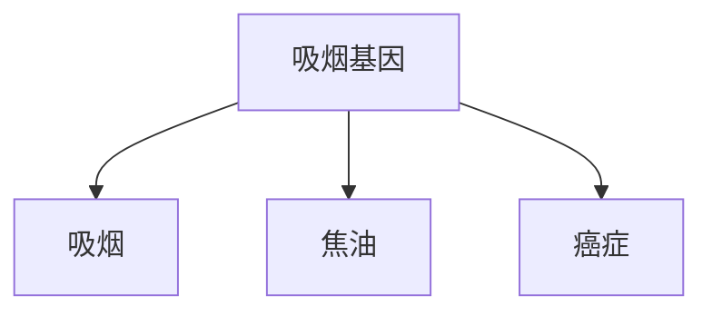

假设我们正在进行一项观察性研究，并且已经为每个参与者收集了关于**吸烟**、**焦油**和**癌症**的数据。不幸的是，我们无法收集关于**吸烟基因**的数据，因为我们不知道这样的基因是否存在。缺乏混杂变量的数据，我们无法阻断后门路径**吸烟 → 吸烟基因 → 癌症**。因此，我们不能使用后门调整来控制混杂变量的效应。

所以我们必须寻找另一种方法。与其走后门，我们可以走**前门（front door）**！在这种情况下，前门是直接的因果路径**吸烟 → 焦油 → 癌症**，我们确实拥有所有三个变量的数据。直观上，推理如下。首先，我们可以估计**吸烟**对**焦油**的平均因果效应，因为从**吸烟**到**癌症**没有未阻断的后门路径，因为路径**吸烟 → 吸烟基因 → 癌症 ← 焦油**已经被**癌症**处的对撞子所阻断。因为它已经被阻断，我们甚至不需要后门调整。我们可以简单地观察 $P(\text{焦油} \mid \text{吸烟})$ 和 $P(\text{焦油} \mid \text{不吸烟})$，它们之间的差异就是**吸烟**对**焦油**的平均因果效应。

同样，该图允许我们估计**焦油**对**癌症**的平均因果效应。为此，我们可以通过调整**吸烟**来阻断从**焦油**到**癌症**的后门路径，即**焦油 ← 吸烟 ← 吸烟基因 → 癌症**。我们在第4章学到的知识派上了用场：我们只需要足够去混杂变量集（即**吸烟**）的数据。然后，后门调整公式将给出 $P(\text{癌症} \mid do(\text{焦油}))$ 和 $P(\text{癌症} \mid do(\text{无焦油}))$。这两者之间的差异就是**焦油**对**癌症**的平均因果效应。

现在我们知道了吸烟导致焦油沉积的平均概率增加，以及焦油沉积导致癌症的平均概率增加。我们能否以某种方式将两者结合起来，从而得到吸烟导致癌症的平均概率增加？答案是肯定的。推理过程如下：癌症可以通过两种方式发生：存在**焦油**或不存在**焦油**。如果我们强制一个人吸烟，那么这两种状态的概率分别为 $P(\text{焦油} \mid do(\text{吸烟}))$ 和 $P(\text{无焦油} \mid do(\text{不吸烟}))$。如果进入**焦油**状态，引发**癌症**的概率为 $P(\text{癌症} \mid do(\text{焦油}))$。另一方面，如果进入**无焦油**状态，则会导致 $P(\text{癌症} \mid do(\text{无焦油}))$ 的癌症概率。我们可以根据 $do(\text{吸烟})$ 下各自的概率对这两种情况进行加权，从而计算出吸烟导致癌症的总概率。同样的论证也适用于我们阻止一个人吸烟的情况，即 $do(\text{不吸烟})$。两者之间的差异，就给出了吸烟与不吸烟对癌症的平均因果效应。

正如我刚才所解释的，我们可以从数据中估计所讨论的每个 $do$ 概率。也就是说，我们可以用不涉及 $do$ 算子的概率，从数学上表达它们。这样，数学就为我们完成了十年的辩论和国会证词都无法做到的事情：量化吸烟对癌症的因果效应——当然，前提是我们的假设成立。

我刚才描述的过程，即用不含 $do$ 的概率来表达 $P(\text{癌症} \mid do(\text{吸烟}))$，被称为**前门调整（front-door adjustment）**。它与**后门调整（back-door adjustment）** 的不同之处在于，我们调整了两个变量（**吸烟**和**焦油**）而非一个，并且这些变量位于从**吸烟**到**癌症**的前门路径（front-door path）上，而非后门路径。对于那些“懂数学”的读者，我忍不住要展示这个公式（方程 7.1），它在普通的统计学教科书中是找不到的。这里 $X$ 代表**吸烟**，$Y$ 代表**癌症**，$Z$ 代表**焦油**，而 $U$（公式中明显没有出现）代表不可观测的变量，即**吸烟基因**。

$$
P(Y \mid do(X)) = \sum_{z} P(Z = z \mid X) \sum_{x} P(Y \mid X = x, Z = z) P(X = x) \tag{7.1}
$$

对数学有胃口的读者可能会觉得，将其与后门调整的公式（如方程 7.2）进行比较是很有趣的。

$$
P(Y \mid do(X)) = \sum_{z} P(Y \mid X, Z = z) P(Z = z) \tag{7.2}
$$

即使对于不懂数学的读者，我们也可以就方程 7.1 提出几个有趣的观点。首先也是最重要的一点是，你到处都看不到 $U$（**吸烟基因**）。这正是关键所在。我们成功地在没有获取任何关于 $U$ 的数据的情况下消除了它的混杂效应。费舍尔（Fisher）那一代的任何统计学家都会认为这完全是一个奇迹。其次，早在引言部分，我就提到过**估计量（estimand）** 是计算查询中感兴趣量的方法。方程 7.1 和 7.2 是我将在本书中展示的最复杂、最有趣的估计量。左边代表查询“$X$ 对 $Y$ 的效应是什么？”。右边是估计量，即回答该查询的方法。请注意，估计量中不包含任何 $do$，只包含由竖线表示的 $see$，这意味着它可以从数据中估计出来。

此时，我相信有些读者会好奇这个虚构场景与现实有多接近。吸烟与癌症的争议能否通过一项观察性研究和一张因果图就得到解决？如果我们假设**图 7.1** 准确地反映了癌症的因果机制，那么答案绝对是肯定的。然而，我们现在需要讨论的是，我们的假设在现实世界中是否成立。

大卫·弗里德曼（David Freedman），一位长期的朋友和伯克利统计学家，在这个问题上对我提出了批评。他认为**图 7.1** 中的模型在三个方面不现实。首先，如果存在吸烟基因，它也可能影响身体清除肺部异物的方式，因此携带该基因的人更容易形成焦油沉积，而不携带的人则更有抵抗力。因此，他会画一条从**吸烟基因**到**焦油**的箭头，在这种情况下，前门公式将无效。

弗里德曼还认为，**吸烟**仅通过**焦油**影响**癌症**的可能性不大。当然可以想象其他机制；也许吸烟会导致慢性炎症，进而引发癌症。最后，他说，活人肺部的焦油沉积无论如何都无法足够精确地测量——因此，像我提出的那种观察性研究在现实世界中是无法进行的。

对于弗里德曼的批评，我并无异议。

> 图 7.2. 前门准则的基本设置。

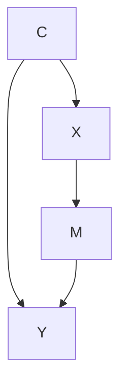

格林（Glynn）和卡申（Kashin）没有画出因果图，但根据他们对研究的描述，我会将其画成如图 7.3 所示。变量**已注册（Signed Up）** 记录一个人是否报名参加了该计划；变量**已出席（Showed Up）** 记录报名者是否实际使用了服务。显然，该计划只有在用户实际出席的情况下才能影响收入，因此，从**已注册**到**收入**没有直接箭头，这一点很容易证明。

格林和卡申没有具体说明混杂因素的性质，但我将它们总结为**动机（Motivation）**。显然，一个动机强烈、希望增加收入的人更有可能报名。无论他或她是否出席，此人在十八个月后也更有可能赚得更多。当然，研究的目标是厘清这个混杂因素的影响，并找出服务本身到底有多大帮助。

> 图 7.3. JTPA 研究的因果图。

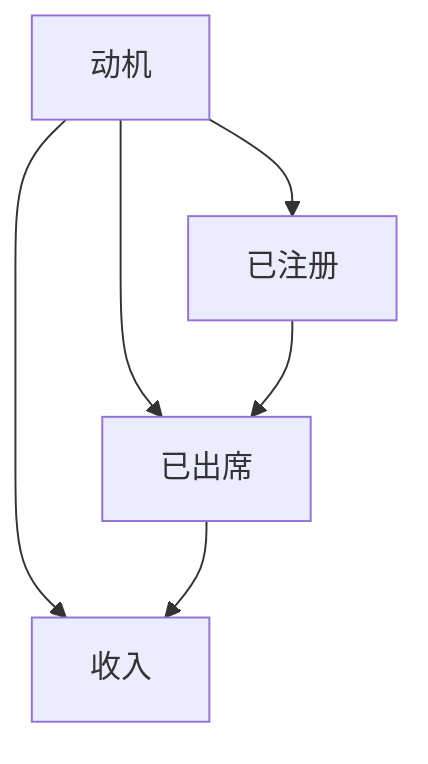

比较图 7.2 和图 7.3，我们可以看到，如果不存在从**动机**到**已出席**的箭头（即我之前提到的“屏蔽”），那么前门准则将适用。在许多情况下，我们可以证明不存在该箭头的合理性。例如，如果服务只通过预约提供，而人们错过预约只是因为与动机无关的偶然事件（如公交车罢工、脚踝扭伤等），那么我们就可以抹去那个箭头，并使用前门准则。

在该研究的实际情况下（服务随时可用），很难做出这样的论证。然而——这正是事情变得真正有趣的地方——格林和卡申还是测试了前门准则。我们可以将其视为一种敏感性测试。如果我们怀疑中间的箭头很弱，那么将其视为不存在所引入的偏差可能非常小。从他们的结果来看，情况确实如此。

通过做出某些合理的假设，格林和卡申推导出了不等式，说明调整结果可能偏高或偏低，以及偏差有多大。最后，他们将前门预测和后门预测与同时进行的随机对照实验的结果进行了比较。结果令人印象深刻。后门准则（控制已知的混杂因素，如年龄、种族和地点）的估计值严重错误，与实验基准相差数百甚至数千美元。如果存在未观测到的混杂因素（如动机），这正是你所期望看到的结果。后门准则无法对其进行调整。

另一方面，前门估计成功地消除了几乎所有的动机效应。对于男性来说，即使存在格林和卡申预测的微小正向偏差，前门估计值也完全在随机对照试验的实验误差范围内。对于女性来说，结果甚至更好：前门估计值与实验基准几乎完美匹配，没有明显的偏差。格林和卡申的工作从经验和方法论上证明，只要 $C$ 对 $M$ 的影响（在图 7.2 中）很弱，前门调整就能给出一个相当好的 $X$ 对 $Y$ 效应的估计值。这比不控制 $C$ 要好得多。

格林和卡申的结果显示了为什么前门调整是一个如此强大的工具：它使我们能够控制无法观测到的混杂因素（如动机），包括那些我们甚至无法命名的因素。随机对照试验（RCTs）被认为是因果效应估计的“黄金标准”，也正是出于同样的原因。因为前门估计做了同样的事情，而且还有一个额外的好处，即观察人们在自然栖息地（而非实验室）中的行为，所以如果这种方法最终成为随机对照试验的有力竞争者，我丝毫不会感到惊讶。

## DO 演算（THE DO-CALCULUS），或精神胜过物质（MIND OVER MATTER）

在前门和后门调整公式中，最终目标都是根据不涉及 $do$ 算子的数据（如 $P(Y \mid X, A, B, Z, \ldots)$）来计算干预效应 $P(Y \mid do(X))$。如果我们完全成功地消除了 $do$ 算子，那么我们就可以使用观测数据来估计因果效应，从而允许我们从因果关系阶梯（Ladder of Causation）的第一级跃升至第二级。

我们在这两个案例（前门和后门）中取得了成功，这立即引出了一个问题：是否还有其他“门”可以通过它来消除所有 $do$ 算子？更一般地思考，我们可以问是否存在某种方法，可以预先判断一个给定的因果模型是否允许这样的消除过程。如果是，我们就可以应用该过程，从而在不费吹灰之力进行干预的情况下，获得因果效应。否则，我们至少会知道，模型中蕴含的假设不足以从观测数据中发现因果效应，而且无论我们多么聪明，都不可避免地要进行某种形式的干预实验。

即使随机对照试验在物理上可行且法律上允许，任何了解其成本和难度的人，都会对通过纯数学手段做出这些判断的前景感到惊叹。这个想法在 20 世纪 90 年代初也让我着迷，不是作为实验者，而是作为计算机科学家和兼职哲学家。作为一名科学家，最令人振奋的经历之一无疑是坐在办公桌前，意识到你终于可以弄清楚在现实世界中什么是可能的、什么是不可能的——尤其是当这个问题对社会很重要，并且曾让在你之前试图解决它的人感到困惑时。我想，这就是尼西亚的喜帕恰斯（Hipparchus of Nicaea）发现他可以从金字塔在地面上的影子计算出其高度（而无需实际攀登金字塔）时的感受。这是精神战胜物质的明确胜利。

事实上，我所采用的方法在很大程度上受到了古希腊人（包括喜帕恰斯）及其为几何学发明的形式逻辑系统的启发。在希腊逻辑的核心，我们发现了一组公理或自明真理，例如“在任意两点之间，可以画且仅可以画一条直线”。借助这些公理，希腊人可以构建复杂的陈述，称为定理，其真理性远非显而易见。例如，三角形内角之和为 180 度（或两个直角），无论其大小或形状如何。这个陈述的真理性绝非显而易见；然而，公元前五世纪的毕达哥拉斯学派哲学家们能够使用这些自明公理作为构建块，证明其普遍真理性。

如果你还记得高中几何，哪怕只是要点，你会记得定理的证明总是由辅助构造组成：例如，画一条平行于三角形一边的线，标记某些角相等，以给定线段为半径画一个圆，等等。这些辅助构造可以被视为临时的数学语句，对所画图形的性质做出断言（或主张）。每个新的构造都由之前的构造、几何公理以及可能已经推导出的某些定理授权。例如，画一条平行于三角形一边的线是由欧几里得第五公理授权的，即从直线外一点可以画且仅可以画一条平行线。执行这些辅助构造中的任何一个都只是一个机械的“符号操作”操作；它接受先前写下的句子（或先前画出的图形），并在重写被公理授权时，将其重写为新格式。欧几里得的伟大之处在于确定了五个基本公理的简短列表，所有其他真实的几何陈述都可以从中推导出来。

现在让我们回到我们的核心问题：一个模型何时可以替代实验，或者说何时可以将“$do$”量简化为“$see$”量。受古希腊几何学家的启发，我们希望将问题简化为符号操作，从而将因果性从奥林匹斯山上夺下来，使其为普通研究者所用。

首先，让我们使用证明、公理和辅助构造的语言（即欧几里得和毕达哥拉斯的语言）来重新表述寻找 $X$ 对 $Y$ 效应的任务。我们从目标语句 $P(Y \mid do(X))$ 开始。如果我们能成功地从其中消除 $do$ 算子，只留下经典的概率表达式（如 $P(Y \mid X)$ 或 $P(Y \mid X, Z, W)$），那么我们的任务就完成了。当然，我们不能随意操纵我们的目标表达式；这些操作必须符合 $do(X)$ 作为物理干预的含义。因此，我们必须让表达式通过一系列合法的操作，每个操作都由我们的模型的公理和假设授权。这些操作应保持被操作表达式的含义，仅改变其书写格式。“保持含义”变换的一个例子是代数变换，它将 $y = a x + b$ 变成 $a x = y - b$。$x$ 和 $y$ 之间的关系保持不变；改变的只是格式。

我们已经熟悉了一些对 $do$ 表达式的“合法”变换。例如，**规则 1** 说，当我们观察到一个与 $Y$ 无关的变量 $W$（可能以其他变量 $Z$ 为条件）时，$Y$ 的概率分布不会改变。例如，在第 3 章中，我们看到一旦我们知道中介变量（烟）的状态，变量“火”与“警报”无关。这种无关性的断言转化为一个符号操作：

$$
P(Y \mid do(X), Z, W) = P(Y \mid do(X), Z)
$$

只要变量集 $Z$ 在我们删除所有指向 $X$ 的箭头后，阻断了从 $W$ 到 $Y$ 的所有路径，上述等式就成立。在“火 → 烟 → 警报”的例子中，我们有 $W = \text{火}$，$Z = \text{烟}$，$Y = \text{警报}$，并且 $Z$ 阻断了从 $W$ 到 $Y$ 的所有路径。（在这种情况下，我们没有变量 $X$。）

另一个合法的变换是我们从后门讨论中熟悉的。我们知道，如果一组变量 $Z$ 阻断了从 $X$ 到 $Y$ 的所有后门路径，那么在条件于 $Z$ 的情况下，$do(X)$ 等价于 $see(X)$。因此，如果 $Z$ 满足后门准则，我们可以写成

$$
P(Y \mid do(X), Z) = P(Y \mid X, Z)
$$

我们将其采纳为我们公理系统的**规则 2**。虽然这可能不如规则 1 那样自明，但在最简单的情况下，它就是汉斯·赖兴巴赫（Hans Reichenbach）的共同原因原则，经过修正后，我们不会将对撞因子误认为是混杂因子。换句话说，我们说，在控制了一个充分的去混杂集之后，任何剩余的相关性都是真实的因果效应。

**规则 3** 非常简单：它基本上说，在任何不存在从 $X$ 到 $Y$ 的因果路径的情况下，我们可以从 $P(Y \mid do(X))$ 中移除 $do(X)$。即，

$$
P(Y \mid do(X)) = P(Y)
$$

# Markdown 排版优化结果

如果不存在从 X 到 Y 且仅包含前向箭头的路径，则我们可以将此规则解释为：如果我们做了一些不影响 Y 的事情，那么 Y 的概率分布将不会改变。除了与欧几里得公理一样不言自明之外，规则 1 到 3 还可以使用我们对 **do-算子（do-operator）** 的箭头删除定义以及概率论的基本定律在数学上得到证明。

需要注意的是，规则 1 和规则 2 包含涉及除 X 和 Y 以外的辅助变量 Z 的条件概率。这些变量可以被视为计算概率时的上下文。有时，这种上下文的存在本身就允许进行转换。规则 3 也可能涉及辅助变量，但为了简洁起见，我省略了它们。

请注意，每条规则都有一个简单的句法解释。规则 1 允许添加或删除观测。规则 2 允许将干预替换为观测，反之亦然。规则 3 允许删除或添加干预。所有这些许可都是在适当条件下发出的，这些条件需要在任何特定情况下根据因果图（causal diagram）进行验证。

我们现在准备演示规则 1 到 3 如何允许我们将一个公式转换为另一个公式，直到（如果我们足够聪明）获得一个我们满意的表达式。虽然有点复杂，但我认为没有什么能比实际向您展示如何使用 do-演算（do-calculus）规则的连续应用推导出前门公式（front-door formula）更有效了（图 7.4）。您不需要理解所有步骤，但我向您展示推导过程是为了让您领略 do-演算的精髓。

我们从目标表达式 $P(Y | do(X))$ 开始旅程。我们引入辅助变量，并将目标表达式转换为一个无 do（do-free）的表达式，该表达式当然与前门调整公式（front-door adjustment formula）一致。论证的每一步都基于与 $X$、$Y$ 和辅助变量相关的因果图，或者在某些情况下，基于为解释干预而删除了箭头的子图。这些许可显示在右侧。

我对 do-演算有一种特殊的感情。凭借这三个简单的规则，我能够推导出前门公式。这是第一个通过除控制混杂因子（confounders）以外的方法估计的因果效应。我相信没有 do-演算，没有人能做到这一点，因此我在 1993 年伯克利的一个统计学研讨会上将其作为一项挑战提出，甚至悬赏 100 美元给任何能解决它的人。

参加研讨会的 Paul Holland 写道，他已将此问题作为一个课堂项目分配，并会在成熟时将解决方案寄给我。（同事们告诉我，他最终在 1995 年的一次会议上提出了一个冗长的解决方案，如果我能找到他的证明，我可能欠他 100 美元。）经济学家 James Heckman 和 Rodrigo Pinto 于 2015 年尝试使用“标准工具”证明前门公式。他们成功了，尽管付出了八页艰苦劳动的代价。

> **DO-演算在工作（DO-CALCULUS AT WORK）**  
> 图 7.4. 从 do-演算规则推导前门调整公式。

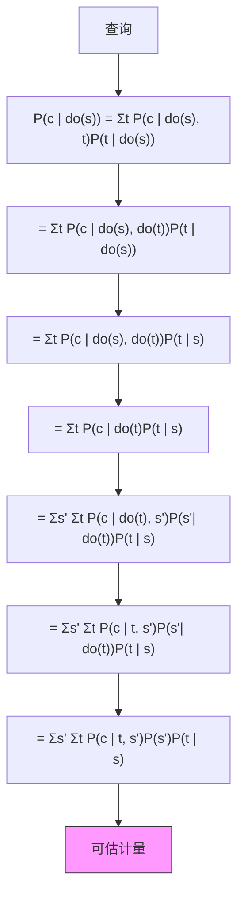

在演讲前一天晚上的餐厅里，我在一张餐巾纸上为 David Freedman 写下了证明（与图 7.4 中的非常相似）。他后来写信给我说他把餐巾纸弄丢了。他无法重建论证，并问我是否保留了副本。第二天，Jamie Robins 从哈佛写信给我，说他从 Freedman 那里听说了“餐巾纸问题”，并立即提出飞往加利福尼亚与我一起验证证明。我很兴奋能与 Robins 分享 do-演算的秘密，我相信他那年前往洛杉矶的行程是他热情接受因果图的关键。通过他和 Sander Greenland 的影响，图表已成为流行病学家的第二语言。这解释了我为什么如此喜欢“餐巾纸问题”。

前门调整公式是一个令人愉快的惊喜，表明 do-演算有重要的东西可以提供。然而，此时我仍然想知道 do-演算的三条规则是否足够。我们是否可能错过了第四条规则，该规则将帮助我们解决仅凭三条规则无法解决的问题？

1994 年，当我首次提出 do-演算时，我选择了这三条规则，因为在我所知道的所有情况下它们都是充分的。我不知道它们是否会像阿里阿德涅的线团一样，总能引导我走出迷宫，或者有一天我会遇到一个如此复杂凶险的迷宫，以至于我无法逃脱。当然，我抱有最好的希望。我猜想，每当因果效应可以从数据中估计时，使用这三条规则的一系列步骤将消除 do-算子。但我无法证明它。

这类问题在数学和逻辑学中有许多先例。在数理逻辑中，这种性质通常被称为“完备性（completeness）”；一个完备的公理系统具有这样的性质：公理足以推导出该语言中的每一个真命题。一些非常好的公理系统是不完备的：例如，Philip Dawid 描述概率论中条件独立性的公理。

在这个现代迷宫故事中，两组研究人员扮演了阿里阿德涅的角色，而我是迷路的忒修斯：南卡罗来纳大学的 Yiming Huang 和 Marco Valtorta，以及我在加州大学洛杉矶分校（UCLA）自己的学生 Ilya Shpitser。两组人独立且同时证明了规则 1 到 3 足以走出任何有出口的 do-迷宫。我不确定世界是否在屏息等待他们的完备性结果，因为到那时大多数研究人员已经满足于仅使用前门和后门准则（back-door criteria）。然而，两个团队都因其工作获得了 2006 年 **人工智能不确定性（Uncertainty in Artificial Intelligence）** 会议的最佳学生论文奖。

我承认我是那个屏息等待这个结果的人。它告诉我们，如果我们无法从规则 1 到 3 找到估计 $P(Y \mid do(X))$ 的方法，那么解就不存在。在这种情况下，我们知道除了进行随机对照试验（randomized controlled trial）之外别无选择。它进一步告诉我们，哪些额外的假设或实验可能使因果效应变得可估计。

在宣布全面胜利之前，我们应该讨论 do-演算的一个问题。像任何其他演算一样，它能够构建证明，但它并不能帮助我们找到证明。它是解决方案的优秀验证者，但不是很好的搜索者。如果您知道正确的转换序列，就很容易向他人（熟悉规则 1 到 3 的人）演示 do-算子可以被消除。然而，如果您不知道正确的序列，就不容易发现它，甚至难以确定是否存在一个序列。用几何证明的类比来说，我们需要决定下一步尝试哪个辅助构造。围绕 A 点的圆？平行于 AB 的直线？可能性是无限的，公理本身对于下一步尝试什么没有提供指导。我的高中几何老师常说，你需要“数学眼镜”。

在数理逻辑中，这被称为“判定问题（decision problem）”。许多逻辑系统都受到棘手的判定问题的困扰。例如，给定一堆各种大小的多米诺骨牌，我们没有简便的方法来决定是否可以将它们排列成填充一个给定大小的正方形。但是，一旦提出了一个排列方案，验证它是否构成解几乎不需要时间。

幸运的是（再次），对于 do-演算，判定问题被证明是可处理的。Ilya Shpitser 在我另一位学生 Jin Tian 早期工作的基础上，发现了一种算法，可以在“多项式时间（polynomial time）”内判定解是否存在。这是一个有点技术性的术语，但继续我们解决迷宫的类比，这意味着我们有一种比随机搜索所有可能路径更有效的走出迷宫的方法。

Shpitser 的用于寻找每一个因果效应的算法并没有消除对 do-演算的需求。事实上，我们甚至更需要它，而且出于几个独立的原因。首先，我们需要它来超越观测研究（observational studies）。假设最坏的情况发生，我们的因果模型不允许仅从观测中估计因果效应 $P(Y \mid do(X))$。也许我们也无法进行随机分配 $X$ 的随机实验。一个聪明的研究者可能会问，我们是否可以通过随机化其他一些比 $X$ 更容易控制的变量（比如 $Z$）来估计 $P(Y \mid do(X))$。例如，如果我们想评估胆固醇水平（$X$）对心脏病（$Y$）的影响，我们也许可以操纵受试者的饮食（$Z$），而不是直接控制他们血液中的胆固醇水平。

然后我们问，我们能否找到这样一个替代变量 $Z$，使我们能够回答因果问题。在 do-演算的世界里，问题是是否存在一个 $Z$，使得我们可以将 $P(Y \mid do(X))$ 转换为一个表达式，其中变量 $Z$（而不是 $X$）受到 do-算子的作用。这是一个完全不同的问题，Shpitser 的算法并未涵盖。幸运的是，它也有一个完整的答案，由我实验室的 Elias Bareinboim 于 2012 年发现了一种新算法。当我们考虑可迁移性（transportability）或外部效度（external validity）问题时，会出现更多此类问题——即评估一个实验结果在被迁移到一个可能在与研究环境几个关键方面不同的新环境时是否仍然有效。这一更具雄心的系列问题触及了科学方法论的核心，因为没有概括就没有科学。然而，概括的问题至少已经徘徊了两个世纪，没有取得丝毫进展。产生解决方案的工具根本不存在。2015 年，Bareinboim 和我在 **美国国家科学院院刊（National Academy of Sciences）** 上发表了一篇论文，解决了这个问题，前提是您能够用因果图表达您对两个环境的假设。在这种情况下，do-演算的规则提供了一种系统的方法来确定在研究环境中发现的因果效应是否可以帮助我们估计目标环境中的效应。

do-演算仍然重要的另一个原因是其透明性。在我写这一章时，Bareinboim（现在是普渡大学的教授）给我发来了一个新的谜题：一个只有四个观察变量 $X$、$Y$、$Z$ 和 $W$，以及两个不可观察变量 $U_1$、$U_2$ 的图表（见图 7.5）。他向我挑战，让我弄清楚 $X$ 对 $Y$ 的效应是否可估计。没有办法阻断后门路径，也没有前门条件。我尝试了我所有喜欢的捷径和我原本可靠的直觉论证，无论是支持还是反对，我都看不出如何做到。我找不到走出迷宫的路。但是，当 Bareinboim 对我低语，“试试 do-演算”时，答案就像婴儿的微笑一样清晰地闪现出来。每一步都清晰而有意义。这是目前我们所知的最简单的模型，其中因果效应需要通过超越前门和后门调整的方法来估计。

> **图 7.5（FIGURE 7.5）：** 一个新的餐巾纸问题？

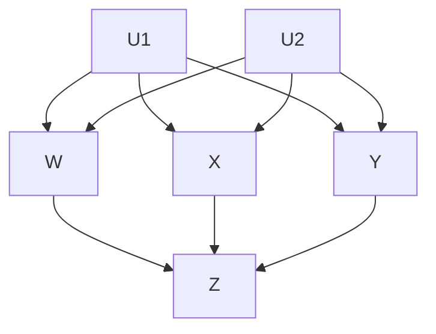

为了不让读者留下“do-演算仅适用于理论”的印象，同时也为了提供一份有趣的智力挑战，我将以一个实际问题来结束本节。该问题由两位著名统计学家 Nanny Wermuth 和 David Cox 提出，它展示了友好的耳语“试试 do-演算”如何帮助专家统计学家解决棘手的实际问题。

大约在 2005 年，Wermuth 和 Cox 对一个被称为“序贯决策（sequential decision）”或“时变治疗（time-varying treatment）”的问题产生了兴趣。这类问题在艾滋病治疗中很常见。通常情况下，治疗会持续一段时间，在每个时间段内，医生会根据患者的状况调整后续治疗的强度和剂量。另一方面，患者的状况又受到过去治疗的影响。于是，我们最终得到如图 7.6 所示的场景，其中包含两个时间段和两种治疗。第一次治疗是随机化的（X），第二次治疗（Z）则是对依赖于 X 的观察值（W）的响应。给定在这种治疗制度下收集的数据，Cox 和 Wermuth 的任务是预测 X 对结果 Y 的影响，假设他们希望将 Z 随时间保持恒定，而不依赖于观察值 W。

> **图 7.6（FIGURE 7.6）：** Wermuth 和 Cox 的序贯治疗示例。

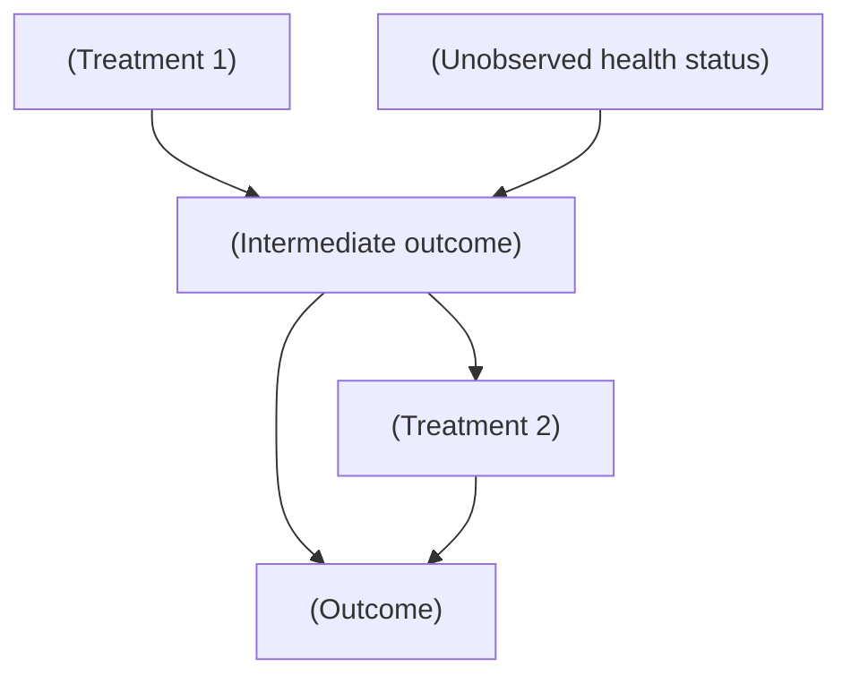

Jamie Robins 在 1994 年首次将时变治疗的问题引起我的注意，借助 do-演算，我们能够推导出一个通用解，该解涉及后门调整公式的序贯版本。Wermuth 和 Cox 不知道这种方法，他们将问题称为“间接混杂（indirect confounding）”，并发表了三篇关于其分析的论文（2008 年、2014 年和 2015 年）。由于无法一般性地解决该问题，他们求助于线性近似，即使在线性情况下，他们也发现难以处理，因为它无法通过标准回归方法解决。

幸运的是，当缪斯在我耳边低语“试试 do-演算”时，我注意到他们的难题可以在三行计算中解决。逻辑如下：我们的目标量是 $P( Y \mid do( X ), do( Z ) )$，而我们可以获得的数据形式是 $P(Y \mid do(X), Z, W)$ 和 $P(W \mid do(X))$。这些数据反映了这样一个事实：在我们所依据的研究中，Z 并非外部控制，而是通过某个（未知的）协议跟随 W。因此，我们的任务是将目标表达式转换为另一个表达式，以反映 do-算子仅应用于 X 而非 Z 的研究条件。恰巧，只需应用一次 do-演算的三条规则即可完成此转换。这个故事的寓意无非是对数学解决难题（偶尔会带来实际后果）之力量的深刻赞赏。

## 科学的织锦，或 do-管弦乐队中的隐藏演奏者（THE TAPESTRY OF SCIENCE, OR THE HIDDEN PLAYERS IN THE DO-ORCHESTRA）

我已经提到了我的一些学生在编织这幅美丽的 do-演算织锦中的作用。像任何织锦一样，它给人一种完整感，这可能掩盖了制作它的艰辛以及有多少双手为这个过程做出了贡献。在这种情况下，它花费了二十多年的时间，并得益于几位学生和同事的贡献。

第一个是 **Thomas Verma**，我遇见他时他十六岁。有一天，他的父亲把他带到我的办公室，基本上说，“给他点事做。”他太有才华了，他高中的任何数学老师都无法让他保持兴趣。他最终取得的成就确实令人惊叹。Verma 最终证明了后来被称为 **d-分离性质（d-separation property）** 的结论（即您可以使用路径阻断规则来确定数据中应该成立哪些独立性）。令人惊讶的是，他告诉我，他证明 d-分离性质时以为这是一个家庭作业问题，而不是一个未解决的猜想！有时候年轻天真是有好处的。您仍然可以在 do-演算的规则 1 以及路径阻断在因果关系阶梯（Ladder of Causation）第一级上留下的任何印记中看到他的遗产。

如果没有一个补充结果来表明它无法被改进，Verma 证明的力量将只能得到部分认识。也就是说，除了通过路径阻断揭示的那些独立性之外，因果图不暗示任何其他独立性。这一步由另一位学生 **Dan Geiger** 完成。他从 UCLA 的另一个研究组转到我的实验室，在我答应他如果能证明两个定理就给他一个“即时博士学位”之后。他做到了，我也做到了！他现在是以色列理工学院（我的母校）的计算机科学系主任。

但 Dan 不是我唯一从其他系“挖来”的学生。1997 年的一天，我在 UCLA 游泳池的更衣室穿衣服时，与旁边的一位中国小伙攀谈起来。他是一名物理学博士生，按照我当时惯常的习惯，我试图说服他转到人工智能领域，那里才是大有可为的地方。他并没有完全被说服，但就在第二天，我收到了他的一位朋友 **Jin Tian** 的电子邮件，说他愿意从物理学转到计算机科学，问我是否有具有挑战性的暑期项目给他？两天后，他就在我的实验室工作了。

四年后，即 2001 年 4 月，他用一个简单的图形准则震惊了世界，该准则概括了前门、后门以及当时我们能想到的所有门。我记得在圣达菲的一次会议上介绍 Tian 的准则。研究界的领军人物一个接一个地凝视着我的海报，难以置信地摇头。这样一个简单的准则怎么可能适用于所有图表呢？

Tian（现在是爱荷华州立大学的教授）带着一种在 1990 年代对我们来说还很陌生的思维方式来到我们的实验室。我们的对话总是充满了狂野的隐喻和半生不熟的猜想。但 Tian 从不轻易发言，除非他的想法是严谨的、经过证明的、并且被反复推敲过的。两种风格的混合证明了其价值。Tian 的方法，称为 **c-分解（c-decomposition）**，使 **Ilya Shpitser** 能够为 do-演算开发出他的完整算法。寓意：永远不要低估更衣室对话的力量！

伊利亚·什皮策尔（Ilya Shpitser）是在理解干预措施这场长达十年的战斗接近尾声时加入的。他到来的时期非常艰难，那时我不得不请假，为纪念我的儿子丹尼尔（Daniel）——一位反西方恐怖主义的受害者——而设立一个基金会。我一直期望我的学生能够自力更生，但对于当时的学生来说，这种期望被推向了极致。他们给了我所能想象到的最好的礼物：为**do-演算（do-calculus）** 的织锦添上了最后的关键一笔，而这正是我本人无法完成的工作。事实上，我曾试图劝阻伊利亚不要试图证明 do-演算的完备性。完备性证明是出了名的困难，任何想要按时完成博士学业的学生最好都避而远之。幸运的是，伊利亚是背着我完成这项工作的。

同事们也会在关键时刻对你的思想产生深远影响。**彼得·斯珀特斯（Peter Spirtes）**，卡内基梅隆大学的哲学教授，在我之前就采用网络方法研究因果关系，他的影响至关重要。在瑞典乌普萨拉听他的一次讲座时，我第一次了解到，执行干预可以被视为从因果图中删除箭头。在那之前，我一直与历代统计学家一样，背负着同样的重担，试图仅用一个代表单一静态概率分布的图来思考因果关系。

箭头删除的想法也并非完全是斯珀特斯首创。1960年，两位瑞典经济学家，**罗伯特·斯特罗茨（Robert Strotz）** 和 **赫尔曼·沃尔德（Herman Wold）**，基本上提出了相同的想法。在当时的经济学界，从未使用过图表；相反，经济学家依赖的是结构方程模型（structural equation models），也就是没有图表的休厄尔·赖特（Sewall Wright）方程。路径图中的箭头删除，对应于从结构方程模型中删除一个方程。因此，粗略来说，斯特罗茨和沃尔德是最先有这个想法的人，除非我们想追溯得更远：在他们之前还有 **特里格夫·哈维尔莫（Trygve Haavelmo）**（挪威经济学家、诺贝尔奖得主），他在1943年就主张通过修改方程来表示干预。

尽管如此，斯珀特斯将方程删除转化为因果图语言的做法，释放了大量新的见解和成果。**后门准则（back-door criterion）** 是这一转化最早受益者之一，而 do-演算则紧随其后。然而，这股浪潮尚未结束。在反事实推断、泛化性、缺失数据和机器学习等领域的进展仍在不断涌现。

如果我不那么谦虚，我会在这里引用艾萨克·牛顿（Isaac Newton）那句关于“站在巨人肩膀上”的名言。但考虑到我的身份，我更想引用《密西拿》（Mishnah）中的话：

> “Harbe lamadeti mirabotai um’haverai yoter mehem, umitalmidai yoter mikulam”——即，“我从我的老师那里学到了很多，从我的同事那里学到的更多，而从我的学生那里学到的则最多。”（《塔木德·斋戒篇》7a）

如果没有 Verma、Geiger、Tian 和 Shpitser 等人的贡献，do-算子（do-operator）和 do-演算就不会是今天这个样子。

## 斯诺博士的奇特案例（The Curious Case(s) of Dr. Snow）

1853 年和 1854 年，英格兰正遭受霍乱疫情的肆虐。在那个时代，霍乱就像今天埃博拉病毒一样可怕；一个健康的人喝了被霍乱污染的水，可能在二十四小时内死亡。我们今天知道，霍乱是由一种攻击肠道的细菌引起的。它通过受害者排泄的大量“米泔水”样腹泻物传播，这些患者在死前会大量排泄这种腹泻物。

但在 1853 年，致病微生物从未在任何疾病中被显微镜观察到，更不用说霍乱了。当时的普遍观点认为，不健康的空气“瘴气（miasma）”导致了霍乱，这一理论似乎得到了一个事实的支持：疫情在伦敦卫生条件较差的贫困地区更为严重。

**约翰·斯诺（John Snow）** 医生，一位护理霍乱患者超过二十年的医生，一直对瘴气理论持怀疑态度。他合理地辩称，既然症状表现在肠道，身体必定首先在那里接触到病原体。但由于他无法看到罪魁祸首，他无法证明这一点——直到 1854 年的疫情。

约翰·斯诺的故事有两个章节，其中一个比另一个著名得多。在我们所谓的“好莱坞”版本中，他不辞辛劳地挨家挨户走访，记录霍乱受害者死亡的地点，并注意到在宽街（Broad Street）的一个水泵附近聚集了数十名受害者。通过与当地居民交谈，他发现几乎所有受害者都从那个特定的水泵取水。他甚至了解到一个发生在远处汉普斯特德（Hampstead）的致命病例，死者是一位喜欢宽街水泵水味道的妇女。她和她的侄女喝了宽街的水后死亡，而她所在地区的其他人都没有生病。综合所有这些证据，斯诺要求当地政府移除水泵把手，并于 9 月 8 日获得了同意。正如斯诺的传记作者所写：“水泵把手被移除了，瘟疫得到了遏制。”

这一切构成了一个精彩的故事。如今，约翰·斯诺协会甚至每年都会重演移除那个著名水泵把手的情景。然而，事实上，移除水泵把手对全市范围的霍乱疫情几乎没有产生什么影响，该疫情最终夺走了近 3000 人的生命。

在故事的非好莱坞章节中，我们再次看到斯诺医生走在伦敦的街道上，但这次他的真正目的是找出伦敦人从哪里获得他们的水。当时有两家主要的水务公司：**南华克和沃克斯豪尔公司（Southwark and Vauxhall Company）** 和 **兰贝斯公司（Lambeth Company）**。斯诺知道，两者之间的关键区别在于，前者从伦敦桥区域取水，该区域位于伦敦下水道的下游。后者则在几年前将取水口向上游迁移，使其位于下水道的上游。因此，南华克公司的客户饮用的水受到了霍乱患者排泄物的污染。而兰贝斯公司的客户饮用的则是未受污染的水。（这些都与受污染的宽街水无关，宽街的水来自一口井。）

死亡统计数据证实了斯诺严峻的假设。由南华克和沃克斯豪尔公司供水的地区受霍乱影响尤其严重，死亡率高出八倍。即便如此，这些证据仅仅是间接的。瘴气理论的支持者可以辩称，这些地区的瘴气最严重，并且没有办法反驳这一点。用因果图来说，我们面临的情况如图 7.7 所示。我们无法观察到混杂因素“瘴气”（或其他混杂因素如“贫困”），因此无法使用后门调整来控制它。

> 图 7.7. 霍乱的因果图（在发现霍乱杆菌之前）。

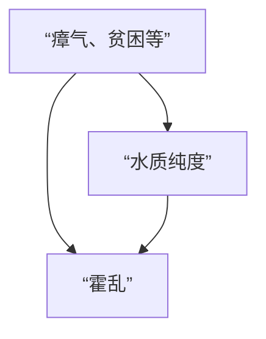

在这里，斯诺有了他最为 brilliant 的想法。他注意到，在那些同时由两家公司供水的地区，饮用南华克公司水的家庭死亡率仍然高得多。然而，这些家庭在瘴气或贫困方面并无差异。“这种供水的混合是最为密切的，”斯诺写道。“每家公司的管道遍布所有街道，并延伸到几乎所有的庭院和小巷……每家公司既供应富人，也供应穷人，既供应大房子，也供应小房子；接受不同公司供水的人在条件或职业上没有区别。”尽管随机对照试验（Randomized Controlled Trial, RCT）的概念尚未诞生，但这几乎就像是这两家水务公司对伦敦人进行了一次随机实验。事实上，斯诺甚至指出了这一点：“不可能设计出比这更彻底地检验供水对霍乱进程影响的实验了，环境已经为观察者准备好了。而且，这个实验的规模是空前的。不少于三十万不同性别、年龄、职业、阶层和地位的人，从绅士到最贫穷的人，在没有选择、并且在大多数情况下不知情的情况下，被分成了两组。”一组获得了纯净水；另一组获得了被污水污染的水。

在这里，斯诺有了他最为 brilliant 的想法。他注意到，在那些同时由两家公司供水的地区，饮用南华克公司水的家庭死亡率仍然高得多。然而，这些家庭在瘴气或贫困方面并无差异。“这种供水的混合是最为密切的，”斯诺写道。“每家公司的管道遍布所有街道，并延伸到几乎所有的庭院和小巷……每家公司既供应富人，也供应穷人，既供应大房子，也供应小房子；接受不同公司供水的人在条件或职业上没有区别。”尽管随机对照试验（Randomized Controlled Trial, RCT）的概念尚未诞生，但这几乎就像是这两家水务公司对伦敦人进行了一次随机实验。事实上，斯诺甚至指出了这一点：“不可能设计出比这更彻底地检验供水对霍乱进程影响的实验了，环境已经为观察者准备好了。而且，这个实验的规模是空前的。不少于三十万不同性别、年龄、职业、阶层和地位的人，从绅士到最贫穷的人，在没有选择、并且在大多数情况下不知情的情况下，被分成了两组。”一组获得了纯净水；另一组获得了被污水污染的水。

斯诺的观察为因果图引入了一个新变量，现在如图 7.8 所示。斯诺艰苦的侦探工作揭示了两件重要的事情：（1）瘴气和自来水公司之间没有箭头（两者是独立的），以及（2）自来水公司和水质纯度之间存在箭头。斯诺未明说但同样重要的是第三个假设：（3）从自来水公司到霍乱没有直接箭头，这在今天对我们来说是显而易见的，因为我们知道水务公司并没有通过其他途径将霍乱输送给客户。

> 图 7.8. 引入工具变量后的霍乱因果图。

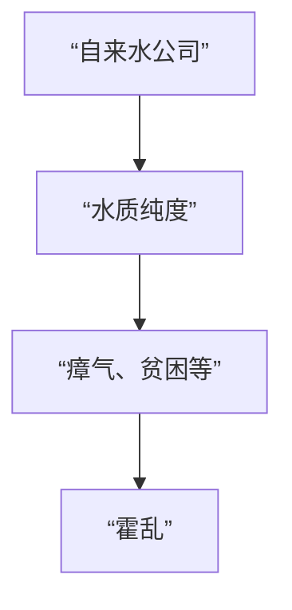

一个满足这三个属性的变量，如今被称为**工具变量（instrumental variable）**。显然，斯诺认为这个变量类似于一枚硬币的抛掷，它模拟了一个没有传入箭头的变量。由于自来水公司与霍乱之间不存在混杂因素，任何观察到的关联都必然是因果关系。同样，既然自来水公司对霍乱的影响必须通过水质纯度来传导，我们（和斯诺一样）可以得出结论：水质纯度与霍乱之间观察到的关联也必然是因果关系。斯诺以毫不含糊的措辞陈述了他的结论：如果南华克和沃克斯豪尔公司将其取水口向上游迁移，本可以挽救超过 1000 条生命。

当时很少有人注意到斯诺的结论。他自费印刷了一本关于这些结果的小册子，总共只卖出了 56 本。如今，流行病学家将这本小册子视为他们学科的开创性文献。它表明，通过“鞋履研究”（我从大卫·弗里德曼那里借用的一个短语）和因果推理，你可以追踪到一个杀手。

尽管瘴气理论现在已被否定，但贫困无疑是一个混杂因素，地理位置也是。但即使没有测量这些因素（因为斯诺的挨家挨户调查工作只进行到一定程度），我们仍然可以使用工具变量来确定通过净化供水可以挽救多少生命。

以下是这个技巧的原理。为简单起见，我们回到变量名称 $Z$、$X$、$Y$ 和 $U$，并将图 7.8 重新绘制为图 7.9。我加入了路径系数 $(a, b, c, d)$ 来表示因果效应的强度。这意味着我们假设变量是数值型的，且它们之间的函数关系是线性的。请记住，路径系数 $a$ 意味着将 $Z$ 增加一个标准单位的干预会导致 $X$ 增加 $a$ 个标准单位。（我将省略关于“标准单位”的技术细节。）

> 图 7.9. 工具变量的一般设置。

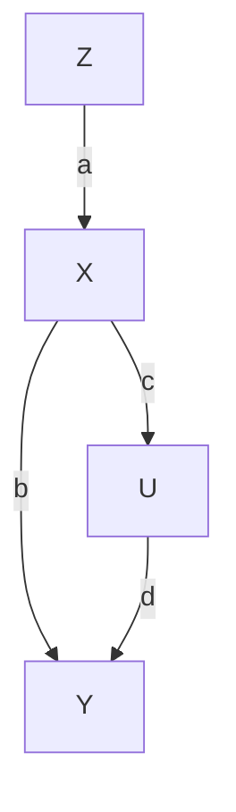

由于 $Z$ 和 $X$ 是无混杂的，$Z$ 对 $X$ 的因果效应（即 $a$）可以通过 $X$ 对 $Z$ 回归线的斜率 $r_{XZ}$ 来估计。同样，变量 $Z$ 和 $Y$ 也是无混杂的，因为路径 $Z \to X \leftarrow U \to Y$ 被 $X$ 处的对撞子阻断。因此，$Z$ 对 $Y$ 回归线的斜率 $(r_{ZY})$ 将等于直接路径 $Z \to X \to Y$ 上的因果效应，即路径系数的乘积：$ab$。因此，我们得到两个方程：$ab = r_{ZY}$ 和 $a = r_{ZX}$。如果将第一个方程除以第二个方程，我们得到 $X$ 对 $Y$ 的因果效应：$b = r_{ZY} / r_{ZX}$。

通过这种方式，工具变量使我们能够执行与**前门调整（front-door adjustment）** 相同的魔术：即使无法控制或收集关于混杂因素 $U$ 的数据，我们也找到了 $X$ 对 $Y$ 的效应。因此，我们可以向决策者提供一个决定性的论据，说明他们应该迁移供水——即使这些决策者仍然相信瘴气理论。还要注意，我们已经从第一层级的信息（相关性 $r_{ZY}$ 和 $r_{ZX}$）中获取了**因果之梯（Ladder of Causation）** 第二层级的信息（$b$）。我们之所以能够做到这一点，是因为路径图所体现的假设本质上是因果性的，尤其是那个关键假设：$U$ 和 $Z$ 之间没有箭头。如果因果图不同——例如，如果 $Z$ 是 $X$ 和 $Y$ 的一个混杂因素——那么公式 $b = r_{ZY} / r_{ZX}$ 将无法正确估计 $X$ 对 $Y$ 的因果效应。事实上，无论数据有多大，这两种模型都无法通过任何统计方法区分开来。

工具变量在因果革命之前就已为人所知，但因果图为它们如何工作带来了新的清晰度。确实，斯诺是隐含地使用了工具变量，尽管他没有一个定量的公式。休厄尔·赖特当然理解路径图的这种用途；公式 $b = r_{ZY} / r_{ZX}$ 可以直接从他的路径系数方法中推导出来。而除休厄尔·赖特之外，第一个有意识地使用工具变量的人似乎是……休厄尔·赖特的父亲，菲利普！

回想一下，菲利普·赖特是一位经济学家，曾在后来成为布鲁金斯学会的机构工作。他感兴趣的是预测，如果征收关税（这会提高价格，从而在理论上鼓励生产），一种商品的产出将如何变化。用经济学术语来说，他想知道供给弹性。1928 年，赖特写了一部长篇专著，专门计算亚麻籽油的供给弹性。在一个引人注目的附录中，他使用路径图分析了这个问题。这是一个勇敢的举动：请记住，在此之前，从未有经济学家见过或听说过这种东西。（事实上，他两面下注，并用更传统的方法验证了他的计算。）

图 7.10 显示的是赖特图表的一个略微简化的版本。与本书中的大多数图表不同，这个图有“双向”箭头，但我恳请读者不要为此过于纠结。通过一些数学技巧，我们同样可以用一个箭头“需求 ← 价格 → 供给”来替换“需求—价格—供给”链，那么该图看起来就会像图 7.9（尽管对经济学家来说可能不太容易接受）。需要注意的重要一点是，菲利普·赖特特意引入了变量“每英亩产量”（亚麻籽）作为工具，它直接影响供给，但与需求无关。然后，他使用了我刚才给出的分析来推断供给对价格的影响以及价格对供给的影响。

> 图 7.10. 赖特的供给—价格因果图的简化版本。

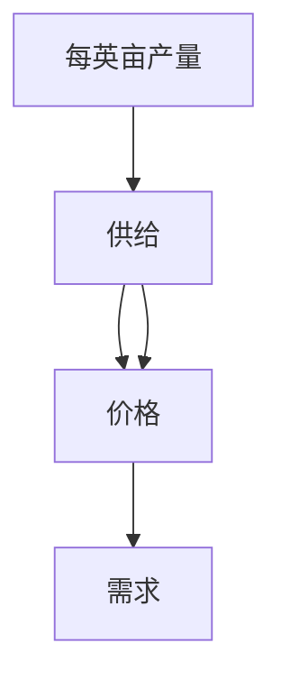

历史学家们对于谁发明了工具变量（一种在现代计量经济学中变得极其流行的方法）争论不休。我毫不怀疑菲利普·赖特是从他儿子那里借用了路径系数的概念。在此之前，没有经济学家坚持区分因果系数和回归系数；他们都属于卡尔·皮尔逊—亨利·奈尔斯阵营，认为因果关系不过是相关关系的一种极限情况。此外，在休厄尔·赖特之前，从未有人给出过根据路径系数计算回归系数，然后再逆向操作从回归系数得到因果系数的公式。这是休厄尔独有的发明。

当然，一些经济史学家曾暗示，整个数学附录是休厄尔自己写的。然而，文体计量分析表明，菲利普确实是作者。对我来说，这种历史侦探工作让这个故事更加美妙。它表明菲利普不辞辛劳地理解了他儿子的理论，并用他自己的语言将其阐述出来。

现在，让我们从 19 世纪 50 年代和 20 世纪 20 年代向前迈进，来看一个当代工具变量应用的例子，这只是我本可以选择的数十个例子中的一个。

# 好胆固醇与坏胆固醇（GOOD AND BAD CHOLESTEROL）

你还记得你的家庭医生第一次开始跟你谈论“好”和“坏”胆固醇是什么时候吗？这可能发生在20世纪90年代，当时降低血液中“坏”胆固醇——**低密度脂蛋白（Low-Density Lipoprotein, LDL）**——水平的药物首次上市。这些被称为**他汀类药物（statins）** 的药物，已经为制药公司带来了数十亿美元的收入。

第一种接受随机对照试验的胆固醇调节药物是**消胆胺（cholestyramine）**。**冠心病一级预防试验（Coronary Primary Prevention Trial）** 始于1973年，于1984年结束，结果显示，服用消胆胺的男性胆固醇降低了12.6%，心脏病发作风险降低了19%。

因为这是一项随机对照试验，你可能会认为我们不需要本章中的任何方法，因为这些方法正是为了在只有观测数据的情况下替代RCT而设计的。但事实并非如此。这项试验，像许多RCT一样，面临着**不依从性（noncompliance）** 的问题，即被随机分配接受药物的受试者实际上并未服用药物。这会降低药物的表观有效性，因此我们可能需要调整结果以考虑不依从者。但一如既往，混杂因素再次抬头。如果不依从者与依从者在某些相关方面存在差异（也许他们一开始病情就更重？），我们无法预测如果他们遵守指示会如何反应。

在这种情况下，我们有一个因果图，如图7.11所示。变量**分配（Assigned, Z）** 的值为1表示患者被随机分配接受药物，为0表示被随机分配接受安慰剂。变量**实际服用（Received, X）** 的值为1表示患者实际服用了药物，否则为0。为方便起见，我们也将胆固醇定义为二值变量，如果胆固醇水平降低了某个固定量，则结果记录为1。

> **图7.11.** 存在不依从性的RCT的因果图。

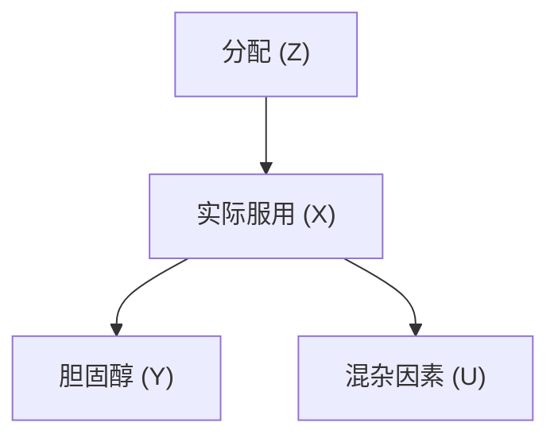

请注意，在这种情况下，我们的变量是二值的，而非数值型的。这意味着我们无法立即使用线性模型，因此也无法应用我们之前推导的工具变量公式。然而，在这种情况下，我们通常可以用一个称为**单调性（monotonicity）** 的较弱条件来替代线性假设，我将在下面解释这一点。

但在我们这样做之前，让我们确保我们对工具变量的其他必要假设是成立的。首先，工具变量 $Z$ 是否独立于混杂因素？随机化 $Z$ 确保了答案是肯定的。（正如我们在第4章中所见，随机化是确保变量不受任何混杂因素影响的绝佳方法。）是否存在从 $Z$ 到 $Y$ 的直接路径？常识告诉我们，收到一个特定的随机数（ $Z$ ）不可能影响胆固醇（ $Y$ ），所以答案是否定的。最后， $Z$ 和 $X$ 之间是否存在强关联？这次应该查阅数据本身，答案又是肯定的。在应用工具变量之前，我们必须始终提出上述三个问题。这里的答案显而易见，但我们不应忽视这样一个事实：我们是在用因果直觉来回答它们，而这种直觉正是图中捕捉、保存和阐明的。

表7.1显示了结果 $X$ 和 $Y$ 的观测频率。例如，91.9%的未被分配药物的人的结果是 $X = 0$ （未服药）和 $Y = 0$ （胆固醇未降低）。这合乎情理。另外8.1%的人的结果是 $X = 0$ （未服药）和 $Y = 1$ （胆固醇确实降低了）。显然，他们因服药以外的其他原因而改善。还要注意，表中出现了两个零：没有人未被分配药物（ $Z = 0$ ）却设法得到了药物（ $X = 1$ ）。在一项运行良好的随机研究中，尤其是在医生对试验药物拥有独家使用权的医学领域，这通常是成立的。不存在 $Z = 0$ 且 $X = 1$ 的个体的假设被称为 **单调性**。

**表7.1. 消胆胺试验数据。**

| 结果 | 未被分配药物（ $Z = 0$ ） | 被分配药物（ $Z = 1$ ） |
| :--- | :---: | :---: |
| $X = 0$ ， $Y = 0$ | 0.919 | 0.315 |
| $X = 1$ ， $Y = 0$ | 0.000 | 0.139 |
| $X = 0$ ， $Y = 1$ | 0.081 | 0.073 |
| $X = 1$ ， $Y = 1$ | 0.000 | 0.473 |

现在让我们看看如何估计治疗效果。首先，我们考虑最坏情况：所有不依从者即使依从治疗也不会改善。在这种情况下，唯一会服药并改善的人是那47.3%实际依从并改善的人。但我们需要用安慰剂效应来校正这个估计值，安慰剂效应在表的第三行。在被分配安慰剂并服用了安慰剂的人中，8.1%得到了改善。因此，超出安慰剂效应的净改善是47.3%减去8.1%，即39.2%。

那么最好情况呢？即所有不依从者如果依从都会改善？在这种情况下，我们将不依从者的31.5%加上7.3%加到我们刚刚计算的39.2%的基准值上，总计78.0%。

因此，即使在混杂因素完全不利于药物的最坏情况下，我们仍然可以说该药物能改善 **39%** 人群的胆固醇。在混杂因素完全有利于药物的最好情况下， **78%** 的人群会看到改善。尽管由于不依从者数量众多，界限相距甚远，但研究者可以明确地断言该药物对其预期目的是有效的。

这种先取最坏情况再取最好情况的策略通常会给我们一个估计范围。显然，如果能像线性情况那样得到一个点估计就好了。如果需要，有一些方法可以缩小范围，在某些情况下甚至可以获得点估计。例如，如果你只对依从子人群（即只有在被分配时才服用 $X$ 的那些人）感兴趣，你可以推导出一个称为 **局部平均处理效应（Local Average Treatment Effect, LATE）** 的点估计。无论如何，我希望这个例子表明，当我们离开线性模型的世界时，我们并非束手无策。

自1984年以来，工具变量方法不断发展，其中一种特定版本变得极为流行：**孟德尔随机化（Mendelian randomization）**。这里有一个例子。尽管低密度脂蛋白（LDL）或“坏”胆固醇的影响已经确定，但关于**高密度脂蛋白（High-Density Lipoprotein, HDL）** 或“好”胆固醇仍存在相当大的不确定性。早期的观察性研究，例如20世纪70年代末的**弗雷明汉心脏研究（Framingham Heart Study）** ，表明HDL对心脏病发作具有保护作用。但高HDL通常与低LDL相伴而行，那么我们如何判断哪种脂质是真正的因果因素呢？

为了回答这个问题，假设我们知道有一个基因会导致人们具有更高的HDL水平，而对LDL没有影响。那么我们可以建立图7.12中的因果图，其中我使用了*生活方式*作为可能的混杂因素。请记住，像斯诺的例子一样，使用随机化的工具变量总是有利的。如果它是随机化的，就没有因果箭头指向它。因此，基因是一个完美的工具变量。我们的基因在受孕时是随机分配的，就好像格雷戈尔·孟德尔本人从天而降，给一些人分配了高风险基因，给另一些人分配了低风险基因。这就是“孟德尔随机化”这个术语的由来。

是否存在从HDL基因指向生活方式的箭头呢？这里我们再次需要进行“实地考察”并进行因果思考。只有当人们知道自己拥有哪个版本（高HDL版本还是低HDL版本）时，HDL基因才可能影响他们的生活方式。但直到2008年，这样的基因才被发现，即使在今天，人们通常也无法获得这些信息。因此，很可能不存在这样的箭头。

> **图7.12.** 孟德尔随机化示例的因果图。

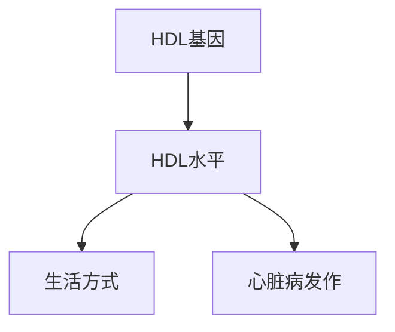

至少有两项研究采用了这种孟德尔随机化方法来解决胆固醇问题。2012年，由马萨诸塞总医院的Sekar Kathiresan领导的一项大型合作研究表明，较高的HDL水平没有可观察到的益处。另一方面，研究人员发现LDL对心脏病发作风险有非常大的影响。根据他们的数据，将你的LDL水平降低34 mg/dl会使你心脏病发作的几率降低约 **50%** 。因此，无论是通过饮食、运动还是他汀类药物来降低你的“坏”胆固醇水平，似乎都是一个明智的主意。另一方面，提高你的“好”胆固醇水平，无论一些鱼油推销员怎么告诉你，似乎都不太可能改变你的心脏病发作风险。

一如既往，这里有一个警告。同年发表的第二项研究指出，携带LDL基因低风险变异的人一生中的胆固醇水平都较低。孟德尔随机化告诉我们，在你的一生中将LDL降低34个单位将使你的心脏病发作风险降低50%。但他汀类药物无法在你的一生中降低你的LDL胆固醇——只能从你开始服药的那一天起。如果你60岁，你的动脉已经承受了60年的损伤。因此，孟德尔随机化很可能 **高估** 了他汀类药物的真正益处。另一方面，从年轻时就开始降低你的胆固醇——无论是通过饮食、运动甚至是他汀类药物——日后都会产生巨大的效果。

从因果分析的角度来看，这给我们上了很好的一课：在任何关于干预的研究中，我们需要问自己，我们实际操纵的变量（终生LDL水平）是否与我们自认为操纵的变量（当前LDL水平）相同。这是“熟练地审问自然”的一部分。

总而言之，工具变量是一个重要的工具，因为它有助于我们揭示超越**do-演算（do-calculus）** 的因果信息。后者坚持点估计而非不等式，并且会在像图7.12这样我们只能得到不等式的情况下放弃。另一方面，认识到do-演算远比工具变量灵活得多也很重要。在do-演算中，我们对因果模型中的函数性质不做任何假设。但是，如果我们能在科学基础上证明像单调性或线性这样的假设是合理的，那么像工具变量这样更专门的工具就值得考虑。

工具变量方法可以扩展到像图7.9（或7.11或7.12）那样的简单四变量模型之外，但如果没有因果图的指导，很难走得很远。例如，在某些情况下，一个不完美的工具（例如，不完全独立于混杂因素的变量）可以在对一组巧妙选择的辅助变量进行条件调整后使用，这些辅助变量阻断了工具与混杂因素之间的路径。我以前的学生Carlos Brito，现在是巴西塞阿拉联邦大学的教授，充分发展了这种将非工具变量转化为工具变量的思想。

此外，Brito研究了许多可以用一组变量成功作为工具的情况。尽管工具集的识别超越了do-演算，但它仍然使用了因果图的工具。对于理解这种语言的研究人员来说，可能的研究设计丰富多样；他们不必感到拘泥于使用图7.9、7.11和7.12中所示的四变量模型。可能性只受限于我们的想象力。

> M. HAREL
> “可惜我不能同时踏上两条路，
> 作为一位旅人，我长久地伫立……”
>
> 罗伯特·弗罗斯特的著名诗句展现了诗人对反事实的敏锐洞察。我们不能同时踏上两条路，但我们的大脑却能够判断如果我们选择了另一条路会发生什么。凭借这种判断，弗罗斯特在诗的结尾对自己的选择感到满意，意识到它“造就了所有的不同。”
> *（来源：Maayan Harel的画作。）*