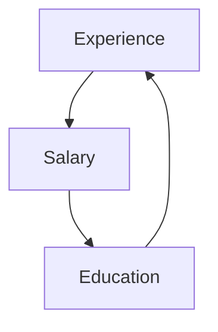
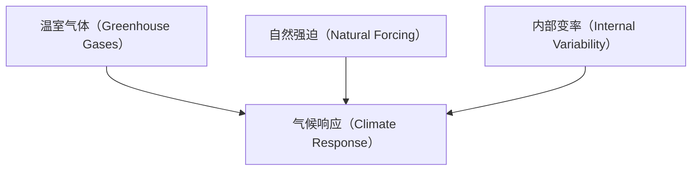

# 反事实：挖掘本可能存在的世界（COUNTERFACTUALS: MINING WORLDS THAT COULD HAVE BEEN）

> 倘若克利奥帕特拉的鼻子短一些，整个世界的面貌都将改变。  
> ——布莱兹·帕斯卡（1669）

当我们准备攀登因果之梯的最高一级时，让我们回顾一下从第二级所学到的内容。我们已经看到了几种在不同情境和条件下确定干预效果的方法。在第4章中，我们讨论了**随机对照试验（randomized controlled trials）**，这是医学试验中被广泛引用的"金标准"。我们还了解了适用于观察性研究的方法，在这些研究中，处理组和对照组并非随机分配。

如果我们能够测量阻断所有后门路径的变量，就可以使用**后门调整公式（backdoor adjustment formula）**来获得所需的效果。如果我们能够找到一条"屏蔽"了混杂因素的**前门路径（frontdoor path）**，就可以使用**前门调整（front-door adjustment）**。如果我们愿意接受线性或单调性假设，就可以使用**工具变量（instrumental variables）**（假设在图中能够找到合适的变量，或通过实验创建这样的变量）。而真正富有冒险精神的研究者可以通过**do-演算（do-calculus）**或其算法版本，规划出通往干预之巅的其他路径。

在所有这些努力中，我们处理的是对人群或从研究人群中选出的典型个体的影响（**平均因果效应（average causal effect）**）。但到目前为止，我们仍然缺乏在特定事件或个体层面上讨论个性化因果关系的能力。说"吸烟致癌"是一回事，但说我的叔叔乔，他每天抽一包烟抽了三十年，如果不抽烟的话本可以活着，这又是另一回事。这种差异既明显又深刻：所有像乔叔叔一样吸烟三十年并去世的人，永远无法在另一个他们不吸烟三十年的替代世界中被观察到。

**责任与归咎，遗憾与功绩**：这些概念是因果思维的通货。要理解它们，我们必须能够将实际发生的事情与在某种替代假设下*本会发生的事情*进行比较。正如第1章中所论述的，我们构想替代的、不存在的世界的能力，将我们与原始人类祖先以及地球上的任何其他生物区分开来。其他每种生物只能看到*是什么*。我们的天赋——有时可能是一种诅咒——是我们能够看到*本可能是什么*。

本章展示了如何使用观察性和实验性数据来提取关于反事实情景的信息。它解释了如何在**因果图（causal diagram）**的背景下表示个体层面的原因，这项任务将迫使我们解释一些之前未曾讨论过的因果图的细节。我还将讨论一个高度相关的概念，称为"**潜在结果（potential outcomes）**"或**内曼-鲁宾因果模型（Neyman-Rubin causal model）**，该模型最初由波兰统计学家耶日·内曼（Jerzy Neyman）在20世纪20年代提出，他后来成为伯克利大学的教授。但直到20世纪70年代中期唐纳德·鲁宾（Donald Rubin）开始撰写关于潜在结果的文章后，这种因果分析方法才真正开始蓬勃发展。

我将展示反事实如何自然地出现在过去几章中发展的框架中——**休厄尔·赖特（Sewall Wright）**的路径图及其扩展为**结构因果模型（Structural Causal Models, SCMs）**。我们在第1章的行刑队例子中已经领略了这一点，该例子展示了如何回答诸如"如果步枪手A没有开枪，囚犯还会活着吗？"这样的反事实问题。我将比较反事实在**内曼-鲁宾范式（Neyman-Rubin paradigm）**和**结构因果模型（SCMs）**中的定义方式，后者享有因果图的优势。多年来，鲁宾一直坚持认为图表毫无用处。因此，我们将考察鲁宾因果模型的学生们如何在蒙着眼睛的情况下导航因果问题，缺乏表示因果知识或推导其可检验含义的工具。

最后，我们将审视两个反事实推理至关重要的应用。几十年来甚至几个世纪以来，律师们一直使用一种相对直接的被告罪责检验标准，称为"**若非因果关系（but-for causation）**"：如果不是被告的行为，伤害就不会发生。我们将看到反事实的语言如何捕捉这一难以捉摸的概念，以及如何估计被告有罪的概率。

接下来，我将讨论反事实在气候变化中的应用。直到最近，气候科学家们发现很难回答诸如"全球变暖是否导致了这场风暴[或这次热浪，或这场干旱]？"这样的问题。传统的回答是，个别的天气事件不能归因于全球气候变化。然而，这种回答似乎相当回避，甚至可能导致公众对气候变化漠不关心。

反事实分析使气候科学家能够做出比以前更精确、更明确的陈述。然而，这需要我们日常词汇中稍加补充。区分三种不同的因果关系将是有帮助的：**必要因果关系（necessary causation）**、**充分因果关系（sufficient causation）**和**必要且充分因果关系（necessary-and-sufficient causation）**。（必要因果关系与若非因果关系相同。）使用这些词语，气候科学家可以说："人为气候变化有90%的概率是这次热浪的必要原因"，或者"气候变化有80%的概率足以每50年至少产生一次如此强烈的热浪。"第一句话涉及归因：谁对异常高温负责？第二句话涉及政策。它表明我们最好为这样的热浪做好准备，因为它们迟早可能发生。这两种说法都比耸耸肩、对个别天气事件的原因只字不提更有信息量。

## 从修昔底德和亚伯拉罕到休谟和刘易斯（FROM THUCYDIDES AND ABRAHAM TO HUME AND LEWIS）

鉴于反事实推理是构成我们人类心智装置的一部分，我们在人类历史中越往前追溯，越能找到反事实陈述，这并不令人惊讶。例如，在修昔底德（Thucydides）的《伯罗奔尼撒战争史》（*History of the Peloponnesian War*）中，这位通常被描述为"科学"历史学先驱的古希腊历史学家描述了公元前426年发生的一场海啸：

> 大约在这些地震如此频繁的同时，优卑亚岛奥罗比亚的海水退离了当时的海岸线，又以巨大的波浪返回，淹没了该镇的大部分地区，然后退去，留下部分地区仍在水下；因此，曾经是陆地的地方现在是海洋；那些未能及时逃到高地的人遇难了。……在我看来，这种现象的原因必须在地震中寻找。在地震冲击最剧烈的地方，海水被推回，然后突然以加倍的力量反冲，造成洪水。如果没有地震，我不明白这样的意外事件如何能够发生。

考虑到这段文字写作的时代，这确实是一段非常了不起的段落。首先，修昔底德观察的精确性足以让任何现代科学家感到钦佩，尤其是在他工作的时代没有卫星、没有摄像机、没有24/7新闻机构在灾难发生时播放图像的情况下。其次，他写作的时代是人类历史上自然灾害通常被归因于神意的时期。他的前辈荷马或同时代的希罗多德无疑会将这一事件归因于波塞冬或其他神祇的愤怒。然而，修昔底德提出了一种没有任何超自然过程的因果模型：地震推回海水，海水反冲并淹没陆地。引文的最后一句尤其有趣，因为它表达了必要因果关系或若非因果关系的概念：如果不是地震，海啸就不可能发生。这种反事实判断将地震从海啸的单纯先导提升为实际原因。

反事实推理的另一个引人入胜且具有启发性的例子出现在圣经的《创世记》中。亚伯拉罕正在与上帝讨论后者因其邪恶行径而毁灭所多玛和蛾摩拉两城的意图。

> 亚伯拉罕近前来说："你真的要把义人和恶人一同毁灭吗？假若那城里有五十个义人，你还要毁灭而不为其中这五十个义人饶恕那地方吗？……"耶和华说："我若在所多玛城里见有五十个义人，我就为他们的缘故饶恕那地方的众人。"

但故事并未就此结束。亚伯拉罕并不满足，他问主，如果只有四十五个义人呢？或者四十个？或者三十个？或者二十个？甚至十个？每次他都得到肯定的回答，上帝最终向他保证，如果他能找到十个义人，即使只为这十个义人的缘故，他也会饶恕所多玛。

亚伯拉罕通过这种讨价还价想要达到什么目的？他当然不怀疑上帝的计数能力。而且，亚伯拉罕知道上帝知道所多玛有多少义人。毕竟，上帝是全知的。

鉴于亚伯拉罕的顺从和虔诚，很难相信这些问题是为了说服主改变主意。相反，它们是为了亚伯拉罕自己的理解。他像现代科学家一样进行推理，试图理解支配集体惩罚的法则。什么样的邪恶程度足以招致毁灭？三十个义人足以拯救一座城市吗？二十个呢？没有这样的信息，我们就没有完整的因果模型。现代科学家可能会称之为**剂量-反应曲线（dose-response curve）**或**阈值效应（threshold effect）**。

修昔底德和亚伯拉罕通过个别案例探究反事实，而希腊哲学家亚里士多德则研究了因果关系的更一般方面。以他典型的系统性风格，亚里士多德建立了一整套因果分类法，包括"质料因"、"形式因"、"动力因"和"目的因"。例如，雕像形状的质料因是铸造它的青铜及其属性；我们不能用"傻傻泥"制作同样的雕像。然而，亚里士多德在任何地方都没有将因果关系表述为反事实，因此他巧妙的分类缺乏修昔底德关于海啸原因叙述的简单清晰。

要找到一位将反事实置于因果关系核心的哲学家，我们必须向前推进到**大卫·休谟（David Hume）**，这位苏格兰哲学家，也是托马斯·贝叶斯的同时代人。休谟拒绝了亚里士多德的分类方案，坚持对因果关系采用单一的定义。但他发现这个定义相当难以捉摸，实际上在两个不同定义之间摇摆不定。后来这些定义演变成了两种不相容的意识形态，具有讽刺意味的是，两者都可以引用休谟作为来源！

在他的《人性论》（*Treatise of Human Nature*）（图8.1）中，休谟否认任何两个对象具有内在的品质或"能力"，使一个成为原因，另一个成为结果。在他看来，因果关系完全是我们的记忆和经验的产物。

> "因此，我们记得见过那种我们称之为火焰的对象，并且感受过那种我们称之为热的感觉，"他写道。"我们也回忆起在所有过去的实例中它们的恒常结合。无需更多仪式，我们称一个为原因，另一个为结果，并从其中一个推断出另一个的存在。"

这现在被称为因果关系的"**规则性（regularity）**"定义。

这段文字以其大胆令人叹为观止。休谟切断了因果之梯的第二和第三级，声称第一级——观察——就是我们所需要的全部。一旦我们足够多次地观察到火焰和热同时出现（并注意火焰在时间上的优先性），我们就同意称火焰为热的原因。像大多数二十世纪的统计学家一样，1739年的休谟似乎乐于将因果关系仅仅视为相关关系的一种。

## 人性论（TREATISE）

## 论（OF）

## 人性（Human Nature）：

### 尝试将实验推理方法引入道德主题（BEING An ATTEMPT to introduce the experimental Method of Reasoning INTO MORAL SUBJECTS.）

> 时代的罕见幸福，在于
> 可以思考你想要的，可以说出你所想的。塔西佗。

第一卷

论

理解力

伦敦：
为约翰·努恩印刷，位于白鹿
靠近默瑟教堂，在齐普赛街
MDCCXXXIX

## 人性论（A Treatise of Human Nature）

第一部分：论知识

> 第三节：我们能够从一个对象的存在推断另一个对象的存在。

因此，只有通过**经验**，我们才能从一个对象的存在推断另一个对象的存在。经验的性质是这样的：我们记得有过某一类对象存在的频繁实例；并且也记得另一类对象的个体总是伴随着它们，并以一种与它们相邻接和相继的规则顺序存在。因此，我们记得见过那种我们称之为**火焰**的对象，并且感受过那种我们称之为**热**的感觉。我们也回忆起在所有过去的实例中它们的恒常结合。无需更多仪式，我们称一个为**原因**，另一个为**结果**，并从其中一个推断出另一个的存在。

在所有那些我们从中学习特定原因和结果结合的例子中，原因和结果都是通过感官感知并被记住的：但在所有我们推理它们的案例中，只有一个被感知或记住，另一个则根据我们过去的经验被补充。

因此，在推进中，我们不知不觉地发现了原因和结果之间的一种新关系。

然而，值得称赞的是，休谟并没有满足于这个定义。九年后，在《人类理解研究》（*An Enquiry Concerning Human Understanding*）中，他写了些完全不同的话："我们可以将原因定义为被另一个对象跟随的对象，并且所有类似于第一个对象的对象都被类似于第二个对象的对象所跟随。或者，换句话说，如果第一个对象不曾存在，第二个对象也永远不会存在"（原文强调）。第一句话——A与B被一致地观察在一起的版本——只是重复了规则性定义。但到了1748年，他似乎有些疑虑，并发现它需要一些修补。

作为权威的辉格派历史学家，我们可以理解原因。根据他早期的定义，公鸡的打鸣会导致日出。为了弥补这个困难，他添加了一个在他早期著作中从未暗示过的第二个定义，一个*反事实*定义："如果第一个对象不曾存在，第二个对象也永远不会存在。"请注意，第二个定义正是修昔底德在讨论奥罗比亚海啸时使用的定义。反事实定义也解释了为什么我们不认为公鸡的打鸣是日出的原因。我们知道，如果公鸡某天生病了，或任性地拒绝打鸣，太阳仍然会升起。

尽管休谟试图通过他天真的插入语"换句话说"将这两个定义当作一个来通过，但第二个版本与第一个完全不同。它明确地援引了一个反事实，因此它位于**因果之梯（Ladder of Causation）**的第三级。规则性可以被观察到，而反事实只能被想象。

值得花一点时间思考为什么休谟选择用反事实来定义原因，而不是反过来。定义旨在将更复杂的概念简化为更简单的概念。休谟推测，他的读者理解"如果第一个对象不曾存在，第二个对象也永远不会存在"这句话的歧义性，会比理解"第一个对象导致了第二个对象"更少。他完全正确。后一句话引发了关于第一个对象中固有的什么品质或能力带来了第二个对象的各种无益的形而上学思辨。前一句话仅仅要求我们进行一次简单的心理测试：想象一个没有地震的世界，并询问它是否也包含海啸。我们从小就在做这样的判断，而人类自修昔底德时代以来（可能更早）就一直在做这样的判断。

然而，哲学家们在十九世纪和二十世纪的大部分时间里都忽略了休谟的第二个定义。反事实陈述——"本会"——似乎总是过于模糊和不确定，无法让学者们满意。相反，哲学家们试图通过概率因果理论来拯救休谟的第一个定义，正如第1章所讨论的。

一位违背惯例的哲学家，**大卫·刘易斯（David Lewis）**，在他1973年的著作《反事实》（*Counterfactuals*）中呼吁完全放弃规则性解释，并将"A导致了B"解释为"如果不是A，B就不会发生"。刘易斯问道："为什么不直接接受反事实的表面价值：作为关于实际情境的可能替代方案的陈述？"

像休谟一样，刘易斯显然对人类能够毫不费力、迅速、舒适且一致地做出反事实判断这一事实印象深刻。我们可以赋予它们真值和概率，其信心不亚于对事实陈述的判断。在他看来，我们通过设想反事实陈述为真的"**可能世界（possible worlds）**"来做到这一点。

当我们说"如果乔服用了阿司匹林，他的头痛就会消失"时，我们（根据刘易斯的观点）是在说，存在着其他可能世界，在这些世界中乔确实服用了阿司匹林，并且他的头痛消失了。刘易斯认为，我们通过比较我们这个世界——他没有服用阿司匹林的世界——与最相似的他服用了阿司匹林的世界来评估反事实。如果在那个世界中找不到头痛，我们就宣布反事实陈述为真。"最相似"是关键。可能存在一些"可能世界"，其中他的头痛没有消失——例如，他服用了阿司匹林然后撞到了浴室门上的世界。但那个世界包含了一个额外的、偶然的情况。在所有乔服用了阿司匹林的可能世界中，与我们最相似的世界不是他撞到头的那一个，而是他的头痛消失的那一个。

刘易斯的许多批评者抨击他关于许多其他可能世界确实存在的夸张主张。"刘易斯先生曾因其认为你能想到的任何逻辑上可能的世界都实际存在的观点而被戏称为'疯狗模态实在论者'，"他在2001年的《纽约时报》讣告中写道。"例如，他相信存在一个会说话的驴子的世界。"

但我认为，他的批评者（或许也包括刘易斯本人）忽略了最重要的一点。我们无需争论这些世界是否作为物理甚至形而上学实体而存在。如果我们的目标是解释人们说“A 导致 B”时的含义，我们只需假设人们能够在头脑中生成**替代世界（alternative worlds）**，判断哪个世界与我们所在的世界“更接近”，并且最重要的是，能够一致地做到这一点，从而形成共识。当然，如果一个人的“更接近”是另一个人的“更远”，我们就无法就反事实进行交流。在这种观点下，刘易斯的呼吁“为什么不按字面意思理解反事实呢？”并非指向形而上学，而是指向人类心智结构那惊人一致性的关注。

作为一名持辉格史观（Whiggish）的哲学家，我可以很好地解释这种一致性：它源于这样一个事实，即我们经历着同一个世界，并共享着关于其因果结构的相同心智模型。我们在第 1 章就已经讨论过这一点。我们共享的心智模型将我们凝聚成社群。因此，我们判断“接近性”的依据，并非某种形而上学的“相似性”概念，而是依据我们需要对共享模型进行多大程度的拆解和扰动，才能使其满足某个与事实相悖的给定假设条件（例如，乔没有服用阿司匹林）。

在结构模型（structural models）中，我们做着非常类似的事情，尽管辅以了更多的数学细节。我们评估诸如“如果 X 是 x”这样的表达式，其方式与我们处理干预 $do(X = x)$ 的方式相同，即通过删除因果图中的箭头或结构模型中的方程。我们可以将其描述为对因果图进行最小程度的修改，以确保 X 等于 x。在这方面，**结构性反事实（structural counterfactuals）** 与刘易斯关于最相似可能世界的想法是兼容的。

结构模型也解决了一个刘易斯一直保持沉默的难题：当可能性的数量远超人类大脑的容量时，人类如何在头脑中表征“可能世界”并计算出最接近的那一个？计算机科学家称之为“表征问题（representation problem）”。我们必须拥有某种极其简洁的编码方式来管理如此多的世界。结构模型，以某种形式或形态，会不会就是我们实际使用的捷径呢？我认为这非常有可能，原因有二。第一，结构性因果模型是一条有效的捷径，并且目前还没有任何竞争者具备这种神奇的特性。第二，它们是以**贝叶斯网络（Bayesian networks）**为模型构建的，而贝叶斯网络又是以大卫·鲁梅尔哈特（David Rumelhart）关于大脑中消息传递的描述为模型构建的。认为四万年前，人类就利用了大脑中早已存在的用于模式识别的机制，并将其用于因果推理，这并不牵强。

哲学家们倾向于将关于心智如何运作的论断留给心理学家。

## 潜在结果、结构方程与反事实的算法化（POTENTIAL OUTCOMES, STRUCTURAL EQUATIONS, AND THE ALGORITHMIZATION OF COUNTERFACTUALS）

就在刘易斯的书出版一年后，并且独立于它，唐纳德·鲁宾（Donald Rubin）（图 8.2）开始撰写一系列论文，将**潜在结果（Potential Outcomes）** 作为一种用于提出因果问题的语言。鲁宾当时是教育考试服务中心（Educational Testing Service）的一名统计学家，他单枪匹马地打破了统计学界长达七十五年的因果沉默，并使反事实概念在许多健康科学家眼中获得了合法地位。这一发展的重要性怎么强调都不为过——它为研究人员提供了一种灵活的语言，能够表达他们可能想要提出的几乎每一个因果问题，无论是在群体层面还是个体层面。

> **图 8.2**：唐纳德·鲁宾（右）与作者于 2014 年合影。（来源：Grace Hyun Kim 供图）

Black-and-white photo of two smiling men seated together, one holding a bouquet（无可见文字或符号）

在鲁宾因果模型中，变量 $Y$ 的潜在结果就是“若 $X$ 被赋予值 $x$，个体 $u$ 的 $Y$ 所会取的值”。这句话很长，因此通常将其简洁地记为 $Y_{X=x}(u)$。若从上下文能清楚看出哪个变量被设定为值 $x$，我们常进一步简写为 $Y_x(u)$。

要理解这一符号的大胆之处，你必须从符号本身退后一步，思考它们所蕴含的假设。写下 $Y_x$ 这一符号，鲁宾便断言：若 $X$ 为 $x$，$Y$ 必定会取某个值，且这一值具有与 $Y$ 实际取值同等的客观实在性。如果你不接受这一假设（我敢肯定海森堡不会接受），你就无法使用潜在结果。此外，请注意，潜在结果（或反事实）是在个体层面定义的，而非总体层面。

潜在结果的首次科学亮相，出现在耶日·内曼（Jerzy Neyman）1923 年的硕士论文中。内曼是波兰贵族后裔，在俄罗斯流亡长大，直到 1921 年二十七岁时才踏上故土。他在俄罗斯接受了非常扎实的数学教育，本想继续纯数学研究，但找工作时发现统计学家更容易就业。与英国的 R. A. 费希尔（R. A. Fisher）相似，他最初在一家农业研究所从事统计研究——这份工作对他来说实在是大材小用。他不仅是该研究所唯一的统计学家，而且实际上是整个国家唯一将统计学视为一门学科来思考的人。

内曼首次提及潜在结果是在农业实验的背景下，其中下标符号表示“特定品种[的种子]在相应地块上的未知潜在产量”。这篇论文一直无人知晓，且直到 1990 年才被翻译成英文。然而，内曼本人并未就此默默无闻。他设法在伦敦大学学院（University College London）的卡尔·皮尔逊（Karl Pearson）统计实验室待了一年，在那里与皮尔逊的儿子埃贡（Egon）结为好友。此后七年他们一直保持联系，其合作成果丰硕：内曼-皮尔逊统计假设检验方法是一个里程碑，每个初学统计学的学生都会学到。

1933 年，卡尔·皮尔逊长期的专制领导终于随着他的退休而结束，埃贡是他的逻辑继任者——如果不是因为 R. A. 费希尔这个棘手问题的话。费希尔当时已是英国最著名的统计学家。大学提出了一个独特而灾难性的解决方案，将皮尔逊的职位一分为二：一个统计学教席（埃贡·皮尔逊）和一个优生学教席（费希尔）。埃贡毫不犹豫地聘请了他的波兰朋友。内曼于 1934 年抵达，几乎立即与费希尔发生了冲突。

费希尔早已摩拳擦掌，准备一决高下。他知道自己是世界领先的统计学家，几乎开创了该学科的许多领域，却被禁止在统计系任教。关系异常紧张。“公共休息室被小心翼翼地分隔使用，”康斯坦丝·里德（Constance Reid）在内曼的传记中写道，“皮尔逊的团队在 4 点喝茶；到了 4 点 30 分，当他们安全离开后，费希尔和他的团队才鱼贯而入。”

1935 年，内曼在英国皇家统计学会（Royal Statistical Society）发表题为“农业实验中的统计问题”的演讲，其中他质疑了费希尔的某些方法，并顺便讨论了潜在结果的思想。内曼讲完后，费希尔站起来对学会说，“他曾希望内曼博士的论文是关于一个作者完全熟悉的主题。”

“[内曼]断言费希尔是错的，”奥斯卡·肯普索恩（Oscar Kempthorne）多年后谈及此事时写道，“这是不可饶恕的冒犯——费希尔从不会错，事实上，暗示他可能会错，被他视为致命的攻击。任何不把费希尔的著作当作神赐真理的人，不是愚蠢就是邪恶。”几天后，内曼和皮尔逊才见识到费希尔的愤怒程度。他们晚上去系里时，发现内曼用来演示演讲的木制模型散落一地。他们断定只有费希尔应对这场破坏负责。

尽管费希尔的暴怒现在看起来可能很有趣，但他的态度确实造成了严重后果。他当然无法放下自尊去使用内曼的潜在结果符号，即使这后来本可以帮助他解决中介问题。潜在结果词汇的缺乏导致他和其他许多人陷入了所谓的“中介谬误（mediation fallacy）”，我们将在第 9 章讨论。

此时，一些读者可能仍然觉得反事实的概念有些神秘，所以我想展示鲁宾的一些追随者会如何推断潜在结果，并将这种无模型方法与结构因果模型方法进行对比。

假设我们正在考察某家公司，想了解教育程度或工作经验年限哪个是决定员工工资的更重要的因素。我们收集了该公司现有工资的一些数据，如表 8.1 所示。我们用 EX 表示工作经验年限，ED 表示教育程度，S 表示工资。为简单起见，我们还假设教育程度只有三个等级：0 = 高中学历，1 = 大学学历，2 = 研究生学历。因此，$S_{ED=0}(u)$ 或 $S_0(u)$ 表示个体 $u$ 如果是高中毕业生（而非大学毕业生）时的工资，而 $S_1(u)$ 表示 $u$ 如果是大学毕业生时的工资。我们可能想问的一个典型反事实问题是：“如果爱丽丝有大学学历，她的工资会是多少？” 换句话说，$S_1(\text{Alice})$ 是多少？

关于表 8.1，首先要注意的是所有缺失的数据（用问号表示）。我们永远无法在同一个人身上观察到超过一个潜在结果。尽管显而易见，但这一陈述非常重要。统计学家保罗·霍兰德（Paul Holland）曾称其为“因果推断的基本问题”，这个名称一直沿用至今。如果我们能填补这些问号，就能回答所有因果问题。

我从未同意霍兰德将表 8.1 中的缺失值描述为“基本问题”，也许是因为我很少用表格来描述因果问题。但更根本的是，将因果推断视为一个缺失数据问题可能会产生严重的误导，我们很快就会看到这一点。请注意，除了最后三列的装饰性标题外，表 8.1 完全没有关于 ED、EX 和 S 的因果信息——例如，教育是否影响工资，或者反之。更糟糕的是，即使有这些信息，它也不允许我们将其表示出来。但对于那些认为“基本问题”是缺失数据的统计学家来说，这样的表格似乎提供了无穷无尽的机会。事实上，如果我们不把 $S_0, S_1$ 和 $S_2$ 视为潜在结果，而是视为普通变量，我们就有几十种插值技术来填补空白，或者用统计学家的话说，以某种最优方式“插补缺失数据”。

**表 8.1. 潜在结果示例的虚构数据。**

| 员工 (u) | EX(u) | ED(u) | S₀(u)   | S₁(u)      | S₂(u)      |
| :------- | :---- | :---- | :------ | :--------- | :--------- |
| Alice    | 6     | 0     | $81,000 | ?          | ?          |
| Bert     | 9     | 1     | ?       | $92,500    | ?          |
| Caroline | 9     | 2     | ?       | ?          | $97,000    |
| David    | 8     | 1     | ?       | $91,000    | ?          |
| Ernest   | 12    | 1     | ?       | $100,000   | ?          |
| Frances  | 13    | 0     | $97,000 | ?          | ?          |
| 等等。   |       |       |         |            |            |

一种常见的方法是匹配。我们寻找在所有变量（除感兴趣的变量外）上都匹配良好的个体对，然后用他们来互相填补各自行中的空缺。这里最明显的例子是伯特和卡罗琳，他们的工作经验完全匹配。因此我们假设，伯特如果拥有研究生学历，他的工资会与卡罗琳相同（\$97,000）；而卡罗琳如果只有本科学历，她的工资会与伯特相同（\$92,500）。请注意，匹配引用了与条件化（或分层）相同的思想：我们选择共享某个观察特征的分组进行比较，并利用比较来推断他们似乎并不共享的特征。

用这种方法很难估计爱丽丝的工资，因为在我给出的数据中没有与她良好匹配的对象。尽管如此，统计学家们已经发展出相当精妙的技术，可以从近似匹配中插补缺失数据，鲁宾正是这一方法的先驱。不幸的是，即使世界上最顶尖的媒人，也无法将数据转化为潜在结果，哪怕是近似值。我将在下面展示，正确答案关键取决于教育是否影响工作经验，还是反之——这些信息在表中无处可寻。

好的，这是根据您的要求翻译并优化后的中文 Markdown 内容。

---

第二种可能的方法是**线性回归（linear regression）**（不要与结构方程混淆）。在这种方法中，我们假设数据来自某个未知的随机源，并使用标准统计方法来找到最佳拟合数据的直线（在此例中为平面）。这种方法的输出可能是一个如下所示的方程：

$$
S = 65{,}000 + 2{,}500 \times EX + 5{,}000 \times ED \tag{8.1}
$$

方程 8.1 告诉我们，（平均而言）一个没有工作经验、只有高中文凭的员工的底薪是 \$65,000。每增加一年工作经验，薪水增加 \$2,500；每增加一个教育学位（最多两个），薪水增加 \$5,000。因此，一位回归分析师会声称，我们对拥有大学学位的爱丽丝薪水的估计是：\$65,000 + \$2,500 × 6 + \$5,000 × 1 = \$85,000。

这种插补技术的简便性和熟悉性，解释了为什么 **Rubin** 将因果推断视为一个缺失数据问题的概念广受欢迎。然而，尽管这些插值方法看似无害，但它们存在根本性的缺陷。它们是**数据驱动**的，而非**模型驱动**的。所有缺失数据都是通过检查表格中的其他值来填充的。正如我们从“**因果关系之梯（Ladder of Causation）**”中学到的，任何此类方法从一开始就注定要失败；仅基于数据（第一层级）的方法无法回答反事实问题（第三层级）。

在将这些方法与**结构因果模型（Structural Causal Model, SCM）**方法进行对比之前，让我们直观地审视一下模型盲插补的问题所在。特别是，让我们解释一下为什么在经验上完美匹配的 Bert 和 Caroline，在比较他们的潜在结果时实际上可能非常不可比。更令人惊讶的是，一个合理的因果故事（符合表 8.1）会表明，对于 Caroline 的薪水来说，最好的匹配对象恰恰是那些在经验上与她并不匹配的人。

首先要认识到的一个关键点是，经验很可能依赖于教育。毕竟，那些获得了额外教育学位的员工花费了四年的生命来获得它。因此，如果 Caroline 只有一个学位（像 Bert 一样），她本可以利用那多出来的时间获得比现在更多的经验。这将使她与 Bert 拥有相同的教育水平，但拥有更多的经验。因此，我们可以得出结论：$S_{1}(Caroline) > S_{1}(\mathrm{Bert})$，这与朴素匹配的预测相反。我们看到，一旦我们有了一个教育影响经验的因果故事，那么在经验上进行“匹配”就不可避免地会在潜在薪水上造成不匹配。

具有讽刺意味的是，最初作为匹配邀请的“经验相等”，现在却变成了一个响亮的警告。当然，表 8.1 将继续对这种危险保持沉默。因此，我无法认同 Holland 将因果推断视为缺失数据问题的热情。恰恰相反，我的一位前学生 **Karthika Mohan** 最近的研究表明，即使是标准的缺失数据问题也需要因果建模才能解决。

现在，让我们看看结构因果模型会如何处理同样的数据。首先，在查看数据之前，我们先绘制一个**因果图（causal diagram）**（图 8.3）。该图编码了数据背后的因果故事，根据这个故事，经验听从于教育，而薪水同时听从于两者。事实上，仅通过观察该图，我们就能看出一些非常重要的信息。如果我们的模型是错的，即 EX 是 ED 的原因，而不是相反，那么经验将是一个**混杂因子（confounder）**，匹配具有相似经验的员工将是完全合适的。而当 ED 是 EX 的原因时，经验就是一个**中介变量（mediator）**。你现在肯定知道，将中介变量误认为是混杂因子是因果推断中最致命的错误之一，可能导致最离谱的谬误。后者允许进行调整；前者则禁止调整。

> 图 8.3. 教育（ED）和经验（EX）对薪水（S）影响的因果图。

到目前为止，在本书中，我使用了一个非常非正式的词语——“听从”——来表达因果图中箭头的含义。但现在，是时候为这个概念增添一些数学内涵了，而这正是结构因果模型与**贝叶斯网络（Bayesian network）**或回归模型的不同之处。当我说薪水听从于教育和经验时，我的意思是它是这些变量的一个数学函数：$S = f_{\mathrm{S}}(EX, ED)$。但是，我们需要考虑到个体差异，因此我们将这个函数扩展为 $S = f_{\mathrm{{S}}}(EX, ED, U_{\mathrm{{S}}})$，其中 $U_{\mathrm{S}}$ 代表“影响薪水的未观测变量”。我们知道这些变量是存在的（例如，爱丽丝是公司总裁的朋友），但它们过于多样化和数量众多，无法明确地纳入我们的模型。

让我们看看这在我们的教育/经验/薪水示例中会如何运作，假设所有函数都是线性的。我们可以使用与之前相同的统计方法来找到最佳拟合的线性方程。结果看起来就像方程 8.1，只有一个细微的差别：

$$
S = 65,000 + 2,500 \times EX + 5,000 \times ED + U_{S} \tag {8.2}
$$

然而，方程 8.1 和 8.2 在形式上的相似性具有极大的欺骗性；它们的解释如同白昼与黑夜般迥异。我们在方程 8.1 中选择将 $S$ 对 $ED$ 和 $EX$ 进行回归，这绝不意味着在现实世界中 $S$ 听从于 $ED$ 和 $EX$。这个选择纯粹是我们做出的，数据中没有任何东西能阻止我们将 $EX$ 对 $ED$ 和 $S$ 进行回归，或遵循任何其他顺序。（回想一下第 2 章中 **Francis Galton** 的发现：回归对因果是盲目的。）一旦我们宣布一个方程是“结构性的”，我们就失去了这种自由。

换句话说，方程 8.2 的作者必须承诺写出反映他关于世界中谁听从谁的信念的方程。在我们的案例中，他相信 $S$ 确实听从于 $EX$ 和 $ED$。更重要的是，模型中缺少方程 $ED = f_{ED}(EX, S, U_{ED})$ 意味着 $ED$ 被认为对 $EX$ 或 $S$ 的变化浑然不觉。这种承诺上的差异赋予了结构方程支持反事实的能力，而回归方程则被剥夺了这种能力。

为了符合图 8.3，我们还必须有一个关于 $EX$ 的结构方程，但现在我们将强制 $S$ 的系数为零，以反映从 $S$ 到 $EX$ 没有箭头。一旦我们从数据中估计出系数，该方程可能如下所示：

$$
EX = 10 - 4 \times ED + U_{\mathrm{EX}} \tag{8.3}
$$

这个方程表明，没有高级学位的人的平均经验是十年，每获得一个教育学位（最多两个）平均会使 $EX$ 减少四年。再次注意结构方程和回归方程之间的关键区别：变量 $S$ 没有进入方程 8.3，尽管 $S$ 和 $EX$ 很可能高度相关。这反映了分析师的信念：任何个体获得的经验 $EX$ 完全不受其当前薪水的影响。

现在，让我们演示如何从结构模型中推导出反事实。为了估计爱丽丝如果拥有大学学位时的薪水，我们执行三个步骤：

- **步骤 1（溯因，Abduction）**：使用关于爱丽丝和其他员工的数据来估计爱丽丝的特质因子（idiosyncratic factors），即 $U_{\mathrm{S}}(\mathrm{Alice})$ 和 $U_{\mathrm{EX}}(\mathrm{Alice})$。
- **步骤 2（行动，Action）**：使用 **do 算子（do-operator）** 改变模型，以反映所做出的反事实假设，在本例中假设她拥有大学学位：$ED(\mathrm{Alice}) = 1$。
- **步骤 3（预测，Prediction）**：使用修改后的模型以及关于外生变量 $U_{\mathrm{S}}(\mathrm{Alice})$、$U_{\mathrm{EX}}(\mathrm{Alice})$ 和 $ED(\mathrm{Alice})$ 的更新信息，计算爱丽丝的新薪水。这个新计算出的薪水等于 $S_{ED=1}(\mathrm{Alice})$。

对于步骤 1，我们从数据中观察到 $EX(\mathrm{Alice}) = 6$ 和 $ED(\mathrm{Alice}) = 0$。我们将这些值代入方程 8.2 和 8.3。然后这些方程告诉我们爱丽丝的特质因子：$U_{\mathrm{S}}(\mathrm{Alice}) = \$1{,}000$ 和 $U_{\mathrm{EX}}(\mathrm{Alice}) = -4$。这代表了关于爱丽丝的一切独特、特殊和美妙之处。无论那是什么，它都为她预测的薪水增加了 \$1,000。

步骤 2 告诉我们使用 do 算子来擦除指向被设置为反事实值的变量（教育）的箭头，并将爱丽丝的教育设置为大学学位（$ED = 1$）。在这个例子中，步骤 2 是微不足道的，因为没有箭头指向教育，因此没有箭头需要擦除。然而，在更复杂的模型中，这个擦除箭头的步骤不能省略，因为它会影响步骤 3 的计算。那些可能通过被干预变量影响结果的变量将不再被允许这样做。

最后，步骤 3 说更新模型以反映新信息：$U_{\mathrm{S}} = \$1{,}000$、$U_{\mathrm{EX}} = -4$ 和 $ED = 1$。首先，我们使用方程 8.3 重新计算如果爱丽丝上了大学，她的经验会是多少：$EX_{ED=1}(\mathrm{Alice}) = 10 - 4 - 4 = 2$ 年。然后，我们使用方程 8.2 重新计算她的潜在薪水：

$$
S_{ED=1}(\text{Alice}) = 65{,}000 + 2{,}500 \times 2 + 5{,}000 \times 1 + 1{,}000 = 76{,}000.
$$

我们的结果 $S_{1}(\mathrm{Alice}) = \$76{,}000$ 是对爱丽丝可能薪水的有效估计；也就是说，如果模型假设有效，这两者将是一致的。因为这个例子涉及一个非常简单的因果模型和非常简单的（线性）函数，所以它和数据驱动的回归方法之间的差异可能看起来相当微小。但表面上的微小差异反映了底层的巨大差异。我们从结构方法中获得的任何反事实（潜在）结果都逻辑地遵循模型中所展示的假设，而数据驱动方法获得的答案则像虚假相关一样反复无常，因为它忽略了重要的建模假设。

这个例子迫使我们在本书中比之前更进一步地深入到因果模型的“具体细节”中。但让我稍微退一步，来庆祝和欣赏通过爱丽丝的例子所诞生的奇迹。通过数据和模型的结合，我们能够在完全假设的条件下预测个体（爱丽丝）的行为。当然，天下没有免费的午餐：我们之所以得到这些强有力的结果，是因为我们做了强有力的假设。除了断言观测变量之间的因果关系外，我们还假设函数关系是线性的。但在这里，线性关系的重要性不如知道这些具体函数是什么。这使我们能够根据观察到的特征计算爱丽丝的特质，并根据三步程序的要求更新模型。

冒着给我们的庆祝活动泼冷水的风险，我必须告诉你，这种函数信息在实践中并不总是可用的。一般来说，如果箭头背后的函数是已知的，我们称模型为“**完全指定的（completely specified）**”；否则称为“**部分指定的（partially specified）**”。例如，就像在贝叶斯网络中一样，我们可能只知道图中父节点和子节点之间的概率关系。如果模型是部分指定的，我们可能无法精确估计爱丽丝的薪水；相反，我们可能不得不做出一个概率区间陈述，例如“她的薪水有 10% 到 20% 的可能性是 \$76,000。”但即使是这样的概率答案，对许多应用来说也足够好了。此外，即使我们对箭头背后的具体函数一无所知，或者只有非常通用的信息（例如我们在上一章遇到的“**单调性（monotonicity）**”假设），我们能从因果图中提取的信息量也是惊人的。

上述步骤 1 到 3 可以总结为我所谓的 **“因果推断第一定律（first law of causal inference）”**：$Y_{x}(u) = Y_{M_{x}}(u)$。这与我们在第 1 章的处决队例子中使用的规则相同，只是函数不同。第一定律说，潜在结果 $Y_{x}(u)$ 可以通过进入模型 $M_{x}$（删除了指向 $X$ 的箭头）并在那里计算结果 $Y(u)$ 来估算。因果关系之梯第二层和第三层上的所有可估量都由此得出。简而言之，将反事实简化为算法使我们能够征服第三层级上数学所允许的尽可能多的领域——但当然，不能多一分一毫。

# 审视你的假设的益处（THE VIRTUE OF SEEING YOUR ASSUMPTIONS）

我展示的计算反事实的 **结构因果模型（Structural Causal Model, SCM）** 方法与鲁宾（Rubin）使用的方法并不相同。我们之间的一个主要分歧在于**因果图（causal diagrams）**的使用。因果图使研究者能够用他们可以理解的术语来表示因果假设，然后将所有反事实视为其世界模型的派生属性。而**鲁宾因果模型（Rubin causal model）**则将反事实视为抽象的数学对象，通过代数机制进行管理，但并非从模型中派生。

由于缺乏图形工具，鲁宾因果模型的用户通常被要求接受三个假设。第一个假设称为**"稳定单位处理值假设"（stable unit treatment value assumption, SUTVA）**，它相当透明。该假设指出，无论其他个体（或"单位"，因果建模者偏爱的术语）接受何种处理，每个个体（或"单位"）都会对处理产生相同的效果。在许多情况下，除非存在流行病和其他集体交互作用，这一假设是完全合理的。例如，假设头痛不具有传染性，我对阿司匹林的反应将不取决于乔（Joe）是否服用了阿司匹林。

鲁宾模型中的第二个假设同样温和，称为**"一致性"（consistency）**。它指出，一个服用了阿司匹林并康复的人，如果通过实验设计再次服用阿司匹林，也会康复。这一合理假设在SCM框架中是一个定理，实际上表明实验不存在安慰剂效应和其他缺陷。

但**潜在结果（potential outcome）**实践者总是必须做出的主要假设称为**"可忽略性"（ignorability）**。这更具技术性，但它是整个交易的关键部分，因为它本质上与第4章讨论的杰米·罗宾斯（Jamie Robins）和桑德·格林兰（Sander Greenland）的**可交换性（exchangeability）**条件相同。可忽略性用潜在结果变量 $Y_{\mathrm{x}}$ 表达了同样的要求。它要求 $Y_{\mathrm{x}}$ 与实际接受的处理 $X$ 独立，条件是某一组（去）混杂变量 $Z$ 的值。

在探讨其解释之前，我们应该承认，任何以条件独立性表达的假设都继承了统计学家为普通（非反事实）变量开发的大量熟悉的数学工具。例如，统计学家通常使用规则来判断一个条件独立性何时从另一个条件独立性推导出来。值得肯定的是，鲁宾认识到将"无混杂"的因果概念转化为概率论的语法（尽管是在反事实变量上）的优势。可忽略性假设使鲁宾因果模型实际上成为一个模型；表8.1本身并不是一个模型，因为它不包含关于世界的任何假设。

不幸的是，我还没有找到任何一个人能够用那些需要做出这一假设或评估其在特定问题中合理性的从业者所使用的语言来解释可忽略性的含义。以下是我最好的尝试。如果在混杂因子 $Z$ 的任何分层内，具有一种潜在结果 $Y_{\mathrm{x}} = y$ 的患者与具有另一种潜在结果 $Y_{\mathrm{x}} = y'$ 的患者进入治疗组或对照组的可能性相同，那么患者分配到治疗组或对照组就是可忽略的。这个定义对于拥有反事实概率函数的人来说是完全合理的。但是，一个仅有科学知识作为指导的生物学家或经济学家如何评估这是否成立呢？更具体地说，科学家如何评估可忽略性是否适用于本书讨论的任何示例呢？

为了理解这一困难，让我们尝试将这个解释应用于我们的示例。为了确定教育程度（ED）是否可忽略（条件是工作经验EX），我们被要求判断具有一种潜在工资（例如 $S_1 = s$）的员工是否与具有不同潜在工资（例如 $S_1 = s'$）的员工具有相同教育水平的可能性相同。如果你认为这听起来像是循环论证，我只能同意你的看法！我们想要确定爱丽丝（Alice）的潜在工资，甚至在开始之前——甚至在得到答案的提示之前——我们就应该在EX的每个分层中推测结果是否与ED相关。这简直是一场认知噩梦。

事实证明，在我们的例子中，ED相对于 $S$ 是不可忽略的（条件为EX），这就是为什么匹配方法（将伯特Bert和卡罗琳Caroline设为相等）会得出关于他们潜在工资的错误答案。事实上，他们的估计值应该相差 $S_1(\mathrm{Bert}) – S_1(\mathrm{Caroline}) = \$5,000$。（读者应该能够从表8.1的数据和三个步骤中证明这一点。）我现在将展示，借助因果图，学生可以立即看出ED不可忽略，并且不会在此尝试匹配。如果没有图，学生可能会倾向于默认假设可忽略性成立，从而落入这个陷阱。（这不是猜测。我从《哈佛法律评论》（*Harvard Law Review*）的一篇文章中借用了这个例子的想法，该文章中的故事本质上与图8.3相同，作者确实使用了匹配。）

以下是我们如何使用因果图来检验（条件）可忽略性。要确定 $X$ 相对于结果 $Y$ 是否可忽略（条件为一组匹配变量 $Z$），我们只需要检验 $Z$ 是否阻断了 $X$ 和 $Y$ 之间的所有**后门路径（back-door paths）**，并且 $Z$ 中没有成员是 $X$ 的后代。就这么简单！在我们的例子中，提议的匹配变量（工作经验）阻断了所有后门路径（因为不存在任何路径），但它未能通过检验，因为它是教育程度的后代。因此，ED不可忽略，EX不能用于匹配。不需要复杂的心智体操，只需看一眼图即可。研究者永远不需要在心理上评估给定一种处理或另一种处理时潜在结果的可能性。

不幸的是，鲁宾并不认为因果图能够"帮助进行因果推断"。因此，遵循他建议的研究者将被剥夺这种可忽略性检验，要么必须进行艰巨的心智体操来说服自己该假设成立，要么干脆将该假设视为一个"黑箱"。事实上，一位著名的潜在结果研究者马歇尔·乔菲（Marshall Joffe）在2010年写道，可忽略性假设通常是因为它们证明了可用统计方法的合理性而被做出的，而不是因为人们真正相信它们。

与透明性密切相关的是**可检验性（testability）**的概念，本书中已经多次提到这一点。以因果图形式呈现的模型可以很容易地检验其与数据的兼容性，而以潜在结果语言呈现的模型则缺乏这一特性。检验如下：每当图中 $X$ 和 $Y$ 之间的所有路径被一组节点 $Z$ 阻断时，在数据中 $X$ 和 $Y$ 应该独立（条件为 $Z$）。这就是第7章提到的**d-分离（d-separation）**性质，它允许我们在独立性未在数据中出现时拒绝一个模型。相比之下，如果同一个模型以潜在结果的语言表达（即作为一组可忽略性陈述），我们就缺乏揭示该模型蕴含的独立性的数学工具，研究者也无法对该模型进行检验。很难理解潜在结果研究者是如何在不反抗的情况下忍受这一缺陷的。我唯一的解释是，他们长期远离图形工具，以至于忘记了因果模型可以且应该是可检验的。

现在，我必须对自己应用同样的透明性标准，再多说一些关于**结构因果模型（structural causal model）**所体现的假设。

还记得我之前讲过的亚伯拉罕（Abraham）的故事吗？亚伯拉罕得知所多玛（Sodom）即将毁灭的消息后，他的第一反应是寻找一种**剂量-反应关系（dose-response relationship）**，或者说反应函数，将城市的邪恶程度与其惩罚联系起来。这是一种合理的科学直觉，但我怀疑我们中很少有人能足够冷静地做出这样的反应。

**反应函数（Response function）**是赋予SCM处理反事实能力的关键要素。它隐含在鲁宾的潜在结果范式中，但却是SCM与**贝叶斯网络（Bayesian networks）**（包括**因果贝叶斯网络（causal Bayesian networks）**）之间的一个主要区别点。在概率贝叶斯网络中，指向 $Y$ 的箭头意味着 $Y$ 的概率由 $Y$ 的条件概率表决定，条件是观察到其父变量的值。因果贝叶斯网络也是如此，只是条件概率表指定了在对其父变量进行干预后 $Y$ 的概率。两种模型都指定了 $Y$ 的概率，而不是 $Y$ 的特定值。在结构因果模型中，没有条件概率表。箭头仅仅意味着 $Y$ 是其父变量以及外生变量 $U_Y$ 的函数：

$$
Y = f_{\mathrm{Y}} (X, A, B, C, \dots, U_{\mathrm{Y}}) \tag {8.4}
$$

因此，亚伯拉罕的直觉是合理的。要将非因果贝叶斯网络转变为因果模型——或者更准确地说，使其能够回答反事实查询——我们需要在每个节点处建立一个剂量-反应关系。

这一认识并非轻易得来。甚至在深入探讨反事实之前，我花了很长时间尝试使用条件概率表来构建因果模型。我遇到的一个障碍是**循环模型（cyclic models）**，它们完全抗拒条件概率公式化。另一个障碍是提出一种符号来区分概率贝叶斯网络和因果贝叶斯网络。

1991年，我突然意识到，如果我们让 **Y** 成为其父变量的函数，并让 $U_{\mathrm{Y}}$ 项处理关于 **Y** 的所有不确定性，那么所有困难都将消失。当时，这似乎是对我自己教学的一种异端。在致力于人工智能中的概率事业多年之后，我现在提议退一步，使用一种非概率的、准确定性的模型。

我仍然记得我当时的学生丹尼·盖格（Danny Geiger）难以置信地问道："确定性的方程？真正确定性的？" 就好像史蒂夫·乔布斯（Steve Jobs）刚刚告诉他去买一台PC而不是Mac一样。（那是1990年！）

表面上，这些方程并没有什么革命性。经济学家和社会学家自20世纪50年代和60年代以来就一直在使用这样的模型，并将其称为**结构方程模型（structural equation models, SEMs）**。但这个名称引发了关于方程因果解释的争议和混淆。随着时间的推移，经济学家忽视了这些模型的先驱者——经济学的特里格夫·哈维尔莫（Trygve Haavelmo）和社会学的奥蒂斯·达德利·邓肯（Otis Dudley Duncan）——本意是让它们表示因果关系。他们开始将结构方程与回归线混淆，从而剥离了形式的实质。

例如，1988年，当大卫·弗里德曼（David Freedman）挑战11位SEM研究者解释如何将干预应用于结构方程模型时，没有一个人能够做到。他们可以告诉你如何从数据中估计系数，但他们无法告诉你为什么有人应该费心去做这件事。如果我在1990年至1994年间提出的反应函数解释做了任何新的事情，那仅仅是恢复和形式化了哈维尔莫和邓肯的原始意图，并向他们的追随者展示了如果你认真对待这些意图，它们所导致的那些大胆结论。

其中一些结论即使对哈维尔莫和邓肯来说也是令人震惊的。例如，这个想法：从每一个SEM中，无论多么简单，我们都可以计算出人们能想象到的模型中变量之间的**所有**反事实。我们计算爱丽丝如果接受大学教育后的潜在工资的能力就源于这个想法。即使在今天，现代经济学家也没有内化这个想法。

SCM和SEM之间的另一个重要区别（除了中间字母不同）是，SCM中原因和结果之间的关系**不一定是线性的**。从SCM分析中得出的技术对于非线性函数和线性函数、离散变量和连续变量都是有效的。

线性结构方程模型有许多优点，也有许多缺点。从方法论的角度来看，它们具有诱人的简单性。它们可以通过线性回归从观测数据中估计出来，并且你可以选择数十种统计软件包来为你完成这项工作。

另一方面，线性模型无法表示非直线的剂量-反应曲线。它们无法表示**阈值效应（threshold effects）**，例如一种药物在达到一定剂量之前效果递增，之后则不再有效。它们也无法表示变量之间的交互作用。例如，线性模型无法描述一个变量增强或抑制另一个变量效应的情况。（例如，教育程度可能通过让个体获得晋升更快、年度加薪更多的工作来增强工作经验的效应。）

虽然关于做出适当假设的争论是不可避免的，但我们的主要信息非常简单：**欢呼吧！** 有了一个完全指定的结构因果模型，包含因果图及其背后的所有函数，我们可以回答**任何**反事实查询。即使是一个部分SCM，其中某些变量是隐藏的或剂量-反应关系是未知的，我们在许多情况下仍然可以回答我们的查询。接下来的两节将给出一些例子。

## 反事实与法律（COUNTERFACTUALS AND THE LAW）

原则上，反事实应该在法庭上得到容易的应用。我说"原则上"是因为法律界非常保守，需要很长时间才能接受新的数学方法。但是，将反事实作为一种论证模式实际上非常古老，在法律界被称为**"若非因果关系"（but-for causation）**。

《模范刑法典》（Model Penal Code）将"若非"检验表述如下："行为是结果的原因，当：(a) 它是一个先行事件，若非发生该事件，该结果就不会发生。" 如果被告开枪，子弹击中并杀害了受害者，那么开枪就是死亡的若非原因，或者说必要原因，因为若非开枪，受害者就会活着。若非原因也可以是间接的。如果乔（Joe）用家具堵住了建筑的消防出口，而朱迪（Judy）在无法到达出口后死于火灾，那么即使他没有点火，乔在法律上也要对她的死亡负责。

我们如何用潜在结果来表达必要原因或若非原因呢？如果我们让结果 $Y$ 为"朱迪的死亡"（$Y = 0$ 表示朱迪活着，$Y = 1$ 表示朱迪死亡），处理 $X$ 为"乔堵塞消防通道"（$X = 0$ 表示他没有堵塞，$X = 1$ 表示他堵塞了），那么我们需要问以下问题：

> 鉴于我们知道消防通道被堵塞了（$X = 1$）并且朱迪死亡了（$Y = 1$），如果 $X$ 为 $0$，朱迪活着的概率（$Y = 0$）是多少？

符号上，我们要评估的概率是 $P(Y_{X=0} = 0 \mid X = 1, Y = 1)$。由于这个表达式相当繁琐，我之后将缩写为 **PN**，即**必要性概率（probability of necessity）**（即 $X = 1$ 是 $Y = 1$ 的必要原因或若非原因的概率）。

注意，必要性概率涉及两个不同世界之间的对比：$X = 1$ 的实际世界和 $X = 0$ 的反事实世界（由下标 $X = 0$ 表示）。事实上，**事后认识（hindsight）**（知道实际世界中发生了什么）是反事实（因果阶梯的第三层）和干预（第二层）之间的关键区别。没有事后认识，$P(Y_{X=0} = 0)$ 和 $P(Y = 0 \mid do(X = 0))$ 之间没有区别。两者都表达了在正常情况下，如果我们确保出口不被堵塞，朱迪将活着的概率；它们没有提及火灾、朱迪的死亡或堵塞的出口。但事后认识可能会改变我们对概率的估计。

假设我们观察到 $X = 1$ 和 $Y = 1$（事后认识）。那么 $P(Y_{X=0} = 0 \mid X = 1, Y = 1)$ 与 $P(Y_{X=0} = 0 \mid X = 1)$ 并不相同。知道朱迪死了（$Y = 1$）给了我们关于情况的信息，这些信息仅通过知道门被堵塞了（$X = 1$）是无法获得的。一方面，这是火灾强度的证据。

事实上，可以证明，没有任何方法可以用do-表达式来捕捉 $P(Y_{X=0} = 0 \mid X = 1, Y = 1)$。虽然这看起来可能是一个相当深奥的观点，但它确实从数学上证明了反事实（第三层）位于因果阶梯上干预（第二层）之上。

在最后几段中，我们几乎是偷偷地将概率引入了我们的讨论。律师们早就明白，数学上的确定性是一个过高的证明标准。对于美国的刑事案件，最高法院在1880年确立，有罪必须被证明"排除一切合理怀疑"。法院说的不是"排除一切怀疑"或"排除一丝怀疑"，而是排除合理怀疑。最高法院从未给出该术语的精确定义，但我们可以推测存在某个阈值，也许是 **99%** 或 **99.9%** 的有罪概率，超过这个阈值怀疑就变得不合理，并且将被告监禁符合社会利益。在民事而非刑事诉讼中，证明标准稍微清晰一些。法律要求"优势证据"证明被告造成了伤害，将其解释为概率大于 **50%** 似乎是合理的。

虽然若非因果关系被普遍接受，但律师们认识到，在某些情况下它可能导致误判。一个经典的例子是"坠落钢琴"场景：被告向受害者开枪但未击中，受害者在逃离现场的过程中恰好跑到一架坠落的钢琴下并被砸死。根据若非检验，被告将被判谋杀罪，因为如果受害者没有逃跑，他就不会出现在坠落的钢琴附近。但我们的直觉认为被告不犯谋杀罪（尽管他可能犯有谋杀未遂罪），因为他不可能预见到钢琴会坠落。律师会说，钢琴，而不是枪击，是死亡的**近因（proximate cause）**。

**近因（Proximate cause）**原则比若非原因要模糊得多。《模范刑法典》指出，结果不应"过于遥远或偶然，以至于不能[公正地]影响行为人的责任或其所犯罪行的严重性。" 目前，这一判断留给法官的直觉。我认为它是一种**充分原因（sufficient cause）**。被告的行为是否足以以足够高的概率导致实际造成死亡的事件发生？

虽然近因的含义非常模糊，但充分原因的含义相当精确。使用反事实符号，我们可以将**充分性概率（probability of sufficiency）**或 **PS** 定义为 $P(Y_{X=1} = 1 \mid X = 0, Y = 0)$。这要求我们想象一个 $X = 0$ 且 $Y = 0$ 的情况：射手没有向受害者开枪，受害者也没有跑到钢琴下面。然后我们问，在这种情况下，开枪射击（$X = 1$）导致结果 $Y = 1$（跑到钢琴下面）的可能性有多大？这需要反事实判断，但我认为我们大多数人都会同意，这种结果的可能性极小。直觉和《模范刑法典》都表明，如果PS太小，我们就不应该判定被告造成了 $Y = 1$。

由于必要原因和充分原因之间的区别如此重要，我认为用简单的例子来锚定这两个概念可能会有所帮助。充分原因是两者中更常见的，我们在第1章的**行刑队（firing squad）**例子中已经遇到过这个概念。在那里，士兵A或士兵B的开枪都足以导致囚犯死亡，而两者（本身）都不是必要的。所以 **PS = 1** 且 **PN = 0**。

当不确定性出现时，事情变得更有趣——例如，如果每个士兵都有一些概率违抗命令或脱靶。例如，如果士兵A有概率 $p_A$ 脱靶，那么他的PS将是 $1 - p_A$，因为这是他命中目标并导致死亡的概率。然而，他的PN将取决于士兵B不开枪或脱靶的可能性。只有在这种情况下，士兵A的开枪才是必要的；也就是说，如果士兵A没有开枪，囚犯就会活着。

一个展示必要因果关系的经典例子讲述了一个故事：有人划火柴后发生了火灾，问题是"什么引起了火灾，划火柴还是房间里有氧气？" 请注意，这两个因素同样必要，因为缺少任何一个，火灾都不会发生。所以，从纯粹逻辑的角度来看，这两个因素对火灾负有同等责任。那么，为什么我们认为划火柴比存在氧气是更合理的火灾解释呢？

为了回答这个问题，考虑以下两句话：

- 1. 如果火柴没有被划燃，房子还会矗立着。
- 2. 如果氧气不存在，房子还会矗立着。

两句话都是真的。然而，我相信绝大多数读者，如果被问及什么导致了房子烧毁——火柴还是氧气——都会提出第一种情景。那么，是什么造成了这种差异呢？

答案显然与**正常性（normality）**有关：房子里有氧气是相当正常的，但我们很难说划火柴是正常的。这种差异没有出现在逻辑中，但它确实出现在我们上面讨论的两个度量中：**PS** 和 **PN**。

如果我们考虑到划火柴的概率远低于存在氧气的概率，我们会定量地发现，对于火柴，PN和PS都很高，而对于氧气，PN很高但PS很低。这是否就是直觉上我们责怪火柴而不是氧气的原因呢？很有可能，但这可能只是部分答案。

1982年，心理学家丹尼尔·卡尼曼（Daniel Kahneman）和阿莫斯·特沃斯基（Amos Tversky）研究了人们如何选择一个"要是……就好了"的罪魁祸首来"撤销"一个不想要的结果，并发现了他们选择中的一致模式。其一是，人们更倾向于想象撤销一个**罕见事件（rare event）**，而不是一个常见事件。例如，如果我们要撤销一次错过的约会，我们更可能说"要是火车准时出发就好了"，而不是"要是火车早出发就好了"。另一个模式是人们倾向于责怪自己的**行为（actions）**（例如划火柴），而不是不受他们控制的事件。

我们从世界模型中估计PN和PS的能力，提出了一种系统化的方式来解释这些考虑因素，并最终教会机器人生成对奇特事件的有意义解释。

我们已经看到，PN捕捉了法律背景下"若非"标准背后的基本原理。但是PS是否应该进入刑法和侵权法中的法律考量呢？我认为应该，因为对充分性的关注意味着对一个人行为后果的关注。划火柴的人应该预见到氧气的存在，而通常没有人被期望为了预见到划火柴仪式而把房子里所有的氧气都抽走。

那么，法律应该赋予因果关系的必要性与充分性成分多大的权重呢？法哲学家们尚未讨论这个问题的法律地位，也许是因为PS和PN的概念没有被如此精确地形式化。然而，从人工智能的角度来看，显然PN和PS应该参与生成解释。一个被指示解释火灾为何发生的机器人别无选择，只能考虑两者。只关注PN将得出一个站不住脚的结论：划火柴和有氧气对火灾是同样充分的解释。一个发布这种解释的机器人将很快失去其主人的信任。

# 必要原因、充分原因与气候变化（NECESSARY CAUSES, SUFFICIENT CAUSES, AND CLIMATE CHANGE）

2003年8月，五个世纪以来最强烈的热浪袭击了西欧，其最严重的影响集中在法国。法国政府将近15,000人死亡归咎于这场热浪，其中许多是独居且没有空调的老年人。他们是全球变暖的受害者，还是运气不佳——在不恰当的时间生活在了错误的地方？

在2003年之前，气候科学家一直避免对这类问题进行推测。当时的传统观点大致是这样的：“尽管全球变暖可能使这类现象更加频繁，但不可能将这一特定事件归因于过去的温室气体排放。”

牛津大学物理学家、上述引文的作者迈尔斯·艾伦（Myles Allen）提出了一种更好的方法：使用一个称为**可归因风险分数（fraction of attributable risk, FAR）** 的指标来量化气候变化的影响。FAR要求我们知道两个数字：$p_0$，即气候变化前（例如1800年前）发生像2003年那样热浪的概率，以及 $p_1$，即气候变化后发生的概率。例如，如果概率翻倍，那么我们可以说一半的风险是由气候变化导致的。如果概率增至三倍，那么三分之二的风险是由气候变化导致的。

由于FAR纯粹是根据数据定义的，它不一定具有任何因果含义。然而，事实证明，在两个温和的因果假设下，它与**必要性概率（probability of necessity）** 是等同的。首先，我们需要假设处理变量（温室气体）和结果变量（热浪）之间不存在混杂：即没有共同的成因。这是非常合理的，因为据我们所知，温室气体增加的唯一原因就是我们人类自己。其次，我们需要假设**单调性（monotonicity）**。我们在上一章简要讨论过这个假设；在此背景下，它意味着处理变量永远不会产生与我们预期相反的效果：也就是说，温室气体永远无法保护我们免受热浪侵袭。

在无混杂和无保护假设成立的前提下，第一阶梯的FAR指标提升到了第三阶梯，变成了**PN**。但艾伦并不知道FAR的因果解释——这在气象学家中可能并不常见——这迫使他用有些绕口的语言来呈现他的结果。

但是，我们可以用什么数据来估计FAR（或PN）呢？我们只观察到过一次这样的热浪。我们无法进行受控实验，因为那需要我们能像拨动开关一样控制二氧化碳水平。幸运的是，气候科学家有一个秘密武器：他们可以进行*计算机模拟*实验——一种电脑仿真。

艾伦和英国气象局的彼得·斯托特（Peter Stott）接受了这个挑战，并在2004年成为首批就单个天气事件做出因果陈述的气候科学家。他们真的做到了吗？请自行判断。以下是他们写的内容：

> “欧洲夏季温度异常超过 $1.6^{\circ}\mathrm{C}$ 阈值的风险中，很可能有一半以上可归因于人类影响。”

虽然我赞赏艾伦和斯托特的勇气，但遗憾的是，他们这一重要发现被埋没在如此晦涩难懂的语言之中。让我来解读一下这个陈述，然后尝试解释为什么他们不得不以如此复杂的方式来表达。

首先，“温度异常超过 $1.6^{\circ}\mathrm{C}$ 阈值”是他们定义结果的方式。他们选择这个阈值是因为那年夏天欧洲的平均温度比正常水平高出 $1.6^{\circ}\mathrm{C}$ 以上，这在有记录的历史上从未发生过。他们的选择平衡了两个相互竞争的目标：既要选择一个足够极端以捕捉全球变暖效应的结果，又不能过于贴合2003年事件的具体细节。例如，他们没有使用法国八月份的平均温度，而是选择了整个夏季欧洲平均温度这一更广泛的标准。

其次，他们所说的“很可能”和“一半风险”是什么意思？用数学术语来说，艾伦和斯托特的意思是，FAR 超过 **50%** 的概率为 **90%**。或者，等价地，在当前的二氧化碳水平下，出现像2003年那样的夏天的可能性，是工业化前水平下出现类似夏天的可能性的两倍以上，这个概率为90%。请注意，这里有两层概率：我们谈论的是一个概率的概率！难怪我们在读到这样的陈述时会感到困惑和眼花缭乱。

出现这种双重不确定性的原因是，热浪受到两种不确定性的影响。首先，是关于长期气候变化程度的不确定性。这是构成第一个90%数字的不确定性。即使我们确切知道长期气候变化程度，任何特定年份的天气也存在不确定性。这是内置于50%可归因风险分数中的那种变异性。

因此，我们必须承认，艾伦和斯托特试图传达一个复杂的概念。尽管如此，他们的结论中缺少了一样东西：**因果性（causality）**。他们的陈述甚至没有包含一丝因果关系的暗示——或者也许只有一丝暗示，体现在“可归因于人类影响”这个模棱两可且难以捉摸的短语中。

现在，将这一点与同一结论的因果版本进行比较：“*二氧化碳排放很可能曾是2003年热浪的一个必要原因。*” 他们的句子和我们的句子，明天你还会记得哪一个？哪一个你能向你的邻居解释清楚？

我个人并非气候变化方面的专家，所以这个例子是我从我的合作者、布宜诺斯艾利斯法阿气候及其影响研究所（Franco-Argentine Institute on the Study of Climate and Its Impacts）的亚历克西斯·汉纳特（Alexis Hannart）那里得到的，他一直是气候科学中因果分析的大力倡导者。汉纳特绘制了图8.4中的因果图。由于温室气体是气候模型中的顶层节点，没有箭头指向它，他认为它与气候响应之间不存在混杂。同样，他保证了无保护假设（即温室气体不能保护我们免受热浪侵袭）的成立。

汉纳特超越了艾伦和斯托特，使用我们的公式计算了**充分性概率（probability of sufficiency, PS）** 和**必要性概率（probability of necessity, PN）**。以2003年欧洲热浪为例，他发现PS极低，约为0.0072，这意味着无法预测该事件会在那一年发生。另一方面，必要性概率PN为 **0.9**，与艾伦和斯托特的结果一致。这意味着，如果没有温室气体，这场热浪极有可能不会发生。

PS看似很低的值必须放在更大的背景下来看待。我们不仅想知道今年发生热浪的概率；我们还想知道在更长的时间框架内——比如未来十年或五十年——再次发生如此严重热浪的概率。随着时间框架的延长，PN会降低，因为其他可能导致热浪的机制可能会发挥作用。另一方面，PS会增加，因为我们实际上给了骰子更多机会掷出双幺（蛇眼）。

因此，举例来说，汉纳特计算出，在两百年内，气候变化有 **80%** 的概率会成为另一次（或更严重的）类似2003年欧洲热浪的充分原因。这听起来可能不那么可怕，但这是假设温室气体水平维持在今天的水平。实际上，$\mathrm{CO}_2$ 水平肯定会继续上升，这只会增加PS并缩短下一次热浪到来的时间窗口。

> **图8.4.** 气候变化示例的因果图。

普通人能学会理解必要原因和充分原因之间的区别吗？这是一个不容小觑的问题。即使是科学家有时也会感到困惑。事实上，有两项相互矛盾的研究分析了2010年俄罗斯的热浪，当时俄罗斯经历了有史以来最热的夏天，泥炭火灾使莫斯科的天空变得昏暗。一个小组得出结论，自然变率导致了热浪；另一个小组得出结论，气候变化导致了热浪。

很可能，分歧的产生是因为两个小组对结果的定义不同。一个小组显然基于PN进行论证，并得出气候变化是原因的可能性很高，而另一个小组使用PS，得出了很低的可能性。第二个小组将热浪归因于俄罗斯上空一个持续的高压或“阻塞模式”——这在我看来是一个充分原因——并发现温室气体与这种现象关系不大。但任何在短期内使用PS作为指标的研究，都为证明因果关系设定了很高的门槛。

在离开这个例子之前，我想再次评论一下计算机模型。大多数其他科学家必须非常努力地获取反事实信息，例如通过痛苦地将观察性研究和实验研究的数据结合起来。气候科学家可以很容易地从他们的计算机模型中获取反事实：

## 一个反事实的世界

我希望到现在为止已经很明显，反事实是人类了解世界以及我们的行动如何影响世界的方式中不可或缺的一部分。虽然我们永远无法同时走在森林中分岔的两条路上，但在许多情况下，我们可以有一定程度的把握知道每条路通向何方。

毫无疑问，当我们能够将反事实纳入其中时，我们可以向我们的“推理引擎”提出的因果查询的种类和丰富性会大大增强。另一种非常流行的查询类型，我在这里没有讨论过，称为**接受处理者的处理效应（effect of treatment on the treated, ETT）**，用于评估获得处理的人是否是那些最能从中受益的人。在许多情况下，这个指标优于衡量处理效果的常规指标——**平均因果效应（average causal effect, ACE）**。你可以从随机对照试验中获得ACE，它是对整个群体的处理效果取平均值。但是，如果在实际实施中，那些被招募到处理项目中的人恰恰是最不可能从中受益的人呢？为了评估项目的整体有效性，ETT衡量的是，如果已接受处理的患者未接受处理，他们会受到多大的不利影响——这是一个在实际决策中具有关键意义的反事实指标。我以前的学生伊利亚·什皮策（Ilya Shpitser，现任职于约翰霍普金斯大学）现在已为ETT完成了do-演算为ACE所做的事情——即在给定因果图的情况下，提供了对何时可以从数据中估计出该指标的完整理解。

毫无疑问，当今科学中最流行的反事实应用被称为**中介分析（mediation analysis）**。因此，我专门用一章（第9章）来讨论它。奇怪的是，许多人，尤其是使用经典中介分析技术的人，可能没有意识到他们正在谈论的是一个反事实效应。

在科学语境中，**中介变量（mediator）** 或中介变量，是指将处理效应传递到结果变量的变量。我们在本书中看到了许多中介的例子，例如吸烟 → 焦油 → 癌症（其中焦油是中介变量）。在这种情况下，感兴趣的主要问题是，中介变量是否解释了处理变量的全部效应，或者部分效应不需要中介变量。我们会用一条直接从处理变量指向结果变量的单独箭头来表示这种效应，例如吸烟 → 癌症。

中介分析旨在厘清**直接效应（direct effect）**（不通过中介变量传递）和**间接效应（indirect effect）**（通过中介变量传递的部分）的区别。其重要性显而易见。如果吸烟仅仅通过焦油沉积的形成导致肺癌，那么我们可以通过给吸烟者提供无焦油香烟（如电子烟）来消除额外的癌症风险。另一方面，如果吸烟直接或通过不同的中介变量导致癌症，那么电子烟可能无法解决问题。目前，这个医学问题尚未解决。

在这一点上，你可能并不清楚直接效应和间接效应涉及反事实陈述。对我而言，这绝对不明显！事实上，这是我职业生涯中最大的意外之一。下一章将讲述这个故事，并给出中介分析的许多实际应用。

> 一张黑白照片，显示一个带有十字架的岩石基座，俯瞰着乌云密布的天空下的一片荒凉景观（无可见文字或符号）

> 一张黑白照片，一名身着冬装的男子站在一辆覆盖着薄雪的车辆旁，无可见文字或符号

1912年，一个雪堆和一副滑雪板制成的十字架标志着罗伯特·福尔肯·斯科特船长（右）及其命运多舛的南极探险队最后两名队员的最后安息之地。在众多艰难险阻中，斯科特的队员们患上了坏血病。如果科学家们当时能理解柑橘类水果预防这种疾病的机制，这场悲剧的这部分本可以避免。（来源：左图，摄影师推测为特里格韦·格兰（Tryggve Gran）；右图，摄影师赫伯特·庞廷（Herbert Ponting）。由新西兰坎特伯雷博物馆提供。）