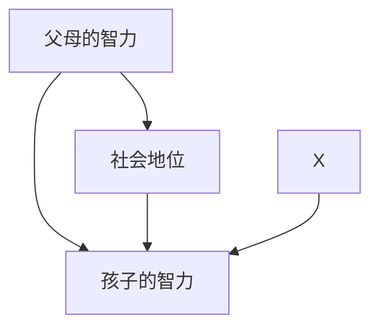
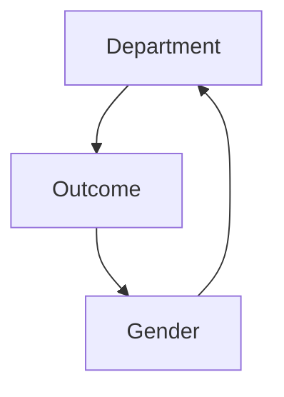
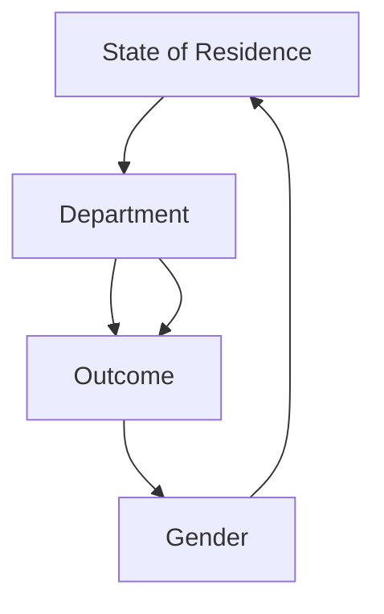
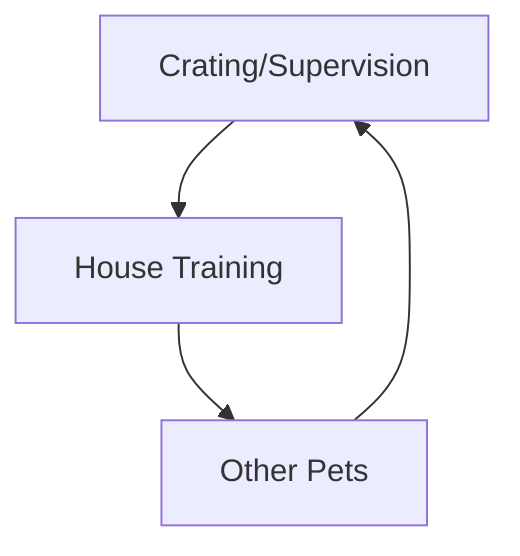
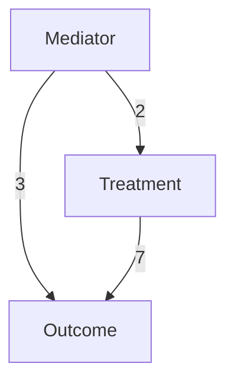
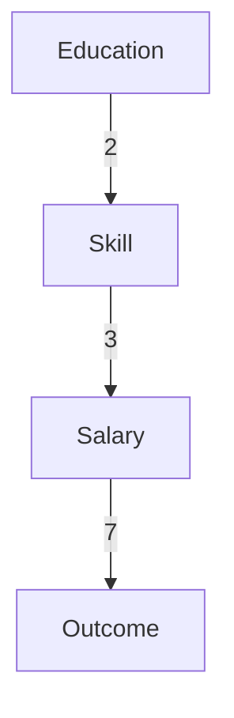
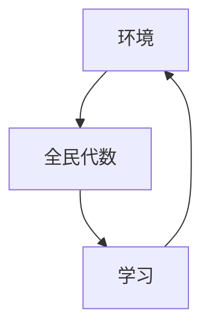
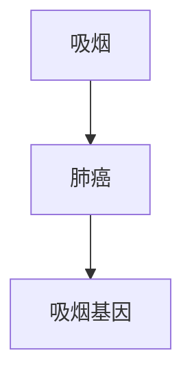
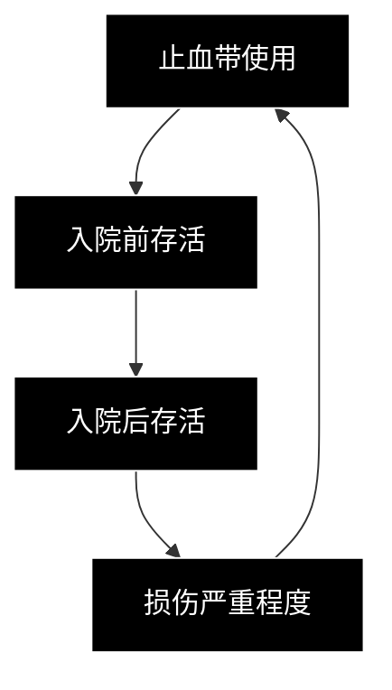

# 中介：寻找机制的过程（MEDIATION: THE SEARCH FOR A MECHANISM）

因缺一颗钉，丢了一只蹄铁；
因缺一只蹄铁，失了一匹马；
……
因缺一场战役，亡了一个王国；
而这一切，皆因缺了一颗钉。
——无名氏

在日常语言中，"为什么？"这个问题至少有两个版本。第一个版本很直接：你看到一个结果，想知道原因。你的祖父躺在医院里，你问："为什么？他看起来那么健康，怎么会心脏病发作？"

但"为什么？"还有第二个版本，当我们想更好地理解已知原因和已知结果之间的联系时会提出这个问题。例如，我们观察到药物B能预防心脏病。或者，像詹姆斯·林德（James Lind）那样，我们观察到柑橘类水果能预防坏血病。人类的心灵永不安分，总想知道更多。不久之后，我们开始问第二个版本的问题："为什么？柑橘类水果预防坏血病的机制是什么？"本章聚焦于"为什么"的这第二个版本。

寻找机制对科学和日常生活都至关重要，因为当环境变化时，不同的机制需要采取不同的行动。假设我们的橙子用完了。如果我们知道橙子起作用的机制，我们仍然可以预防坏血病。我们只需要另一种维生素C的来源。如果我们不知道这个机制，我们可能会尝试用香蕉来代替。

科学家用来指代"为什么"第二个问题的词是"中介（mediation）"。你可能会在期刊上看到这样的陈述："药物B对心脏病发作的影响是通过其对血压的影响来中介的。"这个陈述编码了一个简单的因果模型：药物 → 血压 → 心脏病发作。在这种情况下，药物降低高血压，进而降低心脏病发作的风险。（生物学家通常在原因A抑制效果B时使用不同的符号A—| B，但在因果关系文献中，通常使用A → B来表示积极和消极的原因。）同样，我们可以通过因果模型柑橘类水果 → 维生素C → 坏血病来总结柑橘类水果对坏血病的影响。

我们想对中介变量提出一些典型问题：它是否解释了全部效果？药物B是否完全通过血压起作用，还是也可能通过其他机制起作用？安慰剂效应是医学中常见的中介类型：如果一种药物仅通过患者对其益处的信念起作用，大多数医生会认为它无效。中介在法律中也是一个重要概念。如果我们问一家公司在支付较低工资时是否歧视女性，我们就是在问一个中介问题。答案取决于观察到的工资差异是直接因申请人的性别而产生，还是间接通过雇主无法控制的中介变量（如资质）而产生。

以上所有问题都需要一种敏锐的能力来区分总效应、直接效应（不通过中介变量）和间接效应（通过中介变量）。即使定义这些术语在过去一个世纪对科学家来说也是一项重大挑战。由于禁忌使用"因果"一词，一些人试图用无因果的词汇来定义中介。另一些人则完全否定中介分析，宣称直接效应和间接效应的概念"对清晰的统计思维而言，欺骗性大于帮助性"。

对我来说，中介也是一场斗争——最终成为我职业生涯中最有收获的经历之一，因为我最初是错误的，而在从错误中学习的过程中，我找到了一个意想不到的解决方案。有一段时间，我认为间接效应没有操作意义，因为与直接效应不同，它们无法用干预的语言来定义。当我意识到它们可以用反事实（counterfactuals）来定义，并且也可以具有重要的政策含义时，这是我个人的一个突破。它们只有在我们达到因果之梯（Ladder of Causation）的第三级后才能被量化，这就是为什么我把它们放在本书末尾的原因。中介在其新栖息地蓬勃发展，使我们能够（通常仅从原始数据中）量化由任何所需路径中介的效应比例。

可以理解的是，由于它们披着反事实的外衣，间接效应即使在因果革命（Causal Revolution）的拥护者中也仍然有些神秘。然而，我相信它们巨大的实用性最终将克服对反事实形而上学的任何挥之不去的疑虑。也许可以把它们比作无理数和虚数：它们最初让人感到不舒服（因此得名"无理数"），但最终它们的实用性将不适转化为愉悦。

为了说明这一点，我将给出几个例子，展示不同学科的研究人员如何从中介分析中获得有用的见解。一位研究人员研究了一项名为"全民代数"的教育改革，该改革最初似乎失败了，但后来却取得了成功。一项关于伊拉克和阿富汗战争中止血带使用的研究未能显示其有任何益处；仔细的中介分析解释了为什么益处可能在该研究中被掩盖了。

总之，在过去十五年中，因果革命发现了清晰而简单的规则，用于量化给定效应中多少是直接的、多少是间接的。它将中介从一个理解不足、合法性存疑的概念，转变为一种流行且广泛适用的科学分析工具。

## 坏血病：错误的中介（SCURVY: THE WRONG MEDIATOR）

我想从一个真正令人震惊的历史例子开始，它凸显了理解中介的重要性。

最早的控制实验例子之一是船长詹姆斯·林德（James Lind）于1747年发表的关于坏血病的研究。在林德的时代，坏血病是一种可怕的疾病，估计在1500年至1800年间导致200万水手死亡。林德以当时任何人所能达到的确凿程度证明，食用柑橘类水果可以防止水手患上这种可怕的疾病。到19世纪初，坏血病已成为英国海军的历史问题，因为所有船只出海时都携带了充足的柑橘类水果供应。历史书通常在此处结束故事，庆祝科学方法的伟大胜利。

然而，令人非常惊讶的是，这种完全可以预防的疾病在一个世纪后意外地卷土重来，当时英国探险队开始探索极地地区。1875年的英国北极探险队、1894年的杰克逊-哈姆斯沃斯北极探险队，以及最著名的罗伯特·法尔肯·斯科特（Robert Falcon Scott）1903年和1911年的两次南极探险队，都深受坏血病之苦。

这怎么可能发生？用两个词概括：**无知和傲慢**——这始终是一个强大的组合。到1900年，英国的主要医生已经忘记了一个世纪前的教训。斯科特1903年探险队的医生雷金纳德·克特尔利茨（Reginald Koettlitz）博士将坏血病归因于变质的肉类。此外，他还补充说，"所谓的'抗坏血病剂'（即坏血病预防剂，如酸橙汁）的益处是一种错觉。"在1911年的探险中，斯科特储备了经过严格检查有无腐烂迹象的干肉，但没有柑橘类水果或果汁（见图9.1）。他对医生意见的信任可能导致了随后发生的悲剧。到达南极的五人全部死亡，其中两人死于一种未明确的疾病，很可能是坏血病。一名队员在到达极点前折返并活着回来，但患有严重的坏血病。

事后看来，克特尔利茨的建议近乎犯罪性的医疗失当。詹姆斯·林德的教训怎么会在一个世纪后被如此彻底地遗忘——或者更糟，被摒弃？部分解释是，医生们并不真正理解柑橘类水果如何对抗坏血病。换句话说，他们不知道中介是什么。

> **图9.1.** 斯科特南极之旅队员的每日口粮：巧克力、肉糜饼（一种腌制肉制品）、糖、饼干、黄油、茶。明显缺失：任何含有维生素C的水果。（来源：Herbert Ponting摄影，由新西兰坎特伯雷博物馆提供。）

一张黑白照片，展示了摆放在桌子上的各种干燥和粉末状材料样本，包括一个圆柱形样本、堆叠的砖块和散茶叶（没有可见的文字或符号）

从林德时代起，人们一直相信（但从未证明）柑橘类水果因其酸性而预防坏血病。换句话说，医生们认为这个过程由以下因果图控制：

$$
\text{柑橘类水果} \rightarrow \text{酸性} \rightarrow \text{坏血病}
$$

从这个角度来看，任何酸都可以。即使是可口可乐也行（尽管当时尚未发明）。起初水手们使用西班牙柠檬；后来，出于经济原因，他们改用西印度酸橙，其酸度与西班牙柠檬相同，但维生素C含量只有其四分之一。更糟糕的是，他们开始通过煮沸来"纯化"酸橙汁，这可能破坏了其中仍然含有的任何维生素C。换句话说，他们正在使中介失效。

当1875年北极探险队的水手尽管服用了酸橙汁仍然患上坏血病时，医学界陷入了彻底的混乱。那些吃了新鲜宰杀肉的水手没有得坏血病，而吃了罐头肉的水手却得了。克特尔利茨和其他人将原因归咎于不当

## 天性对教养：芭芭拉·伯克斯的悲剧（NATURE VERSUS NURTURE: THE TRAGEDY OF BARBARA BURKS）

据我所知，第一个用图表明确表示中介变量的人是1926年斯坦福大学的一名研究生，名叫芭芭拉·伯克斯（Barbara Burks）。这位在女性科学领域鲜为人知的先驱是本书真正的英雄之一。有理由相信，她独立于休厄尔·赖特（Sewall Wright）发明了路径图。而在中介方面，她领先于赖特，领先于她的时代数十年。

伯克斯在她不幸短暂的研究生涯中，主要的研究兴趣是天性与教养在决定人类智力中的作用。她在斯坦福大学的导师是刘易斯·特曼（Lewis Terman），一位以开发斯坦福-比奈智商测试而闻名的心理学家，也是智力是遗传而非获得的坚定信徒。请记住，这是优生学运动的鼎盛时期，该运动现已声名狼藉，但在当时却因弗朗西斯·高尔顿（Francis Galton）、卡尔·皮尔逊（Karl Pearson）和特曼等人的积极研究而被合法化。

当然，天性与教养的争论非常古老，在伯克斯之后仍持续了很久。她独特的贡献是将这一争论归结为一个因果图（见图9.2），并用它来提出（并回答）问题："因果效应中有多少是由于直接路径*父母的智力 → 孩子的智力*（天性），又有多少是由于间接路径*父母的智力 → 社会地位 → 孩子的智力*（教养）？"

在这个图中，伯克斯使用了一些双箭头，要么表示相互因果关系，要么仅仅是对因果关系方向的不确定性。为简单起见，我们假设两个箭头的主要效应是从左到右，这使得社会地位成为一个中介变量，因此父母的智力提升了他们的社会地位，而这又反过来给了孩子发展其智力的更好机会。变量X代表"其他未测量的遥远原因"。

> **图9.2.** 芭芭拉·伯克斯框架下的天性与教养之争。

在她的论文中，伯克斯收集了来自204个有寄养儿童家庭的广泛家访数据，这些孩子从养父母那里可能只获得教养的好处，而得不到天性的好处（见图9.3）。她给所有这些孩子以及一个由105个无寄养儿童家庭组成的对照组进行了智商测试。此外，她还给他们发放了问卷，用以评估孩子社会环境的各个方面。利用她的数据和路径分析，她计算了父母智商对孩子智商的直接效应，发现只有35%（大约三分之一）的智商变异是遗传的。换句话说，智商高于平均水平15分的父母，其孩子通常高于平均水平5分。

> **图9.3.** 芭芭拉·伯克斯（右）对分离智力的"天性"和"教养"成分感兴趣。作为一名研究生，她走访了200多个寄养儿童的家庭，对他们进行智商测试，并收集了有关其社会环境的数据。她是除休厄尔·赖特之外第一个使用路径图的研究人员，并且在某些方面预见了赖特的工作。

> *一位女士和一个孩子坐在摆有玩具和公文包的桌子旁的插图，没有文字或符号。*

作为特曼的学生，伯克斯看到如此小的效应一定感到失望。（事实上，她的估计值随着时间的推移一直保持得很好。）因此，她对当时公认的分析方法——控制社会地位——提出了质疑。"如果我们使变量保持恒定，而这些变量可能部分或全部是由要测量真实关系的两个因素中的任何一个引起的，或者是由也影响这两个孤立因素中任何一个的其他未测量的遥远原因引起的，"她写道，"那么对原因对结果贡献的真实度量就被破坏了"（原文强调）。换句话说，如果你对父母的智力对孩子的智力的总效应感兴趣，你不应该调整（使其恒定）它们之间路径上的任何变量。

但伯克斯并未止步于此。她斜体强调的标准，用现代语言翻译过来就是：如果我们对以下变量进行条件设定，将会引入偏差：（a）是父母的智力或孩子的智力的效应变量，或者（b）是父母智力或孩子智力的未测量原因（如图9.2中的X）的效应变量。

这些标准远远领先于它们所处的时代，与休厄尔·赖特所写的任何内容都不同。事实上，标准（b）是**碰撞偏差（collider bias）**最早的例子之一。如果我们看图9.2，我们会看到社会地位是一个碰撞节点（*父母的智力 → 社会地位 ← X*）。因此，控制社会地位打开了后门路径*父母的智力 → 社会地位 ← X → 孩子的智力*。任何由此产生的间接效应和直接效应的估计都将是有偏的。由于伯克斯之前（和之后）的统计学家不按箭头和图表的思路思考，他们完全沉浸在一个神话中，即虽然简单相关没有因果含义，但控制相关（或偏回归系数，见第222页）是迈向因果解释的一步。

伯克斯不是第一个发现碰撞效应的人，但可以说她是第一个用图形术语对其进行一般性描述的人。她的标准（b）完全适用于第4章中M偏差的例子。这是有史以来第一次警告不要对处理前因素进行条件设定，这一习惯被所有20世纪的统计学家认为是安全的，奇怪的是，至今仍被一些人认为是安全的。

现在，请设身处地为芭芭拉·伯克斯着想。你刚刚发现你所有的同事都在对错误的变量进行控制。你有两个不利因素：你只是一个学生，而且你是一名女性。你会怎么做？你是低下头，假装接受传统观点，并用他们不充分的词汇与同事交流吗？

**芭芭拉·伯克斯可不会这样！** 她发表的第一篇论文的标题是"论偏相关和多重相关技术的不足"（On the Inadequacy of the Partial and Multiple Correlation Technique），并在开头写道："逻辑上的考虑导致这样的结论：偏相关和多重相关技术充满了严重限制其适用性的危险。"这是一个尚未获得博士学位的人的宣战言辞！正如特曼所写："她的能力在一定程度上被她容易得罪人的倾向所削弱。我认为问题部分在于，她比许多老师和男研究生所喜欢的更激进地捍卫自己的想法。"显然，伯克斯在不止一个方面领先于她的时代。

伯克斯可能确实独立于休厄尔·赖特发明了路径图，后者仅比她早六年。我们可以肯定地说，她不是在课堂上学会的。图9.2是休厄尔·赖特工作之外首次出现的路径图，也是社会科学或行为科学中的首次。诚然，她在1926年论文的最后对赖特表示了感谢，但她的致谢方式看起来像是最后一刻添加的。我直觉认为，她可能是在画完自己的图之后才发现赖特的图的，也许是在特曼或一位敏锐的审稿人透露之后才得知的。

令人着迷的是，如果伯克斯没有成为她那个时代的牺牲品，她可能会取得怎样的成就。获得博士学位后，她从未设法在大学获得教授职位，而她无疑是有资格担任的。她不得不满足于不太稳定的研究职位，例如在卡内基研究所。1942年她订婚了，人们本以为这标志着她命运的转折；然而，她却陷入了深深的抑郁。"我确信，不管对错，她确信自己大脑中正在发生某种邪恶的变化，她永远无法从中恢复，"她的母亲弗朗西斯·伯克斯（Frances Burks）写信给特曼。"因此，出于对我们所有人最温柔的爱，她选择让我们免于与她一起目睹如此悲剧性衰退的痛苦。"1943年5月25日，年仅40岁的她从纽约乔治·华盛顿大桥跳下身亡。

但思想有一种在悲剧中幸存下来的方式。当社会学家休伯特·布莱洛克（Hubert Blalock）和奥蒂斯·邓肯（Otis Duncan）在20世纪60年代复兴路径分析时，伯克斯的论文成为了他们灵感的源泉。邓肯解释说，他的一位导师威廉·菲尔丁·奥格本（William Fielding Ogburn）在1946年关于偏相关的讲座中简要提到了路径系数。"奥格本有一份赖特简短论文的报告，那篇论文涉及伯克斯的材料，我得到了这份重印本，"邓肯说。

所以，我们找到了！伯克斯1926年的论文引起了赖特对不当使用偏相关的兴趣。赖特的回应在20年后进入了奥格本的讲座，并植入了邓肯的头脑。又过了二十年，当邓肯读到布莱洛克关于路径图的著作时，这唤起了他学生时代这段半遗忘的记忆。这真是

## 寻找一种语言：伯克利招生悖论（IN SEARCH OF A LANGUAGE (THE BERKELEY ADMISSIONS PARADOX)）

尽管伯克斯早期做出了工作，半个世纪后，统计学家们甚至在表达直接效应和间接效应的概念上都很挣扎，更不用说估计它们了。一个很好的例子是一个著名的悖论，与辛普森悖论（Simpson's paradox）有关，但有所不同。

1973年，加州大学伯克利分校的副院长尤金·哈梅尔（Eugene Hammel）注意到该校男女录取率的一个令人担忧的趋势。他的数据显示，申请伯克利研究生院的男性中有**44%**被录取，而女性只有**35%**。性别歧视正引起公众的广泛关注，哈梅尔不想等待别人开始提问。他决定调查这种差异的原因。

与其它大学一样，伯克利的研究生录取决定是由各个院系而非整个大学做出的。因此，逐个院系查看录取数据以找出罪魁祸首是有道理的。但是，当他这样做时，哈梅尔发现了一个惊人的事实。一个又一个院系，录取决定始终对女性*更有利*。这怎么可能？

这时哈梅尔做了一件聪明的事：他打电话给一位统计学家。彼得·比克尔（Peter Bickel）被要求查看数据时，立即认出这是一种辛普森悖论的形式。正如我们在第6章中看到的，辛普森悖论指的是在总体的每一层中趋势似乎朝一个方向（在每个院系中女性录取率更高），但在整个总体中却朝相反方向（在整个大学中男性录取率更高）的现象。我们也在第6章中看到，正确解决悖论在很大程度上取决于你想要回答的问题。在这种情况下，问题很明确：**大学（或大学内的某人）是否歧视女性？**

当我第一次把这个例子告诉我的妻子时，她的反应是："这不可能。如果每个院系都朝一个方向歧视，学校不可能朝另一个方向歧视。"她说得对！这个悖论违背了我们对歧视的理解，歧视是一个因果概念，涉及对申请人报告性别的偏好性回应。如果所有行为者都偏好某一性别而非另一性别，那么作为一个整体的群体必须表现出同样的偏好。如果数据似乎相反，那一定意味着我们没有按照因果逻辑正确处理数据。只有借助这种逻辑，并有一个清晰的因果故事，我们才能确定大学是无辜还是有罪。

事实上，比克尔（Bickel）和哈梅尔（Hammel）找到了一个令他们完全满意的因果故事。他们撰写了一篇文章，发表于 1975 年的《科学》（*Science*）杂志，提出了一个简单的解释：**女性被拒绝的比例更高，是因为她们申请了更难被录取的院系。**

具体来说，申请人文与社会科学院系的女性比例高于男性。在那里，她们面临双重打击：申请入学的学生数量更多，而这些学生的名额却更少。另一方面，女性申请如机械工程这类更容易被录取的院系的频率较低。这些院系拥有更多的资金和更多的研究生名额——简而言之，录取率更高。

为什么女性会申请更难被录取的院系呢？也许是因为她们被劝阻申请技术领域，因为这些领域有更多的数学要求，或者被视为更加“男性化”。也许她们在教育的早期阶段就受到了歧视：正如芭芭拉·伯克斯（Barbara Burks）的故事所清楚表明的那样，社会倾向于将女性推离技术领域。但这些情况并非伯克利大学所能控制，因此不构成该大学的歧视。比克尔和哈梅尔得出结论：“整个校园并未对女性申请人进行歧视。”

至少顺便提一下，我想指出比克尔在这篇论文中语言的精确性。他仔细区分了两个在普通英语中常被视为同义词的术语：**“偏差（bias）”** 和 **“歧视（discrimination）”。**

> 他将 **偏差（bias）** 定义为“特定决定与特定性别申请人之间的一种关联模式。”请注意“模式”和“关联”这两个词。它们告诉我们，偏差是因果之梯（Ladder of Causation）第一级上的现象。

> 另一方面，他将 **歧视（discrimination）** 定义为“在申请人的性别与入学资格无关时，受其影响的决策行为。”像“决策行为”、“影响”和“无关”这样的词充满了因果关系的气息，即使比克尔在 1975 年还不敢说出那个词。与偏差不同，歧视属于因果之梯的第二级或第三级。

在他的分析中，比克尔认为数据应该按院系分层，因为院系是决策单位。这个判断正确吗？为了回答这个问题，我们首先绘制一个因果图（图 9.4）。查阅美国判例法中对歧视的定义也极具启发性。它使用了反事实术语，这是一个明确的信号，表明我们已经攀登到了因果之梯的第三级。

> 在 *Carson v. Bethlehem Steel Corp.*（1996）案中，第七巡回上诉法院写道：“任何雇佣歧视案件的核心问题是，如果雇员具有不同的种族（年龄、性别、宗教、国籍等），而其他一切情况保持不变，雇主是否会采取相同的行动。”

这个定义清晰地表达了这样一种观点：我们应该禁用或“冻结”所有从性别经由任何其他变量（例如，资格、院系选择等）通向录取结果的因果路径。换句话说，**歧视等于性别对录取结果的直接效应（direct effect）。**

> **图 9.4.** 伯克利录取悖论的因果图——简化版。

我们之前已经看到，如果我们想要估计一个变量对另一个变量的总效应（total effect），那么以中介变量（mediator）为条件是不正确的。但是，根据法院的观点，在歧视案件中，重要的不是总效应，而是直接效应。因此，比克尔和哈梅尔是正确的：在图 9.4 所示的假设下，他们按院系划分数据是正确的，并且他们的结果提供了性别对录取结果的直接效应的有效估计。尽管在 1973 年，比克尔还没有直接效应和间接效应（indirect effects）这些术语可用，但他们仍然取得了成功。

然而，这个故事最有趣的部分并非比克尔和哈梅尔最初撰写的论文，而是随之而来的讨论。他们的论文发表后，芝加哥大学的威廉·克鲁斯卡尔（William Kruskal）写信给比克尔，认为他们的解释并不能真正为伯克利开脱。事实上，克鲁斯卡尔质疑，任何纯粹的观察性研究（与随机实验相对——例如，使用虚假申请表）是否能够做到这一点。

对我来说，他们之间的通信令人着迷。我们很少有機會目睹两位伟大的思想家为一个他们缺乏恰当词汇的概念（因果关系）而苦苦挣扎。比克尔后来在 1984 年获得了麦克阿瑟基金会（MacArthur Foundation）的“天才”奖。但在 1975 年，他正处于职业生涯的初期，与克鲁斯卡尔——这位美国统计学界的巨擘——斗智斗勇，对他而言既是荣誉也是挑战。

在他写给比克尔的信中，克鲁斯卡尔指出，院系与录取结果之间的关系可能存在一个未测量的混杂因素（confounder），例如居住州。他为一个假设的大学设计了一个数值例子，该大学有两个存在性别歧视的院系，并且产生了与比克尔例子中完全相同的数据。他通过假设这两个院系都录取所有本州男性及外州女性，并拒绝所有外州男性及本州女性，且这是他们唯一的决策标准来实现这一点。显然，这种招生政策是一个明目张胆的、教科书式的歧视例子。但是，因为被录取和拒绝的每种性别的申请人总数与比克尔例子中的完全相同，所以比克尔将不得不得出结论认为不存在歧视。根据克鲁斯卡尔的观点，这些院系显得清白，是因为比克尔只控制了一个变量，而不是两个。

克鲁斯卡尔准确地指出了比克尔论文的弱点：缺乏一个明确合理的标准来确定应该控制哪些变量。克鲁斯卡尔没有提供解决方案，事实上，他的信中对能否找到解决方案感到绝望。

与克鲁斯卡尔不同，我们可以绘制一个图表并精确地看出问题所在。图 9.5 展示了代表克鲁斯卡尔反例的因果图。它看起来有点眼熟吗？应该如此！它和芭芭拉·伯克斯在 1926 年绘制的图表完全相同，只是变量不同。人们可能会说“英雄所见略同”，但也许更恰当的说法是，伟大的问题吸引伟大的头脑。

> **图 9.5.** 伯克利录取悖论的因果图——克鲁斯卡尔版本。

克鲁斯卡尔认为，在这种情况下，分析应该同时控制院系和居住州，查看图 9.5 就能解释原因。为了禁用除直接路径之外的所有路径，我们需要按院系进行分层。这关闭了性别 $\rightarrow$ 院系 $\rightarrow$ 录取结果这条间接路径。但这样做，我们却打开了性别 $\rightarrow$ 院系 $\leftarrow$ 居住州 $\rightarrow$ 录取结果这条虚假路径（spurious path），因为院系是一个对撞因子（collider）。如果我们同时控制居住州，我们就关闭了这条路径，因此任何剩余的相关性都必须归因于（歧视性的）直接路径性别 $\rightarrow$ 录取结果。由于缺乏图表，克鲁斯卡尔必须用数字来说服比克尔，事实上，他的数字也显示了同样的结果。如果我们不对任何变量进行调整，那么女性的录取率较低。如果我们按院系进行调整，那么女性似乎具有更高的录取率。如果我们同时调整院系和居住州，那么数字再次显示女性的录取率较低。

从这样的争论中，你可以理解为什么中介（mediation）这个概念（现在仍然）引起如此多的怀疑。它似乎不稳定且难以确定。首先是录取率偏向女性，然后是偏向男性，再然后是偏向女性。在他给克鲁斯卡尔的回信中，比克尔继续坚持认为，以决策单位（院系）为条件与以决策标准（居住州）为条件在某种程度上是不同的。但他对此听起来一点也不自信。他哀怨地问道：“我这里看到了一个非统计问题：我们所说的偏差是什么意思？”为什么偏差的符号会随着我们测量方式的不同而改变？事实上，当他区分偏差和歧视时，他就有正确的想法。偏差是一个滑动的统计概念，如果你以不同的方式切分数据，它可能会消失。而歧视作为一个因果概念，反映现实，必须保持稳定。

他们两人词汇中缺失的短语是“保持不变（hold constant）”。为了禁用从性别到录取结果的间接路径，我们必须保持院系变量不变，然后调整性别变量。当我们保持院系不变时，我们（形象地说）阻止了申请人选择申请哪个院系。因为统计学家没有表示这个概念的词，所以他们做了表面上相似的事情：他们以院系为条件（condition on Department）。这正是比克尔所做的：他逐个院系地查看数据，并得出结论认为没有证据表明存在针对女性的歧视。当院系和录取结果之间无混杂（unconfounded）时，这个程序是有效的；在这种情况下，观察等同于干预。但是克鲁斯卡尔正确地问道：“如果存在一个混杂因素，比如居住州，那该怎么办？”他可能没有意识到他正追随伯克斯的脚步，后者绘制了本质上相同的图表。

我无论如何强调都不为过，多年来这种错误被重复了多少次——以中介变量为条件，而不是保持中介变量不变。因此，我称之为 **中介谬误（Mediation Fallacy）**。诚然，如果中介变量和结果之间没有混杂，这个错误是无害的。但是，如果存在混杂，它可能会完全颠倒分析结果，正如克鲁斯卡尔的数值例子所示。它可能导致研究者得出结论认为不存在歧视，而事实上存在歧视。

伯克斯和克鲁斯卡尔在认识到中介谬误是一种错误方面是不同寻常的，尽管他们没有确切地提供解决方案。R. A. 费希尔（R. A. Fisher）在 1936 年也犯了同样的错误，八十年后，统计学家们仍在与这个问题作斗争。幸运的是，自费希尔时代以来，已经取得了巨大的进步。例如，流行病学家现在知道必须注意中介变量和结果之间的混杂因素。然而，那些回避图表语言的人（有些经济学家仍然如此）抱怨并承认，解释这个警告的含义是一种折磨。

值得庆幸的是，克鲁斯卡尔曾称之为“或许无法解决”的问题在二十年前就得到了解决。我有一种奇怪的感觉，克鲁斯卡尔会喜欢这个解决方案，在我的想象中，我向他展示了 do-演算（do-calculus）的力量和反事实的算法化。不幸的是，他于 1990 年退休，正是在 do-演算规则成形的时候，并于 2005 年去世。

我相信有些读者会好奇：伯克利案最终结果如何？答案是，没有结果。哈梅尔和比克尔确信伯克利无需担忧，事实上，从未出现过任何诉讼或联邦调查。数据暗示存在针对男性的反向歧视，事实上，有明确的证据表明这一点：“在大多数涉及女性优待的案例中，似乎招生委员会试图克服其领域内长期存在的女性短缺问题，”比克尔写道。仅仅三年后，一场关于加州大学另一个校园平权行动（affirmative action）的诉讼一直打到了最高法院。如果最高法院推翻了平权行动，那么这种“女性优待”可能会变得非法。然而，最高法院维持了平权行动，伯克利案便成为了历史上的一个注脚。

一个聪明人不会把最终决定权留给最高法院，而是留给他的妻子。为什么我的妻子会有如此强烈的直觉，坚信一所学校不可能在其每个院系都公平行事的同时进行歧视呢？这是因果演算的一个定理，类似于必赢原则（sure-thing principle）。正如吉米·萨维奇（Jimmie Savage）最初阐述的那样，必赢原则涉及总效应，而这个定理适用于直接效应。全局层面直接效应的定义恰恰依赖于汇总子群体中的直接效应。

简而言之，**局部公平处处成立意味着全局公平**。我的妻子是对的。

## 黛西、小猫与间接效应

到目前为止，我们已经以一种模糊和直觉的方式讨论了直接效应和间接效应的概念，但我还没有赋予它们精确的科学含义。现在是我们纠正这一疏漏的时候了，这早已是当务之急。

让我们从直接效应开始，因为它无疑更容易，我们可以使用 do-演算（即，在因果之梯的第二级）来定义它的一个版本。我们首先考虑最简单的情况，包括三个变量：处理变量 X、结果变量 Y 和中介变量 M。当我们“拨动” X 而不允许 M 改变时，我们得到 X 对 Y 的直接效应。在伯克利录取悖论的背景下，我们强迫每个人都申请历史系——也就是说，我们 `$do(M = 0)$`。我们随机分配一些人（在申请中）报告他们的性别为男性 `$(do(X = 1))$`，另一些报告为女性 `$(do(X = 0))$`，无论他们的实际性别如何。然后我们观察两个报告组之间录取率的差异。结果称为 **受控直接效应（controlled direct effect）**，或 **CDE(0)**。用符号表示：

$$
\begin{array}{r l}
\mathrm{CDE}(0) & = P(Y = 1 \mid do(X = 1)，do(M = 0)) - P(Y = 1 \mid do(X = 0)，do(M = 0))
\end{array}
\tag{9.1}
$$

CDE(0) 中的“0”表示我们强制中介变量取值为零。我们也可以做同样的实验，强迫每个人都申请工程系：`$do(M = 1)$`。我们将由此产生的受控直接效应记为 **CDE(1)**。

我们已经看到直接效应和总效应之间的一个区别：我们有两种不同版本的受控直接效应，CDE(0) 和 CDE(1)。哪一个是正确的？一种选择是同时报告这两个版本。事实上，一个院系歧视女性而另一个歧视男性并非不可想象，找出谁做了什么会很有趣。毕竟，这正是哈梅尔最初的意图。

然而，我不建议运行这个实验，原因如下。想象一个名叫乔的申请人，他一生的梦想是学习工程学，但他（随机）被分配申请历史系。我曾担任过几个招生委员会的成员，我可以肯定地断言，乔的申请在委员会看来会非常奇怪。他在电磁波课程上的 A+ 和欧洲民族主义课程上的 B– 会完全扭曲委员会的决定，无论他在申请表上勾选“男”还是“女”。在这种扭曲下被录取的男性和女性比例，几乎无法反映与正常申请历史系的学生相比的录取政策。

幸运的是，有一种替代方法可以避免这种过度控制实验的陷阱。我们指示申请人报告一个随机分配的性别，但申请他们原本偏好的院系。我们称之为 **自然直接效应（natural direct effect，NDE）**，因为每个申请人最终都会进入他或她自己选择的院系。“原本会”这个措辞是一个线索，表明 NDE 的形式定义需要反事实。对于喜欢数学的读者，这里是公式形式的定义：

$$
\mathrm{NDE} = P(Y_{\mathrm{M} = \mathrm{M}_{0}} = 1 \mid do(X = 1)) - P(Y_{\mathrm{M} = \mathrm{M}_{0}} = 1 \mid do(X = 0))
\tag{9.2}
$$

有趣的是第一项，它表示一名选择自己偏好院系 $(M = M_{0})$ 的女学生，如果她在性别上造假，填写为“男”（do(X = 1)），她被录取的概率。这里，院系的选择由实际性别决定，而录取由报告的（虚假的）性别决定。由于前者不能强制规定，我们无法将这一项转化为涉及 do-算子的项；我们需要援引反事实下标。

现在你知道了我们如何定义受控直接效应和自然直接效应，但我们如何计算它们呢？对于受控直接效应，任务很简单；因为它可以表示为 do-表达式，我们只需要使用 do-演算的法则将 do-表达式简化为 see-表达式（即，条件概率，可以从观测数据中估计）。

然而，自然直接效应提出了更大的挑战，因为它不能用 do-表达式定义。它需要反事实的语言，因此不能使用 do-演算来估计。当我成功地从 NDE 的公式中剥离出所有反事实下标时，那是我一生中最激动人心的时刻之一。其结果被称为 **中介公式（Mediation Formula）**，它使 NDE 成为一种真正实用的工具，因为我们可以从观测数据中估计它。

与直接效应不同，间接效应没有“受控”版本，因为无法通过保持某个变量不变来禁用直接路径。但它们确实有一个“自然”版本，即 **自然间接效应（natural indirect effect，NIE）**，它（像 NDE 一样）使用反事实来定义。为了激发这个定义，我将考虑我的合著者提出的一个有点好玩的例子。

> 我的合著者和他的妻子收养了一只名叫黛西的狗，一只活泼好动的贵宾犬和吉娃娃混种，很有主见。黛西不像他们以前的狗那样容易进行室内训练，几周后，她仍然偶尔在屋内“出事故”。但随后发生了一件非常奇怪的事情。达纳和他的妻子从动物收容所带回了三只寄养的小猫，然后“事故”就停止了。寄养的小猫和他们一起待了三周，在此期间，黛西一次也没有违反她的训练。
>
> 这仅仅是巧合，还是小猫以某种方式激发了黛西的文明行为？达纳的妻子认为，小猫可能给了黛西一种属于“群体”的感觉，她不想弄脏群体生活的地方。这个理论得到了加强，因为在小猫被送回收容所几天后，黛西又开始在屋子里小便，好像她从未听说过良好的礼仪。
>
> 但随后达纳想到，在小猫到来和离开时，还有其他事情发生了变化。当小猫在那里时，黛西要么必须与它们分开，要么被仔细看管。所以她长时间待在板条箱里，或者被人密切监视，甚至被人用皮带拴着。碰巧，这两种干预措施——关板条箱和拴皮带——也是公认的室内训练方法。
>
> 当小猫离开后，麦肯齐一家停止了强化监督，粗鲁的行为又回来了。达纳假设，小猫的影响不是直接的（如群体理论所述），而是间接的，由关板条箱和监督所中介。图 9.6 显示了一个因果图。此时，达纳和他的妻子尝试了一个实验。他们像有小猫在身边时那样对待黛西，让她待在板条箱里，并在板条箱外仔细监督她。如果事故停止了，他们可以合理地得出结论，中介变量是原因。如果没有停止，那么直接效应（群体心理）就变得更加可信。

> 图 9.6. 黛西家庭训练的因果图。

在科学证据的层级中，他们的实验被认为是非常不可靠的——当然不可能发表在科学期刊上。真正的实验应该不止在一只狗身上进行，并且需要在有小猫和没有小猫的情况下分别进行。尽管如此，我们这里关心的是实验背后的因果逻辑。我们试图重现这样的情景：如果小猫不在场，而中介变量被设定为小猫在场时的值，会发生什么。换句话说，我们移除小猫（第一次干预），并像小猫在场时那样监督狗（第二次干预）。

当你仔细阅读以上段落时，你可能会注意到两个“将会是”，它们都是反事实条件。当狗改变行为时，小猫是在场的——但我们问的是，如果小猫不在场会发生什么。同样地，如果小猫不在场，达纳就不会监督黛西——但我们问的是，如果他监督了会发生什么。

你可以理解为什么统计学家们花了这么长时间来定义间接效应。如果单个反事实已经够离谱了，那么双重嵌套的反事实则完全超出了可接受的范围。然而，这个定义与我们关于因果关系的自然直觉非常吻合。我们的直觉如此强烈，以至于没有受过特殊训练的达纳的妻子也立刻理解了所提议实验的逻辑。

对于熟悉公式的读者，以下是我们刚刚用语言描述的自然间接效应（NIE）的定义：

$$
\mathrm{NIE} = P (Y _ {\mathrm{M} = \mathrm{M} _ {1}} = 1 \mid d o (X = 0)) - P (Y _ {M = \mathrm{M} _ {0}} = 1 \mid d o (X = 0)) \tag {9.3}
$$

第一个 $P$ 项是黛西实验的结果：假设我们没有引入其他宠物 $(X = 0)$，但将中介变量设定为如果我们引入它们时会取的值 $(M = M _ { 1 })$，成功进行家庭训练的概率 $( Y = 1 )$。我们将此与“正常”条件下（没有其他宠物）成功进行家庭训练的概率进行对比。注意，反事实 $M _ { 1 }$ 需要针对每只动物逐个计算：不同的狗可能对板条箱/监督有不同的需求。这使得间接效应超出了 do 演算的能力范围。这也可能使实验不可行，因为实验者可能不知道特定狗 $u$ 的 $M _ { 1 } ( u )$。尽管如此，假设 $M$ 和 $Y$ 之间没有混杂，自然间接效应仍然可以计算。

可以从 NIE 中移除所有反事实，并得出一个类似于自然直接效应（NDE）的中介公式。这个需要因果之梯第三层信息的量，可以被简化为一个使用第一层数据即可计算的表达式。这种简化之所以可能，是因为我们假设没有混杂，而由于结构因果模型中方程的确定性，这个假设位于第三层。

为了结束黛西的故事，这个实验并没有得出定论。达纳和他的妻子是否像为了防止黛西接近小猫时那样仔细地监督她，这一点值得怀疑（因此 $M$ 是否真的被设定为 $M _ { 1 }$ 并不清楚）。经过几个月的耐心和时间，黛西最终学会了在外面“解决她的问题”。即便如此，黛西的故事仍然提供了一些有用的教训。仅仅通过意识到中介变量的可能性，达纳就能够推测出另一种因果机制。这个机制带来了一个重要的实际后果：他和妻子不必在黛西的余生中让家里一直充满寄养的小猫“群”。

# 线性仙境中的中介分析（Mediation in Linear Wonderland）

当你第一次听到反事实时，你可能会想，是否真的需要如此精巧的机制来表达一个间接效应。你可能会争辩说，间接效应无非就是除去直接效应后剩下的部分。或者，我们可以写成：

$$
\text{总效应} = \text{直接效应} + \text{间接效应} \tag{9.4}
$$

简短的回答是，这在涉及交互作用（有时称为调节作用）的模型中并不成立。例如，想象一种药物，它能使身体分泌一种充当催化剂的酶：这种酶与药物结合以治愈疾病。药物的总效应当然是正的。但直接效应为零，因为如果我们禁用中介变量（例如，通过阻止身体刺激该酶），药物将不起作用。间接效应也为零，因为如果我们不接受药物而人为地获得这种酶，疾病也不会被治愈。这种酶本身没有治愈能力。因此，方程 9.4 不成立：总效应是正的，但直接效应和间接效应都是零。

然而，方程 9.4 在一种情况下会自动成立，显然无需援引反事实。那就是我们在第 8 章中看到的那种**线性因果模型（linear causal model）**的情况。正如那里所讨论的，线性模型不允许交互作用，这既可能是优点也可能是缺点。从某种意义上说，这是一个优点，因为它使中介分析变得容易得多，但如果我们想描述一个确实涉及交互作用的现实世界因果过程，这又是一个缺点。

因为对于线性模型来说，**中介分析（mediation analysis）**要容易得多，让我们看看它是如何完成的，以及陷阱在哪里。假设我们有一个如图 9.7 所示的因果图。因为我们处理的是一个线性模型，我们可以用单一数字来表示每个效应的强度。这些标签（路径系数）表明，将 **处理（Treatment）** 变量增加一个单位会使 **中介变量（Mediator）** 增加两个单位。类似地，中介变量增加一个单位会使 **结果（Outcome）** 增加三个单位，而处理变量增加一个单位会使结果增加七个单位。这些都是 *直接效应*。

这里我们来到线性模型如此简单的第一个原因：**直接效应不依赖于中介变量的水平**。也就是说，受控直接效应 CDE(m) 对于所有值 m 都是相同的，我们可以简单地谈论“这个”直接效应。

导致处理变量增加一个单位的干预的总效应会是多少？首先，这种干预直接导致结果增加七个单位（如果我们保持中介变量不变）。它还会导致中介变量增加两个单位。最后，因为中介变量每增加一个单位直接导致结果增加三个单位，所以中介变量增加两个单位将导致结果额外增加六个单位。因此，来自两条因果路径的结果净增加将是十三个单位。前七个单位对应于直接效应，剩下的六个单位对应于间接效应。**简直易如反掌！**

> **图 9.7.** 一个带有中介的线性模型（路径图）示例。

一般来说，如果从 X 到 Y 存在不止一条间接路径，我们通过将沿着该路径的所有路径系数相乘来评估每条路径上的间接效应。然后，我们通过将所有间接因果路径相加来得到总间接效应。最后，X 对 Y 的总效应是直接效应和间接效应的总和。这个“乘积之和”规则自 **休厄尔·赖特（Sewall Wright）** 发明路径分析以来就一直被使用，并且，形式上来说，它确实遵循了总效应的 do-算子定义。

1986 年，**鲁本·巴伦（Reuben Baron）** 和 **大卫·肯尼（David Kenny）** 阐述了一套用于在方程组中检测和评估中介效应的原则。基本的原则是，首先，变量都通过线性方程相关联，这些方程通过拟合数据来估计。其次，直接效应和间接效应通过拟合两个方程来计算：一个包含中介变量，另一个排除中介变量。当中介变量被引入时，系数发生显著变化被视为中介效应的证据。

巴伦-肯尼方法的简单性和合理性在社会科学界引起了轰动。截至 2014 年，他们的文章在有史以来被引用次数最多的科学论文列表中排名第三十三位。截至 2017 年，谷歌学术报告称有 73,000 篇学术文章引用了巴伦和肯尼。**想想看！** 他们被引用的次数超过了阿尔伯特·爱因斯坦，超过了西格蒙德·弗洛伊德，几乎超过了你所能想到的任何其他著名科学家。他们的文章在心理学和精神病学所有论文中排名第二，然而它根本与心理学无关。它是关于*非因果中介*的。

巴伦-肯尼方法前所未有的流行无疑源于两个因素：
- 首先，对中介分析的需求很高。我们理解“自然如何运作”（即，找到 $X \to M \to Y$ 中的 M）的愿望可能甚至比我们量化它的愿望更强烈。
- 其次，该方法很容易简化为一个基于统计学中熟悉概念的“菜谱式”程序，而统计学这门学科长期以来一直声称拥有客观性和经验有效性的独家所有权。

因此，几乎没有人注意到其中涉及的重大飞跃，即一个因果量（中介）是通过纯粹的统计手段来定义和评估的。

然而，这个基于回归的大厦的裂缝在 21 世纪初开始显现，当时实践者试图将乘积之和规则推广到非线性系统。该规则涉及两个假设——不同路径上的效应是可加的，并且一条路径上的路径系数相乘——而这两个假设在非线性模型中都会导致错误的答案，我们将在下面看到。

这花了很长时间，但中介分析的实践者终于醒悟了。2001 年，我已故的朋友兼同事 **罗德·麦克唐纳（Rod McDonald）** 写道：“我认为讨论在回归中检测或显示调节或中介效应的最佳方法是搁置关于这些主题的整个文献，从头开始。”关于中介的最新文献似乎听从了麦克唐纳的建议；反事实和图解方法比回归方法得到更积极的研究。而在 2014 年，巴伦-肯尼方法的创始人之一大卫·肯尼在他的网站上发布了一个名为“因果中介分析”的新版块。虽然我还不至于称他为皈依者，但肯尼清楚地认识到时代在变化，中介分析正在进入一个新时代。

现在，让我们看一个非常简单的例子，说明当我们离开线性仙境时，我们的预期会如何出错。考虑图 9.8，它是图 9.7 的一个微小修改，其中一位求职者只有在提供的薪水超过某个阈值（在我们的例子中是十）时才会决定接受这份工作。如图中所示，提供的薪水由 $7 \times \text{教育} + 3 \times \text{技能}$ 决定。请注意，决定 **技能（Skill）** 和 **薪水（Salary）** 的函数仍然被假定为线性的，但薪水与结果的关系是非线性的，因为它有一个阈值效应。

让我们计算在这个模型中，将 **教育（Education）** 增加一个单位相关的总效应、直接效应和间接效应。总效应显然等于一，因为当教育从零变为一时，薪水从零变为 $(7 \times 1) + (3 \times 2) = 13$，这超过了十的阈值，使得结果从零变为一。

请记住，**自然间接效应（Natural Indirect Effect, NIE）** 是结果中的预期变化，假设我们对教育不做任何改变，但将技能设定为如果我们增加了一个单位教育后它将会达到的水平。很容易看出，在这种情况下，薪水从零变为 $2 \times 3 = 6$。这低于十的阈值，因此求职者会拒绝这个报价。因此 NIE = 0。

> **图 9.8.** 结合了阈值效应的中介。

那么直接效应呢？如前所述，我们面临确定将中介变量保持在哪个值的问题。如果我们保持技能在我们改变教育之前的水平，那么薪水将从零增加到七，使得结果 = 0。因此，CDE(0) = 0。

另一方面，如果我们保持技能在改变教育后达到的水平（即二），薪水将从六增加到十三。这将使结果从零变为一，因为十三高于求职者接受工作邀请的阈值。所以 CDE(2) = 1。

因此，直接效应要么是零要么是一，取决于我们为中介变量选择的常数值。与线性仙境不同，为中介变量选择的值会产生影响，我们面临一个两难境地。如果我们想要保持可加性原则，即总效应 = 直接效应 + 间接效应，我们需要使用 CDE(2) 作为我们对因果效应的定义。但这似乎是任意的，甚至有点不自然。

如果我们正在考虑教育的变化，并且想知道它的直接效应，我们很可能希望将技能保持在其已有的水平。换句话说，使用 CDE(0) 作为我们的直接效应在直觉上更有意义。不仅如此，这与本例中的自然直接效应一致。但这样我们就失去了可加性：总效应 ≠ 直接效应 + 间接效应。

然而——相当令人惊讶的是——一个稍微修改过的可加性版本确实成立，不仅在这个例子中，而且在一般情况下。不介意做一些计算的读者可能会感兴趣计算从 X = 1 回到 X = 0 的 NIE。在这种情况下，薪水报价从十三下降到七，结果从一下降到零（即，求职者不接受这个报价）。因此，按反向计算，NIE = –1。酷且令人惊奇的事实是：

$$
\text{总效应 (X = 0 \rightarrow X = 1) = NDE (X = 0 \rightarrow X = 1) - NIE (X = 1 \rightarrow X = 0)}
$$

或者在这个例子中，1 = 0–(–1)。这是可加性原则的“自然效应”版本，只不过它是一个“可减性原则”！看到这个可加性版本从分析中涌现出来，尽管方程是非线性的，我感到非常高兴。

关于将直接效应和间接效应从线性模型推广到非线性模型的“正确”方法，已经有大量的笔墨被浪费了。不幸的是，大多数文章都是倒退着处理这个问题。它们没有从头重新思考我们所说的直接效应和间接效应是什么意思，而是从这样一个假设开始：我们只需要对线性定义稍作调整。例如，在线性仙境中，我们看到间接效应由两个路径系数的乘积给出。因此，一些研究人员试图以两个量的乘积形式来定义间接效应，一个量测量 X 对 M 的效应，另一个量测量 M 对 Y 的效应。这被称为“系数乘积”法。但我们也看到，在线性仙境中，间接效应由总效应和直接效应之差给出。因此，另一个同样专注的研究小组将间接效应定义为两个量的差，一个量测量总效应，另一个量测量直接效应。这被称为“系数差异”法。

哪一个是对的？都不是！这两组研究人员都混淆了过程与含义。过程是数学性的；含义是因果性的。事实上，问题甚至更深：对于线性模型泡沫之外的回归分析师来说，间接效应从来就没有过含义。间接效应的唯一含义是作为一个代数过程（“乘以路径系数”）的结果。一旦这个过程被从他们手中夺走，他们就像一艘没有锚的船一样随波逐流。

我的一本书《因果论》的一位读者在给我的信中优美地描述了这种迷失感。**梅兰妮·沃尔（Melanie Wall）**，现在哥伦比亚大学，曾经给生物统计学和公共卫生专业的学生教授建模课程。有一次，她像往常一样向学生解释如何通过直接路径系数的乘积来计算间接效应。一个学生问她间接效应是什么意思。“我给出了我一直给出的答案，即间接效应是 X 的变化通过其与中介变量 Z 的关系对 Y 产生的影响，”沃尔告诉我。

但那个学生很执着。他记得老师是如何将直接效应解释为固定中介变量后剩下的效应，他问道：“那么，当我们解释间接效应时，什么被保持恒定呢？”

沃尔不知道该说什么。“我不确定我能否给你一个好的答案，”她说。“我回头再回答你，好吗？”

那是在 2001 年 10 月，距离我在西雅图举行的“人工智能中的不确定性”会议上发表关于因果中介的论文仅仅四个月。不用说，我渴望用我新获得的解决她难题的方案给梅兰妮留下深刻印象，于是我写信给她，给了她我在这里给你的同样答案：“X 对 Y 的间接效应是，在保持 X 不变并将 M 增加到 X 增加一个单位时 M 将会达到的任意值时，我们在 Y 中会看到的那种增加。”

我不确定梅兰妮是否对我的回答印象深刻，但她那个好问的学生让我非常认真地思考了在我们这个时代科学是如何进步的。我想，在布拉洛克和邓肯将路径分析引入社会科学四十年后的今天，我们落到了这个地步。每年都有数十本教科书和数百篇研究论文发表关于直接效应和间接效应的内容，其中一些标题自相矛盾，比如“基于回归的中介方法”。每一代人都将公认的智慧传递给下一代，即间接效应只是其他两个效应的乘积，或者是总效应与直接效应之差。没有人敢问这个简单的问题：“但是间接效应首先意味着什么呢？”就像汉斯·克里斯蒂安·安徒生寓言《皇帝的新装》中的那个男孩一样，我们需要一个天真无邪、厚脸皮的学生来粉碎我们对科学共识预言角色的信念。

在这一点上，我应该讲述我自己的转变故事，因为相当长一段时间里，我也被困扰梅兰妮·沃尔学生的同一个问题所难住。

我在第 4 章中写到过 **杰米·罗宾斯（Jamie Robins）**（图 9.9），他是哈佛大学一位开创性的统计学家和流行病学家，与加州大学洛杉矶分校的 **桑德·格陵兰（Sander Greenland）** 一起，对当今流行病学中图形模型的广泛采用负有主要责任。我们从 1993 年到 1995 年合作了几年，他让我思考序列干预计划的问题，这是他的主要研究兴趣之一。

> **图 9.9.** 杰米·罗宾斯，流行病学因果推断的先驱。（来源：Kris Snibbe 摄影，由哈佛大学摄影服务部提供。）

# 排版优化后的 Markdown 内容

\[
u_n = \frac{1}{n(n)} \sum_{r \neq s} y_r u_s x_s (x_r, x_s) \mathbf{1}_{x_r, x_s} + \frac{n}{n(n)} \sum_{r \neq s} (y_r e_i (x_r) - \hat{\omega}_i) (y_s e_i)
\]

\[
+ \frac{n}{n(n)} \sum_{r \neq s} \sum_{i} (y_r e_i (x_i) - \hat{\omega}_i) \hat{\omega}_i (s_i)
+ C(I, I_1) \hat{\omega}_i (I_2) = E(y_r)
\]

\[
v_0 (v_1, v_2, I_n) = \frac{1}{n(n)} \sum_{r \neq s} v_0 (v_1, v_2) + v_1
\]

\[
v_1, v_2 = v_0 \left[ \sum_{r} (y_r e_i (x_i) - \hat{\omega}_i (I_1)) (\theta_1, \theta_2) \right] = \sum_{r} E[(y_r e_i (x_i) - \hat{\omega}_i (I_1))(A_i, A_2)]
\]

\[
E(\theta_1^2, e_i(x_i), e_j(x_i) \mid I_1)
\]

\[
\frac{f(x_i^2 e_i^2)}{P_{an}(I)} T_{sup}(e_i)^3 c_{bn}(I_2)^3
\]

> **批注**：此处原公式中存在符号混淆与不完整表达式，已尽量保持语义并修正 LaTeX 格式。

多年前，作为职业健康与安全领域的专家，**罗宾斯（Robins）**曾被要求出庭作证，评估工作场所的化学暴露是否可能导致一名工人死亡。他沮丧地发现，统计学家和流行病学家缺乏回答此类问题的工具。那仍是一个**因果语言（causal language）**在统计学中被视为禁忌的时代。只有在**随机对照试验（randomized controlled trial）**中才允许使用因果语言，而由于伦理原因，人们永远无法对甲醛暴露的影响进行此类试验。

通常，工厂工人并非一次性暴露于有害化学物质，而是长期暴露。因此，罗宾斯对随时间变化的暴露或治疗产生了浓厚兴趣。此类暴露也可能是有益的：例如，**艾滋病（AIDS）**治疗会持续多年，并根据患者的**CD4计数（CD4 count）**反应采取不同的行动计划。当治疗可能分多个阶段进行，且中间变量（你可能想用作控制变量）依赖于早期治疗阶段时，你如何梳理出治疗的因果效应？这已成为罗宾斯职业生涯中的关键问题之一。

在杰米（Jamie）听说“餐巾纸问题”（第7章）后飞往加州与我见面时，他对将**图方法（graphical methods）**应用于他擅长的序贯治疗方案产生了浓厚兴趣。我们共同提出了一个用于估计此类治疗流因果效应的**序贯后门准则（sequential back-door criterion）**。我从这次合作中学到了一些重要的教训。特别是，他向我展示了，有时分析两个行动比分析一个行动更容易，因为一个行动对应于在图中擦除箭头，从而使图变得稀疏。

我们的后门准则处理的是由任意大数量的 **do-操作（do-operations）** 组成的长期治疗。但即使是两个操作也会产生一些有趣的数学结果——包括**受控直接效应（controlled direct effect）**，它由一个“摆动”治疗变量值的行动和另一个固定中介变量值的行动组成。更重要的是，用 do-操作来定义直接效应的想法，将其从**线性模型（linear models）**的束缚中解放出来，并将其植根于**因果演算（causal calculus）**之中。

但我真正对中介分析产生兴趣是在后来，当我发现人们仍在犯基本错误时，例如前面提到的**中介谬误（Mediation Fallacy）**。同样让我沮丧的是，基于行动的直接效应定义无法扩展到间接效应。正如梅兰妮·沃尔（Melanie Wall）的学生所说，我们没有任何变量或变量集可以干预，以禁用直接路径并让间接路径保持活跃。因此，在我看来，间接效应就像是凭空想象出来的东西，除了提醒我们总效应可能与直接效应不同之外，缺乏独立的意义。我甚至在《因果论》（*Causality*）第一版（2000年）中这样说过。**这是我职业生涯中三大错误之一。**

回顾过去，我被 do-演算的成功所蒙蔽，这让我相信禁用因果路径的唯一方法就是取一个变量并将其设置为某个特定值。但事实并非如此；如果我有一个因果模型，我可以通过规定谁听谁的、何时听以及如何听，以许多创造性的方式对其进行操作。特别是，我可以固定主要变量以抑制其直接效应，同时假设性地且同步地激活主要变量，以使其效应通过中介变量传递。这使我能够将治疗变量（例如，小猫）设置为零，并将中介变量设置为如果我将小猫设为一它本应具有的值。然后，我对数据生成过程的模型会告诉我如何计算这种分裂干预的效应。

我感谢第一版的一位读者，**雅克·哈格纳斯（Jacques Hagenaars）**（《分类纵向数据》（*Categorical Longitudinal Data*）的作者），他敦促我不要放弃间接效应。“社会科学中的许多专家在输入和输出上达成一致，但在机制上却存在分歧，”他写信给我。但在上一节我写到的那个困境上，我停滞了将近两年：我如何才能禁用直接效应？

所有这些挣扎突然得到了解决，几乎像是神启一般，当我读到本章前面引用的关于歧视的法律定义时：“如果雇员属于不同种族……且其他一切条件相同。” 我们找到了——问题的关键！这是一个假设的游戏。我们根据每个个体自身的特质来对待他们，并保持个体在治疗变量改变之前的所有特征不变。

这如何解决我们的困境？首先，这意味着我们必须重新定义直接效应和间接效应。对于直接效应，我们让中介变量为每个个体选择其在没有治疗的情况下本应具有的值，并将其固定在那里。然后我们摆动治疗变量并记录差异。这不同于我之前讨论的**受控直接效应（controlled direct effect）**，后者将中介变量固定为所有人的一个值。因为我们让中介变量选择其“自然”值，所以我将其称为**自然直接效应（natural direct effect）**。类似地，对于**自然间接效应（natural indirect effect）**，我首先拒绝所有人的治疗，然后让中介变量为每个个体选择其在有治疗的情况下本应具有的值。最后我记录差异。

我不知道歧视定义中的法律措辞是否会以同样的方式打动您或其他人。但到2000年，我已经能像母语者一样使用**反事实（counterfactuals）**了。学会了如何在因果模型中解读它们后，我意识到它们不过是通过对方程或图进行简单操作计算出的量。因此，它们随时可以被封装成一个数学公式。我所要做的就是拥抱那些“本应如此”。

一瞬间，我意识到每一个直接和间接效应都可以转化为一个反事实表达式。一旦我明白了如何做到这一点，推导出一个公式就变得轻而易举，该公式告诉你如何从数据中估计自然直接效应和间接效应，以及何时允许这样做。重要的是，该公式不对 $X$、$M$ 和 $Y$ 之间关系的具体函数形式做任何假设。**我们已经逃离了线性仙境（Linear Wonderland）。**

我将这个新规则称为**中介公式（Mediation Formula）**，尽管实际上有两个公式，一个用于自然直接效应，一个用于自然间接效应。在图中明确展示的透明假设下，它告诉你如何从数据中估计它们。例如，在图9.4所示的情况下，任何变量之间都不存在混杂，且 $M$ 是治疗变量 $X$ 和结果变量 $Y$ 之间的中介变量：

$$
\begin{array}{r l} 
\mathrm{NIE} & = \Sigma_ {\mathrm{m}} [ P (M = m \mid X = 1) - P (M = m \mid X = 0) ] \times P (Y = 1 \mid X = 0, M = m) 
\end{array} \tag{9.5}
$$

这个公式的解释很有启发性。括号中的表达式表示 $X$ 对 $M$ 的效应，后面的表达式表示 $M$ 对 $Y$ 的效应（当 $X = 0$ 时）。因此，它揭示了系数乘积思想的来源，表现为两个非线性效应的乘积。还要注意，与方程9.3不同，方程9.5没有下标，也没有 do-算子，因此可以从第一层（rung-one）数据中估计。

无论你是实验室里的科学家，还是骑自行车的小孩，当你发现今天能做昨天做不到的事情时，总会感到兴奋。这就是中介公式首次出现在纸上时我的感受。我一眼就能看出关于直接和间接效应的一切：需要什么才能使它们变大或变小，何时我们可以从观察性或干预性数据中估计它们，以及何时我们可以认为某个中介变量对将观察到的变化传递到结果变量“负责”。

因果关系可以是线性的或非线性的，数值的或逻辑的。以前，如果要讨论这些情况，每种情况都必须以不同的方式处理。现在，一个单一的公式适用于所有情况。只要有正确的数据和正确的模型，我们就能确定雇主是否犯有歧视罪，或者哪些混杂因素会阻止我们做出这一判断。从芭芭拉·伯克斯（Barbara Burks）的数据中，我们可以估计孩子的智商有多少来自遗传，多少来自环境。我们甚至可以计算由中介解释的总效应百分比和归因于中介的总效应百分比——在线性模型中，这两个互补的概念会合二为一。

在我写下直接和间接效应的反事实定义后，我得知我并非第一个想到这个主意的人。罗宾斯和**格陵兰（Greenland）**早在1992年就比我更早想到了。但他们的论文用文字描述了自然效应的概念，而没有将其写成数学公式。

> 更严重的是，他们对自然效应的整个想法持悲观态度，并声称此类效应无法从实验研究中估计，当然也无法从观察性研究中估计。这一说法阻止了其他研究人员看到自然效应的潜力。很难说如果罗宾斯和格陵兰迈出额外的一步，用反事实语言将自然效应表达为一个公式，他们是否会转向更乐观的观点。对我来说，这额外的一步至关重要。

他们悲观的态度可能还有另一个原因，我不同意但会尝试解释。他们审视了自然效应的反事实定义，发现它结合了两个不同世界的信息：一个世界你将治疗变量固定为零，另一个世界你将中介变量改变为如果将治疗变量设为一它本应具有的值。由于你无法在任何实验中复制这种“跨世界”条件，他们认为这是不可行的。

这是他们学派和我学派之间的哲学分歧。他们认为因果推断的合法性在于尽可能接近地复制随机实验，并假设这是通往科学真理的唯一途径。我相信可能存在其他途径，其合法性来源于数据与已建立（或假设）的科学知识的结合。为此，可能存在比随机实验更强大的方法，这些方法基于第三层（rung-three）假设，并且我会毫不犹豫地使用它们。

在他们给研究人员亮红灯的地方，我给他们亮了绿灯，那就是中介公式：如果你对这些假设感到满意，这就是你能做的！不幸的是，罗宾斯和格陵兰的红灯使中介分析领域停滞了整整九年。

许多人觉得公式令人生畏，认为它们是隐藏而非揭示信息的方式。但对于数学家，或受过数学思维方式充分训练的人来说，情况恰恰相反。一个公式揭示了一切：它不留任何疑问或模糊之处。在阅读科学文章时，我经常发现自己从一个公式跳到另一个公式，完全跳过文字。对我来说，公式是成品的思想，而文字则是正在烘烤的思想。

公式有两个目的，一个实用，一个社会。从实用的角度来看，学生或同事可以像阅读食谱一样阅读它。食谱可能简单或复杂，但最终它承诺，如果你遵循步骤，你就会知道自然直接和间接效应——当然，前提是你的因果模型准确反映了现实世界。

第二个目的更为微妙。我在以色列有一位朋友，是著名的艺术家。我去他的工作室想买他的一幅画，他的画布到处都是——床底下有上百幅，厨房里有几十幅。每幅定价在300到500美元之间，我很难决定。最后，我指着墙上的一幅说：“我喜欢这幅。”“这幅是5000美元，”他说。“为什么？”我问道，既惊讶又带点抗议。他回答说：“这幅裱了框。”我花了几分钟才明白，但随后我理解了他的意思。它不是因为裱了框而有价值；它之所以被裱框，是因为它有价值。在他公寓里成百上千的画作中，那一幅是他个人的选择。它最好地表达了他努力在其他画作中表达的东西，因此被赋予了完整的印记——一个画框。

这就是公式的第二个目的。它是一种社会契约。它给一个想法加上框，并说：“这是我认为重要的东西。这是值得分享的东西。”

这就是为什么我选择给中介公式加上框。它值得分享，因为对我和许多像我一样的人来说，它标志着一个古老困境的终结。而且它很重要，因为它提供了一个识别机制并评估其重要性的实用工具。这就是中介公式所表达的社会承诺。

此后，一旦人们认识到非线性中介分析是可能的，该领域的研究便蓬勃发展起来。如果你去学术文章数据库搜索标题中含有“中介分析（mediation analysis）”的文章，你会发现2004年之前几乎什么都没有。然后每年有七篇论文，然后是十篇，然后是二十篇；现在每年有超过一百篇论文。我想用三个例子来结束这一章，希望它们能说明中介分析的各种可能性。

## 中介分析案例研究（CASE STUDIES OF MEDIATION）

## “全民代数”：一个计划及其副作用

好的，作为专业的科技论文翻译专家，我将严格遵循您提出的所有要求，对原文进行翻译。

---

像许多大城市公立学校系统一样，芝加哥公立学校（Chicago Public Schools）面临着有时看似棘手的问题：高贫困率、低预算，以及黑裔、拉丁裔、白人和亚裔学生之间巨大的成绩差距。1988年，时任美国教育部长的威廉·贝内特（William Bennett）称芝加哥的公立学校为全国最差。但在1990年代，在新的领导下，芝加哥公立学校进行了一系列改革，并从“全国最差”转变为“全国创新者”。一些负责这些变革的学监获得了全国性的声望，例如阿恩·邓肯（Arne Duncan），他后来在巴拉克·奥巴马（Barack Obama）总统任内担任教育部长。

一项实际上早于邓肯的创新是1997年通过的一项政策，该政策取消了高中的补习课程，并要求所有九年级学生修读大学预科课程，如英语 I 和代数 I。该政策中的数学部分被称为“**全民代数（Algebra for All）**”。

“全民代数”成功了吗？事实证明，这个问题出奇地难以回答。既有好消息，也有坏消息。好消息是考试成绩确实提高了。数学成绩在三年内上升了7.8分，这是一个统计上显著的变化，相当于约75%的学生得分高于政策改变前的平均水平。

但在我们讨论因果关系之前，必须排除混杂因素，而在这个案例中有一个重要的混杂因素。到1997年，由于早期K-8课程的改革，新入学九年级学生的资质已经有所提高。因此，我们不是在比较同类事物。因为这些孩子在开始九年级时比1994年的学生拥有更好的数学技能，所以更高的分数可能归因于已经实施的K-8课程改革，而不是“全民代数”。

芝加哥大学（University of Chicago）人类发展教授**洪光磊（Guanglei Hong）**研究了数据，发现一旦考虑到这个混杂因素，考试成绩并没有显著提高。此时，洪很容易得出“全民代数”不成功的结论。但她没有这样做，因为还有另一个因素需要考虑——这次是一个中介变量，而不是混杂因素。

正如任何优秀教师所知，学生的成功不仅取决于你教什么，还取决于你如何教。当“全民代数”政策引入时，改变的不仅仅是课程。成绩较低的学生发现自己身处成绩较高的学生群体中，无法跟上进度。这导致了各种负面后果：气馁、逃课，当然还有更低的考试成绩。此外，在混合能力课堂中，低成就学生从老师那里得到的关注可能比他们在补习班中得到的要少。最后，教师自己可能也在应对新的要求时感到吃力。有经验的代数 I 教师可能不擅长教授低能力学生，而有经验教授低能力学生的教师可能没有足够的资格教授代数。所有这些都是“全民代数”未曾预料到的副作用。**中介分析（Mediation analysis）**非常适合评估这些副作用的影响。

因此，洪假设课堂环境已经改变，并强烈影响了干预措施的结果。换句话说，她假设了如图9.10所示的因果图。环境（洪通过班级中所有学生的中位技能水平来衡量）在“全民代数”干预和学生的学习成果之间充当中介变量。与中介分析中的通常情况一样，问题在于政策的影响有多少是直接的，有多少是间接的。有趣的是，这两种效应朝着相反的方向起作用。洪发现，直接效应是正向的：新政策直接导致考试成绩大约提高了2.7分。这至少是一个正确的方向，并且具有统计显著性（意味着这种改进不太可能是偶然发生的）。然而，由于课堂环境的变化，间接效应几乎完全抵消了这种改进，使考试成绩降低了2.3分。

> **图9.10.** “全民代数”实验的因果图。

洪得出结论，“全民代数”的实施严重削弱了该政策本身。保持课程改革，但恢复到政策实施前的课堂环境，应该会使学生的考试成绩适度提高（并有望促进学生学习）。

巧合的是，这正是后来发生的事情。2003年，芝加哥公立学校（现由邓肯领导）实施了一项名为“**双倍剂量代数（Double-Dose Algebra）**”的新改革。这项改革仍然要求所有学生学习代数，但八年级成绩低于全国中位数的学生每天将上两节代数课，而不是一节。这修复了先前改革的不利副作用。现在，低成就学生每天至少有一节课的课堂环境接近于他们在“全民代数”改革之前所享受的环境。“双倍剂量代数”改革被普遍认为是成功的，并持续至今。

我认为“全民代数”的故事也是中介分析的成功案例，因为该分析既解释了原始政策效果不佳的原因，也解释了修改后政策效果改善的原因。尽管因果推断来得太晚，未能实时影响政策，但它确实在事后回答了我们的“为什么？”问题：为什么最初的改革收效甚微？为什么第二次改革效果更好？通过这种方式，它可以为未来的政策提供指导。

我想指出洪工作的另一个有趣之处。她非常熟悉我称之为“线性仙境（Linear Wonderland）”的**巴伦-肯尼方法（Baron-Kenny approach）**。在她的论文中，她实际上进行了两次相同的分析：一次使用了中介公式（Mediation Formula）的变体，另一次使用了巴伦和肯尼的“常规程序”（她的术语）。巴伦-肯尼方法未能检测到间接效应。原因很可能就是我之前讨论过的：线性方法无法发现处理变量和中介变量之间的交互作用。也许更具挑战性的材料与支持性较差的课堂环境相结合，导致了低成就学生变得气馁。这合理吗？我认为是的。**代数是一门困难的学科。** 也许正是它的难度，使得双倍剂量政策下老师给予的额外关注显得更有价值。

## 吸烟基因：中介与交互作用（The Smoking Gene: Mediation and Interaction）

在第5章中，我写到了1950年代和1960年代关于吸烟的科学和政治战争。那个时代的怀疑论者，包括R. A. 费希尔（R. A. Fisher）和雅各布·耶鲁沙尔米（Jacob Yerushalmy），认为吸烟与癌症之间的明显联系可能是由于混杂变量造成的统计假象。耶鲁沙尔米认为存在一种吸烟人格类型，而费希尔则提出可能存在一种基因，使人既有吸烟倾向，又易患肺癌。

具有讽刺意味的是，基因组学研究人员在2008年发现费希尔是对的：确实存在一个“吸烟基因”，其作用方式与他提出的完全一致。这一发现是通过一种称为**全基因组关联研究（genome-wide association study, GWAS，发音为“gee-wahss”）**的新型基因组分析技术实现的。这是一种典型的“大数据”方法，允许研究人员在统计学上梳理整个基因组，寻找在患有某种特定疾病（如糖尿病、精神分裂症或肺癌）的人群中更频繁出现的基因。

注意GWAS术语中的“关联”一词很重要。这种方法并不能证明因果关系；它只能识别出在给定样本中与某种疾病相关的基因。这是一种数据驱动而非假设驱动的方法，这给因果推断带来了问题。

尽管先前的假设驱动基因研究未能找到任何关于吸烟或肺癌相关基因的明确证据，但情况在2008年一夜之间发生了变化。那一年，研究人员在第15号染色体的一个区域中识别出一个基因，该区域编码肺细胞中的尼古丁受体。它有一个官方名称，rs16969968，但即使对基因组学专家来说，这个名字也太拗口了。因此，他们开始称它为“大人物（the Big One）”或“大佬（Mr. Big）”，因为它与肺癌有极强的关联。“在吸烟研究领域，如果你说‘大佬’，人们会知道你在说什么，”圣路易斯华盛顿大学（Washington University in St. Louis）的吸烟专家劳拉·比鲁特（Laura Bierut）说。我就简单地称它为**吸烟基因（smoking gene）**。

此时，我想我听到了R. A. 费希尔暴躁的幽灵在地下室里哐当作响，要求我撤回在第5章中写的一切。是的，吸烟基因与肺癌有关。它有两种变体，一种常见，一种不太常见。携带两份不太常见变体的人（约占人口的九分之一）患肺癌的风险高出约77%。吸烟基因似乎也与吸烟行为有关。携带高风险变体的人似乎需要更多尼古丁才能感到满足，并且更难戒烟。然而，也有一些好消息：这些人对尼古丁替代疗法的反应比没有吸烟基因的人更好。

吸烟基因的发现不应改变任何人对肺癌中压倒性更重要的因果因素——吸烟——的看法。我们知道，吸烟与患肺癌的风险增加十倍以上有关。相比之下，即使是双倍剂量的吸烟基因，也只是使风险增加不到一倍。这无疑是严重的问题，但与如果你是一个经常吸烟者所面临的危险（毫无理由地）相比，就不算什么了。

**图9.11.** 吸烟基因示例的因果图。

像往常一样，用因果图来可视化讨论会有所帮助。费希尔将（当时纯粹假设的）吸烟基因视为吸烟和癌症的混杂因素（图9.11）。但作为一个混杂因素，它远不足以解释吸烟对肺癌风险压倒性的强烈影响。这本质上就是杰罗姆·康菲尔德（Jerome Cornfield）在1959年论文中提出的论点，该论文平息了关于基因假说的争论。

我们可以很容易地将同一个因果图重写为图9.12所示。当我们这样看这个图时，我们看到吸烟行为是吸烟基因和肺癌之间的中介变量。这个视角上的微小变化彻底改变了科学辩论。我们不再问吸烟是否致癌（一个我们知道答案的问题），而是问基因是如何起作用的。它是让人们吸更多烟、吸得更深吗？还是它以某种方式使肺细胞更容易患癌？间接效应和直接效应哪个更强？

答案对治疗有影响。如果效应是直接的，那么携带高风险基因的人或许应该接受额外的肺癌筛查。另一方面，如果效应是间接的，那么吸烟行为就变得至关重要。我们应该告知这些患者其增加的风险以及从一开始就不吸烟的重要性。如果他们已经在吸烟，我们可能需要更积极地干预，也许是通过尼古丁替代疗法。

> **图9.12.** 图9.11，稍作重新排列。

哈佛大学（Harvard University）的流行病学家**泰勒·范德韦勒（Tyler VanderWeele）**阅读了《自然》（*Nature*）杂志上关于吸烟基因的第一篇报告，并联系了由**大卫·克里斯蒂安尼（David Christiani）**领导的哈佛研究小组。自1992年以来，克里斯蒂安尼一直要求他的肺癌患者以及他们的朋友和家人填写问卷并提供DNA样本，以协助研究工作。到2000年代中期，他收集了1800名癌症患者以及1400名非肺癌患者（作为对照）的数据。当范德韦勒打电话时，这些DNA样本仍冷冻在冰箱里。

范德韦勒的分析结果起初令人惊讶。他发现，因间接效应导致的肺癌风险增加仅为1%到3%。携带该基因高风险变体的人平均每天只多吸一支烟，这不足以产生临床相关性。然而，他们的身体对吸烟的反应不同。吸烟基因对肺癌的影响很大且显著，但仅限于那些吸烟的人。

这在报告结果时提出了一个有趣的难题。在这种情况下，**CDE(0)** 基本上为零：如果你不吸烟，这个基因就不会伤害你。另一方面，如果我们把中介变量设定为每天一包或每天两包，我将其记为 **CDE(1)** 或 **CDE(2)**，那么基因的影响就很大。**自然直接效应（natural direct effect, NDE）** 对这些受控效应进行了平均。因此，自然直接效应 **NDE** 是正向的，范德韦勒就是这样报告的。

这个例子是交互作用的教科书案例。最终，范德韦勒的分析证明了关于吸烟基因的三件重要事情：

- 首先，它不会显著增加卷烟消费量。
- 其次，它不会通过不依赖吸烟的途径导致肺癌。
- 第三，对于那些确实吸烟的人来说，它会显著增加患肺癌的风险。

基因与受试者行为之间的交互作用就是一切。

与任何新结果一样，当然需要更多的研究。比鲁特指出了范德韦勒和克里斯蒂安尼分析的一个问题：他们只有一项吸烟行为的测量指标——每天的卷烟数量。该基因可能使人们吸得更深，以便每口吸入更大剂量的尼古丁。哈佛研究没有足够的数据来检验这个理论。

即使仍存在一些不确定性，对吸烟基因的研究为个性化医疗的未来提供了一瞥。似乎很清楚，在这个案例中，重要的是基因和行为如何相互作用。我们仍然无法确定基因是改变了行为（如比鲁特所暗示），还是仅仅与无论如何都会发生的行为相互作用（如范德韦勒的分析所暗示）。尽管如此，我们可以利用遗传状态向人们提供关于他们所面临风险的更好信息。未来，能够检测基因与行为或基因与环境之间交互作用的因果模型，必将成为流行病学家工具包中的重要工具。

# 止血带：一个隐藏的谬误（Tourniquets: A Hidden Fallacy）

当军医**约翰·克拉格（John Kragh）**于2006年第一天在巴格达一家医院执勤时，他立即对战时医学的新现实有了深刻认识。看到一块记录当天病例的书写板，他对值班护士说：“嘿，真有趣——你值班期间用上了紧急止血带。”

护士回答说：“这没什么有趣的。我们每班都会用上一个。”

在他上岗的头五分钟内，克拉格就偶然发现了伊拉克和阿富汗战争期间创伤护理领域发生的一场巨变。尽管止血带在战场和手术室都使用了几个世纪，但一直存在一些争议。止血带放置时间过长会导致肢体丧失。此外，止血带通常是在紧急情况下用带子或其他方便的材料临时制作的，因此其效果不出所料地好坏参半。二战后，它们被视为最后手段的治疗方法，官方不鼓励使用。

伊拉克和阿富汗战争彻底改变了这一政策。发生了两件事：更多严重损伤需要使用止血带，并且有了更好的止血带设计。2005年，美国陆军军医局局长建议向所有士兵提供预制止血带。到2006年，正如克拉格所注意到的，受伤士兵带着手臂或腿上的止血带抵达医院已成为日常现象——这是医学史上史无前例的情况。

克拉格估计，从2002年到2012年，止血带挽救了2000名军人的生命。前线的士兵注意到了这一点。根据美国陆军外科医生**大卫·韦林（David Welling）**的说法：

> “据报道，作战部队在执行危险巡逻任务时，四肢上已经预先绑好了止血带，因为他们希望随时准备好应对肢体出血，以防地雷或简易爆炸装置（IED）爆炸。”

从轶事证据和前线士兵对止血带的欢迎程度来看，其价值如今应该毋庸置疑。然而，关于止血带使用的大规模研究即使有，也极少进行。在平民生活中，需要使用止血带的伤害类型太罕见了；而在军事生活中，战争的混乱使得进行适当的科学研究变得困难。但克拉格看到了记录其使用效果的机会。他和护士们收集了每一例进入医院大门病例的数据，这位曾经的止血带新手后来被称为“止血带先生”。

这项于2015年发表的研究结果并非克拉格所预期。数据显示，在到达医院之前就使用了止血带的患者，其存活率并不比那些伤势相似但未使用止血带的患者高。当然，克拉格推断，使用止血带的患者可能最初伤势更重。但即使他通过比较同等严重程度的病例来控制这一因素，止血带似乎也没有提高存活率（见表9.1）。

**表9.1. 使用和未使用止血带的存活数据。**

| 损伤严重程度 | 存活/总数（未使用止血带） | 存活率（未使用止血带） | 存活/总数（使用止血带） | 存活率（使用止血带） |
|:---|:---|:---|:---|:---|
| 3（严重） | 502/555 | 90% | 416/465 | 89% |
| 4（重度） | 96/111 | 86% | 212/248 | 85% |
| 5（危重） | 16/27 | 59% | 4/7 | 57% |
| 总计 | 614/693 | 89% | 632/720 | 88% |

这不是**辛普森悖论（Simpson’s paradox）**的情况。无论我们是汇总数据还是分层数据，在每个严重程度类别以及总体上，未使用止血带的士兵存活率都略高（不过，存活率的差异太小，没有统计显著性）。

哪里出了问题？一种可能性当然是止血带并不更好。我们对它们的信念可能是一种**确认偏误（confirmation bias）**。当一个士兵使用了止血带并存活下来时，他的医生和战友会说：“那条止血带救了他的命。”但如果一个士兵没有使用止血带也存活下来，没有人会说：“不使用止血带救了他的命。”因此，止血带可能获得了不应有的赞誉，而不干预则得不到任何赞誉。

但这项研究中还有另一个可能的偏误，克拉格本人也指出了这一点：医生们只收集了那些最初存活足够长、能够到达医院的士兵的数据。要理解这为何重要，让我们画一个因果图（图9.13）。

> **图9.13.** 止血带示例的因果图。虚线表示一个假设的因果效应（数据不支持）。

在这个图中，我们可以看到损伤严重程度是所有三个变量的混杂因素：处理变量（止血带使用）、中介变量（入院前存活）和结果变量（入院后存活）。因此，像克拉格在他的论文中所做的那样，以损伤严重程度为条件是恰当且必要的。

然而，由于克拉格只研究了那些实际存活足够长时间到达医院的患者，他同时也以中介变量——入院前存活——为条件。实际上，他阻断了从止血带使用到入院后存活的间接路径，因此他计算的是直接效应，如图9.13中虚线箭头所示。该效应基本上为零。尽管如此，仍然可能存在间接效应。如果止血带能使更多士兵存活到达医院，那么止血带就是一种非常有利的干预措施。这意味着止血带的作用是将患者活着送到医院；一旦完成这个任务，它就没有进一步的价值了。不幸的是，数据（表9.1）中没有任何信息可以证实或反驳这个假设。

威廉·克鲁斯卡尔（William Kruskal）曾感叹没有荷马（Homer）来歌颂统计学家的功绩。我想歌颂克拉格，他在所能想象的最不利条件下，仍能冷静地收集数据，并对标准治疗方法进行科学检验。他的榜样对于任何想要实践循证医学的人来说都是一盏明灯。颇具讽刺意味的是，他的研究未能成功，因为他无法收集那些未能存活到医院士兵的数据。我们可能希望他能一劳永逸地证明止血带能挽救生命。克拉格本人在一封电子邮件中写道：“我毫不怀疑止血带是一种理想的干预措施。”但最终，他不得不报告一个“零结果”，这种结果不会成为头条新闻。即便如此，他因其扎实的科学直觉而值得称赞。

## 10