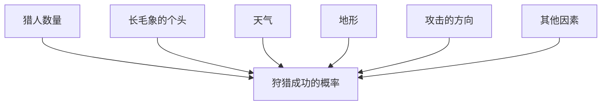
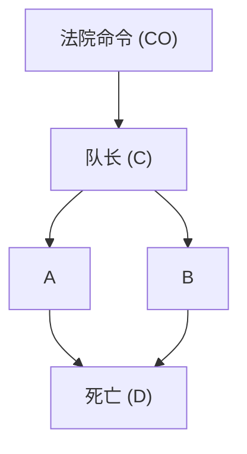
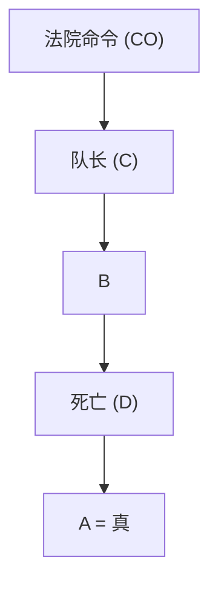
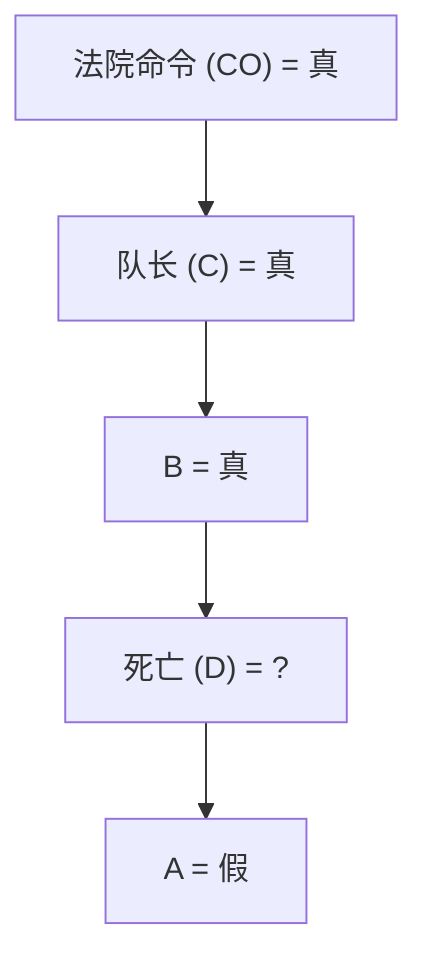
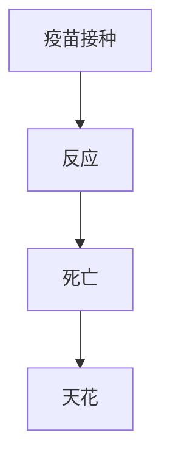

# 第一章 因果关系之梯

起初……第一次读伊甸园中亚当和夏娃的故事时，我大概六七岁。上帝禁止他们吃智慧树的果子，对于这个任性的要求，我和我的同学们一点儿都不惊讶，我们觉得神灵肯定有他自己的原因。我们更感兴趣的是这一事实：吃了智慧树的果子，他们立即像我们一样有了意识，并意识到了自己赤身裸体。

到了青少年时期，我们的兴趣渐渐转移到了故事的哲学层面（以色列的学生每年都要读上好几遍《创世记》）。我们最关注的是，人类获得知识的过程不是快乐的，而是痛苦的，伴随着叛逆、内疚和惩罚。有人问，放弃伊甸园无忧无虑的生活值得吗？相对于与现代生活相伴相生的经济困境、战争和社会不公，我们在知识累积和文明发展的基础上发起的农业革命和科学革命值得吗？

请不要误会，我们不是神创论者，连我们的老师骨子里都是达尔文主义者。然而我们知道，《创世记》的写作者实际上是在努力回答他那个时代最为紧迫的哲学问题。我们猜测这个故事隐含着智人逐步统治整个星球这一真实过程的文化足迹。那么，这一快速的、伴随着激烈演进和超级进化的过程，其具体步骤是怎样的呢？

我对这个问题的兴趣在早年担任工程教授的职业生涯中曾有所消退，但在20世纪90年代又重新燃起。当时，我正在写《因果论》这本书，刚刚与“因果关系之梯”不期而遇。

在第100次读《创世记》时，我注意到了一个多年来一直忽略的细节。上帝发现亚当躲在花园里，便问他：“我禁止你碰那棵树，你是不是偷吃了它的果子？”亚当答道：“你所赐给我的与我做伴的女人，她给了我树上的果子，我就吃了。”“你都做了什么？”上帝问夏娃。夏娃答道：“那蛇欺骗了我，我就吃了。”众所周知，这种推卸责任的伎俩对全知全能的上帝不起作用，因此他们被逐出了伊甸园。但这里有一点是我以前一直忽略的：上帝问的是“什么”，他们回答的却是“为什么”。上帝询问事实，他们回答理由。而且，两人都深信，列举原因可以以某种方式美化他们的行为。他们是从哪里得到这样的想法的？

对我来说，这一细节有三个深刻的含义：

- 首先，人类在进化早期就意识到世界并非由枯燥的事实（我们今天可能称之为数据）堆砌而成；相反，这些事实是通过错综复杂的因果关系网络融合在一起的。
- 其次，因果解释而非枯燥的事实构成了我们大部分的知识，它应该成为机器智能的基石。
- 最后，我们从数据处理者向因果解释者的过渡不是渐进的，而是一次“大跃进”，借助的是某种奇异的外部推力。这与我在因果关系之梯上的理论观察完全吻合：没有哪台机器可以从原始数据中获得解释。对数据的解释需要借助外部推力。

# 从进化科学中求证

我们希望从进化科学中求证这些信息。我们当然不可能找到智慧树，但我们仍能发现一个无法解释的重大转变。我们知道，人类历经了 500 万到 600 万年的时间才从类人猿祖先进化而来，这种渐进的进化过程对地球生命来说很寻常。但是，在大约 5 万年前，不寻常的事情发生了——有人将其称为**认知革命**（Cognitive Revolution），另外一些人则（带一点儿讽刺意味地）将其称为“大跃进”。在这场巨变中，人类以神奇的速度获得了改变环境和提升自身能力的能力。

打个比方：在数百万年里，老鹰和猫头鹰进化出了非凡的视力，然而它们显然没能发明出眼镜、显微镜、望远镜或夜视镜。而人类在几个世纪内就创造了这些奇迹。我把这种现象称为**“超进化加速”**。有的读者可能不赞成我将进化与工程学这两种风马牛不相及的事物进行对比，但这正是我想强调的关键。进化赋予了我们设计自身生命的能力，而没有赋予老鹰和猫头鹰同样的能力。那么问题又来了——**为什么？** 人类突然获得的那种老鹰和猫头鹰所不具备的计算能力到底是什么？

## 理论探讨

学者们提出过很多理论，其中一种理论与因果关系密切相关。历史学家尤瓦尔·赫拉利在他的《人类简史》一书中指出，人类祖先想象不存在之物的能力是一切的关键，正是这种能力让他们得以交流得更加顺畅。在获得这种能力之前，他们只相信自己的直系亲属或者本部落的人。而此后，信任就因共同的幻想（例如信仰无形但可想象的神，信仰来世，或者信仰领袖的神性）和期许而延伸到了更大的群体。

无论你是否同意赫拉利的理论，想象和因果关系之间的联系都是不言而喻的。除非你能想象出事情的结果，否则寻问事情的原因就是徒劳的。反过来说，你不能声称是夏娃导致你吃了树上的苹果，除非你可以想象一个世界，在那个世界里，情况与事实相反，她没有给你那个苹果。

## 因果想象力与规划能力

回到我们的智人祖先，新掌握的因果想象力使他们能够通过一种被我们称为“规划”的复杂过程更有效地完成许多事情。设想一下，某个部落正在为狩猎长毛象做准备。他们怎样做才能成功？必须承认，我的长毛象狩猎技巧很生疏，但作为一个研究思维机器的学者，我明白这样一件事：

一个思维主体（计算机、穴居人或教授）要完成如此大型的任务，必须进行预先规划——确定召集猎人的人数，根据风力条件估计应该从哪个方向靠近长毛象。简言之，通过想象和比较几个狩猎策略的结果来完成任务。要做到这一点，思维主体必须具备一个可供参考并且可以自主调整的关于狩猎现实的心理模型。

## 心理模型与影响因素

图 1.1 展示了我们建构这一心理模型的方式。图中的每个点都代表一种成功狩猎的影响因素或原因。请注意，这里的影响因素是多重的，没有哪个是决定性的。也就是说，我们无法确定更多的猎人是否会导致捕猎成功，或者下雨是否会导致捕猎失败，但这些因素的确会改变成功的概率。

> **图 1.1** 成功狩猎长毛象的已知影响因素

心理模型是施展想象的舞台。它使我们能够通过对模型局部的修改来试验不同的情景。比如，在猎人心理模型的某处可能存在一个子程序，用于评估猎人数量的影响。在想要增加猎人数量的时候，他们无须从头开始评估其他因素，只需对模型做局部的修改，将“猎人=8”换成“猎人=9”，就可以重估成功的概率。这种模块性是因果模型的一个关键特征。

当然，我并不是说早期人类真的绘制出了这种图画模型。但当我们想要让计算机来模拟人类思维，或者试图解决陌生的科学问题时，绘制一个清晰的由点和箭头组成的图示是非常有用的。这些因果图就是我在导言中所描述的“因果推理引擎”的计算核心。

> 【看书累了吗？休息一会！更多新书朋友圈 每日免费 分享 微信xueba987。渺沧海一粟：为终身学习者赋能2019年7月】

## 因果关系的三个层级

到目前为止，我的叙述可能会让大家觉得，我们将关于这个世界的知识组织起来融入因果关系网络的能力是一种一体化的能力，并且是可以一下子学会或领悟的。事实上，我在机器学习方面的研究经历告诉我，因果关系的学习者必须熟练掌握至少三种不同层级的认知能力：**观察能力（seeing）**、**行动能力（doing）** 和 **想象能力（imagining）**。

**第一层级**是观察能力，具体而言是指发现环境中的规律的能力。在认知革命发生之前，这种能力为许多动物和早期人类所共有。**第二层级**是行动能力，涉及预测对环境进行刻意改变后的结果，并根据预测结果选择行为方案以催生出自己期待的结果。只有少数物种表现出了具备此种能力的特征。对工具的使用（前提是使用是有意图的，而不是偶然的或模仿前人）就可以视作达到第二层级的标志。然而，即使是工具的使用者也不一定掌握有关工具的“理论”，工具理论能够告诉他们为什么这种工具有效，以及如果工具无效该怎么做。为掌握这种理论，你需要登上想象力这一层级。**第三层级**至关重要，它让我们为发起农业领域和科学领域的更深层次的革命做好了准备，使得我们人类对于地球的改造能力发生了骤变。

我无法证明这一点，但是我可以在数学上证明这三个层级有着根本的区别，每一级所释放出的力量都是其下一级无法企及的。我用来证明这一观点的框架要追溯到人工智能的先驱阿兰·图灵，他曾提出将认知系统按照其所能回答的问题进行分类。在我们谈论因果论时，这一框架或分类法是卓有成效的，因为它绕过了关于因果论究竟为何物的漫长而徒劳的讨论，聚焦于具体的可回答的问题，即“因果推理主体可以做什么”，或者更准确地说，相较于不具备因果模型的生物，拥有因果模型的生物能推算出什么前者推算不出的东西？

图灵寻找的是一种二元分类——人类或非人类，而我们的分类则包含三个层级，分别对应逐级复杂的因果问题。使用这组判断标准，我们便可以将问题的三个层级组合成 **因果关系之梯**（见图 1.2）。因果关系之梯是本书的一个重要隐喻，我们将会多次回顾它。

> 图 1.2 因果关系之梯的每一层级都有一种代表性生物。大多数动物和当前的学习机器都处于第一层级，它们通过关联进行学习。像早期人类这样的工具使用者则处于第二层级，前提是他们是有计划地采取行动而非仅靠模仿行事。我们也可以通过实验来习得干预的效果，这大概也是婴儿获取大多数因果知识的方式。反事实的学习者处于阶梯的顶级，他们可以想象并不存在的世界，并推测观察到的现象的原因为何（资料来源：马雅·哈雷尔绘图）

### 3. 反事实

- **活动**：想象，反思，理解
- **问题**：假如我当时做了……会怎样？为什么？（是 X 引起了 Y 吗？假如 X 没有发生会如何？假如我之前采取了不同的行动呢？）
- **例子**：是阿司匹林治好了我的头痛吗？假如奥斯沃德没有刺杀肯尼迪，肯尼迪会活着吗？假如在过去的两年里我没有吸烟会怎样？

### 2. 干预

- **活动**：行动，干预
- **问题**：如果我实施……行动，将会怎样？我要如何做？（如果我实施 X 行动，那么 Y 会怎样？怎样让 Y 发生？）
- **例子**：如果吃了阿司匹林，我的头痛能治愈吗？如果我们禁止吸烟将会发生什么？

### 1. 关联

- **活动**：看，观察
- **问题**：如果我观察到……会怎样？（变量之间的关联是怎样的？观察到 X 会怎样改变我对 Y 的看法？）
- **例子**：某一症状告诉了我关于疾病的什么信息？某一调研告诉了我们关于选举结果的什么信息？

现在让我们花点儿时间来详细研究因果关系之梯的每一层级。

处于第一层级的是**关联**，在这个层级中我们通过观察寻找规律。一只猫头鹰观察到一只老鼠在活动，便开始推测老鼠下一刻可能出现的位置，这只猫头鹰所做的就是通过观察寻找规律。计算机围棋程序在研究了包含数百万围棋棋谱的数据库后，便可以计算出哪些走法胜算较高，它所做的也是通过观察寻找规律。如果观察到某一事件改变了观察到另一事件的可能性，我们便说这一事件与另一事件相关联。

因果关系之梯的第一层级要求我们基于被动观察做出预测。其典型问题是：“如果我观察到……会怎样？”例如，一家百货公司的销售经理可能会问：“购买牙膏的顾客同时购买牙线的可能性有多大？”此类问题正是统计学的安身立命之本，统计学家主要通过收集和分析数据给出答案。在这个例子中，问题可以这样解答：首先采集所有顾客购物行为的数据，然后筛选出购买牙膏的顾客，计算他们当中购买牙线的人数比例。这个比例也称作“条件概率”，用于测算（针对大数据的）“买牙膏”和“买牙线”两种行为之间的关联程度。用符号表示可以写作 $P(\text{牙线} \mid \text{牙膏})$，其中 $P$ 代表概率，竖线意为“假设你观察到”。

为了缩小数据的体量，确定变量之间的关联，统计学家开发了很多复杂的方法。本书将会经常提到的一种典型的关联度量方法，即“相关分析”或“回归分析”，其具体操作是将一条直线拟合到数据点集中，然后确定这条直线的斜率。有些关联可能有明显的因果解释，有些可能没有。但无论如何，统计学本身并不能告诉我们，牙膏或牙线哪个是因，哪个是果。从销售经理的角度看，这件事也许并不重要——好的预测无须好的解释，就像猫头鹰不明白老鼠为何总是从 $A$ 点跑到 $B$ 点，但这不改变它仍然是一个好猎手的事实。

> **批注**：此处猫头鹰的例子用于说明，即使缺乏因果理解，基于关联的预测仍然有效。

我把当今的人工智能置于因果关系之梯的最底层，与猫头鹰相提并论，对此有些读者可能会感到很吃惊。近些年来，我们好像每天都会听闻机器学习系统的新发展和新成果——无人驾驶汽车、语言识别系统，特别是近几年来广受推崇的深度学习算法（或称深度神经网络）。为什么它们会处于因果关系之梯的最底层呢？

深度学习的成果确实举世瞩目、令人惊叹。然而，它的成功主要告诉我们的是：之前我们认为困难的问题或任务实际上并不难，而并没有解决真正的难题，这些难题仍在阻碍着类人智能机器的实现。其结果是，公众误以为“强人工智能”（像人一样思考的机器）的问世指日可待，甚至可能已经到来，而事实远非如此。我完全赞同纽约大学神经系统科学家盖里·马库斯的观点，他最近在《纽约时报》上写道：人工智能领域“喷涌出大量的微发现”，这些发现也许是不错的新素材，但很遗憾，机器仍与类人认知相去甚远。我在加州大学洛杉矶分校计算机科学系的同事阿德南·达尔维奇也曾发表过一篇题为“是人类水平的智能还是动物般的能力？”的论文，并在其中表明了自己的立场。我认为该论文恰如其分地回答了作者在标题中提出的这一问题。

强人工智能这一目标是制造出拥有类人智能的机器，让它们能与人类交流并指导人类的探索方向。而深度学习只是让机器具备了高超的能力，而非智能。这种差异是巨大的，原因就在于后者缺少现实模型。

与 30 年前一样，当前的机器学习程序（包括那些应用深度神经网络的程序）几乎仍然完全是在关联模式下运行的。它们由一系列观察结果驱动，致力于拟合出一个函数，就像统计学家试图用点集拟合出一条直线一样。深度神经网络为拟合函数的复杂性增加了更多的层次，但其拟合过程仍然由原始数据驱动。被拟合的数据越来越多，拟合的精度不断提高，但该过程始终未能从我们先前提到的那种“超进化加速”中获益。例如，如果无人驾驶汽车的程序设计者想让汽车在新情况下做出不同的反应，那么他就必须明确地在程序中添加这些新反应的描述代码。机器是不会自己弄明白手里拿着一瓶威士忌的行人可能对鸣笛做出的不同反应的。处于因果关系之梯最底层的任何运作系统都不可避免地缺乏这种灵活性和适应性。

# 因果关系之梯：第二层级——干预

当我们开始改变世界的时候，我们就迈上了因果关系之梯的更高一层台阶。这一层级的一个典型问题是：“如果我们把牙膏的价格翻倍，牙线的销售额将会怎么样？”这类问题处于因果关系之梯的第二层级，提出及回答这类问题要求我们掌握一种脱离于数据的新知识，即**干预**。

干预比关联更高级，因为它不仅涉及被动观察，还涉及主动改变现状。例如，观察到烟雾和主动制造烟雾，二者所表明的“某处着火”这件事的可能性是完全不同的。无论数据集有多大或者神经网络有多深，只要使用的是被动收集的数据，我们就无法回答有关干预的问题。从统计学中学到的任何方法都不足以让我们明确表述类似“如果价格翻倍将会发生什么”这样简单的问题，更别说回答它们了。认识到这一点让许多科学家挫败不已。我之所以对此心知肚明，是因为我曾多次帮助这些科学家踏上因果关系之梯的更高层级。

> 【看书累了吗？休息一会！更多新书朋友圈 每日免费分享微信 xueba987。渺沧海一粟：为终身学习者赋能 2019 年 7 月】

为什么我们不能仅通过观察来回答牙线的问题呢？为什么不直接进入存有历史购买信息的庞大数据库，看看在牙膏价格翻倍的情况下实际发生了什么呢？原因在于，在以往的情况中，涨价可能出于完全不同的原因，例如产品供不应求，其他商店也不得不涨价等。但现在，我们并不关注行情如何，只想通过刻意干预为牙膏设定新价格，因而其带来的结果就可能与此前顾客在别处买不到便宜牙膏时的购买行为大相径庭。如果你有历史行情数据，也许你可以做出更好的预测……但是，你知道你需要什么样的数据吗？你准备如何理清数据中的各种关系？这些正是因果推断科学能帮助我们回答的问题。

预测干预结果的一种非常直接的方法是在严格控制的条件下进行实验。像脸书这样的大数据公司深知实验的力量，它们在实践中不断地进行各种实验，比如考察页面上的商品排序不同或者给用户设置不同的付款期限（甚至不同的价格）会导致用户行为发生怎样的改变。

更为有趣并且即使在硅谷也鲜为人知的是，即便不进行实验，我们有时也能成功地预测干预的效果。例如，销售经理可以研发出一个包括市场条件在内的消费者行为模型。就算没能采集到所有因素的相关数据，他依然有可能利用充分的关键替代数据进行预测。一个足够强大的、准确的因果模型可以让我们利用第一层级（关联）的数据来回答第二层级（干预）的问题。**没有因果模型，我们就不能从第一层级登上第二层级**。这就是深度学习系统（只要它们只使用了第一层级的数据而没有利用因果模型）永远无法回答干预问题的原因，干预行动据其本意就是要打破机器训练的环境规则。

这些例子说明，因果关系之梯第二层级的典型问题就是：“如果我们实施……行动，将会怎样？”也即，如果我们改变环境会发生什么？我们把这样的问题记作：

$$
P(\text{牙线} \mid do(\text{牙膏}))
$$

它所对应的问题是：如果对牙膏另行定价，那么在某一价位销售牙线的概率是多少？

第二层级中的另一个热门问题是：“怎么做？”它与“如果我们实施……行动，将会怎样”是同类问题。例如，销售经理可能会告诉我们，仓库里现在积压着太多的牙膏。他会问：“我们怎样才能卖掉它们？”也就是，我们应该给它们定个什么价？同样，这个问题也与干预行动有关，即在我们决定是否实际实施干预行动以及怎样实施干预行动之前，我们会尝试在心理层面演示这种干预行动。这就需要我们具备一个因果模型。

在日常生活中，我们一直都在实施干预，尽管我们通常不会使用这种一本正经的说法来称呼它。例如，当我们服用阿司匹林试图治疗头痛时，我们就是在干预一个变量（人体内阿司匹林的量），以影响另一个变量（头痛的状态）。如果我们关于阿司匹林治愈头痛的因果知识是正确的，那么我们的“结果”变量的值将会从“头痛”变为“头不痛”。

虽然关于干预的推理是因果关系之梯中的一个重要步骤，但它仍不能回答所有我们感兴趣的问题。我们可能想问：现在我的头已经不痛了，但这是为什么？是因为我吃了阿司匹林吗？是因为我吃的食物吗？是因为我听到的好消息吗？正是这些问题将我们带到因果关系之梯的最高层，即**反事实层级**。因为要回答这些问题，我们必须回到过去改变历史，问自己：“假如我没有服用过阿司匹林，会发生什么？”世界上没有哪个实验可以撤销对一个已接受过治疗的人所进行的治疗，进而比较治疗与未治疗两种条件下的结果，所以我们必须引入一种全新的知识。

反事实与数据之间存在着一种特别棘手的关系，因为数据顾名思义就是事实。数据无法告诉我们在反事实或虚构的世界里会发生什么，在反事实世界里，观察到的事实被直截了当地否定了。然而，人类的思维却能可靠地、重复地进行这种寻求背后解释的推断。当夏娃把“蛇欺骗了我”作为她的行动理由时，她就是这么做的。这种能力彻底地区分了人类智能与动物智能，以及人类与模型盲版本的人工智能和机器学习。

你可能会怀疑，对于“假如”（would haves）这种并不存在的世界和并未发生的事情，科学能否给出有效的陈述。科学确实能这么做，而且一直就是这么做的。举个例子，“在弹性限度内，假如加在这根弹簧上的砝码重量是原来的两倍，弹簧伸长的长度也会加倍”（胡克定律），像这样的物理定律就可以被看作反事实断言。当然，这一断言是从诸多研究者在数千个不同场合对数百根弹簧进行的实验中推导出来的，得到了大量试验性（第二层级）证据的支持。然而，一旦被奉为“定律”，物理学家就把它解释为一种函数关系，自此，这种函数关系就在假设中的砝码重量值下支配着某根特定的弹簧。所有这些不同的世界，其中砝码重量是 $x$ 磅[^1]，弹簧长度是 $\mathrm{L}_{\mathrm{X}}$ 英寸[^2]，都被视为客观可知且同时有效的，哪怕它们之中只有一个是真实存在的世界。

回到牙膏的例子，针对这个例子，最高层级的问题是：“假如我们把牙膏的价格提高一倍，则之前买了牙膏的顾客仍然选择购买的概率是多少？”在这个问题中，我们所做的就是将真实的世界（在真实的世界，我们知道顾客以当前的价格购买了牙膏）和虚构的世界（在虚构的世界，牙膏价格是当前的 2 倍）进行对比。

> 【看书累了吗？休息一会！更多新书朋友圈每日免费分享微信 xueba987。渺沧海一粟：为终身学习者赋能 2019 年 7 月】

因果模型可用于回答此类反事实问题，建构因果模型所带来的回报是巨大的：找出犯错的原因，我们之后就能采取正确的改进措施；找出一种疗法对某些人有效而对其他人无效的原因，我们就能据此开发出一种全新的疗法；“假如当时发生的事情与实际不同，那会怎样？”对这个问题的回答让我们得以从历史和他人的经验中获取经验教训，这是其他物种无法做到的。难怪古希腊哲学家德谟克利特（公元前 460—前 370）说：“宁揭一因，胜为波斯王。”将反事实置于因果关系之梯的顶层，已经充分表明了我将其视为人类意识进化过程的关键时刻。我完全赞同尤瓦尔·赫拉利的观点，即对虚构创造物的描述是一种新能力的体现，他称这种新能力的出现为认知革命。他所举的代表性实例是狮人雕塑，这座雕塑是在德国西南部的施塔德尔洞穴里发现的，目前陈列于乌尔姆博物馆（见图 1.3）。狮人雕塑的制造时间距今约 4 万年，它是用长毛象的象牙雕成的半人半狮的虚构怪兽。

*Ancient terracotta statue of a standing human figure (no inscriptions or symbols visible)*

[^1]: 1 磅 ≈ 0.4536 千克。
[^2]: 1 英寸 ≈ 2.54 厘米。

> 图 1.3 施塔德尔洞穴的狮人雕塑。已知的最古老的虚构生物（半人半狮）雕塑，其象征着一种人类新发展出来的认知能力，即反事实推理能力（资料来源：伊冯·米勒斯拍摄，由位于德国乌尔姆的国家文化遗产处巴登—符腾堡/乌尔姆博物馆提供）

Ancient ceramic figurine of a stylized animal or mythical creature, possibly a warrior or warrior figure, displayed against a black background (no text or symbols visible)

我们不知道究竟是谁雕刻了狮人，也不知道他雕刻的目的是什么，但我们知道一点：是解剖学意义上的现代人类创造了它。它的出现标志着对先前所有的艺术或工艺品形式的突破。在此之前，人类已经发明了成型的工具和具象派艺术，从珠子到长笛到矛头再到马和其他动物的高雅雕刻都属此类。但狮人雕塑不同，它的本体是一个只存在于想象中的生物。

自此，人类发展出了一种想象从未存在之物的能力。作为这种能力的表现形式，狮人雕塑是所有哲学理论、科学探索和技术创新的雏形。从显微镜到飞机再到计算机，这些创造物真正出现在物理世界之前，都曾存在于某个人的想象之中。

与任何解剖学上的进化一样，这种认知能力的飞跃对我们人类这个物种来说意义深远且至关重要。在狮人雕塑制造完成之后的 1 万年间，其他所有的原始人种（除了地理上被隔绝的弗洛雷斯原始人）都灭绝了。人类继续以难以置信的速度改变着自然界，利用我们的想象力生存、适应并最终掌控了整个世界。从想象的反事实中，我们获得的独特优势是灵活性、反省能力和改善过去行为的能力，更重要的一点是对过去和现在的行为承担责任的意愿。古往今来，我们一直受益于反事实推理。

如图 1.2 所示，因果关系之梯第三层级的典型问题是：“假如我当时做了……会怎样？”和“为什么？”两者都涉及观察到的世界与反事实世界的比较。仅靠干预实验无法回答这样的问题。如果第一层级对应的是观察到的世界，第二层级对应的是一个可被观察的美好新世界，那么第三层级对应的就是一个无法被观察的世界（因为它与我们观察到的世界截然相反）。为了弥合第三层级与前两个层级之间的差距，我们需要构建一个基础性的解释因果过程的模型，这种模型有时被称为“理论”，甚至（在构建者极其自信的情况下）可以被称为“自然法则”。简言之，我们需要掌握一种理解力，建立一种理论，据此我们就可以预测在尚未经历甚至未曾设想过的情况下会发生什么——这显然是所有科学分支的圣杯。但因果推断的意义还要更为深远：在掌握了各种法则之后，我们就可以有选择地违背它们，以创造出与现实世界相对立的世界。我们将在下一节重点介绍这类违背法则的行为。

## 迷你图灵测试

1950 年，阿兰·图灵提出了这样一个问题：如果计算机能像人类一样思考，这意味着什么？他提出了一个实用的测试，并称之为“模仿游戏”，但没过多久，所有人工智能领域的研究者便都称其为“图灵测试”。这个测试可以简单理解为，一个普通人出于实用目的用打字机与一台计算机交流，如果他无法判断谈话对象是人还是计算机，那么这台计算机就可以被视作一台思维机器。图灵坚信这个测试是可行的。他写道：

> “我相信，在大约 50 年的时间里，高水准地完成模仿游戏的程序就会出现，普通询问者在 5 分钟的提问时间结束后正确识别对象是否为人的概率会低于 70%。”

不过，图灵的预测略有偏差。每年的勒布纳人工智能大赛都致力于评选出世界上仿人能力最强的“聊天机器人”，一枚金牌和 10 万美元将被授予成功骗过全部 4 名裁判，让他们将交流对象误判为人的程序。但截至 2015 年，大赛已举办了 25 届，仍然没有一个程序能骗过所有裁判，甚至骗过哪怕一半的裁判。

图灵不只提出了“模仿游戏”，还提出了让程序通过测试的策略。他问道：

> “与其试图编写一个模拟成人思维的程序，何不尝试编写一个模拟儿童思维的程序？”

如果能做到这一点，那么你就可以像教小孩子一样教它了。这样一来，很快，大约 20 年后（考虑到计算机的发展速度，这个时间还可以更短），你就会拥有一个人工智能。

> “儿童的大脑与我们从文具店购买的空白笔记本相差无几，”他写道，“预先设定的机制极少，有着大量的空白。”

在这一点上，图灵错了：**儿童的大脑有着丰富的预设机制和预存模板**。

不过，我认为图灵还是说中了一部分事实。在创造出具备孩童智能水平的机器人之前，我们可能的确无法成功创造出类人智能，而创造出前者的关键要素就是**掌握因果关系**。

那么，机器如何才能获得关于因果关系的知识呢？目前，这仍然是一项重大挑战，其中无疑会涉及复杂的输入组合。这些输入来自主动实验、被动观察和（最关键的）程序员输入，这与儿童所接收的信息输入非常相似，他们的输入分别来自进化、父母和他们的同龄人（对应于程序员这个角色）。

不过，我们可以回答一个略微容易一些的问题：**机器（和人）如何表示因果知识，才能让自己迅速获得必要的信息，正确回答问题，并如同一个三岁的儿童一样对此驾轻就熟呢？** 事实上，这正是本书所要回答的主要问题。

我称之为**“迷你图灵测试”**，其主要思路是选择一个简单的故事，用某种方式将其编码并输入机器，测试机器能否正确回答人类能够回答的与之相关的因果问题。之所以称其为“迷你”，原因有二：

1.  该测试仅限于考察机器的因果推理能力，而不涉及人类认知能力的其他方面，如视觉和自然语言。
2.  我们允许参赛者以任何他们认为便捷的表示方法对故事进行编码，这就免除了机器必须依据其自身经验构造故事的任务。

让智能机器通过这个迷你测试是我毕生的事业——在过去的 25 年里是自觉而为，在那之前则是无意而为。

显然，在让机器进行迷你图灵测试的准备阶段，**表示问题必须优先于获取问题**。如果缺少表示方法，我们就不知道如何存储信息以供将来使用。即使可以让机器人随意操控环境，它们也无法记住以这种方式学到的信息，除非我们给机器人配备一个模板来编码这些操作的结果。人工智能对认知研究的一个主要贡献就是确立 **“表示第一，获取第二”** 的范式。通常，在寻求一个好的表示方法的过程中，关于如何获取知识的洞见就会自然产生，无论这种洞见是来自数据，还是来自程序员。

当我介绍迷你图灵测试时，人们常说这种测试可以很容易靠作弊来通过。例如，列出一个包含所有可能问题的列表，在机器人的内存中预先存储正确的答案，之后让机器人在被提问时从内存中提取答案即可。如果现在你的面前有两台机器，一台是简单存储了问题答案列表的机器，而另一台是能够依据人类的思考方式回答问题的机器，即能够通过理解问题并利用头脑中的因果模型生成答案的机器，那么我们是没有办法将二者区分开的（所以围绕该问题有很多争论）。如果作弊是如此容易，那么迷你图灵测试究竟能证明什么呢？

1980 年，哲学家约翰·塞尔以 **“中文屋”（Chinese Room）** 论证介绍了这种作弊的可能性，以此挑战图灵的说法——伪造智能的能力就相当于拥有智能。塞尔的质疑只有一个瑕疵：**作弊并不容易——事实上，作弊根本就是不可能的**。即使只涉及少量变量，可能存在的问题的数量也会迅速增长为天文数字。假设我们有 10 个因果变量，每个变量只取两个值（0 或 1），那么我们可以提出大约 3000 万个关于这些变量的可能问题，例如：“如果我们看到变量 X 等于 1，而我们让变量 Y 等于 0 且变量 Z 等于 1，那么结果变量为 1 的概率是多少？”如果涉及的变量还要更多，且每个变量都有两个以上的可能值，那么问题数量的增长可能会超出我们的想象。换句话说，塞尔的问题清单需要列出的条目将超过宇宙中原子的数量。所以，很显然，**简单的问题答案列表永远无法让机器模拟儿童的智能，更不用说模拟成人的智能了**。

人类的大脑肯定拥有某种简洁的信息表示方式，同时还拥有某种十分有效的程序用以正确解释每个问题，并从存储的信息表示中提取正确答案。因此，为了通过迷你图灵测试，我们需要给机器装备同样高效的表示信息和提取答案的算法。

事实上，这种表示不仅存在，而且具有孩童思维般的简洁性，它就是**因果图**。我们此前已经看到一个关于长毛象狩猎成功因素的图例。鉴于人们能轻而易举地用点和箭头构成的图来交流知识，我相信我们的大脑一定使用了类似的表示方法。但就我们的目的而言，更重要的是让这些模型能通过迷你图灵测试，这是目前其他已知的模型都做不到的。让我们先看一些例子。

如图 1.4 所示，我们假设一个犯人将要被行刑队执行枪决。这件事的发生必然会以一连串的事件发生为前提。首先，法院方面要下令处决犯人。命令下达到行刑队队长后，他将指示行刑队的士兵（A 和 B）执行枪决。我们假设他们是服从命令的专业枪手，只听命令射击，并且只要其中任何一个枪手开了枪，囚犯都必死无疑。

> 图 1.4 行刑队例子的因果图（A 和 B 分别代表士兵 A 和 B 的行为）

图 1.4 所示因果图即概括了我刚才讲的故事。每个未知量（CO，C，A，B，D）都是一个真/假（true/false）变量。例如，D=真，意思是犯人已死；D=假，意思是犯人还活着。CO=假，意思是法院的死刑命令未签发；CO=真，意思则是死刑命令已签发，以此类推。

借助这个因果图，我们就可以回答来自因果关系之梯不同层级的因果问题了。首先，我们可以回答关联问题（一个事实告诉我们有关另一事实的什么信息）。一个可能的问题是，如果犯人死了，那么这是否意味着法院已下令处决犯人？我们（或一台计算机）可以通过核查因果图，追踪每个箭头背后的规则，并根据标准逻辑得出结论：如果没有行刑队队长的命令，两名士兵就不会射击。同样，如果行刑队队长没有接到法院的命令，他就不会发出执行枪决的命令。因此，这个问题的答案是肯定的。

另一个可能的问题是，假设我们发现士兵 A 射击了，它告诉了我们关于 B 的什么信息？通过追踪箭头，计算机将断定 B 一定也射击了。（原因在于，如果行刑队队长没有发出射击命令，士兵 A 就不会射击，因此接收到同样命令的士兵 B 也一定射击了。）即使士兵 A 的行为不是士兵 B 做出某一行为的原因（因为从 A 到 B 没有箭头），该判断依然为真。

沿着因果关系之梯向上攀登，我们可以提出有关干预的问题。如果士兵 A 决定按自己的意愿射击，而不等待队长的命令，情况会怎样？犯人会不会死？这个问题其实已经包含矛盾的成分了。我在上一段刚刚告诉你士兵 A 仅在接收到命令时射击，而现在我却问你，如果他在没有接到命令的情况下射击会发生什么。如果你像计算机常做的那样，只知道根据逻辑规则进行判断，那么这个问题就是毫无意义的。就像 20 世纪 60 年代科幻剧《星际迷航》中的机器人在此状况下常说的：“这不能计算。”

> 【看书累了吗？休息一会！更多新书朋友圈每日免费分享微信 xueba987。渺沧海一粟：为终身学习者赋能 2019 年 7 月】

如果我们希望计算机能理解因果关系，我们就必须教会它如何打破规则，让它懂得“观察到某事件”和“使某事件发生”之间的区别。我们需要告诉计算机：“无论何时，如果你想使某事发生，那就删除指向该事的所有箭头，之后继续根据逻辑规则进行分析，就好像那些箭头从未出现过一样。”如此一来，对于这个问题，我们就需要删除所有指向被干预变量（A）的箭头，并且还要将该变量手动设置为规定值（真）。这种特殊的“外科手术”的基本原理很简单：使某事发生就意味着将它从所有其他影响因子中解放出来，并使它受限于唯一的影响因子——能强制其发生的那个因子。

图 1.5 表示出了根据这个例子生成的因果图。显然，这种干预会不可避免地导致犯人的死亡。这就是箭头 A 到 D 背后的因果作用。

> 图 1.5 关于干预的因果推理（士兵 A 自行决定射击；从 C 到 A 的箭头被删除，并且 A 被赋值为真）

请注意，这一结论与我们的直觉判断是一致的，即士兵 A 擅自射击将导致犯人死亡，因为“手术”没有改动从 A 到 D 的箭头。同时，我们还能判断出：B（极有可能）没有开枪，A 的决定不会影响模型中任何不受 A 的行为影响的其他变量。

我们有必要重述一次刚才的结论：如果我们“看到”A 射击，则我们可以下结论——B 也射击了。但是如果 A 自行“决定”射击，或者如果我们强制“使”A 射击，那么在此种情况下，相反的结论才是对的。这就是“观察到”和“实施干预”的区别。只有掌握二者差异的计算机才能通过迷你图灵测试。

需要注意的是，仅凭收集大数据无助于我们登上因果关系之梯去回答上面的问题。假设你是一个记者，每天的工作就是记录行刑场中的处决情况，那么你的数据会由两种事件组成：要么所有 5 个变量都为真，要么所有都为假。在未掌握“谁听从于谁”的相关知识的情况下，这种数据根本无法让你（或任何机器学习算法）预测“说服枪手 A 不射击”的结果。

最后，为了说明因果关系之梯的第三层级，我们提出一个反事实问题。假设犯人现在已倒地身亡，从这一点我们（借助第一层级的知识）可以得出结论：A 射击了，B 射击了，行刑队队长发出了指令，法院下了判决。但是，假如 A 决定不开枪，犯人是否还活着？这个问题需要我们将现实世界和一个与现实世界相矛盾的虚构世界进行比较。在虚构世界中，A 没有射击，指向 A 的箭头被去除，这进而又解除了 A 与 C 的听命关系。现在，我们将 A 的值设置为假，并让 A 行动之前的所有其他变量的水平与现实世界保持一致。如此一来，这一虚构世界就如图 1.6 所示。

> 图 1.6 反事实推理（我们观察到犯人已死，据此，我们提出这样一个问题：假如士兵 A 决定不射击，会发生什么？）

为通过迷你图灵测试，计算机一定会得出这样的结论：在虚构世界里犯人也会死，因为 B 会开枪击毙他。所以，A 勇敢改变主意的做法也救不了犯人的命。实际上，这正是行刑队存在的一个原因：保证法院命令的执行，也为每个枪手个体减轻一些需要担负的责任，枪手可以（在一定程度上）问心无愧地说，并非他们的行动导致犯人的死亡，因为“犯人横竖都会死”。

看起来，我们刚刚像是花了很大一番力气回答了一些答案显而易见的小问题。我完全同意你的判断。因果推理对你来说很容易，其原因在于你是人类，你曾是一名三岁的儿童，你所拥有的功能神奇的大脑比任何动物或计算机都更能理解因果关系。“迷你图灵问题”的重点就是要让计算机也能够进行因果推理，而我们能从人类进行因果推断的做法中得到启示。

如上述三个例子所示，我们必须教会计算机如何有选择地打破逻辑规则。计算机不擅长打破规则，这是儿童的强项。（穴居人也很擅长，不违背“什么头配什么身体”的规则，他们就不可能创造出狮人雕塑。）不过，我们最好也不要过于得意于人类的优越性。在许多情境中，人类可能需要花费很大的努力才能找到那个正确的因果结论。例如，某些问题可能涉及更多的变量，并且它们很可能并非简单的二元（真/假）变量。在日常生活中，我们更想预测的可能是如果政府提高最低工资标准，则社会失业率会上升多少，而不是预测犯人的死活。这种定量的因果推理通常超出了我们的直觉范畴。

此外，在行刑队的例子中，我们实际上还排除了很多不确定因素，比如，也许行刑队队长在士兵 A 决定开枪后的瞬间下达了命令，或者士兵 B 的枪卡住了，等等。为了处理不确定因素，我们就需要掌握有关此类异常事件发生可能性的信息。

下面的例子就证明了概率的重要性。这个案例涉及欧洲首次引进天花疫苗所引发的大规模公开辩论。出人意料的是，数据显示有更多的人死于天花疫苗，而非死于天花。有些人理所当然地利用这些信息辩称，应该禁止人们接种疫苗，而不顾疫苗实际上根除了天花，挽救了许多生命的事实。为阐明疫苗的效果，解决争端，让我们来看一组虚拟数据。

假设 100 万儿童中有 99% 接种了疫苗，1% 没有接种。对于接种了疫苗的儿童来说，一方面，他有 1% 的可能性出现不良反应，这种不良反应有 1% 的可能性导致儿童死亡。另一方面，这些接种了疫苗的儿童不可能得天花。相对的，对于一个未接种疫苗的儿童来说，他显然不可能产生接种后的不良反应，但他有 2% 的概率得天花。最后，让我们假设天花的致死率是 20%。

看到这组虚拟数据，我想你很可能会赞同疫苗接种。因为接种后出现不良反应的概率要低于得天花的概率，而天花比接种不良反应更危险。但现在让我们仔细分析一下数据。按照假设，在 100 万个孩子中，99 万人接种了疫苗，其中有 9900 人出现了接种后的不良反应，这之中有 99 人因此死亡。与此同时，那 1 万个没有接种疫苗的孩子中，有 200 人得了天花，其中的 40 人死于天花。这样一来，死于疫苗接种不良反应的儿童（99 人）就多于死于天花的儿童（40 人）了。

因此，对那些举着“疫苗杀人！”的标语，向卫生部游行示威的家长，我表示充分地理解。数据似乎恰恰支持了他们的观点——接种疫苗确实会造成比天花本身更多的死亡。但逻辑是否也站在他们那一边呢？我们应该禁止接种疫苗还是应该把疫苗挽救的生命也考虑在内？图 1.7 展示了此例的因果图。

> 图 1.7 疫苗接种示例的因果图。疫苗接种是有益还是有害？

在刚刚的假设中，我们提到过疫苗接种率是 99%。现在让我们问一个反事实问题：“假如我们把疫苗接种率设为零会怎样？”利用上述虚拟数据中给出的概率，你可以得出如下结论：100 万孩子中 2 万人会得天花，4000 人会死亡。将反事实世界与现实世界进行比较，我们就可以得出真正的结论：不接种疫苗会导致我们多付出 3861（4000 与 139 之差）个儿童的生命的代价。在此，我们应该感谢反事实的语言 [3] 让我们避免了付出如此惨重的代价。

对学习因果论的学生来说，他们能从这个例子中学到的最重要的知识是：构建因果模型不仅仅是画箭头，箭头背后还隐藏着概率。当我们绘制一个从 X 指向 Y 的箭头时，我们是在暗指，某些概率规则或函数具体说明了“如果 X 发生改变，Y 将如何变化”。我们在某些情况下可能知道这个规则具体是什么，而在大多数情况下，我们不得不根据数据对这个规则进行估计。不过，因果革命最有趣的特点之一就是，在许多情况下，我们可以对这些完全不确定的数学细节置之不理。通常情况下，因果图自身的结构就足够让我们推测出各种因果关系和反事实关系：简单的或复杂的、确定的或概率的、线性的或非线性的。

从计算的角度来看，我们设计出的这种让机器通过迷你图灵测试的方案也很出色。在所有三个例子中，我们都使用了相同的程序：将故事转化成因果图，解读问题，执行与既定问题（干预问题或反事实问题）相对应的“手术”（如果问题是关联类的，则不需要进行任何“手术”），并使用修改后的因果模型计算答案。并且，每次改变故事的时候，我们也不必根据各种新的问题重新训练机器。这一方法具有足够的灵活性，只要我们能绘制出因果图，我们就能解决问题，无论这个问题是关乎长毛象狩猎、行刑队执行枪决还是关乎疫苗接种。这正是我们希望因果推断引擎具备的特性：一种为人类所独享的灵活性。

> 【看书累了吗？休息一会！更多新书朋友圈 每日免费分享微信 xueba987。渺沧海一粟：为终身学习者赋能 2019 年 7 月】

当然，因果图本身没有什么内在的魔力。它之所以如此好用，是因为它承载了因果信息，即在构建因果图时，我们会问“谁能直接导致犯人死亡”或者“接种疫苗的直接效应是什么”这些问题。如果我们仅仅通过提出关联问题来构建因果图，它就不会为我们提供这些问题的答案了。如图 1.7 所示，如果我们逆转“疫苗接种→天花”中的箭头，我们同样可以获得两组数据的关联，但同时我们会错误地断定罹患天花与否本身会影响某人是否进行疫苗接种。

针对这类问题几十年的研究经验使我确信，无论是在认知意义上还是在哲学意义上，因果观都比概率观更重要。在理解语言和任何数学运算之前，我们就开始学习因果知识了。（研究表明，三岁大的儿童已经能够理解整个因果关系之梯的图示。）同样，因果图所蕴含的知识通常比由概率分布编码的知识具有更强大的应用潜能。例如，假设随着时代改变，出现了一种更安全、更有效的疫苗。同时，由于卫生条件和社会经济条件的改善，人们感染天花的危险也减少了。这些变化将对前文提到的例子中的绝大部分变量的概率产生极大的影响；但显然，原有的因果图结构仍将保持不变。这正是构建因果模型的关键秘诀。此外，一旦我们完成了之前的分析工作，并从数据中找到了估算疫苗接种能带来多大益处的方法，我们就不必在条件改变时从头开始重复整个分析过程。如导言所述，同样的被估量（也就是回答相应问题的方法）将一直有效，并且只要因果图不变，该被估量就可以应用于新数据，并为特定问题生成新的估计值。我猜想，正是由于具备这种稳健性，人类的直觉才以因果关系而非统计关系为组织的核心。

# 论概率与因果关系

对我个人和大部分哲学家、科学家来说，“因果关系不能被简化为概率”这个认识来之不易。阐释“因”的含义一直是备受哲学家关注的话题之一，从18世纪的大卫·休谟和19世纪的约翰·斯图尔特·密尔，到20世纪中叶的汉斯·赖欣巴哈和帕特里克·萨普斯，再到今天的南希·卡特赖特、沃尔夫冈·斯普恩和克里斯托弗·希区柯克，都曾发表过对于该问题的论述。特别地，从赖欣巴哈和萨普斯开始，哲学家们开始使用“概率提高”的概念来定义因果关系：如果 $X$ 提高了 $Y$ 的概率，那么我们就说 $X$ 导致了 $Y$。

这个概念也存在于我们的直觉中，并且根深蒂固。例如，当我们说“鲁莽驾驶会导致交通事故”或“你会因为懒惰而挂科”时，我们很清楚地知道，前者只是增加了后者发生的可能性，而非必然会让后者发生。鉴于此，人们便期望让概率提高准则充当因果关系之梯第一层级和第二层级之间的桥梁。然而，正是这种直觉导致了数十年失败的探索。

阻碍这一探索获得成功的不是这种直觉本身，而是它被形式化表述的方式。哲学家几乎无一例外地使用了条件概率来表示“X 提高了 Y 的概率”，记作 $P(Y|X) > P(Y)$。你肯定注意到了，这种解释是错的，因为“提高”是一个因果概念，意味着 $X$ 对 $Y$ 的因果效应，而公式 $P(Y|X) > P(Y)$ 只涉及观察和手段，表示的是“如果我们观察到了 $X$，那么 $Y$ 的概率就提高了”。但是，这种概率提高完全可能是由其他因素造成的，比如 $Y$ 是 $X$ 的因，或者其他变量（$Z$）是它们二者的因——这就是症结所在！这一形式表述将哲学家们打回原点，让他们不得不再一次尝试消除可能存在的“其他原因”。

用类似表达式 $P(Y|X)$ 所表示的概率位于因果关系之梯的第一层级，其不能（靠自己）回答第二层级或第三层级的问题。任何试图用看似简单的第一层级的概念去“定义”因果关系的做法都必定会失败。这就是我在本书中不去定义因果关系的原因：定义追求约简，而约简迫使我们不得不降至较低的层级。与此相反，我追求的是一个更具建设性的最终方案，其能够解释如何回答因果问题，以及我们究竟需要获取哪些信息来回答这些问题。如果这看起来很奇怪，那就想想数学家研究欧氏几何所采用的完全相同的方法。在几何书中，你找不到关于“点”和“线”的定义。然而，根据欧几里得公理（或者更理想的是，根据欧几里得公理的各种现代版本），我们可以回答任何关于点和线的问题。[^4]

让我们更仔细地研究一下概率提高准则，看看它究竟在哪里遭遇了阻碍。$X$ 和 $Y$ 共同的因或称混杂因子（confounder）[^5] 问题，是令哲学家最为烦恼的问题之一。如果我们从表面意义上采用概率提高准则，那么面对在冰激凌热销的月份里，犯罪的概率也提高了这一事实，我们就必然得出冰激凌的热销会导致犯罪的结论。在这个特例中，这一现象实际上可以解释为，因为夏天天气炎热，所以冰激凌的销量和犯罪率同时提高了。然而，我们依然会有此疑问：是什么样的一般性的哲学准则，可以告诉我们犯罪率提升的原因是天气炎热而非冰激凌的热销？

哲学家努力尝试通过为他们所称的“背景因子”（混杂因子的另一种说法）设置限定条件来修复定义，并据此建构了表达式 $P(Y|X, K=k) > P(Y|K=k)$，其中 $K$ 代表背景变量。事实上，如果我们把温度作为背景变量，那么这个表达式的确适用于冰激凌的例子。例如，如果我们只看温度为 30℃ 的日子（$K=30$），我们就会发现冰激凌的销售和犯罪率之间不存在任何残留的关联。只有把 30℃ 的日子和 0℃ 的日子进行比较，我们才会产生概率提高的错觉。

然而，对于“哪些变量要放入背景因子集合 $K$ 中作为条件”这一问题，还没有一个哲学家能够给出一个令人信服的通用答案。原因显而易见：混杂也是一个因果概念，因此很难用概率来表示。1983 年，南希·卡特赖特打破了这一僵局，她利用因果要素丰富了我们关于背景语境的描述。她提出，我们应该将所有与结果有“因果关联”的因子都视为条件纳入考虑。实际上，她所借用的是因果关系之梯第二层级的概念，因而在本质上放弃了仅仅基于概率来定义因的观点。这是一种进步，然而不幸的是，该观点在被提出时招致了广泛的批判，被指责为“用因自身来定义因”。

关于 $K$ 的确切内涵的哲学争论持续了 20 余年，并最终陷入僵局。事实上，我们会在第四章找到那个正确的定义，在此请允许我暂时按下不表。目前我能给出的提示是，离开因果图，我们是不可能阐明这个定义的。

[^4]: 此处指代原文中的批注内容，格式化为引用块，以清晰分离正文与注释。
[^5]: 混杂因子（confounder）是因果推断中的关键概念，指同时影响原因和结果的变量。

总之，概率因果论总是搁浅于混杂的暗礁。每一次，当概率因果关系的拥护者试图用新的船体来修补这艘船时，这艘船都会撞到同一块岩石上，再次漏水。换句话说，一旦用条件概率的语言歪曲“概率提高”，即使再多的概率补丁也无法让你登上更高一层的因果关系阶梯。我知道这听起来很奇怪，但概率提高这个概念确实不能单纯用概率来表示。

拯救概率提高这一概念的正确方法是借助 do 算子来定义：如果 $P(Y \vert do(X)) > P(Y)$，那么我们就可以说 $X$ 导致了 $Y$。由于干预是第二层级的概念，因此这个定义能够体现概率提高的因果解释，也可以让我们借助因果图进行概率推算。换言之，当研究者询问是否 $P(Y \vert do(X)) > P(Y)$ 时，如果我们手头有因果图和数据，我们就能够在算法上条理清晰地回答他的问题，从而在概率提高的意义上判断 $X$ 是否为 $Y$ 的一个因。

我热衷于关注哲学家对诸如因果关系、归纳法和科学推断逻辑等模糊概念的讨论。哲学家的优势在于能够从激烈的科学辩论和数据处理方面的现实困扰中解脱出来。相比其他领域的科学家，他们受统计学反因果偏见的毒害较少。他们有条件呼吁因果关系这一传统思想的复归，这种思想至少可以追溯到亚里士多德时代。谈起因果关系，他们也用不着不好意思，或者躲在“关联”标签的背后。

然而，在努力将因果关系的概念数学化（这本身就是一个值得称道的想法）的过程中，哲学家过早地诉诸其所知的唯一一种用于处理不确定性的语言，即概率语言。在过去的十多年的大部分时间里，他们都在致力于纠正这个大错，但遗憾的是，即便是现在，计量经济学家仍以“格兰杰因果关系”（Granger causality）和“向量自相关”（vectorautocorrelation）之名追随着类似的理念。

现在我必须坦白一件事：我也曾犯过同样的错误。我并非一直把因果放在第一位，把概率放在第二位。恰恰相反！20 世纪 80 年代初，我开始踏足人工智能方面的研究，并认定不确定性正是人工智能缺失的关键要素。此外，我坚持不确定性应由概率来表示。因此，正如我将在第三章中解释的那样，我创建了一种关于不确定性的推理方法，名为“贝叶斯网络”，用于模拟理想化的、去中心化的人类大脑将概率纳入决策的方法。贝叶斯网络可以根据我们观察到的某些事实迅速推算出某些其他事实为真或为假的概率。不出所料，贝叶斯网络立即在人工智能领域流行开来，甚至直至今天仍被视为人工智能在包含不确定性因素的情况下进行推理的主导范式。

虽然贝叶斯网络的不断成功令我欣喜不已，但它并没能弥合人工智能和人类智能之间的差距。我相信你现在也能找出那个缺失的要素了——没错，就是因果论。是的，“因果幽灵”无处不在。箭头总是由因指向果，并且研究者与实践者常常能注意到，当他们反转了箭头之后，整个推断系统就变得无法控制了。但在很大程度上，他们认为这只是一种文化上的惯性思维，或者是某种旧思维模式的产物，并不涉及人类智能行为的核心层面。

那时，我是如此陶醉于概率的力量，以至于我认为因果关系只是一个从属概念，最多不过是一种便利的思维工具或心理速记法，用以表达概率的相关性以及区分相关变量和无关变量。在我 1988 年的著作《智能系统中的概率推理》（Probabilistic Reasoning in Intelligent Systems）中，我写道：“因果关系是一种语言，运用这种语言，人们可以有效谈论关联关系的某些结构。”如今，这句话令我备感尴尬，因为“关联”显然是第一层级的概念。实际上在此书出版时，我在心里已经意识到自己错了。对我的计算机科学家同行来说，我的书被视为不确定性下推理的圣经，而我自己却变成一个叛教者。

贝叶斯网络适用于一个所有问题都被简化为概率或者（用本章的术语来说就是）变量间的关联程度的世界，它无法自动升级到因果关系之梯的第二层级或第三层级。幸运的是，我们只需要对其进行两次修正就可以实现它的升级。第一次是 1991 年“图—手术”（graph-surgery）概念的提出，这一概念使贝叶斯网络能够像处理观察信息一样处理干预信息。第二次修正发生在 1994 年，这次修正将贝叶斯网络带到第三层级，使其能够应对反事实问题。这些进展值得我们在下一章进行更全面的讨论。在此，我想说明的主要观点是：**概率能将我们对静态世界的信念进行编码，而因果论则告诉我们，当世界被改变时，无论改变是通过干预还是通过想象实现的，概率是否会发生改变以及如何改变。**

> [1] 1 磅 ≈ 0.45 千克。——编者注
> [2] 1 英寸 ≈ 2.54 厘米。——编者注
> [3] 作为补充，反事实还允许我们讨论个别病例中的因果关系：现实是，史密斯先生没有接种疫苗，他死于天花。假如史密斯先生接种了疫苗，那么他会怎样？这类问题是个性化医疗的根基，我们是无法从第二层级的信息中找到答案的。
> [4] 更精确地说，在几何中“点”和“线”等未定义的术语是基元。因果推理中的基元则是箭头所指代的“听从”关系。
> [5] 此概念也可译作“混杂因素”或“混淆因素”，本书将 confounder 和 confounding factor 皆译为“混杂因子”。——译者注