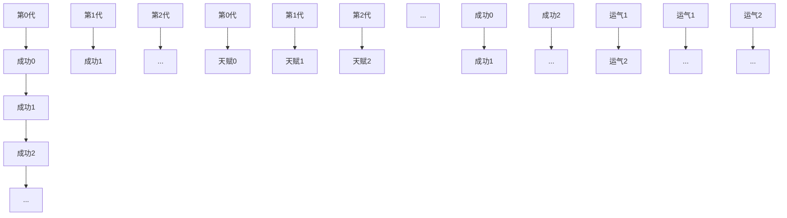
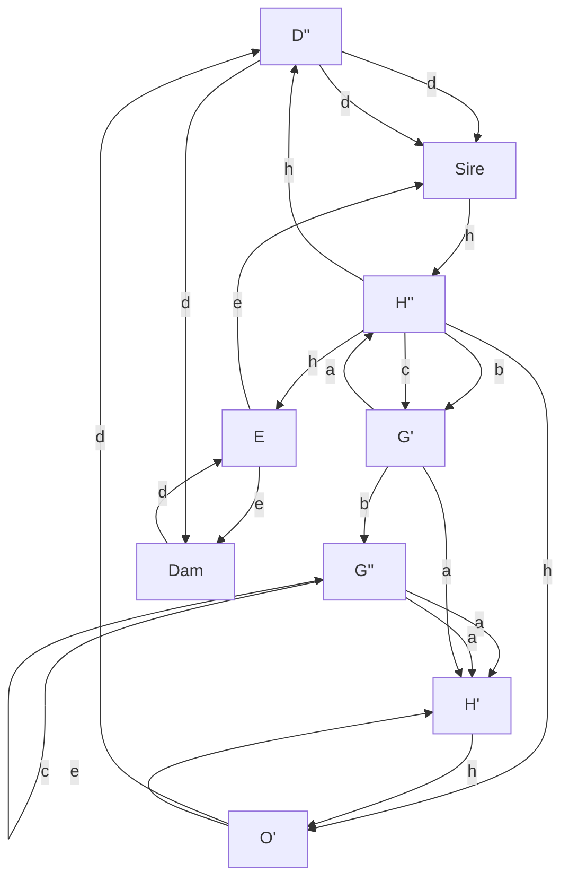
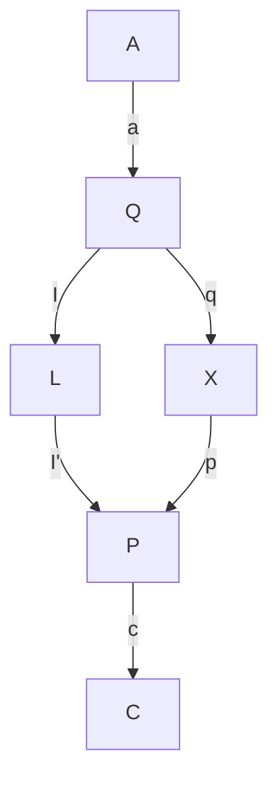

# 第二章 从海盗到豚鼠：因果推断的起源

但它（地球）仍在动。

——出自伽利略（1564—1642）


*Black-and-white illustration of a man presenting an hourglass to a podium, with a crowd observing in the background (no text or symbols)*

近两个世纪以来，英国科学界最经久不衰的仪式之一，便是在伦敦的英国皇家学院举办的“周五晚间演讲”。19 世纪，很多重大发现都是在这个会场上由演讲者首次对外宣布的：1839 年，迈克尔·法拉第发表了他的摄影原理；1897 年，约瑟夫·汤姆逊提出了电子理论；1904 年，詹姆斯·杜瓦公布了氢液化理论。

每场演讲会都是一次盛典，毫不夸张地说，演讲会就是把科学当作舞台，而台下的观众则是精心打扮（男人必须身着礼服，佩戴黑领带）的英国社会上层精英。到了指定的时间，钟声敲响，人们将迎接晚会的发言人步入礼堂。依照传统，发言人会省去自我介绍或开场白，直接开始演讲。实验和现场演示都是这一壮观场面的重要组成部分。

1877 年 2 月 9 日那天晚上的演讲者是弗朗西斯·高尔顿，英国皇家学院院士。他是查尔斯·达尔文的大表弟，著名的非洲探险家、指纹学创始人，维多利亚时期绅士科学家的典范。高尔顿演讲的题目是“典型的遗传规律”。当晚，他的实验仪器是一种奇怪的装置，他称之为“梅花机”，现在该装置常被称为“高尔顿板”。一个名为 Plinko 的类似游戏常出现在电视节目《价格猜猜看》中。

高尔顿板由一块木板和其上按三角形阵列排布的大头针或钉子组成，操作者可以通过顶部的开口塞入小金属球。金属球会像弹球那样从上往下逐层弹跳下来，最后落进底部的一排插槽中（见章首插图）。对单个金属球来说，向左或向右弹落看上去完全是随机的。然而，如果你往高尔顿板里倒入很多小球，一个惊人的规律就出现了：在底部堆积的小球的上边缘总是会形成一个近似钟形的曲线。在最接近中心的插槽中，小球会堆得高高的，插槽中的球数从中间向两侧递减，直至为零。

这种规律性的图形模式有一个数学解释：单个球下落的整个路径就像一系列独立的硬币抛掷的结果一样。小球每撞上一根大头针，其或者弹向左边，或者弹向右边，表面上看，它的选择似乎是完全随机的。而所有结果之和，即往右弹落的次数与往左弹落的次数之差，则确定了小球最终会落于哪个插槽。根据 1810 年由皮埃尔–西蒙·拉普拉斯证明的中心极限定理[^1]，任何此类随机过程，即多次硬币抛掷之总效，都会导向相同的概率分布，这种概率分布被称为正态分布（或钟形曲线）[^2]。高尔顿板只是拉普拉斯中心极限定理的一个直观演示。

中心极限定理确实是 19 世纪的数学奇迹。试想一下：虽然单个球的路径是不可预测的，但 1000 个球的路径的可预测性则非常高，这对《价格猜猜看》的制片人来说是一个很实用的事实。他们可以据此准确估算出在较长一段时间内参赛者在 Plinko 游戏中赢得的奖金数量。此外，尽管人类事物充斥着不确定因素，但同样的规律仍然让保险公司获利丰厚。

皇家学院中穿着考究的观众一定想知道这一切与遗传规律到底有什么关系，因为这是发言人约定的演讲主题。为了说明二者的联系，高尔顿向观众展示了他所收集的关于法国军队新兵身高的数据。这些数据也遵循正态分布：多数人是中等身材，特别高或特别矮的人很少。事实上，无论我们谈论的是 1000 名新兵的身高还是高尔顿板上的 1000 个小球的路径，相对应的插槽和身高类别中的数字几乎总是相同的。

因此，对高尔顿来说，梅花机就是一种关于身高遗传的模型，甚至可能也是关于许多其他遗传特征的模型。这是一个因果模型。简单来说，高尔顿相信，就像人类会遗传他们上一代的身高一样，金属小球也会“遗传”它们在梅花机中的位置。

但是，如果我们暂且接受这个模式，就会出现一个难题，这也是高尔顿当晚的主题。

钟形曲线的宽度取决于放置在钉板顶部和底部之间钉子的行数。假设我们将行数加倍，我们就构建了一个能够表示两代遗传的模型，其中上半部分代表第一代，下半部分代表第二代。此时你就会发现，第二代比第一代出现了更多的变异情况，而在随后的几代中，钟形曲线会变得越来越宽。

[^1]: 中心极限定理由皮埃尔–西蒙·拉普拉斯于 1810 年证明，是概率论中的核心定理之一。
[^2]: 正态分布，又称高斯分布，其概率密度函数呈现为对称的钟形曲线。

然而，人类身高的真实状况并未出现此种趋势。事实上，随着时间的推移，人类身高分布的宽度保持了相对的恒定。一个世纪前没有身高 9 英尺[3]的人类，现在依然没有。那么，是什么因素解释了这种总体基因遗传的稳定性呢？自 1869 年高尔顿的《世袭的天才》（*Hereditary Genius*）出版以来，他已为这一谜题苦苦思索了八年。

正如书名所表明的，高尔顿真正感兴趣的不是弹珠游戏或人的身高，而是人类的智力。作为孕育了多位科学天才的大家族的成员之一，高尔顿自然乐意证明天赋在家族中代代相传。他在这本书中着手做的正是这项研究。他煞费苦心地编纂了 605 名英国“名门之秀”上溯 4 个世纪的家谱。但他发现，这些名门之秀的儿子和父亲并没有那么优秀，其祖父母和孙辈也并非都是卓越人才。

如今我们可以很容易地找到高尔顿研究方法中的缺陷。归根结底，卓越的定义究竟是什么？有没有这种可能，即名门望族的成员获得成功只是因为他们掌握的特权而不是因为其本身的才能？尽管高尔顿意识到了这种可能的解释，但他初心不改，反而以更大的决心徒劳地寻求一个的遗传学解释。

不过，高尔顿在此过程中还是有所发现的，特别是当他开始关注类似身高这样的遗传特征的时候。与“卓越”相比，身高特征更易测量，跟遗传的关联也更强。高个子男性的儿子往往身高也比普通人高——但很可能不如他们的父辈高；矮个子男性的儿子往往身高比一般人矮——但很可能不如他们的父辈矮。一开始，高尔顿称这种现象为“复归”（reversion），后又改称为“向均值回归”（regression toward mediocrity）[4]。我们可以在许多其他的情境中观察到这种现象。如果让学生参加基于同样复习资料的两次不同的标准化测试，那么，第一次测试得分较高的学生在第二次测试中的得分通常仍然高于均值，但没有第一次那么高。这种向均值回归的现象普遍存在于生活、教育和商业领域的方方面面。比如，棒球赛中的“年度新秀”（第一赛季表现异常出色的球员）经常会遭遇“新秀墙”，即在次年的比赛中陷入表现欠佳的低谷。

当然，高尔顿并不知道这些，他认为他偶然发现的是一条遗传规律，而不是统计规律。他认为，向均值回归的背后一定存在某个因。在皇家学院的讲座中，他说明了自己的观点。他向听众展示了两层的梅花机装置（见图 2.1）。

> 【看书累了吗？休息一会！更多新书朋友圈 每日免费分享微信 xueba987。渺沧海一粟：为终身学习者赋能 2019 年 7 月】


*Diagram of a container with internal dotted pattern and vertical bars, no text or symbols present*


*(b)*  
A  
A  
B  
B


> **图 2.1** 高尔顿板，弗朗西斯·高尔顿用以类比人类的身高遗传规律。（a）将许多小球扔进弹球仪器，随机向下弹跳的小球堆积成钟形曲线。（b）高尔顿指出，经过 A 和 B 两个通道，通过两层的高尔顿板（用以模拟两代人）下落的小球所堆积成的钟形曲线会变得更宽。（c）为了抵消这种曲线变宽的趋势，他安装了斜槽，以使“第二代”小球回到中心。斜槽是高尔顿对“向均值回归”这一现象的因果解释（资料来源：弗朗西斯·高尔顿《自然遗传》，1889）

*Diagram of a container with internal dotted pattern and curved lines, no text or symbols present*

经过第一组钉子阵列后，小球会通过一个斜槽向板子的中心集中，之后再通过第二组钉子阵列。高尔顿借助这一成功的演示，展示出斜槽的设置恰好抵消了正态分布的扩散趋势。这一次，钟形曲线在代代传递中保持了恒定的宽度。

因此，高尔顿推测，向均值回归是一个物理过程，一种自然方式，用以确保身高（或智力）的分布在代代相传中保持恒定。高尔顿告诉观众：“复归过程符合遗传变异的一般规律。”他将这一过程与胡克定律进行了比较，后者描述的是弹簧恢复到稳态长度的趋势。

请记住这个日子。1877 年，高尔顿致力于寻求一个因果解释，并认为向均值回归是一个因果过程，就像物理定律一样。他错了，但他的错误绝非个例。时至今日，许多人仍在继续犯着同样的错误。例如，棒球专家总是试图寻找球员遭遇新秀墙的因果解释。他们会抱怨，“他变得过度自信了”，或者“其他球员搞清楚了他的弱点”。他们也许是对的，但新秀墙实际上并不需要一个因果解释，这种现象单凭概率规则就足以解释了。

现代统计学的解释很简单。正如丹尼尔·卡尼曼在他的著作《思考，快与慢》中总结的：“成功 = 天赋 + 运气，巨大的成功 = 更多的天赋 + 更多的运气。”一个赢得年度最佳新秀奖的球员可能的确比一般人更有才华，但他（更）可能也有很多的运气。在下个赛季，他可能就没有那么幸运了，他的平均击球率也会因此下降。

到 1889 年，高尔顿已想通了这一点。在此过程中，他在统计学脱离因果关系的路上迈出了第一大步。这既让人失望，也令人着迷。他的推理过程是微妙而晦涩的，但值得我们付出努力去理解。这是作为新生学科的统计学发出的第一声啼哭。

高尔顿开始收集各种“人体测量”方面的统计数据：身高、前臂长度、头部长度、头部宽度等。他注意到，譬如当他根据前臂长度计算身高时，同样的向均值回归的现象又出现了：高个子男性通常有长度大于均值的前臂，但又不会像他的身高那样远高于均值。显然，身高不是前臂长度的因，反之亦然。如果存在一个原因的话，那么应该说二者都是由基因遗传决定的。高尔顿开始使用一个新的词来描述这种关系：身高和前臂长度是“共同相关的”（co-related）。之后，他又将这个词简化为一个更普通的英语单词——“相关的”（correlated）。

后来，他又意识到一个更令人吃惊的事实：在进行代际比较时，向均值回归的时间顺序可以逆转。也就是说，子辈的父辈的遗传特征情况也会回归到均值。即儿子的身高若高于均值，则其父亲的身高很可能也高于均值，但往往父亲要比儿子矮（见图 2.2）。在意识到这一点时，高尔顿不得不放弃了寻找向均值回归的因果解释的任何想法，因为子辈的身高显然不可能是父辈身高的因。

这种认识乍听起来可能自相矛盾。你可能要问：“等等！你是说，高个子的父亲通常有相较他们自己而言较矮的儿子，并且同时，高个子的儿子通常有相较他们自己而言较矮的父亲——这两种说法怎么可能同时为真？儿子怎么可能既比父亲高，又比父亲矮？”答案是，我们谈论的并不是个体的父亲和个体的儿子，而是父辈和子辈两个总体。我们从身高 6 英尺的父辈总体开始算起。因为他们的身高高于均值，所以他们儿子的身高将出现向均值回归的现象，我们姑且假设他们儿子的平均身高为 5 英尺 11 英寸。然而，由父辈身高为 6 英尺的父子组合构成的总体有别于由子辈身高为 5 英尺 11 英寸的父子组合构成的总体。第一组中，所有的父亲都是 6 英尺高。但第二组中，父亲身高超过 6 英尺的较少，大部分身高不到 6 英尺，他们的平均身高要低于 5 英尺 11 英寸，再次显示了向均值回归的趋势。

另一种解释向均值回归的方法是使用所谓的散点图（见图 2.2）。每对父子组合都由

<!-- 脚注 -->

- [1] 2019 年图灵奖颁给了杰弗里·辛顿、扬·勒昆和约舒亚·本吉奥三人，以表彰他们在深度学习（deep learning）上的杰出贡献。——译者注
- [2] 可能存在一个例外情况，就是我们进行了随机对照试验，具体可参见第四章的内容。
- [3] 在命题逻辑和谓词逻辑中，蕴涵这一概念用于描述两个陈述语句集合之间的联系。——译者注
- [4] 作者用模型盲来指代对数学或统计建模一窍不通，不懂得利用已有的先验知识和经验来形式地刻画变量之间的关系的做法，该词常被用来批评纯粹数据驱动的人工智能或机器学习。——译者注

<!-- 脚注结束 -->

一个点来表示，其中 x 坐标表示的是父亲的身高，y 坐标表示的是儿子的身高。因而，父亲和儿子的身高均为 5 英尺 9 英寸（或 69 英寸）的组合可以由点（69，69）来表示，如图 2.2 所示，其位于散点图的中心。身高 6 英尺（或 72 英寸）的父亲和身高 5 英尺 11 英寸（或 71 英寸）的儿子的组合，则可以用点（72，71）表示，位于散点图的东北角。请注意，散点图的形状大致呈椭圆形，这一点对于高尔顿分析以及揭示两个变量的钟形分布特征而言至关重要。

如图 2.2 所示，父辈身高为 72 英寸的父子组合的点位于以 72 为中心的垂直框（或称“垂直切片”）内；子辈身高为 71 英寸的父子组合的点位于以 71 为中心的水平框（或称“水平切片”）内。通过观察可见，它们是两个不同的总体。如果只关注第一个总体，即父辈身高为 72 英寸的父子组合，我们可以问的问题是：其中子辈的平均身高是多少？这等于是在问垂直框的中心位置，通过观察可知其中心大约是 71。如果只关注第二个总体，即子辈身高为 71 英寸的父子，我们可以问的问题是：其中父辈的平均身高是多少？这等于是在问水平框的中心位置，通过观察可知其中心大约是 70.3。

我们可以更进一步考虑以同样的步骤分析每一个垂直框。这就相当于在问：对于身高为 x 的父辈，其子辈身高（y）的最佳预测是多少？或者，我们也可以取每个水平框，问它的中心在哪里，即对于身高为 y 的子辈，其父辈身高（x）的最佳“预测”（或倒推）是多少？

通过思考这个问题，高尔顿无意间发现了一个重要事实：预测总是落在一条直线上，他称这条直线为**回归线**，它比椭圆的主轴（或对称轴）的斜率小（见图 2.3）。事实上，这样的直线有两条，我们选择哪条线作为回归线取决于我们要预测哪个变量而将哪个变量作为证据。你可以根据父亲的身高预测儿子的身高，或者根据儿子的身高“预测”父亲的身高，这两种情况是完全对称的。这再次表明，对于**向均值回归**这一现象，因和果是没有区别的。

在已知一个变量的值的情况下，回归斜率能让你预测另一个变量的值。在高尔顿的父子身高问题中，0.5 的回归斜率意味着父亲的身高每增加 1 英寸，相应地，儿子的平均身高就增加 0.5 英寸，反之亦然。回归斜率为 1 表示两个变量呈完全相关，这意味着父亲每增高 1 英寸，这一变化都能完全地传递给儿子，使其平均身高增加 1 英寸。回归斜率不可能大于 1，否则高个子父亲的儿子其身高会进一步高于平均值，矮个子父亲的儿子其身高会进一步低于平均值，这将使得身高分布随时间的推移而变宽。这样一来，几代后可能就会出现身高 9 英尺的人和身高 2 英尺的人了，而这与现实并不相符。因此，只要身高分布在世代相传中保持不变，回归线的斜率就不能大于 1。

即使我们将两个不同类别的量关联起来，如身高和智力，回归定律依然适用。如果你在散点图中绘制这两个变量的数据点，并对坐标系进行适当的缩放，则关于两个变量之间关系的最佳拟合线的斜率总是具有相同的属性：只有当一个量可以准确地预测另一个量时，斜率才等于 1；而若预测结果几乎等同于随机猜测，则斜率等于 0。无论你是根据 Y 预测 X，还是根据 X 预测 Y，斜率（在对坐标系进行了适当缩放之后）都是相同的。换言之，斜率完全不涉及因果信息。一个变量可能是另一变量的因，或者它们都是第三个变量的果，而对于预测目标变量的值这一目的而言，这些并不重要。

高尔顿提出的相关性概念首次在不依赖于人的判断或解释的前提下以客观度量说明了两个变量是如何关联的。这两个变量可以是身高、智力或者收入，它们可以是因果的、相互独立的或反因果的关系。相关性总是能够反映出两个变量间相互可预测的程度。高尔顿的弟子卡尔·皮尔逊后来推导出了一个（经过适当调整的）回归线斜率公式，并称之为“相关系数”。时至今日，当我们想了解一个数据集中两个不同变量的关联有多强时，相关系数依然是全世界统计学家计算的第一个数值。找到这样一种通用的方式来描述随机变量之间的关系，高尔顿和皮尔逊一定曾为此激动不已。尤其是皮尔逊，在他的眼中，与相关系数这种在数学上清晰且精确的概念相比，那些关于因果的模糊而陈旧的概念似乎已经完全过时而丧失科学性了。

## 高尔顿和被丢弃的探索

高尔顿以寻找因果关系为起点，最终却发现了相关性——一种无视因果的关系。这是一段颇具讽刺意味的历史。即便如此，他的著作仍留有使用因果思维的痕迹。他在 1889 年写道：

> “很容易看出，（两个器官尺寸之间的）相关性一定是这两个器官共同变异的结果，而变异部分地归于相同的原因。”

被奉上相关性“祭坛”的第一个祭品就是高尔顿的梅花机，它是为解释总体遗传基因的稳定性而精心设计的。梅花机模拟了人类身高变异的产生，以及变异代代相传的过程。但高尔顿不得不在梅花机中设置斜槽，以控制总体中日益增加的变异。由于没有找到一个令人满意的生物机制来解释这种指向均值的复原力，高尔顿在 8 年后放弃了这一努力，并把注意力转向了危险而诱人的相关性。史学家斯蒂芬·施蒂格勒撰写了大量关于高尔顿的文章，他注意到了高尔顿在目标和志向上的这一突然转变：

> “悄然消失的是达尔文、斜槽和所有的‘适者生存’……极具讽刺意味的是，高尔顿尝试将《物种起源》的理论框架数学化的初衷最终导向了他对这部伟大著作的精髓的摒弃！”

但是在当下因果推断的语境下，对我们来说，最初的那个问题依然存在：根据达尔文的学说，变异是代代相传的，那么我们究竟应该如何解释总体的稳定性？

根据因果图回顾高尔顿的梅花机，我首先注意到的是其中装置构建的错误。那个让高尔顿不得不设置斜槽以施加反力的不断增长的分散力，从一开始就不该出现。事实上，如果我们追踪梅花机中从一层落到下一层的某个小球，我们会看到，小球在下一层的位移继承了其沿路撞到的所有钉子带给它的变化的总和。这就与卡尼曼的方程产生了明显的矛盾：

> 成功 = 天赋 + 运气  
> 巨大的成功 = 更多的天赋 + 更多的运气

根据卡尼曼的方程，第二代的成功不会继承第一代的运气。按其定义，运气本身是一个只具有短暂影响的事件，因此其对后代没有影响。然而这一具有短暂影响的事件与高尔顿的梅花机是不兼容的。

为将这两个概念放在一起比较，让我们试着画出相应的因果图。在图 2.4（a）（高尔顿的概念）中，成功是世代相传的，运气的变化是无限累积的。如果“成功”等同于财富或显赫，那这个过程看起来还算合理。然而，对于像身高这样的物理特征的遗传，我们必须用图 2.4（b）中的模式取代高尔顿的模型。因为只有可遗传的成分（在此图示中以天赋代指）是世代相传的，而运气则独立地影响每一代，影响某一代的运气因素不会直接或间接地影响其后代。


> **图 2.4** 关于遗传的两种模型。（a）高尔顿板模型，在这种模型下，运气世代相传，这就导致成功的分布不断变宽。（b）遗传模型，在这种模型下，运气不会累积，这就导致成功在代际间的稳定分布。



这两种模型都与身高的钟形分布兼容，但是第一种模型不符合身高（或成功）分布的代际稳定性。而第二种模型则表明，要解释世代相传中的特征（成功）分布稳定性，我们只需要解释总体基因遗传（天赋）的稳定性即可。这种稳定性现在被称为**哈代—温伯格平衡**，是 1908 年由戈弗雷·哈罗德·哈代和威廉·温伯格在其研究中提出的，他们为这一现象给出了一个令人满意的数学解释。是的，他们借助的工具是另一个因果模型——孟德尔遗传理论。

现在回过头看，高尔顿不可能预料到孟德尔、哈代和温伯格的工作。1877 年高尔顿发表演讲时，格雷戈·孟德尔在 1866 年所做的工作早已被遗忘（直到 1900 年才被重新发现），而哈代和温伯格在其证明中所使用的数学理论工具则很可能在高尔顿的时代还无法被理解。然而颇为有趣的是，高尔顿曾经离发现这个正确的理论框架只差一步，而绘制一张因果图可以让他很容易地找到原假设中的错误——运气可以世代相传。遗憾的是，他被自己漂亮但有缺陷的因果模型误导，继而发现了相关性的美，并从此开始相信科学不再需要因果关系了。

作为对高尔顿的故事发表的最后一点个人评论，我承认我犯了历史写作的一项大忌，这也是我在本书中犯下的许多大忌之一。20 世纪 60 年代，像我上面那样以现代科学的视角来书写历史的做法已经过时了。“**辉格史观**”（Whig history）就是一个针对此种做法的批判性术语，用于嘲弄事后诸葛亮式的历史写作风格——只关注成功的理论和实验，而对失败的实验和陷入僵局的理论发展几乎只字不提。现代风格的历史写作则变得更加民主，其给予化学家和炼金师同等的尊重，强调理解当事人身处的时代背景和社会背景对相应理论发展的影响。

然而，在阐述因果关系被统计学驱逐出去的原因时，我欣然地继承了辉格史学家的衣钵。要想理解统计学是如何变成一个模型盲、以数据约简为其主要事业的学科，我们只能拿起因果透镜，以关于因果关系的新科学为视角重新叙述高尔顿和皮尔逊的故事，除此之外我们别无他法。事实上，正是通过这种方式，我纠正了主流科学史学家在其叙述中引起的歪曲。他们缺乏因果词汇，惊叹于相关性的发明，却没有注意到它带来的灾难——因果关系的死亡。

## 皮尔逊：狂热者的愤怒

从统计学中彻底抹去因果关系的任务留给了高尔顿的学生——卡尔·皮尔逊。然而，即使是他也未能完全成功。

对于皮尔逊的一生而言，一个关键事件就是他阅读了高尔顿的《自然遗传》。他在 1934 年写道：“我觉得自己像德雷克时代的海盗，或者就像字典里说的，‘不完全是海盗，但无疑有成为海盗的倾向’！”他认为：“高尔顿的本意是，存在一个比因果关系更广泛的范畴，即相关性，而因果关系只是被囊括于其中的一个有限的范畴。这种关于相关性的新概念在很大程度上将心理学、人类学、医学和社会学引向了数学处理的领域。是高尔顿第一次将我从偏见中解救出来。这种偏见就是：可靠的数学工具只能应用于解释因果关系范畴下的自然现象。”

在皮尔逊的眼中，高尔顿扩展了科学的词汇。因果关系被简化为仅仅是相关关系的一个特例（在这一特例中，相关系数为 $1$ 或 $-1$，两个变量 $x$ 和 $y$ 之间的关系是确定的）。在《科学语法》（*The Grammar of Science*，1892）中，他清晰地表达了自己的因果观：

> “一个特定的事件序列在过去已经发生并且重复发生，这只是一个经验问题，对此我们可以借助因果关系的概念给出其表达式……在任何情况下，科学都不能证明该特定事件序列中存在任何内在的必然性，也不能绝对肯定地证明它必定会重复发生。”

总而言之，**因果关系对于皮尔逊来说仅仅是一种重复**，在确定性的意义上是永不可证的。至于不确定性世界中的因果论，皮尔逊更是不屑一顾：“描写两个事物之间关系的终极的科学表述，总可被概括为……一个列联表（contingency table）[6]。”换言之，数据就是科学的全部，毋庸赘言。在这个观点中，第一章所讨论的干预和反事实的概念并不存在，因果关系之梯的最底层就是科学家进行科学研究所需的一切。

从高尔顿到皮尔逊的这种思想飞跃是惊人的，皮尔逊也确实配得上海盗之名。高尔顿仅仅证明了一种现象——向均值回归——不需要因果解释。而皮尔逊则已准备好了将因果关系从科学中完全清除。那么，究竟是什么让他迈出了这一步？

历史学家泰德·波特在他的传记《卡尔·皮尔逊》里提出，皮尔逊对因果关系的怀疑早在他读到高尔顿的书之前就已经产生了。皮尔逊一直在设法解决物理学的哲学基础问题，例如他曾写道：“力作为运动的因，与树神作为生长的因可等同视之。”更概括地说，皮尔逊属于一个名为**实证主义**的哲学学派，该学派认为宇宙是人类思想的产物，而科学只是对这些思想的描述。因此，因果关系被解释为一个发生在人类大脑之外的世界中的客观过程，不具有任何科学意义。有意义的思想只能反映观察结果中存在的特定模式，而这些模式完全可以通过相关关系描述出来。皮尔逊认定相关性是比因果关系更普遍的人类思维描述符号，由此，他便准备好了彻底摈弃因果关系。

波特生动地描绘了皮尔逊的一生，称其为自我标榜的“**Schwärmer**”，这是一个德文单词，可译为“爱好者”，但也可以被解读为程度更强的“狂热分子”。1879 年皮尔逊从剑桥毕业后，在德国待了一年，爱上了德国文化，很快就将自己的名字由 Carl 改成 Karl。皮尔逊早在成名之前就是一个社会主义者，1881 年他曾写信给卡尔·马克思，主动提出要把《资本论》翻译为英文。皮尔逊可能也是英格兰最早的女权主义者之一，他在伦敦创办了“男性女性俱乐部”，专门讨论“女性问题”。他关注妇女的社会从属地位，主张应为她们的工作支付合理的报酬。他对各种思想充满激情，同时对自己的激情又有着清醒的认识。他花了近半年的时间劝说他后来的妻子玛丽·夏普嫁给他。从他们二人的信件来往可以看出，玛丽曾经非常担忧自己达不到他对于伴侣智力的理想要求。

在发现高尔顿及其相关性后，皮尔逊终于找到了自己激情的聚焦点：一个他认为可以改变整个科学世界，并把数学的严谨性带入诸如生物学、心理学这样的领域的绝妙理念。他带着海盗般的使命感致力于完成这项任务。

他的第一篇统计学论文发表于 1893 年，在高尔顿发现相关性的 4 年之后。1901 年，他创办了《生物统计学》（*Biometrika*）期刊，直至现在它仍是影响力最大的统计学期刊之一（说起来不可思议，正是该期刊于 1995 年刊载了我的第一篇关于因果图的完整论文）。1903 年，皮尔逊获得了服装商同业工会的拨款，在伦敦大学学院创办了计量生物学实验室。1911 年，高尔顿去世，同年该实验室正式成为伦敦大学学院的一个院系，高尔顿留下的一笔遗产被用于设置教授之职（并且遗嘱规定必须由皮尔逊担任院系的第一位教授）。在接下来的至少 20 年中，皮尔逊的计量生物学实验室一直是统计学世界的中心。

在获得教授之职后，皮尔逊的狂热表现得越来越明显。波特在其传记中写道：

> “皮尔逊发起的统计学运动带有明显的派系斗争性质。他要求同事表示百分之百的忠诚，有奉献精神，并且曾迫使异议人士离开这个他所建立起的计量生物学的‘教会’。”

最早追随他的研究助手乔治·乌德尼·尤尔也是最先感受到皮尔逊的狂热和愤怒的人之一。1936 年，尤尔为英国皇家学会写了皮尔逊的讣告。这篇讣告虽然措辞委婉，但仍然明确地表达了尤尔在那些日子所遭受的精神折磨：

> 诚然，他的热情所带来的感染力是很可贵的，但他的强势，甚至包括他过于热切地给予帮助的行为，都给他人造成了伤害……这种支配欲，这种一切事都必须如他所愿的偏执，也体现在了别的方面，尤为突出的是编辑《生物统计学》的过程。可以说，这一期刊肯定是有史以来学界公开发行的最能体现编辑者个人倾向的学术期刊……那些后来离开了他的团队并开始独立做研究的人曾指出，在发现双方观点存在分歧之后，继续维持友好的关系就变得非常困难，而表达批评就更不可能了，这种令人痛苦的事情已发生过很多次了。

即便如此强势，皮尔逊舍弃了因果论而建构起来的科学大厦还是出现了裂痕，或许在创建者手中，它出现的裂痕甚至还要多于其在门徒手中出现的裂痕。例如，皮尔逊本人就曾出人意料地撰写过几篇关于“伪相关性”的论文，而这正是一个不借助因果关系就无法理解的概念。

皮尔逊注意到，发现显然不合理的相关关系是相对容易的。例如，在皮尔逊之后的时代，有人曾提到过这样一个有趣的例子：一个国家的人均巧克力消费量和该国诺贝尔奖得主的人数之间存在强相关。这种相关性显然是很愚蠢的，因为不管我们怎么想象，吃巧克力看起来都不可能导致我们获得诺贝尔奖。一个更可靠的解释是，在富裕的西方国家，吃巧克力的人更多，而且诺贝尔奖得主也是优先从这些国家中选出的。但这是一个因果解释，对皮尔逊来说，这不是科学思维所必需的要素。对他而言，因果关系只是“对于现代科学中一些深奥难解的事物的一种迷信”，相关性才应该是科学理解的目标。但这种观点让他在不得不解释为什么一个相关性是有意义的而另一个就是“伪相关”时陷入了一种尴尬的境地。他解释说，真正的相关性能够表明变量之间的一种“有机关系”，而伪相关则不能。但什么是“有机关系”呢？这难道不是因果关系的另一种叫法？

皮尔逊和尤尔一起收集了几个伪相关的例子。其中一类典型的例子如今被称为“混杂”，巧克力—诺贝尔奖的故事就属此类。（经济情况和地理位置是混杂因子，或者说是巧克力消费与诺贝尔奖得奖频率的共因。）类似的“荒谬相关”的另一种类型往往出现在时间序列数据中。例如，尤尔发现英国某年的死亡率与由英国教堂主持婚礼的婚姻在总体中的比例之间有着极高的相关性（0.95）。这难道说明上帝要惩罚婚姻幸福的信徒吗？不！这只不过是两种独立的历史趋势在同一时间出现而已：该国的死亡率正在下降，同时，英国教会的成员人数也在下降。由于两者同时下降，因此两者之间出现了正相关，但两者并没有因果联系。

早在 1899 年，皮尔逊就发现了可能是最有趣的一种“伪相关”——当两个异质总体合二为一时，“伪相关”就出现了。皮尔逊和高尔顿一样，也是一个狂热的人体数据收集者，他获得了来自巴黎地下墓穴的 806 块男性颅骨和 340 块女性颅骨的测量数据（见图 2.5）。他计算了颅骨长度和宽度的相关性。在只考虑男性或女性的数据时，二者的相关性可以忽略不计，也就是说颅骨长度和宽度之间没有显著的相关性。但在把两组不同性别的数据合并后，二者的相关系数就变成了 0.197，这一数值通常被解读为较为明显的正相关。

这一结论在某种意义上也是可以理解的，因为颅骨长度短可能表明它属于女性，因而其宽度可能也相对较窄。然而，皮尔逊认为这只是一个统计假象。相关系数为正这一事实并没有生物学意义或“有机”含义，而仅仅是不恰当地将两个不同的总体结合在一起的结果。


> 图 2.5 卡尔·皮尔逊与巴黎地下墓穴的颅骨（资料来源：由达科塔·哈尔绘制）
>
> Black-and-white illustration of a historical figure examining a skull with a pen, alongside a document (no text or symbols visible)

这个例子是一种更为普遍的现象的一个特例，该现象被称作“辛普森悖论”。我们将在第六章讨论在何种条件下我们应该对数据进行分割，并解释为什么将异质总体的数据结合起来处理时会产生伪相关。但现在，让我们先看看皮尔逊是怎么说的：

> “对于那些坚持把所有相关关系视为因果关系的人来说，这一事实定然令人震惊——通过人工混合两个类似种属，我们就能让两个毫不相关的特征 A 和 B 之间产生相关性。”

正如斯蒂芬·施蒂格勒的评论所言：“我禁不住猜测，他自己可能才是第一个对此感到震惊的人。”可以看出，皮尔逊实质上是在自责自己从因果关系的角度思考问题的倾向。

如果现在透过因果透镜再来看一下这个例子，我们只能说，皮尔逊真是错失了良机！在理想的世界里，这样的例子可能会促使一位天才科学家思考自己为此而震惊的原因，继而创建出一种科学方法用以预测在何种情况下这样的伪相关会出现。至少，他应该能够向大家揭示何时可以聚合数据，何时不可以。但皮尔逊给他的追随者提供的唯一指导意见就是“人造”的聚合（无论它意味着什么）都是不好的。

讽刺的是，使用因果透镜，我们现在已经意识到了，在某些情况下，正确的分析结果只能来自聚合数据，而非来自分组数据。因果推断的逻辑能够在事实上告诉我们应该信任哪一个结果。我多么希望皮尔逊能与我们一起分享这一发现！

皮尔逊的学生并不都是对他亦步亦趋的。尤尔就因为一些其他的原因与皮尔逊闹翻了，他们在学术研究上就此分道扬镳。起初，尤尔属于强硬派阵营，相信相关性能够揭示我们在科学领域所需要理解的一切。然而，当他试图解释伦敦的贫困状况时，他的看法发生了改变。

1899 年，他致力于研究“院外救济”（指不通过救济院向贫困家庭发放救济）是否提高了贫困率这一问题。数据显示，得到较多院外救济的区域反而有着较高的贫困率。但尤尔发现，这种相关性可能是伪相关，因为这些地区可能有更多的老年人，而这些人往往会越来越穷。不过，他紧接着就发现，即使将老年人占比相同的地区进行比较，院外救济和贫困率的相关性仍然存在。这一发现鼓励了他勇敢说出自己的结论：贫困率的提高可以归因于院外救济。

但是，在“越界”做出了这个因果判定后，他再次回归“正轨”。在论文的一个脚注里，他写道：

> “严格说来，‘归因于’应当读作‘与……相关’。”

这句话为他之后的几代科学家设定了一个表述模式：虽然在心里想的是“归因于”，但在论文写作时要把它说成“与……相关”。

皮尔逊和他的追随者对因果关系深怀敌意，而像尤尔这类不坚定的追随者害怕与他们的领袖正面对抗，这就为大洋彼岸的另一位科学家提供了机会，对回避因果的文化首次提出了正面挑战。

---

## 休厄尔·赖特、豚鼠和路径图

1912 年，当休厄尔·赖特刚刚来到哈佛大学时，其学术背景很难让人相信此后他会对科学界造成如此深远的影响。他曾就读于伊利诺伊州一个不起眼（现已解散）的大学——伦巴第学院。毕业时，他所在的班级只有 7 名学生。他的父亲菲利普·赖特曾是他的老师之一。菲利普·赖特是个学术多面手，甚至担任过学院打印社的经营者。休厄尔和他的兄弟昆西也曾在这家打印社帮忙，期间他们还代为发表了卡尔·桑德堡的第一首诗——后者当时尚未出名，只是伦巴第学院的一名普通学生。

大学毕业后很长一段时间里，赖特和他的父亲菲利普一直保持着密切的联系。在赖特搬到马萨诸塞州之后，菲利普也搬去了。之后，赖特前往华盛顿特区工作，菲利普也随之迁居，先是在美国关税委员会任职，然后是在布鲁金斯学院做经济学研究。尽管他们的学术兴趣有所不同，但他们还是找到了合作的方法：菲利普是第一个使用他儿子发明的路径图的经济学家。

赖特来到哈佛大学学习遗传学，这是当时最热门的学科之一，因为格雷戈·孟德尔的显性和隐性基因理论刚刚被重新发现。赖特的导师威廉·卡斯托已经确定了影响兔子毛色的 8 种不同的遗传因子（我们现在称之为基因）。卡斯托指派赖特对豚鼠进行同样的研究。1915 年获得博士学位后，赖特得到了一个特别适合他的工作岗位：在美国农业部负责饲养豚鼠。

后来的人可能很想知道，美国农业部在雇用赖特时是否预料到了他们会得到怎样的回报。或许农业部当时只是希望雇用一个手脚勤快的动物管理员，顺便帮他们整理好之前 20 年积累下来的混乱的饲养记录。赖特不仅完成了任务，而且做了很多额外的工作。

赖特所饲养的豚鼠是他整个职业生涯的跳板，也是他提出其进化理论的基石，就如同激发了查尔斯·达尔文提出进化论灵感的加拉帕戈斯群岛的雀鸟一样。赖特是这一观点的早期倡导者：进化不是如达尔文假想的那样渐进地发生，而是一种相对突然的爆发。

1925 年，赖特在芝加哥大学得到了一个终生教职。这个职位本来可能更适合一个拥有广泛理论兴趣的研究者，但他仍十分专注于豚鼠研究。有个广为流传的轶事是：有一次，赖特在上课时带来了一只豚鼠，其间一不留神就开始用它擦起了黑板（见图 2.6）。尽管他的传记作者认为这个故事很可能是虚构的，但这至少说明，赖特对豚鼠的执着给公众留下了深刻的印象。


> 图 2.6 休厄尔·赖特首次建立了一套根据数据回答因果问题的数学方法，这种方法被称为路径图或路径分析。他对数学的热爱仅次于对豚鼠的热情（资料来源：由达科塔·哈尔绘制）

Cartoon of a man presenting in front of a blackboard with a diagram and mathematical annotations, likely illustrating a physics or mathematics concept.

最令我感兴趣的是赖特在美国农业部所做的早期工作。赖特发现，豚鼠的毛色遗传与孟德尔遗传定律是相抵触的。事实证明，纯白或纯色的豚鼠根本无法培育出来，甚至连多代近亲交配的豚鼠家族的后代在毛色上也存在明显的变异，毛色从多半为白色到多半为彩色不等。这一事实与孟德尔遗传定律的预测是相矛盾的，该预测认为，多代近亲繁殖能够“固定”某种特质。

赖特开始怀疑毛发白色素的数量是由某个基因独立控制的，并据此提出一种假设：是母鼠子宫内存在的某种“发育因子”（developmental factors）导致了豚鼠某些特征的变异。我们现在已经知道赖特的这一假设是正确的。不同的毛色基因会表现在豚鼠身体的不同部位，毛色的图案不仅取决于豚鼠继承的基因，而且取决于这些基因的遗传表现出现在豚鼠的什么身体部位，以及它们以何种组合得以表达或抑制。

亟待解决的研究问题催生出了新的分析方法——该现象在科学界可谓屡见不鲜（至少对于具有独创性的研究者来说确实如此）。赖特开创的分析方法在他之后得到了极大的发展，其应用范畴远远超越了最初的豚鼠基因研究。不过，对当时的休厄尔·赖特来说，测算发育因子可能只是一个大学水平的问题，在伦巴第学院他父亲教授的数学课中就可以得到解决。在寻求某个未知量的值时，你可以先赋予该量一个符号，然后用数学方程的形式描述你对该量和其他相关量的认识，最后，如果你有足够多的耐心和足够多的方程，你就可以解出方程式，并算出目标量的值。

在赖特的例子中，未知的目标量是 $d$（见图 2.7），即“发育因子”对白色毛发的影响。被纳入方程式的其他表示因果关系的量（下文简称因果量）还包括“遗传因子” $h$，这也是一个未知量。赖特表示，如果知道图 2.7 中的因果量，我们就可以通过一个简单的图形规则推测出数据中的相关关系（图 2.7 中没有显示此部分内容）。这一方法正体现了赖特的独创性。这条规则在深奥而隐秘的因果关系世界和处于表层的相关关系世界之间架起了一座桥梁。这是研究者在因果论和概率论之间建立的第一座桥梁，其跨越了因果关系之梯第二层级和第一层级之间的障碍。在建造了这座桥梁之后，赖特就可以进行反向的实践，从根据数据测算出的相关性（第一层级）中发现隐藏在背后的因果量 $d$ 和 $h$（第二层级）。他通过求解代数方程完成了这个任务。这一想法对赖特来说也许很简单，但实际上是一种极具革命性的思路，因为它首次证明了“相关关系不等于因果关系”这个判定应该让位于“某些相关关系确实意味着因果关系”。


> 图 2.7 休厄尔·赖特的第一个路径图，其中西雷（Sire）和达姆（Dam）分别是豚鼠父母的名字，左侧“Chance”一词在此表示随机因子。该路径图说明了决定豚鼠毛色的因子。$D$ = 发育因子（存在于豚鼠母亲怀孕以后，子鼠出生之前），$E$ = 环境因子（存在于子鼠出生以后），$G$ = 来自豚鼠父亲或母亲个体的遗传因子，$H$ = 来自豚鼠父母双方的混合遗传因子，$O$、$O'$ = 豚鼠后代。该分析的目的是估计 $D$、$E$、$H$ 的影响强度（图中记作 $d$、$e$、$h$）（资料来源：休厄尔·赖特，《国家自然科学院学报》，1920，第 320–332 页）



最后，赖特的分析结果表明，假设中的发育因子比遗传因子发挥了更重要的作用。在随机繁殖的豚鼠中，**42%** 的毛色变异是由遗传因子引起的，**58%** 是由发育因子引起的。相比之下，在一个多代近亲繁殖的豚鼠家族中，白色毛发的变异只有 **3%** 是出于遗传因子的影响，而有 **92%** 是出于发育因子的影响。换言之，在经过的 20 代近亲交配后，由遗传因子引起的变异已被完全消除，但由发育因子引起的变异依然存在。

这一结果十分有趣，不过对于本书的主题而言，问题的关键还在于赖特阐述自己观点的方式。图 2.7 中的路径图就相当于一张导航地图，告诉了我们该如何通过第一层级和第二层级之间的桥梁。这是一场借助一张路径图完成的科学革命——可爱的豚鼠也做出了它的贡献！

你是一位 Markdown 排版专家。请对以下 Markdown 内容进行格式化优化，要求如下：

1. **修正标点符号**：统一中英文标点使用规范，修正明显的标点错误。
   - 中文内容要使用中文标点符号。
2. **优化空白字符**：删除多余空格，规范段落间距，保持合理的换行。
3. **保持结构完整**：不修改、不删除任何标题，保持原有的 Markdown 标题层级。
4. **保持内容语义**：不增删任何实质内容，仅做排版层面的优化。
   - 较长的内容注意切分成若干小段。

修正内容包括但不限于以下方面：

1. **行间批注/脚注分离**：将原文中混杂在正文段落里的批注内容提取出来，格式化为 `>` 引用块，使正文与注释清晰分离。
2. **数学公式符号与格式统一**：注意修复错误的 LaTeX 符号与公式。
   - 数学公式使用 `$xxx$` 与 `$$ f(x) $$` 的格式。
3. **文本与公式间距统一**：在公式块前后添加适当的空行，使排版更加清晰美观。
4. **图片引用格式统一**。
5. **列表格式修正**。
6. **表格格式转换**：将 HTML `<table>` 格式的习题表转换为标准 Markdown 表格，添加表头和对齐方式。  
   表格由于使用 `|` 做分隔符，则表格中的数学公式 `$...$` 中，如果有 `|`，会造成混淆，请将其修复。如：`$|x|$` 修复成 `$\vert x \vert$`。
7. **参考文献格式统一**。
8. **其他细节修正**。
9. **重点内容使用粗体或斜体高亮**。
10. **算法伪代码**：不需要使用 ` ``` ` 包围，直接格式化成 Markdown 无序列表的格式，注意缩进。

## 输出要求

- 直接输出格式化后的完整 Markdown 内容。
- 不要添加任何解释、说明或额外注释。
- 保持原有的代码语言标记（如 ` ```python `）不变。

---

注意，这张路径图显示了所有你能想到的可能影响后代豚鼠毛色的因子。字母 **D**、**E** 和 **H** 分别表示发育因子、环境因子和遗传因子。每个父鼠（西雷）或母鼠（达姆）及其每个子女（后代 O 和 O'）都有它自己的 D、E 和 H 因子集合。两代豚鼠的环境因子相同，但发育过程有所不同。

该路径图也体现了当时孟德尔遗传学说的新见解：豚鼠父母的精子细胞和卵细胞（G 和 G''）决定了其后代的遗传因子（H），而精子细胞和卵细胞又是由豚鼠父母的遗传因子（H'' 和 H'''）经由某种尚未被理解的混合过程（因为当时学界还未发现基因的存在）决定的。不过，当时的人们已经认识到，这种混合过程包含一定程度的随机性（在图中标记为“Chance”，即随机因子）。

这张路径图中没有明确显示的是近亲繁殖家族和正常家族的区别。在近亲繁殖的豚鼠家族中，豚鼠父母的遗传因子存在强相关性，赖特用 H'' 和 H''' 之间的双向箭头来表示这种关系（图 2.7 中未显示）。除此之外，图中的每个箭头都是单向的，由因指向果。例如，从 G 到 H 的箭头表示，豚鼠父亲的精子细胞可能对其后代的遗传因子有直接的因果影响。从 G 到 H' 没有箭头，这表明决定了后代 O 遗传因子的精子细胞对后代 O' 的遗传因子没有因果影响。

当你以这种方式挨个拆分图中的箭头时，你就会发现每个箭头都有很明确的含义。另外请注意，每个箭头都附带一个小写字母（a、b、c 等）。这些字母被称为“路径系数”（path coefficient），代表了赖特想要求解的因果效应的强度。粗略地说，路径系数表示源变量（source variable）在多大程度上引起了目标变量中的变异。

例如，一个显而易见的路径系数是，每个豚鼠后代的遗传性结构都应当有 50% 来自其父，50% 来自其母，所以 a 应该是 1/2。（出于便于数学计算方面的考虑，赖特倾向于采用平方根的方式表示路径系数，因此 $\scriptstyle \mathrm { a = 1 } / \sqrt { 2 } , \mathtt { a } ^ { 2 } = 1 / 2$。）就当时而言，这种根据由一个变量引起的另一个变量的变异的多少解释路径系数的说法是十分合理的。

不过，现代因果推断科学的解释不同于此：路径系数表示的是对源变量进行一次假设的干预所得到的结果。而由于干预这一概念直到 20 世纪 40 年代才出现，因此在 1920 年赖特撰写这篇论文的时候，他是不可能预先考虑到这一点的。幸运的是，在他当时分析的那些较为简单的路径图中，这两种解释带来的结果是一样的。

我想在此强调的是，路径图不只是一张漂亮的图画，它更是一个强大的计算工具，因为计算相关关系的规则（从第二层级到第一层级的桥梁）就是追踪连接两个变量的所有路径，并将沿途所有的路径系数相乘。另外还需注意，箭头缺失所蕴含的假设实际上比箭头存在所蕴含的假设更重要。两个变量间箭头缺失这一事实将二者的因果效应限制为零，而箭头存在这一事实并不能告诉我们因果效应的大小具体为何（除非我们事先对路径系数赋值）。

赖特的论文是一篇杰作，理应被视为 20 世纪生物学发展的一个里程碑。当然，它也是因果关系科学发展史上的一个里程碑。图 2.7 是有史以来首次公开发表的因果图，标志着 20 世纪的科学迈向因果关系之梯第二层级的第一步。这不是试探性的一步，而是大胆、果断的一步！第二年，赖特发表了一篇命题更为宏观的论文，名为“相关关系和因果关系”，详细阐述了路径分析在豚鼠育种之外的其他情境中是如何运作的。

我不知道这位 30 岁的科学家对这篇论文的反响有怎样的期待，但我敢肯定这篇论文在当时实际引发的讨论一定让他大吃一惊。一个名叫亨利·尼尔斯的人于 1921 年发表了一篇针对这篇论文的反驳文章，他是美国统计学家雷蒙德·珀尔（特此声明，虽然姓氏相同，但此人并非我的亲戚）的学生，而雷蒙德·珀尔则是统计学教父卡尔·皮尔逊的门徒。

学术界充斥着以温文尔雅为表象的野蛮行径，我也有幸在自己原本平静如水的职业生涯中经受过一些考验。但即使如此，像尼尔斯给出的那种措辞如此激烈的批评仍然是极少见的。他首先根据他的英雄——卡尔·皮尔逊和弗朗西斯·高尔顿的一系列名言，证明了“因”这个词的多余和无意义性。他得出结论：

> “对比‘因果关系’和‘相关关系’是没有根据的，因为因果关系只是一种完全相关。”

他的这句话直接呼应了皮尔逊在《科学语法》中所发表的论述。

尼尔斯进一步贬损了赖特的整个方法论。他写道：

> “该方法的基本谬误应当是认为有可能先验地建立起一个相对简单的图形系统，且该系统能够真实地反映多个变量作用于彼此及一个共同结果的方式。”

由于根本没有费心去了解赖特的计算规则，尼尔斯通过对一些例子的分析以及笨拙的计算得出了完全相反的结论。最后，他宣称：

> “我们因此得出结论，从哲学层面来看，路径系数方法在其建立基础上就存在严重的缺陷，而从应用层面来看，使用这种方法计算出的结果被证明是完全不可靠的。”

从科学的角度来看，尼尔斯的批评也许不值得我们花费时间详细讨论，但他的论文对作为正在探究因果关系科学发展史的我们来说是非常重要的。首先，这段话忠实地反映了他那一代人对于因果关系的态度，以及他的导师卡尔·皮尔逊对那个时代科学思维的霸权统摄。其次，我们今天仍能听到与尼尔斯持同样立场的反对之声。

当然，有时科学家无法掌握各个变量之间的关系网络的全部。在这种情况下，赖特认为，我们可以在探索模式下使用路径图，假设某些因果关系存在并据此计算出变量之间的相关强度估计值。如果这一估计值与实际数据相矛盾，那么我们就有证据说明我们假设的因果关系是错的。1953 年，赫伯特·西蒙（1978 年诺贝尔经济学奖得主）重新发现了这种使用路径图的方法，这为社会科学领域的许多研究工作带来了很大的启发。

虽然我们不需要知道各个变量之间的所有因果关系，仅利用部分信息也能够得出一些结论，但赖特非常清楚地指出了这一点：**没有因果假设，就不可能得出因果结论**。这与我们第一章的结论相呼应：只使用从因果关系之梯第一层级的数据，你是不可能回答属于因果关系之梯第二层级的问题的。

有时人们问我：“这难道不会引起循环论证吗？你所做的难道不正是假设你想证明的东西？”答案是否定的。通过将非常中庸的、定性的、显而易见的假设（例如，豚鼠后代的毛色不会影响豚鼠父母的毛色）与 20 年的豚鼠培育数据相结合，赖特得出了一个定量的，且并不显而易见的结论：后代豚鼠毛色 42% 的变异来自遗传。从显而易见的事实中提取非显而易见的内容并不是循环论证——**这是科学的胜利，我们理当为此鼓掌欢呼**。

赖特的贡献是独一无二的，因为他得出结论（42% 的遗传性）所需要的信息分属于两种截然不同的、几乎不相容的数学语言：一种是图形语言，另一种是数据语言。这种将定性的“箭头指向信息”与定量的“数据信息”（完全是两门外语！）相结合的独具创新的想法简直是一个奇迹，它完全迷住了我，将我这个计算机科学的研究者引向了一个全新的研究领域。

许多人仍然会犯尼尔斯的错误，认为因果分析的目的只是证明 X 是 Y 的因或从头开始找到 Y 的因。这的确是因果关系研究中的**因果发现难题**，也是我第一次投身于图形化建模时雄心勃勃地试图解决的问题，直到现在，这依然是一个充满活力的研究领域。相比之下，赖特的研究重点，以及本书的讨论重点，则是用数学语言表达看似合理的因果知识，将其与经验数据相结合，回答具有实际价值的因果问题。

赖特从一开始就明白，解决因果发现问题要困难得多，甚至几乎可以说是不可能的。在对尼尔斯批评文章的回应中，他写道：

> “作者（赖特本人）从未提出过这一荒谬的主张，即路径系数理论为因果关系的推导提供了通式。作者希望强调的是，将相关关系的知识与因果关系的知识相结合以获得某些结果的做法，与尼尔斯所暗示的从隐含的相关关系推导因果关系不是一回事。”

# “但它仍在动！”

如果我是一个专业的史学家，我可能会在上一节就此打住。但作为一名自封的“辉格史学家”，我无法抑制自己对上节结尾中赖特言论的准确性表达由衷的钦佩。这句话在首次发表的 90 年后的今天也并未过时，因为它从根本上定义了现代因果分析的新范式。

我对赖特这段真知灼见的钦佩，仅次于我对他的勇气和决心的钦佩。请大家想象一下 1921 年的情况：一个自学成才的数学家，独自面对统计学界的霸权。他们告诉他：

> “你的方法是基于对科学意义上因果关系本质的全然误解。”

而他反驳说：

> “并非如此！我的方法创造出了重要的事物，其价值超越任何你们可以创造的东西。”

他们说：

> “我们的专家在 20 年前就对这些问题进行了研究，并得出结论——你的分析方法完全是无稽之谈。你所做的只不过是把一些相关关系结合起来，推导出另一个相关关系而已。等你‘长大’了，你就会明白了。”

而他继续说：

> “我不是看不起你们的专家，但事实就是事实。我的路径系数不是相关关系，而是一种完全不同的事物：因果效应。”

试着想象自己是一个幼儿园小朋友，你的朋友都嘲笑你相信“3 + 4 = 7”，因为大家学到的都是“3 + 4 = 8”。再想象一下，现在你去寻求老师的帮助，而她也说“3 + 4 = 8”。那么，你会不会在回家之后问自己：也许是你自己的思维方式出现了什么问题？即使是意志最坚定的人，在这种情况下也会动摇信念。我就曾身处这所幼儿园，我对此感同身受。

但赖特并没有陷入自我怀疑。这场争论涉及的不仅仅是算术问题，因为算术问题至少可以借助某种独立的验证过程得到证明。只有曾经的哲学家敢于对因果关系的性质发表意见。那么，赖特是从哪里得到了这个内在的信念，确信他的确走在正确的轨道上，而幼儿园的其他人才是错的呢？也许他在美国中西部地区的成长经历和他所念的那所名不见经传的大学，激发了他的自立精神，并教会了他：最可靠的知识，就是由自己亲手构建的知识。

我在学校读到的最早的一本科学著作中，讲述了宗教法庭如何迫使伽利略放弃他的日心说，而伽利略又是怎样坚持己见的。他在最后的审判中曾低声为自己的信念辩护道：“但它（地球）仍在动”（*“E pur si muove”*）。我认为世界上没有哪个孩子在读过这个故事之后，会不被他的勇气鼓舞。然而，尽管我钦佩他的坚持，我还是禁不住想：至少他还有天文观测数据可以依靠。而赖特只有一个未经检验的结论——发育因子引起的变异占比 58%，而非 3%。他无所依靠，除了内心的信念——路径系数能够阐释的事实，是相关性所无法阐释的。而他依然选择公开宣布：“但它仍在动！”

在我的同事告诉我，我的贝叶斯网络与当时的人工智能主导理论发生了冲突（详见第三章）时，我表现得相当固执、执拗、毫不妥协。事实上，我记得自己完全相信自己的方法，没有丝毫犹豫。但当时的我也有概率理论作为支撑。而赖特甚至连一个可以依靠的定理都没有。科学家们在那时已经放弃了因果关系，因此赖特没有任何可以诉诸的理论框架。他也不能像尼尔斯那样从权威专家的观点中找到支持，因为他无从引述——毕竟这些专家早在 30 年前就宣布了他们的判决。

但对赖特来说，值得欣慰并且表明了他正身处正确道路的一个事实是：他确切地意识到，他可以借助自己的方法回答借助任何其他方式都无法回答的问题。确定几个因子的相对重要性，就属于这样的问题。另一个出色的例子可以在他 1921 年的论文《相关关系和因果关系》中找到。他在这篇论文中提出了这个问题：如果豚鼠在母鼠的子宫里多待了一天，这会对其出生体重产生多大的影响？让我们来仔细研究一下赖特的答案，以欣赏他的方法之美，并尽可能满足那些想了解路径分析的数学原理的读者。

你是一位 Markdown 排版专家。请对以下 Markdown 内容进行格式化优化，要求如下：

1. **修正标点符号**：统一中英文标点使用规范，修正明显的标点错误
   1. 中文内容要使用中文标点符号
2. **优化空白字符**：删除多余空格，规范段落间距，保持合理的换行
3. **保持结构完整**：不修改、不删除任何标题，保持原有的 Markdown 标题层级
4. **保持内容语义**：不增删任何实质内容，仅做排版层面的优化
   1. 较长的内容注意切分成若干小段

修正内容包括但不限于以下方面：

1. 行间批注/脚注分离
   将原文中混杂在正文段落里的批注内容提取出来，格式化为 > 引用块，使正文与注释清晰分离。例如：
2. 数学公式符合与格式统一，注意修复错误的 latex 符号与公式
   1. 数学公式使用 $xxx$ 与
      $$
      f(x)
      $$
      的格式
3. 文本与公式间距统一
   在公式块前后添加适当的空行，使排版更加清晰美观。
4. 图片引用格式统一
5. 列表格式修正
6. 表格格式转换
   将 HTML <table> 格式的习题表转换为标准 Markdown 表格，添加表头和对齐方式。
   表格由于使用 `|` 做分隔符，则表格中的数学公式 $...$ 中，如果有 `|`，会造成混淆，请将其修复。如：$|x|$ 修复成 $\vert x \vert$。
7. 参考文献格式统一
8. 其他细节修正
9. 重点内容使用粗体或斜体高亮
10. 算法伪代码不需要使用 "```" 包围，直接格式化成 markdown 无序列表的格式，注意缩进

## 输出要求

- 直接输出格式化后的完整 Markdown 内容
- 不要添加任何解释、说明或额外注释
- 保持原有的代码语言标记（如 ```python）不变

---

请注意，我们不能直接回答赖特的问题，因为我们不能在子鼠还在母鼠子宫内时为其称重。不过，我们可以做的是，比较比如孕期 66 天和孕期 67 天的豚鼠的出生体重。

赖特通过比较分析指出，在子宫里多待了一天的豚鼠其出生体重平均增加了 5.66 克。据此，有人可能会草率地得出结论，在出生之前，豚鼠胚胎每天增长大约 5.66 克体重。

**“这是错的！”** 赖特会这样说。晚出生的幼鼠之所以晚出生通常是有原因的，比如同窝产仔数相对较少。这意味着，在母鼠怀孕期间，幼鼠有更有利的成长环境。例如，只有 2 个兄弟姐妹的幼鼠在母鼠怀孕 66 天时的体重通常会比有 4 个兄弟姐妹的幼鼠的体重要重。因此，出生体重的差异存在两个原因，我们需要将二者区分开来：增长的 5.66 克体重中有多少是由于子鼠在母鼠子宫内多待了一天，有多少是由于子鼠可以只与较少的兄弟姐妹竞争？

赖特通过绘制路径图回答了这个问题。如图 2.8 所示，$X$ 代表幼鼠的出生体重。$Q$ 和 $P$ 代表出生体重的两个已知原因：妊娠时长（$P$）和产前子鼠在母鼠子宫内的生长速率（$Q$）。$L$ 代表同窝产仔数，同时影响 $P$ 和 $Q$（较多的同窝产仔数会导致子鼠生长缓慢，其待在子宫内的天数也会相应减少）。我们可以测量每只豚鼠的 $X$、$P$ 和 $L$，但无法测量 $Q$，这一点非常重要。最后，$A$ 和 $C$ 是我们无法获得任何数据的外因（例如与同窝产仔数无关的影响产前子鼠生长速率和妊娠时长的遗传及环境因素）。还有一个重要假设是这些因素相互独立，这一假设在图中由它们彼此之间没有任何箭头也没有任何共同的祖先节点所明示。


> 图 2.8 豚鼠出生体重示例的因果图（路径图）



> $X$ = 出生体重  
> $Q$ = 产前生长速率（未观测）  
> $P$ = 妊娠时长  
> $L$ = 同窝产仔数  
> $A$ = 生长速率的其他因（未观测）  
> $C$ = 妊娠时长的其他因（未观测）

现在，赖特面临的问题是：**“妊娠时长 $P$ 对于出生体重 $X$ 的直接效应是什么？”** 此前得到的数据（子鼠每天增加 5.66 克体重）并不能告诉你这一直接效应，它告诉你的是一个包含由同窝产仔数 $L$ 带来的偏倚的总的相关性。为了得到直接效应，我们需要消除这个偏倚。

在图 2.8 中，直接效应由路径系数 \( p \) 表示，对应于路径 P → X。同窝产仔数所引起的偏倚对应于路径 P ← L → Q → X。现在让我们展示一个代数魔法[7]：偏倚的大小等于其所涉路径沿途的路径系数的乘积（换言之，其值为 \( l \times l' \times q \)）。如此一来，总的相关性就是两条路径的路径系数之和：用代数表示就是，\( p + l \times l' \times q = 5.66 \) 克/天。

如果我们已知路径系数 \( l \)、\( l' \) 和 \( q \)，那么我们就可以算出偏倚的大小，而用 5.66 克/天减去它，我们就得到了我们想要的路径系数 \( p \) 的值。但我们并不知道路径系数 \( l \)、\( l' \) 和 \( q \)，因为 Q 无法测量。而这正是路径系数的巧妙之处。赖特的方法告诉我们如何用路径系数来表示每个需要测量的相关性。在对每组变量间的相关性（P, X）、（L, X）和（L, P）执行此操作之后，我们就会得到 3 个方程，并可以据此用代数方法求解未知路径系数 \( p \)、\( l' \) 以及 \( l \times q \)。然后问题就解决了，因为我们想要的路径系数 \( p \) 的值现在已经可以计算出来了。

今天，我们完全可以跳过中间的数学处理步骤，仅通过粗略查看该路径图计算 \( p \) 的值。但在 1920 年，这是第一次有人提出可以利用数学来连接因果关系和相关关系的观点——它的确奏效了！赖特计算出的 \( p \) 的值是 3.34 克/天。换言之，如果所有其他的变量（A、L、C、Q）都保持不变，只是妊娠时长增加一天，那么幼鼠的出生体重平均增长 3.34 克/天。请注意，这个结果在生物学上是有意义的。它告诉了我们豚鼠幼崽出生前每天的生长速度有多快。相比之下，每天 5.66 克这个数字则没有生物学意义，因为它反映的是两个相互独立的过程合并后的影响，且其中之一（路径图中的 P ← L）不是因果关系，而是反因果（或诊断）关系。

我们通过该例得到的第一个经验是：因果分析允许我们量化在现实世界中实际存在的某个过程（豚鼠幼崽每天增加 3.34 克而非 5.66 克体重），而非只能分析数据中的模式。我们得到的第二个经验是：无论是否采用数学处理，在路径分析中，你都能通过检查整个路径图得出关于单个因果关系的结论。而如果你想测算某个具体的路径系数，你可能就需要进一步分析路径图的整体结构了。

在科学按照理想逻辑一步步发展的世界里，赖特对尼尔斯的答复理应激发起广泛的科学兴趣，随之而来的则是科学家和统计学家纷纷采纳他的方法进行各自领域的科学研究的热潮。可惜事实并非如此。“1920 年到 1960 年，科学史上一件极为匪夷所思的事情发生了，这件事就是，除了赖特本人和研究动物育种的学者之外，路径分析没有得到广泛的应用，”遗传学家、赖特的同事詹姆斯·克洛写道，“虽然赖特已经阐明了这些方法适用于许多不同的问题，但没有人追随他的脚步。”克洛不知道的是，他给出的这一评价在后来的社会科学领域也得到了普遍的认同。1972 年，经济学家亚瑟·戈德伯格感叹赖特的工作在那段时间被“可耻地忽略了”，他满怀对赖特的敬仰，写道：“（赖特的）方法……在近期的社会学领域掀起了因果建模的热潮。”

如果我们能回到过去，询问赖特同时代的研究者“你为什么不曾留意赖特的方法”就好了！克洛指出了一个原因：路径分析“不适合解决包含‘固定程序’的问题。其使用者必须先有一个假设，并设计出一张恰当的、包含多重因果序列的结构图”。的确，克洛指出了一个关键点：路径分析需要建立在科学思考的基础上，因果推断的每一次实践也都需要建立在科学思考的基础上。而统计学则一如既往地打压这种做法，鼓励采用“固定程序”解决问题。统计学家总是喜欢针对数据进行常规性的计算，而不喜欢接受那些挑战了他们已有知识体系的方法。

继高尔顿和皮尔逊之后，罗纳德·艾尔默·费舍尔成为当时统计学界无可争议的领袖，他简洁地描述了这种差异。1925 年，他写道：“统计学可被视为……对数据约简方法的研究。”请注意这句话中的“方法”“约简”“数据”等字眼。赖特憎恶的恰恰就是将统计学仅仅作为收集数据处理方法的科学这种想法，而费舍尔则认同这种想法。因果分析绝不只是针对数据的分析；在因果分析中，我们必须将我们对数据生成过程的理解体现出来，并据此得出初始数据不包含的内容。但有一点费舍尔说得没错：一旦你从统计学中删除因果关系，那么剩下的就只有数据约简了。

虽然克洛没有提到，但赖特的传记作者威廉姆·普罗文指出了另一个可能造成路径分析不受欢迎的因素。20 世纪 30 年代中期以来，费舍尔一直将赖特视为自己的敌人。我在前文曾引用过尤尔的话，其中提到如果有学者不赞同皮尔逊的观点，他们的关系就会立即紧张起来，而批评皮尔逊的观点就更不用说了。同样的说辞也适用于费舍尔。他与任何与其意见相左的人都有过激烈的辩论，这些人包括皮尔逊、皮尔逊的儿子埃贡、耶日·奈曼（我们将在第八章中谈到更多关于后两个人的事迹），当然还有赖特。

费舍尔和赖特之间争论的真正焦点不是路径分析而是进化生物学。费舍尔不同意赖特的理论（“基因漂变”理论），即一个物种在经历了种群瓶颈期后会迅速进化。这场争论的细节超出了本书的讨论范围，感兴趣的读者可以查阅普罗文的著作。与本书主题相关的部分是：从 20 世纪 20 年代到 50 年代，科学界的大部分人都把费舍尔视作统计学领域的权威。而我们可以肯定的是，费舍尔从未对任何人说过关于路径分析的半句好话。

20 世纪 60 年代，事情开始发生变化。一群社会学家，包括奥蒂斯·邓肯、休伯特·布莱洛克，以及经济学家亚瑟·戈德伯格，重新发现了路径分析，将其视作预测社会政策和教育政策实施效果的有效方法。

历史上另一个颇具讽刺意味的事件是，1947 年，赖特曾受邀向“考利斯委员会”中一群颇具影响力的计量经济学家发表演讲，但他没能完成向他们传达路径图究竟可以做什么用这一使命。只有当这些计量经济学家自己也产生类似的想法时，他们才能与这种方法建立起短暂的联系。

路径分析在经济学和社会学中有着不同的命运轨迹，但两者最终都走向了对赖特思想的背叛。社会学家将路径分析改名为**结构方程建模**（Structural Equation Modeling，简称 SEM），他们接纳了其中的图形表示法，并将其广泛应用于各类研究——直到 1970 年，一个叫作“LISREL”（线性结构关系模型）的计算机程序包被开发出来，用于自动计算（某些情境下的）路径系数。赖特很可能预测到了接下来发生的事：路径分析变成了一种生搬硬套的方法，研究者则变成了软件使用者，对后台发生的事情全无兴趣。

20 世纪 80 年代末，统计学家大卫·弗里德曼对解释结构方程模型背后的假设提出了公开挑战，而无人能够做出有效回应，一些顶尖的结构方程模型专家甚至拒绝承认结构方程模型与因果论存在任何联系。

> **注**：models，没有简称。

经济学家几乎完全舍弃了路径图，且时至今日依然如此，他们更多地借鉴了数值方程和矩阵代数方面的内容。这样做的一个可怕后果就是，由于代数方程是没有方向性的（$x = y$ 与 $y = x$ 相同），经济学家也就无法利用符号表示法来区分因果关系和回归方程，因此即使在解出方程之后，他们仍然无法回答与估计策略效果有关的问题。直到 1995 年，大多数经济学家依然没能明确地赋予方程以因果意义或反事实意义。即使是那些利用结构方程来进行决策的人，也对图形表达法秉持着无可救药的怀疑态度，而不顾事实上图形表达法能够为他们节省一页纸又一页纸的计算量。受此传统观念的影响，一些经济学家直到今天仍然声称：“一切尽在数据之中。”

出于所有这些原因，直到 20 世纪 90 年代，路径图的科学使命才得到了部分实现。1983 年，赖特本人又一次被召回学术圈为路径图辩护，这一次是在《美国人类遗传学杂志》（*American Journal of Human Genetics*）上。写这篇文章的时候，赖特已经年过 90。这篇文章的题目与他在 1923 年写的那篇文章的题目完全一样，因此阅读这篇文章让人悲喜参半。

在科学史上，有幸在提出某理论的第一篇论文发表后的 60 年再次聆听这位理论开创者的讲述的机会能有几次？这就像 1925 年查尔斯·达尔文从坟墓里爬出来为斯科普斯猴子审判案做证一样。但这也是一种不幸，因为在这 60 年中，他的理论本该得到发展和壮大，而事实则是，自 20 世纪 20 年代以来，该理论几乎没有任何进展。

赖特撰写这篇论文的初衷是回应一篇对路径分析的批判文章。这一批判文章发表在同一本杂志上，是由塞缪尔·卡林（斯坦福大学数学家、1989 年美国国家科学奖章获得者，为经济学和种群遗传学做出了非常重要的贡献）和两个共同作者撰写的，其中最值得我们关注的是卡林的两个论点。

首先，卡林反对路径分析，其给出的原因是尼尔斯没有提到的：路径分析假设路径图中任意两个变量之间的所有关系都是线性的。这个假设允许赖特用一个数字，即路径系数来描述因果关系。如果方程不是线性的，那么 $X$ 中一个单位的变化对 $Y$ 的影响就取决于 $X$ 的当前值，而不能用一个固定的系数来表示。卡林和赖特都没有意识到，这一观点包含着一般非线性理论的萌芽。（在这场争论的三年后，我的实验室中的一位优秀的研究者，托马斯·维尔玛，创建了这一理论。）

而卡林最值得关注的批评，也是他自己认为最重要的一条：“……最终，综合各方面的因素考虑，我们认为最有效的做法是采用一种无模型的方法，借助一系列的展示、指标和对比来交互地理解数据。该方法强调了在解释结果时‘稳健性’这一概念的重要性。”卡林的这句话清楚地显示了自皮尔逊时代以来统计学界的观念变化是多么微乎其微，以及皮尔逊思想的影响之巨直到 1983 年仍不减其威。卡林表达的是，数据本身就已经包含了所有的科学智慧，只需要（通过“展示、指标和对比”）对其进行稍加打磨，数据便会吐出那些智慧的珍珠。我们的分析不需要考虑数据生成的过程。使用“无模型方法”，我们也能做得一样好，甚至更好。如果皮尔逊今天依然健在，生活在我们现在这个大数据的时代，他一定会说：答案都在数据之中。

显然，卡林的说法违背了我们在第一章学到的所有内容。在谈论因果关系时，我们必须有一个关于真实世界的心理模型。“无模型方法”也许能把我们带到因果关系之梯的第一层级，但肯定不会让我们走得更远。

值得称赞的是，赖特意识到了“无模型方法”中蕴藏的巨大风险，并以明确的措辞指出：“卡林等人将无模型方法作为首选的替代方案……他们所要求的不仅是方法的改变，还包括放弃路径分析的本来目的，忽略对各种因的相对重要性的评估。因为没有模型，我们就不可能进行此类分析。对那些需要进行这种评估或分析的人，他们给出的建议就是：放弃吧，去做别的事情。”赖特完全清楚他是在捍卫科学方法和数据解释的本质。在今天，我也想给大数据、无模型分析方法的爱好者提出同样的建议。当然，我们可以尽可能地梳理出数据所能提供的信息，但我们要问的是，这样做究竟能给我们带来多大的帮助。它永远无法让我们超越因果关系之梯的第一层级，也永远无法回答“各种因的相对重要性”这种简单的问题。让我们重复一遍伽利略的那句话：“但它仍在动！”

# 从客观性到主观性——贝叶斯连接

在赖特的回应中，他所讨论的另一个主题很可能暗示了统计学家抵制因果关系的另一个原因。他在文章中一再指出，他不希望路径分析变成“陈规俗套”。赖特认为：“路径分析这种灵活的方法与为尽可能避免偏离客观性而设计的刻板的描述统计方法有很大的区别。”这句话是什么意思？

首先，赖特想说的是，路径分析的应用应该以研究者对因果过程的个人理解为基础，这种理解就反映在其所绘制的因果图或路径图中。它不能被简化为一个机械性的程序，就像统计手册里列出的那些操作方法一样。对于赖特来说，绘制路径图不是一种统计学实践，而是一种遗传学、经济学、心理学实践或其他诸领域的研究者在自己的专业领域所进行的一种实践。

其次，赖特将“无模型方法”的诱人之处归因于其客观性。自 1834 年 3 月 15 日伦敦统计学会成立伊始，客观性就是统计学家的圣杯。学会的创始章程规定，在所有的情况下，数据都优先于观点和解释。数据是客观的，而观点是主观的。这个规则的提出远远早于皮尔逊时代。为客观性而奋斗，完全根据数据和实验进行推理的思想，自伽利略以来一直是科学定义自身存在方式的一部分。

与相关性分析和大多数主流统计学不同，因果分析要求研究者做出主观判断。研究者必须绘制出一个因果图，其反映的是他对于某个研究课题所涉及的因果过程拓扑结构的定性判断，或者更理想的是，他所属的专业领域的研究者对于该研究课题的共识。为了确保客观性，他反而必须放弃传统的客观性教条。在因果关系方面，**睿智的主观性比任何客观性都更能阐明我们所处的这个真实世界**。

在上段中，我说“大部分”统计工具都力求完全客观，也就是说存在一个重要的例外。在过去的 50 多年里，作为统计学分支之一的贝叶斯统计越来越受人青睐。它曾被认为是一种异端邪说，如今则完全变身为主流思想。在今天的统计学会议上，你已经不会再见到“贝叶斯学派”和“频率派”（frequentists）之间发生激烈辩论的情形，而在 20 世纪 60 年代和 70 年代，此类争论曾频繁爆发。

贝叶斯分析的原型是这样的：**先验判断 + 新的证据 → 经过修正的判断**。例如，假设你抛掷 10 次硬币，发现其中有 9 次结果是正面朝上。那么此时你认为硬币抛掷是一个公平的游戏这一判断就可能会发生动摇，但你具体在多大程度上动摇了呢？

一位正统的统计学家会说：“在没有任何额外证据的情况下，我倾向于认为这枚硬币掺有杂质，所以我敢打赌，下一次抛掷硬币时，硬币正面朝向的概率为 9∶1。”而一位贝叶斯统计学家会说：“等一下，我们还需要考虑一下我们对于这枚硬币的先验知识。”这枚硬币是从附近的杂货店买的，还是从一个名声不怎么样的赌徒那儿得来的？如果这只是一枚普通的硬币，那么大多数人是不会因为 9 次结果为正面朝上的巧合就发生动摇的。相反，如果我们可以合理怀疑这枚硬币被做了手脚，那我们会更愿意得出这一结论，即 9 次正面朝上的结果充分证明了偏倚的存在。

贝叶斯统计为我们提供了一种将观察到的证据与我们已有的相关知识（或主观判断）结合起来以获得修正后的判断的客观方法，借由这种方法，我们就可以对下一次硬币抛掷结果的预测进行修正。而频率派无法忍受的正是贝叶斯学派允许观念以主观概率的形式“入侵”“纯洁”的统计学王国的做法。在贝叶斯分析被证明是一种优秀的工具，且适用于各种应用场景，包括天气预报和追踪敌方潜艇之后，主流的统计学家也只能勉强地承认对手的成功。此外，许多例子已经证明，随着数据量的增加，先验判断的影响会越来越小，乃至彻底消失，这就让我们最终得到的那个结论仍然是客观的。

遗憾的是，主流统计学界对贝叶斯学派的主观性的接受并没能促进其对因果主观性的接受，他们仍然排斥在分析问题之前先依据已有的因果知识绘制路径图的方法。为什么？答案在于表述语言上的巨大障碍。为了阐明主观假设，贝叶斯统计学家沿用了高尔顿和皮尔逊的“母语”——概率语言。而阐述因果推断的假设需要的是一种内涵更丰富的语言（如因果图），这对于贝叶斯学派和频率派而言同样陌生。贝叶斯学派与频率派之间的和解表明，哲学上的障碍还可以用善意和通用语言来弥合，而语言上的障碍则远没有那么容易克服。

此外，即使数据量增加，因果信息中的主观成分也不一定会随着时间的推移而减少。绘制出两个不同的因果图的两个人可以分析相同的数据，但很可能永远不会得出相同的结论，无论数据有多“大”。这对于科学客观性的倡导者来说是一个可怕的前景，也说明了他们拒绝依赖主观因果信息的确有其必然性。

从积极的一面说，因果推断在一个极其重要的意义上是客观的：一旦两个人就假设达成了一致，因果推断就为他们提供了一种**百分之百客观**的方法用以解释任何新出现的证据（或数据）。因果推断的这一属性与贝叶斯推断是一致的。因此，对于我在真正进入因果推断科学领域之前，曾以贝叶斯概率为起点，围着贝叶斯网络走了一大圈弯路的经历，内行的读者可能并不惊讶。我将在下一章讲述这个故事。