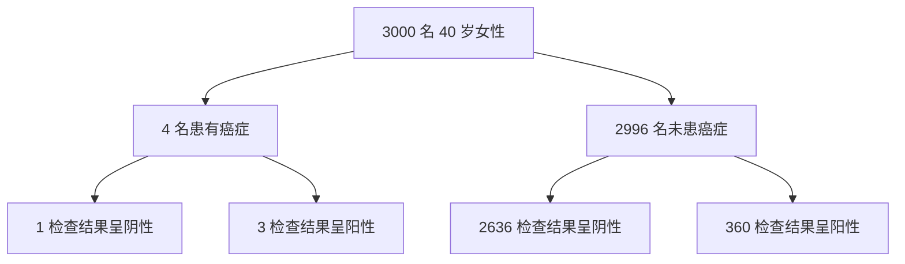
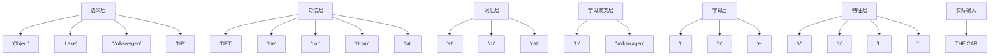
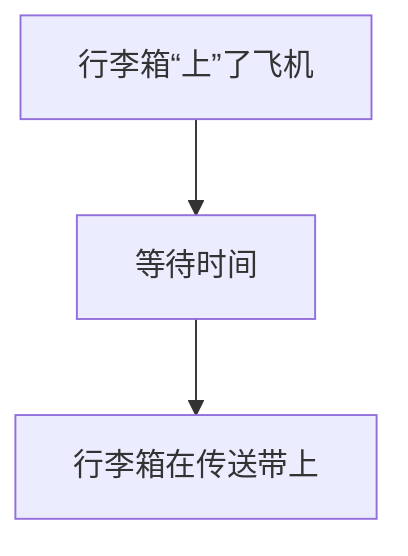
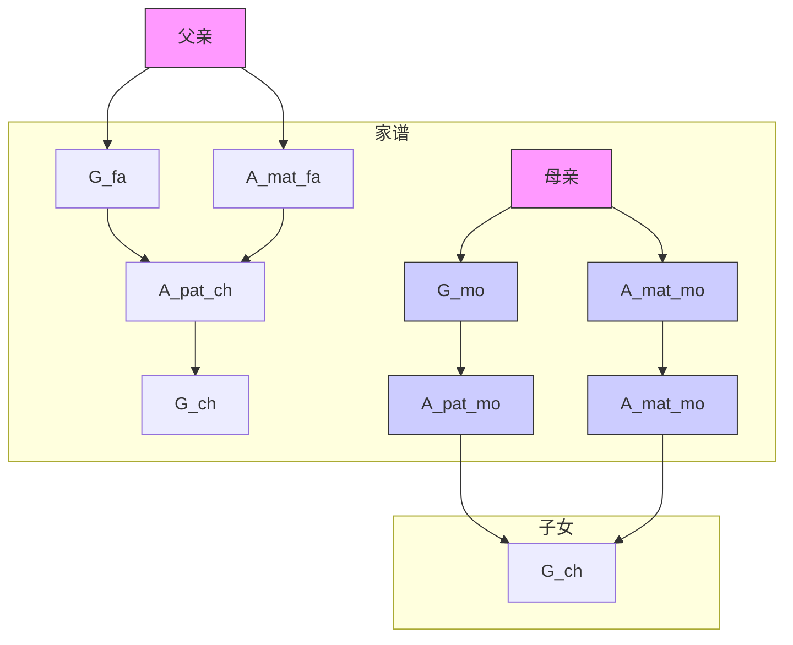

# 第三章 从证据到因：当贝叶斯牧师遇见福尔摩斯先生

二人若不同心，岂能同行？

狮子若非捕猎，岂会在林中咆哮？

——《阿摩司书》3:3

> 这才是最基本的，亲爱的福尔摩斯先生！
>
> $P(A|B)P(B) = P(B|A)P(A)$
>
> ——MHAREL

“这只是最基本的，亲爱的华生。”夏洛克·福尔摩斯如是说，之后他便会用超凡脱俗的演绎推理将他忠实的助手搞得一头雾水。事实上，福尔摩斯所做的并非只是从假设推出结论的演绎，他的拿手本领是归纳。与演绎正好相反，归纳是从证据推出假设。

他的另一句名言暗示了他的惯用手法：“当你排除了所有不可能的，剩下的那个无论有多么不可思议，都一定是真相。”为推断出那个正确的假设，福尔摩斯会在归纳出几个可能的假设之后，一个接一个地进行排除。虽然归纳和演绎息息相关，但前者看起来要神秘得多。也正是掌握了归纳法才让福尔摩斯这样的侦探大有用武之地。

然而近年来，人工智能专家在从证据到假设以及从结果到原因的自动化推理方面取得了相当大的进展。我有幸借助开发了实现该功能所必需的一项基本工具——**贝叶斯网络**，参与了这一发展进程的最初阶段。在本章中，我将简略地对贝叶斯网络做一下介绍，考察当前该工具的一些应用实例，并向大家讲述我在最终进入因果关系研究领域之前所走过的曲折道路。

## 电脑侦探波拿巴

2014 年 7 月 17 日，马来西亚航空公司飞往吉隆坡的 17 号航班从阿姆斯特丹的史基浦机场起飞。令人心痛的是，这架飞机没能抵达目的地。起飞 3 小时后，飞机飞越乌克兰东部上空，被一枚俄罗斯制造的地对空导弹击落。机上的 298 人，包括 283 名乘客和 15 名机组人员全部遇难。

7 月 23 日，第一批遇难者遗体抵达荷兰的那天，后来被荷兰政府确定为全国哀悼日。对于位于海牙的荷兰法医研究所（NFI）的调查人员来说，7 月 23 日则是倒计时开始的日子。他们的工作是尽快明确遇难者遗体的身份信息，将他们送回亲人身边安葬。时间紧迫，因为分析结果一天不出来，遇难者家属就要继续痛苦一天。

调查人员面临着许多困难。尸体被严重烧毁，许多尸体由于不得不使用防腐剂储存，其 DNA（脱氧核糖核酸）信息也遭到了破坏。此外，由于乌克兰东部是战区，法医专家只能不定时地进入坠机地点附近的有限范围内搜查。在长达 10 个月的时间里，不断有新的遗体被发现并送至法医研究所。而最大的困难是，调查人员没有遇难者 DNA 的记录，原因很简单，遇难者不是罪犯。他们必须依靠与遇难者家庭成员 DNA 的部分匹配来确定遇难者的身份。

幸运的是，法医研究所的科学家有一个强大的工具，这个工具名为“**波拿巴**”，它是目前最先进的遇难者身份识别程序。该软件是由荷兰奈梅亨市拉德堡德大学的一个研究小组于 2000 年年中开发的。利用贝叶斯网络，该软件能够综合比对来自遇难者几个不同家庭成员的 DNA 信息。

法医研究所能最终在 2014 年 12 月识别出 298 名遇难者中 294 人的身份，很大程度上应归功于波拿巴的精确和高效。截至 2016 年，只剩下 2 名坠机事件的遇难者（均为荷兰公民）的遗体未能被找到和识别。

**贝叶斯网络**，作为波拿巴软件进行自动化推理的工具基础，其影响着我们生活的许多方面，尽管大多数人对此并不知晓。它广泛应用于语音识别软件、垃圾邮件过滤器、天气预报、潜在油井位置评估以及美国食品和药物管理局对医疗器械的审批过程。如果你在微软 Xbox 游戏机上玩电子游戏，那么你会发现贝叶斯网络还被用于对你的技巧水平进行排名。如果你有一部手机，那么从成千上万个电话中筛选出打给你的电话就是通过**信念传播算法**（belief propagation）来解码的，而信念传播是专为贝叶斯网络设计的一种算法。

作为“互联网之父”之一的温顿·瑟夫曾说：“我们所有人都是贝叶斯方法的超级用户。”在本章中，我将讲述贝叶斯网络的故事，从 18 世纪其发展根源讲起，一直讲到 20 世纪 80 年代其蓬勃发展，并列举多个应用案例。贝叶斯网络与因果图之间的关系很简单：**因果图就是一个贝叶斯网络**，其中每个箭头都表示一个直接的因果关系，或者至少表明了存在某个因果关系的可能性。反过来，并非所有的贝叶斯网络都是因果关系网络，而在很多实际应用中这一点并不重要。但是，一旦你想问关于贝叶斯网络的第二层级或第三层级的问题，你就必须认真对待因果论，一丝不苟地画出因果图。

## 贝叶斯牧师与逆概率问题

1985 年，我以托马斯·贝叶斯[1] 的名字命名了我所创建的概率理论。托马斯·贝叶斯本人大概从来没有想过，他在 18 世纪 50 年代推导出的公式有一天会被用来识别遇难者的身份。当时，贝叶斯关心的只是关于两个事件的概率，其中一个事件（假设）发生在另一个事件（证据）之前。虽说如此，因果论在他心中还是非常重要的。事实上，对因果解释的追求是他提出“逆概率”（inverse probability）分析背后的驱动力。

托马斯·贝叶斯（1702—1761）是一位长老会牧师，但看上去更像个数学怪才。身为英格兰教会的反对者，他不能到牛津大学或剑桥大学学习，因而在苏格兰大学接受了高等教育。我们现在猜测，他在那里很可能学到了许多数学知识。回到英格兰后，他继续探索数学领域，并组织了一个数学讨论圈子。

在他去世之后才发表的一篇文章（见图 3.1）中，贝叶斯解决了一个很适合他本人来解决的问题，即数学与神学的较量。这篇文章的背景是，苏格兰哲学家大卫·休谟在 1748 年写了一篇题为“论神迹”的文章，其中他指出，目击者的证词永远无法证明神迹的发生。休谟所指的神迹显然是基督复活，但他很聪明，没有明确地把这件事说出来。（在这篇文章发表的 20 年前，神学家托马斯·伍尔斯顿就因为发表了类似言论被裁决为亵渎上帝而锒铛入狱。）休谟的主要观点是，本质上不可靠的证据是不能推翻衍生于自然法则的诸如“人死不能复生”这样的命题的。

> **图 3.1** 《哲学汇刊》1763 年第 LIII 卷杂志扉页。这期杂志刊载了托马斯·贝叶斯有关逆概率的遗作，并在首页中发表了理查德·普莱斯的推荐信

> PHILOSOPHICAL TRANSACTIONS, GIVING SOME ACCOUNT OF THE Present Undertakings, Studies, and Labours, OF THE INGENIOUS, IN MANY Considerable Parts of the WORLD. VOL. LIII. For the Year 1763. LONDON: Printed for L. DAVIS and C. REYMERS, Printers to the ROYAL SOCIETY, against Gray's-Inn Gate, in Holbourn. M.DCC.LXIV.

> [370] quodque folumcerta nitrifigna praberefed plura oncurrere debere,utde vero nitro producto dubium non relinquatur. LII. An Essay towards solving a Problem in the Doctrine of Chances. By the late Rev. Mr. Bayes, F.R.S. communicated by Mr. Price, in a Letter to John Canton, A.M. F.R.S. Dear Sir, Read Dec. 23, 1763. I Now send you an essay which I have found among the papers of our deceased friend Mr. Bayes, and which, in my opinion, has great merit, and well deserves to be preserved. Experimental philosophy, you will find, is particularly interested in the subject of it；and on this account there seems to be particular reason for thinking that a communication of it to the Royal Society cannot be improper. He had, you know, the honour of being a member of that illustrious Society, and was much esteemed by many in it as a very able mathematician. In an introduction which he has writ to this Essay, he says, that his design at first in thinking on the subject of it was, to find out a method by which we might judge concerning the probability that an event has to happen, given circumstances, upon supposition that we know nothing concerning it but that, under the same circumstances...

对于贝叶斯来说，休谟的观点很自然地引发了一个问题，有人可能会称其为福尔摩斯式的问题：需要多少证据才能让我们相信，我们原本认为不可能发生的事情真的发生了？在何种情况下，某个假设才会越过绝不可能的界限抵达不大可能，甚至变为可能或确凿无疑呢？虽然这个问题是用概率语言表述的，其含义却带有明显的神学色彩。

理查德·普莱斯是与贝叶斯同属一个教会的牧师。他在贝叶斯的遗物中发现了这篇文章后便送去杂志发表，并亲自写了一篇热情洋溢的推荐信，在信中他非常清楚地表明了这一点：

> 我的目的是要说明我们为什么要相信事物的形成自有其固定法则，从而说明我们为什么要相信这个世界的建构一定是某种具有高度智慧和力量的因导致的果，进而证实作为那个最终的因的上帝的存在。不难看出，本文所解决的逆向问题可以更直接地服务于这一目的；因为它清晰准确地告诉我们，在任何事件以某种特定的顺序发生或事件重复发生的情况下，为什么我们应该认为这种秩序或重复发生是源于某个自然稳定的因或规则，而不是源于任何偶然。

贝叶斯本人在他自己的论文中并没有讨论这一问题，是普莱斯自作主张凸显了其神学方面的意义，其目的或许是让他的朋友的论文产生更广泛的影响。但事实证明，贝叶斯并不需要这种帮助。大约 250 年后，他的论文被再次提起并引发了广泛争议，不是因为其神学方面的意义，而是因为它表明了我们可以从一个果推断某个因的概率。如果我们知道因，那我们很容易就能估计出果的概率，这是一个前向概率（forward probability）。而它的反面，也就是贝叶斯时代的“逆概率”推理，则难度要大得多。贝叶斯没有解释为什么它很困难，他认为这一点不言而喻，但他向我们证明了逆概率推理是可行的，并展示了如何操作。

为了解问题的本质，让我们看看他在这篇论文中提到的例子。不妨想象一下我们正在打台球，假设台球会在桌面上经多次反弹曲折行进，因此我们无法确定它会停在哪里。那么，球在距桌子左端 $x$ 英尺这个范围内停下来的概率是多少？如果我们知道桌子的长度，而且桌子十分平滑，那么这就是一个非常简单的问题（见图 3.2 上部）。例如，在一个长 12 英尺的台球桌上，球在距桌边缘 1 英尺范围内停下来的概率是 $\frac{1}{12}$。在一个长 8 英尺的台球桌上，这个概率就是 $\frac{1}{8}$。

L  
x  

> **图 3.2** 托马斯·贝叶斯的台球桌示例。其中上部的示意图对应于一个前向概率问题：已知台球桌的长度，要求计算球在距桌边缘 \(x\) 英尺范围内停止的可能性。下部的示意图对应于一个逆概率问题：我们已经观察到球在距桌边缘 \(x\) 英尺范围内停止了，现在要求估计桌子长度为 \(L\) 的可能性（资料来源：马雅·哈雷尔绘图）

\[
L = ? \quad x = ?
\]

对物理学的直观理解告诉我们，一般来说，如果桌子的长度为 \(L\) 英尺，球在距桌边缘 \(x\) 英尺范围内停止的概率是 \(x/L\)。一方面，桌子的长度越长，这个概率就越低，因为球可以停止的位置越来越多。另一方面，\(x\) 越大，这个概率就越高，因为球的可停止区域越来越大。

现在让我们考虑一下逆概率问题。我们观察到球的最后停止位置在距桌边缘 \(x = 1\) 英尺的范围内，但我们不知道桌子的长度 \(L\)（见图 3.2 下部）。对此，贝叶斯牧师提出的问题是：**桌子长度为 100 英尺的概率是多少？** 常识告诉我们，\(L\) 更可能是 50 英尺，而不是 100 英尺，因为桌子越长，我们就越难解释为什么球会停止在离桌边这么近的位置。但这个可能性具体有多大呢？对此，直觉或常识并不能给予我们明确的指导。

为什么前向概率（已知 \(L\) 求 \(x\) 的概率）比逆概率（已知 \(x\) 求 \(L\) 的概率）更容易估算？在这个例子中，这种不对称性来自 \(L\) 为因、\(x\) 为果这一事实。若我们观察到一个因，如鲍比向窗户扔球，则大多数人可以预测到果（球可能会打破窗户）。人类的认知就是在这个方向上运作的。但若给定了果（窗户破了）要求我们推断因，则我们就需要更多的信息才能进行推断（是哪个男孩扔球打破了窗户？窗户是被球打破的吗？）。解决这个问题需要我们拥有**福尔摩斯**的头脑去追踪所有可能的因。贝叶斯致力于打破这种认知不对称，并提出了一种即使并非数学天才也能使用的估算逆概率的方法。

为阐释贝叶斯方法的工作原理，让我们从一个简单的茶室顾客的例子开始。在这个例子中，我们收集了关于茶室顾客个人偏好的数据。从第一章的讨论中我们已经知道，数据对于因果不对称是完全不敏感的，因此应该能为我们提供一种解决逆概率难题的方法。

假设光顾茶室的顾客中有 \(2/3\) 的人点了茶，点茶的人中还有 \(1/2\) 同时点了烤饼。那么，有多少顾客同时点了茶和烤饼？这个问题没什么技术含量，答案近乎显而易见。因为 \(2/3\) 的一半是 \(1/3\)，所以有 \(1/3\) 的顾客同时点了茶和烤饼。

我们借助一组虚拟数据来重新阐述一下这个例子。假设我们为接下来进店的 12 位顾客的订单列一个表。如表 3.1 所示，有 \(2/3\) 的顾客（编号为 1、5、6、7、8、9、10、12 的顾客）点了茶，其中又有 \(1/2\) 的人点了烤饼（编号为 1、5、8、12 的顾客）。因此，正如我们在看到具体数据之前所预测的那样，同时点了茶和烤饼的顾客比例是 \((1/2) \times (2/3) = 1/3\)。

## 表 3.1 茶—烤饼示例的虚构数据

| 顾客 | 茶   | 烤饼 | 顾客 | 茶   | 烤饼 |
|------|------|------|------|------|------|
| 1    | 是   | 是   | 7    | 是   | 否   |
| 2    | 否   | 是   | 8    | 是   | 是   |
| 3    | 否   | 否   | 9    | 是   | 否   |
| 4    | 否   | 否   | 10   | 是   | 否   |
| 5    | 是   | 是   | 11   | 否   | 否   |
| 6    | 是   | 否   | 12   | 是   | 是   |

贝叶斯法则的提出就是源于贝叶斯注意到了我们可以反向地分析数据。即我们观察到有 5/12 的顾客（编号为 1、2、5、8、12 的顾客）点了烤饼，其中 4/5 的顾客（编号为 1、5、8、12 的顾客）点了茶。因此，同时点了茶和烤饼的顾客的比例就是（4/5）×（5/12）= 1/3。当然，两个结果的相同并非巧合，我们只是采用了两种不同的方法来计算同一个量。顾客下订单的时间顺序对此没有影响。

为了将这种解决思路拓展为一般法则，我们可以用 $P(T)$ 表示顾客点茶的概率，用 $P(S)$ 表示点烤饼的概率。如果我们已知一个顾客点了茶，那么 $P(S \mid T)$ 就表示这位顾客点烤饼的概率。（我们之前说过，竖线意为“假设我知道”。）同样，如果我们已知某位顾客点了烤饼，则 $P(T \mid S)$ 就表示这位顾客点茶的概率。如此一来，我们在上文做过的第一个计算就是：

$$
P(S \text{ 且 } T) = P(S \mid T) P(T)
$$

第二个计算则是：

$$
P(S \text{ 且 } T) = P(T \mid S) P(S)
$$

正如欧几里得在 2300 年前说的，如果两个量分别等于第三个量，那么这两个量也相等。在此例中，这意味着：

$$
P(S \mid T) P(T) = P(T \mid S) P(S) \tag{3.1}
$$

这个看似简单的方程就是**贝叶斯法则**。如果仔细观察它所表达的内容，我们就能发现它提供了逆概率问题的一种通用解决方案。它告诉我们，如果我们知道给定 $T$ 后 $S$ 的概率，即 $P(S \mid T)$，那么我们就应该能够计算出给定 $S$ 后 $T$ 的概率，即 $P(T \mid S)$，当然前提是我们已知 $P(T)$ 和 $P(S)$。这也许是贝叶斯法则在统计学中最重要的应用：我们可以在我们的判断较为可靠的一个方向上直接估算出条件概率，并利用数学工具推导出在我们的判断较为模糊的另一方向上的条件概率。在贝叶斯网络中，该方程也扮演了同样的角色：我们告诉计算机前向概率，在需要时，计算机告诉我们逆概率。

为了解贝叶斯法则在茶室例子中的工作原理，现在我们假设你没有费心计算 $P(T \mid S)$，而是将包含数据的电子表留在了家里。不过你碰巧记得，有 $1/2$ 点了茶的顾客也点了烤饼，并且有 $2/3$ 的顾客点了茶，有 $5/12$ 的顾客点了烤饼。此时，店主突然问你：“点了烤饼的顾客中还点了茶的顾客占比是多少？”不必惊慌，因为你可以根据已知的其他概率算出答案。根据贝叶斯法则：

$$
P(T \mid S) \cdot \frac{5}{12} = \frac{1}{2} \cdot \frac{2}{3}
$$

所以，你的答案就是 $P(T \mid S) = 4/5$，因为对于 $P(T \mid S)$ 来说，$4/5$ 是使这个等式成立的唯一值。

我们还可以将贝叶斯法则看作一种方法，用以更新我们对某一特定假设的信念。理解这一点非常重要，因为人类对未来事件的信念大多取决于该事件或类似事件在过去发生的频率。

事实上，当一位顾客走进茶室大门时，根据我们过去与类似顾客的接触，我们会判断他可能想要喝茶。而如果他先点了烤饼，那我们就更确定他会点茶了。事实上，我们甚至可以主动建议：“我猜你想点茶配烤饼。”贝叶斯法则所做的只是让我们能够将数字融入这个推理过程。

从表 3.1 可以看出，顾客想点茶的**先验概率**（意思是顾客走进茶室后，在真正点餐之前他想要点茶的概率）是 $2/3$。而如果这位顾客点了烤饼，那么我们就掌握了更多以前所不知道的关于他的信息：鉴于他已经点了烤饼，那么现在他想点茶的**更新（后）概率**是 $P（T|S）=4/5$。

从数学的角度来说，这就是贝叶斯法则的全部内容。看起来似乎平凡无奇，只涉及条件概率的概念以及少许古希腊逻辑常识。你可能会问，这么一个简单的招数是如何让贝叶斯就此扬名学界的？为什么人们为贝叶斯法则争论了 250 年之久？毕竟，数学知识是用来解决争议的，而不是用来制造争议的。

这里我必须承认，在茶室的例子中，我从数据推导出贝叶斯法则的过程有意掩盖了两条深刻的异议的存在，一条是哲学层面的，另一条是应用层面的。

> 哲学层面的异议聚焦于将概率解释为一种**信念度**（degree of belief）[^2] 的观点，我们在茶室例子中含蓄地使用了这种解释。但没有人明确说过，信念可以等同于或应该等同于数据中的比例。

这一哲学争论的关键在于，我们是否可以合法地将“假设我知道”这句表达翻译成概率语言。即使我们承认无条件概率 $P（S）$、$P（T）$ 和 $P（S \text{且} T）$ 反映了我对这些命题的信念度，但谁能证明我对 $T$ 的修正后的信念度就应该等于 $P（S \text{且} T）/P（T）$，就像贝叶斯法则所规定的那样？

“假设我知道 $T$”是否就等同于“在 $T$ 发生的情况下”？以符号 $P（S）$ 作为表示法的概率语言，其根本目的是捕捉概率游戏中的“频率”这一概念。但“假设我知道”是一种认识论范畴的表达，受到知识的逻辑而非频率和比例的逻辑的约束。

[^2]: 信念度（degree of belief）——指个体对某一命题为真的主观确信程度，在贝叶斯统计中常用概率来量化。

从哲学的角度来看，托马斯·贝叶斯的成就在于他首次提出了条件概率的正式定义，即 **P（S|T）=P（S 且 T）/P（T）**。但应当承认，他的阐释是晦涩的，他没有使用“条件概率”这个术语，而是使用“假设第一个事件发生了，第二个（事件）发生的概率”这种烦琐的描述。直到 19 世纪 80 年代，人们才意识到“假设”这种关系需要有它自己的表示符号。最终，哈罗德·杰弗里（多以地球物理学家而非概率论学者的身份为人所知）于 1931 年正式提出了现在我们在 P（S|T）中使用的标准竖线表示符号。

正如我们看到的，在形式上，贝叶斯法则只是贝叶斯给出的条件概率定义的一个初等推论。但在认识论上，它远远超出了初等概念的范畴。事实上，它作为一种规范性规则，能够应用于根据证据更新信念这一重要操作。换言之，我们不仅应该把贝叶斯法则看作“条件概率”这一新概念的便捷定义，而且应该将其视作一个实证性的指称，其忠实地表达了“假设我知道”这句短语。

这句话断定，人们在观察到 T 之后对 S 的信念度，永远不会低于人们在观察到 T 之前对“S 且 T”的信念度。此外，它还暗示了证据 T 越出乎意料，即 **P（T）** 越小，人们就越应相信它的因 S 存在或发生。难怪作为主教牧师的贝叶斯的朋友普莱斯认为这是对休谟的有效驳斥。如果 T 是一个发生概率极低的神迹（“基督复活了”），而 S 是一个与之密切相关的假设（“基督是上帝之子”），则当我们知道 T 真实发生了之后，我们对 S 的信念度就会大幅提升。神迹越是不可思议，在神迹发生后可以解释它为何发生的假设就越可信。这也说明了为何目击者证据给《新约全书》的作者留下了如此深刻的印象。

现在让我讨论一下贝叶斯法则的应用层面的异议——在人类逐步退出神学王国，进入科学世界之际，这一条异议可能更重要。如果我们尝试将贝叶斯法则应用到台球难题中，那么为了得到 **P（L|x）**，我们就需要一个不能从实际存在的台球桌中得到的量：球桌长度 L 的先验概率，这一概率同我们想要的 **P（L|x）** 一样难以估计。此外，这一概率还因人而异，完全取决于个体对不同长度的台球桌的过往经验。

一个从来没见过斯诺克球桌的人很难相信 L 会超过 10 英尺。而一个只见过斯诺克球桌，没有见过普通台球桌的人，则会给“L 不足 10 英尺”一个很低的先验概率。这种变异性也被称为“主观性”，有时被看作贝叶斯推理的一个缺陷。但也有一些人认为这是贝叶斯推理的一个强大优势，它允许我们在数学上表达我们的个人经验，并以条理化的、易懂的方式将其与数据结合起来。在普通的直觉不起作用或情绪可能导致我们误入歧途的情况下，贝叶斯法则能引导我们进行正确的推理。我们之后将在一些大家熟悉的场景中展示这种力量。

假设你做了一项体检，想检查一下自己是否得了某种病，而体检结果是阳性的。那么，你有多大可能真的得了这种病？为了明确表述这一问题，我们假设疾病是乳腺癌，你所做的专项体检是乳房 X 光检测。在这个例子中，前向概率指的是，假设你的确患有乳腺癌，检测结果为阳性的概率：**P（检测|疾病）**。这一概率也就是医生所说的检测的“敏感度”（sensitivity），或者说是检测手段准确探测到某种疾病的能力。一般来说，这个概率对所有类型的患者来说都一样，因为它只依赖检测仪器探测到与这种疾病相关的异常生理现象的技术灵敏度。

逆概率显然是我们更关心的概率，在这个例子中，逆概率指的是：假定检测结果为阳性，检测者确实得了乳腺癌的概率有多大？也就是 **P（疾病|检测）**，它表示的是非因果方向的信息流动，根据检测结果推断疾病的概率。这个概率对于不同类型的患者就不一定相同了，因为相比没有这种疾病家族史的病人而言，有相应疾病家族史的病人如得到了阳性的检测结果肯定会引起我们更高的警惕。

请注意，我们现在已经开始讨论因果和非因果方向了。在茶室的例子中我们没有这样做，是因为在那个例子中，点茶或点烤饼哪个在前并不重要，哪个条件概率更容易估算出来才是关键。但因果关系的存在阐明了为什么我们更不情愿评估“逆概率”。贝叶斯在他的文章中明确指出，逆概率问题正是他感兴趣的一类问题。

一位40岁的女性做了乳房X光检查以检测乳腺癌，其得到的检测结果为阳性。假设 D（代表“疾病”）指她得了癌症，证据 T（代表“检测”）指乳房X光检查的结果。那么，她应该在多大程度上相信这个假设？她应该做手术吗？

我们可以根据贝叶斯法则改写之前的方程来回答这些问题：

$$
(\mathrm{D} \text { 的更新概率}) = \mathrm{P} (\mathrm{D} | \mathrm{T}) = (\text {似然比}) \times (\mathrm{D} \text { 的先验概率}) \tag {3.2}
$$

新术语“似然比”（likelihood ratio）由 P（T|D）/P（T）给定。它衡量的是，该疾病的患者得到阳性检测结果的概率比一般群体要高多少。因此，方程 3.2 告诉我们的就是，不管先验概率是多少，新证据 T 都会通过一个固定的比率增加 D 的概率。

让我们通过下面这个例子说明“似然比”这个重要的概念的具体含义。对于一个典型的 40 岁女性来说，她在下一年患乳腺癌的概率约为 1/700，因此我们就用它作为我们的先验概率。

为了计算似然比，我们需要知道 P（T|D）和 P（T）。在这个例子中，P（T|D）指的是乳房 X 光检查的敏感度，即如果你的确得了癌症，检测结果为阳性的概率。根据乳腺癌监测联合会（BCSC）的数据，对于 40 岁的女性来说，乳房 X 光检查的敏感度为 **73%**。

分母 P（T）的估算略微有些棘手。我们知道，阳性检测结果 T 既可能来自患这种病的检查者，也可能来自没有患这种病的检查者。因此，P（T）应该是 P（T|D）（患病者检测结果为阳性的概率）和 P（T|\~D）（未患病者检测结果为阳性的概率）的加权平均，其中 P（T|\~D）一般被称为**假阳性率**。根据 BCSC 的数据，40 岁女性做乳房 X 光检查的假阳性率约为 **12%**。

为什么我们需要的是加权平均值？因为健康女性（\~D）的数量远多于患乳腺癌的女性（D）。事实上，在 700 名女性中，平均只有 1 人患有乳腺癌，另外 699 人则未患乳腺癌。因此，如随机选择 1 名女性进行检测，则其得到阳性结果的概率应该更容易受到那 699 名未患乳腺癌的女性的影响，而更少地受到那一个患乳腺癌的女性的影响。

在数学上，加权平均值的计算如下：

$$
\mathrm{P} \left( \mathrm{T} \right) = \left( 1 / 700 \right) \times \left( 73\% \right) + \left( 699 / 700 \right) \times \left( 12\% \right) \approx 12.1\%
$$

如此进行权重分配的原因是，700 名女性中只有 1 人有 73% 的可能性得到阳性检测结果，另外 699 名则只有 12% 的可能性得到阳性检测结果。正如你所预期的，P（T）的值非常接近假阳性率。

现在我们得到了 P（T），就可以计算 D 的更新概率了，也就是女性检查者得到阳性检测结果的前提下，其的确患有乳腺癌的可能性。似然比为 **73% / 12.1% ≈ 6**。正如我之前所说的，我们可以通过将似然比作为乘数乘以先验概率，来计算这名女性检查者患有癌症的更新概率。对于这名女性检查者而言，由于其先验概率是 1/700，因此其更新概率是 **6 × 1/700 ≈ 1/116**。换言之，在拿到阳性检测结果的前提下，这名检查者的确患有癌症的概率还不到 **1%**。

这一结论令人吃惊。我认为，大多数看到她们的乳房 X 光检查结果为阳性的 40 岁女性会惊讶地发现她们其实有很高的概率并没有患病。图 3.3 也许能让你更容易理解原因所在：假阳性结果的数量要压倒性地多于真阳性结果的数量。我们对这一结果的惊讶源于对前向概率和逆概率的认知偏差，即认为前者的得出经过了深入研究，支持资料翔实，而后者的得出则多涉及个人的主观决策。

> 图 3.3 该例中，根据乳腺癌监测联合会提供的假阳性率和假阴性率，在乳腺癌检测结果为阳性的 363 名 40 岁女性中，只有……

2009 年，美国预防服务特别小组建议 40 岁的女性不应每年进行乳房 X 光检查。而上文中提到的这种感知和现实之间的冲突在一定程度上解释了人们对这一建议的强烈抗议。特别小组了解很多女性所不了解的事实：对于这个年龄段的女性检测者来说，阳性检测结果更可能是虚惊一场，而不是真的诊断出检测者患有癌症，许多女性因此产生了不必要的恐慌，并忙于寻求获得不必要的治疗。

然而，如果一名 40 岁的女性检测者本来就携带乳腺癌遗传基因，那么情况就会截然不同——此人在第二年会有 1/20 的可能性患乳腺癌，其得到阳性检测结果的概率将升至 1/3。对符合此种情况的女性来说，检测提供重要警示信息的概率就要高得多了。因此，特别小组继续建议，乳腺癌高危女性仍然应该进行每年一次的乳房 X 光检查。

这个例子表明，**P（疾病 | 检测）** 并非对所有人都一样，它取决于具体情况。如果你知道自己本来就有很高的患病风险，那么贝叶斯法则就可以让你把这些信息作为影响因子考虑进去。相反，如果你知道自己具有对于某种疾病的免疫能力，那么根据贝叶斯法则，你就根本不必再费心去做检测了！相比之下，**P（检测 | 疾病）** 并不取决于你是否属于高危群体，对于这类因素，它是“稳健的”，不会随之发生变化。这也在一定程度上说明了医生使用前向概率组织知识、与患者沟通的原因。前向概率涉及的是疾病本身的性质、发展阶段或检测仪器的灵敏度，其对患病原因（如流行病、饮食、卫生、社会经济地位、家庭史）是不敏感的。逆概率 **P（疾病 | 检测）** 则对这些因素非常敏感。

还记得前一个台球桌例子的读者现在肯定想知道贝叶斯是如何处理 **P（L）** 的主观性的。他的解决方案包括两个部分。第一，贝叶斯感兴趣的不是台球桌自身的长度，而是在特定球桌长度下某个未来事件的结果（下一球在桌子某一特定范围内停止的可能性）。第二，贝叶斯假设 L 机械地取决于从某个更远或更近的距离击球，比如说已知有人从 **L\*** 处击球，则我们就可以用 **L\*** 来替代 L。通过这种方式，他赋予了 **P（L）** 以客观性，并将问题转化为从数据中估计先验概率，正如我们在茶室和癌症检测的例子中看到的那样。

从许多层面来说，贝叶斯法则都是对科学方法的提炼。教科书对科学方法的描述是这样的：

1. 提出一个假设。
2. 推断假设的可检验结果。
3. 进行实验并收集证据。
4. 更新对假设的信念。

通常，教科书涉及的只是简单的正确和错误两种结果的检测和更新，证据要么证实了假设，要么驳斥了假设。但是生活和科学从来不会那么简单！所有的证据都包含一定程度的不确定性。贝叶斯法则告诉我们的正是如何在现实世界中执行步骤（4）。

## 从贝叶斯法则到贝叶斯网络

20 世纪 80 年代初，人工智能领域的研究走入了死胡同。自 1950 年阿兰·图灵在他的论文《计算机器与智能》中第一次提出图灵测试的挑战以来，人工智能的主导机制就一直是所谓的基于规则的系统或专家系统，它将人类知识组织为具体事实和一般事实的集合，并通过推理规则来连接两者。例如：苏格拉底是一个人（具体事实）。所有人都会死（一般事实）。从这个知识库中，我们（或一台智能机器）可以使用普遍推理规则推断出苏格拉底会死的事实，也就是：如果所有 A 都是 B，x 是 A，那么 x 也是 B。

这种方法在理论上是可行的，但硬性规则通常很难捕捉到真实生活中的知识。我们可能并没有意识到自己一直在应对例外情况和证据的不确定性。到了 1980 年，专家系统显然被证明难以从不确定的知识中做出正确的推断。计算机无法复制人类专家的推理过程，因为专家本身无法使用系统所使用的语言阐明他们的思维过程。

20 世纪 70 年代末，人工智能领域针对如何处理不确定性因素展开了激烈讨论，各种主张层出不穷。伯克利大学的罗特夫·扎德提出了“模糊逻辑”（fuzzy logic），其中，陈述既非真也非假，而是一系列可能的真实值。堪萨斯大学的格伦·谢弗提出了“信念函数”（belief functions），它给每个事实分配两个概率，一个表示其“可能”的概率，另一个表示其“可证明”的概率。爱德华·费根鲍姆和他斯坦福大学的同事则提出了“确定性因子”，将不确定性的数值度量融入用于推断的确定性规则之中。

遗憾的是，这些方法虽然具有独创性，却有一个共同的缺陷：它们模拟的是专家，而不是现实世界，因此往往会产生意外的结果。例如，它们不能同时在诊断模式（从结果推理原因）和预测模式（从原因推理结果）中运行，而这正是贝叶斯法则无可争议的优势。在确定性因子方法中，陈述“若起火，则冒烟（具有确定度 $c$）”与规则“若冒烟，则起火（具有确定度 $c_2$）”无法被合乎逻辑地结合在一起，强行结合只能引发信念的失控，导致主观性杂质的入侵。

当时的研究者们也考虑过借助概率来解决这一问题，但因为这种方法对存储空间和处理效率的要求非常高，以当时的条件来看根本不可能满足，此类主张一经提出就饱受诟病。我本人进入这个领域的时间相当晚，是在 1982 年，当时我提出了一个表面上平淡无奇但实际上非常激进的建议：将概率视作常识的“守护者”，聚焦于修复其在计算方面的缺陷，而不是从头开始创造一个新的不确定性理论。更具体地说，我们不能再像以前那样用一张巨大的表格来表示概率，而是要用一个松散耦合的变量网络来表示概率。假设我们只让每个变量与它的几个相邻变量发生相互作用，那么我们就可以克服导致其他概率论者犯错的计算障碍。

这个想法并非凭空而来。它来自加州大学圣迭戈分校的大卫·鲁梅哈特的一篇文章。大卫·鲁梅哈特是一位认知科学家，也是神经网络的先驱。他在 1976 年发表的关于儿童阅读的一篇文章中明确指出，阅读是一个复杂的过程，其涉及许多不同层次的神经元同时发挥作用（见图 3.4）。有些神经元仅负责识别个体特征，比如是圆圈还是线条。在它们之上，另一层神经元则负责将这些形状组合在一起，形成关于字母可能是什么的猜想。

图 3.4 中，我们大脑中的神经网络正在为辨别第二个词语到底是什么而加班加点地工作。在字母层面上，它可能是“FHP”，但在词汇层面，这个字母串是没有意义的。在词汇层面上，这个词更可能是“FAR”、“CAR”或“FAT”。神经元将这些信息向上传递到句法层面，我们因此判断出在“THE”之后出现的应该是一个名词。最后，这些信息被传递到语义层面，我们进而意识到因为前一句提到了大众汽车，所以这个短语很可能是“THE CAR”，代指同一辆大众汽车。

关键的一点是，所有的神经元都是同时来回传递信息的，自上而下，自下而上，自左向右，自右向左。这是一个高度并行的系统，与我们此前对大脑的认知，即它是一个单一的、集中控制的系统完全不同。

> 图 3.4 大卫·鲁梅哈特的神经网络草图，表明了我们大脑的信息传递网络是如何学会识别短语“THE CAR”的（资料来源：美国加州大学圣迭戈分校的大脑与认知中心）

在阅读鲁梅哈特的论文时，我更确信了这一点，即任何人工智能都必须建立在模拟我们所知道的人类神经信息处理过程的基础上，并且不确定性下的机器推理必须借助类似的信息传递的体系结构来构建。但是，这些信息具体指的是什么呢？这个问题花了我好几个月才弄明白。我终于认识到，**信息是一个方向上的条件概率和另一个方向上的似然比**。

更确切地说，我认为网络应该是分层的，箭头从更高层级的神经元指向较低层级的神经元，或者从“父节点”指向“子节点”。每个节点都会向其所有的相邻节点（包括层次结构中的上级节点和下级节点）发送信息，告知当前它对所跟踪变量的信念度（例如，“我有 2/3 的把握认为这个字母是 R”）。接收信息的节点会根据信息传递的方向，以两种不同的方式处理信息：

-   如果信息是从父节点传递到子节点的，则子节点将使用条件概率更新它的信念，如同我们在茶室例子中见到的那样。
-   如果信息是从子节点传递到父节点的，则父节点将通过用自己的初始信念乘以一个似然比的计算得到更新信念，如乳房 X 光检查的例子所示。

将这两条规则反复应用于网络中的每个节点的做法就被称为**信念传播**。回想一下就能发现，这两条规则中并没有任何主观臆断或捏造的成分，它们严格遵守贝叶斯法则。真正的挑战是要确保无论这些信息以什么顺序发送出去，事情最终会达到一个恰到好处的平衡，并且最终的平衡将体现对所有变量的信念的正确状态。此处我所说的“正确”是指，最终的概率需要看起来像是我们根据统计教科书的方法计算出来的结果，而不是根据信息传递网络计算出来的结果。

应对这一挑战耗费了我和我的学生、同事数年的时间。而在 20 世纪 80 年代末，我们最终解决了这一难题，使贝叶斯网络成为机器学习的一个切实可行的解决方案。在接下来的 10 年中，贝叶斯网络在现实生活中的应用场景不断得到拓展，包括应用于垃圾邮件过滤器和语音识别工具等。然而，在那个时候，我已经开始尝试攀登因果关系之梯，将贝叶斯网络的概率研究委托给了其他人。

## 贝叶斯网络：应如何看待数据

贝叶斯的逆概率规则是一种形式最为简单的贝叶斯网络，虽然贝叶斯本人并不知道这一点。我们现在已经看到了这个网络的几种形式：茶→饼，疾病→检测，或者更具普遍意义的说法是：假设→证据。不同于贯穿于本书的因果图，贝叶斯网络并未假设箭头有任何因果意义，这里的箭头仅仅意味着我们知道前向概率，比如 P（烤饼|茶）或 P（检测|疾病）。贝叶斯法则告诉我们的是如何逆转正向推理的过程，具体做法就是用先验概率乘以似然比。

在形式上，信念传播采用了完全一致的处理方式，且并不考虑箭头是非因果的还是因果的。然而，你可能会有这样一种感觉，即相比非因果情形，我们在因果情形中做的事更有意义。这是因为我们的大脑被赋予了理解因果关系（如乳腺癌和乳房 X 光检查结果）的特殊机制，而非仅能察觉到关联（如茶和烤饼的关系）。

在介绍完只包含一个连接的两节点网络后，我们的下一步自然是引入包含两个连接的三节点网络，我称此种网络为“接合”（junction）。这是所有贝叶斯网络（以及因果网络）的构建模块。接合有三种基本类型或形式，借助这些基本形式，我们就可以在网络中表征出所有的箭头模式。

1. **A → B → C**。这种接合形式是被称为“链”接合或中介接合的最简单的表现形式。在科学中，人们常常将 B 视为某种机制，或“中介物”，它将 A 的效应传递给 C。一个熟悉的例子是“火灾 → 烟雾 → 警报”。虽然我们称这个系统为“火灾警报”，但实际上它应该叫烟雾报警。火灾本身并没有引起警报，所以这里也就没有从火灾直接指向警报的箭头。火灾也不会通过任何其他的变量，比如高温来引发警报，只有火灾向空气中释放的烟雾分子才会触发警报。如果我们禁用这个链中的第二个连接，例如我们利用通风管道吸走了所有的烟雾分子，那么警报就不会被触发了。

这个观察引出了关于链接合的一个重要概念点：中介物 B **“屏蔽”（screen off）** 了从 A 到 C 的信息或从 C 到 A 的信息（这一概念由德裔美籍科学哲学家汉斯·赖欣巴哈首次指出）。例如，一旦我们知道了烟雾的“值”，关于火的任何新信息便不会再以任何理由让我们增强或削弱对警报的信念。这种信念的稳定性是第一层级的概念，因此，当它可获取的时候，它就应该会体现在数据中。

假设我们有一个数据库，这个数据库包含关于何时出现火灾、何时有烟雾、何时警报被触发的所有实例。如果我们只看“烟雾=1”的那些行数据，则无论是“火灾=0”还是“火灾=1”，我们都可以预料到该行满足“警报=1”。即使警报触发这一结果包含不确定性，这种屏蔽模式仍然成立。例如，假设现在有一个出故障的警报系统，它有 5% 的时间无法正确报警。此时如果我们仍然只看“烟雾=1”的那些行，那么我们会发现，对于“火灾=0”和“火灾=1”来说，“警报=1”的出现概率是一致的（都是 95%）。

只看表中“烟雾=1”那些行数据的做法，被称为 **“以某个变量为条件”** 或 **“对某个变量进行控制”**。同样地，若已知烟雾的值，我们就可以说火灾和警报是**条件独立的（conditionally independent）**[^3]。如果你正在为一台机器编写程序以供其更新信念，那么知道这一点很重要。条件独立性赋予了机器关注相关信息而忽略其他信息的自由。

在日常思考中，我们每个人都需要这种许可，否则我们会把很多时间花在寻找虚假的信号之上。但是，当每条新信息的出现都在改变着相关信息和无关信息的界限时，我们要如何决定忽略哪些信息呢？对人类来说，这种筛选的能力是与生俱来的，即使是刚刚三岁，还在蹒跚学步的幼童也能理解这种屏蔽效应，尽管他们叫不出它的名字。我相信，他们的本能一定来自某种心理表征，这种表征的形式很可能类似于因果图。但是机器没有这种本能，这也是我们必须给它们配备因果图的一个原因。

---

[^3]: 条件独立的定义：在给定变量 B 的情况下，若变量 A 与变量 C 的联合概率满足 $P(A, C \mid B) = P(A \mid B) \cdot P(C \mid B)$，则称 A 与 C 在给定 B 时条件独立。

2. A ← B → C。这种接合形式被称为“叉”接合，B 通常被视作 A 和 C 的共因（common cause）或混杂因子（confounder）。混杂因子会使 A 和 C 在统计学上发生关联，即使它们之间并没有直接的因果关系。一个好例子（来自大卫·弗里德曼）是“鞋的尺码 ← 孩子的年龄 → 阅读能力”。穿较大码的鞋的孩子往往阅读能力较强。但这种关系是非因果的——给孩子穿大一号的鞋不会让他有更强的阅读能力！相反，这两个变量的变化都可以通过第三个变量，即孩子的年龄来解释。越年长的孩子鞋码越大，他们的阅读能力也越强。

正如卡尔·皮尔逊和乔治·乌德尼·尤尔所说的那样，我们可以通过“以孩子的年龄为条件”这一操作来消除这种虚假关联。例如，如果我们只看年龄为“七岁”的孩子，我们就会发现这些孩子的鞋码和阅读能力之间没有关系。正如在链接合的例子中，给定 B 之后，A 和 C 就是条件独立的。

在介绍第三个接合形式之前，我们需要额外说明一点。我刚才提到的条件独立性是在我们孤立地看这些接合时才展现出来的。如果另有因果路径包围它们，那么我们就需要把这些路径也考虑在内。贝叶斯网络所创造的奇迹就在于，理解了我们现在分别介绍的这三种基本接合就足以让我们读取贝叶斯网络所蕴含的所有独立性，不管这个网络有多复杂。

3. A → B ← C。这是最让人着迷的一种接合形式，被称作“对撞”（collider）接合。菲利克斯·艾尔威特和克里斯·文史普以好莱坞演员的三个特征为例阐释了这个接合的含义。这个例子是：才华 → 名人 ← 美貌。在此，我们认定才华和美貌都有助于演员的成功，但对于一般人而言，美貌和才华完全不相关。

可以看到，当我们以中间的变量 B 为条件时，这种对撞接合的运作方式与链接合或叉接合正好相反。如果 A 和 C 原本是相互独立的，那么给定 B 将使它们彼此相关。例如，如果我们只选取著名演员的数据（换言之，我们现在只观察“名人 = 1”的数据），那么我们就会看到才华与美貌之间出现了负相关，这种负相关可以解释为：发现某位名人并不美貌这一事实，会使我们更相信他富有才华。

这种负相关有时被称为对撞偏倚或“辩解”效应（explain-away effect）。为简单起见，我们假设成为名人不需要你既有才华又有美貌，你只需要具备其中的一个就足够了。也就是说，一方面，如果名人 A 是一个演技极佳的演员，那么光是这一点就足以“辩解”他的成功了，他也就不需要比普通人更漂亮了。另一方面，如果名人 B 是一个糟糕的演员，那么他获得成功的唯一原因就是他长得好看。因此，如果我们已知“名人 = 1”，那么才华和美貌就是负相关的，即使二者在一般人的总体数据中并不相关。甚至在更现实的情况下，即成功是美貌与才华经过某种复杂的结合形成的结果，辩解效应仍然存在。这个例子固然还存在可质疑之处，因为美貌和才华难以客观衡量，但它已经充分说明了对撞偏倚是真实存在的，我们在本书中还将看到许多这方面的例子。

这三种接合形式，链接合、叉接合和对撞接合，就像分隔因果关系之梯第一层级和第二层级大门的锁眼。透过锁眼向第二层级窥探，我们就可以发现观测数据背后的因果过程的秘密。每一种接合都代表了一个因果流的不同模式，并在数据中以条件独立性和非独立性的形式留下标记。在公开讲座中，我常称它们为“神的恩赐”，因为它们能让我们检测已有的因果模型，发现新的模型，评估干预效应，等等。尽管如此，它们仍然距离现在的我们很远，我们只能惊鸿一瞥，管中窥豹。我们需要一把能完全打开这扇门的钥匙，让我们真正登上第二层级。我们将在第七章了解到，这把钥匙叫作 **d 分离**（d-separation，也叫分隔定理），其涉及所有这三种基本接合形式。这个概念能够告诉我们，对于模型中任何给定的路径模式，我们应该期望在数据中看到怎样的概率依存模式。原因和概率之间的这一基本联系构成了贝叶斯网络对因果推断科学的主要贡献。

## 我的行李箱在哪里？从亚琛到桑给巴尔

到目前为止，我只着重阐述了贝叶斯网络的一个方面，即图示和其中的箭头，箭头从因恰当地指向果。事实上，图示就相当于贝叶斯网络的引擎。但与任何引擎一样，它也需要燃料来运行，这种燃料被称为“条件概率表”（conditional probability table，简称为 CPT）。

另一种说法是，图示以定性的方式描述了变量间的关系，但如果你想要定量的答案，你就需要定量的输入。在贝叶斯网络中，我们必须具体给出在给定了“父节点”的条件下每个节点的条件概率。（请记住，一个节点的父节点是指向它的所有节点。）这类概率就是前向概率，$P(\text{证据}|\text{假设})$。

举个例子，在 $A$ 为根节点（root node）时，由于不存在指向它的箭头，我们只需要为 $A$ 的每个状态指定一个先验概率即可。在我们之前提到的第二个网络，“疾病→检测”中，“疾病”就是一个根节点。因此，我们所做的就是指定了一个人患有这种疾病的先验概率（$1/700$）和其未患这种疾病的先验概率（$699/700$）。

我们将 $A$ 描述为根节点，并不是说 $A$ 的发生不存在起因。实际上，几乎没有任何变量符合这种描述。我们真正的意思是，$A$ 的任何先验的因都可以被适当地概括为先验概率 $P(A)$，其中 $A$ 为真。例如，在“疾病→检测”的例子中，家族病史就可能是一个病因。但是，只要我们确信家族病史不会影响变量“检测”（在已知“疾病”的状态的前提下），我们就不必将它表示为图示中的一个节点。但是，如果“疾病”的一个因也直接地影响了“检测”，那么这个因必须在图示中明确地表示出来。

再举另一个例子，当节点 $A$ 有父节点时，在决定其自身状态之前，$A$ 必须先“听从于”其父节点。在乳房 X 光检查的例子中，“检测”的父节点是“疾病”。我们可以用一个 $2 \times 2$ 的表来表示这个“听从”过程（见表 3.2）。例如，如果“检测”“听到” $D=0$（检查者未患病），则它在 $88\%$ 的情况下取值 $T=0$，在 $12\%$ 的情况下取值 $T=1$。请注意，此表的第三列包含的信息与我们先前从乳腺癌监测联合会那里得到的信息相同：假阳性率为 $12\%$，检测敏感度为 $73\%$。其余两格中所填数字使每行之和为 $100\%$。

**表 3.2 简单的条件概率表**

| 概率 →, 给定条件 ↓ | $T=0$ | $T=1$ |
|:---:|:---:|:---:|
| $D=0$ | 88 | 12 |
| $D=1$ | 27 | 73 |

在面对更复杂的网络时，条件概率表会相应地变得更加复杂。例如，如果某个节点有 $2$ 个父节点，则条件概率表必须考虑到 $2$ 个父节点的 $4$ 种可能状态。我们来看一个具体的例子，该例是由贝叶斯实验室（BayesiaLab）的斯蒂芬·康拉迪和莱昂内尔·焦夫提出的。其中涉及了一个所有旅行爱好者都很熟悉的场景，我们可以称这个例子为：“我的行李箱在哪里？”

设想你离开了德国亚琛市，刚刚飞抵非洲的桑给巴尔，现在，你正等着你的行李箱出现在传送带上。其他乘客已经陆续拿到了箱子，而你一直在等，等，等……问题来了：你的行李箱没有被从亚琛运到桑给巴尔的概率有多大？答案显然取决于你等了多久。如果这架航班的旅客的行李箱刚刚开始出现在传送带上，那么也许你应该耐心一点儿，再稍等一会儿。而如果你已经等了很长时间，那么事情看起来就不太妙了。我们可以通过绘制一张因果图来量化你的焦虑（见图 3.5）。

> 图 3.5 机场/行李箱例子的因果图

这张图反映了一个直观的想法，即行李箱出现在传送带上有两个因。第一，它必须一开始就跟随你“上”了飞机上，否则它就肯定不会出现在传送带上。第二，只要行李箱的确“上”了飞机，那么随着时间的推移，它出现在传送带上的可能性就会越来越大。

为了将因果图转化为贝叶斯网络，我们必须指定条件概率表。我们假设桑给巴尔机场某架航班的所有行李在 $10$ 分钟内就能卸载完毕。（桑给巴尔的效率很高！）同时假设你的行李箱跟随你“上”了飞机的可能性，$P(\text{行李箱“上”了飞机}=\text{真})$ 为 $50\%$。（如果这冒犯了亚琛机场的工作人员，我道歉。我只是照搬了康拉迪和焦夫给出的数字。就我个人而言，我更愿意假设一个更高的先验概率，比如 $95\%$。）以下就是为解决“行李箱在传送带上”的概率这一问题创建的条件概率表（见表 3.3）。

## 表 3.3 一个更复杂的条件概率表

| 行李箱“上”了飞机 | 等待时间（分钟） | 行李箱在传送带上 = 假 | 行李箱在传送带上 = 真 |
|:---:|:---:|:---:|:---:|
| 假 | 0 | 100 | 0 |
| 假 | 1 | 100 | 0 |
| 假 | 2 | 100 | 0 |
| 假 | 3 | 100 | 0 |
| 假 | 4 | 100 | 0 |
| 假 | 5 | 100 | 0 |
| 假 | 6 | 100 | 0 |
| 假 | 7 | 100 | 0 |
| 假 | 8 | 100 | 0 |
| 假 | 9 | 100 | 0 |
| 假 | 10 | 100 | 0 |
| 真 | 0 | 100 | 0 |
| 真 | 1 | 90 | 10 |
| 真 | 2 | 80 | 20 |
| 真 | 3 | 70 | 30 |
| 真 | 4 | 60 | 40 |
| 真 | 5 | 50 | 50 |
| 真 | 6 | 40 | 60 |
| 真 | 7 | 30 | 70 |
| 真 | 8 | 20 | 80 |
| 真 | 9 | 10 | 90 |
| 真 | 10 | 0 | 100 |

这张表格虽然包含很多信息，但应该很容易理解。表格数字部分的前 11 行表示，如果你的行李箱没有“上”飞机（行李箱“上”了飞机 = 假），那么，无论你等待了多长时间，它都不会出现在传送带上（行李箱在传送带上 = 假），即 **P（行李箱在传送带 = 假 | 行李箱“上”了飞机 = 假）为 100%**。这就是前 11 行中所有的数字“100”的含义。

表格数字部分的后 11 行表示，这些箱子从飞机上被工作人员以一个稳定的速度卸下来。如果你的行李箱确实“上”了飞机，那么它在第一分钟被卸下来的概率是 10%，在第二分钟被卸下来的概率也是 10%，以此类推。因此在等待了 5 分钟后，你的行李箱有 50% 的概率已被卸下来，也就是 **P（行李箱在传送带上 = 真 | 行李箱“上”了飞机 = 真，等待时间 = 5）为 50%**。10 分钟后，所有的行李箱都被卸下来了，所以 **P（行李箱在传送带上 = 真 | 行李箱“上”了飞机 = 真，等待时间 = 10）为 100%**。因此，我们在表右下端的那个格看到的数字是 100。

像大多数贝叶斯网络一样，我们借助它所做的最有趣的事是解决逆概率问题：如果 $x$ 分钟过去了，我还没有拿到我的行李箱，那么它“上”了飞机的概率是多少？对于这个问题，贝叶斯法则能够自动进行相应的计算，并且其计算结果揭示了一个有趣的模式。在等待了 1 分钟后，你的行李箱还有 **47%** 的概率跟随你“上”了飞机。（请记住，我们在之前的假设中给出的先验概率是 50%。）4 分钟后，这个概率降到了 **33%**。10 分钟后，这个概率降为 **0**。

图 3.6 显示了这一概率随时间的变化趋势，我们可以称之为“放弃希望曲线”。对我来说，比较有趣的一点在于它是一条曲线，而我想在大多数人的设想中它可能是一条直线。因此，它实际上给我们带来了一个非常乐观的消息：**不要太早放弃希望！** 根据这条曲线，在总期限（10 分钟）的前半段时间里，你只需要放弃 1/3 的希望。

我知道，虽然你从这个例子中获得了一项宝贵的人生经验，但你肯定并不想自己动手绘制这张概率表。即使这个例子只是一个有 3 个节点的小型网络，它仍然包含 $2 \times 11 = 22$ 个父状态，且其中的每一个都为子状态的概率做出了贡献。然而，对于计算机来说，这样的计算只是非常初级的运算（在一定意义上我们可以这么说）。当然，如果这种运算不是以系统化的方式完成的，那么过高的运算次数仍然会压垮速度最快的超级计算机。

如果一个节点有 10 个父节点，且每个父节点都有 2 个状态，则条件概率表将超过 1000 行。如果 10 个父节点中的每一个都有 10 个状态，那么这张表将有 **100 亿行**！为此，人们通常会对网络中的连接进行筛选，只保留那些最重要的连接，让网络保持一个相对“稀疏”的状态。在贝叶斯网络的发展过程中，其中一项技术成果就是开发出了一种方法，让我们可以利用网络结构的稀疏性实现合理的计算时间。

## 真实世界中的贝叶斯网络

如今，贝叶斯网络已经是一项成熟的技术，你可以从好几家公司买到现成的贝叶斯网络软件。此外，贝叶斯网络也被应用于许多“智能”设备。为了让你了解贝叶斯网络是如何应用于现实世界的，让我们回到本章开始提到的波拿巴 DNA 匹配软件。

荷兰法医研究所每天都会用到波拿巴，主要用于处理失踪人口案件、刑事调查和移民案件（申请难民庇护的人士必须证明他们在荷兰至少有 15 名亲属）。不过，波拿巴所做的最令人印象深刻的工作，仍然是借助贝叶斯网络进行巨大灾难之后的遇难者身份识别——马来西亚航空 17 号航班坠机事件后的遇难者身份识别就是一例。

空难遇害者极少能通过与中央数据库中存储的 DNA 数据进行对比而确认出身份。除一些特殊情况外，最好的做法就是要求遇难者的家庭成员提供 DNA 信息，寻找与之形成部分匹配的空难遇害者 DNA。一些传统的（非贝叶斯的）方法也可以做到这一点，使用此类技术的软件辅助我们解决了在荷兰、美国和其他地方发生的多起惨案中的遇害者身份识别难题。例如，一个被称为“亲子关系指数”（Paternity Index）或“同胞关系指数”（Sibling Index）的简单公式，就可以用于估计不明 DNA（遇难者）来自 DNA 提供者（可能的遇难者家属）的双亲或兄弟姐妹的概率。

然而，这些指数或公式是有局限性的，因为它们只适用于判定某种特定的关系，且只对近亲有效。波拿巴软件的设计初衷，则是让人们能够使用来自远亲或多个亲属的 DNA 信息来判定遇难者身份。波拿巴通过将家谱（见图 3.7）转换成贝叶斯网络实现了这一目的。

> 图 3.7 马航坠机事件中多名遇难者的真实家谱（资料来源：数据由威廉·伯格斯提供）

在图 3.8 中，我们看到了波拿巴是如何将家谱的一小部分转换为（因果）贝叶斯网络的。需要解决的核心问题是：在 DNA 测试中检测到的个体基因型同时包含了父亲和母亲的贡献，但我们不知道哪部分来自父亲，哪部分来自母亲。因而在贝叶斯网络中，父亲和母亲的基因贡献（被称为“等位基因”）不得不被视为隐藏的、不可测的变量。

波拿巴的部分工作是从证据［例如，遇难者有一个蓝眼睛基因和一个黑眼睛基因；其父亲一方的堂兄弟（姐妹）都是蓝眼睛，而其母亲一方的表兄弟（姐妹）都是黑眼睛］推断出因（遇难者的蓝眼睛基因来自他的父亲）的概率。这是一个逆概率问题，也是贝叶斯法则被发明出来的原始目的。

网络中的节点：

基因型（从 DNA 测试中观测到的）：

等位基因，父系（不可观测）：

> **图 3.8** 从 DNA 测试到贝叶斯网络。在贝叶斯网络中，白色节点代表等位基因，黑色节点代表基因型。只有黑色节点是有数据的，但基因型无法指明哪个等位基因来自父亲，哪个来自母亲。贝叶斯网络可以对不可观测的节点进行推理，同时也可以估计某一特定 DNA 样本来自图示谱系中的子女的可能性。（资料来源：马雅·哈雷尔绘图）

等位基因，母系（不可观测）。一旦建立了这一关于家谱的贝叶斯网络，我们要做的最后一步就是输入遇难者的 DNA，并计算出它与家谱中的特定位置相匹配的可能性。这一计算是借助基于贝叶斯法则开发的信念传播来完成的。

该计算以对网络节点的每个可能陈述赋予一定的信念度为起点，随着新证据进入网络，网络中上上下下每个节点的信念度将发生连锁式的变化。因此，例如，一旦我们发现特定的样本可能与家谱中的某个人相匹配，我们就可以在网络中“四处传播”这个信息。如此，波拿巴就不仅能从在世的家庭成员的 DNA 中抓取信息，而且可以从它已经做出的鉴别中学习。

这个例子生动地说明了贝叶斯网络的诸多优势。网络一经建立，调查员就不再需要对其进行干预，告诉它该如何评估新的数据片段。整个网络的升级更新可以很快完成（贝叶斯网络尤其适合在分布式计算机上汇编和运行）。这个网络是一体化的，这意味着它作为一个整体对所有的新信息做出反应。这就是为什么即使是某位遇难者的姑妈或二表哥的 DNA 也能被用于识别遇难者身份。

贝叶斯网络近乎一个有生命的有机体，这并不意外，因为这正是我竭力攻克各种难题以让它发挥作用时所想到的画面。我希望贝叶斯网络像人脑的神经细胞网络一样运作：触碰一个神经元，整个网络就会以向系统中的所有其他神经元传播信息作为回应。

贝叶斯网络的透明性使它有别于机器学习的其他模型，后者多倾向于制造高深莫测的“黑箱”。在贝叶斯网络中，你可以一个节点接一个节点地追踪，了解每一个新的证据是如何以及为何改变了整个网络中各个连接的信念的。

尽管波拿巴已经足够简洁优雅了，但必须指出的是，它仍然有一个缺陷：欠缺人类的直觉。一旦分析工作完成，它就可以为法医研究所的专家提供每个 DNA 样本与家谱中的各个节点的匹配程度（用似然比来表示）从高到低的排名。然后，调查人员就可以将 DNA 证据与从坠机现场搜集到的其他物证以及他们的直觉进行自由结合，做出最终决定。目前为止，还没有哪一种识别工作是由计算机独立完成的。而因果推断科学的一个目标就是创建更顺畅的人机接口，比如将调查人员的直觉也纳入信念传播的计算过程。

实际上，利用波拿巴进行 DNA 鉴别的例子只触及了贝叶斯网络在基因学中的一个浅显的应用。不过，我认为现在我们已经可以开始讨论贝叶斯网络在当今社会普遍存在的第二个应用形式了。事实上，很有可能你的口袋里现在就有一个贝叶斯网络，当然，我们一般把它叫作手机，每个手机都用到了基于信念传播的纠错算法。

首先，在你使用电话交谈时，它会将你动听的声音转换成一串 1 和 0（被称为比特），并使用无线电信号传送这一信息。遗憾的是，没有任何无线电信号拥有完美的保真度。当信号传到手机信号塔，然后再传到你朋友的手机时，一些比特将随机地从 0 跳到 1 或者从 1 跳到 0。

为了纠正这些错误，我们可以添加一些冗余信息。一个特别简单的纠错方案是将每个信息比特重复三次：将 1 编码为“111”，将 0 编码为“000”。有效字符串“111”和“000”被称为码字。如果接收主体接收到无效的字符串，如“101”，其将搜索最可能的有效码字来解释它。相比于“101”中的两个 1，0 更可能是错误的，因此解码器便将这个消息解释为“111”，其得出的结论就是：该信息比特是 1。

遗憾的是，这个代码效率很低，因为它让我们传递的所有信息在量上都增长了 2 倍。而为了不断优化纠错码，通信工程师已经努力了 70 年。

关于解码的问题与我们讨论过的另一个逆概率问题是类似的，因为我们再次希望从证据（收到的消息是“Hxllo wovld！”）推理出一个假设（发送的消息是“Hello world！”）的概率。看起来，应用信念传播的时机似乎已经成熟了。

1993 年，一位名叫克劳德·贝鲁的法国电信工程师震惊了编码世界，他开发的纠错码表现出了近乎最优的性能（换言之，其所需的冗余信息的数量接近于理论最小值）。他的构思被称为“turbo 码”，非常适用于通过贝叶斯网络来解释。

图 3.9（a）显示了一个传统纠错码是如何工作的。你对着电话所讲的话被转化为信息比特显示在第一行。这些信息比特被任意一套代码（我们称之为代码 A）编码为码字（第二行），然后携带着一些错误被接收（第三行）。这张图就是一个贝叶斯网络，我们可以使用信念传播从接收到的信息比特中推断出发送的信息比特是什么。但是，所有这些处理并不会改善代码 A。

**图 3.9** （a）传统纠错码编码过程的贝叶斯网络表示：信息比特被转化为码字，它们到达接收方的传输和接收过程都伴随着噪声（错误）。（b）Turbo 码的贝叶斯网络表示：信息比特被加扰并被编码两次，然后通过在贝叶斯网络中重复应用信念传播进行解码。

在一个迭代过程中，底部的每个处理器都能使用来自其他处理器的信息改进其对隐藏码字的猜测。贝鲁的绝妙想法是对每条消息进行两次编码，一次是直接编码，另一次是在对信息进行加扰之后编码。如此，我们就得到了两个分开的码字，并且让接收方也接收到了两条带噪音的信息［见图 3.9（b）］。

没有已知的公式可以直接解码这种双重信息，但贝鲁通过实验证明，如果你在这一贝叶斯网络上重复应用信念传播公式，两件特别神奇的事情就会发生：多数时间（我的意思是 99.999% 的时间）里，你都会得到正确的信息比特。不仅如此，你还可以使用更短的码字。简言之，**使用两套代码 A 的效果要胜于使用一套**。

我所讲述的这个故事是真实的，只有一件事例外：贝鲁当时并不知道他使用的是贝叶斯网络！他只是独立地发现了信念传播算法。直到 5 年后，剑桥大学的大卫·马凯才意识到这与他在 20 世纪 80 年代末使用的贝叶斯网络是同一种算法。这一发现将贝鲁的算法妥善地归于一个为我们所熟悉的理论语境中，使信息论学者得以借助以往的研究成果加深对其性能的理解。

事实上，早在 1960 年，另一位工程师，麻省理工学院的罗伯特·加拉格就使用信念传播（尽管当时它还不叫这个名字）发现了一个类似的代码。这一发现是如此之早，因而被马凯形容为“跨时代的发现”。从任何层面上说，这个代码都远远走在了时代之前。为应用这一代码，加拉格需要一个芯片，其载有数以千计的处理器，用以来回传递关于某个特定信息比特是 1 还是 0 的信念度的信息。在 1960 年，这显然是不可能的事，他的代码也因此几乎被所有人遗忘，直到 1998 年马凯重新发现了它。如今，它正活跃在我们的每部手机当中。

无论用哪种标准来衡量，Turbo 码都取得了惊人的成功。在“Turbo 革命”之前，2G 手机使用的是“软解码”（概率），而不是信念传播。3G 手机使用的是贝鲁的 Turbo 码，4G 手机使用的是加拉格的类 Turbo 码。从消费者的角度来看，使用了新代码的手机耗能更少，电池续航时间更长，因为编码和解码是一部手机中能耗最大的部分。另外，使用这种手机也意味着你不必靠近信号塔就能获得高质量的信号传输。换句话说，**贝叶斯网络使手机制造商得以真正兑现了他们的承诺：沟通无处不在**。

> **脚注**
>
> - [1] 中心极限定理是概率论的“无冕之王”，高尔顿曾盛赞它所蕴涵的宇宙秩序之美妙无可比拟，可见其对人类认知的影响是多么深远。——译者注
> - [2] 也称作“高斯分布”，是高斯在研究误差理论时首次明确提出的，其密度函数曲线关于均值对称，中间高两边低。中心极限定理揭示了在一定的条件下为何正态分布是普遍存在的。——译者注
> - [3] 1 英尺 ≈ 30.48 厘米。——编者注
> - [4] 回归“regression”一词在英语中还有退化、退步、衰退、倒退的意思。——译者注
> - [5] 女性的身高一般低于男性，因此高尔顿利用计算出的男女平均身高之比（1.08）将女性的身高乘以 1.08 换算成男性身高。高尔顿据此定义了“中亲”（mid-parents）身高 = 1/2（父亲的身高 + 1.08 × 母亲的身高），用来计算父辈的身高。本书为了讲述方便，将之简化为父子身高。——译者注
> - [6] 列联表检验是卡方检验的特例，是独立性假设检验的常用方法之一。——译者注
> - [7] 那些还想进一步阅读赖特论文原文的读者，我要提醒你们，他并没有用“克/天”为单位计算路径系数。他是用“标准单位”来计算路径系数的，在计算的最后才会将标准单位转换为“克/天”。

## 从贝叶斯网络到因果图

在用了一章的篇幅专门讨论了贝叶斯网络之后，你可能想知道它们与本书的其余部分，特别是与我们在第一章介绍的那种因果图有何联系。当然，我曾详细讨论过部分细节，因为它们恰恰是我个人最终转向因果关系科学的契机。但更重要的是，从理论和实践的角度来看，贝叶斯网络抓住了实现因果图与数据的交互的关键。

贝叶斯网络的所有概率性质（包括本章前面讨论的接合形式）和在其基础上发展起来的信念传播算法在因果图中仍然有效。事实上，对于理解因果推理，它们不可或缺。

贝叶斯网络和因果图的主要区别在于它们的构造及用途。实际上，贝叶斯网络只不过是一张巨大的概率表的简洁表示形式。其中的箭头表示子节点的概率通过某个公式（条件概率表）与父节点的值相关联，并且此相关关系是充分的，即发现该子节点还有其他祖先节点不会改变这个公式。同样，一旦我们知道任意两个节点的父节点的值，那么这两个节点之间缺失的箭头就意味着它们是相互独立的。

我们曾在讨论链接合的屏蔽效应时看到过这个命题的简单版本。在 **A → B → C** 链中，一旦我们知道 A 和 C 二者父节点的值后，A 和 C 之间缺失的箭头就意味着 A 和 C 是相互独立的。因为 A 没有父节点，而 C 的唯一的父节点是 B，因此，一旦我们知道 B 的值，A 和 C 就是（条件）独立的。

然而，如果同样的关系图被绘制成一张因果图，那么绘制因果图的思路和最终我们对图示的解释就会发生改变。在构建阶段，我们需要检查每个变量，比方说 C，然后在选择 C 的值之前弄明白它究竟“听从于”哪些其他变量。在 **A → B → C** 链中，B 只听从于 A，C 只听从于 B，A 不听从于任何变量，即它是由外部力量决定的，这些外部力量不是我们所构建的模型的一部分。

这个“听从”隐喻浓缩了因果网络所传达的全部知识；其余的知识都可以借此被推导出来，其中在某些情况下我们还需要用到数据。请注意，如果我们反转链接合中箭头的顺序，从而得到 **A ← B ← C**，那么我们对该结构的因果解读将发生剧烈变化，但其条件独立性则保持不变。A 和 C 之间缺失的箭头仍然意味着，一旦我们知道 B 的值，A 和 C 就是相互独立的，就像在最初的那个链接合中一样。

这一特性具有两个极其重要的含义：

- 首先，它告诉我们，因果假设不能是心血来潮的虚构；它们必须经过数据的审查，并且是可证伪的。例如，以 B 为条件，如果我们观测到的数据并没有表明 A 和 C 是独立的，那么我们就可以很有把握地断定链模型与数据不兼容，我们必须放弃（或修复）这一假设。
- 其次，因果图的图形属性决定了哪些因果模型可以借助数据来区分，哪些模型永远无法借助数据来区分，无论数据集有多大。例如，仅靠数据我们不能区分叉接合 **A ← B → C** 与链接合 **A → B → C**，因为这两种接合的因果图有相同的条件独立性。

解读因果模型的另一种便捷的方法是假设实验。因果图中的每个箭头可以被看作一个假设实验的结果陈述。从 A 到 C 的箭头表示，如果我们可以只调整 A，那么我们理论上就可以看到 C 的概率发生变化。从 A 到 C 的箭头缺失则表示，在同一个实验中，一旦我们保持 C 的父节点不变（换言之就是上例中的 B），我们在调整 A 后就不会看到 C 的任何变化。请注意，“一旦我们知道了 B 的值”这一概率表达，已经被“一旦我们保持 B 不变”这一因果表达取代，这意味着我们在这里所做的是在事实上阻止了 B 的变化，从而使从 A 到 B 的箭头失效。

建构因果网络时所使用的因果思维当然能够为你带来回报，你可以借此在网络中发现新的能够得到回答的问题类型。如果说贝叶斯网络只能告诉我们一个事件发生的可能性有多大，其前提是我们观察到了另一个事件（第一层级的信息），那么因果图就可以回答更高层级的关于干预和反事实的问题。例如，因果叉接合 **A ← B → C** 就非常明确地告诉了我们，调整 A 不会对 C 产生任何影响，无论调整的幅度有多大。与此相对，贝叶斯网络则不具备处理“调整”的能力，也不能辨别“观察到”和“实施调整”的区别，或者明确区分叉接合和链接合。换句话说，链接合和叉接合都能预测我们观察到的 A 的变化与 C 的变化有关，但二者都无法预测“调整”A 的效果是什么。

# 贝叶斯网络对因果推断的影响

现在我们来谈谈刚刚提到的第二个意义，也是更为重要的一点，即**贝叶斯网络对因果推断的影响**。（被揭示出的）因果图的图形结构与它所代表的数据之间的关系，允许我们在不进行实际操作的情况下模拟调整。具体来说，利用一系列巧妙的控制变量操作，我们就可以在没有实际进行实验的情况下预测行动或干预的效果。

为了论证这一点，我们可以再想想因果叉接合 $A \leftarrow B \rightarrow C$。首先，我们宣称 $A$ 和 $C$ 之间的相关是伪相关。我们可以通过一个实验来验证这一论断——调整 $A$，然后发现 $A$ 和 $C$ 之间没有相关关系。但我们还可以做得更好。我们可以利用因果图来模拟这个实验，让它告诉我们是否可以通过控制变量操作重现我们在实验中看到的关于相关性的结果。答案是肯定的：在对 $B$ 进行变量控制之后，在因果图中测得的 $A$ 和 $C$ 之间的相关性将等同于我们在实验中得到的相关性结论。这种相关性可以从数据中估计出来，在这个例子中，相关性为零，它如实地确认了我们的直觉，即调整 $A$ 不会影响到 $C$。

倘若贝叶斯网络的统计特性没有在 1980 年至 1988 年间被发现，我们就不可能获得这种通过智能化观测来模拟干预的能力。而现在，我们能够据此决定我们必须测量哪一组变量，以便通过观察性研究预测干预的效果。不仅如此，我们还可以回答一些关于“为什么”的问题。例如，有人可能会问：为什么调整 $A$ 会使 $C$ 发生变化？这种变化是源自 $A$ 的直接效应，还是受到了中介变量 $B$ 的影响？如果两者都有，那么我们是否可以评估变化的哪一部分是 $B$ 介导的结果？

为了回答这种中介效应问题，我们必须设想两个同时进行的干预：调整 $A$ 和保持 $B$ 恒定（与“以 $B$ 为条件”的控制变量操作有所区别）。如果我们能在物理上进行这种干预，我们就可以很容易地得到问题的答案。但是如果我们受到观察性研究的限制，不能实际实施干预，我们就需要利用一系列巧妙的智能化观测手段来模拟这两项行动。再一次，因果图的图形结构将告诉我们模拟是否可能。

1988 年，当我开始思考如何将因果关系与图示结合起来时，所有这些功能都尚未被开发出来。我只知道根据我当初的设想，贝叶斯网络无法回答我提出的问题。意识到自己甚至不能仅依靠数据来区分 $A \leftarrow B \rightarrow C$ 和 $A \rightarrow B \rightarrow C$，实在令人感到挫败和痛苦。

我知道读者现在急于弄清因果图是如何让我们能够做出上述计算的，我将在第七章到第九章谈到这部分内容。但现在，我们还没有准备好，因为当我们开始谈论观察性研究与试验性研究的对比时，我们就离开了人工智能领域相对平静的水域，进入了波涛汹涌的统计学水域。这些汹涌的波涛正是由统计学与因果关系令人不快的恩断义绝激起的。回想起来，比起我不得不为科学界认同因果图所做的种种斗争，为人工智能领域接受贝叶斯网络所付出的努力简直是一次野餐——不，是一次豪华的巡游！这场战斗仍在继续，目前只剩下几个岛屿仍在负隅顽抗。

为了穿过这片新的水域，我们必须了解传统统计学家所掌握的处理因果关系的方法以及这些方法的局限性。我们上面提出的关于干预效果的问题，包括估计直接效果和间接效果，并不是主流统计学的一部分，主要原因就在于主流统计学的始创者们清除了因果语言。不过，统计学家会在一种特殊的情况下“赦免”因果关系的讨论：**随机对照试验（RCT）**，其中“处理 $A$”被随机地分配给某些个体，而不分配给其他个体，之后我们需要对比在两组个体中观察到的结果变量 $B$ 的变化的差异。在这里，传统的统计学和因果推断一致认同“$A$ 导致 $B$”这句话的含义。

在转向由因果模型照亮的因果关系新科学之前，我们应该先试着理解旧的、模型盲科学的优势和局限性：为什么我们必须进行随机化处理才能得出 $A$ 导致 $B$ 的结论，以及随机对照试验试图消除的威胁（被称为“混杂”）的性质。我们将在下一章讨论这些话题。根据我的经验，大多数统计学家和当代的数据分析人员对这些问题中的任何一个都不会感到舒服，因为他们不能用以数据为中心的词汇来明确表达这些问题。事实上，他们对于“混杂”的含义都持有不同的意见！

在我们根据因果图梳理过这些问题之后，我们就可以将随机对照试验置于一个更为适当的理论框架中来讨论了。我们可以将其视为因果推断引擎的一个特例，也可以将因果推断视为随机对照试验的一个宽泛的扩展。两种观点都是对的，不过对于那些接受了大量传统统计学的培训，已经被训练为视随机对照试验为因果关系仲裁者的人来说，后者可能会让他们感觉更舒适吧！