# 第四章 混杂和去混杂：或者，消灭潜伏变量

> 如果随机对照试验的发明者能借鉴我们对因果效应的理解，那么其早在费舍尔之前的 500 年就应该被发明出来了。
>
> ——作者（2016）

**干预**（素食饮食）  
**控制**（皇家饮食）

尼布甲尼撒国王王宫的太监长亚施毗拿遇到了一个棘手的问题。公元前 597 年，巴比伦王洗劫了犹大国，带回了数以千计的俘虏，其中许多是耶路撒冷的贵族。依照帝国传统，尼布甲尼撒希望他们中的一些人在王宫效力，因此他命令亚施毗拿去寻找“那些没有缺陷、相貌英俊、技能全面、通达知识、理解科学的孩子”。这些幸运的孩子将接受巴比伦语言和文化方面的教育，以便更好地服务于这个横亘在波斯湾与地中海之间的帝国。作为教育的一部分，他们都要吃皇家饭，喝皇家酒。

问题就出在这里。亚施毗拿最喜欢的一个叫丹尼尔的男孩拒绝吃这种食物。出于宗教原因，他不能吃犹太法律不允许吃的肉，他要求为他和他的朋友提供素食。亚施毗拿愿意实现男孩的愿望，但他害怕国王会表示不满：“一旦他看到你愁眉不展的脸，看到你跟你同龄的孩子表现得不同，我会掉脑袋的。”

丹尼尔试图向亚施毗拿保证吃素不会削弱他们服务国王的能力。作为“通达知识、理解科学”的人，他提出可以进行一次试验。“给我们 10 天时间，让我们 4 人只吃蔬菜，让另一组孩子吃皇家的肉，喝皇家的酒。10 天后，让两组进行比较。”丹尼尔说，“之后就据你所见来做决定吧！”

即使你没有读过这个故事，你也能猜到接下来会发生什么。丹尼尔和他的三个同伴在素食饮食下健康成长。国王也为他们的智慧和学识（当然还有他们那健康美丽的外表）所打动，在王宫中给他们安排了最好的职位，而且“国王发现他们比所有的魔术师和占星家都还要强上 10 倍”。后来，丹尼尔成为国王的解梦人，并在一次被关进猛狮洞穴的考验中幸存下来，留下了一段传奇。

无论故事真假与否，这个关于丹尼尔的圣经故事都以一种深刻的方式概括了今天实验科学的做法。亚施毗拿问了一个关于因果关系的问题：素食饮食会让我的奴仆变得消瘦吗？丹尼尔则提出了处理此类问题的方法论：组织两组人，保证他们在所有相关方面的特征都相同或相似。给一组人以新的处理（饮食、药物等），而对另一组（称为对照组）要么给予以前的处理，要么不给予任何特殊处理。在经过一段适当的时间之后，如果你看到这两组各方面条件假定相同的人之间出现了可测量的差异，那么新的处理就必然是差异的因。

如今，我们称此类实验为**对照试验**（controlled experiment），其原则很简单。为了了解饮食的因果效应，我们需要比较一下丹尼尔本人在应用两种不同的饮食方法后的身体情况。但是我们不能回到过去重写历史，所以我们接下来可以采取的最佳措施是：将接受素食饮食的一组人与没有接受素食饮食的另一组条件类似的人进行比较。

显而易见又十分关键的一点是，这两组人必须是可比较的，并且代表的是某一总体。在满足了这些条件的前提下，试验结果就应该能够迁移至整个总体。值得称赞的是，丹尼尔似乎完全清楚这一点。他不仅仅是为了自己的利益而要求素食，因为如果试验表明素食饮食更适合他们，那么接下来这些来自以色列的奴仆就都可以被允许选择素食饮食了。至少，这是我个人对“之后就据你所见来做决定吧”这句话的解释。

丹尼尔还明白，进行小组间的比较很重要。在这方面，他的理解比今天的很多人要成熟许多。例如，今天有许多人之所以选择某种流行的饮食法，往往只是因为他的一个朋友做了这样的选择，并且成功地减了肥。但如果你仅仅基于一个朋友的经验就选择尝试某种饮食法，那么你基本上就等于是在说，你相信你在所有相关的各方面条件上都与你的朋友相似：年龄、遗传、家庭环境、以往的饮食习惯等，这里面包含的假设就太多了。

丹尼尔的试验的另一个关键点是它具有**前瞻性**：两个小组是事先选择的。相比之下，假设你在一个试用品广告中看到有 20 个人说他们因采用了某种饮食法而成功减了肥，这看起来似乎是一个相当大的样本，因而一些观众可能会认为这是一项令人信服的证据。但是，这实际上就等于将自己的决定建立在那些已经取得良好效果的人的经验之上。而你很可能并不知道的是，对每个减肥成功的人而言，都有另外 10 个跟他条件相似的人也尝试了这种饮食法却没有成功。而显然，这些人是不可能出现在广告里的。

从所有这些方面来看，丹尼尔的试验都极具现代色彩。前瞻性对照试验在今天仍然是可靠科学的一个标志。然而，丹尼尔忽略了一件事：**混杂偏倚**（confounding bias）。倘若丹尼尔和他的朋友在一开始就比对照组更健康，那么在这种情况下，他们在接受了 10 天的素食饮食之后的健康状态可能就与饮食本身无关，而是反映了他们原本的整体健康状况。换句话说，如果他们吃了皇家的肉，他们说不定会变得更健壮！

当一个变量同时影响到选择接受处理的对象以及试验结果时，混杂偏倚就产生了。有时混杂因子是已知的，另一些时候它们只是疑似存在，在分析中以“潜伏的第三变量”出现。在因果图中，混杂因子非常容易识别。在图 4.1 中，位于这个叉接合中心的变量 $Z$ 就是 $X$ 和 $Y$ 的混杂因子。（稍后我们将看到一个对于混杂因子的更通用的定义，但这个三角形是最容易识别，也是最常见的一种情况。）

> 图 4.1 混杂的最基本形式：$Z$ 是 $X$ 和 $Y$ 因果关系的混杂因子

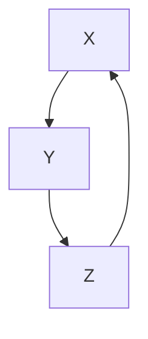

“混杂”这一术语在英语中的原意是“混合”，我们可以从图中理解它为什么叫这个名字。在图 4.1 中，真正的因果效应 $X \to Y$ 与由叉接合 $X \leftarrow Z \to Y$ 诱导的 $X$ 和 $Y$ 之间的伪相关混合在一起。举个例子，假设我们准备测试一种药物，而在试验过程中，我们让比对照组平均年龄更低的一组患者服用了这种药物，那么年龄就成为这一试验的一个混杂因子，或者说潜伏的第三变量。如果我们没有关于年龄的数据，我们将无法从药物的虚假效果中区分出药物的真实效果。

不过，反过来也是正确的。如果我们确实测量了第三变量的数据，那么我们很容易就能区分出真实效果和虚假效果。例如，如果混杂因子 $Z$ 是年龄，而我们分别比较每个年龄组的处理组（treatment group）和对照组（control group）[^1]。然后，根据各个年龄组在目标总体中所占的百分比对每个年龄组进行加权，我们就可以计算出药物的平均效果。这种补偿方法是所有统计学家都很熟悉的一种方法，它被称为“$Z$ 调整”或“$Z$ 控制”。

[^1]: 此处原文为脚注，保留其注释功能。

奇怪的是，统计学家既高估又低估了为可能的混杂因子进行统计调整的重要性。高估它，是指他们经常对过多的变量进行控制，甚至控制了不该控制的变量。最近，我偶然读到来自政治博客作者埃兹拉·克莱因的一段话，他在其中非常清楚地阐述了这种“过度控制”的现象：

> “你在各种研究中都能看到它。‘我们控制了……’，然后一张关于被控制的变量的列表就开始了，而且这个列表往往被认为越长越好：收入、年龄、种族、宗教、身高、头发颜色、性取向、健身频率、父母的爱、偏好可口可乐还是百事可乐……就好像你能控制的东西越多，你的研究就越有说服力，或者至少看起来如此。控制可以带来专一性和精确感……但有时，你控制的东西过多了，以至于在某些时候，你最终控制了你真正想要测量的东西。”

克莱因提出了一个合理的担忧。统计学家对于应该控制和不应该控制哪些变量感到非常困惑，所以默认的做法是控制他们所能测量的一切。当今时代的绝大多数研究都采用了这种做法。这的确是一种可轻松遵循的、便捷的、简单的程序，但它既浪费资源又错误百出。而因果革命的一个关键成果就是终结这种混乱。

同时，统计学家又在很大程度上低估了控制的意义，即他们不愿意谈论因果论，即使他们进行了正确的控制。这也与本章我希望传达的观点相悖：如果你在因果图中确定了去混因子（deconfounder）的充分集，收集了它们的数据，并对它们进行了适当的统计调整，那么你就有权说你已经计算出了那个因果效应 $X \rightarrow Y$（当然，前提是你可以从科学的角度清楚地阐释并捍卫你的因果图）。

统计学家处理混杂的传统方法则与之截然不同，这些方法大多建基于随机对照试验，这是费舍尔极力主张的观点。这一主张本身完全正确，但费舍尔提出这一主张并不是出于一个完全合理的原因。随机对照试验确实是一项极好的发明——但直到最近，追随费舍尔脚步的几代统计学家仍然无法证明他们从随机对照试验中得到的结果就是他们想要得到的东西。他们缺乏一种语言来说明他们所寻找的东西，也就是 $X$ 对 $Y$ 的因果效应。本章的目标之一就是从因果图的角度来解释，为什么随机对照试验能让我们估计出 $X \rightarrow Y$ 的因果效应，同时免除混杂偏倚的影响。一旦我们理解了随机对照试验起作用的原因，我们就没有必要再将之奉若神明，把它当作因果分析的黄金标准，要求所有其他方法都必须以此为参照。恰恰相反，我们会领悟到这一统计学家所谓的黄金标准实际上源自更基本的原则。

本章还将阐明，因果图使分析重心从混杂因子向去混因子的转变成为可能。前者引发了问题，后者则解决了问题。这两组因子可能存在部分重叠，但并非必须重叠。如果我们收集到了去混因子充分集的数据，那么即使我们忽略了一部分甚至所有的混杂因子也无关紧要了。

因果革命允许我们超越费舍尔的随机对照试验，通过非试验性研究推断因果效应，其主要途径就来自这种分析重点的转变。它使我们能够确定应该控制哪些变量，使其成为去混因子。这个问题曾让理论统计学家和应用统计学家困扰不已，几十年来，它一直是该领域的一个致命弱点。这是因为混杂与数据或统计学无关，它是一个因果概念，属于因果关系之梯的第二层级。

发明于 20 世纪 90 年代的因果图方法已经完全解决了混杂问题。特别是我们很快就会介绍的一种被称为“后门标准”（back-door criterion）的方法，它可以明确识别出因果图中哪些变量是去混因子。如果研究者能够收集到这些变量的数据，那么他就可以对这些变量进行统计调整，从而在不真正实施干预的情况下对干预的结果做出预测。

事实上，因果革命比这走得更远。在某些情况下，即使我们没有去混因子充分集的数据，我们也可以控制混杂。在这些情况下，我们可以使用不同的统计调整公式（不是传统的统计调整公式，因为传统的公式只适用于后门标准）消除混杂。我们将在第七章讲述这些令人振奋的进展。

在几乎所有的科学领域中，混杂都是一个历史悠久的问题，但直到最近，我们才认识到这个问题需要因果的而非统计的方法来解决。直至 2001 年，某权威期刊的一位审稿人还在批评我的一篇论文时坚称“在标准统计学中，混杂处理有着坚实的理论基础”。幸运的是，这类审稿人的数量在过去 10 年急剧下降。现在，至少在流行病学、哲学和社会科学领域，研究者已经达成了普遍的共识：

1. 混杂需要，也具备一个因果解决方案；
2. 因果图提供了一种完整的、系统的方法引领我们找到那个解决方案。

我在此宣布，深受混杂困扰的时代已经结束了！

## 对混杂的长期恐惧

1998 年，《新英格兰医学杂志》的一项研究显示，退休男子经常散步和其死亡率下降之间存在关联。研究人员使用了檀香山心脏计划的数据，该计划自 1965 年以来追踪记录了 8000 名有日本血统的男性的健康状况。

由弗吉尼亚大学生物统计学家罗伯特·阿伯特领导的研究小组希望弄清楚的问题是：那些更勤于运动的人是否更长寿。他们从计划追踪的 8000 人中选择了 707 人作为调查样本，这些人的健康状况都能满足步行活动的要求。

阿伯特的团队发现，在为期 12 年的追踪期中，每天散步不到 1 英里[^2] 的男性（可以称他们为“偶尔步行者”），比每天步行超过 2 英里的男性（“经常步行者”）的死亡率高出 2 倍。准确地说，在 12 年追踪期之后，43% 的偶尔步行者已经去世，而经常步行者中只有 21.5% 的人去世。

然而，因为研究者并没有提前规定谁来做偶尔步行者、谁来做经常步行者，所以我们必须考虑到存在**混杂偏倚**的可能性。一个明显的混杂因子可能是**年龄**：调查样本中的年轻男性可能更愿意进行积极的锻炼，那么其在 12 年追踪期内的死亡率自然相对较低。因此，我们可以画一个如图 4.2 所示的因果图。

> 图 4.2 步行例子的因果图

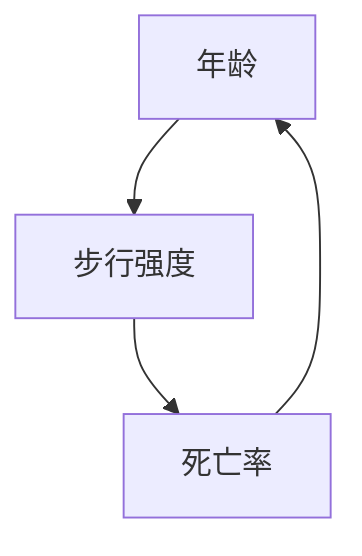

以“年龄”为中间节点的经典叉接合结构告诉我们，年龄是步行强度和死亡率的混杂因子。我相信你还能想到其他可能的混杂因子，比如，也许偶尔步行者本身生性懒散，也许他们出于某些原因走不了那么多路。因此，**身体条件**可能也是一个混杂因子。我们还可以如此这般地继续猜测下去：如果步行少的人是饮酒者呢？如果他们有暴饮暴食的习惯呢？

好消息是，研究人员考虑了所有这些因素。这项研究采集了每个可能存在的影响因素的相关信息，包括年龄、身体状况、饮酒习惯、饮食习惯以及其他几种因素，并据此逐一进行了统计调整。例如，数据显示，经常步行者的确会稍微年轻一些。因此，研究人员就根据年龄调整了死亡率，并发现在调整之后，偶尔步行者和经常步行者之间的死亡率差异仍然很大（经过年龄调整的偶尔步行者的死亡率是 41%，经常步行者为 24%）。

但即便已经进行了所有这些统计调整处理，研究人员对他们的结论仍然非常谨慎。在文章的末尾，他们写道：

> “当然，我们的研究并未解决的一个问题是，那些体力充沛的老年男性有意增加每天步行的路程对其寿命有何影响。”

用第一章的话来说就是，对于“假设受试者 **do（锻炼）**，那么他们在 12 年追踪期过后的生存概率是多少”这一问题，他们拒绝做出任何回答。

公平而论，阿伯特和他的团队成员有充分的理由秉持这种谨小慎微的态度。这是关于该问题进行的第一次研究，他们的样本相对较小且相对同质。然而，这种谨慎也反映了一种更为普遍的态度，其远远超越了样本同质性和样本规模问题。研究人员一直以来被教导相信，一项观察性研究（其中受试者自行选择是否接受处理）永远不能阐明一个因果结论。我认为这种谨慎过于夸张了。为什么不去消除关联中的虚假部分，从而更好地理解因果效应，而要费劲地根据所有的混杂因子进行统计调整呢？

我们不应该像他们那样说“我们当然不能”，我们应该公开声明，我们完全可以谈论关于刻意干预的话题。如果我们相信阿伯特的团队识别出了所有重要的混杂因子，那么我们就必须相信，（至少对有日本血统的老年男性来说）刻意增加步行强度的确有可能延长寿命。

这一初步结论的前提是假设在所发现的关系中，不存在其他混杂因子发挥主要作用。这是一条极其宝贵的信息，它准确地向有散步意向的人说明了这一结论所包含的不确定性，而这种残余的不确定性并不比存在未被考虑的其他混杂因子的概率要高。它对关于该课题的未来研究也具有指导意义，即未来的研究应侧重于寻找其他的影响因子（如果它们的确存在的话），而不是当前研究中被控制的这些因子。简言之，**掌握既定结论背后的假设比试图用随机对照试验来规避这些假设更有价值**，而且我们在之后会发现，随机对照试验自身也存在局限性。

[^2]: 1 英里 ≈ 1.609 公里。

## 对自然的巧妙询问：随机对照试验为何有效

正如我已经提到的，只有一种情况会让科学家不再沉默，转而谈论因果论，这种情况就是他们已经进行了随机对照试验。你可以在维基百科或其他很多地方读到这句话：“随机对照试验通常被认为是临床试验的黄金标准。”对此，我们要感谢费舍尔。他的至亲曾写过一篇文章阐述费舍尔提出随机对照试验的理由，这篇文章读起来非常有趣，虽篇幅略长，但值得全文引用：

> 科学实验的全部艺术和实践都被一种对自然的巧妙询问囊括其中了。观察活动为科学家提供了关于大自然某些方面的图景，而其中包含着主动陈述所具有的全部瑕疵。科学家希望通过提出旨在建立因果关系的具体问题来检查对于该陈述的解释。他的问题以实验操作的形式出现，因而必然是特殊的。他必须依赖大自然的内在一致性，根据大自然在特定情况下给出的回答推导出一个一般性的推论，或预测在其他场合中进行类似操作的可能结果。他的目的是从所找到的证据中得出具有确定精度和概括性的有效结论。
>
> 然而，大自然远没有她表现出来的那么稳定，她给出的回答似乎总是显得摇摆不定、似是而非、模棱两可。她回答问题的方式就好像问题是从地里冒出来的，而非出自科学家在头脑中设定好的框架；她也不会做出解释，不提供任何无偿的信息，而是固守准确性。其结果是，希望借助实验操作比较两种肥料作用效果的科学家所付出的努力完全白费了。他把田地分成两等份儿，每一半施以一种肥料，种植一种庄稼，然后比较两块田地的产量。他的问题是这样表述的：地块A在接受第一种处理（施第一种肥料）下的产量与地块B在第二种处理（施第二种肥料）下的产量有何区别？他没有问，在相同的处理下，地块A与地块B是否会有相同的产量，因此他无法将土地本身的效应从处理效应中区分出来，因为自然不仅按照要求记录了不同的肥料对地块产量的影响，还记录了不同的土壤肥力、质地、排水性、地貌、微生物和无数其他变量对地块产量的影响。

这篇文章的作者是罗纳德·艾尔默·费舍尔的女儿琼·费舍尔·博克斯，文章出自她为她声名赫赫的父亲所写的传记。她并不是统计学家，但她显然深刻地把握住了统计学家面临的主要挑战。她毫不含糊地指出，他们提出的问题“旨在建立因果关系”，而阻碍他们的是混杂，虽然她并没有使用这个术语。

他们想知道肥料（或那个时代所谓的“肥料处理”）的效应，即一种肥料相比另一种肥料对于土地预期产量的影响有何不同。然而，自然告诉他们，肥料的效应与很多其他的因混合（还记得吗，这是“混杂”一词的原始含义）在了一起。

我喜欢费舍尔·博克斯在上一段文字中给出的意象：自然就像一个精灵，她回答的正是我们提出的问题，但这个问题并不一定等同于我们真正打算问的那个问题。但我们必须相信，正如费舍尔·博克斯所做的那样，我们想问的问题的答案确实存在于自然界中。我们的实验是发现答案的粗略方法，它们并不能以任何方式明确定义那个答案。

如果我们完全按照琼在这段文字中给出的比喻来做，那么我们首先要考虑的做法就是 **do(X = x)**，因为它是一种自然的属性，表示的正是我们想问的问题：使用第一种肥料对整片土地的影响是什么？随机化处理则是接下来才要考虑的做法，因为它只是为引出这个问题的答案而采取的一种人为手段。就像温度计的量规，量规只是一种表示温度的方法，而不是温度本身。

费舍尔早年在洛桑实验站工作时，常采用一种非常详尽的、系统的方法，用以将肥料的效用从其他变量的效用中分离出来。他将田地划分成一系列子块，并会进行一番仔细的规划以便每种肥料都能与某种特定的土壤类型和某种特定的农作物结合起来（见图 4.3）。这样做的目的是确保样本的可比性。然而在现实中，他永远不可能准确预料到决定某一地块肥力的所有可能的混杂因子。聪明的自然精灵可以轻松打败对于一块田地的任何结构化的布局。

Illustration of a man smoking a pipe through a grid of plants, with a village scene in the background (no text or symbols)

**图 4.3** 费舍尔与他的诸多创新之一：拉丁方设计，旨在确保每行（肥料类型）和每列（土壤类型）中都有种植了全部农作物类型的地块。这类设计如今仍被用于现实实践中，但后来费舍尔令人信服地指出，还是随机设计更加有效（资料来源：由达科塔·哈尔绘制）。

大约在 1923 年或 1924 年，费舍尔开始意识到，精灵不能击败的唯一一种实验设计就是随机试验。想象一下，在一块肥力未知的土地做 100 次同样的试验。每一次为所有的子地块随机分配肥料。有时你可能会非常不走运，把 1 号肥料全部用在了最贫瘠的那些子地块上。另一些时候，你可能运气很好，将 1 号肥料全部用在了最肥沃的那些子地块上。但无论如何，每一次试验都会产生一个新的随机分配，这就保证了在大部分的时间里你既不是特别幸运，也不是特别倒霉。

在这些情况下，1 号肥料将被用于能代表整块田地的一些子地块，而这正是你想要的对照试验。因为在你的一系列试验中，这块土地的肥力分布是固定的，即便是自然精灵也不能改变它，因此，（在大部分时间里）它就被哄骗着回答了那个你想问的因果问题。

从我们的角度来看，在随机试验被认为是黄金标准的时代，所有这些试验方法的发明似乎都是顺理成章的。但在当时，随机试验这一想法的提出吓坏了费舍尔的统计学同事。费舍尔所做的实际上就是用抽签的方式来决定分配给每种肥料哪些子地块，这种做法让他们备感沮丧：科学难道不得不屈从于运气的反复无常？

但是费舍尔意识到，得到对正确问题的不确定答案比得到对错误问题的高度确定的答案要好得多。如果你向自然精灵提出了一个错误的问题，那么你就永远不会得到你想知道的答案。如果你提出了正确的问题，那么偶尔得到一个错的答案就完全不成问题了。你可以估计出答案的不确定性，因为这种不确定性来自随机化的过程（这一过程是已知的）而不是土壤各个方面的特性（这一点是未知的）。

因此，随机化实际上带来了两个好处。第一，它消除了混杂偏倚（它向大自然提出了正确的问题）。第二，它使研究者能够量化不确定性。而根据史学家斯蒂芬·施蒂格勒的说法，第二个好处正是费舍尔提倡随机化的主要原因。他是量化不确定性的大师，为此研发出了许多新的数学工具。相比之下，他对去混杂的理解则完全是直觉性的，因为在当时，他缺乏相应的数学符号用以表达他所追求的东西。

好在，90 年后的今天，我们可以用 do 算子来填补费舍尔想要表达但无从表达的内容。让我们从因果的角度来考察一下随机化是如何让我们向自然精灵提出正确的问题的。

像往常一样，让我们从绘制因果图开始。模型 1，如图 4.4 所示，描述了在正常条件下，每个地块的产量是由哪些因素确定的。在正常情况下，农民对于每个地块最适合使用哪种肥料是根据心血来潮的想法或偏见来决定的。他想对自然精灵提出的问题是，“对整片土地均匀施撒肥料 1（相比于施撒肥料 2）的产量是多少？”或者，用 do 算子来表示就是，$P(\text{产量} \mid \text{do}(\text{肥料}=1))$ 的值是多少？

> **图 4.4** 模型 1：一个错误的对照试验

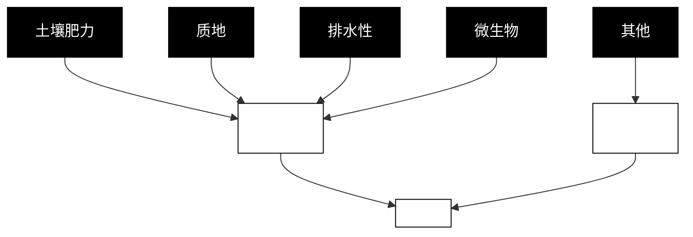

如果这位农民鲁莽地执行了这个试验，例如在地块高处使用肥料 1，低处使用肥料 2，那么他可能就引入了排水性这个混杂因子。或者，如果他在第一年使用肥料 1，在下一年使用肥料 2，那么他可能就引入了天气这个混杂因子。无论哪种情况，他都会得到一个有偏倚的比较结果。

农民想要知道的世界实际上是由模型 2 描述的。在这个模型中，所有地块都接受同样的肥料处理（见图 4.5）。根据第一章所介绍的内容，do 算子在这个例子中的作用是清除所有指向肥料的箭头，并强制赋予这个变量一个特定的值，比如：肥料 = 1。

> **图 4.5** 模型 2：我们想知道的世界

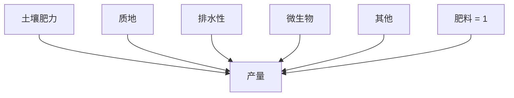

最后，让我们看看应用随机化处理的世界是怎样的。我们让一些地块接受 do（肥料 = 1），让其他地块接受 do（肥料 = 2），但让哪些地块接受哪种处理是随机的。由此模拟出的世界见图 4.6，它描述了“肥料”变量从一种随机设备那里获取赋值，比如费舍尔的扑克牌。

> **图 4.6** 模型 3：由随机对照试验模拟的世界

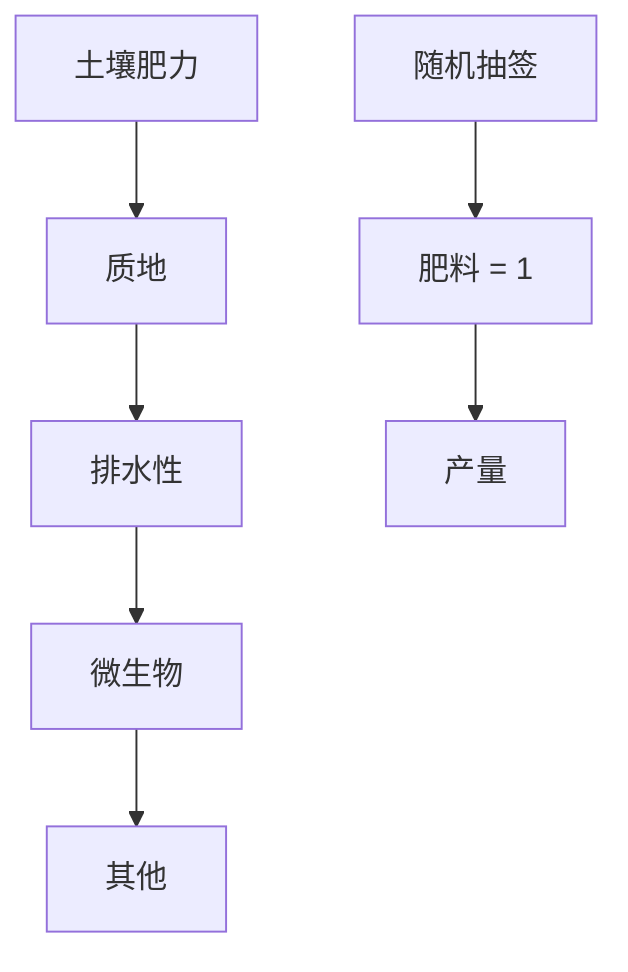

请注意，所有指向肥料的箭头都已被清除，这反映了农民在决定使用何种肥料时只听从于抽签结果。同样重要的是，图示中没有从随机抽签指向产量的箭头，因为农作物并不能读懂抽签的结果。（对于农作物来说，这是一个相当安全的假设，但对随机化试验中的人类受试者来说，这就是一个应予以严肃考虑的问题了。）因此，模型 3 描述了这样一个世界，其中肥料和产量之间的关系不存在混杂（换句话说，肥料和产量没有共因）。这意味着，在图 4.6 所描述的世界中，观察到“肥料 = 1”和实际实施“肥料 = 1”是没有区别的。

这一结论揭示出了关键的一点：**随机化处理是模拟模型 2 的一种方法**。它让所有旧的混杂因子都失效了，同时并没有引入任何新的混杂因子。这就是随机化处理的关窍所在，没有什么神秘色彩。如琼·费舍尔·博克斯所说，它只不过是一种“对自然的巧妙询问”。

然而，如果我们允许试验者使用自己的判断选择肥料或试验对象，那么试验就无法达到模拟模型 2 的目标。在这种情况下，农作物就能“读懂”它们对应的抽签结果了。对人类受试者进行临床试验时，研究者必须不遗余力地向病人和主试隐瞒处理信息（该试验操作被称为双盲试验），其原因正在于此。

我还想再补充一个关键点：**我们还有其他的方式可以用来模拟模型 2**。如果你知道所有可能存在的混杂因子，那么一种方法就是测量它们并根据它们进行统计调整。不过相比之下，随机化处理确实有一个很大的优势：它切断了接受随机处理的那个变量的所有传入连接，包括我们不知道或无法测量的那些（如图 4.4 至图 4.6 中的“其他”因素）。

相比之下，在非随机研究中，试验者必须依靠他对试验主体的知识做出判断。如果他相信自己的因果模型中有充足的去混因子，并且收集到了相应的数据，那么他就可以客观估计出肥料对产量的影响。但危险在于，他很可能忽略了一个混杂因子，这样一来他的估计结果就是有偏倚的。

就像走钢丝的人需要安全网一样，在所有条件都满足的情况下，随机对照试验仍是观察性研究的首选。但是很多时候，我们无法满足所有的条件。在某些情况下，干预可能在事实上不可行（例如在研究肥胖对心脏病的影响时，我们不能随机安排病人肥胖与否），或者干预可能是不道德的（例如研究吸烟的影响，我们也不能要求随机选择的一些人抽上 10 年的烟）。再或者，对于某些较为复杂、参与起来不方便的试验，我们可能会在招募受试者时遇到困难，而勉强找到的志愿参与者又无法代表我们的目标总体。

幸运的是，do 算子为我们提供了一种科学的方法，让我们能够在非试验性研究中确定因果效应。这一方法挑战了随机对照试验一直以来的霸主地位。正如我们在步行与死亡率那个例子中所讨论的那样，根据观察性研究得出的这种因果估计很可能会被标记为“暂时的因果关系”，即因果关系取决于我们绘制的因果图所反映的一组假设。重要的是，我们不应当把这些研究当作“二等公民”来对待，它们的优势在于能够应用于目标人群的自然生活场所，而非必须应用于人工打造的实验室环境，它不受伦理问题或可行性问题的污染，从这个意义上说，这样的研究是“纯净的”研究。

现在我们已经明白随机对照试验的主要目的是消除混杂，接下来让我们看看因果革命带来的其他消除混杂的方法。这个故事开始于我的两个老同事在 1986 年发表的一篇论文，这篇论文开启了重新评估混杂含义的进程。

# 混杂的新范式

“虽然混杂被广泛认为是流行病学研究的核心问题之一，但文献回顾显示，学界对混杂或混杂因子的定义几乎始终未曾达成一致。”通过这句话，加州大学洛杉矶分校的桑德·格林和哈佛大学的杰米·罗宾斯指出了自费舍尔以来为控制和消除混杂所做的努力并未取得实际进展的原因所在。由于缺乏对混杂本质的清晰理解，科学家无法在物理控制处理行不通的观察性研究中给出任何有意义的陈述。

那么，在以往，混杂是如何被定义的，又应该被如何定义呢？在掌握了我们现在已经有所了解的因果论的逻辑之后，找出第二个问题的答案就很简单了。我们观察到的是给定处理效应的条件概率 $P(Y \mid X)$，我们要问的自然问题是 $X$ 和 $Y$ 之间的因果关系，该因果关系可以通过干预概率 $P(Y \mid do(X))$ 获得。如此一来，混杂就可以简单地定义为导致 $P(Y \mid X) \neq P(Y \mid do(X))$，即两个概率出现差异的所有因素。是不是很简单明了？

遗憾的是，在 20 世纪 90 年代之前，事情并没有那么简单，因为那时 $do$ 算子这一表达形式还未被提出。即使是在今天，如果你在街上拦住一个统计学家，问他：“混杂对你来说意味着什么？”你仍然可能会得到一个你能从科学家那里听到的最令人费解和困惑的答案。最近出版的一本由几位权威的统计学家合著的新书，就花了整整两页的篇幅试图解释这个概念，而我到现在还没有发现哪个读者真的理解了他们的话。

定义困难的原因就在于混杂并非统计学概念。它代表了我们想要评估的内容（因果效应）和我们实际使用统计方法所评估的内容之间的差异。如果你不能在数学上表达出你想评估的内容，那你就无法定义是什么构成了这种差异。

历史上，“混杂”的概念演变围绕着两个相关概念展开——**不可比性**和**潜伏的第三变量**。这两个概念都很“抵制”形式化。在丹尼尔的试验中，当我们谈到可比性时，我们说的是，处理组和对照组应该在所有相关方面都相同，但这就要求我们必须从不相关的属性中区分出相关的属性。在步行与死亡率的研究中，我们要如何知道年龄是否相关？要如何知道参与者名字的字母顺序是否相关？你可能会说这是显而易见的或者完全是常识性的，但是几代科学家一直致力于实现在数学上表达这种常识，否则我们就无法要求机器人在没有人类的常识可以依靠的情况下采取正确的行动。

对于潜伏的第三变量的定义也存在同样的模糊性。混杂因子是 $X$ 和 $Y$ 的共因吗？还是仅仅与它们每个都相关？今天，我们可以借助因果图来检查是哪些变量导致了 $P(X \mid Y)$ 和 $P(X \mid do(Y))$ 之间的差异，从而回答这个问题。而在没有因果图或 $do$ 算子的时代，大约有五代的统计学家和医学专家不得不尝试找到某种替代定义，而这些定义没有一个令人满意。想到你药柜里的药物可能是基于混杂因子的某个可疑的替代定义开发的，你应该多少为此感到担忧才对。

让我们来看看这些关于混杂的替代定义。它们主要分为两大类，即**声明性定义**和**过程性定义**。一个典型的（错误的）声明性定义是“混杂因子是与 $X$ 和 $Y$ 都相关的任何变量”。而过程性定义则试图根据统计检验来描述混杂因子的特征。这种定义尤其吸引那些喜欢直接检验数据而忽视建构模型的统计学家。

下面是一个过程性定义，它有一个可怕的名字——**“非溃散性”**（noncollapsibility）。这个定义出自挪威流行病学家斯文·亨伯格 1996 年的论文：

> “在形式上，你可以将天然的相对死亡风险和根据潜在混杂因子进行统计调整后得到的相对死亡风险进行比较。二者的差异即表明混杂存在，在这种情况下，你就应该使用调整后的相对死亡风险评估结果。如果二者没有差异或只有微不足道的差异，那么混杂就不是问题，我们首选粗略估计。”

换句话说，如果你怀疑存在某个混杂因子，你可以据其进行统计调整，并比较调整后的估计和未经调整的估计。如果二者有区别，那么这个因子就是混杂因子，因而你应该采用那个校正值。如果二者没有区别，那么你就摆脱了混杂的困境。亨伯格绝不是第一个提倡这种做法的人，而这种做法误导了一个世纪的流行病学家、经济学家和社会学家，并且仍然统治着应用统计的某些领域。我之所以单独挑出亨伯格的陈述，是因为他的这个定义非常清晰明确，也因为他是在因果革命已经开始之后的 1996 年发表的这篇文章。

最为流行的一个声明性定义经历了一段时期的发展和演变。《流行病学方法与概念史》（*A History of Epidemiologic Methods and Concepts*）一书的作者阿尔弗雷多·莫拉比亚称之为“混杂的经典流行病学定义”，它包含两个条件。$X$（处理）和 $Y$（结果）的一个混杂因子 $Z$，满足：

1. 在整个总体上与 $X$ 相关；
2. 在未接受处理 $X$ 的人群中与 $Y$ 相关。

近年来，该定义又增加了第三个条件：

3. $Z$ 不应当出现在 $X$ 和 $Y$ 之间的因果路径上。

# 排版优化结果

请注意，“经典”版本的定义［只包含条件（1）和（2）］中的所有术语都是统计学的。其中条件（1）体现得尤为明显，即 $Z$ 只是被假定为与 $X$、$Y$ 相关，而不是 $X$ 和 $Y$ 的因。

1951 年，爱德华·辛普森在此基础上提出了相当复杂的条件（2）：“在未接受处理的人群中 $Y$ 与 $Z$ 相关。”从因果的角度来看，辛普森的想法似乎是要去除由 $X$ 对 $Y$ 的因果效应引起的 $Z$ 与 $Y$ 的那部分相关；换句话说，他想说的是 $Z$ 对 $Y$ 的影响不依赖于 $Z$ 对 $X$ 的影响。他认为表达这种“去除”的唯一方法就是通过聚焦对照组（$X=0$）来对 $X$ 进行变量控制。统计学剥夺了“效应”这个词，让他无法用其他方式来表达这一想法。

如果这个定义令你感到困惑的话，那就对了！如果他能简单地画出如图 4.1 所示的因果图，并据此说明“$Y$ 并没有通过 $X$ 与 $Z$ 发生关联”，那事情就会简单明了得多。但他没有这个工具，也无从谈论路径，因为这是一个被禁用的概念。

混杂因子的“经典流行病学定义”还有其他缺陷，如以下两个例子所示：

（i）$X \to Z \to Y$ 和

$$
\begin{array}{c}
\text{(ii)} \quad X \to M \to Y \\
\quad \quad \downarrow \\
\quad \quad Z
\end{array}
$$

在例（i）中，$Z$ 满足条件（1）和（2），但它不是一个混杂因子，而应该被称为**“中介物”**（mediator）。它是解释 $X$ 对 $Y$ 的因果效应的变量。如果你试图找出 $X$ 对 $Y$ 的因果效应，那么控制 $Z$ 将带来一场灾难。如果你只看处理组和对照组中 $Z=0$ 的那些个体，那么你就完全阻断了 $X$ 的影响，因为它是通过改变 $Z$ 来起作用的。如此一来你就会得出错误的结论——$X$ 对 $Y$ 没有影响。埃兹拉·克莱因所说的**“你最终控制了你真正想要测量的东西”**正是这个意思。

在例（ii）中，$Z$ 是中介物 $M$ 的替代物。当实际的因果变量无法测量时，统计学家通常会选择控制其替代物。例如，党派归属就可能被视为政治信仰的替代物。而因为 $Z$ 并不是 $M$ 的完美度量，所以如果你控制了 $Z$，则 $X$ 对 $Y$ 的影响就可能会部分地被“遗漏”掉。实际上，控制 $Z$ 本身仍然是一个错误，虽然它带来的偏倚可能会小于控制 $M$，但偏倚仍然存在。

因此，后来的统计学家，特别是大卫·考克斯在他的教科书《实验设计》（*The Design of Experiments*，1958）中发出警告说，除非你有一个“令人信服的先验理由”相信 Z 不受 X 的影响，否则你就不应该控制 Z。这种“令人信服的先验理由”恰恰是一个因果假设。他补充道：“这种假设可能表面上看起来完全合理，但科学家应该在采纳这些假设时保持警惕。”请不要忘了，这可是在严禁因果论的 1958 年提出的。考克斯的意思其实是，在根据混杂因子进行统计调整的时候，你可以偷偷喝上一大口因果的私酿酒，只要注意别告诉牧师就行——多么大胆的建议！我为他的勇气表示由衷的钦佩。

到 1980 年，辛普森和考克斯的条件被合并成了我上面提到的对混杂的三部分测试。这个定义就像一艘通往因果关系领域的独木舟，只不过它仍然有三处漏洞。尽管它确实在条件（3）中半遮半掩地提到了因果关系，但定义的前两个部分都可以被证明是不必要且不充分的。

格林兰和罗宾斯在 1986 年发表的具有里程碑意义的论文中就得出了这一结论。他们对混杂采用了一种全新的界定方法，并称之为“可互换性”（exchangeability）。他们回到最初的思路，即对照组（$X=0$）应与处理组（$X=1$）进行比较。但他们在此之上增加了一种反事实的扰动。（我在第一章曾指出，反事实位于因果关系之梯的第三层级，它十分强大，足以处理混杂。）可互换性要求研究者针对处理组，想象如果这组患者没有得到处理，其成员会发生什么，然后判断这一想象中的结果与那些实际上没有接受处理的小组的情况是否一致。只有在二者一致时，我们才能说这项研究中不存在混杂。

在 1986 年面对流行病学家谈论反事实多少还是需要一些勇气的，因为他们中的大部分仍然深受古典统计学的影响，认为所有的答案都存在于实际的数据中——而不是存在于想象的数据中，因为后者永远无法被观测。然而，由于另一位哈佛统计学家唐纳德·鲁宾的开创性工作，统计学界或多或少地做好了倾听这类“异端邪说”的准备。在鲁宾于 1974 年提出的“潜在结果”（potential outcomes）理论框架中，反事实变量就像血压这样的传统变量一样合法，如“假如个体 X 服用了药物 D 后，他的血压”或“假如个体 X 没有服用过药物 D，他的血压”，它们同真正被观测到的血压数值一样有效，尽管这些反事实变量永远不会被观测到。

格林兰和罗宾斯开始从潜在结果的角度表述他们对混杂的定义。他们把研究中的目标总体分成 4 种类型：**注定的**、**因果的**、**预防的**和**免疫的**。这种说法比较含蓄，打个比方，我们可以把处理 X 当作接种流感疫苗，将结果 Y 当作得流感。“注定的”群体类型是指疫苗对其不起作用的那些人，他们无论是否接种疫苗都会患上流感。“因果的”群体（可能在现实中并不存在）是指因为接种疫苗而患上流感的那些人。“预防的”群体由接种了疫苗从而预防了流感的人组成。也就是说，如果没有接种疫苗，他们就会得流感，如果接种了疫苗，他们就不会得流感。最后，“免疫的”群体指在任何情况下都不会得流感的那些人。表 4.1 概括了这些群体类型。

理想的情况是，每个人的额头上都有一个贴纸，标明他属于哪个群组。可互换性意味着处理组和对照组的成员中 4 种类型的人数比例（$d$，$c$，$p$，$i$）相同。如果我们将处理组和对照组进行互换，相等的比例可以确保互换后的结果不变。相对的，如果处理组和对照组的相应比例不同，我们对疫苗结果的估计就会受到混杂的影响。请注意，处理组和对照组可能在许多方面有所不同，比如在年龄、性别、健康状况和各种其他特征上存在差异，但只有 $d$、$c$、$p$、$i$ 相等才能决定它们是否是可互换的。因此，可互换性就相当于两组中 4 个比例相等，这种方法不必评估造成两个群体存在差异的无数因素，从而大大降低了处理的复杂程度。

## 表 4.1  根据反应类型进行的个体分类

| 群组 | 在总体中的比例 | 若接种疫苗的结果 | 若不接种疫苗的结果 |
|------|----------------|------------------|----------------------|
| 注定的 | $d$ | 得流感 | 得流感 |
| 因果的 | $c$ | 得流感 | 未得流感 |
| 预防的 | $p$ | 未得流感 | 得流感 |
| 免疫的 | $i$ | 未得流感 | 未得流感 |

借助这一通俗易懂的定义，格林兰和罗宾斯表明了以往关于混杂的“统计学”定义，无论是声明性定义还是过程性定义，都给出了错误的答案。某个变量可能满足了混杂的“经典流行病学定义”的三个条件，但根据该变量进行统计调整仍然可能**增加偏倚**。

格林兰和罗宾斯给出的定义是一项伟大的科学成就，因为该定义使他们能够举出一些明确的例子，表明以前的混杂定义是不恰当的。但是，该定义**无法付诸实践**。简言之，那个“额头上的贴纸”是不存在的。我们甚至无从了解 $d$，$c$，$p$，$i$ 的值。事实上，这正是自然精灵一直锁在她的神灯里不想示人的信息。由于缺乏这方面的信息，研究者只能将处理组和对照组是否可互换这个问题留给直觉去判断。

现在，我希望我的叙述激发起了你对于这个问题的好奇心：**因果图是如何将混杂这个大麻烦转变成了一个有趣的游戏呢？** 诀窍在于对混杂进行操作测试，这个测试被称为“后门标准”。这个标准将定义混杂、识别混杂因子和根据混杂因子进行统计调整这些问题转变成了一个比迷宫问题还简单的智力游戏。如此，这个古老而棘手的问题就得到了圆满的解决。

## do 算子和后门标准

为了理解后门标准，我们需要先直观地了解信息是如何在因果图中流动的，这对我们后续的理解会有所帮助。我喜欢将连接看作一个管道，这个管道将信息从起点 X 传递到终点 Y。记住，正如我们在第三章看到的那样，信息传递是双向的，既在因果方向传递，也在非因果方向传递。

事实上，非因果路径恰恰是混杂的根源。大家应该还记得我将混杂定义为任何使 $P(Y|do(X))$ 不同于 $P(Y|X)$ 的因素。do 算子会清除指向 X 的所有箭头，这样它就可以防止有关 X 的任何信息在非因果方向流动。随机化处理具有相同的效果。如果我们选择合适的变量进行统计调整，那么这种统计调整也具有相同的效果。

在上一章，我们研究了接合的 3 种形式（或 3 条信息流通规则），这些规则告诉了我们应该如何阻断信息在某个接合中流动。为了加以强调，我现在重复一下这些规则：

- （a）在链接合 $A \rightarrow B \rightarrow C$ 中，控制 B 可防止有关 A 的信息流向 C 或有关 C 的信息流向 A。
- （b）同样，在叉接合或混杂接合 $A \leftarrow B \rightarrow C$ 中，控制 B 可以防止有关 A 的信息流向 C，或有关 C 的信息流向 A。
- （c）最后，在对撞接合 $A \rightarrow B \leftarrow C$ 中，信息流通规则与前两种是完全相反的。变量 A 和 C 原本是独立的，所以关于 A 的信息不能告诉你任何关于 C 的信息。但是，如果你控制了 B，由于辩解效应的存在，信息就会开始在“管道”中流通。

我们还必须牢记另一条基本规则：

> （d）控制一个变量的后代节点（或替代物）就如同“部分地”控制变量本身。控制一个中介物的某个后代节点意味着部分地关闭了信息管道；控制一个对撞变量的某个后代节点则意味着部分地打开了信息管道。

现在，如果我们有更长的管道和更多的接合单元，就像这样：

$$
A \leftarrow B \leftarrow C \rightarrow D \leftarrow E \rightarrow F \rightarrow G \leftarrow H \rightarrow I \rightarrow J
$$

那么我们应该如何阻断信息的流通？答案很简单：如果这条路径中的一个接合被阻断，那么 J 就无法通过这条路径“找到”A。因此，我们有许多方式来阻断 A 和 J 之间的交流：控制 B，控制 C，不控制 D（因为它是一个对撞变量），控制 E，等等，并且我们只需要做到其中的任何一项就足够了。这就是为什么常规统计过程——控制我们可以测量的一切——造成了如此严重的误导。事实上，对这条路径来说，在我们不去控制任何变量的前提下，该路径本身就是被阻断的！D 和 G 的对撞在没有任何外部帮助的情况下阻断了这条路径。而控制 D 和 G 将打开此路径，使 J 能够听从于 A。

最后，为了去除 X 和 Y 中的混杂，我们只需要阻断它们之间的每个非因果路径，而不去阻断或干扰所有的因果路径就可以了。更确切地说，我们将**后门路径**（back-door path）定义为所有 X 和 Y 之间以指向 X 的箭头为开始的路径；如果我们阻断了所有的后门路径（因为这些路径允许 X 和 Y 之间的伪相关信息在管道中流通），则我们就完成了对 X 和 Y 的去混杂。如果我们试图通过控制某一组变量 Z 来实现这一点，那么我们还需要确保 Z 的任何成员都不是 X 的后代，否则我们就可能部分或完全地关闭这条 X 与 Y 之间的因果路径。

这就是关于混杂和去混杂的一切！有了这些规则，去混杂就会变得非常简单和有趣，你可以把它当成一个游戏。我鼓励你用下面几个例子练习一下，目的是掌握它的窍门，体会一下这种方法是多么简单明了。如果你仍然发现它很困难，那也不用担心，因为已被开发出来的许多算法都可以在瞬间破解所有这些问题。在所有此类问题中，我们的目标都是指定一组变量，它们将能够去除变量 X 和 Y 中的混杂。换言之，它们首先不应该是 X 的后代，其次必须能够阻断所有的后门路径。

### 游戏 1

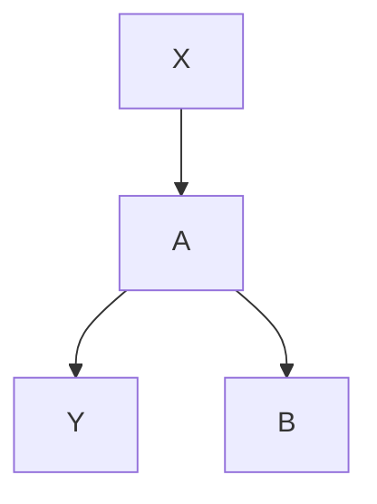

这个例子很简单！该图示中没有箭头指向 X，因此也就没有后门路径。在此例中，我们不需要控制任何事物。

不过，一些研究人员可能会认为 B 是混杂因子。首先，B 与 X 相关联，因为存在链接合 $X \rightarrow A \rightarrow B$。其次，在 $X=0$ 的个体中，B 与 Y 相关联，因为存在一个不经过 X 的开放路径 $B \leftarrow A \rightarrow Y$。最后，B 不在因果路径 $X \rightarrow A \rightarrow Y$ 上。因此，它满足了混杂的“经典流行病学定义”的三个条件。但是，它并没有通过后门标准，因此控制 B 将导致灾难。

### 游戏 2

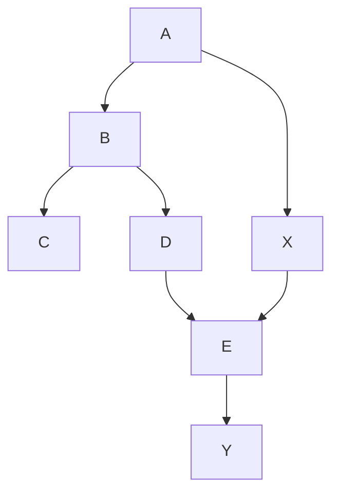

在这个例子中，你应该把 A、B、C、D 看作“预处理”变量。（与以往的例子一样，处理是 X。）现在存在一个后门路径 $X \leftarrow A \rightarrow B \leftarrow D \rightarrow E \rightarrow Y$。这条路径已经在 B 处被一个对撞接合挡住了，所以我们仍然不需要控制任何事物。许多统计学家会选择控制 B 或 C，认为只要在实施处理（X）之前完成了控制，这样做就没有坏处。最近，一位颇具影响力的统计学家甚至这样写道：“逃避对观察到的协变量进行变量控制……是一种非科学的欺诈。”他错了。控制 B 和 C 或以 B 或 C 为条件是一个糟糕的想法，因为这么做会打开非因果路径，从而引入 X 和 Y 之间的混杂。请注意，在这种情况下，我们可以通过控制 A 或 D 重新关闭路径。这个例子表明，去混杂可能有不同的策略。一些研究者可能会选择采取简单的方式，不控制任何事物；而另一些较为传统的研究者可能会选择控制 C 和 D。两者都是正确的，得到的结果也应该是相同的（前提是我们依据假设建构的模型是正确的，并且我们有足够大的样本）。

### 游戏 3

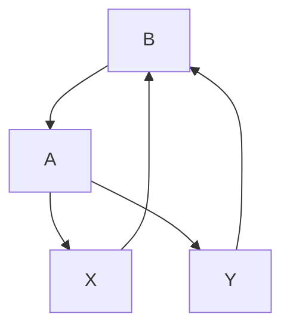

在游戏 1 和 2 中，你不必做任何事情就能阻断非因果路径，但这一次，你需要做出行动了。该图示中存在一个从 X 到 Y 的后门路径：X ← B → Y，只能通过控制 B 来阻断。如果 B 无法被观测，那么不进行随机对照试验的话，我们就无法估计 X 对 Y 的因果效应。在这种情况下，一些（事实上是大多数）统计学家会选择控制 A，将其作为不可观测的变量 B 的替代物，但这种做法只能**部分消除混杂偏倚**，并引入新的**对撞偏倚**。

---

## 游戏 4

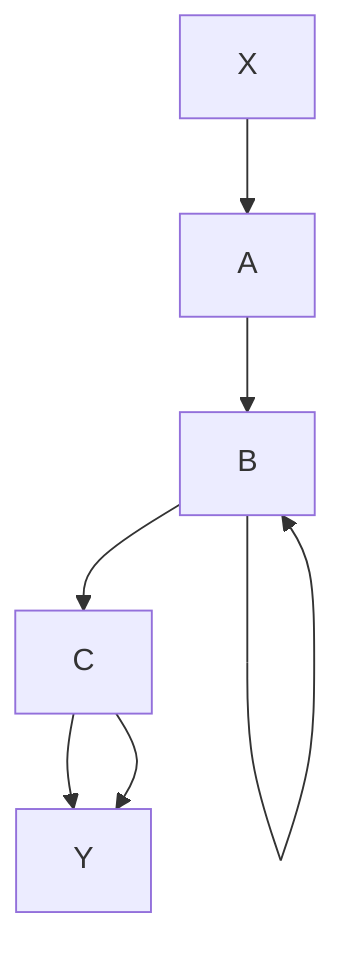

这个游戏引入了一种新的偏倚，名叫 **“M 偏倚”**（以图的形状命名）。同样，该图示中也只有一条后门路径，它已经被 B 处的对撞阻断，所以我们不需要控制任何事物。然而，1986 年之前所有的统计学家以及当下的许多统计学家都认为 B 是一个混杂因子。它与 X（通过 X ← A → B）相关联，并通过一条不经过 X 的路径（B ← C → Y）与 Y 相关联。它并不在因果路径上，也不是因果路径上任何变量的后代节点，因为从 X 到 Y 没有因果路径。因此，B 通过了混杂因子传统的三部分测试。

M 偏倚指出了传统方法的错误所在。仅仅因为某个变量与 X 和 Y 都相关就将变量（如 B）视为混杂因子是错误的。要重申的是，**如果我们不控制 B，则 X 和 Y 就是未被混杂影响的**。**只有当你控制了 B 时，B 才会变成混杂因子！**

20 世纪 90 年代，当我开始向统计学家展示这张图时，他们中的一些人对此付之一笑，说这种图在实践中根本用不上。对此我不赞同！就以游戏 4 的因果图为例，安全带的使用（B）对吸烟（X）或肺部疾病（Y）没有因果影响，它仅仅反映了一个人对于社会规范的态度（A）与对于安全和健康相关措施的态度（C），而其中一些态度可能会影响此人对于肺部疾病的易感性（Y），另一些态度则可能影响人们是否选择吸烟（X）。在实际数据中，人们发现安全带的使用（B）与 X 和 Y 相关。事实上，在 2006 年一项关于烟草诉讼的研究中，安全带的使用甚至被列为需要控制的首要变量之一。而如果你接受了我在游戏 4 中给出的模型，那么你就能意识到**单独控制 B 是错的**。

请注意，如果你同时还控制了 A 或 C，那么控制 B 就没什么问题。因为控制对撞因子 B 打开了“管道”，而控制 A 或 C 会再次关闭它。遗憾的是，在安全带的例子中，A 和 C 是与人们的态度有关的变量，很难被直接观测。而如果你不能观测它，你就不能根据它进行统计调整。

---

## 游戏 5

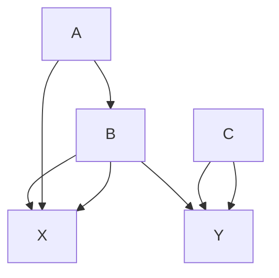

游戏 5 在游戏 4 的基础上额外增加了一点儿难度。现在，我们需要关闭第二个后门路径 $X \leftarrow B \leftarrow C \rightarrow Y$。如果我们通过控制 $B$ 来关闭这条路径，那么我们就打开了 M 形路径 $X \leftarrow A \rightarrow B \leftarrow C \rightarrow Y$。而要关闭这一路径，我们还必须控制 $A$ 或 $C$。然而，请注意，我们可以仅控制 $C$，这样一来我们就关闭了路径 $X \leftarrow B \leftarrow C \rightarrow Y$，而且不会影响另一条路径。

游戏 1 至 3 来自美国国立卫生研究院副院长克拉丽斯·温伯格 1993 年的一篇论文，文章的标题为“对混杂的更明确定义”。这篇文章发表于 1986 年至 1995 这段过渡时期，当时格林兰和罗宾斯的论文已经发表，但人们对因果图仍知之甚少。因此，温伯格在上述的每个案例中都通过一系列计算验证了各个例子的可互换性。尽管她使用了图示来表示不同的情境，但她并没有使用图示的逻辑来帮助她区分混杂因子和去混因子。她是我所知道的唯一设法完成了这一壮举的学者。2012 年，她以合著者的身份发表了另一篇升级版的文章，其中她使用因果图分析了同样的例子，并验证了她在 1993 年那篇论文中得到的所有结论都是正确的。

在温伯格的两篇论文中，作者具体讨论的一个医学案例是估计吸烟（$X$）对流产或“自发性流产”（$Y$）的影响。在游戏 1 中，$A$ 代表吸烟引起的潜在身体异常，这是一个不可观察的变量，因为我们不知道异常具体是什么。$B$ 代表孕妇的既往流产史。在估计孕妇未来流产的可能性时，流行病学家很容易想到既往流产史这个因素并据其进行统计调整。但在这个例子中，这样做是错误的！如果对 $B$ 进行了变量控制，我们就部分地阻断了吸烟（$X$）对流产（$Y$）的影响通道，从而低估了吸烟的真正影响。

游戏 2 是这个例子的一个更复杂的版本，其中有两个不同的关于吸烟的变量：$X$ 代表孕妇现在是否吸烟（从第二次怀孕开始算起），$A$ 代表孕妇第一次怀孕时是否吸烟。$B$ 和 $E$ 是吸烟引起的潜在身体异常，同样，它们是无法被直接观测的，$D$ 代表了这些身体异常的其他生理原因。请注意，这个图示考虑到了这样一个事实，即孕妇在怀孕期间可能会改变自己的吸烟行为，但她的其他生理条件并不会改变。许多流行病学家再一次选择根据既往流产史（$C$）进行统计调整，但这依然是一个糟糕的想法，除非你同时控制了孕妇第一次怀孕时的吸烟行为（$A$）这一变量。

游戏 4 和 5 来自 2014 年发表的一篇论文，作者是澳大利亚莫纳什大学的生物统计学家安德鲁·福布斯和几位合作者。他感兴趣的是吸烟对成人哮喘的影响。在游戏 4 中，$X$ 代表某人的吸烟行为，$Y$ 代表某人是否为成人哮喘患者。$B$ 代表此人儿童时期是否患有哮喘，这是一个对撞变量，因为它同时受到父母吸烟行为（$A$）和潜在的（无法被观测的）哮喘体质（$C$）的影响。在游戏 5 中，各个变量含义不变，但福布斯为了让图示更加贴近现实又增加了两个箭头。（游戏 4 的提出只是为了引入 M 形结构。）

事实上，福布斯论文中的完整模型包含更多的变量，如图 4.7 所示。注意，变量 $A$、$B$、$C$、$X$ 和 $Y$ 之间的关系与游戏 5 所示的情况完全一样，从这个角度来说，游戏 5 被嵌入了这个模型。因此，我们也可以将之前的结论移植过来，即我们必须控制 $A$ 和 $B$ 或只控制 $C$，但由于 $C$ 不可观测，因此它是一个无法控制的变量。此外，我们还有 4 个新的混杂变量：$D$ = 父母是否患有哮喘，$E$ = 慢性支气管炎，$F$ = 性别，$G$ = 社会经济地位。读者可能会发现，我们必须控制 $E$、$F$ 和 $G$，而没有必要控制 $D$。如此，对于这个例子而言，去混变量的充分集就是 $A$、$B$、$E$、$F$、$G$。

> 图 4.7 安德鲁·福布斯的吸烟（$X$）和哮喘（$Y$）模型

```mermaid
graph TD
  D --> A
  D --> C
  A --> E
  A --> B
  C --> F
  E --> X
  B --> X
  X --> Y
  F --> G
  G --> Y
  X --> Y
  B --> X
    style A fill:#000,stroke:#000
    style C fill:#000,stroke:#000
    style D fill:#000,stroke:#000
    style E fill:#000,stroke:#000
    style F fill:#000,stroke:#000
    style G fill:#000,stroke:#000
    style X fill:#000,stroke:#000
    style Y fill:#000,stroke:#000
```

最后，福布斯发现，在原始数据中，吸烟与成人哮喘的关联很小且统计上不显著。在根据混杂因子进行统计调整后，这一关联变得更小、更不显著了。然而，无效结果无损于这篇论文的质量，因为这篇论文正是“对自然的巧妙询问”的一个典范。

关于这些“游戏”的最后一点评论是：当你开始把变量指定为诸如吸烟、流产这些因素时，显然，这已经不再是游戏，而是严肃的科学研究了。我把它们说成游戏，是因为迅速而有意义地解决它们所带来的喜悦，和一个孩子破解了之前难倒他的谜题时所感受到的那种纯粹的快乐一模一样。

在整个科学研究的生涯中，我们很少能享受到此类令人满足的时刻：将让前辈们困惑不解的问题简化为一个简单的游戏或算法。我认为，混杂问题的完整解决方案是因果革命的主要亮点之一，因为它终结了一整个混乱的时代，我们曾在这个时代做出了许多错误的决策。同时，这又是一场悄无声息的革命，激烈的争辩主要发生在研究实验室中和科学会议上。而在掌握了这些新工具，理解了这些新见解之后，科学界终于可以着手处理一些更困难的问题，无论这些问题是理论上的还是实践中的。我们在后续章节会注重介绍这些内容。