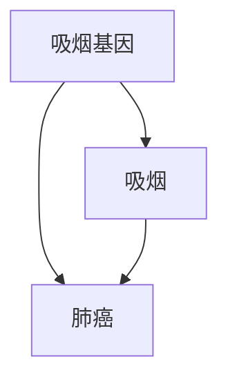
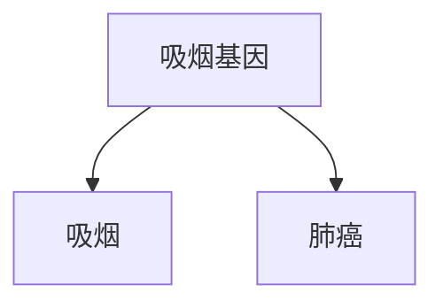
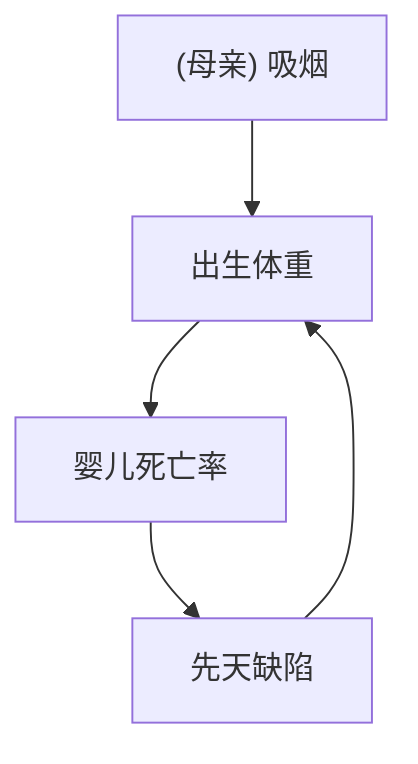

# 第五章 烟雾缭绕的争论：消除迷雾，澄清事实

最后，船上的人彼此说：“来吧！我们掣签，看看这灾临到我们是因谁的缘故。”——《约拿书》1:7

> Black-and-white sketch of two people in a cozy room with bookshelves and a table, no text or symbols visible.

20 世纪 50 年代末 60 年代初，统计学家和医生就整个 20 世纪最引人注目的一个医学问题产生了意见冲突：**吸烟会导致肺癌吗？** 在这场辩论过去了半个世纪之后的现在，我们认为答案是理所当然的。但在当时，这个问题完全处于迷雾之中。众多科学家乃至家庭成员之间都因此问题产生了分歧。

雅各布·耶鲁沙米一家就是这样一个发生了意见分歧的家庭。加州大学伯克利分校的生物统计学家耶鲁沙米（1904—1973），可能是学术界最后一位支持烟草的人士。许多年后，他的侄子大卫·利连菲尔德写道：“耶鲁沙米一直到临终都不赞同吸烟导致癌症这一说法。”而利连菲尔德的父亲亚伯·利连菲尔德，约翰·霍普金斯大学的流行病学家，则是吸烟致癌这一观点的公开支持者。小利连菲尔德曾回忆“雅克”（雅各布的简称）和他父亲坐在一起辩论吸烟是否致癌的情景：书房内始终烟雾缭绕，“烟从雅克的香烟和亚伯的烟斗里不停地冒出来”（见章首插图）。

如果亚伯和雅克能借此发起一场因果革命消除这场迷雾就好了！正如本章将要介绍的，驳斥吸烟致癌假说的一个最重要的科学主张是：**可能存在某些不可测量的因素，同时导致了人对尼古丁的渴求和人患肺癌。** 我们在上一章刚刚讨论过这种混杂模式，并指出因果图已经消除了混杂的威胁。但那时是 20 世纪 50 年和 60 年代，桑德·格林兰和杰米·罗宾斯发表那篇论文的 20 年前，do 算子问世的 30 年前。因此，研究一下那个时代的科学家如何处理这个问题，并证明那个可能存在某个潜在的混杂因子的主张不过是误导人们的烟幕弹，是件颇为有趣的事。

毫无疑问，亚伯和雅克烟雾缭绕的辩论中有很多主题既不关乎烟草也不关乎癌症，而是关乎一个人畜无害的词——**“导致”**。这已经不是医生第一次面对令人费解的因果问题了，医学史上的很多里程碑式的发展成果都与特定病原体的识别有关。18 世纪中叶，詹姆斯·林德发现柑橘类水果可以预防坏血病。19 世纪中叶，约翰·斯诺发现被粪便污染的水导致了霍乱。（后来的研究发现了二者更具体的病因：缺乏维生素 C 会导致坏血病，霍乱杆菌会引起霍乱。）这些杰出的发现都蕴含着一个幸运的巧合——其原因与结果恰巧是一对一的关系。霍乱杆菌是霍乱的唯一原因；或者，用我们今天的话来说，**霍乱杆菌是霍乱的充分必要因**。如果你没接触过霍乱杆菌，你就不会得病。同样，缺乏维生素 C 也是坏血病的必要因，而如果你缺乏维生素 C 的时间足够长，那么它也将是充分因。

吸烟与癌症之关系的辩论挑战了这种单一的因果关系概念。许多人吸了一辈子的烟，却从未患肺癌。相反，有些人从不吸烟却依然患上了肺癌。他们中的一些人可能是因为家族遗传而得了肺癌，另一些则是因为接触到了致癌物，还有一些人两个方面的原因都有。

当然，统计学家当时已经掌握了一种在更普遍的意义上确立因果关系的绝妙方法：**随机对照试验**。但是在吸烟的案例中，这个研究方法既不可行，也不合乎职业道德。你怎么可能让随机挑选出来的一些人吸上数十年烟，冒着很可能损害他们身体健康的风险，只为了看看他们是否会在 30 年后患上肺癌呢？

而如果没有随机对照试验，我们就无法说服像耶鲁沙米和费舍尔这样的怀疑论者。他们坚信这种观点，即所观察到的吸烟和肺癌之间的关系是一种伪相关。对他们来说，潜伏的第三个因素可能才是我们所观察到的这种关联背后的原因所在。例如，可能存在一种**吸烟基因**，既让人们更渴望吸烟，也使他们更有可能患上肺癌（也许是通过间接影响他们对于生活方式的选择达成的）。他们提出的混杂因子并没有什么说服力，但证明不存在混杂因子的责任并不在他们身上，而在禁烟派身上——而要证明一个否定性的结论，费舍尔和耶鲁沙米深知这几乎不可能完成。

# 烟草：一种人为的流行病

这一僵局最终的打破，既是一次伟大胜利，又是一次良机错失。一方面，对于公共卫生来说，它是一次胜利，因为流行病学家最终得出了正确结论。美国卫生局局长在 1964 年的报告中明确指出：

> “在男性中，吸烟与肺癌[1]有因果关系。”

这一直言不讳的声明彻底终结了“不能证明吸烟致癌”的说法。美国男性的吸烟率在报告发表后的第二年开始下降，现在，吸烟者的数量已经不及 1964 年的一半。毫无疑问，该声明挽救了千百万人的生命，同时大大延长了更多人的寿命。

另一方面，这场胜利是不完整的。如果科学家能够找到一种更有力的因果关系理论，那么确定上述结论所用的时间（大约从 1950 年到 1964 年）就可能被大大缩短。以本书的观点来看，胜利的不完整主要体现在 20 世纪 60 年代的科学家没能真正建立起这种理论。为了证明吸烟致癌的说法是合理的，卫生局局长委员会依据的是一系列非正式的指导方针，其被称为“希尔标准”，是以伦敦大学统计员奥斯汀·布莱德福·希尔的名字命名的。实际上，这套标准中的每一条都存在显而易见的反例，不过总体而言，它仍然体现出了一种令人信服的常识价值甚至智慧。从费舍尔过分强调方法论的世界中走出来，希尔标准将我们带入了一个与前者完全相反的领域——一个没有方法论的世界。在这个世界中，因果关系是根据统计趋势的定性模式决定的。因果革命在这两个极端世界之间架起了一座桥梁，为我们的因果直觉赋予了数学的严谨性。可惜的是，这项工作被留给了他们的下一代来完成。

## 烟草：一种人为的流行病

1902 年，香烟仅占美国烟草市场的 2%，且烟草消费最普遍的标志在当时还是痰盂而不是烟灰缸。但是两股强大的力量一起改变了美国人的习惯：自动化和广告。由于实用性强和成本低廉，机器制造的香烟轻松战胜了手工制作的雪茄和烟斗。与此同时，烟草业开创并完善了许多广告销售技巧（见图 5.1）。20 世纪 60 年代的电视观众可以很容易地记住那些朗朗上口的香烟广告，不管是“你会钟情万宝路”，还是“宝贝，你已走过漫漫长路”。

> “Pll Be Right Over!”  
> Black-and-white photo of a man using a vintage telephone at a desk with a lamp and office chair (no visible text or symbols).  
> 24 hours a day your doctor is “on duty”... guarding health... protecting and prolonging life...

> 图 5.1 精心制作的广告意在让公众安下心来，相信香烟对他们的健康没有害处。图中显示的就是一则刊登在 1948 年《美国医学协会杂志》上针对医生所做的广告，其中显示香烟有提神醒脑之效，是医生治病救人的必备用品（资料来源：来自斯坦福大学关于烟草广告影响的研究论文集）

CAMEL  
B. J. Reynolds Robinson-Gonzalez, Warren-Salina, S.

> Recent independent nationwide survey: More Doctors Smoke Camels than any other cigarette.

到 1952 年，烟草市场的香烟份额已从 2% 飙升至 81%，烟草市场本身也在急剧扩大。美国人民消费习惯的重大改变给公共卫生带来了意想不到的影响。早在 20 世纪早期，人们就开始怀疑吸烟有害健康，会引发咽炎和咳嗽。而到了 20 世纪中叶，负面性的证据越来越多。在香烟出现之前，肺癌是一种十分罕见的疾病，医生从业一辈子可能只会遇到一例。但是在 1900 年到 1950 年间，这种曾经的罕见疾病的发病率翻了两番。到 1960 年，肺癌已成为男性群体中最常见的癌症。一种致死疾病的发病率发生了如此巨大的变化，这迫切需要专业人士做出解释。

# 事后看来，这一灾难性的变化显然应该归咎于吸烟。

如果我们用图示表示出肺癌和烟草消费的比例关系（见图 5.2），二者的关联就是不言而喻的。但时间序列数据对于因果关系的证明是一种非常糟糕的证据。1900 年到 1950 年，许多其他的事情也发生了变化，它们同样有可能是罪魁祸首，比如道路铺设、含铅汽油尾气排放以及普遍的空气污染。

英国流行病学家理查德·多尔在 1991 年说：

> “汽车的普及就是一个新因素，如果我必须在当时所有那些因素中挑出一个真正的致癌物的话，我肯定会把赌注下在汽车尾气或者用于铺设公路的柏油上。”

科学的工作是把假设放在一边，研究事实。1948 年，多尔和希尔进行了研究合作，共同探索癌症流行的原因。希尔作为首席统计学家，在当年的早些时候发表了一项非常成功的随机对照试验。试验证明，链霉素（最早的抗生素之一）对结核病有效。这一发现是医学史上的一个里程碑，它不仅为医学界带来了一种“特效药”，而且提高了随机对照试验的声誉，使其很快成为流行病学临床研究的标准范式。

希尔当然知道，在对吸烟是否致癌这一问题的研究上，随机对照试验是不适用的，但是他已经认识到了对比处理组和对照组这一方法的优势所在。因此，他建议将已经被诊断为癌症的病人与由健康志愿者组成的对照组进行比较，采访每一组的成员，了解他们过去的行为和病史。为避免偏倚，他没有告知采访者其采访对象是处理组的癌症患者还是对照组的健康志愿者。

研究结果令人震惊。在 649 名接受采访的肺癌患者中，除两人外其余均为吸烟者。这一结果在统计学上与随机水平相去甚远，是一件极不可能发生之事。多尔和希尔情不自禁地计算出了该结果的精确度：**1 500 000∶1**。此外，平均而言，肺癌患者的吸烟量也比对照组成员的吸烟量更大，但采访也显示，肺癌患者吸入烟雾的比例相对较小（注意，在之后的辩论中，费舍尔就抓住这一结果中的矛盾进行了激烈的攻击）。

多尔和希尔将“病例”（患有疾病的人）与对照组进行了比较，因此这种研究类型现在也被称为 **“病例—对照研究”（case-control study）**。相对于时间序列数据而言，借助这种方法搜集数据显然是一种进步，因为研究人员可以控制包括年龄、性别和所接触的环境污染物等混杂因子。然而，病例—对照设计也存在一些明显的弊端：

- 首先，它是回顾性的，这意味着我们已知研究对象患有癌症，在此前提下我们要回顾过去找出原因。
- 其次，它的概率逻辑也是反向的，这些数据告诉我们的是癌症患者是吸烟者的概率，而不是吸烟者患癌症的概率。对于那些想知道是否应该吸烟的人，吸烟者患癌症的概率才是他们真正关心的概率。

此外，病例—对照研究承认存在几种可能的偏倚来源。其中之一被称为 **“回忆偏倚”**：虽然多尔和希尔确保了采访者不知道其采访对象是否患有癌症，但被采访者本人肯定知道他们自己是否患有癌症，而这一事实很可能会影响他们的回忆。另一个来源是 **选择偏倚**：已入院就医的癌症患者绝不是整个人口总体的代表性样本，甚至不能作为吸烟者总体的代表性样本。

简而言之，多尔和希尔的结果非常具有启发性，但仍然不能被当作吸烟致癌的有力证据。这两位研究人员起初很谨慎地将这种相关性称为“关联”。在去除了几个混杂因子后，他们大胆地提出了一个更有力的观点：

> “吸烟是肺癌形成的一个因素，一个非常重要的因素。”

接下来的几年里，在不同国家进行的 19 个病例—对照研究基本上都得出了类似的结论。但正如费舍尔毫不在意地指出的那样，一项有偏倚的研究重复 19 次也不能证明任何事情，它仍有偏倚。费舍尔在 1957 年写道：

> “这些研究仅仅是同类证据的重复，因此，我们有必要尝试检验一下这种研究方法是否足以得出任何科学结论。”

# 优化后的 Markdown 内容

多尔和希尔意识到，如果病例—对照研究中的确存在隐藏的偏倚，那么仅仅靠重复研究肯定是无法消除偏倚的。因此，他们于 1951 年开始了一项前瞻性研究，向 6 万名英国医生发放调查问卷，采集关于其吸烟习惯的信息，并对他们进行追踪调查（美国癌症协会也在同一时间发起了一项类似的、规模更大的研究）。在短短的 5 年里，一些戏剧性的差异就出现了。在接受了追踪调查的医生中，重度吸烟者患肺癌死亡的概率是不吸烟者的 24 倍。在美国癌症协会发表的研究结果中，情况甚至更加严峻：一方面，吸烟者死于肺癌的概率是不吸烟者的 29 倍，而重度吸烟者死于肺癌的概率更是不吸烟者的 90 倍。另一方面，曾经吸烟，然后戒烟的那些人，其患病风险降低了一半。所有这些结果都表明了一个一致的结论：吸烟越多，患肺癌的风险就越高，而戒烟能降低这种风险。这是一个强有力的因果证据。

医生们称此类结论为“剂量—响应效应”（dose-response effect）：如果物质 A 会导致生物反应 B，则通常而言（但不是百分之百），更大剂量的 A 会导致更强的反应 B。

然而，像费舍尔和耶鲁沙米这样的怀疑论者是不会被就此说服的。前瞻性研究仍未能将吸烟者与其他各方面都相同的不吸烟者进行比较。事实上，这种比较是否可行值得怀疑。毕竟，吸烟是吸烟者的一种自我选择。在许多方面，他们都可能与不吸烟者有着基因或“体质”上的不同，比如有更多的冒险行为，更易饮酒过量等。其中一些行为同样可能会对健康造成不良影响，而这些不良影响可能被错误地归咎于吸烟。对于怀疑论者来说，这是一个特别便利的论据，因为体质假说几乎不可检验。直到 2000 年人类基因组测序工程开启之后，寻找与肺癌相关的基因才成为可能。（具有讽刺意味的是，费舍尔的主张被证明是正确的，尽管只是非常有限的正确：这种基因确实存在。）

对于体质假说，杰尔姆·康菲尔德与亚伯·利连菲尔德于 1959 年共同发表了一篇论文，逐一驳斥了费舍尔的论据。在许多医生看来，这篇论文已经解决了问题。在美国国立卫生研究院工作的康菲尔德是吸烟与癌症之关系这场辩论的一名不寻常的参与者。他既不是统计学家，也不是生物学者，他大学时期主修历史，后来在美国农业部学习统计。自学成才的他最终成为一位备受欢迎的顾问，并担任了美国统计协会主席。他还是一个一天要抽两包半香烟的大烟鬼，但当他看到有关肺癌的数据时，他就戒烟了。（有趣的是，有关吸烟与癌症之关系的这场辩论与参与其中的科学家的个人生活息息相关。费舍尔从来没有丢开过他的烟斗，耶鲁沙米也不曾放弃自己的香烟。）

康菲尔德把目标直接对准了费舍尔的体质假说，并在费舍尔的领域——数学中阐述了他的驳斥。他认为，假设存在一个混杂因子，比如吸烟基因，它完全地解释了吸烟者患肺癌的风险。如果吸烟者患肺癌的风险为常人的 9 倍，那么在吸烟者中，这种混杂因子存在的概率也需要至少比常人高出 9 倍，如此才能解释这种患病风险的差异。让我们思考一下这意味着什么：如果有 11% 的不吸烟者携带“吸烟基因”，那么就至少有 99% 的吸烟者一定携带吸烟基因。而如果有 12% 的不吸烟者碰巧携带这种基因，那么从数学的角度看，“吸烟基因”就不可能完全解释吸烟和癌症之间的相关。对生物学家来说，这个被称为“康菲尔德不等式”（Cornfield’s inequality）的论证瓦解了费舍尔的体质假说。因为在现实中，我们很难想象基因方面的某个差异可以如此紧密地与某人选择吸烟这种复杂的、不可预知的行为和意愿联系在一起。

康菲尔德不等式实际上是因果论证的雏形：它提供了一种标准，让我们可以在因果图 5.1（此种情况下，体质假说无法完全解释吸烟与肺癌之间的关联）和因果图 5.2（此种情况下，吸烟基因的存在能充分解释我们观察到的关联）中做出裁定。

# 图5.1 反体质假说因果图

> 图5.1 反体质假说因果图  
> 图5.2 体质假说因果图

如上文所述，吸烟与肺癌之间的关系极其紧密，因而不能用体质假说来解释。

事实上，康菲尔德的方法为一种名为“敏感度分析”的非常有效的分析方法的提出埋下了种子，后者对我们在导言中描述的由因果推断引擎得出的结论进行了补充。该分析方法的使用者不是通过假设模型中缺少某些因果关系而进行进一步的推断，而是对这些假设直接提出挑战，并评估在解释所观察到的数据时，新的假设所内含的相关性应该达到怎样的强度，之后对此定量结果进行似然性判断，就像假设在这些因果关系不存在的情况下进行的初步判断那样。

不用说，如果我们想要对康菲尔德的方法进行推广，将其用于分析包含超过 3 个或 4 个变量的模型，那么我们就需要特定的算法和估算工具，而这些方法只有在图示工具的基础上才有可能被开发出来。

20 世纪 50 年代的流行病学家面临的批评是，他们的证据“只是统计学证据”，其结论缺乏“实验室证据”的支持。但简单回顾一下医学史我们就能发现，这种说法并不可靠。如果将“只有实验室证据（才有效）”的标准应用于坏血病研究中，那么在 20 世纪 30 年代之前，水手们就会不可避免地接二连三地死亡，因为在发现维生素 C 之前，我们并没有关于食用柑橘类水果可以预防坏血病的“实验室证据”。

此外，在 20 世纪 50 年代，一些有关吸烟影响的实验室证据已经开始出现在医学期刊上，包括身体被涂抹了香烟焦油的老鼠会患上癌症，以及香烟烟雾被证明含有苯并芘，后者是一种已知的致癌物。这些实验室证据增强了吸烟致癌假说的生物学合理性。

到了 50 年代末，大量此类证据的积累使该领域的几乎所有专家都开始相信吸烟确实会致癌。值得注意的是，甚至连烟草公司的研究人员也被说服了。但这一事实一直被隐藏得很深，直到 20 世纪 90 年代，越来越多的诉讼案件和行业内的揭发者的出现最终迫使烟草公司公开了数以千计的关于吸烟致癌研究的秘密文件，其中就包括 1953 年雷诺兹烟草公司的化学家克劳德·提格给该公司的高管写的一封信，信中指出烟草是“诱导原发性肺癌的重要致病因素”，这几乎是一字不落地重复了希尔和多尔的结论。

在公共场合，香烟公司则一直高唱反调。1954年1月，几家龙头烟草公司（包括雷诺兹烟草公司）在全国发行的报纸上发布了一篇题为“对吸烟者的坦诚声明”的文章。声明是这样说的：

> “我们相信我们的产品不会损害健康。我们一直并且将来也会一直与那些维护公共健康的人密切合作。”

在1954年3月的一次演讲中，菲利普·莫里斯公司的副总裁乔治·韦斯曼说：

> “如果我们认为或者获知我们销售的产品对消费者有害，我们一定会立即停业关店。”

60年过去了，我们仍在等待菲利普·莫里斯践行这一诺言。

烟草公司的这些公开声明揭开了关于吸烟与癌症之关系这场争论中最令人痛心的一幕：**烟草公司在烟草对健康的危害方面蓄意欺骗公众**。如果说大自然是一只难以掌握的精灵，但仍能实事求是地回答问题的话，那么我们可以想象一下，当科学家面对的是一个蓄意欺骗我们的对手时，其面临的挑战会有多大。

这场关于香烟的战争是科学界首次遭遇有组织的对抗，对此谁都没有做好准备。烟草公司夸大了它们能找到的任何一点科学争议，还成立了自己的烟草工业研究委员会，向科学家提供资金，委托他们研究关于癌症或烟草的问题，但永远不去涉及真正的核心问题。烟草公司找到的科学家都是像费舍尔和雅各布·耶鲁沙米这样的吸烟致癌论怀疑者，他们会支付给这些研究者一笔咨询费供其发表文章。

在这件事上，**费舍尔的做法尤其令人痛心**。我并不否认，怀疑论在科学领域自有其重要意义。可以说，统计学家的工作就是质疑，他们是科学的良心。但是，合理的怀疑论与不合理的怀疑论是有区别的。费舍尔的做法则越过了这条底线。他一直不承认自己的错误，当然这也受到他长期吸烟的个人习惯的影响。他拒绝承认已有大量的证据驳斥了他的观点。他的论证变得越发极端。

他在希尔和多尔的第一篇论文中发现了一个有违常理的结果，即根据肺癌患者中吸烟者的口述，其吸入的烟雾比对照组的少（但该差异几乎没有任何统计意义），继而紧抓不放。而事实上，在随后的研究中类似的结果再也没有出现过。虽然费舍尔和其他人一样知晓“统计显著”的结果有时无法重复，但他依然仅凭借这一点就对所有其他的研究结果嘲讽不已。他辩称，多尔和希尔的研究表明，吸入香烟烟雾可能反而是对身体有益的，并呼吁进一步研究这个“极其重要的结果”。

对费舍尔在辩论中所扮演的角色，我们所能给出的唯一一项正面评价可能是，烟草公司的贿赂恐怕并没有对他造成什么影响，**他自己的顽固性格就已经足够他做到这一切了**。

尽管流行病学家早已对此问题达成了共识，但在此后很长一段时间里，鉴于上述这些原因，吸烟与癌症之关系在公众眼中仍然存在争议。即使是本该更积极地响应科学号召的医生们也心存疑虑：美国癌症协会在1960年进行的一项民意调查显示，美国只有 **1/3** 的医生认同吸烟是“肺癌的主要原因”，而 **43%** 的医生自己就是吸烟者。

虽然我们现在可以公正地批评费舍尔的顽固和烟草公司的蓄意欺骗，但也必须承认，当时的科学家一直是在一种僵化的思想框架下开展工作的。费舍尔提倡随机对照试验，并将其视为评估因果效应的一种高效的方法，这完全没错。然而，他和他的追随者没有意识到的是，我们从观察性研究中也可以学到很多东西。这就是因果模型的好处：它能够调用研究者业已掌握的科学知识来分析新问题。

费舍尔的方法实际上是在假设研究者对所要测试的假设没有预先的知识或看法。他们把无知强加给科学家，而这正是吸烟致癌论怀疑者在这场争论中乐于利用的优势。

由于科学家不具备对“导致”这个词的明确定义，也无法在随机对照试验不适用的情况下确定因果效应，因此，对于吸烟是否会导致癌症的争论，他们的准备是不充分的。他们被迫摸索着寻找一个定义，这一寻找过程贯穿了整个 20 世纪 50 年代，并最终导向了一个于 1964 年提出的戏剧性的结论。

## 美国卫生局局长委员会和希尔标准

康菲尔德和利连菲尔德的论文为美国卫生局发表关于吸烟影响的明确声明铺平了道路。英国皇家内科医学院一马当先，于 1962 年发表了一份报告，其结论就是吸烟是肺癌的致病因素。此后不久，美国卫生局局长卢瑟·特里（很可能是在肯尼迪总统的敦促下）宣布他打算成立一个特别顾问委员会专门研究这个问题（见图 5.3）。

> 图 5.3 1963 年，美国卫生局局长委员会为如何评估吸烟的因果效应问题而费尽心思。该图描绘的是威廉·科克伦（委员会中的统计学家）、卫生局局长卢瑟·特里和化学家路易斯·费瑟。根据该插图中曲线图的图例，黑线对应人均吸烟率，深灰线对应肺癌发病率，浅灰线对应其他癌症的发病率（资料来源：由达科塔·哈尔绘制）

委员会的人员组成非常平衡，包括 5 位吸烟者和 5 位不吸烟者，其中 2 人由烟草行业推荐，所有成员此前都没有公开支持或反对过吸烟。鉴于此标准，利连菲尔德和康菲尔德这类持有明确立场的学者都是没有资格入会的。

委员会成员都是医学、化学或生物学方面的杰出专家，除了其中一位成员——哈佛大学的威廉·科克伦，他是一位统计学家。事实上，科克伦在统计学方面的资历可能是当时最顶尖的：他是卡尔·皮尔逊的学生的学生。

委员会为编写报告准备了一年多的时间，其中一个需要解决的主要问题就是“导致”这个词的使用。委员会成员不得不舍弃 19 世纪关于因果关系的明确观念，同时还不得不撇开统计学。正如他们在报告（很可能是由科克伦执笔的）中所写的那样：

> “统计方法无法为在关联中确定因果关系提供证据。关联的因果显著性属于判断的范畴，超出了统计概率的表述范围。为了判断或评估某种属性或病原体与疾病或健康之间的关联的因果显著性，我们必须使用一系列标准，其中没有任何一条标准可以单独构成完全充分的判断依据。”

委员会列出了 5 条这样的标准：

- **一致性**：在针对不同目标总体的多项研究中得到了类似的结果；
- **关联强度**：包括存在剂量—响应效应（吸烟多与更高的肺癌患病风险相关）；
- **关联的特异性**：一个特定的病原体应该有一个与之对应的特殊的效果，而非带来一连串的影响；
- **时序关系**：果应该跟随因；
- **连贯性**：具有生物学的合理性和与其他类型的证据（如实验室证据和时间序列数据）的一致性。

1965 年，奥斯汀·布莱德福·希尔（非委员会成员）尝试用一种可推广至分析其他公共卫生问题的方式概括这些论据，并在该清单的基础上又增加了 4 条标准。如此，这个包含 9 条标准的清单就成为此后为人所熟知的“希尔标准”。

实际上希尔本人称它们为“观点”，而不是一种强制要求，并强调在特定情况下，任何一条标准都有可能无法被满足。他写道：

> “我的 9 个观点中的任何一项都不能为支持或反对因果假设提供无可争辩的证据，而且也没有任何一项可以构成必要条件。”

事实上，驳斥希尔的清单或局长委员会那张稍短的清单里的任何一条标准都很容易。

- **一致性**本身证明不了任何事——如果 30 项研究都忽略了相同的混杂因子，那么所有研究就都存在偏倚。
- 出于同样的原因，**关联强度**的局限性也很明显。正如前面指出的，儿童的鞋子码数与他们的阅读能力密切相关，但二者并没有因果关系。
- **特异性**一直是一条颇具争议的标准。在传染病研究的背景下，这条标准是有意义的，因为通常的情况就是某种病原体会导致某种特定的疾病；但在涉及环境因素的研究背景下，这条标准就不那么有意义了。吸烟会导致多种疾病患病风险的增加，如肺气肿和心血管疾病，但这一点是否真的削弱了吸烟致癌的证据呢？
- **时序关系**也存在一些例外，例如此前提到的公鸡打鸣不会导致太阳升起，尽管公鸡打鸣总是出现在太阳升起之前。
- 最后，与已有的理论或事实具有**一致性**当然很好，但科学史中充满了被推翻的理论和错误的实验室发现。

不过，作为一种描述某个学科应该如何通过使用各种证据来接受因果假设的方法，它仍是有用的，只不过缺少将其应用于实践的方法论。例如，具有生物学的合理性以及与实验结果的一致性被认为是好事，但我们究竟应该如何衡量这些证据？我们应该如何将业已掌握的知识带入问题分析的情境？显然，对此每个科学家都必须自己做出决定。但是，这个直觉性的决定很可能是错的，尤其是当存在政治压力或金钱利益，或者科学家对研究内容本身有主观偏好的时候。

# 优化后的 Markdown 内容

但我没有丝毫要贬低委员会的工作的意思。在缺乏讨论因果关系机制话语的大环境中，委员会的成员已经做出了他们最大的努力。他们承认非统计学的标准是必要的，这本身就是一项巨大的进步。委员会中的吸烟者所做出的艰难的个人决定也从侧面证明了其结论的严肃性。

曾经习惯抽香烟的卢瑟·特里改用烟斗，伦纳德·舒曼宣布戒烟，威廉·科克伦则承认的确可以通过戒烟来降低患癌风险，但他认为“香烟带来的慰藉”足以补偿这种风险。最令人惋惜的是路易斯·费瑟，这位每天要抽 4 包烟的重度吸烟者在委员会的报告发布之后的一年内被确诊为肺癌。他在给委员会的信中写道：

> “虽然吸烟致癌的证据已非常充分，但你们可能还记得，在委员会的讨论会上，我仍在不停地吸烟，还东拉西扯了所有那些吸烟者一贯使用的借口……对我个人而言，我被确诊为肺癌这一事实比任何统计资料都更有说服力。”

在接受了摘除一叶肺的手术之后，他终于戒烟了。

从公共卫生的角度看，咨询委员会的这份报告是一个里程碑。在报告发表后的两年内，美国国会便提出要求烟草制造商在所有卷烟包装上标明“吸烟有害健康”的警示。1971 年，政府规定广播电视禁止放送香烟广告。美国成年人中吸烟者的比例从 1965 年的峰值 45% 下降到 2010 年的 19.3%。尽管进展缓慢且不够彻底，禁烟运动仍然是历史上规模最大、最成功的公共卫生干预行动之一。

委员会的工作还为科学共识的达成提供了一个有价值的示范，成为未来美国卫生局发表的关于吸烟影响的进一步报告和关于许多其他议题的报告的典范（包括 20 世纪 80 年代的一个主要议题——二手烟）。

但从因果关系的角度看，这份报告充其量只取得了有限的成功。它明确了因果问题的重要性，并且确定了单凭数据本身无法回答这些问题。但作为未来科学研究的路标，它的指导方针既不明晰也不周密。希尔标准最多只能作为一份历史文献来参考，其概括了 20 世纪 50 年代出现的证据类型，并最终说服了医学界接受了吸烟致癌的主张。

但作为未来科学研究的指南，这些标准显然是不够的。对于除了最广泛的因果问题之外的其他问题，我们还需要一种更精确的分析工具。回想起来，康菲尔德不等式正是朝着这个方向迈出的一步，它埋下了敏感度分析的种子。

# 吸烟对新生儿的影响

即便是在吸烟与癌症之关系的争论已经平息之后，一个重要的悖论仍未得到解决。20 世纪 60 年代中期，雅各布·耶鲁沙米指出，如果婴儿碰巧存在出生时体重不足的问题，那么其母亲在怀孕期间吸烟似乎反而有益于新生儿的健康。这个被称作“出生体重悖论”的难题与当时有关吸烟的医学新共识相悖，直到 2006 年，耶鲁沙米的论文发表后的 40 多年，这一悖论才得到了一个令人满意的解释。我确信，解决这个难题之所以花了这么长时间，是因为在 1960 年至 1990 年这个时期，科学界缺乏因果论的语言。

1959 年，耶鲁沙米开展了一项长期的公共卫生研究，收集了旧金山湾区超过 1.5 万名儿童的产前和产后数据。这些数据包括其母亲的吸烟习惯，以及婴儿出生后第一个月的体重和死亡率。

研究表明，吸烟母亲的婴儿其出生时的平均体重比不吸烟的母亲的婴儿轻，一个很自然的推断是，出生体重偏低将导致存活率下降。事实上，一项关于低出生体重婴儿（定义为出生时的体重不足 5.5 磅\[2\]的婴儿）的全国性研究表明，这些婴儿的死亡率比正常出生体重婴儿高出 20 倍。因此，流行病学家提出了一个假设的因果关系链：

> 吸烟 → 低出生体重 → 婴儿死亡率

而耶鲁沙米在数据中发现的另一个事实完全超出了包括他本人在内的所有人的预料。的确，吸烟母亲的婴儿平均比不吸烟母亲的婴儿轻 7 盎司\[3\]。然而，吸烟母亲的低出生体重婴儿的存活率要比不吸烟母亲的婴儿高。这就好像母亲的吸烟习惯真的具有某种保护作用一样。

假如费舍尔发现了这个事实，他很可能会大声宣布这正显示了吸烟的好处之一。而耶鲁沙米的可贵之处就在于他没有这么做，而是更谨慎地总结道：

> “这一矛盾的发现对以往的结论提出了质疑，它驳斥了这样的主张，即母亲的吸烟行为是干扰胎儿宫内发育的外因。”

简言之，从吸烟到婴儿死亡率的因果路径是不存在的。

现代流行病学家认为耶鲁沙米是错的。大多数人认为母亲吸烟确实会增加婴儿死亡率，其原因包括吸烟会妨碍胎盘的氧气传输等。但是我们怎样才能让这个假设和数据协调一致呢？

统计学家和流行病学家坚持用概率术语来分析这个悖论，并将其看作出生体重所特有的一种异常现象。事实证明，异常的出现只与**对撞偏倚**有关，而与出生体重无关。从这个角度来看，这个难题并非自相矛盾，反而颇具启发性。

事实上，只要我们在原来的因果路径“吸烟 → 出生体重 → 婴儿死亡率”之上再增加一点儿要素，耶鲁沙米的数据就完全符合更新后的模型了。对于婴儿来说，吸烟很可能仍然是有害的，因为它会导致婴儿出生体重偏低，但低出生体重本身还有一些其他的先决条件，如严重或致命的遗传畸形或先天缺陷，这些因素危害更大。对于某个低出生体重婴儿来说，其出生体重偏低有两种可能的解释：

- 他可能有一个吸烟的母亲；
- 或者，他可能受到了某个其他因素的影响。

如果我们发现这个婴儿的母亲是吸烟者，则根据“辩解”效应，该因素就有力地解释了婴儿的低出生体重，从而减少了先天缺陷或其他因素存在的可能性。但是，如果婴儿的母亲不吸烟，那么我们就有更充分的理由说明，婴儿出生体重偏低的原因是遗传畸形，而根据这一结论，这名婴儿的预后诊断就会更糟。

和以前一样，因果图能让一切都变得更加清晰。在吸收了上述这一新的假设之后，更新后的因果图就如图 5.4 所示。我们可以看到，出生体重悖论是**对撞偏倚**的一个完美的例子。对撞因子是“出生体重”。只观察低出生体重的婴儿，就相当于是在控制对撞因子，从而也就打开了“（母亲）吸烟”和“婴儿死亡率”之间的后门路径：

> 吸烟 → 出生体重 ← 出生缺陷 → 婴儿死亡率

这条路径是非因果的，因为其中一个箭头指错了方向。这一路径导致了“吸烟”和“婴儿死亡率”之间的伪相关，造成对于实际（直接）的因果效应，吸烟 → 婴儿死亡率的估计存在偏倚。事实上，其带来的估计偏倚很大，以致吸烟看起来似乎从有害变成了有益。

# 因果图的美

因果图的美就在于它们让偏倚的源头变得显而易见。而正因为缺少因果图，流行病学家为这一悖论争论了40年。事实上，他们直至今天仍在讨论这个问题——《国际流行病学杂志》（*International Journal of Epidemiology*）于2014年10月刊载了有关这个话题的几篇文章。其中，哈佛大学泰勒·范德维尔的文章为这一悖论给出了一个完美的解释，其中就包含一张如图5.4所示的图示。

> 图5.4 出生体重悖论因果图

当然，这张图可能过于简单了，无法捕捉到母亲吸烟、出生体重和婴儿死亡率背后的完整故事。但无论如何，对撞偏倚的存在都是肯定的。在此例中，偏倚之所以被发现，是因为受其影响得出的表面结论太不可信了。由此我们也可以想象，如果有偏倚的结论与已有理论不存在冲突，将有多少对撞偏倚无法被发现。

## 激烈的辩论：科学与文化

在开始撰写这一章之后，一个偶然的机会让我与艾伦·维尔考克斯取得了联系，他可能是与这个悖论关系最为密切的一位流行病学家。针对图5.4，他提出了一个非常棘手的问题：**我们如何知道低出生体重才是导致婴儿死亡的直接原因？** 他认为医生一直对婴儿的低出生体重这个问题存在误解——因为它与婴儿死亡率有很强的关联，医生就把它解释为病因。而事实上，这个关联可能完全是由混杂因子引起的。（在图5.4中，这个混杂因子由“先天缺陷”来表示，但维尔考克斯当时并没有明确指出这个混杂因子具体是什么。）

关于维尔考克斯的论点，有两点需要说明：

1. 即使我们删除“出生体重→婴儿死亡率”中的箭头，对撞仍然存在。因此，这张因果图仍然可以成功地解释出生体重悖论。
2. 其次，维尔考克斯重点研究的因果变量不是吸烟而是种族，而种族问题在当今社会仍在持续地引发激烈的辩论。

事实上，在黑人母亲的婴儿中，我们也观察到了同样的出生体重悖论，即黑人女性比白人女性更容易生出体重不足的婴儿，而且她们的婴儿死亡率更高。然而，她们的低出生体重婴儿的存活率要高于白人女性的低出生体重婴儿。对此，我们应该得出什么结论呢？我们可以告诉怀孕的吸烟者，戒烟对她的婴儿有益，但我们不能告诉怀孕的黑人女性“不要成为黑人”。

相反，我们应该解决的是导致黑人母亲的婴儿死亡率相对更高的社会问题。这一主张已经不存在争议了。但具体而言，我们应该着手解决哪些因，又应该如何衡量所取得的进展呢？暂且不论事实如何，许多种族平等的拥护者都认为出生体重是链接“种族→出生体重→婴儿死亡率”的一个中介物。不仅如此，他们还将出生体重作为婴儿死亡率的替代物，并假设改善一种情况就会自动导致另一种情况的改善。很容易理解他们这么做的原因：**测量平均出生体重比测量婴儿死亡率更容易实现**。

现在让我们想象一下，一个像维尔考克斯这样的人出现了，他坚称低出生体重本身不是一种表示身体状况的基本特性，与婴儿死亡率并没有因果关系。这一主张扰乱了整个局面。维尔考克斯于20世纪70年代第一次提出这个想法时，曾被指控为种族歧视，这让他不敢继续发表进一步的观点，且这一局面一直持续到2001年。而即使到了2001年，他发表的文章仍然饱受指责，其中一篇评论文章再次提到了种族问题。芝加哥库克郡医院的理查德·戴维在这篇文章中写道：

> “在当今社会中占支配地位的群体往往会通过辩称其所支配的群体本身就基因低劣来维护自己的立场，在这种社会背景下，研究者很难保持中立。在追求‘纯粹的科学’的过程中，一位出于善意的研究者很可能会被看作——或者在事实上——用他的研究维护和巩固了他所憎恶的某种社会秩序。”

科学家因阐明了可能导致不良社会后果的真理而受到道德斥责，类似的事件在历史中屡见不鲜。罗马教廷对伽利略思想的批判，无疑是出于对当时社会秩序的真诚的关注和维护。查尔斯·达尔文的进化论和弗朗西斯·高尔顿的优生学也遭受了同样的待遇。然而，此类由新的科学发现带来的文化冲击，最终往往是通过消化了这些发现的文化重组，而不是通过对这些发现的拒斥和掩盖来解决的。这种文化重组的一个先决条件是，在各种观点派生出无数衍生主张并产生激烈交锋之前，我们要先将科学从文化中梳理出来。

幸运的是，如今，因果图这种语言为我们提供了一种冷静看待因果的方式，其不仅适用于问题较为简单的情景，也适用于问题相当复杂的情况。

---

> [1] 当时关于女性群体中的相应证据比较模糊，主要原因在于20世纪初，女性吸烟者比男性吸烟者少得多。
>
> [2] 1磅 ≈ 0.45千克。——编者注
>
> [3] 1盎司 ≈ 28.35克。——编者注