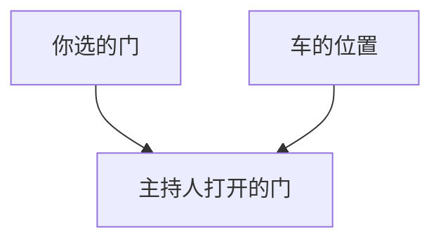
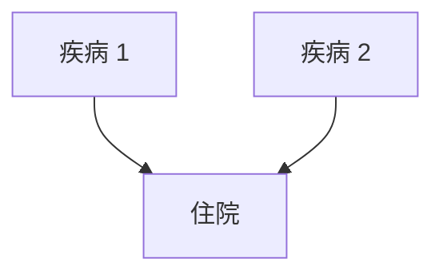
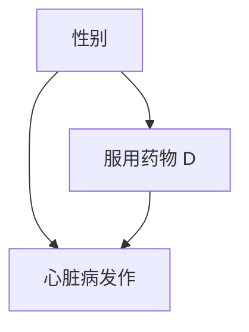
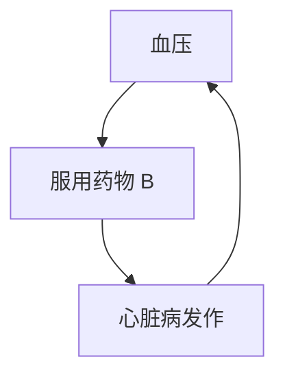
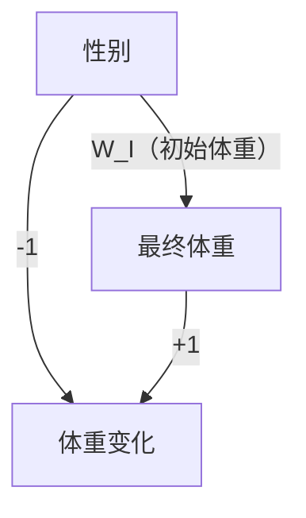

# 第六章 大量的悖论！

谁能直面矛盾，谁就能触摸现实。

——弗里德里希·迪伦马特（1962）

你想换个门吗？

我们以对出生体重悖论的解决结束了第五章。这一悖论代表了成员众多的一大类悖论，其反映了因果关系和相关关系之间的张力。这种张力源自二者处于因果关系之梯的两个不同的层级之上，又因为人类的直觉在因果逻辑下运作，而数据遵从的是概率和比例的逻辑而进一步加剧。当我们将在一个领域所学到的规则误用到其他的领域时，悖论就出现了。

我们将在本章介绍概率统计领域中最有名、最令人费解的几个悖论。首要原因在于，它们很有趣。如果你以前没有听说过**蒙提·霍尔悖论**和**辛普森悖论**，那我可以保证在这一章你的大脑将得到充分的锻炼。即使你自认为了解这些悖论，我也希望你试着通过因果透镜重新审视它们，因为你会发现一切看起来焕然一新。

当然，我们研究悖论并不只是因为它们是一种有趣的智力游戏。就像视错觉现象一样，它们也揭示了大脑的工作方式、运作捷径以及被大脑认为是互相矛盾的事物。因果悖论突出强调了直觉性的因果推理模式与概率统计逻辑相冲突的地方。统计学家一直试图解决这些因果悖论，但始终不得要领。从这方面来说，它是一个警示信号，表明如果不用因果透镜看世界，我们很可能会出差错。

## 令人费解的蒙提·霍尔悖论

20 世纪 80 年代末，一位名叫玛丽莲·沃斯·莎凡特的作家开始在《大观》（*Parade*）杂志上撰写固定专栏。该杂志是《星期日报》的增补本，在美国许多城市发行。她的专栏“问玛丽莲”连载至今，其主要内容是为读者提出的各种难题、脑筋急转弯和科学问题提供她的解答。这本杂志将她称为“世界上最聪明的女人”，这无疑激发了众多读者的斗志，纷纷尝试提出能难倒她的问题。

在她回答的所有问题中，一个引发了激烈争论的问题是出现在 1990 年 9 月的专栏中的这个问题：

> “假设你参加了一个竞猜游戏类电视节目，在这个游戏中，有三扇门供你选择，其中一扇门后面是一辆车（奖品），另外两扇门后面是山羊。你挑了一扇门，比如说 1 号门，而主持人知道门后面是什么。现在，他打开了另一扇门，比如说 3 号门，你看到这扇门的后面是一只山羊。此时，如果他问你：‘你想重新选择，改选 2 号门吗？’那么，选择换门是否对你赢走奖品更有利？”

对于美国读者来说，这个问题显然改编自一个当时十分流行的电视游戏节目，叫作“让我们做个交易”，节目主持人蒙提·霍尔常和参赛者玩这类心理游戏。沃斯·莎凡特在她的解答中认为参赛者应该选择换门。若不换，则参赛者只有 **1/3** 的概率获胜；若换，则其获胜的概率将翻倍，变为 **2/3**。

我想，这位“世界上最聪明的女人”大概也没有预料到接下来发生的事情。在接下来的几个月里，她收到了 1 万多封读者来信，他们中的大多数人都不同意她的解答，其中许多读者自称拥有数学或统计学的博士学位。这些人的评论包括：

- “你搞砸了，彻底搞砸了！”（来自斯科特·史密斯，博士）
- “我建议你找本标准的概率论教科书参考一下，然后再试着回答这类问题。”（来自查尔斯·里德，博士）
- “你搞砸了！”（来自罗伯特·萨克斯，博士）
- “你完全错了！”（来自雷·波波，博士）

总的来说，批评者认为，无论参赛者是否选择换门，由于游戏中只剩下两扇门，而参赛者完全是在随机选择，所以不管参赛者选哪扇门，门后面是车的概率一定都是 **1/2**。

谁对？谁错？为什么这个问题引发了如此激烈的讨论？这三个问题的每一个都值得我们进行更细致的考察。

---

让我们先来看一看沃斯·莎凡特是如何解决这个难题的。她的解决方案实际上极其简单，比我在许多教科书中看到的方法更令人叹服。她列出了一张关于门和山羊的三种可能安排的清单（见表 6.1），以及“换门”策略和“不换门”策略下的相应结果。三种情况都假设作为参赛者的你先选择了 **1 号门**。因为表中列出的所有三种关于山羊和汽车位置的可能组合（在最初）是等可能的，所以如果你选择换门，则你获胜的概率是 **2/3**，而如果你仍然选择 1 号门，则你获胜的概率只有 **1/3**。

请注意，沃斯·莎凡特的表格并没有明确说明主持人打开的是哪扇门，该信息隐含在表的第 4 列和第 5 列中。例如，在第 2 种组合中，我们知道主持人打开的必然是 3 号门，因为只有在此种情况下，参赛者选择换 2 号门才会获胜。同样，在第 1 种组合中，主持人打开的门可以是 2 号门或 3 号门，而第 4 列信息则明确地告诉我们，只要你选择换门，则无论如何换门，你都会输。

**表 6.1 “让我们做个交易”的概率表**

| 1 号门 | 2 号门 | 3 号门 | 换门的结果 | 坚持的结果 |
|:------:|:------:|:------:|:----------:|:----------:|
| 车     | 山羊   | 山羊   | 输         | 赢         |
| 山羊   | 车     | 山羊   | 赢         | 输         |
| 山羊   | 山羊   | 车     | 赢         | 输         |

---

即使是今天，许多人在第一次看到这个谜题时仍然会对这一结果感到难以置信。为什么？我们的直觉到底哪里出了错？1 万个读者可能有 1 万个不同的理由，但我认为，其中最有说服力的理由是：

> “沃斯·莎凡特的解决方案似乎迫使我们相信了心灵感应的存在。如果无论我在最初选择了哪扇门，我都应该在之后换门，那就意味着制片人在某种程度上读懂了我的心思。否则他们是怎样安排汽车的位置，将其准确地放到了我最初更不可能选择的那扇门的后面呢？”

解决这一悖论的关键是，我们不仅需要考虑数据（主持人打开某个特定门的事实），而且要注意数据生成的过程，也就是游戏规则。数据生成的过程告诉了我们一些关于数据的事实，这些事实是我们本可以观测到但没有观测到的。难怪统计学家对这个谜题的答案尤为不解，因为他们已经习惯了“数据约简”（据费舍尔 1922 年所言）和忽略数据的生成过程。

---

首先，让我们试着略微改变游戏规则，看看会对结论产生什么影响。试着想象存在另一个游戏节目，叫作“让我们假装交易”，游戏中蒙提·霍尔同样会打开你没有选择的两扇门之一，但他的选择是完全随机的。换句话说，他可能会打开那扇背后有车的门——真不走运！

像以前一样，我们假设在游戏的一开始你选择了 1 号门，而主持人打开的是 3 号门，门的后面是山羊，之后主持人给了你一个选择换门的机会。那么，你应该换门吗？通过分析我们将会发现，虽然游戏情节看似相同，但根据新的规则，这一次选择换门并不会增加你的胜率。

为了证明这一点，我们可以绘制一个与前面类似的概率表，考虑到有两个随机、独立事件——车的位置（3 种可能性）和蒙提·霍尔选择打开的门（2 种可能性），这个表需要有 6 行，并且每行所代表的事件是等可能的，因为这些事件是相互独立的（见表 6.2）。

**表 6.2 “让我们假装交易”的概率表**

| 你选的门 | 车所在的门 | 主持人打开的门 | 换门的结果 | 不换门的结果 |
|----------|------------|----------------|------------|----------------|
| 1        | 1          | 2（山羊）      | 输         | 赢             |
| 1        | 1          | 3（山羊）      | 输         | 赢             |
| 1        | 2          | 2（车）        | 输         | 输             |
| 1        | 2          | 3（山羊）      | 赢         | 输             |
| 1        | 3          | 2（山羊）      | 赢         | 输             |
| 1        | 3          | 3（车）        | 输         | 输             |

现在，如果蒙提·霍尔打开了 3 号门，看到了一只山羊，那么会发生什么呢？首先，这句话告诉了我们一条重要的信息：我们现在位于表格数据部分的第 2 行或第 4 行。现在，只关注第 2 行和第 4 行，我们可以看到，换门的策略不会再给我们带来任何额外的好处，无论是否换门，我们都只有 $1/2$ 的获胜概率。因此，在“让我们假装交易”的游戏中，所有那些对玛丽莲·沃斯·莎凡特的批评都是正确的！但需要注意的是，两个游戏的数据是一样的。我们从这两个例子中得到的教训很简单：**获得信息的方式和信息本身一样重要**。

现在，让我们尝试一下我们最喜欢的方法——绘制因果图，用以清晰地说明两个游戏的不同之处。首先，图 6.1 显示的是真正的“让我们做个交易”游戏的因果图，其中蒙提·霍尔必须打开一扇背后没有汽车的门。在“你选的门”和“车的位置”之间没有箭头，表明你选择的门和制片人放置汽车的门是相互独立的。这就意味着我们明确排除了制片人可以读懂你的想法的可能性（或者你可以读懂他们的想法的可能性），更重要的是出现在图中的两个箭头。它们表明，“主持人打开的门”受你的选择和制片人对汽车位置的选择的影响。这是因为蒙提·霍尔所选的门必须不同于“你选的门”和“车的位置”，他必须考虑这两个因素。

> 图 6.1 “让我们做个交易”的因果图

如图 6.1 所示，“主持人打开的门”是一个对撞因子。一旦我们获得了关于这个变量的信息，图示中所有的概率就都变成了关于这一信息的条件概率。但是，当我们以对撞因子为条件时，我们就会在两个父节点之间制造出一种虚假的依存关系。这种依存可以体现在根据数据得到的概率中：在主持人打开了 3 号门的前提下，如果你最初选择了 1 号门，则车在 2 号门后面的可能性是其在 1 号门后面的 2 倍；如果你最初选择了 2 号门，则车在 1 号门后面的可能性是其在 2 号门后面的 2 倍。

这无疑是一种匪夷所思的依存关系，我们大多数人都不习惯处理这种类型的依存关系。这是一种没有原因的依存。它不涉及制片人和参赛者之间的物理沟通，也不涉及心灵感应。它纯粹是贝叶斯式的变量控制带来的产物：不涉及因果关系的神奇的信息传递。我们的大脑会自发抵制这种信息传递，因为从幼年起，我们就学会了将相关性和因果关系联系起来。如果身后的汽车与我们在同一方向转弯，我们会首先认为它在跟踪我们（因果关系），其次会认为我们要去同一个地方（我们每一次转弯的背后都存在一个共因）。但无缘无故的相关性则违背了我们的常识。因此，可以说**蒙提·霍尔悖论就像视错觉或魔术把戏一样，它利用我们自己的认知机制欺骗了我们**。

为什么我说蒙提·霍尔打开 3 号门是一次“信息传递”呢？毕竟，这一举动并没有提供任何证据，说明你最初选择的 1 号门是否正确。你事先就知道他要打开一扇藏着山羊的门，他也这样做了。如果你见证了这一必然事件的发生，那么谁都不该要求你改变信念。这样一来，你对 2 号门的信念又是怎么从 $1/3$ 上升到 $2/3$ 的呢？

答案是，在你选择了 1 号门之后，蒙提·霍尔就不能再打开它了——他本可以打开 2 号门，但他没有这样做，而是打开了 3 号门，这一事实表明他很有可能是不得不这样做的，因为 2 号门后面可能是汽车。因此，我们就有了比之前更多的证据表明汽车在 2 号门。这是贝叶斯分析的一个普遍主题：任何通过了威胁其有效性的测试的假设，其可能性都会变得更大。威胁越大，幸存下来的假设的可能性就越大。2 号门很容易被驳斥（蒙提本可以打开它），而 1 号门则不然。因此，2 号门后面更可能是汽车，而 1 号门后面则更可能不是汽车，汽车在 1 号门后的概率仍是 $1/3$。

现在，为了进行比较，我们用图 6.2 来表示“让我们假装交易”的因果图。在这个游戏中，蒙提·霍尔选择了一扇你没选的门，但他是随机选择的。这张图仍然存在一个箭头从“你选的门”指向“主持人打开的门”，因为他必须确保他打开的门与你的不同。然而，从“车的位置”指向“主持人打开的门”的箭头被删除了，因为他不再关心汽车在哪里。在这张图中，以“打开的门”为条件是一种完全无效操作，因为“你选的门”和“车的位置”原本就是相互独立的，在我们看到蒙提打开的门其背后的情形之后，它们仍然保持独立。因此，在“让我们假装交易”中，如表 6.2 的数据所示，汽车被放置于你最初选择的门后和被放置于另一扇门后的可能性是一样的。

> 图 6.2 “让我们假装交易”的因果图

从贝叶斯的角度来看，这两个游戏的区别在于，在“让我们假装交易”中，1 号门容易被驳斥。因为蒙提·霍尔可以打开 3 号门并发现门后的汽车，以此证明你选择的门是错的。而因为你最初选择的门和 2 号门同样容易被驳斥，所以二者背后有车的概率仍然相同。

以上这些分析虽然纯粹是定性的，但我们也可以利用贝叶斯法则或将图示视作一个简单的贝叶斯网络对其进行量化分析。该操作将问题放在一个统一的框架中，使用这个框架，我们可以思考许多其他的问题。我们不需要特意发明一种方法来解决这个难题，第三章介绍过的信念传播算法就能为我们提供正确的答案，即在“让我们做个交易”中，$P(\text{车在 2 号门}) = 2/3$，在“让我们假装交易”中，$P(\text{车在 2 号门}) = 1/2$。

请注意，关于蒙提·霍尔悖论，我实际上给出了两个解释。第一个解释借助因果推理说明了为什么我们观察到在“你选的门”和“车的位置”之间存在虚假的依存关系，第二个解释借助贝叶斯推理说明了为什么在“让我们做个交易”中车在 2 号门背后的概率会增大。这两种解释都很有价值。贝叶斯解释描述了现象，但并没有真正说明为什么我们在主观上认为它如此矛盾。在我看来，要想真正解决一个悖论，我们应该首先解释为什么我们会把它看成一个悖论。

为什么读沃斯·莎凡特专栏的读者中有那么多人都如此坚信她是错的？毕竟，反对她的可不仅仅是那些自作聪明的人。现代最杰出的数学家之一，**保罗·埃尔德什**，直到借助计算机模拟得出了换门更有利这一答案，才终于接受了这个解决方案。那么，它究竟揭示了我们对世界的直观看法存在着怎样的重大缺陷呢？

斯坦福大学的统计学家**佩尔西·戴康尼斯**于 1991 年在接受《纽约时报》采访时说：“我们的大脑的确不能很好地处理概率问题，所以对于错误的出现我并不感到惊讶。”这句话没错，但事实不止于此。我们的大脑不擅长处理概率问题，但对因果问题则相当在行。而这种因果性的思维方式会导致系统性的概率错误，就像视错觉一样。因为“你选的门”和“车的位置”之间没有因果联系（无论这一因果联系是直接的还是由共因带来的），所以我们对于在数据中发现的概率关联就完全无法理解。我们的大脑没有准备好去接受无缘无故的相关性，我们需要经过特殊训练，通过分析和学习如蒙提·霍尔悖论或我们在第三章中讨论的例子，才能辨别出这种相关性可能出现的场合。一旦我们完成了“大脑重塑”，能够识别出对撞接合，悖论就不会再令我们感到困惑了。

# 更多的对撞偏倚：伯克森悖论

1946 年，梅奥诊所的生物统计学家约瑟夫·伯克森指出了在医院进行的观察性研究的一个特性：两种疾病即使在一般人群中彼此不存在实际联系，在医院的病人中也会形成某种似是而非的关联。

为了理解伯克森的观察，让我们从因果图开始（见图 6.3）。不妨先设想一种非常极端的可能情况：无论是疾病 1 还是疾病 2 都没有严重到足以让患者必须住院的地步，但两者的结合会导致患者必须住院。在这种情况下，我们的预测是在住院病人这个总体中疾病 1 与疾病 2 高度相关。

> **图 6.3** 伯克森悖论的因果图

在此前提下，在针对住院病人进行研究时，我们就相当于控制了“住院”这个因子。正如我们所知，以对撞因子为条件这一操作制造了“疾病 1”和“疾病 2”之间的伪相关。在我们以往提到的许多例子中，因为辩解效应的存在，这种伪相关多呈负相关，但在这个例子中，这种伪相关是正向的，因为患者住院的前提就是同时患有两种疾病（而不是只患有一种疾病）。

然而长期以来，流行病学家拒不相信这一悖论的存在。直到 1979 年，麦克马斯特大学的一位研究统计偏倚的专家——大卫·萨克特，提供了强有力的证据证明了伯克森悖论是真实的。在一个案例中，他研究了两组疾病：呼吸系统疾病和骨骼疾病（见表 6.3）。在一般人群中，大约有 7.5% 的人患有骨骼疾病，这一比例与患者是否患有呼吸系统疾病无关。但是，对于患有呼吸系统疾病的住院患者而言，其骨骼疾病的患病率会升至 25%！萨克特称这种现象为“住院率偏倚”或“伯克森偏倚”。

**表 6.3** 萨克特的数据阐释伯克森悖论

| 呼吸系统疾病？↓ | 骨骼疾病？↓ | 一般总体（是） | 一般总体（否） | 一般总体（百分比） | 过去 6 个月内住院治疗的病人（是） | 过去 6 个月内住院治疗的病人（否） | 过去 6 个月内住院治疗的病人（百分比） |
|:---:|:---:|:---:|:---:|:---:|:---:|:---:|:---:|
| 是 |  | 17 | 207 | 7.6 | 5 | 15 | 25.0 |
| 否（对照） |  | 184 | 2376 | 7.2 | 18 | 219 | 7.6 |

# 萨克特承认，我们不能明确地将这种效应归因于伯克森偏倚，因为也可能存在其他的混杂因子。在某种程度上，对该问题的争论还在持续。然而，与 1946 年和 1979 年的情况有所不同的是，今天的流行病学研究者已经理解了因果图以及其中包含的偏倚。关于该问题的讨论焦点已经转移到技术方面的细节，即偏倚可以是多大，以及它是否大到可以在包含更多变量的因果图中被观察到。这就是进步！

对撞引起的相关性并不新鲜。1911 年，英国经济学家亚瑟·塞西尔·庇古在其进行的一项研究中也发现了这一现象，他对父母酗酒和父母不酗酒的孩子进行了比较。巴巴拉·伯克斯（1926）、赫伯特·西蒙（1954），当然还有伯克森也在各自的研究中发现了这一伪相关现象，尽管他们使用的称谓各不相同。在这些人的研究里，这种伪相关现象看起来似乎没有刚刚那个例子那么深奥难懂。

我们可以做一下这个试验：同时抛掷两枚硬币 100 次，只在至少一枚硬币正面朝上时记下结果。现在看一下你列出的结果表格，其中会包含大约 75 个记录，根据这些记录，你会发现两枚硬币的抛掷结果并不独立。每次当硬币 1 为反面落地时，硬币 2 必为正面落地。这怎么可能？这些硬币是以光速互通消息了吗？当然不是。事实上，这些结果是你删去了所有两枚硬币都是背面朝上的结果后得到的，换句话说，你对这个对撞因子进行了变量控制。

1956 年，哲学家汉斯·赖欣巴哈的遗作《时间的方向》（*The Direction of Time*）出版了。赖欣巴哈在这本书中提出了一个大胆猜想，并称其为“共因原则”（common cause principle）。为反驳“相关关系并不等于因果关系”这个说法，赖欣巴哈提出了一个更激进的设想：“没有不含因果关系的相关关系。”他的意思是，两个变量 $X$ 和 $Y$ 之间的相关不是偶然发生的，要么是一个变量导致另一个变量，要么是第三个变量，比如说 $Z$，$Z$ 出现在两个变量之前，导致两者发生。

> **脚注**
>
> - [1] 贝叶斯留给后世的资料很少，他生前发表过的两篇文章都与概率论无关，但他的遗作《论有关机遇问题的求解》（1763）给他带来了无尽的荣耀。在这篇论文中，他推导出了逆概率公式，即著名的贝叶斯法则。很难评述贝叶斯本人对概率的哲学认识，他的学说被后继者们赋予了更广泛、更深刻的内涵，以致发展成为贝叶斯学派，甚至贝叶斯主义。频率派和贝叶斯学派对贝叶斯法则的理解是不同的，因而两派借助它来进行推断的手法也不相同。贝叶斯法则是贝叶斯推断的核心，拉普拉斯称之为“最基本原理”。——译者注
> - [2] 贝叶斯学派认为，随机事件（或不确定性事件）A 的概率仅是个体主观认为 A 会发生的信念度。例如，我认为“爱因斯坦在 1945 年 8 月 6 日早上掷过骰子”的概率是 90%，而显然没有可重复的随机试验能证实此事，它仅仅表达了我对这个陈述的相信程度。——译者注
> - [3] 换句话说，$P(\text{火灾，警报} \mid \text{烟雾}) = P(\text{火灾} \mid \text{烟雾}) \, P(\text{警报} \mid \text{烟雾})$。请注意，独立性只是概率测度的一种性质，而不是事件本身的性质。——译者注

<!-- 脚注 -->

- [1] “treatment group”也可译作“试验组”。本书沿用大卫·弗里德曼等人的名著《统计学》的中文译本（魏宗舒等人译，吴喜之校）对该术语的翻译，统一译为“处理组”。另外，“control group”也有人译作“控制组”，本书采用更常见的译法，即“对照组”。——译者注
- [2] 1 英里 ≈ 1.61 千米。——编者注

<!-- 脚注结束 -->

我们简单的硬币抛掷试验证明赖欣巴哈的说法有些过于偏激了，因为他没有考虑到这样一个过程，在该过程中，观察结果是被选择的。两枚硬币的抛掷结果没有共因，一枚硬币也不会将其结果告诉另一枚硬币。然而，在我们的列表中，两枚硬币的抛掷结果是相关的。赖欣巴哈的错误在于他没有考虑到对撞结构，也即数据选择背后的结构。

这个错误对我们来说特别有启发性，因为它精确地说明了我们大脑思考机制的缺陷。我们在实际生活中似乎就是遵循着共因原则行事的，无论何时，只要观察到某种模式，我们就会去寻找一个因果解释。事实上，我们本能地渴望根据数据之外的某个稳定机制对观察结果做出解释。其中最令人满意的解释是直接因果关系：X 导致 Y。当实际情况不能满足直接因果关系时，如果能找出 X 和 Y 的共因，那么我们也会感到满意。

相比之下，对撞结构太难以捉摸，无法满足我们的因果解释欲。我们想知道两枚硬币协调反应的机制，而答案非常令人失望——它们根本不会互相沟通。在最纯粹、最本质的意义上，我们观察到的相关就是一种错觉，甚至可能是一种自欺欺人：我们选择哪些事件进入数据集同时忽略另一些事件的做法给我们自己带来了错觉。重要的是要认识到，**我们并非总能意识到自己做出了这个选择**，这就是为什么对撞偏倚总是能轻易欺骗那些粗心的人。

在抛掷两枚硬币的试验中，这种选择是有意识的：我明确告诉过你不要记录两枚硬币同为背面朝上的结果。但在很多场合，我们没有意识到我们做出了选择，或者没有意识到选择已经为我们做好了。在蒙提·霍尔悖论中，主持人为我们打开了门；在伯克森的悖论中，一个粗心的研究者可能为了方便而选择以住院病人为研究对象，却没有意识到这种做法为自己的研究带来了偏倚。

对撞的扭曲棱镜在日常生活中同样普遍存在。正如乔丹·埃伦伯格在《魔鬼数学》（*How Not to Be Wrong*）中提出的问题：**你有没有注意到，在你约会的人当中，那些有魅力的人往往是混蛋？** 与其为解释这一现象而费力构建复杂的社会心理理论，不如考虑一种更简单的解释。

你对约会对象的选择取决于两个因素：魅力和个性。你会冒险约会一个刻薄而有魅力的人，或者一个和蔼但缺乏魅力的人，你当然也会与既和蔼又有魅力的人约会，但你肯定不会与既刻薄又没有魅力的人约会。换句话说，你删掉了所有“负—负”的结果，这与你在抛掷两枚硬币的例子中所做的筛选是相同的，而正是这种筛选造成了魅力和个性之间的伪负相关。可悲的事实是，没有魅力的人可能会和有魅力的人一样刻薄，但你永远意识不到这一点了，因为你永远不会约会既刻薄又没有魅力的人。

## 辛普森悖论

到目前为止，我们已经证明了电视节目主持人没有真正的心灵感应能力，以及硬币之间无法沟通。那么接下来，我们还能破解哪些难解之谜呢？让我们从“坏/坏/好药物”（bad/bad/good drug，简称 BBG 药物）之谜开始。

假设有一名医生，我们称其为辛普森医生。他在办公室阅读文献时发现了一种很有前途的新药（药物 D），这种新药似乎可以降低心脏病发作的风险。于是，他兴奋地在网上查找起了研究人员公布的实验数据。当他看到男性患者的数据时，他注意到：如果这些患者服用了药物 D，那么他们的心脏病发作风险反而变得更高了。他的兴奋程度因此略有下降。

“哦，好吧，”他想，“这样的话，药物 D 一定对女性非常有效。”但随后，当他转向下一张表格时，他的失望变成了困惑。“这是怎么回事？”辛普森医生大叫道，“这份数据显示，服用药物 D 的女性患者的心脏病发作风险也变高了！我一定是神志不清了！这种药物似乎对女性有害，对男性也有害，但对人类有益。”

你是不是也被弄糊涂了呢？如果是的话，那么别担心，有很多人都跟你一样感到困惑。这一悖论是在 1951 年由一位叫爱德华·辛普森的统计学家发现的，它困扰了统计学家 60 多年，时至今日仍未得到彻底解决。甚至在 2016 年我写作本书的时候，学术期刊仍在刊载相关论文。当年有 4 篇新近发表的文章（包括一篇博士论文）分别从 4 种不同的视角尝试解释辛普森悖论。

1983 年，梅尔文·诺维克写道：

> “一个表面的解决方案是，当我们知道病人的性别是男性或者是女性时，我们不采用这种药物疗法；但如果病人的性别是未知的，我们就应该采用这种疗法！但显然，这个结论是荒谬的。”

我完全同意他的判断。药物对男性有害，对女性有害，但对人类有益——这太荒谬了。这三句话中一定有一句是错的。但错的是哪一句？为什么？这种令人迷惑不解的情况究竟是如何发生的呢？

为了回答这些问题，我们首先需要研究一下令辛普森医生困惑不已的（虚构）数据。这项研究是观察性的，不是随机对照研究的，其观察对象是 60 名男性和 60 名女性。患者自己决定是否服用药物。表 6.4 显示了服用药物 D 的两种性别的患者的人数，以及随后出现心脏病发作情况的患者数。

**表 6.4 辛普森悖论的虚构数据说明**

| 性别 | 对照组（未服药）——心脏病发作 | 对照组（未服药）——无心脏病发作 | 处理组（服药）——心脏病发作 | 处理组（服药）——无心脏病发作 |
| :--- | :---: | :---: | :---: | :---: |
| 女性 | 1 | 19 | 3 | 37 |
| 男性 | 12 | 28 | 8 | 12 |
| 总数 | 13 | 47 | 11 | 49 |

让我再次强调一下悖论之所在。如你所见，在女性患者中，对照组中有 5%（1/20）的患者后来心脏病发作，而服用该药的患者中有 7.5% 的人后来心脏病发作。因此我们认为，这种药物与女性患者中较高的心脏病发作风险有关。在男性患者中，对照组中有 30% 的患者后来心脏病发作，而处理组中有 40% 的患者后来心脏病发作。因此我们认为，这种药物与男性患者中较高的心脏病发作风险有关。辛普森医生是对的。

但现在让我们看看表 6.4 的最后一行。在对照组中，有 22% 的人后来心脏病发作，但处理组中的这一比例仅为 18%。因此，如果我们仅根据最后一行判断，则药物 D 似乎的确降低了整个患者群体的心脏病发作风险——欢迎来到辛普森悖论的离奇世界！

近 20 年来，我一直在试图说服科学界：辛普森悖论所引发的困惑是出于错误地将因果原则应用于解释统计比例。而借助因果符号和因果图，我们就可以清楚明确地判断药物 D 是能预防心脏病发作还是会导致心脏病发作了。从根本上讲，辛普森悖论是一个关于混杂的难题，因此我们可以用此前我们解决混杂问题的方法来解开这个谜团。不过令人好奇的是，我刚刚提到的于 2016 年发表的 4 篇相关论文中，有 3 篇坚持抵制这一解决方案。

任何声称能够解决悖论（特别是那些经过几十年仍未得到解决的悖论）的方法都应该符合一些基本标准：

- **第一**，正如我上面讨论蒙提·霍尔悖论时说的那样，它应该能够解释为什么悖论会令人困惑或让人拒绝相信。
- **第二**，它应该能够确定悖论可能出现的场景类别。
- **第三**，它应该能够告诉我们，在哪些情况下悖论不可能发生（如果确实存在这种情况的话）。
- **第四**，当悖论真的发生，而我们必须在两个看似合理但矛盾的陈述中做出选择时，它应该能够告诉我们哪个说法是正确的。

让我们从“辛普森悖论为何会令人困惑”这一问题开始。为了解释这一点，我们必须先区分两个概念：**辛普森逆转**和**辛普森悖论**。

辛普森逆转是一个纯粹的数字事实：在合并样本时，两个或多个不同的样本关于某一特定事件的相对频率出现反转，如表 6.4 所示。在我们的例子中，我们可以看到两组相对频率：3/40 > 1/20（这是女性患者中服用 D 药者和未服用 D 药者的心脏病发作的相对频率），和 8/20 > 12/40（这是男性患者中用药者与不用药者的心脏病发作的相对频率）。然而，当我们把男女样本的数据合并在一起时，不等式的方向就发生了逆转：（3+8）/（40+20）<（1+12）/（20+40）。

如果你认为这样的逆转在数学上是不可能的，那么你很可能是误用或记错了分数的属性。很多人似乎相信，如果 A/B > a/b 且 C/D > c/d，那么（A+C）/（B+D）>（a+c）/（b+d）就是自然成立的。但这种民间智慧是完全错误的。我们刚才给出的例子就明确驳斥了这一判断。

在真实采集的数据集中，我们同样可以找到辛普森逆转。对于棒球爱好者来说，这里有一个关于两个明星棒球运动员——大卫·贾斯蒂斯和德雷克·杰特的有趣例子。1995 年，贾斯蒂斯的平均击球率比杰特要高，二人的击球率之比是 25.3% ∶ 25%。1996 年，贾斯蒂斯依然有相对较高的击球率，二人的击球率之比是 32.1% ∶ 31.4%。1997 年，贾斯蒂斯在第三赛季的击球率仍然高于杰特，二人的击球率之比是 32.9% ∶ 29.1%。然而，当我们把所有三个赛季的击球率数据合并时，结果却显示，杰特有更高的击球率！表 6.5 为想要查看数据的读者展示了计算细节。

**表 6.5 辛普森逆转的（非虚构）数据说明**

| 年份 | 贾斯蒂斯（击中/打数） | 贾斯蒂斯（击球率） | 杰特（击中/打数） | 杰特（击球率） |
| --- | --- | --- | --- | --- |
| 1995 年 | 101/411 | 0.253 | 12/48 | 0.250 |
| 1996 年 | 45/140 | 0.321 | 183/582 | 0.341 |
| 1997 年 | 163/495 | 0.329 | 190/654 | 0.291 |
| 三年汇总 | 312/1 046 | 0.298 | 385/1 284 | 0.300 |

一个球员在 1995 年、1996 年和 1997 年三年的时间里都比另一个球员打得差，他在三年里的总体表现怎么可能反而优于对方呢？这种逆转与 BBG 药物的治疗效果很相似。事实上，这是不可能的，问题出在我们使用了一个过于简单的词（“更好”）来描述不均匀赛季中复杂的平均过程。

请注意，总打数（表 6.5 中各分数的分母）在不同年份中并非均匀分布。一方面，杰特 1995 年的打数很少，所以他在那年很低的击球率几乎没有影响到他的整体平均成绩。另一方面，贾斯蒂斯在他击球率最低的 1995 年里的打数更多，这就拉低了他的整体击球成绩。实际上，一旦你意识到“更好的击球手”不是由两位击球手之间的正面交锋来定义的，而是由将每位击球手的上场频率计算在内的加权平均成绩来定义的，那么我想这种对于逆转结果的诧异就会很快消退。

毫无疑问，辛普森逆转令包括棒球迷在内的许多人感到吃惊不已。每年我都有一些学生在一开始不相信它的存在，但在弄懂了我在本书中所展示的那些例子后，他们就慢慢接受了它。了解辛普森逆转的原理不过是他们迈出对数字（尤其是聚合统计）运作方式的新的、更深层次的理解的第一步。我不认为辛普森逆转是一个悖论，因为它最多只是纠正了人们对“平均表现”的错误观念。而悖论的含义不止于此：它应该能够引起两种为绝大部分人深信不疑的信念之间的冲突。

# 对于那些每天都与数字打交道的专业统计学家来说，他们就更没有理由认为辛普森逆转是一个悖论了。一个简单的算术不等式不可能让他们如此困惑和着迷，以至于60年后还在撰写关于这个问题的文章。

现在让我们回到那个最重要的例子——BBG药物悖论。当“对男性有害”“对女性有害”“对人类有益”这三个陈述被理解为比例增减时，它们在数学上并不矛盾，我已经解释了其中的原因。然而，你可能仍然认为这种情况在现实世界中不可能出现，因为一种药物不可能既导致心脏病发作又防止心脏病发作。这种直觉是普遍的，我们在2岁左右就发展出了这种直觉，远远早于我们开始学习数字和分数的年龄。

因此，在接下来的讨论中，我猜当你发现自己不必放弃直觉的时候，你一定会觉得如释重负。BBG药物确实不存在，也永远不可能被发明出来，我们可以在数学上证明这一结论。

第一个注意到这一直观原则存在的人是统计学家伦纳德·萨维奇，他在1954年称其为**“确凿性原则”**（sure–thing principle）。他阐述道：

> 假设一位商人正在考虑购买某处房产。他认为下一届总统选举的结果与之有重大关系。因此，为了弄清楚这件事，他问自己，如果他知道民主党候选人将获胜，他是否愿意购买此处房产，他的答案是他会购买。同样，他又问自己，如果他知道共和党候选人将获胜，他是否愿意购买此处房产，他发现他仍然会选择购买。当得知无论竞选结果如何他都会选择购买之后，他便决定这处房产是一定要购买的，即使他不知道哪个事件会出现，或将要出现。在现实生活中，基于这个原则做决定的情况是非常少见的，但是……据我所知，没有哪一种其他的外在于逻辑的原则在支配决策这方面能比该原则更被我们如此心甘情愿地接受。

萨维奇的最后一句话特别有见地：他意识到“确凿性原则”是外在于逻辑的。实际上，正确的解释建立在**因果逻辑**之上，而非建立在经典逻辑之上。此外，“据他所知，没有哪一种……原则……被我们如此心甘情愿地接受”这句话意味着，很显然，他已经和很多人讨论过了，而这些人都认为这一推理过程很有说服力。

为了将萨维奇的确凿性原则与我们之前的讨论联系起来，我们假设这位商人实际上需要在两处房产A和B之间做出选择。如果民主党获胜，则该商人就有5%的概率在房产A上赚到1美元，有8%的概率在房产B上赚到1美元，所以此种情况下B是首选。如果共和党获胜，则他有30%的概率在房产A上赚到1美元，有40%的概率在房产B上赚到1美元，此时B再次成为首选。根据确凿性原则，他绝对应该买房产B。但目光敏锐的读者可能会注意到，这些数值具有和辛普森逆转例子中的数据一样的特征，这一点提示我们，购买房产B可能是一个过于草率的决定。

事实上，购买房产B这一结论有明显的瑕疵。如果商人的购买决定可以改变选举的结果（比如借助媒体对其行为的曝光），那么购买房产A可能对他最有利。因为一旦选举结果公布，选错总统带来的危害可能会远远超过他从这笔交易中可能获得的经济收益。

# 排版优化后的内容

为确保确凿性原则的有效性，我们必须坚持：商人的购买决定不会影响选举结果。只要商人确信他的决定不会影响民主党或共和党获胜的可能性，他就可以继续购买房产 B。否则，一切就另当别论了。

请注意，确凿性原则中缺失的成分（萨维奇对此未做明确说明）实际上是一个**因果假设**。该原则的正确版本应当这样表述：

> 假设无论事件 C 是否发生，某个行动都会增加某一结果的可能性，则该行动也将在我们不知道 C 是否发生的情况下增加这个结果的可能性，条件是该行动不改变 C 的概率。

换句话说，**BBG 药物这种东西是不存在的**。这一修正版本的萨维奇确凿性原则不遵循经典逻辑：为了证明它，你需要进行引入了 do 算子的因果演算。我们认为 BBG 药物是不可能存在的这一强烈的直觉，表明人类（以及模仿人类思维的智能机器）也是利用类似 do 演算的方式来引导直觉的。

根据修正后的确凿性原则，下面三句陈述之一必定为假：

- 药物 D 增加了男性患者和女性患者的心脏病发作的概率；
- 药物 D 降低了整个总体的心脏病发作的概率；
- 这种药物不会改变男性和女性的数量。

因为药物改变病人性别的事不太可能发生，所以前两句陈述中一定有一句为假。

那么，哪句陈述是假的？在此处寻求表 6.4 的指导是徒劳的。要回答这个问题，我们必须在数据范围之外探寻**数据生成的过程**。一如既往，如果没有因果图，那么讨论这一数据生成过程就几乎是不可能的。

图 6.4 对**性别不受药物影响**这一关键信息进行了编码。此外，这张图也对性别对心脏病发作风险的影响（男性患者的风险更大），以及患者是否选择服用药物 D 这些信息进行了编码。在这项研究中，女性显然更倾向于服用药物 D，而男性则相反。因此，性别就是是否服用药物和心脏病发作的**混杂因子**。为了客观估计药物对心脏病发作的影响，我们必须对混杂因子进行控制。我们可以通过单独查看男性和女性的数据然后取平均值来做到这一点。

> **图 6.4** 辛普森悖论示例的因果图

- 对女性患者而言，未服用药物 D 者心脏病发作的概率为 5%，服用药物 D 者心脏病发作的概率是 7.5%。
- 对男性患者而言，未服用药物 D 者心脏病发作的概率是 30%，服用药物 D 者心脏病发作的概率是 40%。
- 取算术平均值（因为男性和女性在一般总体中比例接近 1∶1），未服用药物 D 者心脏病发作的概率为 17.5%（5 和 30 的平均值），服用药物 D 者心脏病发作的概率为 23.75%（7.5 和 40 的平均值）。

这就是我们所寻找的对于这个问题的清晰、明确的答案。药物 D 不是 BBG 药物，它是 **BBB 药物**：对女性有害，对男性有害，对人类有害。

当然，我并不想让你从这个例子中得到这样的印象：聚合数据总是错误的，或者分割数据总是正确的。哪种做法更合适取决于数据的生成过程。在蒙提·霍尔悖论中，我们看到改变游戏规则就改变了结论。此处同样的原则也适用。接下来我将借助另一个不同的故事来演示何时适合汇总数据进行分析。在数据本身完全相同的前提下，如果“潜伏的第三变量”所扮演的角色发生了变化，则我们得到的结论也会因此而改变。

让我们先假设高血压是心脏病发作的可能原因，而药物 B 能降低血压。自然而然，药物 B 的研究人员想看看这种药物是否也能降低心脏病发作的风险，因此他们在病人服药后测量了病人的血压，并观察病人是否出现心脏病发作的情况。

表 6.6 显示了这项关于药物 B 的研究数据。这些数据看起来应该会让你感到非常熟悉：其中的数字与表 6.4 是一致的！然而，我们从该研究中得出的结论与上一个例子正好相反。正如你所看到的，服用药物 B 成功地降低了病人的血压：在服用该药的患者中，血压降低的人数增加了一倍（处理组 60 人中有 40 人血压降低，对照组 60 人中有 20 人血压降低）。换句话说，它确实起到了抗心脏病药物应该起到的作用：将患者的心脏病发作风险从高变为低。这一因素的影响胜过其他所有因素，因此我们可以合理地得出结论，表 6.6 的聚合数据给出了那个正确的结果。

**表 6.6 血压例子的虚拟数据说明**

| 分组 | 对照组（未服药） | 对照组（未服药） | 处理组（服药） | 处理组（服药） |
| --- | --- | --- | --- | --- |
|  | 心脏病发作 | 无心脏病发作 | 心脏病发作 | 无心脏病发作 |
| 血压降低 | 1 | 19 | 3 | 37 |
| 血压升高 | 12 | 28 | 8 | 12 |
| 总数 | 13 | 47 | 11 | 49 |

对于此例，因果图一如既往地破除了迷雾，并允许我们仅根据图示的内在逻辑得出结果，甚至不必考虑数据或者药物是否真的能够降低血压。在此例中，“潜伏的第三变量”是血压，如图 6.5 所示。

在这里，血压是中介物而不是混杂因子。从图示结构可知，“服用药物 B → 心脏病发作”这一因果关系中没有混杂因子（或者说没有后门路径），所以数据分层是不必要的。事实上，以血压为条件这一操作会使其中一条因果路径（而且很可能是最重要的那条因果路径）失效，导致药物无法通过这条因果路径发挥作用。鉴于这两方面的原因，我们的结论与在药物 D 例子中得到的结论完全相反：**药物 B 能有效预防心脏病发作，聚合数据揭示了这一事实**。

> **图 6.5** 辛普森悖论示例（第二个版本）的因果图

# 辛普森悖论：因果推断的深层困境

值得注意的是，从历史的视角来看，辛普森在他1951年发表的那篇引发了广泛争论的论文中所做的事情与我刚才做的完全相同。他用完全相同的数据讲了两个故事。

一个例子直观清晰地显示，聚合数据提供了“合乎情理的解释”；而在另一个例子中，根据分层数据得到的结论则更合乎情理。因此辛普森明白，这是一个**悖论**，而不仅仅是逆转。然而，除了借助常识进行分辨之外，他并没有提出真正能够解决这种悖论的办法。最重要的是，他没有指出，如果故事中包含的某个额外信息才是造成“合乎情理”和“不合乎情理”二者差异的原因，那么统计学家也许应该在分析中将这一额外信息纳入考量。

丹尼斯·林德利和梅尔文·诺维克在1981年考虑了这个建议，但他们无法接受这一观点，即正确的决定取决于因果叙述，而非数据。他们承认：

> “有一种可能的方式是使用因果关系的语言……我们没有选择这样做，也不去讨论因果关系，因为这个概念虽然被广泛运用，但似乎没有明确的定义。”

他们用这些话概括了近五代统计学家的挫败感，并且认识到了我们非常需要因果信息，但我们用来表达它的语言匮乏得无可救药。林德利在90岁时去世，2009年，即他去世的4年前，他曾向我坦言，如果我的书在1981年就出版了的话，他可能就不需要写上面那段话了。

一些读过我的其他著作和文章的读者认为，数据的聚合和分割完全是由处理（治疗）的时序和“潜在的第三变量”掌控的。他们认为，对于血压，我们应该使用聚合数据，是因为血压测量发生在病人服药后；但对于性别，我们应该使用分层数据，因为性别是在病人服药前就确定了的。虽然这条规则在许多情况下都能奏效，但并非万无一失。

一个简单的反例就是**M偏倚**（第四章中的游戏4）。在包含M偏倚的例子中，B可以发生在A之前，但我们仍然不能对B进行变量控制，因为这将违反后门标准。我们应该看的是**故事的因果结构**，而不仅仅是时序信息。

最后，你可能想知道辛普森悖论是否会出现在现实世界中。答案是肯定的。当然，对于统计学家来说，此类悖论不太常见，但也并非完全陌生，而且其出现的频率很可能比期刊论文所报告的更高。以下就是两个记录在案的案例：

- **1996年**发表的一篇观察性研究报告表明，对于摘除小型肾结石而言，开腹手术比内窥镜手术的成功率高，对于摘除较大的肾结石而言，开腹手术也有更高的成功率。然而就总体而言，开腹手术的成功率反而较低。正如我们在第一个辛普森悖论的例子中所做的分析，在这个例子中，我们发现手术方式的选择与病情的严重程度有关：较大的肾结石更可能需要通过开腹手术来摘取，并且有较大肾结石的病人本身的预后也更差。

- **1995年**发表的一份关于甲状腺疾病的研究报告中，数据显示吸烟者的存活率（76%）比不吸烟者的存活率（69%）更高，寿命平均多出20年。然而，在样本的7个年龄组中，有6个年龄组中不吸烟者的存活率更高，而第7个年龄组中二者的差异微乎其微。年龄显然是吸烟和存活率的混杂因子：吸烟者的平均年龄比不吸烟者小（很可能是因为年老的吸烟者已经死了）。根据年龄来分割数据，我们就可以得出正确的结论：吸烟对存活率有负面影响。

由于人们对辛普森悖论的理解一直很肤浅，一些统计学家便试图采取预防措施有意避免悖论的出现。但这些方法往往仅避开了“症状”，即辛普森逆转，对于疾病本身，即**混杂**，却无能为力。我们应该关注症状而非抑制症状的表现。

辛普森悖论提醒我们，在某些情况下，至少存在一个统计趋势（无论是来自聚合数据、分层数据还是同时来自两者）无法代表真正的因果效应。当然，混杂的存在还有一些其他的警示信号。例如，根据聚合数据估计出的因果效应大于根据分层数据估计出的每一层的因果效应，而如果我们恰当地控制了混杂因子，此类误差就不会出现。然而，与这些警示信号相比，人们更难忽视辛普森逆转，因为这是一种逆转，一种因果效应表征的**质变**。即便是3岁的孩子也会怀疑BBG药物的存在——而且理当如此。

## 图示中的辛普森悖论

到目前为止，我们讨论过的大多数辛普森逆转和辛普森悖论的例子涉及的都是二元变量：病人要么服用了药物 D，要么没有；病人要么心脏病发作，要么没有。但是，逆转也可能发生在包含连续变量的情况中，对此，我们可以绘制相应的图示，以便更好地理解。

假设有一项关于各年龄段群体每周的运动时间与其体内胆固醇水平之关系的研究。如图 6.6（a）所示，我们以 **x 轴表示运动时间**，以 **y 轴表示胆固醇水平**。一方面，我们在每个年龄组中都看到了向下的趋势，表明运动可能的确有降低人体胆固醇水平的效果。另一方面，如果我们使用相同的散点图，但不按年龄对数据进行分层，如图 6.6（b）所示，那么我们就会看到一个明显向上的趋势，表明运动得越多，人体胆固醇水平就越高。看起来我们再次遇到了 BBG 药物的情况，其中运动就是那个药物：它似乎对每个年龄组都产生了有益的影响，却对整个总体有害。

> **图 6.6** 辛普森悖论：对于每个年龄组来说，运动似乎都是有益的（向下的趋势线），但对整个总体而言，运动似乎是有害的（向上的趋势线）。

Y  
胆固醇水平  
运动时间  
X

像往常一样，要决定运动是有益的还是有害的，我们需要考察数据背后的故事。数据显示，总体中年龄越大的人运动得越多。因为更可能发生的是年龄影响运动，而不是反过来。同时，年龄可能对胆固醇水平也有因果效应。因此我们得出结论，**年龄可能是运动时间和胆固醇水平的混杂因子**，我们应该对年龄进行变量控制。换言之，我们应该看的是按照年龄组别进行分层后的数据，并据其得出结论：无论年龄大小，运动都是有益的。

与辛普森悖论类似的一个悖论也在统计学文献中潜伏了数十年，而借助图示，我们同样可以很好地解释这个悖论。弗雷德里克·罗德于 1967 年首次陈述了这个悖论，其中的数据仍然是虚构的，但这类使用虚构数据的例子（就像爱因斯坦的思想实验）总能为拓展人类认知的边界提供一些很好的方法。

罗德假设一所学校想研究其餐厅所提供饮食的效果，特别是它对女生和男生是否有不同的影响。为此，该校在当年 9 月和下一年的 6 月测量了学生的体重。图 6.7 绘制了两次体重测量的结果，椭圆仍然表示数据的散点图。这所大学有两位统计学家，而他们在看到数据后得出了相反的结论。

> **图 6.7** 罗德悖论（椭圆表示数据的散点图）。总的来说，男生和女生在一年后都没有增加体重，但是在初始体重的每一层中，男生增加的体重都比女生增加的体重多。

W_F（最终体重）  
W_F = W_I  
男孩  
女孩  
W_0  
W_I（初始体重）

第一位统计学家研究了女生整体的体重分布情况，并注意到第二年 6 月和第一年 9 月女生的平均体重是一样的。（可从围绕直线 $\mathrm{W_F} = \mathrm{W_I}$ 分布的散点图的对称性中得出，该直线表明最终体重 = 初始体重。）当然，个别女生可能存在增重或减重的情况，但平均而言女生的体重变化为零。对男生来说，观察结果也显示了同样的结论。因此，这位统计学家认为，饮食对男生和女生的影响没有差异。

与此相反，第二位统计学家认为，由于学生的最终体重受到其初始体重的影响很大，因此我们应该将学生的初始体重进行分层。如果对两个椭圆取一个垂直切片，也即只看具有特定初始体重值的男生和女生（比如图 6.7 中的 $\mathrm{w_0}$），你就会注意到，虽然有一定程度的重叠，但这条垂直线与男生椭圆的相交点位置比其与女生椭圆的相交点位置要高。这就意味着，平均而言，初始体重为 $\mathrm{w_0}$ 的男生的最终体重 $(\mathrm{W_F})$ 比初始体重为 $\mathrm{w_0}$ 的女生的最终体重要高。因此，罗德写道：“第二位统计学家据此得出结论：**总的来说，在适当考虑男女生初始体重差异的情况下，男生的增重明显高于女生。**”那么，学校的营养师该怎么做呢？罗德写道：“两位统计学家的结论显然都是正确的。”换句话说，你不必计算任何数字，就能找到分别导致两种不同结论的两个可靠的论证，只需要看看这张图就可以了。在图 6.7 中，我们可以看到，在初始体重的每一层（每个垂直切片）中，男生都比女生增重得更多。然而，同样明显的是，男生和女生的体重在总体上都没有增加。怎么会这样呢？整体增益难道不应该等于所有特定层增益的平均值吗？

既然我们对辛普森悖论的分析和对确凿性原则的运用已经很熟练了，我们应该很容易就能意识到问题出在什么地方。**只有当每个子总体（每个初始体重级别）的相对比例（男女生比例）在各群组之间一致的情况下，确凿性原则才起作用。** 然而，在罗德的例子中，“处理”（性别）对每个体重级别里学生的百分比的影响非常大。

因此，我们不能依赖确凿性原则解决这个悖论，这就把我们带回到问题的起点。哪位统计学家才是对的？在适当考虑两性初始体重的差异时，男生和女生的平均体重增长是否有差别？罗德的结论非常悲观：“此类研究试图回答的问题，通常无法根据现有的数据以任何严谨的方式得到解答。”罗德的悲观情绪甚至蔓延至统计学之外，在流行病学和生物统计学领域引发了广泛的消极论调，尤其是在研究涉及如何比较在“基线水平”上存在差异的群组时。

现在，我要阐明为什么罗德的悲观并不合理。营养师的问题完全可以用一种严谨的方式得到解答。一如既往，我们从绘制因果图开始，如图 6.8 所示。

在这张图中，我们看到性别（$S$）是初始重量（$\mathsf{W}_{\mathrm{I}}$）和最终重量（$\mathsf{W}_{\mathrm{F}}$）的因。另外，$\mathrm{W}_{\mathrm{I}}$ 独立于性别而影响 $\mathrm{W}_{\mathrm{F}}$，因为在第一次测量时体重较重的学生，无论其性别为何，在第二次测量时其体重通常仍然较重，如图 6.7 所示。所有这些因果假设都是常识性的，我想罗德本人也不会反对。

> 图 6.8 罗德悖论的因果图

罗德的目标变量是体重变化情况，在这个图中表示为 $Y$。请注意，$Y$ 与 $\mathrm{W}_{\mathrm{I}}$ 和 $\mathsf{W}_{\mathrm{F}}$ 的关系是纯数学的确定关系：

$$
\mathrm{Y} = \mathrm{W}_{\mathrm{F}} - \mathrm{W}_{\mathrm{I}}
$$

这意味着 $Y$ 和 $\mathrm{W}_{\mathrm{I}}$（或 $Y$ 和 $\mathrm{W}_{\mathrm{F}}$）之间的相关性等于 –1（或 1），我在这张因果图上用系数 –1 和 +1 表示了相关信息。

第一位统计学家简单地比较了男女生之间体重增加情况的差异。由于在 $S$ 和 $Y$ 之间没有需要阻断的后门，因此我们所测量的聚合数据的确为我们提供了该问题的答案：$S$ 对 $Y$ 没有影响，正如第一位统计学家总结的那样。

相比之下，明确表述第二位统计学家想要回答的问题则困难得多（具体可参见导言中我对“正确的表述问题”这一话题的讨论）。他希望确保学校“适当考虑男生和女生在初始体重上的差异”，这是统计学家在控制混杂因子时经常使用的一种语言。但 $\mathrm{W}_{\mathrm{I}}$ 并不是 $S$ 和 $Y$ 的混杂因子。如果我们将性别看作该例中的“处理”的话，那么 $\mathrm{W}_{\mathrm{I}}$ 实际上是一个**中介变量**。因此，通过控制 $\mathsf{W}_{\mathrm{I}}$ 所回答的问题并没有一个因果效应解释。这种控制充其量只能提供性别对体重的“直接效应”的估计，我们将在第九章讨论这一点。

然而，上面这段论述不太可能是第二位统计学家的实际所想，他更可能只是出于习惯而做出了统计调整。然而，他的论点很容易让人陷入误区——“整体增益难道不应该等于所有特定层增益的平均值吗？”事实上，如果处理（性别）给层本身的情况带来了改变，那么这个问题的答案就是否定的。请记住，“性别”（而不是“饮食”）才是该例中的“处理”，而且“性别”无疑影响了 $\mathrm{W}_{\mathrm{I}}$ 各层的相对比例。

相比于传统分析，上面的论述引出了有关罗德悖论的一个更有趣的观点。虽然学校营养师的明确意图是“确定饮食的影响”，但罗德在他初次提出该悖论的论文中并没有提及控制饮食这个变量。因此，我们完全无法根据对于上述问题的阐释说明任何关于饮食的影响。

霍华德·魏纳和丽莎·布朗在 2006 年发表的论文中试图弥补这一缺陷。他们改变了故事，将目标量设定为饮食（而非性别）对学生体重变化的影响，不再考虑性别差异。在新的故事中，该校学生分别在两个提供不同饮食的餐厅就餐。两个椭圆形分别代表了两个餐厅，每个餐厅提供不同的饮食，如图 6.9（a）所示。请注意，初始体重较重的学生倾向于在 B 餐厅就餐，而初始体重较轻的学生则倾向于在 A 餐厅就餐。

# 格式化优化后的 Markdown 内容

> **图 6.9** 魏纳和布朗修订版的罗德悖论及其因果图  
>  
> 图中变量说明：  
> - \( W_F \)（最终体重）  
> - \( W_F = W_I \)  
> - B 餐厅  
> - A 餐厅  
> - \( W_0 \)  
> - \( W_I \)（初始体重）  
> - \( W_I \)（初始体重）  
> - \( D \)（饮食）  
> - \(-1\)  
> - \(+1\)  
> - \( Y \)（体重变化）  
> - \( W_F \)（最终体重）  
> - a  
> - b

现在，有待解决的问题终于被恰当地定义为饮食对增重的影响，其涉及的罗德悖论也因此得到了更加清晰的展示。第一位统计学家以对称性为考量依据，认为从饮食 A 到饮食 B 的转换对体重变化没有影响（在两个椭圆中，\( \mathsf{W}_\mathrm{F} - \mathsf{W}_\mathrm{I} \) 的分布相同）。第二位统计学家将初始体重为 \( w_0 \) 的学生在饮食 A 下的最终体重与其在饮食 B 下的最终体重进行了比较，并得出结论：接受饮食 B 的学生体重增加得更多。

和之前一样，数据［见图 6.9（a）］本身不能告诉你到底该相信谁，而这也的确就是魏纳和布朗的结论。但是，因果图［见图 6.9（b）］可以帮助我们解决此问题。相比于上一例的因果图，此例的因果图有两个显著的变化：

1. **因果变量**变成了 \( D \)（饮食），而不再是 \( S \)（性别）。
2. **箭头方向反转**：最初从 \( S \) 指向 \( \mathrm{w}_\mathrm{I} \) 的箭头现在反转了方向——因为初始体重会影响饮食的选择，所以箭头从 \( \mathrm{w}_\mathrm{I} \) 指向 \( D \)。

在这张图中，\( \mathrm{w}_\mathrm{I} \) 是 \( D \) 和 \( \mathrm{w}_\mathrm{F} \) 的**混杂因子**，而不是中介物。因此，在该例中，第二位统计学家的结论无疑是正确的。控制初始体重对于去除 \( D \) 和 \( \mathrm{W}_\mathrm{F} \)（以及 \( D \) 和 \( Y \)）之间的混杂必不可少。第一位统计学家错在只测量了统计关联，而没有考虑因果效应。

简言之，我们从对罗德悖论的分析中得到的关键结论是：**它并不比辛普森悖论更荒谬**。一个悖论涉及关联逆转，另一个悖论涉及关联消失。而无论哪种情况，因果图都能告诉我们应该使用哪种数据处理程序。然而，对于那些接受过“传统”（模型盲）方法的训练并回避使用因果透镜的统计学家来说，在一种情形下正确的结论在另一种情形下却是错误的，而得出两个结论的数据看起来完全相同——这一自相矛盾的现象实在难以理解。

到目前为止，我们已经对对撞因子、混杂因子以及二者对数据分析构成的威胁有了充分的了解。也就是说，我们终于可以准备收获我们的劳动成果了。在下一章，我们将开始攀登因果关系之梯的第二层级：**干预**。