# 第七章 超越统计调整：征服干预之峰

行动超越了言论的人，其言论将经久不衰。

——拉比·哈宁拿·本·杜沙（公元1世纪）


> 后门调整  
> 前门调整  
> 走自己的路  
> （do 演算）  
> 工具变量  
> 你在此这里

在这一章，我们终于勇敢地登上了因果关系之梯的第二层级——干预，自古至今因果思考的圣杯。从医疗到社会事业，从经济政策到个人选择，这一层级所涉及的内容是对未尝试过的行动和策略的效果进行预测。

混杂因子是导致我们混淆“观察”与“干预”的主要障碍。在用“路径阻断”工具和后门标准消除这一障碍后，我们就能精确而系统地绘制出登上干预之峰的路线图。对于攀岩新手来说，最安全的路线是后门调整和由此衍生的诸多同源路线，它们有些可以归于“前门调整”名下，有些则可以归于“工具变量”名下。

但是这些路线并非在所有情况下都可行，因此对富有经验的登山者来说，我将在本章最后介绍一种通用的绘图工具，我们称之为“**do 演算**”（do–calculus），它允许研究者探索并绘制出通往干预之峰的所有可能的路线，无论这些路线有多曲折。一旦路线图绘制好，绳索、安全锁和岩钉就位，我们这场攀岩之旅的结局就必定是成功地征服这座山峰！

## 最简单的路线：后门调整公式

对于许多研究者来说，最常用的（可能也是唯一的）预测干预效果的方法是使用统计调整公式“控制”混杂因子。如果你确信自己已掌握了变量的一个充分集（我们称之为**去混因子**）的数据，可以用来阻断干预和结果之间的所有后门路径，那么你就可以使用此方法。

为了做到这一点，我们首先需要估计去混因子在每个“水平”或数据分层中产生的效应，并据此测算出干预的平均因果效应。然后，我们需要计算这些层的因果效应的加权平均值，为此我们需要对每个层都按其在总体中的分布频率进行加权。

例如，如果去混因子是性别，那么我们首先要估计男性群体和女性群体中的因果效应。如果总体中一半是男性一半是女性（像通常情况一样），那么我们只需要计算二者的算术平均值即可。如果两个群体在总体中所占比例不同，假设总体中有 2/3 为男性，1/3 为女性，那么我们就需要取相应的加权平均值来估算平均因果效应。

后门标准在这一过程中所起的作用是，保证去混因子在各层中的因果效应与我们在这一层观察到的趋势相一致。如此一来，我们就可以从数据中逐层估计出因果效应。如果没有后门标准，研究者就无法保证所有的统计调整都是合理的。

我们在第六章讨论过的关于药物 D 的例子是最简单的一种情况：一个处理变量（药物 D），一个结果（心脏病发作），一个混杂因子（性别），而且所有这三个变量都是二元变量。这个例子显示了在每个性别层中，我们应该如何对条件概率 $P(\text{心脏病发作} \mid \text{药物} D)$ 进行加权平均。但上述处理步骤也可以用于处理更复杂的情况，比如包括多个（去）混杂因子和多个数据分层的情况。

然而，在更多的情况中，变量 $X$、$Y$ 或 $Z$ 都是数值变量，比如常见的收入、身高以及出生体重等。我们在辛普森悖论的几个例子中也遇到了这种情况。对于变量可以（或者至少是为了某个实用目的）取无限多个可能的值的情况，我们就不能像之前在第六章所做的那样将所有的可能性都罗列出来了。

一个显而易见的补救办法是将数值分成有限并且数目可控的类别。这种处理方式原则上没有错，但我们对分类方式的选择可能存在主观性。不仅如此，如果需要进行统计调整的变量比较多，那么类别的数量就会呈指数增长，这将使计算过程变得难以执行。更糟糕的是，在分类完成后，我们很可能会发现许多层缺乏样本，因此我们无法对其进行任何概率估计。

为应对这种“维度灾难”问题，统计学家设计了一些颇为巧妙的方法，其中大多数都涉及某种数据外推法，即通过一个与数据拟合的光滑函数去填充空的层所形成的“洞”。

运用最为广泛的光滑函数当然是线性近似，它是 20 世纪社会科学和行为科学中大多数定量分析的主要工具。我们已经知道休厄尔·赖特是如何将他的路径图嵌入线性方程组的应用场景的，并注意到了这种嵌入带来了一个计算上的优势：每个因果效应都可以用一个数字（路径系数）来表示。线性近似的第二个同样重要的优势是，根据统计调整公式进行计算的过程非常简单。

我们已经介绍过弗朗西斯·高尔顿发明的回归线，它涉及由大量数据点组成的数据点云以及一条穿过这团数据点云的最佳拟合直线。对于只有一个处理变量（$X$）和一个结果变量（$Y$）的情形，回归线的方程是：

$$
\mathbf{Y} = \mathbf{a} \mathbf{X} + \mathbf{b}
$$

参数 $a$（被称为 $Y$ 在 $X$ 上的回归系数或二者的相关系数，经常表示为 $\operatorname{r}_{YX}$）告诉我们的是观察到的平均趋势：$X$ 增加一个单位通常会导致 $Y$ 产生 $a$ 个单位的增量。如果 $Y$ 和 $X$ 之间没有混杂因子，那么我们就可以把这一参数当作对让 $X$ 增加一个单位这一干预所做的效果估计。

但是，如果存在一个混杂因子 $Z$ 会怎样？在这种情况下，相关系数 $\operatorname{r}_{YX}$ 不会告诉我们平均因果效应，它只会告诉我们观察到的平均趋势。这实际上就是赖特的豚鼠出生体重问题的例子，我们在第二章讨论过。在那个例子中，妊娠期每多一天所带来的幼鼠体重的表面增量（5.66 克）是存在偏倚的，因为它被同窝产仔数对幼鼠体重的影响所混杂。对此，我们仍然有一个摆脱困境的方法：将所有这三个变量放在一起绘制趋势图，三个变量的每个值（$X$，$Y$，$Z$）都可以用三维空间中的一个点来表示。如此，我们采集到的数据就构成了 $XYZ$ 空间中的一团点云，在三维空间中，与回归线对应的概念是回归平面，它的方程可以表示为：

$$
Y = \mathbf{a} X + \mathbf{b} Z + \mathbf{c}
$$

我们可以很容易地从数据中计算出 $a$、$b$、$c$。此时，一件美妙的事发生了，对此高尔顿并没有意识到，但卡尔·皮尔逊和乔治·乌德尼·尤尔肯定意识到了。系数 $a$ 给出了 $Y$ 在 $X$ 上的回归系数，并且这两个变量都已根据 $Z$ 进行了统计调整（该系数也被称为偏回归系数，写作 $\operatorname{r}_{YX.Z}$）[^1]。

由此，我们就可以跳过烦琐的过程，不需要再在 $Z$ 的每个层上求 $Y$ 对 $X$ 的回归系数，然后计算回归系数的加权平均了。大自然已经为我们做好了所有的平均！我们只需要计算出与数据点云最为匹配的那个平面即可。我们可以借助统计工具包很快地算出这个平面。平面方程：

$$
Y = \mathbf{a} X + \mathbf{b} Z + c
$$

中的系数 $a$ 将自动根据混杂因子 $Z$ 调整所观察到的 $Y$ 对 $X$ 的趋势。如果 $Z$ 是唯一的混杂因子，那么 $a$ 就是 $X$ 对 $Y$ 的平均因果效应。真是奇迹般地简单！你也可以轻松地将这一处理过程扩展应用于包含多个变量的问题。如果一组变量 $Z$ 恰好满足后门标准，那么回归方程中 $X$ 的系数 $a$ 就是 $X$ 对 $Y$ 的平均因果效应。

[^1]: 原文此处注释格式为“（该系数也被称为偏回归系数，写作 $\operatorname{r}_{YX.Z}$）[1]”，已将其调整为脚注引用格式。

鉴于此，好几代研究者开始相信，经过统计调整的回归系数（或偏回归系数）在某种程度上被赋予了因果信息，这正是未经过统计调整的回归系数所缺乏的。但事实并非如此。无论是否经过统计调整，回归系数都只表示一种统计趋势，其自身并不能传递因果信息。我们能够说出是 $r_{YX.Z}$ 而非 $r_{YX}$ 表示了 $X$ 对 $Y$ 的因果效应，完全是基于我们所绘制的一张关于此例的因果图，其显示 $Z$ 是 $X$ 和 $Y$ 的混杂因子。

简言之，回归系数有时可以体现因果效应，有时则无法体现，而其中的差异无法仅依靠数据来说明。我们还需要具备另外两个条件才能赋予 $r_{YX.Z}$ 以因果合法性。第一个条件是，我们所绘制的相应的因果图应该能够合理地解释现实情况；第二个条件是，我们需要据其进行统计调整的变量 $Z$ 应该满足后门标准。

这就是为什么休厄尔·赖特将路径系数（代表因果效应）从回归系数（代表数据点的趋势）中区分开来的做法很重要。尽管路径系数可以根据回归系数计算出来，但二者有着本质的区别。然而赖特及其后所有的路径分析者和计量经济学家没有意识到的是，他们的计算过程有着不必要的复杂性。如果赖特当初知道，通过对图示结构进行简单的分析就可以从路径图本身识别出恰当的统计调整所需的变量集，那么他本来是可以根据偏相关系数计算出路径系数的。

还要记住，基于回归的统计调整只适用于线性模型，这涉及一个非常重要的建模假设。一方面，一旦使用线性模型，我们就失去了为非线性的相互作用建模的能力，比如处理 $X$ 对 $Y$ 的效应取决于 $Z$ 的不同水平这种情况。而另一方面，即使我们不知道因果图中箭头背后的函数是什么，后门调整仍然是有效的。只不过在这种所谓的非参数问题中，我们需要使用其他的数据外推法来对付维度灾难。

综上所述，后门调整公式和后门标准就像硬币的正反面。后门标准告诉我们哪些变量集可以用来去除数据中的混杂。统计调整公式所做的实际上就是去混杂。在线性回归最简单的例子中，偏回归系数在暗中执行了后门调整。而在非参数问题中，我们必须公开地根据后门调整公式做出统计调整，要么直接对数据进行统计调整，要么对数据的某个外推版本进行统计调整。

你可能认为，我们对干预之峰的征服即将大功告成。但遗憾的是，如果我们因缺乏必要的数据而无法阻断某条后门路径，统计调整公式就会完全失灵。不过，对于这种情况，我们仍然有可以采用的解决方案。在下一节，我会告诉你我最喜欢的方法之一，这种方法也被称为**“前门调整”**（front-door adjustment）。尽管这种方法在 20 年前就被提出了，但只有少数研究者曾利用这一捷径成功登顶干预之峰，而且我确信，我们仍未发掘出它的全部潜力。

# 前门标准

对因果图而言，关于吸烟的因果效应那场争论出现得太早，因而因果图没能为此做出什么贡献。我们已经看到了康菲尔德不等式是如何被用于说服研究者相信吸烟基因或“体质假说”是不成立的。但是，借助一种更为彻底的方法——因果图，我们本可以对吸烟基因这一假设有更深入的了解，并彻底将其从后续的研究选择中清除出去。

我们假设研究人员可以测量吸烟者肺部的焦油沉积量。早在 20 世纪 50 年代，焦油沉积的形成就被怀疑是肺癌发展的一个可能的中间阶段。就像美国卫生局局长委员会所做的那样，我们也希望排除费舍尔的假说，即吸烟基因是吸烟行为和肺癌的混杂因子。如此，我们就得到了图 7.1 中的因果图。

图 7.1 包含了两个非常重要的假设，我们假设在这个例子中它们都是有效的。

**第一个假设**是，吸烟基因对焦油沉积物的形成没有影响，焦油沉积只与香烟烟雾的物理作用有关。（这一假设以“吸烟基因”和“焦油沉积”之间没有箭头来表明；不过，它并不能排除与“吸烟基因”无关的其他随机因素对“焦油沉积”的影响。）

**第二个重要的假设**是，只有通过焦油沉积的积累，“吸烟”才会导致“癌症”。因此，我们假设从“吸烟”到“癌症”之间没有直接箭头，也没有其他间接路径。


> **图 7.1** 关于吸烟与癌症之关系假设的因果图，前门调整适用于此例。

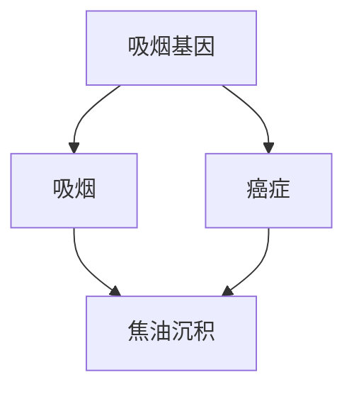

假设我们正在做的研究是一项观察性研究，我们收集了每个志愿者关于“吸烟”、“焦油沉积”和“癌症”的数据。遗憾的是，我们无法收集关于“吸烟基因”的数据，因为我们不知道这种基因是否存在。由于缺乏混杂因子的数据，我们不能阻断“吸烟 ← 吸烟基因 → 癌症”的后门路径。因此，我们不能使用后门调整来控制混杂因子的影响。

所以我们必须寻找另一种方式。这一次我们不从后门进去，而是从前门进去！在这个例子中，前门指的是直接的因果路径“吸烟→焦油沉积→癌症”，而且我们的确已经收集到了全部三个变量的数据。

根据我们的直觉，推理过程如下：首先，我们可以估计出“吸烟”对“焦油沉积”的平均因果效应，因为“吸烟”和“癌症”之间没有未被阻断的后门路径，其中在“癌症”处的对撞已经阻断了路径“吸烟←吸烟基因→癌症←焦油沉积”。我们甚至不需要对其进行后门调整，因为这条后门路径已经被阻断了。我们只需要观测 $P(\text{焦油沉积} \mid \text{吸烟})$ 和 $P(\text{焦油沉积} \mid \text{不吸烟})$，二者的差别就是吸烟对焦油沉积的平均因果效应。

同样，该图也允许我们估计“焦油沉积”对“癌症”的平均因果效应。要做到这一点，我们可以通过对“吸烟”进行统计调整来阻断从“焦油沉积”到“癌症”的后门路径：

> 焦油沉积 ← 吸烟 ← 吸烟基因 → 癌症

我们在第四章学到的知识在此处就派上了用场：我们只需要收集一个去混因子充分集的数据（在此例中就是变量“吸烟”的数据），就可以借助后门调整公式得到 $P(\text{癌症} \mid do(\text{焦油沉积}))$ 和 $P(\text{癌症} \mid do(\text{无焦油沉积}))$。二者的差别就是“焦油沉积”对“癌症”的平均因果效应。

现在，我们已经知道了吸烟导致焦油沉积的概率的平均增量和焦油沉积致癌的概率平均增量。那么，我们是否可以用某种方式将这些信息结合起来，得出吸烟致癌的概率的平均增量呢？**是的，我们可以。**

理由如下：癌症的产生有两种不同的情况，其一为“焦油沉积”存在的情况，其二为“焦油沉积”不存在的情况。如果我们强迫一个人吸烟，那么这两种情况的概率就分别是 $P(\text{焦油沉积} \mid do(\text{吸烟}))$ 和 $P(\text{无焦油沉积} \mid do(\text{吸烟}))$。如果“焦油沉积”的情况继续发展下去，那么“焦油沉积”导致“癌症”的可能性就是 $P(\text{癌症} \mid do(\text{焦油沉积}))$。而如果“无焦油沉积”的情况继续发展下去，那么其导致“癌症”的可能性就是 $P(\text{癌症} \mid do(\text{无焦油沉积}))$。

我们可以在 $do(\text{吸烟})$ 这一前提下，根据两种情况发生的概率对其进行加权，这样就能计算出吸烟导致癌症的总概率。如果我们阻止一个人吸烟，即前提条件为 $do(\text{不吸烟})$，则相同的论证同样有效。两者之间的差异就表示了相对于不吸烟，吸烟对于癌症的平均因果效应。

正如我刚才解释的，我们可以从数据中估计出我们讨论的每个 $do$ 概率。即我们可以用纯数学的方式在不引入 $do$ 算子本身（不进行实际干预）的情况下算出概率结果。由此，数学就为我们解决了科学界长达 10 年的争论和国家的官方声明都没能解决的那个问题：**量化吸烟对癌症的因果效应**——当然，前提是我们的假设成立。

# 前门调整公式详解

我刚才所描述的这个过程，即在不引入 `do` 算子的前提下表示 **P（癌症 | do（吸烟））**，就被称作**前门调整**。它不同于后门调整的地方是，我们需要调整两个变量（吸烟和焦油沉积）而不是一个变量，并且这些变量处于从吸烟到癌症的前门路径，而不是后门路径。

对那些更习惯“用数学语言说话”的读者，我忍不住要向你们展示一个在普通统计教科书中找不到的公式（公式 7.1）。在这里，**X** 代表“吸烟”，**Y** 代表“癌症”，**Z** 代表“焦油沉积”，**U**（在此例中显然没有出现在公式中）代表不可观测的变量，即“吸烟基因”。

$$
P(Y \vert do(X)) = \sum_{z} P(Z = z, X) \sum_{x} P(Y \vert X = x, Z = z) P(X = x) \tag{7.1}
$$

对数学有兴趣的读者可能会发现，将这个公式与后门调整公式进行比较会得到一个很有趣的结果，其中后门调整公式如下所示：

$$
P(Y \vert do(X)) = \sum_{z} P(Y \vert X, Z = z) P(Z = z) \tag{7.2}
$$

对于那些不习惯使用数学语言的读者，我们也可以从公式 7.1 中找到几个颇为有趣的发现。

首先，也是最重要的一点：你在公式中的任何地方都看不到 **U**（“吸烟基因”）的存在。这是整个问题的关键。我们甚至在未采集到任何数据的时候就成功地排除了混杂因子 **U**。费舍尔那一代的任何一位统计学家都会将此视为一个天大的奇迹。

其次，在导言中我曾提到**被估量**，并将其视作一种针对问题中的目标量的计算方法。而公式 7.1 和公式 7.2 就是两个特别复杂而有趣的被估量。公式的左边代表问题“**X** 对 **Y** 的影响是什么”，右边则是被估量，也即回答问题的一种方法。请注意，被估量以条件概率的形式表示，其不包含关于实际干预的数据，只包含观测到的数据。这意味着它可以直接根据数据估计出来。

---

此时此刻，我相信一些读者会想知道这个虚构的例子与现实情况的关系究竟有多密切。一项观察性研究和一张因果图是否就能彻底解决关于吸烟与癌症之关系的争论？如果图 7.1 的确准确反映了癌症的因果机制，那么这个问题的答案就是肯定的。但我们现在需要讨论的正是我们的假设在现实世界中是否有效。

我的一位老朋友、伯克利大学的统计学家**大卫·弗里德曼**带领我解决了这个问题。他认为，图 7.1 中的模型在三个方面是不合乎现实的。首先，如果存在这样的吸烟基因，那么它很可能也会影响人体去除肺部异物的方式，从而导致携带这种吸烟基因的人其肺部更易形成焦油沉积，而不携带这种基因的人则更有这方面的抵抗力。因此，他会从“吸烟基因”画一个箭头到“焦油沉积”，在这种情况下，前门公式就失效了。

# Markdown 排版优化结果

其次，“吸烟”不太可能仅仅通过“焦油沉积”引发“癌症”。我们可以很容易想到其他可能存在的机制，比如吸烟会导致慢性炎症，继而引发癌症。最后，我们实际上无法精准测量一个活人的肺部焦油沉积量，所以我刚刚提出的这项观察性研究根本无法在现实世界中开展。

针对这一特定案例，我无法反驳弗里德曼的批评。我不是癌症专家，因此对于这张因果图是否能够准确地反映真实世界中实际存在的机制，我不得不听从专家的意见。事实上，因果图的一个主要优势就是让假设变得透明，以供专家和决策者探讨和辩论。

然而，我之所以举这个例子，并不是为了提出吸烟影响的新机制，而是要证明在假设正确的情况下，即使我们没有混杂因子的数据，我们照样可以用数学的方式消除混杂因子的影响。适用于此种处理方式的情况可以很清楚地识别出来——$X$ 对 $Y$ 的因果效应被一组变量（$C$）混杂，又被另一组变量（$M$）介导（见图 7.2），并且中介变量 $M$ 不受 $C$ 的影响。当你看到满足上述条件的问题时，你就知道你可以从观测数据中估计出 $X$ 对 $Y$ 的影响。一旦科学家意识到这一事实，在面临无解的混杂因子时，他们就应该立即着手寻找不受混杂因子影响的中介变量。正如路易·巴斯德说的：“幸运总是眷顾准备好的人。”


> **图 7.2** 前门标准的基本设置

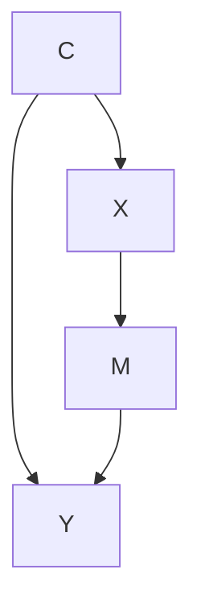

幸运的是，前门调整的价值并未被完全忽视。亚当·格林和康斯坦丁·卡申都是哈佛大学的政治学家（格林后来去了埃默里大学）。2014 年，他们写了一篇获奖论文，这篇论文是所有定量社会学家的必读论文。他们在 1987 年至 1989 年将一种新方法应用于分析由社会学家仔细审查过的一组数据，这项研究被称为“职业培训合作法（JTPA）研究”。作为 1982 年 JTPA 推行的成果之一，劳工部制订了一项职业培训计划，除其他服务之外，该计划还为参与者提供职业技能、求职技能方面的培训和可以积累工作经验的项目。研究者收集了项目报名者的数据、实际使用服务的报名者的数据，以及所有这些人在接下来的 18 个月里的收入数据。值得注意的是，这项研究包括一项随机对照试验以及一项观察性研究。在前者中，研究者随机分配部分参与者接受服务，在后者中，参与者可自行选择是否接受服务。

格林和卡申并没有绘制因果图，但根据他们对研究的描述，我自行绘制了一张如图 7.3 所示的因果图。变量“报名”记录的是某人是否报名了该项目，变量“出席”显示的是项目报名者是否确实使用了服务。显然，只有在报名者实际使用了服务之后，服务项目才可能影响参与者的收入，所以很容易证明从“报名”到“收入”不存在直接箭头这一假设是正确的。

# 7.3 前门标准与实际应用


> **图 7.3** JTPA 研究的因果图

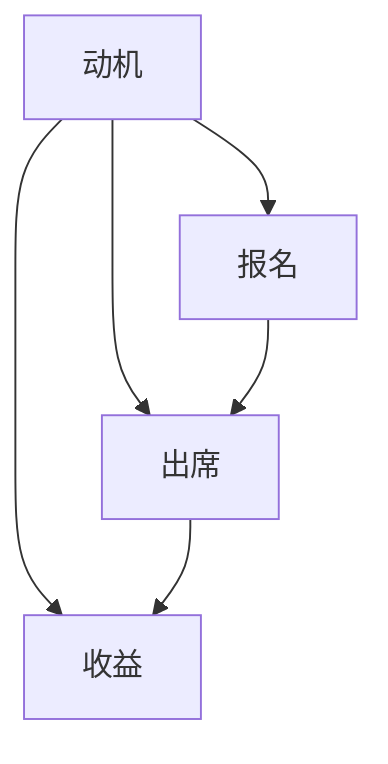

格林和卡申回避了对混杂因子的性质做具体说明，但我在这里将其归纳为“动机”。很明显，一个热切希望提高收入的人更有可能报名参加该项目，而且不管是否真的出席，此人在 18 个月后的收入水平都更有可能有所提高。当然，此项研究的目的是排除这个混杂因子的影响，找出服务项目本身为参与者提供了多少帮助。

将图 7.2 与图 7.3 进行比较，我们可以看到，如果没有从“动机”到“出席”的箭头，则该问题的情况就满足我在前面提到的中介变量“屏蔽”了混杂因子的影响的状态，因而也就适合用前门标准来解决。在许多情况下，我们都可以证明该箭头不存在才是更合理的假设。例如，如果这些服务只能通过报名者亲自前往某地预约登记的方式来提供，而人们错过预约通常是因为一些与“动机”无关的偶然事件（比如公共汽车罢工、脚踝扭伤等），那么我们就可以抹去这个箭头，使用前门标准。

但这项研究的实际情况是，服务是随时提供的，所以我们很难论证箭头不存在这一假设的合理性。然而，这正是让事情变得非常有趣的地方——在此种情况下，格林和卡申仍然在该研究中测试了前门标准。我们可以把他们所进行的测试看作一个**敏感度测试**。如果我们猜测这个箭头的影响微不足道，那么视其不存在所带来的偏倚可能会非常小。从他们得到的结果来看，情况就是这样。

通过做出某些合理的假设，格林和卡申推导出了几个不等式，用以说明统计调整是否太过或不足，以及这种太过或不足的程度。最后，他们将前门预测和后门预测与在同一时期运行的随机对照试验的结果进行了比较。其得到的结论令人印象深刻。采用后门标准（控制已知的混杂因子，如“年龄”“种族”“地点”）所做出的对于收入的估计很不准确，与对照试验的结果相差了数百美元乃至几千美元。如果的确存在一个未被观测到的混杂因子，比如这里的“动机”，那么这个结果就正是你期望看到的。并且我们无法使用后门标准来对它进行统计调整。

另一方面，采用前门估计进行的估算则成功地消除了几乎所有的“动机”效应。对男性来说，前门估计的准确性很不错，即使的确存在格林和卡申所预测的微小的正偏倚，该结果也仍在随机对照试验结果的误差范围内。对女性参与者来说，前门估计的准确性更高，据此得出的估计收入几乎完全与试验结果相匹配，不存在显著的偏倚。格林和卡申所做的工作提供了经验性和方法性两方面的证据，证明了如图 7.2 所示，只要 C 对 M 的影响足够微弱，前门调整就可以给出一个相当合理的关于 X 对 Y 影响的估计。这个估计比在不控制 C 的情况下所做的估计要好得多。

格林和卡申的结果说明了前门调整之所以是一个强大工具的原因所在：它允许我们控制混杂因子，并且这些混杂因子可以是我们无法观测（如“动机”）甚至无法命名的。也正是出于同样的原因，随机对照试验被认为是估计因果效应的“黄金标准”。前门估计所做的事与随机对照试验大体类似，并且还有一个额外的优点，即它的研究对象可以存在于自然的生活环境而非实验室的人造环境。所以，如果前门估计此后发展为随机对照试验的主要竞争对手，我是不会感到惊讶的。

# do演算，或者心胜于物

前门调整公式和后门调整公式的最终目标是根据 $P(Y \mid X, A, B, Z, \dots)$ 此类不涉及 do 算子的数据估算干预的效果，即 $P(Y \mid do(X))$。如果我们成功消除了计算过程中的 do 概率，那么我们就可以利用观测数据来估计因果效应，这样一来，我们就从因果关系之梯的第一层级踏上了第二层级。

我们此前在两种情况（应用前门调整的情况和应用后门调整的情况）中的成功带来了一个问题：是否还存在其他的门，通过这些门，我们可以消除所有的 do。从一个更宏观的视角，我们也可以这样问，即是否存在某种方法可以用来事先确定一个给定的因果模型是否适用于这种消除处理。如果存在这种方法，那么我们就可以对适用的因果模型进行此类处理，从而在不进行实际干预的情况下估算出因果效应。而对于不适用的模型，我们至少可以知道，我们在模型中嵌入的假设不足以让我们仅根据观测数据来揭示因果效应，同时对此种情况，我们也将意识到，无论我们有多聪明，要解决这个问题，进行某种干预性试验都是在所难免的。

即使干预性试验实际可行，也被法律许可，任何了解随机对照试验的成本和操作难度的研究者显然还是更希望通过纯数学的手段做出这些判断。20 世纪 90 年代初，这个想法也让我（并非作为一名试验者，而是作为一名计算机科学家和业余哲学家）着迷不已。当然，对于一名科学工作者而言，其所能获得的最美妙的体验之一，可能就是坐在办公桌前，意识到自己终于即将弄清在现实世界中什么是可能的，什么是不可能的，尤其是当这个问题对整个人类社会而言非常重要，并且曾令那些试图解决该问题的前辈困扰许久的时候。当尼西亚城的希帕克发现不必攀登金字塔，只根据金字塔落在地面上的影子就能计算出金字塔的高度时，他的感受想必就是如此——**心胜于物**。

事实上，古希腊人（包括希帕克）及其几何学形式逻辑系统的发明对我所采用的方法产生了极大的启发。在古希腊逻辑系统的核心，我们总会发现存在一组公理或不言而喻的真理，例如“经过任意两点有且仅有一条直线”。在这些公理的帮助下，古希腊人得以建构起许多更为复杂的表述，这些表述也被称为定理，其正确性远非公理那样显而易见。例如这一表述：一个三角形，无论大小或形状，其内角和为 $180^\circ$（或两个直角的度数和）。这一表述的真实性绝非不言而喻，而公元前 5 世纪的毕达哥拉斯学派的哲学家们则能将那些不证自明的公理当作原料，用它们来证明这一表述的普遍正确性。

如果你还记得高中几何，哪怕只记得一些要点，你或许会想起，定理的证明总是涉及一些辅助构造：例如，画一条平行于三角形某个边的直线，将某些角度标记为相等，以给定线段为半径画圆，等等。我们可以将这些辅助构造看作对所画图的性质做出论断（或声明）的临时性的数学命题。每一个新的辅助构造的绘制都得到了以前的辅助构造以及几何公理和一些已经得到证明的定理的许可。例如，绘制一条平行于三角形某个边的线，就得到了欧几里得的第五公设的许可，该公设的内容是：过直线外的一点有且只有一条该线的平行线。绘制这些辅助构造就类似于进行一种机械的“符号操作”运算，即获取先前写过的命题（或先前绘制出的图）并以新的格式重写它，前提是重写得到了公理的许可。欧几里得的伟大之处在于确定了一张包含五大基本公理的简短清单，据此我们可以推导出所有其他的正确的几何陈述。

现在回到我们的核心问题，即一个模型何时可以取代一个试验，或者一个“干预”量何时可以简化为一个“观察”量。在古希腊几何学家的启发下，我们希望将这个问题简化为符号操作，并以这种方式从奥林巴斯山上夺回因果关系，使其为普通研究者所用。

首先，让我们用证明、公理和辅助构造的语言，即欧几里得和毕达哥拉斯的语言重述 $X$ 对 $Y$ 的效应。我们从目标句 $P(Y \mid do(X))$ 开始。如果我们能成功地消除它的 do 算子，只留下像 $P(Y \mid X)$ 或 $P(Y \mid X, Z, W)$ 这样的经典条件概率表达式，那么我们的任务就完成了。当然，我们不能随意操作我们的目标表达式，我们所进行的操作必须符合 $do(X)$ 作为一项实际干预行动的基本含义。因此，我们必须通过一系列合法的操作来转化表达式，且每个操作都必须得到公理和模型假设的许可。操作应该保留接受操作的表达式的本来含义，只更改它所使用的格式。一个“保留本来含义”只变换格式的例子是将 $y = ax + b$ 转换为 $ax = y - b$ 的代数变换，其中 $x$ 和 $y$ 之间的关系保持不变，只有格式发生了变化。

我们已经了解了一些“合法”的 do 表达式变换。例如，规则 1 为：如果我们观察到变量 $W$ 与 $Y$ 无关（其前提可能是以其他变量 $Z$ 为条件），那么 $Y$ 的概率分布就不会随 $W$ 而改变。例如，在第三章，我们看到，一旦我们知道了中介物“烟雾”的状态，变量“火灾”就与变量“警报”不相关了。这种不相关的认定转化为符号处理，就是：

$$
P(Y \mid do(X), Z, W) = P(Y \mid do(X), Z)
$$

上述等式成立的条件是，在我们删除了指向 $X$ 的所有箭头后，变量集 $Z$ 会阻断所有从 $W$ 到 $Y$ 的路径。在“火灾 → 烟雾 → 警报”的例子中，$W = \text{火灾}$，$Z = \text{烟雾}$，$Y = \text{警报}$，$Z$ 阻断了所有从 $W$ 到 $Y$ 的路径（此例中没有变量 $X$）。

在此前关于后门调整的讨论中，我们还了解到另一个合法的变换。我们知道，如果变量集 $Z$ 阻断了从 $X$ 到 $Y$ 的所有后门路径，那么以 $Z$ 为条件（对 $Z$ 进行变量控制），则 $\operatorname{do}(X)$ 等同于 $\operatorname{see}(X)$。因此，如果 $Z$ 满足后门标准，这种变换就可以写作：

$$
P(Y \mid \operatorname{do}(X), Z) = P(Y \mid X, Z)
$$

我们将此作为我们公理系统的规则 2。和规则 1 相比，尽管规则 2 没有那么不言自明，但其最简单的形式实际上就是汉斯·赖欣巴哈的共因原则的修正版本（经过修正后，我们就不会再把对撞因子误认为混杂因子了）。换言之，这个等式的意思是，在控制了一个充分的去混因子集之后，留下的相关性就是真正的因果效应。

规则 3 很简单，它实质上是说，如果从 $X$ 到 $Y$ 没有因果路径，我们就可以将 $\operatorname{do}(X)$ 从 $P(Y \mid \operatorname{do}(X))$ 中移除。即，如果不存在只包含前向箭头的从 $X$ 到 $Y$ 的路径，则：

$$
P(Y \mid \operatorname{do}(X)) = P(Y)
$$

这个规则可以这样解释：如果我们实施的干预行动（$\operatorname{do}$）不会影响 $Y$，那么 $Y$ 的概率分布就不会改变。除了像欧几里得公理一样不言自明，规则 1 到 3 还可以利用 $\operatorname{do}$ 算子的“删除所有指向……的箭头”定义和概率的基本法则对其进行数学上的证明。

注意，规则 1 和规则 2 涉及 $X$ 和 $Y$ 之外的辅助变量 $Z$ 的条件概率。这些辅助变量可以充当一种概率计算的语境。有时，此语境本身的存在就许可了变换操作。规则 3 也可能涉及辅助变量，但为了简单起见，我在此省略了它们。

注意，每条规则都附带一个简单的句法解释。规则 1 允许增加或删除某个观察结果。规则 2 允许用观察替换干预，或者反过来。规则 3 允许删除或添加干预。所有这些操作都必须在适当的条件下进行，并且必须在关于特定情况的因果图中得到证实。

现在，我们已经准备好论证规则 1 到 3 是怎样让我们得以将一个表达式变换为另一个，最终得到我们想要的那个表达式的。虽然操作步骤有些复杂，但我认为要想真正理解如何运用一系列 $\operatorname{do}$ 演算规则推导出前门调整公式，展示这一论证过程是必需的（见图 7.4）。你不需要遵循所有的步骤一一照做，我的目的只是希望你体会一下 $\operatorname{do}$ 演算究竟是什么。我们从目标表达式 $P(Y \mid \operatorname{do}(X))$ 开始。我们需要引入辅助变量，将目标表达式转换为一个没有 $\operatorname{do}$ 的公式，当然我已经知道，我们最终得到的表达式将与前门调整公式一致。我们需要绘制一张包含 $X$、$Y$ 和辅助变量的因果图，论证过程的每一步都必须得到因果图的许可。在某些情况下，论证步骤还需要从因果图的子图中获得许可，这些子图以删除箭头的形式表明混杂消除的不同情况。这些子图显示在图 7.4 右侧。


> 图 7.4 利用 $\operatorname{do}$ 演算规则推导前门调整公式

```mermaid
graph TD
  A["问题"] --> B["P(c | do(s))"] = ΣtP(c | do(s), t)P(t | do(s))]
  B --> C["吸烟"]
  C --> D["焦油沉积"]
  D --> E["癌症"]
  E --> F["吸烟基因（未观测）"]
  G["被估量"] --> H["Σs' Σt P(c | do(t), s')P(s'| do(t))P(t | s)"]
  H --> I["Σs' Σt P(c | t, s')P(s'| do(t))P(t | s)"]
  I --> J["Σs' Σt P(c | t, s')P(s')P(t | s)"]
  K["概率公理"] --> L["规则 2"]
  K --> M["规则 2"]
  K --> N["规则 3"]
  K --> O["概率公理"]
```

我对 $\operatorname{do}$ 演算有着特别的偏爱。有了这三条简单的规则，我就能推导出前门调整公式。这是科学史上第一个不以控制混杂因子为手段来估计因果效应的方法。我相信，不用 $\operatorname{do}$ 演算，没有人可以做到这一点。所以在 1993 年伯克利大学举办的一次统计学研讨会上，我把它作为一个挑战提出来，甚至提供了 100 美元的奖金，用以奖励解决它的人。同样参加了这次研讨会的保罗·霍兰德曾对我说过，他把这个问题作为课堂作业布置下去了，并会在有了结果后把解决方案发给我。（我的同事们告诉我，他最终在 1995 年的一次会议上提出了一个非常复杂的解决方案，如果他的论证是正确的，我可能就欠了他 100 美元。）经济学家詹姆斯·赫克曼和罗德里戈·平托在 2015 年进行了另一次尝试，他们希望利用“标准工具”来证明前门调整公式。他们的辛勤劳动最终得到了回报，尽管其论证过程不得不用长达 8 页的论文来解释清楚。

实际上，在那次研讨会的前一天晚上，我在一家餐馆中只用了一张餐巾纸就写完了论证过程（与图 7.4 很类似），并把它递给了大卫·弗里德曼。可惜后来他写信给我说，他把那张餐巾纸弄丢了。他无法重建整个论证过程，并询问我是否保存了一份副本。第二天，杰米·罗宾斯从哈佛大学写信给我说，他从弗里德曼那儿听说了这个“餐巾纸问题”，并提出打算立即乘飞机来加利福尼亚，与我一起核实这个论证。

我很高兴与罗宾斯分享 **do 演算** 的秘密。我相信，这次洛杉矶之行是他之后热情接纳因果图方法的关键。在他和桑德·格林兰的推动下，因果图逐渐发展成为流行病学家的第二语言。这也从侧面说明了我为什么对这个“餐巾纸问题”这么着迷。

**前门调整公式的论证** 是一个惊喜，它指出了 do 演算所具有的重要价值。然而，我无法确定 do 演算的这三条规则是否充分。我们是否遗漏了第四条规则，而它可以帮助我们解决这三条规则所不能解决的问题？

1994 年，当我第一次提出 do 演算时，我之所以选择这三条规则，是因为它们足以处理我所知道的所有不同类型的情况。我不知道这些规则是否会像 **阿里阿德涅之线**[^2] 一样能永远带领我走出迷宫，又或者终有一天我会遇到一个极其复杂、无法逃脱的迷宫。当然，我抱着乐观的希望。我猜想，只要因果效应可以从数据中估计出来，我们就可以利用这三条规则通过一系列处理步骤消除 do 算子。但我还没能证明这一论断。

这类问题在数学和逻辑学中有许多先例。我想证明的这种性质在数学逻辑上通常被称为 **“完备性”**。一个完备的公理系统有这样一种特性，即其中的公理足以推导出使用该公理系统的语言书写的任何正确表述。的确存在一些非常出色的公理系统是不完备的，比如概率论中描述条件独立性的 **菲利普·戴维公理**。

在这个关于完备性猜想的迷宫故事中，有两个研究小组在我这个徘徊的忒修斯面前扮演了阿里阿德涅的角色：南卡罗来纳大学的 **黄一鸣**（音）、**马尔科·瓦尔托塔**，和加州大学洛杉矶分校的 **伊利亚·斯皮塞**（他也是我的学生）。这两个研究小组同时独立地证明了，规则 1 至 3 足以让我们走出任何一个确有出口的 do 迷宫。

我不确定学界是否曾屏息等待他们的完整证明，因为那时，大多数研究者都满足于仅使用前门标准和后门标准。好在，这两个研究小组的成果都得到了公开的认可——在 2006 年的人工智能大会上，他们同时获得了有关不确定性研究的最佳学生论文奖。

[^2]: 阿里阿德涅之线：希腊神话中，阿里阿德涅公主用一根线帮助忒修斯走出迷宫。

我承认我本人就曾对这一证明结果屏息以待。这一对于完备性的证明告诉我们，如果我们在规则 1 到 3 中找不到根据数据估计 $P(Y \mid do(X))$ 的方法，那么对于这个问题，解决方案就是不存在的。在此情况下，我们就能意识到除了进行随机对照试验，我们别无选择。它还能告诉我们，对于某个特定的问题，什么样的额外假设或试验可以使因果效应从不可估计变为可估计。

在宣布全面胜利之前，我们应该尝试使用 do 演算来讨论一个问题。就像其他运算一样，它可以让某种有效的理论建构得到证明，但它并不能帮助我们找到理论建构本身。它是一个优秀的解决方案验证工具，但并不是一个很好的解决方案搜索工具。如果你知道变换的正确顺序，你就可以很容易地向其他人（熟悉规则 1 到 3 的人）证明 do 算子可以被消除。但是，如果你不知道正确的变换顺序，你就很难找到消除 do 算子的方法，甚至无法确定 do 算子是否可以消除。用几何证明来类比的话，就是我们需要确定下一步应该使用哪种辅助构造，是画一个以 A 点为圆心的圆？还是画一条与 AB 平行的线？可能的辅助构造有无限多个，并且公理本身不会对我们下一步该进行何种尝试提供任何指导。就像我的高中几何学老师常说的，你需要借助“数学眼镜”自己去发现它。

在数理逻辑中，这类问题被称为“决策问题”。许多逻辑系统在构建过程中都经历过棘手的决策问题的阻挠。例如，假设有一堆尺寸不等的多米诺骨牌，我们没有一个简易的方法来确定是否可以将其以某种方式排列，以严丝合缝地填满一个指定大小的正方形。然而，一旦某个排列方法被提出来，我们就能在极短的时间内验证它是否可以构成一个解决方案。

幸运的是（再一次），对 do 演算来说，这一决策问题已被证明是可解决的。基于我另一个学生田进（音）所做的前期工作，伊利亚·斯皮塞发现了一个算法，该算法可以用于确定某个解决方案是否存在“多项式时间”（polynomial time）。这是一个比较专业的术语，如果用走出迷宫来类比的话，该算法的提出意味着，同尝试所有可能的路径相比，的确存在一种更有效的方法用以找到迷宫的出路。

斯皮塞提出的这种找出某一问题所涉及的所有因果效应的算法，并没有削减我们对 do 演算的需要。事实上，我们变得比以往更加需要它，主要是出于以下几个独立的原因：

- 首先，我们需要借助它来超越观察性研究。假设出现了最糟糕的情况，即我们的因果模型不允许我们仅通过观测数据来估计 $P(Y \mid do(X))$ 的因果效应，并且我们也不能进行随机分配处理 $X$ 的随机化试验。此时，聪明的研究者可能会问，我们是否可以通过随机化其他变量（如 $Z$，因为 $Z$ 比 $X$ 更易于控制）来估计 $P(Y \mid do(X))$？例如，如果我们想评估胆固醇水平（$X$）对心脏病（$Y$）的影响，我们也许可以尝试操纵受试者的饮食（$Z$），而不是直接控制受试者血液中的胆固醇水平。

于是，我们接下来要问的问题就变成了，我们是否能找到这样一个让我们得以回答因果问题的替代变量 $Z$。在 do 演算的世界中，该问题就等同于，我们是否可以找到一个变量 $Z$，让我们得以将 $P(Y \mid do(X))$ 变换为一个新的表达式，其中 do 算子的限制目标变成了 $Z$，而不再是 $X$。这是斯皮塞的算法没有覆盖到的一个全新的问题。幸运的是，它也有一个完备的解决方案，其中涉及的新算法是由伊莱亚斯·巴伦拜姆（现为普渡大学教授）于 2012 年在我的实验室中发现的。

当我们考虑某个实验结论的可移植性或外部有效性（评估在与原始研究环境存在几处关键方面的差异的新环境中，实验结果是否仍然有效）时，更多类似的问题就出现了。此类更具挑战性的问题触及了科学方法论的核心，因为只要是科学就会涉及结论的普遍化。然而，关于普遍化问题的论证至少在此前的两个世纪中都没有丝毫进展。用于生成对于该问题的解决方案的工具一直未被发现。2015 年，巴伦拜姆和我向国家科学院提交了一篇论文，在其中我们给出了这个问题的解决方案，前提是研究者可以用因果图来表示其对这两个环境的假设。在满足此前提的条件下，do 演算规则提供了一种系统化的方法，用以确定在研究环境中发现的因果效应是否能帮助我们估计目标环境中的因果效应。

# do演算的另一个重要价值在于其透明性

在我写作这一章的时候，巴伦拜姆给我发来了一个新的难题：假设现在有这样一个因果图，其中只包含4个可观测变量 $X$、$Y$、$Z$、$W$ 和 2 个无法观测的变量 $U_1$、$U_2$（见图 7.5）。我需要回答的问题是，如何确定 $X$ 对 $Y$ 的效应是可估计的。

我们没有阻断后门路径的方法，且此种情况也不适合应用前门调整。我尝试了所有我知道的捷径和其他可靠的直观论据，正反两面都有，仍不知道怎么解决这个问题。我找不到走出迷宫的路。但当巴伦拜姆低声对我说，“不如试试 do 演算”时，我豁然开朗，立即找到了答案。这一解决方案的每一个步骤都是清晰而有意义的。以下是关于此例的一个最简单的模型，其中对于因果效应的估计需要我们找到一个超越前门调整和后门调整的方法。


> **图 7.5** 一个新的餐巾纸问题？

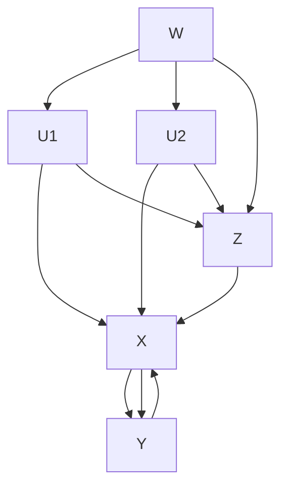

---

为了避免给读者留下 do 演算只是纸上谈兵或脑力游戏的印象，我将以一个实际问题来展示这一解决方案，这个问题是两位杰出的统计学家南尼·维尔穆斯和大卫·考克斯在最近提出的。它论证了那句亲切的耳语——“不如试试 do 演算”——是如何帮助老练的统计学家解决实际难题的。

大约在 2005 年，维尔穆斯和考克斯对一类被称为“序贯决策”（sequential decisions）或“时变处理”（time–varying treatments）的问题产生了兴趣。在医学治疗领域，这种问题很常见。以艾滋病治疗为例，通常，艾滋病治疗是在较长的一段时间内进行的，并且在每个治疗阶段，医生都会根据患者的实际情况调整后续治疗的强度和用药剂量。同时，患者的病情也会受到此前治疗方案的影响。

因此，我们就得到了一个类似于图 7.6 所示的因果图，其中展示了两个治疗阶段和两种治疗方案。第一种治疗方案（$X$）是完全随机的，第二种治疗方案（$Z$）则由中期结果的观测值（$W$）决定，其中 $W$ 取决于 $X$。根据收集到的数据，考克斯和维尔穆斯的任务是在保持 $Z$ 恒定不变且独立于观测值 $W$ 的前提下，预测治疗方案 $X$ 对结果 $Y$ 的影响。


> **图 7.6** 维尔穆斯和考克斯的时变处理例子

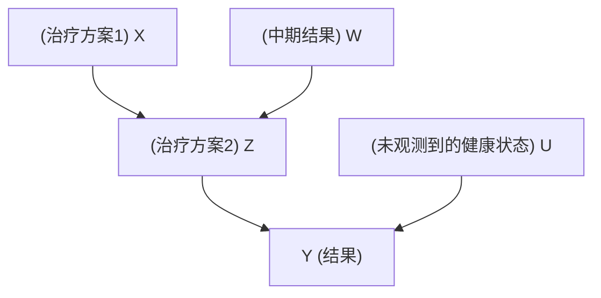

杰米·罗宾斯于 1994 年发表的关于该问题的讨论文章首次引发了我对时变处理问题的注意。在 do 演算的帮助下，通过调用后门调整公式的一个序贯版本，我们最终推导出了一个通用的解决方案。但维尔穆斯和考克斯不知道这个方法，他们称其遇到的问题为“间接混杂”，并接连发表了三篇分析该问题的论文（2008 年、2014 年和 2015 年）。由于找不到一个通用的解决方案，他们只能诉诸线性近似，但即便是在经过了线性近似处理的情况下，他们仍然发现该问题很难解决，因为标准的回归分析法不适用于此种情况。

幸运的是，那句低语——“不如试试 do 演算”——再一次在我耳边响起，我得以发现他们的问题在三行计算中就能解决，其背后的逻辑推理如下所示：

我们的目标量是 $P(Y \mid do(X), do(Z))$，而我们可以采集到的数据以 $P(Y \mid do(X), Z, W)$ 和 $P(W \mid do(X))$ 为表示形式。这两个表达式反映了这样一个事实：此研究中的 $Z$ 并不取决于某个外部因素，而是遵循某种（未知的）机制随 $W$ 的变化而变化。因此，我们的任务就是将目标表达式变换为另一个表达式，以反映 do 算子仅适用于 $X$ 而非 $Z$ 这一研究条件。如此一来，我们就可以通过简单地运用 do 演算的三条规则来解决这个问题了。

这个故事有效地证明了，能够解决艰深的理论问题的数学工具，在现实中也能发挥作用。

# do 乐队中隐藏的演奏者

我已经提到了在构建 do 演算的理论系统的过程中，我的一些学生做出的重要贡献。与任何其他的理论系统一样，它也以一种浑然一体的状态呈现出来，而这很可能掩盖了在构建它的过程中诸多贡献者所进行的尝试和所付出的努力。do 演算理论系统的构建花费了 20 多年的时间，其中我的好几位学生和同事都为之做出了自己的贡献。

首先是**托马斯·维尔玛**，我遇到他时他还是一个 16 岁的男生。有一天，他的父亲把他带到我的办公室，对我说：“给他点儿事做吧。”他太聪明了，高中教学内容完全无法引起他的兴趣，而他最终在学术上取得的成就也的确令人惊叹。维尔玛证明了广为人知的 **d 分离性**（简而言之，指你可以使用路径阻断规则来确定哪些独立性应该在数据中成立）。而且更令人惊讶的是，他告诉我，他在证明 d 分离性时把它当成了一道家庭作业题，而不是一个尚待证明的重要猜想！不得不说，有时候年轻和天真确有其优势。现在，你仍然可以从 do 演算的规则 1 以及路径阻断在因果关系之梯第一层级上的印记中一瞥其证明留下的馈赠。

但是，如果没有一个补充性的说明——即路径阻断这种解决方案已经非常完美，不存在进一步改进的可能——那么维尔玛的证明效度就会大打折扣。也就是说，你还需要证明：除了通过路径阻断揭示出来的独立性之外，该因果图不隐含其他的独立性。这部分关键的补充性证明是由我的另一位学生**丹·盖革**完成的。在我承诺他，如果他能完成两个定理的证明，我就立即给他一个博士学位之后，他从加州大学洛杉矶分校的研究团队转到了我的研究实验室。他真的做到了，而我也兑现了承诺！他现在是我的母校以色列理工学院计算机科学系的系主任。

丹并不是我从其他部门“挖”来的唯一一名优秀的学生。1997 年的一天，我在加州大学洛杉矶分校泳池的更衣室更衣时，和旁边的一位中国小伙子交谈起来。我得知他是一名物理学博士，于是根据我当时的一贯做法，我开始试图说服他转到我正在从事的人工智能领域。他并没有立即被我说服，但是第二天，我收到了他的朋友**田进**发来的一封电子邮件，田进说他希望从物理学转向计算机科学，问我是否有适合他的有挑战性的暑期项目。两天后，他就来到我的实验室开始工作了。

4 年后，也就是 2001 年 4 月，他用一个简单的图解标准震撼了世界，这个图解标准概括了因果关系的前门、后门和我们当时能想到的所有门。我记得我是在圣达菲的一次会议上向大家介绍田进提出的标准的。当时，该领域的各位专家轮番盯着我们的研究海报，纷纷摇着头表示不相信。这样一个简单的标准怎么会适用于所有的图示呢？

20 世纪 90 年代，田进（现为爱荷华州立大学教授）刚刚来到我们的实验室时，其思维方式对我们来说是陌生的。我们的对话总是充斥着极富想象力的隐喻和不成熟的猜想。但除非某项发现足够严谨，已经过证明，并且至少反复梳理过五次以上，否则田进永远不会公开宣布他的成果。**大胆猜想与严谨求证的结合**让田进实现了他的学术目标。

田进提出的方法后来被称为“c 分解”（c–decomposition），正是在此方法的基础之上，伊利亚·斯皮塞后来为 do 演算开发出了一整套完整的算法系统。对我而言，这个故事的寓意可能是：**永远不要低估更衣室对话的力量**！

---

在这场历时 10 年的有关干预行动应如何理解的纷争的最后阶段，伊利亚·斯皮塞加入了。他加入的时机正是我方最为艰难的时期。当时我正忙于为我不幸遇难的儿子丹尼——一名反西方恐怖主义的受害者——建立基金会。我一直以来都期望我的学生自力更生，而在那段自顾不暇的时间里，这个期望被推向了极致。

而他们返还给了我一份最好的礼物：为 do 演算理论系统的建构添上了最后的点睛之笔，这是我仅凭一己之力无法做到的。事实上，我曾试图阻止伊利亚去证明 do 演算的完备性。因为完备性证明的困难是众所周知的，想要按时拿到博士学位的学生都避之唯恐不及。幸运的是，伊利亚没有听从我的建议，而是独自完成了这项艰巨的任务。

---

在一些关键时刻，我的几位同事也曾对我思考问题的方向产生了意义深远的启发。卡内基–梅隆大学的哲学教授彼得·斯伯茨是在我之前就开始使用网络模型研究因果关系的前辈，他的观点对我后续的研究有着非常关键的影响。在听到他在瑞典乌普萨拉发表的一次演讲后，我第一次意识到，**执行干预可以被看作从因果图中删除箭头**。在那之前，与历代统计学家一样，我一直戴着枷锁思考，试图只借助一张静态的概率分布图表来思考因果论。

删除箭头的想法也不能说是斯伯茨第一个提出的。早在 1960 年，两位瑞典经济学家——罗伯特·斯特罗茨和赫尔曼·沃德——就提出了十分类似的想法。在当时的经济学世界中，还从来没有任何一项研究使用过图示分析的方法；相反，经济学家更多地依赖于结构方程模型，也即没有路径图的休厄尔·赖特方程。从路径图中删除箭头就相当于从结构方程模型中删除一个方程。因此，粗略来说，是斯特罗茨和沃德先提出了这一想法。而如果我们进一步追溯历史的话就会发现，在他们之前，特里夫·哈维默（挪威经济学家和诺贝尔奖获得者）曾在 1943 年就提出用修改方程的方法来表示干预。

但无论如何，斯伯茨将删除方程的思想移植到了因果图领域，转换为删除因果图中的箭头这一想法仍然激发了大量的新见解和新成果的出现。**后门标准**就是这种转换思想的第一个衍生成果，而 **do 演算**可以算是第二个。并且，这种转换带来的红利仍然有待挖掘，在反事实、（实验结果）普遍化、数据缺失情况下的结果估计和机器学习等研究领域，无数新成果依然在不断涌现。

---

如果我可以不那么谦虚，我会以艾萨克·牛顿的名言“站在巨人的肩膀上”来结束本节。但出于本性，我更想引用《犹太法典》中的一句话：

> “从我的老师那儿我学到了很多，从我的同事那儿我学到了更多，从我的学生那儿我学到的最多。”（《禁食篇》7a）

如果没有维尔玛、盖革、田进和斯皮塞等人的贡献，do 算子和 do 演算就不会展现出今天的辉煌。

## 案例：斯诺医生的离奇病例

1853 年和 1854 年，英格兰陷入了霍乱疫情的泥沼。在那个年代，霍乱就像今天的埃博拉病毒一样可怕：一个健康的人若不小心喝了被霍乱细菌污染的水，他在 24 小时内就会死亡。我们今天知道霍乱是由一种攻击肠道的细菌引发的。这种细菌通过被感染者的米汤样排泄物传播，患者在死前会频繁腹泻，进而进一步扩大细菌的传播范围。

但在 1853 年，我们还无法用显微镜看到任何疾病的致病菌，更不用说霍乱病菌了。一种普遍的观点认为，是空气中的“瘴气”引起了霍乱。伦敦一些较贫困的地区环境卫生较差，同时霍乱疫情也更猖獗，这一事实似乎支持了该理论。

约翰·斯诺医生治疗霍乱病人的经验超过 20 年，他对瘴气理论一直持怀疑态度。他合理地指出，由于症状表现在肠道，患者首先接触到病原体的部位一定是肠道。但是，因为无法直接用眼睛捕捉到元凶，他也就没有办法证明这一点——直到 1854 年霍乱爆发。

约翰·斯诺的故事有两个版本，其中一个较为有名，我们可以称之为“好莱坞”版本。在这个版本的故事中，他煞费苦心地挨家挨户记录霍乱患者死亡的地点，并注意到有一大群患者住在伦敦宽街的一处水泵附近。通过与居住在该地区的居民交谈，他发现几乎所有的受害者都从这处水泵中取过水。他甚至了解到，在距离此地很远的汉普斯特德有一起霍乱致死的案例，其中一名死去的女性患者特别喜欢从这处位于宽街的水泵中取水。她和她的侄女都在喝了宽街的水之后得霍乱死了，而她所在的地区再没有其他人得霍乱。在汇集了所有这些证据后，斯诺便要求地方当局拆除这处水泵的手柄。当年的 9 月 8 日，地方当局同意了。此后，正如斯诺的传记作者所描述的：“水泵手柄被移走了，瘟疫也得到了控制。”所有这一切构成了一个精彩的故事。如今，约翰·斯诺社团甚至每年都要进行著名的水泵手柄拆除表演作为纪念。然而在真实的历史中，拆除水泵手柄对全伦敦市的霍乱疫情几乎没有产生什么实质性的影响，这一流行病在此之后继续夺去了近 3000 人的生命。

在非好莱坞版本的故事中，我们仍然可以看到斯诺医生奔波于伦敦街道上的身影，但这次他真正的行动目标是找出伦敦人都是从哪里取水的。当时伦敦有两家主要的供水公司：索思沃克和沃克斯豪尔公司（后文简称索沃公司），以及兰贝思公司。正如斯诺了解到的，两家供水公司的关键区别在于前者从伦敦桥区域抽水，其位于伦敦下水道的下游，而后者在几年前已拆除了其位于下水道下游的进水口，转而在上游建了新的进水口。因此，索沃公司的客户得到的是被霍乱患者粪便污染了的水，而兰贝思公司的客户得到的则是未受污染的水。（两者都与受污染的宽街用水无关，宽街的水来自一口井。）死亡率统计数据证实了斯诺这一令人担忧的猜想。霍乱在由索沃公司供水的地区尤为猖獗，死亡率比其他地区高了 8 倍。但即便如此，这一证据也只是间接证据。瘴气理论的支持者可能会辩驳称，瘴气污染在这些地区也是最严重的，而这一点是无法证伪的。我们关于此例的因果图如图 7.7 所示，其中我们无法观测混杂因子“瘴气”（或其他可能的混杂因子，比如“贫困”），所以我们不能用后门调整来控制变量。


> 图7.7 霍乱的因果图（在发现霍乱杆菌之前）

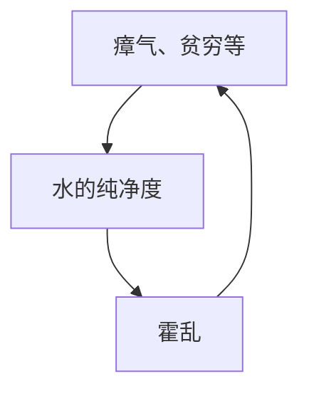

不过，斯诺自有妙招。他注意到，在两家公司共同服务的地区中，由索沃公司供水的家庭，其死亡率仍然要高出许多，而这些家庭在瘴气和贫困方面与该地区的其他家庭没有什么显著的区别。

> “由两家公司共同供水的地区的情况最能说明问题，”斯诺写道，“两家公司的管道都通向所有街道，进入几乎所有的院落和小巷……无论贫富，无论房子大小，两家公司都等而视之地提供自来水服务；而接受不同公司服务的客户，他们在生活条件或职业方面也并无明显分别。”

这就好像在还没有“随机对照试验”这个概念的时候，供水公司就已经对伦敦人进行了一次随机化试验。事实上，斯诺也注意到了这一点，他甚至这样评价道：

> “……再设计不出比这更好的试验，能让我们彻底检测供水对霍乱的影响了，整套试验设计就现成地摆在研究者面前。而且这一试验的规模也非常宏大，多达30万不同性别、年龄、职业、阶层和地位的人，从上流人士到底层穷人，所有这些人被分成了两组，并且，他们不仅不能主动选择，而且在大多数情况下对于这种选择毫不知情。”

在这个试验中，一组人得到了干净的水，另一组得到了被污染的水。

斯诺的观察将一个新的变量引入了因果图，新的因果图如图7.8所示。斯诺艰辛的调查工作证实了两个重要的假设：

1. **“霍乱”和“供水公司”之间没有箭头**（二者是独立的）；
2. **“供水公司”和“水的纯净度”之间有一个箭头**。

此外，斯诺没有做出明确说明，但同样重要的第三个假设是：

3. **“供水公司”和“霍乱”之间没有直接箭头**。

这一点在今天是显而易见的，因为我们知道供水公司不可能通过其他的渠道将霍乱病菌输送给客户。


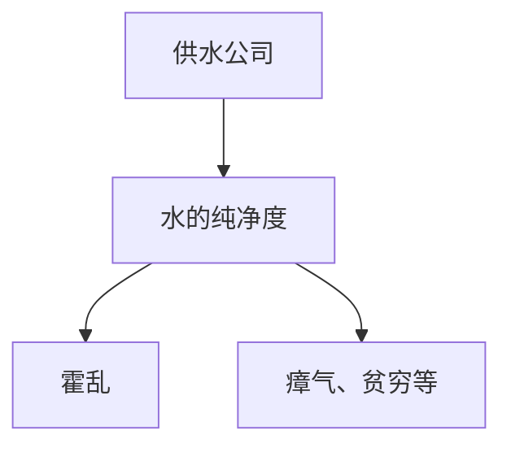

**图7.8** 引入工具变量之后的霍乱因果图

满足这3个属性的变量，在今天被称为**工具变量**（instrumental variable）。显然，斯诺认为，这个变量就类似于抛硬币，它模拟的是一个没有箭头指向的变量。由于“供水公司”与“霍乱”的关系中不存在混杂因子，因此任何观察到的二者之间的关联都必然是因果关联。同样，由于“供水公司”对“霍乱”的影响必须通过改变“水的纯净度”生效，由此我们可以得出结论（与斯诺的结论一致），观察到的“水的纯净度”和“霍乱”之间的关系也必然是因果关系。

斯诺毫不含糊地陈述了他的结论：如果索沃公司将其进水口移到上游，那么它本可以挽救1000多人的生命。

但在当时，几乎没有人注意到斯诺的结论。他将他的结论自费印成小册子，但总共只卖出了56份。如今，流行病学家将他的这本小册子视为这门学科的奠基性文献。它表明，通过“鞋革研究”（我从大卫·弗里德曼那儿借来的措辞）[^3]和因果推理，我们确实可以追查到问题的根源。

[^3]: 鞋革研究（shoe-leather research）：指通过实地调查、走访等艰苦的田野工作获取数据的研究方法。

尽管在今天，瘴气理论已经不足为信，但贫困和地理位置无疑仍是重要的混杂因子。但是，即使不去测量这些变量（因为斯诺挨家挨户进行的调查工作很难复制），我们仍然可以借助工具变量来确定，通过净化水质，供水公司能拯救多少生命。

现在，让我们先解释一下工具变量是如何起作用的。为了简化说明，我们用变量 Z、X、Y、U 替代具体的变量名称，并将图 7.8 重新绘制为图 7.9。我在图中标示了路径系数（a，b，c，d），以表示因果效应的强度。这意味着我们假设变量都是数值变量，且变量的相关函数是线性的。请记住，路径系数 a 表示让 Z 增加一个标准单位的干预行动将导致 X 增加 a 个标准单位。（在此，请允许我省略有关解释何为“标准单位”的技术细节。）


> 图 7.9 工具变量的一般设置

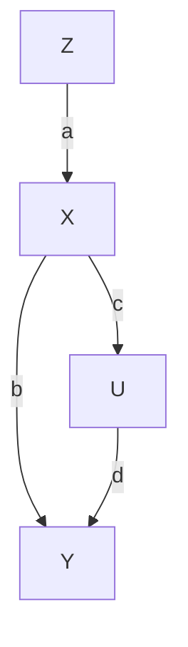

由于 Z 和 X 之间不存在混杂，因此 Z 对 X 的因果效应（a）可以根据 $r_{XZ}$ 估计出来，其中 $r_{XZ}$ 是 X 在 Z 上的回归线的斜率。同样，变量 Z 和 Y 的关系也未被混杂，因为路径 Z → X ← U → Y 被 X 处的对撞阻断了。因此 Z 在 Y 上的回归线斜率 $r_{ZY}$ 就等于直接路径 Z → X → Y 的因果效应，即路径系数的乘积：$ab$。因此，我们就有了两个方程：$ab = r_{ZY}$ 和 $a = r_{ZX}$。用第一个方程除以第二个，我们就得到了 X 对 Y 的因果效应：$b = r_{ZY} / r_{ZX}$。

通过这些步骤，工具变量就神奇地许可了我们执行与前门调整相同的处理：在无法控制混杂因子或收集其数据的情况下估计 X 对 Y 的效应。据此，我们就可以向伦敦当局的决策者提议，供水公司必须将进水口建在下水道的上游，即使那些决策者仍然相信瘴气理论也没关系。还请注意，我们所做的是根据因果关系之梯第一层级的信息（相关系数 $r_{ZY}$ 和 $r_{ZX}$）推导出第二层级的信息（b）。之所以能够做到这一点，是因为路径图所体现的假设在本质上是因果关系，尤其是“U 和 Z 之间没有箭头”这个关键假设。如果我们换一张因果图，而其中 Z 是 X 和 Y 的混杂因子，那么我们就无法用公式 $b = r_{ZY} / r_{ZX}$ 正确估计出 X 对 Y 的因果效应。事实上，无论数据样本有多大，任何统计方法都无法区分这两种模型（因果图）。

在因果革命之前，人们就已经对工具变量有所了解，但是因果图以一种更清晰的方式表明了它们是如何发挥作用的。尽管斯诺当时并未掌握上述估算因果效应的定量公式，但他在实际上使用的就是引入一个工具变量的分析方法。休厄尔·赖特当然更清楚这种路径图的用法，公式 $b = r_{ZY} / r_{ZX}$ 可以直接从他的路径系数方法中推导出来。而在休厄尔·赖特之外，第一个有意识地使用工具变量的人似乎是……休厄尔·赖特的父亲，菲利普！

大家一定还记得，菲利普是一位经济学家，他曾在布鲁金斯学院工作。他当时对“如果征收关税，则商品产量将发生怎样的变化”这个问题很感兴趣。因为征收关税将导致商品价格上涨，因此理论上会刺激生产。用经济学术语来说，他所研究的问题就是供给弹性问题。

1928 年，赖特撰写了一篇很长的专题论文，专门讨论了亚麻籽油供给弹性的估算。值得注意的是，在这篇论文的附录中，他用路径图分析了这个问题。这种做法相当勇敢：别忘了，当时还没有哪个经济学家见到过或听说过路径图。（事实上，为了对冲这种风险，他在论文正文中使用更传统的方法验证了他的算法。）图 7.10 显示了菲利普路径图的简化版本。不同于本书中的大多数因果图，这张图包含一个“双向”箭头，但我希望读者别在这上面浪费太多的时间。借助一些数学技巧，我们可以用单向箭头“需求 → 供给”来替代链接“需求 → 价格 → 供应”，如此，转化后的路径图看起来就类似于图 7.9（尽管对经济学家来说，这种转换恐怕不大容易被接受）。值得注意的重要一点是，菲利普·赖特刻意引入（亚麻籽）每英亩[4]的可变产量作为工具，其直接影响供应，但与需求无关。之后，他就用我刚才使用过的分析方法推断出了供应对价格的影响以及价格对供应的影响。


> 图 7.10 菲利普的供应—价格路径图的简化版本

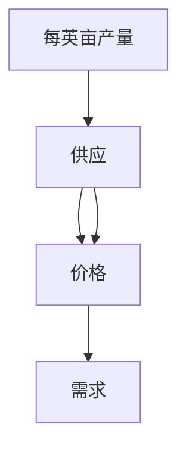

工具变量在现代计量经济学中迅速流行开来，而历史学家仍在争论究竟是谁发明了这种方法。毫无疑问，我认为是菲利普·赖特在他儿子提出的路径系数的基础上第一个发明了这种分析方法。在他之前，没有经济学家曾提出过因果系数和回归系数的区别，毕竟他们都身处卡尔·皮尔逊—亨利·尼尔斯阵营，认为因果关系只不过是相关关系的一种极限情况。此外，在休厄尔之前，也没有人曾提出这种方法，即根据路径系数计算回归系数，然后逆转这一过程，从回归系数中获得因果效应。这是休厄尔的独家发明。

一些经济史学家认为菲利普那篇论文的附录是休厄尔撰写的。但文体分析则表明，菲利普确实是附录的作者。对我来说，这些历史细节让这个故事变得更加美好。在这个故事中，菲利普克服了原有的学术偏见，付出努力去理解他儿子提出的理论，然后又用自己的语言将之表达了出来。

现在，让我们从 19 世纪 50 年代迈入 20 世纪 20 年代，看看当今现实中工具变量的一个应用实例。这样的例子还有很多，受篇幅所限，我在此只能选择其中一个展开讨论。

# 好胆固醇和坏胆固醇

你还记得你的家庭医生第一次和你谈论“好”胆固醇和“坏”胆固醇是什么时候的事吗？这件事很可能发生在 20 世纪 90 年代，当时，一种能降低血液中“坏”胆固醇（低密度脂蛋白，LDL）水平的药物首次面市。这类被称为“他汀类药物”的药品迅速变成了为制药公司带来巨额盈利的印钞机。

第一种进入临床试验阶段的降胆固醇药物是消胆胺（考来烯胺）。这项开始于 1973 年、结束于 1984 年的冠心病初步预防临床试验显示，由于服用了消胆胺药物，男性受试者的胆固醇水平平均下降了 12.6%，其心脏病发作的风险平均降低了 19%。

由于临床试验是一种随机对照试验，你可能认为我们不需要使用本章中的任何方法就能估计出其中的因果效应，因为这些方法是专门为在只有观察性数据可用的情况下，用观察结果替换随机对照试验数据设计的。但事实并非如此。这项试验和许多随机对照试验一样，存在着 **“未履行问题”**（problem of noncompliance），即受试者虽然随机地接受了药物安排，但实际上并没有服用被分配的药物。这一问题的存在将降低药物效果的表现水平，所以考虑到存在这些“未履行者”，我们仍然需要对结果进行统计调整。同以往一样，混杂再次登场了。如果未履行者在某些相关的方面有别于履行者（比如他们可能从一开始身体状况就更差），那么我们就无法预测如果他们遵从研究者的指示会如何。

针对这种情况，我们绘制出了如图 7.11 所示的因果图。如果病人被随机分配了药物，则变量 **“药物分配”**（Z）取数值 1；如果病人被随机分配了安慰剂，则该变量取数值 0。如果病人真的服用了该药物，则变量 **“药物服用”** 的数值取 1，反之取 0。最后，为方便起见，我们将 **“胆固醇水平”**（Y）设定为一个二元变量，即如果胆固醇水平降至某个临界值以下，则取值 1，反之则取值 0。


> 图 7.11 存在未履行问题的临床试验的因果图

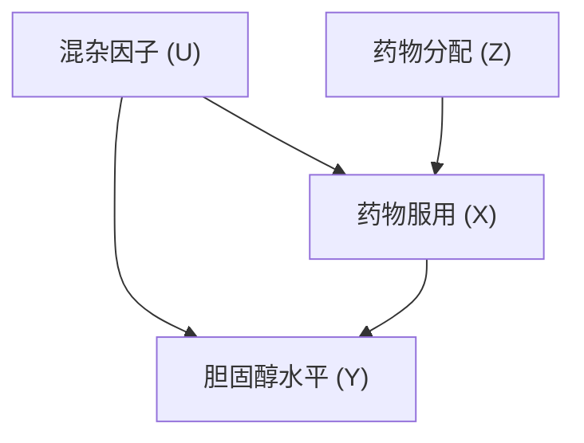

注意，在这个例子中，我们的变量都是二元变量，而不是数值变量。这显然意味着我们不能使用线性模型，因此我们在前面推导出的工具变量公式也不适用。不过，在这种情况下，我们通常可以用一种被称为 **“单调性”**（monotonicity）的弱相关来代替线性假设，下面我将对此进行具体解释。

但在这么做之前，我们必须先确保工具变量的其他必要假设都是有效的。

- **第一**，工具变量 Z 独立于混杂因子吗？Z 的随机化确保了这一问题的答案是肯定的。（正如我们在第四章看到的，随机化是确保变量不受任何混杂因子影响的好方法。）
- **第二**，从 Z 到 Y 有直接路径吗？常识告诉我们，接受一个特定的随机处理（Z）不可能直接影响人体的胆固醇水平（Y），所以这个问题的答案是“没有”。
- **第三**，Z 和 X 之间是否存在强关联？我们应该借助数据来回答这个问题，而数据显示，答案是肯定的。

记住，每次使用工具变量之前，我们都必须先回答出上述三个问题。在这个例子中，答案显而易见，但我们不应该因此就无视这一重要事实，即我们正在使用因果直觉来回答问题，而因果图捕捉、保存并阐明了这种直觉。

表 7.1 显示了 X 和 Y 的观测频率。例如，未被分配药物的病人中有 91.9% 的人为 X=0（没有服药）且 Y=0（胆固醇水平未降低至临界值）。这是一个很合理的结果。而该组中另外 8.1% 的人为 X=0（没有服药）且 Y=1（胆固醇水平降至临界值）。显然，他们体内的胆固醇水平下降是出于其他原因而非服用药物。同时还要注意表中有两个 0：没有人没被分配药物（Z=0）却服用了药物（X=1）。在运行良好的随机化研究中，这种情况一般而言是真实的，特别是在医学领域，通常医生都有其独有的渠道获得试验药物，这就限定了受试者只能从医生那里得到药物或治疗。而没有人符合 $\scriptstyle \cdot \mathbf { Z } = 0 \operatorname { E L X } = 1$ 这一假设就被称为 **单调性**。

现在让我们来看看如何估计治疗效果。

- **首先**，让我们来看最坏的情况：所有的未履行者即便遵从指令吃了药，其身体状况也不会得到改善。在这种情况下，我们需要的概率是那些的确遵从指令吃了药（Z=1，X=1）并且胆固醇水平的确有所下降（Y=1）的病人，这部分人占被分配药物组的 47.3%。但考虑到安慰剂效应，我们需要对这一估计结果进行调整。在被分配安慰剂并服用了安慰剂的人中，有 8.1% 的人其体内胆固醇水平有所下降。因此，在这种最坏的情况中，排除安慰剂效应的净药物效果就是 47.3% 减去 8.1%，为 **39.2%**。

**表 7.1 消胆胺临床试验的数据**

| 观测结果 | 未被分配药物（Z=0） | 被分配药物（Z=1） |
| :--- | ---: | ---: |
| X=0，Y=0 | 0.919 | 0.315 |
| X=1，Y=0 | 0.000 | 0.139 |
| X=0，Y=1 | 0.081 | 0.073 |
| X=1，Y=1 | 0.000 | 0.473 |

- **那么最好的情况又是怎样的呢？** 所谓最好的情况是指，所有的未履行者倘若遵从指令吃了药，则他们的身体状况都会得到改善。在这种情况下，我们需要在刚刚算出的基线水平 39.2% 上加上未履行者（Z=1，X=0）的 31.5% 和 7.3%，总计 **78.0%**，即为此种情况下的药物效果。

因此，即使在最坏的情况下，即混杂的作用与药物的作用方向完全相反，我们仍然可以说药物有效降低了 **39%** 的受试者的胆固醇水平。而在最好的情况下，混杂的作用与药物的作用方向一致，则我们就有 **78%** 的受试者状况会得到改善。尽管由于存在大量的未履行者，这一置信区间相当大，但研究者还是可以明确地得出结论，即药物是有效的，可以达到预期目标。

取最坏和最好情况的做法通常会让我们得到一个估计结果的取值范围。当然，就像我们在线性情况下做的那样，得到一个点估计肯定是更理想的。若有必要，我们也可以使用一些缩小取值范围的方法，在某些特定的情况下，我们甚至可以借此得到点估计。

例如，如果你只对履行者这个子总体（那些被分配了药物并确定服用了药物的人）感兴趣，那么我们就可以推导出一个被称为 **“局部平均处理效应”（Local Average Treatment Effect，简称为 LATE）** 的点估计。不管怎样，我希望用这个例子表明，离开线性模型的世界，我们也并非束手无策。

自 1984 年以来，工具变量这一方法一直在发展演变，其中一个特别的衍生版本格外流行，该衍生版本被称为 **“孟德尔随机化”**。

举个例子。虽然低密度脂蛋白或“坏”胆固醇的影响问题现在已得到解决，但关于高密度脂蛋白（HDL）或“好”胆固醇，我们对其产生的影响仍有相当大的不确定性。一些早期的观察性研究，如 20 世纪 70 年代末的费雷明汉心脏病研究表明，高密度脂蛋白能起到一定的保护作用，防止心脏病发作。但是高密度脂蛋白往往与低密度脂蛋白同时出现，对此我们应如何辨别哪一种脂蛋白才是真正起作用的因素呢？

为了回答这个问题，假设我们知道某个基因会使携带此基因的人天生有较高的高密度脂蛋白水平，而该基因对低密度脂蛋白的水平则没有影响。据此，我们就绘制出了如图 7.12 所示的因果图，图中我以 **“生活方式”** 代指可能的混杂因子。请记住，同斯诺的例子一样，引入一个随机化的工具变量总是有益的。因为一旦经过了随机化处理，就不会有因果箭头指向它了。因此，基因就是一个完美的工具变量。我们的基因在我们未出生之前就被随机化了，这就好像格雷戈·孟德尔本人从天而降，给一些人分配了高风险基因，给另外一些人分配了低风险基因。这就是 **“孟德尔随机化”** 这一术语的由来。


> 图 7.12 孟德尔随机化例子的因果图

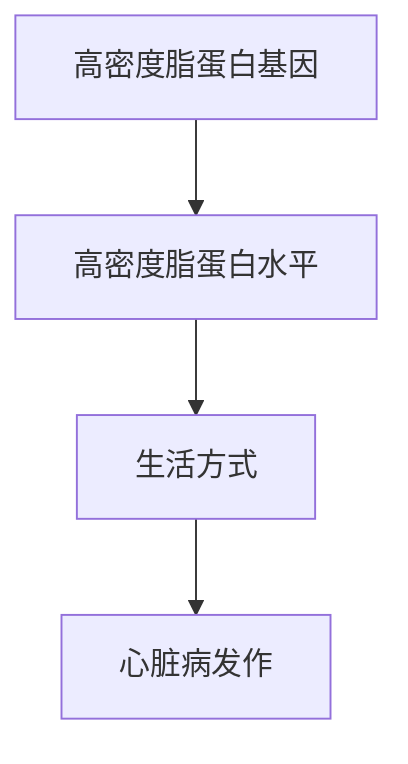

# 修正标点符号：统一中英文标点使用规范，修正明显的标点错误

## 优化空白字符：删除多余空格，规范段落间距，保持合理的换行

## 保持结构完整：不修改、不删除任何标题，保持原有的 Markdown 标题层级

## 保持内容语义：不增删任何实质内容，仅做排版层面的优化

---

那么，是否可能存在一个从高密度脂蛋白基因指向生活方式的箭头呢？为回答这个问题，我们需要做一些“鞋革工作”，并用因果关系的思维来分析这个问题。只有当人们知道自己是否携带了这种与高密度脂蛋白有关的基因时，这种基因才有可能影响人们的生活方式。但是直到 2008 年，这种基因还没有被发现，甚至到了今天，绝大部分普通人也无从获知此类信息。因此，这样的箭头很可能是不存在的。

至少有两项研究采用了孟德尔随机化的方法来解决这一好坏胆固醇的问题。2012 年，一项由麻省综合医院的研究者塞卡尔·凯瑟琳领导的大型合作研究显示，更高的高密度脂蛋白水平没有明显的益处。而与此同时，研究人员还发现低密度脂蛋白对心脏病发作的风险有很大的影响。根据他们收集到的数据，低密度脂蛋白水平每降低 34 mg/dl 将使心脏病发作的风险降低 50%。因此，一方面，降低“坏”胆固醇的水平，无论是通过饮食、运动还是通过服用他汀类药物，似乎的确是一个明智的主意。而另一方面，尽管一些鱼油推销员可能会试图说服你增加你体内的“好”胆固醇水平，但看起来这一做法不太可能真的降低你的心脏病发作风险。

和以往一样，此处也有一个需要我们引起警惕的结果。于同年发表的第二项研究指出，具有某种与低密度脂蛋白有关的基因的低风险变异体的人，其一生的胆固醇总量都会维持在一个相对较低的水平。孟德尔随机化已经告诉我们，在你的一生中，低密度脂蛋白水平每降低 34 mg/dl 将使你的心脏病发作风险下降 50%。而他汀类药物无法一劳永逸地让你的低密度脂蛋白水平降低，其作用只能从你开始服药的那一天算起。如果你已经 60 岁了，那么在服药之前，你的动脉可能已经遭受了 60 年的破坏。因此，在这种情况下，孟德尔随机化很可能会导致我们高估他汀类药物的实际效果。相反，如果你从年轻的时候就开始降低你的胆固醇，不管是通过饮食、运动还是通过服用他汀类药物，那么你的这一选择将会在日后为你带来很大的好处。

从因果分析的角度来看，这两项研究给我们上了很好的一课：在做任何干预研究之前，我们都需要问，我们实际操作的变量（低密度脂蛋白的终生水平）是否与我们认为自己正在操作的变量（低密度脂蛋白的当前水平）相同。这正是我们先前提到过的“对自然的巧妙询问”的一种体现。

总而言之，工具变量是一个重要的工具，它能帮助我们揭示 do 演算无法揭示的因果信息。do 演算强调的是点估计，而非不等式，因此不适用于如图 7.12 所示的情况，因为在那个例子中我们所能得到的都是不等式。而同样重要的是，相比工具变量，do 演算具有更大的灵活性。因为在 do 演算中，我们不需要对因果模型中函数的性质做任何假设。而如果我们的确有足够的科学依据证实类似单调性或线性这样的假设的话，那么像工具变量这种针对性更强的工具就更值得考虑。

工具变量方法的适用范围可以远远超越如图 7.9（或图 7.11、图 7.12）所示的那种简单的 4 变量模型，但若离开因果图的指导，它就不可能走得太远。例如，在某些情况下，在对一组经过巧妙选择的辅助变量进行变量控制之后，我们就可以引入某个并不完美的工具变量（比如不满足独立于混杂因子这个条件），因为控制这些辅助变量可以阻断工具变量和混杂因子之间的路径。卡洛斯·布里托充分发展了这一将非工具变量转化为工具变量的思想，他是我以前的学生，现在是巴西西亚拉联邦大学的教授。

此外，布里托还研究了许多不同的情况，在其中一些情况中，我们还可以将一组变量成功地转化为一个工具变量来使用。虽然关于工具变量集的识别问题超越了 do 演算的应用范畴，但我们仍然可以借助因果图来解决这个问题。对于已熟练掌握了因果图语言的研究者来说，合理可行的研究设计丰富多样，无须受困于如图 7.9、图 7.11 和图 7.12 所示的 4 变量模型的使用限制。事实上，能限制我们的只有我们自己的想象力。

> - [1] 偏回归系数（partial regression coefficient）$r_{YX·Z}$ 就是暂时固定 $Z$ 时，$Y$ 在 $X$ 上的回归系数。即在根据 $Z$ 对 $(X, Y, Z)$ 数据进行分层之后，再考虑 $Y$ 和 $X$ 之间的相关性。——译者注
> - [2] 古希腊神话中，忒修斯在克里特公主阿里阿德涅的帮助下，用一个线团破解了迷宫，从此，人们就用“阿里阿德涅之线”来比喻在困惑中得到的指点。——译者注
> - [3] 大卫·弗里德曼在其论文《统计模型和鞋革》（1991）中曾提到斯诺不辞劳苦走访千家万户，不知磨破多少鞋子才获得了这些数据。——译者注
> - [4] 1 英亩 ≈ 4046.86 平方米。——编者注