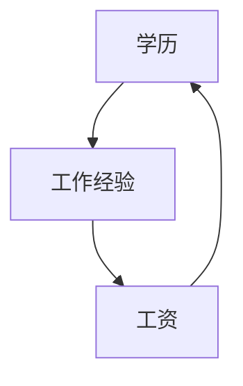
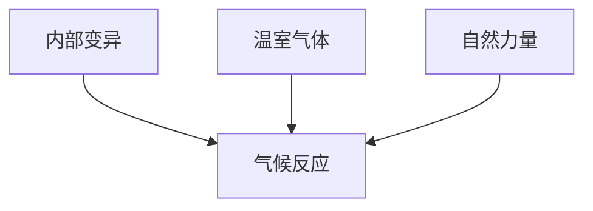

# 第八章 反事实：探索关于假如的世界

倘若克利奥帕特拉的鼻子再短几分，整个世界的面貌就会改变。

——布莱斯·帕斯卡（1669）


> “And sorry I could not travel both  
> And be one traveler, long I stood...”

罗伯特·弗罗斯特这首著名的诗反映了诗人对反事实的敏锐洞察力。我们不能两条道路都走，但是我们的大脑有能力判——在开始攀登因果关系之梯的顶层之前，让我们回顾一下从第二层级中学到的知识。

我们已经见识了几种方法，可以用于在各种情景设定和条件下确定干预的效果。在第四章，我们讨论了随机对照试验，它被广泛誉为医学临床试验的“黄金标准”。我们还看到了一些适用于观察性研究的方法，其中处理组和对照组的成员不是随机分配的。对此，如果我们可以采集到能够阻断所有后门路径的变量（集）的数据，我们就可以使用后门调整公式来估算出干预效果。如果能找到一个被混杂因子“屏蔽”的前门路径，我们就可以引入前门调整。如果我们愿意接受线性或单调性假设，那么我们就可以使用工具变量（假设该变量可以在因果图中找到，或研究者可以根据试验设计提出一个合适的变量）。此外，那些真正富有冒险精神的研究者还可以用 **do 演算** 或其衍生算法，绘制出一条通往干预之峰山巅的新路线。

在所有这些努力中，我们的目标都是找到研究中处理的某个总效应，或者在某些典型个体或子总体中的效应（平均因果效应）。但到目前为止，我们还不具备在特定事件或个体层面上谈论个性化的因果关系的能力。说“吸烟致癌”是一回事，而说“我的叔叔乔 30 年来每天抽一包烟，假如他不曾吸烟的话，那他现在可能还活着”就完全是另一回事了。两者的区别既明显又深刻：像乔叔叔那样在吸了 30 年烟之后去世的人，是不可能在另一个他不曾吸 30 年烟的世界中被观察到的。

**责任和过失，遗憾和信誉**——这些概念都可以被纳入因果思维之中。为了真正理解这些概念，我们需要在某些备择假设的前提下，将发生过的事情与“假如……则本可能”的事情进行比较。正如我们在第一章讨论的那样，人类具有设想那个不存在的世界的能力，正是这一能力将我们与类人猿祖先以及地球上的其他生物区分开来。其他生物能看到“是什么”，而我们的天赋是能看到“假如……则本可能是什么”，当然，这种天赋有时也可能是一个诅咒。

本章的主要内容是讨论如何使用观察数据和试验数据来提取有关反事实情景的信息。我将具体解释如何在因果图的语境中表示个体层面的因，这项任务将迫使我们对此前尚未讨论过的因果图的一些具体细节做出解释。我还会介绍一个密切相关的概念，叫作“潜在结果”（potential outcomes）或**奈曼—鲁宾因果模型**，这个概念最初是由波兰统计学家耶日·奈曼（后来成为伯克利大学的教授）在 20 世纪 20 年代提出的。但是，直到 20 世纪 70 年代中期，唐纳德·鲁宾发表了关于潜在结果的研究论文之后，这种因果分析方法才真正开始得到不断的推进和发展。

我们在前几章已经建立了因果关系的理论框架——休厄尔·赖特的路径图及其衍生产物**结构因果模型（SCMs）**。我将在本章展示反事实是如何自然而然地在这个框架中出现的。我们在第一章已经对此有了初步的了解。在行刑队执行枪决的例子中，我们展示了应该如何回答反事实的问题，如“假如枪手 A 没有开枪，那么犯人还会活着吗”这个问题。我将比较反事实在奈曼—鲁宾范式和结构因果模型中的定义，其中后者的提出公开地受益于因果图的独特优势。而多年来，鲁宾一直坚持认为因果图没有任何用处。因此，信奉鲁宾因果模型的研究者往往困扰于缺乏一个工具用以表示因果知识或推导出可验证的蕴涵，我们将考察他们是如何在一片黑暗中解决因果问题的。

最后，我们将研究两个案例，其中反事实推理必不可少。几十年来，甚至几个世纪以来，针对被告的罪责，律师们一直使用的是一种相对直接的证明方法，即所谓的“若非（but–for）因果关系”[1]：若非被告做出某种行为，伤害事件就不会发生。我们将讨论如何用反事实语言来阐释这个令人费解的概念，以及如何估计被告有罪的概率。

接下来，我将讨论反事实在气候变化中的应用。直到最近，气候学家仍然困扰于如何回答诸如“是不是全球变暖导致了这场风暴（或者这次持续高温天气、持续干旱）”这类特别棘手的问题。传统的答案是，个别的气象状况不能简单归因于全球性的气候变化。然而，这个答案似乎相当避实就虚，甚至很可能导致了公众对气候变化的漠不关心。

而反事实分析能帮助气候学家给出比以前更精确的表述。不过，它要求我们适当增加一些词汇量。此外，我们还需要区分 3 种不同的因果关系：必要因果关系、充分因果关系以及充要因果关系[2]（其中必要因果关系等同于“若非因果关系”）。使用这些术语，气候学家就可以说：“人为因素导致的全球气候变化是这次持续高温天气的必要因的概率为 90%”，或者“有 80% 的可能性，全球气候变化是这次 50 年一遇的持续高温天气的充分因”。第一句话与归因有关——是什么因素引起了这次异常高温？第二句话与策略有关，它表明我们最好对这种持续高温天气做好准备，因为它迟早会发生。相较于只是耸耸肩，对个别天气事件的起因不做任何说明的传统做法，这两种说法中的任何一个都包含更大的信息量。

## 从修昔底德和亚伯拉罕到休谟和刘易斯

考虑到反事实推理是我们之所以为人而区别于其他物种的心理机制的一部分，发现在人类历史早期就存在反事实表述这一事实也就不足为奇了。例如，古希腊史学家修昔底德，常被称为用“科学”方法研究历史的先驱，其在《伯罗奔尼撒战争史》中就描述了发生在公元前 426 年的一场海啸：

> 在地震频繁发生的同时，在埃维亚岛的奥罗比亚地区，海水从海岸线退去，又裹着巨大的浪冲了回来，淹没了城市的大部分地区，一些地区甚至在潮水退去之后仍淹没在水下；曾经的桑田变为沧海，而很多居民因来不及跑到高处而葬身海底……在我看来，这一现象的因必须从地震中寻找。在地震最猛烈的时候，大海被某种力量驱使着远离海岸，又以加倍的力量骤然冲回陆地，引发洪流。假如没有地震，那我无从理解这种灾难是如何发生的。

考虑到文章的写作年代，这段话实在了不起。首先，修昔底德敏锐的观察力就能让每位现代科学家感到与有荣焉，再考虑到他所处的时代没有卫星，没有摄像机，没有时刻在线的新闻机构播放海啸发生时的灾难画面，他的发现就更了不起了。其次，他写这段话的历史背景是，当时的自然灾害通常被归于神的旨意。他的前辈荷马或其同代人希罗多德无疑会将这一事件归因于海神波塞冬或其他神的愤怒。然而，修昔底德提出了一个不涉及任何超自然力量的因果模型：地震引退了海水，又让海水反冲并淹没了陆地。这段话的最后一句特别有趣，因为它体现了必要因果关系或“若非因果关系”的概念：假如没有地震，海啸是不可能发生的。这种反事实判断将地震从仅仅是海啸的一个前情升级为一个真正的因。

另一个关于反事实推理的令人着迷且颇具启发意义的例子出现在《创世记》中。在这个故事中，上帝想要摧毁所多玛和蛾摩拉两座城市，以惩罚那里的人的罪恶，亚伯拉罕为此询问了上帝一些问题：

> 亚伯拉罕走上前来，说：“无论善恶，您都要剿灭吗？假若那城里有 50 个义人，您还要剿灭那地方，而不为城里那 50 个义人饶恕那地方吗？”上帝说：“我若在所多玛城里见有 50 个义人，我就为他们的缘故饶恕那地方的众人。”

但故事并没有结束。亚伯拉罕对上帝的回答并不满意，于是继续问上帝，假如只有 45 个义人呢？或者只有 40 个？30 个？20 个？甚至 10 个呢？每次，他从上帝那里得到的答案都是同意饶恕那些人。上帝最终向他保证，假如真的能找到 10 个义人，他依然会宽恕所多玛城。

亚伯拉罕试图用这种讨价还价来实现什么目的？他当然不会怀疑上帝的计数能力。亚伯拉罕知道上帝清楚所多玛有多少义人，毕竟上帝是无所不知的。

我们知道亚伯拉罕是上帝最虔诚的信徒，愿意为上帝献身，因此我们很难相信他提出这些问题是为了说服上帝改变想法。相反，这些问题更多地体现了亚伯拉罕自己的理解。他正在像一名现代科学家那样进行推理，试图去理解掌管集体惩罚的律例。罪恶达到怎样的程度对于实施集体惩罚而言才是充分的？找到 30 个义人是否足以拯救一座城市？20 个呢？如果没有这些信息，我们就无法构建出一个完整的因果模型。现代科学家一般称此类模型为剂量—响应曲线或“阈值效应”（threshold effect）。

当修昔底德和亚伯拉罕通过个别案例探讨反事实时，古希腊哲学家亚里士多德则研究了因果关系更具普遍性的层面。亚里士多德用其典型的系统性的语言，建构了一个完整的因果关系分类，其中包括“质料因”“形式因”“动力因”“目的因”。例如，雕像形状的质料因是铸成它的青铜及其性质，我们无法用橡皮泥做出同样的雕像。然而，亚里士多德并没有提及反事实的因果关系，所以尽管他的分类十分巧妙，但这种分类仍然不具备修昔底德描述海啸起因的语言所具有的那种简洁明确的特性。

要找到一个将反事实置于因果关系核心的哲学家，我们需要追溯至苏格兰哲学家**大卫·休谟**的主张（他与托马斯·贝叶斯是同时代的人）。休谟拒绝了亚里士多德的分类方案，坚持对因果关系的单一定义。但他发现这个定义相当模糊，事实上是在两个不同的定义之间来回摇摆。后来，这两个定义演变为两种互不相容的思想，而讽刺的是，两派思想家都把休谟看成他们的开山鼻祖！

在《人性论》（见图 8.1）中，休谟否认了任何两个对象具有使一个为因，另一个为果的内在特质或“能力”的可能性。在他看来，因果关系完全是人类自身记忆和经验的产物。

> “因此我们记得曾见过我们称之为‘火焰’的事物，记得曾感受过我们称之为‘热’的事物。”
>
> 他写道：“我们还会回想起在过去所有的经历中它们的恒常联结。就这样，我们称一个为因，另一个为果，并从一个的存在推断出另一个的存在。”

这个定义现在也被称为因果关系的“规律性”（regularity）定义。

LONDON: Printed for **JoN NooNat** the Wite-Hart near Mercer's-Cbapel, in heapfide MDCC XXXIX. 156 A Treatise of Human Nature.

---

PART.

Have fubftituted any other idea in its room. Of knowledge and probability.

It is therefore by **EXPERIENCE only**, that we can infer the existence of one object from that of another. The nature of experience is this: We remember to have had frequent instances of the existence of one species of objects, and also remember that the individuals of another species of objects have always attended them, and have existed in a regular order of contiguity and succession with regard to them. Thus we remember to have seen that species of object we call *flame*, and to have felt that species of sensation we call *heat*. We likewise call to mind their constant conjunction in all past instances. Without any farther ceremony, we call the one **cause** and the other **effect**, and infer the existence of the one from that of the other.

In all those instances, from which we learn the conjunction of particular causes and effects, both the causes and effects have been perceived by the senses, and are remembered: But in all cases, wherein we reason concerning them, there is only one perceived or remembered, and the other is supplied in conformity to our past experience. Thus in advancing we have insensibly discovered new relation between cause and effect.

> **图 8.1** 休谟有关因果的“规律性”定义（于 1739 年提出），图中所示的论文以“人性论：把推理的实验性方法应用于道德主体的一次尝试”为标题，插图中截取的文章段落出自第三节：“论知识和或然性”。

这段话透露出一种惊人的肆无忌惮的态度。休谟切断了因果关系之梯第一层级与第二层级和第三层级的联系，认为第一层级的关联就是我们需要的全部。一旦我们观察到火焰和热同时出现过足够多的次数（并注意到在时间顺序上，火焰出现在前），我们就认为火焰是热的因。1739 年，同大多数 20 世纪的统计学家一样，休谟似乎也倾向于将因果关系仅仅视为一种相关关系。

不过，说句公道话，休谟对这个定义并不满意。9 年后，在《人类理解研究》（*An Enquiry Concerning Human Understanding*）中，他发表了一个截然不同的观点：

> “我们可以给一个因下定义说，它是先行于、接近于另一个对象的一个对象，而且在这里，凡与前一个对象类似的一切对象都和与后一个对象类似的那些对象处在类似的先行关系和接近关系中。或者，换言之，假如没有前一个对象，那么后一个对象就不可能存在。”

这段话的第一句——观察到 A 总是伴随着 B 一起出现——只是重复了他此前的规律性定义。但到了 1748 年，休谟似乎产生了一些疑虑，发现有必要对这个定义做一些修改。作为一名自封的辉格史学家，我可以理解他这么做的原因所在。因为根据他之前的定义，鸡鸣就成了日出的因。为了修补这一缺陷，他补充了第二个定义。这个定义的提出在他早期的著作中没有任何暗示，这是一个**反事实定义**：“假如没有前一个对象，那么后一个对象就不可能存在。”

请注意，第二个定义正是修昔底德讨论奥罗比亚的海啸时所使用的定义。反事实定义也解释了为什么我们不会认为鸡鸣是日出的因。因为我们知道，如果公鸡某天生病了，或任性地拒绝打鸣，太阳仍会照常升起。

虽然休谟想通过“换句话说”这个无伤大雅的插入语将这两个定义合二为一，但第二个定义明显不同于第一个。第二个定义明确地使用了反事实语言，因此它位于因果关系之梯的第三层级。比较而言，规律性是可以观察到的，而反事实只能凭想象生成。

休谟为什么选择从反事实而非其他的角度来定义原因，这一点值得我们思考。定义的目的是对一个复杂的概念进行简化。休谟猜测，相比于“前一个对象引起后一个对象”这一定义，他的读者能够更清晰地理解“假如没有前一个对象，那么后一个对象就不可能存在”这句话。他说的很对。前一句表述引发了种种徒劳的形而上学的猜想，即究竟是第一个事物的什么内在特质或能力引发了第二个事物。而后一种表述只是要求我们做一个简单的思维练习：想象一个没有发生地震的世界，判断在这个世界中海啸是否会发生。从孩童时代起，我们就一直在做这样的判断，人类这一族群至少从修昔底德那个年代（或者更久以前）就开始做这样的判断了。

然而，在 19 世纪和 20 世纪的大部分时间里，哲学家忽略了休谟的第二个定义。反事实表述——“假如”（would haves）在研究者眼中总是显得过于软弱和不确定。因此，如第一章所述，哲学家开始尝试使用概率因果论来补救休谟的第一个定义。

1973 年，离经叛道的哲学家大卫·刘易斯在他的书《反事实》（*Counterfactuals*）中呼吁学界放弃规律性定义，而应该将“A 导致 B”解释为“假如没有 A，则 B 就不会发生”。刘易斯问道：“为什么我们不从表面意义上看待反事实，将其看作对实际情况的其他可能性的一种表述呢？”

和休谟一样，刘易斯显然也折服于这一事实：人类能够轻而易举、快速便捷和始终如一地做出反事实判断。我们可以自信地赋予反事实陈述一个真值和概率，就像我们对事实陈述所做的那样。在刘易斯看来，我们是通过想象一个或多个“假如世界”来实现这一点的，在这些假如世界中，反事实陈述为真。

当我们说，“假如乔服用过阿司匹林，他的头痛本来应该好了”时，根据刘易斯的说法，我们就是在说在某个不同于现实世界的假如世界中，乔确实服用了阿司匹林，而他的头也的确不再痛了。刘易斯认为，我们是通过比较我们的世界（乔没有服用阿司匹林）和在其他方面与现实世界**最相似**的那个假如世界（乔服用了阿司匹林）来评估反事实陈述的。基于在那个世界里，乔不再头痛了，我们便声明这一反事实陈述是真的。

其中，“**最相似的那个**”是关键。或许在其他一些“可能的世界”里，他的头痛没有消失，而是出现了一个临时的、偶然的情况，例如他服用了阿司匹林，但之后他撞到了浴室的门。而在乔服用阿司匹林的所有可能的世界中，与现实世界最为相似的不是他撞到头的那个，而是他的头痛消失的那个。

刘易斯认为可能的世界就相当于真实存在的世界，对此，诸多批评者纷纷抨击其言论过于大胆。“刘易斯先生的观点是，任何逻辑上可能的世界都可被认为是实际存在的。因此他曾被称为‘疯狗一般的模态实在论者’。”2001 年，《纽约时报》在他的讣告中写道，“例如，他本人就相信，存在这样一个世界，其中驴会说人话。”

但我认为他的批评者（或许还包括刘易斯本人）都忽略了最重要的一点：我们根本不需要争论这样的世界是否以物理或者形而上学的实体形式存在。如果我们的目的是解释人们所说的“A 导致 B”的含义，那么我们只需要假设人们有能力在头脑中想象出可能的世界，并能判断出哪个世界“更接近”我们的真实世界即可；最重要的是我们的想象和判断要前后一致，这有助于我们在群体中达成共识。如果某人所认为的“更接近”的世界是另一个人认为的“更遥远”的世界，那么这两个人就肯定无法进行有效的反事实交流。从这一点上来看，刘易斯呼吁“为什么不从表面意义上看待反事实”并不是为了提出某种形而上学，而是为了引起人们对这一人类心理结构的惊人一致性的关注。

再一次，作为一名自封的辉格史学家，我可以很好地解释这种一致性：它源于这样一个事实，即我们体验的是同一个世界，并且共享因果结构的心理模型。在第一章我们一直在讨论这方面的内容。共同的心理模型将我们团结在一起。因此，我们对于可能世界与现实世界相近程度的判断，并没有借助于“相似性”的某个形而上学的观念，而是借助于这样一个标准，即我们必须在多大程度上对我们共享的心理模型进行拆解和打乱，才能使其满足一个与事实（乔没有服用阿司匹林）相反的给定的假设条件。

在结构因果模型中，我们所做的工作与此非常类似，只不过包含更多的数学细节。我们通过删除因果图中的箭头或结构模型中的方程来评估像“假如 *X* 曾是 *x*”这样的表示，这与我们处理干预 do（*X* = *x*）的方式是一样的。我们可以将这种方法描述为：对因果图进行尽可能小的修改，以满足 *X* 等于 *x*。在这方面，结构模型中的反事实定义符合刘易斯“与现实世界最相似的那个可能世界”的观点。

结构因果模型还解决了刘易斯避而不谈的一个难题：如果可能性的数量远远超出人脑的处理能力，那么人类如何在头脑中表示“可能的世界”，并找到与现实世界最接近的那个？计算机科学家称此问题为“表示问题”（representation problem）。人类必然掌握着一种非常经济的代码才能管理如此多的可能世界。对此，结构因果模型是否能够以某种形态或形式来充当这一实用的便捷工具呢？我认为很有可能，原因有两个。

第一，结构因果模型本身就是一个可行的捷径，在这个意义上它还没有找到任何竞争对手。第二，它是一种基于贝叶斯网络的模型，而贝叶斯网络又建立在大卫·鲁梅哈特对大脑传递信息方式的模拟之上。可以毫不夸张地说，4 万年前，人类将其大脑中内置的模式识别机制进行了整合，并开始用整合后的机制进行因果推理，现代人类就由此产生了。

哲学家总是倾向于让心理学家来解释大脑是如何工作的，这也是上述问题直到最近才得到解决的原因。然而，人工智能领域的研究者没有耐心等待心理学家的结论。他们的目的是尽快制造出这样的机器人：它们能够与人交流各种不同的情景，乃至信誉和责备、责任和遗憾。对于这些反事实概念，研究者必须先将它们进行编码，实现处理过程的自动化，如此才有那么一丝机会实现所谓的“强人工智能”——类人智能。

在这些动机的驱使下，我和我的学生亚历克斯·巴克一起在 1994 年开始了反事实的研究。不出所料，在人工智能和认知科学领域，反事实的算法化所引起的震动比在哲学领域更大。哲学家倾向于把结构因果模型仅仅看作刘易斯的“可能的世界”逻辑的诸多实践方案之一。但我敢说，结构因果模型的内涵远不止于此。缺乏表示法的逻辑就是形而上学。而因果图，其包含简单的箭头跟踪和箭头删除方面的规则，肯定与人类大脑表示反事实的方式相似得多。

目前，这一论断尚未被证实，但我可以提前告诉你故事的结果——反事实不再神秘，我们了解了人类是如何处理它们的，也准备好了为机器人配备类似的功能，而这种能力我们的祖先在 4 万年前就已经进化出来了。

## 潜在结果、结构方程和反事实的算法化

在刘易斯的著作出版的一年之后，唐纳德·鲁宾（见图 8.2）开始独立撰写一系列论文，将潜在结果作为一种回答因果问题的语言加以介绍。那时，鲁宾还是教育考试服务中心的一位统计学家，他单枪匹马地打破了 75 年来统计学界对因果关系问题避而不谈的局面。在许多健康学专家的心中，反事实概念就此实现了合法化。可以说，这一理论成果的重要性怎么强调都不过分。它为研究人员提供了一种高度灵活的语言，使其可以在总体和个体层面上表述出几乎所有他们想问的因果问题。


> **图 8.2** 2014 年，唐纳德·鲁宾（右）与本书第一作者（资料来源：照片由格雷斯·铉·金提供）

> Black-and-white photo of two smiling men seated together, one holding a bouquet (no visible text or symbols)

在鲁宾的因果模型中，变量 $Y$ 的一个潜在结果就是“假如 $X$ 的值为 $x$，那么 $Y$ 在个体 $u$ 上的取值”。语言描述比较啰唆，为方便起见，我们将这个量简写为 $\mathrm{Y}_{\mathrm{X = x}}(u)$。如果从上下文中我们可以很明显地看出哪个变量被赋值为 $x$，则我们通常会将这个表达式进一步缩写为 $\mathrm{Y}_{\mathrm{X}}(u)$。

为了体会这种表示方法的大胆创新，你需要先退后一步，暂时放下符号，思考一下它们所体现的假设。通过写下符号 $\mathbf{Y}_{\mathbf{X}}$，鲁宾想要表明的是，假如 $X$ 的值为 $x$，那么变量 $Y$ 一定会取某个与之相对应的值，其客观存在性与 $Y$ 在现实中实际取的值相当。如果你不认可这个假设（我很确定海森堡就不认可这个假设），你就不能使用这一潜在结果。另外还需要注意，潜在结果，或反事实，是在个体层面而非总体层面上定义的。

潜在结果作为科学概念的首次亮相出自耶日·奈曼的硕士论文（写于 1923 年）。奈曼是波兰贵族的后裔，幼时被流放到俄国并在那里长大，直到 1921 年他 27 岁时才回到故乡。他在俄罗斯接受了很好的数学教育，并希望回到波兰继续纯数学方面的研究，但对他来说，做统计研究更容易找到工作。和英国的费舍尔一样，他的第一项统计学研究是在一所农业研究所进行的，他的能力远远超过了这份工作的要求。他不仅是研究所唯一的统计员，而且是这个国家唯一把统计学当作一门学科进行专门研究的人。

奈曼在一个农业试验的背景下第一次提出了潜在结果这个概念，其下标记号代表“各个地块上（给定种子）的第 $i$ 个品种的未知潜在产量”。直到 1990 年，这篇论文才被翻译成英语并为世人所知。不过，奈曼本人并非如这篇论文一样默默无闻。他曾在伦敦大学学院卡尔·皮尔逊的统计实验室里待了一年，在那里他和皮尔逊的儿子埃贡成了朋友。两人在接下来的 7 年里一直保持联系，他们的合作研究取得了巨大的成功：**奈曼—皮尔逊统计假设检验法**的发明成为统计学领域的一个里程碑，是每一个统计学初学者都要学习的内容。

1933 年，卡尔·皮尔逊在统计学界多年的专制领导随着他的退休结束了。若非因为当时英国最著名的统计学家费舍尔提出了奇异值问题，埃贡本该顺理成章地成为皮尔逊的继承人。当时，伦敦大学学院不知出于何种原因提出了一个堪称灾难的解决方案，将皮尔逊的职位分割为统计学教授（由埃贡·皮尔逊担任）和优生学教授（由费舍尔担任）。埃贡在上任后立即聘用了他的波兰朋友。奈曼于 1934 年抵达伦敦，几乎是一到学校就与费舍尔发生了争执。

费舍尔早就准备好打这一仗了。他知道他是世界上首屈一指的统计学家，这一学科当时的主要研究方法和课题几乎都是他提出来的，然而学院却没有让他教授统计学课程。两人的关系格外紧张。“大家小心翼翼地共用着公共休息室，”康斯坦丝·瑞德在她为奈曼写的传记中写道，“埃贡小组的下午茶时间是下午 4 点；当他们全部离开后，费舍尔和他的团队才会进入休息室，在 4 点 30 分开始享受他们的下午茶时间。”

1935 年，奈曼在皇家统计学会上发表了题为“农业试验中的统计问题”的演讲，他对费舍尔的一些方法提出了质疑，顺带着讨论了潜在结果这个概念。奈曼的演讲结束后，费舍尔立即站起身来对学会的成员说：“希望奈曼博士先搞清楚自己研究的问题再来发表长篇大论。”

“（奈曼）认定费舍尔是错误的，”多年后，奥斯卡·肯普索恩曾谈起这一事件，“这是一个不可原谅的冒犯——费舍尔从来没有错过，事实上，连暗示他可能出了错也会被他视为严重的攻击。任何不将费舍尔的著作视作真理或圣旨的人，都会被认为要么愚蠢，要么邪恶。”

那次演讲的几天后，奈曼和皮尔逊就见识到了费舍尔有多愤怒。当晚他们去系里时，奈曼发现他在演讲中展示的木制模型被彻底毁了，零件散落得满地都是。他们两人一致推测，只有费舍尔才可能做出这样的事。

虽然现在看来费舍尔的愤怒表现得有些可笑，但在当时，他的傲慢的确带来了严重的后果。他当然咽不下那口气，使用奈曼的潜在结果记号，即使这有助于他解决他后来遇到的中介问题。而缺乏关于潜在结果的词汇，导致了他和后来的许多人纷纷陷入所谓的“中介谬误”（Mediation Fallacy），我们将在第九章对此加以详细讨论。

此刻，有些读者可能依然认为反事实的概念很神秘，因此接下来，我将介绍鲁宾的追随者是如何推断出潜在结果的，并将拿这个无模型方法与结构因果模型方法进行对比。

假设我们正在考察一家公司，想要看一下决定员工工资的因素中，更重要的那个是学历还是工作经验。我们收集了该公司员工目前的工资数据，见表 8.1。我们用 $EX$ 表示工作经验，$ED$ 表示学历，$S$ 表示工资。为简单起见，我们假设只有 3 种学历水平：$0$ = 高中学历，$1$ = 大学学历，$2$ = 研究生学历。因此，如果员工 $u$ 是高中毕业生，但不是大学毕业生，则 $\mathrm{SED}=0(u)$，或者 $\ddot{S}_0(\mathbf{u})$ 就表示该员工 $u$ 的工资。如果员工 $u$ 是大学毕业生，则其工资就是 $s_1(\mathfrak{u})$。我们可能会想问的一个典型的反事实问题是：假如爱丽丝有大学学位，那她的工资应该是多少？换句话说，$\mathsf{S}_1$（爱丽丝）是多少？

关于表 8.1，首先要注意的是所有由问号表示的缺失数据。对于同一个体，我们能观察到的潜在结果永远不会超过一个。这件事虽然显而易见，但仍然非常重要。统计学家保罗·霍兰德曾经称之为“因果推断的基本问题”，这一名称现在已深入人心。如果我们真的能在问号处填写内容，那我们就可以回答所有的因果问题了。

**表 8.1 潜在结果示例的虚拟数据**

| 雇员（$u$） | $EX(u)$（单位：年） | $ED(u)$ | $S_0(u)$（单位：美元） | $S_1(u)$（单位：美元） | $S_2(u)$（单位：美元） |
| --- | --- | --- | --- | --- | --- |
| 爱丽丝 | 6 | 0 | 81 000 | ? | ? |
| 伯特 | 9 | 1 | ? | 92 500 | ? |
| 卡罗琳 | 9 | 2 | ? | ? | 97 000 |
| 戴维 | 8 | 1 | ? | 91 000 | ? |
| 厄内斯特 | 12 | 1 | ? | 100 000 | ? |
| 弗朗西斯 | 13 | 0 | 97 000 | ? | ? |
| 等等 | ... | ... | ... | ... | ... |

但我本人从来不认同霍兰德将表 8.1 中的缺失值描述为一个“基本问题”的说法。也许是因为我很少使用表格描述因果问题吧，但更根本的原因是，将因果推断问题看作一个数据缺失问题，可能会造成非常严重的误导，这一点我们很快就会看到。请注意，除了最后三列的标题外，表 8.1 完全不涉及任何关于 $ED$、$EX$ 和 $S$ 的因果信息，例如是学历影响工资还是工资影响学历。更糟的是，即便我们已经掌握了一些关于这些变量的因果信息，这张表格仍然不允许我们把它们表示出来。但是对于那些认为缺失数据就是“基本问题”的统计学家来说，这张表格似乎包含着无穷的可能性。的确，如果我们不把 $s_0$、$\mathsf{S}_1$ 和 $\vert S_2 \rangle$ 看作潜在结果，而看作普通变量，我们就能借助许多插值方法把空格填满，或者，就如统计学家所说的，我们完全可以采用某种最优的方式“推定出缺失数据”。

一种常见的推定方法是**匹配**。我们需要寻找几对个体，除了目标变量，这些个体在所有其他变量上都能匹配得很好。然后我们就可以根据这种匹配关系填写数据空缺的格子了。一个最明显的配对是伯特和卡罗琳，他们在工作经验上完全匹配。因此我们认定，假如伯特有研究生学位，则他的工资就会与卡罗琳的相同（97 000 美元）；假如卡罗琳只有本科学位，则她的工资就会与伯特的相同（92 500 美元）。请注意，这种匹配法与控制变量（或数据分层）有着相同的思路：挑选共享某一观察特征的比较组，通过比较来推断它们看起来不共享的特征。

但是，我们很难用这种方式估计爱丽丝的工资，因为在我所提供的数据中，我们找不到能与其完美匹配的对象。不过这也没有难倒统计学家，统计学家已经开发出了一些相当巧妙的方法用以根据近似匹配推断缺失数据，鲁宾一直是开发此类方法的先驱。遗憾的是，即使是世界上最具天赋的匹配者也不能将数据转化为潜在结果，连近似转化也不可能。我将在后文说明，真正正确的答案取决于是学历影响工作经验，还是反过来，工作经验影响学历，而这些信息在表格中是找不到的。

第二种可能的推断方法是**线性回归**（此处不可将其与结构方程混为一谈）。在使用这种方法时，我们需要假设数据来自一些未知的随机源，然后使用标准统计方法来查找数据的最佳拟合直线（在本例中为平面）。这种方法的输出结果如以下方程所示：

$$
S = 65\,000 \text{ 美元} + 2\,500 \text{ 美元} \times EX + 5\,000 \text{ 美元} \times ED \tag{8.1}
$$

方程 8.1 告诉我们，平均而言，没有工作经验且只有高中文凭的员工的基本工资是 65 000 美元。每增加一年工作经验，工资会增加 2 500 美元，而学历每升一级（最多可提升 2 级），工资会增加 5 000 美元。因此，一个回归分析专家会说，假如爱丽丝有大学文凭，则我们对她的工资估计就是 $65\,000 \text{ 美元} + 2\,500 \text{ 美元} \times 6 + 5\,000 \text{ 美元} \times 1 = 85\,000 \text{ 美元}$。

# 格式化优化后的 Markdown 内容

这种填补技术的简便和精确[3]解释了将因果推断看作一个缺失数据问题这一观点广受欢迎的原因。可惜的是，尽管这些插值方法看似无伤大雅，但它们本质上是有缺陷的。它们是数据驱动的，而不是模型驱动的。所有的缺失数据都是通过检查表格中的其他值来填充的。而正如我们从因果关系之梯中学到的，没有哪种纯粹基于数据的方法（第一层级）可以回答反事实的问题（第三层级）。

在将这些方法与结构因果模型方法进行对比之前，让我们先直观地审视一下模型盲数据填补法的错误所在。具体而言，让我们来解释一下为什么在工作经验上完全匹配的伯特和卡罗琳，其潜在结果实际上可能完全不具可比性。而一个更出人意料的结论是，一个合理的（与表 8.1 相符的）因果叙述说明，为推测卡罗琳的工资，她的最佳匹配对象应该是一个在工作经验上与她并不匹配的人。

在此例中，我们要认识的第一个关键点是，**工作经验很可能取决于学历**。毕竟，那些拥有更高学历的员工花了更长的时间去接受教育，如此一来在年龄相同的情况下，他们的工作年数就会相应缩短。因此，假如卡罗琳只有大学学历（和伯特一样），则她就可以利用多出来的这部分时间换取比现在更多的工作经验。这就让她在和伯特有着相同程度的学历的前提下，比伯特拥有更多的工作经验。因此，我们可以得出这样的结论：

$$
\mathsf{S}_1（\text{卡罗琳}） > \mathsf{S}_1（\text{伯特}）
$$

这与此前我们根据简单粗暴的匹配所预测的结果截然不同。我们可以看到，一旦我们有了一个合理的因果叙述，即学历影响工作经验，那么对工作经验的“匹配”将不可避免地造成潜在工资的不匹配。

具有讽刺意味的是，**同样的工作经验，原先是促成匹配的要素，现在却变成了导致不匹配的警示信号**。当然，表 8.1 将继续对这一警示保持沉默。鉴于此，我也无法认同霍兰德将因果推断阐述为数据缺失问题的观点。事实与这一观点正好相反。我以前的一名学生，卡西卡·莫汉近期的一项研究显示，即使是标准的数据缺失问题也需要借助因果建模来解决。

现在让我们看看结构因果模型是如何分析相同的数据的。首先，在查看数据之前，我们要绘制一张因果图（见图 8.3）。我们的因果图会对数据背后的因果叙述进行编码，根据这张因果图，工作经验“听从于”学历，并且工资“听从于”工作经验和学历两者。事实上，仅仅通过查看因果图，我们就能发现一些非常重要的事实。如果我们的模型是错误的，比如 EX 其实是 ED 的一个因而不是反过来，那么工作经验就会变成一个混杂因子，此种情况下将具有类似工作经验的员工进行匹配就是完全恰当的。而如果 ED 就是 EX 的因，如图 8.3 所示，那么工作经验就是一个中介物。通过本书前文的介绍，你现在一定已经了解到，**将中介物误认作混杂因子是因果推断中最致命的错误之一**，很可能导致极为荒谬的错误结果。混淆因子要求统计调整，而中介物禁止统计调整。


> 图 8.3 学历（ED）和工作经验（EX）对工资（S）的影响的因果图



到目前为止，我已在本书中多次使用了一个非常通俗的词——“听从于”，用来表达因果图中的箭头。但现在是时候为这个概念添加一些数学内容了，这实际上就是结构因果模型与贝叶斯网络或回归模型的不同之处。当我说“工资”听从于“学历”和“工作经验”时，我的意思是，**工资是这些变量的一个数学函数**：

$$
\mathsf{S} = \mathsf{f}_{\mathsf{S}}（\text{EX}, \text{ED}）
$$

但是考虑到个体差异，我们需要将这个函数扩展为：

$$
\mathsf{S} = \mathsf{f}_{\mathsf{S}}（\text{EX}, \text{ED}, \text{U}_{\mathsf{S}}）
$$

其中 $\text{U}_{\mathsf{S}}$ 代表“影响工资的其他未观测到的变量”。我们知道这些变量是存在的（比如爱丽丝可能是公司总裁的朋友），但它们类型太多，数量也太多，无法被逐一界定并纳入我们的模型。

在学历/工作经验/工资的例子中，假设我们所讨论的函数自始至终都是线性函数，让我们看看这一函数是怎样发挥作用的。我们可以使用统计方法来找到最佳拟合线性方程，该方程类似于方程 8.1，但又存在一点区别：

$$
\mathrm{S} = 65000 \text{ 美元} + 2500 \text{ 美元} \times \mathrm{EX} + 5000 \text{ 美元} \times \mathrm{ED} + \mathrm{U}_{\mathrm{S}} \tag{8.2}
$$

方程 8.1 和 8.2 之间的形式相似性具有极大的欺骗性，实际上，对二者的解释存在天壤之别。我们在方程 8.1 中选择了求解 S 在 ED 和 EX 上的回归，绝不意味着在现实世界里 S 听从于 ED 和 EX。这一选择纯粹是我们自己做出的，我们完全可以做出其他的选择，因为这张数据表格中没有任何规则能阻止我们转而求解 EX 在 ED 和 S 上的回归，或者其他形式的回归。（别忘了第二章弗朗西斯·高尔顿的发现——回归是无视因的。）而一旦我们宣布一个方程是“结构的”，我们就失去了这种选择的自由。换言之，**方程 8.2 的创建者必须承诺他所写出的方程真实反映了他所认定的关于现实世界中谁听从于谁的观点**。在我们的例子中，作为方程的创建者，我确实相信 S 听从于 EX 和 ED。更重要的是，模型中不存在方程 $\text{ED} = \text{f}_{\text{ED}}（\text{EX}, \text{S}, \text{U}_{\text{ED}}）$ 这一事实意味着我们认为 ED 对 EX 或 S 的变化不敏感。这种承诺或信念上的差异[4]赋予了结构方程支持反事实假设的力量和否定回归方程的力量。

按照图 8.3，我们还必须有一个关于 EX 的结构方程，但现在我们需要先将 S 的系数设为零，以反映从 S 到 EX 没有箭头这一图示信息。一旦我们从数据中估算出了具体系数，这个方程可能就如下所示：

$$
EX = 10 - 4 \times ED + U_{EX} \tag{8.3}
$$

这个方程告诉我们，只有高中学历的员工的平均工作经验是 10 年，每增加一级学历（最多增加 2 级）将平均减少此人 4 年的工作经验。同样，请注意此结构方程和回归方程之间的关键区别：变量 S 不进入方程 8.3（尽管在实际情况中 S 和 EX 可能存在高度相关）。这同样反映了分析者的信念，即认为任何个体所获得的工作经验完全不受其当前工资水平的影响。

现在让我们演示一下如何从结构模型中推导反事实。假如爱丽丝有大学学历，为了估计她的工资水平，我们需要执行以下 3 个步骤：

1. **（外展）** 利用关于爱丽丝和其他员工的数据来估计爱丽丝的特质因子（idiosyncratic factors）：$U_S$（爱丽丝）和 $U_{EX}$（爱丽丝）。

2. **（干预）** 利用 do 算子改变模型，以反映我们提出的反事实假设，在这个案例中即，假如爱丽丝有大学学位：$ED$（爱丽丝）$= 1$。

3. **（预测）** 利用修改后的模型及有关外生变量（exogenous variables）的更新信息 $U_S$（爱丽丝）、$U_{EX}$（爱丽丝）和 $ED$（爱丽丝）来估算爱丽丝的工资水平。新的工资水平就等于 $S_{ED=1}$（爱丽丝）。

对于步骤 1，我们可以从数据中观察到 $\vert E_X \vert$（爱丽丝）$= 6$，$ED$（爱丽丝）$= 0$。我们将这些值代入方程 8.2 和 8.3，便得到爱丽丝的特质因子：$U_S$（爱丽丝）$= 1000$ 美元，$U_{EX}$（爱丽丝）$= -4$。这两个值代表了关于爱丽丝的独一无二的一切。不管它们具体是什么，总之，它们将她的预测工资增加了 1000 美元。

你是一位 Markdown 排版专家。请对以下 Markdown 内容进行格式化优化，要求如下：

1. **修正标点符号**：统一中英文标点使用规范，修正明显的标点错误
   1. 中文内容要使用中文标点符号
2. **优化空白字符**：删除多余空格，规范段落间距，保持合理的换行
3. **保持结构完整**：不修改、不删除任何标题，保持原有的 Markdown 标题层级
4. **保持内容语义**：不增删任何实质内容，仅做排版层面的优化
   1. 较长的内容注意切分成若干小段

修正内容包括但不限于以下方面：

1. 行间批注/脚注分离
   将原文中混杂在正文段落里的批注内容提取出来，格式化为 > 引用块，使正文与注释清晰分离。例如：
2. 数学公式符合与格式统一，注意修复错误的 latex 符号与公式
   1. 数学公式使用 $xxx$ 与
      $$
      f(x)
      $$
      的格式
3. 文本与公式间距统一
   在公式块前后添加适当的空行，使排版更加清晰美观。
4. 图片引用格式统一
5. 列表格式修正
6. 表格格式转换
   将 HTML <table> 格式的习题表转换为标准 Markdown 表格，添加表头和对齐方式。
   表格由于使用 `|` 做分隔符，则表格中的数学公式 $...$ 中，如果有 `|`，会造成混淆，请将其修复。如：$|x|$ 修复成 $\vert x \vert$。
7. 参考文献格式统一
8. 其他细节修正
9. 重点内容使用粗体或斜体高亮
10. 算法伪代码不需要使用 "```" 包围，直接格式化成 markdown 无序列表的格式，注意缩进

## 输出要求

- 直接输出格式化后的完整 Markdown 内容
- 不要添加任何解释、说明或额外注释
- 保持原有的代码语言标记（如 ```python）不变

---

步骤 2 告诉我们要用 do 算子删除指向被赋予了反事实值的变量（学历）的箭头，并将爱丽丝的学历设置为大学学历（学历=1）。在此例中，步骤 2 可以省略，因为因果图中本来就没有指向学历的箭头，因此也没有需要删除的箭头。但是在更复杂的模型中，删除箭头这一步不可忽视，因为它会影响步骤 3 中的计算。那些可能通过干预变量影响结果的变量，在相应的箭头被删除后就不再被允许以这种方式传递信息了。

最后，步骤 3 表示的是更新模型以反映新的信息：$\mathrm{U}_{\mathsf{S}} = 1000$ 美元，$\mathrm{U}_{\mathrm{EX}} = -4$，$\mathrm{ED}=1$。首先，我们使用方程 8.3 重新计算“假如爱丽丝上了大学”的情况下，她的工作经验：

> $\mathrm{EX}_{\mathrm{ED}=1}$（爱丽丝）$= 10 - 4 - 4 = 2$ 年。

然后我们用方程 8.2 计算她的新的工资水平：

$$
S_{\mathrm{ED}=1} \text{（爱丽丝）} = 65000 \text{ 美元} + 2500 \text{ 美元} \times 2 + 5000 \text{ 美元} \times 1 + 1000 \text{ 美元} = 76000 \text{ 美元}.
$$

我们得到的结果，$\mathsf{S}_{1}$（爱丽丝）=76000 美元，就是对爱丽丝潜在工资的一个有效估计；所谓有效是指，如果模型假设是有效的，那么潜在结果与估计值将会重合。因为这个例子包含的因果模型和（线性）函数都很简单，所以我们据此得到的潜在结果和根据数据驱动的回归方法计算出的估计结果之间的差异看起来非常小。但是表面上的细微差异反映的是内在机制上的巨大差异。我们借助结构方程得到的任何反事实（潜在）结果，都合乎逻辑地遵循了模型所体现的假设，而根据数据驱动方法所获得的答案就像伪相关一样反复无常，因为它无法被用来解释重要的建模假设。

相比本书前几章的内容，这个例子让我们得以更深入地理解了因果模型的基本要素。但现在先让我后退半步，庆祝一下这个关于爱丽丝的例子所带来的奇迹。利用数据和模型的结合，我们成功预测了个体（爱丽丝）在某个假设条件下（在反事实世界中）的表现。当然，世上没有免费的午餐，我们能得到这一强有力的结果是因为我们做出了强有力的假设。除了断定观察到的变量之间的因果关系，我们还假设了函数关系是线性的。在这个例子中，相较于判断函数是否为线性，弄清楚这些特定函数是什么更加重要。这些函数使我们能够根据可观测的那些关于爱丽丝的属性的数据计算出无法被观测的个人特质，并像步骤 3 要求的那样更新模型。

冒着扫兴的风险，我必须告诉你，事实上我们并不总能获得这些函数信息。一般而言，如果箭头背后的函数是已知的，则我们称该模型为“完全指定的”，否则就是“部分指定的”。例如，在贝叶斯网络中，我们可能只知道图中父节点和子节点之间的概率关系。如果模型是部分指定的，我们可能就无法准确地估计出爱丽丝的工资水平，而是需要用一个概率区间作为对潜在结果的表述，例如“她的潜在工资有 10% 到 20% 的可能为 76000 美元”。对许多实际应用方面的案例而言，这样的概率答案已经足够好了。此外，即使我们不知道关于箭头背后的特定函数的信息，或者只知道像上一章提到的“单调性”假设这类非常笼统的信息，我们仍然能够从因果图中提取足够多的信息。

上述步骤 1 至 3 被我概括为“因果推断第一定律”：

> $\Upsilon_{\mathbf{X}}(\mathbf{u}) = \Upsilon_{\mathbf{M}_{\mathbf{X}}}(\mathbf{u})$。

这一定律与我们在第一章分析行刑队执行枪决的例子中使用的规则相同，只是具体的函数不同而已。第一定律是说，潜在结果 $\mathrm{Y}_{\mathrm{X}}(\mathrm{u})$ 可通过下述方法来推断：建构模型 $\mathbf{M}_{\mathbf{X}}$（确保删除所有指向 X 的箭头），并计算结果 Y(u)。因果关系之梯第二层级和第三层级中的所有可估量都由此产生。简言之，将反事实简化为一个算法使我们得以在数学所允许的范围内征服第三层级的一大片版图——当然，也不可能再多了。

## 看到你的假设的好处

我为计算反事实所展示的结构因果模型方法与鲁宾使用的方法不同，其中一个主要区别就是我使用了因果图。因果图允许研究者用他们自己能理解的方式表示因果假设，并把所有的反事实作为其世界模型的一种衍生属性。鲁宾的因果模型则将反事实视为抽象的数学对象，可以借助代数机制来管理，而并不视其为从模型中衍生出来的属性。

由于缺乏图示工具，鲁宾因果模型的使用者通常被要求接受三个假设。第一个非常容易理解，被称为“单位处理效应稳定假设”（stable unit treatment value assumption，简称为 SUTVA）。它的意思是，无论其他个体（或“单位”，这是因果建模者的首选术语）接受何种处理，对于每个个体（或“单位”）而言，其处理效应都是稳定不变的。除非我们研究的是流行病和其他集体性感染病，在大部分情况下，这个假设都是合理的。

例如，假设头痛不会传染，那么我对阿司匹林的反应就不取决于乔是否服用了阿司匹林。

鲁宾模型中的第二个假设被称为“一致性”，也很容易理解。它指的是，一个自行决定服用阿司匹林并且因此康复了的人，假如他是通过在某个临床试验中接受随机分配的方式服用了阿司匹林，那么他一样会康复。这一合理的假设是结构因果模型框架中的一个定理，它实际上说的是试验不存在安慰剂效应和其他设计缺陷。

# 排版优化后的 Markdown 内容

但是，从事潜在结果研究的研究者真正需要做出的那个最主要的假设叫作“可忽略性”（Ignorability）。这个假设更具技术性，同时也更关键，因为它本质上与我们在第四章讨论的杰米·罗宾斯和桑德·格林兰提出的可互换性条件是一回事。可忽略性用潜在结果变量 $\mathrm{Y}_{\mathrm{X}}$ 表达了同样的要求。给定某组（去）混杂因子 $Z$ 的值，该假设要求 $\mathrm{Y}_{\mathrm{X}}$ 独立于（对象）实际接受的处理 $X$。

在探讨其意义之前，我们必须承认，任何表示为条件独立性的假设都继承了大量由统计学家为普通（非反事实的）变量所建立的数学处理机制，对此我们应该表示感激。例如，统计学家经常会使用某种规则来决定一个条件独立性何时会跟随另一个条件独立性出现。值得赞扬的是，鲁宾认识到了把“未被混杂”这一因果概念翻译成概率语言的好处，尽管这个概念是建立在反事实变量的基础上。可忽略性假设使得鲁宾因果模型真正成为一个模型，而表 8.1 就不是一个模型，因为它不包含创建者对世界的假设。

遗憾的是，目前为止我还没发现谁能使用那些需要做出这种假设或需要在给定问题中评估假设合理性的研究者所说的那种语言，解释清楚可忽略性究竟意味着什么。下面是我所能给出的最佳尝试：如果在混杂因子 $Z$ 的任意一层，本该有潜在结果 $\mathrm{Y}_{\mathrm{X}} = \mathrm{y}$ 的病人与本该有不同的潜在结果 $\mathrm{Y}_{\mathrm{X}} = \mathrm{y}'$ 的病人都有同样的可能被分配至处理组或对照组，那么把病人指派给处理组或对照组的做法就是可忽略的。对于那些掌握了关于反事实的概率函数的人来说，这个定义是完全合理的。但是，对于那些只能以本学科的科学知识为指导的生物学家或经济学家，如果他们想要评估可忽略性假设是否合理该怎么做？更具体地说，研究者应当如何评估本书所讨论的例子是否具备可忽略性？

为了说明这件事到底有多困难，让我们尝试将这个解释应用到我们刚刚分析的例子中。为了确定（在以 $EX$ 为条件的前提下）$ED$ 是否是可忽略的，我们需要判断一个潜在工资可能是 $\mathsf{S}_1 = \mathsf{s}$ 的员工，他是否与另一个有不同的潜在工资 $\mathsf{S}_1 = \mathsf{s}'$ 的员工有同样的可能具有某一等级的学历水平。如果你认为这一陈述听起来就像循环论证，我也只能同意你的看法！我们想确定爱丽丝的潜在工资，而为此，我们必须在开始估算之前，甚至必须在得到任何一个关于答案的提示之前，就要推测出，在 $EX$ 的每个层中，潜在结果是依赖于还是独立于 $ED$。这完全是一个认知噩梦。

事实证明，在我们的例子中，在以 $EX$ 为条件的前提下，$ED$ 对于 $S$ 来说不是可忽略的，这就是为什么匹配法（将伯特和卡罗琳匹配）会产生一个关于潜在工资的错误答案。事实上，两人的潜在工资的估计值差额应为：

$$
\mathsf{S}_1(\text{伯特}) - \mathsf{S}_1(\text{卡罗琳}) = 5000 \text{ 美元}
$$

（读者应该能借助表 8.1 中的数字和三步推导过程得出这一结果。）而现在我要说明的是，在因果图的帮助下，研究者可以立即判断出 $ED$ 不是可忽略的，因而也就不会去尝试匹配 $ED$。如果没有因果图，研究者就会被表格误导——可忽略性假设是默认合理的，从而落入这个陷阱。（这并非主观臆测。此类错误示范是我从《哈佛法律评论》的一篇文章中看到的，其背景故事本质上和图 8.3 的故事一样，而作者确实使用了匹配法。）下面，我们来说明如何利用因果图来判断（条件的）可忽略性。以一组匹配变量 $Z$ 为条件，要确定对于结果 $Y$ 来说 $X$ 是否可忽略，我们只需要测试 $Z$ 是否阻断了 $X$ 和 $Y$ 之间的所有后门路径，同时，$Z$ 的成员都不是 $X$ 的后代即可。就这么简单！

在我们的示例中，拟匹配变量（工作经验）阻断了所有的后门路径（因为本来就没有任何后门路径），但由于它是“学历”的后代，所以它未通过测试，因此 $ED$ 就不是可忽略的，$EX$ 也就不能用于匹配。无须进行复杂的分析，只需要看一眼因果图，我们就能得出这个结论。并且，研究者也不必再费神去评估在某种处理下潜在结果的存在可能性有多大。

遗憾的是，鲁宾并不认同因果图“有助于因果推断”这一说法。[^5] 因此，遵循了他的建议的研究者就无法进行这个关于可忽略性的测试，他们要么必须进行费时费力的分析，以说服自己假设成立，要么干脆将这一假设看作“黑箱”，默认其正确。事实上，著名的潜在结果研究者马歇尔·乔菲在 2010 年写道，人们之所以要做出可忽略性假设，通常是因为这类假设证实了使用现有的统计方法是合理的，而不是因为他们真的相信这类假设。

[^5]: 鲁宾对因果图在因果推断中的作用持保留态度。

与透明性密切相关的一个概念就是**可测试性**，这一概念在本书中已经出现过几次。我们可以很容易地测试出以因果图为基础建立的模型与数据的兼容性，而以潜在结果的语言为基础所建立的模型就没有这个特点。

这个测试是这样进行的：无论何时，只要图表中 \( X \) 和 \( Y \) 之间的所有路径都被一组节点 \( Z \) 阻断，那么在以 \( Z \) 为条件的前提下，数据中的 \( X \) 和 \( Y \) 就应该是条件独立的。这就是我们在第七章提到的 **d 分离性**，这个属性允许我们在数据未能显示出相应的独立性时否定并放弃模型。

相比之下，相同的模型如果用潜在结果的语言来表述（其由一系列关于可忽略性的表述组成），我们就会缺乏相应的数学机制用以揭示模型所包含的独立性，因而研究者也就无法对模型进行测试。我很难理解研究者一直以来是如何忍受这种缺陷而无所作为的。我唯一能给出的解释是，他们因为远离图示工具太久，已经忘记了因果模型是而且也应该是可测试的。

现在，我必须将同样的透明性标准应用于我自己的方法，同时再多谈一些**结构因果模型**所体现的假设。

还记得我之前讲述的跟亚伯拉罕有关的故事吗？得到所多玛即将毁灭的消息，亚伯拉罕的第一反应是寻找**剂量—响应关系**，或响应函数，将城市的罪恶与惩罚联系起来。这是一种非常好的科学本能，但我怀疑，我们当中很少有人能足够冷静地做出这种反应。

**响应函数**是赋予结构因果模型处理反事实的能力的关键因素。它隐含在鲁宾的潜在结果范式中，同时又是结构因果模型与贝叶斯网络（包括因果贝叶斯网络）的一个主要区别点。在概率贝叶斯网络中，给定 \( Y \) 的父变量的观测值，则箭头指向 \( Y \) 就表示 \( Y \) 的概率由 \( Y \) 的条件概率表所支配。因果贝叶斯网络也是如此，不同之处在于给定的是对父变量的某种干预。两种模型都指定了 \( Y \) 的概率，而非指定 \( Y \) 的取值。

而在结构因果模型中，我们没有条件概率表，指向 \( Y \) 的箭头只简单地表示 \( Y \) 是其父变量和外生变量 \( U \) 的一个函数：

$$
Y = f_{Y}(X, A, B, C, \dots, U_{Y}) \tag{8.4}
$$

因此，亚伯拉罕的本能是可靠的。要将非因果贝叶斯网络转变为因果模型，或者更准确地说，要让其能够回答反事实的问题，我们需要在每个节点上建立**剂量—响应关系**。

这一认识对我来说也来之不易。在深入研究反事实之前，我也曾花费了很长一段时间尝试用条件概率表来建立因果模型。我面临的其中一个障碍是**循环模型**[^6]，它完全排斥条件概率公式；另一个障碍是找不到一种符号可以用来区分概率贝叶斯网络与因果贝叶斯网络。

1991 年，我突然想到，如果我们将 \(Y\) 视作其父变量的一个函数，并用 \(U_Y\) 这个表达式概括所有关于 \(Y\) 的不确定性，那么所有的困难就都烟消云散了。当时，这一想法的产生似乎标志着我背叛了自己的学说。在致力于人工智能领域的概率研究数年之后，我竟然会提议后退一步，使用一个非概率的、确定性的模型。

我仍然记得当时我的学生丹·盖革怀疑地问道：“确定性方程？真正的确定性吗？”这就好像史蒂夫·乔布斯告诉别人他要去买一台 PC（个人电脑）而不是 Mac（苹果电脑）一样。（别忘了，那可是 1990 年！）

表面上看，这些方程没有什么革命性。20 世纪 50 年代和 60 年代以来，经济学家和社会学家一直在使用此类模型，并称它们为**结构方程模型**。但这个名称本身就暗示了对于方程的因果解释会引发争论和困扰。随着时间的推移，经济学家逐渐遗忘了这样一个事实：创建这一模型的先驱，经济学家特里夫·哈维默和社会学家奥蒂斯·达德利·邓肯提出该模型的初衷是让研究者用它来表示因果关系。经济学家们开始将结构方程与回归直线相混淆，从而只保留了形式而剥离了实质。

例如，1988 年，当大卫·弗里德曼向 11 位结构方程模型的研究者提出挑战，要求他们解释如何将干预融入结构方程模型，结果没有一个人可以做到。他们可以告诉你如何估计数据中的系数，但他们不能解释为什么要费心去估计这些系数。如果说我在 1990 年至 1994 年间所提出的响应函数解释有什么新意的话，那也只是将哈维默和邓肯最初的意图进行了还原和形式化，并在他们的门徒面前展示了一系列在遵循创建者用模型表示因果关系这一初衷的前提下得到的“大胆”的结论。

人们认为其中一些结论着实令人震惊，即使是哈维默和邓肯也会有同样的感受。举一个例子，我曾提出，对于每一个结构方程模型，无论它有多么简单，我们都可以据其计算出所有关于模型所包含的变量的**反事实概率**。正是遵循这个想法，我们才得以计算出爱丽丝在接受大学教育的情况下的潜在工资水平。但即使是在今天，现代经济学家仍然没能消化这个结论。[^7]

除了简称中间的字母不同外，结构方程模型（SEMs）与**结构因果模型（SCMs）** 的另一个重要区别是，结构因果模型中的因果关系不一定是线性的。结构因果模型分析所用到的方法对非线性函数、线性函数和离散变量、连续变量同样有效。

**线性结构方程模型**具有许多明显的优点和缺点。

- 一方面，从方法论的角度看，它们非常简单。通过线性回归，我们可以直接从观测到的数据中估计因果效应，而且目前已有许多针对此类模型的统计分析软件包可供我们选择使用。

- 另一方面，线性模型不能表示像**剂量—响应函数**这样的非线性关系。它们不能表示阈值效应，例如一种药物，其剂量增加到一定程度之后就不再起效或增效了。它们也不能表示变量之间的相互作用。例如，线性模型不能描述一个变量增强或抑制另一个变量的效果的情况。（例如，学历也许可以通过指导个体从事升职更快、年薪增长更快的工作，而增强工作经验的作用效果。）

虽然关于何种假设更恰当的辩论总是不可避免的，但我们主要想传达的信息很简单：**庆祝！** 如果我们有一个完全指定的结构因果模型，其包含一张因果图且箭头背后的所有函数都是已知的，我们就可以回答任何反事实的问题。即使我们只有部分指定的结构因果模型，其中的一些变量是隐藏的或其中的一些剂量—响应关系是未知的，在许多情况下我们仍然可以回答关于反事实的问题。我将在接下来的两节给出一些例子。

> **注释**  
> [^6]: 循环模型完全排斥条件概率公式。  
> [^7]: 现代经济学家至今仍未完全消化这个结论。

## 反事实与法律

原则上，反事实在法庭上的应用应该很简单。我说“原则上”是因为法律界很保守，通常需要很长时间才能接受新的数学方法。但是在法律界，将反事实作为论据的做法实际上历史悠久，其被称为“若非因果关系”。

《模范刑法典》[8]是这样解释“若非”测试的：“行为是导致结果的原因，其前提是：（a）行为是一个先行项，若非它，结果就不会发生。”假如被告开了一枪，击中并杀死了受害者，则开枪射击就是受害者死亡的“若非因”或必要因，因为假如被告没有开枪，受害者就不会死。

“若非因”也可以是间接的。假设乔用家具挡住了大楼的消防通道，而朱蒂在发现无法从出口出去之后死在了大火中，那么即使乔不是点火的人，他对她的死也负有法律责任。

我们应该怎样用潜在结果表达必要因或“若非因”？如果我们用结果 $Y$ 表示“朱蒂的死亡”（假如朱蒂活着，$Y=0$；假如朱迪死了，$Y=1$），行为 $X$ 表示“乔堵住消防通道”（假如他没堵住，$X=0$；假如他堵住了，$X=1$）。我们要问的是以下这个问题：

> 已知乔堵住消防通道（$X=1$），并且朱蒂死了（$Y=1$），假如 $X$ 为 $0$，那么朱蒂还活着（$Y=0$）的概率是多少？

我们想要评估的概率可以用符号表示为 $P \left( Y_{X=0} = 0 \mid X=1, Y=1 \right)$。这个表达式相当烦琐，我在接下来会将它缩写为“PN”（probability of necessity），即**必要性概率**（在此例中表示 $X=1$ 为 $Y=1$ 的必要因或“若非因”的概率）。

请注意，必要性概率涉及两个不同的世界之间的对比：$X=1$ 的现实世界和 $X=0$（用下标 $X=0$ 表示）的反事实世界。事实上，是否有**事后判断**（知道现实世界中发生了什么事情）是反事实（因果关系之梯的第三层级）和干预（第二层级）之间的关键区别。没有事后判断，$P \left( Y_{X=0} = 0 \right)$ 和 $P \left( Y=0 \mid do(X=0) \right)$ 之间就没有区别，都表示在正常情况下，如果我们确保消防通道没被堵住，朱蒂就不会死；两个方程都不涉及火灾、朱蒂的死亡或被堵住的消防通道。

但事后判断可能会改变我们对概率的估计。假设我们观察到消防通道被堵住 $X=1$ 以及朱迪死于火灾 $Y=1$（事后判断），那么 $P \left( Y_{X=0} = 0 \mid X=1, Y=1 \right)$ 与 $P \left( Y_{X=0} = 0 \mid X=1 \right)$ 就是不一样的。知道朱蒂死了（$Y=1$）为我们提供的环境信息，是仅靠知道通道被堵住（$X=1$）所得不到的。比如，它首先就证明了火灾的强度。

事实证明，do 表达式无法捕捉 $P \left( Y_{X=0} = 0 \mid X=1, Y=1 \right)$。虽然具体的论证过程可能有些晦涩难懂，但这一结论的确提供了一个数学上的证明，即在因果关系之梯中，**反事实（第三层级）要高于干预（第二层级）**。

在上面的几段文字中，我们几乎是悄无声息地将概率引入了讨论。律师们早就明白，“确定无疑”（mathematical certainty）是一种过高的证据标准。美国最高法院于 1880 年规定，刑事案件的定罪必须“排除所有合理的质疑”。注意，最高法院说的不是“排除所有的质疑”，而是“排除所有合理的质疑”，而法院从来没有给出过“合理”这个词的确切定义。有些人猜测可能存在某个阈值，比如 99% 或 99.9% 的概率有罪，超过这个阈值，质疑就变得不合理了，因而为了社会的利益，被告就必须被判刑。

在民事而非刑事诉讼中，举证标准相对更清晰一些。民事法要求根据“优势证据标准”（preponderance of evidence）证明被告的确造成了伤害，我们可以合理猜测其内含的阈值很可能大于 50%。

虽然“若非因果关系”已被普遍接受，但律师们已经发现，在某些情况下它可能会导致司法不公。一个典型的例子是“坠落的钢琴”，其中被告向受害者开了一枪，但没有击中。在受害者逃离现场的过程中，他碰巧被一架坠落的钢琴砸死了。使用“若非”测试，被告会被判犯有谋杀罪，因为假如受害者没有因被告开枪而逃跑，他就不会跑到坠落的钢琴附近，因而也就不会死亡。但直觉告诉我们，被告并没有犯谋杀罪（当然他很可能犯了谋杀未遂罪），因为他不可能预料到钢琴的坠落。辩护律师可能会说，钢琴，而不是枪击，才是受害者死亡的**近因**。

近因原则远比“若非因”原则更晦涩。《模范刑法典》规定，结果不应该“离事件太遥远或是事件的次要方面，以致与行为人的责任或罪行的严重性关系很小”。就目前而言，这种判定被留给了法官的直觉。我认为近因是充分因的一种形式，即被告的行为是否足以（有足够高的概率）导致死亡事件。

虽然近因的含义非常模糊，但充分因的含义则相当精确。使用反事实符号，我们可以定义充分性概率或 PS（probability of sufficiency）为：

$$
P \left( \mathrm{Y}_{\mathrm{X=1}} = 1 \mid \mathrm{X=0}, \mathrm{Y=0} \right)
$$

这一定义有助于我们想象这样一种情况：X=0 且 Y=0，即被告没有向受害者开枪，且受害者没有跑到钢琴下。然后我们要问的是，在这种情况下，被告射击（X=1）导致结果受害者跑到钢琴下（Y=1）的可能性有多大？这要求我们进行反事实的判断，但我认为大多数人都同意，这种结果出现的可能性非常小。直觉和《模范刑法典》都表明，如果 PS 太小，我们就不应该判被告犯谋杀罪，导致了 Y=1。

由于必要因和充分因之间的区别是如此重要，我认为以简单的例子来说明这两个概念或许能帮助我们更好地理解它们。充分因在两者中更加常见，在第一章的行刑队执行枪决的例子中，我们已经遇到了这个概念。在那个例子里，士兵 A 或士兵 B 无论哪个开枪都足以造成囚犯死亡，而且两个士兵（自身的行为）都不是必要因。所以对于这个例子，PS=1 且 PN=0。

当出现不确定因素时，事情就会变得有趣起来。例如，我们可以假定每个士兵都有可能不服从命令或射失目标。如果士兵 A 射失目标的概率是 $\mathbf{\nabla} \cdot \mathbf{p}_{\mathrm{A}}$，那么他的 PS 将是 $1 - \mathrm{p}_{\mathrm{A}}$，这是他击中目标并造成犯人死亡的概率。而他的 PN 将取决于士兵 B 有多大可能拒绝开枪或者射失目标。士兵 A 的射击是必要因，仅限于士兵 B 不开枪或射失目标这种情况，即在此种情况下，假如士兵 A 不开枪，那么犯人还将活着。

另一个阐释必要因果关系的典型例子讲述的是在某人划了火柴后发生火灾的故事。对于该例，我们的问题是：是什么引起了火灾，是某人划了火柴还是房间里存在氧气？请注意，这两个因素是同样必要的，因为少了其中任何一个，火灾就不会发生。因此，从纯粹的逻辑角度来看，这两个因素对火灾负有同样的责任。那么，为什么我们更倾向于认为划火柴这个行为而非氧气的存在才是火灾的一个更合理的解释呢？

要回答此问题，请考虑以下两个句子：

- （1）假如某人没有划火柴，房子仍将完好无损。
- （2）假如屋内不存在氧气，房子仍将完好无损。

这两句陈述都是真的。然而，如果我们被要求判定是划火柴还是氧气导致了房子烧毁，我确信，绝大多数读者都会认为原因是第一个。那么，是什么造成了这种差异呢？

答案显然与事物的常态有关：房子里有氧气很正常，但是我们很难说划火柴这一行为很正常。这种差异无法体现在逻辑中，但它确实体现在我们上面讨论过的两个测度 PS 和 PN 中。

如果我们考虑到某个人划火柴的概率远远低于氧气存在的概率，那么经过量化，我们就可以发现，对于划火柴来说，其 PN 和 PS 都很高，而对于氧气来说，其 PN 很高，但 PS 很低。这就是为什么我们直觉上会将火灾归咎于划火柴而非氧气，而这很可能只是答案的一部分。

1982 年，心理学家丹尼尔·卡尼曼和阿莫斯·特沃斯基调查了人们为“撤销”一个并非他们所期望的结果带来的影响所选择的罪魁祸首（“要是……该多好”），并在他们的选择中找到了一致的模式。其中一种模式是，相比于选择一个普通事件，人们更有可能想象一个罕见事件来撤销影响。例如，为了撤销错过约会带来的影响，我们更有可能说“要是火车准时开就好了”，而不是说“要是火车提前开就好了”。另一种模式是，人们倾向于将结果归咎于自己的行为（比如划火柴），而较少归咎于不受他们控制的事件。我们根据自己构建的关于现实世界的模型估计 PN 和 PS 的能力显示出很可能存在一种考量这些要素的系统方法，这就为我们最终教会机器人对特殊事件生成有意义的解释提供了可能。

我们已经看到，PN 在法律背景下捕捉“若非”标准背后的基本原理。但是，PS 是否应该被纳入刑事法和侵权法的法律考量呢？我认为应该这样做，因为对充分性的关注就意味着对一个人的行为后果的关注。划火柴的人应当可以预料到氧气的存在，而一般来说，没有人会因为预见到划火柴的情景而抽空屋子里的所有氧气。

那么，对于因果关系中的必要成分和充分成分，法律是否应该分别赋予其不同的权重呢？法律领域的哲学家还没有讨论过这个问题的合法性，也许是因为目前 PS 和 PN 的概念还没有一个精确的表达式。然而，从人工智能的角度来看，显然 PN 和 PS 应该被纳入生成解释的过程。当一个机器人被要求解释火灾发生的原因时，它别无选择，必须同时考虑这两个方面的因素。只关注 PN 会导致它得出一个站不住脚的结论，即火柴和氧气对火灾的解释同样充分。而给出这种解释的机器人很快就会失去主人的信任。

# 必要因、充分因和气候变化

2003 年 8 月，500 年来程度最强的一次持续高温天气袭击了西欧，其中法国是受影响最严重的地区。法国政府将近 1.5 万人的死亡归咎于这场持续高温天气，其中死者多数为独居的、房屋未安装空调的老年人。那么，他们究竟是全球变暖的受害者，还是在错误的时间生活在错误的地方的不幸者呢？

2003 年以前，气候学家通常都会避免对这些问题做出推测。一个普遍的观点类似于：“尽管全球变暖的确有可能导致此类现象发生得更频繁，但我们不可能将这一特定事件完全归因于过去的温室气体排放。”牛津大学的物理学家迈尔斯·艾伦就是以上结论的提出者，他后来开发出了一种更好的方法：使用一种被称为“可归因风险度”（fraction of attributable risk，简称为 FAR）的度量标准来量化气候变化的影响。

FAR 要求我们掌握两个数值：$p_0$，即在全球气候变化之前（比如在 1800 年之前）类似 2003 年这种持续高温天气的出现概率，以及 $p_1$，即全球气候变化后类似 2003 年这种持续高温天气的出现概率。例如，如果 $p_1$ 是 $p_0$ 的 2 倍，那么我们就可以说，异常天气事件发生的 $1/2$ 的风险可归因为全球气候变化；如果 $p_1$ 是 $p_0$ 的 3 倍，那么我们就可以说，异常天气事件有 $2/3$ 的风险可归因为全球气候变化。

因为 FAR 纯粹是根据数据定义的，所以它不一定具有任何因果含义。然而事实证明，在两个强度较低的因果假设下，FAR 与必要性概率是一致的。第一，我们需要假设处理（温室气体）和结果（持续高温天气）之间没有混杂：二者没有共因。这一假设是非常合理的，因为据我们所知，温室气体增加的唯一原因在于人类自己的行为。第二，我们需要假设单调性。在上一章我们简要地讨论了这个假设。就此例而言，单调性意味着处理从未产生过与我们预期相反的效应，即温室气体永远不可能保护我们免受持续高温天气的袭击。

如果无混杂和无反效果（无保护作用）的假设成立，那么处于第一层级的 FAR 度量就可以被提升到第三层级，转变为 PN。但艾伦本人并不知道 FAR 的因果解释（可能因为这不是气象学常识吧），所以他只能用一种拐弯抹角的语言来描述他的研究结果。

那么，我们可以用什么数据来估计 FAR（或 PN）？我们只观察到了一次这样的持续高温天气。我们不能做对照试验，因为这要求我们能够随意控制全球二氧化碳水平，就好像我们手里有一个控制开关一样。幸运的是，气候学家有一个秘密武器：他们可以进行一种计算机实验，也即计算机模拟。

艾伦和英国气象局的彼得·斯托特接受了挑战。2004 年，他们成为第一批对个别的异常天气事件进行因果解释的科学家。（真的是第一次吗？你自己来判断吧。）他们的结论是：

> “超过警戒阈值 1.6℃ 的这次出现在欧洲夏季的气温异常事件，其一半以上的风险很可能归因于人类活动的影响。”

虽然我很佩服艾伦和斯托特的勇气，但遗憾的是，他们这一重要发现的影响力在很大程度上被这一复杂费解的陈述语言削弱了。让我把这句话分解一下，然后试着解释为什么他们要用如此复杂的语言来表达它。

首先，“超过警戒阈值 1.6℃ 的……气温异常事件”是他们定义结果的方式。他们选择这一阈值，是因为那年夏天欧洲的平均气温超过正常水平 1.6℃ 以上，这在有记录的历史中从未发生过。他们的选择平衡了两个相互矛盾的目标：所选择的结果，既足以体现全球变暖的影响，又并不局限于发生在 2003 年的这一具体事件。例如，我们没有选择法国 8 月的平均气温作为参照，而是选择了一个更宽泛的标准——整个夏天欧洲地区的平均温度。

其次，他们所说的“很可能”和“一半以上的风险”是什么意思？用数学语言来说，艾伦和斯托特指的是约有 90% 的可能性 FAR 超过 50%。或者可以这么说，约有 90% 的可能，在当前的二氧化碳水平下，像 2003 年欧洲夏天的持续高温这种异常天气事件的出现概率，要比在工业化之前的二氧化碳水平下，该事件的出现概率高出 2 倍多。请注意，我们在这里谈论的是两层的概率——概率的概率！难怪在读到这样的句子时，我们会觉得头昏脑涨、眼花缭乱。

我们必须使用双层概率的原因是，持续高温天气受到的是两种不确定因素的影响。首先，长期气候变化（温室气体）的总量存在不确定性，这体现在第一个概率 90% 中。而即使我们知道长期气候变化（温室气体）的总量，任意指定年份的气候状况仍然是不确定的，这一不确定因素就构成了 50% 的可归因风险度。

我们必须承认，艾伦和斯托特试图传达的结论的确很复杂。并且，他们的结论中缺失了一个要素：**因果关系**。他们的陈述并不包含因果关系的线索，或者说，他们仅仅在“归因于人类活动的影响”这一模棱两可、高深莫测的短语中给出了一个暗示。

# 因果推断与气候变化：必要因与充分因

现在，我们将这个版本的结论用因果语言重新表述一下：“二氧化碳排放很可能是 2003 年夏天欧洲持续高温天气的必要因。”到了明天，你会记得哪个句子？是他们的结论还是我们的结论？如果你的邻居问你这个问题，你会用哪句话向他解释原因？

我本人并非气候变化方面的专家，我是从我的一位合作者亚历克西斯·汉纳那里得到这个例子的。他在佛朗哥—阿根廷研究所工作，致力于研究布宜诺斯艾利斯的气候状况及其影响，是将因果分析运用于气候科学的有力提倡者。汉纳绘制了如图 8.4 所示的因果图。由于温室气体是气候模型中的顶级节点，没有箭头指向它，因此汉纳断定，温室气体和气候反应之间没有混杂。此外，他也证实了无反效果假设（温室气体不能保护我们免受持续高温天气的袭击）的合理性。


> 图 8.4 气候变化例子的因果图



汉纳超越了艾伦和斯托特，使用我们之前给出的公式计算出了充分性概率（PS）和必要性概率（PN）。在 2003 年夏天欧洲遭受持续高温天气袭击的例子中，他发现：

- 温室气体的**充分性概率 PS** 非常低，约为 0.0072，这意味着我们无法预测当年会发生这一事件。
- 而温室气体的**必要性概率 PN** 为 0.9，与艾伦和斯托特的结果一致。这意味着，若非温室气体，这一异常天气事件很可能不会发生。

我们必须在一个更宏观的语境中对这一 PS 明显偏低的情况加以研究。我们不仅想知道今年持续高温天气的出现概率，还想知道在更长的时间内类似的异常天气事件再次发生的概率，比如在未来 10 年或 50 年内的发生概率。

随着时间的延长，温室气体的 PN 会逐渐降低，因为可能会出现其他引发异常天气事件的机制。而温室气体的 PS 则逐渐升高，因为我们实际上在不断增加看到同样结果出现的可能。因此，假设汉纳计算出有 80% 的概率，温室气体（全球变暖）是未来 200 年里欧洲发生如 2003 年这种（或更糟的）异常天气事件的**充分因**。这听起来可能不怎么吓人，但这是以假设温室气体水平在未来 200 年里不会继续升高为前提的。事实上，温室气体的水平肯定会继续上升，这只能进一步增加 PS，缩短下一次异常天气事件发生的时间窗。

普通大众能理解必要因和充分因之间的区别吗？这是一个很重要的问题，就连专家有时候也难以对二者进行区分。2010 年，持续高温天气袭击了俄罗斯，那是俄罗斯有史以来最热的夏天，山火引起的烟尘笼罩了莫斯科的天空。有两个研究小组对这一现象进行了分析，并得到了两个相互矛盾的研究结果。一组的结论是，是自然力量导致了这次持续高温天气的出现；另一组的结论是，是全球气候变化导致了这次持续高温天气的出现。

之所以发生这种分歧，十有八九是因为这两个小组对结果的定义存在不同。一组显然是基于温室气体的 PN 来定义结果的，他们因此得出全球气候变化可能是因，且概率很高；而另一组则使用 PS 来定义结果，因而得到了一个很低的概率，说明全球气候变化很可能不是因。第二组将持续高温天气归咎于俄罗斯的持续高压天气或“烟尘封锁”现象（这在我听来一个充分因），而认为温室气体与这种现象关系不大。但任何以 PS 为度量标准的研究都在一个很短的时间内就为证明因果关系设定了一个很高的门槛。

在结束这个例子之前，我想再谈一下计算机模拟。对于大多数其他领域的科学家而言，他们必须付出非常多的努力才能获取反事实信息，比如历经艰辛将观察性研究和试验性研究的数据结合起来。而气候学家则可以非常轻松地从其计算机模拟实验中得到反事实：只需要输入一个新的二氧化碳浓度数字，让程序自动运行就可以了。当然，“轻松”是相对的。在图 8.4 这个简单的因果图背后，隐藏着一个非常复杂的响应函数，它是根据由进行气候模拟的数百万行计算机代码组成的气候模拟程序生成的。

这就自然而然地引出了一个问题：我们可以在多大程度上信任计算机模拟？这个问题涉及政治方面的影响，特别是对美国而言。不过，我会尽量给出一个无关政治的答案。我认为在这个例子中，响应函数比人们在自然科学和社会科学中经常看到的线性模型更可信。选择线性模型通常是出于方便，而不是出于什么可靠的理由。

相比之下，气候模型反映了物理学家、气象学家和气候学家对于一个多世纪的气候状况的研究。气候模型体现了这个由各领域专家组成的科学家团体对于天气和气候变化过程的深刻理解。不管以何种科学标准为参照，气候模型都是一个强有力的、令人信服的证据，除了这样一个缺点：虽然它们能有效地预测未来几天的天气，但这种预测从未在时间跨度超过一个世纪的前瞻性实验中得到证实，所以，它们仍然可能包含我们所不知道的系统性错误。

## 反事实的世界

反事实是人类认识世界、认识人类行为如何影响世界的基本途径之一。我希望到目前为止，大家已经清楚地了解了这一点。虽然我们永远不能去走森林中的所有岔路，但在很多情况下，我们都能够带着某种程度的自信说，我们知道每个岔路会通向哪里。

毋庸置疑，当我们将反事实纳入考虑后，我们向“因果推断引擎”提出的因果问题的多样性和丰富性就会大大增强。一个非常流行但我们还没有讨论过的问题是“参与者处理效应”（effect of treatment on the treated，简称为 ETT）问题，这种效应是用来评估获得处理的人是否是能从该处理中受益最多的人。在许多情况下，这一测度要优于对处理有效性的常规测量——平均因果效应（average causal effect，简称为 ACE）。你可以从随机对照试验中得到 ACE，它是整个总体的平均处理效应。

但是，在实际实施试验的过程中，如果那些招募来的受试者恰恰是最不可能从处理中受益的人，那么结果会怎样？为了评估该计划的总体有效性，ETT 测量的是已接受治疗但效果不佳的病人假如没有接受治疗，其状况会怎样。这一反事实测量方法在实际决策中具有重要意义。我以前的学生斯皮塞（现在在约翰·霍普金斯大学工作）目前已经解决了这个问题，其将运用 do 算子分析 ACE 的方法移植到了 ETT 分析，即给定一张因果图，我们就能知道何时可以从数据中估算出因果效应。

毫无疑问，在当今的科学界，反事实方法最受欢迎的一种应用形式就是“中介分析”（mediation analysis）。为此，我将用单独的一章来介绍它。奇怪的是，很多人，尤其是那些惯于使用经典中介分析技术的人，都没有意识到他们正在谈论的问题是一个反事实效应。

在科学语境中，中介物（mediator）或中介变量（mediating variable）指的是将处理效应传递给结果的事物。我们已经在本书中看到了许多有关中介的例子，比如，吸烟 → 焦油沉积 → 癌症（其中焦油沉积是中介物）。在这些例子中，人们感兴趣的主要问题是，中介变量是否解释了处理变量的全部影响，或者处理变量的部分效果是否可以不通过中介物传递给结果。我们一般会用一个直接从处理指向结果的箭头来表示这种效应，比如，吸烟 → 癌症。

中介分析的目的是将直接效应（未通过中介物介导）从间接效应（通过中介物介导）中解析出来，其重要性显而易见。一方面，如果吸烟只能通过形成焦油沉积导致肺癌，那么我们就可以通过给吸烟者提供不含焦油的香烟，例如电子香烟，来消除额外的肺癌患病风险。另一方面，如果吸烟可以直接导致癌症或可以通过另一种中介物导致癌症，那么电子香烟就无法解决我们的问题。当前，这一医学问题仍然没有得到解决。

直接效应和间接效应都涉及反事实陈述。对此你可能还不甚明了，至少对我本人来说这绝非显而易见之事。事实上，这是我的整个职业生涯中的关键发现之一。我将在下一章讲述这个故事，并给出多个中介分析的应用实例。

> [1] 有时候我们也使用“假如没有”这个短语，它与“若非”是同一个意思。——译者注
>
> [2] “充要”是充分且必要的简称，例如，充要条件就是充分且必要的条件。——译者注
>
> [3] 2013 年的联合统计会议专门讨论了鲁宾的传统格言“作为一个缺失数据问题的因果推断”这一主题。在那次会议上，有学者报告了自己的一篇内容颇具煽动性的论文，题为“什么不是缺失数据问题”，这篇文章准确地总结了我的想法。
>
> [4] 第一次看到二者这一区别并为此困惑的读者不必感到孤独；在美国，有超过 10 万的回归分析员以及大多数统计教科书的作者会被这个问题困扰。只有当本书的读者开始指出这一存在已久的错误时，事情才会有所改变。
>
> [5] “珀尔的工作显然是有趣的，他认为路径图是一种自然的、便利的方式，可以用来表达因果结构所诉求的假设。许多研究人员发现他的论点很有吸引力。在我们自己的工作中，也许受社会科学和医学中出现的例子类型的影响，我们还没发现这种方式有助于因果推断。”（伊本斯和鲁宾，2013，第 25 页）。
>
> [6] 这些模型带有形成了一个循环的箭头。我在本书中没有讨论这些模型，但是它们在一些学科（例如经济学）中相当重要。
>
> [7] 1995 年到 1998 年间，我向美国各地数以百计的计量经济学学生和教师提出了以下问题，也就是每个上过经济学基础课程的学生都要解决的经典供求方程：1. 如果报告价格为 $P = p_0$，则需求 $Q$ 的期望值是多少？2. 如果我们设置价格为 $P = p_0$，则需求 $Q$ 的期望值是多少？3. 已知目前的价格是 $P = p_0$，如果我们将价格设在 $P = p_1$，则需求 $Q$ 的期望值是多少？读者应该能意识到这些问题分别来自因果关系之梯的三个层级：预测关联、干预和反事实。正如我所料，普通学生回答问题 1 没什么问题，一位（足够杰出的）教授能够解决问题 2，而没有人能回答问题 3。
>
> [8] 这是美国法律协会于 1962 年提出的一套标准法律原则，目的是统一各个州的法律法典。它在任何州都没有充分的法律效力，但根据维基百科，截至 2016 年，已有超过 2/3 的州颁布了《模范刑法典》的部分内容。——译者注