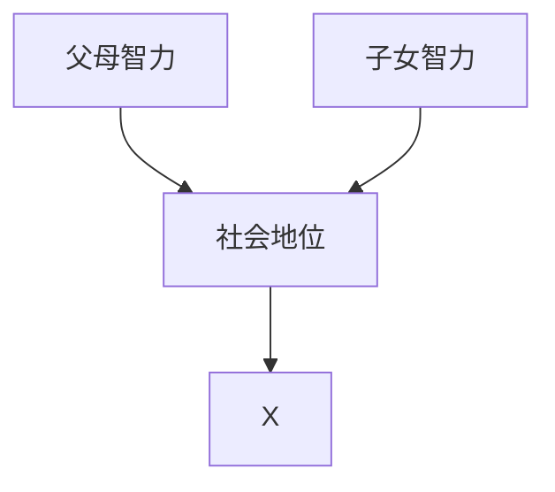
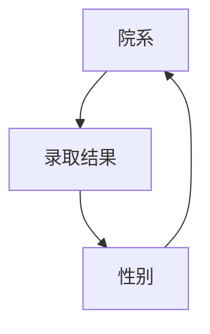
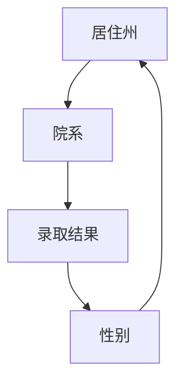
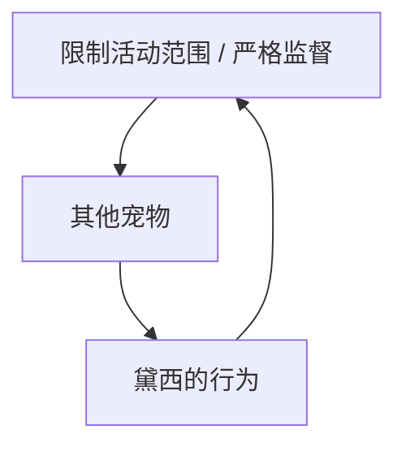
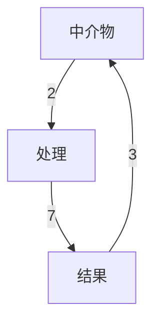
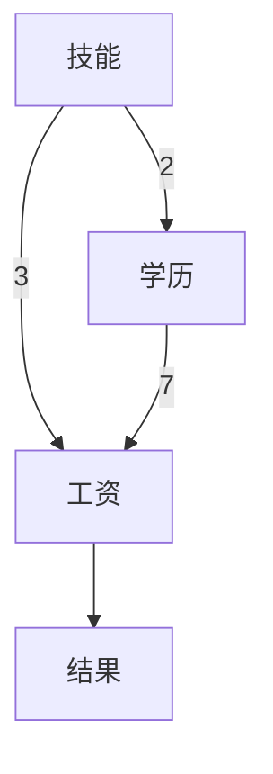
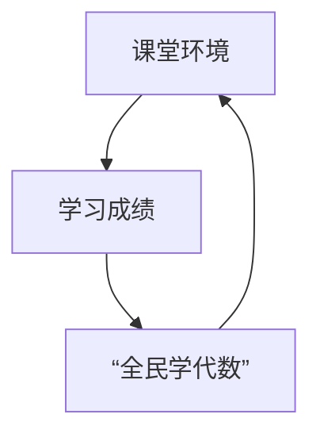
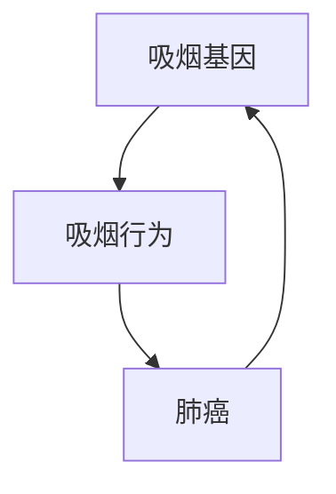
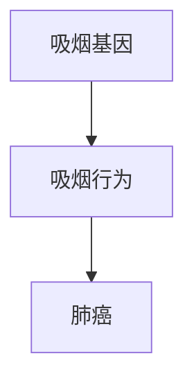
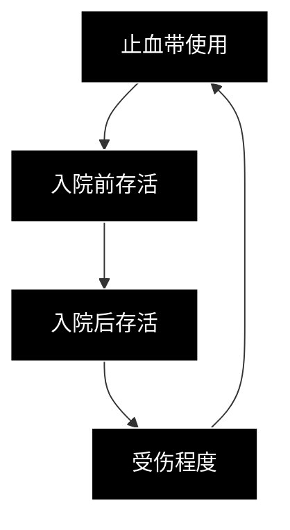

# 第九章 中介：寻找隐藏的作用机制

因为少了一枚钉子，掉了一只马掌。  
因为掉了一只马掌，失了一匹战马……  
因为败了一次战役，亡了一个国家。  

一切都是因为少了一枚钉子。

——佚名

> Black-and-white photo of a stone monument with a cross, set against a cloudy sky and open sea (no visible text or symbols)

> Black-and-white photo of a person in winter clothing standing beside a snow-dusted vehicle (no visible text or symbols)

在我们日常所使用的语言中，“为什么”这个问题至少有两个版本。第一个直截了当：你看到一个果，想知道因。你看到你的爷爷躺在医院里，于是你问：“为什么？他看起来明明很健康，怎么可能心脏病发作？”

但“为什么”还有第二个版本。在这个版本中，我们提出这个问题是为了更好地了解已知的因和已知的果之间的联系。例如，当我们观察到药物 B 能够预防心脏病发作时，或者像詹姆斯·林德一样观察到柑橘类水果能用来预防坏血病时，我们就会提出这个问题。

人类永不满足，总是想知道更多。在发现上述事实后不久，我们就会开始问第二个版本的问题：“为什么？柑橘类水果预防坏血病的机制是什么？”我们本章的内容就聚焦于“为什么”的第二个版本。

寻找作用机制对于科学研究和日常生活而言都至关重要，因为在情况改变时，不同的作用机制会要求我们采取不同的行动。假设我们的橘子吃光了，而如果我们明白橘子预防坏血病的作用机制，我们只需要找到另外一种含有维生素 C 的食物，就可以继续预防坏血病了。而如果不知道机制，我们可能就会尝试着吃香蕉或者求助于其他并不能发挥同样作用的食物。

科学家使用“**中介**”（mediation）这个词来表达第二个版本的“为什么”。你可能曾在医学期刊上读到这样的句子：“药物 B 对心脏病发作的预防作用是由它对血压水平的调节来介导的。”这句话编码了一个简单的因果模型：

$$
\text{药物} \rightarrow \text{血压} \rightarrow \text{心脏病发作}
$$

在这个例子中，药物降低了血压水平，进而降低了心脏病发作的风险。（对于原因 A 抑制了结果 B 这种情况，生物学家通常会使用一种不同的符号 $A \dashv B$ 来表示，但在因果论文献中，$A \rightarrow B$ 通用于表达肯定的因和否定的因。）同样，我们也可以用因果模型来概括柑橘类水果对坏血病的影响：

$$
\text{柑橘类水果} \rightarrow \text{维生素 C} \rightarrow \text{坏血病}
$$

关于中介物，我们想问的一些典型问题是：它是否能解释全部结果？药物 B 是否只能通过调节血压水平起作用，还是也可以通过其他机制起作用？

**安慰剂效应**是医学领域中一种常见的中介物：如果一种药物只能通过病人对其药效的信念起作用，那么绝大多数医生都会认为这种药物是无效的。中介也是法律领域中的一个重要概念。如果我们问一家公司给女性员工的工资相对男性员工较低是否构成了性别歧视，我们就是在问一个中介问题，其答案取决于所观察到的薪资差距是直接由申请人的性别引发的，还是间接通过雇主无权控制的中介物，比如职业资格等因素引发的。

以上所有问题都要求我们具备一种敏锐的判断力，以区分**总效应**、**直接效应**（不通过中介物）和**间接效应**（通过中介物）。在过去的一个世纪里，对科学家来说，即使只是给这些术语下定义都是一个重大的挑战。有些人受困于不允许说“因果关系”的禁忌，试图用不包含因果词汇的语言来定义中介。另一些人则完全摈弃中介分析，称直接效应和间接效应的概念“与其说是有助于理清统计思维，不如说是造成了更大的困惑”。

对我来说，定义中介这一概念曾经也是一个难题，而对这一难题的攻克最终成为我职业生涯中最有价值的收获之一，因为我在一开始的时候犯了错，而当我从错误中吸取了教训之后，我得以想出了一个意想不到的解决办法。有一段时间，我曾认为间接效应不具备任何操作性意义，因为它与直接效应不同，不能用干预的语言来定义。而当我意识到我可以通过反事实来定义它们，并且它们也具有重要的策略意义时，我的研究便取得了一次重要的突破。

只有在我们到达了**因果关系之梯的第三层级**，我们才可能量化它们，这就是为什么我把它们放在本书的末尾部分。中介这一概念已经在第三层级这一新的环境中得到了迅速的发展，使我们能够（更经常地从匮乏的数据中）量化由任何期望路径介导的效应的比例。

可以理解，由于间接效应披着反事实的外衣，即使在因果革命的拥护者那里，它们仍然显得有些神秘。然而我相信，它们的巨大效用最终将战胜所有那些对反事实的形而上学的质疑。也许我们可以把它们比作无理数和虚数：起初，它们让人们感到不舒服（这也是“无理数”得此名称的原因），但最终，它们的效用将这种不适转化为了理性的光辉。

## 坏血病：错误的中介物

我想以一个令人震惊的真实历史案例开始这一章，以强调理解中介物或作用机制的重要性。

最早的对照试验之一就是詹姆斯·林德船长对坏血病的研究，这项研究发表于 1747 年。在林德的时代，坏血病是一种可怕的疾病，1500 年至 1800 年间，大约有 200 万名水手因此丧命。林德和当时的所有其他人一样确定，食用柑橘类水果有助于预防这种可怕的疾病。早在 19 世纪，英国海军就规定所有的船只都必须携带充足的柑橘出海，因此，对英国海军来说，坏血病本应早已成为历史。通常，这一时间点在历史书中都标志着故事告一段落，我们可以开始庆祝科学方法的伟大胜利了。

然而，一个世纪后，当英国探险队开始极地探险时，这个完全可以预防的疾病突然卷土重来，这一事实实在令人惊讶。1875 年的英国北极远征队，1894 年的杰克逊–哈姆斯沃思北极远征队，还有最著名的两支远征队——1903 年和 1911 年由罗伯特·福尔肯·斯科特率领的两支南极洲远征队，所有这些远征队都惨遭坏血病的侵袭。

为什么会发生这样的悲剧？原因还是那两个词：**无知**和**傲慢**——并且二者总是紧密结合在一起。到 1900 年，英国的医生们似乎已经忘记了一个世纪以前的教训。1903 年，斯科特远征队的医师科特利茨医生将坏血病归因于被污染的肉。此外，他还补充说：“所谓的‘抗坏血病剂’（能够预防坏血病的物质，比如酸橙汁）带来的好处只不过是一种错觉。”在 1911 年的远征中，斯科特特意带上了经过严格检查没有腐坏迹象的干肉，但并没有储备柑橘类水果或果汁（见图 9.1）。他对医生意见的盲目信任很可能是这场悲剧的元凶。根据历史记录，5 名到达了南极的队员都死在了那里，其中两人死于不明疾病，极有可能是坏血病；还有一名队员在到达南极之前返回，活着回到了祖国，但已然患上严重的坏血病。

---

为了说明这一点，我将在本章列举几个例子，说明各学科的研究者是如何从中介分析中获得有价值的见解的。一位研究者研究了一项教育改革政策，这项政策名为“全民学代数”。起初这项改革似乎失败了，但后来又成功了。一项关于在伊拉克和阿富汗战争中止血带使用情况的研究似乎表明止血带并没有带来任何好处，而通过细致的中介分析，我们得以了解为什么这项研究结果很可能掩盖了止血带的实际效果。

总而言之，在过去的 15 年中，因果革命为学界提供了一套明确而简单的规则，用以量化一个给定效应中直接效应和间接效应所占的比例。它将中介从一个不为人知的、合法性备受质疑的概念，转变为一个广受欢迎、普遍适用的科学分析工具。

> **图9.1** 斯科特北极探险队成员每天的口粮：巧克力、干肉饼（腌制肉碟）、糖、饼干、黄油、茶。一种明显缺少的食物类型是：含有维生素C的水果（资料来源：赫尔伯托·邦汀摄影，新西兰坎特伯雷博物馆提供）

Black-and-white photo of various dried tea products including a cylindrical cake, stacked layers of dried tea, and loose tea leaves on paper (no text or symbols visible)

事后看来，科特利茨给出这样的建议就相当于犯了渎职罪。为什么才过了一个世纪，詹姆斯·林德的宝贵经验就这样被彻底抛诸脑后，甚至不予理会了呢？部分原因是，医生们并没有真正理解柑橘类水果是如何预防坏血病的。换言之，他们不了解那个关键的中介物是什么。

从林德那个时代开始，人们一直认为（但从来没有证明过），柑橘类水果能预防坏血病的原因在于其含有的酸性物质。换言之，医生是用如下的因果图来理解这个过程的：

> 柑橘类水果 → 酸性物质 → 坏血病

根据这个图示，**任何酸的东西都能预防败血病**，如果当时有可口可乐的话，恐怕连它也会被认为是一种有效的药品。起初，水手吃的是西班牙柠檬；之后，出于经济方面的考虑，他们开始用西印度酸橙替代柠檬，这种酸橙跟西班牙柠檬一样酸，但只含有相当于后者 $1/4$ 的维生素C。更糟糕的是，他们开始通过加热烹煮来“提纯”柠檬汁，而这种做法会进一步破坏水果所含的维生素C。换言之，他们所做的是一步步让中介物失效。

1875年，当发现北极探险队的水手们在饮用了柠檬汁的情况下仍然患上了坏血病时，医学界陷入了极度的困惑。他们同时还发现，那些吃了新鲜肉制品的水手没有得坏血病[1]，而那些吃了罐头肉的人却得了坏血病。于是，科特利茨和其他医生便错误地将腌肉当作坏血病的罪魁祸首。阿尔姆罗斯爵士还杜撰了一种理论，认为是被污染的肉中的细菌引起了食用者的“尸碱中毒”，从而导致其患上了坏血病。而柑橘类水果可以预防坏血病的理论就这样被扔进了垃圾箱。

直到人们发现了真正的中介物，这一混乱的局面才得到改善。1912年，一位名叫卡西米尔·冯克的波兰生物化学家提出了微量元素的存在，他称其为“维生素”。1930年，阿尔伯特·圣捷尔吉分离出了能够预防坏血病的特定元素。它不是医学界过去所说的什么酸性物质，而是一种特殊的酸，现在被我们称为**维生素C**或“抗坏血酸”（作为对昔日“抗坏血病剂”的致敬）。1937年，圣捷尔吉因这一发现获得诺贝尔奖。多亏了圣捷尔吉，我们现在知道了这条真正的因果路径：

> 柑橘类水果 → 维生素C → 坏血病

我认为我们有理由预言：科学家再也不会“忘记”这个因果路径了。从这个故事中我们就可以看到，中介分析绝不仅仅是一个抽象的数学练习，我相信本书的读者都会认同这个观点。

## 先天因素与后天培养：巴巴拉·伯克斯的悲剧

据我所知，第一个明确用因果图来表示中介物的人是斯坦福大学的一名研究生，名叫巴巴拉·伯克斯，她提出这一表示法的时间是 1926 年。这位鲜为人知的女性科学先驱是本书真正的幕后英雄之一。我们有理由相信，她实际上是独立于休厄尔·赖特发明了路径图。在中介方面，她不仅走在了赖特的前面，而且领先她的时代几十年。

在伯克斯令人遗憾的短暂的职业生涯中，她的主要研究兴趣是**先天因素与后天培养在人类智力方面所起的作用**。她就读斯坦福大学时的导师是刘易斯·特曼，这位心理学家以开发出了斯坦福—比奈智商测验而闻名，他坚信智力是先天遗传的，而不是后天习得的。请记住，当时正是优生学运动的全盛时期，尽管现在我们已经明确知道这个观点是错的，但在那时，像弗朗西斯·高尔顿、卡尔·皮尔逊和特曼这些学界权威都积极地试图用研究证明该观点的合理性。

当然，先天与后天之争是一个非常古老的话题，在伯克斯之后很长一段时间内仍然热度不减。她做出的独特贡献是把这个问题浓缩为一张因果图（见图 9.2），据此，她提出并回答了下面这个问题：

> “因果效应有多少来自直接路径：父母智力 → 子女智力（先天），又有多少来自间接路径：父母智力 → 社会地位 → 子女智力（后天）？”

> 图 9.2 先天与后天之争，由巴巴拉·伯克斯设计的框架

在这张图中，伯克斯使用了一些双向箭头，这些箭头要么表示互为因果的关系，要么表示对因果关系方向不确定。为简单起见，我们假设图中的这两个双向箭头的主要效果都是从左向右的，也即可以简化为一个从左指向右的单向箭头，这就使社会地位成为一个中介物。如此一来，这条路径就意味着父母的智力提升了他们的社会地位，这继而又给他们的子女提供了一个更好的机会来发展他的智力。变量 X 表示的是“其他未测量的间接原因”。

在伯克斯的论文中，她收集的数据来自对 204 个有寄养儿童的家庭所做的家访。我们假定这些儿童从养父母那里只得到了后天培养的好处，而没有继承先天遗传的优势（见图 9.3）。她对所有这些人进行了智商测验，并对对照组中 105 个非寄养家庭的成员进行了同样的智商测验。此外，她还让他们做了调查问卷，这些问卷在以往的研究中被用于对儿童所处社会环境的各个方面进行评级和分类。

利用数据和路径分析，伯克斯计算了父母智商对子女智商的直接效应，并发现其**只占总效应的 35%**，或者说只有大约 1/3 的智商变异来自遗传。换言之，智商高于平均水平 15 分的父母，通常其子女的智力水平只会高出平均水平 5 分。

> **图9.3** 巴巴拉·伯克斯（右）感兴趣的是区分智力的“先天”与“后天”成分。作为一名研究生，她访问了200多个有寄养儿童的家庭，对其家庭成员进行智商测验，收集他们的社会环境数据。她是休厄尔·赖特之外第一个使用路径图的研究者，在某些方面，她走在赖特的前面（资料来源：由达科塔·哈尔绘制）

Illustration of a family reading together at a desk with toys and a briefcase (no text or symbols present)

作为特曼的弟子，看到先天因素对智力只有如此小的影响，伯克斯一定很失望。（事实上，她的这一估计结果禁得起时间考验。）因此，她开始质疑当时人们普遍接受的一种分析方法，即控制“社会地位”的操作是否正确。她写道：

> “如果我们误将某些变量当作常数变量来处理，那么因对果的贡献的真正衡量标准就是残缺的，因为部分或所有这些被设为常数的变量可能取决于先天和后天两个目标变量（其真实关系将被测量）中的任何一个或其他未测量的间接因素，并且这些间接因素也可能会影响两个目标变量中的任何一个。”

换句话说，如果你感兴趣的是“父母智力”对“子女智力”的总影响，那么你就不应该对二者之间的路径上的任何变量进行变量控制（或将其设为常数）。

伯克斯并没有就此停步。她所强调的衡量标准翻译成现代语言，就是：如果我们以下述变量为条件，而该变量（a）受到“父母智力”或“子女智力”的影响，或者（b）受到“父母智力”或“子女智力”的某个未测因的影响（如图9.2中的X），那么偏倚就会出现。

这些衡量标准与休厄尔·赖特所使用的语言毫无相同之处，并且远远超越了其所处的时代。事实上，标准（b）正是科学史上最早的关于**对撞偏倚**的一个例子。如果看一下图9.2，我们就会发现“社会地位”是对撞因子（在路径“父母智力 → 社会地位 ← X”中）。因此，控制“社会地位”就打开了后门路径“父母智力 → 社会地位 ← X → 儿童智力”。如此，任何由此得出的对间接效应和直接效应的最终估计都会存在偏倚。

伯克斯之前（和之后）的统计学家都没有考虑过使用这种箭头和图示的分析方法，他们完全沉浸在这样一种虚假的神话中：相信尽管简单的相关关系并没有因果含义，但受控的相关性（或偏回归系数）仍然是朝因果解释的方向迈出的一步。

# 伯克斯与路径图：思想的光辉不灭

伯克斯不是第一个发现对撞效应的人，但她很可能是第一个用因果图术语来描述其特征的人。她的标准（b）完全适用于分析第四章中 M 偏倚的那个例子。这是对以预处理因素为条件这种操作发出的第一次警告。几乎所有 20 世纪的统计学家都视其为一种安全的操作，直到现在仍然有人秉持着这样的信念，这实在令人诧异。

现在，请你设身处地从巴巴拉·伯克斯的角度想象一下：你刚刚发现，你的所有同事都在对错误的变量进行变量控制。而且你还有两个不利条件：你只是一个学生，而且是一位女性。你会怎么做？你是否会低下头，假装接受普遍的观点，并以你的同事所使用的存在明显缺陷的语言与他们沟通？

这可不是巴巴拉·伯克斯的做法！她的第一篇论文题为“论部分相关和多重相关技术的缺陷”[2]，在论文开头，她写道：

> “经过仔细斟酌，本文作者得出的结论是，部分相关和多重相关分析技术充满陷阱，这严重限制了它们的适用性。”

无法想象，如此尖锐的言论竟出自一个尚未获得博士学位的年轻女性学者！正如特曼所描述的那样：

> “她的能力可能受到了其好斗个性的限制。我认为之所以会这样，部分原因在于她比她的许多老师和大部分男同学都更积极地维护自己的想法。”

显然，不仅是学术思想，伯克斯在很多方面都领先于她的时代。

实际上，伯克斯可能的确独立于休厄尔·赖特发明了路径图。休厄尔·赖特提出路径图只比她提前了 6 年的时间。我们可以肯定地说，她没有在任何课堂中学习过路径图。图 9.2 是在休厄尔·赖特发表其成果之外第一次刊登在学术期刊上的路径图，这也是路径图在社会科学或行为科学中的首次亮相。诚然，她在自己 1926 年的那篇论文的结尾把功劳归于赖特，但她的写法看起来更像是临时做出的补充。我有一种感觉，她是在自己画出了路径图之后才发现赖特的路径图的，很可能经过了特曼或某个精明的审稿人的提醒。

假如伯克斯没有不幸沦为她那个时代的牺牲品，那她究竟能取得怎样的成就？这个问题实在令人着迷。获得博士学位后，尽管资质完全胜任，她仍然没能在大学中谋得一份教职工作。她不得不勉强接受一些不那么稳定的研究职位，例如在卡内基研究所担任研究员。1942 年，她订婚了，这件事本来可能会为她带来转机，然而事实是，她从此陷入了严重的忧郁。

> “无论事实是否如此，她相信自己的大脑中发生了一些难以探测的恶性变化，她永远也无法从中康复了。”她的母亲弗朗西丝·伯克斯在给特曼的信中写道，“她对我们的爱是如此的温柔，她选择拒绝让我们一起承担她的抑郁和痛苦。”

1943 年 5 月 25 日，她从纽约的乔治·华盛顿桥上跳了下去，结束了自己的一生，享年 40 岁。

但思想总有办法在悲剧中留存下来。当社会学家休伯特·布莱洛克和奥蒂斯·邓肯在 20 世纪 60 年代重新发现了路径分析时，伯克斯的论文成为他们灵感的源泉。邓肯解释说，他的导师威廉·菲尔丁·奥格本在 1946 年关于部分相关的讲座中曾简要提到了路径系数。邓肯说：

> “奥格本撰写了一篇关于赖特论文的简要报告，这篇论文讨论的正是伯克斯的研究，于是我要了一份论文的复印件。”

思想的光辉不灭！伯克斯 1926 年的论文引发了赖特对不恰当运用偏相关分析所引起的问题的兴趣。而赖特的后续研究在 20 年后进入奥格本的视野，出现在他的报告中，其思想又被邓肯吸收。又一个 20 年后，当邓肯读到布莱洛克有关路径图的论文时，这段几乎被遗忘的学生时代的记忆被唤醒了。看到这只脆弱的思想之蝶在无声振翅中穿越了两个时代，终于成功地飞向光明，着实令我震撼不已。

# 寻找一种语言（伯克利大学招生悖论）

可惜，在伯克斯超越时代的论文发表后的半个世纪，统计学家依然停留在试图阐述直接效应和间接效应的定义这一阶段，更不用说估计它们了。此处，我们有一个特别恰当的例子，这也是一个著名的悖论，与辛普森悖论有关，但又有所不同。

1973 年，加州大学副院长尤金·汉默尔注意到大学的男女生入学率呈现出一种令人担忧的趋势。他的数据显示，在申请伯克利大学研究生的男生中，有 44% 的人被录取了，相比之下，女生申请者只有 35% 被录取了。性别歧视在当时正引起公众的广泛关注，汉默尔不想等别人来质疑才行动。他决定调查这一比例差距的原因。

和其他大学一样，伯克利大学的研究生入学决定是由各个系而不是由大学做出的。因此，通过挨个查看各个系的招生数据找出罪魁祸首的做法是合理的。但当汉默尔这样做时，他发现了一个惊人的事实：**每个系的招生决定都更有利于女生，而不是男生**。怎么会这样呢？

对此，汉默尔做了一个明智的决定，找来统计学家彼得·毕克尔帮忙，而彼得在查看数据时立刻认出了辛普森悖论。正如我们在第六章看到的，辛普森悖论指的是一种趋势，它似乎在总体的每一层中都趋于一个方向（在每个系里，女生的录取率都更高），但在整个总体中却趋于一个完全相反的方向（在整个大学里，男生的录取率更高）。我们在第六章还看到，悖论的正确解决在很大程度上取决于你要回答的问题是什么。在这个案例中，我们要回答的问题很明确：**大学（或大学内的某些人）是否歧视女生？**

当我第一次向我的妻子介绍这个例子时，她的反应是：“这不可能。如果每个系都存在对某一性别的歧视，那么整个学校就不可能出现对另一种性别的歧视。”她是对的！这一悖论与我们对歧视的理解相抵触。歧视是一个因果概念，涉及对申请者所上报性别的偏好响应。如果所有的行为者都更偏好某个性别，那么整个群体就必然表现出相同的倾向。而如果数据看起来并非如此，那必然意味着我们没有遵循因果关系的逻辑合理地处理数据。唯有理顺因果逻辑，并给出一个清晰的因果叙述，我们才能确定某所大学是否确实存在性别歧视。

事实上，毕克尔和汉默尔发现了一个令他们自己非常满意的因果叙述。他们在 1975 年的《科学》杂志上发表了一篇文章，其中提出了一个对这一悖论的简单解释：**女生申请者被拒绝的人数更多，是因为她们倾向于申请更难被录取的系**。

# 格式化优化后的 Markdown 内容

具体而言，一方面，在人文科学和社会科学系的申请中，女性申请者所占比例要高于男性，而在这些院系中，她们面临着双重困境：申请者数量更多，而录取名额更少。另一方面，女生不怎么申请像机械工程学这样的系，但这些系本身录取的学生更多，且系里为研究生提供了更多的资金和空间。简而言之，这些系的录取率更高。

那么，为什么女性会倾向于申请更难录取的系？她们没有选择申请技术性领域的院系，也许是因为那些领域对数学水平的要求较高，或被认为更“男性化”。也许是因为她们在教育的早期阶段遭到了歧视，就像巴巴拉·伯克斯的故事所显示的那样，社会往往倾向于将女性从技术性领域排挤出去。但这些因素并不在伯克利大学的控制之中，因此不能视作大学存在性别歧视的证据。毕克尔和汉默尔的结论是：“伯克利大学并没有歧视女性申请者。”

顺便一提，我注意到了毕克尔这篇论文中所使用的描述语言的精确性。他仔细地区分了两个术语——“偏倚”和“歧视”，这两个术语在日常英语中经常被看作一对同义词。一方面，他将**偏倚**定义为“某一决定与申请人的某个性别之间的关联模式”。注意其中的“模式”和“关联”这两个词，这两个词告诉我们，偏倚是一种现象，处于因果关系之梯的第一层级。另一方面，他将**歧视**定义为“在性别与入学资格无关的情况下，受到申请人性别的影响而做出的决定”。即使毕克尔在 1975 年无法说出“因果关系”这个词，“做出决定”“影响”“无关”这些字眼也足以使人联想到因果关系。歧视不同于偏倚，它属于因果关系之梯的第二层级或第三层级。

在毕克尔的分析中，他认为数据应按院系分层，因为院系是决策单位。这是正确的选择吗？为了回答这个问题，我们首先需要绘制一张因果图（见图 9.4）。此外，研究一下《美国判例汇编》中关于歧视的定义也很有启发。这一定义采用了反事实的术语，是我们已经攀升到因果关系之梯第三层级的一个明确信号。在卡尔森诉伯利恒钢铁公司案（1996）中，第七巡回法院在判决词中写道：

> “任何就业歧视案件的中心问题都是，假如雇员除属于不同的种族（或有不同的年龄、性别、宗教、出身国等）外，在其他的一切方面都一样，那么雇主是否会采取同样的行动。”

这个定义清楚地表达了这样一种观点：我们必须先关闭或“冻结”所有以其他变量（如录取资格、院系选择等）为介导的从性别到录取的因果路径。换言之，歧视是性别对录取结果的直接效应。

> 图 9.4 伯克利大学录取悖论例子的因果图（简化版）

我们之前已经认识到，想估计一个变量对另一变量的总效应，控制中介物的做法是不正确的。但是就歧视这个例子来说，根据法院的定义，真正重要的不是总效应，而是直接效应。因此毕克尔和汉默尔的做法被证实是正确的：在图 9.4 所呈现的假设下，他们按院系划分数据是对的，这一操作的结果带来了关于“性别”对“录取结果”的直接效应的有效估计。尽管 1973 年毕克尔和汉默尔无法使用直接效应和间接效应这样的词语，但他们仍然取得了成功。

然而，这个故事最有趣的部分不是毕克尔和汉默尔发表的论文本身，而是这篇论文所引发的讨论。论文发表后，芝加哥大学的威廉·克鲁斯卡尔写了一封信给毕克尔，指出他们的解释并没有真正证明伯克利大学的清白。事实上，克鲁斯卡尔本质上是在质疑我们是否可以从任何纯粹的观察性研究（而不是进行某种随机对照试验，比如利用伪造的入学申请表考察录取情况）中得到这样的结论。

对我来说，他们的信件往来令人着迷。两个伟大的思想家为他们缺乏足够的词汇来描述的一个概念（因果关系）而展开辩论，这并不常见。毕克尔后来通过不断的努力在 1984 年获得了麦克阿瑟基金会的“天才”奖。但在 1975 年，他才刚开始他作为一名研究者的职业生涯，对他来说，与美国统计界的巨擘克鲁斯卡尔的斗智斗勇既是荣耀，也是挑战。

克鲁斯卡尔在给毕克尔的信中指出，“院系”与“录取结果”之间的关系可能存在一个未测的混杂因子，例如申请者的居住州。他用虚构数据举了一个例子，假设存在这样一所大学，它有两个存在性别歧视的院系，其产生的数据和毕克尔例子中的数据完全相同。一个前提假设是两个院系都接收所有本州的男性和外州的女性，并拒绝所有的外州男性和本州女性，这是他们唯一的录取标准。显然，这项招生政策是一个明目张胆的教科书式的性别歧视案例。但是，由于两种性别的申请者中被接受和被拒绝的申请者的总数与毕克尔的例子完全相同，因此毕克尔应该会断定性别歧视并不存在。在克鲁斯卡尔看来，这些院系看起来清白无辜，完全是因为毕克尔只控制了一个变量而不是两个。

克鲁斯卡尔一针见血地指出了毕克尔论文的缺陷：缺乏一个明确的、经过检验的标准来确定到底应该控制哪个变量。克鲁斯卡尔并没有提供一个解决方案，事实上在他的信中，他表示对找到一个解决方案丧失了信心。

与克鲁斯卡尔不同，我们可以绘制一张因果图，看看问题到底出在哪里。图 9.5 所示的是克鲁斯卡尔提出的反例的因果图。它看起来是不是有点眼熟？事实上，它与巴巴拉·伯克斯在 1926 年绘制的因果图完全一致，只是具体的变量有所不同。可能有人不禁要说一句“英雄所见略同”，但更恰当的说法也许是，伟大的问题总能吸引伟大的头脑。

> 图 9.5 伯克利大学招生悖论的因果图（克鲁斯卡尔的版本）

克鲁斯卡尔认为，要在这种情况下分析直接效应，我们就必须同时控制“院系”和“居住州”，图 9.5 解释了其中的原因。要关闭除直接路径之外的所有路径，我们需要按院系对数据进行分层，也就是控制院系这个变量，这将关闭间接路径“性别→院系→录取结果”。但在这样做的同时，我们就打开了伪路径“性别→院系←居住州→录取结果”，因为“院系”在该路径中是一个对撞因子。因此我们就需要控制“居住州”这个变量来关闭这条路径。如此一来，剩下的任何关联都必定是由（歧视的）直接路径“性别→录取结果”引起的。由于缺乏因果图，克鲁斯卡尔只能用虚构数据说服毕克尔，而实际上他的数据反映出的正是刚刚我们描述的这种情况。如果我们不控制任何变量，那么数据将显示女性的录取率较低。如果我们只控制“院系”，那么女性似乎反而有较高的录取率。如果我们同时控制“院系”和“居住州”，则数据将再一次显示女性的录取率较低。

从这样的论证中，你可以看到为什么中介这一概念曾经激起（而且仍在激起）各方的怀疑。它看起来非常的不稳定，而且很难锁定。通过不同的变量控制操作，录取率先是呈现出对女性的歧视，接着又呈现出对男性的歧视，之后又是对女性的歧视。

在对克鲁斯卡尔的答复中，毕克尔仍然坚持，以决策部门（“院系”）为条件与以决定标准（“居住州”）为条件有所不同。但他对此主张并没有他表现出来的那么自信，而是可怜兮兮地问道：“我发现了一个非统计学的问题：我们所说的偏倚到底是什么意思？”为什么偏倚迹象会随我们测量方式的变化而发生变化？事实上，他在区分偏倚和歧视时所提出的定义是正确的。偏倚是一个不稳定的统计概念，如果用不同的方法切分数据，偏倚就可能会消失。而作为一种因果概念，歧视反映的是现实，因而必须保持稳定。

他们的词汇表所缺少的那个关键短语是“保持恒定”（hold constant）。要关闭从“性别”到“结果”的间接路径，我们就必须保持变量“院系”恒定，然后对变量“性别”进行扰动。当我们保持“院系”恒定时，我们就可以（打个比方来说）阻止申请人选择申请哪个院系。而因为统计学家没有表示这个概念的词，他们就采取了一种表面上类似的做法：以“院系”为条件。这正是毕克尔所做的：他逐个院系地查看数据资料，并得出结论说没有证据证明伯克利大学歧视女性。当“院系”和“录取结果”之间不存在混杂时，这一做法是有效的；在这种情况下，“观察”结果和“干预”结果是一样的。而克鲁斯卡尔提出的问题也是正确的：如果存在‘居住州’这个混杂因子呢？他可能没有意识到自己是在追随伯克斯的脚步，毕竟他所绘制的那张因果图与伯克斯在研究智力的先天后天之争时所绘制的因果图相差无几。

**我特别想要强调的正是这一在过去几年中反复出现的错误——以中介物为条件（对中介物进行变量控制），而不是保持中介物恒定（设其为常量）。我称其为中介谬误（mediation fallacy）。** 诚然，如果中介物和结果之间没有混杂，则这个错误并无实际危害。然而，如果确有混杂，那么这一错误完全可以反转分析结果，正如克鲁斯卡尔的虚构数据例子所展示的那样。它将误导调查人员得出错误的结论，即在事实上存在歧视的情况时，宣称歧视并不存在。

伯克斯和克鲁斯卡尔识别出了中介谬误这个错误，这很了不起，尽管他们并没有提出有效的解决方法。费舍尔在1936年也犯了同样的错误，而80年后，统计学家仍在尝试解决这个问题。幸运的是，自费舍尔时代以来，我们已经取得了巨大的进步。例如，流行病学家现在已经知道，必须密切注意中介物和结果之间的混杂因子。而那些回避因果图语言的人（比如一些顽固的经济学家）则对此问题抱怨不已，并承认，解释这一警告的含义是一种折磨。

谢天谢地，克鲁斯卡尔提出的这一被他自己称为“或许不能解决的”问题在20年前就被 do 演算的提出解决了。我认为克鲁斯卡尔肯定会喜欢这个解决方案，我甚至能想象出向他展示 do 演算和反事实算法化的力量的情景。遗憾的是，他在1990年退休了，当时 do 演算规则刚刚成形。他于2005年去世，没能看到这一解决方案的正式提出。

我相信有些读者很想知道：伯克利大学案最后怎么样了？答案是，什么也没发生。汉默尔和毕克尔相信伯克利大学没有什么可担心的，而事实上伯克利大学也没有遭遇任何诉讼或联邦调查。这些数据反而暗示了对男性申请者的歧视，因为有明确的证据表明，“在大多数存在女性优先录取条件的院系中，招生委员会的录取规则都体现了他们为克服长期存在的领域内的女性短缺问题所做出的努力”，毕克尔如此写道。而就在3年后，有关加州大学另一分校的一起关于平权法案的诉讼一路告到了最高法院。如果最高法院最终驳回了平权法案，那么这种“女性优先”的操作很可能就会被判定为非法行为。然而，最高法院支持了平权法案，伯克利大学案也就因此成为这段历史的一个注脚。

聪明如我当然不会将决定权交给最高法院，而是留给自己的妻子。为何我的妻子有如此强烈的直觉，认为在每个院系都公平行事的情况下，整所学校就完全不可能存在歧视呢？这涉及了一个类似于确凿性原则的因果运算定理。正如吉米·萨维奇在最初提出这一原则时所说的那样，确凿性原则属于总效应，而这个因果运算定理则适用于直接效应。总体的直接效应据其定义就应取决于子总体直接效应的总和。

**简言之，每个局部的公平就意味着总体的公平。我的妻子是对的。**

# 黛西、小猫和间接效应

到目前为止，我们已经用一种模糊的、直觉性的方式讨论了直接效应和间接效应的概念，但我还没有给出它们精确的科学含义。我们早该弥补这一漏洞了。

让我们从直接效应开始，因为它肯定更简单，我们可以用 do 演算（第二层级）定义它的一个版本。我们首先考虑一个只包含 3 个变量的最简单的案例：处理 **X**，结果 **Y**，中介物 **M**。当我们“扰动”X 而保持 M 恒定时，我们就得到了 X 对 Y 的直接效应。

在伯克利大学招生悖论的例子中，假设我们强迫每个人都申请历史系，即我们 do（M=0）。并且，不考虑申请者的实际性别是什么，我们随机分配一些人（在申请表上）报告其性别为男性［do（X=1）］，另一些人报告其性别为女性［do（X=0）］。然后，我们观察两个性别报告组在录取率上的差异。该结果也被称为“受控直接效应”（Controlled Direct Effect，简称为 **CDE**），可以用符号表示为 CDE（0）：

$$
\text{CDE}(0) = P(Y = 1 \mid \text{do}(X = 1), \text{do}(M = 0)) - P(Y = 1 \mid \text{do}(X = 0), \text{do}(M = 0)) \tag{9.1}
$$

“0”在 CDE（0）中表示的是我们迫使中介物取值为 0。我们也可以进行另一个类似的试验，迫使每个人都申请工程学系：do（M=1）。我们将由此产生的受控直接效应表示为 CDE（1）。

我们已经看到了直接效应和总效应之间的一个区别：我们现在有两个不同版本的受控直接效应，CDE（0）和 CDE（1），哪一个是对的？一种选择是简单地报告两个版本。不难想象，也许实际情况就是一个院系歧视女性，另一个歧视男性，找出哪个院系歧视哪种性别本身就很有趣，毕竟，这正是汉默尔研究的初衷。

然而，我不建议你做这样的试验，原因如下：设想有一个名叫乔的申请人，他的毕生梦想是学习工程学，而他碰巧（随机地）被分配去申请历史系。在和招生委员会面谈几次之后，我敢保证，对委员会来说，乔的申请看起来会非常奇怪。无论他在申请表上报告的性别是“男性”还是“女性”，他在电磁波课程中拿到的 A+ 和在欧洲民族主义课程中拿到的 B– 都足以促使委员会做出不录取的决定。相比申请人按照自己的意愿正常申请历史系的情况，在这种失真的情境中，男性和女性的录取比例很难反映出实际的招生政策。

幸运的是，另一种方法可以让我们避免踏入这个“过度对照试验”的陷阱。我们指示申请人随机报告性别，但允许他们按照自己的意愿申请他们本来就青睐的院系。我们将由此得到的直接效应称为**“自然直接效应”**（Natural Direct Effect，简称为 **NDE**），因为每个申请人最终都会申请他自己选择的院系。“本来就”这样的措辞暗示 NDE 的正式数学定义需要反事实。对于喜欢数学的读者，该定义可表示为如下公式：

$$
NDE = P(Y_{M = M0} = 1 \mid do(X = 1)) - P(Y_{M = M0} = 1 \mid do(X = 0)) \tag{9.2}
$$

在此例中，NDE 代表的是如果一个女生将她的性别报告为“男性”，即 do（X=1），其申请自己想去的院系（M=M0）的录取概率。在这里，院系的选择是由真实的性别决定的，而录取是由报告的性别（假性别）决定的。由于前者无法被强制干预，我们不能将这个术语转化为包含 do 算子的表达式，我们需要调用反事实下标。

现在，你已经知道了我们如何定义受控直接效应和自然直接效应，那么我们如何计算它们呢？对于受控直接效应，这项任务很简单，因为它可以表示为一个 do 表达式，所以我们只需要使用 do 演算定律将 do 表达式精简（转化）为 see 表达式（可从观测数据中直接估计出的条件概率）即可。

而估计自然直接效应则是一个更大的挑战，因为它不能用 do 表达式来定义。它需要我们调用反事实的语言，因而我们也不能用 do 演算来估计它。当我最终设法完成了将 NDE 公式中所有的反事实下标都去掉的任务时，那真是我一生中最激动兴奋的一刻。这一重要成果被我称为**“中介公式”**（Mediation Formula），它使 NDE 成为一种真正实用的工具，因为我们再一次实现了从观测到的数据中将其直接估计出来这一目标。

与直接效应不同的是，间接效应没有“受控”版本的定义，因为我们无法通过保持某些变量恒定来关闭直接路径。但它确实有一个“自然”版本的定义，**自然间接效应**（Natural Indirect Effect，简称为 **NIE**），且该定义同 NDE 一样需要调用反事实的语言。为了推导出这个定义，我们先来看本书合著者达纳·麦肯齐提出的一个有趣的例子。

达纳·麦肯齐和他的妻子收养了一只名叫**黛西**的狗，黛西是贵宾犬和吉娃娃的混血品种，顽皮任性。黛西不像他们以前养的狗那样容易驯服，几周后，它仍会偶尔在家里制造“意外”（比如随地大小便）。但后来发生了一件非常奇怪的事。达纳和他的妻子从动物收容所带了三只小猫回来寄养，而黛西突然就不再制造“意外”了。寄养的小猫在家里待了 3 周，那段时期，黛西一次都没有违规。

## 修正标点符号与优化排版

那么，这究竟只是一种巧合，还是小猫以某种方式激发了黛西的文明行为？达纳的妻子认为，小猫的到来可能给了黛西一种对于“群组”的归属感，让它意识到它属于这一群组，因而不应该把这一群组生活的地方弄得一团糟。在小猫被送回收容所的几天后，黛西故态萌发，又开始在屋子里撒尿，仿佛它从来不知道它此前遵守过的那些良好习惯。这一事实让这一理论的证据得到了加强。

但是达纳忽然想起，在小猫到来和离开时，还有另外一件事也同时发生了变化。小猫在的时候，黛西要么被与小猫隔离开来，要么受到了主人的细心监管。因此，在那段时期，它要么长时间地待在自己的窝里，要么长时间地被人密切监视，甚至时不时就要被拴上皮带。无论是要求宠物待在自己的窝里还是给宠物拴上皮带，都是公认有效的管教方法。

小猫离开后，麦肯齐全家不再密切监督它，于是它立即恢复原状。达纳假设小猫的作用不是直接的（就像群组理论所描述的那样），而是间接的，由限制活动范围和严密监督介导。图 9.6 显示了此例的因果图。在此基础上，达纳和他的妻子做了一个试验。他们开始像小猫还在时那样对待黛西，让它待在自己的窝里，或者在它出来的时候严密监督它。如果“意外”不再发生，他们就可以合理地断定这一假设的中介物是可靠的。如果“意外”没有停止，那么直接效应（群组理论）就变得更可信了。

> 图 9.6 黛西与小猫的因果图

在科学证据的层次结构中，麦肯齐夫妇的试验会被视为非常不可靠，肯定不能在科学期刊上发表。一个真正的试验首先要求你有不止一只狗，并且试验要分别在小猫在场和不在场的情况下进行。不过，我们在此关注的是试验背后的因果逻辑。我们设法重建的是，假如小猫不在场，同时假如我们将中介物的值设置为小猫在场时的值，那么本应该发生的事是什么。换句话说，我们移走了小猫（干预 1），并像小猫在家时那样监督黛西（干预 2）。

当你仔细观察上面那段话时，你可能会注意到其中提到了两个“假如”，这是反事实语言。实际发生的事情是，小狗黛西在小猫在场的情况下改变了自己的行为，而我们想问的是，假如小猫不在场，可能会发生什么。同样，我们知道实际发生的事情是，如果小猫不在场，达纳也不会监督黛西的行为，而我们现在想问的问题是，假如小猫不在场，但我们仍然监督黛西的话，会发生什么。

你现在可以明白为什么统计学家为定义间接效应困扰了这么长的时间。如果说只涉及一个反事实的情况都已经这么复杂了，那双嵌套的反事实就更无法理解了。不过，这个定义实际上非常符合我们对因果关系的自然直觉。不得不说，我们的直觉实在强大，这种人类的天赋让达纳的妻子在没有接受过特殊训练的情况下就能轻松地理解试验背后的逻辑。

对于那些更习惯公式定义的读者，上述 NIE 的定义 $\left[ 3 \right]$ 可以用公式表示为：

$$
\mathrm{NIE} = \mathrm{P} \left(\mathrm{Y} _ {\mathrm{M} = \mathrm{M} 1} = 1 \mid \text {do} (\mathrm{X} = 0)\right) - \mathrm{P} \left(\mathrm{Y} _ {\mathrm{M} = \mathrm{M} 0} = 1 \mid \text {do} (\mathrm{X} = 0)\right) \tag {9.3}
$$

第一个 P 是黛西试验的结果：假设我们不引入其他宠物（X=0），但将中介物设置为引入其他宠物时会有的值 $\scriptstyle ( \mathbf { M } = \mathbf { M } _ { 1 } )$ ，此时黛西的行为有所改善（Y=1）的概率。我们将它与“正常”条件（没有其他宠物）下黛西的行为有所改善的概率进行对比。请注意，反事实 $\mathbf { M } _ { 1 }$ 的计算必须基于特定案例的特定动物：不同的狗可能对活动范围限制和严密监督的需求也有所不同。这就使得间接效应的计算超出了 do 演算的范围。它也可能使试验变得难以实施，因为试验者可能无从了解特定的狗 u 的 $\mathbf { M } _ { 1 }$ （u）。然而，若假设 M 和 Y 之间没有混杂，则自然间接效应仍然是可以计算出来的。从 NIE 中删除所有的反事实下标，我们就能得到一个中介公式，就像之前我们对 NDE 所做的那样，这一操作是可能的。这种计算虽然涉及来自因果关系之梯第三层级的信息，但仍然可以简化成一个可以只根据第一层级的数据计算出结果的公式。但实施该简化的前提条件是假设不存在混杂，提出这一假设的根据是结构因果模型中的方程所具有的确定性性质（位于因果关系之梯的第三层级）。

关于黛西的表现，该试验并不能给出定论。在达纳和他的妻子送走了小猫的前提下，他们是否能真的像小猫在家时那样仔细地监视黛西，这是值得怀疑的。（也就是说，我们并不能确定 M 是否真的被设置为 $\mathbf { M } _ { 1 }$ 。）经过几个月的耐心培训，黛西最终学会了在室外大小便。不过不论结果怎样，黛西的故事依然留给了我们一些有益的经验。只需要设定中介物的值，达纳就能推测出另一个因果机制。并且这一机制有一个重要的现实意义：他和他的妻子不必为了改善黛西的行为而养一屋子的猫。

## 线性“仙境”中的中介

当你第一次听说反事实时，你可能会怀疑我们是否真的需要用这样一种复杂的机制来表示间接效应。比如你可以说，间接效应只是总效应去除直接效应后剩下的效应。或者，我们可以将其写作：

$$
\therefore \frac{1}{2} \div \frac{1}{3} \times \frac{1}{2} = \frac{1}{5} + \frac{1}{3} \times \frac{1}{3} + \vert \frac{1}{2} \vert + \vert \frac{1}{3} \times \frac{1}{3} \times \frac{1}{2} - \frac{1}{3} \times \frac{1}{3} \times \vert \frac{1}{2} \vert \quad (9.4)
$$

一个简短的回答是，该定义在涉及变量间的相互作用（有时也被称作“调节作用”）的模型中行不通。比如，设想一种药物，它能促使身体分泌一种起到催化剂作用的酶，这种酶在与药物结合后可以治疗某种疾病。药物的总效应当然是正的。但直接效应是零，因为如果我们让中介物失效（比如阻止这种酶的生成），则药物就无法起作用。间接效应也是零，因为如果我们不服用药物，仅通过人工手段刺激人体生成这种酶，那么疾病仍然无法得到治愈，因为酶本身没有治疗功效。因此，在此例中方程 9.4 不成立：总效应是正的，但直接效应和间接效应都是零。

然而，在一种特殊的情况下，方程 9.4 将自动成立，且无须调用反事实。这就是我们在第八章看到的线性因果模型的例子。如前文所述，线性模型不允许变量之间的交互，这一限定有利有弊。利的一面是，它使中介分析变得容易了许多。弊的一面是，如果我们想描述一个涉及交互的实际存在的因果过程，它就不再适用了。

对于线性模型来说，中介分析相当简单，让我们看看它是如何完成的，以及它有哪些缺陷。假设我们有一个如图 9.7 所示的因果图。因为我们使用的是线性模型，所以我们可以用一个数字来表示每个效应的强度。数字标签（路径系数）表明，每增加 1 个单位的处理变量将增加 2 个单位的中介物。同样，每增加 1 个单位的中介物将增加 3 个单位的结果。此外，每增加 1 个单位的处理将增加 7 个单位的结果。这些都是直接效应。线性模型的中介分析如此简单的首要原因是：直接效应不取决于中介物的水平。即受控直接效应 CDE（m）对所有的 m 值来说是相同的，因此我们可以干脆称之为“这一”直接效应。

> 图 9.7 包含中介的线性模型（路径图）示例

如果某项干预导致处理增加了 1 个单位，那么干预的总效应是什么？首先，这种干预会直接导致结果增加 7 个单位（如果我们保持中介物恒定）。同时，它还会导致中介物增加 2 个单位。而由于中介物每增加 1 个单位会导致结果增加 3 个单位，因此中介物增加 2 个单位就将导致结果额外增加 6 个单位。因此，通过两个因果路径，结果的净增长将是 13 个单位。前 7 个单位与直接效应相对应，剩余的 6 个单位与间接效应相对应。就是这么简单！

一般来说，如果从 X 到 Y 有一个以上的间接路径，我们就需要通过计算沿途所有路径系数的乘积来评估每一路径的间接效应，然后再通过累加所有间接因果路径的效应得到总的间接效应。而 X 对 Y 的总效应就应该是直接效应和间接效应的总和。这个“乘积之和”的规则自休厄尔·赖特发明路径分析就一直被沿用下来，在形式上，它确实遵循了 do 算子的总效应定义。

1986 年，鲁本·巴伦和大卫·肯尼阐述了一套在方程组中检测和评估中介效应的原则。其基本原理是，首先，这些变量都是通过线性方程相关联的，我们可以利用数据拟合来构建回归方程。其次，直接效应和间接效应是通过两个回归方程计算出来的，其中一个包含中介物，另一个不包含中介物。当引入中介物时，相对于无中介物的方程，系数的显著变化就被视为中介效应存在的证据。

巴伦—肯尼方法的简单性和可行性在社会学领域掀起了一场风暴。截至 2014 年，他们的文章仍然在最常被引用的科学论文排行榜上名列第 33。截至 2017 年，谷歌学术搜索的报告显示，共计有 7.3 万篇学术文章引用了巴伦和肯尼的这篇论文。想想看吧，这篇论文被引用的次数比阿尔伯特·爱因斯坦提出相对论的论文、比西格蒙德·弗洛伊德提出精神分析的论文还要多，超过了几乎所有你能想到的著名科学家的论文。他们的文章在心理学和精神病学这一论文大类的引用次数排行榜上名列第 2，而实际上它根本就没有讨论任何心理学或精神病学方面的问题，它所讨论的主题只有一个：关于无因果的中介效应的计算。

巴伦—肯尼方法受到了空前的欢迎，无疑源于以下两个因素：

- 首先，人们对中介效应的计算有很大的需求。我们想要理解“自然的作用机制”（在 X→M→Y 中找到那个 M）的渴望也许比我们想要量化它的渴望更强。
- 其次，该方法很容易简化为一个基于统计学中一些我们所熟知的概念的标准步骤。长期以来，统计学家一直称只有他们才掌握着真正的客观性和实证有效性，因此几乎没有人注意到这其中发生的一个巨大飞跃——一个因果量（中介效应）可以通过纯粹的统计学方法来定义和计算。

然而，在 20 世纪早期，这座建基于回归的大厦就出现了裂缝。当时，研究者试图将乘积之和的规则推广至非线性系统。这一规则涉及两个假设——不同路径的效应是可累加的，一条路径涉及的效应（路径系数）是可相乘的，而这两个假设在非线性模型中都不成立，我们将在下面看到实例。

中介分析的实践者花了很长的时间才从线性回归的迷雾中醒悟过来。2001 年，我的朋友兼同事罗德·麦克唐纳写道：“对于检测或表示调节作用或回归分析中的中介效应这类问题，我认为讨论它们的最好方法是将所有的相关文献放在一边，从头开始。”近期发表的关于中介的文献似乎接受了麦克唐纳的这一建议，其中，相较于回归方法，研究者开始更积极地使用反事实和图示方法。2014 年，巴伦—肯尼方法之父大卫·肯尼在他的个人网站上开辟了一个新栏目，并将其命名为“因果中介分析”。虽然我不会称他为因果关系科学的“皈依者”，但肯尼显然认识到时代发生了变化，中介分析迈入了一个新阶段。

现在，让我们来看一个非常简单的例子，它说明了在离开线性仙境之后，我们此前的假设将如何导致错误。在对图 9.7 进行了略微的修改后，我们就得到了图 9.8，其中求职者当且仅当预期工资超过某一阈值（此例中阈值为 10）时才会决定接受工作。如图所示，公司提供的工资是确定的，表示为：$7 \times \text{学历} + 3 \times \text{技能}$。请注意，确定技能和工资的函数仍假设为线性的，而工资与结果的关系是非线性的，因为它涉及一个阈值效应。

> **图 9.8** 结合了阈值效应的中介

现在让我们计算一下，对于这个模型，每增加 1 个单位的“学历”所带来的总效应、直接效应和间接效应。总效应显然等于 1，因为随着“学历”从 0 变为 1，“工资”也就从 0 变为 $7 \times 1 + 3 \times 2 = 13$，其超过了阈值 10，使得“结果”从 0 变为 1。

记住，**自然间接效应**（NIE）指的是结果的预期变化，假设我们对“学历”不做任何改变，而将“技能”设定为在“学历”提高了一个水平的前提下其所应该有的水平。很容易看出，在这种情况下，“工资”将从 0 变为 $2 \times 3 = 6$，低于阈值 10，所以求职者不会接受这份工作，因而 **NIE = 0**。

# 因果中介效应的直接与间接效应：非线性模型中的挑战与突破

那么直接效应呢？如前所述，我们遇到的问题是要弄清楚中介物应该取什么值。一方面，如果我们采用“学历”水平改变之前的“技能”水平，那么“工资”将从0增加到7，低于阈值，使“结果”等于0。因此，CDE（0）=0。另一方面，如果我们采用“学历”改变后（学历=2）的“技能”水平，那么“工资”将从6增加到13，这将使“结果”从0变为1。所以CDE（2）=1。

因此，直接效应要么是0要么是1，这取决于我们为中介物设定的常值。不同于线性仙境，中介物选择的值会对结果产生影响，这就让我们陷入了一个两难困境。如果我们希望保留相加性原则：总效应=直接效应+间接效应，我们就需要使用CDE（2）作为因果效应的定义。但这一选择似乎过于武断了，显得有些不自然。

如果我们考虑改变“学历”对“结果”的直接效应，那么我们就更希望“技能”保持其现有水平不变。换言之，此时使用CDE（0）作为直接效应的定义会更直观。不仅如此，这一定义还与本例中的自然直接效应是一致的。但是这样一来我们就违背了相加性原则：总效应≠直接效应+间接效应。

然而，令人惊奇的是，只需要对原来的相加性原则进行一次微调，我们就能重新让其在这个例子中成立，并且不仅在本例中，在一般的情况下我们也可以这样做。不介意做一些计算的读者可能会对计算从X=1转变为X=0时的NIE感兴趣。在这种情况下，“工资”从13降到7，“结果”从1降至0（求职者不接受此工作）。所以按照这一反方向（从X=1转变为X=0）来计算，NIE=–1。据此，我们可以推导出一个令人惊奇的公式：

$$
\text{总效应} (X = 0 \rightarrow X = 1) = NDE (X = 0 \rightarrow X = 1) - NIE (X = 1 \rightarrow X = 0)
$$

直接代入这个例子中的具体数值，就是1=0–（–1）。这就是相加性原则的自然效应版本，只不过它其实是一个**相减性原则**！我特别高兴能从分析中得到这个相加性原则的新版本，使其在我们的非线性函数中成立。

人们花费了大量笔墨阐述如何正确地根据线性模型的直接效应和间接效应的计算方法推导出非线性模型的直接效应和间接效应的计算方法。遗憾的是，试图解决这个问题的大多数文章都在拖后腿。研究者没有从头开始，重新思考我们所说的直接效应和间接效应，而是假设我们只需要微调线性模型下两者的定义即可。

例如，在线性仙境中，我们看到两个路径系数的乘积可以得出间接效应。而一些研究者就据此试图用两个数量的乘积来定义间接效应，其中一个数量测量的是X对M的影响，另一个则反映M对Y的影响。这一计算方法也被称为“系数乘积法”。但我们也能看到，在线性仙境中，用总效应减直接效应可以得出间接效应。所以另一组同样敬业的研究者便据此将间接效应定义为两个量的差，其中一个测量的是总效应，另一个测量的是直接效应。这一计算方法也被称为“系数差异法”。

哪一个是对的？**都不对！** 两组研究人员都混淆了步骤和意义。步骤是数学的，意义是因果的。事实上，深入挖掘这个问题你将发现：在线性模型之外，间接效应对回归分析来说就不再有意义了，其仅剩的意义就是代数步骤的结果（“路径系数的乘积”）。一旦撤走步骤本身，它们就会像一艘没有锚的小船一样随波逐流。

> **梅兰妮·沃尔**，现在在哥伦比亚大学担任教职，之前常给生物统计学和公共健康学的学生上建模课。她也是我的书《因果论》的一位读者。在写给我的一封信中，她很好地描述了那种失落感。有一次，她像往常一样向她的学生解释如何通过直接路径系数的乘积来计算间接效应。突然，一个学生起身问她间接效应的含义是什么。“我像往常一样给出了我对这个问题的答案，间接效应是指X的变化通过它与中介物Z的关系对Y产生的影响。”沃尔如此写道。

但是这个学生很执着。他记得他的老师曾将直接效应解释为，保持中介物恒定后剩余的效应。于是他问：“那么，当我们解释一个间接效应的时候，我们保持恒定的变量是什么呢？”沃尔不知道该说什么。“我不确定我现在就能给出一个让你满意的答案，”她说，“我之后再回复你好吗？”这件事发生在2001年10月，仅仅4月后，我就在西雅图的人工智能大会上提交了一篇关于因果中介的论文。

不用说，我当时显然十分急切地想用我最新获得的解决方案打动梅兰妮，我给她的回信是这么写的：“保持X恒定，并将M增加到X增加1个单位的情况下M所能达到的量，则我们所看到的Y的增量就是X对Y的间接效应。”我不确定梅兰妮对我给出的答案是否满意，但她那刨根问底的学生启发了我开始认真地思考当代科学应当如何取得进步这一问题。

在布莱洛克和邓肯第一次向社会学领域介绍路径分析的40年后，真正的变革终于发生了。这40年中的每一年都有大量关于直接效应和间接效应的著作和数以百计的研究论文公开出版或发表，其中有些标题充满矛盾，比如“基于回归的中介方法”。每代研究者都将那些当时为多数人所接受的共识传给了他们的下一代，此类共识包括间接效应仅仅是两种其他效应的乘积，或者是总效应与直接效应的差。没有人敢提出这个简单的问题：“但是，间接效应首先到底意味着什么？”就像“皇帝的新装”中那个小男孩一样，我们正需要一个刨根问底的学生，以勇气与天真粉碎我们对科学共识的盲目崇拜。

## 拥抱“假如”世界

现在，我该讲讲自己皈依因果关系科学的故事了，因为在相当长的一段时间，那个令梅兰妮的学生困扰不已的问题也曾使我深受困扰。

我在第四章提到了哈佛大学杰米·罗宾斯（见图 9.9）的故事，他和加州大学的格林兰同为统计学和流行病学领域的先驱人物，是当今流行病学广泛采用的图模型方法的主要推动者。从 1993 年到 1995 年，我们合作了几年，是他促使我思考序贯干预方案的问题，这一问题也是他的主要研究兴趣之一。

> 图 9.9 杰米·罗宾斯，流行病学领域推动因果推断发展的先驱（资料来源：克里斯·斯尼伯摄，哈佛大学摄像服务部提供）

> Black-and-white photo of an elderly man pointing at a whiteboard with handwritten mathematical equations and annotations.

几年前，作为职业健康安全方面的专家，罗宾斯受邀出庭做证，论证工作场所的化学接触造成工人死亡的可能性。他很沮丧地发现，统计学家和流行病学家没有合适的工具可以用来回答这些问题。那时，因果语言仍然是统计学的禁忌，只有在随机对照试验中研究者才被允许使用这种语言。而出于伦理方面的考虑，人们不可能对接触甲醛造成的影响进行随机化试验。

工厂工人对有害化学物质的接触通常不会只有一次，而应该是长期的。因此，罗宾斯对随时间变化的接触或治疗问题开始产生兴趣。这种接触也有正向的例子：例如，艾滋病的治疗通常要历经数年，后续治疗方案的实施取决于病人体内的 CD4 细胞数。治疗包含许多阶段，而所有的中介物（你可能想控制这些变量）都取决于上一个治疗阶段，在这种情况下你如何对治疗的因果效应进行区分呢？这是罗宾斯职业生涯的一个关键性问题。

杰米在飞来加州听取了我的“餐巾纸问题”（参见第七章）之后，便对图示方法在序贯治疗方案（也就是他自己的研究领域）中的应用变得非常感兴趣。我们一起想出了一个序贯后门标准，用以估计此类治疗过程的因果效应。我从这次合作中吸取了一些重要的经验。特别是他告诉我，两个行动有时比一个更容易分析，因为行动对应于删除图上的某些箭头，两个行动可以让图示变得更稀疏，更简单。

我们提出的序贯后门标准可以用于分析包含大量 do 演算的长期处理（治疗）。但即使只有两个操作也足以产生一些有趣的数学运算，包括计算受控直接效应，它由一个“扰动”处理变量取值的操作和一个固定中介物取值的操作组成。更重要的是，直接效应的 do 演算定义将它们从线性模型的限制中解放出来，并让它们就此扎根于因果运算的土壤。

但直到后来，当我看到人们还在犯一些基本的错误，比如前面提到的中介谬误时，我才真正开始对中介分析产生兴趣。同时，让我感到沮丧的是，基于操作的直接效应的定义没能推广至对于间接效应的定义。正如梅兰妮·沃尔的学生说的，我们没有这样一个或一组可对其进行干预的变量，可以用来关闭直接路径，同时让间接路径保持活跃。因此，间接效应在当时的我看来就像一个虚构的想象，除了提醒我们总效应可能与直接效应不同之外，没有独立的意义。我甚至在《因果论》的第一版（2000）中写下了这些认识，这可以说是我职业生涯中的三大失误之一。

现在回想起来，我当时是被 do 演算的成功蒙蔽了双眼，它让我盲目地相信，关闭一条因果路径的唯一方法就是取一个变量，将其设置为一个特定值。但事实并非如此。如果我有一个因果模型，通过命令谁何时以及如何听从于谁，我有许多创造性的方式可以用来操纵模型。具体而言，我可以固定主要变量的值以抑制其直接效应，还可以同时假设在主要变量被激活的情况下，赋予中介物一个值以传递主要变量的影响。这使我可以让处理变量（如小猫）取值为 0，并将中介物的值设置为处理为 1 时的值。然后，我的数据生成过程模型就可以告诉我如何计算独立于干预的中介效应。

我很感激《因果论》第一版的一位读者，雅克·哈格那尔斯［《分类纵向数据》（*Categorical Longitudinal Data*）的作者］，他曾激励我不要放弃间接效应。他写信给我说：“许多社会科学专家都在输入数据和输出数据上达成了一致，但对其中涉及的机制则有着完全不同的看法。”但我当时困扰于如何关闭直接效应这个问题，有两年的时间，我的研究一直停滞不前。

而当我读到我在前一章引用的有关歧视的法律定义时，突然之间，我就找到了那个解决方案。那句法律定义是这么说的：“假如雇员除属于不同的种族……外，在其他的一切方面都一样……”就在这句话中，我找到了问题的关键！这就是一个关于虚构的游戏。我们根据每个个体的具体情况进行相应的处理，并让这些个体的特征在处理变量变化之前的水平上保持恒定。

这又能如何解决我的困境呢？首先，这意味着我们必须重新定义**直接效应**和**间接效应**。对于直接效应，针对每个个体，我们让中介物“自行选择”在无处理时它本应该有的值，并将其固定在这个值上。现在，我们“扰动”处理变量并记录其所引起的结果的差异。这与我前面讨论过的**受控直接效应**不同，在后者中，每个个体的中介物都被固定为同一个值，该操作对于所有个体一视同仁。而在这里，因为我们让中介物自行选择它的“自然”值，因此我称之为**自然直接效应**。类似地，对于**自然间接效应**，首先，对每个个体我不予处理，然后针对每个个体，我让中介物“自行选择”有处理时它本应该有的值。最后，我记录两个结果的差异。

我不知道对于歧视的法律定义是否像打动了我一样也打动了你或其他人。无论如何，到了 2000 年，我已经可以熟练自如地谈论反事实了。在学会了如何在因果模型中阅读反事实信息后，我意识到它们也只不过是一些可以通过变动方程或调整因果图中的箭头计算出来的量而已。因此，它们随时可被装入数学公式，而我所要做的就是拥抱这一“假如”世界。

很快，我意识到每一种直接效应和间接效应都可以转化为反事实表达式。一旦我明白了如何做到这一点，在条件许可的时候，我就可以很轻松地推导出一个计算中介效应的公式了。这个公式能告诉你如何根据观测数据估计自然直接效应和自然间接效应，以及它适用于何种情况。重要的是，该公式对 X、M、Y 之间关系的具体函数形式不做任何假设。自此，我们终于摆脱了线性迷雾，走出了所谓的**线性仙境**。

我称这个新规则为**中介公式**，虽然实际上它包含两个公式，一个用于计算自然直接效应，一个用于计算自然间接效应。当其满足因果图所明确、透明地显示出的假设时，它就能告诉你如何根据数据估计出两个效应的值。例如，在类似图 9.4 的情形中，变量之间没有混杂，M 是处理 X 和结果 Y 之间的中介物，则自然间接效应为：

$$
\mathrm{NIE} = \sum_{\mathrm{m}} \left[ \mathrm{P}(\mathrm{M} = \mathrm{m} \mid \mathrm{X} = 1) - \mathrm{P}(\mathrm{M} = \mathrm{m} \mid \mathrm{X} = 0) \right] \times \mathrm{P}(\mathrm{Y} = 1 \mid \mathrm{X} = 0, \mathrm{M} = \mathrm{m}) \tag{9.5}
$$

对这一方程的解释颇具启发性。中括号内的表达式代表 X 对 M 的影响，乘号后的表达式代表 M 对 Y 的影响（当 X=0 时）。由此，我们就揭示了系数乘积规则的起源，并展示了两个非线性效应的乘积具体应当如何计算。另外还需注意的是，与方程 9.3 不同，方程 9.5 没有下标和 do 算子，因此其结果可以直接根据第一层级的数据估计出来。

无论你是一位致力于实验室研究的科学家还是一个正在学骑自行车的儿童，发现自己在今天做到了昨天还做不到的事总是令人兴奋的。这就是我第一次写下中介公式时的感受。在这个公式中，我可以一目了然地看到有关直接效应和间接效应的一切：使它们变大或变小都需要什么，什么时候我们可以从观察或干预数据中估计它们，什么时候我们可以认为一个中介物要对将观察到的变化传递给结果变量这件事“负责”。因果关系可以是线性的或非线性的，数值的或逻辑的。在过去，为讨论这些例子，我们必须对每一种情况采用不同的方式进行处理。而现在，我们只需要一个公式就足够了。有了正确的数据和正确的模式，我们就可以确定一家公司的招聘政策是否存在性别歧视，或者什么样的混杂因子会阻止我们做出这一判断。从巴巴拉·伯克斯的数据中，我们可以估计出子女智商有多少来自先天遗传，有多少来自后天培养。我们甚至可以计算出总效应中的哪些可以由中介变量来解释（explained），哪些是由中介变量引起的（owed to）——这是两个相互补充的概念，而在线性模型中，二者重叠为一。

在写下了直接效应和间接效应的反事实定义之后，我得知我并不是提出这一想法的第一人。早在 1992 年，罗宾斯和格林兰就先于我想到了这种方法。但他们的论文只用日常语言描述了自然效应的概念，没有将它写成数学公式。

# 格式化优化后的 Markdown 内容

更遗憾的是，他们对整个自然效应的概念持悲观看法，并指出这种效应不能从试验性研究中估计出来，当然更不能从观察性研究中估计出来了。这一说法阻止了其他研究者发现自然效应所具有的巨大潜力。很难判断，如果罗宾斯和格林兰多走一步，借助反事实语言将自然效应转化为一个公式表示，他们是否能对这一概念有一个更乐观的看法。对我来说，这多走的一步至关重要。

他们的悲观可能另有原因，对此我并不认同，但会尝试解释一下。他们研究了自然效应的反事实定义，并且看到了它能结合来自两个不同世界的信息：在一个世界中，你将处理设置为常量 0；在另一个世界中，你将中介物设置为当处理变量的值为 1 时它本应该取的值。因为你不能在任何试验中复制这一“跨世界”的比较，所以他们认为这种方法是不可能的。

这是他们所属的学派与我的学派之间存在的哲学层面的差异。他们认为因果推断的合法性存在于尽可能严密地复制随机化试验，其背后的假设为，这是通向科学真理的唯一途径。而我相信，一定还存在其他通往真理的途径，它们的合法性来自数据的组合和已有的（或假设的）科学知识。因此，基于第三层级的假设，比随机化试验更强大的方法是可能存在的，而我会毫不犹豫地使用它们。他们为后来者亮红灯的地方，正是我为他们亮绿灯的地方，这个绿灯就是**中介公式**：如果你对这些反事实假设感到满意，你就能写下中介公式！不幸的是，罗宾斯和格林兰亮出的红灯使中介分析研究停滞了整整 9 年。

许多人觉得这些公式令人望而生畏，把它们看作隐藏信息而非揭露信息的一种方式。但是对于一个数学家，或者对于一个接受过充分数学思维训练的人来说，情况恰恰相反。公式揭示了一切——没有留下任何一处疑问或含糊。在阅读一篇科学文章时，我经常会发现自己从一个公式跳到另一个公式，而完全跳过了中间的文字叙述。对我来说，公式是一个成熟的想法，而文字是不成熟的想法。

一个公式通常服务于两个目的，一是实用目的，二是社会目的。从实用的角度来看，我的学生或同事可以像读菜谱一样读它。一份菜谱可能简单也可能复杂，但无论如何，它都向你承诺，如果你按照其展示的步骤逐一执行，你就一定可以估算出**自然直接效应**和**自然间接效应**——当然，前提是你的因果模型准确地反映了真实的世界。

第二个目的比较微妙。我在以色列有个朋友，他是一位著名的艺术家。我曾到他的工作室去买他的画，他的画作在房间中堆得到处都是——床下有 100 多幅，厨房里有几十幅。差不多每幅画的定价都在 300 到 500 美元之间，我一直没想好到底买哪一幅。最后，我指着他挂在墙上的一幅画，说：“我喜欢这个。”“这幅 5000 美元。”他说。“怎么这幅这么贵？”我问，部分出于惊讶，部分出于表达抗议。而他回答说：“这个是有框的。”我花了几分钟才理解了他的意思。并非因为配了框它才值钱，而是因为它很值钱所以才被拿出来配了画框。在他公寓里数以百计的画作中，那一幅是他个人的最爱。那幅画充分地表达了他在他的其余画作中一直试图表达的东西，因此，为了展现它的完美，他为它配了画框。

这就是公式的第二个目的，它表示的是一种**社会契约**。它为某个想法配了一个框，并且声明：“这就是我认为特别重要的东西，它值得被分享。”这就是我选择推导出中介公式的原因所在。作为一个成熟的思想，它值得被分享，因为对我和许多像我这样的人来说，它标志着困扰了学界一个世纪的难题的最终解决。它是重要的，因为它提供了一个实用的工具，用以识别作用机制并评估其重要性。这就是中介公式给出的社会承诺。

自此，在人们终于确认了非线性中介分析完全可行之后，该领域的研究便突飞猛进地发展起来。如果你去学术文章的数据库搜索标题中包含“中介分析”这一关键词的论文，你会发现在 2004 年之前，这样的论文几乎不存在。而 2004 之后的第一年就出现了 7 篇论文，然后是 10 篇、20 篇，现在每年都超过 100 篇。我想以接下来的三个例子来结束本章，希望用这些例子来说明中介分析的各种可能性。

好的，遵照您的要求，以下是格式化优化后的 Markdown 内容。

---

## 中介个案研究

### 案例背景

本案例旨在探讨中介效应（Mediation Effect）在社会科学研究中的应用。假设我们研究 **工作压力**（X）对 **工作满意度**（Y）的影响，并引入 **情绪耗竭**（M）作为中介变量。

> **批注**：中介效应分析旨在揭示自变量对因变量影响的内部机制。若 X 通过 M 影响 Y，则 M 为中介变量。

### 研究假设

1.  **主效应假设**：工作压力（X）对工作满意度（Y）有显著的**负向**影响。
2.  **中介路径 a**：工作压力（X）对情绪耗竭（M）有显著的正向影响。
3.  **中介路径 b**：情绪耗竭（M）对工作满意度（Y）有显著的负向影响。
4.  **中介效应假设**：情绪耗竭（M）在工作压力（X）与工作满意度（Y）之间起中介作用。

### 数据与测量

本研究采用问卷调查法，收集了 500 份有效样本。核心变量的测量条目及信度系数如下：

| 变量 | 条目数 | 信度（Cronbach‘s α） | 量表来源 |
| :--- | :--- | :--- | :--- |
| 工作压力 | 5 | 0.82 | Karasek (1979) |
| 情绪耗竭 | 4 | 0.88 | Maslach & Jackson (1981) |
| 工作满意度 | 3 | 0.79 | Brayfield & Rothe (1951) |

> **批注**：所有量表均采用 Likert 5 点计分法（1 = 非常不同意，5 = 非常同意）。信度系数均高于 0.70，表明测量具有良好的内部一致性。

### 分析方法

本研究采用 Baron & Kenny (1986) 的因果步骤法，并结合 Bootstrap 法进行中介效应检验。分析步骤如下：

1.  **总效应检验**：检验自变量 X 对因变量 Y 的总效应（c 路径）。
    $$
    Y = cX + e_1
    $$

2.  **路径 a 检验**：检验自变量 X 对中介变量 M 的效应（a 路径）。
    $$
    M = aX + e_2
    $$

3.  **路径 b 与 c’ 检验**：在控制 X 后，检验 M 对 Y 的效应（b 路径），以及 X 对 Y 的直接效应（c‘ 路径）。
    $$
    Y = c’X + bM + e_3
    $$

4.  **Bootstrap 中介效应检验**：若 a 和 b 路径均显著，则通过 Bootstrap 法检验间接效应（a * b）的置信区间是否包含 0。

> **批注**：Baron & Kenny 方法要求总效应 c 显著，但近年来学者认为即使 c 不显著，仍可能存在间接效应（Zhao, Lynch, & Chen, 2010）。Bootstrap 法因其更高的统计效力而被广泛推荐。

### 结果分析

#### 描述性统计与相关矩阵

各变量的均值、标准差及 Pearson 相关系数如下表所示：

| 变量 | 均值 | 标准差 | 1 | 2 | 3 |
| :--- | :--- | :--- | :--- | :--- | :--- |
| 1. 工作压力 | 3.45 | 0.82 | 1.00 | | |
| 2. 情绪耗竭 | 3.12 | 0.91 | 0.56** | 1.00 | |
| 3. 工作满意度 | 3.78 | 0.76 | -0.38** | -0.45** | 1.00 |

> **注**：** 表示 p < 0.01。相关矩阵显示，各变量间相关关系均符合理论预期。

#### 中介效应检验结果

我们采用 PROCESS 宏程序（Model 4）进行中介效应分析，结果如下：

*   **总效应**：工作压力对工作满意度的总效应显著（$c = -0.35$, $p < 0.001$）。
*   **路径 a**：工作压力对情绪耗竭的正向效应显著（$a = 0.62$, $p < 0.001$）。
*   **路径 b**：情绪耗竭对工作满意度的负向效应显著（$b = -0.30$, $p < 0.001$）。
*   **直接效应**：在控制中介变量后，工作压力对工作满意度的直接效应仍然显著（$c‘ = -0.16$, $p = 0.003$），表明情绪耗竭起到**部分中介**作用。
*   **间接效应**：Bootstrap 检验结果显示，间接效应（$a \times b = -0.19$）的 95% 置信区间为 $[-0.27, -0.11]$，不包含 0，进一步证实了中介效应的存在。

> **批注**：$R^2$ 中介效应量（$P_M$）为 0.54，表明工作压力对工作满意度的影响中，有 54% 是通过情绪耗竭这一路径实现的。

### 讨论与结论

本案例通过实证分析验证了情绪耗竭在工作压力与工作满意度之间的中介作用。结果表明：

1.  **工作压力是诱发情绪耗竭的重要前因**。高工作负荷、角色冲突等压力源会显著消耗员工的情感资源。
2.  **情绪耗竭是降低工作满意度的关键机制**。当员工感到情感资源被耗尽时，其对工作的积极评价和整体满意度会显著下降。
3.  **管理启示**：组织应关注员工的心理健康，通过压力管理培训、工作再设计等方式减少工作压力，并建立员工援助计划（EAP）以缓解情绪耗竭，从而提升工作满意度。

### 参考文献

*   Baron, R. M., & Kenny, D. A. (1986). The moderator–mediator variable distinction in social psychological research: Conceptual, strategic, and statistical considerations. *Journal of Personality and Social Psychology*, 51(6), 1173–1182.
*   Brayfield, A. H., & Rothe, H. F. (1951). An index of job satisfaction. *Journal of Applied Psychology*, 35(5), 307–311.
*   Karasek, R. A. (1979). Job demands, job decision latitude, and mental strain: Implications for job redesign. *Administrative Science Quarterly*, 24(2), 285–308.
*   Maslach, C., & Jackson, S. E. (1981). The measurement of experienced burnout. *Journal of Organizational Behavior*, 2(2), 99–113.
*   Zhao, X., Lynch, J. G., & Chen, Q. (2010). Reconsidering Baron and Kenny: Myths and truths about mediation analysis. *Journal of Consumer Research*, 37(2), 197–206.

## “全民学代数”：一套方案和它的副作用

与许多大城市的公立学校系统一样，芝加哥公立学校面临的一些问题看起来也很棘手：学生的高贫困率，学校的低预算，以及黑人、白人、拉美裔和亚裔学生之间巨大的成绩差异。1988 年，美国教育部部长威廉·贝内特称芝加哥公立学校是全国最差的学校。

但 20 世纪 90 年代，在新领导班子的带领下，芝加哥公立学校实施了一系列改革，从“全国最差学校”摇身一变成为“全国创新学校”。这场改革的引领者在美国一举成名，其中就包括阿恩·邓肯，他后来在巴拉克·奥巴马执政时期担任了美国教育部部长。

1997 年通过的一项政策，实际上是一项早于邓肯改革的教育改革措施。它取消了原有的高中补习课程，要求所有九年级的学生学习大学预科课程，如“英语 I”和“代数 I”。这个政策有关推进数学学习的部分被称为“全民学代数”。

“全民学代数”政策是成功的吗？事实证明，这个问题出人意料地难以回答。我们既收到了好消息，也收到了坏消息。好消息是高中生的考试成绩确实有所提高。在三年的时间里，他们的数学成绩平均提升了 7.8 分，这是一个在统计意义上十分显著的变化，相当于约 75% 的学生的学习成绩相比于政策实施前的平均水平有所提高。

但在讨论因果关系之前，我们必须先排除混杂因子，而在该例中的确存在一个重要的混杂因子。归功于此前对于 K–8（从幼儿园到八年级）课程的改革，到 1997 年，即将升入九年级的学生的学习成绩已经有了明显的提升。因此，我们不是在进行同等条件的对比。因为相较于 1994 年的九年级学生，1997 年的这些孩子在九年级开始时的数学水平本来就要更高，这一更高的升学考试成绩可能是由先前的 K–8 课程改革带来的，而不是由“全民学代数”这项举措带来的。

芝加哥大学人类发展学教授洪光磊（音）研究了这些数据，并发现，一旦去除这一混杂因子的影响，学生的考试成绩就不再呈现出显著的提高了。至此，洪光磊本来可以很容易地得出这一结论：“全民学代数”政策是不成功的。但她没有这么做，因为还有另外一个需要纳入考虑的因素——中介物，而不再是混杂因子。

任何一位优秀的老师都清楚，学生的成功不仅取决于你教给他们什么，还取决于你如何教他们。“全民学代数”政策实行之后，发生改变的不仅仅是课程内容。后进生发现自己不得不与优等生同处一个教室接受教导，而发现自己跟不上学习进度这一事实带来了一系列负面后果：意志消沉、频繁逃课，当然，还有更差的考试成绩。此外，在学生水平良莠不齐的课堂中，后进生从老师那里得到的关注远不及他们原来参加补习课时得到的关注。最后，老师们自身可能也会因为这些强加给他们的新要求而费心费力。有“代数 I”教学经验的教师可能并没有教后进生的经验，而有教后进生教学经验的教师可能没有资格教“代数 I”。所有这些都是“全民学代数”政策带来的意想不到的副作用。而中介分析特别适用于评估副作用的影响。

因此，洪光磊做了一个假设：课堂环境已经发生了变化，并且对干预的结果产生了强烈的影响。她根据这一假设绘制出了如图 9.10 所示的因果图。其中，课堂环境（以该班级所有学生成绩的中位数水平来测量）是“全民学代数”这项干预行动和学生的学习结果之间的中介物。在中介分析中，我们要问的问题通常是政策的直接效应和间接效应各有多大。有趣的是，在此例中，这两种效应在相反的方向上起作用。洪光磊发现政策的直接效应是积极的：新政策直接导致了学生的考试成绩提升了大约 2.7 分。这至少是在正确的方向上发生的改变，而且在统计学上是有意义的（这种改善不太可能是偶然发生的）。然而，由于政策对课堂环境的改变，间接效应几乎完全抵消了这一正向的直接效应，导致学生的考试成绩降低了 2.3 分。

> 图 9.10 “全民学代数”改革的因果图

洪光磊的结论是，“全民学代数”在实施上的缺陷严重地损害了这项政策本身的效果。而保持课程上的改变，同时将课堂环境恢复为政策实施之前的状态，应该会让学生成绩有所提高（同时学生的学习意愿也有望得到提升）。

巧合的是，洪在结论中给出的建议恰好在一个合适的时机变成了现实。2003 年，芝加哥公立学校（现在由邓肯领导）发起了一项名为“代数课加倍”的新改革。这项改革仍要求所有学生学习代数，并且，其中在八年级时代数成绩低于全国学生平均成绩的学生要上两节代数课，而不是原来的一节。这就消除了此前那次改革措施带来的副作用。现在，后进生每天至少能得到一次机会在“全民学代数”政策实施之前的教室环境中学习。而人们也的确普遍认为“代数课加倍”这项改革很成功，并一直沿用至今。

我认为，对中介分析来说，其在“全民学代数”故事中的应用也是成功的，因为中介分析解释了原政策的微弱效果和改进后的政策的更好的效果。尽管因果推断出现得太晚，没能及时指导这一政策的提出，但它确实在事后回答了我们提出的那两个关于“为什么”的问题：为什么原来的改革收效甚微？为什么第二次改革的效果更好？通过对这两个问题的回答，它就可以被用于指导我们未来的教育政策了。

我想点明洪光磊所做工作的另一个有趣的事实。她十分熟悉处理直接效应和间接效应的巴伦—肯尼方法，我在前文曾称之为线性仙境。在她的这篇论文中，她实际上把同一分析用不同的方法做了两次：一次使用了中介公式的变种，另一次使用了巴伦和肯尼的“常规步骤”（这是洪教授自己给出的叫法）。使用巴伦—肯尼方法，她没能发现间接效应，其原因很可能正是我之前讨论过的：线性方法不适用于发现处理变量和中介物之间的相互作用。在此例中，这种相互作用可能体现为更难的课程内容加上缺乏支持和关注的课堂环境，让后进生变得更加意志消沉。这个说法有道理吗？我认为有道理。代数是一门很难的学科。而它本身的难度使得在“代数课加倍”政策下，教师对后进生给予的额外关注变得更为重要。

---

**吸烟基因：中介与干预**

在第五章，我详细描述了 20 世纪 50 年代和 60 年代那场关于吸烟是否致癌的辩论在科学领域乃至政治领域引起的广泛纷争。那个时代对吸烟致癌论持怀疑态度的学者，包括费舍尔和雅各布·耶鲁沙米，曾提出吸烟和癌症之间的明显联系可能是由一个混杂因子带来的统计学产物，并没有实际含义。耶鲁沙米认为，这一混杂因子是人格类型，而费舍尔认为混杂因子是吸烟基因——吸烟基因的携带者可能一方面更偏好吸烟，更容易染上烟瘾，一方面患肺癌的风险也更高。

具有讽刺意味的是，2008 年，基因组解析方面的研究者发现，费舍尔的主张竟然是正确的：的确存在这样一个“吸烟基因”，且其作用机制与费舍尔的设想完全一致。这一发现的提出建立在一项新的基因组分析技术之上，这项新技术被称为“全基因组关联研究”（genome-wide association study，简称为 GWAS）。这是一种典型的“大数据”方法，其让研究人员得以对整个基因组进行统计梳理，寻找在某些疾病（如糖尿病、精神分裂症或肺癌等）的患者中更常出现的基因。

# 格式化后的 Markdown 内容

需要注意的是，在全基因组关联研究这个概念名称中，“关联”这个词很重要。其说明了这种方法不能证明因果关系，只是在给定的样本中确定与某种疾病相关的基因。这种方法是数据驱动的，不是假设驱动的，而这一特性给因果推断带来了麻烦。

尽管此前基于假设的基因研究未能找到任何明确的证据，证明存在与吸烟或肺癌相关的基因，但在 2008 年，事情突然发生了变化。那一年，研究人员发现了一个位于第十五染色体区域的基因[4]，该基因编码了肺细胞中尼古丁的受体。它有一个正式的名字，rs16969968，不过即使是对基因组学的专家来说，这个名字也太过冗长拗口了，因此他们开始称它为“大个儿”或“大先生”，因为它与肺癌有着极其紧密的联系。

> “在吸烟影响这个研究领域，提到大先生，人们就知道你在说什么。”
>
> ——圣路易斯华盛顿大学吸烟影响领域的专家劳拉·毕鲁特

不过在本书中，我还是就称它为“吸烟基因”吧。

此时此刻，我好像隐约听到了费舍尔脾气暴躁的幽灵正在地下室晃动锁链，要求我撤回我在第五章所写的全部内容。是的，吸烟基因与肺癌有关。它有两个变异体，一个常见，一个不太常见。继承了两份不常见变异体的人（大约占总人口的 1/9）有大约 77% 的风险患肺癌。吸烟基因似乎也与吸烟行为有关。携带此高风险变异体基因的人似乎需要更多的尼古丁才能满足，对于他们来说，戒烟相当困难。然而，我们也有一些好消息：这些人对尼古丁替代疗法的反应比不携带此吸烟基因的人要好。

引发肺癌的真正关键的因素是吸烟，而吸烟基因的发现不应该改变这一强有力的观点。我们已经知道吸烟行为会导致我们患肺癌的风险增加 10 倍以上。而相比之下，即使我们携带的吸烟基因的数量增加了 1 倍，它也不至于让你患肺癌的风险翻倍。是否携带吸烟基因确实是一件非常严肃的事情，但它带来的风险与经常（无缘无故地）吸烟带给你的危险相比可以说是微不足道的。

和以往一样，绘制一张因果图总是有助于我们阐明问题。如图 9.11 所示，费舍尔认为吸烟基因是吸烟行为和肺癌的混杂因子（就当时而言只是一个纯粹的假设）。但作为一个混杂因子，它远远不足以解释吸烟对肺癌患病风险的压倒性的影响。这本质上就是杰尔姆·康菲尔德在他 1959 年的论文中提出的不等式，他在当时借此推翻了基因假说，结束了关于吸烟是否致癌的争论。

> 图 9.11 吸烟基因例子的因果图

我们可以很容易地将这张因果图改写为如图 9.12 所示的因果图。在此例中，我们看到“吸烟行为”是“吸烟基因”和“肺癌”之间的中介物。从这个角度看，对这一因果图的略微修改彻底重写了这场科学辩论。我们不再问吸烟行为是否致癌（这是一个我们已经知道答案的问题），而是问这个吸烟基因是如何起作用的。它是否会导致人们吸更多的烟，且吸入更多的烟雾？或者，它是否会让肺细胞变得更容易遭到癌症细胞的侵蚀，从而导致人们患上癌症？间接效应和直接效应哪个更强？

> 图 9.12 对图 9.11 的微调

问题的答案对治疗产生的影响很重要。一方面，如果效应是直接的，那么携带高风险变异体基因的人或许就应该接受额外的肺癌筛查。另一方面，如果效应是间接的，那么吸烟行为就变得至关重要。我们应该劝告这些病人，让他们知道吸烟带来的风险以及不吸烟的重要性。如果他们已经养成了吸烟的习惯，我们可能就需要实施一种更积极的干预，比如尼古丁替代疗法。

哈佛大学的流行病学家泰勒·范德维尔在《自然》中读到了第一篇关于吸烟基因的报告，并联系了由文章作者大卫·克里斯蒂安领导的哈佛大学的一个研究小组。自 1992 年以来，克里斯蒂安一直要求他的肺癌患者以及他们的朋友和家人填写问卷，并提供 DNA 样本以帮助研究者展开研究工作。在 2000 年中期，他收集了 1800 例肺癌患者的数据，还有作为对照的 1400 名未患肺癌者的数据。当范德维尔打来电话时，那些 DNA 样本仍然在冷冻库里冷冻着。

起初，范德维尔的分析结果着实令人惊讶。他发现，间接效应所增加的肺癌患病风险仅为 1% 至 3%。携带高风险变异体基因的人平均每天仅比不携带此基因的吸烟者多抽一根烟，不足以构成临床上的相关。然而，他们的身体对吸烟的反应有所不同。吸烟基因对肺癌的影响很大，也很重要，但只限于那些吸烟的人。

这就为我们报告结果提出了一个有趣的难题。在该例中，一方面，**CDE（0）** 本质上是 0：如果你不吸烟，这种吸烟基因就不会伤害你。另一方面，如果我们把中介物的值设置为一天 1 包烟或一天 2 包烟，可将其表示为 **CDE（1）** 或 **CDE（2）**，那么基因的作用就会变得很大。自然直接效应就是这些受控效应的平均值。因此，自然直接效应 **NDE** 是正的，而范德维尔也是这样报告他的结果的。

这个例子是一个关于相互作用的典型案例。最后，范德维尔的分析证明了有关吸烟基因的 3 个重要假设：

- **第一**，它并不会导致吸烟量的显著增加。
- **第二**，不吸烟，吸烟基因就不会导致肺癌。
- **第三**，对于那些有吸烟习惯的人来说，吸烟基因会大大增加其患肺癌的风险。

基因和主体行为之间的相互作用在这个例子中显得尤其重要。

与任何新得出的研究结论一样，我们当然还需要做进一步的研究。针对范德维尔和克里斯蒂安的分析，毕鲁特指出了一个问题：他们对吸烟行为只做了一种测量——每天吸烟的数量。但吸烟基因也可能导致人们吸入的烟雾更多，从而每吸一口都摄入了更多的尼古丁。而哈佛大学的这项研究缺乏数据用以检验这一理论。

尽管仍然存在一些不确定因素，但关于吸烟基因的研究已经足以为个性化医疗的未来指出方向。很显然，在该例中，真正重要的是基因和行为是如何相互作用的。我们仍然不确定基因是否会改变行为（就像毕鲁特提到的那样），或者基因仅仅与某种注定会出现的行为具有某种相互作用（就像范德维尔认为的那样）。但不管怎样，我们都能通过其所携带基因的特性告知人们所面临的患病风险信息。在未来，能够检测基因与行为、基因与环境间的相互作用的因果模型，必将成为流行病学家的一个重要工具。

# 止血带：隐藏的谬误

当陆军外科医生约翰·克拉格于 2006 年抵达巴格达一所医院开始他第一天的工作时，他立即察觉到战时医学的一项新现实。在看到病例本中记录的当天病例时，他对值班护士说：“嘿，你在轮班时使用了紧急止血带。为什么？”护士回答说：“这没什么。每次轮班我们都会用到它。”

在克拉格上岗的头 5 分钟里，他偶然发现了伊拉克战争和阿富汗战争期间创伤护理方面发生的重大变化。尽管止血带在战场中和手术室中的应用已经有好几个世纪的历史了，但关于止血带的作用一直是有争议的。止血带绑得过久有可能导致肢体坏死而不得不截肢。此外，在紧急状况下，我们往往需要用皮带或其他手边的材料充当止血带，所以它们是否起作用有时全凭运气。“二战”后，止血带被认为是最后关头万不得已才采用的治疗手段，官方是不鼓励使用止血带的。

但伊拉克战争和阿富汗战争彻底改变了这一状况。在此期间发生了两件事：出现了更多的重伤员需要使用止血带；医院推出了设计更合理的止血带。2005 年，美国陆军军医处处长建议向所有士兵提供提前制作好的止血带。而到了 2006 年，正如克拉格所观察到的那样，受伤的士兵一条胳膊或一条腿上缠着止血带被送来医院接受治疗已经变成了天天都会发生的事情，这在医学史上是史无前例的。

克拉格估计，从 2002 年到 2012 年，止血带总共挽救了大约 2000 名士兵的生命。前线士兵也注意到了这一事实。据美国陆军外科医生大卫·威林说：

> “据报道，作战部队被派出去执行危险的巡逻任务时，都会要求士兵在四肢相应易受伤部位提前绑好止血带，因为倘若遇到地雷或临时爆炸装置（简易炸弹）突然爆炸的情况，他们希望士兵对四肢出血的状况做好充分的应对准备。”

从事实证据和前线士兵的广泛使用来看，止血带的价值应该是毋庸置疑的。然而，对止血带使用状况的大规模研究却很少，几乎不存在。对于普通大众而言，他们很少遇到需要用到止血带的伤害事件，对于动荡地区的参战士兵而言，战争所造成的混乱又使人们很难开展适当的科学研究。但是克拉格抓住了一个记录止血带使用效果的好机会。他和医院的护士收集了所有病例中的数据，这位“止血带新手”很快就变成了一位“止血带专家”。

发表于 2015 年的这项研究的结果实际上与克拉格的预期并不相符。根据数据，那些在到达医院前已绑上止血带的伤者，其存活率并不比那些有同等伤情但没有绑止血带的人高。当然，克拉格推断，那些绑了止血带的人可能原本就伤得更重。但是，即使他把伤情同样严重的病例放在一起比较以控制这个因素，止血带似乎仍然未能呈现出提高伤患存活率的效果（见表 9.1）。

| 伤情严重程度 | 使用止血带组存活率 | 未使用止血带组存活率 |
| :--- | :--- | :--- |
| 轻度 | 95% | 96% |
| 中度 | 82% | 83% |
| 重度 | 58% | 60% |

## 表 9.1 使用止血带和不使用止血带的伤患存活数据

| 受伤程度 | 存活/总计（使用止血带） | 存活率（使用止血带） | 存活/总计（未使用止血带） | 存活率（未使用止血带） |
| :--- | :--- | :--- | :--- | :--- |
| 3（严重） | 502/555 | 90% | 416/465 | 89% |
| 4（很严重） | 96/111 | 86% | 212/248 | 85% |
| 5（极严重） | 16/27 | 59% | 4/7 | 57% |
| 总计 | 614/693 | 89% | 632/720 | 88% |

这一案例并非辛普森悖论。无论我们是聚合数据还是对数据进行分层，都无关紧要。在每一个伤情严重性类别以及合计中，未使用止血带的士兵的幸存数量都略高。（不过存活率的差异太小，没有统计学意义。）

究竟是哪里出了问题？当然，有一种可能是止血带不够好。我们对它们的信任可能存在证实偏倚。在此例中，证实偏倚具体可以指，如果某个士兵使用了止血带并且幸存了下来，他的医生和朋友们会说：“止血带救了他的命。”而对于那些没有使用止血带也幸存下来的人，没有人会说：“不使用止血带救了他的命。”因此，止血带的功能可能的确有些言过其实，因为不会有人将伤患幸存归功于不使用止血带。

但克拉格指出，这项研究还可能存在另一种偏倚：医生只能收集到那些活着被送到医院（而不是死在半途中）的士兵的数据。为了弄清楚为什么这一点很重要，让我们绘制一张因果图（见图 9.13）。

> 图 9.13 止血带示例的因果图，其中虚线是假设的因果效应（没有数据支持）

在这张图示中，我们可以看到受伤的严重程度是所有 3 个变量——处理（止血带使用）、中介物（入院前存活）和结果（入院后存活）的混杂因子。因此，正如克拉格在他的论文中所做的那样，为伤势的严重性赋值是适当且必要的。

此外，因为克拉格只研究了那些活着被送到医院的病人，所以他同时也控制了中介物，将其赋值为“入院前存活”。实际上，这一做法阻断了从止血带使用到入院后存活的间接路径，因此他计算的是直接效应，如图 9.13 中的虚线箭头所示。这一效应实际上是零。不过，间接效应仍有可能存在。如果止血带能让更多的士兵在到达医院之前幸存下来，那么它就是一种非常有利的干预措施。这意味着止血带的作用是将病人活着送到医院；而一旦做到这一点，它就没有进一步的价值了。遗憾的是，数据没能提供任何信息（见表 9.1）用以证实或反驳这个假说。

威廉·克鲁斯卡尔曾发出叹息，今天的科学界已经没有荷马来歌颂统计学家了。而我想为克拉格唱一曲赞歌，他在可以想象得到的最不利的研究条件下还能静静地收集数据，并对标准治疗方法进行科学检验。他为想要实践实证医学的人树立了榜样。而具有讽刺意味的是，他的这项研究没能成功，因为他无法收集到那些在到达医院之前就不幸丧命的士兵的数据。我们当然希望他能一劳永逸地证明止血带的效果（然后拯救生命）。克拉格在一封电子邮件中写道：“我毫不怀疑止血带是一个理想的干预手段。”但最后，他不得不报告了一个“无效结果”，也就是那种永远不可能成为新闻头条的结果。而即便如此，他可靠的科学直觉仍然值得大家称赞。

> [1] 实际原因是北极熊肝脏含有维生素 C。——译者注
>
> [2] 标题中的部分相关指的是偏相关，这是我们在第七章讨论的一种控制混杂因子的标准方法。
>
> [3] 在最初的方程中，我使用了嵌套的下标表示 NIE，如 $Y_{ \bf \Pi } ( \mathbf { \theta } _ { 0 } , \ \mathbf { \theta } _ { \mathrm { M 1 } } )$。我希望读者能发现由反事实下标和 do 算子组成的混合公式更透明。
>
> [4] 确切地说，它应该被称为“单核苷酸多态性”（single nucleotide polymorphism，简称为 SNP）。它可以被视作基因代码中的一个字母，而基因更像一个单词或句子。不过，此处为了避免让读者负担陌生术语带来的理解困难，我就简单地把它称为“一个基因”。