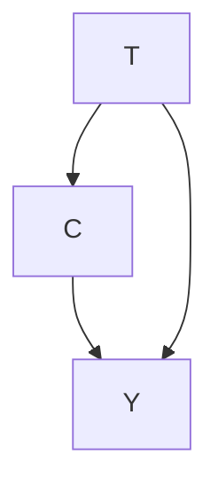
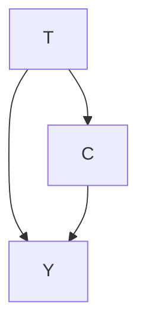
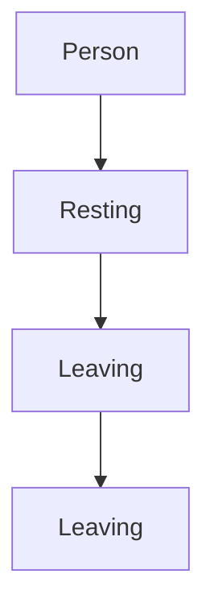

# Motivation: Why You Might Care

## 1.1 Simpson's Paradox

Consider a purely hypothetical future where there is a new disease known as COVID-27 that is prevalent in the human population. In this purely hypothetical future, there are two treatments that have been developed: treatment A and treatment B. Treatment B is more scarce than treatment A, so the split of those currently receiving treatment A vs. treatment B is roughly 73%/27%. You are in charge of choosing which treatment your country will exclusively use, in a country that only cares about minimizing loss of life.

You have data on the percentage of people who die from COVID-27, given the treatment they were assigned and given their condition at the time treatment was decided. Their condition is a binary variable: either mild or severe. In this data, 16% of those who receive A die, whereas 19% of those who receive B die. However, when we examine the people with mild condition separately from the people with severe condition, the numbers reverse order. In the mild subpopulation, 15% of those who receive A die, whereas 10% of those who receive B die. In the severe subpopulation, 30% of those who receive A die, whereas 20% of those who receive B die. We depict these percentages and the corresponding counts in Table 1.1.

<table><tr><td rowspan="4">Treatment</td><td></td><td colspan="3">Condition</td></tr><tr><td></td><td>Mild</td><td>Severe</td><td>Total</td></tr><tr><td>A</td><td>15%(210/1400)</td><td>30%(30/100)</td><td>16%(240/1500)</td></tr><tr><td>B</td><td>10%(5/50)</td><td>20%(100/500)</td><td>19%(105/550)</td></tr></table>

The apparent paradox stems from the fact that, in Table 1.1, the “Total” column could be interpreted to mean that we should prefer treatment A, whereas the “Mild” and “Severe” columns could both be interpreted to mean that we should prefer treatment B. $^{1}$ In fact, the answer is that if we know someone’s condition, we should give them treatment B, and if we do not know their condition, we should give them treatment A. Just kidding... that doesn’t make any sense. So really, what treatment should you choose for your country?

Either treatment A or treatment B could be the right answer, depending on the causal structure of the data. In other words, causality is essential to solve Simpson's paradox. For now, we will just give the intuition for when you should prefer treatment A vs. when you should prefer treatment B, but it will be made more formal in Chapter 4.

1.1 Simpson's Paradox ..... 1  
1.2 Applications of Causal Inference 2  
1.3 Correlation Does Not Imply Causation .... 3

Nicolas Cage and Pool
Drownings .... 3

Why is Association Not Cau-sation? 4

1.4 Main Themes ..... 5

Table 1.1: Simpson's paradox in COVID-27 data. The percentages denote the mortality rates in each of the groups. Lower is better. The numbers in parentheses are the corresponding counts. This apparent paradox stems from the interpretation that treatment A looks better when examining the whole population, but treatment B looks better in all subpopulations.

$^{1}$ A key ingredient necessary to find Simpson's paradox is the non-uniformity of allocation of people to the groups. 1400 of the 1500 people who received treatment A had mild condition, whereas 500 of the 550 people who received treatment B had severe condition. Because people with mild condition are less likely to die, this means that the total mortality rate for those with treatment A is lower than what it would have been if mild and severe conditions were equally split among them. The opposite bias is true for treatment B.

Scenario 1 If the condition C is a cause of the treatment T (Figure 1.1), treatment B is more effective at reducing mortality Y. An example scenario is where doctors decide to give treatment A to most people who have mild conditions. And they save the more expensive and more limited treatment B for people with severe conditions. Because having severe condition causes one to be more likely to die $(C \rightarrow Y$ in Figure 1.1) and causes one to be more likely to receive treatment B $(C \rightarrow T$ in Figure 1.1), treatment B will be associated with higher mortality in the total population. In other words, treatment B is associated with a higher mortality rate simply because condition is a common cause of both treatment and mortality. Here, condition confounds the effect of treatment on mortality. To correct for this confounding, we must examine the relationship of T and Y among patients with the same conditions. This means that the better treatment is the one that yields lower mortality in each of the subpopulations (the “Mild” and “Severe” columns in Table 1.1): treatment B.

Scenario 2 If the prescription $^{2}$ of treatment T is a cause of the condition C (Figure 1.2), treatment A is more effective. An example scenario is where treatment B is so scarce that it requires patients to wait a long time after they were prescribed the treatment before they can receive the treatment. Treatment A does not have this problem. Because the condition of a patient with COVID-27 worsens over time, the prescription of treatment B actually causes patients with mild conditions to develop severe conditions, causing a higher mortality rate. Therefore, even if treatment B is more effective than treatment A once administered (positive effect along $T \rightarrow Y$ in Figure 1.2), because prescription of treatment B causes worse conditions (negative effect along $T \rightarrow C \rightarrow Y$ in Figure 1.2), treatment B is less effective in total. Note: Because treatment B is more expensive, treatment B is prescribed with 0.27 probability, while treatment A is prescribed with 0.73 probability; importantly, treatment prescription is independent of condition in this scenario.

In sum, the more effective treatment is completely dependent on the causal structure of the problem. In Scenario 1, where C was a cause of T (Figure 1.1), treatment B was more effective. In Scenario 2, where T was a cause of C (Figure 1.2), treatment A was more effective. Without causality, Simpson's paradox cannot be resolved. With causality, it is not a paradox at all.

## 1.2 Applications of Causal Inference

Causal inference is essential to science, as we often want to make causal claims, rather than merely associational claims. For example, if we are choosing between treatments for a disease, we want to choose the treatment that causes the most people to be cured, without causing too many bad side effects. If we want a reinforcement learning algorithm to maximize reward, we want it to take actions that cause it to achieve the maximum reward. If we are studying the effect of social media on mental health, we are trying to understand what the main causes of a given mental health outcome are and order these causes by the percentage of the outcome that can be attributed to each cause.

Figure 1.1: Causal structure of scenario 1, where condition C is a common cause of treatment T and mortality Y. Given this causal structure, treatment B is preferable.

$^{2}$ T refers to the prescription of the treatment, rather than the subsequent reception of the treatment.

Figure 1.2: Causal structure of scenario 2, where treatment T is a cause of condition C. Given this causal structure, treatment A is preferable.

Causal inference is essential for rigorous decision-making. For example, say we are considering several different policies to implement to reduce greenhouse gas emissions, and we must choose just one due to budget constraints. If we want to be maximally effective, we should carry out causal analysis to determine which policy will cause the largest reduction in emissions. As another example, say we are considering several interventions to reduce global poverty. We want to know which policies will cause the largest reductions in poverty.

Now that we've gone through the general example of Simpson's paradox and a few specific examples in science and decision-making, we'll move to how causal inference is so different from prediction.

## 1.3 Correlation Does Not Imply Causation

Many of you will have heard the mantra “correlation does not imply causation.” In this section, we will quickly review that and provide you with a bit more intuition about why this is the case.

## 1.3.1 Nicolas Cage and Pool Drownings

It turns out that the yearly number of people who drown by falling into swimming pools has a high degree of correlation with the yearly number of films that Nicolas Cage appears in $[1]$ . See Figure 1.3 for a graph of this data. Does this mean that Nicolas Cage encourages bad swimmers to hop in the pool in his films? Or does Nicolas Cage feel more motivated to act in more films when he sees how many drownings are happening that year, perhaps to try to prevent more drownings? Or is there some other explanation? For example, maybe Nicolas Cage is interested in increasing his popularity among causal inference practitioners, so he travels back in time to convince his past self to do just the right number of movies for us to see this correlation, but not too close of a match as that would arouse suspicion and potentially cause someone to prevent him from rigging the data this way. We may never know for sure.

[1]: Vigen (2015), Spurious correlations

Of course, all of the possible explanations in the preceding paragraph seem quite unlikely. Rather, it is likely that this is a spurious correlation, where there is no causal relationship. We'll soon move on to a more illustrative example that will help clarify how spurious correlations can arise.

## 1.3.2 Why is Association Not Causation?

Before moving to the next example, let's be a bit more precise about terminology. "Correlation" is often colloquially used as a synonym for statistical dependence. However, "correlation" is technically only a measure of linear statistical dependence. We will largely be using the term association to refer to statistical dependence from now on.

Causation is not all or none. For any given amount of association, it does not need to be “all of the association is causal” or “none of the association is causal.” Rather, it is possible to have a large amount of association with only some of it being causal. The phrase “association is not causation” simply means that the amount of association and the amount of causation can be different. Some amount of association and zero causation is a special case of “association is not causation.”

Say you happen upon some data that relates wearing shoes to bed and waking up with a headache, as one does. It turns out that most times that someone wears shoes to bed, that person wakes up with a headache. And most times someone doesn't wear shoes to bed, that person doesn't wake up with a headache. It is not uncommon for people to interpret data like this (with associations) as meaning that wearing shoes to bed causes people to wake up with headaches, especially if they are looking for a reason to justify not wearing shoes to bed. A careful journalist might make claims like “wearing shoes to bed is associated with headaches” or “people who wear shoes to bed are at higher risk of waking up with headaches.” However, the main reason to make claims like that is that most people will internalize claims like that as “if I wear shoes to bed, I'll probably wake up with a headache.”

We can explain how wearing shoes to bed and headaches are associated without either being a cause of the other. It turns out that they are both caused by a common cause: drinking the night before. We depict this in Figure 1.4. You might also hear this kind of variable referred to as a “confounder” or a “lurking variable.” We will call this kind of association confounding association since the association is facilitated by a confounder.

The total association observed can be made up of both confounding association and causal association. It could be the case that wearing shoes to bed does have some small causal effect on waking up with a headache. Then, the total association would not be solely confounding association nor solely causal association. It would be a mixture of both. For example, in Figure 1.4, causal association flows along the arrow from shoe-sleeping to waking up with a headache. And confounding association flows along the path from shoe-sleeping to drinking to headachening (waking up with a headache). We will make the graphical interpretation of these different kinds of association clear in Chapter 3.

Figure 1.4: Causal structure, where drinking the night before is a common cause of sleeping with shoes on and of waking up with a headaches.

The Main Problem The main problem motivating causal inference is that association is not causation. $^{3}$ If the two were the same, then causal inference would be easy. Traditional statistics and machine learning would already have causal inference solved, as measuring causation would be as simple as just looking at measures such as correlation and predictive performance in data. A large portion of this book will be about better understanding and solving this problem.

## 1.4 Main Themes

There are several overarching themes that will keep coming up throughout this book. These themes will largely be comparisons of two different categories. As you are reading, it is important that you understand which categories different sections of the book fit into and which categories they do not fit into.

Statistical vs. Causal Even with an infinite amount of data, we sometimes cannot compute some causal quantities. In contrast, much of statistics is about addressing uncertainty in finite samples. When given infinite data, there is no uncertainty. However, association, a statistical concept, is not causation. There is more work to be done in causal inference, even after starting with infinite data. This is the main distinction motivating causal inference. We have already made this distinction in this chapter and will continue to make this distinction throughout the book.

Identification vs. Estimation Identification of causal effects is unique to causal inference. It is the problem that remains to solve, even when we have infinite data. However, causal inference also shares estimation with traditional statistics and machine learning. We will largely begin with identification of causal effects (in Chapters 2, 4 and 6) before moving to estimation of causal effects (in Chapter 7). The exceptions are Section 2.5 and Section 4.6.2, where we carry out complete examples with estimation to give you an idea of what the whole process looks like early on.

Interventional vs. Observational If we can intervene/experiment, identification of causal effects is relatively easy. This is simply because we can actually take the action that we want to measure the causal effect of and simply measure the effect after we take that action. Observational data is where it gets more complicated because confounding is almost always introduced into the data.

Assumptions There will be a large focus on what assumptions we are using to get the results that we get. Each assumption will have its own box to help make it difficult to not notice. Clear assumptions should make it easy to see where critiques of a given causal analysis or causal model will be. The hope is that presenting assumptions clearly will lead to more lucid discussions about causality.

$^{3}$ As we'll see in Chapter 5, if we randomly assign the treatment in a controlled experiment, association actually is causation.