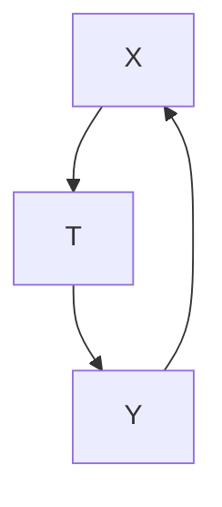
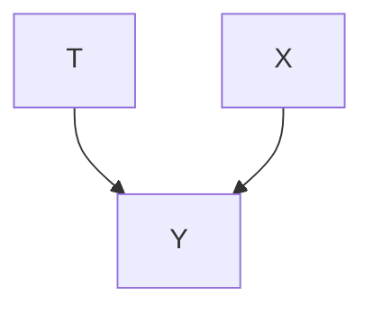
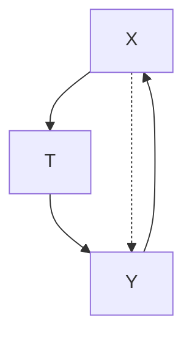
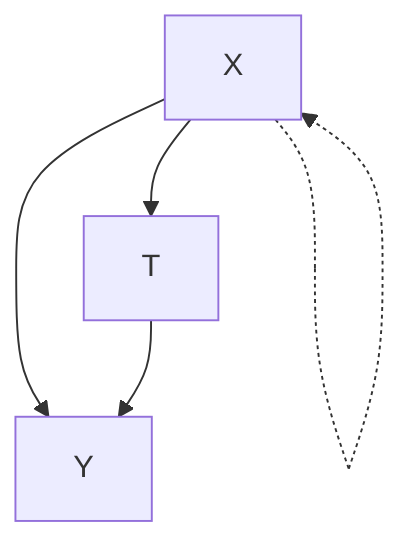
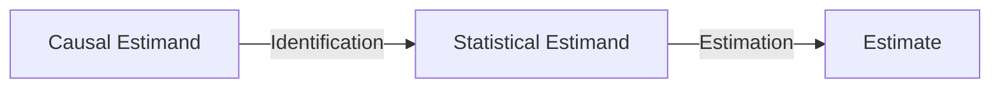

# Potential Outcomes

In this chapter, we will ease into the world of causality. We will see that new concepts and corresponding notations need to be introduced to clearly describe causal concepts. These concepts are “new” in the sense that they may not exist in traditional statistics or math, but they should be familiar in that we use them in our thinking and describe them with natural language all the time.

Familiar statistical notation We will use T to denote the random variable for treatment, Y to denote the random variable for the outcome of interest and X to denote covariates. In general, we will use uppercase letters to denote random variables (except in maybe one case) and lowercase letters to denote values that random variables take on. Much of what we consider will be settings where T is binary. Know that, in general, we can extend things to work in settings where T can take on more than two values or where T is continuous.

## 2.1 Potential Outcomes and Individual Treatment Effects

We will now introduce the first causal concept to appear in this book. These concepts are sometimes characterized as being unique to the Neyman-Rubin $[2–4]$ causal model (or potential outcomes framework), but they are not. For example, these same concepts are still present (just under different notation) in the framework that uses causal graphs (Chapters 3 and 4). It is important that you spend some time ensuring that you understand these initial causal concepts. If you have not studied causal inference before, they will be unfamiliar to see in mathematical contexts, though they may be quite familiar intuitively because we commonly think and communicate in causal language.

Scenario 1 Consider the scenario where you are unhappy. And you are considering whether or not to get a dog to help make you happy. If you become happy after you get the dog, does this mean the dog caused you to be happy? Well, what if you would have also become happy had you not gotten the dog? In that case, the dog was not necessary to make you happy, so its claim to a causal effect on your happiness is weak.

Scenario 2 Let's switch things up a bit. Consider that you will still be happy if you get a dog, but now, if you don't get a dog, you will remain unhappy. In this scenario, the dog has a pretty strong claim to a causal effect on your happiness.

In both the above scenarios, we have used the causal concept known as potential outcomes. Your outcome Y is happiness: Y = 1 corresponds to happy while Y = 0 corresponds to unhappy. Your treatment T is whether or not you get a dog: T = 1 corresponds to you getting a dog while T = 0

2.1 Potential Outcomes and Individual Treatment Effects . 6

2.2 The Fundamental Problem of Causal Inference .... 7

2.3 Getting Around the Fundamental Problem ..... 8

Average Treatment Effects and Missing Data Interpretation 8

Ignorability and Exchangeability 9

Conditional Exchangeability and Unconfoundedness . 10

Positivity/Overlap and Ex-trapolation ..... 12

No interference, Consistency, and SUTVA ..... 13

Tying It All Together ..... 14

2.4 Fancy Statistics Terminology Defancified ..... 15

2.5 A Complete Example with Estimation ..... 16

[2]: Splawa-Neyman (1923 [1990]), 'On the Application of Probability Theory to Agricultural Experiments. Essay on Principles. Section 9.'

[3]: Rubin (1974), 'Estimating causal effects of treatments in randomized and nonrandomized studies.'

[4]: Sekhon (2008), 'The Neyman-Rubin Model of Causal Inference and Estimation via Matching Methods'corresponds to you not getting a dog. We denote by $Y(1)$ the potential outcome of happiness you would observe if you were to get a dog (T = 1). Similarly, we denote by $Y(0)$ the potential outcome of happiness you would observe if you were to not get a dog (T = 0). In scenario 1, $Y(1) = 1$ and $Y(0) = 1$ . In contrast, in scenario 2, $Y(1) = 1$ and $Y(0) = 0$ .

More generally, the potential outcome $Y(t)$ denotes what your outcome would be, if you were to take treatment t. A potential outcome $Y(t)$ is distinct from the observed outcome Y in that not all potential outcomes are observed. Rather all potential outcomes can potentially be observed. The one that is actually observed depends on the value that the treatment T takes on.

In the previous scenarios, there was only a single individual in the whole population: you. However, generally, there are many individuals $^{1}$ in the population of interest. We will denote the treatment, covariates, and outcome of the $i_{th}$ individual using $T_i$ , $X_i$ , and $Y_i$ . Then, we can define the individual treatment effect (ITE) $^{2}$ for individual i:

$$
\tau_ {i} \triangleq Y _ {i} (1) - Y _ {i} (0) \tag {2.1}
$$

Whenever there is more than one individual in a population, $Y(t)$ is a random variable because different individuals will have different potential outcomes. In contrast, $Y_{i}(t)$ is usually treated as non-random $^{3}$ because the subscript i means that we are conditioning on so much individualized (and context-specific) information, that we restrict our focus to a single individual (in a specific context) whose potential outcomes are deterministic.

ITEs are some of the main quantities that we care about in causal inference. For example, in scenario 2 above, you would choose to get a dog because the causal effect of getting a dog on your happiness is positive: $Y(1) - Y(0) = 1 - 0 = 1$ . In contrast, in scenario 1, you might choose to not get a dog because there is no causal effect of getting a dog on your happiness: $Y(1) - Y(0) = 1 - 1 = 0$ .

Now that we've introduced potential outcomes and ITEs, we can introduce the main problems that pop up in causal inference that are not present in fields where the main focus is on association or prediction.

## 2.2 The Fundamental Problem of Causal Inference

It is impossible to observe all potential outcomes for a given individual [3]. Consider the dog example. You could observe $Y(1)$ by getting a dog and observing your happiness after getting a dog. Alternatively, you could observe $Y(0)$ by not getting a dog and observing your happiness. However, you cannot observe both $Y(1)$ and $Y(0)$ , unless you have a time machine that would allow you to go back in time and choose the version of treatment that you didn't take the first time. You cannot simply get a dog, observe $Y(1)$ , give the dog away, and then observe $Y(0)$ because the second observation will be influenced by all the actions you took between the two observations and anything else that changed since the first observation.

$^{1}$ “Unit” is often used in the place of “individual” as the units of the population are not always people.  
$^{2}$ The ITE is also known as the individual causal effect, unit-level causal effect, or unit-level treatment effect.  
$^{3}$ Though, $Y_{i}(t)$ can be treated as random.

[3]: Rubin (1974), 'Estimating causal effects of treatments in randomized and nonrandomized studies.'This is known as the fundamental problem of causal inference [5]. It is fundamental because if we cannot observe both $Y_{i}(1)$ and $Y_{i}(0)$ , then we cannot observe the causal effect $Y_{i}(1) - Y_{i}(0)$ . This problem is unique to causal inference because, in causal inference, we care about making causal claims, which are defined in terms of potential outcomes. For contrast, consider machine learning. In machine learning, we often only care about predicting the observed outcome Y, so there is no need for potential outcomes, which means machine learning does not have to deal with this fundamental problem that we must deal with in causal inference.

The potential outcomes that you do not (and cannot) observe are known as counterfactuals because they are counter to fact (reality). “Potential outcomes” are sometimes referred to as “counterfactual outcomes,” but we will never do that in this book because a potential outcome $Y(t)$ does not become counter to fact until another potential outcome $Y(t')$ is observed. The potential outcome that is observed is sometimes referred to as a factual. Note that there are no counterfactuals or factuals until the outcome is observed. Before that, there are only potential outcomes.

## 2.3 Getting Around the Fundamental Problem

I suspect this section is where this chapter might start to get a bit unclear. If that is the case for you, don't worry too much, and just continue to the next chapter, as it will build up parallel concepts in a hopefully more intuitive way.

## 2.3.1 Average Treatment Effects and Missing Data Interpretation

We know that we can't access individual treatment effects, but what about average treatment effects? We get the average treatment effect (ATE) $^{4}$ by taking an average over the ITEs:

$$
\tau \triangleq \mathbb {E} [ Y _ {i} (1) - Y _ {i} (0) ] = \mathbb {E} [ Y (1) - Y (0) ], \tag {2.2}
$$

where the average is over the individuals i if $Y_{i}(t)$ is deterministic. If $Y_{i}(t)$ is random, the average is also over any other randomness.

Okay, but how would we actually compute the ATE? Let's look at some made-up data in Table 2.1 for this. If you like examples, feel free to substitute in the COVID-27 example from Section 1.1 or the dog-happiness example from Section 2.1. We will take this table as the whole population of interest. Because of the fundamental problem of causal inference, this is fundamentally a missing data problem. All of the question marks in the table indicate that we do not observe that cell.

A natural quantity that comes to mind is the associational difference: $E[Y|T=1]-E[Y|T=0]$ . By linearity of expectation, we have that the ATE $E[Y(1)-Y(0)]=E[Y(1)]-E[Y(0)]$ . Then, maybe $E[Y(1)]-E[Y(0)]$ equals $E[Y|T=1]-E[Y|T=0]$ . Unfortunately, this is not true in general. If it were, that would mean that causation is simply association. $E[Y|T=1]-E[Y|T=0]$ is an associational quantity, whereas $E[Y(1)]-E[Y(0)]$

[5]: Holland (1986), 'Statistics and Causal Inference'

$^{4}$ The ATE is also known as the “average causal effect (ACE).”

<table><tr><td>i</td><td>T</td><td>Y</td><td>Y(1)</td><td>Y(0)</td><td>Y(1) - Y(0)</td></tr><tr><td>1</td><td>0</td><td>0</td><td>?</td><td>0</td><td>?</td></tr><tr><td>2</td><td>1</td><td>1</td><td>1</td><td>?</td><td>?</td></tr><tr><td>3</td><td>1</td><td>0</td><td>0</td><td>?</td><td>?</td></tr><tr><td>4</td><td>0</td><td>0</td><td>?</td><td>0</td><td>?</td></tr><tr><td>5</td><td>0</td><td>1</td><td>?</td><td>1</td><td>?</td></tr><tr><td>6</td><td>1</td><td>1</td><td>1</td><td>?</td><td>?</td></tr></table>

is a causal quantity. They are not equal due to confounding, which we discussed in Section 1.3. The graphical interpretation of this, depicted in Figure 2.1, is that X confounds the effect of T on Y because there is this $T \leftarrow X \rightarrow Y$ path that non-causal association flows along. $^{5}$

## 2.3.2 Ignorability and Exchangeability

Well, what assumption(s) would make it so that the ATE is simply the associational difference? This is equivalent to saying “what makes it valid to calculate the ATE by taking the average of the $Y(0)$ column, ignoring the question marks, and subtracting that from the average of the $Y(1)$ column, ignoring the question marks?” $^{6}$ This ignoring of the question marks (missing data) is known as ignorability. Assuming ignorability is like ignoring how people ended up selecting the treatment they selected and just assuming they were randomly assigned their treatment; we depict this graphically in Figure 2.2 by the lack of a causal arrow from X to T. We will now state this assumption formally.

Assumption 2.1 (Ignorability / Exchangeability)

$$
(Y (1), Y (0)) \perp T
$$

This assumption is key to causal inference because it allows us to reduce the ATE to the associational difference:

$$
\mathbb {E} [ Y (1) ] - \mathbb {E} [ Y (0) ] = \mathbb {E} [ Y (1) \mid T = 1 ] - \mathbb {E} [ Y (0) \mid T = 0 ] \tag {2.3}
$$

$$
= \mathbb {E} [ Y \mid T = 1 ] - \mathbb {E} [ Y \mid T = 0 ] \tag {2.4}
$$

The ignorability assumption is used in Equation 2.3. We will talk more about Equation 2.4 when we get to Section 2.3.5.

Another perspective on this assumption is that of exchangeability. Exchangeability means that the treatment groups are exchangeable in the sense that if they were swapped, the new treatment group would observe the same outcomes as the old treatment group, and the new control group would observe the same outcomes as the old control group. Formally, this assumption means $\mathbb{E}[Y(1)|T=0]=\mathbb{E}[Y(1)|T=1]$ and $\mathbb{E}[Y(0)|T=1]=\mathbb{E}[Y(0)|T=0]$ , respectively. Then, this implies $\mathbb{E}[Y(1)|T=t]=\mathbb{E}[Y(1)]$ and $\mathbb{E}[Y(0)|T=t]=\mathbb{E}[Y(0)]$ , for all t, which is nearly equivalent $^{7}$ to Assumption 2.1.

An important intuition to have about exchangeability is that it guarantees that the treatment groups are comparable. In other words, the treatment groups are the same in all relevant aspects other than the treatment. This intuition is what underlies the concept of “controlling for” or “adjusting

Table 2.1: Example data to illustrate that the fundamental problem of causal inference can be interpreted as a missing data problem.




Figure 2.1: Causal structure of X confounding the effect of T on Y.

$^{5}$ Keep reading to Chapter 3, where we will flesh out and formalize this graphical interpretation.

$^{6}$ Active reading exercise: verify that this procedure is equivalent to $E[Y|T=1]-E[Y|T=0]$ in the data in Table 2.1.




Figure 2.2: Causal structure when the treatment assignment mechanism is ignorable. Notably, this means there's no arrow from X to T, which means there is no confounding.

$^{7}$ Technically, this is mean exchangeability, which is a weaker assumption than the full exchangeability that we describe in Assumption 2.1 because it only constrains the first moment of the distribution. Generally, we only need mean ignorability/exchangeability for average treatment effects, but it is common to assume complete independence, as in Assumption 2.1.

for" variables, which we will discuss shortly when we get to conditional exchangeability.

We have leveraged Assumption 2.1 to identify causal effects. To identify a causal effect is to reduce a causal expression to a purely statistical expression. In this chapter, that means to reduce an expression from one that uses potential outcome notation to one that uses only statistical notation such as T, X, Y, expectations, and conditioning. This means that we can calculate the causal effect from just the observational distribution $P(X, T, Y)$ .

Definition 2.1 (Identifiability) A causal quantity (e.g. $\mathbb{E}[Y(t)]$ ) is identifiable if we can compute it from a purely statistical quantity (e.g. $E[Y \mid t]$ ).

We have seen that ignorability is extremely important (Equation 2.3), but how realistic of an assumption is it? In general, it is completely unrealistic because there is likely to be confounding in most data we observe (causal structure shown in Figure 2.1). However, we can make this assumption realistic by running randomized experiments, which force the treatment to not be caused by anything but a coin toss, so then we have the causal structure shown in Figure 2.2. We cover randomized experiments in greater depth in Chapter 5.

We have covered two prominent perspectives on this main assumption (2.1): ignorability and exchangeability. Mathematically, these mean the same thing, but their names correspond to different ways of thinking about the same assumption. Exchangeability and ignorability are only two names for this assumption. We will see more aliases after we cover the more realistic, conditional version of this assumption.

## 2.3.3 Conditional Exchangeability and Unconfoundedness

In observational data, it is unrealistic to assume that the treatment groups are exchangeable. In other words, there is no reason to expect that the groups are the same in all relevant variables other than the treatment. However, if we control for relevant variables by conditioning, then maybe the subgroups will be exchangeable. We will clarify what the “relevant variables” are in Chapter 3, but for now, let’s just say they are all of the covariates X. Then, we can state conditional exchangeability formally.

Assumption 2.2 (Conditional Exchangeability / Unconfoundedness)

$$
(Y (1), Y (0)) \perp T \mid X
$$

The idea is that although the treatment and potential outcomes may be unconditionally associated (due to confounding), within levels of X, they are not associated. In other words, there is no confounding within levels of X because controlling for X has made the treatment groups comparable. We'll now give a bit of graphical intuition for the above. We will not draw the rigorous connection between the graphical intuition and Assumption 2.2 until Chapter 3; for now, it is just meant to aid intuition.

We do not have exchangeability in the data because X is a common cause of T and Y. We illustrate this in Figure 2.3. Because X is a common cause of T and Y, there is non-causal association between T and Y. This non-causal association flows along the $T \leftarrow X \rightarrow Y$ path; we depict this with a red dashed arc.

However, we do have conditional exchangeability in the data. This is because, when we condition on X, there is no longer any non-causal association between T and Y. The non-causal association is now “blocked” at X by conditioning on X. We illustrate this blocking in Figure 2.4 by shading X to indicate it is conditioned on and by showing the red dashed arc being blocked there.

Conditional exchangeability is the main assumption necessary for causal inference. Armed with this assumption, we can identify the causal effect within levels of X, just like we did with (unconditional) exchangeability:

$$
\begin{array}{l} \mathbb {E} [ Y (1) - Y (0) \mid X ] = \mathbb {E} [ Y (1) \mid X ] - \mathbb {E} [ Y (0) \mid X ] (2.5) \\ = \mathbb {E} [ Y (1) \mid T = 1, X ] - \mathbb {E} [ Y (0) \mid T = 0, X ] (2.6) \\ = \mathbb {E} [ Y \mid T = 1, X ] - \mathbb {E} [ Y \mid T = 0, X ] (2.7) \\ \end{array}
$$

In parallel to before, we get Equation 2.5 by linearity of expectation. And we now get Equation 2.6 by conditional exchangeability. If we want the marginal effect that we had before when assuming (unconditional) exchangeability, we can get that by simply marginalizing out X:

$$
\mathbb {E} [ Y (1) - Y (0) ] = \mathbb {E} _ {X} \mathbb {E} [ Y (1) - Y (0) \mid X ] \tag {2.8}
$$

$$
= \mathbb {E} _ {X} \left[ \mathbb {E} [ Y \mid T = 1, X ] - \mathbb {E} [ Y \mid T = 0, X ] \right] \tag {2.9}
$$

This marks an important result for causal inference, so we'll give it its own proposition box. The proof we give above leaves out some details. Read through to Section 2.3.6 (where we redo the proof with all details specified) to get the rest of the details. We will call this result the adjustment formula.

Theorem 2.1 (Adjustment Formula) Given the assumptions of unconfoundedness, positivity, consistency, and no interference, we can identify the average treatment effect:

$$
\mathbb {E} [ Y (1) - Y (0) ] = \mathbb {E} _ {X} \left[ \mathbb {E} [ Y \mid T = 1, X ] - \mathbb {E} [ Y \mid T = 0, X ] \right]
$$

Conditional exchangeability (Assumption 2.2) is a core assumption for causal inference and goes by many names. For example, the following are reasonably commonly used to refer to the same assumption: unconfoundedness, conditional ignorability, no unobserved confounding, selection on observables, no omitted variable bias, etc. We will use the name “unconfoundedness” a fair amount throughout this book.

The main reason for moving from exchangeability (Assumption 2.1) to conditional exchangeability (Assumption 2.2) was that it seemed like a more realistic assumption. However, we often cannot know for certain if conditional exchangeability holds. There may be some unobserved confounders that are not part of X, meaning conditional exchangeability is violated. Fortunately, that is not a problem in randomized experiments (Chapter 5). Unfortunately, it is something that we must always be conscious of in observational data. Intuitively, the best thing we can do is to observe and fit as many covariates into X as possible to try to ensure unconfoundedness. $^{8}$




Figure 2.3: Causal structure of X confounding the effect of T on Y. We depict the confounding with a red dashed line.




Figure 2.4: Illustration of conditioning on X leading to no confounding.

## 2.3.4 Positivity/Overlap and Extrapolation

While conditioning on many covariates is attractive for achieving unconfoundedness, it can actually be detrimental for another reason that has to do with another important assumption that we have yet to discuss: positivity. We will get to why at the end of this section. Positivity is the condition that all subgroups of the data with different covariates have some probability of receiving any value of treatment. Formally, we define positivity for binary treatment as follows.

Assumption 2.3 (Positivity / Overlap / Common Support) For all values of covariates x present in the population of interest (i.e. x such that $P(X = x) > 0$ ),

$$
0 <   P (T = 1 \mid X = x) <   1
$$

To see why positivity is important, let's take a closer look at Equation 2.9:

$$
\mathbb {E} [ Y (1) - Y (0) ] = \mathbb {E} _ {X} \left[ \mathbb {E} [ Y \mid T = 1, X ] - \mathbb {E} [ Y \mid T = 0, X ] \right] \tag {2.9revisited}
$$

In short, if we have a positivity violation, then we will be conditioning on a zero probability event. This is because there will be some value of x with non-zero probability for which $P(T = 1 \mid X = x) = 0$ or $P(T = 0 \mid X = x) = 0$ . This means that for some value of x that we are marginalizing out in the above equation, $P(T = 1, X = x) = 0$ or $P(T = 0, X = x) = 0$ , and these are the two events that we condition on in Equation 2.9.

To clearly see how a positivity violation translates to division by zero, let's rewrite the right-hand side of Equation 2.9. For discrete covariates and outcome, it can be rewritten as follows:

$$
\sum_ {x} P (X = x) \left(\sum_ {y} y P (Y = y \mid T = 1, X = x) - \sum_ {y} y P (Y = y \mid T = 0, X = x)\right) \tag {2.10}
$$

Then, applying Bayes' rule, this can be further rewritten:

$$
\sum_ {x} P (X = x) \left(\sum_ {y} y \frac {P (Y = y , T = 1 , X = x)}{P (T = 1 \mid X = x) P (X = x)} - \sum_ {y} y \frac {P (Y = y , T = 0 , X = x)}{P (T = 0 \mid X = x) P (X = x)}\right) \tag {2.11}
$$

In Equation 2.11, we can clearly see why positivity is essential. If $P(T = 1 \mid X = x) = 0$ for any level of covariates $x$ with non-zero probability, then there is division by zero in the first term in the equation, so $\mathbb{E}_X\mathbb{E}[Y \mid T = 1, X]$ is undefined. Similarly, if $P(T = 1 \mid X = x) = 1$ for any level of $x$ , then $P(T = 0 \mid X = x) = 0$ , so there is division by zero in the second term and $\mathbb{E}_X\mathbb{E}[Y \mid T = 0, X]$ is undefined. With either of these violations of the positivity assumption, the causal effect is undefined.

$^{8}$ As we will see in Chapters 3 and 4, it is not necessarily true that conditioning on more covariates always helps our causal estimates be less biased.

Intuition That's the math for why we need the positivity assumption, but what's the intuition? Well, if we have a positivity violation, that means that within some subgroup of the data, everyone always receives treatment or everyone always receives the control. It wouldn't make sense to be able to estimate a causal effect of treatment vs. control in that subgroup since we see only treatment or only control. We never see the alternative in that subgroup.

Another name for positivity is overlap. The intuition for this name is that we want the covariate distribution of the treatment group to overlap with the covariate distribution of the control group. More specifically, we want $P(X \mid T = 1)^{9}$ to have the same support as $P(X \mid T = 0)$ . $^{10}$ This is why another common alias for positivity is common support.

The Positivity-Unconfoundedness Tradeoff Although conditioning on more covariates could lead to a higher chance of satisfying unconfoundedness, it can lead to a higher chance of violating positivity. As we increase the dimension of the covariates, we make the subgroups for any level x of the covariates smaller. $^{11}$ As each subgroup gets smaller, there is a higher and higher chance that either the whole subgroup will have treatment or the whole subgroup will have control. For example, once the size of any subgroup has decreased to one, positivity is guaranteed to not hold. See [6] for a rigorous argument of high-dimensional covariates leading to positivity violations.

Extrapolation Violations of the positivity assumption can actually lead to demanding too much from models and getting very bad behavior in return. Many causal effect estimators $^{12}$ fit a model to $E[Y|t,x]$ using the $(t,x,y)$ tuples as data. The inputs to these models are $(t,x)$ pairs and the outputs are the corresponding outcomes. These models will be forced to extrapolate in regions (using their parametric assumptions) where $P(T=1,X=x)=0$ and regions where $P(T=0,X=x)=0$ when they are used in the adjustment formula (Theorem 2.1) in place of the corresponding conditional expectations.

## 2.3.5 No interference, Consistency, and SUTVA

There are a few additional assumptions we've been smuggling in throughout this chapter. We will specify all the rest of these assumptions in this section. The first assumption in this section is that of no interference. No interference means that my outcome is unaffected by anyone else's treatment. Rather, my outcome is only a function of my own treatment. We've been using this assumption implicitly throughout this chapter. We'll now formalize it.

## Assumption 2.4 (No Interference)

$$
Y _ {i} (t _ {1}, \ldots , t _ {i - 1}, t _ {i}, t _ {i + 1}, \ldots , t _ {n}) = Y _ {i} (t _ {i})
$$

Of course, this assumption could be violated. For example, if the treatment is “get a dog” and the outcome is my happiness, it could easily be that my happiness is influenced by whether or not my friends get dogs because we could end up hanging out more to have our dogs play together. As you

$^{9}$ Whenever we use a random variable (denoted by a capital letter) as the argument for P, we are referring to the whole distribution, rather than just the scalar that something like $P(x \mid T = 1)$ refers to.  
$^{10}$ Active reading exercise: convince yourself that this formulation of overlap/positivity is equivalent to the formulation in Assumption 2.3.  
$^{11}$ This is related to the curse of dimensionality.  
[6]: D'Amour et al. (2017), Overlap in Observational Studies with High-Dimensional Covariates  
$^{12}$ An “estimator” is a function that takes a dataset as input and outputs an estimate. We discuss this statistics terminology more in Section 2.4.

might expect, violations of the no interference assumption are rampant in network data.

The last assumption is consistency. Consistency is the assumption that the outcome we observe Y is actually the potential outcome under the observed treatment T.

Assumption 2.5 (Consistency) If the treatment is T, then the observed outcome Y is the potential outcome under treatment T. Formally,

$$
T = t \implies Y = Y (t) \tag {2.12}
$$

We could write this equivalently as follow:

$$
Y = Y (T) \tag {2.13}
$$

Note that T is different from t, and $Y(T)$ is different from $Y(t)$ . T is a random variable that corresponds to the observed treatment, whereas t is a specific value of treatment. Similarly, $Y(t)$ is the potential outcome for some specific value of treatment, whereas $Y(T)$ is the potential outcome for the actual value of treatment that we observe.

When we were using exchangeability to prove identifiability, we actually assumed consistency in Equation 2.4 to get the follow equality:

$$
\mathbb {E} [ Y (1) \mid T = 1 ] - \mathbb {E} [ Y (0) \mid T = 0 ] = \mathbb {E} [ Y \mid T = 1 ] - \mathbb {E} [ Y \mid T = 0 ]
$$

Similarly, when we were using conditional exchangeability to prove identifiability, we assumed consistency in Equation 2.7.

It might seem like consistency is obviously true, but that is not always the case. For example, if the treatment specification is simply “get a dog” or “don’t get a dog,” this can be too coarse to yield consistency. It might be that if I were to get a puppy, I would observe Y = 1 (happiness) because I needed an energetic friend, but if I were to get an old, low-energy dog, I would observe Y = 0 (unhappiness). However, both of these treatments fall under the category of “get a dog,” so both correspond to T = 1. This means that Y(1) is not well defined, since it will be 1 or 0, depending on something that is not captured by the treatment specification. In this sense, consistency encompasses the assumption that is sometimes referred to as “no multiple versions of treatment.” See Sections 3.4 and 3.5 of Hernán and Robins [7] and references therein for more discussion on this topic.

SUTVA You will also commonly see the stable unit-treatment value assumption (SUTVA) in the literature. SUTVA is satisfied if unit (individual) i's outcome is simply a function of unit i's treatment. Therefore, SUTVA is a combination of consistency and no interference (and also deterministic potential outcomes). $^{13}$

## 2.3.6 Tying It All Together

We introduced unconfoundedness (conditional exchangeability) first because it is the main causal assumption. However, all of the assumptions are necessary:

[7]: Hernán and Robins (2020), Causal Inference: What If

$^{13}$ Active reading exercise: convince yourself that SUTVA is a combination of consistency and no inference

1. Unconfoundedness (Assumption 2.2)  
2. Positivity (Assumption 2.3)  
3. No interference (Assumption 2.4)  
4. Consistency (Assumption 2.5)

We'll now review the proof of the adjustment formula (Theorem 2.1) that was done in Equation 2.5 through Equation 2.9 and list which assumptions are used for each step. Even before we get to these equations, we use the no interference assumption to justify that the quantity we should be looking at for causal inference is $\mathbb{E}[Y(1) - Y(0)]$ , rather than something more complex like the left-hand side of Assumption 2.4. In the proof below, the first two equalities follow from mathematical facts, whereas the last two follow from these key assumptions.

Proof of Theorem 2.1.

$$
\begin{array}{l} \mathbb {E} [ Y (1) - Y (0) ] = \mathbb {E} [ Y (1) ] - \mathbb {E} [ Y (0) ] \quad (\text { linearity   of   expectation }) \\ = \mathbb {E} _ {X} [ \mathbb {E} [ Y (1) \mid X ] - \mathbb {E} [ Y (0) \mid X ] ] \\ = \mathbb {E} _ {X} \left[ \mathbb {E} [ Y (1) \mid T = 1, X ] - \mathbb {E} [ Y (0) \mid T = 0, X ] \right] \\ = \mathbb {E} _ {X} \left[ \mathbb {E} [ Y \mid T = 1, X ] - \mathbb {E} [ Y \mid T = 0, X ] \right] \\ \end{array}
$$

(law of iterated expectations)

(unconfoundedness and positivity)

(consistency)


That's how all of these assumptions tie together to give us identifiability of the ATE. We'll soon see how to use this result to get an actual estimated number for the ATE.

## 2.4 Fancy Statistics Terminology Defancified

Before we start computing concrete numbers for the ATE, we must quickly introduce some terminology from statistics that will help clarify the discussion. An estimand is the quantity that we want to estimate. For example, $E_{X}$ [ $E[Y \mid T = 1, X] - E[Y \mid T = 0, X]$ ] is the estimand we care about for estimating the ATE. An estimate (noun) is an approximation of some estimand, which we get using data. We will see concrete numbers in the next section; these are estimates. Given some estimand $\alpha$ , we write an estimate of that estimand by simply putting a hat on it: $\hat{\alpha}$ . And an estimator is a function that maps a dataset to an estimate of the estimand. The process that we will use to go from data + estimand to a concrete number is known as estimation. To estimate (verb) is to feed data into an estimator to get an estimate.

In this book, we will use even more specific language that allows us to make the distinction between causal quantities and statistical quantities. We will use the phrase causal estimand to refer to any estimand that contains a potential outcome in it. We will use the phrase statistical estimand to denote the complement: any estimand that does not contain a potential outcome. $^{14}$ For an example, recall the adjustment formula(Theorem 2.1):

<!-- footnote -->

> - $^{14}$ As we will see in Chapter 4, we will equivalently refer to a causal estimand as any estimand that contains a do-operator, and we will refer to a statistical estimand as any estimand that does not contain a do-operator.

<!-- footnote end -->

$$
\mathbb {E} [ Y (1) - Y (0) ] = \mathbb {E} _ {X} \left[ \mathbb {E} [ Y \mid T = 1, X ] - \mathbb {E} [ Y \mid T = 0, X ] \right] \tag {2.14}
$$

$\mathbb{E}[Y(1)-Y(0)]$ is the causal estimand that we are interested in. In order to actually estimate this causal estimand, we must translate it into a statistical estimand: $\mathbb{E}_{X}[\mathbb{E}[Y\mid T=1,X]-\mathbb{E}[Y\mid T=0,X]]$ . $^{15}$

When we say “identification” in this book, we are referring to the process of moving from a causal estimand to an equivalent statistical estimand. When we say “estimation,” we are referring to the process of moving from a statistical estimand to an estimate. We illustrate this in the flowchart in Figure 2.5.

$^{15}$ Active reading exercise: Why can't we directly estimate a causal estimand without first translating it to a statistical estimand?




Figure 2.5: The Identification-Estimation Flowchart – a flowchart that illustrates the process of moving from a target causal estimand to a corresponding estimate, through identification and estimation.

What do we do when we go to actually estimate quantities such as $E_{X}$ [ $E[Y \mid T = 1, X] - E[Y \mid T = 0, X]$ ]? We will often use a model (e.g. linear regression or some more fancy predictor from machine learning) in place of the conditional expectations $E[Y \mid T = t, X = x]$ . We will refer to estimators that use models like this as model-assisted estimators. Now that we've gotten some of this terminology out of the way, we can proceed to an example of estimating the ATE.

## 2.5 A Complete Example with Estimation

Theorem 2.1 and the corresponding recent copy in Equation 2.14 give us identification. However, we haven't discussed estimation at all. In this section, we will give a short example complete with estimation. We will cover the topic of estimation of causal effects more completely in Chapter 7.

We use Luque-Fernandez et al. [8]'s example from epidemiology. The outcome Y of interest is (systolic) blood pressure. This is an important outcome because roughly 46% of Americans have high blood pressure, and high blood pressure is associated with increased risk of mortality [9]. The "treatment" T of interest is sodium intake. Sodium intake is a continuous variable; in order to easily apply Equation 2.14, which is specified for binary treatment, we will binarize T by letting T = 1 denote daily sodium intake above 3.5 grams and letting T = 0 denote daily sodium intake below 3.5 grams. $^{16}$ We will be estimating the causal effect of sodium intake on blood pressure. In our data, we also have the age of the individuals and amount of protein in their urine as covariates X. Luque-Fernandez et al. [8] run a simulation, taking care to be sure that the range of values is "biologically plausible and as close to reality as possible."

Because we are using data from a simulation, we know that the true ATE of sodium on blood pressure is 1.05. More concretely, the line of code that generates blood pressure Y looks as follows:

[8]: Luque-Fernandez et al. (2018), 'Educational Note: Paradoxical collider effect in the analysis of non-communicable disease epidemiological data: a reproducible illustration and web application'

[9]: Virani et al. (2020), 'Heart Disease and Stroke Statistics—2020 Update: A Report From the American Heart Association'

$^{16}$ As we will see, this binarization is purely pedagogical and does not reflect any limitations of adjusting for confounders.

Now, how do we actually estimate the ATE? First, we assume consistency, positivity, and unconfoundedness given X. As we recently recalled in Equation 2.14, this means that we've identified the ATE as

$$
\mathbb {E} _ {X} \left[ \mathbb {E} [ Y \mid T = 1, X ] - \mathbb {E} [ Y \mid T = 0, X ] \right].
$$

We then take that outer expectation over X and replace it with an empirical mean over the data, giving us the following:

$$
\frac {1}{n} \sum_ {i} [ \mathbb {E} [ Y \mid T = 1, X = x _ {i} ] - \mathbb {E} [ Y \mid T = 0, X = x _ {i} ] ] \tag {2.15}
$$

To complete our estimator, we then fit some machine learning model to the conditional expectation $\mathbb{E}[Y\mid t,x]$ . Minimizing the mean-squared error (MSE) of predicting $Y$ from $(T,X)$ pairs is equivalent to modeling this conditional expectation [see, e.g., 10, Section 2.4]. Therefore, we can plug in any machine learning model for $\mathbb{E}[Y\mid t,x]$ , which gives us a model-assisted estimator. We'll use linear regression here, which works out nicely since blood pressure is generated as a linear combination of other variables, in this simulation. We give Python code for this below, where our data are in a Pandas DataFrame called df. We fit the model for $\mathbb{E}[Y\mid t,x]$ in line 8, and we take the empirical mean over $X$ in lines 10-14.

```python
import numpy as np
import pandas as pd
from sklearn.linear_model import LinearRegression

Xt = df[['sodium', 'age', 'proteinuria']]
y = df['blood_pressure']
model = LinearRegression()
model.fit(Xt, y)

Xt1 = pd.DataFrame.copy(Xt)
Xt1['sodium'] = 1
Xt0 = pd.DataFrame.copy(Xt)
Xt0['sodium'] = 0
ate_est = np.mean(model.predict(Xt1) - model.predict(Xt0))
print('ATE estimate:', ate_est)
```

This yields an ATE estimate of 0.85. If we were to naively regress Y on only T, which corresponds to replacing line 5 in Listing 2.1 with Xt = df[['sodium']] $^{17}$ , we would get an ATE estimate of 5.33. That's a $\frac{|5.33-1.05|}{1.05} \times 100\% = 407\%$ error! In contrast, when we control for X (as in Listing 2.1), our percent error is only $\frac{|.85-1.05|}{1.05} \times 100\% = 19\%$ .

All of the above is done using the adjustment formula with model-assisted estimation, where we first fit a model for the conditional expectation $E[Y \mid t, x]$ , and then we take an empirical mean over X, using that model. However, because we are using a linear model, this is equivalent to just taking the coefficient in front of T in the linear regression as the ATE estimate. This is what we do in the following code (which gives the exact same ATE estimate):

```python
1 Xt = df[['sodium', 'age', 'proteinuria']]
2 y = df['blood_pressure']
3 model = LinearRegression()
```

[10]: Hastie et al. (2001), The Elements of Statistical Learning

Listing 2.1: Python code for estimating the ATE

Full code, complete with simulation, is available at https://github.com/bradyneal/causal-book-code/blob/master/sodium\_example.py.

$^{17}$ Active reading exercise: This naive version is equivalent to just taking the associational difference: $E[Y \mid T = 1] - E[Y \mid T = 0]$ . Why?

Listing 2.2: Python code for estimating the ATE using the coefficient of linear regression

```python
4 | model.fit(Xt, y)
5 | ate_est = model.coef_[0]
6 | print('ATE estimate:', ate_est)
```

Continuous Treatment What if we allow the treatment, daily sodium intake, to remain continuous, instead of binarizing it? The cool thing about just taking the regression coefficient as the ATE estimate is that it doesn't require taking a difference between two values of treatment (e.g. $T = 1$ and $T = 0$ ), so it trivially generalizes to when $T$ is continuous. When $T$ is continuous, we care about how $\mathbb{E}[Y(t)]$ changes with $t$ . Since we are assuming $\mathbb{E}[Y(t)]$ is linear, this change is completely captured by $\frac{d}{dt}\mathbb{E}[Y(t)]$ . $^{18}$ When $\mathbb{E}[Y(t)]$ is linear, it turns out that this quantity is exactly what taking the coefficient from linear regression estimates. Seemingly magically, we have compressed all of $\mathbb{E}[Y(t)] = \mathbb{E}[Y \mid t]$ , which is a function of $t$ , into a single value.

However, this effortless compression of all of $E[Y \mid t]$ for continuous t comes as a cost: the linear parametric form we assumed. If this model were misspecified, $^{19}$ our ATE estimate would be biased. And because linear models are so simple, they will likely be misspecified. For example, the following assumption is implicit in assuming that a linear model is well-specified: the treatment effect is the same for all individuals. See Morgan and Winship [12, Sections 6.2 and 6.3] for a more complete critique of using the coefficient in front of treatment as the ATE estimate.

$^{18}$ Concisely summarizing nonlinear functions $\mathbb{E}[Y(t)]$ is an open problem. See, e.g., Janzing et al. [11].  
[11]: Janzing et al. (2013), 'Quantifying causal influences'  
$^{19}$ By “misspecified,” we mean that the functional form of the model does not match the functional form of the data generating process.  
[12]: Morgan and Winship (2014), Counterfactuals and Causal Inference: Methods and Principles for Social Research