# The Flow of Association and Causation in Graphs

We've been using causal graphs in the previous chapters to aid intuition. In this chapter, we will introduce the formalisms that underlie this intuition. Hopefully, we have sufficiently motivated this chapter and made the utility of graphical models clear with all of the graphical interpretations of concepts in previous chapters.

## 3.1 Graph Terminology

In this section, we will use the terminology machine gun (see Figure 3.1). To be able to use nice convenient graph language in the following sections, rapid-firing a lot of graph terminology is a necessary evil, unfortunately.

The term “graph” is often used to describe a variety of visualizations. For example, “graph” might refer to a visualization of a single variable function $f(x)$ , where x is plotted on the x-axis and $f(x)$ is plotted on the y-axis. Or “bar graph” might be used as a synonym for a bar chart. However, in graph theory, the term “graph” refers to a specific mathematical object.

A graph is a collection of nodes (also called “vertices”) and edges that connect the nodes. For example, in Figure 3.2, A, B, C, and D are the nodes of the graph, and the lines connecting them are the edges. Figure 3.2 is called an undirected graph because the edges do not have any direction. In contrast, Figure 3.3 is a directed graph. A directed graph’s edges go out of a parent node and into a child node, with the arrows signifying which direction the edges are going. We will denote the parents of a node X with pa(X). We’ll use an even simpler shorthand when the nodes are ordered so that we can denote the $i^{th}$ node by $X_{i}$ ; in that case, we will also denote the parents of $X_{i}$ by pa $_{i}$ . Two nodes are said to be adjacent if they are connected by an edge. For example, in both Figure 3.2 and Figure 3.3, A and C are adjacent, but A and D are not.

A path in a graph is any sequence of adjacent nodes, regardless of the direction of the edges that join them. For example, A — C — B is a path in Figure 3.2, and $A \rightarrow C \leftarrow B$ is a path in Figure 3.3. A directed path is a path that consists of directed edges that are all directed in the same direction (no two edges along the path both point into or both point out of the same node). For example, $A \rightarrow C \rightarrow D$ is a directed path in Figure 3.3, but $A \rightarrow C \leftarrow B$ and $C \leftarrow A \rightarrow B$ are not.

If there is a directed path that starts at node X and ends at node Y, then X is an ancestor of Y, and Y is a descendant of X. We will denote descendants of X by $\operatorname{de}(X)$ . For example, in Figure 3.3, A is an ancestor of B and D, and B and D are both descendants of A ( $\operatorname{de}(A)$ ). If X is an ancestor of itself, then some funky time travel has taken place. In seriousness, a directed path from some node X back to itself is known as a cycle (see Figure 3.4). If there are no cycles in a directed graph, the graph is known

3.1 Graph Terminology ..... 19  
3.2 Bayesian Networks ..... 20  
3.3 Causal Graphs ..... 22  
3.4 Two-Node Graphs and Graphical Building Blocks 23  
3.5 Chains and Forks ..... 24  
3.6 Colliders and their Descendants.... 26  
3.7 d-separation ..... 28  
3.8 Flow of Association and Cau-
sation .... 30

term term term term
term term term term

Figure 3.1: Terminology machine gun

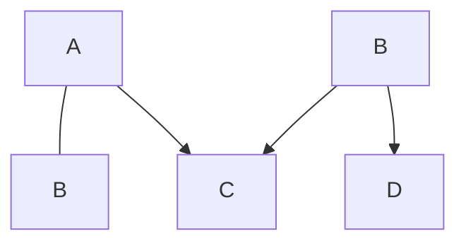

Figure 3.2: Undirected graph

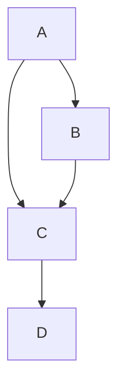

Figure 3.3: Directed graph

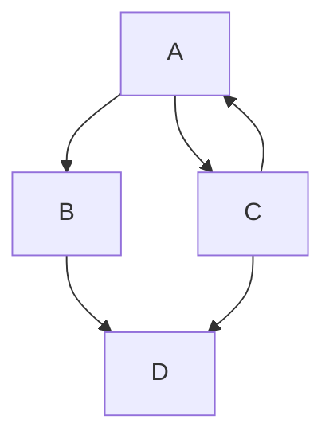

Figure 3.4: Directed graph with cycle

as a directed acyclic graph (DAG). The graphs we focus on in this book will mostly be DAGs.

If two parents X and Y share some child Z, but there is no edge connecting X and Y, then $X \rightarrow Z \leftarrow Y$ is known as an immorality. Seriously; that's a real term in graphical models. For example, if we remove the $A \rightarrow B$ from Figure 3.3 to get Figure 3.5, then $A \rightarrow C \leftarrow B$ is an immorality.

## 3.2 Bayesian Networks

It turns out that much of the work for causal graphical models was done in the field of probabilistic graphical models. Probabilistic graphical models are statistical models while causal graphical models are causal models. Bayesian networks are the main probabilistic graphical model that causal graphical models (causal Bayesian networks) inherit most of their properties from.

Imagine that we only cared about modeling association, without any causal modeling. We would want to model the data distribution $P(x_{1}, x_{2}, \ldots, x_{n})$ .

In general, we can use the chain rule of probability to factorize any distribution:

$$
P (x _ {1}, x _ {2}, \dots , x _ {n}) = P (x _ {1}) \prod_ {i} P (x _ {i} \mid x _ {i - 1}, \dots , x _ {1}) \tag {3.1}
$$

However, if we were to model these factors with tables, it would take an exponential number of parameters. To see this, take each $x_{i}$ to be binary and consider how we would model the factor $P(x_{n} \mid x_{n-1}, \ldots, x_{1})$ . Since $x_{n}$ is binary, we only need to model $P(X_{n} = 1 \mid x_{n-1}, \ldots, x_{1})$ because $P(X_{n} = 0 \mid x_{n-1}, \ldots, x_{1})$ is simply $1 - P(X_{n} = 1 \mid x_{n-1}, \ldots, x_{1})$ . Well, we would need $2^{n-1}$ parameters to model this. As a specific example, let $n = 4$ . As we can see in Table 3.1, this would require $2^{4-1} = 8$ parameters: $\alpha_{1}, \ldots, \alpha_{8}$ . This brute-force parametrization quickly becomes intractable as $n$ increases.

An intuitive way to more efficiently model many variables together in a joint distribution is to only model local dependencies. For example, rather than modeling the $X_{4}$ factor as $P(x_{4}|x_{3}, x_{2}, x_{1})$ , we could model it as $P(x_{4}|x_{3})$ if we have reason to believe that $X_{4}$ only locally depends on $X_{3}$ . In fact, in the corresponding graph in Figure 3.6, the only node that feeds into $X_{4}$ is $X_{3}$ . This is meant to signify that $X_{4}$ only locally depends on $X_{3}$ . Whenever we use a graph G in relation to a probability distribution P, there will always be a one-to-one mapping between the nodes in G and the random variables in P, so when we talk about nodes being independent, we mean the corresponding random variables are independent.

Given a probability distribution and a corresponding directed acyclic graph (DAG), we can formalize the specification of independencies with the local Markov assumption:

Assumption 3.1 (Local Markov Assumption) Given its parents in the DAG, a node X is independent of all its non-descendants.

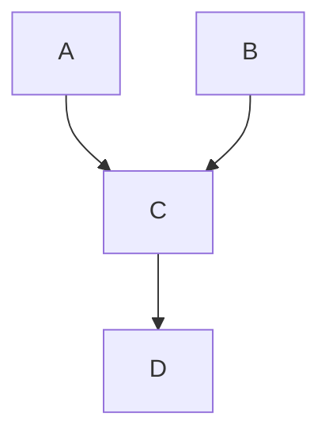

Figure 3.5: Directed graph with immorality

**Table 3.1: Table required to model the single factor $P(x_{n} \mid x_{n-1}, \ldots, x_{1})$ where n = 4 and the variables are binary. The number of parameters to necessary is exponential in n.**

<table><tr><td> $x_{1}$ </td><td> $x_{2}$ </td><td> $x_{3}$ </td><td> $P(x_{4} \mid x_{3}, x_{2}, x_{1})$ </td></tr><tr><td>0</td><td>0</td><td>0</td><td> $\alpha_{1}$ </td></tr><tr><td>0</td><td>0</td><td>1</td><td> $\alpha_{2}$ </td></tr><tr><td>0</td><td>1</td><td>0</td><td> $\alpha_{3}$ </td></tr><tr><td>0</td><td>1</td><td>1</td><td> $\alpha_{4}$ </td></tr><tr><td>1</td><td>0</td><td>0</td><td> $\alpha_{5}$ </td></tr><tr><td>1</td><td>0</td><td>1</td><td> $\alpha_{6}$ </td></tr><tr><td>1</td><td>1</td><td>0</td><td> $\alpha_{7}$ </td></tr><tr><td>1</td><td>1</td><td>1</td><td> $\alpha_{8}$ </td></tr></table>

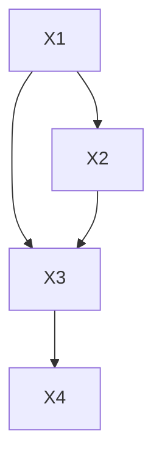

Figure 3.6: Four node DAG where $X_{4}$ locally depends on only $X_{3}$ .

This assumption (along with specific DAGs) gives us a lot. We will demonstrate this in the next few equations. In our four variable example, the chain rule of probability tells us that we can factorize any P such that

$$
P (x _ {1}, x _ {2}, x _ {3}, x _ {4}) = P (x _ {1}) P (x _ {2} \mid x _ {1}) P (x _ {3} \mid x _ {2}, x _ {1}) P (x _ {4} \mid x _ {3}, x _ {2}, x _ {1}). \tag {3.2}
$$

If $P$ is Markov with respect to the graph $^1$ in Figure 3.6, then we can simplify the last factor:

$$
P (x _ {1}, x _ {2}, x _ {3}, x _ {4}) = P (x _ {1}) P (x _ {2} \mid x _ {1}) P (x _ {3} \mid x _ {2}, x _ {1}) P (x _ {4} \mid x _ {3}). \tag {3.3}
$$

If we further remove edges, removing $X_{1} \rightarrow X_{2}$ and $X_{2} \rightarrow X_{3}$ as in Figure 3.7, we can further simplify the factorization of P:

$$
P (x _ {1}, x _ {2}, x _ {3}, x _ {4}) = P (x _ {1})   P (x _ {2})   P (x _ {3} \mid x _ {1})   P (x _ {4} \mid x _ {3}). \tag {3.4}
$$

With the understanding that we have hopefully built up from a few examples, $^{2}$ we will now state one of the main consequences of the local Markov assumption:

Definition 3.1 (Bayesian Network Factorization) Given a probability distribution P and a DAG G, P factorizes according to G if

$$
P (x _ {1}, \ldots , x _ {n}) = \prod_ {i} P (x _ {i} \mid \mathsf {p a} _ {i})
$$

Hopefully you see the resemblance between the move from Equation 3.2 to Equation 3.3 or the move to Equation 3.4 and the generalization of this that is presented in Definition 3.1.

The Bayesian network factorization is also known as the chain rule for Bayesian networks or Markov compatibility. For example, if P factorizes according to G, then P and G are Markov compatible.

We have given the intuition of how the local Markov assumption implies the Bayesian network factorization, and it turns out that the two are actually equivalent. In other words, we could have started with the Bayesian network factorization as the main assumption (and labeled it as an assumption) and shown that it implies the local Markov assumption. See Koller and Friedman [13, Chapter 3] for these proofs and more information on this topic.

As important as the local Markov assumption is, it only gives us information about the independencies in P that a DAG implies. It does not even tell us that if X and Y are adjacent in the DAG, then X and Y are dependent. And this additional information is very commonly assumed in causal DAGs. To get this guaranteed dependence between adjacent nodes, we will generally assume a slightly stronger assumption than the local Markov assumption: minimality.

Assumption 3.2 (Minimality Assumption) 1. Given its parents in the DAG, a node $X$ is independent of all its non-descendants (Assumption 3.1).

2. Adjacent nodes in the DAG are dependent. $^{3}$ $^{1}$ A probability distribution is said to be (locally) Markov with respect to a DAG if they satisfy the local Markov assumption.

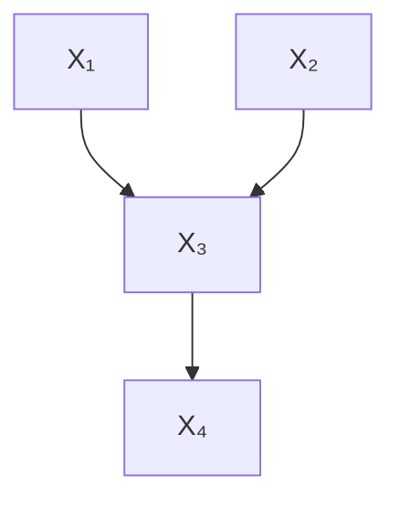

Figure 3.7: Four node DAG with even more independencies.

$^{2}$ Active reading exercise:: ensure that you know how we get from Equation 3.2 to Equation 3.3 and to Equation 3.4 using the local Markov assumption.

[13]: Koller and Friedman (2009), Probabilistic Graphical Models: Principles and Techniques

$^{3}$ This is often equivalently stated in the following way: if we were to remove any edges from the DAG, P would not be Markov with respect to the graph with the removed edges [see, e.g., 14, Section 6.5.3].

[14]: Peters et al. (2017), Elements of Causal Inference: Foundations and Learning AlgorithmsTo see why this assumption is named “minimality” consider, what we know when we know that P is Markov with respect to a DAG G. We know that P satisfies a set of independencies that are specific to the structure of G. If P and G also satisfy minimality, then this set of independencies is minimal in the sense the P does not satisfy any additional independencies. This is equivalent to saying that adjacent nodes are dependent.

For example, if the DAG were simply two connected nodes X and Y as in Figure 3.8, the local Markov assumption would tell us that we can factorize $P(x,y)$ as $P(x)P(y|x)$ , but it would also allow us to factorize $P(x,y)$ as $P(x)P(y)$ , meaning it allows distributions where X and Y are independent. In contrast, the minimality assumption does not allow this additional independence. Minimality would tell us to factorize $P(x,y)$ as $P(x)P(y|x)$ , and it would tell us that no additional independencies $(X \perp Y)$ exist in P that are minimal with respect to Figure 3.8.

Because removing edges in a Bayesian network is equivalent to adding independencies, $^{4}$ the minimality assumption is equivalent to saying that we can't remove any more edges from the graph. In a sense, every edge is "active." More concretely, consider that P and G are Markov compatible and that $G'$ is what we get when we remove some edge from G. If P is also Markov with respect to $G'$ , then P is not minimal with respect to G.

Armed with the minimality assumption and what it implies about how distributions factorize when they are Markov with respect to some DAG (Definition 3.1), we are now ready to discuss the flow of association in DAGs. However, because everything in this section is purely statistical, we are not ready to discuss the flow of causation in DAGs. To do that, we must make causal assumptions. Pedagogically, this will also allow us to use intuitive causal language when we explain the flow of association.

## 3.3 Causal Graphs

The previous section was all about statistical models and modeling association. In this section, we will augment these models with causal assumptions, turning them into causal models and allowing us to study causation. In order to introduce causal assumptions, we must first have an understanding of what it means for X to be a cause of Y.

Definition 3.2 (What is a cause?) A variable X is said to be a cause of a variable Y if Y can change in response to changes in X. $^{5}$

Another phrase commonly used to describe this primitive is that Y "listens" to X. With this, we can now specify the main causal assumption that we will use throughout this book.

Assumption 3.3 ((Strict) Causal Edges Assumption) In a directed graph, every parent is a direct cause of all its children.

Here, the set of direct causes of Y is everything that Y directly responds to; if we fix all of the direct causes of Y, then changing any other cause of Y won't induce any changes in Y. This assumption is “strict” in the sense

Figure 3.8: Two connected nodes

$^{4}$ Active reading exercise: why is removing edges in a Bayesian network equivalent to adding independencies?

$^{5}$ See Section 4.5.1 for a definition using mathematical notation.

that every edge is “active,” just like in DAGs that satisfy minimality. In other words, because the definition of a cause (Definition 3.2) implies that a cause and its effect are dependent and because we are assuming all parents are causes of their children, we are assuming that parents and their children are dependent. So the second part of minimality (Assumption 3.2) is baked into the strict causal edges assumption.

In contrast, the non-strict causal edges assumption would allow for some parents to not be causes of their children. It would just assume that children are not causes of their parents. This allows us to draw graphs with extra edges to make fewer assumptions, just like we would in Bayesian networks, where more edges means fewer independence assumptions. Causal graphs are sometimes drawn with this kind of non-minimal meaning, but the vast majority of the time, when someone draws a causal graph, they mean that parents are causes of their children. Therefore, unless we specify otherwise, throughout this book, we will use “causal graph” to refer to a DAG that satisfies the strict causal edges assumption. And we will often omit the word “strict” when we refer to this assumption.

When we add the causal edges assumption, directed paths in the DAG take on a very special meaning; they correspond to causation. This is in contrast to other paths in the graph, which association may flow along, but causation certainly may not. This will become more clear when we go into detail on these other kinds of paths in Sections 3.5 and 3.6.

Moving forward, we will now think of the edges of graphs as causal, in order to describe concepts intuitively with causal language. However, all of the associational claims about statistical independence will still hold, even when the edges do not have causal meaning like in the vanilla Bayesian networks of Section 3.2.

As we will see in the next few sections, the main assumptions that we need for our causal graphical models to tell us how association and causation flow between variables are the following two:

1. Local Markov Assumption (Assumption 3.1)  
2. Causal Edges Assumption (Assumption 3.3)

We will discuss these assumptions throughout the next few sections and come back to discuss them more fully again in Section 3.8 after we've established the necessary preliminaries.

## 3.4 Two-Node Graphs and Graphical Building Blocks

Now that we've gotten the basic assumptions and definitions out of the way, we can get to the core of this chapter: the flow of association and causation in DAGs. We can understand this flow in general DAGs by understanding the flow in the minimal building blocks of graphs. These minimal building blocks consist of chains (Figure 3.9a), forks (Figure 3.9b), immoralities (Figure 3.9c), two unconnected nodes (Figure 3.10), and two connected nodes (Figure 3.11).

(a) Chain

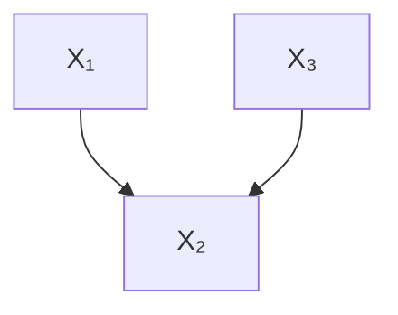

(b) Fork

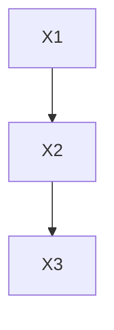

(c) Immorality  
Figure 3.9: Basic graph building blocks

By “flow of association,” we mean whether any two nodes in a graph are associated or not associated. Another way of saying this is whether two nodes are (statistically) dependent or (statistically) independent. Additionally, we will study whether two nodes are conditionally independent or not.

For each building block, we will give the intuition for why two nodes are (conditionally) independent or not, and we will give a proof as well. We can prove that two nodes A and B are conditionally independent given some set of nodes C by simply showing that $P(a, b|c)$ factorizes as $P(a|c)P(b|c)$ . We will now do this in the case of the simplest basic building block: two unconnected nodes.

Given a graph that is just two unconnected nodes, as depicted in Figure 3.10, these nodes are not associated simply because there is no edge between them. To show this, consider the factorization of $P(x_{1}, x_{2})$ that the Bayesian network factorization (Definition 3.1) gives us:

$$
P (x _ {1}, x _ {2}) = P (x _ {1}) P (x _ {2}) \tag {3.5}
$$

That's it; applying the Bayesian network factorization immediately gives us a proof that the two nodes $X_{1}$ and $X_{2}$ are unassociated (independent) in this building block. And what is the assumption that allows us to prove this? That $P$ is Markov with respect to the graph in Figure 3.10.

In contrast, if there is an edge between the two nodes (as in Figure 3.11), then the two nodes are associated. The assumption we leverage here is the causal edges assumption (Assumption 3.3), which means that $X_{1}$ is a cause of $X_{2}$ . Since $X_{1}$ is a cause of $X_{2}$ , $X_{2}$ must be able to change in response to changes in $X_{1}$ , so $X_{2}$ and $X_{1}$ are associated. In general, any time two nodes are adjacent in a causal graph, they are associated. $^{6}$ We will see this same concept several more times in Section 3.5 and Section 3.6.

Now that we've covered the relevant two-node graphs, we'll cover the flow of association in the remaining graphical building blocks (three-node graphs in Figure 3.9), starting with chain graphs.

## 3.5 Chains and Forks

Chains (Figure 3.12) and forks (Figure 3.13) share the same set of dependencies. In both structures, $X_{1}$ and $X_{2}$ are dependent, and $X_{2}$ and $X_{3}$ are dependent for the same reason that we discussed toward the end of Section 3.4. Adjacent nodes are always dependent when we make the causal edges assumption (Assumption 3.3). What about $X_{1}$ and $X_{3}$ ,

Figure 3.10: Two unconnected nodes

Figure 3.11: Two connected nodes

$^{6}$ Two adjacent nodes in a non-strict causal graph can be unassociated.

Figure 3.12: Chain with flow of association drawn as a dashed red arc.

though? Does association flow from $X_{1}$ to $X_{3}$ through $X_{2}$ in chains and forks?

Usually, yes, $X_{1}$ and $X_{3}$ are associated in both chains and forks. In chain graphs, $X_{1}$ and $X_{3}$ are usually dependent simply because $X_{1}$ causes changes in $X_{2}$ which then causes changes in $X_{3}$ . In a fork graph, $X_{1}$ and $X_{3}$ are also usually dependent. This is because the same value that $X_{2}$ takes on is used to determine both the value that $X_{1}$ takes on and the value that $X_{3}$ takes on. In other words, $X_{1}$ and $X_{3}$ are associated through their (shared) common cause. We use the word “usually” throughout this paragraph because there exist pathological cases where the conditional distributions $P(x_{2}|x_{1})$ and $P(x_{3}|x_{2})$ are misaligned in such a specific way that makes $X_{1}$ and $X_{3}$ not actually associated [see, e.g., 15, Section 2.2].

An intuitive graphical way of thinking about $X_{1}$ and $X_{3}$ being associated in chains and forks is to visualize the flow of association. We visualize this with a dashed red line in Figure 3.12 and Figure 3.13. In the chain graph (Figure 3.12), association flows from $X_{1}$ to $X_{3}$ along the path $X_{1} \rightarrow X_{2} \rightarrow X_{3}$ . Symmetrically, association flows from $X_{3}$ to $X_{1}$ along that same path, just running opposite the arrows. In the fork graph (Figure 3.13), association flows from $X_{1}$ to $X_{3}$ along the path $X_{1} \leftarrow X_{2} \rightarrow X_{3}$ . And similarly, we can think of association flowing from $X_{3}$ to $X_{1}$ along that same path, just as was the case with chains. In general, the flow of association is symmetric.

Chains and forks also share the same set of independencies. When we condition on $X_{2}$ in both graphs, it blocks the flow of association from $X_{1}$ to $X_{3}$ . This is because of the local Markov assumption; each variable can locally depend on only its parents. So when we condition on $X_{2}$ ( $X_{3}$ 's parent in both graphs), $X_{3}$ becomes independent of $X_{1}$ (and vice versa).

We will refer to this independence as an instance of a blocked path. We illustrate these blocked paths in Figure 3.14 and Figure 3.15. Conditioning blocks the flow of association in chains and forks. Without conditioning, association is free to flow in chains and forks; we will refer to this as an unblocked path. However, the situation is completely different with immoralities, as we will see in the next section.

That's all nice intuition, but what about the proof? We can prove that $X_{1} \perp X_{3} \mid X_{2}$ using just the local Markov assumption. We will do this by showing that $P(x_{1}, x_{3} \mid x_{2}) = P(x_{1} \mid x_{2})P(x_{3} \mid x_{2})$ . We'll show the proof for chain graphs. It is usually useful to start with the Bayesian network factorization. For chains, we can factorize $P(x_{1}, x_{2}, x_{3})$ as follows:

$$
P (x _ {1}, x _ {2}, x _ {3}) = P (x _ {1}) P (x _ {2} | x _ {1}) P (x _ {3} | x _ {2}) \tag {3.6}
$$

Bayes' rule tells us that $P(x_{1},x_{3} \mid x_{2}) = \frac{P(x_{1},x_{2},x_{3})}{P(x_{2})}$ , so we have

$$
P (x _ {1}, x _ {3} \mid x _ {2}) = \frac {P (x _ {1}) P (x _ {2} | x _ {1}) P (x _ {3} | x _ {2})}{P (x _ {2})} \tag {3.7}
$$

Since we're looking to end up with $P(x_{1} \mid x_{2})P(x_{3} \mid x_{2})$ and we already have $P(x_{3}|x_{2})$ , we must turn the rest into $P(x_{1} \mid x_{2})$ . We can do this by

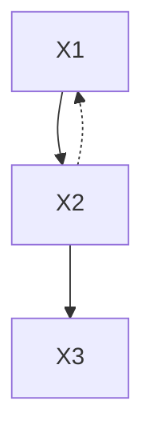

Figure 3.13: Fork with flow of association drawn as a dashed red arc.

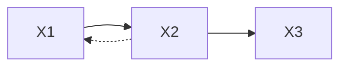

Figure 3.14: Chain with association blocked by conditioning on $X_{2}$ .

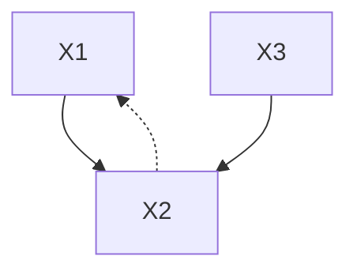

Figure 3.15: Fork with association blocked by conditioning on $X_{2}$ .

another application of Bayes rule:

$$
P (x _ {1}, x _ {3} \mid x _ {2}) = \frac {P (x _ {1} , x _ {2})}{P (x _ {2})} P (x _ {3} | x _ {2}) \tag {3.8}
$$

$$
= P (x _ {1} | x _ {2}) P (x _ {3} | x _ {2}) \tag {3.9}
$$

With that, we've shown that $X_{1} \perp X_{3} \mid X_{2}$ . Try it yourself; prove the analog in forks. $^{7}$

Flow of Causation The flow of association is symmetric, whereas the flow of causation is not. Under the causal edges assumption (Assumption 3.3), causation only flows in a single direction. Causation only flows along directed paths. Association flows along any path that does not contain an immorality.

## 3.6 Colliders and their Descendants

Recall from Section 3.1 that we have an immorality when we have a child whose two parents do not have an edge connecting them (Figure 3.16). And in this graph structure, the child is known as a bastard. No, just kidding; it's called a collider.

In contrast to chains and forks, in an immorality, $X_{1} \perp \perp X_{3}$ . Look at the graph structure and think about it a bit. Why would $X_{1}$ and $X_{3}$ be associated? One isn't the descendant of the other like in chains, and they don't share a common cause like in forks. Rather, we can think of $X_{1}$ and $X_{3}$ simply as unrelated events that happen, which happen to both contribute to some common effect ( $X_{2}$ ). To show this, we apply the Bayesian network factorization and marginalize out $x_{2}$ :

$$
P (x _ {1}, x _ {3}) = \sum_ {x _ {2}} P (x _ {1}, x _ {2}, x _ {3}) \tag {3.10}
$$

$$
= \sum_ {x _ {2}} P (x _ {1}) P (x _ {3}) P (x _ {2} \mid x _ {1}, x _ {3}) \tag {3.11}
$$

$$
= P (x _ {1}) P (x _ {3}) \sum_ {x _ {2}} P (x _ {2} \mid x _ {1}, x _ {3}) \tag {3.12}
$$

$$
= P \left(x _ {1}\right) P \left(x _ {3}\right) \tag {3.13}
$$

We illustrate the independence of $X_{1}$ and $X_{3}$ in Figure 3.16 by showing that the association that we could have imagined as flowing along the path $X_{1} \rightarrow X_{2} \leftarrow X_{3}$ is actually blocked at $X_{2}$ . Because we have a collider on the path connecting $X_{1}$ and $X_{3}$ , association does not flow through that path. This is another example of a blocked path, but this time the path is not blocked by conditioning; the path is blocked by a collider.

Good-Looking Men are Jerks Oddly enough, when we condition on the collider $X_{2}$ , its parents $X_{1}$ and $X_{3}$ become dependent (depicted in Figure 3.17). An example is the easiest way to see why this is the case. Imagine that you're out dating men, and you notice that most of the nice men you meet are not very good-looking, and most of the good-looking men you meet are jerks. It seems that you have to choose between looks and kindness. In other words, it seems like kindness and looks are negatively associated. However, what if I also told you that there is an important third variable here: availability (whether men are

$^{7}$ Active reading exercise: prove that $X_{1} \perp X_{3} \mid X_{2}$ for forks (Figure 3.15).

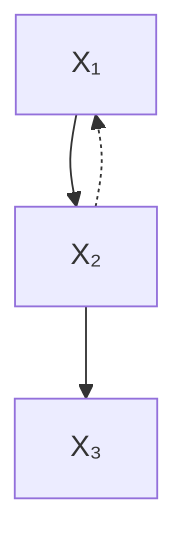

Figure 3.16: Immorality with association blocked by a collider.

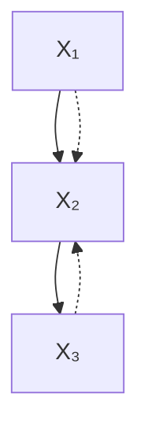

Figure 3.17: Immorality with association unblocked by conditioning on the collider.

already in a relationship or not)? And what if I told you that a man's availability is largely determined by their looks and kindness; if they are both good-looking and kind, then they are in a relationship. The available men are the remaining ones, the ones who are either not good-looking or not kind. You see an association between looks and kindness because you've conditioned on a collider (availability). You're only looking at men who are not in a relationship. You can see the causal structure of this example by taking Figure 3.17 and replacing $X_1$ with "looks," $X_3$ with "kindness," and $X_2$ with "availability."

The above example naturally suggests that, when dating men, maybe you should consider not conditioning on $X_{2} = “not in a relationship”$ and, instead, condition on $X_{2} = “in a relationship.”$ However, you could run into other variables $X_{4}$ that introduce new immoralities there. Such moral questions are outside the scope of this book.

Returning to inside the scope of this book, we have that conditioning on a collider can turn a blocked path into an unblocked path. The parents $X_{1}$ and $X_{3}$ are not associated in the general population, but when we condition on their shared child $X_{2}$ taking on a specific value, they become associated. Conditioning on the collider $X_{2}$ allows associated to flow along the path $X_{1} \to X_{2} \leftarrow X_{3}$ , despite the fact that it does not when we don't condition on $X_{2}$ . We illustrate this in the move from Figure 3.16 to Figure 3.17.

We also illustrate this with a scatter plot in Figure 3.18. In Figure 3.18a, we plot the whole population, with kindness on the x-axis and looks on the y-axis. As you can see, the variables are not associated in the general population. However, if we remove the ones who are already in a relationship (the orange ones in Figure 3.18b), we are left with the clear negative association that we see in Figure 3.18c. This phenomenon is known as Berkson's paradox. The fact that we see this negative association simply because we are selecting a biased subset of the general population to look at is why this is sometimes referred to as selection bias [see, e.g., 7, Chapter 8].

Active reading exercise: Come up with your own example of an immorality and how conditioning on the collider induces association between its parents. Hint: think of rare events for $X_{1}$ and $X_{3}$ where, if either of them happens, some outcome $X_{2}$ will happen.

[7]: Hernán and Robins (2020), Causal Inference: What If

Numerical Example All of the above has been to give you intuition about why conditioning on a collider induces association between its parents, but we have yet to give a concrete numerical example of this. We will give a simple one here. Consider the following data generating process (DGP), where $X_{1}$ and $X_{3}$ are drawn independently from standard normal distributions and then used to compute $X_{2}$ :

$$
X _ {1} \sim N (0, 1), \quad X _ {3} \sim N (0, 1) \tag {3.14}
$$

$$
X _ {2} = X _ {1} + X _ {3} \tag {3.15}
$$

We've already stated that $X_{1}$ and $X_{3}$ are independent, but to juxtapose the two calculations, let's compute their covariance:

$$
\begin{array}{l} \operatorname{Cov} (X _ {1}, X _ {3}) = \mathbb {E} [ (X _ {1} - \mathbb {E} [ X _ {1} ]) (X _ {3} - \mathbb {E} [ X _ {3} ]) ] \\ = \mathbb {E} \left[ X _ {1} X _ {3} \right] \quad (\text { zero   mean }) \\ = \mathbb {E} \left[ X _ {1} \right] \mathbb {E} \left[ X _ {3} \right] \quad (\text { independent }) \\ = 0 \\ \end{array}
$$

Now, let's compute their covariance, conditional on $X_{2}$ :

$$
\begin{array}{l} \operatorname{Cov} (X _ {1}, X _ {3} \mid X _ {2} = x) = \mathbb {E} [ X _ {1} X _ {3} \mid X _ {2} = x ] (3.16) \\ = \mathbb {E} [ X _ {1} (x - X _ {1}) ] (3.17) \\ = x \mathbb {E} [ X _ {1} ] - \mathbb {E} [ X _ {1} ^ {2} ] (3.18) \\ = - 1 (3.19) \\ \end{array}
$$

Crucially, in Equation 3.17, we used Equation 3.15 to plug in for $X_{3}$ in terms of $X_{1}$ and $X_{2}$ (conditioned to x). This led to a second-order term, which led to the calculation giving a nonzero number, which means $X_{1}$ and $X_{3}$ are associated, conditional on $X_{2}$ .

Descendants of Colliders Conditioning on descendants of a collider also induces association in between the parents of the collider. The intuition is that if we learn something about a collider's descendant, we usually also learn something about the collider itself because there is a direct causal path from the collider to its descendants, and we know that nodes in a chain are usually associated (see Section 3.5), assuming minimality (Assumption 3.2). In other words, a descendant of a collider can be thought of as a proxy for that collider, so conditioning on the descendant is similar to conditioning on the collider itself.

## 3.7 d-separation

Before we define d-separation, we'll codify what we mean by the concept of a "blocked path," which we've been discussing in the previous sections:

Definition 3.3 (blocked path) A path between nodes X and Y is blocked by a (potentially empty) conditioning set Z if either of the following is true:

1. Along the path, there is a chain $\cdots\rightarrow W\rightarrow\cdots$ or a fork  
$\cdots\leftarrow W\rightarrow\cdots,$ where W is conditioned on $(W\in Z)$ .  
2. There is a collider $W$ on the path that is not conditioned on $(W \notin Z)$  
and none of its descendants are conditioned on (de(W) ∉ Z).

Then, an unblocked path is simply the complement; an unblocked path is a

Active reading exercise: We have provided several techniques for how to think about colliders: high-level examples, numerical examples, and abstract reasoning. Use at least one of them to convince yourself that conditioning on a descendant of a collider can induce association between the collider's parents.

path that is not blocked. The graphical intuition to have in mind is that association flows along unblocked paths, and association does not flow along blocked paths. If you don't have this intuition in mind, then it is probably worth it to reread the previous two sections, with the goal of gaining this intuition. Now, we are ready to introduce a very important concept: d-separation.

Definition 3.4 (d-separation) Two (sets of) nodes X and Y are d-separated by a set of nodes Z if all of the paths between (any node in) X and (any node in) Y are blocked by Z [16].

If all the paths between two nodes X and Y are blocked, then we say that X and Y are d-separated. Similarly, if there exists at least one path between X and Y that is unblocked, then we say that X and Y are d-connected.

As we will see in Theorem 3.1, d-separation is such an important concept because it implies conditional independence. We will use the notation $X \perp_{G} Y \mid Z$ to denote that $X$ and $Y$ are d-separated in the graph $G$ when conditioning on $Z$ . Similarly, we will use the notation $X \perp_{P} Y \mid Z$ to denote that $X$ and $Y$ are independent in the distribution $P$ when conditioning on $Z$ .

Theorem 3.1 Given that P is Markov with respect to G (satisfies the local Markov assumption, Assumption 3.1), if X and Y are d-separated in G conditioned on Z, then X and Y are independent in P conditioned on Z. We can write this succinctly as follows:

$$
X \perp_ {G} Y \mid Z \Longrightarrow X \perp_ {P} Y \mid Z \tag {3.20}
$$

Because this is so important, we will give Equation 3.20 a name: the global Markov assumption. Theorem 3.1 tells us that the local Markov assumption implies the global Markov assumption.

Just as we built up the intuition that suggested that the local Markov assumption (Assumption 3.1) implies the Bayesian network factorization (Definition 3.1) and alerted you to the fact that the Bayesian network factorization also implies the local Markov assumption (the two are equivalent), it turns out that the global Markov assumption also implies the local Markov assumption. In other words, the local Markov assumption, global Markov assumption, and the Bayesian network factorization are all equivalent [see, e.g., 13, Chapter 3]. Therefore, we will use the slightly shortened phrase Markov assumption to refer to these concepts as a group, or we will simply write “P is Markov with respect to G” to convey the same meaning.

Active reading exercise: To get some practice with d-separation, here are some questions about d-separation in Figure 3.19.

Questions about Figure 3.19a:

1. Are $T$ and $Y$ d-separated by the empty set?  
2. Are $T$ and $Y$ d-separated by $W_{2}$ ?  
3. Are $T$ and $Y$ d-separated by $\{W_2, M_1\}$ ?  
4. Are $T$ and $Y$ d-separated by $\{W_1, M_2\}$ ?  
5. Are $T$ and $Y$ d-separated by $\{W_1, M_2, X_2\}$ ?

[16]: Pearl (1988), Probabilistic Reasoning in Intelligent Systems: Networks of Plausible Inference

[13]: Koller and Friedman (2009), Probabilistic Graphical Models: Principles and Techniques6. Are $T$ and $Y$ d-separated by $\{W_1, M_2, X_2, X_3\}$ ?

Questions about Figure 3.19b:

1. Are $T$ and $Y$ d-separated by the empty set?  
2. Are $T$ and $Y$ d-separated by $W$ ?  
3. Are $T$ and $Y$ d-separated by $\{W, X_2\}$ ?

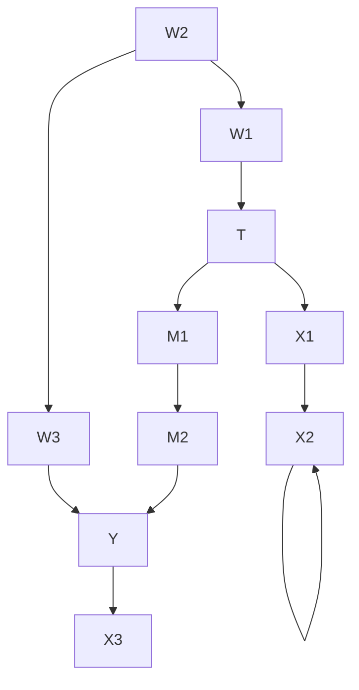

(a)

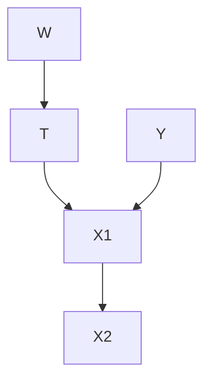

(b)  
Figure 3.19: Graphs for d-separation exercise

## 3.8 Flow of Association and Causation

Now that we have covered the necessary preliminaries (chains, forks, colliders, and d-separation), it is worth emphasizing how association and causation flow in directed graphs. Association flows along all unblocked paths. In causal graphs, causation flows along directed paths. Recall from Section 1.3.2 that not only is association not causation, but causation is a sub-category of association. That's why association and causation both flow along directed paths.

We refer to the flow of association along directed paths as causal association. A common type of non-causal association that makes total association not causation is confounding association. In the graph in Figure 3.20, we depict the confounding association in red and the causal association in blue.

Regular Bayesian networks are purely statistical models, so we can only talk about the flow of association in Bayesian networks. Association still flows in exactly the same way in Bayesian networks as it does in causal graphs, though. In both, association flows along chains and forks, unless a node is conditioned on. And in both, a collider blocks the flow of association, unless it is conditioned on. Combining these building blocks, we get how association flows in general DAGs. We can tell if two nodes are not associated (no association flows between them) by whether or not they are d-separated.

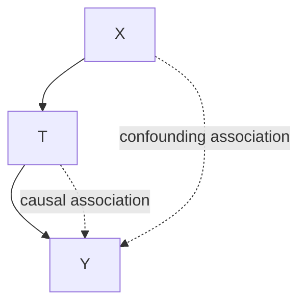

Figure 3.20: Causal graph depicting an example of how confounding association and causal association flow.

Causal graphs are special in that we additionally assume that the edges have causal meaning (causal edges assumption, Assumption 3.3). This assumption is what introduces causality into our models, and it makes one type of path take on a whole new meaning: directed paths. This assumption endows directed paths with the unique role of carrying causation along them. Additionally, this assumption is asymmetric; “X is a cause of Y” is not the same as saying “Y is a cause of X.” This means that there is an important difference between association and causation: association is symmetric, whereas causation is asymmetric.

d-separation Implies Association is Causation Given that we have tools to measure association, how can we isolate causation? In other words, how can we ensure that the association we measure is causation, say, for measuring the causal effect of X on Y? Well, we can do that by ensuring that there is no non-causal association flowing between X and Y. This is true if X and Y are d-separated in the augmented graph where we remove outgoing edges from X. This is because all of X's causal effect on Y would flow through it's outgoing edges, so once those are removed, the only association that remains is purely non-causal association.

In Figure 3.21, we illustrate what each of the important assumptions gives us in terms of interpreting this flow of association. First, we have the (local/global) Markov assumption (Assumption 3.1). As we saw in Section 3.7, this assumption allows us to know which nodes are unassociated. In other words, the Markov assumption tells along which paths the association does not flow. When we slightly strengthen the Markov assumption to the minimality assumption (Assumption 3.2), we get which paths association does flow along (except in intransitive edges cases). When we further add in the causal edges assumption (Assumption 3.3), we get that causation flows along directed paths. Therefore, the following two $^{8}$ assumptions are essential for graphical causal models:

1. Markov Assumption (Assumption 3.1)  
2. Causal Edges Assumption (Assumption 3.3)

$^{8}$ Recall that the first part of the minimality assumption is just the local Markov assumption and that the second part is contained in the causal edges assumption.

Figure 3.21: A flowchart that illustrates what kind of claims we can make about our data as we add each additional important assumption.