# Causal Models

Causal models are essential for identification of causal quantities. When we presented the Identification-Estimation Flowchart (Figure 2.5) back in Section 2.4, we described identification as the process of moving from a causal estimand to a statistical estimand. However, to do that, we must have a causal model. We depict this more full version of the Identification-Estimation Flowchart in Figure 4.1.


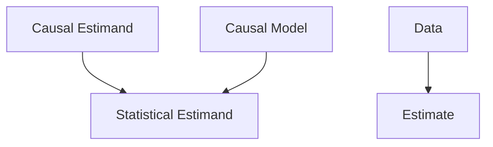

Figure 4.1: The Identification-Estimation Flowchart – a flowchart that illustrates the process of moving from a target causal estimand to a corresponding estimate, through identification and estimation. In contrast to Figure 2.5, this version is augmented with a causal model and data.

The previous chapter gives graphical intuition for causal models, but it doesn't explain how to identify causal quantities and formalize causal models. We will do that in this chapter.

## 4.1 The do-operator and Interventional Distributions

The first thing that we will introduce is a mathematical operator for intervention. In the regular notation for probability, we have conditioning, but that isn't the same as intervening. Conditioning on $T = t$ just means that we are restricting our focus to the subset of the population to those who received treatment $t$ . In contrast, an intervention would be to take the whole population and give everyone treatment $t$ . We illustrate this in Figure 4.2. We will denote intervention with the do-operator: $\text{do}(T = t)$ . This is the notation commonly used in graphical causal models, and it has equivalents in potential outcomes notation. For example, we can write the distribution of the potential outcome $Y(t)$ that we saw in Chapter 2 as follows:

$$
P (Y (t) = y) \triangleq P (Y = y \mid d o (T = t)) \triangleq P (y \mid d o (t)) \tag {4.1}
$$

Note that we shorten $do(T = t)$ to just $do(t)$ in the last option in Equation 4.1. We will use this shorthand throughout the book. We can similarly write the ATE (average treatment effect) when the treatment is binary as follows:

$$
\mathbb {E} [ Y \mid d o (T = 1) ] - \mathbb {E} [ Y \mid d o (T = 0) ] \tag {4.2}
$$

4.1 The do-operator and Interventional Distributions . . 32  
4.2 The Main Assumption: Modularity ..... 34  
4.3 Truncated Factorization . . 35
Example Application and Re-
visiting "Association is Not
Causation" . . . . . . . . . 36  
4.4 The Backdoor Adjustment 37
Relation to Potential Out-
comes .... 39  
4.5 Structural Causal Models (SCMs) ..... 40
Structural Equations ..... 40
Interventions ..... 42
Collider Bias and Why to Not Condition on Descendants of Treatment ..... 43  
4.6 Example Applications of the Backdoor Adjustment . . . 44
Association vs. Causation in a Toy Example . . . . . . . 44
A Complete Example with Estimation . . . . . . . . 45  
4.7 Assumptions Revisited . . . 47


Figure 4.2: Illustration of the difference between conditioning and intervening

We will often work with full distributions like $P(Y \mid do(t))$ , rather than their means, as this is more general; if we characterize $P(Y \mid do(t))$ , then we've characterized $E[Y \mid do(t)]$ . We will commonly refer to $P(Y \mid do(T = t))$ and other expressions with the do-operator in them as interventional distributions.

Interventional distributions such as $P(Y \mid do(T = t))$ are conceptually quite different from the observational distribution $P(Y)$ . Observational distributions such as $P(Y)$ or $P(Y, T, X)$ do not have the do-operator in them. Because they don't have the do-operator, we can observe data from them without needing to carry out any experiment. This is why we call data from $P(Y, T, X)$ observational data. If we can reduce an expression $Q$ with do in it (an interventional expression) to one without do in it (an observational expression), then $Q$ is said to be identifiable. An expression with a do in it is fundamentally different from an expression without a do in it, despite the fact that in do-notation, do appears after a regular conditioning bar. As we discussed in Section 2.4, we will refer to an estimand as a causal estimand when it contains a do-operator, and we refer to an estimand as a statistical estimand when it doesn't contain a do-operator.

Whenever, $do(t)$ appears after the conditioning bar, it means that everything in that expression is in the post-intervention world where the intervention $do(t)$ occurs. For example, $\mathbb{E}[Y \mid do(t), Z = z]$ refers to the expected outcome in the subpopulation where Z = z after the whole subpopulation has taken treatment t. In contrast, $\mathbb{E}[Y \mid Z = z]$ simply refers to the expected value in the (pre-intervention) population where individuals take whatever treatment they would normally take (T). This distinction will become important when we get to counterfactuals in Chapter 14.

## 4.2 The Main Assumption: Modularity

Before we can describe a very important assumption, we must specify what a causal mechanism is. There are a few different ways to think about causal mechanisms. In this section, we will refer to the causal mechanism that generates $X_{i}$ as the conditional distribution of $X_{i}$ given all of its causes: $P(x_{i} \mid \text{pa}_{i})$ . As we show graphically in Figure 4.3, the causal mechanism that generates $X_{i}$ is all of $X_{i}$ 's parents and their edges that go into $X_{i}$ . We will give a slightly more specific description of what a causal mechanism is in Section 4.5.1, but these suffice for now.

In order to get many causal identification results, the main assumption we will make is that interventions are local. More specifically, we will assume that intervening on a variable $X_{i}$ only changes the causal mechanism for $X_{i}$ ; it does not change the causal mechanisms that generate any other variables. In this sense, the causal mechanisms are modular. Other names that are used for the modularity property are independent mechanisms, autonomy, and invariance. We will now state this assumption more formally.

Assumption 4.1 (Modularity / Independent Mechanisms / Invariance) If we intervene on a set of nodes $S \subseteq [n]$ , $^{1}$ setting them to constants, then for all $i$ , we have the following:

1. If $i \notin S$ , then $P(x_{i} \mid \mathsf{pa}_{i})$ remains unchanged.  
2. If $i \in S$ , then $P(x_i \mid \mathsf{pa}_i) = 1$ if $x_i$ is the value that $X_i$ was set to by the intervention; otherwise, $P(x_i \mid \mathsf{pa}_i) = 0$ .

In the second part of the above assumption, we could have alternatively said $P(x_{i} \mid \text{pa}_{i}) = 1$ if $x_{i}$ is consistent with the intervention $^{2}$ and 0 otherwise. More explicitly, we will say (in the future) that if $i \in S$ , a value $x_{i}$ is consistent with the intervention if $x_{i}$ equals the value that $X_{i}$ was set to in the intervention.

The modularity assumption is what allows us to encode many different interventional distributions all in a single graph. For example, it could be the case that $P(Y)$ , $P(Y \mid do(T = t))$ , $P(Y \mid do(T = t'))$ , and $P(Y \mid do(T_2 = t_2))$ are all completely different distributions that share almost nothing. If this were the case, then each of these distributions would need their own graph. However, by assuming modularity, we can encode them all with the same graph that we use to encode the joint $P(Y, T, T_2, \ldots)$ , and we can know that all of the factors (except ones that are intervened on) are shared across these graphs.

The causal graph for interventional distributions is simply the same graph that was used for the observational joint distribution, but with all of the edges to the intervened node(s) removed. This is because the probability for the intervened factor has been set to 1, so we can just ignore that factor (this is the focus of the next section). Another way to see that the intervened node has no causal parents is that the intervened node is set to a constant value, so it no longer depends on any of the variables it depends on in the observational setting (its parents). The graph with edges removed is known as the manipulated graph.


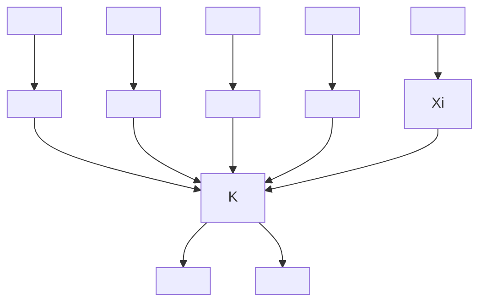

Figure 4.3: A causal graph with the causal mechanism that generates $X_{i}$ depicted inside an ellipse.

$^{1}$ We use $[n]$ to refer to the set $\{1,2,\ldots,n\}$ .

$^{2}$ Yes, the word “consistent” is extremely overloaded.

For example, consider the causal graph for an observational distribution in Figure 4.4a. Both $P(Y \mid do(T = t))$ and $P(Y \mid do(T = t'))$ correspond to the causal graph in Figure 4.4b, where the incoming edge to $T$ has been removed. Similarly, $P(Y \mid do(T_2 = t_2))$ corresponds to the graph in Figure 4.4c, where the incoming edges to $T_2$ have been removed. Although it is not expressed in the graphs (which only express conditional independencies and causal relations), under the modularity assumption, $P(Y)$ , $P(Y \mid T = t')$ , and $P(Y \mid do(T_2 = t_2))$ all shared the exact same factors (that are not intervened on).


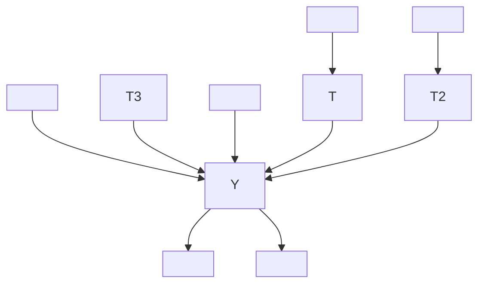

(a) Causal graph for observational distribution


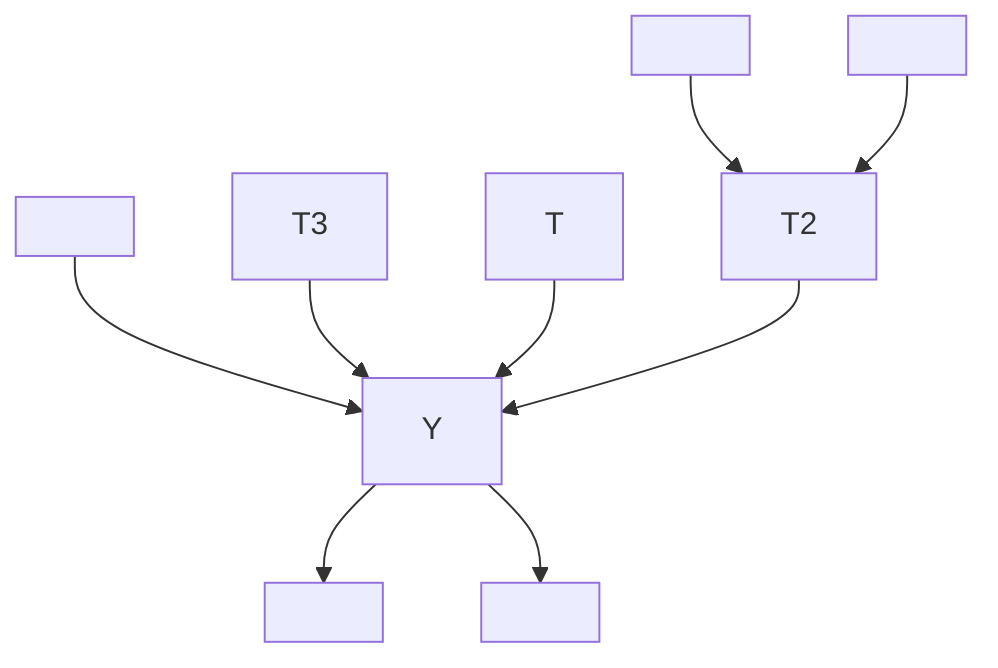

(b) Causal graph after intervention on T (interventional distribution)


```mermaid
graph TD
  A[" "] --> B["T"]
  C[" "] --> D["Y"]
  E[" "] --> D["Y"]
  F[" "] --> D["Y"]
  G[" "] --> D["Y"]
  H[" "] --> D["Y"]
  I[" "] --> D["Y"]
  J[" "] --> D["Y"]
  K[" "] --> D["Y"]
  L[" "] --> D["Y"]
  M[" "] --> D["Y"]
  N[" "] --> D["Y"]
  O[" "] --> D["Y"]
  P[" "] --> D["Y"]
  Q[" "] --> D["Y"]
  R[" "] --> D["Y"]
  S[" "] --> D["Y"]
  T[" "] --> D["Y"]
  U[" "] --> D["Y"]
  V[" "] --> D["Y"]
  W[" "] --> D["Y"]
  X[" "] --> D["Y"]
  Y[" "] --> D["Y"]
  Z[" "] --> D["Y"]
  AA[" "] --> D["Y"]
  AB[" "] --> D["Y"]
  AC[" "] --> D["Y"]
  AD[" "] --> D["Y"]
  AE[" "] --> D["Y"]
  AF[" "] --> D["Y"]
  AG[" "] --> D["Y"]
  AH[" "] --> D["Y"]
  AI[" "] --> D["Y"]
  AJ[" "] --> D["Y"]
  AK[" "] --> D["Y"]
  AL[" "] --> D["Y"]
  AM[" "] --> D["Y"]
  AN[" "] --> D["Y"]
  AO[" "] --> D["Y"]
  AP[" "] --> D["Y"]
  AQ[" "] --> D["Y"]
  AR[" "] --> D["Y"]
  AS[" "] --> D["Y"]
  AT[" "] --> D["Y"]
  AU[" "] --> D["Y"]
  AV[" "] --> D["Y"]
  AW[" "] --> D["Y"]
  AX[" "] --> D["Y"]
  AY[" "] --> BZ["T1"]
    AZ["T2"]
    BA["T3"]
```

(c) Causal graph after intervention on $T_{2}$ (interventional distribution)  
Figure 4.4: Intervention as edge deletion in causal graphs

What would it mean for the modularity assumption to be violated? Imagine that you intervene on $X_{i}$ , and this causes the mechanism that generates a different node $X_{j}$ to change; an intervention on $X_{i}$ changes $P(x_{j} \mid \text{pa}_{j})$ , where $j \neq i$ . In other words, the intervention is not local to the node you intervene on; causal mechanisms are not invariant to when you change other causal mechanisms; the causal mechanisms are not modular.

This assumption is so important that Judea Pearl refers to a closely related version (which we will see in Section 4.5.2) as The Law of Counterfactuals (and Interventions), one of two key principles from which all other causal results follow. $^{3}$ Incidentally, taking the modularity assumption (Assumption 4.1) and the Markov assumption (the other key principle) together gives us causal Bayesian networks. We'll now move to one of the important results that follow from these assumptions.

$^{3}$ The other key principle is the global Markov assumption (Theorem 3.1), which is the assumption that d-separation implies conditional independence.

## 4.3 Truncated Factorization

Recall the Bayesian network factorization (Definition 3.1), which tells us that if P is Markov with respect to a graph G, then P factorizes as follows:

$$
P (x _ {1}, \dots , x _ {n}) = \prod_ {i} P (x _ {i} \mid \mathrm{pa} _ {i}) \tag {4.3}
$$

where $pa_{i}$ denotes the parents of $X_{i}$ in G. Now, if we intervene on some set of nodes S and assume modularity (Assumption 4.1), then all of the factors should remain the same except the factors for $X_{i} \in S$ ; those factors should change to 1 (for values consistent with the intervention) because those variables have been intervened on. This is how we get the truncated factorization.

Proposition 4.1 (Truncated Factorization) We assume that P and G satisfy the Markov assumption and modularity. Given, a set of intervention nodes S, if x is consistent with the intervention, then

$$
P (x _ {1}, \dots , x _ {n} \mid d o (S = s)) = \prod_ {i \notin S} P (x _ {i} \mid \mathrm{pa} _ {i}). \tag {4.4}
$$

Otherwise, $P(x_{1},\ldots ,x_{n}\mid do(S = s)) = 0$ .

The key thing that changed when we moved from the regular factorization in Equation 4.3 to the truncated factorization in Equation 4.4 is that the latter's product is only over $i \notin S$ rather than all $i$ . In other words, the factors for $i \in S$ have been truncated.

## 4.3.1 Example Application and Revisiting "Association is Not Causation"

To see the power that the truncated factorization gives us, let's apply it to identify the causal effect of treatment on outcome in a simple graph. Specifically, we will identify the causal quantity $P(y \mid do(t))$ . In this example, the distribution P is Markov with respect to the graph in Figure 4.5. The Bayesian network factorization (from the Markov assumption), gives us the following:

$$
P (y, t, x) = P (x)   P (t \mid x)   P (y \mid t, x) \tag {4.5}
$$

When we intervene on the treatment, the truncated factorization (from adding the modularity assumption) gives us the following:

$$
P (y, x \mid d o (t)) = P (x) P (y \mid t, x) \tag {4.6}
$$

Then, we simply need to marginalize out x to get what we want:

$$
P (y \mid d o (t)) = \sum_ {x} P (y \mid t, x) P (x) \tag {4.7}
$$

We assumed $X$ is discrete when we summed over its values, but we can simply replace the sum with an integral if $X$ is continuous. Throughout this book, that will be the case, so we usually won't point it out.

If we massage Equation 4.7 a bit, we can clearly see how association is not causation. The purely associational counterpart of $P(y \mid do(t))$ is $P(y \mid t)$ . If the $P(x)$ in Equation 4.7 were $P(x \mid t)$ , then we would actually recover $P(y \mid t)$ . We briefly show this:

$$
\sum_ {x} P (y \mid t, x) P (x \mid t) = \sum_ {x} P (y, x \mid t) \tag {4.8}
$$

$$
= P (y \mid t) \tag {4.9}
$$

This gives some concreteness to the difference between association and causation. In this example (which is representative of a broader phenomenon), the difference between $P(y \mid do(t))$ and $P(y \mid t)$ is the difference between $P(x)$ and $P(x \mid t)$ .


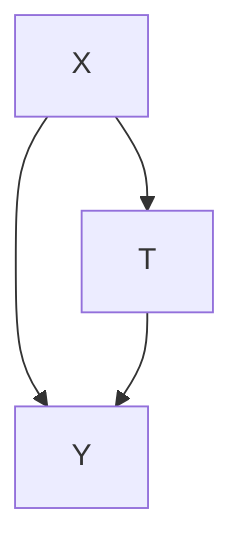

Figure 4.5: Simple causal structure where X counfounds the effect of T on Y and where X is the only confounder.

To round this example out, say T is a binary random variable, and we want to compute the ATE. $P(y \mid do(T = 1))$ is the distribution for $Y(1)$ , so we can just take the expectation to get $\mathbb{E}[Y(1)]$ . Similarly, we can do the same thing with $Y(0)$ . Then, we can write the ATE as follows:

$$
\mathbb {E} [ Y (1) - Y (0) ] = \sum_ {y} y P (y \mid d o (T = 1)) - \sum_ {y} y P (y \mid d o (T = 0)) \tag {4.10}
$$

If we then plug in Equation 4.7 for $P(y \mid do(T = 1))$ and $P(y \mid do(T = 0))$ , we have a fully identified ATE. Given the simple graph in Figure 4.5, we have shown how we can use the truncated factorization to identify causal effects in Equations 4.5 to 4.7. We will now generalize this identification process to a more general formula.

## 4.4 The Backdoor Adjustment

Recall from Chapter 3 that causal association flows from T to Y along directed paths and that non-causal association flows along any other paths from T to Y that aren't blocked by either 1) a non-collider that is conditioned on or 2) a collider that isn't conditioned on. These non-directed unblocked paths from T to Y are known as backdoor paths because they have an edge that goes in the "backdoor" of the T node. And it turns out that if we can block these paths by conditioning, we can identify causal quantities like $P(Y \mid do(t))$ .⁴

This is precisely what we did in the previous section. We blocked the backdoor path $T \leftarrow X \rightarrow Y$ in Figure 4.5 simple by conditioning on $X$ and marginalizing it out (Equation 4.7). In this section, we will generalize Equation 4.7 to arbitrary DAGs. But before we do that, let's graphically consider why the quantity $P(y \mid do(t))$ is purely causal.

As we discussed in Section 4.2, the graph for the interventional distribution $P(Y \mid do(t))$ is the same as the graph for the observational distribution $P(Y, T, X)$ , but with the incoming edges to T removed. For example, if we take the graph from Figure 4.5 and intervene on T, then we get the manipulated graph in Figure 4.6. In this manipulated graph, there cannot be any backdoor paths because no edges are going into the backdoor of T. Therefore, all of the association that flows from T to Y in the manipulated graph is purely causal.

With that digression aside, let's prove that we can identify $P(y \mid do(t))$ . We want to turn the causal estimand $P(y \mid do(t))$ into a statistical estimand (only relies on the observational distribution). We'll start with assuming we have a set of variables $W$ that satisfy the backdoor criterion:

Definition 4.1 (Backdoor Criterion) A set of variables W satisfies the backdoor criterion relative to T and Y if the following are true:

1. W blocks all backdoor paths from T to Y.  
2. W does not contain any descendants of $T$ .

$^{4}$ As we mentioned in Section 3.8, blocking all backdoor paths is equivalent to having d-separation in the graph where edges going out of T are removed. This is because these are the only edges that causation flows along, so once they are removed, all that remains is non-causation association.


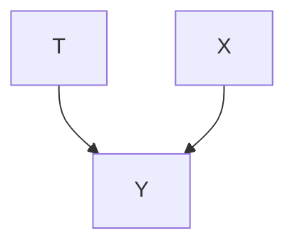

Figure 4.6: Manipulated graph that results from intervening on T, when the original graph is Figure 4.5.

$^{5}$ Active reading exercise: In a general DAG, which set of nodes related to T will always be a sufficient adjustment set? Which set of nodes related to Y will always be a sufficient adjustment set?

Satisfying the backdoor criterion makes W a sufficient adjustment set. $^{5}$ We saw an example of X as a sufficient adjustment set in Section 4.3.1. Because there was only a single backdoor path in Section 4.3.1, a single node (X) was enough to block all backdoor paths, but, in general, there can be multiple backdoor paths.

To introduce $W$ into the proof, we'll use the usual trick of conditioning on variables and marginalizing them out:

$$
P (y \mid d o (t)) = \sum_ {w} P (y \mid d o (t), w) P (w \mid d o (t)) \tag {4.11}
$$

Given that W satisfies the backdoor criterion, we can write the following:

$$
\sum_ {w} P (y \mid d o (t), w) P (w \mid d o (t)) = \sum_ {w} P (y \mid t, w) P (w \mid d o (t)) \tag {4.12}
$$

This follows from the modularity assumption (Assumption 4.1). If $W$ is all of the parents for $Y$ (other than $T$ ), it should be clear that the modularity assumption immediately implies $P(y \mid do(t), w) = P(y \mid t, w)$ . If $W$ isn't the parents of $Y$ but still blocks all backdoor paths another way, then this equality is still true but requires using the graphical knowledge we built up in Chapter 3.

In the manipulated graph (for $P(y \mid do(t), w)$ ), all of the T-Y association flows along the directed path(s) from T to Y, since there cannot be any backdoor paths because T has no incoming edges. Similarly, in the regular graph (for $P(y \mid t, w)$ ), all of the T-Y association flows along the directed path(s) from T to Y. This is because, even though there exist backdoor paths, the association that would flow along them is blocked by W, leaving association to only flow along directed paths. In both cases, association flows along the exact same directed paths, which correspond to the exact same conditional distributions (by the modularity assumption).

Although we've justified Equation 4.12, there is still a $do$ in the expression: $P(w \mid do(t))$ . However, $P(w \mid do(t)) = P(w)$ . To see this, consider how $T$ might have influence $W$ in the manipulated graph. It can't be through any path that has an edge into $T$ because $T$ doesn't have any incoming edges in the manipulated graph. It can't be through any path that has an edge going out of $T$ because such a path would have to have a collider, that isn't conditioned on, on the path. We know any such colliders are not conditioned on because we have assumed that $W$ does not contain descendants of $T$ (second part of the backdoor criterion). $^{6}$ Therefore, we can write the final step:

$$
\sum_ {w} P (y \mid t, w) P (w \mid d o (t)) = \sum_ {w} P (y \mid t, w) P (w) \tag {4.13}
$$

This is known as the backdoor adjustment.

Theorem 4.2 (Backdoor Adjustment) Given the modularity assumption (Assumption 4.1), that W satisfies the backdoor criterion (Definition 4.1), and

$^{6}$ We will come back to what goes wrong if we condition on descendants of T in Section 4.5.3, after we cover some important concepts that we need before we can fully explain that.

positivity (Assumption 2.3), we can identify the causal effect of T on Y:

$$
P (y \mid d o (t)) = \sum_ {w} P (y \mid t, w) P (w)
$$

Here's a concise recap of the proof (Equations 4.11 to 4.13) without all of the explanation/justification:

Proof.

$$
\begin{array}{l} P (y \mid d o (t)) = \sum_ {w} P (y \mid d o (t), w) P (w \mid d o (t)) (4.14) \\ = \sum_ {w} P (y \mid t, w) P (w \mid d o (t)) (4.15) \\ = \sum_ {w} P (y \mid t, w) P (w) (4.16) \\ \end{array}
$$


Relation to d-separation We can use the backdoor adjustment if W d-separates T from Y in the manipulated graph. Recall from Section 3.8 that we mentioned that we would be able to isolate the causal association if T is d-separated from Y in the manipulated graph. “Isolation of the causal association” is identification. We can also isolate the causal association if Y is d-separated from T in the manipulated graph, conditional on W. This is what the first part of the backdoor criterion is about and what we’ve codified in the backdoor adjustment.

## 4.4.1 Relation to Potential Outcomes

Hmm, the backdoor adjustment (Theorem 4.2) looks quite similar to the adjustment formula (Theorem 2.1) that we saw back in the potential outcomes chapter:

$$
\mathbb {E} [ Y (1) - Y (0) ] = \mathbb {E} _ {W} \left[ \mathbb {E} [ Y \mid T = 1, W ] - \mathbb {E} [ Y \mid T = 0, W ] \right] \tag {4.17}
$$

We can derive this from the more general backdoor adjustment in a few steps. First, we take an expectation over Y:

$$
\mathbb {E} [ Y \mid d o (t) ] = \sum_ {w} \mathbb {E} [ Y \mid t, w ] P (w) \tag {4.18}
$$

Then, we notice that the sum over w and $P(w)$ is an expectation (for discrete w, but just replace with an integral if not):

$$
\mathbb {E} [ Y \mid d o (t) ] = \mathbb {E} _ {W} \mathbb {E} [ Y \mid t, W ] \tag {4.19}
$$

And finally, we look at the difference between $T = 1$ and $T = 0$ :

$$
\mathbb {E} [ Y \mid d o (T = 1) ] - \mathbb {E} [ Y \mid d o (T = 0) ] = \mathbb {E} _ {W} \left[ \mathbb {E} [ Y \mid T = 1, W ] - \mathbb {E} [ Y \mid T = 0, W ] \right] \tag {4.20}
$$

Since the do-notation $\mathbb{E}[Y \mid do(t)]$ is just another notation for the potential outcomes $\mathbb{E}[Y(t)]$ , we are done! If you remember, one of the main assumptions we needed to get Equation 4.17 (Theorem 2.1) was conditional exchangeability (Assumption 2.2), which we repeat below:

$$
(Y (1), Y (0)) \perp T \mid W \tag {4.21}
$$

However, we had no way of knowing how to choose W or knowing that that W actually gives us conditional exchangeability. Well, using graphical causal models, we know how to choose a valid W: we simply choose W so that it satisfies the backdoor criterion. Then, under the assumptions encoded in the causal graph, conditional exchangeability provably holds; the causal effect is provably identifiable.

## 4.5 Structural Causal Models (SCMs)

Graphical causal models such as causal Bayesian networks give us powerful ways to encode statistical and causal assumptions, but we have yet to explain exactly what an intervention is or exactly what a causal mechanism is. Moving from causal Bayesian networks to full structural causal models will give us this additional clarity along with the power to compute counterfactuals.

## 4.5.1 Structural Equations

As Judea Pearl often says, the equals sign in mathematics does not convey any causal information. Saying A = B is the same as saying B = A. Equality is symmetric. However, in order to talk about causation, we must have something asymmetric. We need to be able to write that A is a cause of B, meaning that changing A results in changes in B, but changing B does not result in changes in A. This is what we get when we write the following structural equation:

$$
B := f (A), \tag {4.22}
$$

where f is some function that maps A to B. While the usual “=” symbol does not give us causal information, this new “:=” symbol does. This is a major difference that we see when moving from statistical models to causal models. Now, we have the asymmetry we need to describe causal relations. However, the mapping between A and B is deterministic. Ideally, we’d like to allow it to be probabilistic, which allows room for some unknown causes of B that factor into this mapping. Then, we can write the following:

$$
B := f (A, U), \tag {4.23}
$$

where U is some unobserved random variable. We depict this in Figure 4.7, where U is drawn inside a dashed node to indicate that it is unobserved. The unobserved U is analogous to the randomness that we would see by sampling units (individuals); it denotes all the relevant (noisy) background conditions that determine B. More concretely, there are analogs to every part of the potential outcome $Y_{i}(t)$ : B is the analog of Y, A = a is the analog of T = t, and U is the analog of i.

The functional form of $f$ does not need to be specified, and when left unspecified, we are in the nonparametric regime because we aren't making any assumptions about parametric form. Although the mapping is deterministic, because it takes a random variable U (a “noise” or “background conditions” variable) as input, it can represent any stochastic mapping, so structural equations generalize the probabilistic factors $P(x_{i} \mid \text{pa}_{i})$ that we’ve been using throughout this chapter. Therefore, all the results that we’ve seen such as the truncated factorization and the backdoor adjustment still hold when we introduce structural equations.


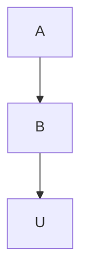

Figure 4.7: Graph for simple structural equation. The dashed node U means that U is unobserved.

Cause and Causal Mechanism Revisited We have now come to the more precise definitions of what a cause is (Definition 3.2) and what a causal mechanism is (introduced in Section 4.2). A causal mechanism that generates a variable is the structural equation that corresponds to that variable. For example, the causal mechanism for B is Equation 4.23. Similarly, X is a direct cause of Y if X appears on the right-hand side of the structural equation for Y. We say that X is a cause of Y if X is a direct cause of any of the causes of $Y^{7}$ or if X is a direct cause of Y.

We only showed a single structural equation in Equation 4.23, but there can be a large collection of structural equations in a single model, which we will commonly label M. For example, we write structural equations for Figure 4.8 below:

$$
B := f _ {B} (A, U _ {B})
$$

$$
M: \quad C := f _ {C} (A, B, U _ {C}) \tag {4.24}
$$

$$
D := f _ {D} (A, C, U _ {D})
$$

In causal graphs, the noise variables are often implicit, rather than explicitly drawn. The variables that we write structural equations for are known as endogenous variables. These are the variables whose causal mechanisms we are modeling – the variables that have parents in the causal graph. In contrast, exogenous variables are variables who do not have any parents in the causal graph; these variables are external to our causal model in the sense that we choose not to model their causes. For example, in the causal model described by Figure 4.8 and Equation 4.24, the endogenous variables are $\{B, C, D\}$ . And the exogenous variables are $\{A, U_{B}, U_{C}, U_{D}\}$ .

## Definition 4.2 (Structural Causal Model (SCM)) A structural causal model is a tuple of the following sets:

1. A set of endogenous variables $V$  
2. A set of exogenous variables $U$  
3. A set of functions $f$ , one to generate each endogenous variable as a function of other variables

For example, M, the set of three equations above in Equation 4.24 constitutes an SCM with corresponding causal graph in Figure 4.8. Every SCM implies an associated causal graph: for each structural equation, draw an edge from every variable on the right-hand side to the variable on the left-hand side.

If the causal graph contains no cycles (is a DAG) and the noise variables $U$ are independent, then the causal model is Markovian; the distribution $P$ is Markov with respect to the causal graph. If the causal graph doesn't contain cycles but the noise terms are dependent, then the model is semi-Markovian. For example, if there is unobserved confounding, the model

$^{7}$ Trust me; the recursion ends. The base case was specified.


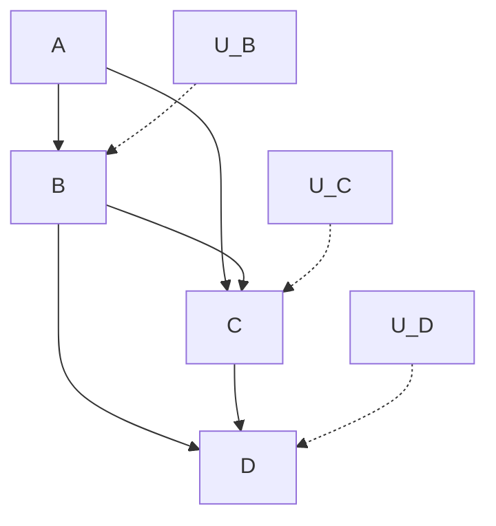

Figure 4.8: Graph for the structural equations in Equation 4.24.

is semi-Markovian. Finally, the graphs of non-Markovian models contain cycles. We will largely be considering Markovian and semi-Markovian models in this book.

## 4.5.2 Interventions

Interventions in SCMs are remarkably simple. The intervention $do(T = t)$ simply corresponds to replacing the structural equation for T with $T := t$ . For example, consider the following causal model M with corresponding causal graph in Figure 4.9:

$$
M: \quad \begin{array}{l} T := f _ {T} (X, U _ {T}) \\ Y := f _ {Y} (X, T, U _ {Y}) \end{array} \tag {4.25}
$$

If we then intervene on $T$ to set it to $t$ , we get the interventional SCM $M_t$ below and corresponding manipulated graph in Figure 4.10.

$$
M _ {t}: \quad \begin{array}{l} T := t \\ Y := f _ {Y} (X, T, U _ {Y}) \end{array} \tag {4.26}
$$

The fact that $do(T = t)$ only changes the equation for T and no other variables is a consequence of the modularity assumption; these causal mechanisms (structural equations) are modular. Assumption 4.1 states the modularity assumption in the context of causal Bayesian networks, but we need a slightly different translation of this assumption for SCMs.

Assumption 4.2 (Modularity Assumption for SCMs) Consider an SCM M and an interventional SCM $M_{t}$ that we get by performing the intervention $do(T = t)$ . The modularity assumption states that M and $M_{t}$ share all of their structural equations except the structural equation for T, which is $T := t$ in $M_{t}$ .

In other words, the intervention $do(T = t)$ is localized to T. None of the other structural equations change because they are modular; the causal mechanisms are independent. The modularity assumption for SCMs is what gives us what Pearl calls the The Law of Counterfactuals, which we briefly mentioned at the end of Section 4.2, after we defined the modularity assumption for causal Bayesian networks. But before we can get to that, we must first introduce a bit more notation.

In the causal inference literature, there are many different ways of writing the unit-level potential outcome. In Chapter 2, we used $Y_{i}(t)$ . However, there are other ways such as $Y_{i}^{t}$ or even $Y_{t}(u)$ . For example, in his prominent potential outcomes paper, Holland [5] uses the $Y_{t}(u)$ notation. In this notation, $u$ is the analog of $i$ , just as we mentioned is the case for the $U$ in Equation 4.23 and the paragraph that followed it. This is the notation that Pearl uses for SCMs as well [see, e.g., 17, Definition 4]. So $Y_{t}(u)$ denotes the outcome that unit $u$ would observe if they take treatment $t$ , given that the SCM is $M$ . Similarly, we define $Y_{M_t}(u)$ as the outcome that unit $u$ would observe if they take treatment $t$ , given that the SCM is $M_t$ (remember that $M_t$ is the same SCM as $M$ but with the structural equation for $T$ changed to $T := t$ ). Now, we are ready to


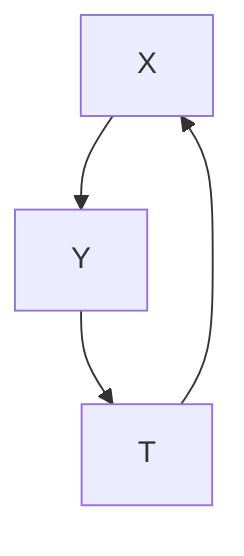

Figure 4.9: Basic causal graph


Figure 4.10: Basic causal with the incoming edges to T removed, due to the intervention $do(T = t)$ .

[5]: Holland (1986), 'Statistics and Causal Inference'

[17]: Pearl (2009), 'Causal inference in statistics: An overview'

present one of Pearl’s two key principles from which all other causal results follow:8

Definition 4.3 (The Law of Counterfactuals (and Interventions))

$$
Y _ {t} (u) = Y _ {M _ {t}} (u) \tag {4.27}
$$

This is called “The Law of Counterfactuals” because it gives us information about counterfactuals. Given an SCM with enough details about it specified, we can actually compute counterfactuals. This is a big deal because this is exactly what the fundamental problem of causal inference (Section 2.2) told us we cannot do. We won’t say more about how to do this until we get to the dedicated chapter for counterfactuals: Chapter 14.

## 4.5.3 Collider Bias and Why to Not Condition on Descendants of Treatment

In defining the backdoor criterion (Definition 4.1) for the backdoor adjustment (Theorem 4.2), not only did we specify that the adjustment set  blocks all backdoor paths, but we also specified that  does not 𝑊 𝑊contain any descendants of . Why? There are two categories of things 𝑇that could go wrong if we condition on descendants of :

1. We block the flow of causation from to .  
𝑇 𝑌2. We induce non-causal association between and .

As we’ll see, it is fairly intuitive why we want to avoid the first category. The second category is a bit more complex, and we’ll break it up into two different parts, each with their own paragraph. This more complex part is actually why we delayed this explanation to after we introduced SCMs, rather than back when we introduced the backdoor criterion/adjustment in Section 4.4.

If we condition on a node that is on a directed path from to $\boldsymbol { Y } ,$ then we 𝑇 𝑌block the flow of causation along that causal path. We will refer to a node on a directed path from to as a mediator, as it mediates the effect of on . For example, in Figure 4.11, all of the causal flow is blocked by . This means that we will measure zero association between  and 𝑀 𝑇 𝑌(given that  blocks all backdoor paths). In Figure 4.12, only a portion of 𝑊the causal flow is blocked by . This is because causation can still flow along the $T  Y$ 𝑀edge. In this case, we will get a non-zero estimate of 𝑇 𝑌the causal effect, but it will still be biased, due to the causal flow that blocks.

If we condition on a descendant of that isn’t a mediator, it could unblock 𝑇a path from  to  that was blocked by a collider. For example, this is 𝑇 𝑌the case with conditioning on in Figure 4.13. This induces non-causal association between and , which biases the estimate of the causal 𝑇 𝑌effect. Consider the following general kind of path, where → · · · → denotes a directed path: $T \to \cdots \to Z  \cdot \cdot \cdot  Y$ . Conditioning on $Z ,$ 𝑇 𝑍 𝑌 𝑍or any descendant of in a path like this, will induce collider bias. That 𝑍is, the causal effect estimate will be biased by the non-causal association that we induce when we condition on or any of its descendants (see Section 3.6).

8 Active reading exercise: Can you recall which was the other key principle/assumption?

Active reading exercise: Take what you now know about structural equations, and relate it to other parts of this chapter. For example, how do interventions in structural equations relate to the modularity assumption? How does the modularity assumption for SCMs (Assumption 4.2) relate to the modularity assumption in causal Bayesian networks (Assumption 4.1)? Does this modularity assumption for SCMs still give us the backdoor adjustment?


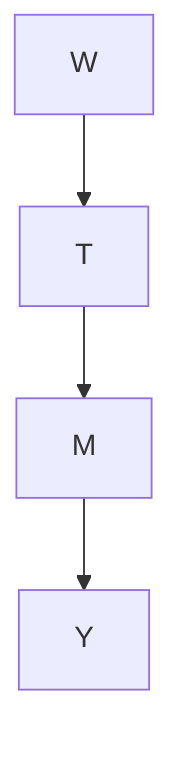

Figure 4.11: Causal graph where all causation is blocked by conditioning on .


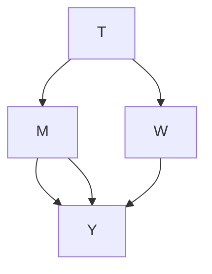

Figure 4.12: Causal graph where part of the causation is blocked by conditioning on .


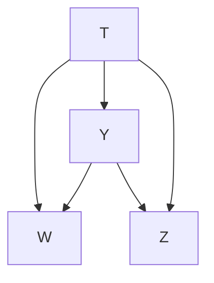

Figure 4.13: Causal graph where conditioning on the collider induces bias.

What about conditioning on  in Figure 4.14? Would that induce bias? 𝑍Recall that graphs are frequently drawn without explicitly drawing the noise variables. If we magnify part of the graph, making ’s noise variable explicit, we get Figure 4.15. Now, we see that $T \right. M \left. U _ { M }$ forms an immorality. Therefore, conditioning on $Z$ 𝑀induces an association between and $U _ { M }$ 𝑍. This induced non-causal association is another form 𝑇 𝑈𝑀of collider bias. You might find this unsatisfying because  is not one of the immoral parents here; rather and $U _ { M }$ are the ones living the 𝑇 𝑈𝑀immoral lifestyle. So why would this change the association between 𝑇and ? One way to get the intuition for this is that there is now induced association flowing between  and $U _ { M }$ through the edge $T  M$ , which 𝑇 𝑈𝑀 𝑇 𝑀is also an edge that causal association is flowing along. You can think of these two types of association getting tangled up along the $T  M$ edge, 𝑇 𝑀making the observed association between  and  not purely causal. See 𝑇 𝑌Pearl [18, Section 11.3.1 and 11.3.3] for more information on this topic.

Note that we actually can condition on some descendants of without inducing non-causal associations between  and . For example, conditioning on descendants of  that aren’t on any causal paths to  won’t 𝑇 𝑌induce bias. However, as you can see from the above paragraph, this can get a bit tricky, so it is safest to just not condition on any descendants of $T ,$ as the backdoor criterion prescribes. Even outside of graphical causal 𝑇models (e.g. in potential outcomes literature), this rule is often applied; it is usually described as not conditioning on any post-treatment covariates.

M-Bias Unfortunately, even if we only condition on pretreatment covariates, we can still induce collider bias. Consider what would happen if we condition on the collider $Z _ { 2 }$ in Figure 4.16. Doing this opens up 𝑍a backdoor path, along which non-causal association can flow. This is known as M-bias due to the M shape that this non-causal association flows along when the graph is drawn with children below their parents. For many examples of collider bias, see Elwert and Winship [19].

## 4.6 Example Applications of the Backdoor Adjustment

## 4.6.1 Association vs. Causation in a Toy Example

In this section, we posit a toy generative process and derive the bias of the associational quantity 𝔼[ | ]. We compare this to the causal quantity $\mathbb { E } [ Y \mid d o ( t ) ]$ 𝑌 𝑡, which gives us exactly what we want. Note that both of 𝑌 𝑡these quantities are actually functions of . If the treatment were binary, 𝑡then we would just look at the difference between the quantities with $T = 1$ and with $T = 0$ . However, because our generative processes will be 𝑇linear, $\textstyle { \frac { d \mathbb { E } [ Y | t ] } { d t } }$ 𝑇and $\frac { d \mathbb { E } [ Y | d o ( t ) ] } { d t }$ actually gives us all the information about 𝑑𝑡 𝑑𝑡the treatment effect, regardless of if treatment is continuous, binary, or multi-valued. We will assume infinite data so that we can work with expectations. This means this section has nothing to do with estimation; for estimation, see the next section

The generative process that we consider has the causal graph in Figure 4.17


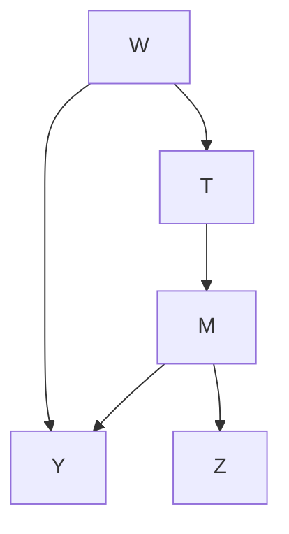

Figure 4.14: Causal graph where the child of a mediator is conditioned on.


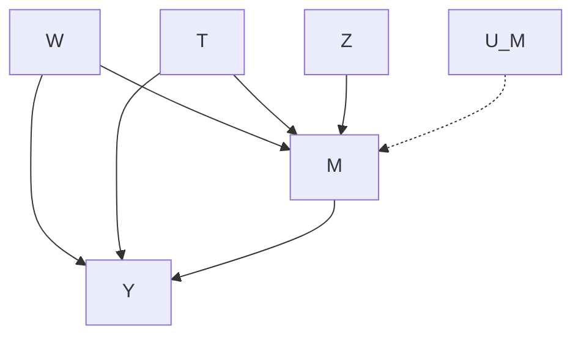

Figure 4.15: Magnified causal graph where the child of a mediator is conditioned on.


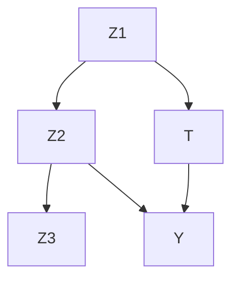

Figure 4.16: Causal graph depicting M-Bias.

and the following structural equations:

$$
T := \alpha_ {1} X \tag {4.28}
$$

$$
Y := \beta T + \alpha_ {2} X. \tag {4.29}
$$

Note that in the structural equation for $Y , \beta$ is the coefficient in front of $T .$ 𝑌This means that the causal effect of  on  is $\beta .$ 𝑇. Keep this in mind as we go through these calculations.

From the causal graph in Figure 4.17, we can see that is a sufficient adjustment set. Therefore, $\mathbb { E } [ Y \mid d o ( t ) ] = \mathbb { E } _ { X } \mathbb { E } [ Y \mid t , X ]$ . Let’s calculate the value of this quantity in our example.

$$
\mathbb {E} _ {X} \mathbb {E} [ Y \mid t, X ] = \mathbb {E} _ {X} \left[ \mathbb {E} [ \beta T + \alpha_ {2} X \mid T = t, X ] \right] \tag {4.30}
$$

$$
= \mathbb {E} _ {X} [ \beta t + \alpha_ {2} X ] \tag {4.31}
$$

$$
= \beta t + \alpha_ {2} \mathbb {E} [ X ] \tag {4.32}
$$

Importantly, we made use of the equality that the structural equation for (Equation 4.29) gives us in Equation 4.30. Now, we just have to take 𝑌the derivative to get the causal effect:

$$
\frac {d \mathbb {E} _ {X} \mathbb {E} [ Y \mid t , X ]}{d t} = \beta . \tag {4.33}
$$

We got exactly what we were looking for. Now, let’s move to the associational quantity:

$$
\mathbb {E} [ Y \mid T = t ] = \mathbb {E} [ \beta T + \alpha_ {2} X \mid T = t ] \tag {4.34}
$$

$$
= \beta t + \alpha_ {2} \mathbb {E} [ X \mid T = t ] \tag {4.35}
$$

$$
= \beta t + \frac {\alpha_ {2}}{\alpha_ {1}} t \tag {4.36}
$$

In Equation 4.36, we made use of the equality that the structural equation for $T$ (Equation 4.28) gives us. If we then take the derivative, we see that 𝑇there is confounding bias:

$$
\frac {d \mathbb {E} [ Y \mid t ]}{d t} = \beta + \frac {\alpha_ {2}}{\alpha_ {1}}. \tag {4.37}
$$

To recap, 𝔼 𝔼[ | ] gave us the causal effect we were looking for 𝑋 𝑌 𝑡, 𝑋(Equation 4.33), whereas the associational quantity $\mathbb { E } [ Y ~ \mid ~ t ]$ did not 𝑌 𝑡(Equation 4.37). Now, let’s go through an example that also takes into account estimation.

## 4.6.2 A Complete Example with Estimation

Recall that we estimated a concrete value for the causal effect of sodium intake on blood pressure in Section 2.5. There, we used the potential outcomes framework. Here, we will do the same thing, but using causal graphs. The spoiler is that the 19% error that we saw in Section 2.5 was due to conditioning on a collider.

First, we need to write down our causal assumptions in terms of a causal graph. Remember that in Luque-Fernandez et al. [8]’s example from epidemiology, the treatment  is sodium intake, and the outcome  is


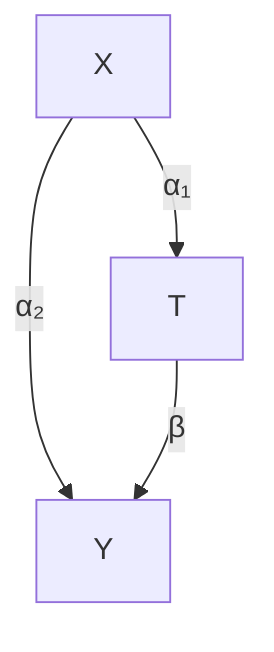

Figure 4.17: Causal graph for toy example

[8]: Luque-Fernandez et al. (2018), ‘Educational Note: Paradoxical collider effect in the analysis of non-communicable disease epidemiological data: a reproducible illustration and web application’blood pressure. The covariates are age  and amount of protein in urine 𝑊(proteinuria) . Age is a common cause of both blood pressure and the body’s ability to self-regulate sodium levels. In contrast, high amounts of urinary protein are caused by high blood pressure and high sodium intake. This means that proteinuria is a collider. We depict this causal graph in Figure 4.18.

Because  is a collider, conditioning on it induces bias. Because  and were grouped together as “covariates”  in Section 2.5, we conditioned on all of them. This is why we saw that our estimate was 19% off from the true causal effect 1.05. Now that we’ve made the causal relationships clear with a causal graph, the backdoor criterion (Definition 4.1) tells us to only adjust for  and to not adjust for . More precisely, we were doing the following adjustment in Section 2.5:

$$
\mathbb {E} _ {W, Z} \mathbb {E} [ Y \mid t, W, Z ] \tag {4.38}
$$

And now, we will use the backdoor adjustment (Theorem 4.2) to change our statistical estimand to the following:

$$
\mathbb {E} _ {W} \mathbb {E} [ Y \mid t, W ] \tag {4.39}
$$

We have simply removed the collider  from the variables we adjust for. 𝑍For estimation, just as we did in Section 2.5, we use a model-assisted estimator. We replace the outer expectation over  with an empirical mean over  and replace the conditional expectation 𝔼[ | ] with a machine learning model (in this case, linear regression).

Just as writing down the graph has lead us to simply not condition on 𝑍in Equation 4.39, the code for estimation also barely changes. We need to change just a single line of code in our previous program (Listing 2.1). We display the full program with the fixed line of code below:

```python
import numpy as np
import pandas as pd
from sklearn.linear_model import LinearRegression

Xt = df[['sodium', 'age']]
y = df['blood_pressure']
model = LinearRegression()
model.fit(Xt, y)

Xt1 = pd.DataFrame.copy(Xt)
Xt1['sodium'] = 1
Xt0 = pd.DataFrame.copy(Xt)
Xt0['sodium'] = 0
ate_est = np.mean(model.predict(Xt1) - model.predict(Xt0))
print('ATE estimate:', ate_est)
```

Namely, we’ve changed line 5 from

```txt
5 | Xt = df[['sodium', 'age', 'proteinuria']]
    in Listing 2.1 to
5 | Xt = df[['sodium', 'age']]
```

in Listing 4.1. When we run this revised code, we get an ATE estimate of 1.0502, which corresponds to 0.02% error (true value is 1.05) when using


Figure 4.18: Causal graph for the blood pressure example.  is sodium intake. 𝑇 𝑌is blood pressure.  is age. And, impor-𝑊tantly, the amount of protein excreted in urine is a collider.

Listing 4.1: Python code for estimating the ATE, without adjusting for the collider

Full code, complete with simulation, is available at https://github.com/ bradyneal/causal-book-code/blob/ master/sodium\_example.py.

a fairly large sample.9

Progression of Reducing Bias When looking at the total association between  and by simply regressing on , we got an estimate that was a staggering 407% off of the true causal effect, due largely to confounding bias (see Section 2.5). When we adjusted for all covariates in Section 2.5, we reduced the percent error all the way down to 19%. In this section, we saw this remaining error is due to collider bias. When we removed the collider bias, by not conditioning on the collider $Z ,$ the error became non-existent.

Potential Outcomes and M-Bias In fairness to the general culture around the potential outcomes framework, it is common to only condition on pretreatment covariates. This would prevent a practitioner who adheres to this rule from conditioning on the collider  in Figure 4.18. However, there is no reason that there can’t be pretreatment colliders that induce M-bias (Section 4.5.3). In Figure 4.19, we depict an example of M-bias that is created by conditioning on $Z _ { 2 }$ . We could fix this by additionally conditioning on $Z _ { 1 }$ and/or $Z _ { 3 } ,$ 𝑍, but in this example, they are unobserved (indicated by the dashed lines). This means that the only way to avoid M-bias in Figure 4.19 is to not condition on the covariates $Z _ { 2 } .$ .

9 Active reading exercise: Given that  is 𝑌generated as a linear function of and , could we have just used the coefficient in front of  in the linear regression as an 𝑇estimate for the causal effect?


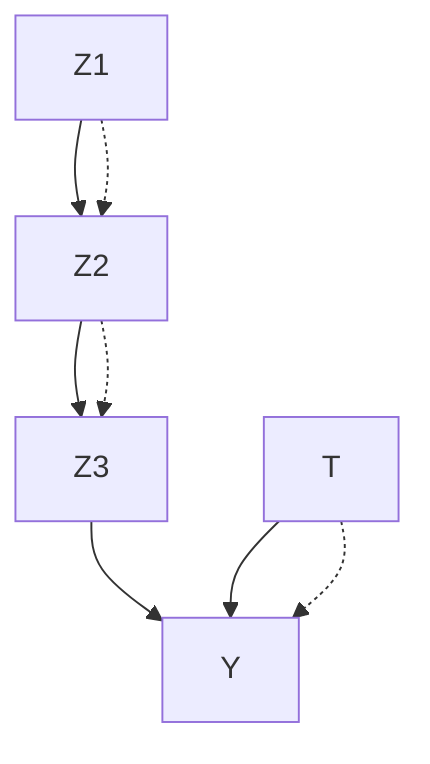

Figure 4.19: Causal graph depicting M-Bias that can only be avoided by not conditioning on the collider $Z _ { 2 } .$ . This is due to 𝑍the fact that the dashed nodes $Z _ { 1 }$ and $Z _ { 3 }$ are unobserved.

## 4.7 Assumptions Revisited

The first main set of assumptions is encoded by the causal graph that we write down. Exactly what this causal graph means is determined by two main assumptions, each of which can take on several different forms:

## 1. The Modularity Assumption

Different forms:

I Modularity Assumption for Causal Bayesian Networks (Assumption 4.1)  
I Modularity Assumption for SCMs (Assumption 4.2)  
I The Law of Counterfactuals (Definition 4.3)

## 2. The Markov Assumption

Different equivalent forms:

I Local Markov assumption (Assumption 3.1)  
I Bayesian network factorization (Definition 3.1)  
I Global Markov assumption (Theorem 3.1)

Given, these two assumptions (and positivity), if the backdoor criterion (Definition 4.1) is satisfied in our assumed causal graph, then we have identification. Note that although the backdoor criterion is a sufficient condition for identification, it is not a necessary condition. We will see this more in Chapter 6.

More Formal If you’re really into fancy formalism, there are some relevant sources to check out. You can see the fundamental axioms that underlie The Law of Counterfactuals in [20, 21], or if you want a textbook, you can find them in [18, Chapter 7.3]. To see proofs of the equivalence of all three forms of the Markov assumption, see, for example, [13, Chapter 3].

Now that you’re familiar with causal graphical models and SCMs, it may be worth going back and rereading Chapter 2 while trying to make connections to what you’ve learned about graphical causal models in these past two chapters.

[20]: Galles and Pearl (1998), ‘An Axiomatic Characterization of Causal Counterfactuals’  
[21]: Halpern (1998), ‘Axiomatizing Causal Reasoning’  
[18]: Pearl (2009), Causality  
[13]: Koller and Friedman (2009), Probabilistic Graphical Models: Principles and Techniques

Connections to No Interference, Consistency, and Positivity The no interference assumption (Assumption 2.4) is commonly implicit in causal graphs, since the outcome  (think ) usually only has a single node 𝑌 𝑌𝑖 𝑇(think ) for treatment as a parent, rather than having multiple treatment nodes $T _ { i } , T _ { i - 1 } , T _ { i + 1 }$ , etc. as parents. However, causal DAGs can be extended to settings where there is interference [22]. Consistency (Assumption 2.5) follows from the axioms of SCMs (see [18, Corollary 7.3.2] and [23]). Positivity (Assumption 2.3) is still a very important assumption that we must make, though it is sometimes neglected in the graphical models literature.

[22]: Ogburn and VanderWeele (2014), ‘Causal Diagrams for Interference’  
[18]: Pearl (2009), Causality  
[23]: Pearl (2010), ‘On the consistency rule in causal inference: axiom, definition, assumption, or theorem?’