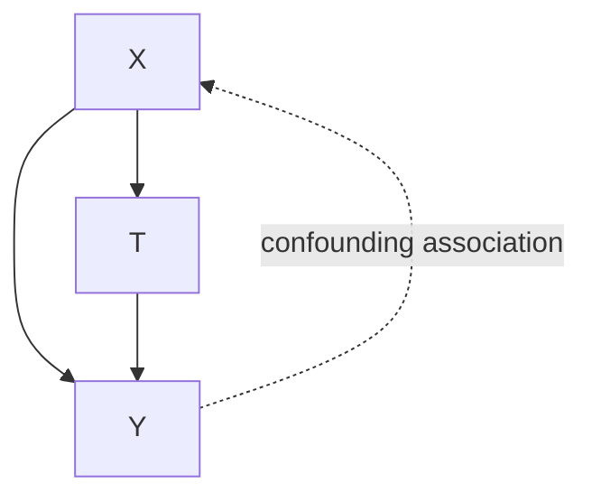
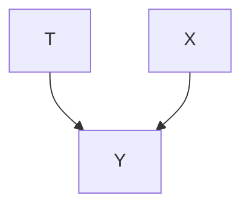

# Randomized Experiments

Randomized experiments are noticeably different from observational studies. In randomized experiments, the experimenter has complete control over the treatment assignment mechanism (how treatment is assigned). For example, in the most simple kind of randomized experiment, the experimenter randomly assigns (e.g. via coin toss) each participant to either the treatment group or the control group. This complete control over how treatment is chosen is what distinguishes randomized experiments from observational studies. In this simple experimental setup, the treatment isn’t a function of covariates at all! In contrast, in observational studies, the treatment is almost always a function of some covariate(s). As we will see, this difference is key to whether or not confounding is present in our data.

In randomized experiments, association is causation. This is because randomized experiments are special in that they guarantee that there is no confounding. As a consequence, this allows us to measure the causal effect $\mathbb { E } [ Y ( 1 ) ] { - } \mathbb { E } [ Y ( 0 ) ]$ via the associational difference $\mathbb { E } [ Y \mid T = 1 ] - \mathbb { E } [ Y \mid T = 0 ]$ . 𝑌 𝑌 𝑌 𝑇 𝑌 𝑇In the following sections, we explain why this is the case from a variety of different perspectives. If any one of these explanations clicks with you, that might be good enough. Definitely stick through to the most visually appealing explanation in Section 5.3.

## 5.1 Comparability and Covariate Balance

Ideally, the treatment and control groups would be the same, in all aspects, except for treatment. This would mean they only differ in the treatment they receive (i.e. they are comparable). This would allow us to attribute any difference in the outcomes of the treatment and control groups to the treatment. Saying that these treatment groups are the same in everything other than their treatment and outcomes is the same as saying they have the same distribution of confounders. Because people often check for this property on observed variables (often what people mean by “covariates”), this concept is known as covariate balance.

Definition 5.1 (Covariate Balance) We have covariate balance if the distribution of covariates  is the same across treatment groups. More formally,

$$
P (X \mid T = 1) \stackrel {d} {=} P (X \mid T = 0) \tag {5.1}
$$

Randomization implies covariate balance, across all covariates, even unobserved ones. Intuitively, this is because the treatment is chosen at random, regardless of $X ,$ so the treatment and control groups should 𝑋look very similar. The proof is simple. Because $T$ is not at all determined by  (solely by a coin flip),  is independent of . This means that

5.1 Comparability and Covariate Balance . . . . . . . . . . 49  
5.2 Exchangeability . . . . . . . 50  
5.3 No Backdoor Paths . . . . . 51

The symbol $\underline { { \underline { { d } } } }$ means “equal in distribution.”$P ( X \mid T = 1 ) { \overset { d } { = } } P ( X )$ . Similarly, it means $P ( X \mid T = 0 ) { \overset { d } { = } } P ( X )$ . Therefore, we have $P ( X \mid T = 1 ) { \overset { d } { = } } P ( X \mid T = 0 )$ .

Although we have proven that randomization implies covariate balance, we have not proven that that covariate balance implies that association is causation.1 We’ll now prove that by showing that $P ( y \mid d o ( t ) ) = P ( y \mid t )$ . For the proof, the main property we utilize is that covariate balance implies  and  are independent.

Proof. First, let  be a sufficient adjustment set that potentially contains 𝑋unobserved variables (randomization also balances unobserved covariates). Such an adjustment set must exist because we allow it to contain any variables, observed or unobserved. Then, we have the following from the backdoor adjustment (Theorem 4.2):

$$
P (y \mid d o (t)) = \sum_ {x} P (y \mid t, x) P (x) \tag {5.2}
$$

By multiplying by 𝑃(𝑡 |𝑥)( | ) ${ \frac { P ( t | x ) } { P ( t | x ) } } .$ , we get the joint distribution in the numerator:

$$
= \sum_ {x} \frac {P (y \mid t , x) P (t \mid x) P (x)}{P (t \mid x)} \tag {5.3}
$$

$$
= \sum_ {x} \frac {P (y , t , x)}{P (t \mid x)} \tag {5.4}
$$

Now, we use the important property that ⊥⊥ :

$$
= \sum_ {x} \frac {P (y , t , x)}{P (t)} \tag {5.5}
$$

An application of Bayes rule and marginalization gives us the rest:

$$
= \sum_ {x} P (y, x \mid t) \tag {5.6}
$$

$$
= P (y \mid t) \tag {5.7}
$$

1 Recall that the intuition is that covariate balance means that everything is the same between the treatment groups, except for the treatment, so the treatment must be the explanation for the change in .

## 5.2 Exchangeability

Exchangeability (Assumption 2.1) gives us another perspective on why randomization makes causation equal to association. To see why, consider the following thought experiment. We decide an individual’s treatment group using a random coin flip as follows: if the coin is heads, we assign the individual to the treatment group $( T = 1 )$ , and if the coins is tails, we assign the individual to the control group $( T = 0 )$ . If the groups are 𝑇exchangeable, we could exchange these groups, and the average outcomes would remain the same. This is intuitively true if we chose the groups with a coin flip. Imagine simply swapping the meaning of “heads” and “tails” in this experiment. Would you expect that to change the results at all? No. This is why randomized experiments give us exchangeability.

Recall from Section 2.3.2 that mean exchangeability is formally the following:

$$
\mathbb {E} [ Y (1) \mid T = 1 ] = \mathbb {E} [ Y (1) \mid T = 0 ] \tag {5.8}
$$

$$
\mathbb {E} [ Y (0) \mid T = 0 ] = \mathbb {E} [ Y (0) \mid T = 1 ] \tag {5.9}
$$

The “exchange” is when we go from (1) in the treatment group to $Y ( 1 )$ 𝑌in the control group (Equation 5.8) and from $Y ( 0 )$ 𝑌 in the control group to (0) in the treatment group (Equation 5.9).

To see the proof of why association is causation in randomized experiments through the lens of exchangeability, recall the proof from Section 2.3.2. First, recall that Equation 5.8 means that both quantities in it are equal to the marginal expected outcome $\mathbb { E } [ Y ( 1 ) ]$ and, similarly, that Equation 5.8 means that both quantities in it are equal to the marginal expected outcome $\mathbb { E } [ Y ( 0 ) ]$ ]. Then, we have the following proof:

$$
\mathbb {E} [ Y (1) ] - \mathbb {E} [ Y (0) ] = \mathbb {E} [ Y (1) \mid T = 1 ] - \mathbb {E} [ Y (0) \mid T = 0 ] \quad (2. 3 \text {   revisited })
$$

$$
= \mathbb {E} [ Y \mid T = 1 ] - \mathbb {E} [ Y \mid T = 0 ] \tag {2.4revisited}
$$

## 5.3 No Backdoor Paths

The final perspective that we’ll look at to see why association is causation in randomized experiments is that of graphical causal models. In regular observational data, there is almost always confounding. For example, in Figure 5.1, we see that  is a confounder of the effect of  on . 𝑋Non-causal association flows along the backdoor path $T \gets X \to Y$ .

However, if we randomize , something magical happens:  no longer 𝑇 𝑇has any causal parents, as we depict in Figure 5.2. This is because is 𝑇purely random. It doesn’t depend on anything other than the output of a coin toss (or a quantum random number generator, if you’re into the kind of stuff). Because  has no incoming edges, under randomization, there are no backdoor paths. So the empty set is a sufficient adjustment set. This means that all of the association that flows from to is causal. We can identify $P ( Y \mid d o ( T = t ) )$ 𝑇 𝑌 by simply applying the backdoor adjustment (Theorem 4.2), adjusting for the empty set:

$$
P (Y \mid d o (T = t)) = P (Y \mid T = t)
$$

With that, we conclude our discussion of why association is causation in randomized experiments. Hopefully, at least one of these three explanations is intuitive to you and easy to store in long-term memory.

Figure 5.1: Causal structure of confounding the effect of  on .

Figure 5.2: Causal structure when we randomize treatment.