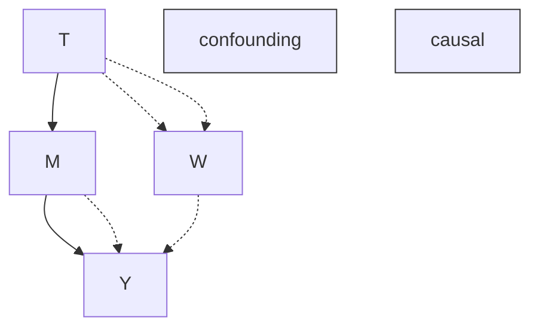
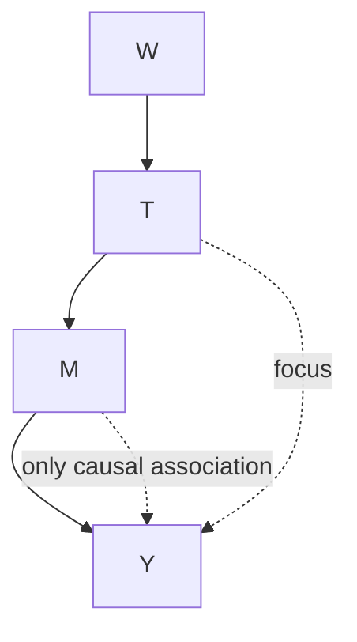
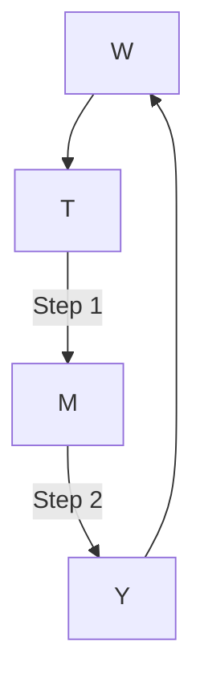
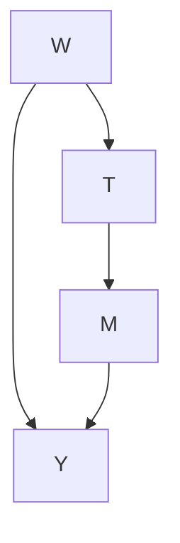
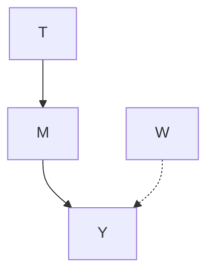
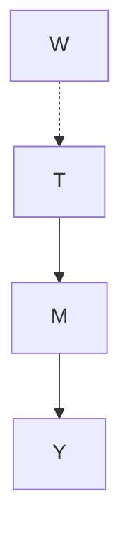
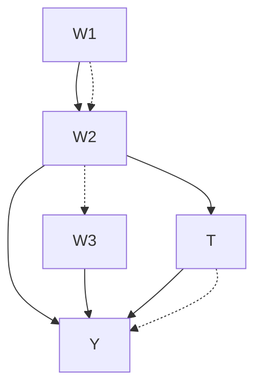
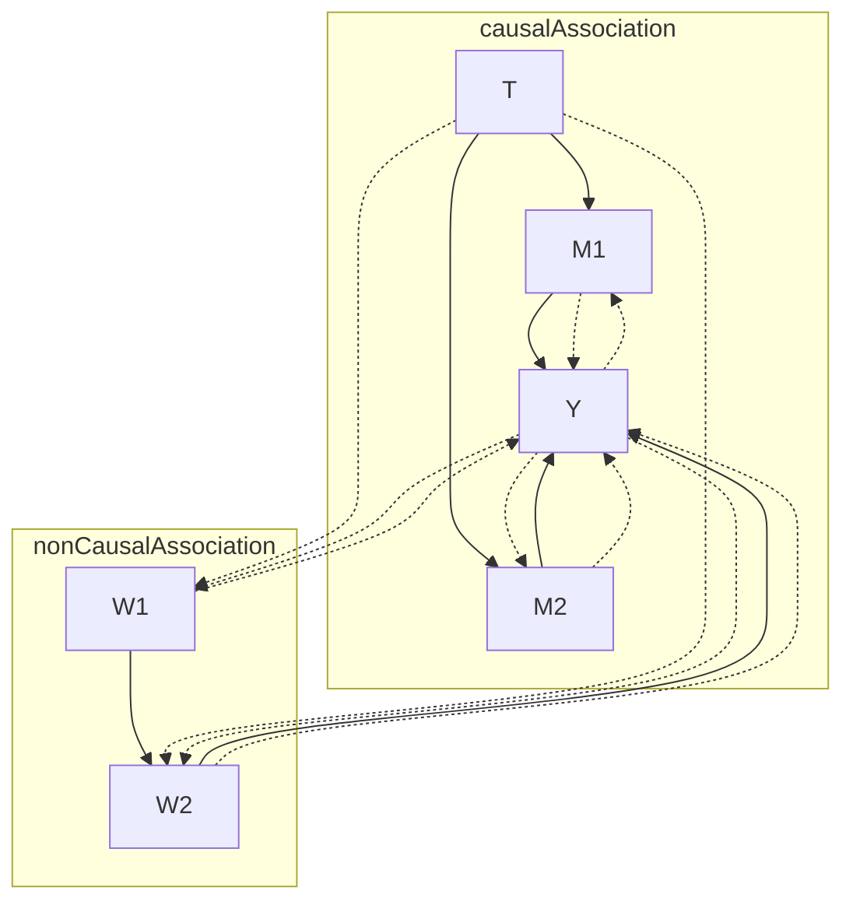
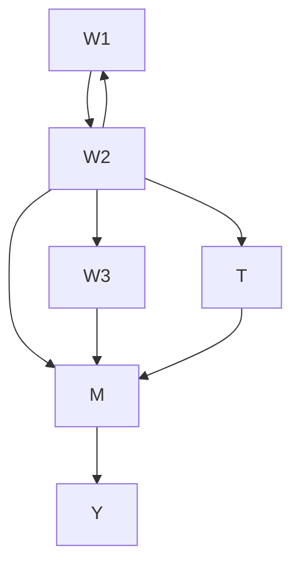
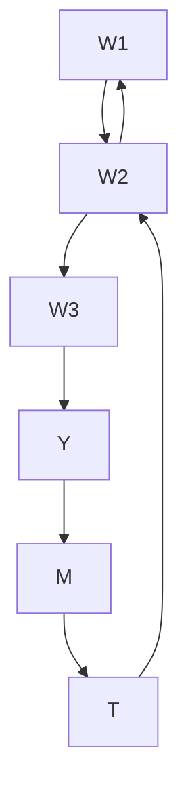

# Nonparametric Identification

In Section 4.4, we saw that satisfying the backdoor criterion is sufficient to give us identifiability, but is the backdoor criterion also necessary? In other words, is it possible to get identifiability without being able to block all backdoor paths?

As an example, consider that we have data generated according to the graph in Figure 6.1. We don’t observe  in this data, so we can’t block the 𝑊backdoor path through  and the confounding association that flows along it. But we still need to identify the causal effect. It turns out that it is possible to identify the causal effect in this graph, using the frontdoor criterion. We’ll see the frontdoor criterion and corresponding adjustment in Section 6.1. Then, we’ll consider even more general identification in Section 6.2 when we introduce do-calculus. We’ll conclude with graphical conditions for identifiability in Section 6.3.

## 6.1 Frontdoor Adjustment

The high-level intuition for why we can identify the causal effect of  on in the graph in Figure 6.1 (even when we can’t adjust for the confounder 𝑌 because it is unobserved) is as follows: a mediator like  is very 𝑊 𝑀helpful; we can isolate the association that flows through  by focusing 𝑀our statistical analysis on , and the only association that flows through 𝑀 is causal association (association flowing along directed paths from 𝑀 𝑇to ). We illustrate this intuition in Figure 6.2, where we depict only the 𝑌causal association. In this section, we will focus our analysis on  using a three step procedure (see Figure 6.3 for our corresponding illustration):

1. Identify the causal effect of on .  
𝑇 𝑀2. Identify the causal effect of on .  
𝑀 𝑌3. Combine the above steps to identify the causal effect of  on .

Step 1 First, we will identify the effect of  on $M \colon P ( m \mid d o ( t ) )$ . Because is a collider on the $T - M$ 𝑇 𝑀 𝑃 𝑚 𝑡path through , it blocks that backdoor path. 𝑌 𝑇 𝑀 𝑊So there are no unblocked backdoor paths from  to . This means that the only association that flows from to is the causal association that 𝑇 𝑀flows along the edge connecting them. Therefore, we have the following identification via the backdoor adjustment (Theorem 4.2, using the empty set as the adjustment set):1

$$
P (m \mid d o (t)) = P (m \mid t) \tag {6.1}
$$

Step 2 Second, we will identify the effect of  on : $P ( y \mid d o ( m ) )$ ). Because  blocks the backdoor path $M  T  W  Y$ 𝑃 𝑦 𝑚, we can simply

6.1 Frontdoor Adjustment . . . 52  
6.2 do-calculus 55

Application: Frontdoor Adjustment . 57

6.3 Determining Identifiability from the Graph . . . 58




Figure 6.1: Causal graph where  is un-𝑊observed, so we cannot block the backdoor path. We depict the flow of causal association and the flow of confounding association with dashed lines.




Figure 6.2: In contrast to Figure 6.1, when we focus our analysis on , we are able 𝑀to isolate only the causal association.




Figure 6.3: Illustration of steps to get to the frontdoor adjustment.

1 Active reading exercise: Write a proof for Equation 6.1 without using the backdoor adjustment. Instead, start from the truncated factorization (Proposition 4.1) like we did in Section 4.3.1. Hint: The proof can be quite short. We provide a proof in Appendix A.1, in case you get stuck.

adjust for . Therefore, using the backdoor adjustment again, we have 𝑇the following:

$$
P (y \mid d o (m)) = \sum_ {t} P (y \mid m, t) P (t) \tag {6.2}
$$

Step 3 Now that we know how changing  changes  (step 1) and how changing  changes  (step 2), we can combine these two to get how 𝑀 𝑌changing  changes  (through ):

$$
P (y \mid d o (t)) = \sum_ {m} P (m \mid d o (t)) P (y \mid d o (m)) \tag {6.3}
$$

The first factor on the right-hand side corresponds to setting  to and observing the resulting value of . The second factor corresponds to setting  to exactly the value  that resulted from setting  and then observing what value of  results. We must sum over  because 𝑌 𝑚( | do( )) is probabilistic, so we must sum over its support. In other 𝑃 𝑚 𝑡words, we must sum over all possible realizations  of the random variables whose distribution is ( | do( )).

If we then plug in Equations 6.1 and 6.2 into Equation 6.3, we get the frontdoor adjustment (keep reading to see the definition of the frontdoor criterion):

Theorem 6.1 (Frontdoor Adjustment) If ( ) satisfy the frontdoor criterion and we have positivity, then

$$
P (y \mid d o (t)) = \sum_ {m} P (m \mid t) \sum_ {t ^ {\prime}} P (y \mid m, t ^ {\prime}) P (t ^ {\prime}) \tag {6.4}
$$

The causal graph we’ve been using (Figure 6.4) is an example of a simple graph that satisfies the frontdoor criterion. To get the full definition, we must first define complete/full mediation: a set of variables  completely 𝑀mediates the effect of  on  if all causal (directed) paths from  to 𝑇 𝑌 𝑇 go through . We now give the general definition of the frontdoor 𝑌criterion:

Definition 6.1 (Frontdoor Criterion) A set of variables  satisfies the 𝑀frontdoor criterion relative to  and  if the following are true:

1.  completely mediates the effect of  on  (i.e. all causal paths from 𝑀to  go through ).  
𝑌 𝑀2. There is no unblocked backdoor path from  to .  
𝑇 𝑀3. All backdoor paths from  to  are blocked by .2

Although Equations 6.1 and 6.2 are straightforward applications of the backdoor adjustment, we hand-waved our way to Equation 6.3, which was key to the frontdoor adjustment (Theorem 6.1). We’ll now walk through how to get Equation 6.3. Active reading exercise: Feel free to stop reading here and do this yourself.

We are about to enter Equationtown (Figure 6.5), so if you are satisfied with the intuition we gave for step 3 and prefer to not see a lot of equations, feel free to skip to the end of the proof (denoted by the symbol).




Figure 6.4: Simple causal graph that satisfies the frontdoor criterion

2 Active reading exercise: Think of a graph other than Figure 6.4 that satisfies the frontdoor criterion. Also, for each condition, think of a graph that does not satisfy only that condition.


equation
much rigor
M
very wow
quick maths
T
Y
W

Figure 6.5: Equationtown

Proof. As usual, we start with the truncated factorization, using the causal graph in Figure 6.4. From the Bayesian network factorization (Definition 3.1), we have the following:

$$
P (w, t, m, y) = P (w)   P (t \mid w)   P (m \mid t)   P (y \mid w, m) \tag {6.5}
$$

Then, using the truncated factorization (Proposition 4.1), we remove the factor for :

$$
P (w, m, y \mid d o (t)) = P (w)   P (m \mid t)   P (y \mid w, m) \tag {6.6}
$$

Next, we marginalize out  and :

$$
\sum_ {m} \sum_ {w} P (w, m, y \mid d o (t)) = \sum_ {m} \sum_ {w} P (w) P (m \mid t) P (y \mid w, m) \tag {6.7}
$$

$$
P (y \mid d o (t)) = \sum_ {m} P (m \mid t) \sum_ {w} P (y \mid w, m) P (w) \tag {6.8}
$$

Even though we’ve removed all the do operators, recall that we are not done because  is unobserved. So we must also remove the  from the expression. This is where we have to get a bit creative.

We want to be able to combine $P ( y \mid w , m )$ and $P ( w )$ into a joint factor over both  and  so that we can marginalize out . To do this, we 𝑦 𝑤need to get behind the conditioning bar of the $P ( w )$ 𝑤factor. This would 𝑚be easy if we could just swap $P ( w )$ out for $P ( w \mid m )$ in Equation $6 . 8 . ^ { 3 }$ 𝑃 𝑤 𝑃 𝑤 𝑚The key thing to notice is that we actually can include  behind the 𝑚conditioning bar if  were also there because  d-separates  from  in 𝑡 𝑇 𝑊Figure 6.6. In math, this means that the following equality holds:

$$
P (w \mid t) = P (w \mid t, m) \tag {6.9}
$$

Great, so how do we get  into this party? The usual trick of conditioning on it and marginalizing it out:

$$
\begin{array}{l} P (y \mid d o (t)) = \sum_ {m} P (m \mid t) \sum_ {w} P (y \mid w, m) P (w) (6.8revisited) \\ = \sum_ {m} P (m \mid t) \sum_ {w} P (y \mid w, m) \sum_ {t ^ {\prime}} P (w \mid t ^ {\prime}) P (t ^ {\prime}) (6.10) \\ = \sum_ {m} P (m \mid t) \sum_ {w} P (y \mid w, m) \sum_ {t ^ {\prime}} P (w \mid t ^ {\prime}, m) P (t ^ {\prime}) (6.11) \\ = \sum_ {m} P (m \mid t) \sum_ {t ^ {\prime}} P (t ^ {\prime}) \sum_ {w} P (y \mid w, m) P (w \mid t ^ {\prime}, m) (6.12) \\ \end{array}
$$

Great, but now we can’t combine $P ( y \mid w , m )$ and $P ( w \mid t ^ { \prime } , m )$ because $P ( y \mid w , m )$ 𝑃 𝑦 𝑤, 𝑚 is missing this newly introduced $t ^ { \prime }$ 𝑃 𝑤 𝑡 , 𝑚behind its conditioning 𝑃 𝑦 𝑤, 𝑚bar. Luckily, we can fix $\mathrm { \ t h a t ^ { 4 } }$ 𝑡and combine the two factors:

$$
\begin{array}{l} = \sum_ {m} P (m \mid t) \sum_ {t ^ {\prime}} P (t ^ {\prime}) \sum_ {w} P (y \mid w, m) P (w \mid t ^ {\prime}, m) (6.13) \\ = \sum_ {m} P (m \mid t) \sum_ {t ^ {\prime}} P (t ^ {\prime}) \sum_ {w} P (y \mid w, t ^ {\prime}, m) P (w \mid t ^ {\prime}, m) (6.14) \\ = \sum_ {m} P (m \mid t) \sum_ {t ^ {\prime}} P (t ^ {\prime}) \sum_ {w} P (y, w \mid t ^ {\prime}, m) (6.15) \\ = \sum_ {m} P (m \mid t) \sum_ {t ^ {\prime}} P (t ^ {\prime}) P (y \mid t ^ {\prime}, m) (6.16) \\ \end{array}
$$

3 Active reading exercise: Why would it be easy to marginalize out  if it were the case that $P ( \bar { w } ) = P ( w \mid m ) ?$ And why 𝑃 𝑤 𝑃 𝑤does this equality not hold?


Figure 6.6: Simple causal graph that satisfies the frontdoor criterion

4 Active reading exercise: Why is $P ( y \mid w , m )$ equal to $P ( y \mid w , t ^ { \prime } , m ) !$This matches the result stated in Theorem 6.1, so we’ve completed the derivation of the frontdoor adjustment without using the backdoor adjustment. However, we still need to show that Equation 6.3 is correct to justify step 3. To do that, all that’s left is to recognize that these parts match Equations 6.1 and 6.2 and plug those in:

$$
= \sum_ {m} P (m \mid d o (t)) P (y \mid d o (m)) \tag {6.17}
$$

$$
P (m \mid d o (t)) = P (m \mid t) \tag {6.1}
$$

$$
P (y \mid d o (m)) = \sum_ {t} P (y \mid m, t) P (t) \tag {6.2}
$$

And we’re done! We just needed to be a bit clever with our uses of dseparation and marginalization. Part of why we went through that proof is because we will prove the frontdoor adjustment using do-calculus in Section 6.2. This way you can easily compare a proof using the truncated factorization to a proof using do-calculus to prove the same result.

## 6.2 do-calculus

As we saw in the last section, it turns out that satisfying the backdoor criterion (Definition 4.1) isn’t necessary to identify causal effects. For example, if the frontdoor criterion (Definition 6.1) is satisfied, that also gives us identifiability. This leads to the following questions: can we identify causal estimands when the associated causal graph satisfies neither the backdoor criterion nor the frontdoor criterion? If so, how? Pearl’s do-calculus [24] gives us the answer to these questions.

As we will see, the do-calculus gives us tools to identify causal effects using the causal assumptions encoded in the causal graph. It will allow us to identify any causal estimand that is identifiable. More concretely, consider an arbitrary causal estimand $P ( Y \mid d o ( T = t ) , X = x )$ , where 𝑃 𝑌 𝑇 𝑡 , 𝑋 𝑥 𝑌is an arbitrary set of outcome variables,  is an arbitrary set of treatment variables, and  is an arbitrary (potentially empty) set of covariates that 𝑋we want to choose how specific the causal effect we’re looking at is. Note that this means we can use do-calculus to identify causal effects where there are multiple treatments and/or multiple outcomes.

In order to present the rules of do-calculus, we must define a bit of notation for augmented versions of the causal graph . Let $G _ { \overline { { X } } }$ denote 𝐺 𝐺𝑋the graph that we get if we take  and remove all of the incoming edges to nodes in the set $X ;$ 𝐺 recall from Section 4.2 that this is known as the 𝑋manipulated graph. Let $G _ { \underline { { X } } }$ denote the graph that we get if we take  and remove all of the outgoing edges from nodes in the set . The mnemonic 𝑋meaning to help you remember this is to think of parents as drawn above their children in the graph, so the bar above  is cutting its incoming 𝑋edges and the bar below  is cutting its outgoing edges. Combining these two, we’ll use $G _ { \overline { { X } } Z }$ 𝑋to denote the graph with the incoming edges to 𝑋𝑍and the outgoing edges from  removed. And recall from Section 3.7 that we use ⊥⊥ ${ \bf \nabla } . \cal { G }$ 𝑍to denote d-separation in . We’re now ready; do-calculus 𝐺consists of just three rules:

[24]: Pearl (1995), ‘Causal diagrams for empirical research’

Theorem 6.2 (Rules of do-calculus) Given a causal graph , an associated distribution , and disjoint sets of variables , , , and , the following rules hold.

Rule 1:

$$
P (y \mid d o (t), z, w) = P (y \mid d o (t), w) \quad i f Y \perp_ {G _ {\overline {{T}}}} Z \mid T, W \tag {6.18}
$$

Rule 2:

$$
P (y \mid d o (t), d o (z), w) = P (y \mid d o (t), z, w) \quad i f Y \perp_ {G _ {\overline {{T}}, \underline {{Z}}}} Z \mid T, W \tag {6.19}
$$

Rule 3:

$$
P (y \mid d o (t), d o (z), w) = P (y \mid d o (t), w) \quad i f Y \perp_ {G _ {\overline {{T}}, \overline {{Z (W)}}}} Z \mid T, W \tag {6.20}
$$

where ( ) denotes the set of nodes of  that aren’t ancestors of any node of in $G _ { \overline { { T } } }$ 𝑊.

Now, rather than recreate the proofs for these rules from Pearl [24], we’ll give intuition for each of them in terms of concepts we’ve already seen in this book.

Rule 1 Intuition If we take Rule 1 and simply remove the intervention do( ), we get the following (Active reading exercise: what familiar concept 𝑡is this?):

$$
P (y \mid z, w) = P (y \mid w) \quad \text { if } Y \perp_ {G} Z \mid W \tag {6.21}
$$

This is just what d-separation gives us under the Markov assumption; recall from Theorem 3.1 that d-separation in the graph implies conditional independence in . This means that Rule 1 is simply a generalization of 𝑃Theorem 3.1 to interventional distributions.

Rule 2 Intuition Just as with Rule 1, we’ll remove the intervention do( ) 𝑡from Rule 2 and see what this reminds us of (Active reading exercise: what concept does this remind you of?):

$$
P (y \mid d o (z), w) = P (y \mid z, w) \quad \text { if } Y \perp_ {G _ {\underline {{Z}}}} Z \mid W \tag {6.22}
$$

This is exactly what we do when we justify the backdoor adjustment (Theorem 4.2) using the backdoor criterion (Definition 4.1). As we saw at the ends of Section 3.8 and Section 4.4. Association is causation if the outcome and the treatment are d-separated by some set of variables that are conditioned on . So rule 2 is a generalization of the backdoor 𝑊adjustment to interventional distributions.

Rule 3 Intuition This is the trickiest rule to understand. Just as with the other two rules, we’ll first remove the intervention do( ) to make thinking about this simpler:

$$
P (y \mid d o (z), w) = P (y \mid w) \quad \text { if } Y \perp_ {G _ {\overline {{Z (W)}}}} Z \mid W \tag {6.23}
$$

To get the equality in this equation, it must be the case that removing the intervention do( ) (which is like taking the manipulated graph and 𝑧reintroducing the edges going into ) introduces no new association 𝑍that can affect . Because do( ) removes the incoming edges to  to give us $G _ { \overline { { Z } } } ,$ 𝑌 𝑧 𝑍 the main association that we need to worry about is association 𝐺𝑍flowing from $Z$ to $Y$ in $G _ { \overline { { Z } } }$ (causal association). Therefore, you might

[24]: Pearl (1995), ‘Causal diagrams for empirical research’expect that the condition that gives us the equality in Equation 6.23 is Y $\perp \perp _ { G _ { \overline { { { Z } } } } } Z \mid W$ . However, we have to refine this a bit to prevent inducing 𝑍association by conditioning on the descendants of colliders (recall from Section 3.6). Namely,  could contain colliders in , and  could contain descendants of these colliders. Therefore, to not induce new association through colliders in  when we reintroduce the incoming edges to $Z$ to get $G ,$ we must limit the set of manipulated nodes to those that are not ancestors of nodes in the conditioning set : ( ).

Completeness of do-calculus Maybe there could exist causal estimands that are identifiable but that can’t be identified using only the rules of do-calculus in Theorem 6.2. Fortunately, Shpitser and Pearl [25] and Huang and Valtorta [26] independently proved that this is not the case. They proved that do-calculus is complete, which means that these three rules are sufficient to identify all identifiable causal estimands. Because these proofs are constructive, they also admit algorithms that identify any causal estimand in polynomial time.

Nonparametric Identification Note that all of this is about nonparametric identification; in other words, do-calculus tells us if we can identify a given causal estimand using only the causal assumptions encoded in the causal graph. If we introduce more assumptions about the distribution (e.g. linearity), we can identify more causal estimands. That would be known as parametric identification. We don’t discuss parametric identification in this chapter, though we will in later chapters.

## 6.2.1 Application: Frontdoor Adjustment

Recall the simple graph we used that satisfies the frontdoor criterion (Figure 6.7), and recall the frontdoor adjustment:

$$
P (y \mid d o (t)) = \sum_ {m} P (m \mid t) \sum_ {t ^ {\prime}} P (y \mid m, t ^ {\prime}) P (t ^ {\prime}) \tag {6.4revisited}
$$

At the end of Section 6.1, we saw a proof for the frontdoor adjustment using just the truncated factorization. To get an idea for how do-calculus works and the intuition we use in proofs that use it, we’ll now do the frontdoor adjustment proof using the rules of do-calculus.

Proof. Our goal is to identify $P ( y \mid d o ( t ) )$ . Because we have the intu-𝑃 𝑦 𝑡ition we described in Section 6.1 that the full mediator  will help us out, the first thing we’ll do is introduce into the equation via the marginalization trick:

$$
P (y \mid d o (t)) = \sum_ {m} P (y \mid d o (t), m) P (m \mid d o (t)) \tag {6.24}
$$

Because the backdoor path from  to  in Figure 6.7 is blocked by the collider $\boldsymbol { Y } ,$ 𝑇 𝑀 all of the association that flows from  to  is causal, so we 𝑌can apply Rule 2 to get the following:

$$
= \sum_ {m} P (y \mid d o (t), m) P (m \mid t) \tag {6.25}
$$

Now, because  is a full mediator of the causal effect of $T$ on $\boldsymbol { Y } ,$ we 𝑀should be able to replace $P ( y \mid d o ( t ) , m )$ with $P ( y \mid d o ( m ) )$ 𝑇 𝑌), but this will

[25]: Shpitser and Pearl (2006), ‘Identification of Joint Interventional Distributions in Recursive Semi-Markovian Causal Models’

[26]: Huang and Valtorta (2006), ‘Pearl’s Calculus of Intervention is Complete’


Figure 6.7: Simple causal graph that satisfies the frontdoor criterion

take two steps of do-calculus. To remove do( ), we’ll need to use Rule 3, 𝑡which requires that  have no causal effect on  in the relevant graph. We can get to a graph like that by removing the edge from  to  (Figure 6.9); 𝑇 𝑀in do-calculus, we do this by using Rule 2 (in the opposite direction as before) to do( ). We can do this because the existing do( ) makes it so 𝑚there are no backdoor paths from  to  in $G _ { \overline { { T } } }$ 𝑡(Figure 6.8).

$$
= \sum_ {m} P (y \mid d o (t), d o (m)) P (m \mid t) \tag {6.26}
$$

Now, as we planned, we can remove the do( ) using Rule 3. We can use 𝑡Rule 3 here because there is no causation flowing from  to  in $G _ { \overline { { M } } }$ (Figure 6.9).

$$
= \sum_ {m} P (y \mid d o (m)) P (m \mid t) \tag {6.27}
$$

All that’s left is to remove this last do-operator. As we discussed in Section 6.1,  blocks the only backdoor path from  to  in the graph 𝑇 𝑀 𝑌(Figure 6.10). This means, that if we can condition on , we can get rid 𝑇of this last do-operator. As usual, we do that by conditioning on and marginalizing out . Rearranging a bit and using 0 for the marginalization 𝑇since  is already present:

$$
= \sum_ {m} P (m \mid t) \sum_ {t ^ {\prime}} P (y \mid d o (m), t ^ {\prime}) P (t ^ {\prime} \mid d o (m)) \tag {6.28}
$$

Now, we can simply apply Rule 2, since blocks the backdoor path from to :

$$
= \sum_ {m} P (m \mid t) \sum_ {t ^ {\prime}} P (y \mid m, t ^ {\prime}) P (t ^ {\prime} \mid d o (m)) \tag {6.29}
$$

And finally, we can apply Rule 3 to remove the last do( ) because there 𝑚is no causal effect of on (i.e. there is no directed path from to in the graph in (Figure 6.10).

$$
= \sum_ {m} P (m \mid t) \sum_ {t ^ {\prime}} P (y \mid m, t ^ {\prime}) P (t ^ {\prime}) \tag {6.30}
$$

That concludes our proof of the frontdoor adjustment using do-calculus. It follows a different path than the proof we gave at the end of Section 6.1, where we used the truncated factorization, but both proofs rely heavily on intuition we get from looking at the graph.

## 6.3 Determining Identifiability from the Graph

It’s nice to know that we can identify any causal estimand that is possible to identify using do-calculus, but this isn’t as satisfying as knowing whether a causal estimand is identifiable by simply looking at the causal graph. For example, the backdoor criterion (Definition 4.1) and the frontdoor criterion (Definition 6.1) gave us simple ways to know for sure that a causal estimand is identifiable. However, there are plenty of







Active reading exercise: Assuming the backdoor criterion, prove the backdoor adjustment using the rules of do-calculus.

causal estimands that are identifiable, even though the corresponding causal graphs don’t satisfy the backdoor or frontdoor criterion. More general graphical criteria exist that will tell us that these estimands are identifiable. We will discuss these more general graphical criteria for identifiability in this section.

Single Variable Intervention When we care about causal effects of an intervention on a single variable, Tian and Pearl [27] provide a relatively simple graphical criterion that is sufficient for identifiability: the unconfounded children criterion.

Definition 6.2 (Unconfounded Children Criterion) This criterion is satisfied if it is possible to block all backdoor paths from the treatment variable to all of its children that are ancestors of  with a single conditioning set.

This criterion generalizes the backdoor criterion (Definition 4.1) and the frontdoor criterion (Definition 6.1). Like them, it is a sufficient condition for identifiability:

Theorem 6.3 (Unconfounded Children Identifiability) Let be the set 𝑌of outcome variables and  be a single variable. If the unconfounded children 𝑇criterion and positivity are satisfied, then $P ( Y = y ~ \vert ~ d o ( T = t ) )$ is identifiable [27].

The intuition for unconfounded children criterion implies identifiability is similar to the intuition for the frontdoor criterion; if we can isolate all of the causal association flowing out of treatment along directed paths to , we have identifiability. To see this intuition, first, consider that all 𝑌of the causal association from must flow through its children. We can 𝑇isolate this causal association if there is no confounding between and 𝑇any of its children.5 This isolation of all of the causal association is what gives us identifiability of the causal effect of  on any other node in the graph. This intuition might lead you to suspect that this criterion is necessary in the very specific case where the outcome set is all of the 𝑌other variables in the graph other than ; it turns out that this is true 𝑇[27]. But this condition is not necessary if is a smaller set than that.

To give you a more visual grasp of the intuition for why the unconfounded children criterion is sufficient for identification, we give an example graph in Figure 6.12. In Figure 6.12a, we visualize the flow of confounding association and causal association that flows in this graph. Then, we depict the isolation of the causal association in that graph in Figure 6.12b.

Necessary Condition The unconfounded children criterion is not necessary for identifiability, but it might aid your graphical intuition to have a necessary condition in mind. Here is one: For each backdoor path from to any child  of  that is an ancestor of , it is possible to block that path [18, p. 92]. The intuition for this is that because the causal association that flows from  to  must go through children of  that are 𝑇 𝑌 𝑇ancestors of , to be able to isolate this causal association, the effect of 𝑌 𝑇on these mediating children must be unconfounded. And a prerequisite to these  −  (parent-child) relationships being unconfounded is that 𝑇 𝑀any single backdoor path from  to  must be blockable (what we state 𝑇 𝑀in this condition). Unfortunately, this condition is not sufficient. To see why, consider Figure 6.11. The backdoor path $T \gets W _ { 1 } \to W _ { 2 } \gets W _ { 3 } \to Y$

[27]: Tian and Pearl (2002), ‘A General Identification Condition for Causal Effects

5 This is analogous to what we saw with the frontdoor criterion in Section 6.1, where we could isolate the causal association flowing through the full mediator 𝑀if the − relationship is unconfounded 𝑇 𝑀(no unblocked backdoor paths).




Figure 6.11: Graph where blocking one backdoor path unblocks another

[18]: Pearl (2009), Causality




(a) Visualization of the flow of confounding association and causal association.


```mermaid
graph TD
  W1 --> T
  W2 --> M1
  T --> M1
  T --> M2
  M1 --> Y
  M2 --> Y
    T -.->|focus| T
    M1 -.->|fasci| M2
    M2 -.->|fasci| Y
    style T fill:#fff,stroke:#000
    style M1 fill:#fff,stroke:#000
    style Y fill:#fff,stroke:#000
    style M2 fill:#fff,stroke:#000
    style W1 fill:#fff,stroke:#000
    style W2 fill:#fff,stroke:#000
    style T fill:#fff,stroke:#000
    style M1 fill:#fff,stroke:#000
    style Y fill:#fff,stroke:#000
    style M2 fill:#fff,stroke:#000
    style W1 -.->| causal association| M1
    style W2 -.->| causal association| M2
```

(b) Visualization of the isolation of the causal association flowing from to 𝑇its children, allowing the unconfounded children criterion to imply identifiability.  
Figure 6.12: Example graph that satisfies the unconfounded children criterion

is blocked by the collider $W _ { 2 } .$ . And we can block the the backdoor path $T \gets W _ { 2 } \to Y$ 𝑊by conditioning on $W _ { 2 }$ . However, conditioning on $W _ { 2 }$ unblocks the other backdoor path where $W _ { 2 }$ is a collider. Being able to block both paths individually does not mean we can block them both with a single conditioning set. In sum, the unconfounded children criterion is sufficient but not necessary, and this related condition is necessary but not sufficient. Also, everything we’ve seen in this section so far is for a single variable intervention.

Necessary and Sufficient Conditions for Multiple Variable Interventions Shpitser and Pearl [25] provide a necessary and sufficient criterion for identifiability of $P ( Y = y ~ \vert ~ d o ( T = t ) )$ when  and  are arbitrary 𝑃 𝑌 𝑦 𝑇 𝑡 𝑌 𝑇sets of variables: the hedge criterion. However, this is outside the scope of this book, as it requires more complex objects such as hedges, Ctrees, and other leafy objects. Moving further along, Shpitser and Pearl [28] provide a necessary and sufficient criterion for the most general type of causal estimand: conditional causal effects, which take the form $P ( Y = y ~ \vert ~ d o ( T = t ) , X = x )$ , where $\boldsymbol { Y } , \boldsymbol { T } ,$ , and  are all arbitrary sets of 𝑃 𝑌 𝑦variables.

## Active reading exercises:

1. Is the unconfounded criterion (Definition 6.2) satisfied in Figure 6.13a?  
2. Is the unconfounded criterion satisfied in Figure 6.13b?  
3. Can we get identifiability in Figure 6.13b via any simpler criterion that we’ve seen before?

[25]: Shpitser and Pearl (2006), ‘Identification of Joint Interventional Distributions in Recursive Semi-Markovian Causal Models’

[28]: Shpitser and Pearl (2006), ‘Identification of Conditional Interventional Distributions’







(b)  
Figure 6.13: Graphs for the questions about the unconfounded children criterion