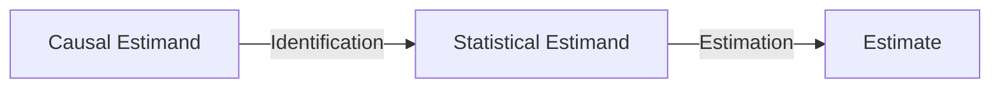
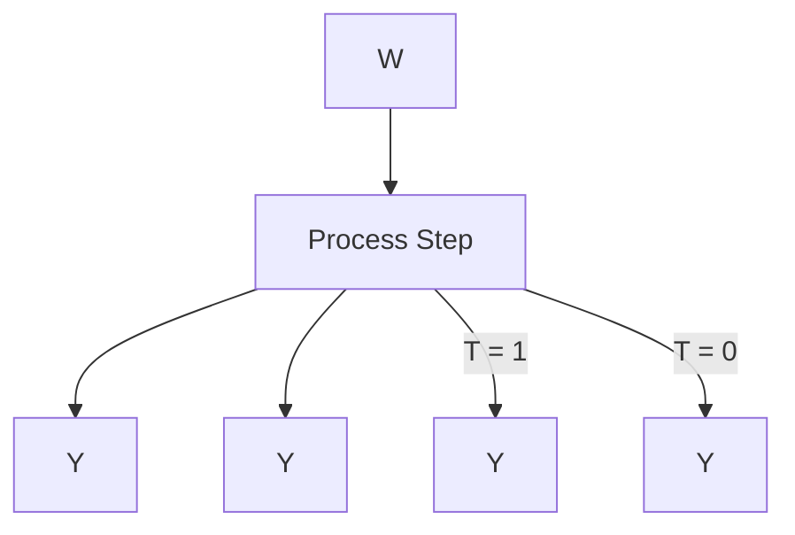
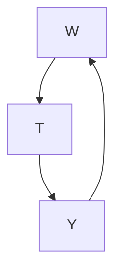
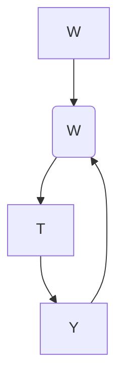
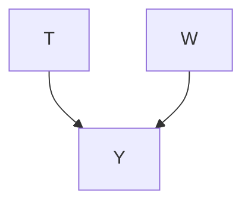

# Estimation

In the previous chapter, we covered identification. Once we identify some causal estimand by reducing it to a statistical estimand, we still have more work to do. We need to get a corresponding estimate. In this chapter, we’ll cover a variety of estimators that we can use to do this. This isn’t meant to be anywhere near exhaustive as there are many different estimators of causal effects, but it is meant to give you a solid introduction to them.

All of the estimators that we include full sections on are model-assisted estimators (recall from Section 2.4). And they all work with arbitrary statistical models such as the ones you might get from scikit-learn [29].

## 7.1 Preliminaries

Recall from Chapter 2 that we denote the individual treatment effect (ITE) with $\tau _ { i }$ and average treatment effect (ATE) with 𝜏:

$$
\tau_ {i} \triangleq Y _ {i} (1) - Y _ {i} (0) \tag {7.1}
$$

$$
\tau \triangleq \mathbb {E} [ Y _ {i} (1) - Y _ {i} (0) ] \tag {7.2}
$$

ITEs are the most specific kind of causal effects, but they are hard to estimate without strong assumptions (on top of those discussed in Chapters 2 and 4). However, we often want to estimate causal effects that are a bit more individualized than the ATE.

For example, say we’ve observed an individual’s covariates ; we might 𝑥like to use those to estimate a more specific effect for that individual (and anyone else with covariates ). This brings us to the conditional average treatment effect (CATE) 𝜏( ):

$$
\tau (x) \triangleq \mathbb {E} [ Y _ {i} (1) - Y _ {i} (0) \mid X = x ] \tag {7.3}
$$

The that is conditioned on does not need to consist of all of the observed 𝑋covariates, but this is often the case when people refer to CATEs. We call that individualized average treatment effects (IATEs).

ITEs and “CATEs” (what we call IATEs) are sometimes conflated, but they are not the same. For example, two individuals could have the same covariates, but their potential outcomes could be different because of other unobserved differences between these individuals. If we encompass everything about an individual that is relevant to their potential outcomes in the vector $I ,$ then ITEs and “CATEs” are the same if  = . In a causal 𝐼 𝑋 𝐼graph,  corresponds to all of the exogenous variables in the magnified 𝐼graph that have causal association flowing to $Y . ^ { 1 }$

7.1 Preliminaries . . . 62

7.2 Conditional Outcome Modeling (COM) . . 63

7.3 Grouped Conditional Outcome Modeling (GCOM) . 64

7.4 Increasing Data Efficiency . 65 TARNet . . 65 X-Learner 66

7.5 Propensity Scores . . . . . . 67

7.6 Inverse Probability Weighting (IPW) . . 68

7.7 Doubly Robust Methods . . 70

7.8 Other Methods . . . . . . . . 70

7.9 Concluding Remarks . . . . 71 Confidence Intervals . . . . 71 Comparison to Randomized Experiments . . . 72

[29]: Pedregosa et al. (2011), ‘Scikit-learn: Machine Learning in Python’Unconfoundedness Throughout this chapter, whenever we are estimating an ATE, we will assume that  is a sufficient adjustment set, and whenever we are estimating a CATE, we will assume that  ∪  is a 𝑊 𝑋sufficient adjustment set. In other words, for ATE estimation, we assume that  satisfies the backdoor criterion (Definition 4.1); equivalently for 𝑊ATE estimation, we assume that we have conditional exchangeability given  (Assumption 2.2). And similarly for CATE estimation, assuming 𝑊 ∪  is a sufficient adjustment set means that we are assuming that 𝑊 𝑋 ∪  satisfies the backdoor criterion $/$ gives us unconfoundedness. 𝑊 𝑋This unconfoundedness assumption gives us parametric identification2 and allows us to focus on estimation in this chapter.

## 7.2 Conditional Outcome Modeling (COM)

We are interested in estimating the ATE 𝜏. We’ll start with recalling the adjustment formula (Theorem 2.1), which can be derived as a corollary of the backdoor adjustment (Theorem 4.2), as we saw in Section 4.4.1:

$$
\tau \triangleq \mathbb {E} [ Y (1) - Y (0) ] = \mathbb {E} _ {W} \left[ \mathbb {E} [ Y \mid T = 1, W ] - \mathbb {E} [ Y \mid T = 0, W ] \right] \quad (7. 4)
$$

On the left-hand side of Equation 7.4, we have a causal estimand, and on the right-hand side, we have a statistical estimand (i.e. we have identified this causal quantity). Then, the next step in the Identification-Estimation Flowchart (see Figure 7.1 reproduced from Section 2.4) is to get an estimate of this (statistical) estimand.

$^ 2 \mathrm { B y }$ “parametric identification,” we mean identification under the parametric assumptions of our statistical models. For example, these assumptions are for extrapolation if we don’t have positivity.




Figure 7.1: The Identification-Estimation Flowchart – a flowchart that illustrates the process of moving from a target causal estimand to a corresponding estimate, through identification and estimation.

The most straightforward thing to do is to just fit a statistical model (machine learning model) to the conditional expectation 𝔼[ | ] and then approximate $\mathbb { E } _ { W }$ 𝑌 𝑇, 𝑊with an empirical mean over the  data points $\begin{array} { r } { \big ( { \frac { 1 } { n } } \sum _ { i } \big ) } \end{array}$ 𝑊 𝑛. And this is exactly what we did in the simple examples of 𝑛 𝑖estimation in Sections 2.5 and 4.6.2. To make this more clear, we introduce $\mu$ in place of this conditional expectation:

$$
\mu (1, w) - \mu (0, w) \triangleq \mathbb {E} [ Y \mid T = 1, W = w ] - \mathbb {E} [ Y \mid T = 0, W = w ] (7. 5)
$$

Then, we can fit a statistical model to $\mu .$ We will denote that these fitted models are approximations of $\mu$ with a hat: ${ \hat { \mu } } .$ . We will refer to a model $\hat { \mu }$ as a conditional outcome model. Now, we can cleanly write the model-assisted estimator (for the ATE) that we’ve described:

$$
\hat {\tau} = \frac {1}{n} \sum_ {i} \left(\hat {\mu} (1, w _ {i}) - \hat {\mu} (0, w _ {i})\right) \tag {7.6}
$$

We will refer to estimators that take this form as conditional outcome model (COM) estimators. Because minimizing the mean-squared error (MSE) of predicting  from ( ) pairs is equivalent to modeling this conditional 𝑌 𝑇, 𝑋expectation [see, e.g., 10, Section 2.4], there are many different models we

Active reading exercise: What are the two different approximations we make in this estimator and what parts of the statistical estimand in Equation 7.4 do each of them replace?

[10]: Hastie et al. (2001), The Elements of Statistical Learningcan use for $\hat { \mu }$ in Equation 7.6 to get a COM estimator $( \mathrm { s e e } , \mathrm { e } . \mathrm { g } .$ , scikit-learn [29]).

For CATE estimation, because we assumed that  ∪  is a sufficient adjustment set, rather than just $W , ^ { 3 }$ 𝑊 𝑋we must additionally add $X$ as an input to our conditional outcome model. More precisely, for CATE estimation, we define $\mu$ as follows:

$$
\mu (t, w, x) \triangleq \mathbb {E} [ Y \mid T = t, W = w, X = x ] \tag {7.7}
$$

Then, we train a statistical model $\hat { \mu }$ to predict $Y$ from $( T , W , X )$ . And this 𝑌 𝑇, 𝑊gives us the following COM estimator for the CATE 𝜏( ):

$$
\hat {\tau} (x) = \frac {1}{n _ {x}} \sum_ {i: x _ {i} = x} \left(\hat {\mu} (1, w _ {i}, x) - \hat {\mu} (0, w _ {i}, x)\right) \tag {7.8}
$$

where $n _ { x }$ is the number of data points that have $x _ { i } = x$ . When we are 𝑛𝑥 𝑥𝑖 𝑥interested in the IATE (CATE where  is all of the observed covariates), $n _ { x }$ 𝑋is often 1, which simplifies our estimator to a simple difference between predictions:

$$
\hat {\tau} (x _ {i}) = \hat {\mu} (1, w _ {i}, x _ {i}) - \hat {\mu} (0, w _ {i}, x _ {i}) \tag {7.9}
$$

Even, though IATEs are different from ITEs $( \tau ( x _ { i } ) \neq \tau _ { i } )$ , if we really want to give estimates for ITEs, it is relatively common to take this estimator as our estimator of the ITE $\tau _ { i }$ as well:

$$
\hat {\tau} _ {i} = \hat {\tau} (x _ {i}) = \hat {\mu} (1, w _ {i}, x _ {i}) - \hat {\mu} (0, w _ {i}, x _ {i}) \tag {7.10}
$$

Though, this will likely be unreliable due to severe positivity violation.4

The Many-Faced Estimator COM estimators have many different names in the literature. For example, they are often called G-computation estimators, parametric G-formula, or standardization in epidemiology and biostatistics. Because we are fitting a single statistical model for $\mu$ here, “COM estimator” is sometimes referred to as an “S-learner,” where the $\prime \prime \mathrm { S } ^ { \prime \prime }$ stands for “single.”

## 7.3 Grouped Conditional Outcome Modeling (GCOM)

In order to get the estimate in Equation $7 . 6 ,$ we must train a model that predicts from ( ). However, is often one-dimensional, whereas 𝑌 𝑇, 𝑊 𝑇 can be high-dimensional. But the input to $\hat { \mu }$ for  is the only thing that 𝑊changes between the two terms inside the sum $\hat { \mu } ( 1 , w _ { i } ) { - } \hat { \mu } ( 0 , w _ { i } )$ . Imagine concatenating $T$ , 𝑤𝑖 , 𝑤𝑖to a 100-dimensional vector  and then feeding that 𝑇through a neural network that we’re using for $\hat { \mu } .$ 𝑊. It seems reasonable that the network could ignore $T$ while focusing on the other 100 dimensions 𝑇of its input. This would result in an ATE estimate of zero. And, indeed, there is some evidence of COM estimators being biased toward zero [30].

So how can we ensure that the model $\hat { \mu }$ doesn’t ignore ? Well, we can just train two different models $\hat { \mu } _ { 1 } ( w )$ and $\hat { \mu } _ { 0 } ( w )$ 𝑇 that model $\mu _ { 1 } ( w )$ and

[29]: Pedregosa et al. (2011), ‘Scikit-learn: Machine Learning in Python’

Active reading exercise: Why do we additionally add to the adjustment set when we are interested in CATEs?

Active reading exercise: Write down the causal estimand and statistical estimand that lead us to the estimator in Equation 7.8, and proof that they’re equal under unconfoundedness and positivity. In other words, identify the CATE.

4 Active reading exercise: Why is there a severe positivity violation here? Does this only apply in Equation 7.10 or also in Equation 7.9? What if there were multiple units with $x _ { i } = x ?$

[30]: Künzel et al. (2019), ‘Metalearners for estimating heterogeneous treatment effects using machine learning’$\mu _ { 0 } ( w )$ , respectively, where

$$
\mu_ {1} (w) \triangleq \mathbb {E} [ Y \mid T = 1, W = w ] \quad \text { and } \quad \mu_ {0} (w) \triangleq \mathbb {E} [ Y \mid T = 0, W = w ]. \tag {7.11}
$$

Using two separate models for the values of treatment ensures that 𝑇cannot be ignored. To train these statistical models, we first group the data into a group where $T = 1$ and a group where $T = 0 .$ . Then, we train $\hat { \mu } _ { 1 } ( w )$ 𝑇 to predict  from  in the group where $T = 1$ . And, similarly, we train $\hat { \mu } _ { 0 } ( w )$ to predict  from  in the group where $T = 0 .$ . This gives us a natural derivative of COM estimators (Equation 7.6), grouped conditional outcome model (GCOM) estimators:5

$$
\hat {\tau} = \frac {1}{n} \sum_ {i} \left(\hat {\mu} _ {1} (w _ {i}) - \hat {\mu} _ {0} (w _ {i})\right) \tag {7.12}
$$

And just as we saw, in Equation 7.8, we can add  as an input to $\hat { \mu } _ { 1 }$ and $\hat { \mu } _ { 0 }$ to get a GCOM estimator for the CATE 𝜏( ):

$$
\hat {\tau} (x) = \frac {1}{n _ {x}} \sum_ {i: x _ {i} = x} \left(\hat {\mu} _ {1} (w _ {i}, x) - \hat {\mu} _ {0} (w _ {i}, x)\right) \tag {7.13}
$$

While GCOM estimation seems to fix the problem that COM estimation can have regarding bias toward zero treatment effect, it does have an important downside. In COM estimation, we were able to make use of all the data when we estimate the single model $\hat { \mu } .$ . However, in grouped conditional outcome model estimation, we only use the $T = 1$ group to estimate $\hat { \mu } _ { 1 . }$ , and we only use the $T = 0$ group to estimate $\hat { \mu } _ { 0 }$ . Importantly, we are missing out on making the most of our data by not using all of the data to estimate $\hat { \mu } _ { 1 }$ and all of the data to estimate $\dot { \mu } _ { 0 }$ .

## 7.4 Increasing Data Efficiency

In this section, we’ll cover two ways to address the problem of data efficiency that we mentioned is present in GCOM estimation at the end of the last section: TARNet (Section 7.4.1) and X-Learner (Section 7.4.2).

## 7.4.1 TARNet

Consider that we’re using neural networks for our statistical models; starting with that, we’ll contrast, vanilla COM estimation, GCOM estimation, and TARNet. In vanilla COM estimation, the neural network is used to predict  from ( ) (see Figure 7.2a). This has the problem of poten-𝑌 𝑇, 𝑊tially yielding ATE estimates that are biased toward zero, as the network might ignore the scalar , especially when  is high-dimensional. We 𝑇 𝑊ensure that  can’t be ignored in GCOM estimation by using two separate 𝑇neural networks for the two treatment groups (Figure 7.2b). However, this is inefficient as we only use the treatment group data for training one network and the control group data for training the other network.

We can achieve a middle ground between vanilla COM estimation and GCOM estimation using Shalit et al. [31]’s TARNet. With TARNet, we use a single network that takes only  as input but then branches off into

5 Künzel et al. [30] call a GCOM estimator a “T-learner” where the “T” is for $\mathrm { ^ { \prime \prime } t w o ^ { \prime \prime } }$ because it requires fitting two different models: $\hat { \mu } _ { 1 }$ and 𝜇ˆ 0.

[31]: Shalit et al. (2017), ‘Estimating individual treatment effect: generalization bounds and algorithms’two separate heads (sub-networks) for each treatment group. We then use this model for $\mu ( t , w )$ to get a COM estimator. This has the advantage of learning a treatment-agnostic representation (TAR) of  using all of 𝑊the data while still forcing the model to not ignore  by branching into 𝑇two heads for the different values of . In other words, TARNet uses the knowledge we have about  (as a uniquely important variable) in 𝑇its architecture. Still, the sub-networks for each of these heads are only trained with the data for the corresponding treatment group, rather than all of the data.6

6 Active reading exercise: Which parts of TARNet are like Figure 7.2a and which parts are like Figure 7.2b? What advantages/disadvantages do Figures 7.2a to 7.2c have relative to each other?


(a) A single neural network to model $\mu ( t , w ) ,$ used in vanilla COM estimation 𝑡 , 𝑤(Section 7.2).


```mermaid
graph LR
  W --> Y
    style W fill:#fff,stroke:#000
    style Y fill:#fff,stroke:#000
    style T = 1 network
```


```mermaid
graph LR
  W --> Y
    style W fill:#fff,stroke:#000
    style Y fill:#fff,stroke:#000
    style T = 0 network
```

(b) Two neural networks: a network to model 𝜇1( ) (top) and a network to model 𝑤𝜇0( ) (bottom), used in GCOM estimation 𝑤(Section 7.3).




(c) TARNet [31]. A single neural network to model $\mu ( t ,$ ) that branches off into two 𝑡,heads: one for $\dot { T } = 1$ and one for $T = 0 .$ .  
Figure 7.2: Coarse neural networks architectures for vanilla COM estimation (left), GCOM estimation (middle), and TARNet (right). In this figure, we use each arrow to denote a sub-network that has an arbitrary number of layers.

## 7.4.2 X-Learner

We just saw that one way to increase data efficiency relative to GCOM estimation is to use TARNet, a COM estimator that shares some qualities with GCOM estimators. However, TARNet still doesn’t use all of the data for the full model (neural network). In this section, we will start with GCOM estimation and build on it to create a class of estimators that use all of the data for both models that are part of the estimators. An estimator in this class is known as an X-learner [30]. Unlike TARNet, X-learners are neither COM estimators nor GCOM estimators.

There are three steps to X-learning, and the first step is the exact same as what’s used in GCOM estimation: estimate $\hat { \mu } _ { 1 } ( x )$ using the treatment group data and estimate $\hat { \mu } _ { 0 } ( x )$ 𝑥 using the control group data.7 As before, 𝑥this can be done with any models that minimize MSE. For simplicity, in this section, we’ll be considering IATEs ( is all of the observed 𝑋variables) where satisfies the backdoor criterion ( contains and 𝑋no descendants of ).

The second step is the most important part as it is both where we end up using all of the data for both models and where the $\prime \prime \mathrm { { x } } ^ { \prime \prime }$ comes from. We specify $\widehat { \tau } _ { 1 , i }$ for the treatment group ITE estimates and $\widehat { \tau } _ { 0 , i }$ for the control

[30]: Künzel et al. (2019), ‘Metalearners for estimating heterogeneous treatment effects using machine learning’

7 Recall that $\hat { \mu } _ { 1 } ( w )$ and $\hat { \mu } _ { 0 } ( w )$ are approximations of ${ \bar { \mathbb { E } } } [ Y \mid T \stackrel { \cdot } { = } 1 , W \ =$ ] and $\mathbb { E } [ Y \mid T = 0 , W = w ]$ , 𝑊, respectively.

group ITE estimates:

$$
\hat {\tau} _ {1, i} = Y _ {i} (1) - \hat {\mu} _ {0} (x _ {i}) \tag {7.14}
$$

$$
\hat {\tau} _ {0, i} = \hat {\mu} _ {1} (x _ {i}) - Y _ {i} (0) \tag {7.15}
$$

Here, $\widehat { \tau } _ { 1 , i }$ is estimated using the treatment group outcomes and the ,𝑖imputed counterfactual that we get from $\hat { \mu } _ { 0 }$ . Similarly, $\widehat { \tau } _ { 0 , i }$ is estimated ,𝑖using the control group outcomes and the imputed counterfactual that we get from $\hat { \mu } _ { 1 }$ . If you draw a line between the observed potential outcomes and a line between the imputed potential outcomes, you can see the $\mathbf { \chi } ^ { \prime \prime }$ shape. Importantly, this $\mathbf { \chi } ^ { \prime \prime }$ tells us that each treatment group ITE estimate $\widehat { \tau } _ { 1 , i }$ uses both treatment group data (its observed potential ,𝑖outcome under treatment), and control group data (in $\hat { \mu } _ { 0 } )$ . Similarly, $\widehat { \tau } _ { 0 , i }$ is estimated with data from both treatment groups.

However, each ITE estimate only uses a single data point from its corresponding treatment group. We can fix this by fitting a model $\hat { \tau } _ { 1 } ( x )$ to predict $\widehat { \tau } _ { 1 , i }$ from the corresponding treatment group $x _ { i } ^ { \prime } \mathbf { s } .$ 𝑥. Finally, we ,𝑖have a model $\hat { \tau } _ { 1 } ( x )$ 𝑖 that was fit using all of the data (treatment group data just now and control group data when $\mu _ { 0 }$ was fit in step 1). Similarly, we can fit a model $\hat { \tau } _ { 0 } ( x )$ to predict $\widehat { \tau } _ { 0 , i }$ from the corresponding control group $x _ { i } ^ { \prime } \mathbf { s }$ 𝑥 ,𝑖. The output of step 2 is two different estimators for the IATE: $\hat { \tau } _ { 1 } ( x )$ 𝑥𝑖 and $\hat { \tau } _ { 0 } ( x )$ .

Finally, in step 3, we combine $\hat { \tau } _ { 1 } ( x )$ and $\hat { \tau } _ { 0 } ( x )$ together to get our IATE estimator:

$$
\hat {\tau} (x) = g (x) \hat {\tau} _ {0} (x) + (1 - g (x)) \hat {\tau} _ {1} (x) \tag {7.16}
$$

where $g ( x )$ is some weighting function that produces values between 0 𝑔 𝑥and 1. Künzel et al. [30] report that an estimate of the propensity score (introduced in next section) works well, but that choosing the constant function 0 or 1 also makes sense if the treatment groups are very different sizes. Or that choosing $g ( x )$ to minimize the variance of $\hat { \tau } ( x )$ could also be attractive.

## 7.5 Propensity Scores

Given that the vector of variables  satisfies the backdoor criterion (or, equivalently, that $( Y ( 1 ) , Y ( 0 ) ) \bot \bot T \mid W )$ , we might wonder if it is really 𝑌 , 𝑌 𝑇 𝑊necessary to condition on that whole vector to isolate causal association, especially when is high-dimensional. It turns out that it isn’t. If 𝑊 𝑊satisfies unconfoundedness and positivity, then we can actually get away with only conditioning on the scalar $P ( T = 1 \mid W )$ . We’ll let $e ( w )$ denote $P ( T = 1 \mid W = w )$ , as we’ll refer to $e ( w )$ 𝑊 𝑒 𝑤 as the propensity score since it is 𝑃 𝑇 𝑊 𝑤 𝑒 𝑤the propensity for (probability of) receiving treatment given that  is . The magic of being able to condition on the scalar $e ( W )$ 𝑊 in the place 𝑤 𝑒 𝑊of the vector  is due to Rosenbaum and Rubin [32]’s propensity score theorem:

Theorem 7.1 (Propensity Score Theorem) Given positivity, unconfoundedness given  implies unconfoundedness given the propensity score ( ).

[30]: Künzel et al. (2019), ‘Metalearners for estimating heterogeneous treatment effects using machine learning’

Active reading exercise: In this section, we covered the X-learner for IATE estimation. What would an X-learner for more general CATE estimation ( is arbitrary 𝑋and doesn’t necessarily contain all confounders ) look like?

[32]: Rosenbaum and Rubin (1983), ‘The central role of the propensity score in observational studies for causal effects’Equivalently,

$$
(Y (1), Y (0)) \perp T \mid W \implies (Y (1), Y (0)) \perp T \mid e (W). \tag {7.17}
$$

We provide a more traditional mathematical proof in Appendix A.2 and give a graphical proof here. Consider the graph in Figure 7.3. Because the edge from  to  is a symbol for the mechanism $P ( T \mid W )$ and because the propensity score completely describes that distribution $( P ( T = 1 \mid W ) = e ( W ) )$ , we can think of the propensity score as a full mediator of the effect of  on . This means that we can redraw this graph with $e ( W )$ 𝑊 𝑇situated between  and . And in this redrawned graph in Figure 7.4, we can see that ( ) blocks all backdoor paths that 𝑒 𝑊 blocks, so ( ) must be a sufficient adjustment set if  is. Therefore, we have a graphical proof of the propensity score theorem using the backdoor adjustment (Theorem 4.2).

Importantly, this theorem means that we can swap in ( ) in place of wherever we are adjusting for  in a given estimator in this chapter. For 𝑊example, this seems very useful when  is high-dimensional.

Recall The Positivity-Unconfoundedness Tradeoff from Section 2.3.4. As we condition on more non-collider-bias-inducing variables, we decrease confounding. However, this comes at the cost of decreasing overlap because the in $P ( T = 1 \mid W )$ becomes higher and higher dimensional. The propensity score seems to allow us to magically fix that issue since the ( ) remains a scalar, even as  grows in dimension. Fantastic, 𝑒right?

Well, unfortunately, we usually don’t have access to ( ). Rather, the 𝑒 𝑊best we can do is model it. We do this by training a model to predict 𝑇from . For example, logistic regression (logit model) is very commonly used to do this. And because this model is fit to the high-dimensional , in some sense, we have just shifted the positivity problem to our model for ( ).

## 7.6 Inverse Probability Weighting (IPW)

What if we could resample the data in a way to make it so that association is causation? This is the motivation behind creating “pseudo-populations” that are made up of reweighted versions of the observed population. To get to this, let’s recall why association is not causation in general.

Association is not causation in the graph in Figure 7.5 because is a 𝑊common cause of  and . In other words, the mechanism that generates 𝑇 𝑌 depends on , and the mechanism that generates  depends on 𝑇 𝑊 𝑌. Focusing on the mechanism that generates , we can write this 𝑊mathematically as $P ( T \mid W ) \neq P ( T )$ 𝑇. It turns out that we can reweight 𝑃 𝑇 𝑊 𝑃 𝑇the data to get a pseudo-population where $P ( T \mid W ) = P ( T )$ or $P ( T \mid W )$ equals some constant; the important part is that we make  independent 𝑇of . The corresponding graph for such a pseudo-population has no 𝑊edge from  to  because  does not depend on ; we depict this in Figure 7.6.

It turns out that the propensity score is key to this reweighting. All we have to do is reweight each data point with treatment and confounders by its inverse probability of receiving its value of treatment given that 𝑊it has its value of . This is why this technique is called inverse probability weighting (IPW). For individuals that received treatment 1, this weight is $\textstyle { \frac { 1 } { e ( W ) } }$ , and for individuals that received treatment $0 ,$ this weight is $\frac { \breve { 1 } } { 1 - e ( W ) } . ^ { 8 }$ 𝑒 𝑊If the treatment were continuous, the weight would be ( | ) , which $\scriptstyle { \frac { 1 } { P ( T \mid W ) } }$ 𝑃 𝑇 𝑊happens to also be the reciprocal of the generalization of the propensity score to continuous treatment.




Figure 7.3: Simple graph where satisfies the backdoor criterion




Figure 7.4: Graph illustrating that ( ) 𝑒 𝑊blocks the backdoor path(s) that blocks.


Figure 7.5: Simple graph where confounds the effect of on




Figure 7.6: Effective graph for pseudopopulation that we get by reweighting the data generated according to the graph in Figure 7.5 using inverse probability weighting.

Why does what we described in the above paragraph work? Well, recall that our goal is to undo confounding by “removing” the edge that goes from  to $T$ (i.e. move from Figure 7.5 to Figure 7.6). And the mechanism 𝑊 𝑇that edge describes is ( | ). By weighting the data points by 1( | ) , $P ( T \mid W )$ ${ \frac { 1 } { P ( T | W ) } } .$ 𝑃 𝑇 𝑊 𝑃 𝑇 𝑊we are effectively canceling it out. That’s the intuition. Formally, we have the following identification equation:

$$
\mathbb {E} [ Y (t) ] = \mathbb {E} \left[ \frac {\mathbb {1} (T = t) Y}{P (t \mid W)} \right] \tag {7.18}
$$

where $\mathbb { 1 } ( T = t )$ is an indicator random variable that takes on the value 1 if $T = t$ 𝑇 𝑡and 0 otherwise. We provide a proof of Equation 7.18 using the 𝑇 𝑡familiar adjustment formula $\mathbb { E } [ Y ( t ) ] = \mathbb { E } [ \mathbb { E } [ Y \mid t , W ] ]$ (Theorem 2.1) in Appendix A.3.

Assuming binary treatment, the following identification equation for the ATE follows from Equation 7.18:

$$
\tau \triangleq \mathbb {E} [ Y (1) - Y (0) ] = \mathbb {E} \left[ \frac {\mathbb {1} (T = 1) Y}{e (W)} \right] - \mathbb {E} \left[ \frac {\mathbb {1} (T = 0) Y}{1 - e (W)} \right] \tag {7.19}
$$

Now that we have a statistical estimand in the form of IPW, we can get an IPW estimator. Replacing expectations by empirical means and $e ( W )$ by a propensity score model $\hat { e } ( W )$ , we get the following equivalent 𝑒 𝑊 𝑒 𝑊formulations of the basic IPW estimator9 for the ATE:

$$
\begin{array}{l} \hat {\tau} = \frac {1}{n} \sum_ {i} \left(\frac {\mathbb {1} (t _ {i} = 1) y _ {i}}{\hat {e} (w _ {i})} - \frac {\mathbb {1} (t _ {i} = 0) y _ {i}}{1 - \hat {e} (w _ {i})}\right) (7.20) \\ = \frac {1}{n _ {1}} \sum_ {i: t _ {i} = 1} \frac {y _ {i}}{\hat {e} (w _ {i})} - \frac {1}{n _ {0}} \sum_ {i: t _ {i} = 0} \frac {y _ {i}}{1 - \hat {e} (w _ {i})} (7.21) \\ \end{array}
$$

where $n _ { 1 }$ and $n _ { 0 }$ are the number of treatment group units and control 𝑛 𝑛group units, respectively.

Weight Trimming As you can see in Equations 7.20 and 7.21, if the propensity scores are very close to 0 or 1, the estimates will blow up. In order to prevent this, it is not uncommon to trim the propensity scores that are less than 𝜖 to 𝜖 and those that are greater than 1 − 𝜖 to $1 - \epsilon$ (effectively trimming the weights to be no larger than $\scriptstyle { \frac { 1 } { \epsilon } } )$ , though this introduces its own problems such as bias.

CATE Estimation We can extend the ATE estimator in Equation 7.20 to get an IPW estimator for the CATE 𝜏( ) by just restricting to the data points where $x _ { i } = x \colon$

$$
\hat {\tau} (x) = \frac {1}{n _ {x}} \sum_ {i: x _ {i} = x} \left(\frac {\mathbb {1} (t _ {i} = 1) y _ {i}}{\hat {e} (w _ {i})} - \frac {\mathbb {1} (t _ {i} = 0) y _ {i}}{1 - \hat {e} (w _ {i})}\right) \tag {7.22}
$$

8 Active reading exercise: Why is the denominator $1 - { \overset { } { e } } ( W )$ when $T = 0 { \dot { . } }$ . Hint: 𝑒 𝑊 𝑇recall the precise definition of ( ).

9 This estimator is originally from Horvitz and Thompson [33].

[33]: Horvitz and Thompson (1952), ‘A Generalization of Sampling Without Replacement from a Finite Universe’

Active reading exercise: What would be the corresponding formulations of the basic IPW estimator for $\mathbb { E } [ Y ( t ) ] ?$where $n _ { x }$ is the number of data points with $x _ { i } = x$ . However, the estimator 𝑛𝑥 𝑥𝑖 𝑥in Equation 7.22 may quickly run into the problem of using very small amounts of data, leading to high variance. More general CATE estimation with IPW estimators is more complex and outside the scope of this book. See, for example, Abrevaya et al. [34] and references therein.

## 7.7 Doubly Robust Methods

We’ve seen that we can estimate causal effects by modeling $\mu ( t , w ) \triangleq$ 𝔼[ | ] (Sections 7.2 to 7.4) or by modeling ( ) $\triangleq P ( \overset { \sim } { T } = 1 \mid w )$ 𝑌 𝑡, 𝑤 𝑒 𝑤 𝑃 𝑇 𝑤(Section 7.6). What if we modeled both 𝜇( ) and ( )? Well, we can 𝑡, 𝑤 𝑒 𝑤and estimators that do this are sometimes doubly robust. A doubly robust estimator has the property that it is a consistent10 estimator of 𝜏 if either $\hat { \mu }$ is a consistent estimator of $\mu$ or $\hat { e }$ is a consistent estimate of . In other words, only one of $\hat { \mu }$ and $\hat { e }$ needs to be well-specified. Additionally, the rate at which a doubly robust estimator converges to 𝜏 is the product of the rate at which $\hat { \mu }$ converges to $\mu$ and the rate at which ˆ converges to . 𝑒 𝑒This makes double robustness is very useful when we are using flexible machine learning models in high-dimensions because, in this setting, each of our individual models $( \hat { \mu }$ and $\hat { e } )$ converge more slowly that the ideal rate of $n ^ { - 1 / 2 }$ .

However, there is some controversy over how well doubly robust methods work in practice if not at least one of $\hat { \mu }$ or ˆ is well-specified [35]. 𝑒Though, this might be contested as we get better at using doubly robust estimators with flexible machine learning models (see, e.g., [36]). Meanwhile, the estimators that currently seem to do the best all flexibly model $\mu$ (unlike pure IPW estimators) [37]. This is why we began this chapter with estimators that model $\mu$ and dedicated several sections to such estimators.

Doubly robust methods are largely outside the scope of this book, so we refer the reader to an introduction by Seaman and Vansteelandt [38], along with other seminal works on the topic: [39–41]. Additionally, there is a large body of doubly robust work on methods that have performed reasonably well in competitions [37]; this category is known as targeted maximum likelihood estimation (TMLE). [42–44].

## 7.8 Other Methods

As this chapter is only an introduction to estimation in causal inference, there are some methods that we’ve entirely left out. We’ll briefly describe some of the most popular ones in this section.

Matching In matching methods, we try to match units in the treatment group with units in the control group and throw away the non-matches to create comparable groups. We can match in raw covariate space, coarsened covariate space, or propensity score space. There are different distance functions for deciding how close two units are. Furthermore, there are different criteria for deciding whether a given distance is close enough to count as a match (one criterion requires an exact match), how many matches each treatment group unit can have, how many matches

[34]: Abrevaya et al. (2015), ‘Estimating Conditional Average Treatment Effects’

10 An estimator is consistent if it converges in probability to its estimand as the number of samples  grows.

[35]: Kang and Schafer (2007), ‘Demystifying Double Robustness: A Comparison of Alternative Strategies for Estimating a Population Mean from Incomplete Data’  
[36]: Zivich and Breskin (2020), Machine learning for causal inference: on the use of cross-fit estimators  
[37]: Dorie et al. (2019), ‘Automated versus Do-It-Yourself Methods for Causal Inference: Lessons Learned from a Data Analysis Competition’  
[38]: Seaman and Vansteelandt (2018), ‘Introduction to Double Robust Methods for Incomplete Data’  
[39]: Tsiatis (2007), Semiparametric theory and missing data  
[40]: Robins et al. (1994), ‘Estimation of Regression Coefficients When Some Regressors are not Always Observed’  
[41]: Bang and Robins (2005), ‘Doubly Robust Estimation in Missing Data and Causal Inference Models’  
[42]: Van Der Laan and Rubin (2006), ‘Targeted maximum likelihood learning’  
[43]: Schuler and Rose (2017), ‘Targeted Maximum Likelihood Estimation for Causal Inference in Observational Studies’  
[44]: Van der Laan and Rose (2011), Targeted learning: causal inference for observational and experimental data

each control group unit can have, etc. See, for example, Stuart [45] for a review.

Double Machine Learning In double machine learning, we fit three models in two stages: two in the first stage and a final model in the second stage. First stage:

1. Fit a model to predict  from  to get the predicted $\hat { Y }$ . 11  
𝑌 𝑊 𝑌2. Fit a model to predict  from  to get the to get the predicted ${ \hat { T } } .$

Then, in the second stage, we “partial out”  by looking at $\boldsymbol { Y } - \hat { \boldsymbol { Y } }$ and $T - { \hat { T } }$ 𝑊 𝑌 𝑌. In a sense, we have deconfounded the effect of treatment on the 𝑇 𝑇outcome with this partialling out. Then, we fit a model to predict $\boldsymbol { Y } - \hat { \boldsymbol { Y } }$ from $T - { \hat { T } }$ 𝑌 𝑌. This gives us our causal effect estimates. For more on this topic, see, for example [46–49].

Causal Trees and Forests Another popular estimation method is to recursively partition the data into subsets that have the same treatment effects [50]. This forms a causal tree where the leaves are subsets of the population with similar causal effects. Since random forests generally perform better than decision trees, it would be great if this kind of strategy can be extended to random forests. And it can. This extensions is known as causal forests [51], which are part of more general class known as generalized random forests [52]. Importantly, these methods were developed with the goal in mind of yielding valid confidence intervals for the estimates.

## 7.9 Concluding Remarks

## 7.9.1 Confidence Intervals

So far, in this chapter, we have only discussed point estimates for causal effects. We haven’t discussed how we can gauge our uncertainty due to data sampling. We haven’t discussed how to calculate confidence intervals on these estimates. This is a machine learning perspective, after all; who cares about confidence intervals... Jokes aside, because we are allowing for arbitrary machine learning models in all of the estimators we discuss, it is actually quite difficult to get valid confidence intervals.

Bootstrapping One way to get confidence intervals is to use bootstrapping. With bootstrapping, we repeat the causal effect estimation process many times, each time with a different sample (with replacement) from our data. This allows us to build an empirical distribution for the estimate. We can then compute whatever confidence interval we like from that empirical distribution. Unfortunately, bootstrapped confidence intervals are not always valid. For example, if we take a bootstrapped 95% confidence interval, it might not contain the true value (estimand) 95% of the time.

Specialized Models Another way to get confidence intervals is to analyze very specific models, rather than allowing for arbitrary models Linear models are the simplest example of this; it is easy to get confidence intervals in linear models. Similarly, if we use a linear model as the second stage model in double machine learning, we can get confidence intervals. Noticeably, causal trees and causal forests were developed with the goal in mind of getting confidence intervals.

[45]: Stuart (2010), ‘Matching Methods for Causal Inference: A Review and a Look Forward’

11 Active reading exercise: How is this model different from ${ \hat { \mu } } ?$

[46]: Chernozhukov et al. (2018), ‘Double/debiased machine learning for treatment and structural parameters’  
[47]: Felton (2018), Chernozhukov et al. on Double / Debiased Machine Learning  
[48]: Syrgkanis (2019), Orthogonal/Double Machine Learning  
[49]: Foster and Syrgkanis (2019), Orthogonal Statistical Learning  
[50]: Athey and Imbens (2016), ‘Recursive partitioning for heterogeneous causal effects’  
[51]: Wager and Athey (2018), ‘Estimation and Inference of Heterogeneous Treatment Effects using Random Forests’  
[52]: Athey et al. (2019), ‘Generalized random forests’

## 7.9.2 Comparison to Randomized Experiments

You might read somewhere that some of these adjustment techniques ensure that we’ve addressed confounding and isolated a causal effect. Of course, this is not true when there is unobserved confounding. These methods only address observed confounding. If there are any unobserved confounders, these methods don’t fix that like randomization does (Chapter 5). These adjustment methods aren’t magic. And it’s hard to know when it is reasonable to assume we’ve observed all confounders. That’s why it is important to run a sensitivity analysis where we gauge how robust our causal effect estimates are to unobserved confounding. This is the topic of the next chapter.

Active reading exercise: What kind of estimator did we use back in the estimation examples in Sections 2.5 and 4.6.2?