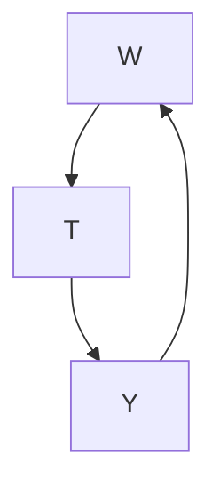
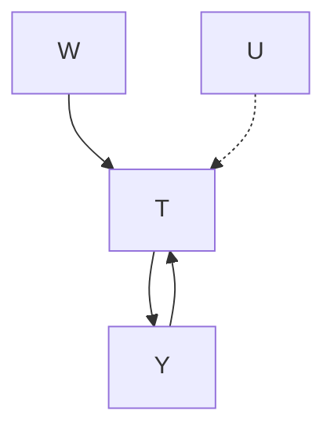

# Unobserved Confounding: Bounds and Sensitivity Analysis

All of the methods in Chapter 7 assume that we don’t have any unobserved confounding. However, unconfoundedness is an untestable assumption. In observational studies, there could also be some unobserved confounder(s). Therefore, we’d like to know how robust our estimates are to unobserved confounding. The first way we can do is by getting an upper and lower bound on the causal effect using credible assumptions (Section 8.1). Another way we can do this is by simulating how strong the confounder’s effect on the treatment and the confounder’s effect on the outcome need to be to make the true causal effect substantially different from our estimate (Section 8.2).

(a) No unobserved confounding

(b) Unobserved confounding ( )  
Figure 8.1: On the left, we have the setting we have considered up till now, where we have unconfoundedness / the backdoor criterion. On the right, we have a simple graph where the unobserved confounder make the causal effect of on not identifiable.

8.1 Bounds . . . 73

No-Assumptions Bound . . 74

Monotone Treatment Response . . . . . 76

Monotone Treatment Selection . 78

Optimal Treatment Selection79

8.2 Sensitivity Analysis . . . . . 82

Sensitivity Basics in Linear Setting 82

More General Settings . . . 85

## 8.1 Bounds

There is a tradeoff between how realistic or credible our assumptions are and how precise of an identification result we can get. Manski [53] calls this “The Law of Decreasing Credibility: the credibility of inference decreases with the strength of the assumptions maintained.”

Depending on what assumptions we are willing to make, we can derive various nonparametric bounds on causal effects. We have seen that if we are willing to assume unconfoundedness (or some causal graph in which the causal effect is identifiable) and positivity, we can identify a single point for the causal effect. However, this might be unrealistic. For example, there could always be unobserved confounding in observational studies.

This is what motivates Charles Manski’s work on bounding causal effects [53–60]. This gives us an interval that the causal effect must be in, rather than telling us exactly what point in that interval the causal effect must be. In this section, we will give an introduction to these nonparametric bounds and how to derive them.

The assumptions that we consider are weaker than unconfoundedness, so they give us intervals that the causal effect must fall in (under these

[53]: Manski (2003), Partial Identification of Probability Distributions: Springer Series in Statistics

[54]: Manski (1989), ‘Anatomy of the Selection Problem’  
[55]: Manski (1990), ‘Nonparametric Bounds on Treatment Effects’  
[56]: Manski (1993), ‘Identification Problems in the Social Sciences’  
[57]: Manski (1994), ‘The selection problem’  
[58]: Manski (1997), ‘Monotone Treatment Response’  
[59]: Manski and Pepper (2000), ‘Monotone Instrumental Variables: With an Application to the Returns to Schooling’  
[53]: Manski (2003), Partial Identification of Probability Distributions: Springer Series in Statistics  
[60]: Manski (2013), Public Policy in an Uncertain World

assumptions). If we assumed the stronger assumption of unconfoundedness, these intervals would collapse to a single point. This illustrates the law of decreasing credibility.

## 8.1.1 No-Assumptions Bound

Say all we know about the potential outcomes (0) and (1) is that they 𝑌 𝑌are between 0 and 1. Then, the maximum value of an ITE (1) − (0) is 1 (1 - 0), and the minimum is -1 (0 - 1):

$$
- 1 \leq Y _ {i} (1) - Y _ {i} (0) \leq 1 \quad \text { if } \forall t, 0 \leq Y (t) \leq 1 \tag {8.1}
$$

So we know that all ITEs must be in an interval of length 2. Because all the ITEs must fall inside this interval of length 2, the ATE must also fall inside this interval of length 2. Interestingly, for ATEs, it turns out that we can cut the length of this interval in half without making any assumptions (beyond the min/max value of outcome); the interval that the ATE must fall in is only of length 1.

We’ll show this result from Manski [55] in the more general scenario where the outcome is bounded between and :

Assumption 8.1 (Bounded Potential Outcomes)

$$
\forall t, a \leq Y (t) \leq b \tag {8.2}
$$

By the same reasoning as above, this implies the following bounds on the ITEs and ATE:

$$
a - b \leq Y _ {i} (1) - Y _ {i} (0) \leq b - a \tag {8.3}
$$

$$
a - b \leq \mathbb {E} [ Y (1) - Y (0) ] \leq b - a \tag {8.4}
$$

These are intervals of length ( − )−( − ) = 2( − ). And the bounds for 𝑏 𝑎 𝑎 𝑏 𝑏 𝑎the ITEs cannot be made tighter without further assumptions. However, seemingly magically, we can halve the length of the interval for the ATE. To see this, we rewrite the ATE as follows:

$$
\begin{array}{l} \mathbb {E} [ Y (1) - Y (0) ] = \mathbb {E} [ Y (1) ] - \mathbb {E} [ Y (0) ] (8.5) \\ = P (T = 1) \mathbb {E} [ Y (1) \mid T = 1 ] + P (T = 0) \mathbb {E} [ Y (1) \mid T = 0 ] \\ - P (T = 1) \mathbb {E} [ Y (0) \mid T = 1 ] - P (T = 0) \mathbb {E} [ Y (0) \mid T = 0 ] (8.6) \\ \end{array}
$$

We immediately recognize the first and last terms as friendly conditional expectations that we can estimate from observational data:

$$
\begin{array}{l} = P (T = 1) \mathbb {E} [ Y \mid T = 1 ] + P (T = 0) \mathbb {E} [ Y (1) \mid T = 0 ] \\ - P (T = 1) \mathbb {E} [ Y (0) \mid T = 1 ] - P (T = 0) \mathbb {E} [ Y \mid T = 0 ] \tag {8.7} \\ \end{array}
$$

Because this is such an important decomposition, we’ll give it a name and box before moving on with the bound derivation. We will call this the observational-counterfactual decomposition (of the ATE). Also, to have

[55]: Manski (1990), ‘Nonparametric Bounds on Treatment Effects’

Active reading exercise: Ensure you follow how we get to these bounds.

Active reading exercise: What assumption are we using here?

a bit more concise notation, we’ll use $\pi \triangleq P ( T = 1 )$ ) moving forward.

## Proposition 8.1 (Observational-Counterfactual Decomposition)

$$
\begin{array}{l} \mathbb {E} [ Y (1) - Y (0) ] = \pi \mathbb {E} [ Y \mid T = 1 ] + (1 - \pi) \mathbb {E} [ Y (1) \mid T = 0 ] \\ - \pi   \mathbb {E} [ Y (0) \mid T = 1 ] - (1 - \pi)   \mathbb {E} [ Y \mid T = 0 ] \tag {8.8} \\ \end{array}
$$

Unfortunately, $\mathbb { E } [ Y ( 1 ) \mid T = 0 ]$ and $\mathbb { E } [ Y ( 0 ) \mid T = 1 ]$ are counterfactual. 𝑌 𝑇 𝑌 𝑇However, we know that they’re bounded between  and . Therefore, we 𝑎 𝑏get an upper bound on the complete expression by letting the quantity that’s being added $( \mathbb { E } [ Y ( 1 ) \mid T = 0 ] )$ equal  and letting the quantity that’s being subtracted $( \mathbb { E } [ Y ( 0 ) \mid T = 1 ] )$ 𝑏 equal . Similarly, we can get a 𝑌 𝑇 𝑎lower bound by letting the term that’s being added equal  and the term that’s being subtracted equal .

Proposition 8.2 (No-Assumptions Bound) Let 𝜋 denote $P ( T = 1 ) .$ , where 𝑃 𝑇 is a binary random variable. Given that the outcome  is bounded between 𝑇 𝑌 and  (Assumption 8.1), we have the following upper and lower bounds on 𝑎 𝑏the ATE:

$$
\begin{array}{l} \mathbb {E} [ Y (1) - Y (0) ] \leq \pi   \mathbb {E} [ Y \mid T = 1 ] + (1 - \pi) b - \pi a - (1 - \pi) \mathbb {E} [ Y \mid T = 0 ] (8.9) \\ \mathbb {E} [ Y (1) - Y (0) ] \geq \pi   \mathbb {E} [ Y \mid T = 1 ] + (1 - \pi) a - \pi b - (1 - \pi) \mathbb {E} [ Y \mid T = 0 ] (8.10) \\ \end{array}
$$

Importantly, the length of this interval is $b - a ,$ half the length of the 𝑏 𝑎naive interval that we saw in Equation 8.4. We can see this by subtracting the lower bound from the upper bound:

$$
\begin{array}{l} \pi \mathbb {E} [ Y \mid T = 1 ] + (1 - \pi) b - \pi a - (1 - \pi) \mathbb {E} [ Y \mid T = 0 ] \\ - (\pi \mathbb {E} [ Y \mid T = 1 ] + (1 - \pi) a - \pi b - (1 - \pi) \mathbb {E} [ Y \mid T = 0 ]) \\ = (1 - \pi) b + \pi b - \pi a - (1 - \pi) a (8.11) \\ = b - a (8.12) \\ \end{array}
$$

This is sometimes referred to as the “no-assumptions bound” because we made no assumptions other than that the outcomes are bounded. If the outcomes are not bounded, then the ATE and ITEs can be anywhere between −∞ and ∞.

## Running Example

Consider that we know that the outcomes are bounded between 0 and 1 (e.g., because we’re in a binary outcomes setting). This means that the ITEs and must be bounded between -1 (0 - 1) and 1 $( 1 - 0 ) .$ , which means that the ATE must also be bounded between -1 and 1. For this example, also consider that $\pi = 0 . 3 , \operatorname { \mathbb { E } } [ Y \mid T = 1 ] = . 9 .$ , and $\mathbb { E } [ Y \mid T = 0 ] = . 2 . ^ { 1 }$ . 𝑌 𝑇 .Then, by plugging these in to Equations 8.9 𝑌 𝑇 .and 8.10, we get the following bounds on the ATE:

$$
\begin{array}{l} \mathbb {E} [ Y (1) - Y (0) ] \leq (. 3) (. 9) + (1 -. 3) (1) - (. 3) (0) - (1 -. 3) (. 2) (8.13) \\ \mathbb {E} [ Y (1) - Y (0) ] \geq (. 3) (. 9) + (1 -. 3) (0) - (. 3) (1) - (1 -. 3) (. 2) (8.14) \\ \end{array}
$$

$$
- 0. 1 7 \leq \mathbb {E} [ Y (1) - Y (0) ] \leq 0. 8 3 \tag {8.15}
$$

Notice that this interval is of length 1 $( b - a = 1 )$ , half the length of the naive interval $- 1 \le \mathbb { E } [ Y ( 1 ) - Y ( 0 ) ] \le 1$ 𝑎 (Equation 8.4). We will 𝑌 𝑌use this running example throughout Section 8.1.

## Active reading exercises:

1. What kind of bounds can we get for CATEs $\mathbb { E } [ Y ( 1 ) - Y ( 0 ) \mid X ]$ 𝑌 𝑌 𝑋assuming we have positivity? What goes wrong if we don’t have positivity?  
2. Say the potential outcomes are bounded in different ways: $a _ { 1 } \leq$ $Y ( 1 ) \ \leq \ b _ { 1 }$ and $a _ { 0 } ~ \le ~ Y ( 0 ) ~ \le ~ b _ { 0 }$ 𝑎. Derive the corresponding no-𝑌 𝑏 𝑎 𝑌 𝑏assumptions bounds in this more general setting.

The bounds in Proposition 8.2 are as tight as we can get without further assumptions. Unfortunately, the corresponding interval always contains $0 , ^ { 2 }$ which means that we cannot use this bound to distinguish “no causal effect” from “causal effect.” Can we get tighter bounds?

In order to bound the ATE, we must have some information about the counterfactual part of this decomposition. We can easily estimate the observational part from data. In the no-assumptions bound (Proposition 8.2), all we assumed is that the outcomes are bounded by and . 𝑎 𝑏If we make more assumptions, we can get smaller intervals. In the next few sections, we will cover some assumptions that are sometimes fairly reasonable, depending on the setting, and what tighter bounds these assumptions get us. The general strategy we will use for all of them is to start with the observational-counterfactual decomposition of the ATE (Proposition 8.1),

$$
\begin{array}{l} \mathbb {E} [ Y (1) - Y (0) ] = \pi \mathbb {E} [ Y \mid T = 1 ] + (1 - \pi) \mathbb {E} [ Y (1) \mid T = 0 ] \\ - \pi \mathbb {E} [ Y (0) \mid T = 1 ] - (1 - \pi) \mathbb {E} [ Y \mid T = 0 ], \\ \end{array}
$$

and get smaller intervals by bounding the counterfactual parts using the different assumptions we make.

The intervals we will see in the next couple of subsections will all contain zero. We won’t see an interval that is purely positive or purely negative until Section 8.1.4, so feel free to skip to that section if you only want to see those intervals.

## 8.1.2 Monotone Treatment Response

For our first assumption beyond assuming bounded outcomes, consider that we find ourselves in a setting where it is feasible that the treatment can only help; it can’t hurt. This is the setting that Manski [58] considers in context. In this setting, we can justify the monotone treatment response (MTR) assumption:

Assumption 8.2 (Nonnegative Monotone Treatment Response)

$$
\forall i Y _ {i} (1) \geq Y _ {i} (0) \tag {8.16}
$$

2 To see why the no-assumptions bound always contains zero, consider what we would need for it to not contain zero: we would either need the upper bound to be less than zero or the lower bound to be greater than zero. However, this cannot be the case. To see why, note that the minimum upper bound is achieved when $\mathbb { E } [ Y \mid T = { \bar { 1 } } ] = a$ and $\mathbb { E } [ Y \mid T = 0 ] = b .$ , 𝑌 𝑇 𝑎 𝑌 𝑇 𝑏which gives us an (inclusive) upper bound of zero. Same with the lower bound.

Active reading exercise: Show that the maximum lower bound is 0.

[58]: Manski (1997), ‘Monotone Treatment Response’This means that every ITE is nonnegative, so we can bring our lower bound on the ITEs up from  −  (Equation 8.3) to 0. So, intuitively, this should mean that our lower bound on the ATE should move up to 0. And we will now see that this is the case.

Now, rather than lower bounding $\mathbb { E } [ Y ( 1 ) \mid T = 0 ]$ with  and $- \mathbb { E } [ Y ( 0 ) \mid$ $T = 1 ]$ 𝑌 𝑇 𝑎 𝑌 with − , we can do better. Because the treatment only helps, $\operatorname { \mathbb { E } } [ Y ( 1 ) \mid T = 0 ] \ge \operatorname { \mathbb { E } } [ Y ( 0 ) \mid T = 0 ] = \operatorname { \mathbb { E } } [ Y \mid T = 0 ] .$ , so we can lower 𝑌bound 𝔼 $[ Y ( 1 ) \mid T = 0 ]$ 𝑌with $\mathbb { E } [ Y \mid T = 0 ]$ 𝑌 𝑇. Similarly, $- \mathbb { E } [ Y ( 0 ) \mid T = 1 ] \geq$ $- \mathbb { E } [ Y ( 1 ) \mid T = 1 ] = \mathbb { E } [ Y \mid T = 1 ]$ 𝑇 𝑌 𝑇 (since multiplying by a negative flips the 𝑌 𝑇 𝑌 𝑇inequality), so we can lower bound $- \mathbb { E } [ Y ( 0 ) \ \bar { | } \ T = 1 ] \mathrm { w i t h } - \mathbb { E } [ Y \mid \bar { T } = 1 ]$ . 𝑌 𝑇 𝑌 𝑇Therefore, we can improve on the no-assumptions lower bound3 to get 0, as our intuition suggested:

$$
\begin{array}{l} \mathbb {E} [ Y (1) - Y (0) ] = \pi \mathbb {E} [ Y \mid T = 1 ] + (1 - \pi) \mathbb {E} [ Y (1) \mid T = 0 ] \\ - \pi \mathbb {E} [ Y (0) \mid T = 1 ] - (1 - \pi) \mathbb {E} [ Y \mid T = 0 ] \\ \geq \pi \mathbb {E} [ Y \mid T = 1 ] + (1 - \pi) \mathbb {E} [ Y \mid T = 0 ] \\ - \pi   \mathbb {E} [ Y \mid T = 1 ] - (1 - \pi)   \mathbb {E} [ Y \mid T = 0 ] (8.17) \\ = 0 (8.18) \\ \end{array}
$$

Proposition 8.3 (Nonnegative MTR Lower Bound) Under the nonnegative MTR assumption, the ATE is bounded from below by 0. Mathematically,

$$
\mathbb {E} [ Y (1) - Y (0) ] \geq 0 \tag {8.19}
$$

Running Example The no-assumptions upper bound4 still applies here, so in our running example from Section 8.1.1 where $\pi = . 3 , \mathbb { E } [ Y \mid T = 1 ] =$ $. 9 ,$ and $\mathbb { E } [ Y \mid T = 0 ] = { \overset { - } { . } } 2$ ., our ATE interval improves from $\left[ - 0 . 1 7 , 0 . 8 3 \right]$ . 𝑌 𝑇(Equation 8.15) to $\left[ 0 , 0 . 8 3 \right]$ .

Alternatively, say the treatment can only hurt people; it can’t help them (e.g. a gunshot wound only hurts chances of staying alive). In those cases, we would have the nonpositive monotone treatment response assumption and the nonpositive MTR upper bound:

Assumption 8.3 (Nonpositive Monotone Treatment Response)

$$
\forall i Y _ {i} (1) \leq Y _ {i} (0) \tag {8.20}
$$

Proposition 8.4 (Nonpositive MTR Upper Bound) Under the nonpositive MTR assumption, the ATE is bounded from above by 0. Mathematically,

$$
\mathbb {E} [ Y (1) - Y (0) ] \leq 0 \tag {8.21}
$$

Running Example And in this setting, the no-assumptions lower bound5 still applies. That means that the ATE interval in our example improves from [−0 17 0 83] (Equation 8.15) to [−0 17 0].

Active reading exercise: What is the ATE interval if we assume both nonnegative MTR and nonpositive MTR? Does this make sense, intuitively?

3 Recall that by only assuming that outcomes are bounded between  and , 𝑎 𝑏we get the no-assumptions lower bound (Proposition 8.2):

$$
\begin{array}{l} \mathbb {E} [ Y (1) - Y (0) ] \\ \geq \pi \mathbb {E} [ Y \mid T = 1 ] + (1 - \pi) a \\ - \pi b - (1 - \pi) \mathbb {E} [ Y \mid T = 0 ] \tag {8.10revisited} \\ \end{array}
$$

4 Recall the no-assumptions upper bound (Proposition 8.2):

$$
\begin{array}{l} \mathbb {E} [ Y (1) - Y (0) ] \\ \leq \pi \mathbb {E} [ Y \mid T = 1 ] + (1 - \pi) b \\ - \pi a - (1 - \pi) \mathbb {E} [ Y \mid T = 0 ] \tag {8.9revisited} \\ \end{array}
$$

Active reading exercise: Prove Proposition 8.4.

5 Recall the no-assumptions lower bound (Proposition 8.2):

$$
\begin{array}{l} \mathbb {E} [ Y (1) - Y (0) ] \\ \geq \pi \mathbb {E} [ Y \mid T = 1 ] + (1 - \pi) a \\ - \pi b - (1 - \pi) \mathbb {E} [ Y \mid T = 0 ] \tag {8.10revisited} \\ \end{array}
$$

## 8.1.3 Monotone Treatment Selection

The next assumption that we’ll consider is the assumption that the people who selected treatment would have better outcomes than those who didn’t select treatment, under either treatment scenario. Manski and Pepper [59] introduced this as the monotone treatment selection (MTS) assumption.

## Assumption 8.4 (Monotone Treatment Selection)

$$
\mathbb {E} [ Y (1) \mid T = 1 ] \geq \mathbb {E} [ Y (1) \mid T = 0 ] \tag {8.22}
$$

$$
\mathbb {E} [ Y (0) \mid T = 1 ] \geq \mathbb {E} [ Y (0) \mid T = 0 ] \tag {8.23}
$$

As Morgan and Winship [12, Section 12.2.2] point out, you might think of this as positive self-selection. Those who generally get better outcomes self-select into the treatment group. Again, we start with the observationalcounterfactual decomposition, and we now obtain an upper bound using the MTS assumption (Assumption 8.4):

Proposition 8.5 (Monotone Treatment Selection Upper Bound) Under the MTS assumption, the ATE is bounded from above by the associational difference. Mathematically,

$$
\mathbb {E} [ Y (1) - Y (0) ] \leq \mathbb {E} [ Y \mid T = 1 ] - \mathbb {E} [ Y \mid T = 0 ] \tag {8.24}
$$

Proof.

$$
\mathbb {E} [ Y (1) - Y (0) ] = \pi \mathbb {E} [ Y \mid T = 1 ] + (1 - \pi) \mathbb {E} [ Y (1) \mid T = 0 ]
$$

$$
- \pi \mathbb {E} [ Y (0) \mid T = 1 ] - (1 - \pi) \mathbb {E} [ Y \mid T = 0 ]
$$

𝑇(8.8 revisited)

$$
\leq \pi \mathbb {E} [ Y \mid T = 1 ] + (1 - \pi) \mathbb {E} [ Y \mid T = 1 ]
$$

$$
- \pi   \mathbb {E} [ Y \mid T = 0 ] - (1 - \pi)   \mathbb {E} [ Y \mid T = 0 ] \tag {8.25}
$$

$$
= \mathbb {E} [ Y \mid T = 1 ] - \mathbb {E} [ Y \mid T = 0 ] \tag {8.26}
$$

where Equation 8.25 followed from the fact that (a) Equation 8.22 of the MTS assumption allows us to upper bound $\mathbb { E } [ Y ( 1 ) \mid T = 0 ] \mathrm { b y } \mathbb { E } [ Y ( 1 ) \mid$ | $T = 1 ] = \mathbb { E } [ { \bar { Y } } ( 1 ) \mid T = 1 ]$ 𝑌 𝑇 𝑌 and (b) Equation 8.23 of the MTS assumption 𝑇 𝑌 𝑇allows us to upper bound $- \mathbb { E } [ Y ( 0 ) \mid T = 1 ] \mathrm { b y } - \mathbb { E } [ Y \mid T = 0 ]$ . □

Running Example Recall our running example from Section 8.1.1 where $\pi = . 3 , \mathbb { E } [ Y \mid T = 1 ] = . 9 ,$ , and $\mathbb { E } [ Y \mid \bar { T } = 0 ] \stackrel { - } { = } . 2$ . The MTS assumption . 𝑌 𝑇 . 𝑌 𝑇 .gives us an upper bound, and we still have the no-assumptions lower bound.6 That means that the ATE interval in our example improves from [−0 17 0 83] (Equation 8.15) to [−0 17 0 7].

Both MTR and MTS Then, we can combine the nonnegative MTR assumption (Assumption 8.2) with the MTS assumption (Assumption 8.4) to get the lower bound in Proposition 8.3 and the upper bound in Proposition 8.5, respectively. In our running example, this yields the following interval for the ATE: [0 0 7].

[59]: Manski and Pepper (2000), ‘Monotone Instrumental Variables: With an Application to the Returns to Schooling’

[12]: Morgan and Winship (2014), Counterfactuals and Causal Inference: Methods and Principles for Social Research

6 Recall the no-assumptions lower bound (Proposition 8.2):

$$
\mathbb {E} [ Y (1) - Y (0) ]
$$

$$
\geq \pi \mathbb {E} [ Y \mid T = 1 ] + (1 - \pi) a
$$

$$
- \pi b - (1 - \pi) \mathbb {E} [ Y \mid T = 0 ]
$$

𝑌 𝑇(8.10 revisited)Intervals Contain Zero Although bounds from the MTR and MTS assumptions can be useful for ruling out very large or very small causal effects, the corresponding intervals still contain zero. This means that these assumptions are not enough to identify whether there is an effect or not.

## 8.1.4 Optimal Treatment Selection

We now consider what we will call the optimal treatment selection (OTS) assumption from Manski [55]. This assumption means that the individuals always receive the treatment that is best for them (e.g. if an expert doctor is deciding which treatment to give people). We write this mathematically as follows:

Assumption 8.5 (Optimal Treatment Selection)

$$
T _ {i} = 1 \implies Y _ {i} (1) \geq Y _ {i} (0), \quad T _ {i} = 0 \implies Y _ {i} (0) > Y _ {i} (1) \tag {8.27}
$$

From the OTS assumption, we know that

$$
\mathbb {E} [ Y (1) \mid T = 0 ] \leq \mathbb {E} [ Y (0) \mid T = 0 ] = \mathbb {E} [ Y \mid T = 0 ]. \tag {8.28}
$$

Therefore, we can give an upper bound, by upper bounding

$\mathbb { E } [ Y ( 1 ) \mid T = 0 ]$ with $\mathbb { E } [ Y \mid T = 0 ]$ and upper bounding $- \mathbb { E } [ Y ( 0 ) \mid T = 1 ]$ 𝑌 𝑇 𝑌 𝑇with − (same as in the no-assumptions upper bound7):

$$
\begin{array}{l} \mathbb {E} [ Y (1) - Y (0) ] = \pi \mathbb {E} [ Y \mid T = 1 ] + (1 - \pi) \mathbb {E} [ Y (1) \mid T = 0 ] \\ - \pi \mathbb {E} [ Y (0) \mid T = 1 ] - (1 - \pi) \mathbb {E} [ Y \mid T = 0 ] \\ \leq \pi \mathbb {E} [ Y \mid T = 1 ] + (1 - \pi) \mathbb {E} [ Y \mid T = 0 ] \\ - \pi a - (1 - \pi) \mathbb {E} [ Y \mid T = 0 ] (8.29) \\ = \pi \mathbb {E} [ Y \mid T = 1 ] - \pi a (8.30) \\ \end{array}
$$

The OTS assumption also tells us that

$$
\mathbb {E} [ Y (0) \mid T = 1 ] \leq \mathbb {E} [ Y (1) \mid T = 1 ] = \mathbb {E} [ Y \mid T = 1 ], \tag {8.31}
$$

which is equivalent to saying $- \mathbb { E } [ Y ( 0 ) \mid T = 1 ] \ge - \mathbb { E } [ Y \mid T = 1 ]$ . So we can lower bound $- \mathbb { E } [ Y ( 0 ) \mid T = 1 ]$ 𝑌 with $- \mathbb { E } [ Y \mid T = 1 ]$ 𝑌 𝑇, and we can lower bound $\mathbb { E } [ Y ( 1 ) \mid T = 0 ]$ 𝑇 𝑌 𝑇with (just as we did in the no-assumptions lower 𝑌 𝑇 𝑎bound8) to get the following lower bound:

$$
\begin{array}{l} \mathbb {E} [ Y (1) - Y (0) ] = \pi \mathbb {E} [ Y \mid T = 1 ] + (1 - \pi) \mathbb {E} [ Y (1) \mid T = 0 ] \\ - \pi \mathbb {E} [ Y (0) \mid T = 1 ] - (1 - \pi) \mathbb {E} [ Y \mid T = 0 ] \\ \end{array}
$$

$$
\begin{array}{l} \geq \pi \mathbb {E} [ Y \mid T = 1 ] + (1 - \pi) a \\ - \pi   \mathbb {E} [ Y \mid T = 1 ] - (1 - \pi)   \mathbb {E} [ Y \mid T = 0 ] (8.32) \\ = (1 - \pi) a - (1 - \pi) \mathbb {E} [ Y \mid T = 0 ] (8.33) \\ \end{array}
$$

[55]: Manski (1990), ‘Nonparametric Bounds on Treatment Effects’

7 Recall the no-assumptions upper bound (Proposition 8.2):

$$
\begin{array}{l} \mathbb {E} [ Y (1) - Y (0) ] \\ \leq \pi \mathbb {E} [ Y \mid T = 1 ] + (1 - \pi) b \\ - \pi a - (1 - \pi) \mathbb {E} [ Y \mid T = 0 ] \tag {8.9revisited} \\ \end{array}
$$

8 Recall the no-assumptions lower bound 8 Recall the no-assumptions lower bound (Proposition 8.2): (Proposition 8.2):

$$
\begin{array}{l} \mathbb {E} [ Y (1) - Y (0) ] \\ \geq \pi \mathbb {E} [ Y \mid T = 1 ] + (1 - \pi) a \\ - \pi b - (1 - \pi) \mathbb {E} [ Y \mid T = 0 ] \tag {8.10revisited} \\ \end{array}
$$

Proposition 8.6 (Optimal Treatment Selection Bound 1) Let 𝜋 denote $P ( T = 1 )$ , where  is a binary random variable. Given that the outcome  is 𝑃 𝑇 𝑇 𝑌bounded from below by  (Assumption 8.1) and that the optimal treatment is 𝑎always selection (Assumption 8.5), we have the following upper and lower bounds on the ATE:

$$
\mathbb {E} [ Y (1) - Y (0) ] <   \pi \mathbb {E} [ Y \mid T = 1 ] - \pi a \tag {8.34}
$$

$$
\mathbb {E} [ Y (1) - Y (0) ] \geq (1 - \pi) a - (1 - \pi) \mathbb {E} [ Y \mid T = 0 ] \tag {8.35}
$$

$$
\text { Interval   Length } = \pi   \mathbb {E} [ Y \mid T = 1 ] + (1 - \pi)   \mathbb {E} [ Y \mid T = 0 ] - a \tag {8.36}
$$

Unfortunately, this interval also always contains $z { \mathrm { e r o ! } } ^ { 9 }$ This means that Proposition 8.6 doesn’t tell us whether the causal effect is non-zero or not.

Running Example Recall our running example from Section 8.1.1 where $a = 0 , b = 1 , \pi = . 3 , \operatorname { \mathbb { E } } [ Y \mid T = 1 ] = . 9 ,$ and $\bar { \mathbb { E } } [ Y \mid T = 0 ] = . 2$ . Plugging 𝑎 𝑏 . 𝑌 𝑇 . 𝑌these in to Proposition 8.6 gives us the following:

$$
\mathbb {E} [ Y (1) - Y (0) ] \leq (. 3) (. 9) - (. 3) (0) \tag {8.37}
$$

$$
\mathbb {E} [ Y (1) - Y (0) ] \geq (1 -. 3) (0) - (1 -. 3) (. 2) \tag {8.38}
$$

$$
- 0. 1 4 \leq \mathbb {E} [ Y (1) - Y (0) ] \leq 0. 2 7 \tag {8.39}
$$

$$
\text { Interval   Length } = 0. 4 1 \tag {8.40}
$$

We’ll now give an interval that can be purely positive or purely negative, potentially identifying the ATE as non-zero.

## A Bound That Can Identify the Sign of the ATE

It turns out that, although we take the OTS assumption from Manski [55], the bound we gave in Proposition 8.6 is not actually the bound that Manski [55] derives with that assumption. For example, where we used $\mathbb { E } [ Y ( 1 ) \mid T = 0 ] \le \mathbb { E } [ Y \mid T = 0 ]$ , Manski uses 𝔼[ (1) | $T = 0 ] \leq \mathbb { E } [ Y \mid$ | $T = 1 ]$ 𝑇 𝑌 𝑇 𝑌 𝑇 𝑌. We’ll quickly prove this inequality that Manski uses from the 𝑇OTS assumption:10 We start by applying Equation 8.42:

$$
\mathbb {E} [ Y (1) \mid T = 0 ] = \mathbb {E} [ Y (1) \mid Y (0) > Y (1) ] \tag {8.45}
$$

Because the random variable we are taking the expectation of is $Y ( 1 ) _ { \it . }$ , if we flip $Y ( 0 ) > Y ( 1 ) \mathrm { t o } Y ( 0 ) \leq Y ( 1 )$ , then we get an upper bound:

$$
\leq \mathbb {E} [ Y (1) \mid Y (0) \leq Y (1) ] \tag {8.46}
$$

Finally, applying Equation 8.44, we have the result:

$$
= \mathbb {E} [ Y (1) \mid T = 1 ] \tag {8.47}
$$

$$
= \mathbb {E} [ Y \mid T = 1 ] \tag {8.48}
$$

Now that we have that $\mathbb { E } [ Y ( 1 ) ~ \mid ~ T ~ = ~ 0 ] ~ \le ~ \mathbb { E } [ Y ~ \mid ~ T ~ = ~ 1 ] .$ , we can 𝑌 𝑇 𝑌 𝑇prove Manski [55]’s upper bound, where we use this key inequality in

9 Active reading exercise: Show that this interval always contains zero.

[55]: Manski (1990), ‘Nonparametric Bounds on Treatment Effects’

10 Recall the OTS assumption (Assumption 8.5):

$$
T _ {i} = 1 \implies Y _ {i} (1) \geq Y _ {i} (0) \tag {8.41}
$$

$$
T _ {i} = 0 \implies Y _ {i} (0) > Y _ {i} (1) \tag {8.42}
$$

Because there are only two values that can take on, this is equivalent to the 𝑇following (contrapositives):

$$
T _ {i} = 0 \iff Y _ {i} (1) <   Y _ {i} (0) \tag {8.43}
$$

$$
T _ {i} = 1 \iff Y _ {i} (0) \leq Y _ {i} (1) \tag {8.44}
$$

[55]: Manski (1990), ‘Nonparametric Bounds on Treatment Effects’Equation 8.49:

$$
\begin{array}{l} \mathbb {E} [ Y (1) - Y (0) ] = \pi \mathbb {E} [ Y \mid T = 1 ] + (1 - \pi) \mathbb {E} [ Y (1) \mid T = 0 ] \\ - \pi \mathbb {E} [ Y (0) \mid T = 1 ] - (1 - \pi) \mathbb {E} [ Y \mid T = 0 ] \\ \leq \pi \mathbb {E} [ Y \mid T = 1 ] + (1 - \pi) \mathbb {E} [ Y (1) \mid T = 1 ] \\ - \pi a - (1 - \pi) \mathbb {E} [ Y \mid T = 0 ] (8.49) \\ = \pi \mathbb {E} [ Y \mid T = 1 ] + (1 - \pi) \mathbb {E} [ Y \mid T = 1 ] \\ - \pi a - (1 - \pi) \mathbb {E} [ Y \mid T = 0 ] (8.50) \\ = \mathbb {E} [ Y \mid T = 1 ] - \pi a - (1 - \pi) \mathbb {E} [ Y \mid T = 0 ] (8.51) \\ \end{array}
$$

Similarly, we can perform an analogous derivation11 to get the lower bound:

$$
\mathbb {E} [ Y (1) - Y (0) ] \geq \pi   \mathbb {E} [ Y \mid T = 1 ] + (1 - \pi)   a - \mathbb {E} [ Y \mid T = 0 ] \tag {8.52}
$$

Proposition 8.7 (Optimal Treatment Selection Bound 2) Let 𝜋 denote $P ( T = 1 )$ , where is a binary random variable. Given that the outcome is 𝑃 𝑇 𝑇 𝑌bounded from below by  (Assumption 8.1) and that the optimal treatment is 𝑎always selection (Assumption 8.5), we have the following upper and lower bounds on the ATE:

$$
\begin{array}{l} \mathbb {E} [ Y (1) - Y (0) ] \leq \mathbb {E} [ Y \mid T = 1 ] - \pi a - (1 - \pi) \mathbb {E} [ Y \mid T = 0 ] (8.53) \\ \mathbb {E} [ Y (1) - Y (0) ] \geq \pi   \mathbb {E} [ Y \mid T = 1 ] + (1 - \pi)   a - \mathbb {E} [ Y \mid T = 0 ] (8.54) \\ \text { Interval   Length } = (1 - \pi) \mathbb {E} [ Y \mid T = 1 ] + \pi \mathbb {E} [ Y \mid T = 0 ] - a (8.55) \\ \end{array}
$$

This interval can also include zero, but it doesn’t have to. For example, in our running example, it doesn’t.

Running Example Recall our running example from Section 8.1.1 where $a = 0 , b = 1 , \pi = . 3 , \mathbb { E } [ Y \mid T = 1 ] = . 9 ,$ , and 𝔼[ |  = 0] = 2. Plugging 𝑎 𝑏 . 𝑌 𝑇 . 𝑌 𝑇 .these in to Proposition 8.7 gives us the following for the OTS bound 2:

$$
\mathbb {E} [ Y (1) - Y (0) ] \leq (. 9) - (. 3) (0) - (1 -. 3) (. 2) \tag {8.56}
$$

$$
\mathbb {E} [ Y (1) - Y (0) ] \geq (. 3) (. 9) + (1 -. 3) (0) - (. 2) \tag {8.57}
$$

$$
0. 0 7 \leq \mathbb {E} [ Y (1) - Y (0) ] \leq 0. 7 6 \tag {8.58}
$$

$$
\text { Interval   Length } = 0. 6 9 \tag {8.59}
$$

So while the OTS bound 2 from Manski [55] identifies the sign of the ATE in our running example, unlike the OTS bound 1, the OTS bound 2 gives us a 68% larger interval. You can see this by comparing Equation 8.40 (in the above margin) with Equation 8.59.

This illustrates some important takeaways:

1. Different bounds are better in different cases.12  
2. Different bounds can be better in different ways (e.g., identifying the sign vs. getting a smaller interval).

Mixing Bounds Fortunately because both the OTS bound 1 and OTS bound 2 come from the same assumption (Assumption 8.5), we can take the lower bound from OTS bound 2 and the upper bound from OTS

11 Active reading exercise: Derive Equation 8.52 yourself.

Application of OTS bound 1 (Proposition 8.6) to our running example:

$$
- 0. 1 4 \leq \mathbb {E} [ Y (1) - Y (0) ] \leq 0. 2 7 \tag {8.39revisited}
$$

Interval Length = 0 41 (8.40 revisited)

[55]: Manski (1990), ‘Nonparametric Bounds on Treatment Effects’

12 Active reading exercise: Using Equations 8.40 and 8.59, derive the conditions under which OTS bound 1 yields a smaller interval and the conditions under which OTS bound 2 yields a smaller interval.

bound 1 to get the following tighter interval that still identifies the sign:

$$
0. 0 7 \leq \mathbb {E} [ Y (1) - Y (0) ] \leq 0. 2 7 \tag {8.60}
$$

Similarly, we could have mixed the lower bound from OTS bound 1 and the upper bound from OTS bound 2, but that would have given the worst interval in this subsection for this specific example. It could be the best in a different example, though.

In this section we’ve given you a taste of what kind of results we can get from nonparametric bounds, but, of course, this is just an introduction. For more literature on this, see, e.g., [53–60].

## 8.2 Sensitivity Analysis

## 8.2.1 Sensitivity Basics in Linear Setting

Before this chapter, we have exclusively been working in the setting where causal effects are identifiable. We illustrate the common example of the confounders as common causes of and in Figure 8.2. In this example, the causal effect of  on  is identifiable. However, what if 𝑇 𝑌there is a single unobserved confounder , as we illustrate in Figure 8.3. Then, the causal effect is not identifiable.

What would be the bias we’d observe if we only adjusted for the observed confounders ? To illustrate this simply, we’ll start with a noiseless13 linear data generating process. So consider data that are generated by the following structural equations:

$$
T := \alpha_ {w} W + \alpha_ {u} U \tag {8.61}
$$

$$
Y := \beta_ {w} W + \beta_ {u} U + \delta T \tag {8.62}
$$

So the relevant quantity that describes causal effects of  on  is 𝛿 since 𝑇 𝑌it is the coefficient in front of  in the structural equation for . From the 𝑇 𝑌backdoor adjustment (Theorem 4.2) / adjustment formula (Theorem 2.1), we know that

$$
\mathbb {E} [ Y (1) - Y (0) ] = \mathbb {E} _ {W, U} [ \mathbb {E} [ Y \mid T = 1, W, U ] - \mathbb {E} [ Y \mid T = 0, W, U ] ] = \delta \tag {8.63}
$$

But because isn’t observed, the best we can do is adjust for only . 𝑈This leads to a confounding bias of $\frac { \beta _ { u } } { \alpha _ { u } }$ 𝑊. We’ll be focusing on identification, 𝑢not estimation, here, so we’ll consider that we have infinite data. This means that we have access to ( ). Then, we’ll write down and 𝑃 𝑊 , 𝑇, 𝑌prove the following proposition about confounding bias:

Proposition 8.8 When  and  are generated by the noiseless linear process 𝑇 𝑌in Equations 8.61 and 8.62, the confounding bias of adjusting for just  (and

[54]: Manski (1989), ‘Anatomy of the Selection Problem’  
[55]: Manski (1990), ‘Nonparametric Bounds on Treatment Effects’  
[56]: Manski (1993), ‘Identification Problems in the Social Sciences’  
[57]: Manski (1994), ‘The selection problem’  
[58]: Manski (1997), ‘Monotone Treatment Response’  
[59]: Manski and Pepper (2000), ‘Monotone Instrumental Variables: With an Application to the Returns to Schooling’  
[53]: Manski (2003), Partial Identification of Probability Distributions: Springer Series in Statistics  
[60]: Manski (2013), Public Policy in an Uncertain World

Figure 8.2: Simple causal structure where confounds the effect of on and 𝑊 𝑇where is the only confounder.

Figure 8.3: Simple causal structure where is the observed confounders and  is 𝑊the unobserved confounders.

13 Active reading exercise: What assumption is violated when the data are generated by a noiseless process?

not ) $i s ~ \frac { \beta _ { u } } { \alpha _ { u } }$ . Mathematically:

$$
\begin{array}{l} \mathbb {E} _ {W} \left[ \mathbb {E} [ Y \mid T = 1, W ] - \mathbb {E} [ Y \mid T = 0, W ] \right] \\ - \mathbb {E} _ {W, U} [ \mathbb {E} [ Y \mid T = 1, W, U ] - \mathbb {E} [ Y \mid T = 0, W, U ] ] = \frac {\beta_ {u}}{\alpha_ {u}} \tag {8.64} \\ \end{array}
$$

Proof. We’ll prove Proposition 8.8 in 3 steps:

1. Get a closed-form expression for $\mathbb { E } _ { W } \left[ \mathbb { E } [ Y \mid T = t , W ] \right]$ in terms of $\begin{array} { r } { \alpha _ { w } , \alpha _ { u } , \beta _ { w } , } \end{array}$ and $\beta _ { u }$ .  
𝑤 𝑢 𝑤 𝑢2. Use step 1 to get a closed-form expression for the difference 𝔼 $[ \mathbb { E } [ Y \mid T = 1 , W ] - \mathbb { E } [ Y \mid T = 0 , W ] ] .$ .  
𝑊 𝑌 𝑇3. Subtract off $\mathbb { E } _ { W , U } \left[ \mathbb { E } [ Y \mid T = 1 , W , U ] - \mathbb { E } [ Y \mid T = 0 , W , U ] \right] = \delta . ^ { 1 4 }$

First, we use the structural equation for  (Equation 8.62):

$$
\mathbb {E} _ {W} \left[ \mathbb {E} [ Y \mid T = t, W ] \right] = \mathbb {E} _ {W} \left[ \mathbb {E} [ \beta_ {w} W + \beta_ {u} U + \delta T \mid T = t, W ] \right] \tag {8.65}
$$

$$
= \mathbb {E} _ {W} \left[ \beta_ {w} W + \beta_ {u} \mathbb {E} [ U \mid T = t, W ] + \delta t \right] \tag {8.66}
$$

This is where we use the structural equation for  (Equation 8.61). Rearranging it gives us $\begin{array} { r } { U \ = \ \frac { T - \alpha _ { w } W } { \alpha _ { u } } } \end{array}$ 𝑇𝑇−𝛼𝑤𝑊 . We can then use that for the 𝛼 𝑈remaining conditional expectation:

$$
\begin{array}{l} = \mathbb {E} _ {W} \left[ \beta_ {w} W + \beta_ {u} \left(\frac {t - \alpha_ {w} W}{\alpha_ {u}}\right) + \delta t \right] (8.67) \\ = \mathbb {E} _ {W} \left[ \beta_ {w} W + \frac {\beta_ {u}}{\alpha_ {u}} t - \frac {\beta_ {u} \alpha_ {w}}{\alpha_ {u}} W + \delta t \right] (8.68) \\ = \beta_ {w} \mathbb {E} [ W ] + \frac {\beta_ {u}}{\alpha_ {u}} t - \frac {\beta_ {u} \alpha_ {w}}{\alpha_ {u}} \mathbb {E} [ W ] + \delta t (8.69) \\ \end{array}
$$

Then, rearranging a bit, we have the following:

$$
= \left(\delta + \frac {\beta_ {u}}{\alpha_ {u}}\right) t + \left(\beta_ {w} - \frac {\beta_ {u} \alpha_ {w}}{\alpha_ {u}}\right) \mathbb {E} [ W ] \tag {8.70}
$$

The only parts of this that matter are the parts that depend on  because 𝑡we want to know the effect of  on . For example, consider the expected 𝑇 𝑌ATE estimate we would get if we were to only adjust for :

$$
\begin{array}{l} \mathbb {E} _ {W} \left[ \mathbb {E} [ Y \mid T = 1, W ] - \mathbb {E} [ Y \mid T = 0, W ] \right] (8.71) \\ = \left(\delta + \frac {\beta_ {u}}{\alpha_ {u}}\right) (1) + \left(\beta_ {w} - \frac {\beta_ {u} \alpha_ {w}}{\alpha_ {u}}\right) \mathbb {E} [ W ] \\ - \left[ \left(\delta + \frac {\beta_ {u}}{\alpha_ {u}}\right) (0) + \left(\beta_ {w} - \frac {\beta_ {u} \alpha_ {w}}{\alpha_ {u}}\right) \mathbb {E} [ W ] \right] (8.72) \\ = \delta + \frac {\beta_ {u}}{\alpha_ {u}} (8.73) \\ \end{array}
$$

14 Active reading exercise: Show that $\mathbb { E } _ { W , U } \left[ \mathbb { E } [ Y \mid T = 1 , W , U ] - \mathbb { E } [ Y \mid T = 0 , W , U ] \right]$ 𝑊 ,𝑈equals 𝛿.

$$
Y := \beta_ {w} W + \beta_ {u} U + \delta T \quad (8. 6 2 \text {   revisited })
$$

$$
T := \alpha_ {w} W + \alpha_ {u} U \quad (8. 6 1 \text {   revisited })
$$

Finally, subtracting off $\mathbb { E } _ { W , U } \left[ \mathbb { E } [ Y \mid T = 1 , W , U ] - \mathbb { E } [ Y \mid T = 0 , W , U ] \right]$ :

$$
\begin{array}{l} \mathrm{Bias} = \mathbb {E} _ {W} \left[ \mathbb {E} [ Y \mid T = 1, W ] - \mathbb {E} [ Y \mid T = 0, W ] \right] \\ - \mathbb {E} _ {W, U} [ \mathbb {E} [ Y \mid T = 1, W, U ] - \mathbb {E} [ Y \mid T = 0, W, U ] ] (8.74) \\ = \delta + \frac {\beta_ {u}}{\alpha_ {u}} - \delta (8.75) \\ = \frac {\beta_ {u}}{\alpha_ {u}} (8.76) \\ \end{array}
$$

Generalization to Arbitrary Graphs/Estimands Here, we’ve performed a sensitivity analysis for the ATE for the simple graph structure in Figure 8.4. For arbitrary estimands in arbitrary graphs, where the structural equations are linear, see Cinelli et al. [61].

## Sensitivity Contour Plots

Because Proposition 8.8 gives us a closed-form expression for the bias in terms of the unobserved confounder parameters $\alpha _ { u }$ and $\beta _ { u } ,$ we can plot 𝑢 𝑢the levels of bias in contour plots. We show this in Figure 8.5a, where we have $\textstyle { \frac { 1 } { \alpha _ { u } } }$ 𝛼 on the x-axis and $\beta _ { u }$ on the y-axis.

If we rearrange Equation $8 . 7 3 ^ { 1 5 }$ to solve for 𝛿, we get the following:

$$
\delta = \mathbb {E} _ {W} \left[ \mathbb {E} [ Y \mid T = 1, W ] - \mathbb {E} [ Y \mid T = 0, W ] \right] - \frac {\beta_ {u}}{\alpha_ {u}} \tag {8.77}
$$

So for given values of $\alpha _ { u }$ and $\beta _ { u } ,$ we can compute the true ATE $\delta ,$ 𝑢 𝑢from the observational quantity 𝔼 $[ \mathbb { E } [ Y \mid T = 1 , \bar { W } ] - \mathbb { E } [ Y \mid T = 0 , W ] ]$ . 𝑊 𝑌 𝑇 , 𝑊 𝑌 𝑇 , 𝑊This allows us to get sensitivity curves that allow us to know how robust conclusions like $^ { \prime \prime } \mathbb { E } _ { W } \left[ \mathbb { E } [ \dot { Y } \mid T = 1 , W ] - \mathbb { E } [ Y \mid T = 0 , W ] \right] = 2 5$ is positive, so 𝛿 is likely positive” are to unobserved confounding. We plot such relevant contours of 𝛿 in in Figure 8.5b.

Figure 8.4: Simple causal structure where is the observed confounders and  is 𝑊the unobserved confounders.

[61]: Cinelli et al. (2019), ‘Sensitivity Analysis of Linear Structural Causal Models’

15 Recall Equation 8.73:

$$
\mathbb {E} _ {W} \left[ \mathbb {E} [ Y \mid T = 1, W ] - \mathbb {E} [ Y \mid T = 0, W ] \right]
$$

$$
= \delta + \frac {\beta_ {u}}{\alpha_ {u}}
$$

𝑢(8.73 revisited)In the example we depict in Figure 8.5, the figure tells us that the green curve (third from the bottom/left) indicates how strong the confounding would need to be in order to completely explain the observed association. In other words, $\textstyle { \bigl ( } { \frac { 1 } { \alpha _ { u } } } , \beta _ { u } { \bigr ) }$ would need be large enough to fall on the green 𝑢 𝑢curve or above in order for the true ATE 𝛿 to be zero or the opposite sign of $\mathbb { E } _ { W } \left[ \mathbb { E } [ Y \mid T = 1 , W ] - \mathbb { E } [ Y \mid T = 0 , W ] \right] = 2 5$ .

## 8.2.2 More General Settings

We consider a simple linear setting in Section 8.2.1 in order to easily convey the important concepts in sensitivity analysis. However, there is existing that allows us to do sensitivity analysis in more general settings.

Say we are in the common setting where  is binary. This is not the case 𝑇in the previous section (see Equation 8.61 ). Rosenbaum and Rubin [62] and Imbens [63]16 consider a simple binary treatment setting with binary by just putting a logistic sigmoid function around the right-hand side of Equation 8.61 and using that for the probability of treatment instead of the actual value of treatment:

$$
P (T = 1 \mid W, U) := \frac {1}{1 + \exp (- (\alpha_ {w} W + \alpha_ {u} U))} \tag {8.78}
$$

No Assumptions on or Fortunately, we can drop a lot of the 𝑇 𝑈assumptions that we’ve seen so far. Unlike the linear form that we assumed for  in Section 8.2.1 and the linearish form that Rosenbaum and Rubin [62] and Imbens [63] assume, Cinelli and Hazlett [64] develop a method for sensitivity analysis that is agnostic to the functional form of . Their method also allows for to be non-binary and for to be a 𝑇 𝑈vector, rather than just a single unobserved confounder.

Arbitrary Machine Learning Models for Parametrization of and 𝑇 𝑌Recall that all of the estimators that we considered in Chapter 7 allowed us to plug in arbitrary machine learning models to get model-assisted estimators. It might be attractive to have an analogous option in sensitivity analysis, potentially using the exact same models for the conditional outcome model 𝜇 and the propensity score  that we used for estimation. 𝑒And this is exactly what Veitch and Zaveri [65] give us. And they are even able to derive a closed-form expression for confounding bias, assuming the models we use for 𝜇 and  are well-specified, something 𝑒that Rosenbaum and Rubin [62] and Imbens [63] didn’t do in their simple setting.

Holy Shit; There Are a Lot of Options Although we only highlighted a few options above, there are many different approaches to sensitivity analysis, and people don’t agree on which ones are best. This means that sensitivity analysis is an active area of current research. See Liu et al. [66] for a review of methods that preceeded 2013. Rosenbaum is another key figure in sensitivity analysis with his several different approaches [67–69]. Here is a non-exhaustive list of a few other flexible sensitivity analysis methods that you might be interested in looking into: Franks et al. [70], Yadlowsky et al. [71], Vanderweele and Arah [72], and Ding and VanderWeele [73].

$$
T := \alpha_ {w} W + \alpha_ {u} U \quad (8. 6 1 \text {   revisited })
$$

[62]: Rosenbaum and Rubin (1983), ‘Assessing Sensitivity to an Unobserved Binary Covariate in an Observational Study with Binary Outcome’  
[63]: Imbens (2003), ‘Sensitivity to Exogeneity Assumptions in Program Evaluation’  
16 Imbens [63] is the first to introduce contour plots like the ones in our Figure 8.5.  
[64]: Cinelli and Hazlett (2020), ‘Making sense of sensitivity: extending omitted variable bias’  
[65]: Veitch and Zaveri (2020), Sense and Sensitivity Analysis: Simple Post-Hoc Analysis of Bias Due to Unobserved Confounding  
[66]: Liu et al. (2013), ‘An introduction to sensitivity analysis for unobserved confounding in nonexperimental prevention research’  
[67]: Rosenbaum (2002), Observational Studies  
[68]: Rosenbaum (2010), Design of Observational Studies  
[69]: Rosenbaum (2017), Observation and Experiment  
[70]: Franks et al. (2019), ‘Flexible Sensitivity Analysis for Observational Studies Without Observable Implications’  
[71]: Yadlowsky et al. (2020), Bounds on the conditional and average treatment effect with unobserved confounding factors  
[72]: Vanderweele and Arah (2011), ‘Bias formulas for sensitivity analysis of unmeasured confounding for general outcomes, treatments, and confounders’  
[73]: Ding and VanderWeele (2016), ‘Sensitivity Analysis Without Assumptions’