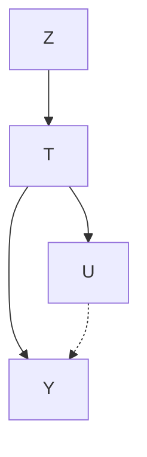
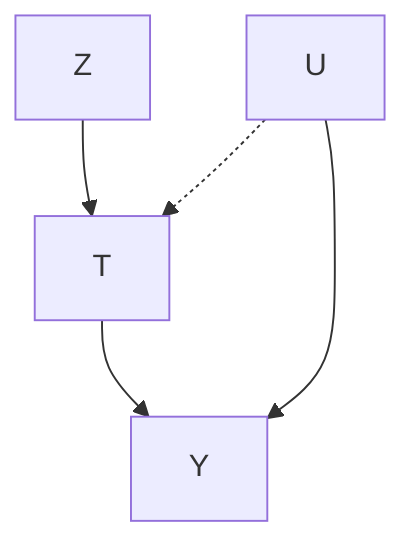
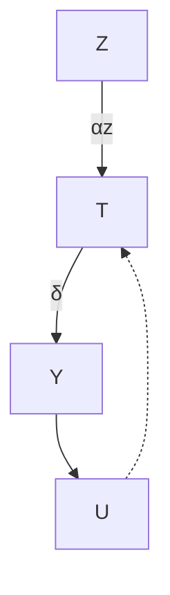
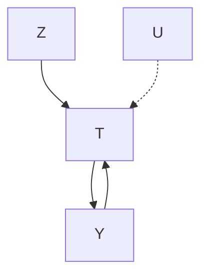
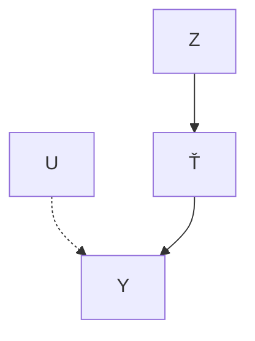
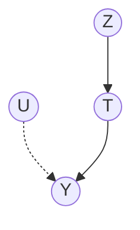

# Instrumental Variables

How can we identify causal effects when we are in the presence of unobserved confounding? One popular way is to find and use instrumental variables. An instrument (instrumental variable)  has three key qualities. It affects on treatment , it affects  only through , and the effect of 𝑇 𝑌 𝑇 on  is unconfounded. We depict these qualities in Figure 9.1. These 𝑍 𝑌qualities allow us to use  to isolate the causal association flowing from 𝑍to . The intuition is that changes in will be reflected in and lead to corresponding changes in . And these specifically -focused changes are unconfounded (unlike the changes to  induced by the unobserved 𝑇confounder ), so they allow us to isolate the causal association that flows from to .

Figure 9.1: Graph where  is an unobserved confounder of the effect of  on  and  is an instrumental variable.

## 9.1 What is an Instrument?

There are three main assumptions that must be satisfied for a variable to be considered an instrument. The first is that must be relevant in the sense that it must influence .

Assumption 9.1 (Relevance)  has a causal effect on

Graphically, the relevance assumption corresponds to the existence of an active edge from  to  in the causal graph. The second assumption is 𝑍 𝑇known as the exclusion restriction.

Assumption 9.2 (Exclusion Restriction)  causal effect on  is fully mediated by

This assumption is known as the exclusion restriction because it excludes from the structural equation for  and from any other structural equations that would make causal association flow from to without 𝑍 𝑌going through . Graphically, this means that we’ve excluded enough 𝑇potential edges between variables in the causal graph so that all causal paths from  to  go through . Finally, we assume that the causal effect of on is unconfounded:

9.1 What is an Instrument? . . 86  
9.2 No Nonparametric Identification of the ATE . . . . . . 87  
9.3 Warm-Up: Binary Linear Setting . . 87  
9.4 Continuous Linear Setting 88  
9.5 Nonparametric Identification of Local ATE . . . . . . 90

New Potential Notation with Instruments 90

Principal Stratification . . . 90

Local ATE 91

9.6 More General Settings for ATE Identification . . . . . 94Assumption 9.3 (Instrumental Unconfoundedness) There are no backdoor paths from  to .

Conditional Instruments We phrased Assumption 9.3 as unconditional unconfoundedness, but all the math for instrumental variables still works if we have unconfoundedness conditional on observed variables as well. We just have to make sure we condition on those relevant variables. In this case, you might see  referred to as a conditional instrument.

## 9.2 No Nonparametric Identification of the ATE

You might be wondering “if instrumental variables allow us to identify causal effects, then why didn’t we see them back in Chapter 6 Nonparametric Identification?” The answer is that instrumental variables don’t nonparametrically identify the causal effect. We have nonparametric identification when we don’t have to make any assumptions about the parametric form. With instrumental variables, we must make assumptions about the parametric form (e.g. linear) to identify causal effects.

We saw the following useful necessary condition for nonparametric identification in Section 6.3: For each backdoor path from to any child that is an ancestor of $\boldsymbol { Y } ,$ 𝑇 it is possible to block that path [18, p. 92]. And we can see in Figure 9.2 that there is a backdoor path from  to  that cannot be blocked: $T \left. U \right. Y$ . So this necessary condition tells us that 𝑇 𝑈 𝑌we can’t use the instrument  to nonparametrically identify the effect of on .

## 9.3 Warm-Up: Binary Linear Setting

As a warm-up, we’ll start in the setting where and are binary and 𝑇 𝑍where we make the parametric assumption that  is a linear function of and :

Assumption 9.4 (Linear Outcome)

$$
Y := \delta T + \alpha_ {u} U \tag {9.1}
$$

The fact that  doesn’t appear in Equation 9.1 is a consequence of the 𝑍exclusion restriction (Assumption 9.2).

Then, with this assumption in mind, we’ll try to identify the causal effect 𝛿. Because we have the intuition that  will be useful for identifying the effect of on $\boldsymbol { Y } ,$ 𝑍 we’ll start with the associational difference for the $Z – Y$ 𝑇relationship: $\mathbb { E } [ Y \mid Z = 1 ] - \mathbb { E } [ Y \mid Z = 0 ]$ . By immediately applying 𝑍 𝑌 𝑌 𝑍 𝑌 𝑍Assumption 9.4, we have the following:

$$
\mathbb {E} [ Y \mid Z = 1 ] - \mathbb {E} [ Y \mid Z = 0 ] \tag {9.2}
$$

$$
= \mathbb {E} [ \delta T + \alpha_ {u} U \mid Z = 1 ] - \mathbb {E} [ \delta T + \alpha_ {u} U \mid Z = 0 ] \tag {9.3}
$$

Figure 9.2: Graph where is an unob-𝑈served confounder of the effect of on and is an instrumental variable.

[18]: Pearl (2009), CausalityUsing linearity of expectation and rearranging a bit:

$$
= \delta (\mathbb {E} [ T \mid Z = 1 ] - \mathbb {E} [ T \mid Z = 0 ]) + \alpha_ {u} (\mathbb {E} [ U \mid Z = 1 ] - \mathbb {E} [ U \mid Z = 0 ]) \tag {9.4}
$$

Now, we use the instrumental unconfoundedness assumption (Assumption 9.3). This means that  and  are independent, which allows us to get rid of the  term:

$$
= \delta (\mathbb {E} [ T \mid Z = 1 ] - \mathbb {E} [ T \mid Z = 0 ]) + \alpha_ {u} (\mathbb {E} [ U ] - \mathbb {E} [ U ]) \tag {9.5}
$$

$$
= \delta (\mathbb {E} [ T \mid Z = 1 ] - \mathbb {E} [ T \mid Z = 0 ]) \tag {9.6}
$$

Then, we can solve for 𝛿 to get the Wald estimand:

## Proposition 9.1

$$
\delta = \frac {\mathbb {E} [ Y \mid Z = 1 ] - \mathbb {E} [ Y \mid Z = 0 ]}{\mathbb {E} [ T \mid Z = 1 ] - \mathbb {E} [ T \mid Z = 0 ]} \tag {9.7}
$$

Because of Assumption 9.1, we know that the denominator is non-zero, so the right-hand side isn’t undefined. Then, we just plug in empirical means in place of these conditional expectations to get the Wald estimator [74]:

$$
\hat {\delta} = \frac {\frac {1}{n _ {1}} \sum_ {i : z _ {i} = 1} Y _ {i} - \frac {1}{n _ {0}} \sum_ {i : z _ {i} = 0} Y _ {i}}{\frac {1}{n _ {1}} \sum_ {i : z _ {i} = 1} T _ {i} - \frac {1}{n _ {0}} \sum_ {i : z _ {i} = 0} T _ {i}} \tag {9.8}
$$

where $n _ { 1 }$ is the number of samples where $Z = 1$ and $n _ { 0 }$ is the number of samples where $Z = 0$ .

Causal Effects as Multiplying Path Coefficients When the structural equations are linear, you can think of the causal association flowing from a variable  to a variable  as the product of the coefficients along the 𝐴 𝐵directed path from to . If there are multiple paths, you just sum the causal associations along all those paths. However, we don’t have direct access to the causal association. Rather, we can measure total association, and unblocked backdoor paths also contribute to total association, which is why $\mathbb { E } [ Y \mid T = 1 ] - \mathbb { E } [ Y \mid T = 0 ] \neq \delta$ . So how can we identify the 𝑌 𝑇 𝑌 𝑇effect of on in Figure 9.3? Because there are no backdoor paths from 𝑇 𝑌the instrument  to $\boldsymbol { Y } ,$ we can trivially identify the effect of $Z$ on $Y \colon$ $\mathbb { E } [ Y \mid Z = 1 ] - \mathbb { E } [ Y \mid Z = 0 ] = \alpha _ { z } \delta$ 𝑍 𝑌. Similarly, we can identify the effect 𝑌 𝑍 𝑌of the instrument on $T \colon \mathbb { E } [ T \mid Z = 1 ] - \mathbb { E } [ T \mid Z = 0 ] = \alpha _ { z }$ . Then, we can divide the effect of  on  by the effect of the  on  to identify $\begin{array} { r } { \delta \left( \frac { \alpha _ { z } \delta } { \alpha _ { z } } \right) } \end{array}$ And this quotient is exactly the Wald estimand in Proposition 9.1.

## 9.4 Continuous Linear Setting

We’ll now consider the setting where and $Z$ are continuous, rather 𝑇 𝑍than binary. We’ll still assume the linear form for  (Assumption 9.4), 𝑌which means that the causal efffect of  on  is 𝛿. In the continuous setting, we get the natural continuous analog of the Wald estimand:

[74]: Wald (1940), ‘The Fitting of Straight Lines if Both Variables are Subject to Error’

Active reading exercise: Where did we use each of Assumptions 9.1 to 9.4 in the above derivation of Equation 9.7.

Figure 9.3: Graph where is an unob-𝑈served confounder of the effect of on and is an instrumental variable.

## Proposition 9.2

$$
\delta = \frac {\operatorname{Cov} (Y , Z)}{\operatorname{Cov} (T , Z)} \tag {9.9}
$$

Proof. Just as we started with $\mathbb { E } [ Y \mid Z = 1 ] - \mathbb { E } [ Y \mid Z = 0 ]$ in the previous 𝑌 𝑍 𝑌 𝑍section, here, we’ll start with the continuous analog $\mathrm { C o v } ( Y , Z )$ . We start with a classic covariance identity:

$$
\operatorname{Cov} (Y, Z) = \mathbb {E} [ Y Z ] - \mathbb {E} [ Y ] \mathbb {E} [ Z ] \tag {9.10}
$$

Then, applying the linear outcome assumption (Assumption 9.4):

$$
= \mathbb {E} [ (\delta T + \alpha_ {u} U) Z ] - \mathbb {E} [ \delta T + \alpha_ {u} U ] \mathbb {E} [ Z ] \tag {9.11}
$$

Distributing and rearranging:

$$
= \delta \mathbb {E} [ T Z ] + \alpha_ {u} \mathbb {E} [ U Z ] - \delta \mathbb {E} [ T ] \mathbb {E} [ Z ] - \alpha_ {u} \mathbb {E} [ U ] \mathbb {E} [ Z ] \tag {9.12}
$$

$$
= \delta (\mathbb {E} [ T Z ] - \mathbb {E} [ T ] \mathbb {E} [ Z ]) + \alpha_ {u} (\mathbb {E} [ U Z ] - \mathbb {E} [ U ] \mathbb {E} [ Z ]) \tag {9.13}
$$

Now, we see that we can apply the same covariance identity again:

$$
= \delta \operatorname{Cov} (T, Z) + \alpha_ {u} \operatorname{Cov} (U, Z) \tag {9.14}
$$

And $\mathrm { C o v } ( U , Z ) = 0$ by the instrumental unconfoundedness assumption 𝑈 , 𝑍(Assumption 9.3):

$$
= \delta \operatorname{Cov} (T, Z) \tag {9.15}
$$

Finally, we solve for 𝛿:

$$
\delta = \frac {\operatorname{Cov} (Y , Z)}{\operatorname{Cov} (T , Z)} \tag {9.16}
$$

where the relevance assumption (Assumption 9.1) tells us that the denominator is non-zero. □

This leads us to the following natural estimator, similar to the Wald estimator:

$$
\hat {\delta} = \frac {\widehat {\operatorname{Cov}} (Y , Z)}{\widehat {\operatorname{Cov}} (T , Z)} \tag {9.17}
$$

Another equivalent estimator is what’s known as the two-stage least squares estimator (2SLS). The two stages are as follows:

1. Linearly regress $T$ on $Z$ to estimate $\mathbb { E } [ T \mid Z ]$ . This gives us the 𝑇projection of onto $Z \colon { \hat { T } }$ .  
𝑇2. Linearly regress $Y$ on $\hat { T }$ 𝑇to estimate $\mathbb { E } [ Y \mid { \hat { T } } ]$ . Obtain our estimate $\hat { \delta }$ 𝑌 𝑇as the fitted coefficient in front of $\hat { T }$ .

There is helpful intuition that comes with the 2SLS estimator. To see this, start with the canonical instrumental variable graph we’ve been using (Figure 9.4). In stage one, we are projecting $T$ onto $Z$ to get $\hat { T }$ as a function of only $Z \colon { \hat { T } } = { \hat { \mathbb { E } } } [ { \check { T } } \mid Z ]$ 𝑇 𝑍. Then, imagine a graph where $T$ 𝑇is replaced with $\hat { T } ( \mathrm { F i g u r e } 9 . 5 )$ 𝑇 𝑍. Because $\hat { T }$ isn’t a function of $U ,$ 𝑇, we can think of removing 𝑇the $\dot { U }  \hat { T }$ 𝑇 𝑈edge in this graph. Now, because there are no backdoor paths

Active reading exercise: Where did we use the exclusion restriction assumption (Assumption 9.2) in this proof?

Figure 9.4: Graph where $U$ is an unob-𝑈served confounder of the effect of on and is an instrumental variable.

Figure 9.5: Augmented version of $\mathrm { F i g \mathrm { - } }$ ure 9.4, where is replaced with $\hat { T } =$ ${ \hat { \mathbb { E } } } [ T \mid Z ] ,$ 𝑇, which doesn’t depend on $U ,$ so 𝑇 𝑍 𝑈there it no longer has an incoming edge from .

from $\hat { T }$ to $\boldsymbol { Y } ,$ we can get that association is causation in stage two, where 𝑇 𝑌we simply regress $Y$ on $\hat { T }$ to estimate the causal effect. Note: We can also use 2SLS in the binary setting we discussed in Section 9.3.

## 9.5 Nonparametric Identification of Local ATE

The problem with the previous two sections is that we’ve made the strong parametric assumption of linearity (Assumption 9.4). For example, this assumption requires homogeneity (that the treatment effect is the same for every unit). There are other variants that encode the homogeneity assumption (see, e.g., Hernán and Robins $[ 7 ,$ Section 16.3]), and they are all strong assumptions. Ideally, we’d be able to use instrumental variables for identification without making any parametric assumptions such as linearity or homogeneity. And we can. We just need to settle for a more specific causal estimand than the ATE and swap the linearity assumption out for a new assumption. We will do this in the binary setting, so both $T$ and $Z$ are binary. Before we can do that, we must define a bit of new notation in Section 9.5.1 and introduce principal stratification in Section 9.5.2.

## 9.5.1 New Potential Notation with Instruments

Just like we use $\begin{array} { r } { Y ( 1 ) \triangleq Y ( T = 1 ) } \end{array}$ to denote the potential outcome we 𝑌 𝑌 𝑇would observe if we were to take treatment and $\boldsymbol { Y } ( 0 ) \triangleq \boldsymbol { Y } ( \boldsymbol { T } = 0 )$ to denote the potential outcome we would observe if we were to not take treatment, we will define similar potential notation with instruments.

We’ll think of the instrument $Z$ as encouragement for the treatment, so if we have $Z = 1$ , we’re encouraged to take the treatment, and if we have $Z = 0 ,$ 𝑍, we’re encouraged to not take the treatment. Let $T ( 1 ) \triangleq T ( Z = 1 )$ 𝑍 𝑇 𝑇 𝑍denote the treatment we would take if we were to get instrument value 1. Similarly, let $T ( 0 ) \triangleq T ( Z = 0 )$ denote the treatment we would take if we were to get instrument value .

Then, we have the same for potential outcomes where we’re intervening on the instrument, rather than the treatment: $Y ( Z = 1 )$ denotes the outcome we would observe if we were to be encouraged to take the treatment and $Y ( Z = 0 )$ denotes the outcome we would observe if we were to be encouraged to not take the treatment.

## 9.5.2 Principal Stratification

We will segment the population into four principal strata, based on the relationship between the encouragement $Z$ and the treatment taken $T$ 𝑍 𝑇There are four strata because there is one for each combination of the values the binary variables $Z$ and $T$ can take on.

[7]: Hernán and Robins (2020), Causal Inference: What If

## Definition 9.1 (Principal Strata)

1. Compliers - always take the treatment that they’re encouraged to take. Namely, $T ( 1 ) = 1 \ : a n d \ : T ( 0 ) = 0 .$ .

2. Always-takers - always take the treatment, regardless of encouragement. Namely, (1) = 1 and (0) = 1.  
𝑇 𝑇3. Never-takers - never take the treatment, regardless of encouragement. Namely, (1) = 0 and (0) = 0.  
𝑇 𝑇4. Defiers - always take the opposite treatment of the treatment that they are encouraged to take. Namely, (1) = 0 and (0) = 1.

Different Causal Graphs Importantly, these strata have different causal graphs. While the treatment that the compliers and defiers take depends on the encouragement (instrument), the treatment that the always-takers and never-takers take does not. Therefore, the compliers and defiers have the normal causal graph (Figure 9.6), whereas the always-takers and never-takers have the same causal graph but with the $Z \to T$ edge removed (Figure 9.7). This means that the causal effect of on is 𝑍 𝑇zero for always-takers and never-takers. Then, because of the exclusion restriction, this means that the causal effect of  on  is zero for the 𝑍 𝑌always-takers and never-takers. This will be important for the upcoming derivation.

Can’t Identify Stratum Given some observed value of  and , we can’t actually identify which stratum we’re in. There are four combinations of the binary variables and ; for each of these combinations, we’ll note 𝑍 𝑇that more than one stratum is compatible with the observed combinations of values.

1.  = 0 = 0. Compatible strata: compliers or never-takers  
𝑍 , 𝑇2.  = 0 = 1. Compatible strata: defiers or always-takers  
𝑍 , 𝑇3.  = 1 = 0. Compatible strata: defiers or never-takers  
𝑍 , 𝑇4.  = 1 = 1. Compatible strata: compliers or always-takers

This means that we can’t identify if a given unit is a complier, a defier, an always-taker, or a never-taker.

## 9.5.3 Local ATE

Although we won’t be able to use instrumental variables to nonparametrically identify the ATE in the presence of unobserved confounding (Section 9.2), we will be able to nonparametrically identify what’s known as the local ATE. The local average treatment effect (LATE) is also known as the complier average causal effect (CACE), as it is the ATE among the compliers.

Definition 9.2 (Local Average Treatment Effect (LATE) / Complier Average Causal Effect (CACE))

$$
\mathbb {E} [ Y (T = 1) - Y (T = 0) \mid T (Z = 1) = 1, T (Z = 0) = 0 ] \tag {9.18}
$$

To identify the LATE, although we will no longer need the linearity assumption (Assumption 9.4), we will need to introduce a new assumption known as monotonicity.

Assumption 9.5 (Monotonicity)

$$
\forall i, \quad T _ {i} (Z = 1) \geq T _ {i} (Z = 0) \tag {9.19}
$$

Figure 9.6: Causal graph for the compliers and defiers.

Figure 9.7: Causal graph for the alwaystakers and never-takers.

Active reading exercise: Ensure that you follow why these are the compatible strata for each of these combinations of observed values.

Monotonicity means that if we are encouraged to take the treatment $( Z = 1 )$ , we are either more likely or equally likely to take the treatment than we would be if we were encouraged to not take the treatment $( Z = 0 )$ . Importantly, this means that we are assuming that there are no defiers. This is because the compliers satisfy $T ( 1 ) > T ( 0 )$ , the always-takers and never-takers satisfy ${ \bar { T } } ( 1 ) = T ( 0 )$ , but the defiers don’t satisfy either 𝑇of these; among the defiers, $T ( 1 ) < T ( 0 )$ , which is a violation of the monotonicity assumption.

We’ve now introduced the key concepts of principal strata and the monotonicity assumption. Importantly, we saw that the causal effect of on  is zero among the always-takers and never-takers (Section 9.5.2), and we just saw that monotonicity assumption implies that there are no defiers. With this in mind, we are now ready to derive the nonparametric identification result for the LATE estimand.

Theorem 9.3 (LATE Nonparametric Identification) Given that  is an 𝑍instrument,  and  are binary variables, and that monotonicity holds, the 𝑍following is true:

$$
\mathbb {E} [ Y (1) - Y (0) \mid T (1) = 1, T (0) = 0 ] = \frac {\mathbb {E} [ Y \mid Z = 1 ] - \mathbb {E} [ Y \mid Z = 0 ]}{\mathbb {E} [ T \mid Z = 1 ] - \mathbb {E} [ T \mid Z = 0 ]} \tag {9.20}
$$

Proof. Because we’re interested in the causal effect of  on  and because 𝑇 𝑌know that we’ll use the instrument , we’ll start with the causal effect of on  and decompose it into weighted stratum-specific causal effects 𝑍 𝑌using the law of total probability:

$$
\begin{array}{l} \mathbb {E} [ Y (Z = 1) - Y (Z = 0) ] \\ = \mathbb {E} [ Y (Z = 1) - Y (Z = 0) \mid T (1) = 1, T (0) = 0 ] P (T (1) = 1, T (0) = 0) \\ + \mathbb {E} [ Y (Z = 1) - Y (Z = 0) \mid T (1) = 0, T (0) = 1 ] P (T (1) = 0, T (0) = 1) \\ + \mathbb {E} [ Y (Z = 1) - Y (Z = 0) \mid T (1) = 1, T (0) = 1 ] P (T (1) = 1, T (0) = 1) \\ + \mathbb {E} [ Y (Z = 1) - Y (Z = 0) \mid T (1) = 0, T (0) = 0 ] P (T (1) = 0, T (0) = 0) \tag {9.21} \\ \end{array}
$$

The first term correponds to the compliers, the second term corresponds to the the defiers, the third term corresponds to the always-takers, and the last term corresponds to the never takers. As we discussed in Section 9.5.2, the causal effect of  on  among the always-takers and never-takers is zero, so we can remove those terms.

$$
\begin{array}{l} = \mathbb {E} [ Y (Z = 1) - Y (Z = 0) \mid T (1) = 1, T (0) = 0 ] P (T (1) = 1, T (0) = 0) \\ + \mathbb {E} [ Y (Z = 1) - Y (Z = 0) \mid T (1) = 0, T (0) = 1 ] P (T (1) = 0, T (0) = 1) \tag {9.22} \\ \end{array}
$$

Because we’ve made the monotonicity assumption, we know that there are no defiers $( P ( T ( 1 ) = 0 , T ( 0 ) = 1 ) = 0 )$ , so the defiers term is also zero.

$$
= \mathbb {E} [ Y (Z = 1) - Y (Z = 0) \mid T (1) = 1, T (0) = 0 ] P (T (1) = 1, T (0) = 0) \tag {9.23}
$$

Now, if we solve for this effect of  on  among the compliers, we get

$$
\begin{array}{l} \text { Compliers: } T (1) = 1, T (0) = 0 \\ \mathrm{Always-takers:} T (1) = 1, T (0) = 1 \\ \text { Never - takers: } T (1) = 0, T (0) = 0 \\ \text { Defiers: } T (1) = 0, T (0) = 1 \\ \end{array}
$$

<!-- footnote -->

- This paragraph contains a lot of information. Active reading exercise:
- ) Convince yourself that ITEs and “CATEs” (what we call IATEs) are the same $\mathrm { i f } X = I .$ .
- 𝑋 𝐼2) Convince yourself that corresponds to 𝐼the exogenous variables in the magnified graph that have causal association flowing to .

<!-- footnote end -->

<!-- footnote -->

- Active reading exercise: How would we estimate these conditional expectations?

<!-- footnote end -->

the following:

$$
\mathbb {E} [ Y (Z = 1) - Y (Z = 0) \mid T (1) = 1, T (0) = 0 ] = \frac {\mathbb {E} [ Y (Z = 1) - Y (Z = 0) ]}{P (T (1) = 1 , T (0) = 0)} \tag {9.24}
$$

And because these are the compliers, people who will take whichever treatment they are encouraged to take, $Y ( Z = 1 )$ and $Y ( Z = 0 )$ are really equal to $Y ( T = 1 )$ and $Y ( T = 0 )$ 𝑌 𝑍 𝑌 𝑍, respectively, so we can change the 𝑌 𝑇 𝑌 𝑇left-hand side of Equation 9.24 to the LATE, the causal estimand that we’re trying to identify:

$$
\mathbb {E} [ Y (T = 1) - Y (T = 0) \mid T (1) = 1, T (0) = 0 ] \tag {9.25}
$$

$$
= \frac {\mathbb {E} [ Y (Z = 1) - Y (Z = 0) ]}{P (T (1) = 1 , T (0) = 0)} \tag {9.26}
$$

Now, we apply the the instrumental unconfoundedness assumption (Assumption 9.3) to identify the numerator.

$$
= \frac {\mathbb {E} [ Y \mid Z = 1 ] - \mathbb {E} [ Y \mid Z = 0 ]}{P (T (1) = 1 , T (0) = 0)} \tag {9.27}
$$

All that’s left is to identify the denominator, the probability of being a complier. However, we mentioned that we can’t identify the compliers in Section 9.5.2, so how can we do this? This is where we’ll need to be a bit clever. We’ll get this probability by taking everyone (probability 1) and subtracting out the the always-takers and the compliers, since there are no defiers, due to monotonicity (Assumption 9.5).

$$
= \frac {\mathbb {E} [ Y \mid Z = 1 ] - \mathbb {E} [ Y \mid Z = 0 ]}{1 - P (T = 0 \mid Z = 1) - P (T = 1 \mid Z = 0)} \tag {9.28}
$$

To understand how we got the above equality, consider that everyone either has $Z = 1$ or $Z = 0$ . We can subtract out all of the never-takers 𝑍 𝑍by removing those that had $T = 0$ among the $Z = 1$ subpopulation $( P ( T = 0 \mid Z = 1 ) )$ 𝑇 𝑍. Similarly, we can subtract out all of the always-takers by removing those that had $T = 1$ among the $Z = 0$ subpopulation $( P ( T = 1 \mid Z = 0 ) )$ 𝑇 𝑍). We know that this removes all of the never-takers 𝑃 𝑇 𝑍and always-takers because there are no defiers and because we’ve looked at both the $Z = 1$ subpopulation and the $Z = 0$ subpopulation. Now, we just do a bit of manipulation:

$$
= \frac {\mathbb {E} [ Y \mid Z = 1 ] - \mathbb {E} [ Y \mid Z = 0 ]}{1 - (1 - P (T = 1 \mid Z = 1)) - P (T = 1 \mid Z = 0)} \tag {9.29}
$$

$$
= \frac {\mathbb {E} [ Y \mid Z = 1 ] - \mathbb {E} [ Y \mid Z = 0 ]}{P (T = 1 \mid Z = 1) - P (T = 1 \mid Z = 0)} \tag {9.30}
$$

Finally, because  is a binary variable, we can swap out probabilities of $T = 1$ 𝑇for expectations:

$$
= \frac {\mathbb {E} [ Y \mid Z = 1 ] - \mathbb {E} [ Y \mid Z = 0 ]}{\mathbb {E} [ T \mid Z = 1 ] - \mathbb {E} [ T \mid Z = 0 ]} \tag {9.31}
$$

□

This is exactly the Wald estimand that we saw back in the linear setting (Section 9.3) in Equation 9.7. However, this time, it is the corresponding statistical estimand of the local ATE $\mathbb { E } [ Y ( T = 1 ) - Y ( T = 0 ) \mid T ( 1 ) =$ $1 , T ( 0 ) = 0 ]$ , also known as the complier average causal effect (CACE). This , 𝑇LATE/CACE causal estimand is in contrast to the ATE causal estimand that we saw in Section 9.3: 𝔼 $[ Y ( T \ = \ 1 ) - Y ( T \ = \ 0 ) ]$ ]. The difference is that the complier average causal effect is the ATE specifically in the subpopulation of compliers, rather than the total population. It’s local (LATE) to that subpopulation, rather than being global over the whole population like the ATE is. So we’ve seen two different assumptions that get us to the Wald estimand with instrumental variables:

1. Linearity (or more generally homogeneity)  
2. Monotonicity

Problems with LATE/CACE There are a few problems with the Wald estimand for LATE, though. The first is that monotonicity might not be satisfied in your setting of interest. The second is that, even if monotonicity is satisfied, you might not be interested in the causal effect specifically among the compliers, especially because you can’t even identify who the compliers are (see Section 9.5.2). Rather, the regular ATE is often a more useful quantity to know.

## 9.6 More General Settings for ATE Identification

A common more general setting instrumental variable setting is to consider that the outcome is generated by a complex function of treatment and observed covariates plus some additive unobserved confounders:

$$
Y := f (T, W) + U \tag {9.32}
$$

See, for example, Hartford et al. [75] and Xu et al. [76] for using deep learning to model  . See references in those papers for using other 𝑓models such as kernel methods to model  . In those models and given 𝑓that  enters in the structural equation for  additively, you can get 𝑈identification with instrumental variables.

Alternatively, we could give up on point identification of causal effects, instead settle for set identification (partial identification), and use instrumental variables to get bounds on causal effects. For more on that, see Pearl [18, Section 8.2]. Additionally, settling for identifying a set, rather than a point, allows us to relax the additive noise assumption above in Equation 9.32. For example, Kilbertus et al. [77] considers the setting where  doesn’t enter the structural equation for  additively:

$$
Y := f (T, U) \tag {9.33}
$$

[75]: Hartford et al. (2017), ‘Deep IV: A Flexible Approach for Counterfactual Prediction’

[76]: Xu et al. (2020), Learning Deep Features in Instrumental Variable Regression

[18]: Pearl (2009), Causality

[77]: Kilbertus et al. (2020), A Class of Algorithms for General Instrumental Variable Models