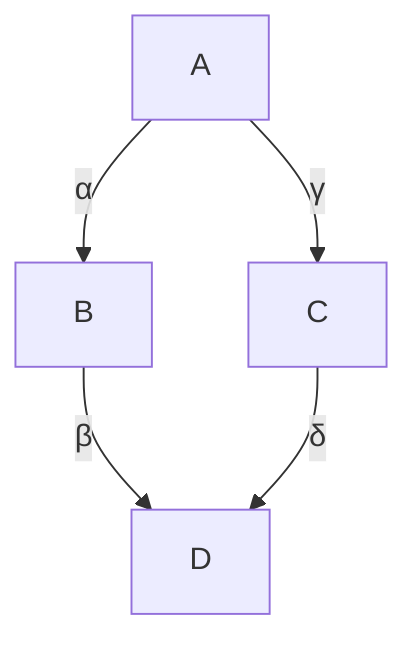
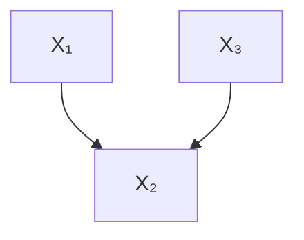
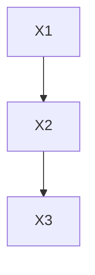
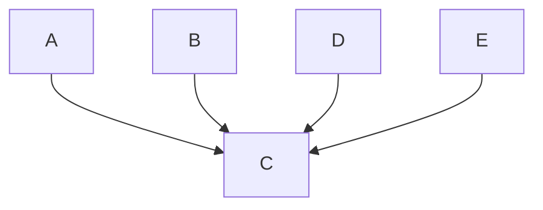
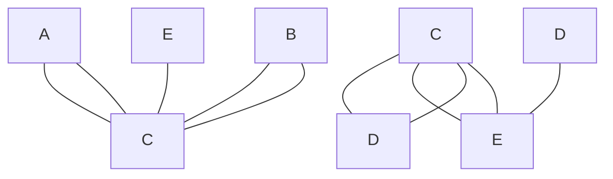
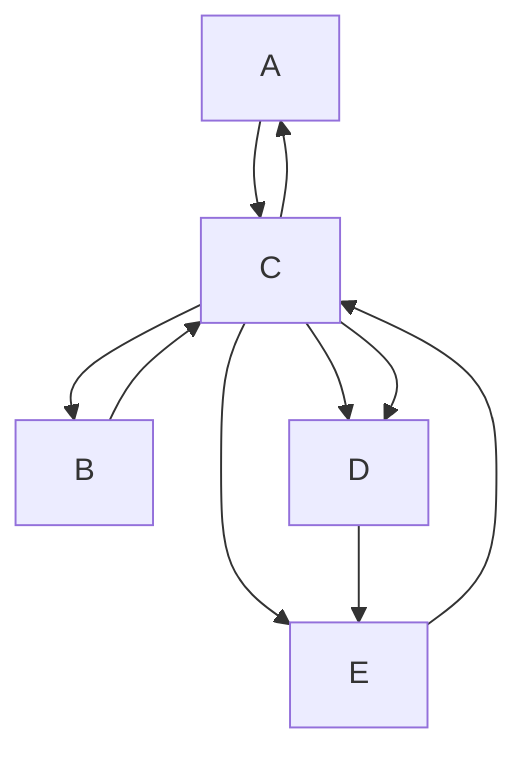

# Causal Discovery from Observational Data

Throughout this book, we have done causal inference, assuming we know the causal graph. What if we don’t know the graph? Can we learn it? As you might expect, based on this being a running theme in this book, it will depend on what assumptions we are willing to make. We will refer to this problem as structure identification, which is distinct from the causal estimand identification that we’ve seen in the book up until now.

## 11.1 Independence-Based Causal Discovery

## 11.1.1 Assumptions and Theorem

The main assumption we’ve seen that relates the graph to the distribution is the Markov assumption. The Markov assumption tells us if variables are d-separated in the graph , then they are independent in the distribution (Theorem 3.1):

$$
X \perp_ {G} Y \mid Z \implies X \perp_ {P} Y \mid Z \tag {3.20revisited}
$$

Maybe we can detect independencies in the data and then use that to infer the causal graph. However, going from independencies in the distribution  to d-separations in the graph  isn’t something that the 𝑃 𝐺Markov assumption gives us (see Equation 3.20 above). Rather, we need the converse of the Markov assumption. This is known as the faithfulness assumption.

Assumption 11.1 (Faithfulness)

$$
X \perp_ {G} Y \mid Z \Longleftarrow X \perp_ {P} Y \mid Z \tag {11.1}
$$

This assumption allows us to infer d-separations in the graph from independencies in the distribution. Faithfulness, along with the Markov assumption, actually implies minimality (Assumption 3.2), so it is a stronger assumption. Faithfulness is a much less attractive assumption than the Markov assumption because it is easy to think of counterexamples (where two variables are independent in , but there are unblocked paths between them in ).

Faithfulness Counterexample Consider  and  in the causal graph with coefficients in Figure 11.1. We have a violation of faithfulness when the $A  B  D$ path cancels out the  →  →  path. To concretely see 𝐴 𝐵 𝐷 𝐴 𝐶 𝐷how this could happen, consider the SCM that this graph represents:

$$
B := \alpha A \tag {11.2}
$$

$$
C := \gamma A \tag {11.3}
$$

$$
D := \beta B + \delta C \tag {11.4}
$$

11.1 Independence-Based Causal Discovery 100

Assumptions and Theorem 100

The PC Algorithm . . . . . . 102

Can We Get Any Better Identification? . 104

11.2 Semi-Parametric Causal Discovery 104

No Identifiability Without Parametric Assumptions . 105

Linear Non-Gaussian Noise 105

Nonlinear Models . . . . . . 108

11.3 Further Resources . . . . . . 109

Figure 11.1: Faithfulness counterexample graph.

We can solve for the dependence between  and  by plugging in for 𝐴and  in Equation 11.4 to get the following:

$$
D = (\alpha \beta + \gamma \delta) A \tag {11.5}
$$

This means that the association flowing from  to  is 𝛼𝛽 + 𝛾𝛿 in this example. The two paths would cancel if 𝛼𝛽 = −𝛾𝛿, which would make make ⊥⊥ . This violation of faithfulness would incorrectly lead us to 𝐴 𝐷believe that there are no paths between  and  in the graph.

In addition to faithfulness, many methods also assume that there are no unobserved confounders, which is known as causal sufficiency.

Assumption 11.2 (Causal Sufficiency) There are no unobserved confounders of any of the variables in the graph.

Then, under the Markov, faithfulness, causal sufficiency, and acyclicity assumptions, we can partially identify the causal graph. We can’t completely identify the causal graph because different graphs correspond to the same set of independencies. For example, consider the graphs in Figure 11.2.

(a) Chain directed to the right

(b) Chain directed to the left

(c) Fork  
Figure 11.2: Three Markov equivalent graphs

Although these are all distinct graphs, they correspond to the same set of independence/dependence assumptions. Recall from Section 3.5 that $X _ { 1 } \perp \perp X _ { 3 } \mid X _ { 2 }$ in distributions that are Markov with respect to any of these 𝑋 𝑋 𝑋three graphs in Figure 11.2. We also saw that minimality told us that $X _ { 1 }$ and $X _ { 2 }$ are dependent and that $X _ { 2 }$ and $X _ { 3 }$ are dependent. And the stronger 𝑋 𝑋 𝑋faithfulness assumption additionally tells us that in any distributions that are faithful with respect to any of these graphs, $X _ { 1 }$ and $X _ { 3 }$ are dependent if we don’t condition on $X _ { 2 }$ 𝑋 𝑋. So using the presence/absence 𝑋of (conditional) independencies in the data isn’t enough to distinguish these three graphs from each other; these graphs are Markov equivalent;

We say that two graphs are Markov equivalent if they correspond to the same set of conditional independencies. Given a graph, we refer to its Markov equivalence class as the set of graphs that encode the same conditional independencies. Under faithfulness, we are able to identify a graph from conditional independencies in the data if it is the only graph in its Markov equivalence class. Any example of a graph that is the only one in its Markov equivalence class the basic immorality that we show in Figure 11.3. Recall from Section 3.6 that immoralities are distinct from the two other basic graphical building blocks (chains and forks) in that in Figure 11.3, $X _ { 1 }$ is (unconditionally) independent of $X _ { 3 } ,$ and $X _ { 1 }$ and $X _ { 3 }$ 𝑋become dependent if we condition on $X _ { 2 }$ 𝑋 𝑋 𝑋. This means that while the basic 𝑋chains and fork in Figure 11.2 are in the same Markov equivalence class, the basic immorality is by itself in its own Markov equivalence class.

Figure 11.3: Immoralities are in their own Markov equivalence class.

We’ve seen that we can identify the causal graph if it’s a basic immorality, but what else can we identify? We saw that chains and forks are all in the same Markov equivalence class, but that doesn’t mean that we can’t get any information from distributions that are Markov and faithful with respect to those graphs. What do all the chains and forks in Figure 11.2 have in common? They are share the same skeleton. A graph’s skeleton is the structure we get if we replace all of its directed edges with undirected edges. We depict the skeleton of a basic chain and a basic fork in Figure 11.4.

A graph’s skeleton also gives us important conditional independence information that we can use to distinguish it from graphs with different skeletons. For example, if we add an $X _ { 1 }  X _ { 3 }$ edge to the chain in 𝑋 𝑋Figure 11.2a, we get the complete1 graph Figure 11.5. In this graph, unlike in a chain or fork graph, $X _ { 1 }$ and $X _ { 3 }$ are not independent when we condition on $X _ { 2 }$ . So this graph is not in the same Markov equivalence 𝑋class as the chains and fork in Figure 11.2. And we can see that graphically by the fact that this graph has a different skeleton than those graphs (this graph has an additional edge between $X _ { 1 }$ and $X _ { 3 } )$ .

To recap, we’ve pointed out two structural qualities that we can use to distinguish graphs from each other:

1. Immoralities  
2. Skeleton

And it turns out that we can determine whether graphs are in the same or different Markov equivalence classes using these two structural qualities, due to a result by Verma and Pearl [78] and Frydenberg [79]:

Proposition 11.1 (Markov Equivalence via Immoral Skeletons) Two graphs are Markov equivalent if and only if they have the same skeleton and same immoralities.

This means that, using conditional independencies in the data, we cannot distinguish graphs that have the same skeletons and same immoralities. For example, we cannot distinguish the two-node graph  →  from 𝑋 𝑌← using just conditional independence information.2 But we can 𝑋 𝑌hope to learn the graph’s skeleton and immoralities; this is known as the essential graph or CPDAG (Completed Partially Directed Acyclic Graph). One popular algorithm for learning the essential graph is the PC algorithm.

## 11.1.2 The PC Algorithm

PC [80] starts with a complete undirected graph and then trims it down and orients edges via three steps:

1. Identify the skeleton.  
2. Identify immoralities and orient them.  
3. Orient qualifying edges that are incident on colliders.

We’ll use the true graph in Figure 11.6 as a concrete example as we explain each of these steps.

Figure 11.4: Chain/fork skeleton.

Figure 11.5: Complete graph.

1 Recall that a complete graph is one where there is an edge connecting every pair of nodes.

[78]: Verma and Pearl (1990), ‘Equivalence and Synthesis of Causal Models’  
[79]: Frydenberg (1990), ‘The Chain Graph Markov Property’

2 Active reading exercise: Check that these graphs encode the same conditional independencies.

[80]: Spirtes et al. (2001), Causation, Prediction, and Search

Figure 11.6: True graph for PC example.

Identify the Skeleton We discover the skeleton by starting with a complete graph (Figure 11.7a) and then removing edges $X - Y$ where $X \perp \perp Y \mid Z$ 𝑋 𝑌for some (potentially empty) conditioning set . So in our 𝑋 𝑌 𝑍 𝑍example, we would start with the empty conditioning set and discover that $A \perp \perp B$ (since the only path from  to  in Figure 11.6 is blocked by the collider ); this means we can remove the $A - B$ edge, which 𝐶 𝐴 𝐵gives us the graph in Figure 11.7b. Then, we would move to conditioning sets of size one and find that conditioning on  tells us that every other 𝐶pair of variables is conditionally independent given $C ,$ which allows us to remove all edges that aren’t incident on , resulting in the graph in Figure 11.7c. And, indeed, this is the skeleton of the true graph in Figure 11.6. More general PC would continue with larger conditioning sets, to see if we can remove more edges, but conditioning sets of size one are enough to discover the skeleton in this example.

(a) Complete undirected graph that we start with

(b) Undirected graph that remains after removing $X - { \dot { Y } }$ edges where ⊥⊥

(c) Undirected graph that remains after removing $X - { \dot { Y } }$ edges where $X \perp \perp Y \mid Z$  
Figure 11.7: Illustration of the process of step 1 of PC, where we start with the complete graph (left) and remove edges until we’ve identified the skeleton of the graph (right), given that the true graph is the one in Figure 11.6.

Identifying the Immoralities Now for any paths $X - Z - Y$ in our 𝑋 𝑍 𝑌working graph where we discovered that there is no edge between  and 𝑋 in our previous step, if  was not in the conditioning set that makes 𝑌 𝑍 and  conditionally independent, then we know $X - Z - Y$ forms an immorality. In other words, this means that $X \not \vdash Y \mid Z ,$ which is a 𝑋 𝑌 𝑍property of an immorality that distinguishes it from chains and forks (Section $3 . 6 ) ,$ , so we can orient these edges to get $X \right. Z \left. Y$ . In our example, this takes us from Figure 11.7c to Figure 11.8.

Orienting Qualifying Edges Incident on Colliders In the final step, we take advantage of the fact that we might be able to orient more edges since we know we discovered all of the immoralities in the previous step. Any edge $Z - Y$ part of a partially directed path of the form $X  Z - Y ,$ 𝑍 𝑌where there is no edge connecting and $\boldsymbol { Y } ,$ 𝑋 can be oriented as $Z \to Y . ^ { 3 }$ 𝑋 𝑌This is because if the true graph has the edge $Z \gets Y$ 𝑍 𝑌, we would have 𝑍 𝑌found this in the previous step as that would have formed an immorality $X \right. Z \left. Y$ . Since we didn’t find that immorality in the previous step, 𝑋 𝑍 𝑌we know that the true direction is $Z \to Y .$ . In our example, this means 𝑍 𝑌we can orient the final two remaining edges, taking us from Figure 11.8 to Figure 11.9. It turns out that in this example, we are lucky that we can orient all of the remaining edges in this last step, but this is not the case in general. For example, we discussed that we wouldn’t be able to distinguish simple chain graphs and simple fork graphs from each other.

Figure 11.8: Graph from PC after we’ve oriented the immoralities.

3 This is called orientation propagation.

Figure 11.9: Graph from PC after we’ve oriented edges that would form immoralities if they were oriented in the other (incorrect) direction.

Dropping Assumptions There are algorithms that allow us to drop various assumptions. The FCI (Fast Causal Inference) algorithm [80] works without assuming causal sufficiency (Assumption 11.2). The CCD algorithm [81] works without assuming acyclicity. And there is various work on SAT-based causal discovery that allows us to drop both of the above assumptions [82, 83].

Hardness of Conditional Independence Testing All methods that rely on conditional independence tests such as PC, FCI, SAT-based algorithm, etc. have an important practical issue associated with them. Conditional independence tests are hard, and it can sometimes require a lot of data to get accurate test results [84]. If we have infinite data, this isn’t an issue, but we don’t have infinite data in practice.

## 11.1.3 Can We Get Any Better Identification?

We’ve seen that assuming the Markov assumption and faithfulness can only get us so far; with those assumptions, we can only identify a graph up to its Markov equivalence class. If we make more assumptions, can we identify the graph more precisely than just its Markov equivalence class?

Well, if we are in the case where the distributions are multinomial, we cannot [85]. Or if we are in the common toy case where the SCMs are linear with Gaussian noise, we cannot [86]. So we have the following completeness result due to Geiger and Pearl [86] and Meek [85]:

Theorem 11.2 (Markov Completeness) If we have multinomial distributions or linear Gaussian structural equations, we can only identify a graph up to its Markov equivalence class.

What if we don’t have multinomial distributions and don’t have linear Gaussian SCMs, though?

## 11.2 Semi-Parametric Causal Discovery

In Theorem 11.2, we saw that, if we are in the linear Gaussian setting, the best we can do is identify the Markov equivalence class; we cannot hope to identify graphs that are in non-singleton Markov equivalence classes. But what if we aren’t in the linear Gaussian setting? Can we identify graphs if we are not in the linear Gaussian setting? We consider the linear non-Gaussian noise setting in Section 11.2.2 and the nonlinear additive noise setting in Section 11.2.3. It turns out that in both of these settings, we can identify the causal graph. And we don’t have to assume faithfulness (Assumption 11.1) in these settings.

By considering these settings, we are making semi-parametric assumptions (about functional form). If we don’t make any assumptions about functional form, we cannot even identify the direction of the edge in a two-node graph. We emphasize this in the next section before moving on to the semi-parametric assumptions that allow us to identify the graph.

[80]: Spirtes et al. (2001), Causation, Prediction, and Search  
[81]: Richardson (1996), ‘Feedback Models: Interpretation and Discovery’  
[82]: Hyttinen et al. (2013), ‘Discovering Cyclic Causal Models with Latent Variables: A General SAT-Based Procedure’  
[83]: Hyttinen et al. (2014), ‘Constraint-Based Causal Discovery: Conflict Resolution with Answer Set Programming’  
[84]: Shah and Peters (2020), ‘The hardness of conditional independence testing and the generalised covariance measure’

[85]: Meek (1995), ‘Strong Completeness and Faithfulness in Bayesian Networks’

[86]: Geiger and Pearl (1988), ‘On the Logic of Causal Models’

## 11.2.1 No Identifiability Without Parametric Assumptions

Markov Perspective Consider the two-variable setting, where the two options of causal graphs are  →  and $X  Y$ . Note that these 𝑋 𝑌 𝑋 𝑌two graphs are Markov equivalent. Both don’t encode any conditional independence assumptions, so both can describe arbitrary distributions $P ( x , y )$ . This means that conditional independencies in the data cannot 𝑃 𝑥, 𝑦help us distinguish between $X  Y$ and $X  Y .$ . Using conditional 𝑋 𝑌 𝑋 𝑌independencies, the best we can do is discover the corresponding essential graph  − .

SCMs Perspective How about if we consider this problem from the perspective of SCMs; can we somehow distinguish $X  Y$ from $X  Y$ using SCMs? For an SCM, we want to write one variable as a function of the other variable and some noise term variable. As you might expect, if we don’t make any assumptions, there exist SCMs with the implied causal graph $X  { \dot { Y } }$ and SCMs with the implied causal graph $X  Y$ that both generate data according to $P ( x , y )$ .

Proposition 11.3 (Non-Identifiability of Two-Node Graphs) For every joint distribution $P ( x , y )$ on two real-valued random variables, there is an 𝑃 𝑥, 𝑦SCM in either direction that generates data consistent with $P ( x , y )$ .

Mathematically, there exists a function $f _ { Y }$ such that

$$
Y = f _ {Y} (X, U _ {Y}), \quad X \perp U _ {Y} \tag {11.6}
$$

and there exists a function such that

$$
X = f _ {X} (Y, U _ {X}), \quad Y \perp U _ {X} \tag {11.7}
$$

where $U _ { Y }$ and $U _ { X }$ are real-valued random variables.

See, e.g., Peters et al. [14, p. 44] for a short proof. Similarly, this nonidentifiability result can be extended to more general graphs that have more than two variables [see, e.g., 14, p. 135].

However, if we make assumptions about the parametric form of the SCM, we can distinguish $X  Y$ from  ←  and identify graphs more 𝑋 𝑌 𝑋 𝑌generally. That’s what we’ll see in the rest of this chapter.

## 11.2.2 Linear Non-Gaussian Noise

We saw in Theorem 11.2 that we cannot distinguish graphs within the same Markov equivalence class if the structural equations are linear with Gaussian noise . For example, this means that we cannot distinguish $X  Y$ from $X  Y$ . However, if the noise term is non-Gaussian, then 𝑋 𝑌 𝑋 𝑌we can identify the causal graph. As usual, we give this key assumption of non-Gaussianity its own box:

Assumption 11.3 (Linear Non-Gaussian) All structural equations (causal

[14]: Peters et al. (2017), Elements of Causal Inference: Foundations and Learning Algorithmsmechanisms that generate the data) are of the following form:

$$
Y := f (X) + U \tag {11.8}
$$

where  is a linear function,  ⊥⊥ , and  is distributed as a non-Gaussian 𝑓random variable.

Then, in this linear non-Gaussian setting, we can identify which of graphs $X  Y$ and  ←  is the true causal graph. We’ll first present 𝑋 𝑌 𝑋 𝑌the theorem and proof and then get to the intuition.

Theorem 11.4 (Identifiability in Linear Non-Gaussian Setting) In the linear non-Gaussian setting, if the true SCM is

$$
Y := f (X) + U, \quad X \perp U, \tag {11.9}
$$

then, there does not exist an SCM in the reverse direction

$$
X := g (Y) + \tilde {U}, \quad Y \perp \perp \tilde {U}, \tag {11.10}
$$

that can generate data consistent with $P ( x , y )$ .

Proof. We’ll first introduce a important result from Darmois [87] and Skitovich [88] and Skitovich [88] that we’ll use to prove this theorem:

Theorem 11.5 (Darmois-Skitovich) Let $X _ { 1 } , \dots , X _ { n }$ be independent, non-𝑋 , . . . , 𝑋𝑛degenerate random variables. If there exist coefficients $\alpha _ { 1 } , \ldots , \alpha _ { n }$ and $\beta _ { 1 } , \ldots , \beta _ { n }$ , . . . , 𝑛that are all non-zero such that the two linear combinations

$$
A = \alpha_ {1} X _ {1} + \ldots + \alpha_ {n} X _ {n} a n d
$$

$$
B = \beta_ {1} X _ {1} + \ldots + \beta_ {n} X _ {n}
$$

are independent, then each $X _ { i }$ is normally distributed.

We will use the contrapositive of the special case of this theorem for = 2 to do almost all of the work for this proof:

Corollary 11.6 If either of the independent random variables $X _ { 1 }$ or $X _ { 2 }$ is non-Gaussian, then there are no linear combinations

$$
A = \alpha_ {1} X _ {1} + \alpha_ {2} X _ {2} a n d
$$

$$
B = \beta_ {1} X _ {1} + \beta_ {2} X _ {2}
$$

such that  and  are independent (so  and  must be dependent).

Proof Outline With the above corollary in mind, our proof strategy is to write  and $\tilde { U }$ as linear combinations of  and . By doing this, we 𝑌 𝑈 𝑋 𝑈are effectively mapping our variables in Equations 11.9 and 11.10 onto the variables in the corollary as follows: onto , ˜ onto ,  onto $X _ { 1 } ,$ , and onto $X _ { 2 }$ 𝑌 𝐴 𝑈 𝐵 𝑋 𝑋 𝑈. Then, we can apply the above corollary of the Darmois-Skitovich 𝑋Theorem to have that $Y$ and $\tilde { U }$ must be dependent, which violates the 𝑌 𝑈reverse direction SCM in Equation 11.10. We now proceed with the proof.

[87]: Darmois (1953), ‘Analyse générale des liaisons stochastiques: etude particulière de l’analyse factorielle linéaire’  
[88]: Skitovich (1954), ‘Linear forms of independent random variables and the normal distribution law’  
[88]: Skitovich (1954), ‘Linear forms of independent random variables and the normal distribution law’

We already have that we can write  as a linear combination of  and 𝑌 𝑋, since we’ve assumed the true structural equation in Equation 11.9 is 𝑈linear:

$$
Y = \delta X + U \tag {11.11}
$$

Then, to get $\tilde { U }$ as a linear combination of  and , we take the hypothe-𝑈sized reverse SCM

$$
X = \tilde {\delta} Y + \tilde {U} \tag {11.12}
$$

from Equation 11.10, solve for $\tilde { U } _ { \perp }$ and plug in Equation 11.11 for :

$$
\tilde {U} = X - \tilde {\delta} Y \tag {11.13}
$$

$$
= X - \tilde {\delta} (\delta X + U) \tag {11.14}
$$

$$
= (1 - \tilde {\delta} \delta) X + \tilde {\delta} U \tag {11.15}
$$

Therefore, we’ve written both and $\tilde { U }$ as linear combinations of the 𝑌 𝑈independent random variables  and . This allows us to apply Corol-𝑋 𝑈lary 11.6 of the Darmois-Skitovish Theorem to get that  and $\tilde { U }$ must be dependent: $\gamma \nsubseteq \tilde { U }$ . This violates the reverse direction SCM:

$$
X := g (Y) + \tilde {U}, \quad Y \perp \perp \tilde {U} \tag {11.10revisited}
$$

[89]: Shimizu et al. (2006), ‘A Linear Non-Gaussian Acyclic Model for Causal Discovery’

[14]: Peters et al. (2017), Elements of Causal Inference: Foundations and Learning Algorithms

We’ve given the proof here for just two variables, but it can be extended to the more general setting with multiple variables (see [89] and [14, Section 7.1.4]).

## Graphical Intuition

When we fit the data in the causal direction, we get residuals that are independent of the input variable, but when we fit the data in the anti-causal direction, we get residuals that are dependent on the input variable. We depict the regression line $\hat { f }$ we get if we linearly regress 𝑓 𝑌on  (causal direction) in Figure 11.10a, and we depict the regression line $\hat { g }$ we get if we linearly regress $X$ on $Y$ (anti-causal direction) in 𝑔 𝑋 𝑌Figure 11.10b. Just from these fits, you can see that the forward model (fit in the causal direction) looks more pleasing than the backward model (fit in the ant-causal direction).

To make this graphical intuition more clear, we plot the residuals of the forward model $\hat { \boldsymbol { f } }$ (causal direction) and the backward model $\hat { g }$ (anti𝑓 𝑔causal direction) in Figure 11.11. The residuals in the forward direction correspond to the following: ${ \hat { U } } = Y - { \hat { f } } ( X )$ . And the residuals in the backward direction correspond to the follow: $\hat { \tilde { U } } = X - \hat { g } ( Y )$ . As you can 𝑈 𝑋 𝑔 𝑌see in Figure 11.11a, the residuals of the forward model look independent of the input variable (on the x-axis). However in Figure 11.10b, the 𝑋residuals of the backward model don’t look independent of the input variable  (on the x-axis) at all. Clearly, the range of the residuals (on the 𝑌vertical) changes as we move across values of $Y$ (from left to right).

Forward model SCM:

$$
\begin{array}{l l} Y := f (X) + U, & X \perp \perp U \\ & \text {(11.9 revisited)} \end{array}
$$

Backward model SCM:

$$
X := g (Y) + \tilde {U}  , \quad Y \perp \perp \tilde {U}   (1 1. 1 0 \text {   revisited })
$$

## 11.2.3 Nonlinear Models

Nonlinear Additive Noise Setting We can also get identifiability of the causal graph in the nonlinear additive noise setting [90, 91]. This requires the nonlinear additive noise assumption (below) and other more technical assumptions that we refer you to Hoyer et al. [90] and Peters et al. [91] for.

[90]: Hoyer et al. (2009), ‘Nonlinear causal discovery with additive noise models’ [91]: Peters et al. (2014), ‘Causal Discovery with Continuous Additive Noise Models’

Assumption 11.4 (Nonlinear Additive Noise) All causal mechanisms are nonlinear where the noise enters additively. Mathematically,

$$
\forall i, X _ {i} := f \left(\mathrm{pa} _ {i}\right) + U _ {i} \tag {11.16}
$$

where  is nonlinear and pa denotes the parents of .

Post-Nonlinear Setting What if you don’t believe that the noise realistically enters additively. This motivates post-nonlinear models, where there is another nonlinear transformation after adding the noise as inAssumption 11.5 below. This setting can also yield identifiability (under another technical condition). See Zhang and Hyvärinen [92] for more details.

Assumption 11.5 (Post-Nonlinear)

$$
\forall i, X _ {i} := g \left(f \left(\mathrm{pa} _ {i}\right) + U _ {i}\right) \tag {11.17}
$$

where  is nonlinear and pa denotes the parents of .

[92]: Zhang and Hyvärinen (2009), ‘On the Identifiability of the Post-Nonlinear Causal Model’

## 11.3 Further Resources

We conclude this chapter by pointing you to some relevant resources for where to start learning more (in addition to the references in this chapter). These references were also used as inspiration when forming this chapter. See Eberhardt [93] and Glymour et al. [94] for two great review articles from people at the frontier of causal discovery research. And then if you want a whole book on this stuff, Peters et al. [14] wrote a popular one!

[93]: Eberhardt (2017), ‘Introduction to the foundations of causal discovery  
[94]: Glymour et al. (2019), ‘Review of Causal Discovery Methods Based on Graphical Models’  
[14]: Peters et al. (2017), Elements of Causal Inference: Foundations and Learning Algorithms