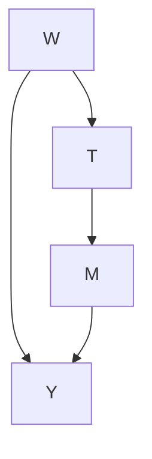

# Appendix

## A.1 Proof of Equation 6.1 from Section 6.1

Claim Given the causal graph is Figure $\mathrm { A } . 1 , P ( m \mid d o ( t ) ) = P ( m \mid t )$ .

Proof. We first apply the Bayesian network factorization (Definition 3.1):

$$
P (w, t, m, y) = P (w)   P (t \mid w)   P (m \mid t)   P (y \mid w, m) \tag {A.1}
$$

Next, we apply the truncated factorization (Proposition 4.1):

$$
P (w, m, y \mid d o (t)) = P (w)   P (m \mid t)   P (y \mid w, m) \tag {A.2}
$$

Finally, we marginalize out  and :

$$
\sum_ {w} \sum_ {y} P (w, m, y \mid d o (t)) = \sum_ {w} \sum_ {y} P (w)   P (m \mid t)   P (y \mid w, m) \tag {A.3}
$$

$$
P (m \mid d o (t)) = \left(\sum_ {w} P (w)\right) P (m \mid t) \left(\sum_ {y} P (y \mid w, m)\right) \tag {A.4}
$$

$$
= P (m \mid t) \tag {A.5}
$$

A.1 Proof of Equation 6.1 from Section 6.1 . . . . 114

A.2 Proof of Propensity Score Theorem (7.1) 114

A.3 Proof of IPW Estimand (7.18) 115

Figure A.1: Causal graph where  is un-𝑊observed, so we cannot block the backdoor path $T \gets W \to Y$ .

## A.2 Proof of Propensity Score Theorem (7.1)

Claim $( Y ( 1 ) , Y ( 0 ) ) \downarrow \downarrow T \mid W \implies ( Y ( 1 ) , Y ( 0 ) ) \downarrow \downarrow T \mid e ( W ) .$

Proof. Assuming $( Y ( 1 ) , Y ( 0 ) ) \bot \bot T \mid W ,$ , we will prove $( Y ( 1 ) , Y ( 0 ) ) \perp \perp T \mid$ $e ( W )$ 𝑌 , by showing that $P ( T = 1 , \mid Y ( t ) , e ( W ) )$ 𝑌 , 𝑌 does not depend on $Y ( t )$ , 𝑒 𝑊where $\dot { Y } ( t )$ 𝑃 𝑇 , 𝑌 𝑡 ,is either potential outcome.

First, because  is binary, can turn this probability into an expectation:

$$
P (T = 1, \mid Y (t), e (W)) = \mathbb {E} [ T \mid Y (t), e (W) ] \tag {A.6}
$$

Then, using the law of iterated expectations, we can introduce $W { : }$

$$
= \mathbb {E} \left[ \mathbb {E} [ T \mid Y (t), e (W), W ] \mid Y (t), e (W) ] \right. \tag {A.7}
$$

Because we have now conditioned on all of  and $e ( W )$ is a function of , it is redundant, so we can remove $e ( W )$ 𝑊 𝑒 𝑊 from the inner expectation:

$$
= \mathbb {E} \left[ \mathbb {E} [ T \mid Y (t), W ] \mid Y (t), e (W) \right] \tag {A.8}
$$

Now, we apply the unconfoundedness assumption we started with to remove $Y ( t )$ from the inner expectation:

$$
= \mathbb {E} [ \mathbb {E} [ T \mid W ] \mid Y (t), e (W) ] \tag {A.9}
$$

Again, using the fact that  is binary, we can reduce the inner expectation to $P ( T = 1 \mid W ) \triangleq e ( W )$ 𝑇, something that is already conditioned on:

$$
= \mathbb {E} [ P (T = 1 \mid W) \mid Y (t), e (W) ] \tag {A.10}
$$

$$
= \mathbb {E} [ e (W) \mid Y (t), e (W) ] \tag {A.11}
$$

$$
= e (W) \tag {A.12}
$$

Because this does not depend on $Y ( t ) .$ , we’ve proven that  is independent of ( ) given $e ( W )$ . □

## A.3 Proof of IPW Estimand (7.18)

Claim Under unconfoundedness and positivity, $\begin{array} { r } { \mathbb { E } [ Y ( t ) ] = \mathbb { E } \left[ \frac { \mathbb { 1 } ( T = t ) Y } { P ( t | W ) } \right] } \end{array}$ .

Proof. We will start with the statistical estimand that we get from the adjustment formula (Theorem 2.1). Given unconfoundedness and positivity, the adjustment formula tells us

$$
\mathbb {E} [ Y (t) ] = \mathbb {E} [ \mathbb {E} [ Y \mid t, W ] ] \tag {A.13}
$$

We’ll assume the variable are discrete to break these expectations into sums (replace with integrals if continuous):

$$
= \sum_ {w} \left(\sum_ {y} y P (y \mid t, w)\right) P (w) \tag {A.14}
$$

To get $P ( t \mid w )$ in there, we multiply by $\frac { P ( t | w ) } { P ( t | w ) }$ :

$$
= \sum_ {w} \sum_ {y} y P (y \mid t, w) P (w) \frac {P (t \mid w)}{P (t \mid w)} \tag {A.15}
$$

Then, noticing that $P ( y \mid t , w ) P ( t \mid w ) P ( w )$ is the joint distribution:

$$
= \sum_ {w} \sum_ {y} y P (y, t, w) \frac {1}{P (t \mid w)} \tag {A.16}
$$

$\textstyle \sum _ { y } y P ( y , t , w )$ is nearly $\Sigma _ { y } y P ( y ) = \mathbb { E } [ Y ] ,$ , but because of $T = t$ and $W = w$ are in the probability, the terms of this sum are only non-zero if $T = t$ 𝑤and $W = w ,$ . Therefore, we get the indicator random variable for this event in the expectation that is over all three random variables $( T ,$ , $W ,$ and ):

$$
= \sum_ {w} \mathbb {E} [ \mathbb {1} (T = t, W = w) Y ] \frac {1}{P (t \mid w)} \tag {A.17}
$$

Now, the P  1( | ) $\begin{array} { r } { \sum _ { w } \frac { 1 } { P ( t | w ) } } \end{array}$ that remains is a weighted expectation over $W$ . 𝑤 𝑃 𝑡 𝑤Integrating this means that because we are now marginalizing over $W _ { \ell }$ , becomes a random variable ( ) and the the $W = w$ inside the indicator 𝑊 𝑊becomes redundant. This gives us the following:

$$
= \mathbb {E} \left[ \frac {\mathbb {1} (T = t) Y}{P (t \mid W)} \right] \tag {A.18}
$$

Note: For some people, it might be more natural to skip straight from Equation A.16 to Equation A.18.