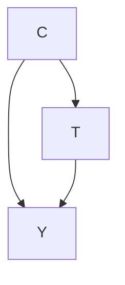
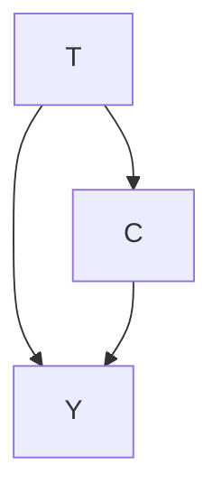
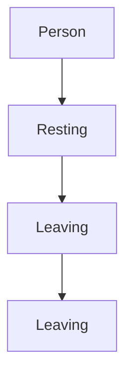

# 动机：你为何会在意（Motivation: Why You Might Care）

## 1.1 辛普森悖论（Simpson's Paradox）

设想一个纯粹假设的未来，出现了一种名为 COVID-27 的新疾病，在人类群体中广泛传播。在这个纯粹假设的未来中，已经开发出两种治疗方法：治疗 A 和治疗 B。治疗 B 比治疗 A 更为稀缺，因此当前接受治疗 A 与治疗 B 的人数比例大约为 73%/27%。你负责为你的国家选择将独家使用哪种治疗方法，而你的国家只关心如何将生命损失降至最低。

你掌握的数据显示了根据患者被分配的治疗方法及其在决定治疗时的病情状况，死于 COVID-27 的人员百分比。病情状况是一个二元变量：轻度或重度。数据显示，接受治疗 A 的患者中有 16% 死亡，而接受治疗 B 的患者中有 19% 死亡。然而，当我们分别审视轻度病情患者和重度病情患者时，数据排名发生了逆转。在轻度病情亚群中，接受治疗 A 的患者中有 15% 死亡，而接受治疗 B 的患者中有 10% 死亡。在重度病情亚群中，接受治疗 A 的患者中有 30% 死亡，而接受治疗 B 的患者中有 20% 死亡。我们将这些百分比及相应的计数展示在表 1.1 中。

<table><tr><td rowspan="4">治疗</td><td></td><td colspan="3">病情状况</td></tr><tr><td></td><td>轻度</td><td>重度</td><td>总计</td></tr><tr><td>A</td><td>15%(210/1400)</td><td>30%(30/100)</td><td>16%(240/1500)</td></tr><tr><td>B</td><td>10%(5/50)</td><td>20%(100/500)</td><td>19%(105/550)</td></tr></table>

这个明显的悖论源于这样一个事实：在表 1.1 中，“总计”列可能被解读为我们应该选择治疗 A，而“轻度”和“重度”列却都可以被解读为我们应该选择治疗 B。$^{1}$ 事实上，答案是：如果我们知道某人的病情状况，我们应该给他们治疗 B；如果我们不知道他们的病情状况，我们应该给他们治疗 A。开个玩笑……这毫无道理。那么，实际上，你应该为你的国家选择哪种治疗方法呢？

根据数据的因果结构（causal structure），治疗 A 或治疗 B 都可能是正确答案。换句话说，因果关系（causality）对于解决辛普森悖论至关重要。目前，我们仅给出何时应选择治疗 A 与何时应选择治疗 B 的直观理解，但将在第 4 章中给出更正式的解释。

表 1.1：COVID-27 数据中的辛普森悖论。百分比表示各组中的死亡率。数值越低越好。括号中的数字为相应的计数。这个明显的悖论源于这样一种解读：在检查整个人群时，治疗 A 看起来更好，但在所有亚群中，治疗 B 看起来更好。

$^{1}$ 产生辛普森悖论的一个关键因素是人群分配到各组的非均匀性。在 1500 名接受治疗 A 的人中，有 1400 人病情为轻度，而在 550 名接受治疗 B 的人中，有 500 人病情为重度。由于轻度病情患者的死亡可能性较低，这意味着接受治疗 A 的患者的总死亡率低于轻度与重度病情患者在其中均匀分布时的死亡率。治疗 B 则存在相反的偏差。

**场景 1** 如果病情状况 C 是治疗 T 的原因（图 1.1），那么治疗 B 在降低死亡率 Y 方面更有效。一个示例场景是，医生决定给大多数轻度病情患者使用治疗 A，而将更昂贵且更有限的治疗 B 留给重度病情患者。由于重度病情会导致死亡可能性更高（图 1.1 中的 $C \rightarrow Y$），并且会导致患者更可能接受治疗 B（图 1.1 中的 $C \rightarrow T$），因此治疗 B 将在总人群中与较高的死亡率相关联。换句话说，治疗 B 与较高的死亡率相关联仅仅是因为病情状况是治疗和死亡的共同原因（common cause）。在此，病情状况混淆了治疗对死亡率的影响。为了纠正这种混杂（confounding），我们必须检查在病情状况相同的患者中 T 与 Y 的关系。这意味着更好的治疗方法是在每个亚群（表 1.1 中的“轻度”和“重度”列）中产生较低死亡率的治疗方法：即治疗 B。

**场景 2** 如果治疗 T 的处方 $^{2}$ 是病情状况 C 的原因（图 1.2），那么治疗 A 更有效。一个示例场景是，治疗 B 非常稀缺，以至于患者在获得处方后需要等待很长时间才能接受治疗。治疗 A 则没有这个问题。由于 COVID-27 患者的病情会随时间恶化，治疗 B 的处方实际上导致轻度病情患者发展为重度病情，从而造成更高的死亡率。因此，即使治疗 B 在给药后比治疗 A 更有效（图 1.2 中沿 $T \rightarrow Y$ 的正向效应），但由于治疗 B 的处方会导致更差的病情状况（图 1.2 中沿 $T \rightarrow C \rightarrow Y$ 的负向效应），治疗 B 在总体上效果较差。注意：由于治疗 B 更昂贵，治疗 B 的处方概率为 0.27，而治疗 A 的处方概率为 0.73；重要的是，在此场景中，治疗处方与病情状况无关。

总之，更有效的治疗方法完全取决于问题的因果结构。在场景 1（C 是 T 的原因，图 1.1）中，治疗 B 更有效。在场景 2（T 是 C 的原因，图 1.2）中，治疗 A 更有效。没有因果关系，辛普森悖论就无法解决。有了因果关系，它根本就不是一个悖论。

## 1.2 因果推断的应用（Applications of Causal Inference）

**因果推断（Causal inference）** 对于科学至关重要，因为我们通常希望做出因果性断言（causal claims），而不仅仅是关联性断言（associational claims）。例如，如果我们在为某种疾病选择治疗方法，我们希望选择能够治愈最多人且不会引起太多严重副作用的方法。如果我们希望**强化学习（reinforcement learning）** 算法最大化奖励，我们希望它采取能够使其获得最大奖励的行动。如果我们在研究社交媒体对心理健康的影响，我们试图理解导致特定心理健康结果的主要原因，并根据每个原因可归因于该结果的比例对这些原因进行排序。

图 1.1：场景 1 的因果结构，其中病情状况 C 是治疗 T 和死亡率 Y 的共同原因。给定此因果结构，治疗 B 更优。

$^{2}$ T 指的是治疗的处方，而非随后的治疗接受。

图 1.2：场景 2 的因果结构，其中治疗 T 是病情状况 C 的原因。给定此因果结构，治疗 A 更优。

因果推断对于严谨的决策至关重要。例如，假设我们正在考虑实施几种不同的政策以减少温室气体排放，但由于预算限制，我们只能选择其中一项。如果我们希望效果最大化，就应该进行因果分析，以确定哪项政策将导致排放量最大幅度的减少。再举一个例子，假设我们正在考虑几种干预措施以减少全球贫困。我们想知道哪些政策将导致贫困最大幅度的减少。

在介绍了辛普森悖论的一般示例以及科学和决策中的几个具体示例之后，我们将转向因果推断与预测（prediction）有何不同。

## 1.3 相关不蕴含因果（Correlation Does Not Imply Causation）

你们中的许多人可能听说过“相关不蕴含因果”这句格言。在本节中，我们将快速回顾这一点，并为你提供关于为何如此的一些更深入的理解。

### 1.3.1 尼古拉斯·凯奇与泳池溺亡（Nicolas Cage and Pool Drownings）

事实证明，每年掉入游泳池溺亡的人数与尼古拉斯·凯奇出演的电影数量具有高度相关性 $[1]$。请参见图 1.3 查看此数据的图表。这是否意味着尼古拉斯·凯奇鼓励不擅长游泳的人在他的电影中跳进泳池？或者，尼古拉斯·凯奇在看到当年发生如此多的溺亡事件后，感到更有动力出演更多电影，也许是试图防止更多溺亡事件？还是存在其他解释？例如，也许尼古拉斯·凯奇有意提高自己在因果推断实践者中的知名度，因此他穿越回过去，说服过去的自己恰好拍出足够数量的电影，让我们看到这种相关性，但又不会过于匹配，以免引起怀疑，并可能导致有人阻止他这样操纵数据。我们可能永远无法确定。

[1]: Vigen (2015), 虚假相关（Spurious correlations）

当然，前面段落中所有可能的解释似乎都不太可能。相反，这很可能是一种**虚假相关（spurious correlation）**，其中不存在因果关系。我们很快将转向一个更具说明性的例子，这将有助于阐明虚假相关是如何产生的。

### 1.3.2 为何关联不等同于因果？（Why is Association Not Causation?）

在进入下一个例子之前，让我们更精确地定义一下术语。“相关（Correlation）”在口语中常被用作**统计依赖（statistical dependence）** 的同义词。然而，从技术上讲，“相关”仅仅是线性统计依赖的一种度量。从现在起，我们将在很大程度上使用术语**关联（association）** 来指代统计依赖。

因果关系并非全有或全无。对于任何给定的关联量，并不需要是“所有关联都是因果性的”或“没有关联是因果性的”。相反，可能存在大量关联，而其中只有一部分是因果性的。短语“关联不等同于因果”仅仅意味着关联的数量和因果的数量可能是不同的。存在一定量的关联而零因果，是“关联不等同于因果”的一个特例。

假设你偶然发现了一些数据，这些数据将穿着鞋子上床睡觉与醒来时头痛联系起来，就像人们常做的那样。事实证明，大多数情况下，当有人穿着鞋子上床睡觉时，此人醒来时会头痛。而大多数情况下，当有人不穿鞋上床睡觉时，此人醒来时不会头痛。人们将这样的数据（具有关联性）解读为穿着鞋子上床睡觉会导致人们醒来时头痛，这并不罕见，特别是如果他们正在寻找理由来证明不穿鞋上床睡觉是合理的。一个谨慎的记者可能会做出诸如“穿着鞋子上床睡觉与头痛有关”或“穿着鞋子上床睡觉的人醒来时头痛的风险更高”之类的断言。然而，做出此类断言的主要原因是，大多数人会将此类断言内化为“如果我穿着鞋子上床睡觉，我可能会醒来时头痛”。

我们可以解释穿着鞋子上床睡觉与头痛是如何关联的，而无需其中任何一个成为另一个的原因。事实证明，它们都是由一个共同原因引起的：前一晚饮酒。我们在图 1.4 中描绘了这一点。你可能也听说过这种变量被称为“混杂变量（confounder）”或“潜伏变量（lurking variable）”。我们将这种关联称为**混杂关联（confounding association）**，因为这种关联是由混杂变量促成的。

观察到的总关联可以同时由混杂关联和因果关联构成。可能的情况是，穿着鞋子上床睡觉确实对醒来时头痛有一些微小的因果效应。那么，总关联就既不是纯粹的混杂关联，也不是纯粹的因果关联，而是两者的混合。例如，在图 1.4 中，因果关联沿着从穿着鞋子睡觉到醒来时头痛的箭头流动。而混杂关联则沿着从穿着鞋子睡觉到饮酒再到头痛（醒来时头痛）的路径流动。我们将在第 3 章中阐明这些不同类型关联的图形解释。

图 1.4：因果结构，其中前一晚饮酒是穿着鞋睡觉和醒来时头痛的共同原因。

**主要问题（The Main Problem）** 推动因果推断的主要问题是关联不等同于因果。$^{3}$ 如果两者相同，那么因果推断就会很容易。传统的统计学和机器学习早就解决了因果推断问题，因为测量因果关系就像查看数据中的相关性和预测性能等指标一样简单。本书的很大一部分内容将致力于更好地理解和解决这个问题。

## 1.4 主要主题（Main Themes）

本书将反复出现几个贯穿始终的主题。这些主题在很大程度上将是两个不同类别之间的比较。在阅读过程中，理解本书的不同部分属于哪些类别以及不属于哪些类别非常重要。

**统计 vs. 因果（Statistical vs. Causal）** 即使拥有无限量的数据，我们有时也无法计算某些因果量。相比之下，统计学在很大程度上是关于解决有限样本中的不确定性问题。当给定无限数据时，不存在不确定性。然而，关联（一个统计概念）并非因果关系。即使在从无限数据开始之后，因果推断中仍有更多工作要做。这是推动因果推断的主要区别。我们在本章中已经做出了这一区分，并将在全书持续做出这一区分。

**识别 vs. 估计（Identification vs. Estimation）** 因果效应的识别（Identification）是因果推断所独有的。即使我们拥有无限数据，这仍然是一个有待解决的问题。然而，因果推断也与传统的统计学和机器学习共享估计（Estimation）这一环节。我们将在很大程度上从因果效应的识别开始（第 2、4 和 6 章），然后再转向因果效应的估计（第 7 章）。例外情况是第 2.5 节和第 4.6.2 节，我们在其中进行了包含估计的完整示例，以便让你尽早了解整个过程的全貌。

**干预性 vs. 观察性（Interventional vs. Observational）** 如果我们能够进行干预/实验，因果效应的识别相对容易。这仅仅是因为我们可以实际采取我们想要测量其因果效应的行动，并在采取该行动后简单地测量其效果。**观察性数据（Observational data）** 则更为复杂，因为数据中几乎总是会引入混杂。

**假设（Assumptions）** 本书将重点讨论我们使用哪些假设来获得所得结果。每个假设都将有自己的方框，以使其不易被忽略。清晰的假设应该有助于容易地看出对特定因果分析或因果模型的批评点所在。希望清晰地呈现假设能够导致关于因果关系的更清晰的讨论。

$^{3}$ 正如我们将在第 5 章中看到的，如果我们在受控实验中随机分配治疗，那么关联实际上就是因果关系。