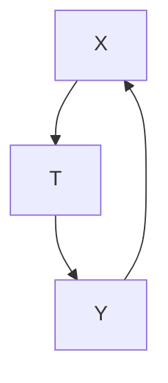
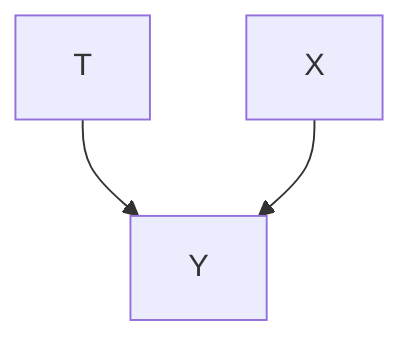
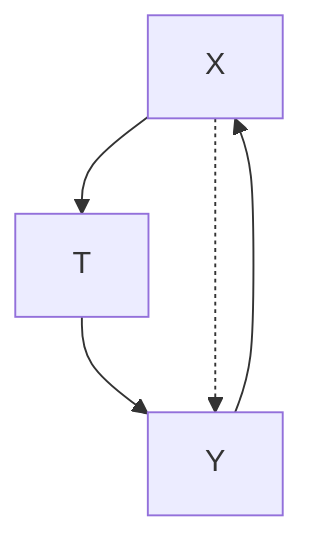
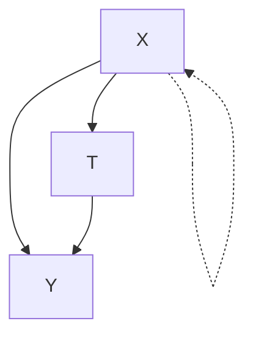

# 潜在结果（Potential Outcomes）

在本章中，我们将逐步进入因果关系的世界。我们将看到，需要引入新的概念和相应的符号来清晰地描述因果概念。这些概念之所以“新”，是因为它们可能不存在于传统统计学或数学中，但它们应该是熟悉的，因为我们一直在思维中使用它们并用自然语言进行描述。

熟悉的统计符号 我们将使用 $T$ 表示**处理（treatment）**的随机变量，使用 $Y$ 表示**感兴趣的结果（outcome of interest）**的随机变量，使用 $X$ 表示**协变量（covariates）**。通常，我们将使用大写字母表示随机变量（可能除了一种情况），使用小写字母表示随机变量取的值。我们考虑的大部分场景中 $T$ 是二值的。请注意，通常我们可以将内容扩展到 $T$ 可以取两个以上值或 $T$ 是连续变量的场景。

## 2.1 潜在结果与个体处理效应（Potential Outcomes and Individual Treatment Effects）

现在我们将介绍本书中出现的第一个因果概念。这些概念有时被描述为**内曼-鲁宾（Neyman-Rubin）** $[2–4]$ 因果模型（或潜在结果框架）所独有，但事实并非如此。例如，这些相同的概念（只是符号不同）也存在于使用因果图的框架中（第3章和第4章）。重要的是，你需要花一些时间确保理解这些初始的因果概念。如果你之前没有学习过因果推断，它们在数学语境中可能会显得陌生，尽管在直觉上可能相当熟悉，因为我们通常用因果语言思考和交流。

**场景1** 考虑一个场景：你感到不快乐。你在考虑是否要养一只狗来帮助自己变得快乐。如果你在养狗后变得快乐，这是否意味着狗导致你快乐？嗯，如果你没有养狗也会变得快乐呢？在这种情况下，狗并不是让你快乐所必需的，因此它对你的快乐产生因果效应的主张是薄弱的。

**场景2** 让我们稍微改变一下情况。考虑如果你养狗，你仍然会快乐，但现在，如果你不养狗，你将仍然不快乐。在这个场景中，狗对你的快乐具有相当强的因果效应主张。

在上述两个场景中，我们都使用了称为**潜在结果（potential outcomes）**的因果概念。你的结果 $Y$ 是快乐：$Y = 1$ 对应快乐，而 $Y = 0$ 对应不快乐。你的处理 $T$ 是你是否养狗：$T = 1$ 对应你养狗，而 $T = 0$ 对应你不养狗。我们用 $Y(1)$ 表示如果你养狗（$T = 1$）时会观察到的快乐潜在结果。类似地，我们用 $Y(0)$ 表示如果你不养狗（$T = 0$）时会观察到的快乐潜在结果。在场景1中，$Y(1) = 1$ 且 $Y(0) = 1$。相比之下，在场景2中，$Y(1) = 1$ 且 $Y(0) = 0$。

更一般地，**潜在结果** $Y(t)$ 表示如果你接受处理 $t$ 时你的结果会是什么。潜在结果 $Y(t)$ 与观察到的结果 $Y$ 不同，因为并非所有潜在结果都能被观察到。相反，所有潜在结果都有可能被观察到。实际观察到的那个取决于处理 $T$ 所取的值。

在上述场景中，整个群体中只有一个人：你。然而，通常感兴趣的人群中有许多个体 $^{1}$。我们将使用 $T_i$、$X_i$ 和 $Y_i$ 表示第 $i$ 个个体的处理、协变量和结果。然后，我们可以定义个体 $i$ 的**个体处理效应（Individual Treatment Effect, ITE）** $^{2}$：

$$
\tau_ {i} \triangleq Y _ {i} (1) - Y _ {i} (0) \tag {2.1}
$$

只要群体中有多个个体，$Y(t)$ 就是一个随机变量，因为不同个体会有不同的潜在结果。相比之下，$Y_{i}(t)$ 通常被视为非随机的 $^{3}$，因为下标 $i$ 意味着我们以大量个体化（和特定上下文）信息为条件，将焦点限制在单个个体（在特定上下文中），其潜在结果是确定性的。

**个体处理效应（ITEs）** 是我们在因果推断中关心的主要量之一。例如，在上述场景2中，你会选择养狗，因为养狗对你快乐的因果效应是正的：$Y(1) - Y(0) = 1 - 0 = 1$。相比之下，在场景1中，你可能会选择不养狗，因为养狗对你快乐没有因果效应：$Y(1) - Y(0) = 1 - 1 = 0$。

现在我们已经介绍了潜在结果和ITE，我们可以介绍因果推断中出现的主要问题，这些问题在以关联或预测为主要关注的领域中是不存在的。

## 2.2 因果推断的基本问题（The Fundamental Problem of Causal Inference）

对于给定的个体，不可能观察到所有潜在结果 [3]。考虑养狗的例子。你可以通过养狗并观察养狗后的快乐来观察 $Y(1)$。或者，你可以通过不养狗并观察你的快乐来观察 $Y(0)$。然而，你无法同时观察 $Y(1)$ 和 $Y(0)$，除非你有一台时间机器，可以让你回到过去并选择第一次没有接受的处理版本。你不能简单地养狗，观察 $Y(1)$，然后把狗送走，再观察 $Y(0)$，因为第二次观察会受到两次观察之间你所采取的所有行动以及第一次观察以来发生的任何其他变化的影响。

$^{1}$ “单元（Unit）”经常被用来替代“个体”，因为群体的单元并不总是人。
$^{2}$ ITE 也被称为个体因果效应、单元级因果效应或单元级处理效应。
$^{3}$ 不过，$Y_{i}(t)$ 可以被视为随机的。

[3]: Rubin (1974), 'Estimating causal effects of treatments in randomized and nonrandomized studies.'

这就是所谓的**因果推断的基本问题（fundamental problem of causal inference）** [5]。它是基本的，因为如果我们不能同时观察到 $Y_{i}(1)$ 和 $Y_{i}(0)$，那么我们就无法观察到因果效应 $Y_{i}(1) - Y_{i}(0)$。这个问题是因果推断独有的，因为在因果推断中，我们关心的是做出因果主张，而这些主张是根据潜在结果来定义的。相比之下，考虑机器学习。在机器学习中，我们通常只关心预测观察到的结果 $Y$，因此不需要潜在结果，这意味着机器学习不需要处理我们在因果推断中必须处理的这个基本问题。

你没有（也无法）观察到的潜在结果被称为**反事实（counterfactuals）**，因为它们与事实（现实）相反。“潜在结果”有时被称为“反事实结果”，但我们在本书中永远不会这样做，因为潜在结果 $Y(t)$ 只有在另一个潜在结果 $Y(t')$ 被观察到时才变成反事实。被观察到的潜在结果有时被称为**事实（factual）**。请注意，在结果被观察到之前，不存在反事实或事实。在此之前，只有潜在结果。

## 2.3 绕开基本问题（Getting Around the Fundamental Problem）

我猜想本节可能是本章开始变得有些不清楚的地方。如果你遇到这种情况，不要太担心，只需继续阅读下一章，因为它将以一种希望更直观的方式建立平行的概念。

### 2.3.1 平均处理效应与缺失数据解释（Average Treatment Effects and Missing Data Interpretation）

我们知道我们无法获得个体处理效应，但**平均处理效应（average treatment effects）**呢？我们通过对ITE取平均得到**平均处理效应（ATE）** $^{4}$：

$$
\tau \triangleq \mathbb {E} [ Y _ {i} (1) - Y _ {i} (0) ] = \mathbb {E} [ Y (1) - Y (0) ], \tag {2.2}
$$

其中，如果 $Y_{i}(t)$ 是确定性的，则平均是在个体 $i$ 上进行的。如果 $Y_{i}(t)$ 是随机的，则平均也包括任何其他随机性。

好的，但我们实际上如何计算ATE呢？让我们看看表2.1中的一些虚构数据。如果你喜欢举例，可以随意替换第1.1节中的COVID-27示例或第2.1节中的狗-快乐示例。我们将把这个表格视为整个感兴趣的人群。由于因果推断的基本问题，这本质上是一个**缺失数据问题（missing data problem）**。表格中所有的问号表示我们没有观察到该单元格。

一个自然想到的量是**关联差异（associational difference）**：$E[Y|T=1]-E[Y|T=0]$。由期望的线性性，我们有ATE $E[Y(1)-Y(0)]=E[Y(1)]-E[Y(0)]$。那么，也许 $E[Y(1)]-E[Y(0)]$ 等于 $E[Y|T=1]-E[Y|T=0]$。不幸的是，这通常不成立。如果成立，那就意味着因果关系仅仅是关联。$E[Y|T=1]-E[Y|T=0]$ 是一个关联量，而 $E[Y(1)]-E[Y(0)]$

[5]: Holland (1986), 'Statistics and Causal Inference'

$^{4}$ ATE 也被称为“平均因果效应（average causal effect, ACE）”。

<table><tr><td>i</td><td>T</td><td>Y</td><td>Y(1)</td><td>Y(0)</td><td>Y(1) - Y(0)</td></tr><tr><td>1</td><td>0</td><td>0</td><td>?</td><td>0</td><td>?</td></tr><tr><td>2</td><td>1</td><td>1</td><td>1</td><td>?</td><td>?</td></tr><tr><td>3</td><td>1</td><td>0</td><td>0</td><td>?</td><td>?</td></tr><tr><td>4</td><td>0</td><td>0</td><td>?</td><td>0</td><td>?</td></tr><tr><td>5</td><td>0</td><td>1</td><td>?</td><td>1</td><td>?</td></tr><tr><td>6</td><td>1</td><td>1</td><td>1</td><td>?</td><td>?</td></tr></table>

是一个因果量。由于**混杂（confounding）**，它们不相等，我们在第1.3节中讨论过这一点。图2.1中描绘的图形解释是，$X$ 混淆了 $T$ 对 $Y$ 的效应，因为存在这条 $T \leftarrow X \rightarrow Y$ 路径，非因果关联沿着该路径流动。$^{5}$

### 2.3.2 可忽略性与可交换性（Ignorability and Exchangeability）

那么，什么假设能使ATE就是关联差异呢？这等价于说“什么使得通过取 $Y(0)$ 列的平均值（忽略问号）并从 $Y(1)$ 列的平均值（忽略问号）中减去它来计算ATE是有效的？” $^{6}$ 这种忽略问号（缺失数据）的做法被称为**可忽略性（ignorability）**。假设可忽略性就像忽略人们如何最终选择他们所接受的处理，而只是假设他们的处理是随机分配的；我们在图2.2中通过缺少从 $X$ 到 $T$ 的因果箭头来图形化地描绘这一点。我们现在正式陈述这个假设。

**假设 2.1（可忽略性 / 可交换性）**

$$
(Y (1), Y (0)) \perp T
$$

这个假设是因果推断的关键，因为它允许我们将ATE简化为关联差异：

$$
\mathbb {E} [ Y (1) ] - \mathbb {E} [ Y (0) ] = \mathbb {E} [ Y (1) \mid T = 1 ] - \mathbb {E} [ Y (0) \mid T = 0 ] \tag {2.3}
$$

$$
= \mathbb {E} [ Y \mid T = 1 ] - \mathbb {E} [ Y \mid T = 0 ] \tag {2.4}
$$

可忽略性假设用于方程2.3。当我们讲到第2.3.5节时，我们将进一步讨论方程2.4。

关于这个假设的另一个视角是**可交换性（exchangeability）**。可交换性意味着处理组是可交换的，即如果它们被交换，新的处理组将观察到与旧处理组相同的结果，新的对照组将观察到与旧对照组相同的结果。形式上，这个假设意味着 $\mathbb{E}[Y(1)|T=0]=\mathbb{E}[Y(1)|T=1]$ 和 $\mathbb{E}[Y(0)|T=1]=\mathbb{E}[Y(0)|T=0]$。然后，这意味着 $\mathbb{E}[Y(1)|T=t]=\mathbb{E}[Y(1)]$ 和 $\mathbb{E}[Y(0)|T=t]=\mathbb{E}[Y(0)]$，对于所有 $t$，这几乎等价 $^{7}$ 于假设2.1。

关于可交换性的一个重要直觉是，它保证了处理组是可比的。换句话说，处理组在处理之外的所有相关方面都是相同的。这个直觉是“控制”或“调整”

表2.1：示例数据，说明因果推断的基本问题可以解释为缺失数据问题。




图2.1：$X$ 混淆 $T$ 对 $Y$ 效应的因果结构。

$^{5}$ 继续阅读第3章，我们将在那里详细阐述并形式化这种图形解释。

$^{6}$ 主动阅读练习：验证此过程等同于表2.1数据中的 $E[Y|T=1]-E[Y|T=0]$。




图2.2：当处理分配机制可忽略时的因果结构。值得注意的是，这意味着没有从 $X$ 到 $T$ 的箭头，这意味着没有混杂。

$^{7}$ 技术上，这是均值可交换性，它比我们在假设2.1中描述的完全可交换性更弱，因为它只约束分布的一阶矩。通常，对于平均处理效应，我们只需要均值可忽略性/可交换性，但通常假设完全独立性，如假设2.1所示。

变量概念的基础，我们稍后在讨论条件可交换性时会提到。

我们利用假设2.1来**识别（identify）**因果效应。识别因果效应就是将因果表达式简化为纯粹的统计表达式。在本章中，这意味着将使用潜在结果符号的表达式简化为仅使用统计符号（如 $T$、$X$、$Y$、期望和条件）的表达式。这意味着我们可以仅从观测分布 $P(X, T, Y)$ 计算因果效应。

**定义 2.1（可识别性）** 一个因果量（例如 $\mathbb{E}[Y(t)]$）是**可识别的（identifiable）**，如果我们可以从纯粹的统计量（例如 $E[Y \mid t]$）计算它。

我们已经看到可忽略性极其重要（方程2.3），但这个假设有多现实呢？一般来说，它完全不现实，因为我们观察到的大多数数据中很可能存在混杂（因果结构如图2.1所示）。然而，我们可以通过进行**随机化实验（randomized experiments）** 使这个假设变得现实，这迫使处理仅由抛硬币决定，而不是由任何其他因素引起，因此我们得到图2.2所示的因果结构。我们在第5章中更深入地讨论随机化实验。

我们已经涵盖了关于这个主要假设（2.1）的两个突出视角：可忽略性和可交换性。在数学上，这些意味着相同的事情，但它们的名称对应于思考同一假设的不同方式。可交换性和可忽略性只是这个假设的两个名称。在我们介绍这个假设更现实的条件版本之后，我们将会看到更多别名。

### 2.3.3 条件可交换性与无混杂性（Conditional Exchangeability and Unconfoundedness）

在观测数据中，假设处理组是可交换的是不现实的。换句话说，没有理由期望这些组在处理之外的所有相关变量上相同。然而，如果我们通过条件化来控制相关变量，那么子组可能是可交换的。我们将在第3章中澄清“相关变量”是什么，但现在，我们只说它们是所有的协变量 $X$。那么，我们可以正式陈述**条件可交换性（conditional exchangeability）**。

**假设 2.2（条件可交换性 / 无混杂性）**

$$
(Y (1), Y (0)) \perp T \mid X
$$

其思想是，尽管处理与潜在结果可能（由于混杂）无条件地相关联，但在 $X$ 的各个水平内，它们不相关联。换句话说，在 $X$ 的水平内没有混杂，因为控制 $X$ 使处理组变得可比。我们现在将对上述内容给出一些图形直觉。我们直到第3章才会在图形直觉和假设2.2之间建立严格的联系；目前，它只是用来帮助理解直觉。

我们在数据中没有可交换性，因为 $X$ 是 $T$ 和 $Y$ 的共同原因。我们在图2.3中说明了这一点。因为 $X$ 是 $T$ 和 $Y$ 的共同原因，$T$ 和 $Y$ 之间存在非因果关联。这种非因果关联沿着 $T \leftarrow X \rightarrow Y$ 路径流动；我们用红色虚线弧线描绘这一点。

然而，我们在数据中确实有条件可交换性。这是因为，当我们以 $X$ 为条件时，$T$ 和 $Y$ 之间不再有任何非因果关联。通过在 $X$ 处条件化，非因果关联现在在 $X$ 处被“阻断”。我们在图2.4中通过对 $X$ 进行阴影处理以表示它被条件化，并显示红色虚线弧线在那里被阻断来说明这种阻断。

条件可交换性是因果推断所必需的主要假设。有了这个假设，我们可以在 $X$ 的水平内识别因果效应，就像我们使用（无条件）可交换性所做的那样：

$$
\begin{array}{l} \mathbb {E} [ Y (1) - Y (0) \mid X ] = \mathbb {E} [ Y (1) \mid X ] - \mathbb {E} [ Y (0) \mid X ] (2.5) \\ = \mathbb {E} [ Y (1) \mid T = 1, X ] - \mathbb {E} [ Y (0) \mid T = 0, X ] (2.6) \\ = \mathbb {E} [ Y \mid T = 1, X ] - \mathbb {E} [ Y \mid T = 0, X ] (2.7) \\ \end{array}
$$

与之前类似，我们通过期望的线性性得到方程2.5。现在我们通过条件可交换性得到方程2.6。如果我们想要之前在假设（无条件）可交换性时得到的边际效应，我们可以通过简单地关于 $X$ 求边际来得到：

$$
\mathbb {E} [ Y (1) - Y (0) ] = \mathbb {E} _ {X} \mathbb {E} [ Y (1) - Y (0) \mid X ] \tag {2.8}
$$

$$
= \mathbb {E} _ {X} \left[ \mathbb {E} [ Y \mid T = 1, X ] - \mathbb {E} [ Y \mid T = 0, X ] \right] \tag {2.9}
$$

这标志着因果推断的一个重要结果，因此我们将给它一个自己的命题框。我们上面给出的证明省略了一些细节。请阅读第2.3.6节（我们在那里用所有指定的细节重做证明）以获取其余细节。我们将这个结果称为**调整公式（adjustment formula）**。

**定理 2.1（调整公式）** 在满足无混杂性、正性、一致性和无干扰假设的条件下，我们可以识别平均处理效应：

$$
\mathbb {E} [ Y (1) - Y (0) ] = \mathbb {E} _ {X} \left[ \mathbb {E} [ Y \mid T = 1, X ] - \mathbb {E} [ Y \mid T = 0, X ] \right]
$$

条件可交换性（假设2.2）是因果推断的核心假设，并且有许多名称。例如，以下名称相当常用地指代同一假设：**无混杂性（unconfoundedness）**、**条件可忽略性（conditional ignorability）**、**无未观测混杂（no unobserved confounding）**、**基于可观测变量的选择（selection on observables）**、**无遗漏变量偏差（no omitted variable bias）** 等。在本书中，我们将相当多地使用“无混杂性”这个名称。

从可交换性（假设2.1）转向条件可交换性（假设2.2）的主要原因是，这似乎是一个更现实的假设。然而，我们通常无法确定条件可交换性是否成立。可能存在一些不属于 $X$ 的未观测混杂因素，这意味着条件可交换性被违反。幸运的是，这在随机化实验（第5章）中不是问题。不幸的是，在观测数据中，我们必须始终意识到这一点。直观地说，我们能做的最好的事情就是观察并将尽可能多的协变量纳入 $X$ 中，以尽量确保无混杂性。$^{8}$




图2.3：$X$ 混淆 $T$ 对 $Y$ 效应的因果结构。我们用红色虚线表示混杂。




图2.4：以 $X$ 为条件导致无混杂的示意图。

## 2.3.4 正性/重叠与外推（Positivity/Overlap and Extrapolation）

尽管基于众多协变量进行条件化处理对于实现**无混杂性（unconfoundedness）**具有吸引力，但出于另一个与尚未讨论的另一重要假设——**正性（positivity）**——相关的原因，这种做法实际上可能是有害的。我们将在本节末尾解释其原因。正性是指数据中具有不同协变量的所有子组都有一定概率接受任何处理值的条件。形式上，我们针对二元处理将正性定义如下。

**假设 2.3（正性/重叠/共同支撑，Positivity / Overlap / Common Support）** 对于目标总体中存在的所有协变量值 $x$（即满足 $P(X = x) > 0$ 的 $x$），有：

$$
0 < P(T = 1 \mid X = x) < 1
$$

为了理解正性为何重要，让我们仔细审视公式 2.9：

$$
\mathbb{E}[Y(1) - Y(0)] = \mathbb{E}_X \left[ \mathbb{E}[Y \mid T = 1, X] - \mathbb{E}[Y \mid T = 0, X] \right] \tag{2.9 revisited}
$$

简而言之，如果存在正性违反，那么我们将基于一个概率为零的事件进行条件化处理。这是因为存在某个概率非零的 $x$ 值，使得 $P(T = 1 \mid X = x) = 0$ 或 $P(T = 0 \mid X = x) = 0$ 。这意味着对于我们在上述公式中边缘化处理的某个 $x$ 值，$P(T = 1, X = x) = 0$ 或 $P(T = 0, X = x) = 0$ ，而这两个事件正是我们在公式 2.9 中条件化处理的对象。

为了清晰地看到正性违反如何导致除以零，让我们重写公式 2.9 的右侧。对于离散协变量和离散结果，它可以重写如下：

$$
\sum_{x} P(X = x) \left( \sum_{y} y P(Y = y \mid T = 1, X = x) - \sum_{y} y P(Y = y \mid T = 0, X = x) \right) \tag{2.10}
$$

然后，应用**贝叶斯规则（Bayes' rule）**，可以进一步重写为：

$$
\sum_{x} P(X = x) \left( \sum_{y} y \frac{P(Y = y, T = 1, X = x)}{P(T = 1 \mid X = x) P(X = x)} - \sum_{y} y \frac{P(Y = y, T = 0, X = x)}{P(T = 0 \mid X = x) P(X = x)} \right) \tag{2.11}
$$

在公式 2.11 中，我们可以清楚地看到正性为何至关重要。如果对于某个概率非零的协变量水平 $x$ ，有 $P(T = 1 \mid X = x) = 0$ ，那么该公式中的第一项就会出现除以零的情况，因此 $\mathbb{E}_X \mathbb{E}[Y \mid T = 1, X]$ 是未定义的。类似地，如果对于某个 $x$ 水平，有 $P(T = 1 \mid X = x) = 1$ ，那么 $P(T = 0 \mid X = x) = 0$ ，因此第二项会出现除以零的情况，$\mathbb{E}_X \mathbb{E}[Y \mid T = 0, X]$ 是未定义的。只要出现上述任何一种违反正性假设的情况，因果效应就是未定义的。

$^{8}$ 正如我们将在第 3 章和第 4 章中看到的，基于更多协变量进行条件化处理并不一定能减少因果估计的偏差。

**直觉** 以上是为什么我们需要正性假设的数学推导，但直觉是什么呢？嗯，如果我们存在正性违反，那就意味着在数据的某个子组内，每个个体都始终接受处理，或者每个个体都始终接受对照。在该子组中估计处理与对照的因果效应是没有意义的，因为我们只看到了处理或只看到了对照。我们从未在该子组中看到另一种情况。

正性的另一个名称是**重叠（overlap）**。这个名称的直觉是，我们希望处理组的协变量分布与对照组的协变量分布存在重叠。更具体地说，我们希望 $P(X \mid T = 1)^{9}$ 与 $P(X \mid T = 0)^{10}$ 具有相同的支撑集。这就是正性的另一个常见别名是**共同支撑（common support）**的原因。

**正性与无混杂性的权衡（The Positivity-Unconfoundedness Tradeoff）** 尽管基于更多协变量进行条件化处理可能增加满足无混杂性的机会，但也可能增加违反正性的机会。随着协变量维度的增加，对于协变量的任何水平 $x$，子组会变得更小。$^{11}$ 随着每个子组变小，整个子组要么全部接受处理、要么全部接受对照的概率越来越高。例如，一旦任何子组的大小减小到 1，正性就必然不成立。关于高维协变量导致正性违反的严格论证，请参见 [6]。

**外推（Extrapolation）** 违反正性假设实际上可能导致对模型要求过高，从而得到非常糟糕的行为。许多**因果效应估计量（causal effect estimators）** $^{12}$ 使用 $(t, x, y)$ 元组作为数据，拟合一个模型来估计 $E[Y \mid t, x]$ 。这些模型的输入是 $(t, x)$ 对，输出是相应的结果。当这些模型在调整公式（定理 2.1）中用于替代相应的条件期望时，它们将被迫在 $P(T = 1, X = x) = 0$ 的区域和 $P(T = 0, X = x) = 0$ 的区域进行外推（利用它们的参数假设）。

## 2.3.5 无干扰、一致性与 SUTVA（No Interference, Consistency, and SUTVA）

在本章中，我们还隐含地引入了几个额外的假设。我们将在本节中明确所有这些剩余的假设。本节的第一个假设是**无干扰（no interference）**。无干扰意味着我的结果不受其他人处理的影响。相反，我的结果仅是我自身处理的函数。我们在本章中一直隐含地使用这个假设。现在我们将正式定义它。

**假设 2.4（无干扰，No Interference）**

$$
Y_i(t_1, \ldots, t_{i-1}, t_i, t_{i+1}, \ldots, t_n) = Y_i(t_i)
$$

当然，这个假设可能被违反。例如，如果处理是“养狗”，结果是“我的幸福感”，那么我的幸福感很可能受到我的朋友是否养狗的影响，因为我们可能会为了遛狗而更多地一起出去玩。正如你可能预料到的，在**网络数据（network data）**中，无干扰假设的违反非常普遍。

最后一个假设是**一致性（consistency）**。一致性是指我们观察到的结果 $Y$ 实际上是观察到的处理 $T$ 下的潜在结果。

**假设 2.5（一致性，Consistency）** 如果处理是 $T$，那么观察到的结果 $Y$ 就是处理 $T$ 下的潜在结果。形式上，

$$
T = t \implies Y = Y(t) \tag{2.12}
$$

我们可以等价地写成如下形式：

$$
Y = Y(T) \tag{2.13}
$$

请注意，$T$ 与 $t$ 不同，$Y(T)$ 与 $Y(t)$ 也不同。$T$ 是一个对应于观察到的处理的随机变量，而 $t$ 是处理的一个特定值。类似地，$Y(t)$ 是某个特定处理值下的潜在结果，而 $Y(T)$ 是我们观察到的实际处理值下的潜在结果。

当我们使用**可交换性（exchangeability）**来证明**可识别性（identifiability）**时，我们实际上在公式 2.4 中假设了一致性，以得到以下等式：

$$
\mathbb{E}[Y(1) \mid T = 1] - \mathbb{E}[Y(0) \mid T = 0] = \mathbb{E}[Y \mid T = 1] - \mathbb{E}[Y \mid T = 0]
$$

类似地，当我们使用**条件可交换性（conditional exchangeability）**来证明可识别性时，我们在公式 2.7 中假设了一致性。

一致性似乎显然成立，但情况并非总是如此。例如，如果处理定义仅仅是“养狗”或“不养狗”，这可能过于粗略而无法保证一致性。如果我养了一只小狗，我可能会观察到 $Y = 1$（幸福感），因为我需要一个精力充沛的伙伴；但如果我养了一只年老、低能量的狗，我可能会观察到 $Y = 0$（不幸福感）。然而，这两种处理都属于“养狗”的范畴，因此都对应于 $T = 1$。这意味着 $Y(1)$ 没有被明确定义，因为它将是 1 或 0，取决于处理定义未捕获的某些因素。从这个意义上说，一致性包含了有时被称为**“无多种版本的处理（no multiple versions of treatment）”**的假设。关于此主题的更多讨论，请参见 Hernán 和 Robins [7] 的第 3.4 和 3.5 节及其参考文献。

**SUTVA** 你还会在文献中经常看到**稳定单位处理值假设（Stable Unit-Treatment Value Assumption, SUTVA）**。如果单位（个体）$i$ 的结果仅仅是单位 $i$ 处理的函数，则 SUTVA 成立。因此，SUTVA 是一致性和无干扰（以及确定性潜在结果）的组合。$^{13}$

## 2.3.6 将所有假设联系起来（Tying It All Together）

我们首先介绍了无混杂性（条件可交换性），因为它是主要的因果假设。然而，所有假设都是必要的：

1. 无混杂性（假设 2.2）
2. 正性（假设 2.3）
3. 无干扰（假设 2.4）
4. 一致性（假设 2.5）

现在，我们将回顾在公式 2.5 至公式 2.9 中完成的调整公式（定理 2.1）的证明，并列出每一步使用了哪些假设。甚至在讨论这些公式之前，我们使用了无干扰假设来证明我们进行因果推断时应关注的量是 $\mathbb{E}[Y(1) - Y(0)]$ ，而不是像假设 2.4 左侧那样更复杂的量。在下面的证明中，前两个等式源于数学事实，而后两个等式则源于这些关键假设。

**定理 2.1 的证明。**

$$
\begin{array}{l}
\mathbb{E}[Y(1) - Y(0)] = \mathbb{E}[Y(1)] - \mathbb{E}[Y(0)] \quad (\text{期望的线性性}) \\
= \mathbb{E}_X[\mathbb{E}[Y(1) \mid X] - \mathbb{E}[Y(0) \mid X]] \\
= \mathbb{E}_X \left[ \mathbb{E}[Y(1) \mid T = 1, X] - \mathbb{E}[Y(0) \mid T = 0, X] \right] \\
= \mathbb{E}_X \left[ \mathbb{E}[Y \mid T = 1, X] - \mathbb{E}[Y \mid T = 0, X] \right] \\
\end{array}
$$

（迭代期望定律）

（无混杂性和正性）

（一致性）


这就是所有这些假设如何结合在一起，使我们能够识别 **ATE（平均处理效应）**。我们很快将看到如何利用这个结果为 ATE 获得一个实际的估计数值。

## 2.4 简化花哨的统计术语（Fancy Statistics Terminology Defancified）

在我们开始计算 ATE 的具体数值之前，我们必须快速介绍一些统计学术语，这将有助于澄清后续讨论。**待估量（estimand）** 是我们想要估计的量。例如，$\mathbb{E}_X[\mathbb{E}[Y \mid T = 1, X] - \mathbb{E}[Y \mid T = 0, X]]$ 是我们在估计 ATE 时关心的待估量。**估计值（estimate）**（名词）是对某个待估量的近似，我们通过数据获得。我们将在下一节看到具体的数值；这些就是估计值。给定某个待估量 $\alpha$，我们通过在它上面加一个帽子来表示该待估量的估计值：$\hat{\alpha}$。而**估计量（estimator）** 是一个函数，它将数据集映射到待估量的一个估计值。我们从数据+待估量到具体数值的过程称为**估计（estimation）**。**估计（estimate）**（动词）是指将数据输入到估计量中以获得一个估计值。

在本书中，我们将使用更具体的语言，以便区分因果量和统计量。我们将使用术语**因果待估量（causal estimand）** 来指代任何包含潜在结果的待估量。我们将使用术语**统计待估量（statistical estimand）** 来表示其补集：任何不包含潜在结果的待估量。$^{14}$ 例如，回顾调整公式（定理 2.1）：

$$
\mathbb{E}[Y(1) - Y(0)] = \mathbb{E}_X \left[ \mathbb{E}[Y \mid T = 1, X] - \mathbb{E}[Y \mid T = 0, X] \right] \tag{2.14}
$$

$\mathbb{E}[Y(1) - Y(0)]$ 是我们感兴趣的因果待估量。为了实际估计这个因果待估量，我们必须将其转化为一个统计待估量：$\mathbb{E}_X[\mathbb{E}[Y \mid T = 1, X] - \mathbb{E}[Y \mid T = 0, X]]$ 。$^{15}$

当我们在本书中说“**识别（identification）**”时，我们指的是从因果待估量到等价的统计待估量的过程。当我们在本书中说“**估计（estimation）**”时，我们指的是从统计待估量到估计值的过程。我们在图 2.5 的流程图中说明了这一点。

$^{15}$ 主动阅读练习：为什么我们不能直接估计一个因果待估量，而不先将其转化为统计待估量？


```mermaid
graph LR
  A["因果待估量 (Causal Estimand)"] -->|识别 (Identification)| B["统计待估量 (Statistical Estimand)"]
  B -->|估计 (Estimation)| C["估计值 (Estimate)"]
```

**图 2.5：识别-估计流程图（The Identification-Estimation Flowchart）** – 一个说明从目标因果待估量到相应估计值的过程的流程图，该过程通过识别和估计步骤实现。

当我们实际去估计像 $\mathbb{E}_X[\mathbb{E}[Y \mid T = 1, X] - \mathbb{E}[Y \mid T = 0, X]]$ 这样的量时，我们该怎么做？我们通常会使用一个**模型（model）**（例如线性回归或来自机器学习的某种更复杂的预测器）来替代条件期望 $\mathbb{E}[Y \mid T = t, X = x]$ 。我们将使用此类模型的估计量称为**模型辅助估计量（model-assisted estimators）**。现在我们已经理清了一些术语，可以继续讨论一个估计 ATE 的例子了。

## 2.5 一个包含估计的完整示例（A Complete Example with Estimation）

定理 2.1 及其在公式 2.14 中的对应重述为我们提供了可识别性。然而，我们尚未讨论估计。在本节中，我们将给出一个包含估计的简短示例。我们将在第 7 章更全面地讨论因果效应的估计。

我们使用 Luque-Fernandez 等人 [8] 的流行病学示例。感兴趣的结果 $Y$ 是（收缩压）血压。这是一个重要的结果，因为大约 46% 的美国人患有高血压，而高血压与死亡风险增加相关 [9]。感兴趣的“处理” $T$ 是钠摄入量。钠摄入量是一个连续变量；为了便于应用为二元处理指定的公式 2.14，我们将对 $T$ 进行二值化处理，令 $T = 1$ 表示每日钠摄入量高于 3.5 克，$T = 0$ 表示每日钠摄入量低于 3.5 克。$^{16}$ 我们将估计钠摄入量对血压的因果效应。在我们的数据中，我们还将个体的年龄和尿蛋白量作为协变量 $X$。Luque-Fernandez 等人 [8] 进行了一项模拟，并确保数值范围“在生物学上是合理的，并尽可能接近现实”。

由于我们使用的是模拟数据，我们知道钠对血压的真实 ATE 是 1.05。更具体地说，生成血压 $Y$ 的代码行如下所示：

[8]: Luque-Fernandez et al. (2018), 'Educational Note: Paradoxical collider effect in the analysis of non-communicable disease epidemiological data: a reproducible illustration and web application'

[9]: Virani et al. (2020), 'Heart Disease and Stroke Statistics—2020 Update: A Report From the American Heart Association'

$^{16}$ 正如我们将看到的，这种二值化纯粹是为了教学目的，并不反映调整混杂因素的任何局限性。

现在，我们实际上如何估计 ATE？首先，我们假设一致性、正性以及给定 $X$ 下的无混杂性。正如我们最近在公式 2.14 中回顾的，这意味着我们已经将 ATE 识别为：

$$
\mathbb{E}_X \left[ \mathbb{E}[Y \mid T = 1, X] - \mathbb{E}[Y \mid T = 0, X] \right].
$$

然后，我们将关于 $X$ 的外层期望替换为关于数据的**经验均值（empirical mean）**，得到如下结果：

$$
\frac{1}{n} \sum_{i} [ \mathbb{E}[Y \mid T = 1, X = x_i] - \mathbb{E}[Y \mid T = 0, X = x_i] ] \tag{2.15}
$$

为了完成我们的估计量，我们随后将某个机器学习模型拟合到条件期望 $\mathbb{E}[Y \mid t, x]$ 。最小化根据 $(T, X)$ 对预测 $Y$ 的**均方误差（Mean-Squared Error, MSE）** 等价于对这个条件期望进行建模 [参见，例如，10，第 2.4 节]。因此，我们可以将任何机器学习模型代入 $\mathbb{E}[Y \mid t, x]$ ，这便得到了一个模型辅助估计量。我们在这里使用线性回归，这效果很好，因为在此模拟中，血压是作为其他变量的线性组合生成的。我们在下面给出了 Python 代码，其中我们的数据位于一个名为 `df` 的 Pandas DataFrame 中。我们在第 8 行拟合了 $\mathbb{E}[Y \mid t, x]$ 的模型，并在第 10-14 行计算了关于 $X$ 的经验均值。

```python
import numpy as np
import pandas as pd
from sklearn.linear_model import LinearRegression

Xt = df[['sodium', 'age', 'proteinuria']]
y = df['blood_pressure']
model = LinearRegression()
model.fit(Xt, y)

Xt1 = pd.DataFrame.copy(Xt)
Xt1['sodium'] = 1
Xt0 = pd.DataFrame.copy(Xt)
Xt0['sodium'] = 0
ate_est = np.mean(model.predict(Xt1) - model.predict(Xt0))
print('ATE estimate:', ate_est)
```

这得到的 ATE 估计值为 0.85。如果我们天真地将 $Y$ 仅对 $T$ 进行回归，这相当于将代码清单 2.1 中的第 5 行替换为 `Xt = df[['sodium']]` $^{17}$ ，我们将得到 ATE 估计值 5.33。这是 $\frac{|5.33-1.05|}{1.05} \times 100\% = 407\%$ 的误差！相比之下，当我们控制 $X$ 时（如代码清单 2.1 所示），我们的百分比误差仅为 $\frac{|.85-1.05|}{1.05} \times 100\% = 19\%$ 。

以上所有操作都是使用带有模型辅助估计的调整公式完成的，我们首先拟合条件期望 $E[Y \mid t, x]$ 的模型，然后使用该模型计算关于 $X$ 的经验均值。然而，因为我们使用的是线性模型，这等价于直接取线性回归中 $T$ 前的系数作为 ATE 估计值。这就是我们在以下代码中所做的（得到完全相同的 ATE 估计值）：

```python
1 Xt = df[['sodium', 'age', 'proteinuria']]
2 y = df['blood_pressure']
3 model = LinearRegression()
```

[10]: Hastie et al. (2001), The Elements of Statistical Learning

**代码清单 2.1：用于估计 ATE 的 Python 代码**

完整代码（包含模拟）可在 https://github.com/bradyneal/causal-book-code/blob/master/sodium_example.py 获取。

$^{17}$ 主动阅读练习：这个天真的版本等价于直接取关联性差异：$E[Y \mid T = 1] - E[Y \mid T = 0]$。为什么？

**代码清单 2.2：使用线性回归系数估计 ATE 的 Python 代码**

```python
4 model.fit(Xt, y)
5 ate_est = model.coef_[0]
6 print('ATE estimate:', ate_est)
```

**连续处理（Continuous Treatment）** 如果我们允许处理（每日钠摄入量）保持连续，而不是将其二值化，会怎样？将回归系数直接作为 ATE 估计值的妙处在于，它不需要取处理的两个值（例如 $T = 1$ 和 $T = 0$）之间的差值，因此它可以自然地推广到 $T$ 为连续变量的情况。当 $T$ 为连续变量时，我们关心 $\mathbb{E}[Y(t)]$ 如何随 $t$ 变化。由于我们假设 $\mathbb{E}[Y(t)]$ 是线性的，这种变化完全由 $\frac{d}{dt}\mathbb{E}[Y(t)]$ 捕获。$^{18}$ 当 $\mathbb{E}[Y(t)]$ 是线性时，事实证明这个量正是通过线性回归得到的系数所估计的。看似神奇的是，我们将 $\mathbb{E}[Y(t)] = \mathbb{E}[Y \mid t]$（它是 $t$ 的函数）压缩成了一个单一值。

然而，这种将连续 $t$ 的整个 $E[Y \mid t]$ 轻松压缩的代价是：我们假设了线性参数形式。如果这个模型被**错误设定（misspecified）** $^{19}$，我们的 ATE 估计值就会有偏。并且由于线性模型如此简单，它们很可能是错误设定的。例如，在假设线性模型是良好设定的过程中，隐含了以下假设：处理效应对所有个体都是相同的。关于将处理前的系数作为 ATE 估计值的更全面批评，请参见 Morgan 和 Winship [12，第 6.2 和 6.3 节]。

$^{18}$ 简洁地总结非线性函数 $\mathbb{E}[Y(t)]$ 是一个开放问题。参见，例如，Janzing 等人 [11]。
[11]: Janzing et al. (2013), 'Quantifying causal influences'
$^{19}$ 所谓“错误设定”，是指模型的函数形式与数据生成过程的函数形式不匹配。
[12]: Morgan and Winship (2014), Counterfactuals and Causal Inference: Methods and Principles for Social Research