# 图中关联与因果的流动（The Flow of Association and Causation in Graphs）

在前几章中，我们一直使用**因果图（causal graphs）**来辅助直观理解。在本章中，我们将介绍支撑这种直观理解的形式化体系。希望我们已经充分激发了对本章的兴趣，并通过前几章中对概念的各种图形化解释，使**图模型（graphical models）**的实用性变得清晰明了。

## 3.1 图术语（Graph Terminology）

在本节中，我们将使用术语机枪（见图 3.1）。为了能在后续章节中使用方便简洁的图语言，快速连续地抛出大量图术语是不可避免的恶事。

术语"图"通常用于描述各种可视化形式。例如，"图"可能指代单变量函数 $f(x)$ 的可视化，其中 $x$ 绘制在 x 轴上，$f(x)$ 绘制在 y 轴上。或者"柱状图"可能被用作条形图的同义词。然而，在图论中，术语"图"指的是一个特定的数学对象。

**图（graph）**是**节点（nodes）**（也称为"顶点"）以及连接节点的**边（edges）**的集合。例如，在图 3.2 中，A、B、C 和 D 是图的节点，连接它们的线是边。图 3.2 被称为**无向图（undirected graph）**，因为边没有任何方向。相比之下，图 3.3 是一个**有向图（directed graph）**。有向图的边从**父节点（parent node）**出发进入**子节点（child node）**，箭头表示边的方向。我们将节点 X 的父节点记为 $\operatorname{pa}(X)$ 。当节点有序排列时，我们将使用更简单的简写，用 $X_{i}$ 表示第 $i$ 个节点；在这种情况下，我们也将 $X_{i}$ 的父节点记为 $\operatorname{pa}_{i}$ 。如果两个节点通过一条边相连，则称它们为**相邻的（adjacent）**。例如，在图 3.2 和图 3.3 中，A 和 C 是相邻的，但 A 和 D 不是相邻的。

图中的**路径（path）**是任意相邻节点的序列，无论连接它们的边的方向如何。例如，A — C — B 是图 3.2 中的一条路径，而 $A \rightarrow C \leftarrow B$ 是图 3.3 中的一条路径。**有向路径（directed path）**是由所有方向一致的有向边组成的路径（路径上没有任何两条边同时指向或同时离开同一个节点）。例如，$A \rightarrow C \rightarrow D$ 是图 3.3 中的一条有向路径，但 $A \rightarrow C \leftarrow B$ 和 $C \leftarrow A \rightarrow B$ 不是。

如果存在一条从节点 X 开始到节点 Y 结束的有向路径，则 X 是 Y 的**祖先（ancestor）**，Y 是 X 的**后代（descendant）**。我们将 X 的后代记为 $\operatorname{de}(X)$ 。例如，在图 3.3 中，A 是 B 和 D 的祖先，B 和 D 都是 A 的后代（ $\operatorname{de}(A)$ ）。如果 X 是自身的祖先，那就发生了某种奇异的时空旅行。严肃地说，从某个节点 X 回到自身的路径被称为**环（cycle）**（见图 3.4）。如果有向图中没有环，则该图被称为**有向无环图（directed acyclic graph, DAG）**。本书中重点关注的图大部分是 DAG。

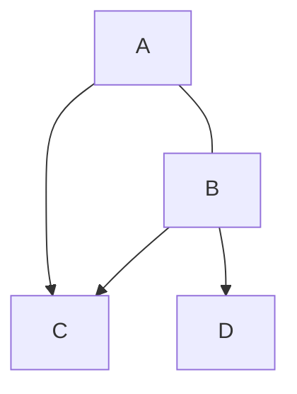

图 3.2：无向图

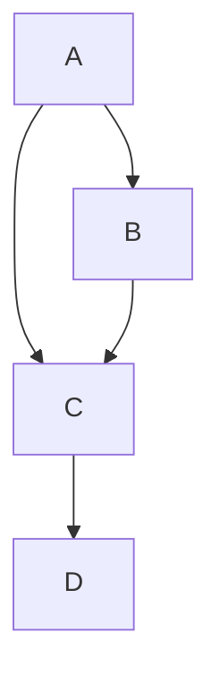

图 3.3：有向图

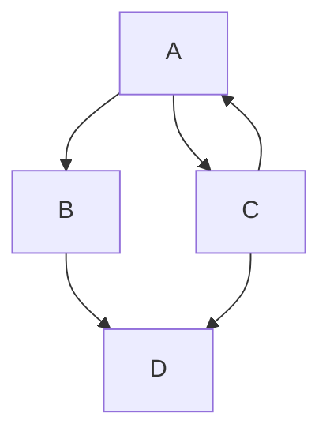

图 3.4：带有环的有向图

如果两个父节点 X 和 Y 共享某个子节点 Z，但 X 和 Y 之间没有边连接，则 $X \rightarrow Z \leftarrow Y$ 被称为**不道德结构（immorality）**。说真的；这在图模型中是一个真实的术语。例如，如果我们从图 3.3 中移除 $A \rightarrow B$ 得到图 3.5，那么 $A \rightarrow C \leftarrow B$ 就是一个不道德结构。

## 3.2 贝叶斯网络（Bayesian Networks）

事实证明，因果图模型的大部分工作已经在**概率图模型（probabilistic graphical models）**领域中完成。概率图模型是统计模型，而因果图模型是因果模型。**贝叶斯网络（Bayesian networks）**是主要的概率图模型，因果图模型（因果贝叶斯网络）从其继承了大部分性质。

假设我们只关心对关联进行建模，而不进行任何因果建模。我们希望建模数据分布 $P(x_{1}, x_{2}, \ldots, x_{n})$ 。

一般来说，我们可以使用**概率的链式法则（chain rule of probability）**来分解任意分布：

$$
P(x_{1}, x_{2}, \dots, x_{n}) = P(x_{1}) \prod_{i} P(x_{i} \mid x_{i-1}, \dots, x_{1}) \tag{3.1}
$$

然而，如果我们用表格来建模这些因子，将需要指数数量的参数。为了理解这一点，假设每个 $x_{i}$ 是二值的，并考虑我们如何建模因子 $P(x_{n} \mid x_{n-1}, \ldots, x_{1})$ 。由于 $x_{n}$ 是二值的，我们只需要建模 $P(X_{n} = 1 \mid x_{n-1}, \ldots, x_{1})$ ，因为 $P(X_{n} = 0 \mid x_{n-1}, \ldots, x_{1})$ 就是 $1 - P(X_{n} = 1 \mid x_{n-1}, \ldots, x_{1})$ 。那么，我们需要 $2^{n-1}$ 个参数来建模这个因子。作为具体例子，设 $n = 4$ 。正如我们在表 3.1 中看到的，这需要 $2^{4-1} = 8$ 个参数： $\alpha_{1}, \ldots, \alpha_{8}$ 。随着 $n$ 的增加，这种暴力参数化很快变得难以处理。

在联合分布中更高效地对多个变量进行建模的一种直观方法是只对**局部依赖关系（local dependencies）**进行建模。例如，与其将 $X_{4}$ 的因子建模为 $P(x_{4}|x_{3}, x_{2}, x_{1})$ ，如果我们有理由相信 $X_{4}$ 只局部依赖于 $X_{3}$ ，我们可以将其建模为 $P(x_{4}|x_{3})$ 。事实上，在图 3.6 的相应图中，唯一指向 $X_{4}$ 的节点是 $X_{3}$ 。这意在表示 $X_{4}$ 只局部依赖于 $X_{3}$ 。每当我们使用图 G 与概率分布 P 相关联时，G 中的节点与 P 中的随机变量之间总是存在一一对应的映射关系，因此当我们说节点独立时，意味着相应的随机变量是独立的。

给定一个概率分布和相应的有向无环图（DAG），我们可以通过**局部马尔可夫假设（local Markov assumption）**来形式化独立性的规定：

**假设 3.1（局部马尔可夫假设）** 在 DAG 中，给定其父节点，一个节点 X 独立于其所有非后代节点。

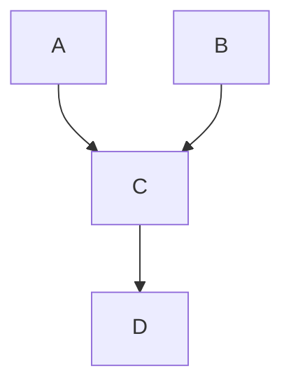

图 3.5：带有不道德结构的有向图

**表 3.1：对单个因子 $P(x_{n} \mid x_{n-1}, \ldots, x_{1})$ 进行建模所需的表格，其中 n = 4 且变量为二值。所需参数数量随 n 呈指数增长。**

<table><tr><td> $x_{1}$ </td><td> $x_{2}$ </td><td> $x_{3}$ </td><td> $P(x_{4} \mid x_{3}, x_{2}, x_{1})$ </td></tr><tr><td>0</td><td>0</td><td>0</td><td> $\alpha_{1}$ </td></tr><tr><td>0</td><td>0</td><td>1</td><td> $\alpha_{2}$ </td></tr><tr><td>0</td><td>1</td><td>0</td><td> $\alpha_{3}$ </td></tr><tr><td>0</td><td>1</td><td>1</td><td> $\alpha_{4}$ </td></tr><tr><td>1</td><td>0</td><td>0</td><td> $\alpha_{5}$ </td></tr><tr><td>1</td><td>0</td><td>1</td><td> $\alpha_{6}$ </td></tr><tr><td>1</td><td>1</td><td>0</td><td> $\alpha_{7}$ </td></tr><tr><td>1</td><td>1</td><td>1</td><td> $\alpha_{8}$ </td></tr></table>

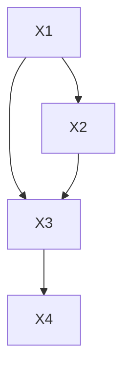

图 3.6：四节点 DAG，其中 $X_{4}$ 仅局部依赖于 $X_{3}$ 。

这个假设（结合特定的 DAG）给了我们很多信息。我们将在接下来的几个方程中展示这一点。在我们的四变量例子中，概率的链式法则告诉我们，任何 P 都可以分解为：

$$
P(x_{1}, x_{2}, x_{3}, x_{4}) = P(x_{1}) P(x_{2} \mid x_{1}) P(x_{3} \mid x_{2}, x_{1}) P(x_{4} \mid x_{3}, x_{2}, x_{1}). \tag{3.2}
$$

如果 $P$ 相对于图 3.6 中的图是**马尔可夫的（Markov）** $^{1}$，那么我们可以简化最后一个因子：

$$
P(x_{1}, x_{2}, x_{3}, x_{4}) = P(x_{1}) P(x_{2} \mid x_{1}) P(x_{3} \mid x_{2}, x_{1}) P(x_{4} \mid x_{3}). \tag{3.3}
$$

如果我们进一步移除边，如图 3.7 中移除 $X_{1} \rightarrow X_{2}$ 和 $X_{2} \rightarrow X_{3}$，我们可以进一步简化 P 的分解：

$$
P(x_{1}, x_{2}, x_{3}, x_{4}) = P(x_{1}) P(x_{2}) P(x_{3} \mid x_{1}) P(x_{4} \mid x_{3}). \tag{3.4}
$$

基于我们通过几个例子建立起来的理解，$^{2}$ 我们现在将陈述局部马尔可夫假设的一个主要推论：

**定义 3.1（贝叶斯网络分解）** 给定概率分布 P 和 DAG G，如果 P 按照 G 分解，则：

$$
P(x_{1}, \ldots, x_{n}) = \prod_{i} P(x_{i} \mid \mathsf{pa}_{i})
$$

希望你能看到从方程 3.2 到方程 3.3 或到方程 3.4 的转变与定义 3.1 中给出的推广之间的相似之处。

贝叶斯网络分解也被称为**贝叶斯网络的链式法则**或**马尔可夫相容性（Markov compatibility）**。例如，如果 P 按照 G 分解，则 P 和 G 是马尔可夫相容的。

我们已经给出了局部马尔可夫假设如何蕴含贝叶斯网络分解的直观解释，而事实证明这两者实际上是等价的。换句话说，我们可以从贝叶斯网络分解作为主要假设（并将其标记为假设）开始，并证明它蕴含局部马尔可夫假设。有关这些证明以及该主题的更多信息，请参见 Koller 和 Friedman [13, 第 3 章]。

尽管局部马尔可夫假设很重要，但它只告诉我们 DAG 所蕴含的 P 中的独立性信息。它甚至没有告诉我们，如果 X 和 Y 在 DAG 中相邻，那么 X 和 Y 是相关的。而这种额外的信息在因果 DAG 中通常是被假设的。为了获得相邻节点之间这种有保证的相关性，我们通常会假设一个比局部马尔可夫假设稍强的假设：**最小性（minimality）**。

**假设 3.2（最小性假设）** 1. 在 DAG 中，给定其父节点，节点 $X$ 独立于其所有非后代节点（假设 3.1）。

2. DAG 中相邻的节点是相关的。$^{3}$

$^{1}$ 如果一个概率分布与一个 DAG 满足局部马尔可夫假设，则称该分布相对于该 DAG 是（局部）马尔可夫的。

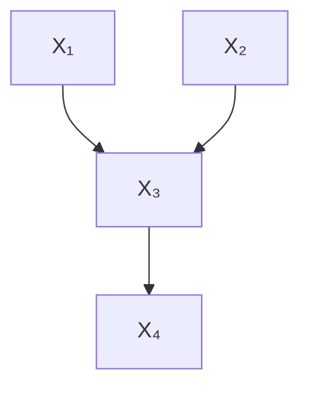

图 3.7：具有更多独立性的四节点 DAG。

$^{2}$ 主动阅读练习：确保你知道如何使用局部马尔可夫假设从方程 3.2 得到方程 3.3 和方程 3.4。

[13]: Koller 和 Friedman (2009)，《概率图模型：原理与技术》

$^{3}$ 这通常等价地表述为：如果我们从 DAG 中移除任何边，P 将不会相对于移除边后的图是马尔可夫的 [参见，例如，14，第 6.5.3 节]。

[14]: Peters 等人 (2017)，《因果推断要素：基础与学习算法》

要理解为什么这个假设被称为"最小性"，考虑一下当我们知道 P 相对于 DAG G 是马尔可夫的时候，我们知道什么。我们知道 P 满足一组特定于 G 结构的独立性。如果 P 和 G 也满足最小性，那么这组独立性是最小的，因为 P 不满足任何额外的独立性。这等价于说相邻节点是相关的。

例如，如果 DAG 仅仅是如图 3.8 所示的两个相连节点 X 和 Y，局部马尔可夫假设告诉我们，我们可以将 $P(x,y)$ 分解为 $P(x)P(y|x)$ ，但它也允许我们将 $P(x,y)$ 分解为 $P(x)P(y)$ ，这意味着它允许 X 和 Y 独立的分布。相比之下，最小性假设不允许这种额外的独立性。最小性会告诉我们，将 $P(x,y)$ 分解为 $P(x)P(y|x)$ ，并且它告诉我们，在 P 中不存在相对于图 3.8 最小的额外独立性 $(X \perp Y)$。

因为在贝叶斯网络中移除边等价于增加独立性，$^{4}$ 所以最小性假设等价于说我们不能从图中移除任何更多的边。在某种意义上，每条边都是"活跃的"。更具体地说，考虑 P 和 G 是马尔可夫相容的，并且 $G'$ 是我们从 G 中移除某条边后得到的图。如果 P 相对于 $G'$ 也是马尔可夫的，那么 P 相对于 G 不是最小的。

凭借最小性假设以及它关于分布相对于某个 DAG 是马尔可夫时如何分解的含义（定义 3.1），我们现在准备讨论 DAG 中关联的流动。然而，由于本节中的所有内容都是纯统计的，我们还没有准备好讨论 DAG 中因果的流动。要做到这一点，我们必须做出因果假设。从教学法上讲，这也将使我们能够在解释关联的流动时使用直观的因果语言。

## 3.3 因果图（Causal Graphs）

前一节全部关于统计模型和关联建模。在本节中，我们将用因果假设来增强这些模型，将它们转变为因果模型，并允许我们研究因果关系。为了引入因果假设，我们必须首先理解 X 是 Y 的原因意味着什么。

**定义 3.2（什么是原因？）** 如果 Y 可以响应 X 的变化而改变，则称变量 X 是变量 Y 的原因。$^{5}$

另一个常用于描述这一原始概念的说法是 Y"听从"X。有了这一点，我们现在可以指定本书中将使用的主要因果假设。

**假设 3.3（（严格）因果边假设）** 在有向图中，每个父节点都是其所有子节点的直接原因。

这里，Y 的**直接原因（direct causes）**集合是 Y 直接响应的所有事物；如果我们固定 Y 的所有直接原因，那么改变 Y 的任何其他原因都不会引起 Y 的任何变化。这个假设是"严格的"，因为每条边都是"活跃的"，就像在满足最小性的 DAG 中一样。换句话说，因为原因的定义（定义 3.2）意味着原因与其结果相关，并且因为我们假设所有父节点都是其子节点的原因，所以我们假设父节点与其子节点是相关的。因此，最小性的第二部分（假设 3.2）被包含在严格因果边假设中。

相比之下，**非严格因果边假设**会允许某些父节点不是其子节点的原因。它只假设子节点不是其父节点的原因。这允许我们绘制带有额外边的图以做出更少的假设，就像我们在贝叶斯网络中那样，其中更多的边意味着更少的独立性假设。因果图有时以这种非最小含义绘制，但绝大多数情况下，当有人绘制因果图时，他们的意思是父节点是其子节点的原因。因此，除非另有说明，在本书中，我们将使用"因果图"来指代满足严格因果边假设的 DAG。并且在提及这个假设时，我们通常会省略"严格"一词。

当我们添加因果边假设时，DAG 中的有向路径具有了非常特殊的含义；它们对应于因果关系。这与图中的其他路径形成对比，关联可能沿着这些路径流动，但因果关系肯定不会。当我们将在第 3.5 节和第 3.6 节中详细讨论这些其他类型的路径时，这一点将变得更加清晰。

继续前进，我们现在将图的边视为因果的，以便用因果语言直观地描述概念。然而，所有关于统计独立性的关联性主张仍然成立，即使边不具有因果含义，就像在第 3.2 节的普通贝叶斯网络中那样。

正如我们将在接下来的几节中看到的，我们的因果图模型需要的主要假设，以告诉我们关联和因果关系如何在变量之间流动，是以下两个：

1. **局部马尔可夫假设**（假设 3.1）  
2. **因果边假设**（假设 3.3）

我们将在接下来的几节中讨论这些假设，并在第 3.8 节中，在建立了必要的预备知识之后，再次更全面地讨论它们。

## 3.4 两节点图与图形构建模块（Two-Node Graphs and Graphical Building Blocks）

既然我们已经把基本假设和定义讲清楚了，我们可以进入本章的核心内容：DAG 中关联与因果的流动。我们可以通过理解图中最小构建模块中的流动来理解一般 DAG 中的这种流动。这些最小构建模块包括**链（chains）**（图 3.9a）、**叉（forks）**（图 3.9b）、**不道德结构（immoralities）**（图 3.9c）、**两个不连接的节点**（图 3.10）和**两个连接的节点**（图 3.11）。

(a) 链

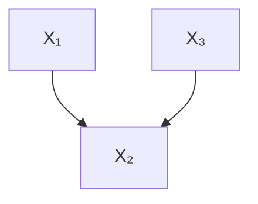

(b) 叉

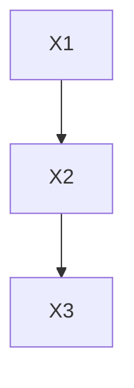

(c) 不道德结构  
图 3.9：基本图形构建模块

所谓"关联的流动"，我们指的是图中任意两个节点是否相关联或不相关联。另一种说法是两个节点是否（统计上）**相关（dependent）**或**独立（independent）**。此外，我们将研究两个节点是否**条件独立（conditionally independent）**。

对于每个构建模块，我们将给出为什么两个节点（条件）独立或不独立的直观解释，并给出证明。我们可以通过简单地证明 $P(a, b|c)$ 分解为 $P(a|c)P(b|c)$ 来证明两个节点 A 和 B 在给定某些节点集合 C 的条件下是独立的。我们现在在最简单的基本构建模块——两个不连接的节点——的情况下进行证明。

给定一个仅由两个不连接节点组成的图，如图 3.10 所示，这些节点不相关联，仅仅是因为它们之间没有边。为了证明这一点，考虑贝叶斯网络分解（定义 3.1）给出的 $P(x_{1}, x_{2})$ 的分解：

$$
P(x_{1}, x_{2}) = P(x_{1}) P(x_{2}) \tag{3.5}
$$

就是这样；应用贝叶斯网络分解立即给出了一个证明，即在这个构建模块中，两个节点 $X_{1}$ 和 $X_{2}$ 是不相关联的（独立的）。允许我们证明这一点的假设是什么？即 $P$ 相对于图 3.10 中的图是马尔可夫的。

相比之下，如果两个节点之间存在一条边（如图 3.11 所示），则这两个节点是相关的。我们在这里利用的假设是因果边假设（假设 3.3），这意味着 $X_{1}$ 是 $X_{2}$ 的原因。由于 $X_{1}$ 是 $X_{2}$ 的原因，$X_{2}$ 必须能够响应 $X_{1}$ 的变化而改变，因此 $X_{2}$ 和 $X_{1}$ 是相关的。一般来说，只要两个节点在因果图中相邻，它们就是相关的。$^{6}$ 我们将在第 3.5 节和第 3.6 节中多次看到相同的概念。

现在我们已经介绍了相关的两节点图，我们将介绍其余图形构建模块（图 3.9 中的三节点图）中关联的流动，从链图开始。

图 3.8：两个连接的节点

$^{4}$ 主动阅读练习：为什么在贝叶斯网络中移除边等价于增加独立性？

$^{5}$ 关于使用数学符号的定义，请参见第 4.5.1 节。

$^{6}$ 这里我们隐含地假设了最小性（假设 3.2）。

## 3.5 链（Chains）与叉（Forks）

链（图 3.12）和叉（图 3.13）具有相同的依赖关系集。在这两种结构中，$X_{1}$ 和 $X_{2}$ 是依赖的，$X_{2}$ 和 $X_{3}$ 也是依赖的，其原因与我们在第 3.4 节末尾讨论的相同。当我们做出**因果边假设（causal edges assumption）**（假设 3.3）时，相邻节点总是依赖的。那么 $X_{1}$ 和 $X_{3}$ 呢？在链和叉中，关联是否通过 $X_{2}$ 从 $X_{1}$ 流向 $X_{3}$？

图 3.10：两个未连接的节点

图 3.11：两个连接的节点

$^{6}$ 在非严格因果图中，两个相邻节点可能不相关。

图 3.12：链，关联流用红色虚线弧表示。

通常，是的，在链和叉中，$X_{1}$ 和 $X_{3}$ 都是关联的。在链图中，$X_{1}$ 和 $X_{3}$ 通常是依赖的，仅仅是因为 $X_{1}$ 引起 $X_{2}$ 的变化，进而引起 $X_{3}$ 的变化。在叉图中，$X_{1}$ 和 $X_{3}$ 也通常是依赖的。这是因为 $X_{2}$ 取的值同时用于确定 $X_{1}$ 取的值和 $X_{3}$ 取的值。换句话说，$X_{1}$ 和 $X_{3}$ 通过它们（共享的）共同原因关联起来。我们在本段中使用了“通常”这个词，因为存在一些病态情况，其中条件分布 $P(x_{2}|x_{1})$ 和 $P(x_{3}|x_{2})$ 以一种特定方式错位，使得 $X_{1}$ 和 $X_{3}$ 实际上并不关联 [参见，例如，15，第 2.2 节]。

一种直观的图形化思考 $X_{1}$ 和 $X_{3}$ 在链和叉中关联的方式是想象关联的流动。我们在图 3.12 和图 3.13 中用红色虚线来可视化这一点。在链图（图 3.12）中，关联沿着路径 $X_{1} \rightarrow X_{2} \rightarrow X_{3}$ 从 $X_{1}$ 流向 $X_{3}$。对称地，关联也沿着同一条路径从 $X_{3}$ 流向 $X_{1}$，只是方向与箭头相反。在叉图（图 3.13）中，关联沿着路径 $X_{1} \leftarrow X_{2} \rightarrow X_{3}$ 从 $X_{1}$ 流向 $X_{3}$。类似地，我们可以认为关联沿着同一条路径从 $X_{3}$ 流向 $X_{1}$，与链的情况一样。通常，关联的流动是对称的。

链和叉也具有相同的独立性集合。当我们在两个图中都**以 $X_{2}$ 为条件**时，它会阻断关联从 $X_{1}$ 流向 $X_{3}$。这是因为**局部马尔可夫假设（local Markov assumption）**；每个变量只能局部地依赖于其父节点。因此，当我们以 $X_{2}$（在两个图中都是 $X_{3}$ 的父节点）为条件时，$X_{3}$ 变得独立于 $X_{1}$（反之亦然）。

我们将这种独立性称为**路径被阻断（blocked path）**的一个实例。我们在图 3.14 和图 3.15 中展示了这些被阻断的路径。条件作用阻断了链和叉中的关联流动。如果没有条件作用，关联在链和叉中可以自由流动；我们将其称为**未阻断路径（unblocked path）**。然而，对于**非道德结构（immoralities）**，情况则完全不同，我们将在下一节中看到。

这些都是很好的直觉，但证明呢？我们可以仅使用局部马尔可夫假设来证明 $X_{1} \perp X_{3} \mid X_{2}$。我们将通过证明 $P(x_{1}, x_{3} \mid x_{2}) = P(x_{1} \mid x_{2})P(x_{3} \mid x_{2})$ 来实现。我们将展示链图的证明。从**贝叶斯网络分解（Bayesian network factorization）**开始通常很有用。对于链，我们可以将 $P(x_{1}, x_{2}, x_{3})$ 分解如下：

$$
P (x _ {1}, x _ {2}, x _ {3}) = P (x _ {1}) P (x _ {2} | x _ {1}) P (x _ {3} | x _ {2}) \tag {3.6}
$$

贝叶斯规则告诉我们 $P(x_{1},x_{3} \mid x_{2}) = \frac{P(x_{1},x_{2},x_{3})}{P(x_{2})}$，因此我们有：

$$
P (x _ {1}, x _ {3} \mid x _ {2}) = \frac {P (x _ {1}) P (x _ {2} | x _ {1}) P (x _ {3} | x _ {2})}{P (x _ {2})} \tag {3.7}
$$

既然我们的目标是得到 $P(x_{1} \mid x_{2})P(x_{3} \mid x_{2})$，并且我们已经有了 $P(x_{3}|x_{2})$，我们必须将剩余部分转化为 $P(x_{1} \mid x_{2})$。我们可以通过再次应用贝叶斯规则来实现：

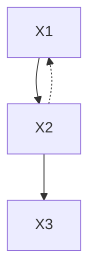

图 3.13：叉，关联流用红色虚线弧表示。

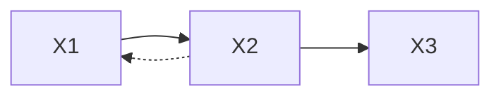

图 3.14：链，关联被以 $X_{2}$ 为条件阻断。

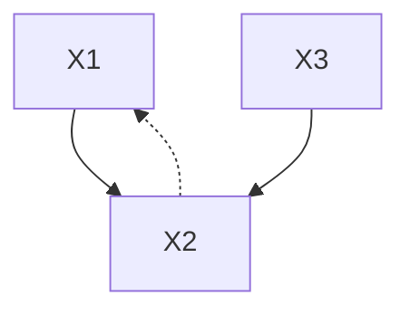

图 3.15：叉，关联被以 $X_{2}$ 为条件阻断。

$$
P (x _ {1}, x _ {3} \mid x _ {2}) = \frac {P (x _ {1} , x _ {2})}{P (x _ {2})} P (x _ {3} | x _ {2}) \tag {3.8}
$$

$$
= P (x _ {1} | x _ {2}) P (x _ {3} | x _ {2}) \tag {3.9}
$$

至此，我们已经证明了 $X_{1} \perp X_{3} \mid X_{2}$。请自己尝试一下；证明叉图中的类似结论。$^{7}$

**因果的流动（Flow of Causation）** 关联的流动是对称的，而因果的流动则不是。在因果边假设（假设 3.3）下，因果关系只沿一个方向流动。因果关系只沿着有向路径流动。关联则沿着任何不包含非道德结构的路径流动。

## 3.6 碰撞器（Colliders）及其后代（Descendants）

回顾第 3.1 节，当我们有一个子节点，而其两个父节点之间没有边连接时，我们就有了一个**非道德结构（immorality）**（图 3.16）。在这种图结构中，这个子节点被称为**私生子（bastard）**。不，开个玩笑；它被称为**碰撞器（collider）**。

与链和叉相反，在非道德结构中，$X_{1} \perp \perp X_{3}$。观察图结构并思考一下。为什么 $X_{1}$ 和 $X_{3}$ 会是关联的呢？一个不是另一个的后代（如链），它们也没有共同原因（如叉）。相反，我们可以将 $X_{1}$ 和 $X_{3}$ 简单地视为发生的无关事件，它们恰好共同促成了某个共同效应（$X_{2}$）。为了证明这一点，我们应用贝叶斯网络分解并边缘化掉 $x_{2}$：

$$
P (x _ {1}, x _ {3}) = \sum_ {x _ {2}} P (x _ {1}, x _ {2}, x _ {3}) \tag {3.10}
$$

$$
= \sum_ {x _ {2}} P (x _ {1}) P (x _ {3}) P (x _ {2} \mid x _ {1}, x _ {3}) \tag {3.11}
$$

$$
= P (x _ {1}) P (x _ {3}) \sum_ {x _ {2}} P (x _ {2} \mid x _ {1}, x _ {3}) \tag {3.12}
$$

$$
= P \left(x _ {1}\right) P \left(x _ {3}\right) \tag {3.13}
$$

我们在图 3.16 中通过展示我们可能想象沿着路径 $X_{1} \rightarrow X_{2} \leftarrow X_{3}$ 流动的关联实际上在 $X_{2}$ 处被阻断，来说明 $X_{1}$ 和 $X_{3}$ 的独立性。因为我们在连接 $X_{1}$ 和 $X_{3}$ 的路径上有一个碰撞器，所以关联不会通过该路径流动。这是另一个**路径被阻断**的例子，但这次路径不是被条件作用阻断的；路径是被碰撞器阻断的。

**好男人是混蛋（Good-Looking Men are Jerks）** 奇怪的是，当我们以碰撞器 $X_{2}$ 为条件时，它的父节点 $X_{1}$ 和 $X_{3}$ 变得依赖（如图 3.17 所示）。用一个例子最容易理解为什么会这样。想象你正在和男人约会，你注意到你遇到的大多数好男人都不太好看，而你遇到的大多数好看男人都是混蛋。似乎你必须在长相和善良之间做选择。换句话说，善良和长相似乎是负相关的。但是，如果我告诉你这里还有一个重要的第三个变量：**可交往性（availability）**（即这些男人是否已经有伴侣）呢？如果我告诉你一个男人的可交往性很大程度上取决于他们的长相和善良；如果一个人既好看又善良，那么他已经有伴侣了。剩下的可交往的男人是那些要么不好看，要么不善良的人。你之所以看到长相和善良之间存在关联，是因为你以碰撞器（可交往性）为条件了。你只看了那些没有伴侣的男人。通过将图 3.17 中的 $X_{1}$ 替换为“长相”，$X_{3}$ 替换为“善良”，$X_{2}$ 替换为“可交往性”，你可以看到这个例子的因果结构。

上述例子自然表明，在约会时，也许你应该考虑不以 $X_{2} = “没有伴侣”$ 为条件，而是以 $X_{2} = “有伴侣”$ 为条件。然而，你可能会遇到其他变量 $X_{4}$，它们会在那里引入新的非道德结构。这样的道德问题超出了本书的范围。

回到本书的范围内，我们有：以碰撞器为条件可以将一个被阻断的路径转变为未阻断的路径。父节点 $X_{1}$ 和 $X_{3}$ 在总体中是不关联的，但当我们以它们的共同子节点 $X_{2}$ 取特定值为条件时，它们就变得关联了。以碰撞器 $X_{2}$ 为条件允许关联沿着路径 $X_{1} \to X_{2} \leftarrow X_{3}$ 流动，尽管在我们不以 $X_{2}$ 为条件时它不会流动。我们在从图 3.16 到图 3.17 的转变中说明了这一点。

我们也在图 3.18 中用散点图说明了这一点。在图 3.18a 中，我们绘制了整个总体，x 轴是善良，y 轴是长相。如你所见，这些变量在总体中是不关联的。然而，如果我们移除那些已经有伴侣的人（图 3.18b 中的橙色点），我们就会得到图 3.18c 中清晰的负关联。这种现象被称为**伯克森悖论（Berkson's paradox）**。我们之所以看到这种负关联，仅仅是因为我们选择观察总体中的一个有偏子集，这就是为什么它有时被称为**选择偏差（selection bias）** [参见，例如，7，第 8 章]。

主动阅读练习：自己想出一个非道德结构的例子，以及以碰撞器为条件如何在其父节点之间诱导关联。提示：考虑 $X_{1}$ 和 $X_{3}$ 的罕见事件，如果其中任何一个发生，就会导致某个结果 $X_{2}$ 发生。

[7]: Hernán and Robins (2020), Causal Inference: What If

**数值示例（Numerical Example）** 以上所有内容都是为了让你直观理解为什么以碰撞器为条件会在其父节点之间诱导关联，但我们还没有给出一个具体的数值例子。我们在此给出一个简单的例子。考虑以下**数据生成过程（Data Generating Process, DGP）**，其中 $X_{1}$ 和 $X_{3}$ 从标准正态分布中独立抽取，然后用于计算 $X_{2}$：

$$
X _ {1} \sim N (0, 1), \quad X _ {3} \sim N (0, 1) \tag {3.14}
$$

$$
X _ {2} = X _ {1} + X _ {3} \tag {3.15}
$$

我们已经声明 $X_{1}$ 和 $X_{3}$ 是独立的，但为了并列比较两种计算，让我们计算它们的协方差：

$$
\begin{array}{l} \operatorname{Cov} (X _ {1}, X _ {3}) = \mathbb {E} [ (X _ {1} - \mathbb {E} [ X _ {1} ]) (X _ {3} - \mathbb {E} [ X _ {3} ]) ] \\ = \mathbb {E} \left[ X _ {1} X _ {3} \right] \quad (\text { 零均值 }) \\ = \mathbb {E} \left[ X _ {1} \right] \mathbb {E} \left[ X _ {3} \right] \quad (\text { 独立 }) \\ = 0 \\ \end{array}
$$

现在，让我们计算它们在以 $X_{2}$ 为条件下的协方差：

$$
\begin{array}{l} \operatorname{Cov} (X _ {1}, X _ {3} \mid X _ {2} = x) = \mathbb {E} [ X _ {1} X _ {3} \mid X _ {2} = x ] (3.16) \\ = \mathbb {E} [ X _ {1} (x - X _ {1}) ] (3.17) \\ = x \mathbb {E} [ X _ {1} ] - \mathbb {E} [ X _ {1} ^ {2} ] (3.18) \\ = - 1 (3.19) \\ \end{array}
$$

关键的是，在公式 3.17 中，我们使用了公式 3.15，用 $X_{1}$ 和 $X_{2}$（以 x 为条件）来表示 $X_{3}$。这导致了一个二次项，使得计算结果为非零数，这意味着，在以 $X_{2}$ 为条件下，$X_{1}$ 和 $X_{3}$ 是关联的。

**碰撞器的后代（Descendants of Colliders）** 以碰撞器的后代为条件也会在碰撞器的父节点之间诱导关联。直觉是，如果我们了解到关于碰撞器后代的某些信息，我们通常也会了解到关于碰撞器本身的一些信息，因为存在一条从碰撞器到其后代的直接因果路径，并且我们知道（假设**最小性（minimality）**，假设 3.2）链中的节点通常是关联的（参见第 3.5 节）。换句话说，碰撞器的后代可以被视为该碰撞器的代理，因此以后代为条件类似于以碰撞器本身为条件。

## 3.7 d-分离（d-separation）

在定义 d-分离之前，我们先明确之前章节讨论的"路径阻塞"概念的含义：

**定义 3.3（阻塞路径）** 在节点 $X$ 和 $Y$ 之间的一条路径被（可能为空的）条件集 $Z$ 阻塞，如果满足以下任一条件：

1. 沿着该路径，存在一个链式结构 $\cdots\rightarrow W\rightarrow\cdots$ 或一个分叉结构  
$\cdots\leftarrow W\rightarrow\cdots$，其中 $W$ 被作为条件 $(W\in Z)$。
2. 路径上存在一个**对撞因子（collider）** $W$，该节点未被作为条件 $(W \notin Z)$，且其所有后代也未被作为条件（de(W) ∉ Z）。

那么，**非阻塞路径**就是其补集；非阻塞路径是一条未被阻塞的路径。关于对撞因子的图形直觉是：关联沿着非阻塞路径流动，而不沿着阻塞路径流动。如果你还没有这种直觉，那么可能值得重读前两节，目标是获得这种直觉。现在，我们准备引入一个非常重要的概念：d-分离。

**定义 3.4（d-分离）** 如果 $X$ 和 $Y$ 之间（任意节点）的所有路径都被 $Z$ 阻塞，则称两个（集合）节点 $X$ 和 $Y$ 被节点集 $Z$ **d-分离** [16]。

如果两个节点 $X$ 和 $Y$ 之间的所有路径都被阻塞，那么我们就说 $X$ 和 $Y$ 是 d-分离的。类似地，如果 $X$ 和 $Y$ 之间至少存在一条非阻塞路径，那么我们就说 $X$ 和 $Y$ 是 **d-连通（d-connected）** 的。

正如我们将在定理 3.1 中看到的，d-分离之所以如此重要，是因为它蕴含了**条件独立性（conditional independence）**。我们将使用符号 $X \perp_{G} Y \mid Z$ 来表示在条件集 $Z$ 下，图 $G$ 中的 $X$ 和 $Y$ 是 d-分离的。类似地，我们将使用符号 $X \perp_{P} Y \mid Z$ 来表示在条件集 $Z$ 下，分布 $P$ 中的 $X$ 和 $Y$ 是独立的。

**定理 3.1** 给定 $P$ 关于 $G$ 是**马尔可夫的（Markov）**（满足局部马尔可夫假设，即假设 3.1），如果 $X$ 和 $Y$ 在条件集 $Z$ 下在图 $G$ 中是 d-分离的，那么 $X$ 和 $Y$ 在条件集 $Z$ 下在分布 $P$ 中是独立的。我们可以简洁地写成如下形式：

$$
X \perp_ {G} Y \mid Z \Longrightarrow X \perp_ {P} Y \mid Z \tag {3.20}
$$

因为这非常重要，我们给公式 3.20 起一个名字：**全局马尔可夫假设（global Markov assumption）**。定理 3.1 告诉我们，局部马尔可夫假设蕴含了全局马尔可夫假设。

正如我们建立直觉时认为局部马尔可夫假设（假设 3.1）蕴含了贝叶斯网络分解（定义 3.1），并提醒您贝叶斯网络分解也蕴含了局部马尔可夫假设（两者等价）一样，事实证明，全局马尔可夫假设也蕴含了局部马尔可夫假设。换句话说，**局部马尔可夫假设**、**全局马尔可夫假设**和**贝叶斯网络分解**都是等价的 [参见，例如，13，第 3 章]。因此，我们将使用稍短的短语**马尔可夫假设（Markov assumption）** 来统称这些概念，或者简单地写"$P$ 关于 $G$ 是马尔可夫的"来表达相同的意思。

主动阅读练习：为了练习 d-分离，这里有一些关于图 3.19 中 d-分离的问题。

关于图 3.19a 的问题：

1. $T$ 和 $Y$ 是否被空集 d-分离？
2. $T$ 和 $Y$ 是否被 $W_{2}$ d-分离？
3. $T$ 和 $Y$ 是否被 $\{W_2, M_1\}$ d-分离？
4. $T$ 和 $Y$ 是否被 $\{W_1, M_2\}$ d-分离？
5. $T$ 和 $Y$ 是否被 $\{W_1, M_2, X_2\}$ d-分离？

[16]: Pearl (1988), Probabilistic Reasoning in Intelligent Systems: Networks of Plausible Inference

[13]: Koller and Friedman (2009), Probabilistic Graphical Models: Principles and Techniques

6. $T$ 和 $Y$ 是否被 $\{W_1, M_2, X_2, X_3\}$ d-分离？

关于图 3.19b 的问题：

1. $T$ 和 $Y$ 是否被空集 d-分离？
2. $T$ 和 $Y$ 是否被 $W$ d-分离？
3. $T$ 和 $Y$ 是否被 $\{W, X_2\}$ d-分离？

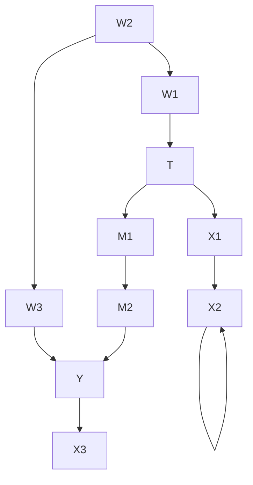

(a)

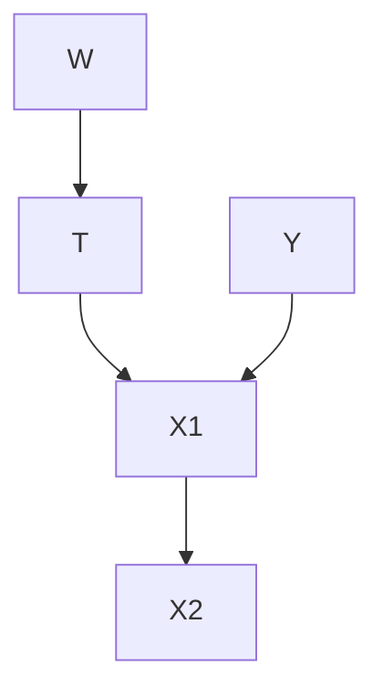

(b)  
**图 3.19：** 用于 d-分离练习的图

## 3.8 关联与因果的流动

现在我们已经涵盖了必要的预备知识（链式结构、分叉结构、对撞因子和 d-分离），有必要强调关联和因果在有向图中是如何流动的。**关联沿着所有非阻塞路径流动**。在因果图中，**因果沿着有向路径流动**。回顾第 1.3.2 节，关联不仅仅是因果，而且因果是关联的一个子类别。这就是为什么关联和因果都沿着有向路径流动。

我们将沿着有向路径流动的关联称为**因果关联（causal association）**。使得总关联不等于因果的一种常见非因果关联是**混杂关联（confounding association）**。在图 3.20 的图中，我们用红色表示混杂关联，用蓝色表示因果关联。

普通的贝叶斯网络是纯统计模型，因此我们只能在贝叶斯网络中讨论关联的流动。然而，关联在贝叶斯网络中的流动方式与在因果图中完全相同。在这两者中，关联都沿着链式结构和分叉结构流动，除非某个节点被作为条件。同样在这两者中，对撞因子会阻塞关联的流动，除非它被作为条件。结合这些基本构件，我们就得到了关联在一般有向无环图（DAG）中的流动方式。我们可以通过两个节点是否 d-分离来判断它们是否不关联（它们之间没有关联流动）。

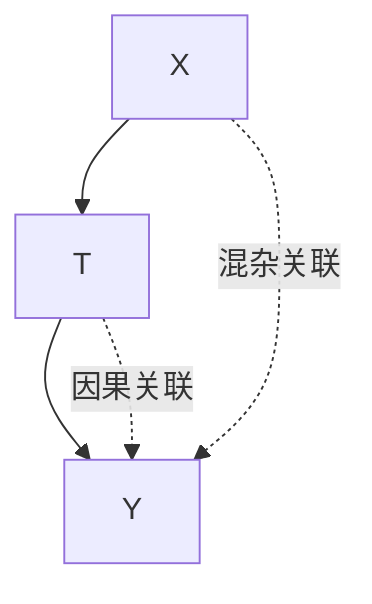

**图 3.20：** 描述混杂关联和因果关联如何流动的示例因果图。

因果图的特殊之处在于，我们额外假设边具有因果含义（因果边假设，假设 3.3）。正是这个假设将因果性引入了我们的模型，并使一种路径具有了全新的意义：**有向路径**。这个假设赋予有向路径承载因果的独特角色。此外，这个假设是不对称的；"$X$ 是 $Y$ 的原因"与"$Y$ 是 $X$ 的原因"是不同的。这意味着关联和因果之间存在一个重要区别：**关联是对称的，而因果是不对称的**。

**d-分离蕴含关联即因果** 鉴于我们有衡量关联的工具，我们如何分离出因果呢？换句话说，我们如何确保我们衡量的关联就是因果，例如，用于衡量 $X$ 对 $Y$ 的因果效应？我们可以通过确保 $X$ 和 $Y$ 之间没有非因果关联流动来做到这一点。如果 $X$ 和 $Y$ 在移除 $X$ 的出边后的增广图中是 d-分离的，那么这一点就成立。这是因为 $X$ 对 $Y$ 的所有因果效应都会通过其出边流动，因此一旦这些边被移除，剩下的关联就纯粹是非因果关联。

在图 3.21 中，我们说明了每个重要假设在解释这种关联流动方面给我们带来了什么。首先，我们有（局部/全局）马尔可夫假设（假设 3.1）。正如我们在第 3.7 节中看到的，这个假设使我们能够知道哪些节点是不关联的。换句话说，马尔可夫假设告诉我们关联**不**沿着哪些路径流动。当我们稍微加强马尔可夫假设到**最小性假设（minimality assumption）**（假设 3.2）时，我们就得到了关联**确实**沿着哪些路径流动（除了非传递边的情况）。当我们进一步加入因果边假设（假设 3.3）时，我们就得到了因果沿着有向路径流动。因此，以下两个 $^{8}$ 假设对于图形因果模型至关重要：

1. 马尔可夫假设（假设 3.1）
2. 因果边假设（假设 3.3）

$^{8}$ 回顾一下，最小性假设的第一部分就是局部马尔可夫假设，第二部分包含在因果边假设中。

**图 3.21：** 一个流程图，说明了随着我们添加每个额外的重要假设，我们可以对数据做出何种类型的断言。