# 因果模型（Causal Models）

**因果模型**对于识别因果量至关重要。当我们在第2.4节中介绍**识别-估计流程图（Identification-Estimation Flowchart）**（图2.5）时，我们将识别描述为从**因果估计量（causal estimand）**到**统计估计量（statistical estimand）**的过程。然而，要做到这一点，我们必须有一个因果模型。我们在图4.1中展示了这个更完整的识别-估计流程图版本。


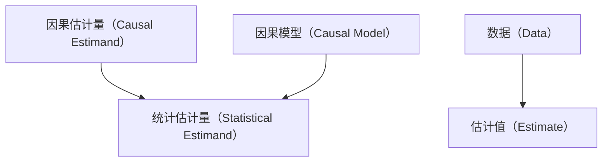

图4.1：识别-估计流程图——该流程图展示了从目标因果估计量到相应估计值的过程，通过识别和估计实现。与图2.5相比，此版本增加了因果模型和数据。

前一章给出了因果模型的图形直觉，但没有解释如何识别因果量以及如何形式化因果模型。我们将在本章中进行这些工作。

## 4.1 do算子与干预分布（The do-operator and Interventional Distributions）

我们将首先介绍一个用于干预的数学算子。在常规的概率符号中，我们有**条件作用（conditioning）**，但这与干预不同。对 $T = t$ 进行条件作用仅仅意味着我们将关注范围限制在接受了处理 $t$ 的那部分人群中。相比之下，干预则是让整个群体都接受处理 $t$ 。我们在图4.2中说明了这一点。我们将用**do算子（do-operator）**来表示干预：$\text{do}(T = t)$ 。这是图形因果模型中常用的符号，并且在**潜在结果（potential outcomes）**符号中有其等价形式。例如，我们可以将第2章中看到的潜在结果 $Y(t)$ 的分布写成如下形式：

$$
P (Y (t) = y) \triangleq P (Y = y \mid d o (T = t)) \triangleq P (y \mid d o (t)) \tag {4.1}
$$

注意，在公式4.1的最后一个选项中，我们将 $do(T = t)$ 简写为 $do(t)$ 。我们将在全书中使用这种简写。类似地，当处理为二元变量时，我们可以将**ATE（平均处理效应，Average Treatment Effect）**写成如下形式：

$$
\mathbb {E} [ Y \mid d o (T = 1) ] - \mathbb {E} [ Y \mid d o (T = 0) ] \tag {4.2}
$$


图4.2：条件作用与干预之间差异的图示

我们通常会处理完整的分布，如 $P(Y \mid do(t))$ ，而不是它们的均值，因为这更具一般性；如果我们刻画了 $P(Y \mid do(t))$ ，那么我们就刻画了 $E[Y \mid do(t)]$ 。我们将通常把 $P(Y \mid do(T = t))$ 以及其他包含do算子的表达式称为**干预分布（interventional distributions）**。

像 $P(Y \mid do(T = t))$ 这样的干预分布在概念上与**观测分布（observational distribution）** $P(Y)$ 截然不同。像 $P(Y)$ 或 $P(Y, T, X)$ 这样的观测分布不包含do算子。由于它们不包含do算子，我们可以从中观测数据，而无需进行任何实验。这就是为什么我们将来自 $P(Y, T, X)$ 的数据称为**观测数据（observational data）**。如果我们能够将一个包含do的表达式 $Q$（一个干预表达式）化简为不包含do的表达式（一个观测表达式），那么 $Q$ 就被称为是**可识别的（identifiable）**。包含do的表达式与不包含do的表达式有着根本性的不同，尽管在do符号中，do出现在常规的条件作用竖线之后。正如我们在第2.4节中讨论的，当一个估计量包含do算子时，我们将其称为**因果估计量（causal estimand）**；当一个估计量不包含do算子时，我们将其称为**统计估计量（statistical estimand）**。

每当 $do(t)$ 出现在条件作用竖线之后时，意味着该表达式中的所有内容都处于干预 $do(t)$ 发生后的**干预后世界（post-intervention world）**。例如，$\mathbb{E}[Y \mid do(t), Z = z]$ 指的是在整个人群都接受了处理 $t$ 后，子群体 $Z = z$ 中的期望结果。相比之下，$\mathbb{E}[Y \mid Z = z]$ 仅仅指的是（干预前）人群中个体接受他们通常会接受的处理（$T$）时的期望值。当我们到第14章讨论**反事实（counterfactuals）**时，这种区别将变得非常重要。

## 4.2 主要假设：模块性（The Main Assumption: Modularity）

在我们描述一个非常重要的假设之前，我们必须明确什么是**因果机制（causal mechanism）**。有几种不同的方式来思考因果机制。在本节中，我们将生成 $X_{i}$ 的因果机制称为给定其所有原因条件下 $X_{i}$ 的条件分布：$P(x_{i} \mid \text{pa}_{i})$ 。如图4.3中所示，生成 $X_{i}$ 的因果机制包括 $X_{i}$ 的所有父节点以及指向 $X_{i}$ 的边。我们将在第4.5.1节中给出关于因果机制更具体的描述，但目前这些已经足够。

为了获得许多因果识别结果，我们做出的主要假设是**干预是局部的（interventions are local）**。更具体地说，我们将假设对变量 $X_{i}$ 进行干预只会改变 $X_{i}$ 的因果机制；它不会改变生成任何其他变量的因果机制。从这个意义上说，因果机制是**模块化的（modular）**。用于描述模块性属性的其他名称包括**独立机制（independent mechanisms）**、**自主性（autonomy）**和**不变性（invariance）**。我们现在更正式地陈述这个假设。

**假设4.1（模块性 / 独立机制 / 不变性，Modularity / Independent Mechanisms / Invariance）** 如果我们对一组节点 $S \subseteq [n]$ ¹ 进行干预，将它们设置为常数，那么对于所有 $i$ ，我们有以下结论：

1. 如果 $i \notin S$ ，则 $P(x_{i} \mid \mathsf{pa}_{i})$ 保持不变。  
2. 如果 $i \in S$ ，则当 $x_i$ 等于干预设置给 $X_i$ 的值时，$P(x_i \mid \mathsf{pa}_i) = 1$；否则，$P(x_i \mid \mathsf{pa}_i) = 0$ 。

在上述假设的第二部分中，我们也可以说：如果 $x_{i}$ 与干预一致²，则 $P(x_{i} \mid \text{pa}_{i}) = 1$，否则为0。更明确地说，我们将在（后续内容中）指出：如果 $i \in S$ ，当 $x_{i}$ 等于干预中设置给 $X_{i}$ 的值时，该值 $x_{i}$ 与干预一致。

模块性假设使我们能够在单个图中编码许多不同的干预分布。例如，可能存在这样的情况：$P(Y)$ 、$P(Y \mid do(T = t))$ 、$P(Y \mid do(T = t'))$ 和 $P(Y \mid do(T_2 = t_2))$ 都是完全不同的分布，几乎没有任何共同之处。如果是这样，那么每个分布都需要自己的图。然而，通过假设模块性，我们可以用编码联合分布 $P(Y, T, T_2, \ldots)$ 的同一个图来编码所有这些分布，并且我们知道除了被干预的因子之外的所有因子在这些图中都是共享的。

干预分布的因果图与用于观测联合分布的图完全相同，只是删除了指向被干预节点的所有边。这是因为被干预因子的概率已被设为1，因此我们可以忽略该因子（这是下一节的重点）。另一种理解被干预节点没有因果父节点的方式是：被干预节点被设置为一个常数值，因此它不再依赖于观测环境中它所依赖的任何变量（其父节点）。这种删除了边的图被称为**操作图（manipulated graph）**。


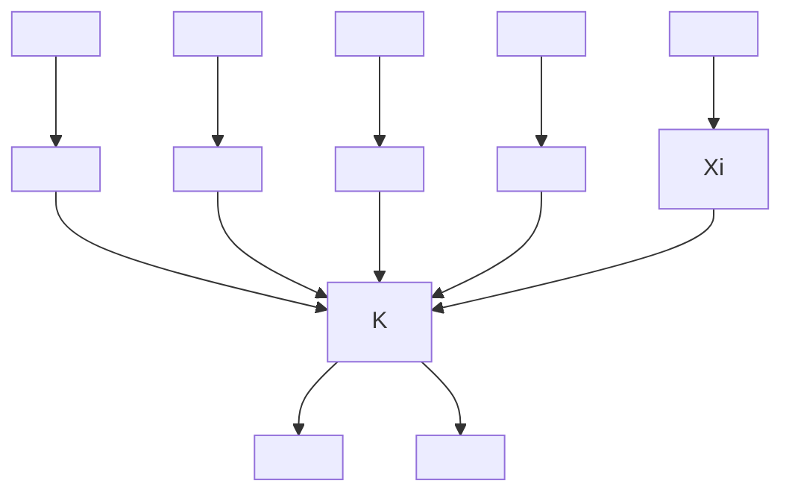

图4.3：一个因果图，其中生成 $X_{i}$ 的因果机制用椭圆描绘。

¹ 我们用 $[n]$ 表示集合 $\{1,2,\ldots,n\}$ 。

² 是的，"一致（consistent）"这个词被严重重载了。

例如，考虑图4.4a中观测分布的因果图。$P(Y \mid do(T = t))$ 和 $P(Y \mid do(T = t'))$ 都对应于图4.4b中的因果图，其中指向 $T$ 的入边已被删除。类似地，$P(Y \mid do(T_2 = t_2))$ 对应于图4.4c中的图，其中指向 $T_2$ 的入边已被删除。尽管图中没有表达出来（图只表达条件独立性和因果关系），但在模块性假设下，$P(Y)$ 、$P(Y \mid T = t')$ 和 $P(Y \mid do(T_2 = t_2))$ 都共享完全相同的（未被干预的）因子。


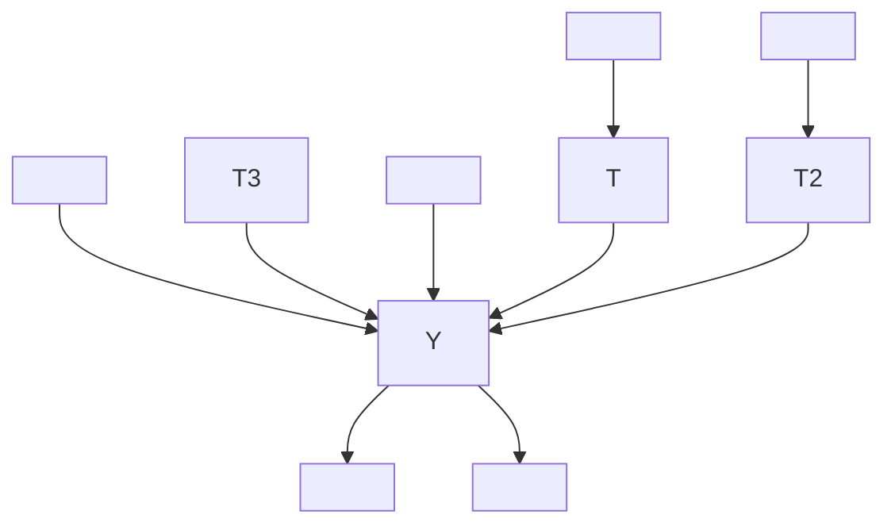

(a) 观测分布的因果图


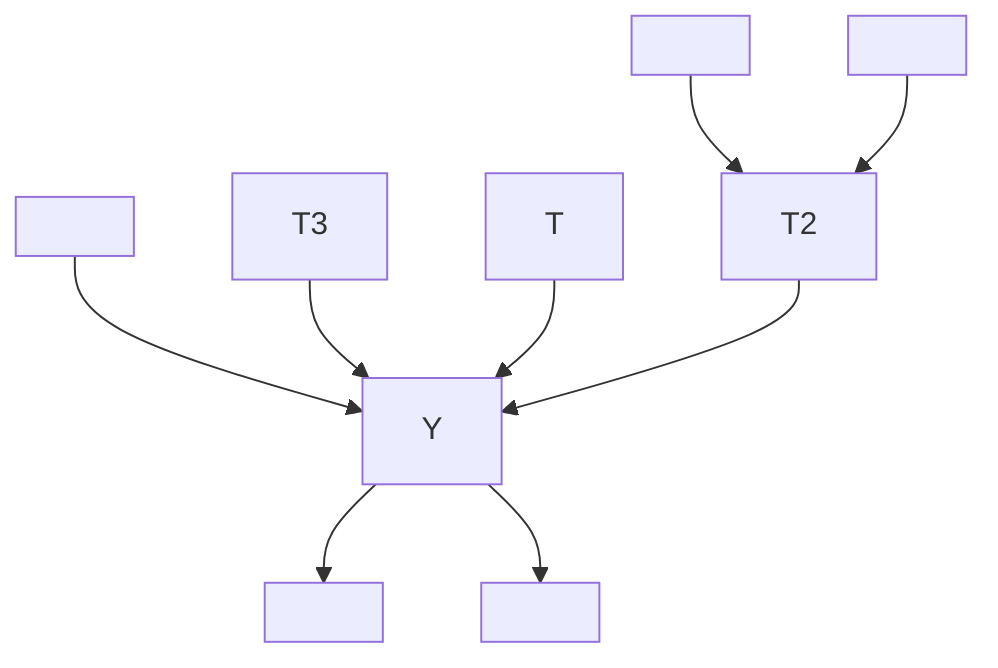

(b) 对T进行干预后的因果图（干预分布）


```mermaid
graph TD
  A[" "] --> B["T"]
  C[" "] --> D["Y"]
  E[" "] --> D["Y"]
  F[" "] --> D["Y"]
  G[" "] --> D["Y"]
  H[" "] --> D["Y"]
  I[" "] --> D["Y"]
  J[" "] --> D["Y"]
  K[" "] --> D["Y"]
  L[" "] --> D["Y"]
  M[" "] --> D["Y"]
  N[" "] --> D["Y"]
  O[" "] --> D["Y"]
  P[" "] --> D["Y"]
  Q[" "] --> D["Y"]
  R[" "] --> D["Y"]
  S[" "] --> D["Y"]
  T[" "] --> D["Y"]
  U[" "] --> D["Y"]
  V[" "] --> D["Y"]
  W[" "] --> D["Y"]
  X[" "] --> D["Y"]
  Y[" "] --> D["Y"]
  Z[" "] --> D["Y"]
  AA[" "] --> D["Y"]
  AB[" "] --> D["Y"]
  AC[" "] --> D["Y"]
  AD[" "] --> D["Y"]
  AE[" "] --> D["Y"]
  AF[" "] --> D["Y"]
  AG[" "] --> D["Y"]
  AH[" "] --> D["Y"]
  AI[" "] --> D["Y"]
  AJ[" "] --> D["Y"]
  AK[" "] --> D["Y"]
  AL[" "] --> D["Y"]
  AM[" "] --> D["Y"]
  AN[" "] --> D["Y"]
  AO[" "] --> D["Y"]
  AP[" "] --> D["Y"]
  AQ[" "] --> D["Y"]
  AR[" "] --> D["Y"]
  AS[" "] --> D["Y"]
  AT[" "] --> D["Y"]
  AU[" "] --> D["Y"]
  AV[" "] --> D["Y"]
  AW[" "] --> D["Y"]
  AX[" "] --> D["Y"]
  AY[" "] --> BZ["T1"]
    AZ["T2"]
    BA["T3"]
```

(c) 对 $T_{2}$ 进行干预后的因果图（干预分布）  
图4.4：因果图中的干预作为边删除

模块性假设被违反意味着什么？想象一下，你对 $X_{i}$ 进行了干预，这导致生成另一个节点 $X_{j}$ 的机制发生了变化；对 $X_{i}$ 的干预改变了 $P(x_{j} \mid \text{pa}_{j})$ ，其中 $j \neq i$ 。换句话说，干预并非局限于你所干预的节点；因果机制在你改变其他因果机制时并非保持不变；因果机制不是模块化的。

这个假设非常重要，以至于**朱迪亚·珀尔（Judea Pearl）**将与之密切相关的一个版本（我们将在第4.5.2节中看到）称为**反事实（与干预）定律（The Law of Counterfactuals (and Interventions)）**，这是所有其他因果结果所遵循的两个关键原则之一。³ 顺便提一下，将模块性假设（假设4.1）和**马尔可夫假设（Markov assumption）**（另一个关键原则）结合在一起，就得到了**因果贝叶斯网络（causal Bayesian networks）**。我们现在将转向由这些假设得出的一个重要结果。

³ 另一个关键原则是**全局马尔可夫假设（global Markov assumption）**（定理3.1），即假设d-分离意味着条件独立性。

## 4.3 截断分解（Truncated Factorization）

回顾**贝叶斯网络分解（Bayesian network factorization）**（定义3.1），它告诉我们：如果P关于图G是马尔可夫的，那么P分解如下：

$$
P (x _ {1}, \dots , x _ {n}) = \prod_ {i} P (x _ {i} \mid \mathrm{pa} _ {i}) \tag {4.3}
$$

其中 $pa_{i}$ 表示 $X_{i}$ 在G中的父节点。现在，如果我们对某组节点S进行干预并假设模块性（假设4.1），那么除了 $X_{i} \in S$ 的因子之外，所有因子都应保持不变；这些因子应变为1（对于与干预一致的值），因为这些变量已被干预。这就是我们得到**截断分解（truncated factorization）**的方式。

**命题4.1（截断分解，Truncated Factorization）** 假设P和G满足马尔可夫假设和模块性。给定一组干预节点S，如果x与干预一致，则

$$
P (x _ {1}, \dots , x _ {n} \mid d o (S = s)) = \prod_ {i \notin S} P (x _ {i} \mid \mathrm{pa} _ {i}). \tag {4.4}
$$

否则，$P(x_{1},\ldots ,x_{n}\mid do(S = s)) = 0$ 。

当我们从公式4.3中的常规分解过渡到公式4.4中的截断分解时，关键的变化在于后者的乘积仅对 $i \notin S$ 进行，而不是对所有 $i$ 。换句话说，$i \in S$ 的因子已被截断。

### 4.3.1 示例应用与重新审视"关联不是因果"（Example Application and Revisiting "Association is Not Causation"）

为了看清截断分解赋予我们的力量，让我们将其应用于在一个简单图中识别处理对结果的因果效应。具体来说，我们将识别因果量 $P(y \mid do(t))$ 。在这个例子中，分布P关于图4.5中的图是马尔可夫的。贝叶斯网络分解（来自马尔可夫假设）给出了以下结果：

$$
P (y, t, x) = P (x)   P (t \mid x)   P (y \mid t, x) \tag {4.5}
$$

当我们对处理进行干预时，截断分解（通过添加模块性假设）给出了以下结果：

$$
P (y, x \mid d o (t)) = P (x) P (y \mid t, x) \tag {4.6}
$$

然后，我们只需要对x进行边缘化即可得到我们想要的结果：

$$
P (y \mid d o (t)) = \sum_ {x} P (y \mid t, x) P (x) \tag {4.7}
$$

我们假设 $X$ 是离散的，因此对其值进行求和；但如果 $X$ 是连续的，我们只需将求和替换为积分。在本书中，情况通常如此，因此我们通常不会特别指出。

如果我们对公式4.7稍加处理，就能清楚地看到关联为何不是因果。$P(y \mid do(t))$ 的纯粹关联对应物是 $P(y \mid t)$ 。如果公式4.7中的 $P(x)$ 是 $P(x \mid t)$ ，那么实际上我们会得到 $P(y \mid t)$ 。我们简要展示这一点：

$$
\sum_ {x} P (y \mid t, x) P (x \mid t) = \sum_ {x} P (y, x \mid t) \tag {4.8}
$$

$$
= P (y \mid t) \tag {4.9}
$$

这为关联与因果之间的区别提供了一些具体性。在这个例子中（它代表了一种更广泛的现象），$P(y \mid do(t))$ 与 $P(y \mid t)$ 之间的区别就在于 $P(x)$ 与 $P(x \mid t)$ 之间的区别。


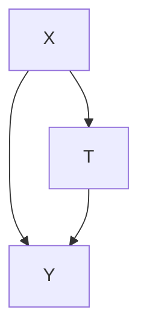

图4.5：简单的因果结构，其中X混杂了T对Y的效应，并且X是唯一的混杂因子。

为了完善这个例子，假设T是一个二元随机变量，我们想要计算ATE。$P(y \mid do(T = 1))$ 是 $Y(1)$ 的分布，因此我们可以直接取期望得到 $\mathbb{E}[Y(1)]$ 。类似地，我们可以对 $Y(0)$ 做同样的处理。然后，我们可以将ATE写成如下形式：

$$
\mathbb {E} [ Y (1) - Y (0) ] = \sum_ {y} y P (y \mid d o (T = 1)) - \sum_ {y} y P (y \mid d o (T = 0)) \tag {4.10}
$$

然后，如果我们分别将公式4.7代入 $P(y \mid do(T = 1))$ 和 $P(y \mid do(T = 0))$ ，我们就得到了一个完全被识别的ATE。鉴于图4.5中的简单图，我们已经展示了如何在公式4.5到4.7中使用截断分解来识别因果效应。现在，我们将把这个识别过程推广到一个更一般的公式。

## 4.4 后门调整（The Backdoor Adjustment）

回顾第3章的内容，因果关联沿着有向路径从 $T$ 流向 $Y$ ，而非因果关联则沿着从 $T$ 到 $Y$ 的其他任何路径流动，这些路径不会被以下两种情况阻断：1）被条件化了的非碰撞节点（non-collider），或 2）未被条件化了的碰撞节点（collider）。这些从 $T$ 到 $Y$ 的、未被阻断的非有向路径被称为**后门路径（backdoor paths）**，因为它们拥有一条进入 $T$ 节点“后门”的边。事实证明，如果我们能够通过条件化来阻断这些路径，我们就可以识别出诸如 $P(Y \mid do(t))$ 这样的因果量。⁴

这正是我们在上一节中所做的。在图4.5中，我们通过简单地条件化于 $X$ 并将其边缘化（公式4.7），阻断了后门路径 $T \leftarrow X \rightarrow Y$ 。在本节中，我们将把公式4.7推广到任意的**有向无环图（Directed Acyclic Graphs, DAGs）**。但在我们这样做之前，让我们从图形角度考虑一下，为什么量 $P(y \mid do(t))$ 是纯粹因果的。

正如我们在第4.2节中讨论的，**干预分布（interventional distribution）** $P(Y \mid do(t))$ 的图与**观测分布（observational distribution）** $P(Y, T, X)$ 的图相同，但移除了指向 $T$ 的入边。例如，如果我们从图4.5中的图出发，并对 $T$ 进行干预，那么我们就得到了图4.6中的**操纵图（manipulated graph）**。在这个操纵图中，不可能存在任何后门路径，因为没有边进入 $T$ 的后门。因此，在操纵图中从 $T$ 流向 $Y$ 的所有关联都是纯粹因果的。

撇开这个题外话，让我们来证明我们可以识别 $P(y \mid do(t))$ 。我们希望将因果估计量 $P(y \mid do(t))$ 转化为一个统计估计量（仅依赖于观测分布）。我们首先假设我们有一组变量 $W$ 满足**后门准则（backdoor criterion）**：

**定义 4.1（后门准则）** 一组变量 $W$ 相对于 $T$ 和 $Y$ 满足后门准则，如果以下条件成立：

1. $W$ 阻断了所有从 $T$ 到 $Y$ 的后门路径。
2. $W$ 不包含 $T$ 的任何后代节点。

$^{4}$ 正如我们在第3.8节中提到的，阻断所有后门路径等价于在移除了从 $T$ 出发的边的图中实现 d-分离。这是因为这些是因果关联流动的唯一路径，因此一旦它们被移除，剩下的就只是非因果关联。


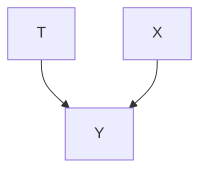

**图 4.6：** 当原始图为图4.5时，对 $T$ 进行干预所产生的操纵图。

$^{5}$ 主动阅读练习：在一个一般的DAG中，与 $T$ 相关的哪一组节点总是构成一个充分的调整集？与 $Y$ 相关的哪一组节点总是构成一个充分的调整集？

满足后门准则使得 $W$ 成为一个**充分的调整集（sufficient adjustment set）**。 $^{5}$ 我们在第4.3.1节中看到了 $X$ 作为充分调整集的一个例子。因为在第4.3.1节中只有一个后门路径，所以单个节点（ $X$ ）就足以阻断所有后门路径，但是，在一般情况下，可能存在多个后门路径。

为了将 $W$ 引入证明，我们将使用通常的技巧，即条件化于变量并将其边缘化：

$$
P (y \mid d o (t)) = \sum_ {w} P (y \mid d o (t), w) P (w \mid d o (t)) \tag {4.11}
$$

鉴于 $W$ 满足后门准则，我们可以写出以下等式：

$$
\sum_ {w} P (y \mid d o (t), w) P (w \mid d o (t)) = \sum_ {w} P (y \mid t, w) P (w \mid d o (t)) \tag {4.12}
$$

这源于**模块性假设（modularity assumption）**（假设4.1）。如果 $W$ 是 $Y$ 的所有父节点（除了 $T$ ），那么很明显，模块性假设直接蕴含 $P(y \mid do(t), w) = P(y \mid t, w)$ 。如果 $W$ 不是 $Y$ 的父节点，但通过其他方式仍然阻断了所有后门路径，那么这个等式仍然成立，但需要使用我们在第3章中建立的图形知识。

在操纵图中（对于 $P(y \mid do(t), w)$ ），所有 $T$ - $Y$ 关联都沿着从 $T$ 到 $Y$ 的有向路径流动，因为 $T$ 没有入边，所以不可能存在任何后门路径。类似地，在常规图中（对于 $P(y \mid t, w)$ ），所有 $T$ - $Y$ 关联都沿着从 $T$ 到 $Y$ 的有向路径流动。这是因为，尽管存在后门路径，但沿着它们流动的关联会被 $W$ 阻断，从而使得关联只能沿着有向路径流动。在这两种情况下，关联都沿着完全相同的、对应于完全相同条件分布（根据模块性假设）的有向路径流动。

尽管我们已经证明了公式4.12，但在表达式 $P(w \mid do(t))$ 中仍然存在一个 $do$ 。然而， $P(w \mid do(t)) = P(w)$ 。要理解这一点，请考虑在操纵图中 $T$ 如何可能影响 $W$ 。它不可能通过任何包含进入 $T$ 的边的路径，因为在操纵图中 $T$ 没有任何入边。它也不可能通过任何包含从 $T$ 出发的边的路径，因为这样的路径上必然存在一个未被条件化的碰撞节点。我们知道任何这样的碰撞节点都没有被条件化，因为我们假设 $W$ 不包含 $T$ 的后代节点（后门准则的第二部分）。 $^{6}$ 因此，我们可以写出最后一步：

$$
\sum_ {w} P (y \mid t, w) P (w \mid d o (t)) = \sum_ {w} P (y \mid t, w) P (w) \tag {4.13}
$$

这就是所谓的**后门调整（backdoor adjustment）**。

**定理 4.2（后门调整）** 给定模块性假设（假设4.1）， $W$ 满足后门准则（定义4.1），以及**积极性（positivity）**（假设2.3），我们可以识别 $T$ 对 $Y$ 的因果效应：

$$
P (y \mid d o (t)) = \sum_ {w} P (y \mid t, w) P (w)
$$

以下是证明（公式4.11至4.13）的简明总结，省略了所有解释/论证：

**证明。**

$$
\begin{array}{l} P (y \mid d o (t)) = \sum_ {w} P (y \mid d o (t), w) P (w \mid d o (t)) (4.14) \\ = \sum_ {w} P (y \mid t, w) P (w \mid d o (t)) (4.15) \\ = \sum_ {w} P (y \mid t, w) P (w) (4.16) \\ \end{array}
$$


**与 d-分离的关系** 如果 $W$ 在操纵图中 d-分离了 $T$ 和 $Y$ ，我们可以使用后门调整。回想第3.8节，我们提到，如果 $T$ 在操纵图中与 $Y$ d-分离，我们就能够隔离因果关联。“隔离因果关联”就是识别。如果在操纵图中，条件于 $W$ ， $Y$ 与 $T$ d-分离，我们也可以隔离因果关联。这就是后门准则第一部分的内容，也是我们在后门调整中编码的内容。

## 4.4.1 与潜在结果的关系（Relation to Potential Outcomes）

嗯，后门调整（定理4.2）看起来与我们在**潜在结果（potential outcomes）**章节中看到的**调整公式（adjustment formula）**（定理2.1）非常相似：

$$
\mathbb {E} [ Y (1) - Y (0) ] = \mathbb {E} _ {W} \left[ \mathbb {E} [ Y \mid T = 1, W ] - \mathbb {E} [ Y \mid T = 0, W ] \right] \tag {4.17}
$$

我们可以通过几个步骤从更一般的后门调整推导出这个公式。首先，我们对 $Y$ 取期望：

$$
\mathbb {E} [ Y \mid d o (t) ] = \sum_ {w} \mathbb {E} [ Y \mid t, w ] P (w) \tag {4.18}
$$

然后，我们注意到对 $w$ 的求和以及 $P(w)$ 是一个期望（对于离散的 $w$ ，但如果是连续的，只需用积分替换）：

$$
\mathbb {E} [ Y \mid d o (t) ] = \mathbb {E} _ {W} \mathbb {E} [ Y \mid t, W ] \tag {4.19}
$$

最后，我们考察 $T = 1$ 和 $T = 0$ 之间的差异：

$$
\mathbb {E} [ Y \mid d o (T = 1) ] - \mathbb {E} [ Y \mid d o (T = 0) ] = \mathbb {E} _ {W} \left[ \mathbb {E} [ Y \mid T = 1, W ] - \mathbb {E} [ Y \mid T = 0, W ] \right] \tag {4.20}
$$

由于 $do$ -记号 $\mathbb{E}[Y \mid do(t)]$ 只是潜在结果 $\mathbb{E}[Y(t)]$ 的另一种表示，我们就完成了推导！如果你还记得，要得到公式4.17（定理2.1），我们需要的主要假设之一是**条件可交换性（conditional exchangeability）**（假设2.2），我们在下面重复该假设：

$$
(Y (1), Y (0)) \perp T \mid W \tag {4.21}
$$

然而，我们之前无从知晓如何选择 $W$ ，或者知道那个 $W$ 实际上给了我们条件可交换性。那么，通过使用**图形因果模型（graphical causal models）**，我们知道了如何选择一个有效的 $W$ ：我们只需选择 $W$ 使其满足后门准则。然后，在因果图所编码的假设下，可以证明条件可交换性成立；因果效应是可识别的。

## 4.5 结构因果模型（Structural Causal Models, SCMs）

诸如**因果贝叶斯网络（causal Bayesian networks）** 这样的图形因果模型为我们提供了编码统计和因果假设的强大方法，但我们尚未精确解释干预是什么，或者因果机制是什么。从因果贝叶斯网络转向完整的结构因果模型将为我们提供这种额外的清晰性，以及计算**反事实（counterfactuals）**的能力。

## 4.5.1 结构方程（Structural Equations）

正如**朱迪亚·珀尔（Judea Pearl）** 常说的，数学中的等号不传达任何因果信息。说 $A = B$ 和说 $B = A$ 是一样的。等式是对称的。然而，为了讨论因果关系，我们必须有某种不对称的东西。我们需要能够写出 $A$ 是 $B$ 的一个原因，这意味着改变 $A$ 会导致 $B$ 的改变，但改变 $B$ 不会导致 $A$ 的改变。这就是我们在写下以下**结构方程（structural equation）** 时所得到的：

$$
B := f (A), \tag {4.22}
$$

其中 $f$ 是将 $A$ 映射到 $B$ 的某个函数。虽然通常的“=”符号不给我们因果信息，但这个新的“:=”符号却给了我们。这是我们从统计模型转向因果模型时看到的一个主要区别。现在，我们有了描述因果关系所需的不对称性。然而， $A$ 和 $B$ 之间的映射是确定性的。理想情况下，我们希望它可以是概率性的，这为 $B$ 的一些未知原因留出了空间，这些原因会影响这个映射。那么，我们可以写出以下方程：

$$
B := f (A, U), \tag {4.23}
$$

其中 $U$ 是某个未观测到的随机变量。我们在图4.7中描绘了这一点，其中 $U$ 被画在一个虚线节点内，以表示它是未观测到的。未观测到的 $U$ 类似于我们通过对样本单元（个体）进行抽样所看到的随机性；它表示决定 $B$ 的所有相关的（有噪声的）背景条件。更具体地说，潜在结果 $Y_{i}(t)$ 的每个部分都有类似物： $B$ 类似于 $Y$ ， $A = a$ 类似于 $T = t$ ， $U$ 类似于 $i$ 。

$f$ 的函数形式不需要指定，当未指定时，我们就处于**非参数（nonparametric）** 框架中，因为我们没有对参数形式做任何假设。尽管映射是确定性的，但由于它接受一个随机变量 $U$ （一个“噪声”或“背景条件”变量）作为输入，它可以表示任何随机映射，因此结构方程推广了我们在本章中一直使用的概率因子 $P(x_{i} \mid \text{pa}_{i})$ 。因此，我们所见过的所有结果，如**截断因子分解（truncated factorization）** 和后门调整，在引入结构方程时仍然成立。


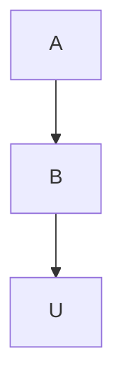

**图 4.7：** 简单结构方程的图。虚线节点 $U$ 表示 $U$ 是未观测到的。

**重新审视原因与因果机制** 我们现在已经得到了关于什么是原因（定义3.2）以及什么是因果机制（在第4.2节中介绍）的更精确的定义。生成一个变量的因果机制就是对应于该变量的结构方程。例如， $B$ 的因果机制就是公式4.23。类似地，如果 $X$ 出现在 $Y$ 的结构方程的右侧，那么 $X$ 是 $Y$ 的一个直接原因。我们说 $X$ 是 $Y$ 的一个原因，如果 $X$ 是 $Y$ 的任何原因的 $^{7}$ 直接原因，或者如果 $X$ 是 $Y$ 的直接原因。

我们在公式4.23中只展示了一个结构方程，但在一个模型中可能存在大量的结构方程，我们通常将其标记为 $M$ 。例如，我们为下图4.8写出结构方程：

$$
B := f _ {B} (A, U _ {B})
$$

$$
M: \quad C := f _ {C} (A, B, U _ {C}) \tag {4.24}
$$

$$
D := f _ {D} (A, C, U _ {D})
$$

在因果图中，噪声变量通常是隐含的，而不是明确画出的。我们为其写出结构方程的变量被称为**内生变量（endogenous variables）**。这些是我们正在建模其因果机制的变量——即在因果图中有父节点的变量。相比之下，**外生变量（exogenous variables）** 是在因果图中没有任何父节点的变量；这些变量对于我们因果模型来说是外部的，因为我们选择不对它们的原因进行建模。例如，在图4.8和公式4.24描述的因果模型中，内生变量是 $\{B, C, D\}$ 。而外生变量是 $\{A, U_{B}, U_{C}, U_{D}\}$ 。

## 定义 4.2（结构因果模型（Structural Causal Model, SCM））一个**结构因果模型**是由以下集合构成的元组：

1. 一组**内生变量（endogenous variables）** $V$  
2. 一组**外生变量（exogenous variables）** $U$  
3. 一组**函数** $f$ ，每个函数用于生成一个内生变量，作为其他变量的函数

例如，上述方程 4.24 中的三个方程构成的集合 M 就是一个 SCM，其对应的因果图如图 4.8 所示。每个 SCM 都隐含一个关联的因果图：对于每个结构方程，从右侧的每个变量向左侧的变量画一条边。

如果因果图不包含环（即是一个 DAG），且**噪声变量（noise variables）** $U$ 是独立的，则该因果模型是**马尔可夫型（Markovian）**；分布 $P$ 相对于该因果图是马尔可夫的。如果因果图不包含环，但噪声项是相关的，则该模型是**半马尔可夫型（semi-Markovian）**。例如，如果存在未观测到的混杂因素，则该模型

$^{7}$ 相信我；递归会终止。基本情况已经指定。


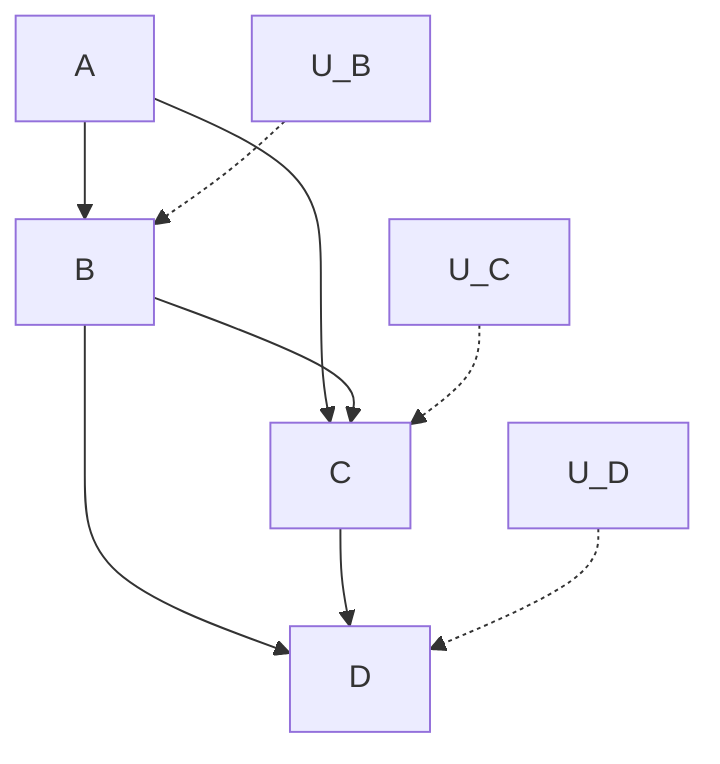

图 4.8：方程 4.24 中结构方程的图。

是半马尔可夫型的。最后，**非马尔可夫型（non-Markovian）** 模型的图包含环。在本书中，我们将主要考虑马尔可夫型和半马尔可夫型模型。

## 4.5.2 干预（Interventions）

SCM 中的干预非常简单。干预 $do(T = t)$ 仅对应将 T 的结构方程替换为 $T := t$ 。例如，考虑以下因果模型 M，其对应的因果图如图 4.9 所示：

$$
M: \quad \begin{array}{l} T := f _ {T} (X, U _ {T}) \\ Y := f _ {Y} (X, T, U _ {Y}) \end{array} \tag {4.25}
$$

如果我们随后对 $T$ 进行干预，将其设为 $t$ ，我们得到以下干预 SCM $M_t$ 以及对应的被操纵图（manipulated graph）如图 4.10 所示。

$$
M _ {t}: \quad \begin{array}{l} T := t \\ Y := f _ {Y} (X, T, U _ {Y}) \end{array} \tag {4.26}
$$

$do(T = t)$ 只改变 T 的方程而不改变其他变量这一事实，是**模块化假设（modularity assumption）** 的结果；这些因果机制（结构方程）是模块化的。假设 4.1 在因果贝叶斯网络（causal Bayesian networks）的背景下阐述了模块化假设，但我们需要为 SCM 对这个假设进行略微不同的转述。

**假设 4.2（SCM 的模块化假设）** 考虑一个 SCM M 和一个通过执行干预 $do(T = t)$ 得到的干预 SCM $M_{t}$ 。模块化假设指出，M 和 $M_{t}$ 共享除 T 的结构方程之外的所有结构方程，而在 $M_{t}$ 中，T 的结构方程为 $T := t$ 。

换句话说，干预 $do(T = t)$ 被局域化到 T。没有其他结构方程发生变化，因为它们是模块化的；因果机制是独立的。SCM 的模块化假设正是给了我们 Pearl 所称的**反事实定律（The Law of Counterfactuals）**，我们在第 4.2 节末尾定义了因果贝叶斯网络的模块化假设之后曾简要提及。但在我们讨论这一点之前，必须先介绍一些新的符号。

在因果推断文献中，有许多不同的方式来表示**单元级潜在结果（unit-level potential outcome）**。在第 2 章中，我们使用了 $Y_{i}(t)$ 。然而，还有其他方式，如 $Y_{i}^{t}$ 甚至 $Y_{t}(u)$ 。例如，Holland [5] 在其著名的潜在结果论文中使用了 $Y_{t}(u)$ 符号。在这种符号中，$u$ 类似于 $i$ ，正如我们提到的方程 4.23 及其后段落中的 $U$ 的情况。这也是 Pearl 在 SCM 中使用的符号 [参见，例如，17，定义 4]。因此，$Y_{t}(u)$ 表示在给定 SCM 为 $M$ 的情况下，单元 $u$ 在接受处理 $t$ 时将观察到的结果。类似地，我们将 $Y_{M_t}(u)$ 定义为在给定 SCM 为 $M_t$ 的情况下，单元 $u$ 在接受处理 $t$ 时将观察到的结果（请记住 $M_t$ 是与 $M$ 相同的 SCM，只是将 $T$ 的结构方程改为 $T := t$ ）。现在，我们准备


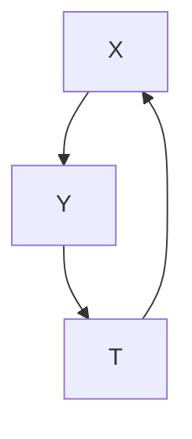

图 4.9：基本因果图


图 4.10：由于干预 $do(T = t)$ ，移除了指向 T 的入边的因果图。

[5]: Holland (1986), 'Statistics and Causal Inference'

[17]: Pearl (2009), 'Causal inference in statistics: An overview'

呈现 Pearl 的两个关键原则之一，所有其他因果结果都源于此：8

**定义 4.3（反事实定律（以及干预））**

$$
Y _ {t} (u) = Y _ {M _ {t}} (u) \tag {4.27}
$$

这被称为“反事实定律”，因为它为我们提供了关于反事实的信息。给定一个 SCM 并指定了足够的细节，我们实际上可以计算反事实。这意义重大，因为这正是**因果推断的基本问题（fundamental problem of causal inference）**（第 2.2 节）告诉我们无法做到的事情。我们将在专门讨论反事实的章节（第 14 章）中进一步讨论如何做到这一点。

## 4.5.3 碰撞偏差（Collider Bias）以及为何不对处理的后续变量（Descendants of Treatment）进行条件化

在定义**后门准则（backdoor criterion）**（定义 4.1）以进行**后门调整（backdoor adjustment）**（定理 4.2）时，我们不仅指定了调整集  阻断了所有后门路径，而且还指定了  不 $𝑊$ 𝑊包含  的任何后续变量。为什么？如果我们对  的后续变量进行条件化，可能会出现两类问题：

1. 我们阻断了从  到  的因果流。  
𝑇 𝑌2. 我们引发了  和  之间的非因果关联。

正如我们将看到的，我们为何希望避免第一类问题是相当直观的。第二类问题则稍微复杂一些，我们将把它分成两个部分，每个部分用单独的段落来阐述。正是这个更复杂的部分，才是我们将此解释推迟到介绍 SCM 之后，而不是在第 4.4 节介绍后门准则/调整时一并给出的原因。

如果我们对位于从  到 $\boldsymbol { Y }$ 的有向路径上的节点进行条件化，那么我们会阻断沿着该因果路径的因果流。我们将位于从  到  的有向路径上的节点称为**中介变量（mediator）**，因为它中介了  对  的影响。例如，在图 4.11 中，所有因果流都被  阻断了。这意味着我们将测量到  和  之间的零关联（假设  阻断了所有后门路径）。在图 4.12 中，只有一部分因果流被  阻断了。这是因为因果关系仍然可以沿着 $T  Y$ 边流动。在这种情况下，我们将得到  对  的因果效应的非零估计，但由于  阻断了部分因果流，该估计仍然是有偏的。

如果我们对  的一个非中介变量的后续变量进行条件化，它可能会打开一条由碰撞变量（collider）阻断的从  到  的路径。例如，在图 4.13 中对  进行条件化就是这种情况。这引发了  和  之间的非因果关联，从而使得对因果效应的估计产生偏差。考虑以下一般类型的路径，其中 → · · · → 表示一条有向路径：$T \to \cdots \to Z  \cdot \cdot \cdot  Y$ 。对 $Z$ 或此类路径中 $Z$ 的任何后续变量进行条件化，将引发碰撞偏差。也就是说，当我们对  或其任何后续变量进行条件化时，所引发的非因果关联会使因果效应估计产生偏差（参见第 3.6 节）。

8 主动阅读练习：你能回忆起另一个关键原则/假设是什么吗？

主动阅读练习：利用你现在关于结构方程的知识，将其与本章的其他部分联系起来。例如，结构方程中的干预如何与模块化假设相关联？SCM 的模块化假设（假设 4.2）与因果贝叶斯网络中的模块化假设（假设 4.1）有何关系？SCM 的模块化假设是否仍然为我们提供了后门调整？


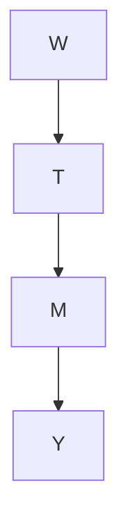

图 4.11：通过对  进行条件化阻断所有因果流的因果图。


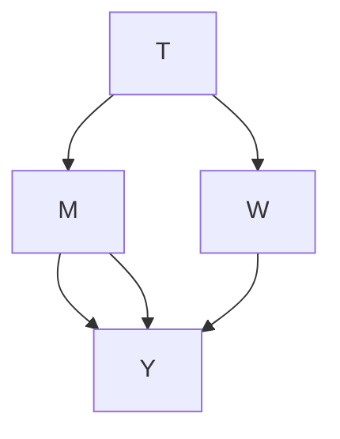

图 4.12：通过对  进行条件化阻断部分因果流的因果图。


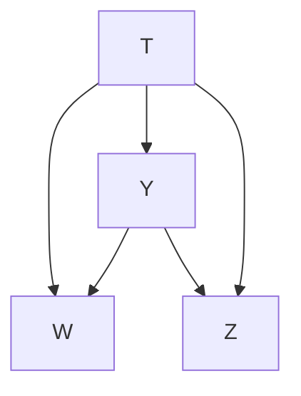

图 4.13：对碰撞变量进行条件化引发偏差的因果图。

那么，对图 4.14 中的  进行条件化呢？这会引发偏差吗？回忆一下，在绘制图形时常常不明确画出噪声变量。如果我们放大图形的部分，将  的噪声变量明确表示出来，我们得到图 4.15。现在，我们看到 $T \right. M \left. U _ { M }$ 形成了一个**不道德结构（immorality）**。因此，对 $Z$ 进行条件化会引发  和 $U _ { M }$ 之间的关联。这种引发的非因果关联是碰撞偏差的另一种形式。你可能会觉得这并不令人满意，因为  并不是这里不道德结构的父节点； 和 $U _ { M }$ 才是过着不道德生活的变量。那么为什么这会改变  和  之间的关联呢？获得直观理解的一种方式是，现在通过边 $T  M$ 在  和 $U _ { M }$ 之间引发了关联流，而 $T  M$ 也是因果关联流经的边。你可以认为这两种关联沿着 $T  M$ 边纠缠在一起，使得观测到的  和  之间的关联并非纯粹因果关系。关于此主题的更多信息，请参见 Pearl [18，第 11.3.1 和 11.3.3 节]。

请注意，我们实际上可以对  的某些后续变量进行条件化，而不会在  和  之间引发非因果关联。例如，对不在任何通向  的因果路径上的  的后续变量进行条件化不会引发偏差。然而，从上一段可以看出，这可能会变得有点棘手，因此最安全的方法就是按照后门准则的规定，不对  的任何后续变量进行条件化。即使在图形因果模型之外（例如在潜在结果文献中），这条规则也经常被应用；它通常被描述为不对任何**处理后的协变量（post-treatment covariates）**进行条件化。

**M-偏差（M-Bias）** 不幸的是，即使我们只对处理前的协变量进行条件化，我们仍然可能引发碰撞偏差。考虑如果我们对图 4.16 中的碰撞变量 $Z _ { 2 }$ 进行条件化会发生什么。这样做打开了一条后门路径，非因果关联可以沿着该路径流动。这被称为 M-偏差，因为当图形按照子节点位于父节点下方的方式绘制时，这种非因果关联沿着的路径呈 M 形。关于碰撞偏差的许多例子，请参见 Elwert 和 Winship [19]。

## 4.6 后门调整的应用示例（Example Applications of the Backdoor Adjustment）

## 4.6.1 关联性与因果性：一个玩具示例（Association vs. Causation in a Toy Example）

在本节中，我们假设一个**玩具生成过程（toy generative process）**，并推导**关联量（associational quantity）** $\mathbb{E}[Y \mid t]$ 的偏差。我们将其与**因果量（causal quantity）** $\mathbb{E}[Y \mid do(t)]$ 进行比较，后者能精确给出我们想要的结果。注意，这两个量实际上都是 $t$ 的函数。如果处理变量是二元的，那么我们只需比较 $T=1$ 和 $T=0$ 时这两个量的差值。然而，由于我们的生成过程是线性的，$\frac{d\mathbb{E}[Y \mid t]}{dt}$ 和 $\frac{d\mathbb{E}[Y \mid do(t)]}{dt}$ 实际上提供了关于处理效应的所有信息，无论处理变量是连续的、二元的还是多值的。我们将假设拥有无限数据，以便使用期望进行计算。这意味着本节与估计无关；关于估计，请参见下一节。

我们考虑的生成过程具有图 4.17 中的因果图。


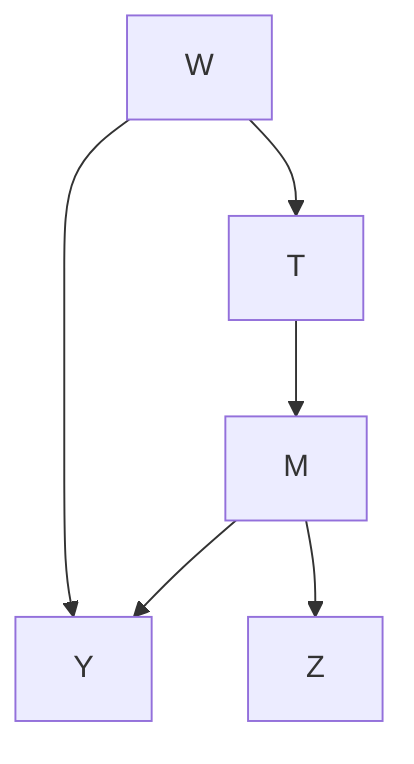

**图 4.14：** 以中介变量的子节点为条件的因果图。


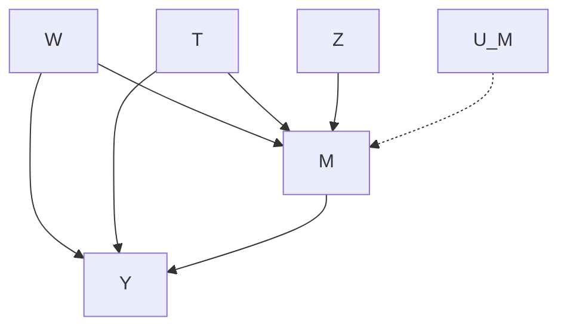

**图 4.15：** 以中介变量的子节点为条件的放大因果图。


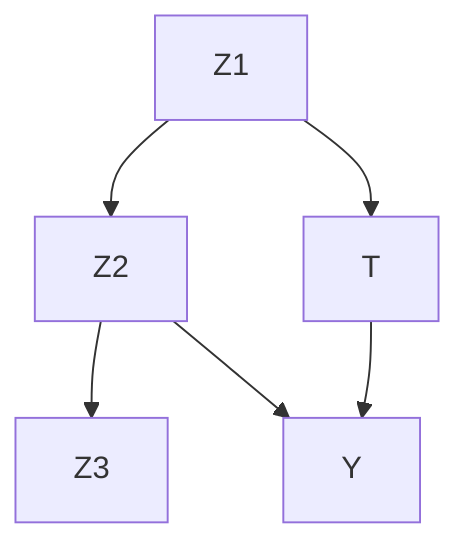

**图 4.16：** 描述 M-偏倚（M-Bias）的因果图。

以及以下结构方程：

$$
T := \alpha_ {1} X \tag {4.28}
$$

$$
Y := \beta T + \alpha_ {2} X. \tag {4.29}
$$

注意，在 $Y$ 的结构方程中，$\beta$ 是 $T$ 前面的系数。这意味着 $T$ 对 $Y$ 的因果效应是 $\beta$。在进行这些计算时，请牢记这一点。

从图 4.17 的因果图中，我们可以看出 $X$ 是一个**充分调整集（sufficient adjustment set）**。因此，$\mathbb{E}[Y \mid do(t)] = \mathbb{E}_X \mathbb{E}[Y \mid t, X]$。让我们计算这个量在本示例中的值。

$$
\mathbb{E}_X \mathbb{E}[Y \mid t, X] = \mathbb{E}_X \left[ \mathbb{E}[ \beta T + \alpha_ {2} X \mid T = t, X] \right] \tag {4.30}
$$

$$
= \mathbb{E}_X [ \beta t + \alpha_ {2} X ] \tag {4.31}
$$

$$
= \beta t + \alpha_ {2} \mathbb{E}[X] \tag {4.32}
$$

重要的是，我们在公式 4.30 中利用了 $Y$ 的结构方程（公式 4.29）给出的等式。现在，我们只需计算导数即可得到因果效应：

$$
\frac{d\mathbb{E}_X \mathbb{E}[Y \mid t, X]}{dt} = \beta. \tag {4.33}
$$

我们得到了我们想要的确切结果。现在，让我们转向关联量：

$$
\mathbb{E}[Y \mid T = t] = \mathbb{E}[ \beta T + \alpha_ {2} X \mid T = t] \tag {4.34}
$$

$$
= \beta t + \alpha_ {2} \mathbb{E}[X \mid T = t] \tag {4.35}
$$

$$
= \beta t + \frac{\alpha_ {2}}{\alpha_ {1}} t \tag {4.36}
$$

在公式 4.36 中，我们利用了 $T$ 的结构方程（公式 4.28）给出的等式。然后，如果我们计算导数，就会发现存在**混杂偏倚（confounding bias）**：

$$
\frac{d\mathbb{E}[Y \mid t]}{dt} = \beta + \frac{\alpha_ {2}}{\alpha_ {1}}. \tag {4.37}
$$

总结一下，$\mathbb{E}_X \mathbb{E}[Y \mid t, X]$ 给出了我们寻找的因果效应（公式 4.33），而关联量 $\mathbb{E}[Y \mid t]$ 则没有（公式 4.37）。现在，让我们看一个也考虑了估计的示例。

## 4.6.2 包含估计的完整示例（A Complete Example with Estimation）

回顾一下，我们在第 2.5 节中估计了钠摄入量对血压的因果效应的一个具体值。在那里，我们使用了**潜在结果框架（potential outcomes framework）**。在这里，我们将做同样的事情，但使用因果图。剧透一下：我们在第 2.5 节中看到的 19% 的误差是由于以**碰撞子（collider）** 为条件导致的。

首先，我们需要根据因果图写出我们的因果假设。请记住，在 Luque-Fernandez 等人 [8] 的流行病学示例中，处理变量 $T$ 是钠摄入量，结果变量 $Y$ 是血压。协变量是年龄 $W$ 和尿蛋白量 $Z$（蛋白尿）。年龄是血压和身体自我调节钠水平能力的共同原因。相反，高尿蛋白量是由高血压和高钠摄入引起的。这意味着蛋白尿是一个碰撞子。我们在图 4.18 中描绘了这个因果图。

因为 $Z$ 是一个碰撞子，以它为条件会引入偏倚。由于 $W$ 和 $Z$ 在第 2.5 节中被归为“协变量”，我们对它们全部进行了条件调整。这就是为什么我们看到我们的估计值与真实因果效应 1.05 有 19% 的偏差。现在我们已经用因果图明确了因果关系，**后门准则（backdoor criterion）**（定义 4.1）告诉我们只调整 $W$，而不调整 $Z$。更准确地说，我们在第 2.5 节中做了以下调整：

$$
\mathbb{E}_{W, Z} \mathbb{E}[Y \mid t, W, Z] \tag {4.38}
$$

现在，我们将使用**后门调整（backdoor adjustment）**（定理 4.2）将我们的**统计估计量（statistical estimand）** 改为以下形式：

$$
\mathbb{E}_{W} \mathbb{E}[Y \mid t, W] \tag {4.39}
$$

我们只是简单地将碰撞子 $Z$ 从我们调整的变量集中移除。对于估计，正如我们在第 2.5 节中所做的那样，我们使用一个**模型辅助估计量（model-assisted estimator）**。我们将关于 $W$ 的外层期望替换为关于 $W$ 的经验均值，并将条件期望 $\mathbb{E}[Y \mid t, W]$ 替换为一个机器学习模型（本例中为线性回归）。

正如写下因果图导致我们在公式 4.39 中简单地不对 $Z$ 进行条件调整一样，用于估计的代码也几乎没有变化。我们需要在我们之前的程序（代码清单 2.1）中只更改一行代码。我们在下面展示了包含已修正代码行的完整程序：

```python
import numpy as np
import pandas as pd
from sklearn.linear_model import LinearRegression

Xt = df[['sodium', 'age']]
y = df['blood_pressure']
model = LinearRegression()
model.fit(Xt, y)

Xt1 = pd.DataFrame.copy(Xt)
Xt1['sodium'] = 1
Xt0 = pd.DataFrame.copy(Xt)
Xt0['sodium'] = 0
ate_est = np.mean(model.predict(Xt1) - model.predict(Xt0))
print('ATE estimate:', ate_est)
```

也就是说，我们将代码清单 2.1 中的第 5 行从

```txt
5 | Xt = df[['sodium', 'age', 'proteinuria']]
```

改为代码清单 4.1 中的

```txt
5 | Xt = df[['sodium', 'age']]
```

当我们运行这个修改后的代码时，我们得到的 ATE 估计值为 1.0502，在使用相当大的样本时，这对应于 0.02% 的误差（真实值为 1.05）。


**图 4.18：** 血压示例的因果图。$T$ 是钠摄入量。$Y$ 是血压。$W$ 是年龄。重要的是，尿液中排出的蛋白量是一个碰撞子。

**代码清单 4.1：** 用于估计 ATE 的 Python 代码，未对碰撞子进行调整

包含模拟的完整代码可在 https://github.com/bradyneal/causal-book-code/blob/master/sodium_example.py 获取。

**偏倚减少的进展** 当我们仅通过将 $Y$ 对 $T$ 进行回归来观察 $T$ 和 $Y$ 之间的总关联时，我们得到的估计值与真实因果效应相比惊人地偏离了 407%，这主要是由于混杂偏倚（参见第 2.5 节）。当我们在第 2.5 节中调整所有协变量时，我们将百分比误差降低到了 19%。在本节中，我们看到剩余误差是由于碰撞子偏倚导致的。当我们通过不对碰撞子 $Z$ 进行条件调整来消除碰撞子偏倚时，误差就消失了。

**潜在结果与 M-偏倚** 公平地说，在潜在结果框架的普遍文化中，通常只对**处理前协变量（pretreatment covariates）** 进行条件调整。这将防止遵循此规则的研究者以图 4.18 中的碰撞子 $Z$ 为条件。然而，没有理由认为不存在可能导致 **M-偏倚（M-bias）**（第 4.5.3 节）的处理前碰撞子。在图 4.19 中，我们描绘了一个由以 $Z_2$ 为条件而产生的 M-偏倚示例。我们可以通过额外以 $Z_1$ 和/或 $Z_3$ 为条件来解决这个问题，但在这个例子中，它们是未观测到的（由虚线表示）。这意味着避免图 4.19 中 M-偏倚的唯一方法是**不以协变量 $Z_2$ 为条件**。

9 主动阅读练习：鉴于 $Y$ 是 $T$ 和 $W$ 的线性函数生成的，我们是否可以直接使用线性回归中 $T$ 前面的系数作为因果效应的估计？


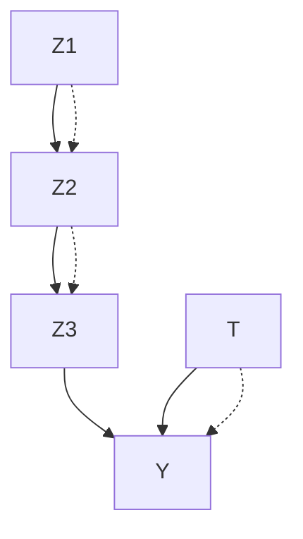

**图 4.19：** 描述 M-偏倚的因果图，只能通过不以碰撞子 $Z_2$ 为条件来避免。这是因为虚线节点 $Z_1$ 和 $Z_3$ 是未观测到的。

## 4.7 重新审视假设（Assumptions Revisited）

第一组主要假设由我们写下的因果图编码。这个因果图的确切含义由两个主要假设决定，每个假设都可以采取几种不同的形式：

## 1. 模块性假设（The Modularity Assumption）

不同形式：

I 因果贝叶斯网络的模块性假设（假设 4.1）  
I 结构因果模型的模块性假设（假设 4.2）  
I 反事实法则（定义 4.3）

## 2. 马尔可夫假设（The Markov Assumption）

不同等价形式：

I 局部马尔可夫假设（假设 3.1）  
I 贝叶斯网络分解（定义 3.1）  
I 全局马尔可夫假设（定理 3.1）

给定这两个假设（以及**积极性（positivity）**），如果在我们假设的因果图中满足后门准则（定义 4.1），那么我们就得到了**可识别性（identification）**。注意，尽管后门准则是可识别性的充分条件，但它不是必要条件。我们将在第 6 章中进一步看到这一点。

**更正式的说法** 如果你真的对花哨的形式主义感兴趣，可以查阅一些相关文献。你可以在 [20, 21] 中看到构成反事实法则基础的公理，或者如果你想要教科书，可以在 [18, 第 7.3 章] 中找到它们。要查看马尔可夫假设所有三种形式等价性的证明，请参见例如 [13, 第 3 章]。

既然你已经熟悉了**因果图模型（causal graphical models）** 和**结构因果模型（Structural Causal Models, SCMs）**，那么或许值得回过头去重读第 2 章，同时尝试与你在这两章中学到的关于图形化因果模型的知识建立联系。

[20]: Galles and Pearl (1998), ‘An Axiomatic Characterization of Causal Counterfactuals’  
[21]: Halpern (1998), ‘Axiomatizing Causal Reasoning’  
[18]: Pearl (2009), Causality  
[13]: Koller and Friedman (2009), Probabilistic Graphical Models: Principles and Techniques

**与无干扰、一致性和积极性的联系** **无干扰假设（no interference assumption）**（假设 2.4）通常在因果图中是隐含的，因为结果变量 $Y$（想想 $Y_i$）通常只有一个处理节点 $T$（想想 $T_i$）作为父节点，而不是有多个处理节点 $T_i, T_{i-1}, T_{i+1}$ 等作为父节点。然而，因果有向无环图可以扩展到存在干扰的情况 [22]。**一致性（consistency）**（假设 2.5）源自 SCM 的公理（参见 [18, 推论 7.3.2] 和 [23]）。**积极性（positivity）**（假设 2.3）仍然是我们必须做出的一个非常重要的假设，尽管它在图模型文献中有时被忽略。

[22]: Ogburn and VanderWeele (2014), ‘Causal Diagrams for Interference’  
[18]: Pearl (2009), Causality  
[23]: Pearl (2010), ‘On the consistency rule in causal inference: axiom, definition, assumption, or theorem?’