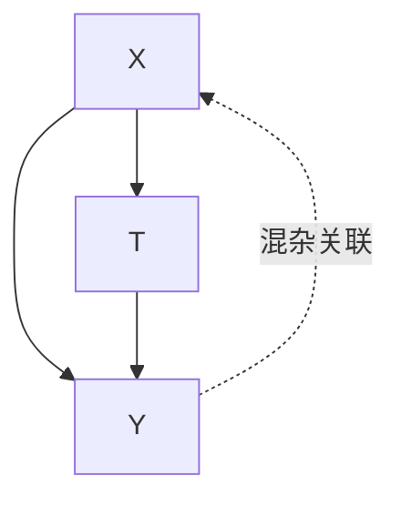
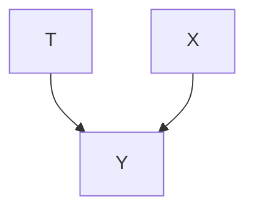

# 随机化实验（Randomized Experiments）

**随机化实验**与**观察性研究（observational studies）**有着显著区别。在随机化实验中，实验者对**处理分配机制（treatment assignment mechanism）**（即处理如何被分配）拥有完全控制权。例如，在最简单的随机化实验中，实验者通过随机方式（如抛硬币）将每位参与者分配到**处理组（treatment group）**或**对照组（control group）**。这种对处理选择方式的完全控制，正是随机化实验区别于观察性研究的关键所在。在这种简单的实验设置中，处理完全不是协变量的函数！相比之下，在观察性研究中，处理几乎总是某些协变量的函数。正如我们将看到的，这一差异是判断数据中是否存在**混杂（confounding）**的关键。

在随机化实验中，**关联即因果（association is causation）**。这是因为随机化实验的特殊性在于，它们保证了不存在混杂。因此，我们可以通过关联性差异 $\mathbb { E } [ Y \mid T = 1 ] - \mathbb { E } [ Y \mid T = 0 ]$ 来度量因果效应 $\mathbb { E } [ Y ( 1 ) ] { - } \mathbb { E } [ Y ( 0 ) ]$ 。在接下来的部分中，我们将从不同视角解释为何如此。如果其中任何一种解释对你而言易于理解，那就足够了。请务必坚持阅读到第 5.3 节中最为直观的解释。

## 5.1 可比性与协变量平衡（Comparability and Covariate Balance）

理想情况下，处理组和对照组除了处理之外，在所有方面都应相同。这意味着它们仅在所接受的处理上存在差异（即它们是**可比的（comparable）**）。这将使我们能够将处理组和对照组结果中的任何差异归因于处理。说这些处理组在处理和结果之外的其他方面完全相同，等价于说它们具有相同的**混杂因子（confounders）**分布。由于人们经常在观测变量上检查这一性质（这通常就是人们所说的“协变量”），这一概念被称为**协变量平衡（covariate balance）**。

**定义 5.1（协变量平衡，Covariate Balance）** 如果协变量 $X$ 在不同处理组中的分布相同，则称我们具有协变量平衡。更正式地，

$$
P (X \mid T = 1) \stackrel {d} {=} P (X \mid T = 0) \tag {5.1}
$$

随机化意味着所有协变量（甚至包括未观测到的协变量）都具有协变量平衡。直观上，这是因为处理是随机选择的，与 $X$ 无关，因此处理组和对照组看起来非常相似。证明很简单。由于 $T$ 完全不由 $X$ 决定（仅由抛硬币决定），因此 $T$ 与 $X$ 独立。这意味着

5.1 可比性与协变量平衡（Comparability and Covariate Balance） . . . . . . . . . . 49  
5.2 可交换性（Exchangeability） . . . . . . . 50  
5.3 无后门路径（No Backdoor Paths） . . . . . . 51

符号 $\underline { { \underline { { d } } } }$ 表示“依分布相等”。$P ( X \mid T = 1 ) { \overset { d } { = } } P ( X )$ 。类似地，它意味着 $P ( X \mid T = 0 ) { \overset { d } { = } } P ( X )$ 。因此，我们有 $P ( X \mid T = 1 ) { \overset { d } { = } } P ( X \mid T = 0 )$ 。

虽然我们已经证明了随机化意味着协变量平衡，但我们尚未证明协变量平衡意味着关联即因果。¹ 现在，我们将通过证明 $P ( y \mid d o ( t ) ) = P ( y \mid t )$ 来证明这一点。在证明中，我们利用的主要性质是协变量平衡意味着 $T$ 和 $X$ 是独立的。

**证明**。首先，令 $X$ 为一个**充分调整集（sufficient adjustment set）**，它可能包含未观测到的变量（随机化也能平衡未观测到的协变量）。这样的调整集必然存在，因为我们允许它包含任何变量（无论是观测到的还是未观测到的）。然后，根据**后门调整（backdoor adjustment）**（定理 4.2），我们得到：

$$
P (y \mid d o (t)) = \sum_ {x} P (y \mid t, x) P (x) \tag {5.2}
$$

通过乘以 $\frac { P ( t | x ) } { P ( t | x ) }$ ，我们得到分子中的联合分布：

$$
= \sum_ {x} \frac {P (y \mid t , x) P (t \mid x) P (x)}{P (t \mid x)} \tag {5.3}
$$

$$
= \sum_ {x} \frac {P (y , t , x)}{P (t \mid x)} \tag {5.4}
$$

现在，我们利用 $T \perp \!\!\! \perp X$ 这一重要性质：

$$
= \sum_ {x} \frac {P (y , t , x)}{P (t)} \tag {5.5}
$$

应用贝叶斯法则和边缘化，我们得到其余部分：

$$
= \sum_ {x} P (y, x \mid t) \tag {5.6}
$$

$$
= P (y \mid t) \tag {5.7}
$$

¹ 回顾一下，直觉是协变量平衡意味着处理组之间除了处理之外的所有方面都相同，因此处理必然是结果变化的解释。

## 5.2 可交换性（Exchangeability）

**可交换性（Exchangeability）**（假设 2.1）为我们提供了另一个视角，解释为什么随机化使得因果等于关联。为了理解这一点，请考虑以下思想实验。我们通过随机抛硬币来决定个体的处理组分配：如果硬币是正面，我们将该个体分配到处理组 $( T = 1 )$ ；如果硬币是反面，我们将该个体分配到对照组 $( T = 0 )$ 。如果这些组是可交换的，我们可以交换这些组，且平均结果将保持不变。如果我们通过抛硬币来选择分组，这在直觉上是成立的。想象一下，在这个实验中简单地交换“正面”和“反面”的含义。你预计这会改变结果吗？不会。这就是为什么随机化实验能为我们提供可交换性。

回顾第 2.3.2 节，**均值可交换性（mean exchangeability）** 的形式化定义如下：

$$
\mathbb {E} [ Y (1) \mid T = 1 ] = \mathbb {E} [ Y (1) \mid T = 0 ] \tag {5.8}
$$

$$
\mathbb {E} [ Y (0) \mid T = 0 ] = \mathbb {E} [ Y (0) \mid T = 1 ] \tag {5.9}
$$

“交换”指的是从处理组中的 $Y ( 1 )$ 到对照组中的 $Y ( 1 )$（方程 5.8），以及从对照组中的 $Y ( 0 )$ 到处理组中的 $Y ( 0 )$（方程 5.9）。

为了从可交换性的视角理解为什么在随机化实验中关联即因果，请回顾第 2.3.2 节的证明。首先，回顾方程 5.8 意味着其中的两个量都等于边际期望结果 $\mathbb { E } [ Y ( 1 ) ]$ ，类似地，方程 5.9 意味着其中的两个量都等于边际期望结果 $\mathbb { E } [ Y ( 0 ) ]$ 。然后，我们得到以下证明：

$$
\mathbb {E} [ Y (1) ] - \mathbb {E} [ Y (0) ] = \mathbb {E} [ Y (1) \mid T = 1 ] - \mathbb {E} [ Y (0) \mid T = 0 ] \quad (2. 3 \text {  重访})
$$

$$
= \mathbb {E} [ Y \mid T = 1 ] - \mathbb {E} [ Y \mid T = 0 ] \tag {2.4重访}
$$

## 5.3 无后门路径（No Backdoor Paths）

我们将探讨的最后一个视角是**图因果模型（graphical causal models）**，用以理解为什么在随机化实验中关联即因果。在常规的观察性数据中，几乎总是存在混杂。例如，在图 5.1 中，我们看到 $X$ 是 $T$ 对 $Y$ 效应的混杂因子。非因果关联沿着后门路径 $T \gets X \to Y$ 流动。

然而，如果我们随机化 $T$ ，神奇的事情发生了： $T$ 不再有任何因果父节点，如图 5.2 所示。这是因为 $T$ 完全是随机的。它除了抛硬币的输出（或者量子随机数生成器的输出，如果你喜欢这类东西的话）之外，不依赖于任何其他事物。由于 $T$ 没有入边，在随机化下，就不存在后门路径。因此，空集是一个充分的调整集。这意味着所有从 $T$ 流向 $Y$ 的关联都是因果性的。我们可以通过简单地应用后门调整（定理 4.2），对空集进行调整，来识别 $P ( Y \mid d o ( T = t ) )$ ：

$$
P (Y \mid d o (T = t)) = P (Y \mid T = t)
$$

至此，我们结束了对为什么在随机化实验中关联即因果的讨论。希望这三种解释中至少有一种对你来说是直观的，并且易于存储在长期记忆中。

图 5.1：混杂 $T$ 对 $Y$ 效应的因果结构。

图 5.2：当我们随机化处理时的因果结构。