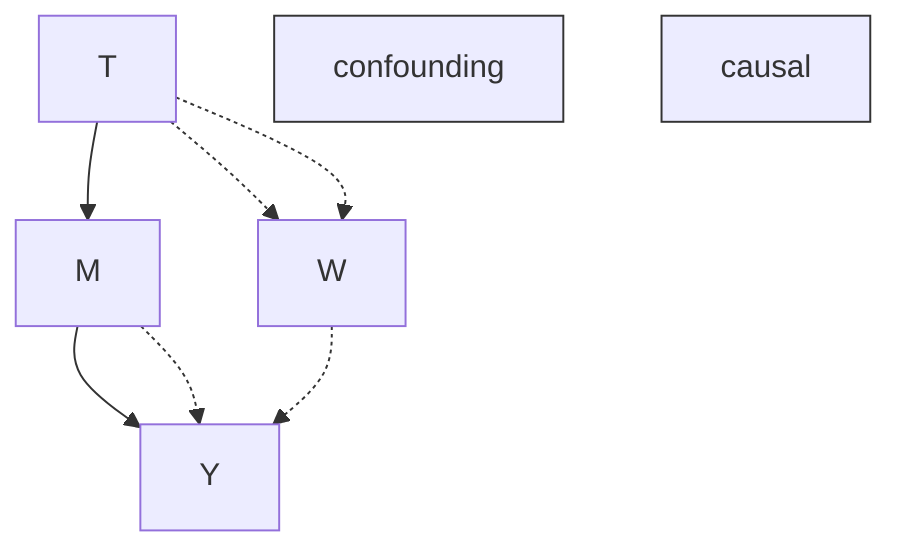
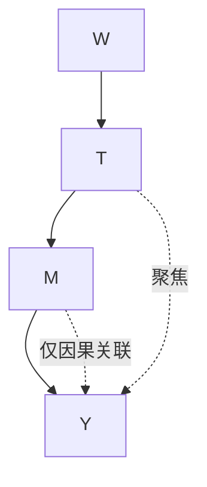
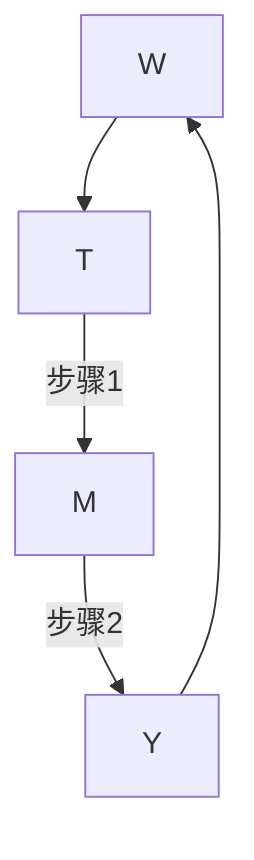
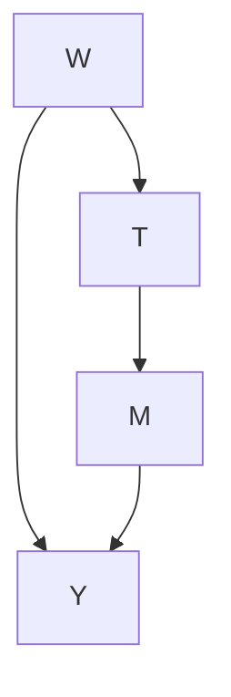
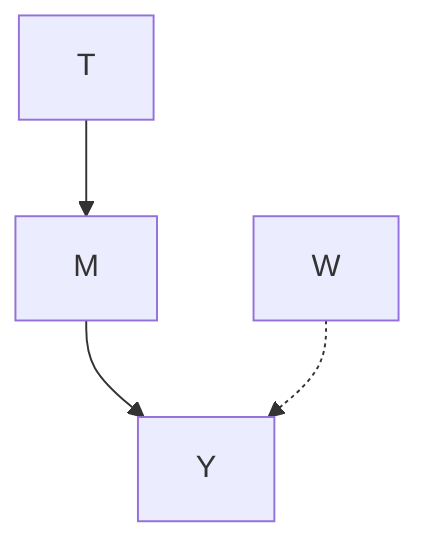
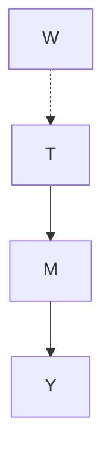
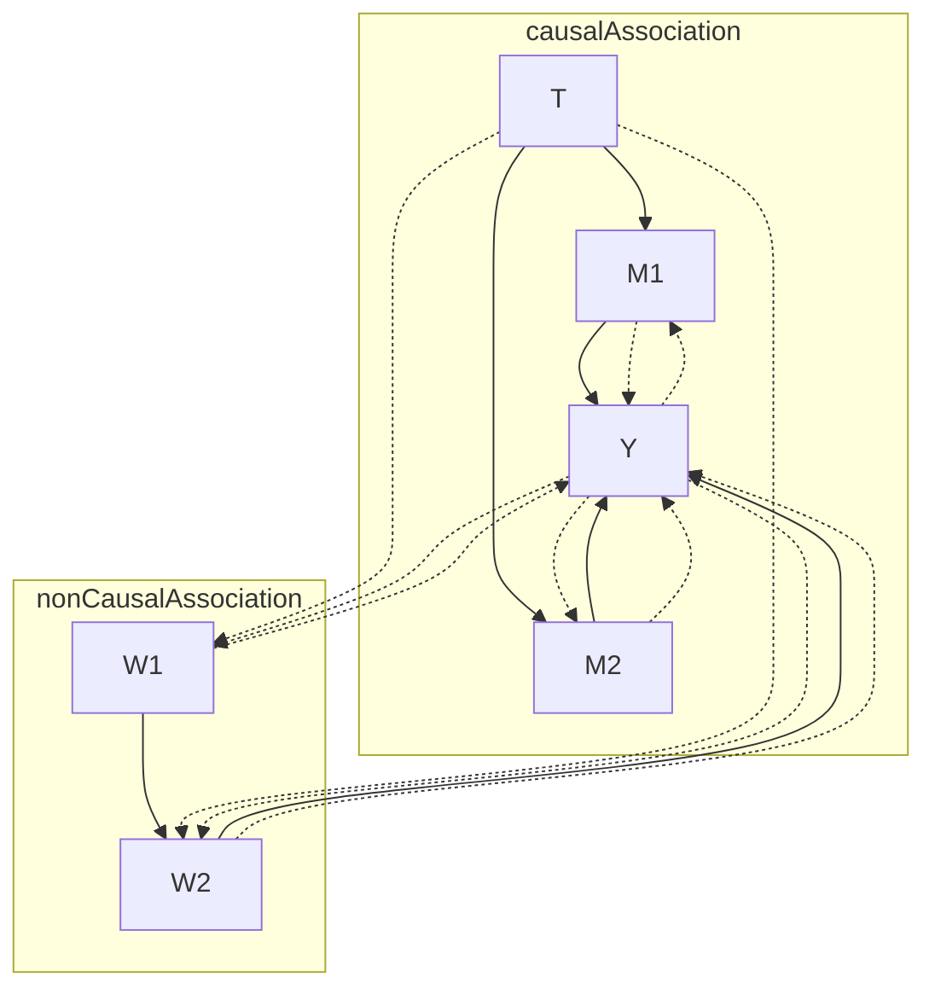
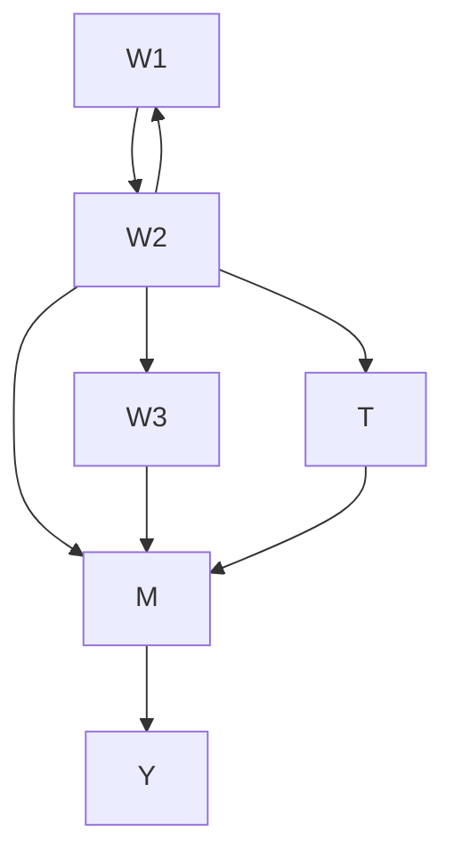
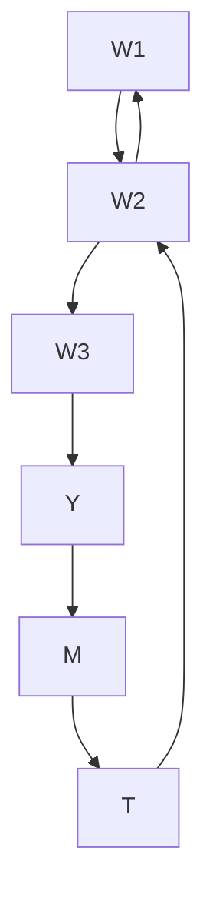

# 非参数识别（Nonparametric Identification）

在第4.4节中，我们看到满足**后门准则（backdoor criterion）**足以实现**可识别性（identifiability）**，但后门准则是否也是必要的？换句话说，是否可能在不阻断所有后门路径的情况下实现可识别性？

例如，考虑我们根据图6.1中的图生成的数据。我们在这组数据中未观测到 $W$，因此无法阻断通过 $W$ 的后门路径以及沿该路径流动的混杂关联。但我们仍然需要识别因果效应。事实证明，使用**前门准则（frontdoor criterion）**可以识别该图中的因果效应。我们将在第6.1节中看到前门准则及相应的调整方法。然后，在第6.2节中引入**do-演算（do-calculus）**时，我们将考虑更一般的识别问题。最后，在第6.3节中，我们将总结可识别性的图论条件。

## 6.1 前门调整（Frontdoor Adjustment）

为什么我们能够识别图6.1中 $T$ 对 $Y$ 的因果效应（即使由于 $W$ 未观测而无法对混杂因素进行调整）？其高层次直觉如下：像 $M$ 这样的**中介变量（mediator）**非常有帮助；通过将统计分析聚焦于 $M$，我们可以分离出通过 $M$ 流动的关联，而通过 $M$ 流动的唯一关联就是因果关联（沿 $T$ 到 $Y$ 的有向路径流动的关联）。我们在图6.2中说明了这一直觉，其中仅描绘了因果关联。在本节中，我们将通过一个三步程序（对应的说明如图6.3所示）将分析聚焦于 $M$：

1. 识别 $T$ 对 $M$ 的因果效应。
2. 识别 $M$ 对 $Y$ 的因果效应。
3. 结合上述步骤，识别 $T$ 对 $Y$ 的因果效应。

**步骤1** 首先，我们将识别 $T$ 对 $M \colon P ( m \mid d o ( t ) )$ 的效应。由于 $W$ 是 $T - M$ 路径上的**对撞子（collider）**，它阻断了那条后门路径。因此，从 $T$ 到 $M$ 不存在未阻断的后门路径。这意味着从 $T$ 流向 $M$ 的唯一关联就是沿连接它们的边流动的因果关联。因此，通过后门调整（定理4.2，使用空集作为调整集），我们得到以下识别结果：1

$$
P (m \mid d o (t)) = P (m \mid t) \tag {6.1}
$$

**步骤2** 其次，我们将识别 $M$ 对 $Y$ 的效应：$P ( y \mid d o ( m ) )$。由于 $T$ 阻断了后门路径 $M \leftarrow T \leftarrow W \rightarrow Y$，我们可以简单地

6.1 前门调整（Frontdoor Adjustment） . . . 52  
6.2 do-演算（do-calculus） 55

应用：前门调整（Application: Frontdoor Adjustment） . 57

6.3 从图中确定可识别性（Determining Identifiability from the Graph） . . . 58




图6.1：因果图，其中 $W$ 未观测，因此我们无法阻断后门路径。我们用虚线描绘因果关联和混杂关联的流动。




图6.2：与图6.1对比，当我们将分析聚焦于 $M$ 时，我们能够仅分离出因果关联。




图6.3：得到前门调整的步骤说明。

1 主动阅读练习：不使用后门调整，为公式6.1写出证明。相反，像我们在第4.3.1节中所做的那样，从截断因子分解（命题4.1）开始。提示：证明可以相当简短。如果你卡住了，我们在附录A.1中提供了一个证明。

对 $T$ 进行调整。因此，再次使用后门调整，我们得到以下结果：

$$
P (y \mid d o (m)) = \sum_ {t} P (y \mid m, t) P (t) \tag {6.2}
$$

**步骤3** 现在我们知道改变 $T$ 如何改变 $M$（步骤1），以及改变 $M$ 如何改变 $Y$（步骤2），我们可以将这两者结合起来，得到改变 $T$ 如何（通过 $M$）改变 $Y$：

$$
P (y \mid d o (t)) = \sum_ {m} P (m \mid d o (t)) P (y \mid d o (m)) \tag {6.3}
$$

右侧的第一个因子对应于将 $T$ 设为 $t$ 并观测 $M$ 的结果值。第二个因子对应于将 $M$ 设为恰好由设置 $T$ 产生的值 $m$，然后观测 $Y$ 的结果值。我们必须对 $m$ 求和，因为 $P ( m \mid d o ( t ))$ 是概率性的，所以我们必须在其支撑集上求和。换句话说，我们必须对分布为 $P ( m \mid d o ( t ))$ 的随机变量的所有可能实现 $m$ 进行求和。

然后，将公式6.1和6.2代入公式6.3，我们得到前门调整（继续阅读以查看前门准则的定义）：

**定理6.1（前门调整（Frontdoor Adjustment））** 如果 $(T, M, Y)$ 满足前门准则且具有积极性，则

$$
P (y \mid d o (t)) = \sum_ {m} P (m \mid t) \sum_ {t ^ {\prime}} P (y \mid m, t ^ {\prime}) P (t ^ {\prime}) \tag {6.4}
$$

我们一直使用的因果图（图6.4）是一个满足前门准则的简单图示例。为了得到完整的定义，我们必须首先定义**完全/完整中介（complete/full mediation）**：如果从 $T$ 到 $Y$ 的所有因果（有向）路径都经过 $M$，则变量集 $M$ 完全中介了 $T$ 对 $Y$ 的效应。现在我们给出前门准则的一般定义：

**定义6.1（前门准则（Frontdoor Criterion））** 变量集 $M$ 相对于 $(T, Y)$ 满足前门准则，如果以下条件成立：

1. $M$ 完全中介了 $T$ 对 $Y$ 的效应（即从 $T$ 到 $Y$ 的所有因果路径都经过 $M$）。
2. 从 $T$ 到 $M$ 不存在未阻断的后门路径。
3. 从 $M$ 到 $Y$ 的所有后门路径都被 $T$ 阻断。2

尽管公式6.1和6.2是后门调整的直接应用，但我们通过手推的方式得到了公式6.3，而公式6.3正是前门调整（定理6.1）的关键。现在我们将逐步讲解如何得到公式6.3。主动阅读练习：请随时在此处停止阅读并自行完成推导。

我们即将进入**公式城（Equationtown）**（图6.5），因此如果你对步骤3的直觉感到满意，并且不想看到大量公式，可以随意跳到证明的结尾（由 $\blacksquare$ 符号标记）。




图6.4：满足前门准则的简单因果图

2 主动阅读练习：想出一个除图6.4之外也满足前门准则的图。另外，对于每个条件，想出一个不满足该条件的图。


公式
很多严谨性
M
非常哇塞
快速数学
T
Y
W

图6.5：公式城

**证明**。像往常一样，我们从截断因子分解开始，使用图6.4中的因果图。根据**贝叶斯网络因子分解（Bayesian network factorization）**（定义3.1），我们得到以下结果：

$$
P (w, t, m, y) = P (w) \cdot P (t \mid w) \cdot P (m \mid t) \cdot P (y \mid w, m) \tag {6.5}
$$

然后，使用**截断因子分解（truncated factorization）**（命题4.1），我们移除 $T$ 的因子：

$$
P (w, m, y \mid d o (t)) = P (w) \cdot P (m \mid t) \cdot P (y \mid w, m) \tag {6.6}
$$

接下来，我们对 $m$ 和 $w$ 进行边缘化：

$$
\sum_ {m} \sum_ {w} P (w, m, y \mid d o (t)) = \sum_ {m} \sum_ {w} P (w) P (m \mid t) P (y \mid w, m) \tag {6.7}
$$

$$
P (y \mid d o (t)) = \sum_ {m} P (m \mid t) \sum_ {w} P (y \mid w, m) P (w) \tag {6.8}
$$

尽管我们已经移除了所有 do 算子，但请注意，我们还没有完成，因为 $W$ 未观测。因此，我们还必须从表达式中移除 $W$。这就是我们需要发挥一点创造力的地方。

我们希望将 $P ( y \mid w , m )$ 和 $P ( w )$ 合并成一个关于 $y$ 和 $w$ 的联合因子，以便能够对 $w$ 进行边缘化。要做到这一点，我们需要进入 $P ( w )$ 因子的条件杠后面。如果在公式6.8中我们可以简单地将 $P ( w )$ 替换为 $P ( w \mid m )$，那会很容易。3 关键在于注意到，如果 $t$ 也在那里，我们实际上可以将 $m$ 纳入条件杠后面，因为 $T$ 在图6.6中 **d-分离（d-separates）** $W$ 与 $M$。用数学语言来说，这意味着以下等式成立：

$$
P (w \mid t) = P (w \mid t, m) \tag {6.9}
$$

太好了，那么我们如何让 $t$ 加入这场派对呢？通常的技巧是对其进行条件化并边缘化：

$$
\begin{array}{l} P (y \mid d o (t)) = \sum_ {m} P (m \mid t) \sum_ {w} P (y \mid w, m) P (w) \quad (6.8 \text{ revisited}) \\ = \sum_ {m} P (m \mid t) \sum_ {w} P (y \mid w, m) \sum_ {t ^ {\prime}} P (w \mid t ^ {\prime}) P (t ^ {\prime}) \quad (6.10) \\ = \sum_ {m} P (m \mid t) \sum_ {w} P (y \mid w, m) \sum_ {t ^ {\prime}} P (w \mid t ^ {\prime}, m) P (t ^ {\prime}) \quad (6.11) \\ = \sum_ {m} P (m \mid t) \sum_ {t ^ {\prime}} P (t ^ {\prime}) \sum_ {w} P (y \mid w, m) P (w \mid t ^ {\prime}, m) \quad (6.12) \\ \end{array}
$$

太好了，但我们现在无法合并 $P ( y \mid w , m )$ 和 $P ( w \mid t ^ { \prime } , m )$，因为 $P ( y \mid w , m )$ 在其条件杠后面缺少这个新引入的 $t ^ { \prime }$。幸运的是，我们可以解决这个问题4 并合并这两个因子：

$$
\begin{array}{l} = \sum_ {m} P (m \mid t) \sum_ {t ^ {\prime}} P (t ^ {\prime}) \sum_ {w} P (y \mid w, m) P (w \mid t ^ {\prime}, m) \quad (6.13) \\ = \sum_ {m} P (m \mid t) \sum_ {t ^ {\prime}} P (t ^ {\prime}) \sum_ {w} P (y \mid w, t ^ {\prime}, m) P (w \mid t ^ {\prime}, m) \quad (6.14) \\ = \sum_ {m} P (m \mid t) \sum_ {t ^ {\prime}} P (t ^ {\prime}) \sum_ {w} P (y, w \mid t ^ {\prime}, m) \quad (6.15) \\ = \sum_ {m} P (m \mid t) \sum_ {t ^ {\prime}} P (t ^ {\prime}) P (y \mid t ^ {\prime}, m) \quad (6.16) \\ \end{array}
$$

3 主动阅读练习：如果 $P ( w ) = P ( w \mid m )$，为什么边缘化 $w$ 会很容易？并且为什么这个等式不成立？


图6.6：满足前门准则的简单因果图

4 主动阅读练习：为什么 $P ( y \mid w , m )$ 等于 $P ( y \mid w , t ^ { \prime } , m )$？

这与定理6.1中陈述的结果一致，因此我们完成了不使用后门调整的前门调整推导。然而，我们仍需证明公式6.3是正确的，以证明步骤3的合理性。为此，剩下的工作就是认识到这些部分与公式6.1和6.2相匹配，并将它们代入：

$$
= \sum_ {m} P (m \mid d o (t)) P (y \mid d o (m)) \tag {6.17}
$$

$$
P (m \mid d o (t)) = P (m \mid t) \tag {6.1}
$$

$$
P (y \mid d o (m)) = \sum_ {t} P (y \mid m, t) P (t) \tag {6.2}
$$

我们完成了！我们只需要在运用 d-分离和边缘化时稍微巧妙一点。我们之所以详细展示这个证明，部分原因在于我们将在第6.2节中使用 do-演算来证明前门调整。这样，你可以轻松比较使用截断因子分解的证明与使用 do-演算的证明，以证明相同的结果。

## 6.2 do-演算（do-calculus）

正如我们在上一节中看到的，满足后门准则（定义4.1）对于识别因果效应并非必要。例如，如果满足前门准则（定义6.1），这同样能赋予我们可识别性。这引出了以下问题：当关联的因果图既不满足后门准则也不满足前门准则时，我们能否识别因果估计量？如果可以，如何识别？Pearl的**do-演算（do-calculus）**[24] 为我们提供了这些问题的答案。

正如我们将看到的，do-演算为我们提供了利用因果图中编码的因果假设来识别因果效应的工具。它使我们能够识别任何可识别的因果估计量。更具体地说，考虑一个任意的因果估计量 $P ( Y \mid d o ( T = t ) , X = x )$，其中 $Y$ 是任意一组结果变量，$T$ 是任意一组处理变量，$X$ 是任意（可能为空）一组协变量，我们希望据此选择所考察的因果效应的具体程度。请注意，这意味着我们可以使用 do-演算来识别存在多个处理和/或多个结果的因果效应。

为了呈现 do-演算的规则，我们必须定义因果图 $G$ 的一些增广版本的符号。令 $G_{\overline{X}}$ 表示我们通过取 $G$ 并移除集合 $X$ 中节点的所有入边而得到的图；回顾第4.2节，这被称为**操控图（manipulated graph）**。令 $G_{\underline{X}}$ 表示我们通过取 $G$ 并移除集合 $X$ 中节点的所有出边而得到的图。帮助记忆的助记含义是，将父节点视为画在子节点上方，因此上方的横线表示切断 $X$ 的入边，下方的横线表示切断 $X$ 的出边。将这两者结合，我们将使用 $G_{\overline{X}\underline{Z}}$ 表示移除了 $X$ 的入边和 $Z$ 的出边的图。回顾第3.7节，我们使用 $\perp\perp_{G}$ 表示在 $G$ 中的 d-分离。现在我们已经准备好了；do-演算仅包含三条规则：

[24]: Pearl (1995), ‘Causal diagrams for empirical research’

**定理6.2（do-演算规则（Rules of do-calculus））** 给定一个因果图 $G$，一个关联分布 $P$，以及不相交的变量集 $Y$、$T$、$Z$ 和 $W$，以下规则成立。

**规则1：**

$$
P (y \mid d o (t), z, w) = P (y \mid d o (t), w) \quad \text{if } Y \perp_{G_{\overline{T}}} Z \mid T, W \tag {6.18}
$$

**规则2：**

$$
P (y \mid d o (t), d o (z), w) = P (y \mid d o (t), z, w) \quad \text{if } Y \perp_{G_{\overline{T}, \underline{Z}}} Z \mid T, W \tag {6.19}
$$

**规则3：**

$$
P (y \mid d o (t), d o (z), w) = P (y \mid d o (t), w) \quad \text{if } Y \perp_{G_{\overline{T}, \overline{Z (W)}}} Z \mid T, W \tag {6.20}
$$

其中 $Z(W)$ 表示在 $G_{\overline{T}}$ 中不是 $W$ 中任何节点的祖先的 $Z$ 的节点集。

现在，我们不再重现 Pearl [24] 对这些规则的证明，而是用本书中已经介绍过的概念为每条规则提供直观解释。

**规则1 直觉** 如果我们从规则1中简单地移除干预 $\text{do}(t)$，我们得到以下结果（主动阅读练习：这是什么熟悉的概念？）：

$$
P (y \mid z, w) = P (y \mid w) \quad \text{if } Y \perp_{G} Z \mid W \tag {6.21}
$$

这正是 d-分离在**马尔可夫假设（Markov assumption）**下给出的结果；回顾定理3.1，图中的 d-分离意味着 $P$ 中的条件独立性。这意味着规则1只是定理3.1对干预分布的推广。

**规则2 直觉** 与规则1类似，我们从规则2中移除干预 $\text{do}(t)$，看看这让我们想起了什么（主动阅读练习：这让你想起了什么概念？）：

$$
P (y \mid d o (z), w) = P (y \mid z, w) \quad \text{if } Y \perp_{G_{\underline{Z}}} Z \mid W \tag {6.22}
$$

这正是我们使用后门准则（定义4.1）证明后门调整（定理4.2）时所做的事情。正如我们在第3.8节和第4.4节的结尾所看到的，如果结果和处理变量被某个被条件化的变量集 $W$ d-分离，那么关联就是因果。因此，规则2是后门调整对干预分布的推广。

**规则3 直觉** 这是最难理解的规则。与另外两条规则一样，我们首先移除干预 $\text{do}(z)$ 以简化思考：

$$
P (y \mid d o (z), w) = P (y \mid w) \quad \text{if } Y \perp_{G_{\overline{Z (W)}}} Z \mid W \tag {6.23}
$$

为了得到这个等式中的相等关系，必须满足以下条件：移除干预 $\text{do}(z)$（这类似于取操控图并重新引入进入 $Z$ 的边）不会引入任何可能影响 $Y$ 的新关联。由于 $\text{do}(z)$ 移除了进入 $Z$ 的入边，从而得到 $G_{\overline{Z}}$，我们需要担心的主要关联是 $G_{\overline{Z}}$ 中从 $Z$ 流向 $Y$ 的关联（因果关联）。因此，你可能

[24]: Pearl (1995), ‘Causal diagrams for empirical research’

期望给出公式6.23中等式的条件是 $Y \perp_{G_{\overline{Z}}} Z \mid W$。然而，我们需要对此进行一些细化，以防止通过对撞子后代进行条件化而诱导出 $Z$ 的关联（回顾第3.6节）。也就是说，$W$ 可能包含 $G$ 中的对撞子，而 $Z$ 可能包含这些对撞子的后代。因此，为了在重新引入进入 $Z$ 的入边以得到 $G$ 时，不通过对撞子诱导出新的关联，我们必须将操控节点集限制为那些不是条件化集 $W$ 中节点的祖先的节点：$Z(W)$。

**do-演算的完备性（Completeness of do-calculus）** 可能存在一些可识别的因果估计量，但仅使用定理6.2中的 do-演算规则无法识别。幸运的是，Shpitser 和 Pearl [25] 以及 Huang 和 Valtorta [26] 独立证明并非如此。他们证明了 do-演算的**完备性（completeness）**，即这三条规则足以识别所有可识别的因果估计量。由于这些证明是构造性的，它们也提供了能在多项式时间内识别任何因果估计量的算法。

**非参数识别（Nonparametric Identification）** 请注意，所有这些都涉及**非参数识别（nonparametric identification）**；换句话说，do-演算告诉我们，是否仅使用因果图中编码的因果假设就能识别给定的因果估计量。如果我们引入更多关于分布的假设（例如线性），我们可以识别更多的因果估计量。这被称为**参数识别（parametric identification）**。我们在本章中不讨论参数识别，但将在后续章节中讨论。

## 6.2.1 应用：前门调整（Application: Frontdoor Adjustment）

回顾我们使用的满足**前门准则（frontdoor criterion）** 的简单图（图 6.7），并回顾**前门调整（frontdoor adjustment）**：

$$
P (y \mid d o (t)) = \sum_ {m} P (m \mid t) \sum_ {t ^ {\prime}} P (y \mid m, t ^ {\prime}) P (t ^ {\prime}) \tag {6.4revisited}
$$

在第 6.1 节末尾，我们看到了一个仅使用**截断因子分解（truncated factorization）** 对前门调整的证明。为了了解**do-演算（do-calculus）** 的工作原理以及我们在使用它的证明中所运用的直觉，现在我们使用 do-演算的规则来证明前门调整。

**证明。** 我们的目标是识别 $P ( y \mid d o ( t ) )$。由于我们在第 6.1 节中提到的直觉，即完整的**中介变量（mediator）** $M$ 将帮助我们，因此我们首先要做的，是通过**边缘化技巧（marginalization trick）** 将其引入方程：

$$
P (y \mid d o (t)) = \sum_ {m} P (y \mid d o (t), m) P (m \mid d o (t)) \tag {6.24}
$$

因为在图 6.7 中，从 $T$ 到 $M$ 的**后门路径（backdoor path）** 被**对撞因子（collider）** $Y$ 阻断，所有从 $T$ 流向 $M$ 的关联都是因果性的，因此我们可以应用**规则 2（Rule 2）** 得到：

$$
= \sum_ {m} P (y \mid d o (t), m) P (m \mid t) \tag {6.25}
$$

现在，由于 $M$ 是 $T$ 对 $Y$ 因果效应的完全中介变量，我们应该能够用 $P ( y \mid d o ( m ) )$ 替换 $P ( y \mid d o ( t ) , m )$，但这需要 do-演算的两步操作。为了移除 $do(t)$，我们需要使用**规则 3（Rule 3）**，该规则要求 $T$ 在相关图中对 $M$ 没有因果效应。要得到这样的图，我们可以通过删除从 $T$ 到 $M$ 的边来实现（图 6.9）；在 do-演算中，我们通过使用**规则 2（Rule 2）**（方向与之前相反）来实现 $do(m)$。我们可以这样做，因为在 $G _ { \overline { { T } } }$（图 6.8）中，现有的 $do(t)$ 使得从 $M$ 到 $Y$ 没有后门路径。

$$
= \sum_ {m} P (y \mid d o (t), d o (m)) P (m \mid t) \tag {6.26}
$$

现在，按照计划，我们可以使用**规则 3（Rule 3）** 移除 $do(t)$。我们在这里可以使用规则 3，因为在 $G _ { \overline { { M } } }$（图 6.9）中，没有从 $T$ 流向 $Y$ 的因果效应。

$$
= \sum_ {m} P (y \mid d o (m)) P (m \mid t) \tag {6.27}
$$

剩下的就是移除最后一个 do-算子。正如我们在第 6.1 节中讨论的那样，$T$ 阻断了图中从 $M$ 到 $Y$ 的唯一后门路径（图 6.10）。这意味着，如果我们能以 $T$ 为条件，就可以移除这最后一个 do-算子。像往常一样，我们通过以 $T$ 为条件并对其边缘化来实现。由于 $T$ 已经存在，我们稍作整理并使用 $t^{\prime}$ 进行边缘化：

$$
= \sum_ {m} P (m \mid t) \sum_ {t ^ {\prime}} P (y \mid d o (m), t ^ {\prime}) P (t ^ {\prime} \mid d o (m)) \tag {6.28}
$$

现在，我们可以直接应用**规则 2（Rule 2）**，因为 $T$ 阻断了从 $M$ 到 $Y$ 的后门路径：

$$
= \sum_ {m} P (m \mid t) \sum_ {t ^ {\prime}} P (y \mid m, t ^ {\prime}) P (t ^ {\prime} \mid d o (m)) \tag {6.29}
$$

最后，我们可以应用**规则 3（Rule 3）** 来移除最后一个 $do(m)$，因为 $M$ 对 $T$ 没有因果效应（即，在图 6.10 的图中，没有从 $M$ 到 $T$ 的有向路径）。

$$
= \sum_ {m} P (m \mid t) \sum_ {t ^ {\prime}} P (y \mid m, t ^ {\prime}) P (t ^ {\prime}) \tag {6.30}
$$

至此，我们完成了使用 do-演算对前门调整的证明。它与我们在第 6.1 节末尾使用截断因子分解给出的证明遵循了不同的路径，但两个证明都严重依赖于我们通过观察图所获得的直觉。

## 6.3 从图确定可识别性（Determining Identifiability from the Graph）

知道我们可以使用 do-演算识别任何可能被识别的**因果估计量（causal estimand）** 是件好事，但这不如仅仅通过观察**因果图（causal graph）** 就知道一个因果估计量是否可识别那样令人满意。例如，**后门准则（backdoor criterion）**（定义 4.1）和**前门准则（frontdoor criterion）**（定义 6.1）为我们提供了一种简单的方法来确定一个因果估计量是可识别的。然而，存在大量可识别的因果估计量，即使相应的因果图不满足后门或前门准则。存在更一般的**图准则（graphical criteria）** 可以告诉我们这些估计量是可识别的。在本节中，我们将讨论这些更一般的可识别性图准则。







**主动阅读练习（Active reading exercise）**：假设后门准则成立，使用 do-演算规则证明后门调整。

**单变量干预（Single Variable Intervention）** 当我们关心对单个变量进行干预的因果效应时，Tian 和 Pearl [27] 提供了一个相对简单的图准则，该准则足以保证可识别性：**无混杂孩子准则（unconfounded children criterion）**。

**定义 6.2（无混杂孩子准则，Unconfounded Children Criterion）** 如果能够用一个单一的**条件集（conditioning set）** 阻断从**处理变量（treatment variable）** 到其所有为 $Y$ 祖先的孩子变量的所有后门路径，则该准则得到满足。

该准则概括了**后门准则（backdoor criterion）**（定义 4.1）和**前门准则（frontdoor criterion）**（定义 6.1）。与它们一样，它是可识别性的一个充分条件：

**定理 6.3（无混杂孩子可识别性，Unconfounded Children Identifiability）** 令 $Y$ 为结果变量集，$T$ 为单个变量。如果满足无混杂孩子准则和**正性（positivity）**，则 $P ( Y = y ~ \vert ~ d o ( T = t ) )$ 是可识别的 [27]。

无混杂孩子准则蕴含可识别性的直觉与前门准则的直觉相似；如果我们能够隔离从处理变量沿着有向路径流向 $Y$ 的所有因果关联，我们就获得了可识别性。要理解这种直觉，首先，考虑所有来自 $T$ 的因果关联必须流经其孩子变量。如果 $T$ 与其任何孩子变量之间没有**混杂（confounding）**，我们就可以隔离这种因果关联。这种对所有因果关联的隔离使我们能够识别 $T$ 对图中任何其他节点的因果效应。这种直觉可能让你怀疑，在结果集 $Y$ 是图中除 $T$ 之外的所有其他变量这一非常特殊的情况下，该准则是必要的；事实证明这是正确的 [27]。但如果 $Y$ 是一个较小的集合，则该条件不是必要的。

为了让你更直观地理解为什么无混杂孩子准则足以进行识别，我们在图 6.12 中给出了一个示例图。在图 6.12a 中，我们可视化了该图中混杂关联和因果关联的流动。然后，我们在图 6.12b 中描绘了该图中因果关联的隔离。

**必要条件（Necessary Condition）** 无混杂孩子准则对于可识别性不是必要的，但了解一个必要条件可能有助于你的图直觉。以下是其中一个必要条件：对于从 $T$ 到任何为 $Y$ 祖先的孩子 $M$ 的每条后门路径，都可以阻断该路径 [18, p. 92]。其直觉是，由于从 $T$ 流向 $Y$ 的因果关联必须经过那些为 $Y$ 祖先的 $T$ 的孩子变量，为了能够隔离这种因果关联，$T$ 对这些中介孩子变量的影响必须是无混杂的。而这些 $T-M$（父-子）关系无混杂的一个先决条件是，从 $T$ 到 $M$ 的任何一条后门路径都必须可以被阻断（即我们在该条件中所陈述的）。不幸的是，这个条件并不充分。为了理解原因，请考虑图 6.11。后门路径 $T \gets W _ { 1 } \to W _ { 2 } \gets W _ { 3 } \to Y$ 被对撞因子 $W_2$ 阻断。我们可以通过对 $W_2$ 进行条件化来阻断后门路径 $T \gets W _ { 2 } \to Y$。然而，对 $W_2$ 进行条件化会解开另一条以 $W_2$ 为对撞因子的后门路径。能够单独阻断每条路径并不意味着我们可以用一个单一的条件集来阻断它们两者。总之，无混杂孩子准则是充分的但不是必要的，而这一相关条件是必要的但不是充分的。此外，到目前为止我们在本节中看到的所有内容都是针对单变量干预的。

[18]: Pearl (2009), Causality




(a) 混杂关联和因果关联流动的可视化。


```mermaid
graph TD
  W1 --> T
  W2 --> M1
  T --> M1
  T --> M2
  M1 --> Y
  M2 --> Y
    T -.->|focus| T
    M1 -.->|fasci| M2
    M2 -.->|fasci| Y
    style T fill:#fff,stroke:#000
    style M1 fill:#fff,stroke:#000
    style Y fill:#fff,stroke:#000
    style M2 fill:#fff,stroke:#000
    style W1 fill:#fff,stroke:#000
    style W2 fill:#fff,stroke:#000
    style T fill:#fff,stroke:#000
    style M1 fill:#fff,stroke:#000
    style Y fill:#fff,stroke:#000
    style M2 fill:#fff,stroke:#000
    style W1 -.->| causal association| M1
    style W2 -.->| causal association| M2
```

(b) 从 $T$ 流向其孩子变量的因果关联的隔离可视化，使得无混杂孩子准则能够蕴含可识别性。  
图 6.12：满足无混杂孩子准则的示例图

**多变量干预的充要条件（Necessary and Sufficient Conditions for Multiple Variable Interventions）** Shpitser 和 Pearl [25] 为 $P ( Y = y ~ \vert ~ d o ( T = t ) )$ 的可识别性提供了一个充要条件，其中 $Y$ 和 $T$ 是任意的变量集：**篱笆准则（hedge criterion）**。然而，这超出了本书的范围，因为它需要更复杂的对象，如篱笆（hedges）、C树（Ctrees）和其他叶状对象。更进一步，Shpitser 和 Pearl [28] 为最一般类型的因果估计量提供了一个充要条件：**条件因果效应（conditional causal effects）**，其形式为 $P ( Y = y ~ \vert ~ d o ( T = t ) , X = x )$，其中 $Y, T$ 和 $X$ 都是任意的变量集。

[25]: Shpitser and Pearl (2006), ‘Identification of Joint Interventional Distributions in Recursive Semi-Markovian Causal Models’

[28]: Shpitser and Pearl (2006), ‘Identification of Conditional Interventional Distributions’

## 主动阅读练习（Active reading exercises）：

1.  在图 6.13a 中，是否满足无混杂孩子准则（定义 6.2）？
2.  在图 6.13b 中，是否满足无混杂孩子准则？
3.  我们能否通过之前见过的任何更简单的准则，在图 6.13b 中获得可识别性？







(b)  
图 6.13：关于无混杂孩子准则问题的图