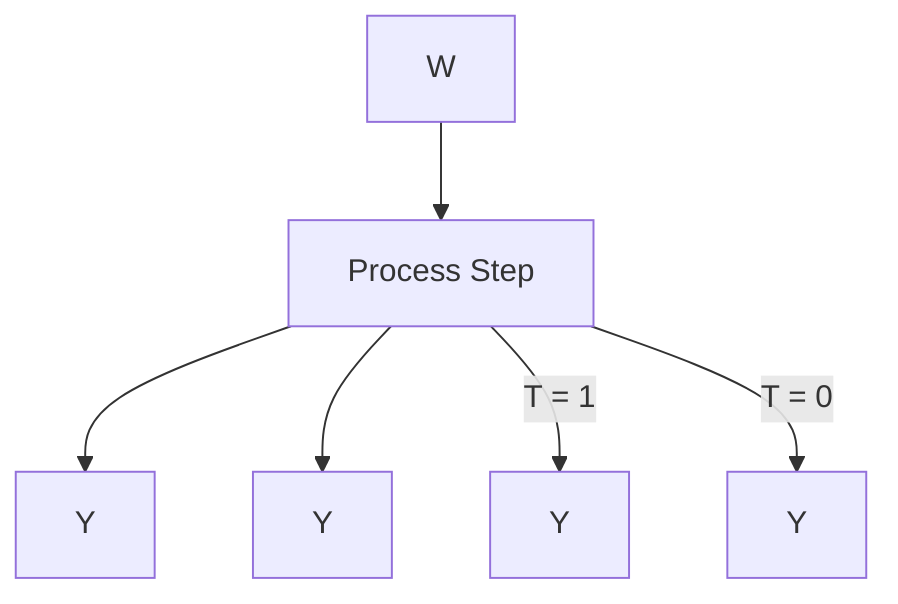
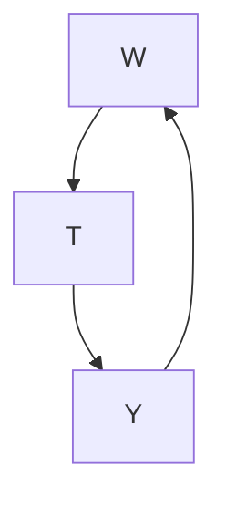
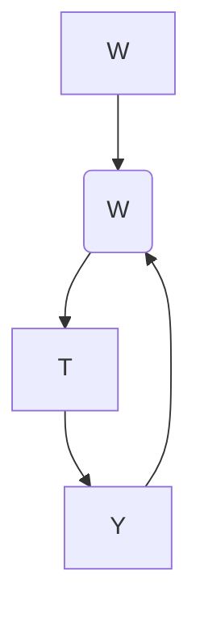
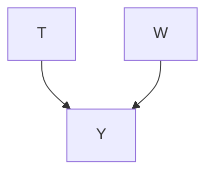

# 估计（Estimation）

在上一章中，我们讨论了**识别（identification）**。一旦我们通过将某个**因果估计量（causal estimand）**简化为**统计估计量（statistical estimand）**来识别它，我们仍然有更多工作要做。我们需要得到相应的**估计值（estimate）**。在本章中，我们将介绍多种可用于此目的的**估计器（estimators）**。这并非穷尽性的介绍（因果效应的估计器有很多种），但旨在为你提供一个扎实的入门基础。

我们在完整章节中介绍的所有估计器都是**模型辅助估计器（model-assisted estimators）**（回顾第 2.4 节）。它们都可以与任意的统计模型（例如你可能从 scikit-learn 中获得的模型 [29]）一起使用。

## 7.1 预备知识（Preliminaries）

回顾第 2 章，我们将**个体处理效应（Individual Treatment Effect, ITE）**记为 $\tau_{i}$，将**平均处理效应（Average Treatment Effect, ATE）**记为 $\tau$：

$$
\tau_{i} \triangleq Y_{i}(1) - Y_{i}(0) \tag{7.1}
$$

$$
\tau \triangleq \mathbb{E}[Y_{i}(1) - Y_{i}(0)] \tag{7.2}
$$

ITE 是最具体的一类因果效应，但在没有强假设的情况下（除了第 2 章和第 4 章讨论的那些假设之外），它们很难估计。然而，我们常常希望估计比 ATE 更具个体化的因果效应。

例如，假设我们观察到了个体的**协变量（covariates）** $x$；我们可能希望利用这些协变量来估计该个体（以及任何具有协变量 $x$ 的其他个体）的更具体的效应。这就引出了**条件平均处理效应（Conditional Average Treatment Effect, CATE）** $\tau(x)$：

$$
\tau(x) \triangleq \mathbb{E}[Y_{i}(1) - Y_{i}(0) \mid X = x] \tag{7.3}
$$

被条件化的 $X$ 不需要包含所有观察到的协变量，但这通常是人们提到 CATE 时的情况。我们将其称为**个体化平均处理效应（Individualized Average Treatment Effects, IATEs）**。

ITE 和 "CATE"（我们称之为 IATE）有时会被混为一谈，但它们并不相同。例如，两个个体可能具有相同的协变量，但由于这些个体之间其他未观察到的差异，他们的**潜在结果（potential outcomes）**可能不同。如果我们把与潜在结果相关的个体的所有信息都包含在向量 $I$ 中，那么当 $I = X$ 时，ITE 和 "CATE" 是相同的。在因果图中，$I$ 对应于放大图中所有具有流向 $Y$ 的因果关联的**外生变量（exogenous variables）**。$^1$

7.1 预备知识（Preliminaries）...... 62

7.2 条件结果建模（Conditional Outcome Modeling, COM）...... 63

7.3 分组条件结果建模（Grouped Conditional Outcome Modeling, GCOM）...... 64

7.4 提高数据效率（Increasing Data Efficiency）...... 65 TARNet ...... 65 X-Learner ...... 66

7.5 倾向得分（Propensity Scores）...... 67

7.6 逆概率加权（Inverse Probability Weighting, IPW）...... 68

7.7 双重稳健方法（Doubly Robust Methods）...... 70

7.8 其他方法（Other Methods）...... 70

7.9 结论性评述（Concluding Remarks）...... 71 置信区间（Confidence Intervals）...... 71 与随机化实验的比较（Comparison to Randomized Experiments）...... 72

[29]: Pedregosa et al. (2011), 'Scikit-learn: Machine Learning in Python'

**无混淆性（Unconfoundedness）** 在本章中，每当我们估计 ATE 时，我们都假设 $W$ 是一个**充分的调整集（sufficient adjustment set）**；每当我们估计 CATE 时，我们都假设 $W \cup X$ 是一个充分的调整集。换句话说，对于 ATE 估计，我们假设 $W$ 满足**后门准则（backdoor criterion）**（定义 4.1）；等价地，对于 ATE 估计，我们假设在给定 $W$ 的条件下具有**条件可交换性（conditional exchangeability）**（假设 2.2）。类似地，对于 CATE 估计，假设 $W \cup X$ 是一个充分的调整集意味着我们假设 $W \cup X$ 满足后门准则，从而为我们提供了无混淆性。这种无混淆性假设为我们提供了**参数识别（parametric identification）**$^2$，并使我们能够在本章中专注于估计。

## 7.2 条件结果建模（Conditional Outcome Modeling, COM）

我们感兴趣的是估计 ATE $\tau$。我们首先回顾**调整公式（adjustment formula）**（定理 2.1），它可以作为**后门调整（backdoor adjustment）**（定理 4.2）的推论推导出来，正如我们在第 4.4.1 节中所见：

$$
\tau \triangleq \mathbb{E}[Y(1) - Y(0)] = \mathbb{E}_{W}\left[\mathbb{E}[Y \mid T = 1, W] - \mathbb{E}[Y \mid T = 0, W]\right] \tag{7.4}
$$

在公式 7.4 的左侧，我们有一个因果估计量，右侧则是一个统计估计量（即我们已经识别了这个因果量）。然后，在**识别-估计流程图（Identification-Estimation Flowchart）**（见图 7.1，复制自第 2.4 节）中的下一步就是获得这个（统计）估计量的估计值。

$^2$ 所谓"参数识别"，我们指的是在统计模型的参数假设下的识别。例如，如果我们没有**积极性（positivity）**，这些假设用于外推。


图 7.1：识别-估计流程图——该流程图说明了从目标因果估计量到相应估计值的过程，通过识别和估计两个步骤。

最直接的方法是拟合一个统计模型（机器学习模型）来估计条件期望 $\mathbb{E}[Y \mid T, W]$，然后用 $n$ 个数据点上的经验均值 $\left(\frac{1}{n}\sum_{i}\right)$ 来近似 $\mathbb{E}_{W}$。这正是我们在第 2.5 节和第 4.6.2 节的简单估计例子中所做的。为了更清晰地说明这一点，我们引入 $\mu$ 来代替这个条件期望：

$$
\mu(1, w) - \mu(0, w) \triangleq \mathbb{E}[Y \mid T = 1, W = w] - \mathbb{E}[Y \mid T = 0, W = w] \tag{7.5}
$$

然后，我们可以拟合一个统计模型来估计 $\mu$。我们用帽子符号表示这些拟合模型是 $\mu$ 的近似：$\hat{\mu}$。我们将模型 $\hat{\mu}$ 称为**条件结果模型（conditional outcome model）**。现在，我们可以清晰地写出我们所描述的（ATE 的）模型辅助估计器：

$$
\hat{\tau} = \frac{1}{n}\sum_{i}\left(\hat{\mu}(1, w_i) - \hat{\mu}(0, w_i)\right) \tag{7.6}
$$

我们将采用这种形式的估计器称为**条件结果模型（Conditional Outcome Model, COM）估计器**。由于最小化从 $(T, X)$ 对预测 $Y$ 的**均方误差（mean-squared error, MSE）**等价于对这个条件期望进行建模 [参见，例如，10，第 2.4 节]，因此有许多不同的模型可用于公式 7.6 中的 $\hat{\mu}$ 来得到 COM 估计器（例如，scikit-learn [29]）。

**主动阅读练习：在这个估计器中，我们做了哪两种不同的近似，它们分别替换了公式 7.4 中统计估计量的哪些部分？**

[10]: Hastie et al. (2001), *The Elements of Statistical Learning*

对于 CATE 估计，因为我们假设 $W \cup X$ 是一个充分的调整集，而不仅仅是 $W$，$^3$ 我们必须额外将 $X$ 作为输入添加到我们的条件结果模型中。更精确地说，对于 CATE 估计，我们如下定义 $\mu$：

$$
\mu(t, w, x) \triangleq \mathbb{E}[Y \mid T = t, W = w, X = x] \tag{7.7}
$$

然后，我们训练一个统计模型 $\hat{\mu}$ 来从 $(T, W, X)$ 预测 $Y$。这给出了以下用于 CATE $\tau(x)$ 的 COM 估计器：

$$
\hat{\tau}(x) = \frac{1}{n_x}\sum_{i: x_i = x}\left(\hat{\mu}(1, w_i, x) - \hat{\mu}(0, w_i, x)\right) \tag{7.8}
$$

其中 $n_x$ 是满足 $x_i = x$ 的数据点的数量。当我们对 IATE（其中 $X$ 是所有观察到的协变量的 CATE）感兴趣时，$n_x$ 通常为 1，这将我们的估计器简化为预测值之间的简单差值：

$$
\hat{\tau}(x_i) = \hat{\mu}(1, w_i, x_i) - \hat{\mu}(0, w_i, x_i) \tag{7.9}
$$

尽管 IATE 与 ITE $(\tau(x_i) \neq \tau_i)$ 不同，但如果我们确实想要给出 ITE 的估计值，通常也会将这个估计器作为 ITE $\tau_i$ 的估计器：

$$
\hat{\tau}_i = \hat{\tau}(x_i) = \hat{\mu}(1, w_i, x_i) - \hat{\mu}(0, w_i, x_i) \tag{7.10}
$$

然而，由于严重的**积极性违反（positivity violation）**，这可能会不可靠。$^4$

**多面估计器（The Many-Faced Estimator）** COM 估计器在文献中有许多不同的名称。例如，在流行病学和生物统计学中，它们通常被称为 **G-计算估计器（G-computation estimators）**、**参数 G-公式（parametric G-formula）**或**标准化（standardization）**。由于我们在这里拟合单个统计模型来估计 $\mu$，"COM 估计器"有时被称为 **"S-学习器（S-learner）"**，其中 "S" 代表 "single"（单个）。

## 7.3 分组条件结果建模（Grouped Conditional Outcome Modeling, GCOM）

为了得到公式 7.6 中的估计值，我们必须训练一个从 $(T, W)$ 预测 $Y$ 的模型。然而，$T$ 通常是一维的，而 $W$ 可能是高维的。但在求和项 $\hat{\mu}(1, w_i) - \hat{\mu}(0, w_i)$ 内部，$\hat{\mu}$ 的输入中唯一变化的是 $T$。想象一下，将 $T$ 连接到一个 100 维的向量 $W$ 上，然后将其输入到我们用于 $\hat{\mu}$ 的神经网络中。网络似乎有可能忽略 $T$，而专注于输入的其他 100 个维度 $W$。这将导致 ATE 估计值为零。事实上，有一些证据表明 COM 估计器存在偏向于零的偏差 [30]。

那么，我们如何确保模型 $\hat{\mu}$ 不会忽略 $T$ 呢？我们可以训练两个不同的模型 $\hat{\mu}_1(w)$ 和 $\hat{\mu}_0(w)$，分别对 $\mu_1(w)$ 和 $\mu_0(w)$ 进行建模，其中：

$$
\mu_1(w) \triangleq \mathbb{E}[Y \mid T = 1, W = w] \quad \text{和} \quad \mu_0(w) \triangleq \mathbb{E}[Y \mid T = 0, W = w] \tag{7.11}
$$

使用两个独立的模型来处理 $T$ 的不同取值，可以确保 $T$ 不会被忽略。为了训练这些统计模型，我们首先将数据分组为 $T = 1$ 组和 $T = 0$ 组。然后，我们在 $T = 1$ 组中训练 $\hat{\mu}_1(w)$，以从 $W$ 预测 $Y$。类似地，我们在 $T = 0$ 组中训练 $\hat{\mu}_0(w)$，以从 $W$ 预测 $Y$。这为我们提供了 COM 估计器（公式 7.6）的一个自然衍生形式——**分组条件结果模型（Grouped Conditional Outcome Model, GCOM）估计器**：$^5$

$$
\hat{\tau} = \frac{1}{n}\sum_{i}\left(\hat{\mu}_1(w_i) - \hat{\mu}_0(w_i)\right) \tag{7.12}
$$

正如我们在公式 7.8 中所见，我们可以将 $X$ 作为输入添加到 $\hat{\mu}_1$ 和 $\hat{\mu}_0$ 中，以得到用于 CATE $\tau(x)$ 的 GCOM 估计器：

$$
\hat{\tau}(x) = \frac{1}{n_x}\sum_{i: x_i = x}\left(\hat{\mu}_1(w_i, x) - \hat{\mu}_0(w_i, x)\right) \tag{7.13}
$$

虽然 GCOM 估计似乎解决了 COM 估计可能存在的偏向于零处理效应的偏差问题，但它确实有一个重要的缺点。在 COM 估计中，当我们估计单个模型 $\hat{\mu}$ 时，我们可以利用所有数据。然而，在分组条件结果模型估计中，我们只使用 $T = 1$ 组来估计 $\hat{\mu}_1$，只使用 $T = 0$ 组来估计 $\hat{\mu}_0$。重要的是，我们没有充分利用数据——未能使用所有数据来估计 $\hat{\mu}_1$ 和所有数据来估计 $\hat{\mu}_0$。

## 7.4 提高数据效率（Increasing Data Efficiency）

在本节中，我们将介绍两种解决数据效率问题的方法，我们在上一节末尾提到，**广义条件结果均值（GCOM）估计**中存在这一问题：**TARNet**（第 7.4.1 节）和 **X-Learner**（第 7.4.2 节）。

## 7.4.1 TARNet

假设我们使用神经网络作为统计模型；以此为基础，我们将对比**普通条件结果均值（COM）估计**、**广义条件结果均值（GCOM）估计**和 **TARNet**。在普通 COM 估计中，神经网络用于根据 $(\ )$ 预测 $𝑌 𝑇, 𝑊$（见图 7.2a）。这存在一个问题，即可能得到偏向零的 **平均处理效应（ATE）** 估计，因为网络可能会忽略标量 $𝑇$，尤其是在 $𝑊$ 是高维的情况下。在 GCOM 估计中，我们通过为两个处理组使用两个独立的神经网络来确保 $𝑇$ 不会被忽略（图 7.2b）。然而，这种方法的效率较低，因为我们只使用处理组数据来训练一个网络，而使用对照组数据来训练另一个网络。

我们可以使用 Shalit 等人 [31] 的 **TARNet** 在普通 COM 估计和 GCOM 估计之间找到一个折中方案。使用 TARNet 时，我们使用一个仅以 $𝑊$ 作为输入的网络，然后为每个处理组分支出两个独立的**头部（heads）**（子网络）。然后，我们使用此模型作为 $\mu ( t , w )$ 来获得一个 COM 估计器。这样做的好处是，利用所有数据学习一个**与处理无关的表征（Treatment-Agnostic Representation, TAR）** $𝑊$，同时通过分支出两个头部来处理 $𝑇$ 的不同取值，从而强制模型不会忽略 $𝑇$。换句话说，TARNet 在其架构中利用了我们对 $𝑇$（作为一个独特的重要变量）的了解。尽管如此，每个头部的子网络仍然只使用相应处理组的数据进行训练，而不是全部数据。6

6 主动阅读练习：TARNet 的哪些部分类似于图 7.2a，哪些部分类似于图 7.2b？图 7.2a 至 7.2c 相对于彼此有什么优点/缺点？


(a) 用于建模 $\mu ( t , w )$ 的单个神经网络，用于普通 COM 估计（第 7.2 节）。


```mermaid
graph LR
  W --> Y
    style W fill:#fff,stroke:#000
    style Y fill:#fff,stroke:#000
    style T = 1 network
```


```mermaid
graph LR
  W --> Y
    style W fill:#fff,stroke:#000
    style Y fill:#fff,stroke:#000
    style T = 0 network
```

(b) 两个神经网络：用于建模 $\mu_1( )$ 的网络（顶部）和用于建模 $w\mu_0( )$ 的网络（底部），用于 GCOM 估计（第 7.3 节）。




(c) TARNet [31]。一个用于建模 $\mu ( t ,$ ) 的单个神经网络，它分支出两个头部：一个用于 $\dot { T } = 1$，另一个用于 $T = 0$。  
图 7.2：普通 COM 估计（左）、GCOM 估计（中）和 TARNet（右）的粗略神经网络架构。在此图中，我们使用每个箭头表示一个具有任意层数的子网络。

## 7.4.2 X-Learner

我们刚刚看到，相对于 GCOM 估计，提高数据效率的一种方法是使用 **TARNet**，这是一种与 GCOM 估计器共享某些特性的 COM 估计器。然而，TARNet 仍然没有将全部数据用于完整的模型（神经网络）。在本节中，我们将从 GCOM 估计出发，并在此基础上构建一类估计器，该类估计器将全部数据用于构成估计器的两个模型。这类估计器中的一种被称为 **X-learner** [30]。与 TARNet 不同，X-learner 既不是 COM 估计器，也不是 GCOM 估计器。

X-learning 包含三个步骤，第一步与 GCOM 估计中使用的完全相同：使用处理组数据估计 $\hat { \mu } _ { 1 } ( x )$，并使用对照组数据估计 $\hat { \mu } _ { 0 } ( x )$。7 如前所述，这可以使用任何最小化 **均方误差（MSE）** 的模型来完成。为简单起见，在本节中，我们将考虑 **个体平均处理效应（IATE）**（$𝑋$ 是所有观测到的变量），其中 $𝑋$ 满足后门准则（包含 $𝑊$ 且不包含 $𝑇$ 的后代）。

第二步是最关键的部分，因为正是在这一步中，我们最终将全部数据用于两个模型，并且也是“$\prime \prime \mathrm { { x } } ^ { \prime \prime }$”这个名称的来源。我们定义处理组的 **个体处理效应（ITE）** 估计值 $\widehat { \tau } _ { 1 , i }$ 和对照组的 ITE 估计值 $\widehat { \tau } _ { 0 , i }$：

[30]: Künzel 等人 (2019)，‘使用机器学习估计异质性处理效应的元学习器’

7 回想一下，$\hat { \mu } _ { 1 } ( w )$ 和 $\hat { \mu } _ { 0 } ( w )$ 分别是 ${ \bar { \mathbb { E } } } [ Y \mid T \stackrel { \cdot } { = } 1 , W \ = ]$ 和 $\mathbb { E } [ Y \mid T = 0 , W = w ]$ 的近似。

$$
\hat {\tau} _ {1, i} = Y _ {i} (1) - \hat {\mu} _ {0} (x _ {i}) \tag {7.14}
$$

$$
\hat {\tau} _ {0, i} = \hat {\mu} _ {1} (x _ {i}) - Y _ {i} (0) \tag {7.15}
$$

这里，$\widehat { \tau } _ { 1 , i }$ 是使用处理组结果和从 $\hat { \mu } _ { 0 }$ 获得的插补反事实来估计的。类似地，$\widehat { \tau } _ { 0 , i }$ 是使用对照组结果和从 $\hat { \mu } _ { 1 }$ 获得的插补反事实来估计的。如果你在观测到的潜在结果之间画一条线，并在插补的潜在结果之间画一条线，你会看到一个“$\mathbf { \chi } ^ { \prime \prime }$”形状。重要的是，这个“$\mathbf { \chi } ^ { \prime \prime }$”告诉我们，每个处理组 ITE 估计值 $\widehat { \tau } _ { 1 , i }$ 既使用了处理组数据（其在处理下的观测潜在结果），也使用了对照组数据（在 $\hat { \mu } _ { 0 }$ 中）。类似地，$\widehat { \tau } _ { 0 , i }$ 也是使用来自两个处理组的数据估计的。

然而，每个 ITE 估计值仅使用其对应处理组中的单个数据点。我们可以通过拟合一个模型 $\hat { \tau } _ { 1 } ( x )$ 来根据相应的处理组 $x _ { i } ^ { \prime } \mathbf { s }$ 预测 $\widehat { \tau } _ { 1 , i }$ 来解决这个问题。最后，我们得到一个模型 $\hat { \tau } _ { 1 } ( x )$，该模型是使用所有数据（刚刚使用的处理组数据以及在第一步拟合 $\mu _ { 0 }$ 时使用的对照组数据）拟合的。类似地，我们可以拟合一个模型 $\hat { \tau } _ { 0 } ( x )$ 来根据相应的对照组 $x _ { i } ^ { \prime } \mathbf { s }$ 预测 $\widehat { \tau } _ { 0 , i }$。第二步的输出是 IATE 的两个不同估计器：$\hat { \tau } _ { 1 } ( x )$ 和 $\hat { \tau } _ { 0 } ( x )$。

最后，在第三步中，我们将 $\hat { \tau } _ { 1 } ( x )$ 和 $\hat { \tau } _ { 0 } ( x )$ 结合起来，得到我们的 IATE 估计器：

$$
\hat {\tau} (x) = g (x) \hat {\tau} _ {0} (x) + (1 - g (x)) \hat {\tau} _ {1} (x) \tag {7.16}
$$

其中 $g ( x )$ 是某个产生 0 到 1 之间值的权重函数。Künzel 等人 [30] 报告说，倾向得分（将在下一节介绍）的估计值效果很好，但如果处理组和对照组的规模差异很大，选择常数函数 0 或 1 也是合理的。或者，选择 $g ( x )$ 以最小化 $\hat { \tau } ( x )$ 的方差也可能很有吸引力。

## 7.5 倾向得分（Propensity Scores）

给定变量向量 $W$ 满足后门准则（或等价地，$(Y(1), Y(0)) \bot \bot T \mid W$），我们可能会怀疑是否真的有必要以整个向量为条件来隔离因果关联，尤其是在 $W$ 是高维的情况下。事实证明，并不需要。如果 $W$ 满足**无混杂性（unconfoundedness）**和**积极性（positivity）**，那么我们实际上只需要以标量 $P(T = 1 \mid W)$ 为条件即可。我们令 $e(w)$ 表示 $P(T = 1 \mid W = w)$，并将 $e(w)$ 称为**倾向得分（propensity score）**，因为它是在给定 $W = w$ 的情况下接受处理的倾向（概率）。能够以标量 $e(W)$ 代替向量 $W$ 为条件的奇妙之处，归功于 Rosenbaum 和 Rubin [32] 的**倾向得分定理（propensity score theorem）**：

**定理 7.1（倾向得分定理）** 给定积极性，以 $W$ 为条件的无混杂性意味着以倾向得分 $e(W)$ 为条件的无混杂性。

[30]: Künzel et al. (2019), ‘Metalearners for estimating heterogeneous treatment effects using machine learning’

**主动阅读练习**：在本节中，我们介绍了用于 IATE 估计的 X-learner。那么，用于更一般的 CATE 估计（其中 $X$ 是任意的，并且不一定包含所有混杂因子）的 X-learner 会是什么样子呢？

[32]: Rosenbaum and Rubin (1983), ‘The central role of the propensity score in observational studies for causal effects’

等价地，

$$
(Y(1), Y(0)) \perp T \mid W \implies (Y(1), Y(0)) \perp T \mid e(W). \tag{7.17}
$$

我们在附录 A.2 中提供了一个更传统的数学证明，并在此给出一个图形化证明。考虑图 7.3 中的图。因为从 $W$ 到 $T$ 的边是机制 $P(T \mid W)$ 的符号，并且因为倾向得分完全描述了该分布 $(P(T = 1 \mid W) = e(W))$，我们可以将倾向得分视为 $W$ 对 $T$ 影响的完全中介。这意味着我们可以重新绘制这个图，将 $e(W)$ 置于 $W$ 和 $T$ 之间。在这个重新绘制的图 7.4 中，我们可以看到 $e(W)$ 阻断了 $W$ 所阻断的所有后门路径，因此如果 $W$ 是一个充分的调整集，那么 $e(W)$ 也必然是一个充分的调整集。因此，我们使用后门调整（定理 4.2）得到了倾向得分定理的一个图形化证明。

重要的是，这个定理意味着，在本章中我们调整 $W$ 的任何估计量中，我们都可以用 $e(W)$ 来代替 $W$。例如，当 $W$ 是高维时，这似乎非常有用。

回顾第 2.3.4 节的**积极性-无混杂性权衡（Positivity-Unconfoundedness Tradeoff）**。当我们以更多不引起碰撞器偏差的变量为条件时，我们减少了混杂。然而，这是以减少重叠为代价的，因为 $P(T = 1 \mid W)$ 的维度变得越来越高。倾向得分似乎允许我们神奇地解决这个问题，因为即使 $W$ 的维度增加，$e(W)$ 仍然是一个标量。很棒，对吧？

嗯，不幸的是，我们通常无法获得 $e(W)$。相反，我们能做到最好的就是对其建模。我们通过训练一个模型来从 $W$ 预测 $T$ 来实现这一点。例如，**逻辑回归（logistic regression，logit 模型）** 非常常用。并且由于这个模型是针对高维 $W$ 拟合的，从某种意义上说，我们只是将积极性问题转移到了我们的倾向得分模型 $e(W)$ 上。

## 7.6 逆概率加权（Inverse Probability Weighting, IPW）

如果我们能重新抽样数据，使得关联就是因果关系，那会怎样？这就是创建由观测总体的加权版本组成的“伪总体（pseudo-populations）”背后的动机。为此，让我们回顾一下为什么关联通常不是因果关系。

在图 7.5 的图中，关联不是因果关系，因为 $W$ 是 $T$ 和 $Y$ 的共同原因。换句话说，生成 $T$ 的机制依赖于 $W$，而生成 $Y$ 的机制也依赖于 $W$。关注生成 $T$ 的机制，我们可以将其数学地写为 $P(T \mid W) \neq P(T)$。事实证明，我们可以对数据进行重新加权，得到一个伪总体，其中 $P(T \mid W) = P(T)$ 或 $P(T \mid W)$ 等于某个常数；重要的是我们使 $T$ 独立于 $W$。这种伪总体的对应图中没有从 $W$ 到 $T$ 的边，因为 $T$ 不依赖于 $W$；我们在图 7.6 中描绘了这一点。

事实证明，倾向得分是这种重新加权的关键。我们所需要做的就是，根据每个具有处理 $T$ 和混杂因子 $W$ 的数据点，以其在给定 $W$ 值的情况下接受其处理值的逆概率进行加权。这就是为什么这种技术被称为**逆概率加权（inverse probability weighting, IPW）**。对于接受处理 1 的个体，这个权重是 $\frac{1}{e(W)}$；对于接受处理 0 的个体，这个权重是 $\frac{1}{1 - e(W)}$。⁸ 如果处理是连续的，权重将是 $\frac{1}{P(T \mid W)}$，这恰好也是倾向得分在连续处理情况下的推广的倒数。




**图 7.3：** 一个简单的图，其中 $W$ 满足后门准则




**图 7.4：** 说明 $e(W)$ 阻断了 $W$ 所阻断的后门路径的图。


**图 7.5：** 一个简单的图，其中 $W$ 混杂了 $T$ 对 $Y$ 的影响。




**图 7.6：** 通过使用逆概率加权对根据图 7.5 中的图生成的数据进行重新加权而得到的伪总体的有效图。

为什么我们在上一段中描述的方法有效？嗯，回想一下，我们的目标是通过“移除”从 $W$ 到 $T$ 的边（即从图 7.5 移动到图 7.6）来消除混杂。而那条边所描述的机制就是 $P(T \mid W)$。通过用 $\frac{1}{P(T \mid W)}$ 对数据点进行加权，我们实际上抵消了它。这就是直觉。形式上，我们有以下识别方程：

$$
\mathbb{E}[Y(t)] = \mathbb{E}\left[\frac{\mathbb{1}(T = t) Y}{P(t \mid W)}\right] \tag{7.18}
$$

其中 $\mathbb{1}(T = t)$ 是一个指示随机变量，如果 $T = t$ 则取值为 1，否则为 0。我们在附录 A.3 中使用熟悉的调整公式 $\mathbb{E}[Y(t)] = \mathbb{E}[\mathbb{E}[Y \mid t, W]]$（定理 2.1）给出了方程 7.18 的证明。

假设处理是二值的，以下 ATE 的识别方程源自方程 7.18：

$$
\tau \triangleq \mathbb{E}[Y(1) - Y(0)] = \mathbb{E}\left[\frac{\mathbb{1}(T = 1) Y}{e(W)}\right] - \mathbb{E}\left[\frac{\mathbb{1}(T = 0) Y}{1 - e(W)}\right] \tag{7.19}
$$

现在我们有了 IPW 形式的统计估计量，我们可以得到一个 IPW 估计量。用经验均值替换期望，并用倾向得分模型 $\hat{e}(W)$ 替换 $e(W)$，我们得到以下 ATE 的**基本 IPW 估计量**⁹ 的等价公式：

$$
\begin{array}{l} 
\hat{\tau} = \frac{1}{n} \sum_{i} \left(\frac{\mathbb{1}(t_i = 1) y_i}{\hat{e}(w_i)} - \frac{\mathbb{1}(t_i = 0) y_i}{1 - \hat{e}(w_i)}\right) \tag{7.20} \\ 
= \frac{1}{n_1} \sum_{i: t_i = 1} \frac{y_i}{\hat{e}(w_i)} - \frac{1}{n_0} \sum_{i: t_i = 0} \frac{y_i}{1 - \hat{e}(w_i)} \tag{7.21} 
\end{array}
$$

其中 $n_1$ 和 $n_0$ 分别是处理组单元和对照组单元的数量。

**权重修剪（Weight Trimming）** 正如你在方程 7.20 和 7.21 中看到的，如果倾向得分非常接近 0 或 1，估计值将会爆炸。为了防止这种情况，通常会将小于 $\epsilon$ 的倾向得分修剪为 $\epsilon$，将大于 $1 - \epsilon$ 的修剪为 $1 - \epsilon$（实际上是将权重修剪为不大于 $\frac{1}{\epsilon}$），尽管这会引入其自身的问题，例如偏差。

**CATE 估计** 我们可以扩展方程 7.20 中的 ATE 估计量，通过仅限制在 $x_i = x$ 的数据点上，得到 CATE $\tau(x)$ 的 IPW 估计量：

$$
\hat{\tau}(x) = \frac{1}{n_x} \sum_{i: x_i = x} \left(\frac{\mathbb{1}(t_i = 1) y_i}{\hat{e}(w_i)} - \frac{\mathbb{1}(t_i = 0) y_i}{1 - \hat{e}(w_i)}\right) \tag{7.22}
$$

⁸ **主动阅读练习**：为什么当 $T = 0$ 时分母是 $1 - e(W)$？提示：回顾 $e(W)$ 的精确定义。

⁹ 这个估计量最初来自 Horvitz 和 Thompson [33]。

[33]: Horvitz and Thompson (1952), ‘A Generalization of Sampling Without Replacement from a Finite Universe’

**主动阅读练习**：对于 $\mathbb{E}[Y(t)]$ 的基本 IPW 估计量的相应公式是什么？

其中 $n_x$ 是满足 $x_i = x$ 的数据点的数量。然而，方程 7.22 中的估计量可能会很快遇到使用非常少量数据的问题，导致高方差。使用 IPW 估计量进行更一般的 CATE 估计更为复杂，超出了本书的范围。例如，请参见 Abrevaya 等人 [34] 及其参考文献。

## 7.7 双稳健方法（Doubly Robust Methods）

我们已经看到，我们可以通过对 $\mu(t, w) \triangleq \mathbb{E}[Y \mid t, w]$ 建模（第 7.2 至 7.4 节）或对 $e(w) \triangleq P(T = 1 \mid w)$ 建模（第 7.6 节）来估计因果效应。如果我们同时对 $\mu(t, w)$ 和 $e(w)$ 建模呢？嗯，我们可以，并且这样做的估计量有时是**双稳健（doubly robust）** 的。一个双稳健估计量具有这样的性质：如果 $\hat{\mu}$ 是 $\mu$ 的一致估计量¹⁰，或者 $\hat{e}$ 是 $e$ 的一致估计量，那么它就是 $\tau$ 的一致估计量。换句话说，$\hat{\mu}$ 和 $\hat{e}$ 只需要有一个是正确设定的。此外，双稳健估计量收敛到 $\tau$ 的速度是 $\hat{\mu}$ 收敛到 $\mu$ 的速度与 $\hat{e}$ 收敛到 $e$ 的速度的乘积。这使得双稳健性在高维中使用灵活的机器学习模型时非常有用，因为在这种情况下，我们的每个单独模型 $(\hat{\mu}$ 和 $\hat{e})$ 的收敛速度都比理想的 $n^{-1/2}$ 速率慢。

然而，关于双稳健方法在实践中，如果 $\hat{\mu}$ 和 $\hat{e}$ 中至少没有一个被正确设定，它们的效果如何，存在一些争议 [35]。不过，随着我们更好地使用具有灵活机器学习模型的双稳健估计量，这一点可能会受到挑战（例如，参见 [36]）。与此同时，当前似乎表现最好的估计量都灵活地对 $\mu$ 进行了建模（与纯 IPW 估计量不同）[37]。这就是我们以对 $\mu$ 建模的估计量开始本章，并用了几节专门讨论此类估计量的原因。

双稳健方法在很大程度上超出了本书的范围，因此我们建议读者参考 Seaman 和 Vansteelandt [38] 的入门介绍，以及该主题的其他开创性工作：[39–41]。此外，还有大量关于在竞赛中表现相当不错的双稳健方法的工作 [37]；这一类别被称为**目标最大似然估计（targeted maximum likelihood estimation, TMLE）** [42–44]。

## 7.8 其他方法（Other Methods）

由于本章只是对因果推断中估计方法的介绍，我们完全遗漏了一些方法。在本节中，我们将简要描述一些最流行的方法。

**匹配（Matching）** 在匹配方法中，我们尝试将处理组中的单元与对照组中的单元进行匹配，并丢弃不匹配的单元以创建可比较的组。我们可以在原始协变量空间、粗化协变量空间或倾向得分空间中进行匹配。有不同的距离函数来决定两个单元有多接近。此外，还有不同的标准来决定给定的距离是否足够接近以算作匹配（一个标准要求精确匹配），每个处理组单元可以有多少个匹配，每个对照组单元可以有多少个匹配等。例如，参见 Stuart [45] 的综述。

[34]: Abrevaya et al. (2015), ‘Estimating Conditional Average Treatment Effects’

¹⁰ 如果一个估计量随着样本量 $n$ 的增长依概率收敛到其估计目标，则称该估计量是一致的。

[35]: Kang and Schafer (2007), ‘Demystifying Double Robustness: A Comparison of Alternative Strategies for Estimating a Population Mean from Incomplete Data’  
[36]: Zivich and Breskin (2020), Machine learning for causal inference: on the use of cross-fit estimators  
[37]: Dorie et al. (2019), ‘Automated versus Do-It-Yourself Methods for Causal Inference: Lessons Learned from a Data Analysis Competition’  
[38]: Seaman and Vansteelandt (2018), ‘Introduction to Double Robust Methods for Incomplete Data’  
[39]: Tsiatis (2007), Semiparametric theory and missing data  
[40]: Robins et al. (1994), ‘Estimation of Regression Coefficients When Some Regressors are not Always Observed’  
[41]: Bang and Robins (2005), ‘Doubly Robust Estimation in Missing Data and Causal Inference Models’  
[42]: Van Der Laan and Rubin (2006), ‘Targeted maximum likelihood learning’  
[43]: Schuler and Rose (2017), ‘Targeted Maximum Likelihood Estimation for Causal Inference in Observational Studies’  
[44]: Van der Laan and Rose (2011), Targeted learning: causal inference for observational and experimental data

**双重机器学习（Double Machine Learning）** 在双重机器学习中，我们在两个阶段拟合三个模型：第一阶段拟合两个模型，第二阶段拟合一个最终模型。第一阶段：

1. 拟合一个模型从 $W$ 预测 $Y$，得到预测值 $\hat{Y}$。¹¹  
2. 拟合一个模型从 $W$ 预测 $T$，得到预测值 $\hat{T}$。

然后，在第二阶段，我们通过查看 $Y - \hat{Y}$ 和 $T - \hat{T}$ 来“部分消除” $W$ 的影响。从某种意义上说，我们通过这种部分消除来消除处理对结果影响的混杂。然后，我们拟合一个模型从 $T - \hat{T}$ 预测 $Y - \hat{Y}$。这就给出了我们的因果效应估计。关于这个主题的更多信息，请参见例如 [46–49]。

**因果树和因果森林（Causal Trees and Forests）** 另一种流行的估计方法是递归地将数据划分为具有相同处理效应的子集 [50]。这形成了一棵因果树，其叶子是具有相似因果效应的总体子集。由于随机森林通常比决策树表现更好，如果这种策略能够扩展到随机森林，那就太好了。而它确实可以。这种扩展被称为**因果森林（causal forests）** [51]，它是更一般的**广义随机森林（generalized random forests）** [52] 类别的一部分。重要的是，这些方法是以对估计值产生有效置信区间为目标而开发的。

## 7.9 结束语（Concluding Remarks）

### 7.9.1 置信区间（Confidence Intervals）

到目前为止，在本章中，我们只讨论了因果效应的点估计。我们还没有讨论如何衡量由于数据抽样带来的不确定性。我们还没有讨论如何计算这些估计值的置信区间。毕竟，这是机器学习的视角；谁在乎置信区间呢……开个玩笑。因为我们在讨论的所有估计量中都允许使用任意的机器学习模型，所以实际上很难获得有效的置信区间。

**自助法（Bootstrapping）** 获得置信区间的一种方法是使用自助法。使用自助法，我们重复因果效应估计过程多次，每次使用来自我们数据的不同样本（有放回）。这使我们能够为估计值建立一个经验分布。然后，我们可以从该经验分布中计算我们想要的任何置信区间。不幸的是，自助法置信区间并不总是有效的。例如，如果我们取一个自助法 95% 置信区间，它可能不会在 95% 的情况下包含真实值（估计目标）。

**专门模型（Specialized Models）** 获得置信区间的另一种方法是分析非常特定的模型，而不是允许任意模型。线性模型是最简单的例子；在线性模型中很容易获得置信区间。类似地，如果我们在双重机器学习中使用线性模型作为第二阶段模型，我们可以获得置信区间。值得注意的是，因果树和因果森林是以获得置信区间为目标而开发的。

[45]: Stuart (2010), ‘Matching Methods for Causal Inference: A Review and a Look Forward’

¹¹ **主动阅读练习**：这个模型与 $\hat{\mu}$ 有何不同？

[46]: Chernozhukov et al. (2018), ‘Double/debiased machine learning for treatment and structural parameters’  
[47]: Felton (2018), Chernozhukov et al. on Double / Debiased Machine Learning  
[48]: Syrgkanis (2019), Orthogonal/Double Machine Learning  
[49]: Foster and Syrgkanis (2019), Orthogonal Statistical Learning  
[50]: Athey and Imbens (2016), ‘Recursive partitioning for heterogeneous causal effects’  
[51]: Wager and Athey (2018), ‘Estimation and Inference of Heterogeneous Treatment Effects using Random Forests’  
[52]: Athey et al. (2019), ‘Generalized random forests’

### 7.9.2 与随机实验的比较（Comparison to Randomized Experiments）

你可能在某个地方读到过，这些调整技术中的一些确保了我们已经解决了混杂问题并隔离了因果效应。当然，当存在未观测到的混杂时，这是不正确的。这些方法只处理**观测到的混杂（observed confounding）**。如果存在任何未观测到的混杂因子，这些方法无法像随机化那样（第 5 章）解决这个问题。这些调整方法并非魔法。而且很难知道何时假设我们已经观测到了所有混杂因子是合理的。这就是为什么进行**敏感性分析（sensitivity analysis）** 很重要，我们在其中评估我们的因果效应估计对未观测混杂的稳健性。这是下一章的主题。

**主动阅读练习**：我们在第 2.5 节和第 4.6.2 节的估计示例中使用了哪种估计量？