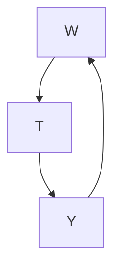
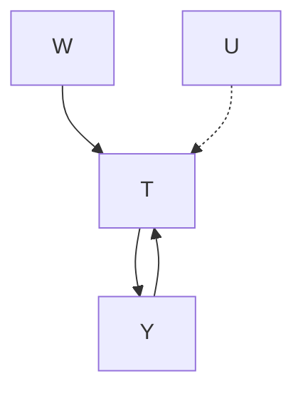

# 未观测混杂：边界与敏感性分析（Unobserved Confounding: Bounds and Sensitivity Analysis）

第7章中的所有方法都假设我们不存在任何**未观测混杂（unobserved confounding）**。然而，**无混杂性（unconfoundedness）**是一个不可检验的假设。在**观测性研究（observational studies）**中，也可能存在一些未观测的混杂变量。因此，我们希望了解我们的估计值对未观测混杂的**稳健性（robustness）**。我们可以采取的第一种方法是通过使用可信的假设来获得**因果效应（causal effect）**的上界和下界（第8.1节）。另一种方法是模拟混杂变量对处理的效应以及混杂变量对结果的效应需要达到多强，才能使真实的因果效应与我们的估计值产生显著差异（第8.2节）。

(a) 无未观测混杂

(b) 存在未观测混杂（$U$）  
图8.1：左侧是我们迄今为止所考虑的场景，其中我们满足无混杂性/后门准则。右侧是一个简单图，其中未观测混杂变量使得 $T$ 对 $Y$ 的因果效应不可识别。

8.1 边界（Bounds） . . . 73

无假设边界（No-Assumptions Bound） . . 74

单调处理响应（Monotone Treatment Response） . . . . . 76

单调处理选择（Monotone Treatment Selection） . 78

最优处理选择（Optimal Treatment Selection）79

8.2 敏感性分析（Sensitivity Analysis） . . . . . 82

线性设定中的敏感性基础（Sensitivity Basics in Linear Setting） 82

更一般的设定（More General Settings） . . . 85

## 8.1 边界（Bounds）

我们的假设的现实性或可信度与我们能够获得的识别结果的精确度之间存在权衡。Manski [53] 将此称为 **"可信度递减定律（The Law of Decreasing Credibility）"**：推断的可信度随着所维持假设的强度增加而降低。

根据我们愿意做出的假设，我们可以推导出因果效应的各种**非参数边界（nonparametric bounds）**。我们已经看到，如果我们愿意假设无混杂性（或某个因果效应可识别的因果图）和**积极性（positivity）**，我们就可以识别出因果效应的单一**点估计（point estimate）**。然而，这可能是不现实的。例如，在观测性研究中始终可能存在未观测混杂。

这正是 Charles Manski 在因果效应边界研究中的动机 [53–60]。这为我们提供了一个因果效应必须位于其中的区间，而不是告诉我们因果效应必须位于该区间内的确切点。在本节中，我们将介绍这些非参数边界以及如何推导它们。

我们考虑的假设比无混杂性更弱，因此它们给出了因果效应必须落在此区间内的范围（在这些假设下）。如果我们假设更强的无混杂性，这些区间将坍缩为一个点。这说明了可信度递减定律。

[53]: Manski (2003), Partial Identification of Probability Distributions: Springer Series in Statistics

[54]: Manski (1989), 'Anatomy of the Selection Problem'  
[55]: Manski (1990), 'Nonparametric Bounds on Treatment Effects'  
[56]: Manski (1993), 'Identification Problems in the Social Sciences'  
[57]: Manski (1994), 'The selection problem'  
[58]: Manski (1997), 'Monotone Treatment Response'  
[59]: Manski and Pepper (2000), 'Monotone Instrumental Variables: With an Application to the Returns to Schooling'  
[53]: Manski (2003), Partial Identification of Probability Distributions: Springer Series in Statistics  
[60]: Manski (2013), Public Policy in an Uncertain World

## 8.1.1 无假设边界（No-Assumptions Bound）

假设我们对**潜在结果（potential outcomes）** $Y(0)$ 和 $Y(1)$ 的全部了解就是它们介于 0 和 1 之间。那么，一个**个体处理效应（Individual Treatment Effect, ITE）** $Y_i(1) - Y_i(0)$ 的最大值为 1（1 - 0），最小值为 -1（0 - 1）：

$$
- 1 \leq Y _ {i} (1) - Y _ {i} (0) \leq 1 \quad \text { 如果 } \forall t, 0 \leq Y (t) \leq 1 \tag {8.1}
$$

因此，我们知道所有 ITE 必须位于长度为 2 的区间内。由于所有 ITE 都必须落在这个长度为 2 的区间内，**平均处理效应（Average Treatment Effect, ATE）** 也必须落在这个长度为 2 的区间内。有趣的是，对于 ATE，我们可以在不做任何假设（除了结果的最小/最大值之外）的情况下，将该区间的长度减半；ATE 必须落人的区间长度仅为 1。

我们将从 Manski [55] 的结果出发，在结果介于 $a$ 和 $b$ 之间的更一般场景中展示这一结论：

**假设 8.1（有界潜在结果，Bounded Potential Outcomes）**

$$
\forall t, a \leq Y (t) \leq b \tag {8.2}
$$

根据与上述相同的推理，这给出了 ITE 和 ATE 的以下边界：

$$
a - b \leq Y _ {i} (1) - Y _ {i} (0) \leq b - a \tag {8.3}
$$

$$
a - b \leq \mathbb {E} [ Y (1) - Y (0) ] \leq b - a \tag {8.4}
$$

这些区间的长度为 $(b - a) - (a - b) = 2(b - a)$。如果没有进一步的假设，ITE 的边界无法变得更紧凑。然而，看似神奇的是，我们可以将 ATE 区间的长度减半。为了理解这一点，我们将 ATE 重写如下：

$$
\begin{array}{l} \mathbb {E} [ Y (1) - Y (0) ] = \mathbb {E} [ Y (1) ] - \mathbb {E} [ Y (0) ] (8.5) \\ = P (T = 1) \mathbb {E} [ Y (1) \mid T = 1 ] + P (T = 0) \mathbb {E} [ Y (1) \mid T = 0 ] \\ - P (T = 1) \mathbb {E} [ Y (0) \mid T = 1 ] - P (T = 0) \mathbb {E} [ Y (0) \mid T = 0 ] (8.6) \\ \end{array}
$$

我们立即识别出第一项和最后一项是我们可以从观测数据中估计的友好条件期望：

$$
\begin{array}{l} = P (T = 1) \mathbb {E} [ Y \mid T = 1 ] + P (T = 0) \mathbb {E} [ Y (1) \mid T = 0 ] \\ - P (T = 1) \mathbb {E} [ Y (0) \mid T = 1 ] - P (T = 0) \mathbb {E} [ Y \mid T = 0 ] \tag {8.7} \\ \end{array}
$$

由于这是一个非常重要的分解，我们将在继续进行边界推导之前为其命名并框出。我们将其称为 **观测-反事实分解（observational-counterfactual decomposition）**（ATE 的）。此外，为了符号更简洁，我们将在后续使用 $\pi \triangleq P ( T = 1 )$。

**命题 8.1（观测-反事实分解，Observational-Counterfactual Decomposition）**

$$
\begin{array}{l} \mathbb {E} [ Y (1) - Y (0) ] = \pi \mathbb {E} [ Y \mid T = 1 ] + (1 - \pi) \mathbb {E} [ Y (1) \mid T = 0 ] \\ - \pi   \mathbb {E} [ Y (0) \mid T = 1 ] - (1 - \pi)   \mathbb {E} [ Y \mid T = 0 ] \tag {8.8} \\ \end{array}
$$

不幸的是，$\mathbb { E } [ Y ( 1 ) \mid T = 0 ]$ 和 $\mathbb { E } [ Y ( 0 ) \mid T = 1 ]$ 是**反事实（counterfactual）**的。然而，我们知道它们介于 $a$ 和 $b$ 之间。因此，我们通过让被加项 $(\mathbb { E } [ Y ( 1 ) \mid T = 0 ])$ 等于 $b$ 以及让被减项 $(\mathbb { E } [ Y ( 0 ) \mid T = 1 ])$ 等于 $a$ 来获得完整表达式的上界。类似地，我们可以通过让被加项等于 $a$ 以及让被减项等于 $b$ 来获得下界。

**命题 8.2（无假设边界，No-Assumptions Bound）** 令 $\pi$ 表示 $P ( T = 1 )$，其中 $T$ 是一个二元随机变量。给定结果 $Y$ 介于 $a$ 和 $b$ 之间（假设 8.1），我们对 ATE 有以下上界和下界：

$$
\begin{array}{l} \mathbb {E} [ Y (1) - Y (0) ] \leq \pi   \mathbb {E} [ Y \mid T = 1 ] + (1 - \pi) b - \pi a - (1 - \pi) \mathbb {E} [ Y \mid T = 0 ] (8.9) \\ \mathbb {E} [ Y (1) - Y (0) ] \geq \pi   \mathbb {E} [ Y \mid T = 1 ] + (1 - \pi) a - \pi b - (1 - \pi) \mathbb {E} [ Y \mid T = 0 ] (8.10) \\ \end{array}
$$

重要的是，该区间的长度为 $b - a$，是我们在方程 8.4 中看到的朴素区间长度的一半。我们可以通过从上界减去下界来看到这一点：

$$
\begin{array}{l} \pi \mathbb {E} [ Y \mid T = 1 ] + (1 - \pi) b - \pi a - (1 - \pi) \mathbb {E} [ Y \mid T = 0 ] \\ - (\pi \mathbb {E} [ Y \mid T = 1 ] + (1 - \pi) a - \pi b - (1 - \pi) \mathbb {E} [ Y \mid T = 0 ]) \\ = (1 - \pi) b + \pi b - \pi a - (1 - \pi) a (8.11) \\ = b - a (8.12) \\ \end{array}
$$

这有时被称为 **"无假设边界（no-assumptions bound）"**，因为我们除了结果有界之外没有做任何假设。如果结果没有界，那么 ATE 和 ITE 可以位于 $-\infty$ 和 $\infty$ 之间的任何位置。

## 运行示例（Running Example）

假设我们知道结果介于 0 和 1 之间（例如，因为我们处于二元结果设定中）。这意味着 ITE 必须介于 -1（0 - 1）和 1（1 - 0）之间，这也意味着 ATE 必须介于 -1 和 1 之间。对于这个例子，还假设 $\pi = 0.3$，$\mathbb { E } [ Y \mid T = 1 ] = 0.9$，以及 $\mathbb { E } [ Y \mid T = 0 ] = 0.2$。然后，将这些代入方程 8.9 和 8.10，我们得到 ATE 的以下边界：

$$
\begin{array}{l} \mathbb {E} [ Y (1) - Y (0) ] \leq (0.3)(0.9) + (1 - 0.3)(1) - (0.3)(0) - (1 - 0.3)(0.2) (8.13) \\ \mathbb {E} [ Y (1) - Y (0) ] \geq (0.3)(0.9) + (1 - 0.3)(0) - (0.3)(1) - (1 - 0.3)(0.2) (8.14) \\ \end{array}
$$

$$
- 0.17 \leq \mathbb {E} [ Y (1) - Y (0) ] \leq 0.83 \tag {8.15}
$$

请注意，该区间的长度为 1（$b - a = 1$），是朴素区间 $-1 \le \mathbb { E } [ Y ( 1 ) - Y ( 0 ) ] \le 1$（方程 8.4）长度的一半。我们将在第 8.1 节中一直使用这个运行示例。

## 主动阅读练习：

1. 假设我们具有积极性，我们可以为 **条件平均处理效应（Conditional Average Treatment Effect, CATE）** $\mathbb { E } [ Y ( 1 ) - Y ( 0 ) \mid X ]$ 获得什么样的边界？如果我们没有积极性，会出什么问题？
2. 假设潜在结果以不同的方式有界：$a_1 \leq Y(1) \leq b_1$ 和 $a_0 \leq Y(0) \leq b_0$。在这个更一般的设定中，推导相应的无假设边界。

命题 8.2 中的边界是在没有进一步假设的情况下我们可以得到的最紧凑边界。不幸的是，相应的区间总是包含 0，这意味着我们无法使用这个边界来区分"无因果效应"和"有因果效应"。我们能得到更紧凑的边界吗？

为了界定 ATE，我们必须对分解中的反事实部分有一些信息。我们可以很容易地从数据中估计观测部分。在无假设边界（命题 8.2）中，我们唯一的假设是结果由 $a$ 和 $b$ 界定。如果我们做出更多假设，我们可以得到更小的区间。在接下来的几节中，我们将介绍一些在某些情况下相当合理的假设，以及这些假设为我们带来的更紧凑边界。我们用于所有这些假设的一般策略是从 ATE 的观测-反事实分解（命题 8.1）开始：

$$
\begin{array}{l} \mathbb {E} [ Y (1) - Y (0) ] = \pi \mathbb {E} [ Y \mid T = 1 ] + (1 - \pi) \mathbb {E} [ Y (1) \mid T = 0 ] \\ - \pi \mathbb {E} [ Y (0) \mid T = 1 ] - (1 - \pi) \mathbb {E} [ Y \mid T = 0 ], \\ \end{array}
$$

并通过使用我们做出的不同假设来界定反事实部分，从而获得更小的区间。

我们在接下来几小节中看到的区间都将包含零。直到第 8.1.4 节我们才会看到一个纯粹为正或纯粹为负的区间，所以如果你只想看那些区间，可以随意跳到那一节。

## 8.1.2 单调处理响应（Monotone Treatment Response）

对于超越有界结果假设的第一个假设，考虑我们发现自己处于这样的设定中：处理只能有帮助；它不能有害。这是 Manski [58] 在其语境中考虑的设定。在这个设定中，我们可以证明**单调处理响应（Monotone Treatment Response, MTR）** 假设是合理的：

**假设 8.2（非负单调处理响应，Nonnegative Monotone Treatment Response）**

$$
\forall i Y _ {i} (1) \geq Y _ {i} (0) \tag {8.16}
$$

这意味着每个 ITE 都是非负的，因此我们可以将 ITE 的下界从 $a - b$（方程 8.3）提高到 0。因此，直观上，这意味着 ATE 的下界应该提高到 0。我们接下来将看到确实如此。

现在，我们不再用 $a$ 来下界化 $\mathbb { E } [ Y ( 1 ) \mid T = 0 ]$ 和用 $-b$ 来下界化 $-\mathbb { E } [ Y ( 0 ) \mid T = 1 ]$，而是可以做得更好。因为处理只会有帮助，$\mathbb { E } [ Y ( 1 ) \mid T = 0 ] \ge \mathbb { E } [ Y ( 0 ) \mid T = 0 ] = \mathbb { E } [ Y \mid T = 0 ]$，所以我们可以用 $\mathbb { E } [ Y \mid T = 0 ]$ 来下界化 $\mathbb { E } [ Y ( 1 ) \mid T = 0 ]$。类似地，$-\mathbb { E } [ Y ( 0 ) \mid T = 1 ] \geq -\mathbb { E } [ Y ( 1 ) \mid T = 1 ] = -\mathbb { E } [ Y \mid T = 1 ]$（因为乘以负数会翻转不等式），所以我们可以用 $-\mathbb { E } [ Y \mid T = 1 ]$ 来下界化 $-\mathbb { E } [ Y ( 0 ) \mid T = 1 ]$。因此，我们可以改进无假设下界，得到 0，正如我们的直觉所建议的：

$$
\begin{array}{l} \mathbb {E} [ Y (1) - Y (0) ] = \pi \mathbb {E} [ Y \mid T = 1 ] + (1 - \pi) \mathbb {E} [ Y (1) \mid T = 0 ] \\ - \pi \mathbb {E} [ Y (0) \mid T = 1 ] - (1 - \pi) \mathbb {E} [ Y \mid T = 0 ] \\ \geq \pi \mathbb {E} [ Y \mid T = 1 ] + (1 - \pi) \mathbb {E} [ Y \mid T = 0 ] \\ - \pi   \mathbb {E} [ Y \mid T = 1 ] - (1 - \pi)   \mathbb {E} [ Y \mid T = 0 ] (8.17) \\ = 0 (8.18) \\ \end{array}
$$

**命题 8.3（非负 MTR 下界，Nonnegative MTR Lower Bound）** 在非负 MTR 假设下，ATE 从下方有界于 0。数学上：

$$
\mathbb {E} [ Y (1) - Y (0) ] \geq 0 \tag {8.19}
$$

**运行示例** 无假设上界在此仍然适用，因此在我们的运行示例中，其中 $\pi = 0.3$，$\mathbb { E } [ Y \mid T = 1 ] = 0.9$，以及 $\mathbb { E } [ Y \mid T = 0 ] = 0.2$，我们的 ATE 区间从 $[-0.17, 0.83]$（方程 8.15）改进为 $[0, 0.83]$。

或者，假设处理只能伤害人；它不能帮助他们（例如，枪伤只会降低存活几率）。在这些情况下，我们将有**非正单调处理响应（nonpositive monotone treatment response）** 假设和非正 MTR 上界：

**假设 8.3（非正单调处理响应，Nonpositive Monotone Treatment Response）**

$$
\forall i Y _ {i} (1) \leq Y _ {i} (0) \tag {8.20}
$$

**命题 8.4（非正 MTR 上界，Nonpositive MTR Upper Bound）** 在非正 MTR 假设下，ATE 从上方有界于 0。数学上：

$$
\mathbb {E} [ Y (1) - Y (0) ] \leq 0 \tag {8.21}
$$

**运行示例** 在这个设定中，无假设下界仍然适用。这意味着在我们的示例中，ATE 区间从 $[-0.17, 0.83]$（方程 8.15）改进为 $[-0.17, 0]$。

**主动阅读练习：** 如果我们同时假设非负 MTR 和非正 MTR，ATE 区间是什么？这直观上合理吗？

## 8.1.3 单调处理选择（Monotone Treatment Selection）

我们要考虑的下一个假设是，选择处理的人在任一处理场景下都会比未选择处理的人有更好的结果。Manski 和 Pepper [59] 将其引入为**单调处理选择（Monotone Treatment Selection, MTS）** 假设。

## 假设 8.4（单调处理选择，Monotone Treatment Selection）

$$
\mathbb {E} [ Y (1) \mid T = 1 ] \geq \mathbb {E} [ Y (1) \mid T = 0 ] \tag {8.22}
$$

$$
\mathbb {E} [ Y (0) \mid T = 1 ] \geq \mathbb {E} [ Y (0) \mid T = 0 ] \tag {8.23}
$$

正如 Morgan 和 Winship [12，第 12.2.2 节] 所指出的，你可以将其视为**正向自我选择（positive self-selection）**。那些通常获得更好结果的人会自我选择进入处理组。同样，我们从**观测性反事实分解（observational counterfactual decomposition）**开始，现在利用 **MTS 假设（Assumption 8.4）** 获得一个上界：

命题 8.5（单调处理选择上界，Monotone Treatment Selection Upper Bound）在 MTS 假设下，**平均处理效应（ATE）** 被关联性差异从上方界定。数学上表示为：

$$
\mathbb {E} [ Y (1) - Y (0) ] \leq \mathbb {E} [ Y \mid T = 1 ] - \mathbb {E} [ Y \mid T = 0 ] \tag {8.24}
$$

证明。

$$
\mathbb {E} [ Y (1) - Y (0) ] = \pi \mathbb {E} [ Y \mid T = 1 ] + (1 - \pi) \mathbb {E} [ Y (1) \mid T = 0 ]
$$

$$
- \pi \mathbb {E} [ Y (0) \mid T = 1 ] - (1 - \pi) \mathbb {E} [ Y \mid T = 0 ]
$$

𝑇(8.8 回顾)

$$
\leq \pi \mathbb {E} [ Y \mid T = 1 ] + (1 - \pi) \mathbb {E} [ Y \mid T = 1 ]
$$

$$
- \pi   \mathbb {E} [ Y \mid T = 0 ] - (1 - \pi)   \mathbb {E} [ Y \mid T = 0 ] \tag {8.25}
$$

$$
= \mathbb {E} [ Y \mid T = 1 ] - \mathbb {E} [ Y \mid T = 0 ] \tag {8.26}
$$

其中，公式 8.25 源自以下事实：(a) MTS 假设中的公式 8.22 允许我们用 $\mathbb { E } [ Y ( 1 ) \mid T = 1 ] = \mathbb { E } [ Y \mid T = 1 ]$ 来上界 $\mathbb { E } [ Y ( 1 ) \mid T = 0 ]$；(b) MTS 假设中的公式 8.23 允许我们用 $- \mathbb { E } [ Y \mid T = 0 ]$ 来上界 $- \mathbb { E } [ Y ( 0 ) \mid T = 1 ]$。 □

运行示例（Running Example）回顾我们在第 8.1.1 节中的运行示例，其中 $\pi = . 3 , \mathbb { E } [ Y \mid T = 1 ] = . 9 ,$ ，且 $\mathbb { E } [ Y \mid T = 0 ] = . 2$ 。MTS 假设给出了一个上界，我们仍然有**无假设下界（no-assumptions lower bound）**6。这意味着在我们的示例中，ATE 区间从 $[-0.17, 0.83]$（公式 8.15）改善为 $[-0.17, 0.7]$。

同时使用 MTR 和 MTS（Both MTR and MTS）然后，我们可以将非负的 MTR 假设（假设 8.2）与 MTS 假设（假设 8.4）结合起来，分别得到命题 8.3 中的下界和命题 8.5 中的上界。在我们的运行示例中，这给出了 ATE 的以下区间：$[0, 0.7]$。

[59]: Manski and Pepper (2000), ‘Monotone Instrumental Variables: With an Application to the Returns to Schooling’

[12]: Morgan and Winship (2014), Counterfactuals and Causal Inference: Methods and Principles for Social Research

6 回顾无假设下界（命题 8.2）：

$$
\mathbb {E} [ Y (1) - Y (0) ]
$$

$$
\geq \pi \mathbb {E} [ Y \mid T = 1 ] + (1 - \pi) a
$$

$$
- \pi b - (1 - \pi) \mathbb {E} [ Y \mid T = 0 ]
$$

𝑌 𝑇(8.10 回顾)

区间包含零（Intervals Contain Zero）尽管来自 MTR 和 MTS 假设的界有助于排除非常大或非常小的因果效应，但相应的区间仍然包含零。这意味着这些假设不足以识别效应是否存在。

## 8.1.4 最优处理选择（Optimal Treatment Selection）

我们现在考虑来自 Manski [55] 的所谓**最优处理选择（optimal treatment selection, OTS）假设**。该假设意味着个体总是接受对他们最有利的处理（例如，如果一位专家医生正在决定给人们什么治疗）。我们将其数学表述如下：

假设 8.5（最优处理选择，Optimal Treatment Selection）

$$
T _ {i} = 1 \implies Y _ {i} (1) \geq Y _ {i} (0), \quad T _ {i} = 0 \implies Y _ {i} (0) > Y _ {i} (1) \tag {8.27}
$$

根据 OTS 假设，我们知道：

$$
\mathbb {E} [ Y (1) \mid T = 0 ] \leq \mathbb {E} [ Y (0) \mid T = 0 ] = \mathbb {E} [ Y \mid T = 0 ]. \tag {8.28}
$$

因此，我们可以通过用 $\mathbb { E } [ Y \mid T = 0 ]$ 上界 $\mathbb { E } [ Y ( 1 ) \mid T = 0 ]$，并用 $-\mathbb { E } [ Y \mid T = 0 ]$ 上界 $- \mathbb { E } [ Y ( 0 ) \mid T = 1 ]$（与无假设上界7相同）来给出一个上界：

$$
\begin{array}{l} \mathbb {E} [ Y (1) - Y (0) ] = \pi \mathbb {E} [ Y \mid T = 1 ] + (1 - \pi) \mathbb {E} [ Y (1) \mid T = 0 ] \\ - \pi \mathbb {E} [ Y (0) \mid T = 1 ] - (1 - \pi) \mathbb {E} [ Y \mid T = 0 ] \\ \leq \pi \mathbb {E} [ Y \mid T = 1 ] + (1 - \pi) \mathbb {E} [ Y \mid T = 0 ] \\ - \pi a - (1 - \pi) \mathbb {E} [ Y \mid T = 0 ] (8.29) \\ = \pi \mathbb {E} [ Y \mid T = 1 ] - \pi a (8.30) \\ \end{array}
$$

OTS 假设还告诉我们：

$$
\mathbb {E} [ Y (0) \mid T = 1 ] \leq \mathbb {E} [ Y (1) \mid T = 1 ] = \mathbb {E} [ Y \mid T = 1 ], \tag {8.31}
$$

这等价于说 $- \mathbb { E } [ Y ( 0 ) \mid T = 1 ] \ge - \mathbb { E } [ Y \mid T = 1 ]$ 。因此，我们可以用 $- \mathbb { E } [ Y \mid T = 1 ]$ 下界 $- \mathbb { E } [ Y ( 0 ) \mid T = 1 ]$，并用 $a$ 下界 $\mathbb { E } [ Y ( 1 ) \mid T = 0 ]$（正如我们在无假设下界8中所做的那样），得到以下下界：

$$
\begin{array}{l} \mathbb {E} [ Y (1) - Y (0) ] = \pi \mathbb {E} [ Y \mid T = 1 ] + (1 - \pi) \mathbb {E} [ Y (1) \mid T = 0 ] \\ - \pi \mathbb {E} [ Y (0) \mid T = 1 ] - (1 - \pi) \mathbb {E} [ Y \mid T = 0 ] \\ \end{array}
$$

$$
\begin{array}{l} \geq \pi \mathbb {E} [ Y \mid T = 1 ] + (1 - \pi) a \\ - \pi   \mathbb {E} [ Y \mid T = 1 ] - (1 - \pi)   \mathbb {E} [ Y \mid T = 0 ] (8.32) \\ = (1 - \pi) a - (1 - \pi) \mathbb {E} [ Y \mid T = 0 ] (8.33) \\ \end{array}
$$

[55]: Manski (1990), ‘Nonparametric Bounds on Treatment Effects’

7 回顾无假设上界（命题 8.2）：

$$
\begin{array}{l} \mathbb {E} [ Y (1) - Y (0) ] \\ \leq \pi \mathbb {E} [ Y \mid T = 1 ] + (1 - \pi) b \\ - \pi a - (1 - \pi) \mathbb {E} [ Y \mid T = 0 ] \tag {8.9revisited} \\ \end{array}
$$

8 回顾无假设下界（命题 8.2）：

$$
\begin{array}{l} \mathbb {E} [ Y (1) - Y (0) ] \\ \geq \pi \mathbb {E} [ Y \mid T = 1 ] + (1 - \pi) a \\ - \pi b - (1 - \pi) \mathbb {E} [ Y \mid T = 0 ] \tag {8.10revisited} \\ \end{array}
$$

命题 8.6（最优处理选择界 1，Optimal Treatment Selection Bound 1）令 $\pi$ 表示 $P ( T = 1 )$ ，其中 $T$ 是一个二元随机变量。假设结果 $Y$ 以 $a$ 为下界（假设 8.1），并且总是进行最优处理选择（假设 8.5），则 ATE 有以下上界和下界：

$$
\mathbb {E} [ Y (1) - Y (0) ] <   \pi \mathbb {E} [ Y \mid T = 1 ] - \pi a \tag {8.34}
$$

$$
\mathbb {E} [ Y (1) - Y (0) ] \geq (1 - \pi) a - (1 - \pi) \mathbb {E} [ Y \mid T = 0 ] \tag {8.35}
$$

$$
\text { 区间长度 (Interval Length) } = \pi   \mathbb {E} [ Y \mid T = 1 ] + (1 - \pi)   \mathbb {E} [ Y \mid T = 0 ] - a \tag {8.36}
$$

遗憾的是，这个区间也总是包含零9！这意味着命题 8.6 不能告诉我们因果效应是否非零。

运行示例（Running Example）回顾我们在第 8.1.1 节中的运行示例，其中 $a = 0 , b = 1 , \pi = . 3 , \mathbb { E } [ Y \mid T = 1 ] = . 9 ,$ 且 $\mathbb { E } [ Y \mid T = 0 ] = . 2$ 。将这些值代入命题 8.6 得到以下结果：

$$
\mathbb {E} [ Y (1) - Y (0) ] \leq (. 3) (. 9) - (. 3) (0) \tag {8.37}
$$

$$
\mathbb {E} [ Y (1) - Y (0) ] \geq (1 -. 3) (0) - (1 -. 3) (. 2) \tag {8.38}
$$

$$
- 0. 1 4 \leq \mathbb {E} [ Y (1) - Y (0) ] \leq 0. 2 7 \tag {8.39}
$$

$$
\text { 区间长度 (Interval Length) } = 0. 4 1 \tag {8.40}
$$

我们现在将给出一个可以是纯粹正数或纯粹负数的区间，从而可能将 ATE 识别为非零。

## 一个可以识别 ATE 符号的界（A Bound That Can Identify the Sign of the ATE）

事实证明，尽管我们采用了 Manski [55] 的 OTS 假设，但我们在命题 8.6 中给出的界实际上并不是 Manski [55] 在该假设下推导出的界。例如，当我们使用 $\mathbb { E } [ Y ( 1 ) \mid T = 0 ] \le \mathbb { E } [ Y \mid T = 0 ]$ 时，Manski 使用的是 $\mathbb { E } [ Y ( 1 ) \mid T = 0 ] \leq \mathbb { E } [ Y \mid T = 1 ]$ 。我们将根据 OTS 假设快速证明 Manski 使用的这个不等式10：我们首先应用公式 8.42：

$$
\mathbb {E} [ Y (1) \mid T = 0 ] = \mathbb {E} [ Y (1) \mid Y (0) > Y (1) ] \tag {8.45}
$$

因为我们取期望的随机变量是 $Y ( 1 )$ ，如果将 $Y ( 0 ) > Y ( 1 )$ 翻转为 $Y ( 0 ) \leq Y ( 1 )$ ，那么我们就得到一个上界：

$$
\leq \mathbb {E} [ Y (1) \mid Y (0) \leq Y (1) ] \tag {8.46}
$$

最后，应用公式 8.44，我们得到结果：

$$
= \mathbb {E} [ Y (1) \mid T = 1 ] \tag {8.47}
$$

$$
= \mathbb {E} [ Y \mid T = 1 ] \tag {8.48}
$$

现在我们有了 $\mathbb { E } [ Y ( 1 ) \mid T = 0 ] \le \mathbb { E } [ Y \mid T = 1 ]$ ，我们可以证明 Manski [55] 的上界，在公式 8.49 中我们使用了这个关键不等式：

9 主动阅读练习：证明该区间总是包含零。

[55]: Manski (1990), ‘Nonparametric Bounds on Treatment Effects’

10 回顾 OTS 假设（假设 8.5）：

$$
T _ {i} = 1 \implies Y _ {i} (1) \geq Y _ {i} (0) \tag {8.41}
$$

$$
T _ {i} = 0 \implies Y _ {i} (0) > Y _ {i} (1) \tag {8.42}
$$

因为 $T$ 只能取两个值，这等价于以下（逆否命题，contrapositives）：

$$
T _ {i} = 0 \iff Y _ {i} (1) <   Y _ {i} (0) \tag {8.43}
$$

$$
T _ {i} = 1 \iff Y _ {i} (0) \leq Y _ {i} (1) \tag {8.44}
$$

[55]: Manski (1990), ‘Nonparametric Bounds on Treatment Effects’

$$
\begin{array}{l} \mathbb {E} [ Y (1) - Y (0) ] = \pi \mathbb {E} [ Y \mid T = 1 ] + (1 - \pi) \mathbb {E} [ Y (1) \mid T = 0 ] \\ - \pi \mathbb {E} [ Y (0) \mid T = 1 ] - (1 - \pi) \mathbb {E} [ Y \mid T = 0 ] \\ \leq \pi \mathbb {E} [ Y \mid T = 1 ] + (1 - \pi) \mathbb {E} [ Y (1) \mid T = 1 ] \\ - \pi a - (1 - \pi) \mathbb {E} [ Y \mid T = 0 ] (8.49) \\ = \pi \mathbb {E} [ Y \mid T = 1 ] + (1 - \pi) \mathbb {E} [ Y \mid T = 1 ] \\ - \pi a - (1 - \pi) \mathbb {E} [ Y \mid T = 0 ] (8.50) \\ = \mathbb {E} [ Y \mid T = 1 ] - \pi a - (1 - \pi) \mathbb {E} [ Y \mid T = 0 ] (8.51) \\ \end{array}
$$

类似地，我们可以进行类似的推导11 得到下界：

$$
\mathbb {E} [ Y (1) - Y (0) ] \geq \pi   \mathbb {E} [ Y \mid T = 1 ] + (1 - \pi)   a - \mathbb {E} [ Y \mid T = 0 ] \tag {8.52}
$$

命题 8.7（最优处理选择界 2，Optimal Treatment Selection Bound 2）令 $\pi$ 表示 $P ( T = 1 )$ ，其中 $T$ 是一个二元随机变量。假设结果 $Y$ 以 $a$ 为下界（假设 8.1），并且总是进行最优处理选择（假设 8.5），则 ATE 有以下上界和下界：

$$
\begin{array}{l} \mathbb {E} [ Y (1) - Y (0) ] \leq \mathbb {E} [ Y \mid T = 1 ] - \pi a - (1 - \pi) \mathbb {E} [ Y \mid T = 0 ] (8.53) \\ \mathbb {E} [ Y (1) - Y (0) ] \geq \pi   \mathbb {E} [ Y \mid T = 1 ] + (1 - \pi)   a - \mathbb {E} [ Y \mid T = 0 ] (8.54) \\ \text { 区间长度 (Interval Length) } = (1 - \pi) \mathbb {E} [ Y \mid T = 1 ] + \pi \mathbb {E} [ Y \mid T = 0 ] - a (8.55) \\ \end{array}
$$

这个区间也可能包含零，但并非必须如此。例如，在我们的运行示例中，它不包含零。

运行示例（Running Example）回顾我们在第 8.1.1 节中的运行示例，其中 $a = 0 , b = 1 , \pi = . 3 , \mathbb { E } [ Y \mid T = 1 ] = . 9 ,$ 且 $\mathbb { E } [ Y \mid T = 0 ] = . 2$ 。将这些值代入命题 8.7 得到以下 OTS 界 2 的结果：

$$
\mathbb {E} [ Y (1) - Y (0) ] \leq (. 9) - (. 3) (0) - (1 -. 3) (. 2) \tag {8.56}
$$

$$
\mathbb {E} [ Y (1) - Y (0) ] \geq (. 3) (. 9) + (1 -. 3) (0) - (. 2) \tag {8.57}
$$

$$
0. 0 7 \leq \mathbb {E} [ Y (1) - Y (0) ] \leq 0. 7 6 \tag {8.58}
$$

$$
\text { 区间长度 (Interval Length) } = 0. 6 9 \tag {8.59}
$$

因此，虽然来自 Manski [55] 的 OTS 界 2 在我们的运行示例中识别了 ATE 的符号，但与 OTS 界 1 不同，OTS 界 2 给出的区间大了 68%。你可以通过比较公式 8.40（在上面的页边距中）与公式 8.59 看出这一点。

这阐明了一些重要的要点：

1.  不同的界在不同情况下表现更好12。
2.  不同的界可以在不同方面表现更好（例如，识别符号 vs. 获得更小的区间）。

混合界（Mixing Bounds）幸运的是，由于 OTS 界 1 和 OTS 界 2 都来自相同的假设（假设 8.5），我们可以采用 OTS 界 2 的下界和 OTS 界 1 的上界，得到以下更紧的区间，该区间仍然能识别符号：

$$
0. 0 7 \leq \mathbb {E} [ Y (1) - Y (0) ] \leq 0. 2 7 \tag {8.60}
$$

类似地，我们可以混合 OTS 界 1 的下界和 OTS 界 2 的上界，但对于这个特定示例，这将给出本小节中最差的区间。不过，它在另一个示例中可能是最好的。

在本节中，我们让你初步了解了可以从非参数界中获得哪些结果，当然，这只是一个介绍。有关此方面的更多文献，请参见，例如，[53–60]。

11 主动阅读练习：自己推导公式 8.52。

将 OTS 界 1（命题 8.6）应用于我们的运行示例：

$$
- 0. 1 4 \leq \mathbb {E} [ Y (1) - Y (0) ] \leq 0. 2 7 \tag {8.39revisited}
$$

区间长度 = 0.41 (8.40 回顾)

[55]: Manski (1990), ‘Nonparametric Bounds on Treatment Effects’

12 主动阅读练习：使用公式 8.40 和 8.59，推导出 OTS 界 1 产生较小区间的条件，以及 OTS 界 2 产生较小区间的条件。

## 8.2 敏感性分析（Sensitivity Analysis）

## 8.2.1 线性设定中的敏感性基础（Sensitivity Basics in Linear Setting）

在本章之前，我们一直专门研究因果效应可识别的设定。我们在图 8.2 中说明了混杂因子作为 $T$ 和 $Y$ 共同原因的常见示例。在此示例中，$T$ 对 $Y$ 的因果效应是可识别的。然而，如果存在一个单一的未观测混杂因子 $U$，如图 8.3 所示，那么因果效应就**不可识别**。

如果我们仅调整观测到的混杂因子 $W$，我们会观察到什么偏差？为了简单说明这一点，我们将从一个**无噪声**的线性数据生成过程开始。因此，考虑由以下结构方程生成的数据：

$$
T := \alpha_ {w} W + \alpha_ {u} U \tag {8.61}
$$

$$
Y := \beta_ {w} W + \beta_ {u} U + \delta T \tag {8.62}
$$

因此，描述 $T$ 对 $Y$ 因果效应的相关量是 $\delta$，因为它是 $Y$ 结构方程中 $T$ 前面的系数。根据**后门调整（backdoor adjustment）**（定理 4.2）/**调整公式（adjustment formula）**（定理 2.1），我们知道：

$$
\mathbb {E} [ Y (1) - Y (0) ] = \mathbb {E} _ {W, U} [ \mathbb {E} [ Y \mid T = 1, W, U ] - \mathbb {E} [ Y \mid T = 0, W, U ] ] = \delta \tag {8.63}
$$

但是，由于 $U$ 未被观测到，我们最多只能仅调整 $W$。这会导致一个大小为 $\frac { \beta _ { u } } { \alpha _ { u } }$ 的混杂偏差。这里我们将专注于**识别（identification）**，而非估计（estimation），因此我们假设拥有无限数据。这意味着我们可以访问 $P(W, T, Y)$。然后，我们将写下并证明关于混杂偏差的以下命题：

**命题 8.8** 当 $T$ 和 $Y$ 由方程 8.61 和 8.62 中的无噪声线性过程生成时，仅调整 $W$（而不调整 $U$）的混杂偏差为 $\frac { \beta _ { u } } { \alpha _ { u } }$。数学上表示为：

$$
\begin{array}{l} \mathbb {E} _ {W} \left[ \mathbb {E} [ Y \mid T = 1, W ] - \mathbb {E} [ Y \mid T = 0, W ] \right] \\ - \mathbb {E} _ {W, U} [ \mathbb {E} [ Y \mid T = 1, W, U ] - \mathbb {E} [ Y \mid T = 0, W, U ] ] = \frac {\beta_ {u}}{\alpha_ {u}} \tag {8.64} \\ \end{array}
$$

**证明。** 我们将分三步证明命题 8.8：

1.  用 $\alpha_{w}, \alpha_{u}, \beta_{w}$ 和 $\beta_{u}$ 表示 $\mathbb {E}_{W} \left[ \mathbb {E} [ Y \mid T = t, W ] \right]$ 的闭式表达式。
2.  利用步骤 1 得到差值 $\mathbb {E}_{W} [ \mathbb {E} [ Y \mid T = 1, W ] - \mathbb {E} [ Y \mid T = 0, W ] ]$ 的闭式表达式。
3.  减去 $\mathbb {E}_{W, U} \left[ \mathbb {E} [ Y \mid T = 1, W, U ] - \mathbb {E} [ Y \mid T = 0, W, U ] \right] = \delta$。$^{14}$

首先，我们使用 $Y$ 的结构方程（方程 8.62）：

$$
\mathbb {E} _ {W} \left[ \mathbb {E} [ Y \mid T = t, W ] \right] = \mathbb {E} _ {W} \left[ \mathbb {E} [ \beta_ {w} W + \beta_ {u} U + \delta T \mid T = t, W ] \right] \tag {8.65}
$$

$$
= \mathbb {E} _ {W} \left[ \beta_ {w} W + \beta_ {u} \mathbb {E} [ U \mid T = t, W ] + \delta t \right] \tag {8.66}
$$

这里我们使用了 $T$ 的结构方程（方程 8.61）。重新排列该方程得到 $U = \frac { T - \alpha_{w} W } { \alpha_{u} }$。然后我们可以将其用于剩余的条件期望：

$$
\begin{array}{l} = \mathbb {E} _ {W} \left[ \beta_ {w} W + \beta_ {u} \left(\frac {t - \alpha_ {w} W}{\alpha_ {u}}\right) + \delta t \right] (8.67) \\ = \mathbb {E} _ {W} \left[ \beta_ {w} W + \frac {\beta_ {u}}{\alpha_ {u}} t - \frac {\beta_ {u} \alpha_ {w}}{\alpha_ {u}} W + \delta t \right] (8.68) \\ = \beta_ {w} \mathbb {E} [ W ] + \frac {\beta_ {u}}{\alpha_ {u}} t - \frac {\beta_ {u} \alpha_ {w}}{\alpha_ {u}} \mathbb {E} [ W ] + \delta t (8.69) \\ \end{array}
$$

然后，稍作整理，我们得到：

$$
= \left(\delta + \frac {\beta_ {u}}{\alpha_ {u}}\right) t + \left(\beta_ {w} - \frac {\beta_ {u} \alpha_ {w}}{\alpha_ {u}}\right) \mathbb {E} [ W ] \tag {8.70}
$$

其中唯一重要的部分是依赖于 $t$ 的部分，因为我们想知道 $T$ 对 $Y$ 的影响。例如，考虑如果我们仅调整 $W$ 所得到的预期 **平均处理效应（Average Treatment Effect, ATE）** 估计：

$$
\begin{array}{l} \mathbb {E} _ {W} \left[ \mathbb {E} [ Y \mid T = 1, W ] - \mathbb {E} [ Y \mid T = 0, W ] \right] (8.71) \\ = \left(\delta + \frac {\beta_ {u}}{\alpha_ {u}}\right) (1) + \left(\beta_ {w} - \frac {\beta_ {u} \alpha_ {w}}{\alpha_ {u}}\right) \mathbb {E} [ W ] \\ - \left[ \left(\delta + \frac {\beta_ {u}}{\alpha_ {u}}\right) (0) + \left(\beta_ {w} - \frac {\beta_ {u} \alpha_ {w}}{\alpha_ {u}}\right) \mathbb {E} [ W ] \right] (8.72) \\ = \delta + \frac {\beta_ {u}}{\alpha_ {u}} (8.73) \\ \end{array}
$$

$^{14}$ 主动阅读练习：证明 $\mathbb {E}_{W, U} \left[ \mathbb {E} [ Y \mid T = 1, W, U ] - \mathbb {E} [ Y \mid T = 0, W, U ] \right]$ 等于 $\delta$。

$$
Y := \beta_ {w} W + \beta_ {u} U + \delta T \quad (8. 6 2 \text {  重述 })
$$

$$
T := \alpha_ {w} W + \alpha_ {u} U \quad (8. 6 1 \text {  重述 })
$$

最后，减去 $\mathbb {E}_{W, U} \left[ \mathbb {E} [ Y \mid T = 1, W, U ] - \mathbb {E} [ Y \mid T = 0, W, U ] \right]$：

$$
\begin{array}{l} \mathrm{Bias} = \mathbb {E} _ {W} \left[ \mathbb {E} [ Y \mid T = 1, W ] - \mathbb {E} [ Y \mid T = 0, W ] \right] \\ - \mathbb {E} _ {W, U} [ \mathbb {E} [ Y \mid T = 1, W, U ] - \mathbb {E} [ Y \mid T = 0, W, U ] ] (8.74) \\ = \delta + \frac {\beta_ {u}}{\alpha_ {u}} - \delta (8.75) \\ = \frac {\beta_ {u}}{\alpha_ {u}} (8.76) \\ \end{array}
$$

**推广到任意图/估计量（Generalization to Arbitrary Graphs/Estimands）** 这里，我们对图 8.4 中简单图结构的 ATE 进行了敏感性分析。对于任意图中的任意估计量，其中结构方程是线性的，请参阅 Cinelli 等人 [61]。

## 敏感性等高线图（Sensitivity Contour Plots）

由于命题 8.8 给出了一个用未观测混杂因子参数 $\alpha_{u}$ 和 $\beta_{u}$ 表示的偏差闭式表达式，我们可以在等高线图中绘制偏差水平。我们在图 8.5a 中展示了这一点，其中横轴是 $\textstyle { \frac { 1 } { \alpha_{u} } }$，纵轴是 $\beta_{u}$。

如果我们重新排列方程 $8.73^{15}$ 以求解 $\delta$，我们得到：

$$
\delta = \mathbb {E} _ {W} \left[ \mathbb {E} [ Y \mid T = 1, W ] - \mathbb {E} [ Y \mid T = 0, W ] \right] - \frac {\beta_ {u}}{\alpha_ {u}} \tag {8.77}
$$

因此，对于给定的 $\alpha_{u}$ 和 $\beta_{u}$ 值，我们可以从观测量 $\mathbb{E}_{W} [ \mathbb{E} [ Y \mid T = 1, W ] - \mathbb{E} [ Y \mid T = 0, W ] ]$ 计算出真实的 ATE $\delta$。这使得我们能够得到敏感性曲线，从而了解像“$\mathbb{E}_{W} \left[ \mathbb{E} [ Y \mid T = 1, W ] - \mathbb{E} [ Y \mid T = 0, W ] \right] = 25$ 是正的，因此 $\delta$ 很可能是正的”这样的结论对未观测混杂的稳健性。我们在图 8.5b 中绘制了 $\delta$ 的此类相关等高线。

图 8.4：简单的因果结构，其中 $W$ 是观测到的混杂因子，$U$ 是未观测到的混杂因子。

[61]: Cinelli et al. (2019), ‘Sensitivity Analysis of Linear Structural Causal Models’

$^{15}$ 回顾方程 8.73：

$$
\mathbb {E} _ {W} \left[ \mathbb {E} [ Y \mid T = 1, W ] - \mathbb {E} [ Y \mid T = 0, W ] \right]
$$

$$
= \delta + \frac {\beta_ {u}}{\alpha_ {u}}
$$

(8.73 重述)

在图 8.5 所示的示例中，该图告诉我们，绿色曲线（从底部/左侧数第三条）表示混杂需要有多强才能完全解释观测到的关联。换句话说，$(\frac{1}{\alpha_{u}}, \beta_{u})$ 需要足够大，以至于落在绿色曲线上或之上，才能使真实的 ATE $\delta$ 为零或与 $\mathbb{E}_{W} \left[ \mathbb{E} [ Y \mid T = 1, W ] - \mathbb{E} [ Y \mid T = 0, W ] \right] = 25$ 符号相反。

## 8.2.2 更一般的设定（More General Settings）

我们在第 8.2.1 节中考虑了一个简单的线性设定，以便于传达敏感性分析中的重要概念。然而，现有的方法允许我们在更一般的设定中进行敏感性分析。

假设我们处于 $T$ 是二元的常见设定中。这与前一节的情况不同（参见方程 8.61）。**Rosenbaum 和 Rubin [62]** 以及 **Imbens [63]** $^{16}$ 考虑了一个带有二元 $U$ 的简单二元处理设定，他们只是在方程 8.61 的右侧放置一个逻辑 sigmoid 函数，并将其用于处理概率，而不是处理的实际值：

$$
P (T = 1 \mid W, U) := \frac {1}{1 + \exp (- (\alpha_ {w} W + \alpha_ {u} U))} \tag {8.78}
$$

**对 $T$ 或 $U$ 无假设（No Assumptions on $T$ or $U$）** 幸运的是，我们可以放弃到目前为止所见过的许多假设。与我们在第 8.2.1 节中为 $T$ 假设的线性形式，以及 Rosenbaum 和 Rubin [62] 和 Imbens [63] 假设的类似线性形式不同，**Cinelli 和 Hazlett [64]** 开发了一种对 $T$ 的函数形式**不可知（agnostic）** 的敏感性分析方法。他们的方法还允许 $T$ 是非二元的，并且允许 $U$ 是一个向量，而不仅仅是单个未观测混杂因子。

**用于 $T$ 和 $Y$ 参数化的任意机器学习模型（Arbitrary Machine Learning Models for Parametrization of $T$ and $Y$）** 回顾我们在第 7 章中考虑的所有估计量，都允许我们插入任意的机器学习模型来获得模型辅助估计量。在敏感性分析中拥有一个类似的选择可能很有吸引力，可能使用与估计时完全相同的条件结果模型 $\mu$ 和倾向得分 $e$ 的模型。而这正是 **Veitch 和 Zaveri [65]** 所提供的。他们甚至能够推导出混杂偏差的闭式表达式，假设我们用于 $\mu$ 和 $e$ 的模型是正确设定的，这是 Rosenbaum 和 Rubin [62] 以及 Imbens [63] 在他们简单的设定中未能做到的。

**天哪，选择真多（Holy Shit; There Are a Lot of Options）** 尽管我们上面只重点介绍了几种选择，但敏感性分析有很多不同的方法，而且人们对于哪种方法最好并没有共识。这意味着敏感性分析是一个活跃的研究领域。有关 2013 年之前方法的综述，请参阅 Liu 等人 [66]。**Rosenbaum** 是敏感性分析领域的另一位关键人物，他提出了几种不同的方法 [67–69]。以下是一些你可能感兴趣的其他灵活敏感性分析方法的非详尽列表：Franks 等人 [70]、Yadlowsky 等人 [71]、Vanderweele 和 Arah [72] 以及 Ding 和 VanderWeele [73]。

$$
T := \alpha_ {w} W + \alpha_ {u} U \quad (8. 6 1 \text {  重述 })
$$

[62]: Rosenbaum and Rubin (1983), ‘Assessing Sensitivity to an Unobserved Binary Covariate in an Observational Study with Binary Outcome’  
[63]: Imbens (2003), ‘Sensitivity to Exogeneity Assumptions in Program Evaluation’  
$^{16}$ Imbens [63] 是第一个引入像我们图 8.5 中那样的等高线图的人。  
[64]: Cinelli and Hazlett (2020), ‘Making sense of sensitivity: extending omitted variable bias’  
[65]: Veitch and Zaveri (2020), Sense and Sensitivity Analysis: Simple Post-Hoc Analysis of Bias Due to Unobserved Confounding  
[66]: Liu et al. (2013), ‘An introduction to sensitivity analysis for unobserved confounding in nonexperimental prevention research’  
[67]: Rosenbaum (2002), Observational Studies  
[68]: Rosenbaum (2010), Design of Observational Studies  
[69]: Rosenbaum (2017), Observation and Experiment  
[70]: Franks et al. (2019), ‘Flexible Sensitivity Analysis for Observational Studies Without Observable Implications’  
[71]: Yadlowsky et al. (2020), Bounds on the conditional and average treatment effect with unobserved confounding factors  
[72]: Vanderweele and Arah (2011), ‘Bias formulas for sensitivity analysis of unmeasured confounding for general outcomes, treatments, and confounders’  
[73]: Ding and VanderWeele (2016), ‘Sensitivity Analysis Without Assumptions’