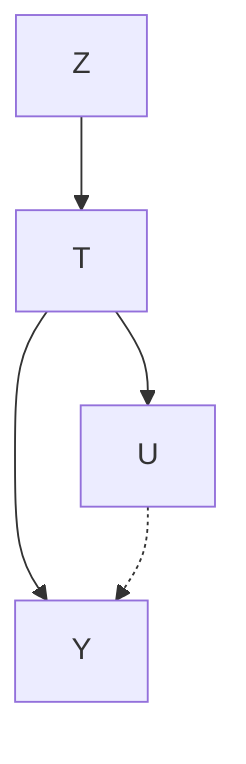
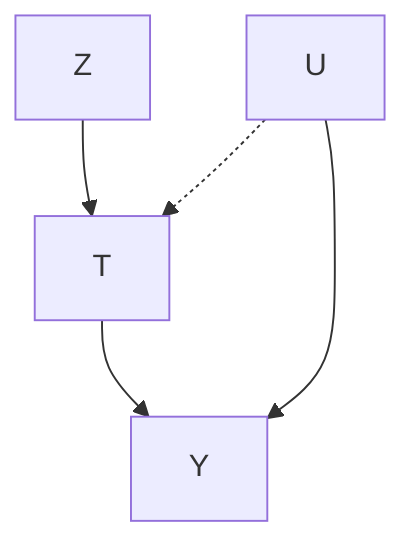
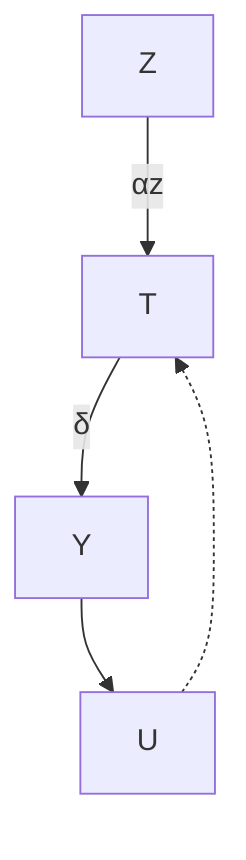
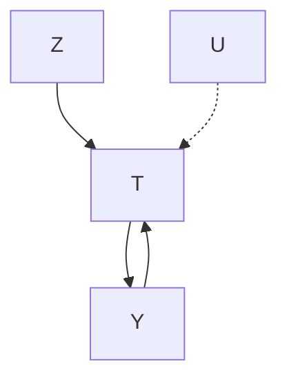
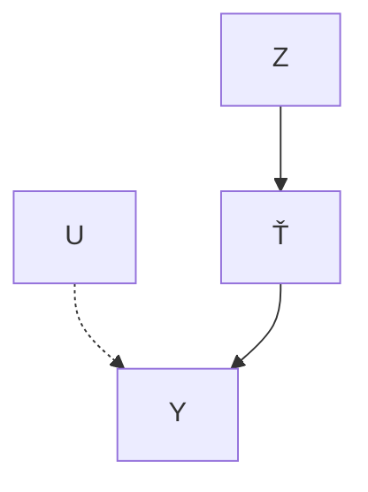
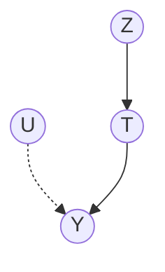

# 工具变量（Instrumental Variables）

当存在未观测的混杂因素时，我们如何识别因果效应？一种流行的方法是寻找并使用**工具变量（instrumental variables）**。一个**工具（instrument）**（工具变量）具有三个关键特性：它影响**处理变量（treatment）** $T$，它仅通过 $T$ 影响结果 $Y$，并且 $T$ 对 $Y$ 的效应是无混杂的。我们在图 9.1 中描绘了这些特性。这些特性使我们能够利用 $Z$ 来隔离从 $T$ 流向 $Y$ 的因果关联。其直觉是，$Z$ 的变化将反映在 $T$ 上，并导致 $Y$ 发生相应变化。而这些专门由 $Z$ 引起的变化是无混杂的（与由未观测混杂因素 $U$ 引起的 $T$ 变化不同），因此它们使我们能够隔离从 $T$ 流向 $Y$ 的因果关联。

**图 9.1：** 其中 $U$ 是 $T$ 对 $Y$ 效应的未观测混杂因素，$Z$ 是一个工具变量。

## 9.1 什么是工具（What is an Instrument）？

一个变量要被视为工具，必须满足三个主要假设。第一个假设是相关性，即 $Z$ 必须影响 $T$。

**假设 9.1（相关性，Relevance）** $Z$ 对 $T$ 有因果效应。

从图形上看，相关性假设对应于因果图中从 $Z$ 到 $T$ 存在一条有向边。第二个假设被称为**排他性约束（exclusion restriction）**。

**假设 9.2（排他性约束，Exclusion Restriction）** $Z$ 对 $Y$ 的因果效应完全由 $T$ 中介。

这个假设被称为排他性约束，因为它将 $Z$ 排除在 $Y$ 的结构方程之外，也排除在任何其他会使因果关联不经过 $T$ 就从 $Z$ 流向 $Y$ 的结构方程之外。从图形上看，这意味着我们已经排除了因果图中变量之间足够多的潜在边，使得所有从 $Z$ 到 $Y$ 的因果路径都经过 $T$。最后，我们假设 $T$ 对 $Y$ 的因果效应是无混杂的：

9.1 什么是工具？ . . 86  
9.2 ATE 的非参数不可识别性 . . . . . . 87  
9.3 热身：二元线性设定 . . 87  
9.4 连续线性设定 88  
9.5 局部 ATE 的非参数识别 . . . . . . 90

带有工具的新潜在符号 90

主分层（Principal Stratification） . . . 90

局部 ATE（Local ATE） 91

9.6 ATE 识别的更一般设定 . . . . . . 94

**假设 9.3（工具无混杂性，Instrumental Unconfoundedness）** 从 $Z$ 到 $Y$ 不存在后门路径。

**条件工具（Conditional Instruments）** 我们将假设 9.3 表述为无条件无混杂性，但如果我们有条件于观测变量的无混杂性，工具变量的所有数学推导仍然成立。我们只需确保对相关变量进行条件化处理即可。在这种情况下，你可能会看到 $Z$ 被称为**条件工具（conditional instrument）**。

## 9.2 ATE 的非参数不可识别性（No Nonparametric Identification of the ATE）

你可能会想："如果工具变量允许我们识别因果效应，那为什么我们在第 6 章非参数识别中没有看到它们？"答案是工具变量不能非参数地识别因果效应。当我们不必对参数形式做任何假设时，我们就有了非参数识别。而对于工具变量，我们必须对参数形式（例如线性）做出假设才能识别因果效应。

我们在第 6.3 节中看到了以下有用的非参数识别必要条件：对于从 $T$ 到作为 $Y$ 祖先的任意子节点的每条后门路径，都有可能阻断该路径 [18, p. 92]。我们可以在图 9.2 中看到，存在一条无法被阻断的从 $T$ 到 $Y$ 的后门路径：$T \leftarrow U \rightarrow Y$。因此，这个必要条件告诉我们，我们不能使用工具 $Z$ 来非参数地识别 $T$ 对 $Y$ 的效应。

## 9.3 热身：二元线性设定（Warm-Up: Binary Linear Setting）

作为热身，我们从 $T$ 和 $Z$ 是二元的设定开始，并做出参数假设，即 $Y$ 是 $T$ 和 $U$ 的线性函数：

**假设 9.4（线性结果，Linear Outcome）**

$$
Y := \delta T + \alpha_{u} U \tag {9.1}
$$

$Z$ 没有出现在方程 9.1 中这一事实是排他性约束（假设 9.2）的结果。

然后，基于这个假设，我们将尝试识别因果效应 $\delta$。因为我们有直觉认为 $Z$ 将有助于识别 $T$ 对 $Y$ 的效应，所以我们从 $Z-Y$ 关系的关联差异开始：$\mathbb{E}[Y \mid Z = 1] - \mathbb{E}[Y \mid Z = 0]$。通过直接应用假设 9.4，我们得到以下结果：

$$
\mathbb{E} [Y \mid Z = 1] - \mathbb{E} [Y \mid Z = 0] \tag {9.2}
$$

$$
= \mathbb{E} [\delta T + \alpha_{u} U \mid Z = 1] - \mathbb{E} [\delta T + \alpha_{u} U \mid Z = 0] \tag {9.3}
$$

**图 9.2：** 其中 $U$ 是 $T$ 对 $Y$ 效应的未观测混杂因素，$Z$ 是一个工具变量。

[18]: Pearl (2009), Causality

利用线性期望并稍作整理：

$$
= \delta (\mathbb{E} [T \mid Z = 1] - \mathbb{E} [T \mid Z = 0]) + \alpha_{u} (\mathbb{E} [U \mid Z = 1] - \mathbb{E} [U \mid Z = 0]) \tag {9.4}
$$

现在，我们使用工具无混杂性假设（假设 9.3）。这意味着 $Z$ 和 $U$ 是独立的，这使我们能够去掉 $U$ 项：

$$
= \delta (\mathbb{E} [T \mid Z = 1] - \mathbb{E} [T \mid Z = 0]) + \alpha_{u} (\mathbb{E} [U] - \mathbb{E} [U]) \tag {9.5}
$$

$$
= \delta (\mathbb{E} [T \mid Z = 1] - \mathbb{E} [T \mid Z = 0]) \tag {9.6}
$$

然后，我们可以解出 $\delta$，得到**瓦尔德估计量（Wald estimand）**：

## 命题 9.1（Proposition 9.1）

$$
\delta = \frac {\mathbb{E} [Y \mid Z = 1] - \mathbb{E} [Y \mid Z = 0]}{\mathbb{E} [T \mid Z = 1] - \mathbb{E} [T \mid Z = 0]} \tag {9.7}
$$

根据假设 9.1，我们知道分母非零，因此右侧并非未定义。然后，我们只需用经验均值代替这些条件期望，即可得到**瓦尔德估计器（Wald estimator）** [74]：

$$
\hat {\delta} = \frac {\frac {1}{n_{1}} \sum_{i : z_{i} = 1} Y_{i} - \frac {1}{n_{0}} \sum_{i : z_{i} = 0} Y_{i}}{\frac {1}{n_{1}} \sum_{i : z_{i} = 1} T_{i} - \frac {1}{n_{0}} \sum_{i : z_{i} = 0} T_{i}} \tag {9.8}
$$

其中 $n_{1}$ 是 $Z = 1$ 的样本数量，$n_{0}$ 是 $Z = 0$ 的样本数量。

**因果效应作为路径系数的乘积** 当结构方程是线性时，你可以将从变量 $A$ 流向变量 $B$ 的因果关联视为沿着从 $A$ 到 $B$ 的有向路径的系数乘积。如果存在多条路径，你只需将所有路径上的因果关联相加。然而，我们无法直接获得因果关联。相反，我们可以测量**总关联（total association）**，而未阻断的后门路径也会对总关联做出贡献，这就是为什么 $\mathbb{E}[Y \mid T = 1] - \mathbb{E}[Y \mid T = 0] \neq \delta$。那么，我们如何识别图 9.3 中 $T$ 对 $Y$ 的效应呢？由于从工具 $Z$ 到 $Y$ 不存在后门路径，我们可以轻松识别 $Z$ 对 $Y$ 的效应：$\mathbb{E}[Y \mid Z = 1] - \mathbb{E}[Y \mid Z = 0] = \alpha_{z} \delta$。类似地，我们可以识别工具 $Z$ 对 $T$ 的效应：$\mathbb{E}[T \mid Z = 1] - \mathbb{E}[T \mid Z = 0] = \alpha_{z}$。然后，我们将 $Z$ 对 $Y$ 的效应除以 $Z$ 对 $T$ 的效应，即可识别 $\delta \left( \frac {\alpha_{z} \delta}{\alpha_{z}} \right)$。而这个商正是命题 9.1 中的瓦尔德估计量。

## 9.4 连续线性设定（Continuous Linear Setting）

现在，我们考虑 $T$ 和 $Z$ 是连续变量而非二元变量的设定。我们仍然假设 $Y$ 的线性形式（假设 9.4），这意味着 $T$ 对 $Y$ 的因果效应是 $\delta$。在连续设定中，我们得到瓦尔德估计量的自然连续版本：

[74]: Wald (1940), 'The Fitting of Straight Lines if Both Variables are Subject to Error'

**主动阅读练习：** 在上述推导方程 9.7 的过程中，我们在哪里使用了假设 9.1 至 9.4 中的每一个？

**图 9.3：** 其中 $U$ 是 $T$ 对 $Y$ 效应的未观测混杂因素，$Z$ 是一个工具变量。

## 命题 9.2（Proposition 9.2）

$$
\delta = \frac {\operatorname{Cov} (Y , Z)}{\operatorname{Cov} (T , Z)} \tag {9.9}
$$

**证明。** 正如我们在上一节中以 $\mathbb{E}[Y \mid Z = 1] - \mathbb{E}[Y \mid Z = 0]$ 开始，这里我们以连续类比量 $\mathrm{Cov}(Y, Z)$ 开始。我们从经典的协方差恒等式开始：

$$
\operatorname{Cov} (Y, Z) = \mathbb{E} [Y Z] - \mathbb{E} [Y] \mathbb{E} [Z] \tag {9.10}
$$

然后，应用线性结果假设（假设 9.4）：

$$
= \mathbb{E} [(\delta T + \alpha_{u} U) Z] - \mathbb{E} [\delta T + \alpha_{u} U] \mathbb{E} [Z] \tag {9.11}
$$

展开并整理：

$$
= \delta \mathbb{E} [T Z] + \alpha_{u} \mathbb{E} [U Z] - \delta \mathbb{E} [T] \mathbb{E} [Z] - \alpha_{u} \mathbb{E} [U] \mathbb{E} [Z] \tag {9.12}
$$

$$
= \delta (\mathbb{E} [T Z] - \mathbb{E} [T] \mathbb{E} [Z]) + \alpha_{u} (\mathbb{E} [U Z] - \mathbb{E} [U] \mathbb{E} [Z]) \tag {9.13}
$$

现在，我们看到可以再次应用相同的协方差恒等式：

$$
= \delta \operatorname{Cov} (T, Z) + \alpha_{u} \operatorname{Cov} (U, Z) \tag {9.14}
$$

根据工具无混杂性假设（假设 9.3），$\mathrm{Cov}(U, Z) = 0$：

$$
= \delta \operatorname{Cov} (T, Z) \tag {9.15}
$$

最后，我们解出 $\delta$：

$$
\delta = \frac {\operatorname{Cov} (Y , Z)}{\operatorname{Cov} (T , Z)} \tag {9.16}
$$

其中相关性假设（假设 9.1）告诉我们分母非零。□

这导致我们得到以下自然估计器，类似于瓦尔德估计器：

$$
\hat {\delta} = \frac {\widehat {\operatorname{Cov}} (Y , Z)}{\widehat {\operatorname{Cov}} (T , Z)} \tag {9.17}
$$

另一个等价的估计器是所谓的**两阶段最小二乘估计器（two-stage least squares estimator, 2SLS）**。这两个阶段如下：

1. 将 $T$ 对 $Z$ 进行线性回归，以估计 $\mathbb{E}[T \mid Z]$。这给出了 $T$ 在 $Z$ 上的投影：$\hat{T}$。
2. 将 $Y$ 对 $\hat{T}$ 进行线性回归，以估计 $\mathbb{E}[Y \mid \hat{T}]$。将 $\hat{T}$ 前面的拟合系数作为我们的估计值 $\hat{\delta}$。

**主动阅读练习：** 在这个证明中，我们在哪里使用了排他性约束假设（假设 9.2）？

**图 9.4：** 其中 $U$ 是 $T$ 对 $Y$ 效应的未观测混杂因素，$Z$ 是一个工具变量。

**图 9.5：** 图 9.4 的增强版本，其中 $T$ 被替换为 $\hat{T} = \hat{\mathbb{E}}[T \mid Z]$，它不依赖于 $U$，因此不再有来自 $U$ 的入边。

2SLS 估计器带有有用的直觉。要理解这一点，从我们一直在使用的典型工具变量图（图 9.4）开始。在第一阶段，我们将 $T$ 投影到 $Z$ 上，得到 $\hat{T}$ 作为仅关于 $Z$ 的函数：$\hat{T} = \hat{\mathbb{E}}[T \mid Z]$。然后，想象一个图，其中 $T$ 被替换为 $\hat{T}$（图 9.5）。由于 $\hat{T}$ 不是 $U$ 的函数，我们可以认为在这个图中移除了 $U \rightarrow \hat{T}$ 这条边。现在，由于从 $\hat{T}$ 到 $Y$ 没有后门路径，在第二阶段中，关联即因果关系，我们只需将 $Y$ 对 $\hat{T}$ 进行回归即可估计因果效应。注意：我们也可以在第 9.3 节讨论的二元设定中使用 2SLS。

## 9.5 局部 ATE 的非参数识别（Nonparametric Identification of Local ATE）

前两节的问题在于，我们做出了**线性性（linearity）**这一强参数假设（假设 9.4）。例如，该假设要求**同质性（homogeneity）**（即处理效应对于每个单元都是相同的）。还有其他一些变体也编码了同质性假设（例如，参见 Hernán 和 Robins [7, 第 16.3 节]），它们都是强假设。理想情况下，我们希望在不做出诸如线性性或同质性等任何参数假设的情况下，能够使用**工具变量（instrumental variables）**进行识别。而这，是可行的。我们只需要满足于一个比 ATE 更具体的因果估计量，并用一个新的假设来替换线性性假设。我们将在二值设定下进行此操作，因此 $T$ 和 $Z$ 都是二值变量。在此之前，我们必须在第 9.5.1 节中定义一些新的符号，并在第 9.5.2 节中介绍**主分层（principal stratification）**。

### 9.5.1 带有工具变量的新潜在符号（New Potential Notation with Instruments）

正如我们用 $\begin{array} { r } { Y ( 1 ) \triangleq Y ( T = 1 ) } \end{array}$ 来表示如果我们接受处理将会观察到的潜在结果，并用 $\boldsymbol { Y } ( 0 ) \triangleq \boldsymbol { Y } ( \boldsymbol { T } = 0 )$ 来表示如果我们不接受处理将会观察到的潜在结果一样，我们将为工具变量定义类似的潜在符号。

我们将工具变量 $Z$ 视为对处理的**鼓励（encouragement）**，因此，如果 $Z = 1$，我们被鼓励接受处理；如果 $Z = 0$，我们被鼓励不接受处理。令 $T ( 1 ) \triangleq T ( Z = 1 )$ 表示如果我们得到工具变量值为 1 时将接受的处理。类似地，令 $T ( 0 ) \triangleq T ( Z = 0 )$ 表示如果我们得到工具变量值为 0 时将接受的处理。

然后，对于我们对工具变量（而非处理）进行干预的潜在结果，也有类似的定义：$Y ( Z = 1 )$ 表示如果我们被鼓励接受处理时将观察到的结果，$Y ( Z = 0 )$ 表示如果我们被鼓励不接受处理时将观察到的结果。

### 9.5.2 主分层（Principal Stratification）

我们将根据鼓励 $Z$ 与所接受的处理 $T$ 之间的关系，将总体划分为四个**主层（principal strata）**。由于二值变量 $Z$ 和 $T$ 的每种取值组合对应一个层，因此共有四个层。

[7]: Hernán and Robins (2020), Causal Inference: What If

**定义 9.1（主层，Principal Strata）**

1. **依从者（Compliers）** – 总是接受他们被鼓励接受的处理。即，$T ( 1 ) = 1 \ : a n d \ : T ( 0 ) = 0 .$ .
2. **始终接受者（Always-takers）** – 无论鼓励与否，总是接受处理。即，$T (1) = 1$ 且 $T (0) = 1$。
3. **从不接受者（Never-takers）** – 无论鼓励与否，从不接受处理。即，$T (1) = 0$ 且 $T (0) = 0$。
4. **违抗者（Defiers）** – 总是接受与他们被鼓励接受的处理相反的处理。即，$T (1) = 0$ 且 $T (0) = 1$。

**不同的因果图（Different Causal Graphs）** 重要的是，这些层具有不同的因果图。虽然依从者和违抗者接受的处理取决于鼓励（工具变量），但始终接受者和从不接受者接受的处理则不依赖于鼓励。因此，依从者和违抗者具有正常的因果图（图 9.6），而始终接受者和从不接受者则具有相同的因果图，但去掉了 $Z \to T$ 这条边（图 9.7）。这意味着，对于始终接受者和从不接受者，$Z$ 对 $T$ 的因果效应为零。然后，由于**排他性约束（exclusion restriction）**，这意味着对于始终接受者和从不接受者，$Z$ 对 $Y$ 的因果效应也为零。这对于后续的推导非常重要。

**无法识别层（Can’t Identify Stratum）** 给定 $Z$ 和 $T$ 的某些观测值，我们实际上无法识别我们处于哪个层。二值变量 $Z$ 和 $T$ 有四种组合；对于每一种组合，我们会注意到有不止一个层与这些观测值的组合相容。

1. $Z = 0, T = 0$。相容的层：依从者或从不接受者
2. $Z = 0, T = 1$。相容的层：违抗者或始终接受者
3. $Z = 1, T = 0$。相容的层：违抗者或从不接受者
4. $Z = 1, T = 1$。相容的层：依从者或始终接受者

这意味着我们无法识别一个给定的单元是依从者、违抗者、始终接受者还是从不接受者。

### 9.5.3 局部 ATE（Local ATE）

尽管在存在未观测混杂因素的情况下（第 9.2 节），我们无法使用工具变量非参数地识别 ATE，但我们将能够非参数地识别所谓的**局部 ATE（local ATE）**。**局部平均处理效应（Local Average Treatment Effect, LATE）**也被称为**依从者平均因果效应（Complier Average Causal Effect, CACE）**，因为它是依从者中的 ATE。

**定义 9.2（局部平均处理效应（LATE）/ 依从者平均因果效应（CACE））**

$$
\mathbb {E} [ Y (T = 1) - Y (T = 0) \mid T (Z = 1) = 1, T (Z = 0) = 0 ] \tag {9.18}
$$

为了识别 LATE，虽然我们不再需要线性性假设（假设 9.4），但我们需要引入一个称为**单调性（monotonicity）**的新假设。

**假设 9.5（单调性，Monotonicity）**

$$
\forall i, \quad T _ {i} (Z = 1) \geq T _ {i} (Z = 0) \tag {9.19}
$$

**图 9.6：** 依从者和违抗者的因果图。

**图 9.7：** 始终接受者和从不接受者的因果图。

**主动阅读练习：** 确保你理解了为什么这些是每个观测值组合的相容层。

单调性意味着，如果我们被鼓励接受处理 $( Z = 1 )$ ，那么我们接受处理的可能性要么大于或等于我们被鼓励不接受处理 $( Z = 0 )$ 时接受处理的可能性。重要的是，这意味着我们假设不存在违抗者。这是因为依从者满足 $T ( 1 ) > T ( 0 )$ ，始终接受者和从不接受者满足 ${ \bar { T } } ( 1 ) = T ( 0 )$ ，但违抗者两者都不满足；在违抗者中，$T ( 1 ) < T ( 0 )$ ，这违反了单调性假设。

我们现在已经介绍了主分层和单调性假设的关键概念。重要的是，我们看到在始终接受者和从不接受者中，$Z$ 对 $T$ 的因果效应为零（第 9.5.2 节），并且我们刚刚看到单调性假设意味着不存在违抗者。考虑到这一点，我们现在准备推导 LATE 估计量的非参数识别结果。

**定理 9.3（LATE 非参数识别，LATE Nonparametric Identification）** 给定 $Z$ 是一个工具变量，$T$ 和 $Y$ 是二值变量，并且单调性成立，则以下等式成立：

$$
\mathbb {E} [ Y (1) - Y (0) \mid T (1) = 1, T (0) = 0 ] = \frac {\mathbb {E} [ Y \mid Z = 1 ] - \mathbb {E} [ Y \mid Z = 0 ]}{\mathbb {E} [ T \mid Z = 1 ] - \mathbb {E} [ T \mid Z = 0 ]} \tag {9.20}
$$

**证明。** 因为我们感兴趣的是 $T$ 对 $Y$ 的因果效应，并且知道我们将使用工具变量 $Z$，所以我们从 $Z$ 对 $Y$ 的因果效应开始，并使用**全概率定律（law of total probability）**将其分解为加权后的层特定因果效应：

$$
\begin{array}{l} \mathbb {E} [ Y (Z = 1) - Y (Z = 0) ] \\ = \mathbb {E} [ Y (Z = 1) - Y (Z = 0) \mid T (1) = 1, T (0) = 0 ] P (T (1) = 1, T (0) = 0) \\ + \mathbb {E} [ Y (Z = 1) - Y (Z = 0) \mid T (1) = 0, T (0) = 1 ] P (T (1) = 0, T (0) = 1) \\ + \mathbb {E} [ Y (Z = 1) - Y (Z = 0) \mid T (1) = 1, T (0) = 1 ] P (T (1) = 1, T (0) = 1) \\ + \mathbb {E} [ Y (Z = 1) - Y (Z = 0) \mid T (1) = 0, T (0) = 0 ] P (T (1) = 0, T (0) = 0) \tag {9.21} \\ \end{array}
$$

第一项对应依从者，第二项对应违抗者，第三项对应始终接受者，最后一项对应从不接受者。正如我们在第 9.5.2 节中讨论的，在始终接受者和从不接受者中，$Z$ 对 $Y$ 的因果效应为零，因此我们可以移除这些项。

$$
\begin{array}{l} = \mathbb {E} [ Y (Z = 1) - Y (Z = 0) \mid T (1) = 1, T (0) = 0 ] P (T (1) = 1, T (0) = 0) \\ + \mathbb {E} [ Y (Z = 1) - Y (Z = 0) \mid T (1) = 0, T (0) = 1 ] P (T (1) = 0, T (0) = 1) \tag {9.22} \\ \end{array}
$$

因为我们做出了单调性假设，所以知道不存在违抗者 $( P ( T ( 1 ) = 0 , T ( 0 ) = 1 ) = 0 )$ ，因此违抗者项也为零。

$$
= \mathbb {E} [ Y (Z = 1) - Y (Z = 0) \mid T (1) = 1, T (0) = 0 ] P (T (1) = 1, T (0) = 0) \tag {9.23}
$$

现在，如果我们解出 $Z$ 对 $Y$ 在依从者中的效应，我们得到：

$$
\begin{array}{l} \text { 依从者（Compliers）: } T (1) = 1, T (0) = 0 \\ \mathrm{始终接受者（Always-takers）:} T (1) = 1, T (0) = 1 \\ \text { 从不接受者（Never-takers）: } T (1) = 0, T (0) = 0 \\ \text { 违抗者（Defiers）: } T (1) = 0, T (0) = 1 \\ \end{array}
$$

<!-- footnote -->

- 这一段包含大量信息。主动阅读练习：
- ) 说服你自己，如果 $X = I$，则 ITE 和 “CATE”（我们称之为 IATE）是相同的。
- 2) 说服你自己，$X$ 对应于放大图中具有因果关联流向 $Y$ 的外生变量 $I$。

<!-- footnote end -->

<!-- footnote -->

- 主动阅读练习：我们如何估计这些条件期望？

<!-- footnote end -->

如下：

$$
\mathbb {E} [ Y (Z = 1) - Y (Z = 0) \mid T (1) = 1, T (0) = 0 ] = \frac {\mathbb {E} [ Y (Z = 1) - Y (Z = 0) ]}{P (T (1) = 1 , T (0) = 0)} \tag {9.24}
$$

并且由于这些是依从者，即那些将接受他们被鼓励接受的任何处理的人，$Y ( Z = 1 )$ 和 $Y ( Z = 0 )$ 实际上分别等于 $Y ( T = 1 )$ 和 $Y ( T = 0 )$，因此我们可以将方程 9.24 的左侧改为 LATE，即我们试图识别的因果估计量：

$$
\mathbb {E} [ Y (T = 1) - Y (T = 0) \mid T (1) = 1, T (0) = 0 ] \tag {9.25}
$$

$$
= \frac {\mathbb {E} [ Y (Z = 1) - Y (Z = 0) ]}{P (T (1) = 1 , T (0) = 0)} \tag {9.26}
$$

现在，我们应用**工具无混杂假设（instrumental unconfoundedness assumption）**（假设 9.3）来识别分子。

$$
= \frac {\mathbb {E} [ Y \mid Z = 1 ] - \mathbb {E} [ Y \mid Z = 0 ]}{P (T (1) = 1 , T (0) = 0)} \tag {9.27}
$$

剩下的就是识别分母，即成为依从者的概率。然而，我们在第 9.5.2 节中提到无法识别依从者，那么这该如何做到呢？这正是我们需要稍微巧妙一点的地方。我们将通过从全体（概率为 1）中减去始终接受者和从不接受者来得到这个概率，因为由于单调性（假设 9.5），不存在违抗者。

$$
= \frac {\mathbb {E} [ Y \mid Z = 1 ] - \mathbb {E} [ Y \mid Z = 0 ]}{1 - P (T = 0 \mid Z = 1) - P (T = 1 \mid Z = 0)} \tag {9.28}
$$

要理解我们如何得到上述等式，考虑每个人要么有 $Z = 1$ 要么有 $Z = 0$。我们可以通过移除 $Z = 1$ 子总体中 $T = 0$ 的那些人来减去所有从不接受者 $( P ( T = 0 \mid Z = 1 ) )$。类似地，我们可以通过移除 $Z = 0$ 子总体中 $T = 1$ 的那些人来减去所有始终接受者 $( P ( T = 1 \mid Z = 0 ) )$。我们知道这移除了所有从不接受者和始终接受者，因为不存在违抗者，并且因为我们同时考察了 $Z = 1$ 子总体和 $Z = 0$ 子总体。现在，我们只需进行一些操作：

$$
= \frac {\mathbb {E} [ Y \mid Z = 1 ] - \mathbb {E} [ Y \mid Z = 0 ]}{1 - (1 - P (T = 1 \mid Z = 1)) - P (T = 1 \mid Z = 0)} \tag {9.29}
$$

$$
= \frac {\mathbb {E} [ Y \mid Z = 1 ] - \mathbb {E} [ Y \mid Z = 0 ]}{P (T = 1 \mid Z = 1) - P (T = 1 \mid Z = 0)} \tag {9.30}
$$

最后，由于 $T$ 是一个二值变量，我们可以将 $T = 1$ 的概率替换为期望：

$$
= \frac {\mathbb {E} [ Y \mid Z = 1 ] - \mathbb {E} [ Y \mid Z = 0 ]}{\mathbb {E} [ T \mid Z = 1 ] - \mathbb {E} [ T \mid Z = 0 ]} \tag {9.31}
$$

□

这正是我们在线性设定（第 9.3 节）中于方程 9.7 中看到的 **Wald 估计量（Wald estimand）**。然而，这一次，它是局部 ATE $\mathbb { E } [ Y ( T = 1 ) - Y ( T = 0 ) \mid T ( 1 ) =$ $1 , T ( 0 ) = 0 ]$ 的对应统计估计量，也称为依从者平均因果效应（CACE）。这个 LATE/CACE 因果估计量与我们在第 9.3 节中看到的 ATE 因果估计量 $\mathbb {E} [ Y ( T = 1 ) - Y ( T = 0 ) ]$ 形成对比。区别在于，依从者平均因果效应是特指依从者子总体中的 ATE，而非总总体。它是该子总体的局部（LATE）效应，而非像 ATE 那样是全局的。因此，我们看到了两种不同的假设，它们都能让我们通过工具变量得到 Wald 估计量：

1. **线性性（或更一般的同质性）**
2. **单调性**

**LATE/CACE 的问题** 然而，Wald 估计量用于 LATE 存在几个问题。首先，单调性在你感兴趣的设定中可能不成立。其次，即使单调性成立，你可能并不特别关心依从者中的因果效应，尤其是因为你甚至无法识别谁是依从者（参见第 9.5.2 节）。相反，常规的 ATE 通常是一个更有用的量。

## 9.6 ATE 识别的更一般设定（More General Settings for ATE Identification）

一个更常见的工具变量一般设定是考虑结果由处理变量和观测协变量的复杂函数加上一些加性未观测混杂因素生成：

$$
Y := f (T, W) + U \tag {9.32}
$$

例如，参见 Hartford 等人 [75] 和 Xu 等人 [76] 关于使用深度学习建模 $f$ 的文献。请参阅这些论文中的参考文献以了解使用其他模型（如核方法）来建模 $f$。在这些模型中，给定 $U$ 以加性方式进入 $Y$ 的结构方程，你可以使用工具变量进行识别。

或者，我们可以放弃对因果效应的点识别，转而满足于**集识别（set identification）**（部分识别），并使用工具变量来获得因果效应的界限。更多信息，请参见 Pearl [18, 第 8.2 节]。此外，满足于识别一个集合（而非一个点）使我们能够放宽上述方程 9.32 中的加性噪声假设。例如，Kilbertus 等人 [77] 考虑了 $U$ 不以加性方式进入 $Y$ 的结构方程的情况：

$$
Y := f (T, U) \tag {9.33}
$$

[75]: Hartford et al. (2017), ‘Deep IV: A Flexible Approach for Counterfactual Prediction’

[76]: Xu et al. (2020), Learning Deep Features in Instrumental Variable Regression

[18]: Pearl (2009), Causality

[77]: Kilbertus et al. (2020), A Class of Algorithms for General Instrumental Variable Models