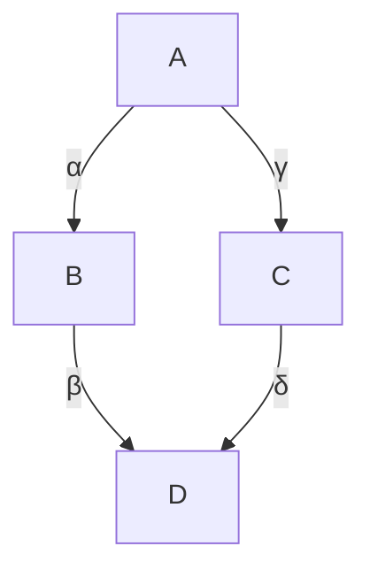
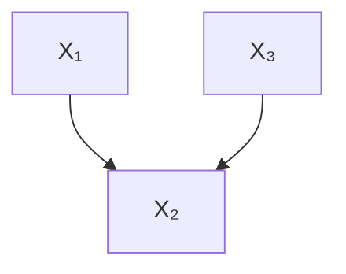
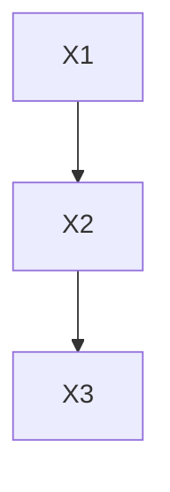
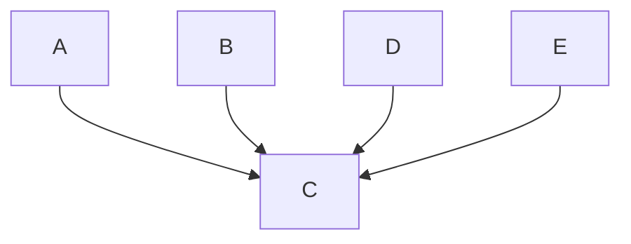
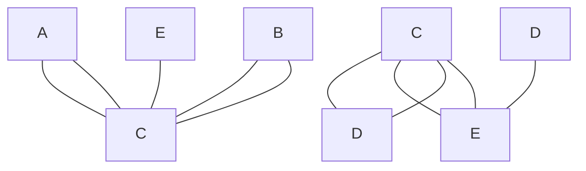
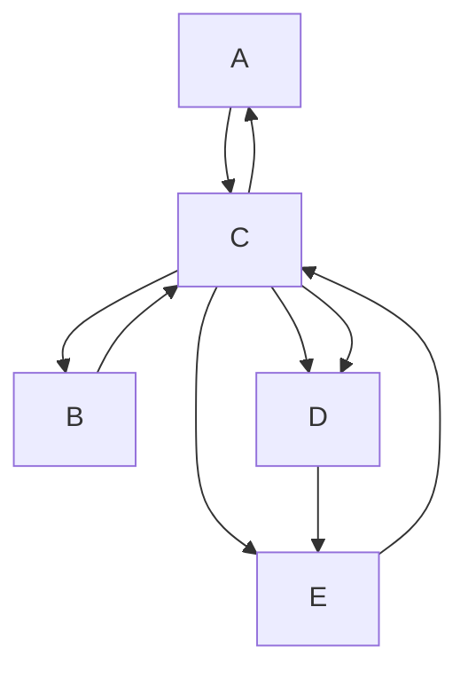

# 从观测数据进行因果发现（Causal Discovery from Observational Data）

在本书中，我们一直假设已知**因果图（causal graph）** 来进行因果推断。如果我们不知道因果图呢？我们能否学习它？正如你可能预料到的，基于本书中反复出现的这一主题，这将取决于我们愿意做出哪些假设。我们将此问题称为**结构识别（structure identification）**，这与我们迄今为止在本书中看到的**因果估计量识别（causal estimand identification）** 是不同的。

## 11.1 基于独立性的因果发现（Independence-Based Causal Discovery）

## 11.1.1 假设与定理（Assumptions and Theorem）

我们看到的将图与分布联系起来的主要假设是**马尔可夫假设（Markov assumption）**。马尔可夫假设告诉我们，如果变量在图 $G$ 中是 **d-分离（d-separated）** 的，那么它们在分布 $P$ 中是独立的（定理 3.1）：

$$
X \perp_ {G} Y \mid Z \implies X \perp_ {P} Y \mid Z \tag {3.20revisited}
$$

也许我们可以检测数据中的独立性，然后用它来推断因果图。然而，从分布 $P$ 中的独立性推导出图 $G$ 中的 d-分离并不是马尔可夫假设（见上面的公式 3.20）所给出的。相反，我们需要马尔可夫假设的逆命题。这被称为**忠实性假设（faithfulness assumption）**。

**假设 11.1（忠实性，Faithfulness）**

$$
X \perp_ {G} Y \mid Z \Longleftarrow X \perp_ {P} Y \mid Z \tag {11.1}
$$

这个假设允许我们从分布中的独立性推断出图中的 d-分离。忠实性假设与马尔可夫假设一起，实际上蕴含了**极小性假设（minimality assumption）**（假设 3.2），因此它是一个更强的假设。忠实性假设远不如马尔可夫假设有吸引力，因为很容易想到反例（即两个变量在分布 $P$ 中是独立的，但在图 $G$ 中它们之间存在未阻塞的路径）。

**忠实性反例（Faithfulness Counterexample）** 考虑图 11.1 中具有系数的因果图中的变量 $A$ 和 $D$。当 $A \rightarrow B \rightarrow D$ 路径抵消了 $A \rightarrow C \rightarrow D$ 路径时，我们就违反了忠实性假设。为了具体理解这是如何发生的，考虑该图所代表的**结构因果模型（Structural Causal Model, SCM）**：

$$
B := \alpha A \tag {11.2}
$$

$$
C := \gamma A \tag {11.3}
$$

$$
D := \beta B + \delta C \tag {11.4}
$$

11.1 基于独立性的因果发现 100
假设与定理 100
PC 算法 . . . . . . 102
我们能得到更好的识别吗？ . 104
11.2 半参数因果发现 104
无参数假设下的不可识别性 . 105
线性非高斯噪声 105
非线性模型 . . . . . . 108
11.3 进一步阅读资源 . . . . . . 109

图 11.1：忠实性反例图。

我们可以通过将 $B$ 和 $C$ 代入公式 11.4 来求解 $A$ 和 $D$ 之间的依赖关系，得到下式：

$$
D = (\alpha \beta + \gamma \delta) A \tag {11.5}
$$

这意味着在这个例子中，从 $A$ 流向 $D$ 的关联是 $\alpha \beta + \gamma \delta$。如果 $\alpha \beta = -\gamma \delta$，这两条路径就会相互抵消，这将使得 $A \perp \perp D$。这种对忠实性假设的违反将错误地导致我们认为图中 $A$ 和 $D$ 之间没有路径。

除了忠实性假设，许多方法还假设不存在未观测到的混淆变量，这被称为**因果充分性（causal sufficiency）**。

**假设 11.2（因果充分性，Causal Sufficiency）** 图中任何变量之间都不存在未观测到的混淆变量。

然后，在马尔可夫假设、忠实性假设、因果充分性假设和**无环性假设（acyclicity assumption）** 下，我们可以部分地识别因果图。我们不能完全识别因果图，因为不同的图可能对应同一组独立性关系。例如，考虑图 11.2 中的图。

(a) 向右的链（Chain directed to the right）

(b) 向左的链（Chain directed to the left）

(c) 叉（Fork）
图 11.2：三个马尔可夫等价图

尽管这些都是不同的图，但它们对应于同一组独立性/依赖性假设。回顾第 3.5 节，在相对于图 11.2 中任何一个图都是马尔可夫的分布中，$X _ { 1 } \perp \perp X _ { 3 } \mid X _ { 2 }$。我们还看到，极小性假设告诉我们 $X _ { 1 }$ 和 $X _ { 2 }$ 是依赖的，并且 $X _ { 2 }$ 和 $X _ { 3 }$ 是依赖的。而更强的忠实性假设进一步告诉我们，在相对于这些图中任何一个都是忠实的分布中，如果我们不对 $X _ { 2 }$ 进行条件化，$X _ { 1 }$ 和 $X _ { 3 }$ 是依赖的。因此，仅使用数据中（条件）独立性的存在与否不足以区分这三个图；这些图是**马尔可夫等价（Markov equivalent）** 的。

如果两个图对应于同一组条件独立性，则称它们是马尔可夫等价的。对于一个给定的图，我们将其**马尔可夫等价类（Markov equivalence class）** 定义为编码了相同条件独立性的一组图。在忠实性假设下，如果某个图是其马尔可夫等价类中唯一的图，我们就能从数据中的条件独立性中识别出它。图 11.3 中展示的基本**不道德结构（immorality）** 就是一个在其马尔可夫等价类中唯一的例子。回顾第 3.6 节，不道德结构与其他两种基本图形构建块（链和叉）的区别在于，在图 11.3 中，$X _ { 1 }$ （无条件地）独立于 $X _ { 3 }$，并且如果我们对 $X _ { 2 }$ 进行条件化，$X _ { 1 }$ 和 $X _ { 3 }$ 会变得依赖。这意味着，虽然图 11.2 中的基本链和叉属于同一个马尔可夫等价类，但基本不道德结构独自构成一个马尔可夫等价类。

图 11.3：不道德结构（Immoralities）位于它们自己的马尔可夫等价类中。

我们已经看到，如果因果图是一个基本的不道德结构，我们可以识别它，但我们还能识别什么呢？我们看到链和叉都属于同一个马尔可夫等价类，但这并不意味着我们不能从相对于这些图是马尔可夫且忠实的分布中获得任何信息。图 11.2 中的所有链和叉有什么共同点？它们共享相同的**骨架（skeleton）**。图的骨架是指将其所有有向边替换为无向边后得到的结构。我们在图 11.4 中描绘了基本链和基本叉的骨架。

图的骨架也为我们提供了重要的条件独立性信息，我们可以用它来区分具有不同骨架的图。例如，如果我们在图 11.2a 的链中添加一条 $X _ { 1 } \rightarrow X _ { 3 }$ 的边，我们得到**完全图（complete graph）** 图 11.5。在这个图中，与链或叉图不同，当我们对 $X _ { 2 }$ 进行条件化时，$X _ { 1 }$ 和 $X _ { 3 }$ 不是独立的。因此，这个图与图 11.2 中的链和叉不属于同一个马尔可夫等价类。从图形上看，我们可以通过这个图与那些图具有不同骨架的事实（这个图在 $X _ { 1 }$ 和 $X _ { 3 }$ 之间有一条额外的边）来看到这一点。

总而言之，我们指出了可用于区分不同图的两个结构性质：

1.  **不道德结构（Immoralities）**
2.  **骨架（Skeleton）**

事实证明，根据 Verma 和 Pearl [78] 以及 Frydenberg [79] 的结果，我们可以使用这两个结构性质来确定图是否属于相同或不同的马尔可夫等价类：

**命题 11.1（通过不道德骨架的马尔可夫等价，Markov Equivalence via Immoral Skeletons）** 两个图是马尔可夫等价的当且仅当它们具有相同的骨架和相同的不道德结构。

这意味着，利用数据中的条件独立性，我们无法区分具有相同骨架和相同不道德结构的图。例如，仅使用条件独立性信息，我们无法区分两节点图 $X \rightarrow Y$ 和 $X \leftarrow Y$。但是我们可以希望学习图的骨架和不道德结构；这被称为**本质图（essential graph）** 或 **CPDAG（完备部分有向无环图，Completed Partially Directed Acyclic Graph）**。一种流行的学习本质图的算法是 **PC 算法**。

## 11.1.2 PC 算法（The PC Algorithm）

PC 算法 [80] 从一个完全无向图开始，然后通过三个步骤对其进行修剪和定向：

1.  **识别骨架（Identify the skeleton）。**
2.  **识别不道德结构并对其进行定向（Identify immoralities and orient them）。**
3.  **对符合条件且与对撞点（colliders）相连的边进行定向（Orient qualifying edges that are incident on colliders）。**

我们将使用图 11.6 中的真实图作为一个具体例子来解释每一步。

图 11.4：链/叉的骨架。

图 11.5：完全图。

1 回想一下，完全图是指每对节点之间都有边连接的图。

[78]: Verma and Pearl (1990), 'Equivalence and Synthesis of Causal Models'
[79]: Frydenberg (1990), 'The Chain Graph Markov Property'

2 主动阅读练习：检查这些图是否编码了相同的条件独立性。

[80]: Spirtes et al. (2001), Causation, Prediction, and Search

图 11.6：PC 算法示例的真实图。

**识别骨架（Identify the Skeleton）** 我们通过从一个完全图（图 11.7a）开始，然后移除边 $X - Y$（其中对于某个（可能为空的）条件集 $Z$，有 $X \perp \perp Y \mid Z$）来发现骨架。因此，在我们的例子中，我们会从空条件集开始，并发现 $A \perp \perp B$（因为在图 11.6 中从 $A$ 到 $B$ 的唯一路径被对撞点 $C$ 阻塞了）；这意味着我们可以移除 $A - B$ 边，从而得到图 11.7b。然后，我们将转向大小为 1 的条件集，并发现对 $C$ 进行条件化告诉我们，其他每一对变量在给定 $C$ 的情况下都是条件独立的，这使得我们可以移除所有不与 $C$ 相连的边，得到图 11.7c。而这正是图 11.6 中真实图的骨架。更通用的 PC 算法会继续使用更大的条件集，看看是否能移除更多的边，但在本例中，大小为 1 的条件集足以发现骨架。

(a) 我们开始的完全无向图

(b) 移除 $X \perp \perp Y$ 的 $X - Y$ 边后剩余的无向图

(c) 移除 $X \perp \perp Y \mid Z$ 的 $X - Y$ 边后剩余的无向图
图 11.7：PC 算法步骤 1 过程的图解，我们从完全图（左）开始，移除边直到我们识别出图的骨架（右），假设真实图是图 11.6。

**识别不道德结构（Identifying the Immoralities）** 现在，对于工作图中任何路径 $X - Z - Y$（我们在上一步中发现 $X$ 和 $Y$ 之间没有边），如果 $Z$ 不在使 $X$ 和 $Y$ 条件独立的条件集中，那么我们知道 $X - Z - Y$ 形成了一个不道德结构。换句话说，这意味着 $X \not \perp \perp Y \mid Z$，这是不道德结构区别于链和叉的一个性质（第 3.6 节），因此我们可以对这些边进行定向，得到 $X \rightarrow Z \leftarrow Y$。在我们的例子中，这将我们从图 11.7c 带到图 11.8。

**对符合条件且与对撞点相连的边进行定向（Orienting Qualifying Edges Incident on Colliders）** 在最后一步，我们利用这样一个事实：既然我们知道在上一步中发现了所有的不道德结构，我们或许可以对更多的边进行定向。任何作为部分有向路径 $X \rightarrow Z - Y$ 一部分的边 $Z - Y$（其中 $X$ 和 $Y$ 之间没有边连接），都可以被定向为 $Z \rightarrow Y$。这是因为，如果真实图有边 $Z \leftarrow Y$，我们会在上一步中发现它，因为那会形成一个不道德结构 $X \rightarrow Z \leftarrow Y$。由于我们在上一步中没有发现那个不道德结构，我们知道真实的方向是 $Z \rightarrow Y$。在我们的例子中，这意味着我们可以对最后两条剩余的边进行定向，将我们从图 11.8 带到图 11.9。在这个例子中，我们很幸运可以在最后一步中对所有剩余的边进行定向，但一般情况下并非如此。例如，我们讨论过，我们无法区分简单的链图和简单的叉图。

图 11.8：PC 算法在定向了不道德结构后的图。

3 这被称为**方向传播（orientation propagation）**。

图 11.9：PC 算法在定向了那些如果以另一种（错误）方向定向会形成不道德结构的边之后的图。

**放宽假设（Dropping Assumptions）** 有一些算法允许我们放宽各种假设。**FCI（快速因果推断，Fast Causal Inference）** 算法 [80] 在不假设因果充分性（假设 11.2）的情况下工作。**CCD 算法** [81] 在不假设无环性的情况下工作。还有一些基于 SAT 的因果发现工作，允许我们放宽上述两个假设 [82, 83]。

**条件独立性检验的困难性（Hardness of Conditional Independence Testing）** 所有依赖于条件独立性检验的方法（如 PC、FCI、基于 SAT 的算法等）都有一个重要的实际问题。条件独立性检验很困难，有时需要大量数据才能获得准确的检验结果 [84]。如果我们有无限的数据，这不是问题，但在实践中我们没有无限的数据。

## 11.1.3 我们能得到更好的识别吗？（Can We Get Any Better Identification?）

我们已经看到，假设马尔可夫假设和忠实性假设只能让我们做到这一步；有了这些假设，我们只能将图识别到其马尔可夫等价类。如果我们做出更多假设，我们能否比仅仅识别其马尔可夫等价类更精确地识别图呢？

好吧，如果分布是**多项分布（multinomial）**，我们不能 [85]。或者，如果我们处于常见的玩具案例，即 SCM 是带有高斯噪声的线性模型，我们也不能 [86]。因此，由于 Geiger 和 Pearl [86] 以及 Meek [85] 的工作，我们得到了以下完备性结果：

**定理 11.2（马尔可夫完备性，Markov Completeness）** 如果我们有多项分布或线性高斯结构方程，我们只能将图识别到其马尔可夫等价类。

但是，如果我们没有多项分布，也没有线性高斯 SCM 呢？

## 11.2 半参数因果发现（Semi-Parametric Causal Discovery）

在定理 11.2 中，我们看到，如果处于线性高斯设定下，我们能做的最好就是识别马尔可夫等价类；我们无法期望识别出属于非单一马尔可夫等价类的图。但是，如果我们不处于线性高斯设定下呢？如果我们不处于线性高斯设定下，我们能识别图吗？我们在第 11.2.2 节中考虑了**线性非高斯噪声设定（linear non-Gaussian noise setting）**，并在第 11.2.3 节中考虑了**非线性加性噪声设定（nonlinear additive noise setting）**。事实证明，在这两种设定下，我们都可以识别因果图。而且在这些设定下，我们不必假设忠实性（假设 11.1）。

通过考虑这些设定，我们是在做出**半参数假设（semi-parametric assumptions）**（关于函数形式）。如果我们不对函数形式做任何假设，我们甚至无法识别两节点图中边的方向。在转向允许我们识别图的半参数假设之前，我们将在下一节中强调这一点。

[80]: Spirtes et al. (2001), Causation, Prediction, and Search
[81]: Richardson (1996), 'Feedback Models: Interpretation and Discovery'
[82]: Hyttinen et al. (2013), 'Discovering Cyclic Causal Models with Latent Variables: A General SAT-Based Procedure'
[83]: Hyttinen et al. (2014), 'Constraint-Based Causal Discovery: Conflict Resolution with Answer Set Programming'
[84]: Shah and Peters (2020), 'The hardness of conditional independence testing and the generalised covariance measure'
[85]: Meek (1995), 'Strong Completeness and Faithfulness in Bayesian Networks'
[86]: Geiger and Pearl (1988), 'On the Logic of Causal Models'

## 11.2.1 无参数假设下的不可识别性（No Identifiability Without Parametric Assumptions）

**马尔可夫视角（Markov Perspective）** 考虑双变量设定，其中因果图的两个选项是 $X \rightarrow Y$ 和 $X \leftarrow Y$。注意，这两个因果图是**马尔可夫等价的（Markov equivalent）**。两者都不编码任何条件独立性假设，因此两者都能描述任意分布 $P(x, y)$。这意味着数据中的条件独立性无法帮助我们区分 $X \rightarrow Y$ 和 $X \leftarrow Y$。利用条件独立性，我们最多能发现对应的**本质图（essential graph）** $X - Y$。

**结构因果模型视角（SCMs Perspective）** 如果我们从结构因果模型（Structural Causal Models, SCMs）的角度来考虑这个问题，能否通过 SCMs 以某种方式区分 $X \rightarrow Y$ 和 $X \leftarrow Y$？对于一个 SCM，我们希望将一个变量写成另一个变量和某个噪声项变量的函数。正如你所料，如果我们不做任何假设，那么既存在隐含因果图 $X \rightarrow Y$ 的 SCM，也存在隐含因果图 $X \leftarrow Y$ 的 SCM，两者都能根据 $P(x, y)$ 生成数据。

**命题 11.3（双节点图的不可识别性）** 对于两个实值随机变量上的任意联合分布 $P(x, y)$，都存在两个方向的 SCM，它们都能生成与 $P(x, y)$ 一致的数据。

数学上，存在一个函数 $f_Y$，使得

$$
Y = f_Y(X, U_Y), \quad X \perp U_Y \tag {11.6}
$$

并且存在一个函数，使得

$$
X = f_X(Y, U_X), \quad Y \perp U_X \tag {11.7}
$$

其中 $U_Y$ 和 $U_X$ 是实值随机变量。

例如，参见 Peters 等人 [14, p. 44] 的简短证明。类似地，这个不可识别性结果可以推广到具有两个以上变量的更一般的图 [例如，参见 14, p. 135]。

然而，如果我们对 SCM 的参数形式做出假设，就可以区分 $X \rightarrow Y$ 和 $X \leftarrow Y$，并更一般地识别因果图。这就是我们在本章剩余部分将要看到的内容。

## 11.2.2 线性非高斯噪声（Linear Non-Gaussian Noise）

我们在定理 11.2 中看到，如果**结构方程（structural equations）**是**带高斯噪声（Gaussian noise）**的线性方程，那么我们就无法区分同一**马尔可夫等价类（Markov equivalence class）**中的图。例如，这意味着我们无法区分 $X \rightarrow Y$ 和 $X \leftarrow Y$。然而，如果噪声项是非高斯的，那么我们就可以识别因果图。像往常一样，我们将这个非高斯性的关键假设单独列出：

**假设 11.3（线性非高斯）** 所有**结构方程（structural equations）**（即生成数据的因果机制）都采用以下形式：

$$
Y := f(X) + U \tag {11.8}
$$

其中 $f$ 是一个线性函数，$X \perp \perp U$，并且 $U$ 的分布是一个**非高斯（non-Gaussian）**随机变量。

那么，在这个线性非高斯设定下，我们可以识别出 $X \rightarrow Y$ 和 $X \leftarrow Y$ 中哪一个才是真正的因果图。我们将首先给出定理和证明，然后给出直观理解。

**定理 11.4（线性非高斯设定下的可识别性）** 在线性非高斯设定下，如果真实的 SCM 是

$$
Y := f(X) + U, \quad X \perp U, \tag {11.9}
$$

那么，不存在反向的 SCM

$$
X := g(Y) + \tilde{U}, \quad Y \perp \perp \tilde{U}, \tag {11.10}
$$

能够生成与 $P(x, y)$ 一致的数据。

**证明。** 我们首先介绍来自 Darmois [87] 和 Skitovich [88] 的一个重要结果，我们将用它来证明这个定理：

**定理 11.5（达穆瓦-斯基托维奇定理，Darmois-Skitovich Theorem）** 设 $X_1, \dots, X_n$ 是独立的、非退化的随机变量。如果存在系数 $\alpha_1, \ldots, \alpha_n$ 和 $\beta_1, \ldots, \beta_n$，且它们都不为零，使得两个线性组合

$$
A = \alpha_1 X_1 + \ldots + \alpha_n X_n
$$

和

$$
B = \beta_1 X_1 + \ldots + \beta_n X_n
$$

是独立的，那么每个 $X_i$ 都服从正态分布。

我们将使用这个定理在 $n=2$ 情况下的逆否命题来完成这个证明的大部分工作：

**推论 11.6** 如果独立随机变量 $X_1$ 或 $X_2$ 中有一个是非高斯的，那么不存在线性组合

$$
A = \alpha_1 X_1 + \alpha_2 X_2
$$

和

$$
B = \beta_1 X_1 + \beta_2 X_2
$$

使得 $A$ 和 $B$ 是独立的（因此 $A$ 和 $B$ 必定是相关的）。

**证明概要** 考虑到上述推论，我们的证明策略是将 $Y$ 和 $\tilde{U}$ 写成 $X$ 和 $U$ 的线性组合。通过这样做，我们有效地将方程 11.9 和 11.10 中的变量映射到推论中的变量如下：$Y$ 映射到 $A$，$\tilde{U}$ 映射到 $B$，$X$ 映射到 $X_1$，$U$ 映射到 $X_2$。然后，我们可以应用达穆瓦-斯基托维奇定理的上述推论，得出 $Y$ 和 $\tilde{U}$ 必定相关，这违反了方程 11.10 中反向 SCM 的假设。我们现在继续证明。

[87]: Darmois (1953), ‘Analyse générale des liaisons stochastiques: etude particulière de l’analyse factorielle linéaire’  
[88]: Skitovich (1954), ‘Linear forms of independent random variables and the normal distribution law’  
[88]: Skitovich (1954), ‘Linear forms of independent random variables and the normal distribution law’

我们已经知道可以将 $Y$ 写成 $X$ 和 $U$ 的线性组合，因为我们假设方程 11.9 中的真实结构方程是线性的：

$$
Y = \delta X + U \tag {11.11}
$$

然后，为了将 $\tilde{U}$ 写成 $X$ 和 $U$ 的线性组合，我们取假设的反向 SCM

$$
X = \tilde{\delta} Y + \tilde{U} \tag {11.12}
$$

来自方程 11.10，解出 $\tilde{U}$ 并将方程 11.11 代入 $Y$：

$$
\tilde{U} = X - \tilde{\delta} Y \tag {11.13}
$$

$$
= X - \tilde{\delta} (\delta X + U) \tag {11.14}
$$

$$
= (1 - \tilde{\delta} \delta) X + \tilde{\delta} U \tag {11.15}
$$

因此，我们已经将 $Y$ 和 $\tilde{U}$ 都写成了独立随机变量 $X$ 和 $U$ 的线性组合。这使我们能够应用达穆瓦-斯基托维奇定理的推论 11.6，得出 $Y$ 和 $\tilde{U}$ 必定相关：$Y \nsubseteq \tilde{U}$。这违反了反向 SCM：

$$
X := g(Y) + \tilde{U}, \quad Y \perp \perp \tilde{U} \tag {11.10revisited}
$$

[89]: Shimizu et al. (2006), ‘A Linear Non-Gaussian Acyclic Model for Causal Discovery’

[14]: Peters et al. (2017), Elements of Causal Inference: Foundations and Learning Algorithms

我们这里只给出了两个变量的证明，但它可以推广到具有多个变量的更一般设定（参见 [89] 和 [14, 第 7.1.4 节]）。

## 图形直观理解（Graphical Intuition）

当我们沿因果方向拟合数据时，得到的**残差（residuals）**与输入变量独立；但当我们沿反因果方向拟合数据时，得到的残差与输入变量相关。图 11.10a 描绘了当我们对 $Y$ 对 $X$（因果方向）进行线性回归时得到的回归线 $\hat{f}$，而图 11.10b 描绘了当我们对 $X$ 对 $Y$（反因果方向）进行线性回归时得到的回归线 $\hat{g}$。仅从这些拟合来看，你可以看到正向模型（沿因果方向拟合）看起来比反向模型（沿反因果方向拟合）更令人满意。

为了使这种图形直观理解更清晰，我们在图 11.11 中绘制了正向模型 $\hat{f}$（因果方向）和反向模型 $\hat{g}$（反因果方向）的残差。正向方向上的残差对应：$\hat{U} = Y - \hat{f}(X)$。而反向方向上的残差对应：$\hat{\tilde{U}} = X - \hat{g}(Y)$。如图 11.11a 所示，正向模型的残差看起来与输入变量 $X$（在 x 轴上）独立。然而，在图 11.10b 中，反向模型的残差看起来与输入变量 $Y$（在 x 轴上）一点也不独立。很明显，残差（在 y 轴上）的范围随着 $Y$ 值的变化（从左到右）而改变。

正向模型 SCM：

$$
\begin{array}{l l} Y := f(X) + U, & X \perp \perp U \\ & \text {(11.9 revisited)} \end{array}
$$

反向模型 SCM：

$$
X := g(Y) + \tilde{U}  , \quad Y \perp \perp \tilde{U}   (1 1. 1 0 \text {   revisited })
$$

## 11.2.3 非线性模型（Nonlinear Models）

**非线性加性噪声设定（Nonlinear Additive Noise Setting）** 我们也可以在**非线性加性噪声设定（nonlinear additive noise setting）**下获得因果图的可识别性 [90, 91]。这需要**非线性加性噪声假设（nonlinear additive noise assumption）**（如下）以及其他更技术性的假设，关于这些假设我们建议你参考 Hoyer 等人 [90] 和 Peters 等人 [91]。

[90]: Hoyer et al. (2009), ‘Nonlinear causal discovery with additive noise models’  
[91]: Peters et al. (2014), ‘Causal Discovery with Continuous Additive Noise Models’

**假设 11.4（非线性加性噪声）** 所有因果机制都是非线性的，其中噪声以加性方式进入。数学上，

$$
\forall i, X_i := f\left(\mathrm{pa}_i\right) + U_i \tag {11.16}
$$

其中 $f$ 是非线性的，$\mathrm{pa}_i$ 表示 $X_i$ 的**父节点（parents）**。

**后非线性设定（Post-Nonlinear Setting）** 如果你认为噪声以加性方式进入是不现实的，这催生了**后非线性模型（post-nonlinear models）**，其中在加入噪声之后还有另一个非线性变换，如下面的假设 11.5 所示。这种设定也可以产生可识别性（在另一个技术条件下）。更多细节请参见 Zhang 和 Hyvärinen [92]。

**假设 11.5（后非线性）**

$$
\forall i, X_i := g\left(f\left(\mathrm{pa}_i\right) + U_i\right) \tag {11.17}
$$

其中 $g$ 是非线性的，$\mathrm{pa}_i$ 表示 $X_i$ 的父节点。

[92]: Zhang and Hyvärinen (2009), ‘On the Identifiability of the Post-Nonlinear Causal Model’

## 11.3 更多资源（Further Resources）

在本章结束时，我们为你指出一些相关资源，以便你开始学习更多内容（除了本章的参考文献之外）。这些参考文献在撰写本章时也提供了灵感。请参见 Eberhardt [93] 和 Glymour 等人 [94] 的两篇优秀综述文章，它们出自因果发现研究前沿的学者之手。如果你想阅读关于这个主题的整本书，Peters 等人 [14] 写了一本广受欢迎的著作！

[93]: Eberhardt (2017), ‘Introduction to the foundations of causal discovery  
[94]: Glymour et al. (2019), ‘Review of Causal Discovery Methods Based on Graphical Models’  
[14]: Peters et al. (2017), Elements of Causal Inference: Foundations and Learning Algorithms