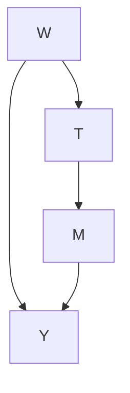

# 附录（Appendix）

## A.1 第6.1节中公式6.1的证明（Proof of Equation 6.1 from Section 6.1）

**命题** 给定因果图如图A.1所示，有 $P ( m \mid d o ( t ) ) = P ( m \mid t )$ 。

**证明**。我们首先应用**贝叶斯网络分解（Bayesian network factorization）**（定义3.1）：

$$
P (w, t, m, y) = P (w)   P (t \mid w)   P (m \mid t)   P (y \mid w, m) \tag {A.1}
$$

接下来，我们应用**截断分解（truncated factorization）**（命题4.1）：

$$
P (w, m, y \mid d o (t)) = P (w)   P (m \mid t)   P (y \mid w, m) \tag {A.2}
$$

最后，我们边缘化 $w$ 和 $y$：

$$
\sum_ {w} \sum_ {y} P (w, m, y \mid d o (t)) = \sum_ {w} \sum_ {y} P (w)   P (m \mid t)   P (y \mid w, m) \tag {A.3}
$$

$$
P (m \mid d o (t)) = \left(\sum_ {w} P (w)\right) P (m \mid t) \left(\sum_ {y} P (y \mid w, m)\right) \tag {A.4}
$$

$$
= P (m \mid t) \tag {A.5}
$$

A.1 第6.1节中公式6.1的证明（Proof of Equation 6.1 from Section 6.1） . . . . 114

A.2 倾向得分定理（7.1）的证明（Proof of Propensity Score Theorem (7.1)） 114

A.3 IPW估计量（7.18）的证明（Proof of IPW Estimand (7.18)） 115

**图 A.1：** 因果图，其中 $W$ 是未观测的，因此我们无法阻断后门路径 $T \gets W \to Y$ 。

## A.2 倾向得分定理（7.1）的证明（Proof of Propensity Score Theorem (7.1)）

**命题** $( Y ( 1 ) , Y ( 0 ) ) \downarrow \downarrow T \mid W \implies ( Y ( 1 ) , Y ( 0 ) ) \downarrow \downarrow T \mid e ( W ) .$

**证明**。假设 $( Y ( 1 ) , Y ( 0 ) ) \bot \bot T \mid W ,$ ，我们将通过证明 $P ( T = 1 , \mid Y ( t ) , e ( W ) )$ 不依赖于 $Y ( t )$ 来证明 $( Y ( 1 ) , Y ( 0 ) ) \perp \perp T \mid$ $e ( W )$ ，其中 $\dot { Y } ( t )$ 是任一个潜在结果。

首先，由于 $T$ 是二值的，我们可以将这个概率转化为期望：

$$
P (T = 1, \mid Y (t), e (W)) = \mathbb {E} [ T \mid Y (t), e (W) ] \tag {A.6}
$$

然后，使用**迭代期望定律（law of iterated expectations）**，我们可以引入 $W$：

$$
= \mathbb {E} \left[ \mathbb {E} [ T \mid Y (t), e (W), W ] \mid Y (t), e (W) ] \right. \tag {A.7}
$$

由于我们现在已经以 $W$ 的所有信息为条件，且 $e ( W )$ 是 $W$ 的函数，因此它是冗余的，所以我们可以从内层期望中移除 $e ( W )$：

$$
= \mathbb {E} \left[ \mathbb {E} [ T \mid Y (t), W ] \mid Y (t), e (W) \right] \tag {A.8}
$$

现在，我们应用开始时假设的**无混杂性（unconfoundedness）**来从内层期望中移除 $Y ( t )$：

$$
= \mathbb {E} [ \mathbb {E} [ T \mid W ] \mid Y (t), e (W) ] \tag {A.9}
$$

再次利用 $T$ 是二值的事实，我们可以将内层期望简化为 $P ( T = 1 \mid W ) \triangleq e ( W )$ ，这是一个已经条件化的量：

$$
= \mathbb {E} [ P (T = 1 \mid W) \mid Y (t), e (W) ] \tag {A.10}
$$

$$
= \mathbb {E} [ e (W) \mid Y (t), e (W) ] \tag {A.11}
$$

$$
= e (W) \tag {A.12}
$$

由于这不依赖于 $Y ( t )$ ，我们已经证明了在给定 $e ( W )$ 的条件下，$Y ( t )$ 与 $T$ 独立。□

## A.3 IPW估计量（7.18）的证明（Proof of IPW Estimand (7.18)）

**命题** 在无混杂性和**积极性（positivity）**假设下，有 $\begin{array} { r } { \mathbb { E } [ Y ( t ) ] = \mathbb { E } \left[ \frac { \mathbb { 1 } ( T = t ) Y } { P ( t | W ) } \right] } \end{array}$ 。

**证明**。我们将从**调整公式（adjustment formula）**（定理2.1）得到的统计估计量开始。在无混杂性和积极性假设下，调整公式告诉我们：

$$
\mathbb {E} [ Y (t) ] = \mathbb {E} [ \mathbb {E} [ Y \mid t, W ] ] \tag {A.13}
$$

我们假设变量是离散的，以将这些期望分解为求和（如果是连续变量则替换为积分）：

$$
= \sum_ {w} \left(\sum_ {y} y P (y \mid t, w)\right) P (w) \tag {A.14}
$$

为了引入 $P ( t \mid w )$ ，我们乘以 $\frac { P ( t | w ) } { P ( t | w ) }$：

$$
= \sum_ {w} \sum_ {y} y P (y \mid t, w) P (w) \frac {P (t \mid w)}{P (t \mid w)} \tag {A.15}
$$

然后，注意到 $P ( y \mid t , w ) P ( t \mid w ) P ( w )$ 就是联合分布：

$$
= \sum_ {w} \sum_ {y} y P (y, t, w) \frac {1}{P (t \mid w)} \tag {A.16}
$$

$\textstyle \sum _ { y } y P ( y , t , w )$ 接近于 $\Sigma _ { y } y P ( y ) = \mathbb { E } [ Y ]$ ，但由于 $T = t$ 和 $W = w$ 包含在概率中，该求和中的项只有在 $T = t$ 和 $W = w$ 时才非零。因此，我们在对所有三个随机变量 $( T , W , Y )$ 的期望中得到了该事件的**示性随机变量（indicator random variable）**：

$$
= \sum_ {w} \mathbb {E} [ \mathbb {1} (T = t, W = w) Y ] \frac {1}{P (t \mid w)} \tag {A.17}
$$

现在，剩下的 $\begin{array} { r } { \sum _ { w } \frac { 1 } { P ( t | w ) } } \end{array}$ 是对 $W$ 的加权期望。将其整合意味着，由于我们现在正在对 $W$ 进行边缘化，$W$ 变成了一个随机变量，而示性函数内部的 $W = w$ 变得冗余。这给我们带来了以下结果：

$$
= \mathbb {E} \left[ \frac {\mathbb {1} (T = t) Y}{P (t \mid W)} \right] \tag {A.18}
$$

**注意：** 对于某些人来说，直接从公式A.16跳到公式A.18可能更自然。