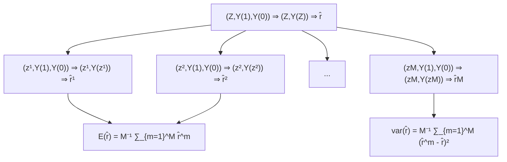

# Neymanian Repeated Sampling Inference in Completely Randomized Experiments

In his seminal paper, Neyman (1923) not only proposed to use the notation of potential outcomes but also derived rigorous mathematical results for making inference of the average causal effect under a CRE. In contrast to Fisher’s idea of calculating the p-value under the sharp null hypothesis, Neyman (1923) proposed an unbiased point estimator and a conservative confidence interval based on the sampling distribution of the point estimator. This chapter will introduce Neyman (1923)’s fundamental results, which are very important for understanding later chapters in Part II of this book.

## 4.1 Finite population quantities

Consider a CRE with n units, where $n _ { 1 }$ of them receive the treatment and $n _ { 0 }$ of them receive the control. For unit $i = 1 , \ldots , n .$ , we have potential outcomes $Y _ { i } ( 1 )$ and $Y _ { i } ( 0 )$ , and individual effect $\tau _ { i } = Y _ { i } ( 1 ) - Y _ { i } ( 0 )$ . The potential outcomes have finite population means

$$
\bar {Y} (1) = n ^ {- 1} \sum_ {i = 1} ^ {n} Y _ {i} (1), \quad \bar {Y} (0) = n ^ {- 1} \sum_ {i = 1} ^ {n} Y _ {i} (0),
$$

variances1

$$
S ^ {2} (1) = (n - 1) ^ {- 1} \sum_ {i = 1} ^ {n} \left\{Y _ {i} (1) - \bar {Y} (1) \right\} ^ {2}, \quad S ^ {2} (0) = (n - 1) ^ {- 1} \sum_ {i = 1} ^ {n} \left\{Y _ {i} (0) - \bar {Y} (0) \right\} ^ {2},
$$

and covariance

$$
S (1, 0) = (n - 1) ^ {- 1} \sum_ {i = 1} ^ {n} \left\{Y _ {i} (1) - \bar {Y} (1) \right\} \left\{Y _ {i} (0) - \bar {Y} (0) \right\}.
$$

The individual effects have mean

$$
\tau = n ^ {- 1} \sum_ {i = 1} ^ {n} \tau_ {i} = \bar {Y} (1) - \bar {Y} (0).
$$

and variance

$$
S ^ {2} (\tau) = (n - 1) ^ {- 1} \sum_ {i = 1} ^ {n} (\tau_ {i} - \tau) ^ {2}.
$$

We have the following relationship between the variances and covariance.

Lemma 4.1 $2 S ( 1 , 0 ) = S ^ { 2 } ( 1 ) + S ^ { 2 } ( 0 ) - S ^ { 2 } ( \tau )$ .

The proof of Lemma 4.1 follows from elementary algebra. I leave it as Problem 4.1.

These fixed quantities are functions of the Science Table $\{ Y _ { i } ( 1 ) , Y _ { i } ( 0 ) \} _ { i = 1 } ^ { n }$ . We are interested in estimating the average causal effect τ based on the data $( Z _ { i } , Y _ { i } ) _ { i = 1 } ^ { n }$ from a CRE.

## 4.2 Neyman (1923)’s theorem

Based on the observed outcomes, we can calculate the sample means

$$
\hat {\bar {Y}} (1) = n _ {1} ^ {- 1} \sum_ {i = 1} ^ {n} Z _ {i} Y _ {i}, \quad \hat {\bar {Y}} (0) = n _ {0} ^ {- 1} \sum_ {i = 1} ^ {n} (1 - Z _ {i}) Y _ {i},
$$

the sample variances

$$
\hat {S} ^ {2} (1) = (n _ {1} - 1) ^ {- 1} \sum_ {i = 1} ^ {n} Z _ {i} \{Y _ {i} - \hat {\bar {Y}} (1) \} ^ {2}, \quad \hat {S} ^ {2} (0) = (n _ {0} - 1) ^ {- 1} \sum_ {i = 1} ^ {n} (1 - Z _ {i}) \{Y _ {i} - \hat {\bar {Y}} (0) \} ^ {2}.
$$

But there are no sample versions of $S ( 1 , 0 )$ and $S ^ { 2 } ( \tau )$ because the potential outcomes $Y _ { i } ( 1 )$ and $Y _ { i } ( 0 )$ are never jointly observed for each unit i. Neyman (1923) proved the following theorem.

Theorem 4.1 Under a CRE,

1. the difference-in-means estimator $\hat { \tau } = \hat { \bar { Y } } ( 1 ) - \hat { \bar { Y } } ( 0 )$ is unbiased $f o r \tau { : }$

$$
E (\hat {\tau}) = \tau ;
$$

2. τˆ has variance

$$
\operatorname{var} (\hat {\tau}) = \frac {S ^ {2} (1)}{n _ {1}} + \frac {S ^ {2} (0)}{n _ {0}} - \frac {S ^ {2} (\tau)}{n} \tag {4.1}
$$

$$
= \frac {n _ {0}}{n _ {1} n} S ^ {2} (1) + \frac {n _ {1}}{n _ {0} n} S ^ {2} (0) + \frac {2}{n} S (1, 0); \tag {4.2}
$$

3. the variance estimator

$$
\hat {V} = \frac {\hat {S} ^ {2} (1)}{n _ {1}} + \frac {\hat {S} ^ {2} (0)}{n _ {0}}
$$

is conservative for estimating var $( \hat { \tau } )$ :

$$
E (\hat {V}) - \mathrm{var} (\hat {\tau}) = \frac {S ^ {2} (\tau)}{n} \geq 0
$$

with the equality holding if and only if $\tau _ { i } = \tau$ for all units.

I will present the proof of Theorem 4.1 in Section 4.3. It is important to clarify the meanings of $E ( \cdot )$ and $\mathrm { v a r } ( \cdot )$ in Theorem 4.1. The potential outcomes are all fixed numbers, and only the treatment indicators $Z _ { i } \mathrm { ^ { * } s }$ are random. Therefore, the expectations and variances are all over the randomness of the $Z _ { i } \mathrm { ^ { * } s } .$ , which are random permutations of $n _ { 1 }$ 1’s and $n _ { 0 }$ 0’s. Figure 4.1 illustrates the randomness of ${ \hat { \tau } } ,$ which is a discrete uniform distribution over $\{ \hat { \tau } ^ { 1 } , \dots , \hat { \tau } ^ { M } \}$ induced by $M = { \binom { n } { n _ { 1 } } }$ possible treatment allocations. Compare Figure 4.1 with Figure 3.1 to see the key differences between the FRT and Neyman (1923)’s theorem:

1. the FRT works for any test statistic but Neyman (1923)’s theorem is only about the difference in means. Although we could derive the properties of other estimators similar to Neyman (1923)’s theorem, this mathematical exercise is often quite challenging for general estimators;  
2. in Figure 3.1 , the observed outcome vector Y is fixed but in Figure 4.1, the observed outcome vector $\mathbf { Y } ( z ^ { m } )$ changes as $z ^ { m }$ changes;  
3. the $T ( z ^ { m } , Y )$ ’s are all computable based on the observed data, but the $\hat { \tau } ^ { m } \mathrm { s }$ are hypothetical values because not all potential outcomes are known.

The point estimator is standard but it has a non-trivial variance under the potential outcomes framework with a CRE. The variance formula (4.1) differs from the classic variance formula for difference in means2 because it not only depends on the finite population variances of the potential outcomes but also depends on the finite population variance of the individual effects, or, equivalently, the finite population covariance of the potential outcomes.




FIGURE 4.1: Illustration of Neyman (1923)’s theorem

Unfortunately, $S ^ { 2 } ( \tau )$ and $S ( 1 , 0 )$ are not identifiable from the data because $Y _ { i } ( 1 )$ and $Y _ { i } ( 0 )$ are never jointly observed.

Due to the fundamental problem of missing one potential outcome, we can at most obtain a conservative variance estimator. In statistics, the definition of the confidence interval allows for over coverage and thus conservativeness in variance estimation. This may be not a good idea in some applications, for example, studies on side effects of drugs.

The formula (4.1) is a little puzzling in that the more heterogeneous the individual effects are the smaller the variability of $\hat { \tau }$ is. Section 4.5.1 will use numerical examples to verify (4.1). What is the intuition here? I give an explanation based on the equivalent form (4.2). Compare the case with positively correlated potential outcomes and the case with negatively correlated potential outcomes. Although the treatment group is a simple random sample from the finite population of n units, it is possible to observe relatively large treatment potential outcomes in a realized experiment. If this happens, then those control units have relatively small treatment potential outcomes. Consequently, if $S ( 1 , 0 ) > 0$ , then the control potential outcomes are relatively small; if $S ( 1 , 0 ) < 0 $ , then the control potential outcomes are relatively large. Therefore, ˆτ tends to larger when the potential outcomes are positively correlated, resulting in more extreme values of $\hat { \tau } .$ So the variance of $\hat { \tau }$ is larger when the potential outcomes are positively correlated.

Li and Ding (2017, Theorem 5 and Proposition 3) further proved the following asymptotic Normality of ˆτ based on the finite population central limit theorem.

Theorem 4.2 Let $n  \infty$ and $n _ { 1 }  \infty . \mathrm { ~ } I f \ n _ { 1 } / n$ has a limiting value in $( 0 , 1 ) , \{ S ^ { 2 } ( 1 ) , S ^ { 2 } ( 0 ) , S ( 1 , 0 ) \}$ have limiting values, and

$$
\max _ {1 \leq i \leq n} \left\{Y _ {i} (1) - \bar {Y} (1) \right\} ^ {2} / n \to 0, \quad \max _ {1 \leq i \leq n} \left\{Y _ {i} (0) - \bar {Y} (0) \right\} ^ {2} / n \to 0,
$$

## 4.3 Proofs

then

$$
\frac {\hat {\tau} - \tau}{\sqrt {\operatorname{var} (\hat {\tau})}} \to \mathrm{N} (0, 1)
$$

in distribution, and

$$
\hat {S} ^ {2} (1) \to S ^ {2} (1), \quad \hat {S} ^ {2} (0) \to S ^ {2} (0)
$$

in probability.

The proof of Theorem 4.2 is technical and beyond the scope of this book. It ensures that the sampling distribution of ˆτ can be approximated by Normal distribution with large sample size and some regularity conditions. Moreover, it ensures that the sample variances of the outcomes are consistent for the population variances, which further ensures that the probability limit of Neyman (1923)’s variance estimator is larger than the true variance of ˆτ . This justifies a conservative large-sample confidence interval for τ :

$$
\hat {\tau} \pm z _ {1 - \alpha / 2} \sqrt {\hat {V}},
$$

which is the same as the confidence interval for the standard two-sample problem asymptotically. This confidence interval covers τ with probability at least at large as 1 − α when the sample size is large enough. By duality, the confidence interval implies a test for $H _ { \mathrm { 0 N } } : \tau = 0$ .

The conservativeness of Neyman (1923)’s confidence interval for τ is not a big problem if under reporting the treatment effect is not a big problem. It can be problematic if the outcomes measure the side effects of a treatment. In medical experiments, under reporting the side effects of a new drug can have severe consequences.

## 4.3 Proofs

In this section, I will prove Theorem 4.1.

First, the unbiasedness of ˆτ follows from the representation

$$
\begin{array}{l} \hat {\tau} = n _ {1} ^ {- 1} \sum_ {i = 1} ^ {n} Z _ {i} Y _ {i} - n _ {0} ^ {- 1} \sum_ {i = 1} ^ {n} (1 - Z _ {i}) Y _ {i} \\ = n _ {1} ^ {- 1} \sum_ {i = 1} ^ {n} Z _ {i} Y _ {i} (1) - n _ {0} ^ {- 1} \sum_ {i = 1} ^ {n} (1 - Z _ {i}) Y _ {i} (0) \\ \end{array}
$$

and the linearity of the expectation:

$$
\begin{array}{l} E (\hat {\tau}) = E \left\{n _ {1} ^ {- 1} \sum_ {i = 1} ^ {n} Z _ {i} Y _ {i} (1) - n _ {0} ^ {- 1} \sum_ {i = 1} ^ {n} \left(1 - Z _ {i}\right) Y _ {i} (0) \right\} \\ = n _ {1} ^ {- 1} \sum_ {i = 1} ^ {n} E (Z _ {i}) Y _ {i} (1) - n _ {0} ^ {- 1} \sum_ {i = 1} ^ {n} E (1 - Z _ {i}) Y _ {i} (0) \\ = n _ {1} ^ {- 1} \sum_ {i = 1} ^ {n} \frac {n _ {1}}{n} Y _ {i} (1) - n _ {0} ^ {- 1} \sum_ {i = 1} ^ {n} \frac {n _ {0}}{n} Y _ {i} (0) \\ = n ^ {- 1} \sum_ {i = 1} ^ {n} Y _ {i} (1) - n ^ {- 1} \sum_ {i = 1} ^ {n} Y _ {i} (0) \\ = \tau . \\ \end{array}
$$

Second, we can further write $\hat { \tau }$ as

$$
\hat {\tau} = \sum_ {i = 1} ^ {n} Z _ {i} \left\{\frac {Y _ {i} (1)}{n _ {1}} + \frac {Y _ {i} (0)}{n _ {0}} \right\} - n _ {0} ^ {- 1} \sum_ {i = 1} ^ {n} Y _ {i} (0).
$$

The variance of ˆτ follows from Lemma A3.2 of simple random sampling:

$$
\begin{array}{l} \operatorname{var} (\hat {\tau}) = \frac {n _ {1} n _ {0}}{n (n - 1)} \sum_ {i = 1} ^ {n} \left\{\frac {Y _ {i} (1)}{n _ {1}} + \frac {Y _ {i} (0)}{n _ {0}} - \frac {\bar {Y} (1)}{n _ {1}} - \frac {\bar {Y} (0)}{n _ {0}} \right\} ^ {2} \\ = \frac {n _ {1} n _ {0}}{n (n - 1)} \left[ \frac {1}{n _ {1} ^ {2}} \sum_ {i = 1} ^ {n} \left\{Y _ {i} (1) - \bar {Y} (1) \right\} ^ {2} + \frac {1}{n _ {0} ^ {2}} \sum_ {i = 1} ^ {n} \left\{Y _ {i} (0) - \bar {Y} (0) \right\} ^ {2} \right. \\ \left. + \frac {2}{n _ {1} n _ {0}} \sum_ {i = 1} ^ {n} \left\{Y _ {i} (1) - \bar {Y} (1) \right\} \left\{Y _ {i} (0) - \bar {Y} (0) \right\} \right] \\ = \frac {n _ {0}}{n _ {1} n} S ^ {2} (1) + \frac {n _ {1}}{n _ {0} n} S ^ {2} (0) + \frac {2}{n} S (1, 0). \\ \end{array}
$$

From Lemma 4.1, we can also write the variance as

$$
\begin{array}{l} \operatorname{var} (\hat {\tau}) = \frac {n _ {0}}{n _ {1} n} S ^ {2} (1) + \frac {n _ {1}}{n _ {0} n} S ^ {2} (0) + \frac {1}{n} \left\{S ^ {2} (1) + S ^ {2} (0) - S ^ {2} (\tau) \right\} \\ = \frac {S ^ {2} (1)}{n _ {1}} + \frac {S ^ {2} (0)}{n _ {0}} - \frac {S ^ {2} (\tau)}{n}. \\ \end{array}
$$

Third, because the treatment group is a simple random sample of size $n _ { 1 }$ from the n units, Lemma A3.3 ensures that the sample variance of $Y _ { i } ( 1 ) \mathrm { { ^ { * } s } }$ is unbiased for its population variance:

$$
E \{\hat {S} ^ {2} (1) \} = S ^ {2} (1).
$$

Similarly, $E \{ \hat { S } ^ { 2 } ( 0 ) \} = S ^ { 2 } ( 0 )$ . Therefore, $\hat { V }$ is unbiased for the first two terms in (4.1).

## 4.4 Regression analysis of the CRE

Practitioners often use regression-based inference for the average causal effect τ . A standard approach is to run the ordinary least squares (OLS) of the outcomes on the treatment indicators with an intercept

$$
(\hat {\alpha}, \hat {\beta}) = \arg \min _ {(a, b)} \sum_ {i = 1} ^ {n} (Y _ {i} - a - b Z _ {i}) ^ {2},
$$

and use the coefficient of the treatment $\hat { \beta }$ as the estimator for the average causal effect. We can show the coefficient $\hat { \beta }$ equals the difference in means:

$$
\hat {\beta} = \hat {\tau}. \tag {4.3}
$$

However, the usual variance estimator from the OLS, e.g., the output from the lm function of R, equals

$$
\hat {V} _ {\mathrm{OLS}} = \frac {N (N _ {1} - 1)}{(N - 2) N _ {1} N _ {0}} \hat {S} ^ {2} (1) + \frac {N (N _ {0} - 1)}{(N - 2) N _ {1} N _ {0}} \hat {S} ^ {2} (0) \tag {4.4}
$$

$$
\approx \frac {\hat {S} ^ {2} (1)}{N _ {0}} + \frac {\hat {S} ^ {2} (0)}{N _ {1}},
$$

where the approximation holds with large $N _ { 1 }$ and $N _ { 0 }$ . It differs from $\hat { V }$ even with large $N _ { 1 }$ and $N _ { 0 }$ .

Fortunately, the Eicker–Huber–White (EHW) robust variance estimator is close to $\hat { V } ;$

$$
\hat {V} _ {\mathrm{EHW}} = \frac {\hat {S} ^ {2} (1)}{N _ {1}} \frac {N _ {1} - 1}{N _ {1}} + \frac {\hat {S} ^ {2} (0)}{N _ {0}} \frac {N _ {0} - 1}{N _ {0}} \tag {4.5}
$$

$$
\approx \frac {\hat {S} ^ {2} (1)}{N _ {1}} + \frac {\hat {S} ^ {2} (0)}{N _ {0}}
$$

where the approximation holds with large $N _ { 1 }$ and $N _ { 0 }$ . It is almost identical to $\hat { V }$ . Moreover, the so-called HC2 variant of the EHW robust variance estimator is identical to $\hat { V }$ . The hccm function in the car package returns the EHW robust variance estimator as well as its HC2 variant.

Problem 4.3 provides more technical details for (4.3)–(4.5).

## 4.5 Examples

## 4.5.1 Simulation

I first choose the sample size as $n = 1 0 0$ with 60 treated and 40 control units, and generate the potential outcomes with constant individual causal effects.

```txt
n = 100
n1 = 60
n0 = 40
y0 = rexp(n)
y0 = sort(y0, decreasing = TRUE)
y1 = y0 + 1
```

With the Science Table fixed, I repeated generate completely randomized experiments and apply Theorem 4.1 to obtain the point estimator, the conservative variance estimator, and the confidence interval based on the Normal approximation. The first panel of Figure 4.2 shows the histogram of ˆτ −τ over 104 simulations.

I then change the potential outcome by sorting the control potential outcome in reverse order

```txt
y0 = sort(y0, decreasing = FALSE)
```

and repeat the above simulation. The second panel of Figure 4.2 shows the histogram of ˆτ − τ over 104 simulations.

I finally permute the control potential outcomes

```txt
y0 = sample(y0)
```

and repeat the above simulation. The third panel of Figure 4.2 shows the histogram of ˆτ − τ over 104 simulations.

Importantly, in the above three sets of simulations, the correlations between potential outcomes are different but the marginal distributions are the same. The following table compares the true variances, the conservative estimated variances, and the coverage rates of the 95% confidence intervals.

<table><tr><td></td><td>constant</td><td>negative</td><td>independent</td></tr><tr><td>var</td><td>0.036</td><td>0.007</td><td>0.020</td></tr><tr><td>estimated var</td><td>0.036</td><td>0.036</td><td>0.036</td></tr><tr><td>coverge rate</td><td>0.947</td><td>1.000</td><td>0.989</td></tr></table>

The true variance depends on the correlation between the potential outcomes, with positively correlated potential outcomes corresponding to a larger sampling variance. This verifies (4.2). The estimated variances are almost identical because the formula of Vˆ depends only on the marginal distributions of the potential outcomes. Due to the discrepancy between the true and estimated variances, the coverage rates differ across the three sets of simulations. Only with constant causal effects, the estimated variance is identical to the true variance, verifying point 3 of Theorem 4.1.

Figure 4.2 also shows the Normal density curves based on the central limit theorem for ˆτ . They are very close to the histogram over simulations, verifying Theorem 4.2.

## 4.5.2 Heavy-tailed outcome and failure of Normal approximations

The central limit theorem of ˆτ in Theorem 4.2 holds under some regularity conditions. Those conditions will be violated with heavy-tailed potential outcomes. We can modify the above simulation studies to illustrate this point. Assume the individual causal effects are constant but the control potential outcomes are contaminated by a Cauchy component with probability 0.1, 0.3 or 0.5. The following code generates the potential outcomes with the probability of contamination being 0.1.

```python
combination = rbinom(n, 1, 0.1)
y0 = (1 - combination)*rexp(n) + combination*rcauchy(n)
y1 = y0 + 1
```

Figures 4.3 and 4.4 show two realizations of the histograms of ˆτ −τ with the corresponding Normal approximations. With heavy-tailed potential outcomes, the Normal approximations are quite poor. Moreover, unlike Figure 4.2, the histograms are quite sensitive to the random seed of the simulation.

## 4.5.3 Application

I again use the lalonde data to illustrate the theory.

```txt
> library (Matching)
> data (lalonde)
> z = lalonde$treat
> y = lalonde$re78
```

We can easily calculate the point estimator and standard error based on the formulas in Theorem 4.1:

```txt
> n1 = sum(z)
> n0 = length(z) - n1
> tauhat = mean(y[z==1]) - mean(y[z==0])
> vhat = var(y[z==1])/n1 + var(y[z==0])/n0
> sehat = sqrt(vhat)
> tauhat
[1] 1794.343
> sehat
[1] 670.9967
```

Practitioners often use ordinary least squares (OLS) to estimate the average causal effect which also gives a standard error.

```txt
> olsfit = lm(y ~ z)
> summary(olsfit)$coef[2, 1: 2]
Estimate Std. Error
1794.3431 632.8536
```

However, the above standard error seems too small compared to the one based on Theorem 4.1. However, this can be easily solved by using the Eicker–Huber– White robust standard error.


FIGURE 4.3: Sampling distribution of $\hat { \tau } - \tau$ with contaminated potential outcomes: realization one


FIGURE 4.4: Sampling distribution of $\hat { \tau } - \tau$ with contaminated potential outcomes: realization two

```txt
> library(car)
> sqrt(hccm(olsfit)[2, 2])
[1] 672.6823
> sqrt(hccm(olsfit, type = "hc0")[2, 2])
[1] 669.3155
> sqrt(hccm(olsfit, type = "hc2")[2, 2])
[1] 670.9967
```

Different versions of the robust standard error exist. They yield similar results if the sample size is large, with hc2 yielding a standard error identical to Theorem 4.1. Problem 4.3 gives a theoretical explanation for the possible failure of the standard error based on OLS and the asymptotic validity of the Eicker–Huber–White robust standard error.

## 4.6 Homework Problems

## 4.1 Proof of Lemma 4.1

Prove Lemma 4.1.

## 4.2 Alternative proof of Theorem 4.1

Under a CRE, calculate

$$
\operatorname{var} \{\hat {\bar {Y}} (1) \}, \quad \operatorname{var} \{\hat {\bar {Y}} (0) \}, \quad \operatorname{cov} \{\hat {\bar {Y}} (1), \hat {\bar {Y}} (0) \}
$$

and use these formulas to calculate var(ˆτ ).

Hint: Use the results in Chapter A3.

## 4.3 Neymanian inference and OLS

Prove (4.3)–(4.5). Moreover, prove that the HC2 variant of the EHW robust variance estimator recovers Vˆ exactly.

Hint: Appendix A2 reviews some important technical results about OLS.

## 4.4 Treatment effect heterogeneity

Show that $S ^ { 2 } ( \tau ) = 0$ implies that $S ^ { 2 } ( 1 ) = S ^ { 2 } ( 0 )$ . Given a counterexample with $S ^ { 2 } ( 1 ) = \dot { S } ^ { 2 } ( 0 )$ but $S ^ { 2 } ( \tau ) \neq 0 .$ .

Show that $S ^ { 2 } ( 1 ) < S ^ { 2 } ( 0 )$ implies that

$$
S (Y (0), \tau) = (n - 1) \sum_ {i = 1} ^ {n} \left\{Y _ {i} (0) - \bar {Y} (0) \right\} \left(\tau_ {i} - \tau\right) <   0.
$$

Give a counterexample with $S ^ { 2 } ( 1 ) > S ^ { 2 } ( 0 )$ but $S ( Y ( 0 ) , \tau ) < 0 .$ .

Remark: The first result states that no treatment effect heterogeneity implies equal variances in the treated and control potential outcomes. But the converse is not true. The second result states that if the treated potential outcome has larger variance than the control potential outcome, then the individual treatment effect is negatively correlated with the control potential outcome. But the converse is not true. Gerber and Green (2012, page 293) and (Ding et al., 2019, Appendix B.3) gave related discussions.

## 4.5 A better bound of the variance formula

Neyman (1923)’s conservative variance estimator essentially uses the following upper bound on the true variance:

$$
\operatorname{var} (\widehat {\tau}) = \frac {S ^ {2} (1)}{n _ {1}} + \frac {S ^ {2} (0)}{n _ {0}} - \frac {S ^ {2} (\tau)}{n} \leq \frac {S ^ {2} (1)}{n _ {1}} + \frac {S ^ {2} (0)}{n _ {0}},
$$

which uses the trivial fact that $S ^ { 2 } ( \tau ) \geq 0$ . Show the following upper bound

$$
\operatorname{var} (\widehat {\tau}) \leq \frac {1}{n} \left\{\sqrt {\frac {n _ {0}}{n _ {1}}} S (1) + \sqrt {\frac {n _ {1}}{n _ {0}}} S (0) \right\} ^ {2}. \tag {4.6}
$$

When does the equality in (4.6) hold?

The upper bound (4.6) motivates another conservative variance estimator

$$
\hat {V} ^ {\prime} = \frac {1}{n} \left\{\sqrt {\frac {n _ {0}}{n _ {1}}} \hat {S} (1) + \sqrt {\frac {n _ {1}}{n _ {0}}} \hat {S} (0) \right\} ^ {2}.
$$

Section 4.5.1 used $\hat { V }$ in the simulation with R code NeymanCR.R. Repeat the simulation with additional comparison with the variance estimator $\hat { V } ^ { \prime }$ and the associated confidence interval.

Remark: The upper bound (4.6) can be further improved. Aronow et al. (2014) derived the sharp upper bound for $\mathrm { v a r } ( \widehat { \tau } )$ using the Frechet–Hoeffding inequality. Those improvements are rarely used in practice mainly for two reasons. First, they are more complicated than $\hat { V }$ which can be conveniently implemented by OLS. Second, the confidence interval based on $\hat { V }$ also works under other formulations, for example, under a true linear model of the outcome on the treatment, but those improvements do not. Although they are theoretically interesting, those improvements have little practical impact.

## 4.6 Vector version of Neyman (1923)

The classic result of Neyman (1923) is about a scalar outcome. It is common to have multiple outcomes in practice. Therefore, we can extend the potential outcomes to vectors. We consider the average causal effect on a vector outcome $V \in \mathbb { R } ^ { K }$ ,

$$
\tau_ {\boldsymbol {V}} = \frac {1}{n} \sum_ {i = 1} ^ {n} \left\{\boldsymbol {V} _ {i} (1) - \boldsymbol {V} _ {i} (0) \right\},
$$

where $V _ { i } ( 1 )$ and $V _ { i } ( 0 )$ are the potential outcomes of $V$ for unit i. The Neymantype estimator for $\tau _ { V }$ is the difference between the sample mean vectors of the observed outcomes under treatment and control:

$$
\widehat {\boldsymbol {\tau}} _ {\mathbf {V}} = \bar {\mathbf {V}} _ {1} - \bar {\mathbf {V}} _ {0} = \frac {1}{n _ {1}} \sum_ {i = 1} ^ {n} Z _ {i} \mathbf {V} _ {i} - \frac {1}{n _ {0}} \sum_ {i = 1} ^ {n} (1 - Z _ {i}) \mathbf {V} _ {i}.
$$

Consider a CRE. Show that $\widehat { \tau } _ { V }$ is unbiased for $\tau _ { V }$ . Find the covariance matrix of $\widehat { \tau } _ { V }$ . Find a (possibly conservative) estimator for the variance.

## 4.7 Inference in the BRE

Consider the BRE where the $Z _ { i } \mathrm { ^ { * } s }$ are IID Bernoulli(π) with $n _ { 1 } = \textstyle \sum _ { i = 1 } ^ { n }$ Z i receiving the treatment and $\begin{array} { r } { n _ { 0 } = \sum _ { i = 1 } ^ { n } ( 1 - Z _ { i } ) } \end{array}$ receiving the control.

First, we can use the FRT to analyze the BRE. How do we test $H _ { \mathrm { 0 F } }$ in the CRE? Can we use the same FRT procedure as in the CRE if the actual experiment is the BRE? If yes, give a justification; if no, explain why.

Second, we can obtain point estimator for τ and find the associated variance estimator, as Neyman (1923) did for the CRE.

1. Is ˆτ unbiased for τ ? Is it consistent?  
2. Find an unbiased estimator for τ .  
3. Compare the variance of the above unbiased estimator and the asymptotic variance of ˆτ.

Remark: The estimator ˆτ does not have finite variance but the variance of its asymptotic distribution is finite.

## 4.8 Recommended reading

Ding (2016) compared the Fisherian and Neymanian approaches to analyzing the CRE.

## 5