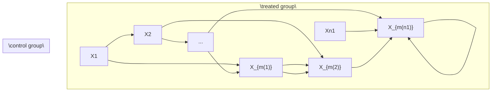

# Matching in Observational Studies

Matching has a long history in empirical research. W. Cochran and D. Rubin popularized it in statistical causal inference. Cochran and Rubin (1973) is an early review paper. Rubin (2006b) collects Rubin’s contributions to this topic. This chapter also discusses modern contributions by Abadie and Imbens (2006, 2008, 2011).

## 15.1 A simple starting point: many more control units




Consider a simple case with the number of control units n0 being much larger than the number of treated units n1. For unit i = 1, . . . , n1 in the treated group, we find a unit $m ( i )$ in the control group such that $X _ { i } = X _ { m ( i ) }$ . In the ideal case, we have exact matches. Therefore, the units within a matched pair have the same propensity score $e ( X _ { i } ) = e ( X _ { m ( i ) } )$ . Consequently, conditioning on the event that one unit receives the treatment and the other receives the control, the probability of unit i receiving the treatment and unit $m ( i )$ receives the control is

$$
\begin{array}{l} \operatorname{pr} \left(Z _ {i} = 1, Z _ {m (i)} = 0 \mid Z _ {i} + Z _ {m (i)} = 1, X _ {i}, X _ {m (i)}\right) \\ = \frac {\operatorname{pr} (Z _ {i} = 1 , Z _ {m (i)} = 0 \mid X _ {i} , X _ {m (i)})}{\operatorname{pr} (Z _ {i} = 1 , Z _ {m (i)} = 0 \mid X _ {i} , X _ {m (i)}) + \operatorname{pr} (Z _ {i} = 0 , Z _ {m (i)} = 1 \mid X _ {i} , X _ {m (i)})} \\ = \frac {e (X _ {i}) \{1 - e (X _ {m (i)}) \}}{e (X _ {i}) \{1 - e (X _ {m (i)}) \} + \{1 - e (X _ {i}) \} e (X _ {m (i)})} \\ = \frac {1}{2}. \\ \end{array}
$$

That is, the treatment assignment is identical to the MPE conditioning on the covariates and the event that each pair has a treated and control units. So we can analyze the exactly matched observational study as if it is a MPE, using either the FRT or the Neymanian approach in Chapter 7. This gives us inference on the causal effect on the treated units.

We can also find multiple control units for each treated unit. In general, we can find $M _ { i }$ matched control units for the treated unit i. When the $M _ { i } { ^ \mathrm { { \tiny ~ s } } }$ vary, it is called the variable-ratio matching (Ming and Rosenbaum, 2000, 2001; Pimentel et al., 2015). With perfect matching, the treatment assignment mechanism is identical to the general matched experiment discussed in Section 7.7. We can use the analytic results in that section to analyzed the matched observational study.

## 15.2 A more complicated but realistic scenario

Even if the control group is large, we often do not have exact matches. What we can achieve is that $X _ { i } \approx X _ { m ( i ) }$ or $X _ { i } - X _ { m ( i ) }$ is small under some distance metric. So we have only approximate matches. For example, we define

$$
m (i) = \arg \min _ {k: Z _ {k} = 0} d (X _ {i}, X _ {k}),
$$

where $d ( X _ { i } , X _ { k } )$ measures the distance between $X _ { i }$ and $X _ { k }$ . Some canonical choices of the distance are the Euclidean distance

$$
d (X _ {i}, X _ {k}) = \| X _ {i} - X _ {k} \| _ {2} ^ {2},
$$

and the Mahalanobis distance1

$$
d (X _ {i}, X _ {k}) = (X _ {i} - X _ {k}) ^ {\mathsf {T}} \Omega^ {- 1} (X _ {i} - X _ {k})
$$

with Ω being the sample covariance matrix of the $X _ { i } { } ^ { \ ' } \mathrm { s }$ from the whole population or only the control group.

I review some subtle issues about matching below. See Stuart (2010) for a review paper.

1. (one-to-one or one-to-M matching) The above discussion focused on one-to-one matching  
2. I focus on matching with replacement but some practitioners prefer matching without replacement. If the pool of control units is large, these two methods will not not matter too much for the final result. Matching with replacement is computationally more convenient, but matching without replacement involves computationally intensive discrete optimization. Matching with replacement usually gives matches of higher quality but it introduces dependence by using the same units multiple times. In contrast, the advantage of matching without replacement is the independence of matched units and the simplicity in the subsequent data analysis.  
3. Because of the residual covariate imbalance within matched pairs, it is crucial to use covariate adjustment when analyzing the data. In this case, covariate adjustment is not only for efficiency gain but also for bias correction.  
4. If X is “high dimensional”, it is likely that $d ( X _ { i } , X _ { k } )$ is too large for some unit i in the treated group and for all choices of the units in the control group. In this case, we may have to drop some units that are hard to find matches. By doing this, we effectively change the study population of interest.  
5. It is hard to avoid the above problem. For example, if $X _ { i } ~ \sim$ $\mathrm { N } ( 0 , I _ { p } ) , X _ { k } \sim \mathrm { N } ( 0 , I _ { p } )$ , and $X _ { i } \bot \bot X _ { k } .$ , then

$$
\| X _ {i} - X _ {k} \| _ {2} ^ {2} \sim \| \mathrm{N} (0, 2 I _ {p}) \| _ {2} ^ {2} = 2 \chi_ {p} ^ {2}
$$

which has mean $2 p$ and variance $8 p .$ . Theory shows that with large $p ,$ imperfect matching causes large bias in causal effect estimation. This suggests that if $p$ is large, we must have some dimension reduction before matching. Rosenbaum and Rubin (1983b) proposed to match based on the propensity score. With the estimated propensity score, we find pairs of units $\{ i , m ( i ) \}$ with small values of $| \hat { e } ( X _ { i } ) - \hat { e } ( X _ { m ( i ) } ) |$ or $| \mathrm { l o g i t } \{ \hat { e } ( X _ { i } ) \} - \mathrm { l o g i t } \{ \hat { e } ( X _ { m ( i ) } ) \} |$ , i.e., we have a one dimensional matching problem.

## 15.3 Matching estimator for the average causal effect

In a sequence of papers, Abadie and Imbens (AI) rigorously characterized the repeated sampling properties of the matching estimator and proposed the corresponding large-sample confidence intervals for the average causal effect. They chose the standard setup for observational studies with $\{ X _ { i } , Z _ { i } , Y _ { i } ( 1 ) , Y _ { i } ( 0 ) \} _ { i = 1 } ^ { n } \stackrel { \mathrm { I I D } } { \sim } \{ X , Z , Y ( 1 ) , Y ( 0 ) \}$ .

## 15.3.1 Point estimation and bias correction

AI focused on 1 to M matching with replacement. For a treated unit $i ,$ we can simply impute the potential outcome under treatment as $\hat { Y _ { i } } ( 1 ) = Y _ { i }$ , and impute the potential outcome under control as

$$
\hat {Y} _ {i} (0) = M ^ {- 1} \sum_ {k \in J _ {i}} Y _ {k},
$$

where $J _ { i }$ is the set of matched units from the control group for unit i. For example, we can compute $d ( X _ { i } , X _ { k } )$ for all k in the control group, and then define $J _ { i }$ as the indices of k with the M smallest values of $d ( X _ { i } , X _ { k } )$ .

For a control unit i, we simply impute the potential outcome under control as $\hat { Y _ { i } } ( 0 ) = Y _ { i }$ , and impute the potential outcome under treatment as

$$
\hat {Y} _ {i} (1) = M ^ {- 1} \sum_ {k \in J _ {i}} Y _ {k},
$$

where $J _ { i }$ is the set of matched units from the treatment group for unit i.

The matching estimator is

$$
\hat {\tau} ^ {\mathrm{m}} = n ^ {- 1} \sum_ {i = 1} ^ {n} \{\hat {Y} _ {i} (1) - \hat {Y} _ {i} (0) \}.
$$

AI showed that $\hat { \tau } ^ { \mathrm { m } }$ has non-negligible bias especially when X is multidimensional and the number of control units is comparable to the number of treated units. Through some technical derivations, they proposed the following estimator for the bias:

$$
\hat {B} = n ^ {- 1} \sum_ {i = 1} ^ {n} \hat {B} _ {i}
$$

where

$$
\hat {B} _ {i} = (2 Z _ {i} - 1) M ^ {- 1} \sum_ {k \in J _ {i}} \left\{\hat {\mu} _ {1 - Z _ {i}} \left(X _ {i}\right) - \hat {\mu} _ {1 - Z _ {i}} \left(X _ {k}\right) \right\}
$$

with $\{ \hat { \mu } _ { 1 } ( X _ { i } ) , \hat { \mu } _ { 0 } ( X _ { i } ) \}$ being the predicted outcomes by, for example, from OLS fits. For a treated unit with $Z _ { i } = 1$ , the estimated bias is

$$
\hat {B} _ {i} = M ^ {- 1} \sum_ {k \in J _ {i}} \{\hat {\mu} _ {0} (X _ {i}) - \hat {\mu} _ {0} (X _ {k}) \}
$$

which corrects the discrepancy in predicted control potential outcomes due to the mis-match in covariates; for a control unit with $Z _ { i } = 0$ , the estimates bias is

$$
\hat {B} _ {i} = - M ^ {- 1} \sum_ {k \in J _ {i}} \{\hat {\mu} _ {1} (X _ {i}) - \hat {\mu} _ {1} (X _ {k}) \}
$$

which corrects the discrepancy in predicted treated potential outcomes due to the mis-match in covariates.

The final bias corrected matching estimator is

$$
\hat {\tau} ^ {\mathrm{mbc}} = \hat {\tau} ^ {\mathrm{m}} - \hat {B},
$$

which has the following linear expansion.

Proposition 15.1 We have

$$
\hat {\tau} ^ {\mathrm{mbc}} = n ^ {- 1} \sum_ {i = 1} ^ {n} \hat {\psi} _ {i} \tag {15.1}
$$

where

$$
\hat {\psi} _ {i} = \hat {\mu} _ {1} (X _ {i}) - \hat {\mu} _ {0} (X _ {i}) + (2 Z _ {i} - 1) (1 + K _ {i} / M) \{Y _ {i} - \hat {\mu} _ {Z _ {i}} (X _ {i}) \}
$$

with $K _ { i }$ being the times that unit i is used as a match.

The linear expansion in Proposition 15.1 follows from simple but tedious algebra. I leave its proof as Problem 15.1. The linear expansion motivates a simple variance estimator

$$
\hat {V} ^ {\mathrm{mbc}} = \frac {1}{n ^ {2}} \sum_ {i = 1} ^ {n} (\hat {\psi} _ {i} - \hat {\tau} ^ {\mathrm{mbc}}) ^ {2},
$$

by viewing ${ \hat { \tau } } ^ { \mathrm { m b c } }$ as sample averages of the $\hat { \psi } _ { i } { ^ { \dagger } \mathrm { s } } .$ . In the literature, Abadie and Imbens $( 2 0 0 8 )$ first showed that the simple bootstrap by resampling the original data does not work for estimating the variance of the matching estimators, but their proposed variance estimation procedure is not easy to implement. Otsu and Rai (2017) proposed to bootstrap the $\hat { \psi } _ { i }$ ’s in the linear expansion, which $_ \mathrm { y }$ ields the variance estimator $\hat { V } ^ { \mathrm { m b c } }$ .

## 15.3.2 Connection with the doubly robust estimators

The bias-corrected matching estimators and the doubly robust estimators are closely related. They both equal the outcome regression estimator with some modifications based on the residuals

$$
\hat {R} _ {i} = \left\{ \begin{array}{l l} Y _ {i} - \hat {\mu} _ {1} (X _ {i}) & \text { if } Z _ {i} = 1; \\ Y _ {i} - \hat {\mu} _ {0} (X _ {i}) & \text { if } Z _ {i} = 0. \end{array} \right.
$$

For the average causal effect τ , recall the outcome regression estimator

$$
\hat {\tau} ^ {\mathrm{reg}} = n ^ {- 1} \sum_ {i = 1} ^ {n} \{\hat {\mu} _ {1} (X _ {i}) - \hat {\mu} _ {0} (X _ {i}) \}
$$

and the doubly robust estimator

$$
\hat {\tau} ^ {\mathrm{dr}} = \hat {\tau} ^ {\mathrm{reg}} + n ^ {- 1} \sum_ {i = 1} ^ {n} \left\{\frac {Z _ {i} \hat {R} _ {i}}{\hat {e} (X _ {i})} - \frac {(1 - Z _ {i}) \hat {R} _ {i}}{1 - \hat {e} (X _ {i})} \right\}.
$$

Furthermore, we can verify that ${ \hat { \tau } } ^ { \mathrm { m b c } }$ has a form very similar to ${ \hat { \tau } } ^ { \mathrm { d r } }$ .

Proposition 15.2 The bias-corrected matching estimator for τ equals

$$
\hat {\tau} ^ {\mathrm{mbc}} = \hat {\tau} ^ {\mathrm{reg}} + n ^ {- 1} \sum_ {i = 1} ^ {n} \left\{\left(1 + \frac {K _ {i}}{M}\right) Z _ {i} \hat {R} _ {i} - \left(1 + \frac {K _ {i}}{M}\right) (1 - Z _ {i}) \hat {R} _ {i} \right\}.
$$

I leave the proof of Proposition 15.2 as Problem 15.2. From Proposition 15.2, we can view matching as a nonparametric method to estimator the propensity score, and the resulting bias-corrected matching estimator as a doubly robust estimator. For instance, $1 + K _ { i } / M$ should be similar to $1 / \hat { e } ( X _ { i } )$ . When a treated unit has a small $e ( X _ { i } )$ , the resulting weight $1 / \hat { e } ( X _ { i } )$ will be large, and at the same time, it will be matched with many control units, resulting in large $K _ { i }$ and thus large $1 + K _ { i } / M$ . However, this connection also raised an obvious question regarding matching. With a fixed M, the estimator $1 + K _ { i } / M$ for $1 / e ( X _ { i } )$ will be very noisy. Allowing M to grow with the sampling size is likely to improve the matching-based nonparametric estimator for the propensity score and thus improve the asymptotic properties of the matching and bias-corrected matching estimators. Lin et al. (2023) provided a formal theory.

## 15.4 Matching estimator for the average causal effect on the treated

For the average causal effect on the treated

$$
\tau_ {\mathrm{T}} = E (Y \mid Z = 1) - E \{Y (0) \mid Z = 1 \},
$$

we only need to impute the missing potential outcomes under control for all the treated units, resulting the following estimator

$$
\hat {\tau} _ {\mathrm{T}} ^ {\mathrm{m}} = n _ {1} ^ {- 1} \sum_ {i = 1} ^ {n} Z _ {i} \{Y _ {i} - \hat {Y} _ {i} (0) \}.
$$

Again it is biased with multidimensional X. Otsu and Rai (2017) propose to estimate its bias by

$$
\hat {B} _ {\mathrm{T}} = n _ {1} ^ {- 1} \sum_ {i = 1} ^ {n} Z _ {i} \hat {B} _ {\mathrm{T}, i}
$$

where

$$
\hat {B} _ {\mathrm{T}, i} = M ^ {- 1} \sum_ {k \in J _ {i}} \{\hat {\mu} _ {0} (X _ {i}) - \hat {\mu} _ {0} (X _ {k}) \}
$$

corrects the bias due to the mis-match of covariates for a treated unit with $Z _ { i } = 1$ .

The final bias-corrected estimator is

$$
\hat {\tau} _ {\mathrm{T}} ^ {\mathrm{mbc}} = \hat {\tau} _ {\mathrm{T}} ^ {\mathrm{m}} - \hat {B} _ {\mathrm{T}},
$$

which has the following linear expansion.

Proposition 15.3 We have

$$
\hat {\tau} _ {\mathrm{T}} ^ {\mathrm{mbc}} = n _ {1} ^ {- 1} \sum_ {i = 1} ^ {n} \hat {\psi} _ {\mathrm{T}, i}, \tag {15.2}
$$

where

$$
\hat {\psi} _ {\mathrm{T}, i} = Z _ {i} \{Y _ {i} - \hat {\mu} _ {0} (X _ {i}) \} - (1 - Z _ {i}) K _ {i} / M \{Y _ {i} - \hat {\mu} _ {0} (X _ {i}) \}.
$$

I leave the proof as Problem 15.1. Motivated by Otsu and Rai (2017), we can view $\hat { \tau } _ { \mathrm { T } } ^ { \mathrm { m b c } }$ as $n / n _ { 1 }$ multiplied by the sample average of the $\psi _ { \mathrm { T } , i } \mathrm { ' s } ,$ so an intuitive variance estimator is

$$
\hat {V} _ {\mathrm{T}} ^ {\mathrm{mbc}} = \left(\frac {n}{n _ {1}}\right) ^ {2} \frac {1}{n ^ {2}} \sum_ {i = 1} ^ {n} (\hat {\psi} _ {\mathrm{T}, i} - \hat {\tau} _ {\mathrm{T}} ^ {\mathrm{mbc}} n _ {1} / n) ^ {2} = \frac {1}{n _ {1} ^ {2}} \sum_ {i = 1} ^ {n} (\hat {\psi} _ {\mathrm{T}, i} - \hat {\tau} _ {\mathrm{T}} ^ {\mathrm{mbc}} n _ {1} / n) ^ {2}.
$$

Similar to the discussion in Section 15.3.2, we can compare the doubly robust and bias-corrected matching estimators with the outcome regression estimator. For the average causal effect on the treated units $\tau _ { \mathrm { T } } ,$ recall the outcome regression estimator

$$
\hat {\tau} _ {\mathrm{T}} ^ {\mathrm{reg}} = n _ {1} ^ {- 1} \sum_ {i = 1} ^ {n} Z _ {i} \{Y _ {i} - \hat {\mu} _ {0} (X _ {i}) \},
$$

and the doubly robust estimator

$$
\hat {\tau} _ {\mathrm{T}} ^ {\mathrm{dr}} = \hat {\tau} _ {\mathrm{T}} ^ {\mathrm{reg}} - n _ {1} ^ {- 1} \sum_ {i = 1} ^ {n} \frac {\hat {e} (X _ {i})}{1 - \hat {e} (X _ {i})} (1 - Z _ {i}) \hat {R} _ {i}.
$$

Furthermore, we can verify that $\hat { \tau } _ { \mathrm { T } } ^ { \mathrm { m b c } }$ has a form very similar to $\hat { \tau } _ { \mathrm { T } } ^ { \mathrm { d r } }$ .

Proposition 15.4 The bias correction matching estimator for τT equals

$$
\hat {\tau} _ {\mathrm{T}} ^ {\mathrm{mbc}} = \hat {\tau} _ {\mathrm{T}} ^ {\mathrm{reg}} - n _ {1} ^ {- 1} \sum_ {i = 1} ^ {n} \frac {K _ {i}}{M} (1 - Z _ {i}) \hat {R} _ {i}.
$$

I leave the proof of Proposition 15.4 as Problem 15.3. Proposition 15.4 suggests that matching essentially uses $K _ { i } / M$ to estimate the odds of the treatment given covariates.

## 15.5 A case study

## 15.5.1 Experimental data

Now I revisit the LaLonde data using Sekhon (2011)’s Matching package. We have used this package several times for the dataset lalonde, and now we will use its key function Match. The experimental part gives us the following results:

```diff
> library("car")
> library("Matching")
> y = lalonde$re78
> z = lalonde$treat
> x = as.matrix(lalonde[, c("age", "educ", "black",
+    "hisp", "married", "nodegr",
+    "re74", "re75")])
>
> ## analysis the randomized experiment
> neymanols = lm(y ~ z)
> neymanols$coef[2]
z
1794.343
> sqrt(hccm(neymanols, type = "hc2")[2, 2])
[1] 670.9967
>
> xc = scale(x)
> linols = lm(y ~ z*xc)
> linols$coef[2]
z
1621.584
> sqrt(hccm(linols, type = "hc2")[2, 2])
[1] 694.7217
```

Both the unadjusted and adjusted estimators shows positive significant results on the job training program. We can analyze the data as if it is an observational study, yielding the following results:

## 15.5 A case study

```txt
> matchest.adj = Match(Y = y, Tr = z, X = x, BiasAdjust = TRUE)
> summary(matchest.adj)

Estimate... 2119.7
AI SE..... 876.42
T-stat..... 2.4185
p.val..... 0.015583

Original number of observations..... 445
Original number of treated obs..... 185
Matched number of observations..... 185
Matched number of observations (unweighted). 268
```

Both the point estimator and standard error increase, but qualitatively, the conclusion remains the same.

## 15.5.2 Observational data

Then I revisit the observational counterpart of the data:

```txt
> dat <- read.table("cps1re74.csv",header=T)
> dat$u74 <- as.numeric(dat$re74==0)
> dat$u75 <- as.numeric(dat$re75==0)
> y = dat$re78
> z = dat$treat
> x = as.matrix(dat[, c("age", "educ", "black",
+    "hispan", "married", "nodegree",
+    "re74", "re75", "u74", "u75")])
```

If we use simple OLS estimators, we obtain results that are far from the experimental benchmark:

```txt
> neymanols = lm(y ~ z)
> neymanols$coef[2]
z
-8506.495
> sqrt(hccm(neymanols, type = "hc2")[2, 2])
[1] 583.4426
>
> xc = scale(x)
> linols = lm(y ~ z*xc)
> linols$coef[2]
z
-4265.801
> sqrt(hccm(linols, type = "hc2")[2, 2])
[1] 3211.772
```

However, if we use matching, the results almost recovers those based on the experimental data:

```julia
> matchest = Match(Y = y, Tr = z, X = x, BiasAdjust = TRUE)
```

```txt
> summary(matchest)
```

```txt
Estimate... 1747.8
```

```txt
AI SE..... 916.59
```

```txt
T-stat..... 1.9068
```

```txt
p.val..... 0.056543
```

```txt
Original number of observations.... 16177
```

```txt
Original number of treated obs.... 185
```

```txt
Matched number of observations.... 185
```

```txt
Matched number of observations (unweighted). 248
```

Ignoring the ties in the matched data, we can also use the matched-pairs analysis, which again yields results similar to those based on the experimental data:

> diff = y[matchest $index.treated$ ] -
+    y[matchest $index.control$ ]
> round(summary(lm(diff ~ 1)) $coef[1, ], 2$ )
    Estimate Std. Error t value Pr(>|t|)
    1581.44    558.55    2.83    0.01
>
> diff.x = x[matchest $index.treated,$ ] -
+    x[matchest $index.control,$ ]
> round(summary(lm(diff ~ diff.x)) $coef[1, ], 2$ )
    Estimate Std. Error t value Pr(>|t|)
    1842.06    578.37    3.18    0.00

## 15.5.3 Covariate balance checks

Moreover, we can use simple OLS to check covariate balance. Before matching, the covariates are highly imbalanced, signified by many stars associated with the coefficients.

```txt
> lm.before = lm(z ~ x)
```

```txt
> summary(lm.before)
```

```txt
Call:
```

```txt
lm(formula = z ~ x)
```

```txt
Residuals:
```

```txt
Min 1Q Median 3Q Max
-0.18508 -0.01057 0.00303 0.01018 1.01355
```

```txt
Coefficients:
```

```txt
Estimate Std. Error t value Pr(>|t|)
(Intercept) 1.404e-03 6.326e-03 0.222 0.8243
xage -4.043e-04 8.512e-05 -4.750 2.05e-06 ***
xeduc 3.220e-04 4.073e-04 0.790 0.4293
```

**15.6 A case study**

<table><tr><td>xblack</td><td>1.070e-01</td><td>2.902e-03</td><td>36.871</td><td>&lt; 2e-16</td><td>***</td></tr><tr><td>xhispan</td><td>6.377e-03</td><td>3.103e-03</td><td>2.055</td><td>0.0399</td><td>*</td></tr><tr><td>xmarried</td><td>-1.525e-02</td><td>2.023e-03</td><td>-7.537</td><td>5.06e-14</td><td>***</td></tr><tr><td>xnodegree</td><td>1.345e-02</td><td>2.523e-03</td><td>5.331</td><td>9.89e-08</td><td>***</td></tr><tr><td>xre74</td><td>7.601e-07</td><td>1.806e-07</td><td>4.208</td><td>2.59e-05</td><td>***</td></tr><tr><td>xre75</td><td>-1.231e-07</td><td>1.829e-07</td><td>-0.673</td><td>0.5011</td><td></td></tr><tr><td>xu74</td><td>4.224e-02</td><td>3.271e-03</td><td>12.914</td><td>&lt; 2e-16</td><td>***</td></tr><tr><td>xu75</td><td>2.424e-02</td><td>3.399e-03</td><td>7.133</td><td>1.02e-12</td><td>***</td></tr></table>

Residual standard error : 0.09935 on 16166 degrees of freedom Multiple R - squared : 0.1274 , Adjusted R - squared : 0.1269 F - statistic : 236.1 on 10 and 16166 DF , p - value : < 2.2 e -16

But after matching, the covariates are well balanced, signified by the absence of stars for all coefficients.

```txt
> lm.after = lm(z ~ x,
+    subset = c(matchest$index.treated,
+    matchest$index.control))
> summary(lm.after)
```

Call :

lm ( formula = z \~ x , subset = c ( matchest \$ index . treated , matchest \$ index . control ))

Residuals :

```csv
Min 1Q Median 3Q Max
-0.66864 -0.49161 -0.03679 0.50378 0.65122
```

Coefficients :

<table><tr><td></td><td>Estimate</td><td>Std. Error</td><td>t value</td><td>Pr(&gt;|t|)</td></tr><tr><td>(Intercept)</td><td>6.003e-01</td><td>2.427e-01</td><td>2.474</td><td>0.0137 *</td></tr><tr><td>xage</td><td>3.199e-03</td><td>3.427e-03</td><td>0.933</td><td>0.3511</td></tr><tr><td>xeduc</td><td>-1.501e-02</td><td>1.634e-02</td><td>-0.918</td><td>0.3590</td></tr><tr><td>xblack</td><td>6.141e-05</td><td>7.408e-02</td><td>0.001</td><td>0.9993</td></tr><tr><td>xhispan</td><td>1.391e-02</td><td>1.208e-01</td><td>0.115</td><td>0.9084</td></tr><tr><td>xmarried</td><td>-1.328e-02</td><td>6.729e-02</td><td>-0.197</td><td>0.8437</td></tr><tr><td>xnodegree</td><td>-3.023e-02</td><td>7.144e-02</td><td>-0.423</td><td>0.6723</td></tr><tr><td>xre74</td><td>6.754e-06</td><td>9.864e-06</td><td>0.685</td><td>0.4939</td></tr><tr><td>xre75</td><td>-9.848e-06</td><td>1.279e-05</td><td>-0.770</td><td>0.4417</td></tr><tr><td>xu74</td><td>2.179e-02</td><td>1.027e-01</td><td>0.212</td><td>0.8321</td></tr><tr><td>xu75</td><td>-2.642e-02</td><td>8.327e-02</td><td>-0.317</td><td>0.7512</td></tr></table>

Residual standard error : 0.5043 on 485 degrees of freedom Multiple R - squared : 0.005101 , Adjusted R - squared : -0.01541 F - statistic : 0.2487 on 10 and 485 DF , p - value : 0.9909

## 15.6 Discussion

With many covariates, matching based on the original covariates may suffer from the curse of dimensionality. Rosenbaum and Rubin (1983b) suggested to use matching based on the estimated propensity score. Abadie and Imbens (2016) provided a form theory for this strategy.

## 15.7 Homework Problems

15.1 Linear expansions of the bias-corrected estimators

Prove Propositions 15.1 and 15.3.

15.2 Doubly robust form of the bias-corrected matching estimator for τ

Prove Proposition 15.2.

15.3 Doubly robust form of the bias-corrected matching estimator for τt

Prove Proposition 15.4.

15.4 Data re-analyses

In OSATE.R, I analyze two datasets using regression imputation, two IPW and the doubly robust estimators. Reanalyze them using the propensity score stratification estimator and the Abadie–Imbens matching estimator. Compare these estimators.

Note that you should choose different number of strata for the propensity score stratification estimator, and check covariate balance. You should also choose different number of matches for the matching estimator. You can even apply various estimators to the matched data. Are your results sensitive to your choices?

15.5 Data re-analyses

In Matching.R, I analyzed the LaLonde observational study using matching. Matching performs well because it gives an estimator that is close to the experimental gold standard. Reanalyze the data using the regression imputation, propensity score stratification, two IPW and the doubly robust estimators. Compare the results to the matching estimator and to the estimator from the experimental gold standard.

Note that you have many choices. For example, the number of strata for stratification and the threshold to trim to data based on the estimated propensity scores. You may consider fitting different propensity score and outcome models, e.g., including some quadratic terms of the basic covariates. You can even apply these estimators to the matched data.

This is a classic dataset and hundreds of papers have used it. You can read some references (Dehejia and Wahba, 1999; Hainmueller, 2012) and you can also be creative in your own data analysis.

## 15.6 Data re-analyses

Ho et al. (2007) is an influential paper in political science, based on which the authors have developed an R package MatchIt (Ho et al., 2011). Ho et al. (2007) analyzed two datasets, both of which are available from the Harvard Dataverse.

Reanalyze these two datasets using the methods discussed so far. You can also try other methods as long as you can justify them.

## 15.7 Recommended reading

The literature of matching estimators is massive, and three excellent review papers are Sekhon (2009), Stuart (2010) and Imbens (2015).

## Part IV