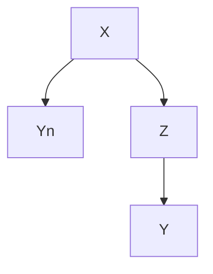
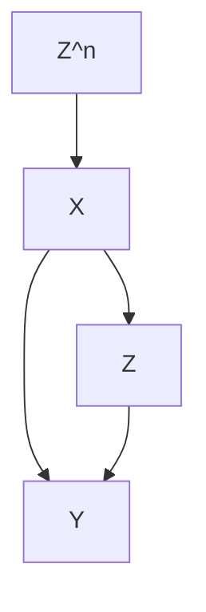
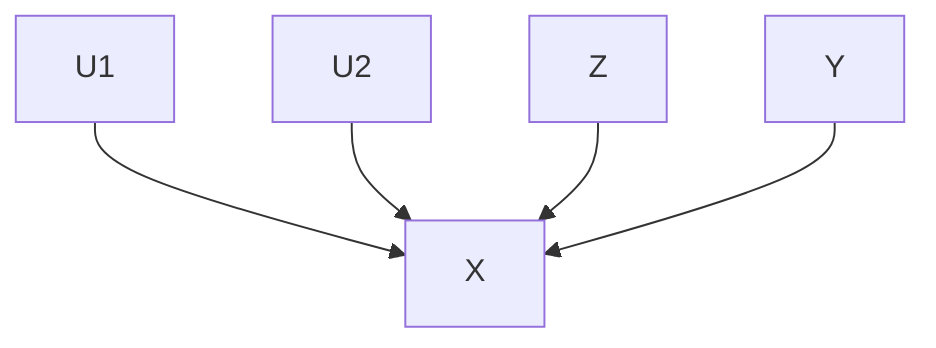
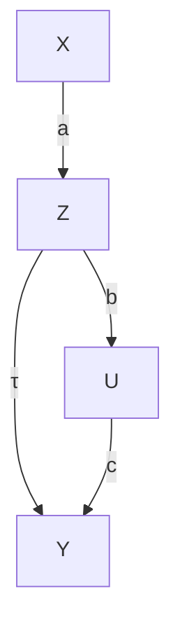
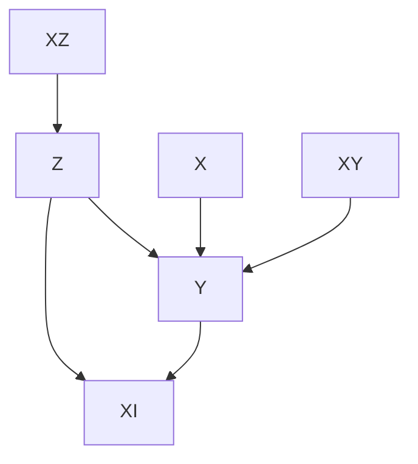

# Difficulties of Unconfoundedness in Observational Studies for Causal Effects

Part III of this book discusses causal inference with observational studies under two assumptions: unconfoundedness and overlap. Both are strong assumptions and likely to be violated in practice. This chapter will discuss the difficulties of the unconfoundedness assumption. Chapters 17–19 will discuss various strategies for sensitivity analysis in observational studies with unmeasured confounding. Chapter 20 will discuss the difficulties of the overlap assumption.

## 16.1 Some basics of the causal diagram

Pearl (1995) introduced the causal diagram as a powerful tool for causal inference in empirical research. Pearl (2000) is a textbook on the causal diagram. Here I introduce the causal diagram as an intuitive tool for illustrating the causal relationships among variables.

For example, if we have the causal diagram


and focus on the causal effect of Z on Y , we can read it as

$$
\left\{ \begin{array}{c} X \sim F _ {X} (x), \\ Z = f _ {Z} (X, \varepsilon_ {Z}), \\ Y (z) = f _ {Y} (X, z, \varepsilon_ {Y} (z)), \end{array} \right.
$$

where $\varepsilon _ { Z } \bot \bot \varepsilon _ { Y } ( z )$ for both $z = 0 , 1$ . In the above, covariates X are generated from a distribution $F _ { X } ( x )$ , the treatment assignment is a function of X with a random error term $\varepsilon _ { Z } .$ , and the potential outcome $Y ( z )$ is a function of X, z and a random error term $\varepsilon _ { Y } ( z )$ . We can easily read from the equations that $Z \bot \lfloor Y ( z ) \mid X , { \mathrm { i . e . } }$ , the unconfoundedness assumption holds.

If we have a causal diagram


we can read it as

$$
\left\{ \begin{array}{l l} X \sim F _ {X} (x), \\ U \sim F _ {U} (u), \\ Z = f _ {Z} (X, U, \varepsilon_ {Z}), \\ Y (z) = f _ {Y} (X, U, z, \varepsilon_ {Y} (z)), \end{array} \right.
$$

where $\varepsilon _ { Z } \bot \bot \varepsilon _ { Y } ( z )$ for both $z = 0 , 1$ . We can easily read from the equations that $Z \bot \bot Y ( z ) \mid ( X , U )$ but $Z \not \sqcup Y ( z ) \mid X$ , i.e., the unconfoundedness assumption holds conditioning on $( X , U )$ but does not hold conditioning on X only. In this case, U is an unmeasured confounder. In this diagram, U is called an unmeasured confounder.

## 16.2 Assessing ignorability

The weak ignorability

$$
Z \bot Y (1) \mid X, \quad Z \bot Y (0) \mid X
$$

implies that

$$
\operatorname{pr} \{Y (1) \mid Z = 1, X \} = \operatorname{pr} \{Y (1) \mid Z = 0, X \},
$$

$$
\operatorname{pr} \{Y (0) \mid Z = 1, X \} = \operatorname{pr} \{Y (0) \mid Z = 0, X \}.
$$

So the ignorability assumption basically requires that the counterfactual distribution pr $\{ Y ( 1 ) \mid Z = 0 , X \}$ equals the observed distribution pr $\{ Y ( 1 ) \mid$ $Z = 1 , X \}$ , and the counterfactual distribution pr $\{ Y ( 0 ) \mid Z = 1 , X \}$ equals the observed distribution $\mathrm { p r } \{ Y ( 0 ) \mid Z = 0 , X \}$ . Because the counterfactual distributions are not directly identifiable from the data, the ignorability assumption is fundamentally untestable without additional assumptions. I will discuss two strategies to assess ignorability. Here, “assess” is a weaker notion than $\mathrm { ^ { 6 6 5 t } } ^ { \mathrm { , 5 } }$ . The former is referred to as supplementary analysis that support or undermine the initial analysis, but the latter is referred to formal statistical testing.

## 16.2.1 Using negative outcomes

Assume that $Y ^ { \mathrm { n } }$ is an outcome similar to Y and ideally, shares the same confounding structure as Y . If we believe $Z \bot Y ( z ) \mid X$ , then we also tend to believe $Z \bot Y ^ { \mathrm { n } } ( z )$ | X. Moreover, we know, a priori, the effect of $Z$ on $Y ^ { \mathrm { n } }$ :

$$
\tau (Z \to Y ^ {\mathrm{n}}) = E \{Y ^ {\mathrm{n}} (1) - Y ^ {\mathrm{n}} (0) \}.
$$

An important example is that $\tau ( Z  Y ^ { \mathrm { n } } ) = 0$ . A causal diagram satisfying these requirements is below:




Example 16.1 Cornfield et al. (1959) studied the causal role of cigarette smoking on lung cancer based on observational studies. They controlled for many important background variables but it is still possible to have some unmeasured confounders biasing the observed effects. To strengthen the evidence, they also reported the effect of cigarette smoking on car accident which was close to zero, the anticipated effect based on biology. So even if they could not rule out unmeasured confounding in the analysis, this supplementary analysis based on a negative outcome makes the evidence of the the causal effect of cigarette smoking on lung cancer stronger.

Example 16.2 Imbens and Rubin (2015) suggested using the lagged outcome as a negative outcome. In most cases, it is reasonable to believe that the lagged outcome and the outcome have similar confounding structure. Since the lagged outcome happens before the treatment, the average causal effect on it must be 0. However, their suggestion should be used with caution since in most studies we simply treat lagged outcomes as an observed confounder.

In some sense, the covariate balance check in Chapter 11 is a special case of using negative controls. Similar to the problem of using lagged outcomes as negative controls, those covariates are usually a part of the ignorability assumption. Therefore, the failure of covariate balance check does not really falsify the ignorability assumption but rather the model specification of the propensity score.

Example 16.3 Observational studies in elderly persons have shown that vaccination against influenza remarkably reduces one’s risk of pneumonia/influenza hospitalization and all-cause mortality in the following season, after adjustment for measured covariates. Jackson et al. (2006) were skeptical about the large magnitude and thus conducted supplementary analysis on negative outcomes. Vaccination often begins in autumn, but influenza transmission is often minimal until winter. Based on biology, the effect of vaccination should be most prominent during influenza season. But Jackson et al. (2006) found greater effect before the influenza season, suggesting that the observed effect is due to unmeasured confounding.

## 20416 Difficulties of Unconfoundedness in Observational Studies for Causal Effects

Jackson et al. (2006) seems the most convincing one since the influenzarelated outcomes before and during the influenza season should have similar confounding patterns. Cornfield et al. (1959)’s additional evidence seems weaker since car accident and lung cancer have very different causal mechanisms with respect to cigarette smoking. In fact, Fisher (1957)’s critique was that the relationship between cigarette smoking on lung cancer may be due to an unobserved genetic factor. Such a genetic factor might affect cigarette smoking and lung cancer simultaneously, but it seems unlikely that it also affects car accident.

Lipsitch et al. (2010) is a recent article on negative outcomes. Rosenbaum (1989) discussed the role of known effects in causal inference.

## 16.2.2 Using negative exposures

Negative exposures are duals of negative outcomes. Assume $Z ^ { \mathrm { n } }$ is a treatment variable similar to $Z$ and shares the same confounding structure as Z. If we believe $Z \bot \bot Y ( z ) \mid X .$ , then we tend to believe $Z ^ { \mathrm { n } } \bot \bot { \bar { Y ( z ) } } \mid X .$ . Moreover, we know, a priori, the effect of $Z ^ { \mathrm { n } }$ on $Y$

$$
\tau (Z ^ {\mathrm{n}} \to Y) = E \{Y (1 ^ {\mathrm{n}}) - Y (0 ^ {\mathrm{n}}) \}.
$$

An important example is that $\tau ( Z ^ { \mathrm { n } } \to Y ) = 0$ . A causal diagram satisfying these requirements is below:




Example 16.4 Sanderson et al. (2017) give many examples of negative exposures in determining the effect of intrauterine exposure on later outcomes by comparing the association of a maternal exposure during pregnancy with the outcome of interest, with the association of the paternal exposure with the same outcome. They review studies on the effect of maternal and paternal smoking on offspring outcomes, the effect of maternal and paternal BMI on later offspring BMI and autism spectrum disorder. In these examples, we expect the the association of the maternal exposure with the outcome is larger than that of the paternal exposure with the outcome.

## 16.2.3 Summary

The unconfoundedness assumption is fundamentally untestable without additional assumptions. Although negative outcomes and negative controls in observational studies cannot prove or disprove unconfoundedness, using them in supplementary analyses can strengthen the evidence for causation. However, it is often non-trivial to conduct this type of supplementary analyses because it involves more data and more importantly, deeper understanding of the causal problems in order to find convincing negative outcomes and negative controls.

## 16.3 Problems of over adjustment

We have discussed many methods for estimating causal effects under ignorability:

$$
Z \bot \{Y (1), Y (0) \} \mid X.
$$

This is an assumption conditioning on X. It is crucial to select the right set of X that ensure the conditional independence. Rosenbaum (2002b) wrote that“there is no reason to avoid adjustment for a variable describing subjects before treatment.” Similarly, Rubin (2007) wrote that “typically, the more conditional an assumption, the more acceptable it is.” Both argued that we should control for all observed pretreatment covariate. VanderWeele and Shpitser (2011) called it the pretreatment criterion. Pearl disagreed with this recommendation and gave two counterexamples below.

## 16.3.1 M-bias

M-bias appears in the following causal diagram with an M-structure:




We can read from the diagram the data generating process:

$$
\left\{ \begin{array}{l} U _ {1} \text {卄} U _ {2}, \\ X = f _ {X} (U _ {1}, U _ {2}, \varepsilon_ {X}), \\ Z = f _ {Z} (U _ {1}, \varepsilon_ {Z}), \\ Y = Y (z) = f _ {Y} (U _ {2}, \varepsilon_ {Y}), \end{array} \right.
$$

where $( \varepsilon _ { X } , \varepsilon _ { Z } , \varepsilon _ { Y } )$ are independent random error terms. In the above causal diagram, X is observed, but $U _ { 1 }$ and $U _ { 2 }$ are unobserved. If we change the value of $Z ,$ , the value of $Y$ will not change at all. So the true causal effect of $Z$ on $Y$ must be 0. From the data-generating equations, we can easy read that $Z \bot \bot Y$ ,

## 20616 Difficulties of Unconfoundedness in Observational Studies for Causal Effects

so the association between Z and $Y$ is 0, and, in particular,

$$
\tau_ {\mathrm{PF}} = E (Y \mid Z = 1) - E (Y \mid Z = 0) = 0.
$$

This means that without adjusting for the covariate X, the simple estimator is unbiased for the true parameter.

However, if we condition on X, then $U _ { 1 } \not \mu U _ { 2 } \mid X$ , and consequently, $Z \not \bot Y \mid$ | X and

$$
\int \{E (Y \mid Z = 1, X = x) - E (Y \mid Z = 0, X = x) \} F (\mathrm{d} x) \neq 0
$$

in general. To gain intuition, we consider the case with Gaussian linear mod-$\mathrm { e l s } ^ { \mathrm { \scriptsize { 1 } } }$ :

$$
\left\{ \begin{array}{l} X = a U _ {1} + b U _ {2} + \varepsilon_ {X}, \\ Z = c U _ {1} + \varepsilon_ {Z}, \\ Y = Y (z) = d U _ {2} + \varepsilon_ {Y}, \end{array} \right.
$$

where $( U _ { 1 } , U _ { 2 } , \varepsilon _ { X } , \varepsilon _ { Z } , \varepsilon _ { Y } ) \stackrel { \mathrm { I I D } } { \sim } \mathrm { N } ( 0 , 1 )$ . We have

$$
\operatorname{cov} (Z, Y) = \operatorname{cov} \left(c U _ {1} + \varepsilon_ {Z}, d U _ {2} + \varepsilon_ {Y}\right) = 0,
$$

but by the result in Problem 1.2, the partial correlation coefficient between Z and $\check { Y }$ given X is

$$
\rho_ {Z Y | X} = \frac {\rho_ {Z Y} - \rho_ {Z X} \rho_ {Y X}}{\sqrt {1 - \rho_ {Z X} ^ {2}} \sqrt {1 - \rho_ {Y X} ^ {2}}} \propto - \rho_ {Z X} \rho_ {Y X} \propto - \operatorname{cov} (Z, X) \operatorname{cov} (Y, X) = - a b c d,
$$

the product of the coefficients on the path from Z to Y . So the unadjusted estimator is unbiased but the adjusted estimator has bias proportional to abcd.

The following simple example illustrates M-bias.

```txt
> n = 10^6
>
> ## M bias
> U1 = rnorm(n)
> U2 = rnorm(n)
> X = U1 + U2 + rnorm(n)
> Z = U1 + rnorm(n)
> Y = U2 + rnorm(n)
>
> round(summary(lm(Y ~ Z))$coef[2, 1], 3)
[1] -0.001
> round(summary(lm(Y ~ Z + X))$coef[2, 1], 3)
[1] -0.201
>
```

> Z = (Z >= 0)
> round(summary(lm(Y ~ Z))$coef[2, 1], 3)
[1] -0.002
> round(summary(lm(Y ~ Z + X))$coef[2, 1], 3)
[1] -0.421

## 16.3.2 Z-bias

Consider the following causal diagram:




with the data generating process2

$$
\left\{ \begin{array}{l} Z = a X + b U + \varepsilon_ {Z}, \\ Y (z) = \tau z + c U + \varepsilon_ {Y}, \end{array} \right.
$$

where $( U , X , \varepsilon _ { Z } , \varepsilon _ { Y } ) \stackrel { \mathrm { I I D } } { \sim } \mathrm { N } ( 0 , 1 )$ . In this data generating process, we have $X \bot \bot U , X \bot Z$ , and X affects Y only through Z.

The unadjusted estimator is

$$
\tau_ {\mathrm{unadj}} = \frac {\operatorname{cov} (Z , Y)}{\operatorname{var} (Z)} = \frac {\operatorname{cov} (Z , \tau Z + c U)}{\operatorname{var} (Z)} = \tau + \frac {c \operatorname{cov} (a X + b U , U)}{\operatorname{var} (Z)} = \tau + \frac {c b}{a ^ {2} + b ^ {2} + 1},
$$

which has bias $b c / ( a ^ { 2 } + b ^ { 2 } + 1 )$ . The adjusted estimator from the OLS of Y on $( Z , X )$ satisfies

$$
\left\{ \begin{array}{l} E \{Z (Y - \tau_ {\mathrm{adj}} Z - \alpha X) \} = 0, \\ E \{X (Y - \tau_ {\mathrm{adj}} Z - \alpha X) \} = 0, \end{array} \right.
$$

which is equivalent to

$$
\left\{ \begin{array}{l} E (Z Y) = \tau_ {\mathrm{adj}} \mathrm{var} (Z) + \alpha E (X Z), \\ E (X Y) = \tau_ {\mathrm{adj}} E (X Z) + \alpha \mathrm{var} (X). \end{array} \right.
$$

We need to solve for $( \tau _ { \mathrm { a d j } } , \alpha )$ from the above two linear equations:

$$
\begin{array}{l} \tau_ {\mathrm{adj}} = \frac {\left| \begin{array}{c c} E (Z Y) & E (X Z) \\ E (X Y) & \operatorname{var} (X) \end{array} \right|}{\left| \begin{array}{c c} \operatorname{var} (Z) & E (X Z) \\ E (X Z) & \operatorname{var} (X) \end{array} \right|} = \frac {E (Z Y) \operatorname{var} (X) - E (X Z) E (X Y)}{\operatorname{var} (Z) \operatorname{var} (X) - E (X Z) ^ {2}} \\ = \frac {\tau (a ^ {2} + b ^ {2} + 1) + b c - a \tau a}{(a ^ {2} + b ^ {2} + 1) - a ^ {2}} = \frac {\tau (b ^ {2} + 1) + b c}{b ^ {2} + 1} = \tau + \frac {b c}{b ^ {2} + 1}, \\ \end{array}
$$

which has bias bc/(b2 + 1).

So the unadjusted estimator has smaller bias than the adjusted estimator. More interestingly, the stronger the association between X and Z is (measured by a), the larger the bias of the adjusted estimator is.

The mathematical derivation is not extremely hard. But this type of bias seems rather mysterious. Here is the intuition. The treatment is a function of X, U, and other random errors. If we condition on X, it is merely a function of U and other random errors. Therefore, conditioning makes Z less random, and more critically, makes the unmeasured confounder U play a more important role in Z. Consequently, the confounding bias due to U is amplified by conditioning on X. This idealized example illustrates the danger of over adjusting for some covariates.

Heckman and Navarro-Lozano (2004) observed the phenomenon in simulation studies, and Wooldridge (2016, technical report in 2006) verified it in linear models. Pearl (2010, 2011) explained it using causal diagrams. This type of bias is called Z-bias because in Pearl’s original papers, he used the symbol Z for our variable X. Throughout the book, however, Z is used for the treatment variable. In Part V of this book, we will call Z an instrumental variable if it satisfies the causal diagram presented in this subsection. This justifies the instrumental variable bias as another name of this type of bias.

The following simple example illustrates Z-bias.

```txt
> X = rnorm(n)
> U = rnorm(n)
> Z = X + U + rnorm(n)
> Y = U + rnorm(n)
>
> round(summary(lm(Y ~ Z))$coef[2, 1], 3)
[1] 0.334
> round(summary(lm(Y ~ Z + X))$coef[2, 1], 3)
[1] 0.501
>
> Z = 2*X + U + rnorm(n)
> round(summary(lm(Y ~ Z))$coef[2, 1], 3)
[1] 0.167
> round(summary(lm(Y ~ Z + X))$coef[2, 1], 3)
[1] 0.5
>
> Z = 10*X + U + rnorm(n)
> round(summary(lm(Y ~ Z))$coef[2, 1], 3)
[1] 0.01
> round(summary(lm(Y ~ Z + X))$coef[2, 1], 3)
[1] 0.5
```

## 16.3.3 What covariates should we adjust for in observational studies?

We never know the true underlying data generating process which can be quite complicated. However, the following causal diagram helps to clarify many ideas. It already rules out the possibility of M-bias discussed in Section 16.3.1.




$X _ { R }$

The covariates above have different features:

1. X affects both the treatment and the outcome. Conditioning on X ensures ignorability, so we should control for X.  
2. $X _ { R }$ is pure random noise not affecting either the treatment or the outcome. Including it in analysis does not bias the estimate but it introduces unnecessary variability in finite sample.  
3. $X _ { Z }$ is an instrumental variable that affects the outcome only through the treatment. In the diagram above, including it in analysis does not bias the estimate although it increases variability. However, with unmeasured confounding, including it in analysis amplifies the bias as shown in Section 16.3.1.  
4. $X _ { Y }$ affects the outcome only but not the treatment. Without conditioning on it, the ignorability still holds. Since they are predictive to the outcome, including them in analysis often improves precision.  
5. $X _ { I }$ is affected by the treatment and outcome. It is a post-treatment variable, not a pretreatment covariate. We should not include it if the goal is to infer the effect of the treatment on the outcome. We will discuss issues with post-treatment variables in causal inference in Part VI of this book.

If we believe the above causal diagram, we should adjust for at least X to remove bias and more ideally, further adjust for $X _ { Y }$ to reduce variance.

## 16.4 Homework Problems

## 16.1 Cochran’s formula or the omitted variable bias formula

Sir David Cox calls the following result Cochran’s formula (Cochran, 1938; Cox, 2007) and econometricians call it the omitted variable bias formula $( \mathrm { A n - }$ grist and Pischke, 2008). A special case appeared in Fisher (1925). It is also a sister of the Frisch–Waugh–Lovell Theorem in Chapter A2.3.

The formula has two versions. All vectors below are column vectors.

1. (Population version) Assume $( y _ { i } , x _ { 1 i } , x _ { 2 i } ) _ { i = 1 } ^ { n }$ are iid, where $y _ { i }$ is a scalar, $x _ { i 1 }$ has dimension K, and $x _ { i 2 }$ has dimension L.

We have the following OLS decompositions of random variables

$$
y _ {i} = \beta_ {1} ^ {\mathsf {T}} x _ {i 1} + \beta_ {2} ^ {\mathsf {T}} x _ {2 i} + \varepsilon_ {i}, \tag {16.1}
$$

$$
y _ {i} = \gamma^ {\mathsf {T}} x _ {i 1} + e _ {i}, \tag {16.2}
$$

$$
x _ {i 2} = \delta^ {\mathsf {T}} x _ {i 1} + v _ {i}. \tag {16.3}
$$

Equation (16.1) is called the long regression, and Equation (16.2) is called the short regression. In Equation (16.3), δ is a matrix because it is a regression of a vector on a vector. You can view (16.3) as regression of each component of $x _ { i 2 }$ on $x _ { i 1 }$ .

Show that $\gamma = \beta _ { 1 } + \delta \beta _ { 2 }$ .

2. (Sample version) We have an $n \times 1$ vector $Y ,$ an $n \times K$ matrix $X _ { 1 } ,$ and an $n \times L$ matrix $X _ { 2 }$ . We do not assume any randomness. All results below are purely linear algebra.

We can obtain the following OLS fits:

$$
{ Y } { = } { X _ { 1 } \hat { \beta } _ { 1 } + X _ { 2 } \hat { \beta } _ { 2 } + \hat { \varepsilon } , }
$$

$$
Y = X _ {1} \hat {\gamma} + \hat {e},
$$

$$
{X _ {2}} = {X _ {1} \hat {\delta} + \hat {v},}
$$

where ˆε, e, ˆ vˆ are the residuals. Again, the last OLS fit means the OLS fit of each column of $X _ { 2 }$ on $X _ { 1 }$ , and therefore the residual ˆv is an $n \times L$ matrix.

Show that $\hat { \gamma } = \hat { \beta } _ { 1 } + \hat { \delta } \hat { \beta } _ { 2 }$ .

Remark: The product terms $\delta \beta _ { 2 }$ and $\hat { \delta } \hat { \beta } _ { 2 }$ are often referred to as the omitted-variable bias at the population level and sample level, respectively.

## 16.2 Recommended reading

Imbens (2020) reviews and compares the roles of potential outcomes and causal diagrams for causal inference.

## 17