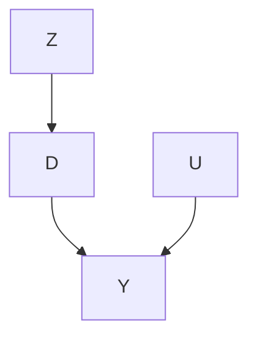

# An Experimental Perspective

The instrumental variable method has been a powerful tool in econometrics. It identifies causal effects in studies without unconfoundedness between the treatment and the outcome. It relies on an additional variable, called the instrumental variable (IV), that satisfies certain conditions. These conditions may not be easy to digest when you read for the first time. In some sense, IV is a magic. This chapter presents a not-so-magic perspective based on the encouragement design. This again echos Dorn (1953)’s suggestion that the planner of an observational study should always ask himself the following question:

How would the study be conducted if it were possible to do it by controlled experimentation?

The experimental analog of the IV method is the encouragement design (Zelen, 1979; Powers and Swinton, 1984; Holland, 1986).

## 21.1 Encouragement Design and Noncompliance

Consider an experiment with units indexed by $i = 1 , \ldots , n$ . Let $Z _ { i }$ be the treatment assigned, with 1 for the treatment and 0 for the control. Let $D _ { i }$ be the treatment received, with 1 for the treatment and 0 for the control. When $Z _ { i } \neq D _ { i }$ for some unit i, the noncompliance problem arises. Noncompliance is a very common problem especially in encouragement designs involving human beings as experimental units. In these cases, the experimenters cannot force the units to take the treatment but rather only encourage them to do so. Let $Y _ { i }$ be the outcome of interest.

Consider complete randomization of Z and ignore covariates X now. We have the potential values for the treatment received $\{ D _ { i } ( 1 ) , D _ { i } ( 0 ) \}$ and the potential values for the outcome $\{ Y _ { i } ( 1 ) , Y _ { i } ( 0 ) \}$ , all with respect to the treatment assignment levels 1 and 0. Their observed values are $D _ { i } \ =$ $Z _ { i } D _ { i } ( 1 ) + ( 1 - Z _ { i } ) D _ { i } ( 0 )$ and $Y _ { i } = Z _ { i } Y _ { i } ( 1 ) + ( 1 - Z _ { i } ) Y _ { i } ( 0 )$ , respectively. For notational simplicity, we assume $\{ Z _ { i } , D _ { i } ( 1 ) , D _ { i } ( 0 ) , Y _ { i } ( 1 ) , Y _ { i } ( 0 ) \} _ { i = 1 } ^ { n } \stackrel { \mathrm { I I D } } { \sim }$ IID $\{ Z , D ( 1 ) , D ( 0 ) , Y ( 1 ) , Y ( 0 ) \}$ and sometimes drop the subscript i without causing confusions.

We start with completely randomized experiments.

Assumption 21.1 (randomization) $Z \bot \bot \{ D ( 1 ) , D ( 0 ) , Y ( 1 ) , Y ( 0 ) \}$ .

Randomization allows for identification of the average causal effects on D and $Y \colon$ :

$$
\tau_ {D} = E \{D (1) - D (0) \} = E (D \mid Z = 1) - E (D \mid Z = 0)
$$

and

$$
\tau_ {Y} = E \{Y (1) - Y (0) \} = E (Y \mid Z = 1) - E (Y \mid Z = 0).
$$

We can use simple difference-in-means estimators $\hat { \tau } _ { D }$ and $\hat { \tau } _ { Y }$ to estimate $\tau _ { D }$ and $\tau _ { Y }$ , respectively.

Reporting the estimate $\hat { \tau } _ { Y }$ with the associated standard error is called the intention-to-treat (ITT) analysis. It estimates the effect of the treatment assignment on the outcome, and complete randomization in Assumption 21.1 justifies this analysis. However, it may not answer the scientific question, that is, the causal effect of the treatment received on the outcome.

## 21.2 Latent Compliance Status and Effects

## 21.2.1 Nonparametric identification

Following Imbens and Angrist (1994) and Angrist et al. (1996), we stratify the population based on the joint potential values of of $\{ D _ { i } ( 1 ) , D _ { i } ( 0 ) \}$ . Because $D$ is binary, we have four possible combinations:

$$
U _ {i} = \left\{ \begin{array}{l l} \mathrm{a,} & \mathrm{if} D _ {i} (1) = 1 \mathrm{and} D _ {i} (0) = 1; \\ \mathrm{c,} & \mathrm{if} D _ {i} (1) = 1 \mathrm{and} D _ {i} (0) = 0; \\ \mathrm{d,} & \mathrm{if} D _ {i} (1) = 0 \mathrm{and} D _ {i} (0) = 1; \\ \mathrm{n,} & \mathrm{if} D _ {i} (1) = 0 \mathrm{and} D _ {i} (0) = 0, \end{array} \right.
$$

where $\mathrm { ^ { 6 } a } ^ { \mathrm { 9 } }$ is for “always taker, $\begin{array} { r l } { \mathfrak { N } } & { { } ^ { 6 6 } \mathrm { c } ^ { \mathfrak { N } } } \end{array}$ is for “complier,” $\mathrm { ^ { 6 } d } ^ { \mathrm { 3 } }$ is for “defier,” and $\mathrm { ^ { 6 6 } n } \mathrm { ^ { \circ } }$ is for “never taker.” Because we cannot observe $D _ { i } ( 1 )$ and $D _ { i } ( 0 )$ simultaneously, $U _ { i }$ is a latent variable for the compliance behavior of unit i.

Based on $U ,$ , we can use the law of total probability to decompose the average causal effect on $Y$ into four terms:

$$
\begin{array}{l} \tau_ {Y} = E \{Y (1) - Y (0) \mid U = \mathrm{a} \} \operatorname{pr} (U = \mathrm{a}) \\ + E \{Y (1) - Y (0) \mid U = c \} \mathrm{pr} (U = c) \\ + E \{Y (1) - Y (0) \mid U = \mathrm{d} \} \operatorname{pr} (U = \mathrm{d}) \\ + E \{Y (1) - Y (0) \mid U = \mathrm{n} \} \operatorname{pr} (U = \mathrm{n}). \tag {21.1} \\ \end{array}
$$

Therefore, $\tau _ { Y }$ is a weighted average of four latent subgroup effects. We will look into more details of the latent groups below.

Assumption 21.2 below restricts the third term in (21.1) to be zero.

Assumption 21.2 (monotonicity) $\mathrm { p r } ( U = \mathrm { d } ) = 0 ~ o r ~ D _ { i } ( 1 ) \geq D _ { i } ( 0 )$ , that $i s ,$ there are no $d e f i e r s$ .

Assumption 21.2 holds automatically with one-sided noncompliance when the units assigned to the control arm have no access to the treatment, $\mathrm { i . e . , }$ $D _ { i } ( 0 ) = 0$ for all units. Under randomization, Assumption 21.2 has a testable implication that

$$
\operatorname{pr} (D = 1 \mid Z = 1) \geq \operatorname{pr} (D = 1 \mid Z = 0).
$$

But Assumption 21.2 is much stronger than the inequality above. The former restricts $D _ { i } ( 1 )$ and $D _ { i } ( 0 )$ at the individual level and the latter restricts them only on average. Nevertheless, when this testable implication holds, we cannot use the observed data to refute Assumption 21.2.

Assumption 21.3 below restricts the first and last terms in (21.1) to be zero based on the mechanism of the treatment assignment on the outcome through only the treatment received.

Assumption 21.3 (exclusion restriction) $Y _ { i } ( 1 ) = Y _ { i } ( 0 )$ for always takers with $U _ { i } = \mathbf { a }$ and never takers with $U _ { i } = \mathrm { n }$ .

Assumption 21.3 requires that the treatment assignment affects the outcome only if it affects the treatment received. In double-blind clinical $\mathrm { \ t r i a l ^ { 1 } }$ , it is biologically plausible because the outcome only depends on the actual treatment received. That ${ \mathrm { i s } } ,$ if the treatment assignment does not change the treatment received, it does not change the outcome either. It can be violated if the treatment assignment has direct effects on the outcome not through the treatment received. For example, some randomized controlled trials are not double blinded, and the treatment assignment can have some unknown pathways to the outcome.

Under Assumptions 21.2 and 21.3, the decomposition (21.1) only has the second term :

$$
\tau_ {Y} = E \{Y (1) - Y (0) \mid U = \mathrm{c} \} \mathrm{pr} (U = \mathrm{c}). \tag {21.2}
$$

Similarly, we can decompose the average causal effect on $D$ into four terms:

$$
\begin{array}{l} \tau_ {D} = E \{D (1) - D (0) \mid U = \mathrm{a} \} \operatorname{pr} (U = \mathrm{a}) \\ + E \{D (1) - D (0) \mid U = c \} \operatorname{pr} (U = c) \\ + E \{D (1) - D (0) \mid U = \mathrm{d} \} \operatorname * {p r} (U = \mathrm{d}) \\ + E \{D (1) - D (0) \mid U = \mathrm{n} \} \mathrm{pr} (U = \mathrm{n}) \\ = 0 \times \operatorname{pr} (U = \mathrm{a}) + 1 \times \operatorname{pr} (U = \mathrm{c}) + (- 1) \times \operatorname{pr} (U = \mathrm{d}) + 0 \times \operatorname{pr} (U = \mathrm{n}), \\ \end{array}
$$

which, under Assumption 21.2, reduces to

$$
\tau_ {D} = \mathrm{pr} (U = \mathrm{c}). \tag {21.3}
$$

This is an interesting fact that the proportion of the compliers $\pi _ { \mathrm { c } }$ equals the average causal effect of the treatment assigned on $D ,$ an identifiable quantity under complete randomization. Although we do not know all the compliers based on the observed data, we can identify their proportion in the whole population based on (21.3). Combining (21.2) and (21.3), we have the following result.

Theorem 21.1 Under Assumptions 21.2–21.3, we have

$$
E \{Y (1) - Y (0) \mid U = \mathrm{c} \} = \frac {\tau_ {Y}}{\tau_ {D}}
$$

$$
i f \tau_ {D} \neq 0.
$$

Following Imbens and Angrist (1994) and Angrist et al. (1996), we define a new causal effect below.

Definition 21.1 (CACE or LATE) Define

$$
\tau_ {\mathrm{c}} \equiv E \{Y (1) - Y (0) \mid U = \mathrm{c} \}
$$

as the “complier average causal effect (CACE)” or the “local average treatment effect (LATE)”. It has alternative forms:

$$
\tau_ {\mathrm{c}} = E \{Y (1) - Y (0) \mid D (1) = 1, D (0) = 0 \}
$$

$$
= E \{Y (1) - Y (0) \mid D (1) > D (0) \}.
$$

Based on Definition 21.1, we can rewrite Theorem 21.1 as

$$
\tau_ {\mathrm{c}} = \frac {\tau_ {Y}}{\tau_ {D}},
$$

that is, the CACE or LATE equals the ratio of the average causal effects on Y over that on D. Under Assumption 21.1, we further identify the CACE below.

Corollary 21.1 Under Assumptions 21.1–21.3, we have

$$
\tau_ {\mathrm{c}} = \frac {E (Y \mid Z = 1) - E (Y \mid Z = 0)}{E (D \mid Z = 1) - E (D \mid Z = 0)}.
$$

Therefore, under randomization, monotonicity, and exclusion restriction, we can nonparametrically identify the CACE as the ratio of the difference in means of the outcome over the difference in means of the treatment received.

## 21.2.2 Estimation

Based on Corollary 21.1, we can estimate $\tau _ { \mathrm { c } }$ by a simple ratio

$$
\hat {\tau} _ {\mathrm{c}} = \frac {\hat {\tau} _ {Y}}{\hat {\tau} _ {D}},
$$

which is called the Wald estimator (Wald, 1940) or the IV estimator. In the above discussion, $Z$ acts as the IV for D.

We can obtain the variance estimator based on the following heuristics (see Example A1.3):

$$
\hat {\tau} _ {\mathrm{c}} - \tau_ {\mathrm{c}} = (\hat {\tau} _ {Y} - \tau_ {\mathrm{c}} \hat {\tau} _ {D}) / \hat {\tau} _ {D} \approx (\hat {\tau} _ {Y} - \tau_ {\mathrm{c}} \hat {\tau} _ {D}) / \tau_ {D} = \hat {\tau} _ {A} / \tau_ {D},
$$

where $\hat { \tau } _ { A }$ is the difference-in-means of the adjusted outcome $A _ { i } = Y _ { i } - \tau _ { \mathrm { c } } D _ { i }$ . So the asymptotic variance of $\hat { \tau } _ { \mathrm { c } }$ is close to the variance of $\hat { \tau } _ { A }$ divided by $\tau _ { D } ^ { 2 }$ . The variance estimation proceeds in the following steps:

1. obtain the adjusted outcomes $\hat { A } _ { i } = Y _ { i } - \hat { \tau } _ { \mathrm { c } } D _ { i } ( i = 1 , \dots , n )$  
2. obtain the Neyman-type variance estimate based on the adjusted outcomes:

$$
\hat {V} _ {\hat {A}} = \frac {\hat {S} _ {\hat {A}} ^ {2} (1)}{n _ {1}} + \frac {\hat {S} _ {\hat {A}} ^ {2} (0)}{n _ {0}},
$$

where $\hat { S } _ { \hat { A } } ^ { 2 } ( 1 )$ and $\hat { S } _ { \hat { A } } ^ { 2 } ( 0 )$ are the sample variances of the $\hat { A } _ { i } { ^ { \circ } \mathrm { s } }$ under treatment and control, respectively;

3. obtain the final variance estimator $\hat { V } _ { \hat { A } } / { \hat { \tau } _ { D } } ^ { 2 }$ .

Under the null hypothesis that $\tau _ { \mathrm { c } } = 0$ , we can simply approximate the variance by $\hat { V } _ { Y } / \hat { \tau } _ { D } ^ { 2 }$ , where $\hat { V } _ { Y }$ is the Neyman-type variance estimate for the difference in means of $Y$ . This variance estimator is inconsistent if the true $\tau _ { \mathrm { c } }$ is not zero. Therefore, it works for testing but not for estimation. Nevertheless, it gives interesting insights for the ITT estimator and the Wald estimator. The ITT estimator $\hat { \tau } _ { Y }$ has estimated standard error $\sqrt { \hat { V } _ { Y } }$ . The Wald estimator $\hat { \tau } _ { Y } / \hat { \tau } _ { D }$ essentially equals the ITT estimator multiplied by $1 / \hat { \tau } _ { D } > 1$ , which is larger in magnitude but at the same time its estimated standard error increases by the same factor. The confidence intervals for $\tau _ { Y }$ and $\tau _ { \mathrm { c } }$ are

$$
\hat {\tau} _ {Y} \pm z _ {1 - \alpha / 2} \sqrt {\hat {V} _ {Y}}
$$

and

$$
\hat {\tau} _ {Y} / \hat {\tau} _ {D} \pm z _ {1 - \alpha / 2} \sqrt {\hat {V} _ {Y}} / \hat {\tau} _ {D} = \left(\hat {\tau} _ {Y} \pm z _ {1 - \alpha / 2} \sqrt {\hat {V} _ {Y}}\right) / \hat {\tau} _ {D}.
$$

These confidence intervals give the same qualitative conclusions since they will both cover zero or not. In some sense, the IV analysis provides the same qualitative information as the ITT analysis of $Y$ although it involves more complicated procedures.

## 21.3 Covariates

## 21.3.1 Covariate adjustment in complete randomization

We now consider completely randomized experiments with covariates, and assume $Z \bot \bot \{ D ( 1 ) , D ( 0 ) , Y ( 1 ) , Y ( 0 ) , X \}$ . With covariates $X ,$ , we can obtain Lin (2013)’s estimators $\hat { \tau } _ { D , \mathrm { L } }$ and $\hat { \tau } _ { Y , \mathrm { L } }$ for both D and ${ \cal Y } ,$ , resulting in $\hat { \tau } _ { \mathrm { c , L } } =$ $\hat { \tau } _ { Y , \mathrm { L } } / \hat { \tau } _ { D , \mathrm { L } }$ . Recall that

$$
\hat {\tau} _ {D, \mathrm{L}} = \left\{\hat {\bar {D}} (1) - \hat {\beta} _ {D 1} ^ {\mathsf {T}} \hat {\bar {X}} (1) \right\} - \left\{\hat {\bar {D}} (0) - \hat {\beta} _ {D 0} ^ {\mathsf {T}} \hat {\bar {X}} (0) \right\},
$$

$$
\hat {\tau} _ {Y, \mathrm{L}} = \left\{\hat {\bar {Y}} (1) - \hat {\beta} _ {Y 1} ^ {\mathsf {T}} \hat {\bar {X}} (1) \right\} - \left\{\hat {\bar {Y}} (0) - \hat {\beta} _ {Y 0} ^ {\mathsf {T}} \hat {\bar {X}} (0) \right\},
$$

where $\hat { \beta } _ { D 1 }$ and $\hat { \beta } _ { Y 1 }$ are the coefficients of X in the OLS fits of D and $Y$ in the treated group, and $\hat { \beta } _ { D 0 }$ and $\hat { \beta } _ { Y 0 }$ are the coefficients of X in the OLS fits of $D$ and Y in the control group. We can approximate the standard error of $\hat { \tau } _ { \mathrm { c , L } }$ based on the following heuristics (again see Example A1.3):

$$
\hat {\tau} _ {\mathrm{c,L}} - \tau_ {\mathrm{c}} = (\hat {\tau} _ {Y, \mathrm{L}} - \tau_ {\mathrm{c}} \hat {\tau} _ {D, \mathrm{L}}) / \hat {\tau} _ {D, \mathrm{L}} \approx (\hat {\tau} _ {Y, \mathrm{L}} - \tau_ {\mathrm{c}} \hat {\tau} _ {D, \mathrm{L}}) / \tau_ {D} = \hat {\tau} _ {A} / \tau_ {D},
$$

where $\hat { \tau } _ { A }$ is the difference-in-means of A, defined as

$$
A _ {i} = \left\{ \begin{array}{l l} (Y _ {i} - \hat {\beta} _ {Y 1} ^ {\mathsf {T}} X _ {i}) - \tau_ {\mathrm{c}} (D _ {i} - \hat {\beta} _ {D 1} ^ {\mathsf {T}} X _ {i}), & \text {if} Z _ {i} = 1, \\ (Y _ {i} - \hat {\beta} _ {Y 0} ^ {\mathsf {T}} X _ {i}) - \tau_ {\mathrm{c}} (D _ {i} - \hat {\beta} _ {D 0} ^ {\mathsf {T}} X _ {i}), & \text {if} Z _ {i} = 0. \end{array} \right.
$$

The variance estimation proceeds in the following steps:

1. obtain the adjusted outcomes $\hat { A } _ { i } \ ( i = 1 , \ldots , n )$ with

$$
\hat {A} _ {i} = \left\{ \begin{array}{l l} (Y _ {i} - \hat {\beta} _ {Y 1} ^ {\mathsf {T}} X _ {i}) - \hat {\tau} _ {\mathrm{c,L}} (D _ {i} - \hat {\beta} _ {D 1} ^ {\mathsf {T}} X _ {i}), & \text {if} Z _ {i} = 1, \\ (Y _ {i} - \hat {\beta} _ {Y 0} ^ {\mathsf {T}} X _ {i}) - \hat {\tau} _ {\mathrm{c,L}} (D _ {i} - \hat {\beta} _ {D 0} ^ {\mathsf {T}} X _ {i}), & \text {if} Z _ {i} = 0; \end{array} \right.
$$

2. obtain the Neyman-type variance estimate based on the adjusted outcomes:

$$
\hat {V} _ {\hat {A}} = \frac {\hat {S} _ {\hat {A}} ^ {2} (1)}{n _ {1}} + \frac {\hat {S} _ {\hat {A}} ^ {2} (0)}{n _ {0}},
$$

where $\hat { S } _ { \hat { A } } ^ { 2 } ( 1 )$ and $\hat { S } _ { \hat { A } } ^ { 2 } ( 0 )$ are the sample variances of the $\hat { A } _ { i } { ^ { \circ } \mathrm { s } }$ under the treatment and control, respectively;

3. obtain the final variance estimator $\hat { V } _ { \hat { A } } / { \hat { \tau } _ { D , \mathrm { L } } ^ { 2 } }$

Again under the null with $\tau _ { \mathrm { c } } ~ = ~ 0 .$ , we can approximate the estimated standard error for $\hat { \tau } _ { \mathrm { c , L } }$ by the estimated standard error of $\hat { \tau } _ { Y , \mathrm { L } } \ ( \mathrm { e . g . }$ , the EHW standard error in the fully interacted linear model) divided by $\hat { \tau } _ { D , \mathrm { L } }$ .

## 21.3.2 Covariates in conditional randomization or unconfounded observational studies

If randomization holds conditionally, i.e.,

$$
Z \bot \{D (1), D (0), Y (1), Y (0) \} \mid X,
$$

then we must adjust for covariates to avoid bias. The analysis is also straightforward since we already have discussed many estimators in Part III for estimating the effects of Z on D and $Y _ { z }$ , respectively. We can just use them in the ratio formula $\hat { \tau } _ { \mathrm { c } } = \hat { \tau } _ { Y } / \hat { \tau } _ { D }$ and use the bootstrap to approximate the asymptotic variance.

## 21.4 Weak IV

Even $\tau _ { D } > 0$ , there is a positive probability that $\hat { \tau } _ { D }$ is zero, so the variance of $\hat { \tau } _ { \mathrm { c } }$ is infinity. The variance from the Normal approximation discussed before is not the variance of $\hat { \tau } _ { \mathrm { c } }$ but rather the variance of its asymptotic distribution. This is a subtle technical point. When $\tau _ { D }$ is close to 0, which is referred to as the weak IV case, the ratio estimator $\hat { \tau } _ { \mathrm { c } } = \hat { \tau } _ { Y } / \hat { \tau } _ { D }$ has poor finite-sample properties. Under this scenario, $\hat { \tau } _ { \mathrm { c } }$ has finite sample bias and non-Normal asymptotic distribution, and the corresponding Wald-type confidence intervals have poor coverage properties2. In the simple case with a binary outcome $Y ,$ , we know that τY must be bounded between −1 and 1, but there is no guarantee that $\hat { \tau } _ { \mathrm { c } }$ is bounded between −1 and 1. How do we deal with a weak IV?

From a testing perspective, there is an easy solution. Because $\tau _ { \mathrm { c } } = \tau _ { Y } / \tau _ { D }$ , so the following two null hypotheses are equivalent:

$$
H _ {0}: \tau_ {\mathrm{c}} = 0 \Longleftrightarrow H _ {0} ^ {\prime}: \tau_ {Y} = 0.
$$

Therefore, we simply test $H _ { 0 } ^ { \prime } ,$ , i.e., the average causal effect of Z on Y is zero. This echos our discussion in Section 21.2.2.

From an estimation perspective, we can focus on the confidence interval although the point estimator has poor finite-sample properties. Because $\tau _ { \mathrm { c } } = \tau _ { Y } / \tau _ { D }$ , this is similar to the classical Fieller–Creasy problem in statistics. Below we discuss a strategy for constructing confidence interval for $\tau _ { \mathrm { c } }$ motivated by Fieller (1954); see Section A1.4.2. Given the true value $\tau _ { \mathrm { c } }$ , we have

$$
\tau_ {Y} - \tau_ {\mathrm{c}} \tau_ {D} = 0.
$$

So we can construct a confidence set for $\tau _ { \mathrm { c } }$ by inverting a sequence of null hypotheses

$$
H _ {0} (b): \tau_ {\mathrm{c}} = b
$$

This null hypothesis is equivalent to the null hypothesis of zero average causal effect on the outcome $A _ { i } ( b ) = Y _ { i } - b D _ { i }$ :

$$
H _ {0} (b): \tau_ {A (b)} = 0.
$$

Let ${ \hat { \tau } } _ { A } ( b )$ be a generic estimator for $\tau _ { A \left( b \right) }$ with the associated variance estimator $\hat { V } _ { A } ( b )$ . In the CRE without covariates, ${ \hat { \tau } } _ { A } ( b )$ is the difference in means of the outcome $A _ { i } ( b )$ and $\hat { V } _ { A } ( b )$ is the Neyman-type variance estimator. In the CRE with covariates, ${ \hat { \tau } } _ { A } ( b )$ is Lin (2013)’s estimator for the outcome $A _ { i } ( b )$ and $\hat { V } _ { A } ( b )$ is the EHW variance estimator in the associated OLS fit of $Y _ { i } - b D _ { i }$ on $( Z _ { i } , X _ { i } , Z _ { i } X _ { i } )$ . In unconfounded observational studies, we can obtain the estimator for the average causal effect on $A _ { i } ( b )$ and the associated variance estimator based on many existing strategies in Part III.

Based on ${ \hat { \tau } } _ { A } ( b )$ and $\tau _ { A \left( b \right) }$ , we can construct a Wald-type test for $H _ { 0 } ( b )$ . Inverting tests, we can construct the following confidence set for $\tau _ { \mathrm { c } } :$ :

$$
\left\{b: \frac {\hat {\tau} _ {A} ^ {2} (b)}{\hat {V} _ {A} (b)} \leq z _ {\alpha} ^ {2} \right\}.
$$

This is close to the Anderson–Rubin-type confidence interval in econometrics (Anderson and Rubin, 1950). Due to its connection to Fieller (1954), I will call it the Fieller–Anderson–Rubin confidence interval. These weak-IV confidence intervals reduce to the asymptotic confidence intervals when the IV is strong. But they have additional guarantees when the IV is weak. I recommend using them in practice.

Example 21.1 To gain intuition about the Fieller–Anderson–Rubin confidence interval, we look into the simple case of the CRE without covariates. The quadratic inequality in the confidence interval reduces to

$$
\begin{array}{l} (\hat {\tau} _ {Y} - b \hat {\tau} _ {D}) ^ {2} \\ \leq z _ {\alpha} ^ {2} \left[ n _ {1} ^ {- 1} \{\hat {S} _ {Y} ^ {2} (1) + b ^ {2} \hat {S} _ {D} ^ {2} (1) - 2 b \hat {S} _ {Y D} (1) \} \right. \\ \left. \right.\left. + n _ {0} ^ {- 1} \{\hat {S} _ {Y} ^ {2} (0) + b ^ {2} \hat {S} _ {D} ^ {2} (0) - 2 b \hat {S} _ {Y D} (0) \} \right], \\ \end{array}
$$

where $\{ \hat { S } _ { Y } ^ { 2 } ( 1 ) , \hat { S } _ { D } ^ { 2 } ( 1 ) , \hat { S } _ { Y D } ( 1 ) \}$ and $\{ \hat { S } _ { Y } ^ { 2 } ( 0 ) , \hat { S } _ { D } ^ { 2 } ( 0 ) , \hat { S } _ { Y D } ( 0 ) \}$ are the sample variances and covariances of Y and D under treatment and control, respectively. The confidence set can be a close interval, two disconnected intervals, an empty set, or the whole real line. I relegate the detailed discussion to Problem 21.3.

## 21.5 Application

The mediation package contains a dataset jobs from Job Search Intervention Study (JOBS II), which was a randomized field experiment that investigates the efficacy of a job training intervention on unemployed workers. The variable treat is the indicator for whether a participant was randomly selected for the JOBS II training program, and the variable comply is the indicator for whether a participant actually participated in the JOBS II program. An outcome of interest is jobseek for measuring the level of job-search self-efficacy with values from 1 to 5. A few standard covariates are sex, age, marital, nonwhite, educ, and income.

Without using covariates, the confidence intervals based on the delta method and the bootstrap are

```txt
> est
[1] 0.1087904
> c(est - 1.96*dse, est + 1.96*dse)
[1] -0.05002163 0.26760235
> c(est - 1.96*bse, est + 1.96*bse)
[1] -0.04657384 0.26415455
```

Adjusting for covariates, the confidence intervals based on the delta method and the bootstrap are

```csv
> est
[1] 0.1176332
> c(est - 1.96*dse, est + 1.96*dse)
[1] -0.03638421 0.27165070
> c(est - 1.96*bse, est + 1.96*bse)
[1] -0.03926737 0.27453386
```

We can also construct confidence interval by inverting tests. Without using covariates, it is

```txt
> ARCI
[1] -0.050 0.267
```

adjusting for covariates, it is

```txt
> ARCI
[1] -0.046 0.281
```

Figure 21.1 plots the p-values for a sequence of tests.

## 21.6 Interpreting the Complier Average Causal Effect

The notation for potential outcomes $\{ D ( 1 ) , D ( 0 ) , Y ( 1 ) , Y ( 0 ) \}$ is with respect to the hypothetical intervention of the treatment assigned Z. So $\tau _ { \mathrm { c } }$ is the average causal effect of the treatment assigned on the outcome for compliers. Fortunately, $D = Z$ for compliers, so we can also interpret $\tau _ { \mathrm { c } }$ as the average causal effect of the treatment received on the outcome for compliers. This partially answers the scientific question.

Some papers (e.g., Angrist et al., 1996) use different notation. They use $Y _ { i } ( z , d )$ for the potential outcome of unit i under a $2 \times 2$ factorial experiment with the treatment assigned z and treatment received d. The exclusion restriction assumption has the following form.

Assumption 21.4 (exclusion restriction) $Y _ { i } ( z , d ) = Y _ { i } ( d )$ for all i, that $i s ,$ the potential outcome is only a function of d.

Based on the causal graph below, Assumption 21.4 rules out the direct arrow from $Z$ to $Y$ . In such case, Z is an IV for D.




Under Assumption 21.4, the augmented notation $Y _ { i } ( z , d )$ reduces to $Y _ { i } ( d )$ , which justifies the name of “exclusion restriction.” Therefore, $Y _ { i } ( 1 , d ) \ =$ $Y _ { i } ( 0 , d )$ for $d = 0 , 1$ , which, coupled with Assumption 21.2, implies that

$$
\begin{array}{l} Y _ {i} (z = 1) - Y _ {i} (z = 0) = Y _ {i} (1, D _ {i} (1)) - Y _ {i} (0, D _ {i} (0)) \\ = \left\{ \begin{array}{l l} 0, & \text {if} U _ {i} = \mathrm{a}, \\ 0, & \text {if} U _ {i} = \mathrm{n}, \\ Y _ {i} (d = 1) - Y _ {i} (d = 0), & \text {if} U _ {i} = \mathrm{c}. \end{array} \right. \\ \end{array}
$$

In the above, we emphasize the potential outcomes are with respect to $z ,$ d or both, to avoid confusions. The previous decomposition of $\tau _ { Y }$ holds and we have the following result from Imbens and Angrist (1994) and Angrist et al. (1996).

Recall the average causal effect on $D , \tau _ { D } = E \{ D ( 1 ) - D ( 0 ) \}$ , define the average causal effect on $Y$ as $\tau _ { Y } = E \{ Y ( D ( 1 ) ) - Y ( D ( 0 ) ) \}$ , and define the complier average causal effect as

$$
\tau_ {\mathrm{c}} = E \{Y (d = 1) - Y (d = 0) \mid U = \mathrm{c} \}.
$$

Theorem 21.2 Under Assumptions 21.2–21.4, we have

$$
Y (D (1)) - Y (D (0)) = \{D (1) - D (0) \} \times \{Y (d = 1) - Y (d = 0) \}
$$

and $\tau _ { \mathrm { c } } = \tau _ { Y } / \tau _ { D }$

The proof is almost identical to the proof of Theorem 21.1 with modifications of the notation. I leave it as Problem 21.2. From the notation $Y _ { i } ( d )$ , it is more convenient to interpret $\tau _ { \mathrm { c } }$ as as the average causal effect of the treatment received on the outcome for compliers.

## 21.7 Homework problems

21.1 Variance of the Wald estimator

Show that var $\left( \hat { \tau } _ { \mathrm { c } } \right) = \infty ,$ .

21.2 Proof of the main theorem of Imbens and Angrist (1994) and Angrist et al. (1996)

Prove Theorem 21.2.

21.3 More on the Fieller–Anderson–Rubin confidence set

The confidence set in Example 21.1 can be a close interval, two disconnected intervals, an empty set, or the whole real line. Find the precise conditions for each case.

21.4 Binary IV and ordinal treatment received

Angrist and Imbens (1995) discussed a more general setting with a binary IV Z, an ordinal treatment received $D \in \{ 0 , 1 , \ldots , J \}$ , and an outcome $Y .$ . The ordinal treatment received has potential outcomes $D ( 1 )$ and $D ( 0 )$ with respect to the binary IV, and the outcome has potential outcomes $Y ( z , d )$ with respect to both the binary IV and the ordinal treatment received. Extend the discussion in Section 21.6 and the corresponding IV assumptions as below.

Assumption 21.5 We have $( 1 )$ randomization that Z $\{ D ( z ) , Y ( z , d ) : z =$ $\boldsymbol { 0 } , 1 ; d = 0 , 1 , \dots , J \} ; ( \mathcal { Q } )$ monotonicity that $D ( 1 ) \geq D ( 0 ) ;$ ; and $( 3 )$ exclusion restriction that $Y ( z , d ) = Y ( d )$ for $a l l z = 0 , 1$ and $d = 0 , 1 , \dotsc , J$ .

They proved Theorem 21.3 below.

Theorem 21.3 Under Assumption 21.5, we have

$$
\frac {E (Y \mid Z = 1) - E (Y \mid Z = 0)}{E (D \mid Z = 1) - E (D \mid Z = 0)} = \sum_ {j = 1} ^ {J} w _ {j} E \{Y (j) - Y (j - 1) \mid D (1) \geq j > D (0) \}
$$

where

$$
w _ {j} = \frac {\operatorname* {p r} \{D (1) \geq j > D (0) \}}{\sum_ {j ^ {\prime} = 1} ^ {J} \operatorname* {p r} \{D (1) \geq j ^ {\prime} > D (0) \}}.
$$

Prove Theorem 21.3.

Remark: When $J = 1$ , Theorem 21.3 reduces to Theorem 21.2. It states that the standard IV formula identifies a weighted average of some latent subgroup effects. The weights are proportional to the probability of the latent groups defined by $D ( 1 ) \geq j > D ( 0 )$ , and the latent subgroup effects $E \{ Y ( j ) -$ $Y ( j - 1 ) \mid D ( 1 ) \geq j > D ( 0 ) \}$ compare the adjacent levels of the treatment received. However, this weighted average may not be easy to interpret because the latent groups overlap.

The proof can be tedious. A trick is to write the treatment received and outcome under treatment assignment z as

$$
D (z) = \sum_ {j = 1} ^ {J} j 1 \{D (z) = j \}, \quad Y (D (z)) = \sum_ {j = 1} ^ {J} Y (j) 1 \{D (z) = j \}
$$

to obtain

$$
D (1) - D (0) = \sum_ {j = 0} ^ {J} j [ 1 \{D (1) = j \} - 1 \{D (0) = j \} ]
$$

and

$$
Y (D (1)) - Y (D (0)) = \sum_ {j = 0} ^ {J} Y (j) [ 1 \{D (1) = j \} - 1 \{D (0) = j \} ].
$$

Then use the following Abel’s lemma, also called summation by parts:

$$
\sum_ {j = 0} ^ {J} f _ {j} \left(g _ {j + 1} - g _ {j}\right) = f _ {J} g _ {J + 1} - f _ {0} g _ {0} - \sum_ {j = 1} ^ {J} g _ {j} \left(f _ {j} - f _ {j - 1}\right)
$$

for appropriately specified sequences $( f _ { j } )$ and $( g _ { j } )$ .

## 21.5 Data analysis: a flu shot encouragement design (McDonald et $a l .$ , 1992)

The dataset in fludata.txt is from a randomized encouragement design of McDonald et al. (1992), which was also re-analyzed by Hirano et al. (2000).

It contains the following variables:

<table><tr><td>assign</td><td>binary encouragement to receive the flu shot</td></tr><tr><td>receive</td><td>binary indicator for receiving the flu shot</td></tr><tr><td>outcome</td><td>binary outcome for flu related hospitalization</td></tr><tr><td>age</td><td>age of the patient</td></tr><tr><td>sex</td><td>sex of the patient</td></tr><tr><td>race</td><td>race of the patient</td></tr></table>

copd, dm, heartd, renal, liverd various disease background covariates

Analyze the data with and without adjusting for the covariates.

## 21.6 Data analysis: the Karolinska data

Rubin (2008) used the Karolinska data as an example for the IV method. In karolinska.txt, whether a patient was diagnosed at large volume hospital can be viewed as an IV for whether a patient was treated at a large volume hospital. This is plausible at least conditioning on other observed covariates. See Rubin (2008)’s analysis for more details.

Reanalyze the data assuming that the IV is randomly assigned conditional on observed covariates.

## 21.7 Data analysis: a job training program (Schochet et al., 2008)

jobtraining.rtf contains the description of the data files X.csv and Y.csv.

X.csv contains the pretreatment covariates; you can view the sampling weight variable wgt as a covariate too. It is generally difficult to deal with sampling weights. Many previous analyses made this simplification. Conduct analyses with and without covariates.

Y.csv contains the sampling weight, treatment assigned, treatment received, and many post-treatment variables. Therefore, this data contains many outcomes depending on your questions of interest. The data also have many complications. First, some outcomes are missing. Second, unemployed individuals do not have wages or incomes. Third, the outcomes are repeatedly observed over time. When you do the data analysis, please give details about your choice of the questions of interest and estimators.

## 21.8 Recommended reading

Angrist et al. (1996) bridged the econometric IV perspective and statistical causal inference based on potential outcomes and demonstrated its usefulness with an application.

Some other early references on IV are Permutt and Hebel (1989), Sommer and Zeger (1991), Baker and Lindeman (1994), and Cuzick et al. (1997).

## 22