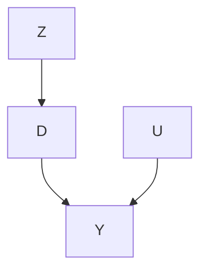
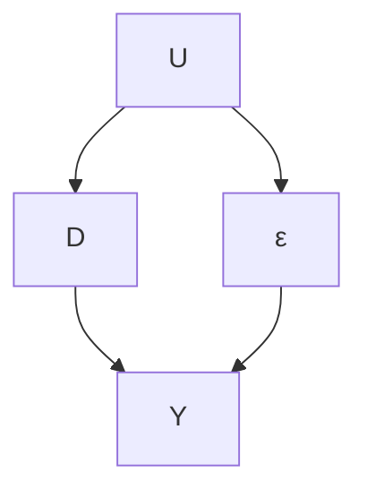
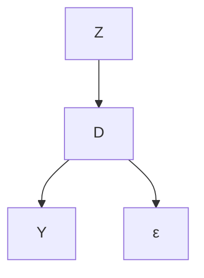

# An Econometric Perspective

Chapters 21 and 22 discuss the IV method from the experimental perspective. Figure 23.1 illustrates the intuition behind the discussion.




FIGURE 23.1: Causal diagram for IV

In an encouragement design with noncompliance, Z is randomized, so it is independent of the confounder U between the treatment received D and the outcome Y . Importantly, the treatment assignment Z does not have any direct effect on the outcome Y . It acts as an IV for the treatment received D in the sense that it affects the outcome Y only through the treatment received D. This IV is generated by the experimenter.

In many applications, randomization is infeasible. Then how can we draw causal inference in the presence of unmeasured confounding between the treatment and outcome? A clever idea from econometrics is to find natural experiments to mimic the setting of encouragement designs. To identify the causal effect of D on Y with unmeasured confounding, we can find another variable Z that satisfies the assumptions of the diagram in Figure 23.1. The variable Z must satisfy the following conditions:

1. it should be close to be randomized so that it is independent of the unmeasured confounding;  
2. it should change the distribution of D;  
3. it should not affect the outcome Y directly.

If all these conditions hold, then Z is a valid IV.

This chapter will provide the traditional econometrics perspective on IV. It is based on linear regression. Imbens and Angrist (1994) and Angrist et al. (1996) made a fundamental contribution by clarifying connection between this perspective and the experimental perspective in Chapters 21 and 22. I will start with examples and then give more algebraic details.

## 23.1 Examples of studies with IVs

Finding IV for causal inference is more an art than a science. The algebraic details in later sections are not the most complicated ones in statistics. However, it is fundamentally challenging to find IV in empirical research. Below are some famous examples.

Example 23.1 In an encouragement design, Z in the randomly assigned treatment, D is the final treatment received, and Y is the outcome. The IV assumptions encoded by Figure 23.1 is plausible in double-blind trials as discussed in Chapter 21. This is the ideal case for IV.

Example 23.2 Hearst et al. (1986) reported that men with low lottery number in the Vietnam Era draft lottery had higher mortality rates afterwards. They attributed this to the negative effect of military service. Angrist (1990) further reported that men with low lottery number in the Vietnam Era draft lottery had lower subsequent earnings. He attributed this to the negative effect of military service. These explanations are plausible because the lottery numbers were randomly generated, men with low lottery number were more likely to have military service, and the lottery numbers were unlikely to affect the subsequent mortality or earnings. That is, Figure 23.1 is plausible. Angrist et al. (1996) reanalyzed the data using the IV framework. Here, the lottery number is the IV, military service is the treatment, and mortality or earnings is the outcome.

Example 23.3 Angrist and Krueger (1991) studied the return of schooling in years on earnings, using the quarter of birth as an IV. This IV is plausible because of the pseuso randomization of the quarter of birth. It affected the years of schooling because (1) most states required the students to enter school in the calendar year in which they turned six, and (2) compulsory schooling laws typically required students remain in the school before their sixteenth birthday. More important, it is plausible that the quarter of birth did not affect earnings directly.

Example 23.4 Angrist and Evans (1998) studied the effect of family size on mother’s employment and work, using the sibling sex composition as an IV. This IV is plausible because of the pseudo randomization of the sibling sex composition. Moreover, parents in the US with two children of the same sex are more likely to have a third child than those parents with two children of different sex. It is also plausible that the sibling sex composition does not affect mother’s employment and work directly.

Example 23.5 Card (1993) studied the effect of schooling on wage, using the geographic variation in college proximity as an IV. In particular, Z contains dummy variables for whether a subject grew up near a two-year college or a four-year college. Although this study is classic, it might be a poor example for IV because parents’ choices of where to live might not be random, and moreover, where a subject grew up might matter for the subsequent wage.

Example 23.6 Voight et al. (2012) studied the causal effect of plasma highdensity lipoprotein (HDL) cholesterol on the risk of heart attack based on Mendelian randomization. They used some single-nucleotide polymorphisms (SNPs) as genetic IV for HDL, which are random with respect to the unmeasured confounders between HDL and heart attack by Mendel’s second law, and affect heart attack only though HDL. I will give more details of Mendelian randomization in Chapter 25.

## 23.2 Brief Review of the Ordinary Least Squares

Before discussing the econometric view of IV, I will first review the OLS in statistics (see Chapter A2). This is a standard topic in statistics. However, it has different mathematical formulations, and the choice of formulation matters for the interpretation.

The first view is based on projection. Given any pair of random variables $( D , Y )$ with finite second moments, define the population OLS coefficient as

$$
\beta = \arg \min _ {b} E (Y - D ^ {\mathsf {T}} b) ^ {2} = E (D D ^ {\mathsf {T}}) ^ {- 1} E (D Y),
$$

and then define the residual as $\varepsilon = Y - D ^ { \mathsf { T } } \beta$ . By definition, Y decomposes into

$$
Y = D ^ {\mathsf {T}} \beta + \varepsilon , \tag {23.1}
$$

which must satisfy

$$
E (D \varepsilon) = 0.
$$

Based on $( D _ { i } , Y _ { i } ) _ { i = 1 } ^ { n } \stackrel { \mathrm { I I D } } { \sim } ( D , Y )$ , the OLS estimator of $\beta$

$$
\hat {\beta} = \left(\sum_ {i = 1} ^ {n} D _ {i} D _ {i} ^ {\mathsf {T}}\right) ^ {- 1} \sum_ {i = 1} ^ {n} D _ {i} Y _ {i}.
$$

Because

$$
\hat {\beta} = \left(\sum_ {i = 1} ^ {n} D _ {i} D _ {i} ^ {\mathsf {T}}\right) ^ {- 1} \sum_ {i = 1} ^ {n} D _ {i} (D _ {i} ^ {\mathsf {T}} \beta + \varepsilon_ {i}) = \beta + \left(\sum_ {i = 1} ^ {n} D _ {i} D _ {i} ^ {\mathsf {T}}\right) ^ {- 1} \sum_ {i = 1} ^ {n} D _ {i} \varepsilon_ {i},
$$

we can show that $\hat { \beta }$ is consistent for $\beta$ because of $E ( \varepsilon D ) = 0$ . The classicalEHW robust variance estimator for $\operatorname { c o v } ( { \hat { \boldsymbol { \beta } } } )$ is

$$
\hat {V} _ {\mathrm{EHW}} = \left(\sum_ {i = 1} ^ {n} D _ {i} D _ {i} ^ {\mathsf {T}}\right) ^ {- 1} \left(\sum_ {i = 1} ^ {n} \hat {\varepsilon} _ {i} ^ {2} D _ {i} D _ {i} ^ {\mathsf {T}}\right) \left(\sum_ {i = 1} ^ {n} D _ {i} D _ {i} ^ {\mathsf {T}}\right) ^ {- 1}
$$

where $\hat { \varepsilon } _ { i } = Y _ { i } - D _ { i } ^ { \mathsf { T } } \hat { \beta }$ is the residual.

The second view is to treat

$$
Y = D ^ {\mathsf {T}} \beta + \varepsilon , \tag {23.2}
$$

as a true model for data generating process. That is, given the random variables $( D , \varepsilon )$ , we generate Y based on the linear equation (23.2). Importantly, in the data generating process, ε and D may be correlated in that $E ( D \varepsilon ) \neq 0$ . Figure 23.2 gives such an example. This is the fundamental difference compared to the first view where $E ( \varepsilon D ) = 0$ holds by the definition of the population OLS. Consequently, the OLS estimator can be inconsistent:

$$
\hat {\beta} \rightarrow \beta + E (D D ^ {\mathsf {T}}) ^ {- 1} E (D \varepsilon) \neq \beta
$$

in probability.

I end this section with definitions of endogenous and exogenous regressors based on (23.2), although their definitions are not unique in econometrics.

Definition 23.1 When $E ( \varepsilon D ) \ \ne \ 0 ,$ , the regressor D is called endogenous; when $E ( \varepsilon D ) = 0 ,$ , the regressor D is called exogenous.

The terminologies in Definition 23.1 are standard in econometrics. When $E ( \varepsilon D ) \neq 0$ , we also say that we have endogeneity; when $E ( \varepsilon D ) = 0$ , we also say that we have exogeneity.

In first view of OLS, the notions of endogeneity and exogeneity do not play any roles because $E ( \varepsilon D ) = 0$ by definition. Statisticians holding the first view usually find the notations of endogeneity and exogeneity strange, and consequently, find the idea of IV unnatural. To understand the econometric view of IV, we must switch to the second view of OLS.

## 23.3 Linear Instrumental Variable Model

When D is endogenous, the OLS estimator is inconsistent. We must use additional information to construct a consistent estimator for $\beta .$ I will focus on the following linear IV model:

Definition 23.2 (linear IV model) We have

$$
Y = D ^ {\mathsf {T}} \beta + \varepsilon ,
$$

<!-- footnote -->

- CD4 cells are white blood cells that fight infection.

<!-- footnote end -->

<!-- footnote -->

- This is called local linear regression in nonparametric statistics, which belongs to a broader class of local polynomial regression (Fan and Gijbels, 1996).

<!-- footnote end -->

<!-- footnote -->

- In general, it is better to blind the experiment to avoid various biases arising from placebo effects, patients’ expectation, etc. In double blind trials, both doctors and patients do not know the treatment; in single blind trials, the patients do not know the treatment but the doctors know. Sometimes, it is impossible to conduct double or even single blind trials. Those trials are called open trials.

<!-- footnote end -->

<!-- footnote -->

- The theory often assumes that τD has the order $n ^ { - 1 / 2 } ,$ Under this regime, the proportion of compliers goes to 0 as n goes to infinity. The IV method can only identify a subgroup average causal effect with the proportion shrinking to 0. This is a contrived regime for theoretical analysis. It is hard to justify this assumption in practice. The follow discussion does not assume it.

<!-- footnote end -->





(a) E(Dε) ̸= 0  
(b) marginalized over ε  
FIGURE 23.2: Different representations of the endogenous regressor

with

$$
E (\varepsilon Z) = 0. \tag {23.3}
$$

The linear IV model in Definition 23.2 can be illustrated by the following causal graph:




The above linear IV model allows that $E ( \varepsilon D ) \neq 0$ but requires an alternative moment condition (23.3). With $E ( \varepsilon ) = 0$ by incorporating the intercept, the new condition states that Z is uncorrelated with the error term ε. But any randomly generated noise is uncorrelated with ε, so an additional condition must hold to ensure that Z is useful for estimating β. Intuitively, the additional condition requires that Z is correlated to D, with more technical details stated below.

The mathematical requirement (23.3) seems simple. However, it is a key challenge in empirical research to find such a variable or variables Z that satisfies (23.3). Since the condition (23.3) involves the unobservable ε, it is generally untestable.

## 23.4 The Just-Identified Case

We first consider the case in which Z and D have the same dimension and $E ( Z D ^ { \mathsf { T } } )$ has full rank. The condition $E ( \varepsilon Z ) = 0$ implies that

$$
E \{Z (Y - D ^ {\mathsf {T}} \beta) \} = 0 \quad \Longrightarrow \quad E (Z Y) = E (Z D ^ {\mathsf {T}}) \beta
$$

$$
\implies \beta = E (Z D ^ {\mathsf {T}}) ^ {- 1} E (Z Y)
$$

if $E ( Z D ^ { \mathsf { T } } )$ is not degenerate. The OLS is a special case if $E ( \varepsilon D ) = 0 , { \mathrm { i . e . , } } D$ itself acts as an IV for itself. The resulting moment estimator is

$$
\hat {\beta} _ {\mathrm{IV}} = \left(\sum_ {i = 1} ^ {n} Z _ {i} D _ {i} ^ {\mathsf {T}}\right) ^ {- 1} \sum_ {i = 1} ^ {n} Z _ {i} Y _ {i}. \tag {23.4}
$$

In the simple case with an intercept and scalar D and Z, we have

$$
\left\{ \begin{array}{l} Y = \alpha + \beta D + \varepsilon , \\ E (\varepsilon) = 0, \quad \operatorname{cov} (\varepsilon , Z) = 0, \end{array} \right.
$$

which implies that

$$
\operatorname{cov} (Z, Y) = \beta \operatorname{cov} (Z, D) \Longrightarrow \beta = \frac {\operatorname{cov} (Z , Y)}{\operatorname{cov} (Z , D)}.
$$

Standardizing the numerator and denominator by $\mathrm { v a r } ( Z )$ , we have

$$
\beta = \frac {\operatorname{cov} (Z , Y) / \operatorname{var} (Z)}{\operatorname{cov} (Z , D) / \operatorname{var} (Z)},
$$

which equals the ratio between the coefficients of Z in the OLS fits of Y and D on Z. If Z is binary, these coefficients are differences in means and $\beta$ reduces to

$$
\beta = \frac {E (Y \mid Z = 1) - E (Y \mid Z = 0)}{E (D \mid Z = 1) - E (D \mid Z = 0)}.
$$

This is identical to the identification formula in Theorem 21.1. That is, with a binary IV Z and a binary treatment D, the IV estimator recovers the CACE under the potential outcomes framework. This is a key result in Imbens and Angrist (1994) and Angrist et al. (1996).

## 23.5 The Over-Identified Case

The discussion in Section 23.4 focuses on the just-identified case. When Z has lower dimension than X and $E ( Z D ^ { \mathsf { T } } )$ does not have full column rank, the equation $E ( Z Y ) = E ( Z D ^ { \mathsf { T } } ) \beta$ has infinitely many solutions. This is the underidentified case in which the coefficient $\beta$ cannot be uniquely determined even with $Z .$ It is a challenging case beyond the scope of this book. In practice, we need at least as many IVs as the endogenous regressors.

When $Z$ has higher dimension than $D$ and $E ( Z D ^ { \mathsf { T } } )$ has full column rank, we have many ways to determine $\beta$ from $E ( Z Y ) = E ( Z D ^ { \mathsf { T } } ) \beta$ . What is more, the sample analog

$$
n ^ {- 1} \sum_ {i = 1} ^ {n} Z _ {i} Y _ {i} = n ^ {- 1} \sum_ {i = 1} ^ {n} Z _ {i} D _ {i} ^ {\mathsf {T}} \beta
$$

may not have any solution because the number of equations is larger than the number of unknown parameters.

A computational trick in this case is the two-stage least squares (TSLS) estimator (Theil, 1953; Basmann, 1957). It is a clever computational trick, which has two steps.

Definition 23.3 (Two-stage least squares) Define the TSLS estimator of the coefficient of D with $Z$ being the $I V$ as follows.

1. Run OLS of D on $Z ,$ and obtain the fitted value $\hat { D } _ { i } ~ ( i { \bf \mu } =$ $1 , \ldots , n )$ . If $D _ { i }$ is a vector, then we need to run component-wise $O L S$ to obtain $\hat { D } _ { i }$ . Put the fitted vectors in a matrix $\hat { D }$ with rows $\hat { D } _ { i } ^ { \mathsf { T } }$ ;  
2. Run OLS of Y on $\hat { D } ,$ , and obtain the coefficient $\hat { \beta } _ { \mathrm { T S L S } }$

To see why TSLS works, we need more algebra. Write it more explicitly as

$$
\hat {\beta} _ {\mathrm{TSLS}} = \left(\sum_ {i = 1} ^ {n} \hat {D} _ {i} \hat {D} _ {i} ^ {\mathsf {T}}\right) ^ {- 1} \sum_ {i = 1} ^ {n} \hat {D} _ {i} Y _ {i} \tag {23.5}
$$

$$
= \left(\sum_ {i = 1} ^ {n} \hat {D} _ {i} \hat {D} _ {i} ^ {\mathsf {T}}\right) ^ {- 1} \sum_ {i = 1} ^ {n} \hat {D} _ {i} (D _ {i} ^ {\mathsf {T}} \beta + \varepsilon_ {i})
$$

$$
= \left(\sum_ {i = 1} ^ {n} \hat {D} _ {i} \hat {D} _ {i} ^ {\mathsf {T}}\right) ^ {- 1} \sum_ {i = 1} ^ {n} \hat {D} _ {i} D _ {i} ^ {\mathsf {T}} \beta + \left(\sum_ {i = 1} ^ {n} \hat {D} _ {i} \hat {D} _ {i} ^ {\mathsf {T}}\right) ^ {- 1} \sum_ {i = 1} ^ {n} \hat {D} _ {i} \varepsilon_ {i}.
$$

The first stage OLS fit ensures $D _ { i } = \hat { D } _ { i } + \check { D } _ { i }$ with

$$
\sum_ {i = 1} ^ {n} \hat {D} _ {i} \check {D} _ {i} ^ {\mathsf {T}} = 0 \tag {23.6}
$$

being a zero square matrix with the same dimension as $D _ { i }$ . The orthogonality (23.6) implies

$$
\sum_ {i = 1} ^ {n} \hat {D} _ {i} D _ {i} ^ {\mathsf {T}} = \sum_ {i = 1} ^ {n} \hat {D} _ {i} \hat {D} _ {i} ^ {\mathsf {T}},
$$

which further implies that

$$
\hat {\beta} _ {\mathrm{TSLS}} = \beta + \left(\sum_ {i = 1} ^ {n} \hat {D} _ {i} \hat {D} _ {i} ^ {\mathsf {T}}\right) ^ {- 1} \sum_ {i = 1} ^ {n} \hat {D} _ {i} \varepsilon_ {i}. \tag {23.7}
$$

The first stage OLS fit also ensures

$$
\hat {D} _ {i} = \hat {\Gamma} ^ {\mathsf {T}} Z _ {i} \tag {23.8}
$$

which implies that

$$
\hat {\beta} _ {\mathrm{TSLS}} = \beta + \left\{\hat {\Gamma} ^ {\mathsf {T}} \left(n ^ {- 1} \sum_ {i = 1} ^ {n} Z _ {i} Z _ {i} ^ {\mathsf {T}}\right) \hat {\Gamma} \right\} ^ {- 1} \hat {\Gamma} ^ {\mathsf {T}} \left(n ^ {- 1} \sum_ {i = 1} ^ {n} Z _ {i} \varepsilon_ {i}\right). \tag {23.9}
$$

Based on (23.9), we can see the consistency of the TSLS estimator because the term $n ^ { - 1 } \sum _ { i = 1 } ^ { n } Z _ { i } \varepsilon _ { i }$ has probability limit $E ( Z \varepsilon ) = 0$ . We can also use (23.9) to show that when $Z$ and $D$ have the same dimension, $\hat { \beta } _ { \mathrm { T S L S } }$ is numerically identical to $\hat { \beta } _ { \mathrm { I V } }$ defined in Section 23.4, which is left as Problem 23.1.

Based on (23.7), we can obtain the standard error as follows. We first obtain the residual $\hat { \varepsilon } _ { i } = Y _ { i } - \hat { \beta } _ { \mathrm { T S L S } } ^ { \sf T } D _ { i }$ , and then obtain the robust variance estimator as

$$
\hat {V} _ {\mathrm{TSLS}} = \left(\sum_ {i = 1} ^ {n} \hat {D} _ {i} \hat {D} _ {i} ^ {\mathsf {T}}\right) ^ {- 1} \left(\sum_ {i = 1} ^ {n} \hat {\varepsilon} _ {i} ^ {2} \hat {D} _ {i} \hat {D} _ {i} ^ {\mathsf {T}}\right) \left(\sum_ {i = 1} ^ {n} \hat {D} _ {i} \hat {D} _ {i} ^ {\mathsf {T}}\right) ^ {- 1}.
$$

Importantly, the $\hat { \varepsilon } _ { i } { } ^ { \dagger } \mathrm { s }$ are not the residual from the second stage OLS $Y _ { i } -$ $\hat { \beta } _ { \mathrm { T S L S } } ^ { \mathsf { T } } \hat { D } _ { i }$ , so $\hat { V } _ { \mathrm { T S L S } }$ differs from the robust variance estimator from the second stage OLS.

## 23.6 A Special Case: A Single IV for a Single Endogenous Treatment

This section focuses on a simple case with a single IV and a single endogenous treatment. It has wide applications. Consider the following structural equations:

$$
\left\{ \begin{array}{l} Y _ {i} = \beta_ {0} + \beta_ {1} D _ {i} + \beta_ {2} ^ {\mathsf {T}} X _ {i} + \varepsilon_ {i}, \\ D _ {i} = \gamma_ {0} + \gamma_ {1} Z _ {i} + \gamma_ {2} ^ {\mathsf {T}} X _ {i} + \varepsilon_ {2 i}, \end{array} \right. \tag {23.10}
$$

where $D _ { i }$ is a scalar endogenous regressor representing the treatment variable of interest $( { \mathrm { i . e . , ~ } } E ( \varepsilon _ { i } D _ { i } ) \neq 0 )$ , Zi is a scalar IV for ${ \cal D } _ { i } \ ( \mathrm { i . e . , } \ E ( \varepsilon _ { i } Z _ { i } ) = 0 )$ , and $X _ { i }$ contains other exogenous regressors $( { \mathrm { i . e . , ~ } } E ( \varepsilon _ { i } X _ { i } ) = 0 )$ . This is a special case with $D$ replaced by $( 1 , D , X )$ and $Z$ replaced by $( 1 , Z , X )$ .

## 23.6.1 Two-stage least squares

The TSLS estimator in Definition 23.3 simplifies to the following form.

Definition 23.4 (TSLS with a single endogenous regressor) Based on (23.10), the TSLS estimator has the following two steps:

1. run OLS of D on $( 1 , Z , X )$ , and obtain the fitted value $\hat { D } _ { i } ~ ( i =$ $1 , \ldots , n )$ ;  
2. run OLS of Y on $( 1 , { \hat { D } } , X )$ , and obtain the coefficient $\hat { \beta } _ { \mathrm { T S L S } }$ , and in particular, $\hat { \beta } _ { 1 , \mathrm { T S L S } }$ , the coefficient of $\hat { D }$ .

## 23.6.2 Indirect least squares

The structural equation (23.10) implies

$$
\begin{array}{l} Y _ {i} = \beta_ {0} + \beta_ {1} (\gamma_ {0} + \gamma_ {1} Z _ {i} + \gamma_ {2} ^ {\mathsf {T}} X _ {i} + \varepsilon_ {2 i}) + \beta_ {2} ^ {\mathsf {T}} X _ {i} + \varepsilon_ {i} \\ = \left(\beta_ {0} + \beta_ {1} \gamma_ {0}\right) + \beta_ {1} \gamma_ {1} Z _ {i} + \left(\beta_ {2} + \beta_ {1} \gamma_ {2}\right) ^ {\mathsf {T}} X _ {i} + \left(\varepsilon_ {i} + \beta_ {1} \varepsilon_ {2 i}\right). \\ \end{array}
$$

Define $\Gamma _ { 0 } = \beta _ { 0 } + \beta _ { 1 } \gamma _ { 0 } , \Gamma _ { 1 } = \beta _ { 1 } \gamma _ { 1 } , \Gamma _ { 2 } = \beta _ { 2 } + \beta _ { 1 } \gamma _ { 2 }$ , and $\varepsilon _ { 1 i } = \varepsilon _ { i } + \beta _ { 1 } \varepsilon _ { 2 i }$ . We have the following equations

$$
\left\{ \begin{array}{l} Y _ {i} = \Gamma_ {0} + \Gamma_ {1} Z _ {i} + \Gamma_ {2} ^ {\mathsf {T}} X _ {i} + \varepsilon_ {1 i}, \\ D _ {i} = \gamma_ {0} + \gamma_ {1} Z _ {i} + \gamma_ {2} ^ {\mathsf {T}} X _ {i} + \varepsilon_ {2 i}, \end{array} \right. \tag {23.11}
$$

which is called the reduced form. The parameter of interest equals the ratio of two coefficients

$$
\beta_ {1} = \Gamma_ {1} / \gamma_ {1}.
$$

In the reduced form, the left-hand side are dependent variables $Y$ and D, and the right-hand side are the exogenous variable Z and X satisfying

$$
E (Z \varepsilon_ {1 i}) = E (Z \varepsilon_ {2 i}) = 0, \quad E (X \varepsilon_ {1 i}) = E (X \varepsilon_ {2 i}) = 0.
$$

More importantly, OLS gives consistent estimators for the coefficients in the reduced form.

The reduced form (23.11) suggests that the ratio of two OLS coefficients $\hat { \Gamma } _ { 1 }$ and $\hat { \gamma } _ { 1 }$ is a reasonable estimator for $\beta _ { 1 }$ . This is called the indirect least squares (ILS) estimator:

$$
\hat {\beta} _ {1, \mathrm{ILS}} \equiv \hat {\Gamma} _ {1} / \hat {\gamma} _ {1}.
$$

Interestingly, it is numerically identical to the TSLS estimator under (23.10).

Theorem 23.1 With a single endogenous treatment and a single $I V ,$ we have

$$
\hat {\beta} _ {1, \mathrm{ILS}} = \hat {\beta} _ {1, \mathrm{TSLS}}.
$$

Theorem 23.1 is an algebraic fact. Imbens (2014, Section A.3) pointed it out without giving a proof. I relegate its proof to Problem 23.2. The ratio formula makes it clear that the TSLS estimator has poor finite sample properties with a weak instrument variable, i.e., $\gamma _ { 1 }$ is close to zero.

## 23.6.3 Weak IV

The following inferential procedure is simpler, more transparent, and more robust to weak IV. It is more computationally intensive though. The reduced form (23.11) also implies that

$$
Y _ {i} - b D _ {i} = (\Gamma_ {0} - b \gamma_ {0}) + (\Gamma_ {1} - b \gamma_ {1}) Z _ {i} + (\Gamma_ {2} - b \gamma_ {2}) ^ {\mathsf {T}} X _ {i} + (\varepsilon_ {1 i} - b \varepsilon_ {2 i}). (2 3. 1 2)
$$

At the true value $b = \beta _ { 1 }$ , the coefficient of $Z _ { i }$ must be 0. This simple fact suggests a confidence interval for $\beta _ { 1 }$ by inverting tests for $H _ { 0 } ( b ) : \beta _ { 1 } = b \colon$

$$
\left\{b: \left| t _ {Z} (b) \right| \leq z _ {\alpha} \right\},
$$

where $t _ { Z } ( b )$ is the t-statistic for the coefficient of Z based on the OLS fit of (23.12) with the EHW standard error. This confidence interval is more robust than the Wald-type confidence interval based on the TSLS estimator. It is similar to the Fieller–Anderson–Rubin confidence interval discussed in Chapter 21. This procedure makes the TSLS estimator unnecessary, and what is more, we only need to run the OLS fit of Y based on the reduced form if the goal is to test $\beta _ { 1 } = 0$ under (23.10).

## 23.7 Application

Card (1993) used the National Longitudinal Survey of Young Men to estimate the causal effect of education on earnings. The data set contains 3010 men with age between 14 and 24 in the year 1966, and Card (1993) leveraged the geographic variation in college proximity as an IV for education. Here, Z is the indicator of growing up near a four-year college, D measures the years of education, and the outcome Y is the log wage in the year 1976, ranging from 4.6 to 7.8. Additional covariates are ace, age and squared age, a categorical variable indicating living with both parents, single mom, or both parents, and variables summarizing the living areas in the past.

```txt
> library("car")
>
> ## Card Data
> card.data = read.csv("card1995.csv")
> Y = card.data[, "lwage"]
> D = card.data[, "educ"]
> Z = card.data[, "nearc4"]
> X = card.data[, c("exper", "expersq", "black", "south", "smsa", "reg661", "reg662", "reg663", "reg664", "reg665", "reg666", "reg667", "reg668", "smsa66")]
> X = as.matrix(X)
```

Based on TSLS, the point estimator is 0.132 and the 95% confidence interval is [0.026, 0.237].

```txt
> Dhat = lm(D ~ Z + X)$fitted.values
> tslsreg = lm(Y ~ Dhat + X)
> tslsest = coef(tslsreg)[2]
> ## correct se by changing the residuals
> res.correct = Y - cbind(1, D, X) % * %coef(tslsreg)
> tslsreg$residuals = as.vector(res.correct)
> tslsse = sqrt(hccm(tslsreg, type = "hc0")[2, 2])
> res = c(tslsest, tslsest - 1.96*tslsse, tslsest + 1.96*tslsse)
> names(res) = c("est", "l.ci", "u.ci")
> round(res, 3)
    est l.ci u.ci
0.132 0.026 0.237
```

Figure 23.3 shows the p-values for a sequence of tests for the coefficient of D. It also implies the 95% confidence interval for the coefficient of D based on inverting tests, which is [0.028, 0.282].

```diff
> BetaAR = seq(-0.1, 0.4, 0.001)
> PvalueAR = sapply(BetaAR,
+    function(b){
+    Y_b = Y - b*D
+    ARreg = lm(Y_b ~ Z + X)
+    coefZ = coef(ARreg)[2]
+    seZ = sqrt(hccm(ARreg)[2, 2])
+    Tstat = coefZ/seZ
+    (1 - pnorm(abs(Tstat))) * 2
+    })
> point.est = BetaAR[which.max(PvalueAR)]
> point.est
[1] 0.132
> ARCI = range(BetaAR[PvalueAR >= 0.05])
> ARCI
[1] 0.028 0.282
```

Comparing the above two methods, the lower confidence limits are very close but the upper confidence limits are slightly different due to the possibly heavy right tail of the distribution of the TSLS estimator.

## 23.8 Homework

23.1 More algebra for TSLS in Section 23.5

1. Show that the Γ in (23.8) equals ˆ

$$
\hat {\Gamma} = \left(\sum_ {i = 1} ^ {n} Z _ {i} Z _ {i} ^ {\mathsf {T}}\right) ^ {- 1} \sum_ {i = 1} ^ {n} Z _ {i} D _ {i} ^ {\mathsf {T}}.
$$

2. Show $\hat { \beta } _ { \mathrm { T S L S } }$ defined in (23.5) reduces to $\hat { \beta } _ { \mathrm { I V } }$ defined in (23.4) if Z and D have the same dimension and

$$
n ^ {- 1} \sum_ {i = 1} ^ {n} Z _ {i} Z _ {i} ^ {\mathsf {T}}, \quad n ^ {- 1} \sum_ {i = 1} ^ {n} Z _ {i} D _ {i} ^ {\mathsf {T}}
$$

are both invertible.

23.2 Equivalence between TSLS and ILS

Prove Theorem 23.1.

Hint: Use the Frisch–Waugh–Lovell theroem.

23.3 Control function in the linear instrumental variable model

Definition 23.5 below parallels Definition 23.3 above.

Definition 23.5 (control function) Define the control function estimator $\hat { \beta } _ { \mathrm { C F } }$ as follows.

1. Run OLS of D on $Z ,$ , and obtain the residual $\breve { D } _ { i } \ ( i = 1 , \ldots , n )$ . $I f D _ { i }$ is a vector, then we need to run component-wise $O L S$ to obtain ${ \check { D } } _ { i }$ . Put the residual vectors in a matrix $\check { D }$ with rows $\check { D } _ { i } ^ { \mathsf { T } }$ ;  
2. Run OLS of Y on D and ${ \check { D } } _ { i }$ and obtain the coefficient of $D$ , $\hat { \beta } _ { \mathrm { C F } }$ .

Show that $\hat { \beta } _ { \mathrm { C F } } = \hat { \beta } _ { \mathrm { T S L S } }$

Remark: In Definition 23.5, $\check { D }$ from Step 1 is called the control function for Step 2. Hausman (1978) pointed out this result. Wooldridge (2015) provided more general discussion of the control function methods in more complex models.

Hint: Use the results in Problems A2.3 and A2.4.

## 23.4 Data analysis: Efron and Feldman (1991)

Efron and Feldman (1991) was one of the early studies dealing with noncomppliance under the potential outcomes framework. The original randomized experiment, the Lipid Research Clinics Coronary Primary Prevention Trial (LRC-CPPT), was designed to evaluate the effect of the drug cholestyramine on cholesterol levels. In the dataset EF.csv, the first column contains the binary indicators for treatment and control, the second column contains the proportions of the nominal cholestyramine dose actually taken, the last three columns are cholesterol levels. Note that the individuals did not know whether they were assigned to cholestyramine or to the placebo, but differences in adverse side effects could induce differences in compliance behavior by treatment status. All individuals were assigned the same nominal dose of the drug or placebo, for the same time period. Column 3, $C _ { 3 } .$ , was taken prior to a communication about the benefits of a low- cholesterol diet, Column $4 , C _ { 4 }$ , was taken after this suggestion, but prior to the random assignment to cholestyramine or placebo, and Column $5 , C _ { 5 }$ , an average of post-randomization cholesterol readings, averaged over two-month readings for a period of time averaging 7.3 years for all the individuals in the study. Efron and Feldman (1991) used the change in cholesterol level as the final outcome of interest, defined as $C _ { 5 } - 0 . 2 5 C _ { 3 } - 0 . 7 5 C _ { 4 }$ . The original paper contains more detailed descriptions.

This dataset is more complicated than the noncompliance problem discussed in class. You can analyze it based on your understanding of the problem, but you need to justify your choice of method. There is no gold-standard solution for this problem.

## 23.5 Recommended reading

Imbens (2014) gave an econometrician’s perspective of IV.

## 24