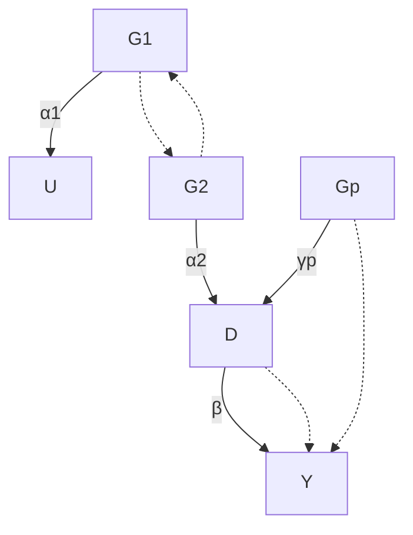

# Application of the Instrumental Variable Method: Mendelian Randomization

Katan (1986) was concerned with the observational studies suggesting that low serum cholesterol levels were associated with the risk of cancer. As we have discussed, however, observational studies suffer from unmeasured confounding. Consequently, it is difficult to interpret the apparent association as causality. In the particular problem studied by Katan (1986), it is even possible that early stages of cancer reversely cause low serum cholesterol levels. Disentangling the causal effect of the serum cholesterol level on cancer seems a hard problem using standard epidemiologic studies. Katan (1986) argued that Apolipoprotein E genes are associated with the serum cholesterol levels but do not directly affect the cancer status. So if low serum cholesterol levels causes cancer, we should observe differences in cancer risks among people with and without the genotype that leads to different serum cholesterol levels. Using our language for causal inference, Katan (1986) proposed to use Apolipoprotein E genes as IVs.

Katan (1986) did not conduct any data analysis but just proposed a conceptual design that could address not only unmeasured confounding but also reverse causality. Since then, more complicated and sophisticated studies have been conducted thanks to the modern genome-wide association studies. These studies used genetic information as IVs for exposures in epidemiologic studies to estimate causal effects of exposures on outcomes. They were all motivated by Mendel’s second law, the law of random assortment, which suggests the inheritance of one trait is independent of the inheritance of other traits. Therefore, the method of using genetic information as IV is called Mendelian Randomization (MR).

## 25.1 Background and motivation

Graphically, Figure 25.1 shows the causal diagram on the treatment D, outcome Y , unmeasured confounder U, as well as the genetic IVs $G _ { 1 } , \ldots , G _ { p }$ . In many Mendelian Randomization studies, the genetic IVs are single nucleotide polymorphisms (SNPs). Because of pleiotropy, it is possible that the genetic




FIGURE 25.1: Causal graph for Mendelian randomization

IVs have direct effect on the outcome of interest, so Figure 25.1 also allows for the violation of the exclusion restriction assumption.

The standard linear IV model assumes away the direct effect of the IVs on the outcome. Definition 25.1 below gives both the structural and reduces forms.

Definition 25.1 (linear IV model) The standard linear IV model

$$
Y = \beta_ {0} + \beta D + \beta_ {u} U + \varepsilon_ {Y}, \tag {25.1}
$$

$$
D = \gamma_ {0} + \gamma_ {1} G _ {1} + \dots + \gamma_ {p} G _ {p} + \gamma_ {u} U + \varepsilon_ {D}, \tag {25.2}
$$

has reduced form

$$
Y = \beta_ {0} + \beta \gamma_ {0} + \beta \gamma_ {1} G _ {1} + \dots + \beta \gamma_ {p} G _ {p} + (\beta_ {u} + \beta_ {0} \gamma_ {u}) U + \varepsilon_ {Y}, \tag {25.3}
$$

$$
D = \gamma_ {0} + \gamma_ {1} G _ {1} + \dots + \gamma_ {p} G _ {p} + \gamma_ {u} U + \varepsilon_ {D}, \tag {25.4}
$$

Definition 25.2 below allows for the violation of exclusion restriction. Then, $G _ { 1 } , \ldots , G _ { p }$ are not valid IVs.

Definition 25.2 (linear model with possibly invalid IVs) The linear model

$$
Y = \beta_ {0} + \beta D + \alpha_ {1} G _ {1} + \dots + \alpha_ {p} G _ {p} + \beta_ {u} U + \varepsilon_ {Y}, \tag {25.5}
$$

$$
D = \gamma_ {0} + \gamma_ {1} G _ {1} + \dots + \gamma_ {p} G _ {p} + \gamma_ {u} U + \varepsilon_ {D}, \tag {25.6}
$$

has reduced form

$$
Y = (\beta_ {0} + \beta \gamma_ {0}) + (\alpha_ {1} + \beta \gamma_ {1}) G _ {1} + \dots + (\alpha_ {p} + \beta \gamma_ {p}) G _ {p}
$$

$$
+ (\beta_ {u} + \beta \gamma_ {u}) U + \varepsilon_ {Y}, \tag {25.7}
$$

$$
D = \gamma_ {0} + \gamma_ {1} G _ {1} + \dots + \gamma_ {p} G _ {p} + \gamma_ {u} U + \varepsilon_ {D}. \tag {25.8}
$$

Therefore, in Definition 25.1 with exclusion restriction, we have

$$
\Gamma_ {j} = \beta \gamma_ {j}, (j = 1, \ldots , p);
$$

in Definition 25.2 without exclusion restriction, we have

$$
\Gamma_ {j} = \alpha_ {j} + \beta \gamma_ {j}, (j = 1, \ldots , p).
$$

If we have individual data, we can apply the classic TSLS estimator to estimate $\beta$ under the linear IV model in Definition 25.1. However, most Mendelian Randomization studies do not have individual data but rather summary statistics from multiple genome-wide association studies. A canonical setting consists of the regression coefficients of the treatment on the genetic IVs:

$$
\hat {\gamma} _ {1} \rightarrow \gamma_ {1}, \dots , \hat {\gamma} _ {p} \rightarrow \gamma_ {p} \tag {25.9}
$$

in probability with standard errors

$$
\mathrm{se} _ {D 1}, \dots , \mathrm{se} _ {D p}, \tag {25.10}
$$

and the regression coefficients of the outcome on the genetic IVs:

$$
\hat {\Gamma} _ {1} \rightarrow \Gamma_ {1}, \dots , \hat {\Gamma} _ {p} \rightarrow \Gamma_ {p} \tag {25.11}
$$

in probability with standard errors

$$
\operatorname{se} _ {Y 1}, \dots , \operatorname{se} _ {Y p}. \tag {25.12}
$$

I will focus on the statistical inference of $\beta$ based on the above summary statistics. For simplicity, we assume that the estimates in (25.9) and (25.11) are jointly independent, they are all asymptotically normal, and the standard errors in (25.10) and (25.12) are all fixed and known. The asymptotic normality can often be justified by central limit theorems of the regression coefficients. The standard errors are accurate estimates of the true standard errors. Therefore, the only subtle assumption is the joint independence of the regression coefficients in (25.9) and (25.11). The independence of the $\hat { \gamma } _ { j } \mathrm { ^ { \circ } s }$ and the $\hat { \Gamma } _ { j } \mathrm { ' s }$ are reasonable because they are often calculated based on different samples. The independence among the $\hat { \gamma } _ { j }$ ’s can be reasonable if the $G _ { j }$ ’s are independent and the true linear model for D holds with homoskedastic error terms1. The independence among the $\hat { \Gamma } _ { j } \mathrm { ' s }$ follows from a similar argument.

## 25.2 MR based on summary statistics

## 25.2.1 Fixed-effect estimator

Under Definition 25.1, $\alpha _ { j } = 0$ which implies that $\beta = \Gamma _ { j } / \gamma _ { j }$ for all $j$ . A simple approach is based on the so-called meta-analysis (Bowden et al., 2018), that is,

## 30425 Application of the Instrumental Variable Method: Mendelian Randomization

combining multiple estimates $\hat { \beta } _ { j } = \hat { \Gamma } _ { j } / \hat { \gamma } _ { j }$ for the common parameter $\beta .$ Using delta method (see Example $\operatorname { A 1 . 3 } ) , \hat { \beta } _ { j }$ has approximate squared standard error

$$
\mathrm{se} _ {j} ^ {2} = (\mathrm{se} _ {Y j} ^ {2} + \hat {\beta} _ {j} ^ {2} \mathrm{se} _ {D j} ^ {2}) / \hat {\gamma} _ {j} ^ {2}.
$$

Therefore, the best linear combination to estimate $\beta$ is the Fisher weighting based on inverse of the variances:

$$
\hat {\beta} _ {\mathrm{fisher0}} = \frac {\sum_ {j = 1} ^ {p} \hat {\beta} _ {j} / \mathrm{se} _ {j} ^ {2}}{\sum_ {j = 1} ^ {p} 1 / \mathrm{se} _ {j} ^ {2}}
$$

which has variance $( \sum _ { j = 1 } ^ { p } 1 / \mathrm { s e } _ { j } ^ { 2 } ) ^ { - 1 }$ . Ignoring the uncertainty due to $\hat { \gamma } _ { j }$ quantified by $\mathrm { s e } _ { D j }$ , the estimator reduces to

$$
\hat {\beta} _ {\mathrm{fisher1}} = \frac {\sum_ {j = 1} ^ {p} \hat {\beta} _ {j} \hat {\gamma} _ {j} ^ {2} / \mathrm{se} _ {Y j} ^ {2}}{\sum_ {j = 1} ^ {p} \hat {\gamma} _ {j} ^ {2} / \mathrm{se} _ {Y j} ^ {2}} = \frac {\sum_ {j = 1} ^ {p} \hat {\Gamma} _ {j} \hat {\gamma} _ {j} / \mathrm{se} _ {Y j} ^ {2}}{\sum_ {j = 1} ^ {p} \hat {\gamma} _ {j} ^ {2} / \mathrm{se} _ {Y j} ^ {2}},
$$

which has variance $\textstyle ( \sum _ { j = 1 } ^ { p } 1 \hat { \gamma } _ { j } ^ { 2 } / \mathrm { s e } _ { Y j } ^ { 2 } ) ^ { - 1 }$ . Inference based on $\hat { \beta } _ { \mathrm { f i s h e r 1 } }$ is suboptimal although it is more widely used in practice (Bowden et al., 2018).

Focus on the suboptimal yet simpler estimator $\hat { \beta } _ { \mathrm { f i s h e r 1 } }$ . Under Definition 25.2, we can show that

$$
\hat {\beta} _ {\mathrm{fisher1}} \rightarrow \frac {\sum_ {j = 1} ^ {p} \Gamma_ {j} \gamma_ {j} / \mathrm{se} _ {Y j} ^ {2}}{\sum_ {j = 1} ^ {p} \gamma_ {j} ^ {2} / \mathrm{se} _ {Y j} ^ {2}} = \beta + \frac {\sum_ {j = 1} ^ {p} \alpha_ {j} \gamma_ {j} / \mathrm{se} _ {Y j} ^ {2}}{\sum_ {j = 1} ^ {p} \gamma_ {j} ^ {2} / \mathrm{se} _ {Y j} ^ {2}}
$$

in probability. If $\alpha _ { j } = 0$ for all $j , \hat { \beta } _ { \mathrm { f i s h e r 1 } }$ is consistent. Even this does not hold, it is still possible that $\hat { \beta } _ { \mathrm { f i s h e r 1 } }$ is consistent as long as the inner product between $\alpha _ { j }$ and $\gamma _ { j }$ weighted by $1 / \mathrm { s e } _ { Y j } ^ { 2 }$ is zero. This holds if we have many genetic instruments and violation of the exclusion restriction, captured by $\alpha _ { j }$ , is an independent random draw from a distribution with mean zero.

## 25.2.2 Egger regression

Start with Definition 25.1. With the true parameters, we have

$$
\Gamma_ {j} = \beta \gamma_ {j} \quad (j = 1, \dots , p);
$$

with the estimates, the above identify holds only approximately

$$
\hat {\Gamma} _ {j} \approx \beta \hat {\gamma} _ {j} (j = 1, \dots , p).
$$

This seems a classic OLS problem of $\{ \hat { \Gamma } _ { j } \} _ { j = 1 } ^ { p }$ on $\{ \hat { \gamma } _ { j } \} _ { j = 1 } ^ { p }$ . We can fit an OLS of $\hat { \Gamma } _ { j }$ on $\hat { \gamma } _ { j } ,$ , with or without an intercept, possibly weighted by $w _ { j }$ , to estimate $\beta .$ . The following results hold thanks to the algebraic properties of the WLS reviewed in Section A2.5.

Without an intercept, the coefficient of $\hat { \gamma } _ { j }$ is

$$
\hat {\beta} _ {\mathrm{egger1}} = \frac {\sum_ {j = 1} ^ {p} \hat {\gamma} _ {j} \hat {\Gamma} _ {j} w _ {j}}{\sum_ {j = 1} ^ {p} \hat {\gamma} _ {j} ^ {2} w _ {j}},
$$

which reduces to $\hat { \beta } _ { \mathrm { f i s h e r 1 } } \ \mathrm { i f } \ w _ { j } = 1 / \mathrm { s e } _ { Y j } ^ { 2 } .$ So the Egger regression is more general than the fixed-effect estimator in Section 25.2.1.

With an intercept, the coefficient of $\hat { \gamma } _ { j }$ is

$$
\hat {\beta} _ {\mathrm{egger0}} = \frac {\sum_ {j = 1} ^ {p} (\hat {\gamma} _ {j} - \hat {\gamma} _ {w}) (\hat {\Gamma} _ {j} - \hat {\Gamma} _ {w}) w _ {j}}{\sum_ {j = 1} ^ {p} (\hat {\gamma} _ {j} - \hat {\gamma} _ {w}) ^ {2} w _ {j}}
$$

where $\begin{array} { r } { \hat { \gamma } _ { w } = \sum _ { j = 1 } ^ { p } \hat { \gamma } _ { j } w _ { j } / \sum _ { j = 1 } ^ { p } w _ { j } } \end{array}$ and $\begin{array} { r } { \hat { \Gamma } _ { w } = \sum _ { j = 1 } ^ { p } \hat { \Gamma } _ { j } w _ { j } / \sum _ { j = 1 } ^ { p } w _ { j } } \end{array}$ are the weighted averages of the $\hat { \gamma } _ { j } \mathrm { ^ s }$ and $\hat { \Gamma } _ { j } \mathrm { ' s } ,$ respectively. Even without assuming that all $\gamma _ { j } \mathrm { : }$ s are zero under Definition 25.2, we have

$$
\hat {\beta} _ {\mathrm{egger0}} \to \frac {\sum_ {j = 1} ^ {p} (\gamma_ {j} - \gamma_ {w}) (\Gamma_ {j} - \Gamma_ {w}) w _ {j}}{\sum_ {j = 1} ^ {p} (\gamma_ {j} - \gamma_ {w}) ^ {2} w _ {j}} = \beta + \frac {\sum_ {j = 1} ^ {p} (\gamma_ {j} - \gamma_ {w}) (\alpha_ {j} - \alpha_ {w}) w _ {j}}{\sum_ {j = 1} ^ {p} (\gamma_ {j} - \gamma_ {w}) ^ {2} w _ {j}}
$$

in probability, where $\gamma _ { w } , \Gamma _ { w }$ and $\alpha _ { w }$ are the corresponding weighted averages of the true parameters. So $\hat { \beta } _ { \mathrm { e g g e r 0 } }$ is consistent for $\beta$ as long as the weighted least squares coefficient of $\alpha _ { j }$ on $\gamma _ { j }$ is zero. This is weaker than $\alpha _ { j } = 0$ for all $j .$ . This weaker assumption holds if $\gamma _ { j }$ and $\alpha _ { j }$ are realizations of independent random variables, which is called the Instrument Strength Independent of Direct Effect assumption (Bowden et al., 2015). More interestingly, the intercept from the Egger regression is

$$
\hat {\alpha} _ {\mathrm{egger0}} = \hat {\Gamma} _ {w} - \hat {\beta} _ {\mathrm{egger0}} \hat {\gamma} _ {w},
$$

which, under the InSIDE assumption converges to

$$
\Gamma_ {w} - \beta \gamma_ {w} = \alpha_ {w}
$$

in probability. So the intercept estimates the weighted average of the direct effects.

## 25.3 An example

I use the bmi.sbp data in the mr.raps package to illustrate the Egger regressions.

```txt
> library("mr.raps")
> bmisbp = subset(bmi.sbp,
```

30625 Application of the Instrumental Variable Method: Mendelian Randomization

```txt
+ select = c("beta.exposure", "beta.outcome", "se.exposure", "se.outcome"))
```

The Egger regressions with or without the intercept give very similar results.

```txt
> mr.egger = lm(beta.outcome ~ 0 + beta.exposure,
+    data = bmisbp,
+    weights = 1/se.outcome^2)
> summary(mr.egger)
```

Call :

```javascript
lm(formula = beta.outcome ~ 0 + beta.exposure, data = bmisbp, weights = 1/se.outcome^2)
```

Weighted Residuals :

```txt
Min 1Q Median 3Q Max
-5.6999 -1.1691 -0.0199 1.0073 11.3449
```

Coefficients :

```txt
Estimate Std. Error t value Pr(>|t|)
beta.exposure 0.3173 0.1106 2.869 0.00468 **
```

```txt
Residual standard error: 2.052 on 159 degrees of freedom
Multiple R-squared: 0.04921, Adjusted R-squared: 0.04323
F-statistic: 8.229 on 1 and 159 DF, p-value: 0.004682
```

>

```txt
> mr.egger.w = lm(beta.outcome ~ beta.exposure,
+    data = bmisbp,
+    weights = 1/se.outcome^2)
> summary(mr.egger.w)
```

Call :

```javascript
lm(formula = beta.outcome ~ beta.exposure, data = bmisbp, weights = 1/se.outcome^2)
```

Weighted Residuals :

```txt
Min 1Q Median 3Q Max
-5.7099 -1.1774 -0.0296 0.9969 11.3393
```

Coefficients :

```txt
Estimate Std. Error t value Pr(>|t|)
(Intercept) 0.0001133 0.0020794 0.055 0.95660
beta.exposure 0.3172989 0.1109485 2.860 0.00481 **
```

```txt
Residual standard error: 2.059 on 158 degrees of freedom
Multiple R-squared: 0.04922, Adjusted R-squared: 0.0432
F-statistic: 8.179 on 1 and 158 DF, p-value: 0.004811
```

## 25.4 Critiques of the analysis based on Mendelian randomization

MR is an application of the idea of IV. It relies on strong assumptions. I provide three sets of critiques from the conceptual, biological and technical perspectives.

Conceptually, most studies based on MR have illy defined treatments from the potential outcomes perspective. For instance, the treatments are often defined as the cholesterol level or body mass index. They are composite variables and can correspond to complex, non-unique definitions of the hypothetical experiments. The SUTVA often does not hold for these treatments.

Biologically, the fundamental assumptions for the IV analysis may not hold. Mendel’s second law ensures that the inheritances of different traits are independent. However, it does not ensure that the candidate IVs are independent of the hidden confounders between the treatment and the outcome.

## 30825 Application of the Instrumental Variable Method: Mendelian Randomization

It is possible that these IVs have direct effects on the confounders. It is also possible that some unmeasured genes affect both the IVs and the confounders. Mendel’s second law does not ensure the exclusion restriction assumption either. It is possible that the IVs have other causal pathways to the outcome, beyond the pathway through the treatment of interest.

Technically, the statistical assumptions for MR are quite strong. Clearly, the linear IV model is a strong modeling assumption. The independence of the $\hat { \gamma } _ { j }$ ’s and the $\hat { \Gamma } _ { j }$ ’s is also quite strong. Other issues in the data collecting process can further complicate the interpretation of the IV assumptions. For instance, the treatments and outcomes are often measured with errors, and the genome wide associate studies are often based on the case-control design.

VanderWeele et al. (2014) is an excellent review paper that discusses the methodological challenges in MR.

## 25.5 Homework Problems

## 25.1 Data analysis

Analyze the bmi.bmi data in the R package mr.raps. See the package and Zhao et al. (2020, Section 7.2) for more details.

## 25.2 Recommended reading

Davey Smith and Ebrahim (2003) reviewed the potentials and limitations of Mendelian randomization.

## Part VI

## Causal Mechanisms with Post-Treatment Variables