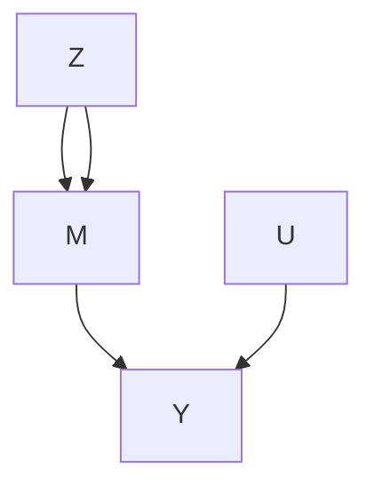
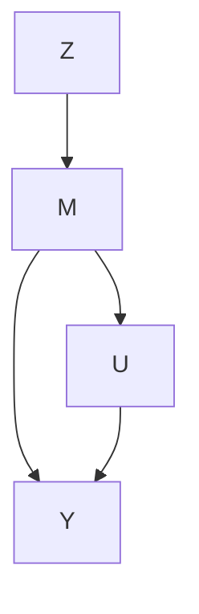

# Principal Stratification

Parts II–V focus on causal effects of a treatment on an outcome, possibly adjusting for observed pretreatment covariates. Many applications also have some post-treatment variable M which happens after the treatment but before the outcome. An important question is how to use the post-treatment variable M appropriately. I will start with several motivating examples and then introduce Frangakis and Rubin (2002)’s formulation of this problem based on potential outcomes.

## 26.1 Motivating Examples

Example 26.1 (noncompliance) In randomized experiments with noncompliance, we can use M to represent the treatment received, which is affected by the treatment assignment Z and affects the outcome Y . In this example, M has the same meaning as D in Chapter 21.

Example 26.2 (truncation by death) In randomized experiments to patients with severe diseases, some patients may die before the measurement of the outcome Y , e.g., the quality of life. The post-treatment variable M in this example is the binary indicator of the survival status.

Example 26.3 (unemployment) In job training programs, units are randomly assigned to treatment and control groups, and report their employment status M and wage Y . Then the post-treatment variable is the binary indicator of the employment status M .

Example 26.4 (surrogate endpoint) In clinical trials, the outcomes of interest (e.g., 30 years of survival) require a long and costly follow-up. Practitioners instead collect data on some other variables early in the follow-up that are easy to measure. These variables are called the “surrogate endpoints.” A concrete example is from clinical trials on HIV patients, where the candidate surrogate endpoint M is the CD4 cell count.

Examples 26.1–26.4 have the similarity that an intermediate variable M occurs between the treatment and the outcome. Here “between” can mean that

1. M is on the causal pathway from Z to Y as Figure 26.1(a);  
2. M is not on the causal pathway from Z to Y as Figure 26.1(b).

Example 26.1 corresponds to Figure 26.1(a). Examples 26.2 and 26.3 correspond to Figure 26.1(b). Example 26.4 can correspond to Figure 26.1(a) or (b), depending on the choice of the surrogate end point.

FIGURE 26.1: Causal diagrams with a post-treatment variable M

## 26.2 The Problem of Conditioning on the Post-Treatment Variable

A naive method to deal with the post-treatment variable M is to condition on its observed value as if it were a pretreatment covariate. However, M is fundamentally different from X, because the former is affected by the treatment in general but the latter is not. It is also a “rule of thumb” that data analyzers should not condition on any post-treatment variables in evaluating the average effect of the treatment on the outcome (Cochran, 1957; Rosenbaum, 1984). Based on potential outcomes, Frangakis and Rubin (2002) gave the following insightful explanation.

For simplicity, we focus on completely randomized experiment in this chapter.

Assumption 26.1 (complete randomization with an intermediate variable) $Z \bot \bot \{ M ( 1 ) , M ( 0 ) , Y ( \dot { 1 } ) , Y ( 0 ) \}$ .

Conditioning on $M = m$ , we compare

$$
\operatorname{pr} (Y \mid Z = 1, M = m)
$$

and

$$
\operatorname{pr} (Y \mid Z = 0, M = m).
$$

This comparison seems intuitive which measures the difference in the outcome distributions in treated and control groups given the same value of the posttreatment variable. When M is a pre-treatment covariate, this comparison yields a reasonable subgroup effect. However, when M is a post-treatment variable, the interpretation of this comparison is problematic. Under Assumption 26.1, we can re-write

$$
\begin{array}{l} \operatorname{pr} (Y \mid Z = 1, M = m) = \operatorname{pr} \{Y (1) \mid Z = 1, M (1) = m \} \\ = \operatorname{pr} \{Y (1) \mid M (1) = m \} \\ \end{array}
$$

and

$$
\begin{array}{l} \operatorname{pr} (Y \mid Z = 0, M = m) = \operatorname{pr} \{Y (0) \mid Z = 0, M (0) = m \} \\ = \operatorname{pr} \{Y (0) \mid M (0) = m \}. \\ \end{array}
$$

Therefore, we are comparing the distributions of $Y ( 1 )$ and $Y ( 0 )$ for different subset of units because the units with $M ( 1 ) = m$ are different from the units with $M ( 0 ) = m$ if the $Z$ affects M. Consequently, the comparison conditioning on $M = m$ does not have a causal interpretation in general unless $M ( 1 ) =$ $M ( 0 ) . ^ { 1 }$

Revisit Example 26.1. Comparing $\mathrm { p r } ( Y \mid Z = 1 , M = 1 )$ and $\mathrm { p r } ( Y \mid$ $Z = 0 , M = 1 )$ is equivalent to comparing the treated potential outcomes for compliers and always-takers and control potential outcomes for always-takers, under the monotonicity assumption that $M ( 1 ) \ge M ( 0 )$ . Part 3 of Problem 22.7 has pointed out the drawbacks of this analysis.

Revisit Example 26.2. If the treatment improves the survival status, the treatment can save more weak patients than the control. In this case, units with $M ( 1 ) = 1$ are weaker than units with $M ( 0 ) = 1$ , so the naive comparison gives biased results that is in favor of the control.

## 26.3 Conditioning on the Potential Values of the Post-Treatment Variable

Frangakis and Rubin (2002) proposed to condition on the joint potential value of the post-treatment variable $U = \{ M ( 1 ) , M ( 0 ) \}$ and compare

$$
\operatorname{pr} \{Y (1) \mid M (1) = m _ {1}, M (0) = m _ {0} \}
$$

and

$$
\operatorname{pr} \{Y (0) \mid M (1) = m _ {1}, M (0) = m _ {0} \}
$$

for some $( m _ { 1 } , m _ { 0 } )$ . This is a comparison of the potential outcomes under treatment and control for the same subset of units with $M ( 1 ) = m _ { 1 }$ and $M ( 0 ) = m _ { 0 }$ . Frangakis and Rubin (2002) called this strategy principal stratification, viewing $\{ M ( 1 ) , M ( 0 ) \}$ as a pre-treatment covariate. Based on this idea, we can define

$$
\tau (m _ {1}, m _ {0}) = E \{Y (1) - Y (0) \mid M (1) = m _ {1}, M (0) = m _ {0} \}
$$

as the principal stratification average causal effect for the subgroup with $M ( 1 ) = m _ { 1 } , M ( 0 ) = m _ { 0 }$ . For a binary M, we have four subgroups

$$
\left\{ \begin{array}{l c l} \tau (1, 1) & = & E \{Y (1) - Y (0) \mid M (1) = 1, M (0) = 1 \}, \\ \tau (1, 0) & = & E \{Y (1) - Y (0) \mid M (1) = 1, M (0) = 0 \}, \\ \tau (0, 1) & = & E \{Y (1) - Y (0) \mid M (1) = 0, M (0) = 1 \}, \\ \tau (0, 0) & = & E \{Y (1) - Y (0) \mid M (1) = 0, M (0) = 0 \}. \end{array} \right. \tag {26.1}
$$

Since $\{ M ( 1 ) , M ( 0 ) \}$ is unaffected by the treatment, it is a covariate so $\tau ( m _ { 1 } , m _ { 0 } )$ is a subgroup causal effect. For subgroups with $M ( 1 ) = M ( 0 )$ , the treatment does not change the intermediate variable, so $\tau ( 1 , 1 )$ and $\tau ( 0 , 0 )$ measure the dissociative effects. For other subgroups with $m _ { 1 } \neq m _ { 0 }$ , the principal stratification average causal effects $\tau ( m _ { 1 } , m _ { 0 } )$ measure the associative $e f f e c t s .$ These terminologies are from Frangakis and Rubin (2002), which do not assume that M is on the causal pathway from Z to Y . When we have Figure $2 6 . 1 ( \mathrm { a } )$ , we can interpret the dissociative effects as direct effects of Z on Y that act independent of M, although we cannot simply interpret the associative effects as direct or indirect effects of Z on Y .

Example 26.1 (noncompliance) With noncompliance, (26.1) consists of the average causal effects for the always takers, compliers, $d e f i e r s ,$ and never takers (Imbens and Angrist, 1994; Angrist et al., 1996).

Example 26.2 (truncation by death) Because the outcome is well define only if the patient survives, three subgroup causal effects in (26.1) are not meaningful, and the only well-defined subgroup effect is

$$
\tau (1, 1) = E \{Y (1) - Y (0) \mid M (1) = 1, M (0) = 1 \}. \tag {26.2}
$$

It is called the survivor average causal effect (Rubin, 2006a). It is the average causal effect of the treatment on the outcome for those units who survive regardless of the treatment status.

Example 26.3 (unemployment) The unemployment problem is isomorphic to the truncation by death problem because the wage is well-defined only if the unit is employed in the first place. Therefore, the only well defined subgroup effect is (26.2), the employed average causal effect. Previously, Heckman (1979) proposed a model, now called the Heckman Selection Model, to deal with unemployment in modeling the wage, viewing the wages of those unemployed as missing values2. However, Zhang and Rubin (2003) and Zhang et al. (2009) argued that τ (1, 1) is a more meaningful quantity under the potential outcomes framework.

Example 26.4 (surrogate endpoint) Intuitively, we want to assess the effect of the treatment on the outcome via the effect of the treatment on the surrogate endpoint. Therefore, a good surrogate endpoint should satisfy two conditions: first, if the treatment does not affect the surrogate, then it does not affect the outcome either; second, if the treatment affects the surrogate, then it affects the outcome too. The first condition is called the “causal necessity” by Frangakis and Rubin (2002), and the second condition is called the “causal sufficiency” by Gilbert and Hudgens (2008). Based on (26.1) for a binary surrogate endpoint, causal necessity requires that τ (1, 1) and τ (0, 0) are zero, and causal sufficiency requires that τ (1, 0) and τ (0, 1) are not zero.

## 26.4 Statistical Inference and Its Difficulty

In Example 26.1, if we have randomization, monotonicity and exclusion restriction, then we can identify the complier average causal effect. This is the key result derived in Chapter 21.

However, in other examples, we cannot impose the exclusion restriction assumption. For instance, τ (1, 1) is the main parameter of interest in Examples 26.2 and 26.3, and τ (1, 1) and τ (0, 0) are both of interest in Example 26.4.

Without the exclusion restriction assumption, it is very challenging to identify the principal stratification average causal effect. Sometimes, we cannot even impose the monotonicity assumption, and thus cannot identify the proportions of the latent strata in the first place.

## 26.4.1 Special case: truncation by death with binary outcome

I use the simple setting with a binary treatment, binary survival status and binary outcome to illustrate the idea and especially the difficulty of statistical inference based on principal stratification.

In addition to Assumption 26.1, we impose the monotonicity.

## Assumption 26.2 (monotonicity) $M ( 1 ) \geq M ( 0 )$ .

Theorem 22.1 demonstrates that under Assumptions 26.1 and 26.2, we can identify the proportions of the three latent strata by

$$
\begin{array}{l} \pi_ {(1, 1)} = \operatorname{pr} (M = 1 \mid Z = 0), \\ \pi_ {(0, 0)} = \operatorname{pr} (M = 0 \mid Z = 1), \\ \pi_ {(1, 0)} = \operatorname{pr} (M = 1 \mid Z = 1) - \operatorname{pr} (M = 1 \mid Z = 0). \\ \end{array}
$$

Our goal is to identify the survivor average causal effect $\tau ( 1 , 1 )$ . First, we can easily identify $E \{ Y ( 0 ) \mid M ( 1 ) = 1 , M ( 0 ) = 1 \}$ because the observed group $( Z = 0 , M = 1 )$ consists of only survivors:

$$
E \{Y (0) \mid M (1) = 1, M (0) = 1 \} = E (Y \mid Z = 0, M = 1).
$$

The key is then to identify $E \{ Y ( 1 ) \mid M ( 1 ) = 1 , M ( 0 ) = 1 \}$ . The observed group $( Z = 1 , M = 1 )$ is a mixture of two strata (1, 1) and (1, 0), therefore we have

$$
\begin{array}{l} E (Y \mid Z = 1, M = 1) = \frac {\pi_ {(1 , 1)}}{\pi_ {(1 , 1)} + \pi_ {(1 , 0)}} E \{Y (1) \mid M (1) = 1, M (0) = 1 \} \\ + \frac {\pi_ {(1 , 0)}}{\pi_ {(1 , 1)} + \pi_ {(1 , 0)}} E \{Y (1) \mid M (1) = 1, M (0) = 0 \}. \\ \end{array}
$$

We have two unknown parameters but only one equation. So we cannot uniquely determine $E \{ Y ( 1 ) \mid M ( 1 ) = 1 , M ( 0 ) = 1 \}$ from the above equation. Nevertheless, this equation contains some information about the quantity of interest. That is, $E \{ Y ( 1 ) \mid M ( 1 ) = 1 , M ( 0 ) = 1 \}$ is partially identified by Definition 18.1.

For a binary outcome Y , we know that $E \{ Y ( 1 ) \mid M ( 1 ) = 1 , M ( 0 ) = 0 \}$ is bounded between 0 and 1, and consequently, $E \{ Y ( 1 ) \mid M ( 1 ) = 1 , M ( 0 ) = 1 \}$ is bounded between the solutions to the following two equations:

$$
\begin{array}{l} E (Y \mid Z = 1, M = 1) = \frac {\pi_ {(1 , 1)}}{\pi_ {(1 , 1)} + \pi_ {(1 , 0)}} E \{Y (1) \mid M (1) = 1, M (0) = 1 \} \\ + \frac {\pi_ {(1 , 0)}}{\pi_ {(1 , 1)} + \pi_ {(1 , 0)}} \\ \end{array}
$$

and

$$
E (Y \mid Z = 1, M = 1) = \frac {\pi_ {(1 , 1)}}{\pi_ {(1 , 1)} + \pi_ {(1 , 0)}} E \{Y (1) \mid M (1) = 1, M (0) = 1 \}.
$$

Therefore, $E \{ Y ( 1 ) \mid M ( 1 ) = 1 , M ( 0 ) = 1 \}$ has lower bound

$$
\frac {\{\pi_ {(1 , 1)} + \pi_ {(1 , 0)} \} E (Y \mid Z = 1 , M = 1) - \pi_ {(1 , 0)}}{\pi_ {(1 , 1)}},
$$

and upper bound

$$
\frac {\{\pi_ {(1 , 1)} + \pi_ {(1 , 0)} \} E (Y \mid Z = 1 , M = 1)}{\pi_ {(1 , 1)}}.
$$

We can then derive the bounds $\mathrm { o n } \tau ( 1 , 1 )$ , summarized below.

Theorem 26.1 Under Assumptions 26.1 and 26.2 with a binary Y , we have

$$
\begin{array}{l} \frac {\left\{\pi_ {(1 , 1)} + \pi_ {(1 , 0)} \right\} E (Y \mid Z = 1 , M = 1) - \pi_ {(1 , 0)}}{\pi_ {(1 , 1)}} - E (Y \mid Z = 0, M = 1) \\ \leq \tau (1, 1) \\ \leq \frac {\{\pi_ {(1 , 1)} + \pi_ {(1 , 0)} \} E (Y \mid Z = 1 , M = 1)}{\pi_ {(1 , 1)}} - E (Y \mid Z = 0, M = 1). \\ \end{array}
$$

In most truncation by death problems, the lower and upper bounds are quite different, and they are bounded away from the extreme values −1 and 1. So we can use Imbens and Manski (2004)’s confidence interval for τ (1, 1) which involves two steps: first, we obtain the estimated lower and upper bounds [ˆl, uˆ] with estimated standard errors $( \mathrm { s e } _ { l } , \mathrm { s e } _ { u } ) ;$ second, we construct the confidence interval as $[ \hat { l } - z _ { \alpha } \mathrm { s e } _ { l } , \hat { u } + z _ { \alpha } \mathrm { s e } _ { u } ]$ , where $z _ { \alpha }$ is the 1 − α quantile of the standard normal distribution.

To summarize, this is a challenging problem since we cannot identify the parameter based on the observed data even with infinite sample size. We can derive large-sample bounds for τ (1, 1) but the statistical inference based on the bounds are not standard. If we do not have monotonicity, the large-sample bounds have even more complex forms (Zhang and Rubin, 2003; Jiang et al., 2016).

## 26.4.2 An application

I use the data in Yang and Small (2016) from the Acute Respiratory Distress Syndrome Network study involving 861 patients with lung injury and acute respiratory distress syndrome. Patients were randomized to receive mechanical ventilation with either lower tidal volumes or traditional tidal volumes. The outcome is the binary indicator for whether patients could breathe without assistance by day 28. Table 26.1 summarizes the observed data.

**TABLE 26.1: Data truncated by death with \* indicating the outcomes for dead patients**

<table><tr><td colspan="4">Treatment Z = 1</td><td colspan="4">Control Z = 0</td></tr><tr><td></td><td>Y = 1</td><td>Y = 0</td><td>total</td><td></td><td>Y = 1</td><td>Y = 0</td><td>total</td></tr><tr><td>M = 1</td><td>54</td><td>268</td><td>322</td><td>M = 1</td><td>59</td><td>218</td><td>277</td></tr><tr><td>M = 0</td><td>*</td><td>*</td><td>109</td><td>M = 0</td><td>*</td><td>*</td><td>152</td></tr></table>

We first obtain the point estimators of the latent strata:

$$
\hat {\pi} _ {(1, 1)} = \frac {2 7 7}{2 7 7 + 1 5 2} = 0. 6 4 6, \quad \hat {\pi} _ {(0, 0)} = \frac {1 0 9}{1 0 9 + 3 2 2} = 0. 2 5 3, \quad \hat {\pi} _ {(1, 0)} = 0. 1 0 1.
$$

The sample means of the outcome for survived patients are

$$
\hat {E} (Y \mid Z = 1, M = 1) = \frac {5 4}{3 0 2} = 0. 1 6 8, \quad \hat {E} (Y \mid Z = 0, M = 1) = \frac {5 9}{2 7 7} = 0. 2 1 3.
$$

The estimates for the bounds on $E \{ Y ( 1 ) \mid M ( 1 ) = 1 , M ( 0 ) = 1 \}$ are

$$
\left[ \frac {(0 . 6 4 6 + 0 . 1 0 1) \times 0 . 1 6 8 - 0 . 1 0 1}{0 . 1 0 1}, \frac {(0 . 6 4 6 + 0 . 1 0 1) \times 0 . 1 6 8}{0 . 1 0 1} \right] = [ 0. 0 3 7, 0. 1 9 4 ],
$$

so the bounds on τ (1, 1) are

$$
[ 0. 0 3 7 - 0. 2 1 3, 0. 1 9 4 - 0. 2 1 3 ] = [ - 0. 1 7 6, - 0. 0 1 9 ].
$$

Incorporating the sampling uncertainty based on the bootstrap, the upper bound becomes positive.

## 26.4.3 Extensions

Zhang and Rubin (2003) started the literature of large-sample bounds. Imai (2008a) and Lee (2009) were two follow-up papers. Cheng and Small (2006) derived the bounds with multiple treatment arms. Yang and Small (2016) used a secondary outcome to sharpen the bounds on the survivor average causal effect.

## 26.5 Principal score method

Without additional assumptions, we can only derive bounds on the causal effects within principal strata, but cannot identify them in general. We must impose additional assumptions to achieve nonparametric identification of the $\tau ( m _ { 1 } , m _ { 0 } ) _ { \mathrm { { s } } }$ . There is no consensus on the choice of the assumptions. Those additional assumptions are not testable, and their plausibility depends on the application. A line of research parallels causal inference with unconfounded observational studies. For simplicity, I focus on the case with strong monotonicity.

## 26.5.1 Principal score method under strong monotonicity

Assumption 26.3 (strong monotonicity) $M ( 0 ) = 0$ .

Similar to the ignorability assumption, we now assume the principal ignorability assumption.

Assumption 26.4 (principal ignorability) $E \{ Y ( 0 ) ~ \mid ~ M ( 1 ) ~ = ~ 1 , X \} ~ =$ $E \{ Y ( 0 ) \mid M ( 1 ) = 0 , \dot { X } \}$ .

These assumptions ensures nonparametric identification of the causal effects within principal strata.

Theorem 26.2 Under Assumptions 26.1, 26.3 and ${ \it 2 6 . 4 } ,$ the principal stratification average causal effects can be identified by

$$
\tau (1, 0) = E (Y \mid Z = 1, M = 1) - E \{\pi (X) Y \mid Z = 0 \} / \pi
$$

and

$$
\tau (0, 0) = E (Y \mid Z = 1, M = 0) - E \{(1 - \pi (X) \} Y \mid Z = 0 \} / (1 - \pi)
$$

where $\pi ( X ) = \operatorname { p r } \{ M ( 1 ) = 1 \mid X \}$ and $\pi = \mathrm { p r } \{ M ( 1 ) = 1 \}$ can be identified by

$$
\pi (X) = \operatorname{pr} (M = 1 \mid Z = 1, X)
$$

and

$$
\pi = \operatorname{pr} (M = 1 \mid Z = 1).
$$

The conditional probability $\pi ( X ) = \operatorname { p r } \{ M ( 1 ) = 1 \mid X \}$ is called the $p r i n –$ cipal score. Theorem 26.2 states that $\tau ( 1 , 0 )$ and $\tau ( 0 , 0 )$ can be identified by difference in means with appropriate weights depending on the principal score.

Proof of Theorem 26.2: I will only prove that

$$
E \{Y (0) \mid M (1) = 1 \} = E \{\pi (X) Y \mid Z = 0 \} / \pi .
$$

The left-hand side equals

$$
\begin{array}{l} E \{M (1) Y (0) \} / \pi = E [ E \{M (1) \mid X \} E \{Y (0) \mid X \} ] / \pi \\ = E \left[ \pi (X) E \{Y (0) \mid X \} \right] / \pi \\ = E \left[ E \{\pi (X) Y (0) \mid X \} \right] / \pi \\ = E \{\pi (X) Y (0) \} / \pi \\ = E \{\pi (X) Y \mid Z = 0 \} / \pi . \\ \end{array}
$$

Theorem 26.2 motivates the following simple estimators for τ (1, 0) and τ (0, 0), respectively:

1. fit a logistic regression of M on X using only data from the treated group to obtain ˆπ(Xi);  
2. estimate π by $\textstyle { \hat { \pi } } = \sum _ { i = 1 } ^ { n } Z _ { i } M _ { i } / \sum _ { i = 1 } ^ { n } Z _ { i }$  
3. obtain moment estimators:

$$
\hat {\tau} (1, 0) = \frac {\sum_ {i = 1} ^ {n} Z _ {i} M _ {i} Y _ {i}}{\sum_ {i = 1} ^ {n} Z _ {i} M _ {i}} - \frac {\sum_ {i = 1} ^ {n} (1 - Z _ {i}) \hat {\pi} (X _ {i}) Y _ {i}}{\hat {\pi} \sum_ {i = 1} ^ {n} (1 - Z _ {i})}
$$

and

$$
\hat {\tau} (0, 0) = \frac {\sum_ {i = 1} ^ {n} Z _ {i} (1 - M _ {i}) Y _ {i}}{\sum_ {i = 1} ^ {n} Z _ {i} (1 - M _ {i})} - \frac {\sum_ {i = 1} ^ {n} (1 - Z _ {i}) (1 - \hat {\pi} (X _ {i}) \} Y _ {i}}{(1 - \hat {\pi}) \sum_ {i = 1} ^ {n} (1 - Z _ {i})};
$$

4. use the bootstrap to approximate the variances of ˆτ (1, 0) and τˆ(0, 0).

## 26.5.2 Extensions

Follmann (2000), Hill et al. (2002), Jo and Stuart (2009), Jo et al. (2011) and Stuart and Jo (2015) started the literature of using the principal score to identify causal effects within principal strata. Ding and Lu (2017) provided theoretical foundation for this strategy. They prove Theorem 26.2 as well as a more general version under monotonicity; see Problem 26.1. Jiang et al. (2022) give a unified discussion of this strategy for observational studies and propose multiply robust estimators for causal effects within principal strata.

## 26.6 Other methods

To estimate principal stratification average causal effects without the exclusion restriction assumption, Zhang et al. (2009) proposed to use the normal mixture models. However, the inference based on the normal mixture models can be quite fragile. A strategy is to use additional information to improve the inference under some restrictions (Ding et al., 2011; Mealli and Pacini, 2013; Mattei et al., 2013; Jiang et al., 2016).

Conceptually, the principal stratification framework works for general M. A multi-valued M generates many latent principal strata, and a continuous M generates infinitely many latent principal strata. In those cases, identifying the probability of the principal strata is non-trivial in the first place let alone identifying the principal stratification average causal effects. Jiang and Ding (2021) reviewed some useful strategies.

## 26.7 Homework problems

## 26.1 Principal score method under monotonicity

This problem extends Theorem 26.2, with Assumption 26.3 replaced by Assumption 26.2 and Assumption 26.4 replaced by the assumption below.

Assumption 26.5 (principal ignorability) We have

$$
E \{Y (1) \mid M (1) = 1, M (0) = 0, X \} = E \{Y (1) \mid M (1) = 1, M (0) = 1, X \}
$$

and

$$
E \{Y (0) \mid M (1) = 1, M (0) = 0, X \} = E \{Y (0) \mid M (1) = 0, M (0) = 0, X \}.
$$

Theorem 26.3 Under Assumptions 26.1, 26.2 and 26.5, the principal stratification average causal effects can be identified by

$$
\tau (1, 0) = E \left\{w _ {1, (1, 0)} (X) Y \mid Z = 1, M = 1 \right\} - E \left\{w _ {0, (1, 0)} (X) Y \mid Z = 0, M = 0 \right\},
$$

$$
\tau (0, 0) = E (Y \mid Z = 1, M = 0) - E \left\{w _ {0, (0, 0)} (X) Y \mid Z = 0, M = 0 \right\},
$$

$$
\tau (1, 1) = E \left\{w _ {1, (1, 1)} (X) Y \mid Z = 1, M = 1 \right\} - E (Y \mid Z = 0, M = 1)
$$

with

$$
w _ {1, (1, 0)} (X) = \frac {\pi_ {(1 , 0)} (X)}{\pi_ {(1 , 0)} (X) + \pi_ {(1 , 1)} (X)} \Big / \frac {\pi_ {(1 , 0)}}{\pi_ {(1 , 0)} + \pi_ {(1 , 1)}},
$$

$$
w _ {0, (1, 0)} (X) = \frac {\pi_ {(1 , 0)} (X)}{\pi_ {(1 , 0)} (X) + \pi_ {(0 , 0)} (X)} \Big / \frac {\pi_ {(1 , 0)}}{\pi_ {(1 , 0)} + \pi_ {(0 , 0)}},
$$

$$
w _ {0, (0, 0)} (X) = \frac {\pi_ {(0 , 0)} (X)}{\pi_ {(1 , 0)} (X) + \pi_ {(0 , 0)} (X)} \Big / \frac {\pi_ {(0 , 0)}}{\pi_ {(1 , 0)} + \pi_ {(0 , 0)}},
$$

$$
w _ {1, (1, 1)} (X) = \frac {\pi_ {(1 , 1)} (X)}{\pi_ {(1 , 0)} (X) + \pi_ {(1 , 1)} (X)} \Big / \frac {\pi_ {(1 , 1)}}{\pi_ {(1 , 0)} + \pi_ {(1 , 1)}}.
$$

Moreover, the conditional and marginal principal scores are all identifiable by

$$
\pi_ {(0, 0)} (X) = \operatorname{pr} (M = 0 \mid Z = 1, X),
$$

$$
\pi_ {(1, 1)} (X) = \operatorname{pr} (M = 1 \mid Z = 0, X),
$$

$$
\pi_ {(1, 0)} (X) = \operatorname{pr} (M = 1 \mid Z = 1, X) - \operatorname{pr} (M = 1 \mid Z = 0, X).
$$

and

$$
\pi_ {(0, 0)} = \operatorname{pr} (M = 0 \mid Z = 1),
$$

$$
\pi_ {(1, 1)} = \operatorname{pr} (M = 1 \mid Z = 0),
$$

$$
\pi_ {(1, 0)} = \operatorname{pr} (M = 1 \mid Z = 1) - \operatorname{pr} (M = 1 \mid Z = 0).
$$

Remark: Based on Theorem 26.3, we can construct weighting estimators. Theorem 26.3 is Proposition 2 in Ding and Lu (2017), which also provided more details for the estimation.

## 26.2 Recommended reading

Frangakis and Rubin (2002) proposed the principal stratification framework. Zhang and Rubin (2003) derived large-sample bounds on the survivor average causal effect. Jiang and Ding (2021) reviewed various strategies to identify the causal effects within principal strata.