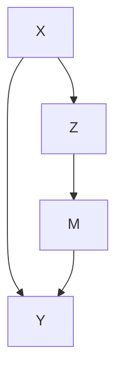
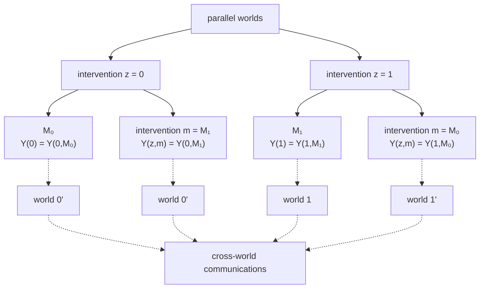
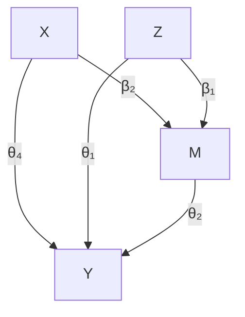

# Mediation Analysis: Natural Direct and Indirect Effects

With an intermediate variable M between the treatment $Z$ and outcome $Y .$ , the causal effects within principal strata defined by $U = \{ M ( 1 ) , M ( 0 ) \}$ can assess the treatment effect heterogeneity across latent groups U. When M is indeed on the causal pathway from $Z$ to $Y$ , causal effects within some principal strata, $\tau ( 1 , 1 )$ and $\tau ( 0 , 0 )$ , can give information about the direct effect of $Z$ on $Y ,$ . However, these direct effects are only for two latent groups. The causal effects within the other two principal strata, $\tau ( 1 , 0 )$ and $\tau ( 0 , 1 )$ , contain both the direct and indirect effects. Fundamentally, principal stratification does not provide any information about the indirect effect of $Z$ on $Y$ through M because it does not even assume that M can be intervened.

In the above discussion, I use the notions of “direct effect” and “indirect effect” in a casual way. When M lies on the pathway from $Z$ to $Y ,$ , researchers often want to assess the extent to which the effect of $Z$ on Y is through M and the extent to which the effect is through other pathways. This is called mediation analysis. It is the topic of this chapter.

## 27.1 Motivating Examples

In mediation analysis, we have a treatment $Z ,$ an outcome $Y ,$ a mediator M, and some background covariates X. Figure 27.3 illustrates their relationship. Below we give some concrete examples.




FIGURE 27.1: Directed acyclic graph for mediation

Example 27.1 VanderWeele et al. (2012) conducted mediation analysis to assess the extent to which the effect of variants on chromosome 15q25.1 on lung cancer is mediated through smoking and to which it operates through other causal pathways. The exposure levels correspond to changes from 0 to 2 C alleles, smoking intensity is measured by the square root of cigarettes per day, and the outcome is the lung cancer indicator. VanderWeele et al. (2012)’s study contained many sociodemographic covariates.

Example 27.2 Rudolph et al. (2018) studies the causal mechanism from neighborhood poverty to adolescent substance use, mediated by the school and peer environment. They used data from the National Comorbidity Survey Replication Adolescent Supplement, a nationally representative survey of U.S. adolescents conducted during 2001–2004. The treatment is the binary indicator of neighborhood disadvantage, defined as living in the lowest tertile of neighborhood socioeconomic status based on data from the 2000 U.S. Census. Four binary mediators are measures of school and peer environments, and six binary outcomes are measures of substance use. Baseline covariates included the adolescent’s sex, age, race, immigration generation, family income, etc.

Example 27.3 The mediation package in R contains a dataset called jobs, which is from JOBS II, a randomized field experiment that investigates the efficacy of a job training intervention on unemployed workers. We used this dataset in Chapter 21.5. The program is designed to not only increase reemployment among the unemployed but also enhance the mental health of the job seekers. It is therefore of interest to assess the indirect effect of the intervention on the mental health through job search efficacy and its direct effect acting through other pathways. We will revisit this example later.

## 27.2 Nested Potential Outcomes

## 27.2.1 Natural Direct and Indirect Effects

Below we drop the index i for unit i and assume all random variables are iid draws from a super population. For simplicity, we focus on a binary treatment Z .

We first consider the hypothetical intervention on z and define potential mediators and outcomes corresponding to the intervention on z:

$$
\{M (z), Y (z): z = 0, 1 \}.
$$

We then consider hypothetical intervention on both z and m and define potential outcomes corresponding to the interventions on z and m:

$$
\{Y (z, m): z = 0, 1; m \in \mathcal {M} \},
$$

where M contains all possible values of $m .$ . Robins and Greenland (1992) and Pearl (2001) further consider the nested potential outcomes corresponding to intervention on z and $m = M ( z ^ { \prime } ) \equiv M _ { z ^ { \prime } }$ :

$$
\left\{Y (z, M _ {z ^ {\prime}}): z = 0, 1; z ^ {\prime} = 0, 1 \right\}
$$

where we write $M ( z ^ { \prime } )$ as $M _ { z ^ { \prime } }$ to avoid excessive parentheses. The notation $Y ( z , M _ { z ^ { \prime } } )$ is the hypothetical outcome if the treatment were set at level z and the mediator were set at its potential level $M ( z ^ { \prime } )$ under treatment $z ^ { \prime } .$ . Importantly, z and $z ^ { \prime }$ can be different. With a binary treatment, we have four nested potential outcomes in total:

$$
\{Y (1, M _ {1}), Y (1, M _ {0}), Y (0, M _ {1}), Y (0, M _ {0}) \}.
$$

The nested potential outcome $Y ( 1 , M _ { 1 } )$ is the hypothetical outcome if the treatment were set at $z = 1$ and the mediator were set at what would happen under $z = 1$ . Similarly, $Y ( 0 , M _ { 0 } )$ is the outcome if the treatment were set at $z = 0$ and the mediator were set at what would happen under $z = 0$ . It would be surprising if $Y ( 1 , M _ { 1 } ) \neq Y ( 1 )$ or $Y ( 0 , M _ { 0 } ) \neq Y ( 0 )$ . Therefore, we make the following assumption throughout this chapter.

Assumption 27.1 (composition) $Y ( z , M _ { z } ) = Y ( z ) ~ f o r ~ z = 0 , 1$ .

The composition assumption cannot be proved. It is indeed an assumption. Without causing philosophical debates, we can even define $Y ( 1 )$ as $Y ( 1 , M _ { 1 } )$ , and define $Y ( 0 )$ as $Y ( 0 , M _ { 0 } )$ .

The nested potential outcome $Y ( 1 , M _ { 0 } )$ is the hypothetical outcome if the unit received treatment 1 but its mediator were set at its natural value $M _ { 0 }$ without the treatment. Similarly, $Y ( 0 , M _ { 1 } )$ is the hypothetical outcome if the unit received control 0 but its mediator were set at its natural value $M _ { 1 }$ under the treatment. They are two cross-world counterfactual terms and useful for defining the direct and indirect effects.

Definition 27.1 (total, direct and indirect effects) Define the total $e f -$ fect of the treatment on the outcome as

$$
\tau = E \{Y (1) - Y (0) \}.
$$

Define the natural direct effect as

$$
\mathrm{NDE} = E \left\{Y \left(1, M _ {0}\right) - Y \left(0, M _ {0}\right) \right\}.
$$

Define the natural indirect effect as

$$
\mathrm{NIE} = E \{Y (1, M _ {1}) - Y (1, M _ {0}) \}.
$$

The total effect is the standard average causal effect of $Z$ on $Y$ . The natural direct effect measures the effect of the treatment on the outcome if the mediator were set at the natural value $M _ { 0 }$ without the intervention. The natural indirect effect measures the the effect of the treatment through changing the mediator if the treatment itself were set at $z = 1$ . Under the composition assumption, the natural direct and indirect effects reduce to

$$
\mathrm{NDE} = E \{Y (1, M _ {0}) - Y (0) \}, \quad \mathrm{NIE} = E \{Y (1) - Y (1, M _ {0}) \},
$$

and therefore, we can decompose the total effect as the sum of the natural direct and indirect effects.

Proposition 27.1 $B y$ Definition 27.1 and Assumption 27. $1 , \tau = \mathrm { N D E + N I E }$ .

Mathematically, we can also define the natural indirect effect as $E \{ Y ( 0 , M _ { 1 } ) - Y ( 0 , M _ { 0 } ) \}$ where the treatment is fixed at 0. However, this definition does not lead to the decomposition in Proposition 27.1.

Unfortunately, the nest potential outcome $Y ( 1 , M _ { 0 } )$ is not an easy quantity to understand due to the cross-world nature of the interventions: the treatment is set at $z = 1$ but the mediator is set at its natural value $M _ { 0 }$ under treatment $z = 0$ . Clearly, these two interventions on the treatment cannot simultaneously happen in any realized experiment. To understand the cross-world potential outcome $Y ( 1 , M _ { 0 } )$ , we need to imagine the existence of parallel worlds as shown in Figure 27.2. Let’s focus on $Y ( 1 , M _ { 0 } )$ . When the treatment is set at $z = 1$ , the mediator must take value $M _ { 1 }$ . If at the same time we want to set the mediator at $m = M _ { 0 }$ , we must know the value of $M _ { 0 }$ for the same unit from another experiment in the parallel world. This can be an unrealistic physical experiment because it requires that the same unit is intervened at two different levels of the treatment. Under some strong assumptions about the homogeneity of units, we may use another unit’s mediator value under control as a proxy for $M _ { 0 }$ .

## 27.2.2 Metaphysics or Science

Causal inference is hard, and there is no agreement even on its mathematical notation. Robins and Greenland (1992) and Pearl (2001) used the nested potential outcomes to define the natural direct and indirect effects. However, Frangakis and Rubin (2002) called $Y ( 1 , M _ { 0 } )$ and $Y ( 0 , M _ { 1 } )$ a priori counterfactuals because we cannot observed them in any physical experiments. In this sense, they do not exist a priori. According to Popper (1963), a way to distinguish science and metaphysics is the falsifiability of the statements. That is, if a statement is not falsifiable based on any physical experiments or observations, then it is not a scientific but rather a metaphysical statement. Because we cannot observe $Y ( 1 , M _ { 0 } )$ and $Y ( 0 , M _ { 1 } )$ in any experiments, we cannot falsify any statements involving them except for the trivial ones $( \mathrm { e . g . }$ , some outcomes are binary, or continuous, or bounded). Therefore, a strict Popperian statistician would view mediation analysis as metaphysics.

More strikingly, Dawid (2000) criticized the potential outcomes framework to be metaphysical, and he called Rubin’s Science Table a “metaphysical ar-$\mathrm { r a y . } ^ { \mathrm { , y } }$ This is a critique on not only the a priori counterfactuals $Y ( 1 , M _ { 0 } )$ and $Y ( 0 , M _ { 1 } )$ but also the simple potential outcomes $Y ( 1 )$ and $Y ( 0 )$ . Dawid (2000) argued that because we can never observe $Y ( 1 )$ and $Y ( 0 )$ jointly, then introducing the notation $\{ Y ( 1 ) , Y ( 0 ) \}$ is a metaphysical activity. He is correct about the metaphysical nature of the joint distribution of $\mathrm { p r } \{ Y ( 1 ) , Y ( 0 ) \}$ , but he is incorrect about the marginal distributions. Based on the observed data, we indeed can falsify some statement about the marginal distributions, although we cannot falsify any statements about the joint distribution.1 Therefore, even according to Popper (1963), Rubin’s Science Table is not metaphysical because it has some nontrivial falsifiable implications although not all implications are falsifiable. This is the fundamental difference between $\{ Y ( 1 ) , Y ( 0 ) \}$ and $\{ Y ( 1 , M _ { 0 } ) , Y ( 0 , M _ { 1 } ) \}$ .




FIGURE 27.2: Crossworld potential outcomes $Y ( 1 , M _ { 0 } )$ and $Y ( 0 , M _ { 1 } )$

$$
\max \{0, \operatorname{pr} (Y (1) \leq y _ {1}) + \operatorname{pr} (Y (0) \leq y _ {0}) - 1 \}
$$

$$
\leq \operatorname{pr} (Y (1) \leq y _ {1}, Y (0) \leq y _ {0})
$$

$$
\leq \min \{\operatorname{pr} (Y (1) \leq y _ {1}), \operatorname{pr} (Y (0) \leq y _ {0}) \}.
$$

This is often a loose inequality. Unfortunately, we do not have any information beyond this inequality without imposing additional assumptions.

## 27.3 The Mediation Formula

Pearl (2001)’s mediation formula relies on the following four assumptions. The first three essentially assumes that the treatment and the mediator are both randomized conditional on observed covariates.

Assumption 27.2 There is no treatment-outcome confounding:

$$
Z \bot Y (z, m) \mid X
$$

for all z and m.

Assumption 27.3 There is no mediator-outcome confounding:

$$
M \bot Y (z, m) \mid (X, Z)
$$

for all z and m.

Assumptions 27.2 and 27.3 together are often called sequential ignorability. They are equivalent to the assumption that (Z, M) are jointly randomized conditioning on X:

$$
(Z, M) \perp Y (z, m) \mid X \tag {27.1}
$$

for all z and m. I leave the proof as Problem 27.1.

Assumption 27.4 There is no treatment-mediator confounding:

$$
Z \bot M (z) \mid X
$$

for all z.

The last assumption is the cross-world independence.

Assumption 27.5 There is no cross-world independence between the potential outcomes and potential mediators:

$$
Y (z, m) \perp M (z ^ {\prime}) \mid X
$$

for all $z , z ^ { \prime }$ and m.

Assumptions 27.2–27.4 are very strong, but at least they hold under experiments with randomized treatment and mediator. Assumption 27.5 is stronger because no physical experiment can ensure it. Because we can never observe $Y ( z , m )$ and $M ( z ^ { \prime } )$ in any experiment $\mathrm { i f } \ z \ne z ^ { \prime } ,$ Assumption 27.5 can never be validated so it is fundamentally meta-physical.

I give an example below in which Assumptions 27.2–27.5 all hold.

Example 27.4 Given X, we generate

$$
Z = 1 \{f _ {Z} (X, \varepsilon_ {Z}) \},
$$

$$
M (z) = 1 \{f _ {M} (X, z, \varepsilon_ {M}) \},
$$

$$
Y (z, m) = f _ {Y} (X, z, m, \varepsilon_ {Y}),
$$

for $z , m = 0 , 1$ , where $\varepsilon _ { Z } , \varepsilon _ { M } , \varepsilon _ { Y }$ are all independent. Consequently, we generate the observed values of M and Y from

$$
M = M (Z) = 1 \{f _ {M} (X, Z, \varepsilon_ {M}) \},
$$

$$
Y = Y (Z, M) = f _ {Y} (X, Z, M, \varepsilon_ {Y}).
$$

We can verify that Assumptions 27.2–27.5 hold under this data generating process; see Problem 27.2.

Pearl (2001) proved the following key result for mediation analysis.

Theorem 27.1 Under Assumptions $\mathcal { Q } \Upsilon . \mathcal { Q } \ – \mathcal { Q } \ 7 . 5 ,$ we have

$$
E \{Y (z, M _ {z ^ {\prime}}) \mid X = x \} = \sum_ {m} E (Y \mid Z = z, M = m, X = x) \mathrm{pr} (M = m \mid Z = z ^ {\prime}, X = x)
$$

and therefore,

$$
E \{Y (z, M _ {z ^ {\prime}}) \} = \sum_ {x} E \{Y (z, M _ {z ^ {\prime}}) \mid X = x \} \mathrm{pr} (X = x).
$$

Theorem 27.1 assumes that both M and X are discrete. With general M and X, the mediation formulas become

$$
E \{Y (z, M _ {z ^ {\prime}}) \mid X = x \} = \int E (Y \mid Z = z, M = m, X = x) f _ {M} (m \mid Z = z ^ {\prime}, X = x) \mathrm{d} m
$$

and

$$
E \{Y (z, M _ {z ^ {\prime}}) \} = \int E \{Y (z, M _ {z ^ {\prime}}) \mid X = x \} f _ {X} (x) \mathrm{d} x.
$$

From Theorem 27.1, the identification formulas for the means of the nested potential outcomes depend on the conditional mean of the outcome given the treatment, mediator, and covariates, as well as the conditional mean of the mediator given the treatment and covariates. We need to evaluate these two conditional means at different treatment levels if the nested potential outcome involves cross-world interventions.

If we drop the cross-world independence assumption, we can modify the definition of the natural direct and indirect effects and the same formulas hold. See Problem 27.8 for more details.

I give the proof below.

Proof of Theorem 27.1: By the tower property, $\begin{array} { r l } { E \{ Y ( z , M _ { z ^ { \prime } } ) \} } & { { } = } \end{array}$$E [ E \{ Y ( z , M _ { z ^ { \prime } } ) \mid X \} ]$ ], so we need only to prove the formula for $E \{ Y ( z , M _ { z ^ { \prime } } ) \mid$ | $X = x \}$ . Starting with the law of total probability, we have

$$
\begin{array}{l} E \{Y (z, M _ {z ^ {\prime}}) \mid X = x \} \\ = \sum_ {m} E \left\{Y \left(z, M _ {z ^ {\prime}}\right) \mid M _ {z ^ {\prime}} = m, X = x \right\} \operatorname * {p r} \left(M _ {z ^ {\prime}} = m \mid X = x\right) \\ = \sum_ {m} E \{Y (z, m) \mid M _ {z ^ {\prime}} = m, X = x \} \mathrm{pr} (M _ {z ^ {\prime}} = m \mid X = x) \\ = \sum_ {m} \underbrace {E \{Y (z , m) \mid X = x \}} _ {\text {Assumption 27.5}} \underbrace {\operatorname{pr} (M = m \mid Z = z ^ {\prime} , X = x)} _ {\text {Assumption 27.4}} \\ = \sum_ {m} \underbrace {E (Y \mid Z = z , M = m , X = x)} _ {\text {Assumptions 27.2 and 27.3}} \operatorname{pr} (M = m \mid Z = z ^ {\prime}, X = x). \\ \end{array}
$$


The above proof is actually trivial from a mathematical perspective. It illustrates the necessity of Assumptions 27.2–27.5.

Conditioning on $X = x$ , the mediation formulas for $Y ( 1 , M _ { 1 } )$ and $Y ( 0 , M _ { 0 } )$ simplifies to

$$
\begin{array}{l} E \{Y (1, M _ {1}) \mid X = x \} \\ = \sum_ {m} E (Y \mid Z = 1, M = m, X = x) \operatorname{pr} (M = m \mid Z = 1, X = x) \\ = E (Y \mid Z = 1, X = x) \\ \end{array}
$$

and

$$
\begin{array}{l} E \{Y (0, M _ {0}) \mid X = x \} \\ = \sum_ {m} E (Y \mid Z = 0, M = m, X = x) \operatorname{pr} (M = m \mid Z = 0, X = x) \\ = E (Y \mid Z = 0, X = x) \\ \end{array}
$$

based on the law of total probability; the mediation formula for $Y ( 1 , M _ { 0 } )$ simplifies to

$$
E \{Y (1, M _ {0}) \mid X = x \} = \sum_ {m} E (Y \mid Z = 1, M = m, X = x) \mathrm{pr} (M = m \mid Z = 0, X = x),
$$

where the conditional expectation of the outcome is given $Z = 1$ but the conditional distribution of the mediator is given $Z = 0$ . This leads to the indentification formulas of the natural direct and indirect effects.

Corollary 27.1 Under Assumptions 27.2–27.5, the conditional natural direct and indirect effects are identified by

$$
\begin{array}{l} \mathrm{NDE} (x) = E \left\{Y \left(1, M _ {0}\right) - Y \left(0, M _ {0}\right) \mid X = x \right\} \\ = \sum_ {m} \left\{E (Y \mid Z = 1, M = m, X = x) - E (Y \mid Z = 0, M = m, X = x) \right\} \\ \times \operatorname{pr} (M = m \mid Z = 0, X = x) \\ \end{array}
$$

and

$$
\begin{array}{l} \operatorname{NIE} (x) = E \left\{Y \left(1, M _ {1}\right) - Y \left(1, M _ {0}\right) \mid X = x \right\} \\ = \sum_ {m} E (Y \mid Z = 1, M = m, X = x) \\ \times \{\operatorname{pr} (M = m \mid Z = 1, X = x) - \operatorname{pr} (M = m \mid Z = 0, X = x) \}; \\ \end{array}
$$

the unconditional ones can be identified by $\begin{array} { r } { \mathrm { N D E } = \sum _ { x } \mathrm { N D E } ( x ) \mathrm { p r } ( X = x ) } \end{array}$ and $\begin{array} { r } { \mathrm { N I E } = \sum _ { x } \mathrm { N I E } ( x ) \mathrm { p r } ( X = x ) } \end{array}$ .

As a special case, with a binary M, the formula of the nie reduces to a product form below.

Corollary 27.2 Under Assumptions 27.2–27.5, for a binary mediator M, we have

$$
\operatorname{NIE} (x) = \tau_ {Z \to M} (x) \tau_ {M \to Y} (1, x)
$$

and nie = E{nie(X)}, where

$$
\tau_ {Z \rightarrow M} (x) = \operatorname{pr} (M = 1 \mid Z = 1, X = x) - \operatorname{pr} (M = 1 \mid Z = 0, X = x).
$$

and

$$
\tau_ {M \rightarrow Y} (z, x) = E (Y \mid Z = z, M = 1, X = x) - E (Y \mid Z = z, M = 0, X = x)
$$

I leave the proof of Corollary 27.2 as Problem 27.4. Corollary 27.2 gives a simple formula in the case of a binary M. With randomized Z conditional on X, we can view $\tau _ { Z  M } ( x )$ as the conditional average causal effect of Z on M. With randomized M conditional on $( X , Z )$ , we can view $\tau _ { M  Y } ( z , x )$ as the conditional average causal effect of M on Y . The conditional natural indirect effect equals their product. This is coherent with our intuition that the indirect effect acts from Z to M and then from M to Y .

## 27.4 The Mediation Formula Under Linear Models

Theorem 27.1 gives the nonparametric identification formula for mediation analysis. It allows us to derive various formulas for mediation analysis under different models. I will introduce the famous Baron–Kenny method under linear models below. VanderWeele (2015) gives explicit formulas for the natural direct and indirect effects for many commonly-used models. I relegate the details of other models to Section 27.6.




FIGURE 27.3: The Baron–Kenny Method for mediation under linear models

indirect effect: $\beta _ { 1 } \theta _ { 2 }$

direct effect: $\theta _ { 1 }$

## 27.4.1 The Baron–Kenny Method

The Baron–Kenny method assumes the following linear models for the mediator and outcome given the treatment and covariates.

Assumption 27.6 (linear models for the Baron–Kenny method) Both the mediator and outcome follow linear models:

$$
\left\{ \begin{array}{r c l} E (M \mid Z, X) & = & \beta_ {0} + \beta_ {1} Z + \beta_ {2} ^ {\mathsf {T}} X, \\ E (Y \mid Z, M, X) & = & \theta_ {0} + \theta_ {1} Z + \theta_ {2} M + \theta_ {4} ^ {\mathsf {T}} X. \end{array} \right.
$$

Under these linear models, the formulas for the natural direct and indirect effects simplify to functions of the coefficients.

Corollary 27.3 (Baron–Kenny formulas for mediation) Under Assumptions 27.2–27.5 and 27.6,

$$
\mathrm{NDE} = \theta_ {1}, \quad \mathrm{NIE} = \theta_ {2} \beta_ {1}.
$$

Proof of Corollary 27.3: We have

$$
\mathrm{NDE} (x) = \sum_ {m} \theta_ {1} \mathrm{pr} (M = m \mid Z = 0, X = x) = \theta_ {1}
$$

and

$$
\begin{array}{l} \mathrm{NIE} (x) = \sum_ {m} (\theta_ {0} + \theta_ {1} + \theta_ {2} m + \theta_ {4} ^ {\mathsf {T}} x) \\ \times \left\{\operatorname{pr} (M = m \mid Z = 1, X = x) - \operatorname{pr} (M = m \mid Z = 0, X = x) \right\} \\ = \theta_ {2} \left\{E (M = m \mid Z = 1, X = x) - E (M = m \mid Z = 0, X = x) \right\} \\ = \theta_ {2} \beta_ {1}, \\ \end{array}
$$

<!-- footnote -->

- This can be tricky if the error term of the linear model is heteroskedastic. Without the independence of the $\dot { G } _ { j } { ' } { \bf s } .$ , it is hard to justify the independence.

<!-- footnote end -->

<!-- footnote -->

- Based on the causal diagrams, we can reach the same conclusion. In Figure $2 6 . 1 .$ , even though Z U by randomization of $Z ,$ conditioning on M introduces the “collider $\mathrm { b i a s } ^ { \prime \prime }$ that causes $z \not \bot \sqcup$ .

<!-- footnote end -->

<!-- footnote -->

- Heckman won nobel prize of economics in 2000 “for his development of theory and methods for analyzing selective samples.” His model contains two stages. First, the employment status is determined by a latent linear model
- $M _ { i } = 1 ( { X } _ { i } ^ { \mathsf { T } } \beta + u _ { i } \geq 0 ) .$
- Second, the latent log wage is determined by a linear model
- $Y _ { i } ^ { * } = W _ { i } ^ { \mathsf { T } } \gamma + v _ { i }$
- and $Y _ { i } ^ { * }$ is observed as $Y _ { i }$ only if $M _ { i } = 1$ . In his two-stage model, the covariates $X _ { i }$ and $W _ { i }$ may differ, and the errors $( u _ { i } , v _ { i } )$ are correlated bivariate Normal.

<!-- footnote end -->

<!-- footnote -->

- By the probability theory, given the marginal distributions of $\mathrm { p r } ( Y ( 1 ) ~ \leq ~ y _ { 1 } )$ and $\mathrm { p r } ( Y ( 0 ) \leq y _ { 0 } )$ , we can bound the joint distribution of p $\cdot ( Y ( 1 ) \ \leq \ y _ { 1 } , Y ( 0 ) \leq y _ { 0 } )$ by the Frechet–Hoeffding inequality:

<!-- footnote end -->

which do not depend on x. Therefore, they are also the formulas for the unconditional natural direct and indirect effects. □

If we obtain OLS estimators of these coefficients, we can estimate the direct and indirect effects by

$$
\mathrm{N} \hat {\mathrm{DE}} = \hat {\theta} _ {1}, \quad \mathrm{N} \hat {\mathrm{IE}} = \hat {\theta} _ {2} \hat {\beta} _ {1},
$$

which is called the Baron–Kenny method (Judd and Kenny, 1981; Baron and Kenny, 1986) although it had several antecedents (e.g., Hyman, 1955; Alwin and Hauser, 1975; Judd and Kenny, 1981; Sobel, 1982).

Standard software packages report the standard error of ndeˆ from OLS. Sobel (1982, 1986) used the delta method to obtain the standard error of nieˆ . Based on the formula in Example A1.2, the asymptotic variance of $\hat { \theta } _ { 2 } \hat { \beta } _ { 1 }$ equals va $\cdot ( \hat { \theta } _ { 2 } ) \beta _ { 1 } ^ { 2 } + \theta _ { 2 } ^ { 2 } \mathrm { v a r } ( \hat { \beta } _ { 1 } )$ . So the estimated variance is

$$
\hat {\mathrm{var}} (\hat {\theta} _ {2}) \hat {\beta} _ {1} ^ {2} + \hat {\theta} _ {2} ^ {2} \hat {\mathrm{var}} (\hat {\beta} _ {1}).
$$

Testing the null hypothesis of nie based on $\hat { \theta } _ { 2 } \hat { \beta } _ { 1 }$ and the estimated variance above is called Sobel’s test in the literature of mediation analysis.

## 27.4.2 An Example

We can easily implement the Baron–Kenny method via the following code.

```r
library("car")
BKmediation = function(Z, M, Y, X)
{
    ## two regressions and coefficients
    mediator.reg = lm(M ~ Z + X)
    mediator.Zcoef = mediator.reg$coef[2]
    mediator.Zse = sqrt(hccm(mediator.reg)[2, 2])

    outcome.reg = lm(Y ~ Z + M + X)
    outcome.Zcoef = outcome.reg$coef[2]
    outcome.Zse = sqrt(hccm(outcome.reg)[2, 2])
    outcome.Mcoef = outcome.reg$coef[3]
    outcome.Mse = sqrt(hccm(outcome.reg)[3, 3])

    ## Baron-Kenny point estimates
    NDE = outcome.Zcoef
    NIE = outcome.Mcoef*mediator.Zcoef

    ## Sobel's variance estimate based the delta method
    NDE.se = outcome.Zse
    NIE.se = sqrt(outcome.Mse^2*mediator.Zcoef^2 + outcome.Mcoef^2*mediator.Zse^2)

    res = matrix(c(NDE, NIE,
```

```txt
NDE.se, NIE.se,
NDE/NDE.se, NIE/NIE.se),
2, 3)
rownames(res) = c("NDE", "NIE")
colnames(res) = c("est", "se", "t")
res
}
```

Revisiting Example 27.3, we obtain the following estimates for the direct and indirect effects:

```txt
> library(mediation)
> Z = jobs$treat
> M = jobs$job_seek
> Y = jobs$depress2
> getX    = lm(treat ~ econ_hard + depress1 +
+    sex + age + occp + marital +
+    nonwhite + educ + income,
+    data = jobs)
> X = model.matrix(getX)[, -1]
> res = BKmediation(Z, M, Y, X)
> round(res, 3)
    est    se    t
NDE -0.037 0.042 -0.885
NIE -0.014 0.009 -1.528
```

Both the estimates for the direct and indirect effects are negative although they are insignificant.

## 27.5 Sensitivity analysis

Mediation analysis relies on strong and untestable assumptions. One crucial assumption is that there is no unmeasured confounding among the treatment, mediator and outcome. Various sensitivity analysis methods appeared in the literature. In particular, Ding and Vanderweele (2016) proposed Cornfieldtype sensitivity bounds and Zhang and Ding (2022) proposed a sensitivity analysis method tailored to the Baron–Kenny method based on linear structural equation models.

## 27.6 Homework problems

27.1 Sequential randomization and joint randomization

Show (27.1) is equivalent to Assumptions 27.2 and 27.3.

27.2 Verifying the assumptions for mediation analysis

Show that Assumptions 27.2–27.5 hold under the data generating process in Example 27.4.

27.3 Another set of assumptions for the mediation formula

Imai et al. (2010) invoked the following set of assumptions to derive the mediation formula.

## Assumption 27.7 Assume

$$
\{Y (z, m), M (z ^ {\prime}) \} \perp Z \mid X
$$

and

$$
Y (z, m) \perp M (z ^ {\prime}) \mid (Z = z ^ {\prime}, X)
$$

for all $z , z ^ { \prime } , m .$

Theorem 27.2 Under Assumption 27.7, the mediation formula holds.

Prove Theorem 27.2.

27.4 Natural indirect effect with a binary mediator

Prove Corollary 27.2.

27.5 With Treatment-Outcome Interaction on the Outcome

VanderWeele (2015) suggested using the following linear models:

$$
\left\{ \begin{array}{r c l} E (M \mid Z, X) & = & \beta_ {0} + \beta_ {1} Z + \beta_ {2} ^ {\mathsf {T}} X, \\ E (Y \mid Z, M, X) & = & \theta_ {0} + \theta_ {1} Z + \theta_ {2} M + \theta_ {3} Z M + \theta_ {4} ^ {\mathsf {T}} X, \end{array} \right.
$$

where the outcome model has the interaction term between the treatment and the mediator.

Under the above linear models, show that

$$
\mathrm{NDE} = \theta_ {1} + \theta_ {3} \{\beta_ {0} + \beta_ {2} ^ {\mathsf {T}} E (X) \}, \qquad \mathrm{NIE} = (\theta_ {2} + \theta_ {3}) \beta_ {1}.
$$

How do we estimate nde and nie with IID data?

Remark: Consider the simple case with a binary Z and binary M. Under the linear models, the average causal effect of Z of M equals $\beta _ { 1 }$ , and the average causal effect of M on $Y$ equals $\theta _ { 2 } + \theta _ { 3 } E ( Z )$ . Therefore, it is possible that both of these effects are positive, but the natural indirect effect is negative. For instance:

$$
\beta_ {1} = 1, \quad \theta_ {2} = 1, \quad \theta_ {3} = - 1. 5, \quad E (Z) = 0. 5.
$$

This is somewhat paradoxical, and can be called the mediator paradox. Chen et al. (2007) reported a related surrogate endpoint paradox or intermediate variable paradox.

## 27.6 Logistic Model for Binary Mediator

Consider the following Logistic model for the binary mediator and linear model for the outcome:

$$
\left\{ \begin{array}{r c l} \operatorname{logit} \{\operatorname{pr} (M = 1 \mid Z, X) \} & = & \beta_ {0} + \beta_ {1} Z + \beta_ {2} ^ {\mathsf {T}} X, \\ E (Y \mid Z, M, X) & = & \theta_ {0} + \theta_ {1} Z + \theta_ {2} M + \theta_ {4} ^ {\mathsf {T}} X, \end{array} \right.
$$

where lo $\mathrm { g i t } ( w ) = \log \{ w / ( 1 - w ) \}$ with inverse expi $: ( w ) = ( 1 + e ^ { - w } ) ^ { - 1 }$ .

Under these models, show that

$$
\mathrm{NDE} = \theta_ {1}, \quad \mathrm{NIE} = \theta_ {2} E \left\{\operatorname{expit} (\beta_ {0} + \beta_ {1} + \beta_ {2} ^ {\mathsf {T}} X) - \operatorname{expit} (\beta_ {0} + \beta_ {2} ^ {\mathsf {T}} X) \right\}.
$$

How do we estimate nde and nie with IID data?

## 27.7 Mediation analysis with binary mediator and outcome

Consider the following Logistic models for the binary mediator and outcome:

$$
\left\{ \begin{array}{r c l} \operatorname{logit} \{\operatorname{pr} (M = 1 \mid Z, X) \} & = & \beta_ {0} + \beta_ {1} Z + \beta_ {2} ^ {\mathsf {T}} X, \\ \operatorname{logit} \{\operatorname{pr} (Y = 1 \mid Z, M, X) \} & = & \theta_ {0} + \theta_ {1} Z + \theta_ {2} M + \theta_ {4} ^ {\mathsf {T}} X. \end{array} \right.
$$

Express nde and nie in terms of the model parameters and the distribution of X. How do we estimate nde and nie with IID data?

## 27.8 Modify the definitions to drop the cross-world independence

Define

$$
Y (z, F _ {M _ {z ^ {\prime}} | X}) = \int Y (z, m) f _ {M _ {z ^ {\prime}}} (m \mid X) \mathrm{d} m
$$

as the potential outcome under treatment z and a random draw from the distribution of $M _ { z ^ { \prime } } \mid X$ . The key difference between $Y ( z , M _ { z ^ { \prime } } )$ and $Y ( z , F _ { M _ { z ^ { \prime } } | X } )$ is that $M _ { z ^ { \prime } }$ is the potential mediator for the same unit whereas $F _ { M _ { z ^ { \prime } } | X }$ is a random draw from the conditional distribution of the potential mediator in the whole population. Define the natural direct and indirect effects as

$$
\mathrm{NDE} = E \{Y (1, F _ {M _ {0} | X}) - Y (0, F _ {M _ {0} | X}) \}, \quad \mathrm{NIE} = E \{Y (1, F _ {M _ {1} | X}) - Y (1, F _ {M _ {0} | X}) \}.
$$

## 27.6 Homework problems

Show that under Assumptions 27.2–27.4, the identification formulas for nde and nie remain the same as in the main text.

Remark: Modifying the definitions of the nested potential outcomes allows us to relax the strong cross-world independence assumption but weakens the interpretation of the natural direct and indirect effects. See VanderWeele (2015) for more discussion and VanderWeele and Tchetgen Tchetgen (2017) for an application to a more complex setting with time varying treatment and mediator.

## 27.9 Connections between principal stratification and mediation analysis

VanderWeele (2008) and Forastiere et al. (2018) reviewed and compared principal stratification and mediation analysis.